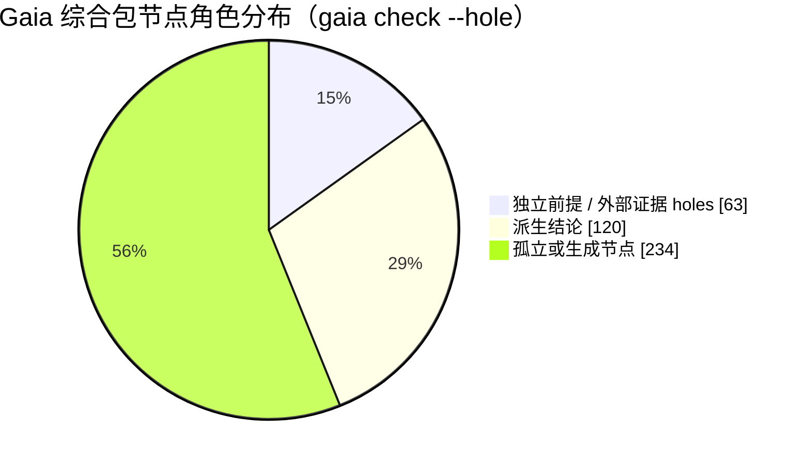
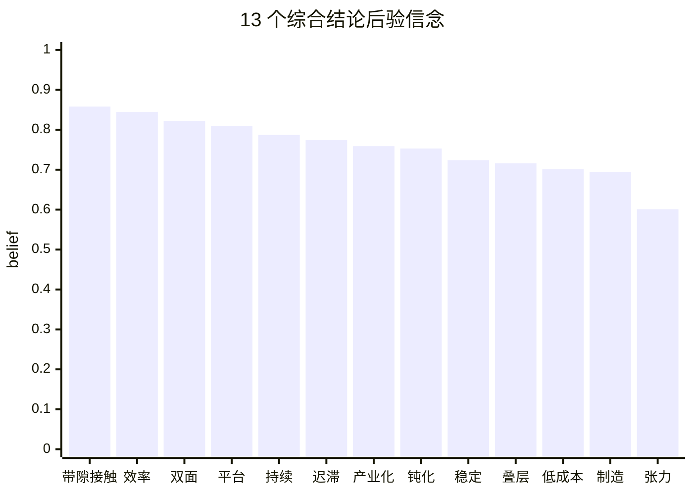
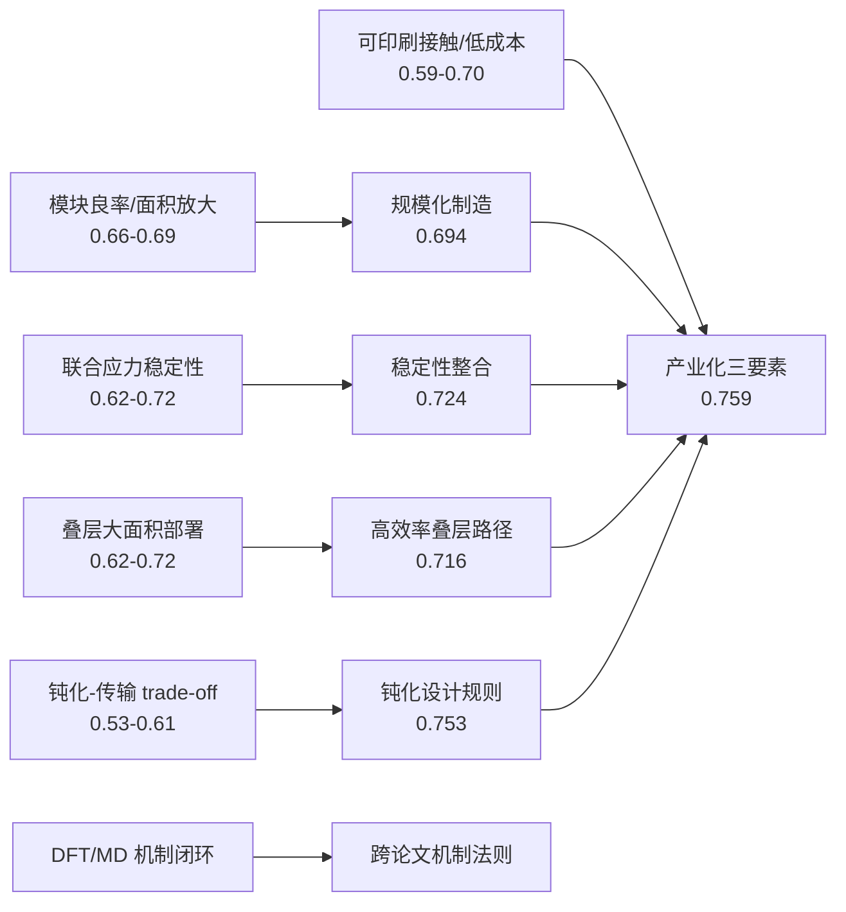
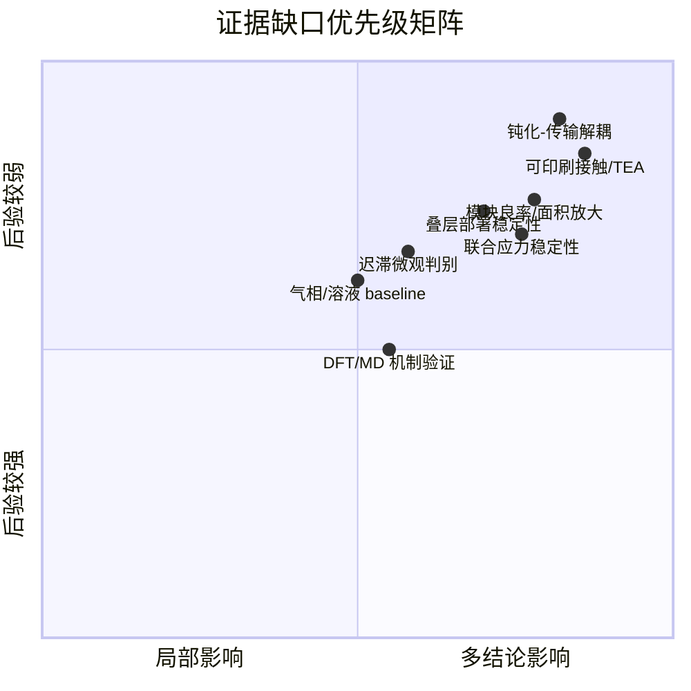
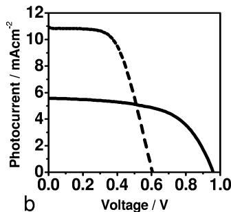
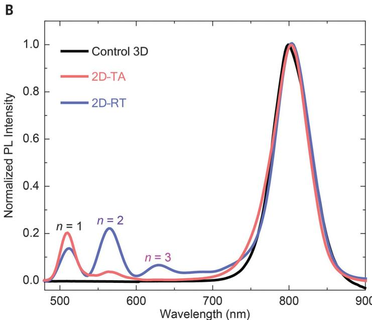
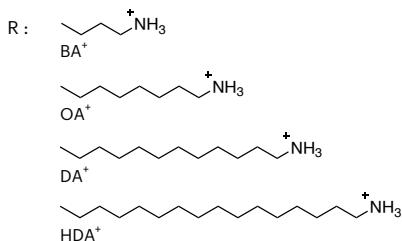

# Gaia + 钙钛矿综合知识包：证据缺口预测研究报告

生成日期：2026-05-20  
分析对象：`/personal/pvsk-gaia-repo/pvsk-gaia` 综合知识包及 `/personal/pvsk-gaia-repo/packages/*-gaia` 中已有 `ANALYSIS.md`。  
核心数据源：`pvsk-gaia/.gaia/ir.json`、`pvsk-gaia/.gaia/beliefs.json`、`pvsk-gaia/docs/public/data/graph.json`、5 份单篇 `ANALYSIS.md`、综合包 `README.md` 和 `wiki/Inference-Results.md`。

## 执行摘要

这个综合包已经能指出“下一步最需要补实验”的位置。最值得补证据的不是单纯最高效率，而是低成本制造、规模化良率、联合应力稳定性、钝化-传输 trade-off、叠层大面积部署和 DFT/MD 机制闭环。综合包的 13 个 final conclusions 中，强项集中在带隙/接触工程、效率演进和双面模块价值；弱项集中在机制张力条件解析、规模化制造、低成本路径、叠层部署和稳定性整合。

关键判断如下：

- `synthesis_bandgap_and_contact_engineering_define_tradeoff_space` 后验最高，为 0.858，说明跨论文证据已经稳定支持“带隙-接触-Voc/Jsc/FF 耦合”的设计空间。
- `synthesis_mechanistic_tensions_are_conditionally_resolved` 后验最低，为 0.601，说明当前图能表达张力，但还缺直接判别实验来把条件边界钉牢。
- 低成本路径 `synthesis_low_cost_path_depends_on_printable_contacts` 为 0.701，规模化制造 `synthesis_scalable_manufacturing_is_demonstrated` 为 0.694；这两个结论比效率结论低，主要因为缺少“产线良率-吞吐量-寿命-封装-TEA”联动数据。
- `gaia check --hole .` 在 depth 0 视角下报告 63 个 independent premises 没有本地 prior；这些多数是直接导入的外部 paper-level claims。综合包 README 已说明正确推理使用 `gaia infer . --depth 1`，因此这些不一定要在综合包里手工加 prior，但它们暴露了“单独运行综合层时外部证据依赖很重”的结构事实。

## 数据快照

| 指标 | 值 |
|---|---:|
| Gaia knowledge nodes | 417 |
| Strategies | 163 |
| Operators | 0 |
| Inference beliefs | 278 |
| Generated graph nodes | 346 |
| Generated graph edges | 638 |
| Exported final conclusions | 13 |
| BP convergence | Yes |
| BP iterations | 134 |

> 注：这里的 “holes” 是 `gaia check --hole .` 的本地检查结果；综合包当前设计依赖 `--depth 1` 把直接依赖包的信念并入推理，而不是在综合包里重复给 paper-level claims 写 prior。

## 13 个综合结论的后验信念

| Final conclusion | Belief | 解释 |
|---|---:|---|
| `synthesis_bandgap_and_contact_engineering_define_tradeoff_space` | 0.858 | Bandgap and contact engineering define the trade-off space |
| `synthesis_efficiency_progression_is_interface_driven` | 0.845 | Efficiency progression is interface and architecture driven |
| `synthesis_bifacial_modules_add_system_value` | 0.822 | Bifacial modules add system-level value |
| `synthesis_perovskites_are_validated_pv_platform` | 0.810 | Perovskites are a validated photovoltaic platform |
| `synthesis_perovskites_have_sustained_improvement_pathways` | 0.787 | Perovskites have sustained technical improvement pathways |
| `synthesis_hysteresis_is_practically_suppressed` | 0.774 | Hysteresis is practically suppressible |
| `synthesis_industrialization_requires_three_way_alignment` | 0.759 | Industrialization requires efficiency-stability-scale alignment |
| `synthesis_passivation_is_general_design_rule` | 0.753 | Passivation is a general design rule |
| `synthesis_stability_requires_integrated_control` | 0.724 | Stability requires integrated control |
| `synthesis_tandems_are_primary_high_efficiency_path` | 0.716 | Tandems are the primary high-efficiency path |
| `synthesis_low_cost_path_depends_on_printable_contacts` | 0.701 | Low-cost path depends on printable contacts |
| `synthesis_scalable_manufacturing_is_demonstrated` | 0.694 | Scalable manufacturing is demonstrated across routes |
| `synthesis_mechanistic_tensions_are_conditionally_resolved` | 0.601 | Mechanistic tensions are conditionally resolved |

读法：0.85 左右的结论可视为跨论文证据已经较稳；0.60-0.72 的结论不是“不成立”，而是模型认为它们仍依赖条件边界、外推或产业化数据。

## 最弱但最有信息量的节点

这些是综合层本地节点中后验最低的部分。它们是最直接的“补证据候选”。

| Node | Belief | Downstream uses | Incoming supports | 含义 |
|---|---:|---:|---:|---|
| `tension_passivation_transport_tradeoff_is_conditional` | 0.533 | 1 | 5 | Passivation-transport trade-off is conditional |
| `tension_conventional_vs_dipolar_buried_passivation` | 0.571 | 1 | 2 | Conventional and dipolar buried passivation differ by target mechanism |
| `passivation_may_hurt_ff_if_it_blocks_extraction` | 0.584 | 3 | 4 | Passivation may hurt FF if it blocks extraction |
| `printable_contacts_reduce_capex_but_require_lifetime_validation` | 0.594 | 1 | 4 | Printable contacts reduce capex but require lifetime validation |
| `cost_projection_depends_on_yield_lifetime_and_throughput` | 0.597 | 3 | 5 | Cost projection depends on yield, lifetime, and throughput |
| `planar_vs_mesoporous_is_process_conditioned` | 0.597 | 1 | 3 | Planar versus mesoporous is process-conditioned |
| `synthesis_mechanistic_tensions_are_conditionally_resolved` | 0.601 | 0 | 10 | Mechanistic tensions are conditionally resolved |
| `effective_passivation_requires_defect_reduction_without_transport_penalty` | 0.603 | 3 | 4 | Effective passivation avoids a transport penalty |
| `passivation_vs_transport_is_conditional` | 0.610 | 2 | 3 | Passivation versus transport is conditional |
| `passivation_improves_tandem_voltage_retention` | 0.618 | 2 | 4 | Passivation improves tandem voltage retention |
| `tandem_deployment_still_depends_on_scalable_stability` | 0.621 | 2 | 5 | Tandem deployment still depends on scalable stability |
| `hysteresis_suppression_does_not_identify_single_microscopic_cause` | 0.625 | 2 | 4 | Hysteresis suppression does not identify a single cause |
| `tension_planar_vs_meso_is_process_dependent` | 0.629 | 1 | 3 | Planar versus mesoporous preference is process-dependent |
| `throughput_and_material_utilization` | 0.631 | 2 | 4 | Throughput and material-utilization evidence |

下面是低/中等 belief 但影响多个下游结论的节点。优先补这类节点，通常比补一个孤立高置信性能点更能提升整张图的信息增益。

| Node | Belief | Downstream uses | Incoming supports | 含义 |
|---|---:|---:|---:|---|
| `scalable_manufacturing_requires_uniformity_yield_and_encapsulation` | 0.666 | 5 | 4 | Scalable manufacturing requires uniformity, yield, and encapsulation |
| `area_normalized_performance` | 0.682 | 4 | 4 | Area-normalized performance evidence |
| `bandgap_contact_coupling_controls_voc_jsc_ff_tradeoff` | 0.687 | 4 | 5 | Bandgap-contact coupling controls Voc-Jsc-FF trade-off |
| `passivation_benefit_is_conditioned_on_preserved_charge_extraction` | 0.689 | 4 | 4 | Passivation benefit is conditioned on charge extraction |
| `encapsulation_and_lifetime_requirements` | 0.716 | 4 | 4 | Encapsulation and lifetime requirements |
| `passivation_may_hurt_ff_if_it_blocks_extraction` | 0.584 | 3 | 4 | Passivation may hurt FF if it blocks extraction |
| `cost_projection_depends_on_yield_lifetime_and_throughput` | 0.597 | 3 | 5 | Cost projection depends on yield, lifetime, and throughput |
| `effective_passivation_requires_defect_reduction_without_transport_penalty` | 0.603 | 3 | 4 | Effective passivation avoids a transport penalty |
| `sustained_improvement_comes_from_reusable_design_axes` | 0.664 | 3 | 5 | Sustained improvement comes from reusable design axes |
| `record_efficiency_vs_module_scaling_is_not_automatic` | 0.665 | 3 | 5 | Record efficiency versus module scaling is not automatic |
| `module_yield_and_reproducibility` | 0.671 | 3 | 4 | Module yield and reproducibility evidence |
| `ion_migration_contributes_to_hysteresis` | 0.677 | 3 | 3 | Ion migration contributes to hysteresis |

## 证据优先级总览

| Priority | 证据缺口主题 | 相关 belief 范围 | 关键 Gaia 节点 |
|---:|---|---:|---|
| 1 | 可印刷接触与低成本制造 | 0.594-0.701 | `printable_contacts_reduce_capex_but_require_lifetime_validation`, `cost_projection_depends_on_yield_lifetime_and_throughput`, `throughput_and_material_utilization`, `synthesis_low_cost_path_depends_on_printable_contacts` |
| 2 | 钝化收益与电荷传输惩罚的分离 | 0.533-0.610 | `tension_passivation_transport_tradeoff_is_conditional`, `passivation_may_hurt_ff_if_it_blocks_extraction`, `effective_passivation_requires_defect_reduction_without_transport_penalty`, `passivation_vs_transport_is_conditional` |
| 3 | 面积放大、批量良率与封装后的模块证据 | 0.665-0.694 | `module_yield_and_reproducibility`, `area_normalized_performance`, `record_efficiency_vs_module_scaling_is_not_automatic`, `scalable_manufacturing_requires_uniformity_yield_and_encapsulation`, `synthesis_scalable_manufacturing_is_demonstrated` |
| 4 | 联合应力和户外相关稳定性 | 0.621-0.724 | `stability_under_single_stressor_does_not_guarantee_field_stability`, `encapsulation_and_lifetime_requirements`, `synthesis_stability_requires_integrated_control`, `tandem_deployment_still_depends_on_scalable_stability` |
| 5 | 全钙钛矿叠层的大面积稳定部署 | 0.621-0.716 | `bandgap_tunability_enables_current_matching`, `tandem_performance_requires_bandgap_matching_and_low_loss_contacts`, `tandem_deployment_still_depends_on_scalable_stability`, `synthesis_tandems_are_primary_high_efficiency_path` |
| 6 | DFT/MD 机制的直接实验验证 | 0.884-0.999 | `deep_in_gap_states_eliminated`, `diffusion_length_increased_threefold`, `law_interface_passivation_reduces_nonradiative_loss` |
| 7 | 迟滞微观起源与离子迁移判别 | 0.625-0.774 | `hysteresis_suppression_does_not_identify_single_microscopic_cause`, `tension_hysteresis_has_multiple_sources`, `ion_migration_links_hysteresis_and_stability`, `synthesis_hysteresis_is_practically_suppressed` |
| 8 | 早期液态/固态、气相/溶液路线的可比基线 | 0.597-0.966 | `planar_vs_mesoporous_is_process_conditioned`, `solution_vs_vapor_deposition_is_scale_quality_tradeoff`, `tension_planar_vs_meso_is_process_dependent`, `vapour_deposition_enables_uniform_films` |

## 详细证据缺口和实验建议

### 1. 可印刷接触与低成本制造

**相关节点：** `printable_contacts_reduce_capex_but_require_lifetime_validation` (0.594), `cost_projection_depends_on_yield_lifetime_and_throughput` (0.597), `throughput_and_material_utilization` (0.631), `synthesis_low_cost_path_depends_on_printable_contacts` (0.701)

**为什么这里像证据缺口：** 低成本结论受寿命、产线良率、吞吐量和材料利用率共同限制；当前是成本模型和单项工艺演示强于长期量产数据。

**建议补的实验证据：** R2R 或片式中试批量 n>=30 的器件/小模组；报告线速度、节拍、良率、材料利用率、废品率、封装良率；同一批次做 1000-3000 h MPP、85/85 damp heat、热循环后的电极/界面失效分析；同步给出 TEA 敏感性表。

**预计对 Gaia 图的影响：** 会直接抬升低成本路径、规模化制造和产业化三类结论，尤其是 printable_contacts 与 cost_projection 两个低信念节点。

### 2. 钝化收益与电荷传输惩罚的分离

**相关节点：** `tension_passivation_transport_tradeoff_is_conditional` (0.533), `passivation_may_hurt_ff_if_it_blocks_extraction` (0.584), `effective_passivation_requires_defect_reduction_without_transport_penalty` (0.603), `passivation_vs_transport_is_conditional` (0.610)

**为什么这里像证据缺口：** 综合包已经把“钝化有益”和“钝化可能挡住抽取”拆开，但最低信念节点集中在这个条件性张力上。

**建议补的实验证据：** 同一底层膜、同一 HTL/ETL 下做 passivator 厚度/偶极矩/链长矩阵；同时测 Voc、FF、EQE_EL、Suns-Voc、TPV/TPC、TRPL、接触电阻、KPFM 或 UPS；用交叉器件结构验证缺陷钝化与传输势垒是否可解耦。

**预计对 Gaia 图的影响：** 会强化 passivation_is_general_design_rule，同时避免把钝化做成单向正效应；也会提高效率、迟滞和稳定性相关路径的可解释性。

### 3. 面积放大、批量良率与封装后的模块证据

**相关节点：** `module_yield_and_reproducibility` (0.671), `area_normalized_performance` (0.682), `record_efficiency_vs_module_scaling_is_not_automatic` (0.665), `scalable_manufacturing_requires_uniformity_yield_and_encapsulation` (0.666), `synthesis_scalable_manufacturing_is_demonstrated` (0.694)

**为什么这里像证据缺口：** 单片冠军效率与模块制造之间不是自动外推；图中相关节点信念集中在 0.66-0.69。

**建议补的实验证据：** >=100 cm2 aperture 模块和 20x20/30x30 cm 小模组的批量统计；每批 n>=30，报告 PCE 分布、MPP/QSS、死区面积、串联互联损耗、薄膜均匀性、EL/PL 失效热图和封装后复测。

**预计对 Gaia 图的影响：** 会提高 scalable manufacturing、industrialization、deployment value 三条路径，并降低“record-to-module”外推风险。

### 4. 联合应力和户外相关稳定性

**相关节点：** `stability_under_single_stressor_does_not_guarantee_field_stability` (0.702), `encapsulation_and_lifetime_requirements` (0.716), `synthesis_stability_requires_integrated_control` (0.724), `tandem_deployment_still_depends_on_scalable_stability` (0.621)

**为什么这里像证据缺口：** 综合包明确说单一热/湿/光/偏压应力不能代表现场寿命；稳定性结论低于效率结论。

**建议补的实验证据：** 光照+偏压+温度+湿度的联合 MPP 老化；IEC 61215 子测试与连续 MPP 同步；户外实测至少跨季节，记录光谱、温度、湿度、风冷/封装条件；报告 T80/T95 与失效模式。

**预计对 Gaia 图的影响：** 会把稳定性从“单项 stress 证据”提升为“部署相关证据”，对产业化和叠层部署结论影响最大。

### 5. 全钙钛矿叠层的大面积稳定部署

**相关节点：** `bandgap_tunability_enables_current_matching` (0.645), `tandem_performance_requires_bandgap_matching_and_low_loss_contacts` (0.660), `tandem_deployment_still_depends_on_scalable_stability` (0.621), `synthesis_tandems_are_primary_high_efficiency_path` (0.716)

**为什么这里像证据缺口：** 叠层高效率路径可信，但部署条件仍依赖带隙匹配、低损耗接触和大面积长期稳定性。

**建议补的实验证据：** 单片叠层面积从 0.05 cm2 到 >1 cm2、>10 cm2 的同配方放大矩阵；WBG/NBG 厚度与带隙匹配矩阵；互连层损耗预算；封装叠层 1000-3000 h MPP 和热循环后的子电池分解诊断。

**预计对 Gaia 图的影响：** 主要抬升 tandem 路径和 industrialization 路径，减少“高效率不等于可部署”的条件性。

### 6. DFT/MD 机制的直接实验验证

**相关节点：** `deep_in_gap_states_eliminated` (0.995), `diffusion_length_increased_threefold` (0.999), `law_interface_passivation_reduces_nonradiative_loss` (0.884)

**为什么这里像证据缺口：** 若干单篇 ANALYSIS 指出 DFT/MD 预测、结合能、缺陷态消除和扩散长度是间接支持；置信度可能高，但机制证据仍需要闭环。

**建议补的实验证据：** operando/angle-resolved XPS、UPS、ssNMR、GIWAXS/GIXRD、DLTS、TAS、ToF-SIMS 或 STEM/EELS；对照 DFT 预测的分子覆盖、缺陷态密度、Sn/Pb vacancy 标志和能级偏移；扩散长度用 EBIC、TRMC 或空间分辨 PL 直接验证。

**预计对 Gaia 图的影响：** 会增强“为什么有效”的机制节点，而不只是增强器件性能节点；对跨论文归纳法则更关键。

### 7. 迟滞微观起源与离子迁移判别

**相关节点：** `hysteresis_suppression_does_not_identify_single_microscopic_cause` (0.625), `tension_hysteresis_has_multiple_sources` (0.644), `ion_migration_links_hysteresis_and_stability` (0.637), `synthesis_hysteresis_is_practically_suppressed` (0.774)

**为什么这里像证据缺口：** 图中支持“实践上可抑制迟滞”，但没有把单一微观原因锁死。

**建议补的实验证据：** 扫描速率/预偏压/温度依赖 J-V，阻抗谱，KPFM，operando PL/EL，离子迁移 tracer 或 ToF-SIMS 深度剖面；同栈比较界面复合、铁电/离子和电容贡献。

**预计对 Gaia 图的影响：** 会把“实用抑制”推进为“机制可判别”，同时服务稳定性和界面设计结论。

### 8. 早期液态/固态、气相/溶液路线的可比基线

**相关节点：** `planar_vs_mesoporous_is_process_conditioned` (0.597), `solution_vs_vapor_deposition_is_scale_quality_tradeoff` (0.726), `tension_planar_vs_meso_is_process_dependent` (0.629), `vapour_deposition_enables_uniform_films` (0.966)

**为什么这里像证据缺口：** 早期和 2013 Nature 分析都提示部分比较受基线优化程度、针孔/短路机制和工艺上下文影响。

**建议补的实验证据：** 同一组成、同一面积、同一后处理的气相 vs 溶液、平面 vs 介孔对照；报告 pinhole 密度、shunt map、批量分布、厚度均匀性和稳定性；避免用未优化 baseline 夸大路线差异。

**预计对 Gaia 图的影响：** 会使过程路线张力由“条件性解释”变成更稳定的工艺设计规则。

## 单篇 ANALYSIS.md 中已经暴露的 gap

| 包 | 结构/推理摘要 | 已写出的 weak points / gaps |
|---|---|---|
| `pvsk2009-gaia` | 45 claims、18 strategies、信息增益 4.4 bits；所有派生结论 >0.5。 | 耐久性机理未表征；量子限域判断间接；导带位置来自吸收边推算；效率里程碑链条较深。 |
| `pvsknature12509-gaia` | 103 nodes、25 support strategies；`vapour_vs_solution_fom_comparison` 是 6-premise flat support。 | 扩散长度只有下界；缺少寿命/降解数据；溶液 baseline 可能未优化；pinholes/shunt 机制未完全闭合。 |
| `pvsks41560-024-01667-8-gaia` | 106 nodes、21 strategies；所有 strategy 使用 generic `prior=0.5`；74 orphaned claims。 | 大量孤立 claims；中间链条压低 large-area/champion conclusions；需要把大型模块、稳定性和效率链条拆得更有解释力。 |
| `pvsks41586-021-04372-8-gaia` | 58 nodes、6 strategies；DFT/MD 与器件性能链条强，但 45 orphaned claims。 | DFT 机制未独立实验验证；MD 单元尺寸代表性有限；扩散长度来自 mobility/lifetime 间接计算。 |
| `pvskscience.abm5784-gaia` | 66 nodes、25 strategies、信息增益 2.1 bits；稳定性和性能结论很强。 | `moisture_oxygen_barrier` 较弱且证据间接；dual-function passivation 的两个贡献未定量分离；57 orphaned claims。 |

这些单篇 `ANALYSIS.md` 与综合包推理相互吻合：早期包指出耐久性和能级/扩散长度的间接性；2013 Nature 包指出气相/溶液 baseline 与寿命缺口；近期 passivation/tandem 包指出 DFT/MD 和扩散长度的机制验证缺口；大面积模块包指出 generic priors、orphan claims 和大型模块链条压低了结论。

## 图像证据索引

以下图片均来自本地 `packages/*/artifacts/images`，可作为报告阅读时的原始文献图像锚点。它们不是新实验结果，而是帮助定位当前证据类型和缺口。

| 证据轴 | 本地图片 | 关联 gap |
|---|---|---|
| 早期 IPCE/J-V 和耐久性起点 |  | 早期耐久性机理、能级间接推算 |
| 2D passivation 的水氧阻隔证据 |  | moisture/oxygen barrier 仍需直接和定量分离 |
| CF3-PA 叠层 MPP 稳定性 |  | 叠层部署稳定性从 600 h 推到 field-relevant 寿命 |
| 大面积/可扩展 2D 相工程 |  | 大面积模块链条、generic priors、批量良率 |
| Dipolar passivation 下扩散长度/迁移率 |  | 扩散长度直接测量、钝化-传输解耦 |
| R2R printable manufacturing |  | 产线吞吐量、材料利用率、寿命和成本模型闭环 |

## 对 Gaia 包本身的改进建议

1. **不要简单把 63 个 holes 都当成要加本地 prior。** 它们主要是直接依赖包的独立 claims；综合包的正确推理模式是 `gaia infer . --depth 1`。如果希望综合包在 depth 0 也可独立解释，可以增加一个说明文件或自动导入 dependency beliefs，而不是重复写一套 priors。
2. **给低置信度张力节点增加“反事实/对照实验”子节点。** 例如 `passivation_may_hurt_ff_if_it_blocks_extraction` 应拆成“缺陷态减少”“接触势垒增加”“FF 损失”三个可测节点，避免一个 support 同时承载机制和性能。
3. **把 R2R/cost 相关节点从模型预测拆成可观测生产数据。** `cost_projection_depends_on_yield_lifetime_and_throughput` 应连接到 yield、throughput、material utilization、encapsulation survival、electrode lifetime 等独立观测节点。
4. **把稳定性条件标准化。** 当前图已经区分 phase/interface/ion/humidity/operational/encapsulated axes；下一步应为每个稳定性 claim 增加 stress protocol 元数据：光强、温度、湿度、偏压、封装、气氛、面积、T80/T95 定义。
5. **单篇包的 orphaned claims 需要二次整理。** 有些 orphaned 是方法背景，不必全部接入；但 pvsks41560-024、pvsks41586-021 和 abm5784 的 ANALYSIS 都显示有大量可用表征信息没有进入推理链。建议优先接入与 gap 直接相关的表征和批量统计，而不是追求所有 claim 全连接。

## 建议的下一轮实验路线图

| 阶段 | 目标 | 最小数据包 | 对应 Gaia 更新 |
|---|---|---|---|
| 1 | 关闭钝化-传输 trade-off | 同栈厚度/偶极/链长矩阵 + Voc/FF/EQE_EL/TRPL/KPFM/接触电阻 | 新增 defect-reduction、barrier-penalty、extraction-preserved 三类节点 |
| 2 | 关闭低成本/R2R 路径 | n>=30 批量 R2R 数据 + 良率/吞吐/材料利用率 + 老化后电极失效 | 拆分 cost_projection 和 printable_contacts 节点 |
| 3 | 关闭模块放大外推 | >=100 cm2 模块批量统计 + EL/PL 均匀性 + MPP/QSS | 强化 area_normalized_performance 和 module_yield 节点 |
| 4 | 关闭 field-relevant 稳定性 | 联合光/热/湿/偏压 MPP + 户外跨季节监测 | 强化 stability_integrated 和 tandem_deployment 节点 |
| 5 | 关闭 DFT/MD 机制 | operando spectroscopy + direct defect-state probes + direct diffusion length | 强化 mechanism law nodes，减少“器件表现代替机制验证”的风险 |

## 结论

这个 Gaia + PVSK 综合包已经可以作为“实验规划雷达”使用。它的强结论说明钙钛矿 PV 的核心技术路径并不缺效率故事：带隙/接触、界面复合、叠层效率和双面模块价值都有较强支撑。真正需要补实验的是把这些路径从“可展示”推进到“可放大、可长期运行、可定量降本、机制可判别”。

最优先补的证据是三类联动数据：第一，钝化同时提升 Voc/FF 且不牺牲抽取的直接解耦实验；第二，R2R/可印刷接触的寿命-良率-吞吐量-TEA 联合数据；第三，大面积封装模块和叠层在联合应力下的长期 MPP 数据。这三类数据会同时提高低成本、制造、稳定性、叠层部署和产业化结论，而不是只修补单个局部 claim。
