# pvsk2009-gaia

> **Original work:** Kojima, A., Teshima, K., Shirai, Y., & Miyasaka, T. "Organometal Halide Perovskites as Visible-Light Sensitizers for Photovoltaic Cells." *Journal of the American Chemical Society* 131, 6050-6051 (2009). [DOI: 10.1021/ja809598r](https://doi.org/10.1021/ja809598r)

<!-- badges:start -->

<!-- badges:end -->

> [!NOTE]
> This README is an AI-generated analysis based on a [Gaia](https://github.com/SiliconEinstein/Gaia) reasoning graph formalization of the original work. Belief values reflect the graph's probabilistic assessment of each claim's support, not the original authors' confidence. See [ANALYSIS.md](ANALYSIS.md) for detailed verification results.

## Overview

Kojima et al. (2009) report the first application of organometal halide perovskites (CH3NH3PbX3, X = Br, I) as visible-light sensitizers for photovoltaic cells. The work addresses the fundamental limitation of organic sensitizers—low absorption coefficients and narrow absorption bands—that had constrained the efficiency of dye-sensitized solar cells despite their promise for low-cost fabrication. By depositing nanocrystalline CH3NH3PbX3 particles onto mesoporous TiO2 through a self-organization process, the authors demonstrate power conversion efficiency of 3.81% with CH3NH3PbI3 and a notably high open-circuit voltage (Voc) of 0.96 V with CH3NH3PbBr3. The iodide cell achieves short-circuit current density (Jsc) of 11.0 mA/cm2—twice that of the bromide cell—while the bromide cell's higher Voc exceeds the maximal Voc previously achieved with Ru complex sensitizers (0.86–0.93 V). The valence-band levels at 5.38–5.44 eV and conduction-band levels at 3.36–4.0 eV enable efficient electron injection to TiO2 (4.0 eV), confirming that the perovskite sensitization mechanism operates through favorable energy band alignment.

> [!TIP]
> **Reasoning graph information gain: `4.4 bits`**
>
> Total mutual information between leaf premises and exported conclusions — measures how much the reasoning structure reduces uncertainty about the results.

```mermaid
---
config:
  flowchart:
    rankSpacing: 80
    nodeSpacing: 30
---
graph TB
    perovskite_sensitization_demonstrated["★ Perovskite sensitization of TiO2 for visible-light conversion\n(0.85 → 0.85)"]:::exported
    iodide_cell_efficiency["★ CH3NH3PbI3 cell efficiency 3.81%\n(0.50 → 0.71)"]:::exported
    bromide_cell_high_voltage["★ CH3NH3PbBr3 cell Voc 0.96 V\n(0.50 → 0.71)"]:::exported
    bromide_cubic_structure["★ CH3NH3PbBr3 cubic perovskite structure\n(0.88 → 0.88)"]:::exported
    iodide_tetragonal_structure["★ CH3NH3PbI3 tetragonal perovskite structure\n(0.88 → 0.88)"]:::exported
    bromide_ipce_spectrum["★ CH3NH3PbBr3 IPCE spectrum 65% max\n(0.90 → 0.90)"]:::exported
    iodide_ipce_spectrum["★ CH3NH3PbI3 IPCE 45% with extended spectral range to 800 nm\n(0.88 → 0.88)"]:::exported
    photocurrent_generation["★ Anodic photocurrent generation 5-11 mA/cm2\n(0.88 → 0.88)"]:::exported
    bromide_iv_characteristics["★ CH3NH3PbBr3 cell I-V performance\n(0.90 → 0.90)"]:::exported
    iodide_iv_characteristics["★ CH3NH3PbI3 cell I-V performance\n(0.90 → 0.90)"]:::exported
    jsc_comparison["★ Jsc for iodide cell twice that of bromide cell\n(0.50 → 0.70)"]:::exported
    voc_comparison["★ Bromide cell Voc 0.96 V vs iodide cell Voc 0.61 V\n(0.50 → 0.70)"]:::exported
    ru_complex_voc_comparison["★ CH3NH3PbBr3 Voc exceeds Ru complex maximal Voc\n(0.50 → 0.68)"]:::exported
    efficiency_comparison["★ Perovskite efficiency exceeds prior quantum dot sensitizers\n(0.50 → 0.70)"]:::exported
    pv_performance_table["★ Photovoltaic performance summary table\n(0.50 → 0.70)"]:::exported
    efficient_sensitization_confirmation["★ High IPCE confirms efficient TiO2 sensitization by perovskite\n(0.50 → 0.70)"]:::exported
    durability_observation["★ Photocurrent decay observed under continuous irradiation\n(0.50 → 0.72)"]:::exported
    valence_band_levels["★ Perovskite valence band levels\n(0.87 → 0.87)"]:::exported
    conduction_band_levels["★ Perovskite conduction band levels enabling electron injection to TiO2\n(0.50 → 0.69)"]:::exported
    bromide_conduction_band_higher["★ Higher bromide conduction band explains higher Voc\n(0.50 → 0.64)"]:::exported
    bromide_redox_coupling["★ Bromide redox coupling expands photovoltage range\n(0.50 → 0.66)"]:::exported
    quantum_confinement_assessment["★ Quantum confinement effect not dominant\n(0.50 → 0.70)"]:::exported
    bathochromic_shift_explanation["★ Bathochromic shift from bromide to iodide analogous to silver halides\n(0.50 → 0.70)"]:::exported
    charge_separation_mechanism["★ Charge separation mechanism in perovskite-sensitized TiO2\n(0.50 → 0.65)"]:::exported
    conclusion_perovskite_sensitization["★ Perovskite efficiently sensitizes TiO2 for visible-light conversion\n(0.50 → 0.61)"]:::exported
    conclusion_high_voltage["★ Perovskite enables high photovoltages close to 1.0 V\n(0.50 → 0.62)"]:::exported
    efficiency_milestone["★ 3.81% efficiency marks first perovskite-sensitized solar cell\n(0.50 → 0.58)"]:::exported
    strat_0(["infer\n0.20 bits"]):::weak
    bromide_cell_high_voltage --> strat_0
    ru_complex_voc_comparison --> strat_0
    strat_0 --> conclusion_high_voltage
    strat_1(["infer\n0.10 bits"]):::weak
    bromide_cell_high_voltage --> strat_1
    efficiency_comparison --> strat_1
    iodide_cell_efficiency --> strat_1
    perovskite_sensitization_demonstrated --> strat_1
    strat_1 --> efficiency_milestone
    strat_2(["infer\n0.30 bits"]):::weak
    bromide_conduction_band_higher --> strat_2
    strat_2 --> bromide_redox_coupling
    strat_3(["infer\n0.27 bits"]):::weak
    bromide_cubic_structure --> strat_3
    conduction_band_levels --> strat_3
    iodide_tetragonal_structure --> strat_3
    strat_3 --> bromide_conduction_band_higher
    strat_4(["infer\n0.27 bits"]):::weak
    bromide_cubic_structure --> strat_4
    iodide_tetragonal_structure --> strat_4
    strat_4 --> conduction_band_levels
    strat_5(["infer\n0.26 bits"]):::weak
    bromide_ipce_spectrum --> strat_5
    iodide_ipce_spectrum --> strat_5
    strat_5 --> bathochromic_shift_explanation
    strat_6(["infer\n0.26 bits"]):::weak
    bromide_ipce_spectrum --> strat_6
    iodide_ipce_spectrum --> strat_6
    strat_6 --> efficient_sensitization_confirmation
    strat_7(["infer\n0.26 bits"]):::weak
    bromide_ipce_spectrum --> strat_7
    iodide_ipce_spectrum --> strat_7
    strat_7 --> jsc_comparison
    strat_8(["infer\n0.26 bits"]):::weak
    bromide_ipce_spectrum --> strat_8
    iodide_ipce_spectrum --> strat_8
    strat_8 --> quantum_confinement_assessment
    strat_9(["infer\n0.25 bits"]):::weak
    bromide_iv_characteristics --> strat_9
    iodide_iv_characteristics --> strat_9
    strat_9 --> pv_performance_table
    strat_10(["infer\n0.25 bits"]):::weak
    bromide_iv_characteristics --> strat_10
    iodide_iv_characteristics --> strat_10
    strat_10 --> voc_comparison
    strat_11(["infer\n0.29 bits"]):::weak
    conduction_band_levels --> strat_11
    valence_band_levels --> strat_11
    strat_11 --> charge_separation_mechanism
    strat_12(["infer\n0.18 bits"]):::weak
    efficient_sensitization_confirmation --> strat_12
    iodide_cell_efficiency --> strat_12
    perovskite_sensitization_demonstrated --> strat_12
    strat_12 --> conclusion_perovskite_sensitization
    strat_13(["infer\n0.26 bits"]):::weak
    iodide_ipce_spectrum --> strat_13
    iodide_iv_characteristics --> strat_13
    strat_13 --> efficiency_comparison
    strat_14(["infer\n0.23 bits"]):::weak
    perovskite_sensitization_demonstrated --> strat_14
    strat_14 --> bromide_cell_high_voltage
    strat_15(["infer\n0.23 bits"]):::weak
    perovskite_sensitization_demonstrated --> strat_15
    strat_15 --> iodide_cell_efficiency
    strat_16(["infer\n0.20 bits"]):::weak
    photocurrent_generation --> strat_16
    strat_16 --> durability_observation
    strat_17(["infer\n0.30 bits"]):::weak
    voc_comparison --> strat_17
    strat_17 --> ru_complex_voc_comparison

    classDef premise fill:#ddeeff,stroke:#4488bb,color:#333
    classDef exported fill:#d4edda,stroke:#28a745,stroke-width:2px,color:#333
    classDef weak fill:#fff9c4,stroke:#f9a825,stroke-dasharray: 5 5,color:#333
    classDef contra fill:#ffebee,stroke:#c62828,color:#333
```

> [!NOTE]
> **[Per-module reasoning graphs with full claim details →](docs/detailed-reasoning.md)**
>
> 6 Mermaid diagrams (one per section) with every claim, strategy, and belief value.

## Reasoning Structure

### Organometal halide perovskites sensitize TiO2 for visible-light conversion (belief: 0.85)

The central finding of this paper is that nanocrystalline particles of CH3NH3PbX3 (X = Br, I), self-organized on mesoporous TiO2 through a solution-based deposition process, function as effective visible-light sensitizers for photovoltaic cells. The perovskite films change color during formation—colorless to yellow for bromide, yellowish to black for iodide—indicating successful crystallization on the TiO2 surface. X-ray diffraction confirms the perovskite crystal structure: cubic for CH3NH3PbBr3 (a = 5.9 Å) and tetragonal for CH3NH3PbI3 (a = 8.855 Å, c = 12.659 Å). The sensitization is evidenced by high incident photon-to-current conversion efficiency (IPCE) values of 65% (bromide) and 45% (iodide), and by photovoltaic performance under standard AM 1.5 illumination (100 mW/cm2).

**Evidence chains:**
- **IPCE characterization** (weakest link: bromide_ipce_spectrum at 0.90): The IPCE spectra show band-edge absorption characteristic behavior: sharp rise at ~570 nm for bromide with plateau below 520 nm, and extended response to 800 nm for iodide. This directly confirms that TiO2 is being sensitized by the perovskite layer.
- **Photovoltaic performance** (weakest link: iodide_iv_characteristics at 0.90): Power conversion efficiency of 3.81% (iodide) and Voc of 0.96 V (bromide) under AM 1.5 illumination demonstrates functional photovoltaic devices driven by perovskite sensitization.
- **Crystal structure confirmation** (weakest link: bromide_cubic_structure at 0.88): XRD peaks match standard perovskite patterns, confirming the material is correctly identified and not an alternate phase.

### CH3NH3PbI3 achieves 3.81% power conversion efficiency (belief: 0.71)

Under 100 mW/cm2 AM 1.5 simulated sunlight, the CH3NH3PbI3-sensitized cell yields Jsc = 11.0 mA/cm2, Voc = 0.61 V, fill factor (FF) = 0.57, and power conversion efficiency (η) = 3.81%. This efficiency is described by the authors as "significantly higher than those obtained to date with nonorganic sensitizers and quantum dots" including CdS, CdSe, PbS, InP, and InAs. The Jsc of 11.0 mA/cm2 is twice that of the bromide cell (5.57 mA/cm2), reflecting the integrated area of the IPCE spectrum which extends to 800 nm for the iodide cell. The optimal TiO2 film thickness for the iodide cell is 8 μm.

**Evidence chains:**
- **I-V characterization** (weakest link: iodide_iv_characteristics at 0.90): The 3.81% efficiency is directly measured under standard test conditions (solar simulator PEC-L10, AM 1.5, 100 mW/cm2) with 0.238 cm2 effective area and black mask to define illumination region.
- **IPCE integration** (weakest link: iodide_ipce_spectrum at 0.88): The extended spectral response to 800 nm (reflecting the narrower bandgap of iodide vs bromide) contributes to the higher Jsc. The IPCE spectrum area correlates with the measured Jsc.

### CH3NH3PbBr3 achieves Voc of 0.96 V, exceeding Ru complex sensitizers (belief: 0.71)

The bromide cell yields Voc = 0.96 V, notably higher than both the iodide cell (0.61 V) and the maximal Voc of 0.86–0.93 V previously achieved with Ru complex sensitizers and TiO2. The high Voc is attributed to two factors: (1) the higher conduction band of CH3NH3PbBr3 (3.36 eV) relative to CH3NH3PbI3 (4.0 eV) allowing favorable electronic interaction with TiO2 surface conduction-band levels, and (2) the bromide redox couple (Br2/Br−) having a more positive oxidation potential (5.1–5.6 eV) compared to iodide (I2/I−, 4.5–5.0 eV), which expands the achievable photovoltage range.

**Evidence chains:**
- **I-V comparison** (weakest link: bromide_iv_characteristics at 0.90): Voc of 0.96 V is directly measured, surpassing the prior Ru complex benchmark of 0.86–0.93 V.
- **Band level correlation** (weakest link: bromide_conduction_band_higher at 0.64): The higher conduction band of bromide (3.36 eV) vs iodide (4.0 eV) is calculated from optical absorption edges and explains the higher Voc through interaction with TiO2 surface levels.
- **Redox coupling mechanism** (weakest link: bromide_redox_coupling at 0.66): The bromide redox couple's more positive potential expands photovoltage range beyond what iodide-based cells can achieve.

### Crystal structures are cubic (bromide) and tetragonal (iodide) perovskites (belief: 0.88)

X-ray diffraction analysis of CH3NH3PbBr3 on TiO2 shows diffraction peaks at 14.77°, 20.97°, 29.95°, 42.9°, and 45.74°, assigned as (100), (110), (200), (220), and (300) planes of a cubic perovskite structure with lattice constant a = 5.9 Å. CH3NH3PbI3 shows peaks at 14.00° and 28.36° for the (110) and (220) planes of a tetragonal perovskite structure with a = 8.855 Å and c = 12.659 Å. Scanning electron microscopy shows the bromide forms nanosized particles of 2–3 nm on the TiO2 surface.

**Evidence chains:**
- **XRD structural determination** (weakest link: bromide_cubic_structure at 0.88): X-ray diffraction is a well-established technique for crystal structure determination. The peak positions and assignments match standard perovskite patterns, providing high confidence in the structural identification.
- **Particle size from SEM** (weakest link: bromide_particle_size at 0.82): Direct microscopic observation of 2–3 nm particles with calibration from Figure 1b's scale bar (10 nm).

### IPCE spectra demonstrate band-edge absorption and bathochromic shift (belief: 0.70–0.90)

The CH3NH3PbBr3/TiO2 cell shows photocurrent in the visible region (λ < 600 nm) with a sharp rise at ~570 nm and saturation below 520 nm, characteristic of band-gap absorption with maximum IPCE of 65%. The CH3NH3PbI3/TiO2 cell shows lower IPCE (45%) but extended spectral responsivity to λ = 800 nm, reflecting the black color of the electrode. This bathochromic (red) shift by halogen substitution is described as analogous to silver halide ionic crystals. The authors note that quantum confinement effect may not dominate the present system even with 2–3 nm particle sizes, based on the band-edge characteristic behavior of the IPCE spectra.

**Evidence chains:**
- **Direct spectral measurement** (weakest link: bromide_ipce_spectrum at 0.90): IPCE is a direct measurement of photon-to-current conversion efficiency as a function of wavelength, with 65% maximum for bromide.
- **Extended range for iodide** (weakest link: iodide_ipce_spectrum at 0.88): The extension to 800 nm for iodide vs 600 nm cutoff for bromide directly demonstrates the bathochromic shift from halogen substitution.
- **Bathochromic shift explanation** (belief 0.70): The shift is explained by halogen substitution altering the band gap, analogous to silver halides.

### Perovskite valence and conduction band levels enable electron injection (belief: 0.69–0.87)

Photoelectron spectroscopy of spin-coated polycrystalline films shows valence-band levels of CH3NH3PbBr3 and CH3NH3PbI3 at approximately 5.38 and 5.44 eV versus vacuum level, respectively. The conduction-band levels calculated from optical absorption edges are approximately 3.36 eV (bromide) and 4.0 eV (iodide). These values allow electron injection to the TiO2 conduction band (~4.0 eV): the bromide's conduction band (3.36 eV) is below TiO2's conduction band, enabling electron flow, while the iodide's conduction band (4.0 eV) is approximately at the same level as TiO2. The valence bands (5.38–5.44 eV) are more positive than the halide oxidation potentials (5.1–5.6 eV for Br2/Br−, 4.5–5.0 eV for I2/I−), enabling hole transfer to the electrolyte.

**Evidence chains:**
- **Photoelectron spectroscopy** (weakest link: valence_band_levels at 0.87): Direct measurement of valence band levels via photoelectron spectroscopy provides high-confidence electronic structure data.
- **Band alignment calculation** (weakest link: conduction_band_levels at 0.69): Conduction band levels derived from optical absorption edges enable assessment of electron injection feasibility to TiO2. The inference chain from crystal structure to conduction band involves a calculation step (prior=0.5 in DSL) that introduces uncertainty.

### Charge separation mechanism relies on favorable energy band alignment (belief: 0.65)

The efficient sensitization is explained by three factors: (1) favorable energy band alignment allowing electron injection from perovskite conduction band to TiO2, (2) the valence band being more positive than halide oxidation potentials enabling hole transfer to the electrolyte, and (3) strong light absorption by the perovskite film enabling high IPCE values. This mechanism distinguishes perovskite sensitization from both organic sensitizers (limited by low absorption) and quantum dots (suffering from charge separation losses at the interface).

**Evidence chain:**
- **Composite inference from band levels** (belief 0.65): The charge separation mechanism is inferred from both valence band (0.87) and conduction band (0.69) measurements together. The conduction band's moderate belief drags the composite conclusion down.

### Photocurrent decay under continuous irradiation indicates durability concerns (belief: 0.72)

Continuous irradiation caused photocurrent decay for open cells exposed to air. This degradation mechanism is noted as requiring further study to improve cell lifetime. This is a notable weakness in the paper—the authors acknowledge they do not understand the decay mechanism, which limits the practical viability of the technology.

## Conclusions

| Label | Content | Prior | Belief |
|-------|---------|-------|--------|
| bathochromic_shift_explanation | The bathochromic shift (red-shift) of the IPCE spectrum from bromide to iodid... | 0.50 | 0.70 |
| bromide_cell_high_voltage | A CH3NH3PbBr3-based photovoltaic cell achieved a high open-circuit voltage (V... | 0.50 | 0.71 |
| bromide_conduction_band_higher | The conduction band of CH3NH3PbBr3 (approximately 3.36 eV) is higher than tha... | 0.50 | 0.64 |
| bromide_cubic_structure | CH3NH3PbBr3 has a cubic perovskite structure with lattice constant a = 5.9 An... | 0.88 | 0.88 |
| bromide_electrolyte | The CH3NH3PbBr3/TiO2-based cell employed an electrolyte consisting of 0.4 M L... | 0.50 | — |
| bromide_ipce_spectrum | With CH3NH3PbBr3/TiO2, photocurrent occurred in the visible wavelength region... | 0.90 | 0.90 |
| bromide_iv_characteristics | Under 100 mW/cm2 AM 1.5 irradiation, the CH3NH3PbBr3-sensitized cell yielded ... | 0.90 | 0.90 |
| bromide_particle_size | Scanning electron microscopy observation of CH3NH3PbBr3-deposited TiO2 showed... | 0.82 | 0.82 |
| bromide_precursor_synthesis | CH3NH3Br was synthesized from HBr and 40% methylamine in methanol solution fo... | 0.50 | — |
| bromide_redox_coupling | The origin of the high Voc (0.96 V) with CH3NH3PbBr3 is the bromide employed ... | 0.50 | 0.66 |
| cell_construction | The photovoltaic cell was constructed by combining the CH3NH3PbX3/TiO2 electr... | 0.50 | — |
| charge_separation_mechanism | The efficient sensitization is enabled by: (1) favorable energy band alignmen... | 0.50 | 0.65 |
| conclusion_high_voltage | The perovskite materials are especially promising for realizing high photovol... | 0.50 | 0.62 |
| conclusion_perovskite_sensitization | The organolead halide perovskite compounds efficiently sensitize TiO2 for vis... | 0.50 | 0.61 |
| conduction_band_levels | The conduction-band levels calculated from the wavelengths of the optical abs... | 0.50 | 0.69 |
| durability_observation | Continuous irradiation caused photocurrent decay for an open cell exposed to ... | 0.50 | 0.72 |
| dye_sensitized_tiO2_established | Dye-sensitized mesoscopic TiO2 films have been established as high-efficiency... | 0.50 | — |
| efficiency_comparison | The highest power conversion efficiency of 3.81% obtained with CH3NH3PbI3 is ... | 0.50 | 0.70 |
| efficiency_milestone | The demonstration of 3.81% power conversion efficiency with CH3NH3PbI3 repres... | 0.50 | 0.58 |
| efficient_sensitization_confirmation | The anodic photocurrent with high IPCE values (65% for bromide, 45% for iodid... | 0.50 | 0.70 |
| fto_substrate_preparation | Fluorine-doped SnO2 transparent conductive glass (FTO, 10 ohm/sq) was used as... | 0.50 | — |
| future_directions | A series of organic-inorganic perovskite materials CH3NH3MX3 (M = Pb, Sn; X =... | 0.50 | — |
| halide_oxidation_potentials | The valence-band levels of the perovskites are considered to be more positive... | 0.50 | — |
| iodide_cell_efficiency | A CH3NH3PbI3-based photovoltaic cell achieved a power conversion efficiency o... | 0.50 | 0.71 |
| iodide_electrolyte | The CH3NH3PbI3/TiO2-based cell employed an electrolyte consisting of 0.15 M L... | 0.50 | — |
| iodide_ipce_spectrum | The CH3NH3PbI3/TiO2 cell showed a low IPCE of 45% but an extended spectral re... | 0.88 | 0.88 |
| iodide_iv_characteristics | Under 100 mW/cm2 AM 1.5 irradiation, the CH3NH3PbI3-sensitized cell yielded J... | 0.90 | 0.90 |
| iodide_precursor_synthesis | CH3NH3I was synthesized from HI and 40% methylamine in methanol solution foll... | 0.50 | — |
| iodide_tetragonal_structure | CH3NH3PbI3 has a tetragonal perovskite structure with lattice parameters a = ... | 0.88 | 0.88 |
| jsc_comparison | The short-circuit current density (Jsc) for the CH3NH3PbI3-sensitized cell (1... | 0.50 | 0.70 |
| measurement_setup | The sandwich-type open cell had an effective light-exposure area of 0.238 cm2... | 0.50 | — |
| organic_sensitizer_limitations | Organic sensitizers limit light-harvesting ability due to their low absorptio... | 0.82 | 0.82 |
| perovskite_optical_properties | The organometal halide perovskite compounds CH3NH3PbX3 (X = Br, I) have uniqu... | 0.50 | — |
| perovskite_self_organization | Nanocrystalline particles of CH3NH3PbX3 (X = Br, I) were deposited on the TiO... | 0.50 | — |
| perovskite_sensitization_demonstrated | Nanocrystalline perovskite particles (CH3NH3PbX3, X = Br, I) self-organized o... | 0.85 | 0.85 |
| photocurrent_generation | Light irradiation of the photovoltaic cells caused generation of anodic photo... | 0.88 | 0.88 |
| pv_performance_table | Photovoltaic characteristics of perovskite-based cells under 100 mW/cm2 AM 1.... | 0.50 | 0.70 |
| quantum_confinement_assessment | The IPCE spectra suggest that quantum confinement effect may not dominate the... | 0.50 | 0.70 |
| quantum_dot_approach | Researchers have examined quantum dots (CdS, CdSe, PbS, InP, InAs) for photov... | 0.80 | 0.80 |
| research_question | Can organometal halide perovskite compounds serve as effective visible-light ... | 0.50 | — |
| ru_complex_voc_comparison | With Ru complex sensitizers and TiO2, the maximal Voc ever reported is in the... | 0.50 | 0.68 |
| tiO2_mesoporous_film | A mesoporous TiO2 film (n-type semiconductor) was prepared on the above-treat... | 0.50 | — |
| tiO2_thickness_optimization | Maximum short-circuit photocurrent density (Jsc) occurred with 8 um TiO2 thic... | 0.85 | 0.85 |
| valence_band_levels | Photoelectron spectroscopy of spin-coated polycrystalline films showed valenc... | 0.87 | 0.87 |
| voc_comparison | The CH3NH3PbI3-sensitized cell showed a low open-circuit voltage (Voc) of 0.6... | 0.50 | 0.70 |

## Key Findings

The reasoning graph assigns high belief (>0.85) to all directly measured experimental observations — crystal structures (0.88), IPCE spectra (0.88–0.90), I-V characteristics (0.90), and photocurrent generation (0.88). These are the strongest nodes in the graph. The intermediate conclusions about conduction band levels (0.69), charge separation mechanism (0.65), and voltage explanation (0.64–0.66) have moderate belief, reflecting that these involve calculated values and multi-step inference. The capstone conclusions — that perovskites efficiently sensitize TiO2 (0.61) and that 3.81% represents the first perovskite-sensitized solar cell (0.58) — have the lowest derived beliefs, as expected for conclusions at the end of long reasoning chains where uncertainty accumulates multiplicatively.

The most notable finding is that the bromide cell achieved 0.96 V Voc, surpassing the best Ru-complex dyes, while the iodide cell achieved the higher efficiency of 3.81%. This trade-off between voltage and current is explained by the different band structures of the two halide perovskites.

## Weak Points

Weak Points Analysis

**1. Durability mechanism is uncharacterized (durability_observation, belief: 0.72)**

The paper reports photocurrent decay under continuous irradiation for open cells exposed to air, yet provides no mechanistic explanation or pathway to improvement. This is not a hypothesis subject to testing—it is an uncharacterized phenomenon. The belief of 0.72 reflects uncertainty about the practical viability of perovskite solar cells. Many subsequent studies in the field have focused on understanding and addressing this instability, which ultimately limited the commercial potential of early perovskite devices.

**2. Efficiency milestone belief is lowest among conclusions (efficiency_milestone, belief: 0.58)**

The conclusion that "3.81% efficiency marks the first perovskite-sensitized solar cell" has the lowest belief among exported conclusions. This stems from a 4-premise reasoning chain (bromide_cell_high_voltage + efficiency_comparison + iodide_cell_efficiency + perovskite_sensitization_demonstrated → efficiency_milestone) that propagates multiplicative uncertainty. While each individual premise has high belief (0.71–0.85), the chain's information gain is only 0.10 bits — the weakest in the graph. If any premise is later found to be less reliable than assumed, the efficiency milestone conclusion would be significantly impacted.

**3. Conduction band levels are derived from optical absorption edges (conduction_band_levels, belief: 0.69)**

The conduction band levels (3.36 eV for bromide, 4.0 eV for iodide) are calculated from optical absorption edges — a secondary derivation rather than a direct measurement like valence band levels from photoelectron spectroscopy. This introduces additional uncertainty. The claim that these values "allow electron injection to the TiO2 conduction band (~4.0 eV)" depends on the accuracy of this calculation. For iodide (4.0 eV), the alignment with TiO2 (4.0 eV) is borderline and sensitive to the calculation method. This uncertainty propagates to bromide_conduction_band_higher (0.64) and bromide_redox_coupling (0.66).

**4. Quantum confinement assessment is tentative (quantum_confinement_assessment, belief: 0.70)**

The claim that quantum confinement effect "may not dominate" the perovskite system is hedged with "may not" and "if it partially exists." This is not a strong conclusion but rather an observation that the IPCE spectra show band-edge characteristic behavior rather than strongly shifted excitonic features. The 0.70 belief reflects this tentativeness. The actual quantum confinement behavior in these 2–3 nm particles would need further study with more definitive spectroscopic measurements.

**5. The charge separation mechanism is a composite summary (charge_separation_mechanism, belief: 0.65)**

The charge separation mechanism is presented as a conjunction of three factors, but these factors are independently argued elsewhere in the paper. The mechanism claim itself does not add new evidence — it synthesizes existing claims. The belief of 0.65 reflects this derived nature and the uncertainty propagated from the band alignment claims, particularly the conduction band calculation.

## Evidence Gaps & Future Work

Evidence Gaps & Future Work

**Experimental gaps:**
- **Durability mechanism**: The photocurrent decay under continuous irradiation is uncharacterized. Understanding the degradation pathway (oxidation, moisture ingress, ion migration, or other mechanisms) is essential for improving cell lifetime. Accelerated aging tests under controlled conditions (inert atmosphere, humidity, temperature) would identify the failure mode.
- **Particle size distribution**: Only the bromide particle size (2–3 nm) is reported from SEM. The iodide particle size distribution and uniformity should be characterized, as these parameters affect light harvesting and charge transport.
- **Interface characterization**: The perovskite-TiO2 interface is not directly characterized. Understanding the electronic coupling, charge transfer rates, and interface defects would clarify the sensitization mechanism.

**Computational gaps:**
- **Band structure calculations**: The conduction band levels should be verified with density functional theory (DFT) calculations. The borderline alignment between CH3NH3PbI3 (4.0 eV) and TiO2 (4.0 eV) warrants more precise calculation of the actual offset.
- **Optical absorption spectrum**: The optical absorption edges used to derive conduction bands should be precisely measured with UV-visible spectroscopy to verify the bandgap values.

**Theoretical gaps:**
- **Quantum confinement in 2–3 nm particles**: The paper notes quantum confinement "may not dominate" but does not rigorously analyze size-dependent effects. A proper theoretical treatment of quantum confinement in these nanocrystals would clarify whether the observed spectral features are bulk-like or size-dependent.
- **Charge transfer dynamics**: The mechanism description is static (band alignment) without time-resolved spectroscopy to confirm electron injection rates and recombination pathways.

## Detailed Analysis

For structural integrity verification (Pass 5), standalone readability checks (Pass 6),
and complete package statistics, see [ANALYSIS.md](ANALYSIS.md).