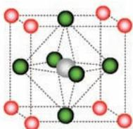
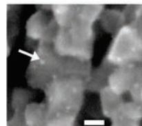
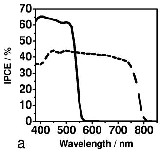

# Organometal Halide Perovskites as Visible-Light Sensitizers for Photovoltaic Cells

Akihiro Kojima,† Kenjiro Teshima,‡ Yasuo Shirai,§ and Tsutomu Miyasaka*,†,‡,|

Graduate School of Arts and Sciences, The Uni ersity of Tokyo, 3-8-1 Komaba, Meguro-ku, Tokyo 153-8902, VJapan, Graduate School of Engineering, Toin Uni ersity of Yokohama, and Peccell Technologies, Inc., 1614 VKurogane-cho, Aoba, Yokohama, Kanagawa 225-8502, Japan, and Graduate School of Engineering, Tokyo Polytechnic Uni ersity, 1583 Iiyama, Atsugi, Kanagawa 243-0297, Japan

Received December 9, 2008; Revised Manuscript Received April 1, 2009; E-mail: miyasaka@cc.toin.ac.jp

Light-energy conversion by photoelectrochemical cells has been extensively studied in the past 50 years using various combinations of inorganic semiconductors and organic sensitizers.1 Dye-sensitized mesoscopic $\mathrm { T i O } _ { 2 }$ films have been established as high-efficiency photoanodes for solar cells.2 As cost-effective devices, dyesensitized photovoltaic cells suit vacuum-free printing processes for cell fabrication; such processes enable researchers to design thin, flexible plastic cells by low-temperature $\mathrm { T i O } _ { 2 }$ coating technology.3 With a thin photovoltaic film, optical management is an important key for harvesting light while ensuring high efficiency. Organic sensitizers often limit light-harvesting ability because of their low absorption coefficients and narrow absorption bands. To overcome this, researchers have examined quantum dots such as CdS,4a,b CdSe,4c-e PbS,4f,g InP,4h and InAs4i for photovoltaic cells in both electrochemical and solid-state structures. Intense bandgap light absorption by these inorganic sensitizers, however, has not allowed high performance in quantum conversion and photovoltaic generation; significant losses in light utilization and/or charge separation are found at the semiconductor sensitizer interface. We -have studied the photovoltaic function of the organic inorganic lead halide perovskite compounds $\mathrm { C H } _ { 3 } \mathrm { N H } _ { 3 } \mathrm { P b B r } _ { 3 }$ and $\mathrm { C H _ { 3 } N H _ { 3 } P b I _ { 3 } }$ as visible-light sensitizers in photoelectrochemical cells. In addition to being synthesized from abundant sources (Pb, C, N, and halogen), these perovskite materials have unique optical properties,5 excitonic properties,6 and electrical conductivity.7 In this report, we show a photovoltaic function of the perovskite nanocrystalline particles selforganized on $\mathrm { T i O } _ { 2 }$ as n-type semiconductors. Solar energy was converted with an efficiency of $3 . 8 \%$ on a $\mathrm { C H _ { 3 } N H _ { 3 } P b I _ { 3 } }$ -based cell, while a high photovoltage of 0.96 V was obtained with a $\mathrm { C H } _ { 3 } \mathrm { N H } _ { 3 } \mathrm { P b B r } _ { 3 }$ -based cell.

Each photoelectrode was prepared on a fluorine-doped $\mathrm { S n O } _ { 2 }$ transparent conductive glass (FTO, $1 0 ~ \Omega / \mathrm { s q }$ , Nippon Sheet Glass) as a substrate, the surface of which had been pretreated by soaking in a 40 mM $\mathrm { T i C l _ { 4 } }$ aqueous solution at $7 0 ~ ^ { \circ } \mathrm { C }$ for $3 0 \ \mathrm { m i n }$ to form a thin $\mathrm { T i O } _ { 2 }$ buffer layer. A mesoporous film of $\mathrm { T i O } _ { 2 }$ (n-type semiconductor) was prepared on the above-treated FTO by coating with a commercial nanocrystalline $\mathrm { T i O } _ { 2 }$ paste (see the Supporting Information) using a screen printer and sintering at $4 8 0 ~ ^ { \circ } \mathrm { C }$ for 1 h in air. The resultant $\mathrm { T i O } _ { 2 }$ film had a thickness of $8 - 1 2 \ \mu \mathrm { m }$ Nanocrystalline particles of $\mathrm { C H _ { 3 } N H _ { 3 } P b } X _ { 3 }$ $( \mathbf { X } \ = \ \mathbf { B } \mathbf { r }$ -, I) were deposited on the $\mathrm { T i O } _ { 2 }$ )surface by a self-organization process starting with the coating of a precursor solution containing stoichiometric amounts of $\mathrm { C H } _ { 3 } \mathrm { N H } _ { 3 } \mathrm { X }$ and $\mathrm { P b } X _ { 2 }$ . $\mathrm { C H } _ { 3 } \mathrm { N H } _ { 3 } \mathrm { B r }$ and $\mathrm { C H } _ { 3 } \mathrm { N H } _ { 3 } \mathrm { I }$ were synthesized from HBr and HI, respectively, by reaction with $40 \%$

methylamine in methanol solution followed by recrystallization. Synthesis of $\mathrm { C H } _ { 3 } \mathrm { N H } _ { 3 } \mathrm { P b B r } _ { 3 }$ on the $\mathrm { T i O } _ { 2 }$ surface was carried out by dropping onto the $\mathrm { T i O } _ { 2 }$ film a 20 wt $\%$ precursor solution of $\mathrm { C H _ { 3 } N H _ { 3 } B r }$ and $\mathrm { P b } { \tt B } \mathrm { r } _ { 2 }$ in N,N-dimethylformamide; subsequent film formation was done by spin-coating.8 For $\mathrm { C H _ { 3 } N H _ { 3 } P b I _ { 3 } }$ , an 8 wt $\%$ precursor solution of $\mathrm { C H } _ { 3 } \mathrm { N H } _ { 3 } \mathrm { I }$ and $\mathrm { P b } { \mathrm { I } } _ { 2 }$ in $\gamma$ -butyrolactone was employed. The liquid precursor film coated on the $\mathrm { T i O } _ { 2 }$ gradually changed color simultaneously with drying, indicating the formation of $\mathrm { C H } _ { 3 } \mathrm { N H } _ { 3 } \mathrm { P b } X _ { 3 }$ in the solid state. A vivid color change from colorless to yellow occurred for $\mathrm { C H } _ { 3 } \mathrm { N H } _ { 3 } \mathrm { P b B r } _ { 3 }$ and from yellowish to black for $\mathrm { C H _ { 3 } N H _ { 3 } P b I _ { 3 } }$ . X-ray diffraction analysis (Rigaku RINT-2500) for $\mathrm { C H } _ { 3 } \mathrm { N H } _ { 3 } \mathrm { P b B r } _ { 3 }$ and $\mathrm { C H _ { 3 } N H _ { 3 } P b I _ { 3 } }$ prepared on $\mathrm { T i O } _ { 2 }$ showed that both materials have crystalline structures that can be assigned to the perovskite form. $\mathrm { C H } _ { 3 } \mathrm { N H } _ { 3 } \mathrm { P b B r } _ { 3 }$ gave diffraction peaks at 14.77, 20.97, 29.95, 42.9, and $4 5 . 7 4 ^ { \circ }$ , assigned as the (100), (110), (200), (220), and (300) planes, respectively, of a cubic perovskite structure with a lattice constant of 5.9 Å.9 $\mathrm { C H _ { 3 } N H _ { 3 } P b I _ { 3 } }$ gave peaks at 14.00 and $2 8 . 3 6 ^ { \circ }$ for the (110) and (220) planes, respectively, of a tetragonal perovskite structure with $a \overset { \cdot } { = } 8 . 8 5 5 \overset { \circ } { \mathrm { ~ A ~ } }$ and $c =$ ) )12.659 Å.9 Scanning electron microscopy (SEM) observation of the $\mathrm { C H } _ { 3 } \mathrm { N H } _ { 3 } \mathrm { P b B r } _ { 3 }$ -deposited $\mathrm { T i O } _ { 2 }$ showed nanosized particles $( 2 - 3$ nm) that existed here and there on the $\mathrm { T i O } _ { 2 }$ and/or $\mathrm { C H } _ { 3 } \mathrm { N H } _ { 3 } \mathrm { P b B r } _ { 3 }$ surface (Figure 1).

  
a

Ammoniumion

Halogenion

Leadion

  
Figure 1. (a) Crystal structures of perovskite compounds. (b) SEM image of particles of nanocrystalline $\mathrm { C H } _ { 3 } \mathrm { N H } _ { 3 } \mathrm { P b B r } _ { 3 }$ deposited on the $\mathrm { T i O } _ { 2 }$ surface. The arrow indicates a particle, and the scale bar shows $1 0 ~ \mathrm { { n m } }$ .

A photovoltaiccellwasconstructed bycombiningthe $\mathrm { C H _ { 3 } N H _ { 3 } P b } X _ { 3 } .$ deposited $\mathrm { T i O } _ { 2 }$ electrode $\mathrm { ( C H _ { 3 } N H _ { 3 } P b X _ { 3 } / T i O _ { 2 } ) }$ as the photoelectrode (anode) and a Pt-coated FTO glass as the counter electrode (cathode) with insertion of a $5 0 \ \mu \mathrm { m }$ thick separator film. The gap between the electrodes was filled with an organic electrolyte solution containing lithium halide and halogen as a redox couple; the $\mathrm { C H _ { 3 } N H _ { 3 } P b B r _ { 3 } / T i O _ { 2 } } .$ -based cell employed an electrolyte consisting of $0 . 4 \mathrm { { M } }$ LiBr and 0.04 M $\mathrm { B r } _ { 2 }$ dissolved in acetonitrile, while the $\mathrm { C H _ { 3 } N H _ { 3 } P b I _ { 3 } / T i O _ { 2 } }$ -based cell employed $0 . 1 5 \mathrm { ~ M ~ }$ LiI and 0.075 M $\mathrm { I } _ { 2 }$ dissolved in methoxyacetonitrile. A sandwich-type open cell had an effective light-exposure area of $0 . 2 3 8 ~ \mathrm { c m } ^ { 2 }$ with the use of a black mask. Incident photon-to-current quantum conversion efficiency (IPCE) and photocurrent voltage $( I { - } V )$ performance were measured on an action spectrum measurement setup (PEC-S20) and

a solar simulator (PEC-L10, Peccell Technologies), respectively, the latter irradiating simulated sunlight of AM 1.5 and $1 0 0 ~ \mathrm { m W } /$ $\mathrm { c m } ^ { 2 }$ intensity.

Light irradiation of the photocells caused generation of anodic photocurrents with amplitudes of $5 { - } 1 1 \mathrm { m A } / \mathrm { c m } ^ { 2 }$ . After optimization of the average $\mathrm { T i O } _ { 2 }$ -thickness for short-circuit photocurrent density $( J _ { \mathrm { s c } } )$ , the maximum $J _ { \mathrm { s c } }$ occurred with $8 \ : \mu \mathrm { m }$ for $\mathrm { C H _ { 3 } N H _ { 3 } P b I _ { 3 } / T i O _ { 2 } }$ and $1 2 \ \mu \mathrm { m }$ for $\mathrm { C H _ { 3 } N H _ { 3 } P b B r _ { 3 } / T i O _ { 2 } }$ . Figure 2a compares action spectra of the IPCE for the photocells based on $\mathrm { C H _ { 3 } N H _ { 3 } P b B r _ { 3 } } /$ $\mathrm { T i O } _ { 2 }$ and $\mathrm { C H _ { 3 } N H _ { 3 } P b I _ { 3 } / T i O _ { 2 } }$ . With $\mathrm { C H _ { 3 } N H _ { 3 } P b B r _ { 3 } / T i O _ { 2 } }$ , the photocurrent occurred in the visible wavelength region $( \lambda < 6 0 0 \mathrm { n m } )$ ). The IPCE exhibited a sharp rise at ${ \sim } 5 7 0 ~ \mathrm { n m }$ < with saturation at $< 5 2 0 ~ \mathrm { n m }$ , which is characteristic of band-gap absorption. With a maximum of $65 \%$ , a plateau of IPCE indicates that incident photons are strongly absorbed by the $8 \mu \mathrm m$ thin film of $\mathrm { C H _ { 3 } N H _ { 3 } P b B r _ { 3 } / T i O _ { 2 } }$ The perovskite iodide, $\mathrm { C H _ { 3 } N H _ { 3 } P b I _ { 3 } / T i O _ { 2 } }$ , resulted in a low IPCE $(45 \% )$ but showed an extended spectral responsivity to $\lambda = 8 0 0$ nm, reflecting the black color of the electrode. This bathochromic shift by halogen substitution6 is analogous to that for silver halide ionic crystals. The anodic photocurrent with high IPCE values corroborates that $\mathrm { T i O } _ { 2 }$ was efficiently sensitized by the nanocrystalline perovskite. Work function analysis by photoelectron spectroscopy of spin-coated polycrystalline films showed valence-band levels of $\mathrm { C H } _ { 3 } \mathrm { N H } _ { 3 } \mathrm { P b B r } _ { 3 }$ and $\mathrm { C H _ { 3 } N H _ { 3 } P b I _ { 3 } }$ at ${ \sim } 5 . 3 8 $ and $5 . 4 4 ~ \mathrm { e V }$ versus the vacuum level, respectively (see the Supporting Information). Electrochemically, these valence-band levels are considered to be more positive than the oxidation potentials of the corresponding halides in the electrolyte, which, depending on halide concentration, are estimated to be $5 . 1 - 5 . 6 \ \mathrm { e V }$ for $\mathrm { B r } _ { 2 } / \mathrm { B r } ^ { - }$ and $4 . 5 { - } 5 . 0$ eV for $\mathrm { I } _ { 2 } / \mathrm { I } ^ { - }$ . The conduction-band levels calculated from the wavelengths of the optical absorption edges are at ${ \sim } 3 . 3 6$ and 4.0 eV for $\mathrm { C H } _ { 3 } \mathrm { N H } _ { 3 } \mathrm { P b B r } _ { 3 }$ and $\mathrm { C H _ { 3 } N H _ { 3 } P b I _ { 3 } }$ , respectively; such values allow electron injection to the $\mathrm { T i O } _ { 2 }$ conduction band $\left( \sim 4 . 0 \ \mathrm { e V } \right)$ . As for the quantum confinement effect, the IPCE spectra show that it may not dominate the present perovskite system if it partially exists by sensitizing $\mathrm { T i O } _ { 2 }$ at shorter wavelengths.

  
Figure 2. (a) IPCE action spectra for photoelectrochemical cells using $\mathrm { C H _ { 3 } N H _ { 3 } P b B r _ { 3 } / T i O _ { 2 } }$ (solid line) and $\mathrm { C H _ { 3 } N H _ { 3 } P b I _ { 3 } / T i O _ { 2 } }$ (dashed line). (b) Photocurrent voltage characteristics for cells using $\mathrm { C H _ { 3 } N H _ { 3 } P b B r _ { 3 } / T i O _ { 2 } }$ -(solid line) and $\mathrm { C H _ { 3 } N H _ { 3 } P b I _ { 3 } / T i O _ { 2 } }$ (dashed line) under $1 0 0 \mathrm { m W } \mathrm { c m } ^ { - 2 }$ AM 1.5 irradiation.

Figure 2b and Table 1 show the $I { - } V$ characteristics of the $\mathrm { C H } _ { 3 } \mathrm { N H } _ { 3 } \mathrm { P b B r } _ { 3 }$ and $\mathrm { C H _ { 3 } N H _ { 3 } P b I _ { 3 } }$ --sensitized photovoltaic cells under exposure to $1 0 0  { ~ \mathrm { m W } ~ \mathrm { c m } ^ { - 2 } }$ AM 1.5 simulated sunlight. The $J _ { \mathrm { s c } }$ value, which reflects the integrated area of the IPCE, was much larger for the $\mathrm { C H _ { 3 } N H _ { 3 } P b I _ { 3 } }$ -sensitized cell than for $\mathrm { C H } _ { 3 } \mathrm { N H } _ { 3 } \mathrm { P b B r } _ { 3 }$ cell, the former yielding $J _ { \mathrm { s c } } = 1 1 \mathrm { m A } / \mathrm { c m } ^ { 2 }$ , twice that of the latter. In contrast, the $\mathrm { C H _ { 3 } N H _ { 3 } P b I _ { 3 } }$ -sensitized cell showed a low opencircuit voltage $( V _ { \mathrm { o c } } )$ of $0 . 6 1 \mathrm { ~ V ~ }$ , while the $\mathrm { C H _ { 3 } N H _ { 3 } P b B r _ { 3 } }$ -sensitized cell yielded a notably high $V _ { \mathrm { o c } }$ of 0.96 V. The high $V _ { \mathrm { o c } }$ of the bromide $\left( \mathrm { C H _ { 3 } N H _ { 3 } P b B r _ { 3 } } \right)$ is associated with the higher conduction band of the bromide relative to that of the iodide. This implies that

the perovskite sensitizer electronically interacts with the surface conduction-band levels of $\mathrm { T i O } _ { 2 }$ that have distribution between particles. With Ru complex sensitizers and $\mathrm { T i O } _ { 2 }$ , the maximal $V _ { \mathrm { o c } }$ ever reported is in the range $0 . 8 6 \mathrm { - } 0 . 9 3 \mathrm { ~ V ~ }$ .10 We assume that the origin of the high $V _ { \mathrm { o c } }$ -is the bromide employed as a redox partner to couple with the perovskite bromide; the electrochemically more positive potential of bromide compared with iodide expands the range of photovoltage. As a result, however, the highest power conversion efficiency $( \eta )$ of $3 . 8 1 \%$ was obtained with the iodide $\mathrm { ( C H _ { 3 } N H _ { 3 } P b I _ { 3 } ) }$ ) backed by the high IPCE and $J _ { \mathrm { s c } }$ . This efficiency is significantly higher than those obtained to date with nonorganic sensitizers and quantum dots.4a-i In studies of durability, continuous irradiation caused a photocurrent decay for an open cell exposed to air; this mechanism needs more study to improve the cell lifetime.

Table 1. Photovoltaic Characteristics of Perovskite-Based Cellsa   

<table><tr><td>perovskite sensitizer on TiO2</td><td>Jsc(mA/cm2)</td><td>Voc(V)</td><td>FF</td><td>η (%)</td></tr><tr><td>CH3NH3PbBr3</td><td>5.57</td><td>0.96</td><td>0.59</td><td>3.13</td></tr><tr><td>CH3NH3PbI3</td><td>11.0</td><td>0.61</td><td>0.57</td><td>3.81</td></tr></table>

a Measured with an effective incident area of $0 . 2 4 ~ \mathrm { c m } ^ { 2 }$ under 100 mW/cm2 AM 1.5 simulated sunlight irradiation.

In conclusion, the organolead halide perovskite compounds efficiently sensitize $\mathrm { T i O } _ { 2 }$ for visible-light conversion in photovoltaic cells. The materials are especially promising for realizing high photovoltages close to $1 . 0 \mathrm { ~ V ~ }$ . A series of organic inorganic perovskite materials $\mathrm { C H } _ { 3 } \mathrm { N H } _ { 3 } \mathrm { M X } _ { 3 }$ $( \mathbf { M } = \mathbf { P b }$ , Sn; $\mathrm { \Delta X = }$ halogen) ) )exhibiting different energy gaps5 are also targets for optimizing the cell performance.

Acknowledgment. This work was supported by a Grant-in-Aid for Science from the Ministry of Education, Culture, Sports, Science, and Technology, Japan. We thank Professor H. Segawa of The University of Tokyo for work function measurements.

Supporting Information Available: Preparation of $\mathrm { T i O } _ { 2 }$ materials, color of the perovskite compounds, and work function analysis for the perovskite crystals. This material is available free of charge via the Internet at http://pubs.acs.org.

# References

(1) Memming, R. Semiconductor Electrochemistry; Wiley-VCH: Weinheim, Germany, 2001.   
(2) Chiba, Y.; Islam, A; Watanabe, Y.; Komiya, R.; Koide, N.; Han, L. Jpn. J. Appl. Phys 2006, 45, L638 L640. Gao, F.; Wang, Y.; Shi, D.; Zhang, -J.; Wang, M.; Jing, X.; Humphry-Baker, R.; Wang, P.; Zakeeruddin, S. M.; Gra¨tzel, M. J. Am. Chem. Soc. 2008, 130, 10720–10728.   
(3) Miyasaka, T.; Kijitori, Y.; Murakami, T. N.; Kimura, M.; Uegusa, S. Chem. Lett. 2002, 1250–1251. Miyasaka, T.; Ikegami, M.; Kijitori, Y. J. Electrochem. Soc. 2007, 154, A455 A461. Ikeda, N.; Miyasaka, T. Chem. Lett. 2007, 36, 466–467.   
(4) (a) Tachibana, Y.; Akiyama, H. Y.; Ohtsuka, Y.; Torimoto, T.; Kuwabata, S. Chem. Lett. 2007, 36, 88–89. (b) Chang, C. H.; Lee, Y. L. Appl. Phys. Lett. 2007, 91, 053503. (c) Robel, I.; Subramanian, V.; Kuno, M.; Kamat, P. V. J. Am. Chem. Soc. 2006, 128, 2385–2393. (d) Niitsoo, O.; Sarkar, S. K.; Pejoux, C.; Ruhle, S.; Cahen, D.; Hodes, G. J. Photochem. Photobiol., A. 2006, 181, 306–313. (e) Diguna, L. J.; Shen, Q.; Kobayashi, J.; Toyoda, T. Appl. Phys. Lett. 2007, 91, 023116. (f) Plass, R.; Pelet, S.; Krueger, J.; Gra¨tzel, M.; Bach, U. J. Phys. Chem. B 2002, 106, 7578–7580. (g) Hoyer, P.; Ko¨nenkamp, R. Appl. Phys. Lett. 1995, 626, 349–351. (h) Zaban, A.; Micic, O. I.; Gregg, B. A.; Nozik, A. J. Langmuir 1998, 14, 3153–3156. (i) Yu, P.; Zhu, K.; Norman, A. G.; Ferrere, S.; Frank, A. J.; Nozik, A. J. J. Phys. Chem. B 2006, 110, 25451–25454.   
(5) Papavassiliou, G. C. Mol. Cryst. Liq. Cryst. 1996, 286, 231–238.   
(6) Tanaka, K.; Takahashi, T.; Ban, T.; Kondo, T.; Uchida, K.; Miura, N. Solid State Commun. 2003, 127, 619–623.   
(7) Yamada, K.; Kawaguchi, H.; Matsui, T.; Okuda, T.; Ichiba, S. Bull. Chem. Soc. Jpn. 1990, 63, 2521–2525.   
(8) Kitazawa, N.; Watanabe, Y.; Nakamura, Y. J. Mater. Sci. 2002, 37, 3585– 3587.   
(9) Poglitsch, A.; Weber, D. J. Chem. Phys. 1987, 87, 6373–6378.   
(10) Henry, J.; Snaith, A. J.; Moule, C. K.; Meerholz, K.; Friend, R. H.; Gra¨tzel, M. Nano Lett. 2007, 7, 3372–3376.

JA809598R