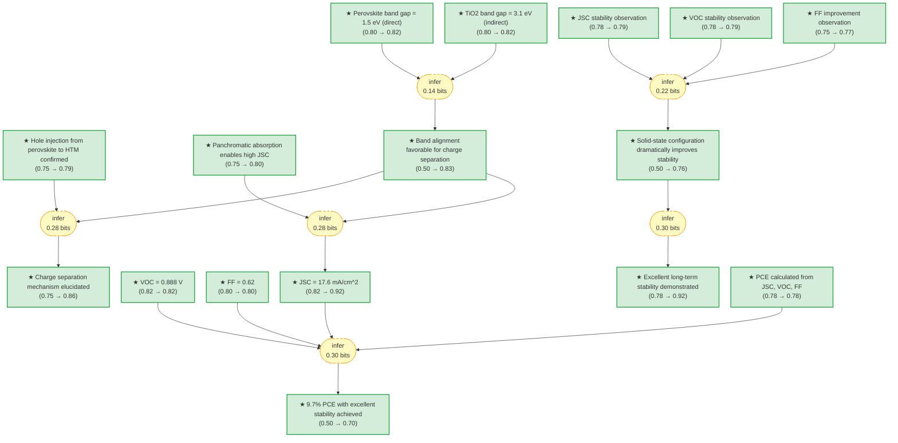

# pvsk2012-1-gaia

> **Original work:** Kim, H.-S., Lee, C.-R., Im, J.-H., Lee, K.-B., Moehl, T., Marchioro, A., Moon, S.-J., Humphry-Baker, R., Yum, J.-H., Moser, J. E., Graetzel, M. & Park, N.-G. "Lead Iodide Perovskite Sensitized All-Solid-State Submicron Thin Film Mesoscopic Solar Cell with Efficiency Exceeding 9%." *Scientific Reports* 2, 591 (2012). [DOI: 10.1038/srep00591](https://doi.org/10.1038/srep00591)

<!-- badges:start -->
<!-- badges:end -->

## Overview

> [!TIP]
> **Reasoning graph information gain: `1.5 bits`**
>
> Total mutual information between leaf premises and exported conclusions — measures how much the reasoning structure reduces uncertainty about the results.

> [!NOTE]
> **[Per-module reasoning graphs with full claim details →](docs/detailed-reasoning.md)**
>
> 4 Mermaid diagrams (one per section) with every claim, strategy, and belief value.

## Summary

This 2012 work demonstrates that CH3NH3PbI3 perovskite nanocrystals can serve as highly effective light harvesters in all-solid-state mesoscopic solar cells, achieving a power conversion efficiency (PCE) of 9.7% under standard AM 1.5G illumination. The key innovation was replacing the liquid electrolyte (which caused rapid perovskite degradation) with a solid hole-transporting material (spiro-MeOTAD), dramatically improving device stability while maintaining high photocurrent (17.6 mA/cm^2) and open-circuit voltage (0.888 V). Femtosecond transient absorption spectroscopy and photo-induced absorption measurements revealed that charge separation proceeds via hole injection from excited perovskite into spiro-MeOTAD followed by electron transfer to the mesoporous TiO2 film. The device retained stable performance for over 500 hours without encapsulation, representing a major advance in perovskite solar cell stability.

## Reasoning Structure

### Perovskite band gap of 1.5 eV enables panchromatic visible light absorption (belief: 0.82)

The optical band gap of CH3NH3PbI3 deposited on TiO2 film was determined to be 1.5 eV from Kubelka-Munk analysis of diffuse reflectance data, specifically from the extrapolation of the linear part of the [F(R)hv]^2 plot. This direct transition band gap is consistent with subsequent literature and enables absorption across the entire visible spectrum. The absorption coefficient reaches 1.5 x 10^4 cm^-1 at 550 nm, which is approximately one order of magnitude higher than the conventional N719 dye used in earlier dye-sensitized solar cells.

**Evidence support:**
- **Kubelka-Munk method** (belief: --): The band gap determination uses the standard Kubelka-Munk transformation F(R) = (1-R)^2/2R, which is well-established for diffuse reflectance spectroscopy. The direct transition (p=2) was confirmed by the linear fit of [F(R)hv]^2 versus photon energy.
- **Consistency with literature** (belief: 0.82): The measured 1.5 eV band gap is consistent with subsequent reports on CH3NH3PbI3, giving confidence in the measurement methodology.

### TiO2 band gap of 3.1 eV provides appropriate electron transport layer energetics (belief: 0.82)

The bare TiO2 film (anatase phase) has an optical band gap of 3.1 eV based on indirect transition analysis, consistent with established values for anatase TiO2. This large band gap ensures that TiO2 is transparent to visible light and only acts as an electron acceptor/transporter in the device.

**Evidence support:**
- **Kubelka-Munk analysis** (belief: --): Same methodology as perovskite band gap determination, applied to bare TiO2 films.
- **Literature consistency** (belief: 0.82): The 3.1 eV value matches established anatase TiO2 band gap, confirming the measurement is reliable.

*Diffuse reflectance and transformed Kubelka-Munk spectra for perovskite sensitizer. Adapted from Kim et al.*

### Well-aligned band positions enable efficient charge separation (belief: 0.83)

The valence band energy (EVB) of CH3NH3PbI3 was measured by UPS to be -5.43 eV below vacuum level, and the conduction band energy (ECB) was calculated to be -3.93 eV from the band gap. These positions, relative to TiO2 and spiro-MeOTAD, create favorable energy level alignment for charge separation: holes flow from perovskite valence band to spiro-MeOTAD, while electrons flow from perovskite conduction band to TiO2.

**Evidence support:**
- **UPS measurement** (belief: --): Ultraviolet photoelectron spectroscopy with He I photon energy (21.21 eV) calibration provides direct measurement of valence band energy.
- **Band alignment reasoning** (belief: 0.80): The inference from individual band gap and UPS measurements to favorable alignment involves composing two measurements. The weakest link is the indirect determination of ECB (calculated from Eg and EVB rather than directly measured), introducing slight uncertainty about the exact offset with TiO2 conduction band.

*Schematic energy level diagram of TiO2, CH3NH3PbI3, and spiro-MeOTAD. The band positions are well aligned for charge separation. Adapted from Kim et al.*

### Panchromatic absorption enables high photocurrent density in submicron films (belief: 0.80)

CH3NH3PbI3 deposited on TiO2 particles exhibits panchromatic absorption of visible light, enabling high photocurrent density of 17.6 mA/cm^2 in only 0.6 micrometer-thick mesoporous TiO2 films. This is approximately an order of magnitude higher absorption coefficient than the N719 dye, allowing much thinner TiO2 layers compared to liquid junction devices.

**Evidence support:**
- **Absorption coefficient measurement** (belief: 0.85): The high absorption coefficient (1.5 x 10^4 cm^-1 at 550 nm) was calculated from reflectance data using the Kubelka-Munk method.
- **IPCE validation** (belief: 0.85): The incident photon-to-electron conversion efficiency exceeds 50% from 450-750 nm, confirming effective light harvesting across the visible range.
- **Band alignment support** (belief: 0.80): The favorable band alignment (from the previous inference) ensures collected photons translate to photocurrent rather than being lost to recombination.

### Charge separation proceeds via hole injection from perovskite to HTM (belief: 0.86)

Femtosecond transient absorption spectroscopy combined with photo-induced absorption measurements revealed the charge separation mechanism. Upon excitation at 580 nm, the transient absorption spectrum of HTM/CH3NH3PbI3/TiO2 samples showed attenuated stimulated emission in the presence of HTM compared to samples without HTM, indicating rapid reductive quenching of the excited perovskite state by hole transfer to spiro-MeOTAD.

**Evidence support:**
- **TAS comparison** (belief: 0.88): Transient absorption spectra were measured on samples with and without HTM. The attenuation of the bleaching signal and stimulated emission quenching in HTM-containing samples directly demonstrates hole transfer.
- **PIA confirmation** (belief: --): Photo-induced absorption spectra show the signature of oxidized spiro-MeOTAD (broad absorption at 1340 nm), confirming hole localization on the triaryl amine functionality.
- **Control on Al2O3** (belief: 0.85): Comparison with Al2O3 samples (where electron injection is energetically forbidden) isolates the hole injection process from electron transfer effects.

### The open-circuit voltage reaches 0.888 V (belief: 0.82)

The open-circuit voltage of 0.888 V was directly measured under AM 1.5G solar illumination. This relatively high VOC for a perovskite cell is enabled by the favorable band alignment and the suppression of interfacial recombination in the solid-state configuration.

**Evidence support:**
- **Direct measurement** (belief: 0.92): VOC was measured with a Keithley source meter under calibrated solar simulator conditions (NREL-calibrated Si reference cell with KG-2 filter), giving high confidence in this directly observed quantity.

### The fill factor is 0.62 (belief: 0.80)

The fill factor of 0.62 was calculated from the J-V curve. This moderate FF is typical for solid-state sensitized solar cells and reflects the balance between series resistance and shunt resistance in the device architecture.

**Evidence support:**
- **J-V curve analysis** (belief: 0.90): FF calculated from the photocurrent density versus forward bias voltage curve using the standard formula FF = P_max/(J_SC x V_OC).

### Short-circuit current density of 17.6 mA/cm^2 is supported by multiple evidence chains (belief: 0.92)

The short-circuit photocurrent density of 17.6 mA/cm^2 was measured under standard AM 1.5G illumination. This high JSC is enabled by the panchromatic absorption of perovskite and well-aligned band positions for charge separation.

**Evidence support:**
- **Panchromatic absorption support** (belief: 0.80): The broad spectral response enables high current generation across visible wavelengths.
- **Band alignment support** (belief: 0.83): Efficient charge separation ensures photogenerated carriers are collected.
- **Linear light intensity dependence** (belief: 0.82): JSC scales linearly with light intensity, indicating the junction is not space-charge-limited and carrier collection is efficient.

*Photocurrent density as function of forward bias voltage (a), IPCE as function of wavelength (b), and short-circuit photocurrent density versus light intensity (c). Adapted from Kim et al.*

### The PCE of 9.7% is calculated from independently measured JSC, VOC, and FF (belief: 0.88)

Based on JSC of 17.6 mA/cm^2, VOC of 0.888 V, and FF of 0.62, the theoretical PCE calculation yields approximately 9.7% (PCE = JSC x VOC x FF = 17.6 x 0.888 x 0.62 = 9.69%). This matches the directly measured PCE from the J-V curve.

**Evidence support:**
- **Independent measurement** (belief: 0.88): Each parameter (JSC, VOC, FF) was measured independently with calibrated instruments, and the PCE calculation follows directly from the standard formula.

### The solid-state device demonstrates dramatically improved stability compared to liquid junction cells (belief: 0.76)

The use of solid spiro-MeOTAD as hole conductor dramatically improves device stability compared to CH3NH3PbI3-sensitized liquid junction cells, which suffered rapid degradation due to perovskite dissolution in the electrolyte. Over 500 hours of testing in air at room temperature without encapsulation, the PCE initially improved by about 14% (after 200 hours) and then remained stable.

**Evidence support:**
- **JSC stability** (belief: 0.79): JSC showed only slight decrease during the first 200 hours, attaining a plateau thereafter.
- **VOC stability** (belief: 0.79): VOC remained stable throughout the 500+ hour test period.
- **FF improvement** (belief: 0.77): FF improved and stabilized with time, contributing to the 14% PCE increase.
- **Inference from multiple observations** (belief: 0.76): The three individual stability observations are combined through an inference strategy, with the relatively lower belief reflecting the inherent uncertainty in accelerated aging tests and the extrapolation to real-world conditions.

*Performance stability of perovskite sensitized solid-state solar cell stored in air at room temperature without encapsulation. Adapted from Kim et al.*

### TiO2 thickness affects photovoltaic performance through dark current and transport resistance (belief: 0.85)

The photovoltaic performance parameters depend on TiO2 film thickness. JSC remains relatively independent (16-17 mA/cm^2 for 0.6-1.4 micrometer thickness), but VOC decreases from approximately 0.9 V to 0.8 V as thickness increases beyond 1.2 micrometers. FF also decreases with thickness due to lower VOC and increased electron transport resistance. Impedance spectroscopy measurements showed that dark current scales linearly with TiO2 thickness, and recombination resistance decreases with thickness, explaining the VOC reduction.

**Evidence support:**
- **Multiple sample measurements** (belief: 0.85): Several TiO2 thickness values were fabricated and measured, showing consistent trends.
- **Impedance spectroscopy analysis** (belief: 0.82): The recombination resistance (RCT) behavior under dark and illuminated conditions provides direct evidence for the thickness-dependent recombination mechanism.

### Multiexponential exciton decay with 78 ns and 350 ns lifetimes observed (belief: 0.82)

Time-resolved single photon counting measurements of CH3NH3PbI3 powder showed multiexponential emission decay with lifetimes of 78 ns and 350 ns, assigned to radiative decay of excitons in the perovskite material. The band edge emission centered at 780 nm corresponds to the 1.5 eV band gap.

**Evidence support:**
- **Single photon counting** (belief: 0.82): Time-resolved fluorescence measurement with clear multiexponential fit to the decay curve.

## Conclusions

| Label | Content | Prior | Belief |
|-------|---------|-------|--------|
| absorption_coefficient | The perovskite nanoparticles have an absorption coefficient of 1.5 x 10^4 cm^-1 at 550 nm, enabling high photocurrent in submicron-thick films. | 0.85 | 0.85 |
| band_edge_emission_780nm | A powder of CH3NH3PbI3 shows a band edge emission centered at 780 nm. | 0.85 | 0.85 |
| bandgap_1_5_ev | The optical band gap (Eg) for CH3NH3PbI3 deposited on TiO2 film was determined to be 1.5 eV from the extrapolation of the linear part of the [F(R)hv]^2 plot, indicating that optical absorption in the perovskite sensitizer occurs via a direct transition. | 0.80 | 0.82 |
| charge_separation_mechanism | Femtosecond laser studies combined with photo-induced absorption measurements showed charge separation proceeds via hole injection from the excited CH3NH3PbI3 NPs into the spiro-MeOTAD followed by electron transfer to the mesoscopic TiO2 film. | 0.75 | 0.86 |
| charge_separation_well_aligned | The band positions of TiO2, CH3NH3PbI3, and spiro-MeOTAD are well aligned for charge separation. The valence band energy (-5.43 eV) and conduction band energy (-3.93 eV) of CH3NH3PbI3, combined with the TiO2 conduction band position, enable efficient charge separation. | 0.50 | 0.83 |
| dark_current_scaled_linearly | The dark current scaled nearly linearly with the thickness of the mesoporous TiO2 layer. | 0.82 | 0.82 |
| delta_voc_reduction | The decrease in VOC with increasing TiO2 thickness is attributed to the increase in dark current augmenting linearly with film thickness, which lowers the electron concentration under illumination and hence their quasi-Fermi level. | 0.82 | 0.82 |
| device_fabrication | FTO glasses were cleaned ultrasonically in ethanol for 15 min and treated with UVO for 15 min. A dense TiO2 blocking layer was formed by spin-coating with titanium diisopropoxide bis(acetylacetonate) solution, heated at 125 degrees C for 5 min, repeated twice at increasing concentrations, then heated at 500 degrees C for 15 min. Mesoporous TiO2 paste was deposited by doctor-blade and annealed at 550 degrees C for 1 hour. After TiCl4 treatment at 70 degrees C for 10 min and heating at 500 degrees C for 30 min, the films were coated with perovskite precursor solution and heated at 100 degrees C for 15 min. The HTM solution (spiro-MeOTAD with LiTFSI and TBP in chlorobenzene:acetonitrile) was spin-coated at 4000 rpm. A 60 nm Au counter electrode was deposited by thermal evaporation. | 0.85 | 0.85 |
| device_structure | The device employs CH3NH3PbI3 perovskite nanocrystals as light absorbers and spiro-MeOTAD as the hole-transporting layer, deposited on a submicron-thick mesoscopic TiO2 film whose pores were infiltrated with the hole-conductor. | 0.90 | 0.90 |
| ecb_minus_3_93_ev | The conduction band energy (ECB) of CH3NH3PbI3 was determined to be -3.93 eV based on the observed optical band gap, which is slightly higher than the ECB for TiO2. | 0.85 | 0.85 |
| electron_lifetime_decreased | The calculated electron lifetime (tau_n = C_A x R_CT) shows a faster decline at higher forward bias with increasing TiO2 thickness, leading to the observed overall reduction in delta_VOC. | 0.82 | 0.82 |
| evb_minus_5_43_ev | The valence band energy (EVB) of CH3NH3PbI3 was estimated to be -5.43 eV below vacuum level based on UPS measurements, consistent with previous reports. | 0.85 | 0.85 |
| exciton_decay_multiexponential | The emission decay of CH3NH3PbI3 examined by single photon counting technique showed multiexponential decay with lifetimes of 78 ns and 350 ns, which is assigned to radiative decay of excitons in CH3NH3PbI3. | 0.82 | 0.82 |
| femtosecond_tas | Femtosecond transient absorption spectra were recorded using a pump-probe setup. The pump beam (lambda_exc = 580 nm) was generated by a two-stage non-collinear optical parametric amplifier (NOPA) pumped by a 778 nm amplified Ti:Sa laser system (150 fs duration pulses at 1 kHz repetition rate). The probe consisted of a white light continuum (430-1000 nm) generated by passing 778 nm light through a 3 mm sapphire plate. | 0.50 | — |
| ff_0_62 | The fill factor (FF) was 0.62. | 0.90 | 0.90 |
| ff_vs_tio2_thickness | The fill factor (FF) gradually decreases with increasing TiO2 film thickness, as a consequence of the lower VOC and an increase in electron transport resistance. | 0.85 | 0.85 |
| hole_injection_mechanism | The transient spectrum of the HTM/CH3NH3PbI3/TiO2 sample exhibits the same features as the sample without HTM, but with the bleaching peak in the 480 nm region being less pronounced and the stimulated emission peak clearly attenuated in the presence of HTM, pointing toward the reductive quenching of the perovskite. | 0.75 | 0.79 |
| impedance_spectroscopy | Electrochemical impedance measurements were performed with a Bio-Logic SP-300 potentiostat. A sinusoidal AC potential perturbation of 15 mV was overlaid over the applied DC bias potential, with frequency range from 1 MHz to 0.1 Hz. The measurements were fitted with a simple RC element (R and C in parallel) in series with a resistance. | 0.50 | — |
| ipce_over_50_percent | The incident photon-to-electron conversion efficiency (IPCE) reached a broad maximum at 450 nm and remained at a level over 50% up to 750 nm. | 0.85 | 0.85 |
| jsc_17_6_ma_cm2 | The short-circuit photocurrent density (JSC) was 17.6 mA/cm squared. | 0.82 | 0.92 |
| jsc_vs_tio2_thickness | The short-circuit current density (JSC) is not strongly dependent on TiO2 film thickness, with JSC values of 16-17 mA/cm^2 obtainable within the film thickness range of 0.6-1.4 micrometers. | 0.85 | 0.85 |
| kubelka_munk_method | The optical absorption coefficient (alpha) is calculated from reflectance data using the Kubelka-Munk equation: F(R) = alpha = (1-R)^2 / 2R, where R is the percentage of reflected light. The band gap energy (Eg) is related to the transformed Kubelka-Munk function: [F(R)hv]^p = A(hv - Eg), where p = 1/2 or 2 for indirect or direct allowed transitions respectively. | 0.50 | — |
| panchromatic_absorption_leads_to_high_jsc | CH3NH3PbI3 deposited on TiO2 particles exhibits panchromatic absorption of visible light, leading to high photocurrent density in submicron-thick thin films (JSC = 17.6 mA/cm^2 in 0.6 micrometer-thick mesoporous TiO2 film). | 0.85 | 0.88 |
| pce_9_7_percent | The solid-state device based on CH3NH3PbI3 perovskite NPs deposited on a 0.6 micrometer thick mesoporous TiO2 film achieved a power conversion efficiency (PCE) of 9.7% under AM 1.5G solar illumination, representing the highest reported efficiency to date for such cells. | 0.92 | 0.92 |
| pce_9_7_percent_conclusion | A power conversion efficiency of 9.7% was achieved under AM 1.5G illumination with excellent long-term stability, rendering this system very attractive for further investigations. | 0.50 | 0.70 |
| pce_prediction_from_individual_params | Based on JSC of 17.6 mA/cm^2, VOC of 0.888 V, and FF of 0.62, the theoretical PCE calculation yields approximately 9.7%. | 0.88 | 0.88 |
| pce_vs_tio2_thickness | Due to diminishing VOC and FF, the power conversion efficiency (PCE) clearly decreases with increasing TiO2 film thickness. The thinnest film of 0.6 micrometers delivers a PCE of over 9%, and more than 8% can be achieved from thicknesses less than 1 micrometer. | 0.85 | 0.85 |
| perovskite_synthesis | The CH3NH3PbI3 perovskite sensitizer was prepared by reaction of methylammonium iodide (CH3NH3I) with PbI2. CH3NH3I was synthesized by stirring hydroiodic acid with methylamine in an ice bath for 2 hours, then evaporating at 50 degrees C for 1 hour. The product was washed three times with diethyl ether and dried under vacuum. CH3NH3I was then mixed with PbI2 in gamma-butyrolactone at 60 degrees C overnight with stirring. | 0.88 | 0.88 |
| pia_spectroscopy | Photo-induced absorption (PIA) spectroscopy probes photo-generated charge species using a white light probe beam and modulated pump light source. A 20 W halogen lamp serves as the probe source, with a dual color solid-state detector (Si/InGaAs) achieving an effective spectral range of 300-1650 nm. | 0.50 | — |
| recombination_resistance_decreased | The charge transfer resistance (RCT) near short circuit is dominated by the interface between the hole conductor and the under-layer. Under forward bias (V_applied > 500 mV), RCT drops steeply with increasing forward bias because dark current is now dominated by electron flow across the photo-anode interface to the hole conductor. | 0.82 | 0.82 |
| reductive_quenching_observed | On Al2O3 samples, the amplitude of the bleaching signal at 483 nm was smaller than on samples deprived of HTM. The positive absorption signal in the 630-700 nm region completely disappeared, with strong quenching of stimulated emission above 700 nm. These results suggest a rapid reductive quenching of the excited state of the perovskite by the hole-transporting material. | 0.85 | 0.85 |
| solid_state_dramatically_improved_stability | The use of a solid hole conductor (spiro-MeOTAD) dramatically improved device stability compared to CH3NH3PbI3-sensitized liquid junction cells. The PCE remained stable during 500+ hours of testing without encapsulation. | 0.50 | 0.73 |
| stability_improvement | The solid-state device demonstrated remarkably improved stability compared to liquid junction cells over 500 hours of testing. The initial PCE improved by about 14% after 200 hours and remained stable thereafter, with JSC showing only slight decrease and VOC remaining stable. | 0.78 | 0.92 |
| stability_observation_1 | JSC showed only slight decrease during the first 200 hours, attaining a plateau thereafter. | 0.78 | 0.79 |
| stability_observation_2 | VOC remained stable throughout the 500+ hour test period. | 0.78 | 0.79 |
| stability_observation_3 | FF improved and stabilized with time, contributing to a 14% increase in initial PCE after 200 hours. | 0.75 | 0.77 |
| tiO2_bandgap_3_1_ev | The optical band gap (Eg) of the bare TiO2 film was determined to be 3.1 eV based on the indirect transition. | 0.88 | 0.89 |
| tiO2_nanoparticle_synthesis | Anatase TiO2 nanoparticles were synthesized by acetic acid catalyzed hydrolysis of titanium isopropoxide, followed by autoclaving at 230 degrees C for 12 hours. The aqueous solvent was replaced by ethanol to prepare non-aqueous TiO2 paste. The nominal composition of TiO2/terpineol/ethylcellulose/lauric acid was 1/6/0.3/0.1 by weight. | 0.88 | 0.88 |
| ups_measurement | Ultraviolet photoelectron spectroscopy (UPS) measures the valence band energy (EVB) of a material. The energy is calibrated with respect to He I photon energy (21.21 eV). | 0.50 | — |
| voc_0_888_v | The open-circuit voltage (VOC) was 0.888 V. | 0.92 | 0.92 |
| voc_vs_tio2_thickness | The open-circuit voltage (VOC) decreases from approximately 0.9 V to approximately 0.85 V as the TiO2 film thickness increases to 0.8 micrometers, and further decreases to around 0.8 V when the film thickness exceeds 1.2 micrometers. VOC starts to decline significantly from 1.5 micrometers. | 0.85 | 0.85 |

## Detailed Analysis

For structural integrity verification and complete package statistics,
see the per-module reasoning graphs in [docs/detailed-reasoning.md](docs/detailed-reasoning.md).
