SUBJECT AREAS:

NANOPHOTONICS

OPTICAL MATERIALS AND

DEVICES

INORGANIC CHEMISTRY

APPLIED PHYSICS

Received

5 July 2012

Accepted

6 August 2012

Published

21 August 2012

Correspondence and requests for materials should be addressed to

M.G. (michael.

graetzel@epfl.ch) or

N.-G.P. (npark@skku.

edu)

# Lead Iodide Perovskite Sensitized All-Solid-State Submicron Thin Film Mesoscopic Solar Cell with Efficiency Exceeding 9%

Hui-Seon Kim1 , Chang-Ryul Lee1 , Jeong-Hyeok Im1 , Ki-Beom Lee1 , Thomas Moehl2 , Arianna Marchioro2 , Soo-Jin Moon2 , Robin Humphry-Baker2 , Jun-Ho Yum2 , Jacques E. Moser2 , Michael Gra¨tzel2 & Nam-Gyu Park1

1 School of Chemical Engineering and Department of Energy Science, Sungkyunkwan University, Suwon 440-746, Korea, 2 Laboratory for Photonics and Interfaces, Institute of Chemical Sciences and Engineering, School of Basic Sciences, Ecole Polytechnique Fe´de´rale de Lausanne, CH-1015 Lausanne, Switzerland.

We report on solid-state mesoscopic heterojunction solar cells employing nanoparticles (NPs) of methyl ammonium lead iodide $( \mathbf { C H _ { 3 } N H _ { 3 } } ) \mathbf { \bar { P b } I _ { 3 } }$ as light harvesters. The perovskite NPs were produced by reaction of methylammonium iodide with $\mathbf { P b } \mathbf { I } _ { 2 }$ and deposited onto a submicron-thick mesoscopic $\mathrm { T i O } _ { 2 }$ film, whose pores were infiltrated with the hole-conductor spiro-MeOTAD. Illumination with standard AM-1.5 sunlight generated large photocurrents $( \mathrm { J } _ { \mathrm { S C } } )$ exceeding $\mathbf { \bar { 1 } } 7 \mathbf { \ m A } / \mathbf { c m } ^ { 2 } .$ , an open circuit photovoltage $( \mathbf { V _ { O C } } )$ of 0.888 V and a fill factor (FF) of 0.62 yielding a power conversion efficiency (PCE) of $9 . 7 \%$ , the highest reported to date for such cells. Femto second laser studies combined with photo-induced absorption measurements showed charge separation to proceed via hole injection from the excited $( \mathbf { C H _ { 3 } N H _ { 3 } } ) \mathbf { P b } \mathbf { I _ { 3 } }$ NPs into the spiro-MeOTAD followed by electron transfer to the mesoscopic $\mathrm { T i O } _ { 2 }$ film. The use of a solid hole conductor dramatically improved the device stability compared to $( \mathbf { C H _ { 3 } N H _ { 3 } } ) \mathbf { P b I _ { 3 } }$ -sensitized liquid junction cells.

S olid state sensitized heterojunction photovoltaic cells are presently under intense investigation1–16 becausethey present a promising avenue towards cost-effective high efficiency solar power conversion. These they present a promising avenue towards cost-effective high eficiency solar power conversion. These devices use molecular dyes or semiconductors in form of quantum dots (QD) or extremely thin absorber (ETA) layers as light harvesting agents. The sensitizer is deposited as a molecular or QD layer at the interface between a hole and electron conducting material, often a large band gap oxide semiconductor of mesoscopic structure. Following light excitation, the light harvester injects negative and positive charge carrier in the respective electronic transport materials, which subsequently are collected as photocurrent at the front and back contacts of the cell. The photo-voltage is given by the difference in the quasi-Fermi level under illumination of the electronand hole-conducting solids.

Recently research in this field has accelerated; new efficiency records being attained at short intervals. Thus, after years of struggling to get over the $5 \%$ PCE barrier, an ETA cell based on $\mathrm { S b } _ { 2 } \mathrm { S } _ { 3 }$ sensitized mesosocopic $\mathrm { T i O } _ { 2 }$ films reached a PCE of $6 . 3 \% ^ { 1 3 }$ while dye sensitized solid state heterojunctions have reached 7.2 percent16. It is noteworthy that an open-circuit photovoltage of 1.02 V was recently demonstrated from the organic dye loaded $\mathrm { T i O } _ { 2 }$ film combined with spiro-MeOTAD17. A further substantial gain in efficiency pushing the PCE to $8 . 5 \%$ was achieved very recently by combining the N719 dye with the p-type semiconductor $\mathrm { C s S n I } _ { 3 } { } ^ { 1 \mathrm { \ell } }$ .

$\mathrm { ( C H _ { 3 } N H _ { 3 } ) P b I _ { 3 } }$ perovskite nanocrystals have attracted attention as a new class of light harvesters for mesososcopic solar cells19. Impressive PEC values of up to $6 . 5 4 \%$ have been obtained with liquid junction cells based on iodide/triiodide redox couple20. However a rapid degradation of performance was witnessed due to dissolution of the perovskite in the electrolyte. Because the $( \mathrm { C H } _ { 3 } \mathrm { N H } _ { 3 } ) \mathrm { P b I } _ { 3 }$ nanocrystals exhibit a one order of magnitude higher absorption coefficient than the conventional N719 dye, they offer advantages for use in solid state sensitized solar cells where much thinner $\mathrm { T i O } _ { 2 }$ layer are employed than in liquid junction devices.

Here we report a new solid-state mesoscopic solar cell employing $\mathrm { ( C H _ { 3 } N H _ { 3 } ) P b I _ { 3 } }$ perovskite nanocrystals as a light absorber and spiro-MeOTAD as a hole-transporting layer, Figure 1. A strikingly high PCE of $9 . 7 \%$ was

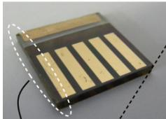  
a

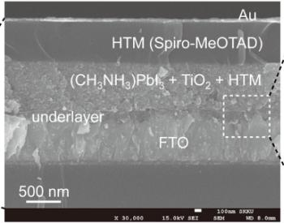  
C

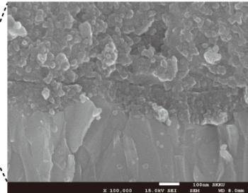  
d   
Figure 1 | Solid-state device and its cross-sectional meso-structure. (a) Real solid-state device. (b) Cross-sectional structure of the device. (c) Cross sectional SEM image of the device. (d) Active layer-underlayer-FTO interfacial junction structure.

achieved with submicon thick films of mesoporous anatase under AM 1.5G illumination along with excellent long term stability.

# Results

Perovskite $( \mathbf { C H } _ { 3 } \mathbf { N H } _ { 3 } ) \mathbf { P b I } _ { 3 }$ characterization. Optical band gap and valence band maximum were determined based on reflectance and ultraviolet photoelectron spectroscopy (UPS) measurements. Figures 2a and 2b show the diffuse reflectance spectrum and the transformed Kubelka-Munk spectrum for the $\mathrm { ( C H _ { 3 } N H _ { 3 } ) P b I _ { 3 } }$ - sensitized $\mathrm { T i O } _ { 2 }$ film. The optical absorption coefficient (a) is calculated using reflectance data according to the Kubelka-Munk equation21, $\begin{array} { r } { \mathrm { F ( R ) } = \alpha = ( 1 - \mathrm { R } ) ^ { 2 } / 2 \mathrm { R } , } \end{array}$ where R is the percentage of reflected light. The incident photon energy (hn) and the optical band gap energy $\mathrm { ( E _ { g } ) }$ are related to the transformed Kubelka-Munk function, $[ \mathrm { F ( \tilde { R } ) } \mathrm { h v } ] ^ { \mathrm { p } } \ = \ \mathrm { A } ( \mathrm { h v } \ - \ \mathrm { E _ { g } } )$ , where $\mathrm { E _ { g } }$ is the band gap energy, A is the constant depending on transition probability and p is the power index that is related to the optical absorption

process. Theoretically p equals to $\%$ or 2 for an indirect or a direct allowed transition, respectively. $\mathrm { E _ { g } }$ of the bare $\mathrm { T i O } _ { 2 }$ film is determined to be $3 . 1 ~ \mathrm { e V }$ based on the indirect transition, which is consistent with data reported elsewhere21. $\mathrm { E _ { g } }$ for the $( \mathrm { C H } _ { 3 } \mathrm { N H } _ { 3 } ) \mathrm { P b I } _ { 3 }$ deposited on $\mathrm { T i O } _ { 2 }$ film is determined to be $1 . 5 ~ \mathrm { e V }$ from the extrapolation of the liner part of $[ \mathrm { F ( R ) h v } ] ^ { 2 }$ plot (Figure 2b), which also indicates that the optical absorption in the perovskite sensitizer occurs via a direct transition. Figure 2c shows UPS spectrum for the $\mathrm { ( C H _ { 3 } N H _ { 3 } ) P b I _ { 3 } }$ sensitizer deposited on $\mathrm { T i O } _ { 2 }$ film, where the energy is calibrated with respect to He I photon energy (21.21 eV). Valence band energy $\mathrm { ( E _ { V B } ) }$ is estimated to $- 5 . 4 3 \ \mathrm { e V }$ below vacuum level, which is consistent with the previous report21. From the observed optical band gap, its conduction band energy $\mathrm { ( E _ { C B } ) }$ is determined to $- 3 . 9 3 \mathrm { ~ e V }$ that is slightly higher than the $\operatorname { E } _ { \mathrm { C B } }$ for $\mathrm { T i O } _ { 2 }$ . The schematic band alignment is sketched in Figure 2d, where the band positions are well aligned for charge separation.

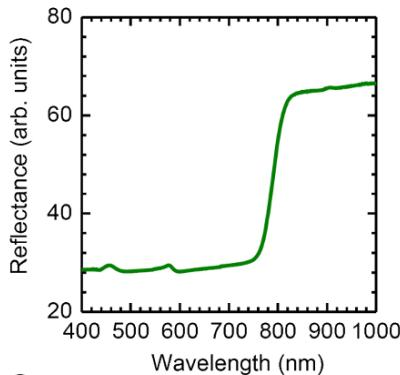  
a

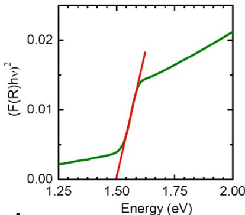  
b

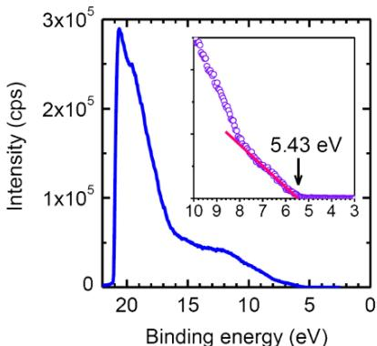  
C

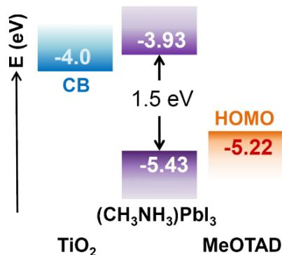  
d   
Figure 2 | Diffuse reflectance and UPS spectra for $( \mathbf { C H } _ { 3 } \mathbf { N H } _ { 3 } ) \mathbf { P b I } _ { 3 }$ perovskite sensitizer. (a) Diffuse reflectance spectrum of the $\mathrm { ( C H _ { 3 } N H _ { 3 } ) P b I _ { 3 } }$ -sensitized $\mathrm { T i O } _ { 2 }$ film. (b) Transformed Kubelka-Munk spectrum of the $\mathrm { ( C H _ { 3 } N H _ { 3 } ) P b I _ { 3 } }$ -sensitized $\mathrm { T i O } _ { 2 }$ film. (c) UPS spectrum of the $\mathrm { ( C H _ { 3 } N H _ { 3 } ) P b I _ { 3 } }$ -sensitized $\mathrm { T i O } _ { 2 }$ film. (d) Schematic energy level diagram of $\mathrm { T i O } _ { 2 } ,$ $\mathrm { ( C H _ { 3 } N H _ { 3 } ) P b I _ { 3 } } ,$ , and spiro-MeOTAD.

The photo-induced absorption (PIA) spectra of the $\mathrm { ( C H _ { 3 } N H _ { 3 } ) P b I _ { 3 } }$ films coated with spiro-MeOTAD show the signature of the oxidized spiro-MeOTAD, featuring a broad absorption peak at $1 3 4 0 ~ \mathrm { n m }$ , characteristic of the hole being localized on the triaryl amine functionality (Supplementary Figure S1). This reductive quenching of the $\mathrm { ( C H _ { 3 } N H _ { 3 } ) P b I _ { 3 } }$ occurs efficiently on this time scale and is observed for both the $\mathrm { T i O } _ { 2 }$ and $\mathrm { { A l } } _ { 2 } \mathrm { { O } } _ { 3 }$ films. The negative peak is an emission neat the band gap most likely arising from electron-hole recombination, which is consistent with the UPS result and the luminescence results shown in Figure 2.

Photovoltaic data. The solid state device based on the $\mathrm { ( C H _ { 3 } N H _ { 3 } ) P b I _ { 3 } }$ perovskite NPs deposited on a $0 . 6 ~ { \mu \mathrm { m } }$ thick mesoporous $\mathrm { T i O } _ { 2 }$ film shows a high short-circuit photocurrent density of $1 7 . 6 \ \mathrm { m A } / \mathrm { c m } ^ { 2 }$ , an open-circuit voltage of $8 8 8 ~ \mathrm { m V }$ and a fill factor (FF) of 0.62 under AM 1.5G solar illumination, corresponding to a PCE of $9 . 7 \%$ (Figure 3a). This strikingly high efficiency can be achieved with submicron thick $\mathrm { T i O } _ { 2 }$ films due to the large optical absorption cross section (absorption coefficient of $1 . 5 { \times } 1 0 ^ { 4 } \ \mathrm { c m } ^ { - 1 }$ at $5 5 0 ~ \mathrm { n m } ) ^ { 2 0 }$ of the pervoskite nanoparticles and the well-developed interfacial features including complete pore filling by the hole conductor as can be seen in Figure 1. The incident photon-to-electron conversion efficiency (IPCE) reaches a broad maximum at 450 nm remaining at a level over $5 0 \%$ up to $7 5 0 ~ \mathrm { n m }$ (Figure 3b). The appearance of a IPCE plateau indicates that the $\mathrm { ( C H _ { 3 } N H _ { 3 } ) P b I _ { 3 } }$ NP’s embedded in the $0 . 6 ~ \mu \mathrm { m }$ -thick mesoporous $\mathrm { T i O } _ { 2 }$ film harvest efficiently the incident photons, converting them with a high quantum yield to electric current. The photocurrent density of perovskite sensitized solid state cell is linearly proportional to light intensity (Figure 3c), which indicates that the $\mathrm { ( C H _ { 3 } N H _ { 3 } ) P b I _ { 3 } }$ -sensitized $\mathrm { T i O } _ { 2 }$ /spiro-MeOTAD junction is a non space-charge limited structure, associated with little difference in electron and hole mobility22.

Dependence of photovoltaic performance on $\mathrm { T i O } _ { 2 }$ film thickness. Figure 4 shows that, the photocurrent density $( \mathrm { J } _ { \mathrm { S C } } )$ is not strongly dependent on film thickness, where $\mathrm { J } _ { \mathrm { S C } }$ ’s of $\mathrm { 1 6 { - } 1 7 \ m A / c m ^ { 2 } }$ can be obtained within the range of film thicknesses of $0 . 6 \mathrm { - } 1 . 4 ~ \mu \mathrm { m }$ . Opencircuit voltage $( \mathrm { V _ { O C } } )$ is however more significantly influenced by changing the film thickness. The $\mathrm { \Delta V _ { O C } }$ decreases from ${ \sim } 0 . 9 \mathrm { ~ V ~ }$ to ${ \sim } 0 . 8 5 \mathrm { ~ V ~ }$ as the film thickness increases to $0 . 8 ~ \mu \mathrm { m }$ and further decreases to around $_ { 0 . 8 \mathrm { ~ V ~ } }$ when the film is greater than $1 . 2 ~ { \mu \mathrm { m } }$ . $\mathrm { { V _ { O C } } }$ starts to decline significantly from $1 . 5 ~ { \mu \mathrm { m } }$ . This decrease of $\mathrm { v _ { o c } }$ is expected as the dark current augments linearly dependant with film thickness lowering the electron concentration under ilumination and hence their quasi Fermie level23. The FF is gradually decreased with increasing the film thickness, which is a consequence of the lower Voc and an increase of the electron transport resistance. Due to the diminishing $\mathrm { v _ { o c } }$ and FF, PCE (g) is clearly

decreased with increasing the $\mathrm { T i O } _ { 2 }$ film thickness. The thinnest film of $0 . 6 ~ { \mu \mathrm { m } }$ can deliver a PCE of over $9 \%$ and more than $8 \%$ can be achieved from thicknesses less than $1 \ \mu \mathrm { m }$ .

Impedance spectroscopy. To elucidate the relation between thickness of the $\mathrm { T i O } _ { 2 }$ layer and the photovoltaic performance, impedance spectra (IS) were measured. The frequency domain in the Nyquist plot which belongs to the recombination process dominating the dark and the photocurrent could be easily processed and is presented in Figure 5. Three different thicknesses of mesoporous $\mathrm { T i O } _ { 2 }$ layers were investigated (0.6, 1.15 and $1 . 4 \mu \mathrm { m } ,$ ). The $\mathrm { J } _ { \mathrm { S C } }$ and FF were similar for all 3 cells but the $\mathrm { { V _ { O C } } }$ dropped from about 920 to 880 to $8 5 0 ~ \mathrm { m V }$ with increasing $\mathrm { T i O } _ { 2 }$ thickness. The dark current scaled nearly linearly with thickness of the mesoporous $\mathrm { T i O } _ { 2 }$ layer (Figure 5a) and is well mirrored by the behavior of the recombination – or charge transfer-resistance $\operatorname { R } _ { \mathrm { C T } }$ (Figure 5b). The $\operatorname { R } _ { \mathrm { C T } }$ near short circuit is dominated by the interface between the hole conductor and the under-layer as apparent from the small potential dependence of the resistance. The behavior of $\operatorname { R } _ { \mathrm { C T } }$ changes as soon as the conductance in the photoanode increases due to the rise of the Fermi level in the photo-anode under forward bias $\mathrm { ( V _ { a p p l i e d } > }$ $5 0 0 \mathrm { m V } ,$ ). $\operatorname { R } _ { \mathrm { C T } }$ drops steeply with increasing forward bias because the dark current is now dominated by the flow of electrons across the photo-anode interface to the hole conductor and no longer by the underlayer/hole conductor interface.

A similar picture is observed for the IS response under illumination (Figure 5c). The increase of the recombination current with higher surface area of the thicker photoanodes leads to a faster reduction of the $\operatorname { R } _ { \mathrm { C T } }$ and ultimately to a lower $\mathrm { v _ { o c } }$ . The capacitance $( \mathrm { C _ { A } } )$ near $\mathrm { J } _ { \mathrm { S C } } ,$ which is associated to the capacitance of the under layer/ hole conductor interface, shows nearly no change. It increases as the mesoscopic $\mathrm { T i O } _ { 2 }$ film is filled with the electrons induced by the applied potential showing $\mathrm { C _ { A } }$ values comparable to other mesoporous solid state devices24 and therefore about 100 times lower than in liquid DSC devices. Another feature in common with solid state devices like BHJ or ETA solar cells is the drop of the capacitance at even higher forward bias. The origin of this behavior is not fully understood so far. Bisquert et al. mentioned that the balance with the Helmholtz capacitance might be a reason24. Alternatively also the direct faradaic current flow could also lead to the overall reduction of the capacitance. Finally, we can see that the calculated electron lifetime $( \tau _ { \mathrm { n } } = \mathrm { C _ { A } } \times \mathrm { R _ { C T } } )$ ) shows a faster decline in $\tau _ { \mathrm { n } }$ at higher forward bias with increasing $\mathrm { T i O } _ { 2 }$ thickness leading to the observed overall reduction in the $\mathrm { \Delta V _ { O C } }$ (Figure 5d).

Time resolve single photon and femto-second laser spectroscopy studies. A powder of $( \mathrm { C H } _ { 3 } \mathrm { N H } _ { 3 } ) \mathrm { P b I } _ { 3 }$ shows a band edge emission which is centered at $7 8 0 ~ \mathrm { n m }$ , Figure SI2. The emission decay was

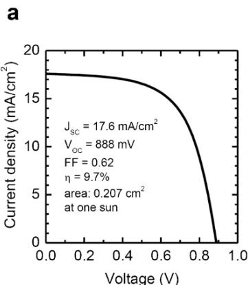

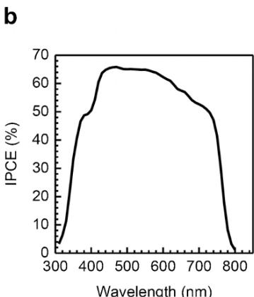

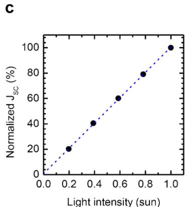  
Figure 3 | Photovoltaic characteristics of $( \mathbf { C H _ { 3 } N H _ { 3 } } ) \mathbf { P b I _ { 3 } }$ perovskite sensitized solar cell. (a) Photocurrent density as a function of the forward bias voltage. (b) IPCE as function of incident wavelength. (c) The short circuit photo-current density as function of light intensity.

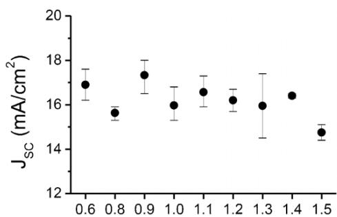

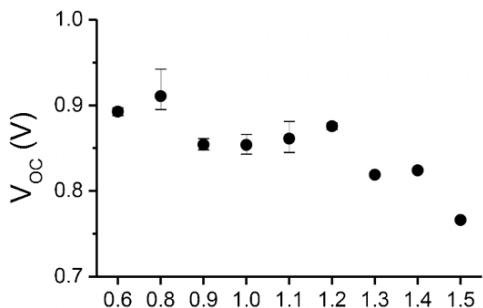

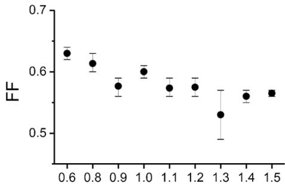

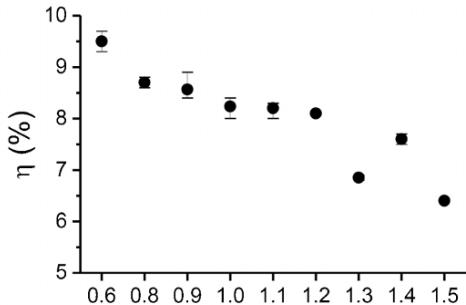  
${ \mathsf { T i O } } _ { 2 }$ film thickness $( \mu \mathsf { m } )$   
Figure 4 | Effect of $\mathrm { T i O } _ { 2 }$ film thickness on the key photovoltaic performance parameters. (a) Short-circuit current density $( \mathrm { J } _ { \mathrm { S C } } )$ , (b) Open circuit voltage $( \mathrm { V _ { O C } } )$ , (c) fill factor (FF), and (d) power conversion efficiency (PCE).

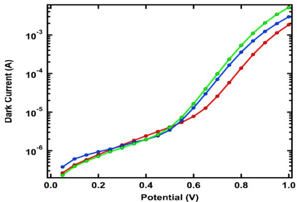  
a

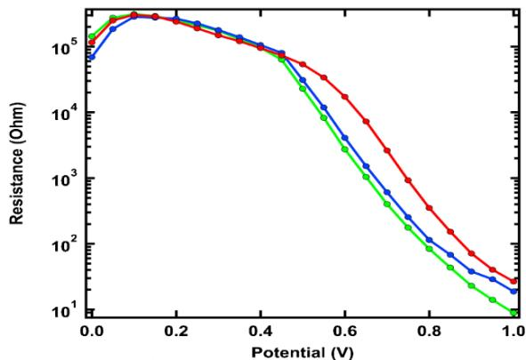  
b

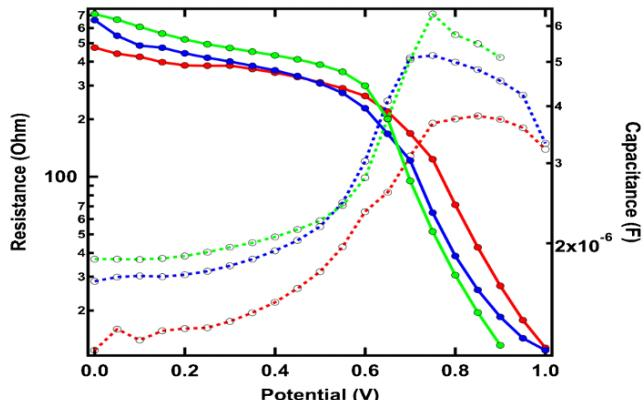  
C

d   
Figure 5 | IS measurements as $\mathrm { T i O } _ { 2 }$ thickness: red ${ \bf 0 . 6 \mu m ; }$ , blue $1 . 1 5 {  { \mu } }  { \mathbf { m } }$ and green $1 . 4 \mu \mathrm { m }$ . (a) Dark current during the IS measurements.   
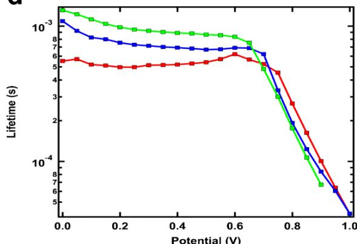  
(b) Recombination resistance extracted from the IS measurements in the dark. (c) Recombination resistance (solid lines) and accompanying capacitance (dashed lines) from IS measurements under illumination. (d) Electron lifetime under illumination.

examined by single photon counting technique and showed a multiexponential decay with lifetimes of 78 ns, and 350 ns which is assigned to radiative decay of excitons in the $( \mathrm { C H } _ { 3 } \mathrm { N H } _ { 3 } ) \mathrm { P b I } _ { 3 }$ .

Femtosecond transient absorption (TAS) studies were performed to elucidate the mechanism of charge separation in the device. Samples were subjected to pulsed excitation $( \lambda _ { \mathrm { e x c } } = 5 8 0 \mathrm { n m } )$ ) and were probed by white light continuum (WLC) pulses, whose spectrum covered the $4 4 0 { - } 7 4 0 \ \mathrm { n m }$ domain. Comparison was made between samples containing the perovskite material deposited on $\mathrm { { A l } } _ { 2 } \mathrm { { O } } _ { 3 }$ (Figure 6a) and $\mathrm { T i O } _ { 2 }$ (Figure 6b), respectively. Due to the mismatch of the energies of the conduction bands of $\mathrm { ( C H _ { 3 } N H _ { 3 } ) P b I _ { 3 } }$ and $\mathrm { { A l } } _ { 2 } \mathrm { { O } } _ { 3 }$ $\mathrm { ( E _ { C B } ~ = ~ - 0 . 1 ~ e V }$ vs vacuum25), no electron transfer is expected between these two materials upon excitation of the light absorber.

The negative signal peaking at $4 8 3 ~ \mathrm { n m }$ was attributed to the bleaching of the absorption of the perovskite. A positive peak that has not been assigned yet was also observed with a maximum at $6 3 8 ~ \mathrm { n m }$ . The same bleaching as well as the same positive peak could be observed on both $\mathrm { { A l } } _ { 2 } \mathrm { { O } } _ { 3 }$ and $\mathrm { T i O } _ { 2 }$ samples. Furthermore, a large negative feature above 700 nm was identified in both samples and assigned to the stimulated emission of excited $\mathrm { ( C H _ { 3 } N H _ { 3 } ) P b I _ { 3 } }$ . This signal matches the spectrum shown in Figure SI2 obtained by steadystate emission and corresponds to the excitonic absorption edge of the material.

Relaxation of the positive and negative bands observed in the 450– $5 4 0 ~ \mathrm { n m }$ and $6 3 0 { - } 7 0 0 \ \mathrm { n m }$ regions is completed on a 1 ns timescale, suggesting that both spectral features are associated with the same excited state of the material, which half-lifetime can be estimated to be $\sim 5 0$ ps. No major difference could be observed between samples based on $\mathrm { { A l } } _ { 2 } \mathrm { { O } } _ { 3 }$ and $\mathrm { T i O } _ { 2 }$ : the recovery of the initial state in 1 ns for both samples shows that no significant charge injection from the excited state of the perovskite into $\mathrm { T i O } _ { 2 }$ can be evidenced. This is

also confirmed by the observation of the decay of the stimulated emission, which does not appear to be quenched by $\mathrm { T i O } _ { 2 }$ .

Samples covered by the hole-transporting material spiro-OMeTAD were measured to further investigate the working mechanisms of the perovskite-based cell. On $\mathrm { A l } _ { 2 } \mathrm { O } _ { 3 } ,$ , (Figure 6c), the amplitude of the bleaching signal at 483 nm was found to be smaller than on a sample deprived of the HTM. The positive absorption signal in the 630– $7 0 0 ~ \mathrm { n m }$ region completely disappeared, concomitantly with a strong quenching of the stimulated emission above $7 0 0 ~ \mathrm { n m }$ . These results suggest a rapid reductive quenching of the excited state of the perovskite by the hole-transporting material. The absorption spectrum of oxidized form of the spiro-OMeTAD generated during this process extends in the visible region and could thus interfere with other spectral features observed between 400 and $7 0 0 ~ \mathrm { n m }$ .

The transient spectrum of the sample HTM/ $\mathrm { C H _ { 3 } N H _ { 3 } } ) \mathrm { P b I _ { 3 } } / \mathrm { T i O _ { 2 } }$ (Figure 6d) exhibits the same features observed on the one deprived of spiro-OMeTAD (Figure 6b), with the bleaching peak in the 480 nm-region being less pronounced than in the case of the perovskite alone on $\mathrm { T i O } _ { 2 } .$ , as discussed previously for the $\mathrm { { A l } } _ { 2 } \mathrm { { O } } _ { 3 }$ sample. Moreover, the stimulated emission peak is clearly attenuated in the presence of the HTM, also pointing towards the reductive quenching of the perovskite.

The apparent weaker quenching of the $( \mathrm { C H } _ { 3 } \mathrm { N H } _ { 3 } ) \mathrm { P b I } _ { 3 }$ excited state by the HTM in the $\mathrm { T i O } _ { 2 }$ sample compared to the alumina-based layer might be rationalized by a different morphology of both oxides mesoporous films. In $\mathrm { { A l } } _ { 2 } \mathrm { { O } } _ { 3 }$ layers, a better pore filling by the spiro-OMeTAD could offer a better contact between the perovskite and the HTM and consequently yield a stronger reductive quenching of the photoexcited state. Further studies are needed to quantify the extent of this effect on different metal oxides and measurements in the near-IR $\left( > 1 0 0 0 \ \mathrm { n m } \right)$ ) would be required to unambiguously time-resolve

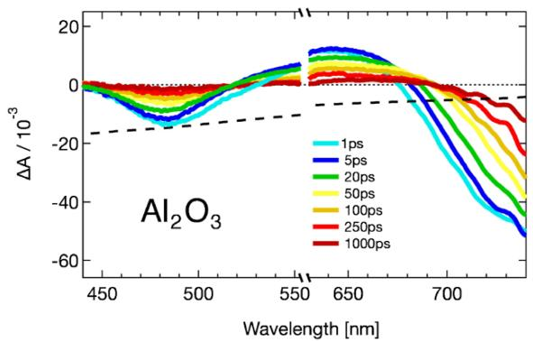  
a

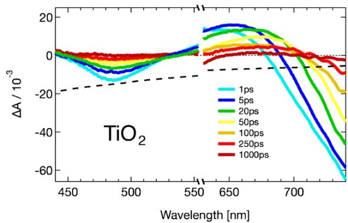  
b

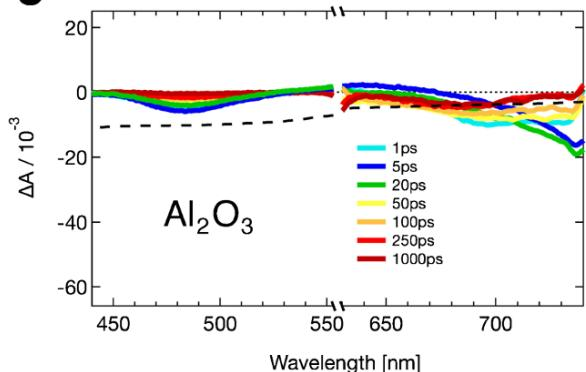  
C

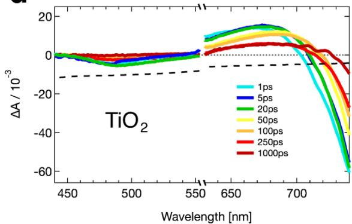  
d   
Figure 6 | Femtosecond transient absorbance spectra with $\lambda _ { \mathrm { e x c } } = 5 8 0 ~ \mathrm { n m }$ and WLC probe of a) $\mathrm { ( C H _ { 3 } N H _ { 3 } ) P b I _ { 3 } / A l _ { 2 } O _ { 3 } , t }$ b) $\begin{array} { r } { ( \mathbf { C H } _ { 3 } \mathbf { N H } _ { 3 } ) \mathbf { P b I } _ { 3 } / \mathbf { T i O } _ { 2 } , } \end{array}$ c) Spiro/ $\mathrm { ( C H _ { 3 } N H _ { 3 } ) P b I _ { 3 } / A l _ { 2 } O _ { 3 } } ,$ and d) Spiro/ $\begin{array} { r } { ( \mathbf { C H } _ { 3 } \mathbf { N H } _ { 3 } ) \mathbf { P b I } _ { 3 } / \mathbf { T i O } _ { 2 } , } \end{array}$ recorded at various time delays after excitation (color lines). Black dashed lines represent the absorbance spectrum of the sample (scaled by a factor –0.01). The wavelengths region around laser excitation $( 5 5 5 - 6 3 0 \mathrm { n m } )$ ) is not shown.

the appearance of the oxdized form of the spiro-OMeTAD which however was unambiguously identified in the PIA spectra shown in Figure SI1 for both $\mathrm { { A l } } _ { 2 } \mathrm { { O } } _ { 3 }$ and $\mathrm { T i O } _ { 2 }$ supported NPs in contact with the spiro-OMeTAD.

Long-term stability. As previously reported, the $\mathrm { ( C H _ { 3 } N H _ { 3 } ) P b I _ { 3 } }$ peroskite nanoparticles are unstable in iodide-contained liquid electrolyte due to rapid dissolution19,20. Contrary to the liquid cell, stability is remarkably improved in the solid-state device as can be seen in Figure 7 which shows the results from ex-situ long-term stability tests for over $5 0 0 \ \mathrm { h }$ , where the devices are stored in air at room temperature without encapsulation. The Jsc shows only a slight decrease during the first $2 0 0 \ \mathrm { h }$ attaining a plateau thereafter. The Voc remained stable while the FF improved and stabilized with time. Thus the initial PCE improved by about $1 4 \%$ after $2 0 0 \ \mathrm { h } .$ , which is mostly due to the increase in FF. The PCE remained stable during the rest of the test.

# Discussions

$( \mathrm { C H } _ { 3 } \mathrm { N H } _ { 3 } ) \mathrm { P b I } _ { 3 }$ deposited on the $\mathrm { T i O } _ { 2 }$ particles exhibits panchromatic absorption of visible light, leading to high photocurrent density in submicron-thick thin film $\mathrm { \Omega } ^ { \prime } 1 7 . 6 \mathrm { \ m A } / \mathrm { c m } ^ { 2 }$ in $0 . 6 ~ { \mu \mathrm { m } }$ -thick mesoporous $\mathrm { T i O } _ { 2 }$ film). Open-circuit voltage and fill factor of solid-state devices are deteriorated by increasing $\mathrm { T i O } _ { 2 }$ film thickness, which is mainly attributed to the increase in dark current and electron transport resistance according to the impedance spectroscopic study. TAS study clearly shows that the excited state of the perovskite is reductively quenched by spiro-MeOTAD, which proves a complete hole transfer from the perovskite sensitizer to HTM. Moreover, this all-solid-state solar cell demonstrates highly improved stability even without encapsulation. In conclusion, the present study takes advantage of the very high optical cross section of $( \mathrm { C H } _ { 3 } \mathrm { N H } _ { 3 } ) \mathrm { P b I } _ { 3 }$ perovskite nanocrystals which are used as ligth harvesters in solid state heterojucntion solar cells using submicron thick mesoporous $\mathrm { T i O } _ { 2 }$ fims and spiro-MeOTAD as an electron- and a hole-transporting layer, respectively. A strikingly high PCE of $9 . 7 \%$ was achieved under AM 1.5G illumination along with excellent long term stability rendering this system very attractive for further investigations.

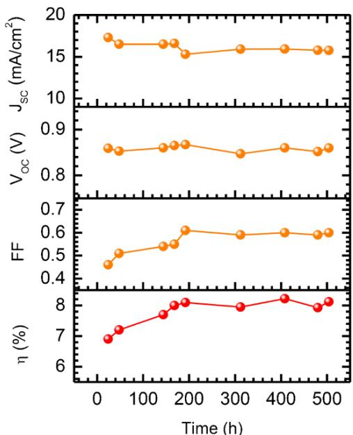  
Figure 7 | Performance. Stability of $\mathrm { ( C H _ { 3 } N H _ { 3 } ) P b I _ { 3 } }$ sensitized solid-state solar cell stored in air at room temperature without encapsulation and measured under one sun illumination.

# Methods

Materials synthesis. The perovskite sensitizer $( \mathrm { C H } _ { 3 } \mathrm { N H } _ { 3 } ) \mathrm { P b I } _ { 3 }$ was prepared according to the reported procedure17. A hydroiodic acid (30 mL, 0.227 mol, 57 wt.% in water, Aldrich) and methylamine $2 7 . 8 ~ \mathrm { m L }$ , $0 . 2 7 3 \ \mathrm { m o l }$ , $4 0 \%$ in methanol, TCI) were stirred in the ice bath for $^ { 2 \mathrm { ~ h ~ } }$ . After stirring at $0 ^ { \mathrm { o } } \mathrm { C }$ for 2 h, the resulting solution was evaporated at $5 0 ^ { \mathrm { o } } \mathrm { C }$ for 1 h and produced synthesized chemicals $\mathrm { ( C H _ { 3 } N H _ { 3 } I ) }$ . The precipitate was washed three times with diethyl ether and dried under vacuum and used without further purification. To prepare $\mathrm { ( C H _ { 3 } N H _ { 3 } ) P b I _ { 3 } }$ , readily synthesized $\mathrm { C H } _ { 3 } \mathrm { N H } _ { 3 } \mathrm { I }$ (0.395 g) and $\mathrm { P b } \mathrm { I } _ { 2 }$ $( 1 . 1 5 7 \ { \mathrm { g } } , 9 9 \%$ Aldrich) were mixed in $\gamma$ -butyrolactone (2 mL, ${ \tt > } 9 9 \%$ Aldrich) at $6 0 ^ { \mathrm { o } } \mathrm { C }$ for overnight with stirring. Anatase $\mathrm { T i O } _ { 2 }$ nanoparticles were synthesized by acetic acid catalyzed hydrolysis of titanium isopropoxide $( 9 7 \% .$ , Aldrich), followed by autoclaving at $2 3 0 \mathrm { { ^ o C } }$ for $^ { 1 2 \mathrm { ~ h ~ } }$ . Aqueous solvent in the autoclaved $\mathrm { T i O } _ { 2 }$ colloid solution was replaced by ethanol for preparation of non-aqueous $\mathrm { T i O } _ { 2 }$ paste. Ethyl cellulose (Aldrich), lauric acid (Fluka), and terpineol (Aldrich) were added into the ethanol solution of the $\mathrm { T i O } _ { 2 }$ particles, and then ethanol was removed from the solution using a rotary evaporator to obtain viscous pastes. For homogeneous mixing, the paste was further treated with a threeroll mill. The nominal composition of $\mathrm { T i O } _ { 2 } /$ terpineol/ethylcellulose/lauric acid was $1 / 6 / 0 . 3 / 0 . 1 $ .

Solar cell fabrication and characterization. FTO glasses (Pilkington, TEC-8, 8 V/sq) were cleaned in an ultrasonic bath containing ethanol for 15 min and treated in UVO cleaner for 15 min. To make a dense $\mathrm { T i O } _ { 2 }$ blocking layer, the cleaned FTO glasses were coated with 0.15 M titanium diisopropoxide bis(acetylacetonate) $7 5 \%$ Aldrich) in 1-butanol (Aldrich) solution by the spin-coating method, which was heated at $1 2 5 ^ { \mathrm { { o } C } }$ for 5 min. After the coated film was cooled down to the room temperature, the same process was repeated twice with $0 . 3 \ \mathrm { M }$ titanium diisopropoxide bis(acetylacetonate) solution in butanol. The three times coated FTO glasses with $\mathrm { T i O } _ { 2 }$ precursor solutions were heated at $5 0 0 ^ { \circ } \mathrm { C }$ for $1 5 ~ \mathrm { m i n }$ . On the prepared dense $\mathrm { T i O } _ { 2 }$ blocking layer, the nanocrystalline $\mathrm { T i O } _ { 2 }$ paste was deposited by a doctor-blade method and the deposited film was annealed a $5 5 0 \mathrm { { ^ o C } }$ for 1 h to produce mesoporous $\mathrm { T i O } _ { 2 }$ film. Thicknesses of the $\mathrm { T i O } _ { 2 }$ films were controlled from 0.5 to ca. $1 . 5 \mu \mathrm { m }$ using a micrometer adjustable film applicator. The sintered $\mathrm { T i O } _ { 2 }$ films were immersed in 0.02 M aqueous $\mathrm { T i C l _ { 4 } }$ (Aldrich) solution at $7 0 \mathrm { { ^ o C } }$ for $1 0 \ \mathrm { m i n }$ , which was heated at $5 0 0 ^ { \circ } \mathrm { C }$ for $3 0 \ \mathrm { m i n }$ . The prepared $\mathrm { T i O } _ { 2 }$ films were coated with perovskite precursor solution, followed by heating at $1 0 0 ^ { \circ } \mathrm { C }$ for $1 5 \ \mathrm { m i n }$ . The composition of hole transport material (HTM) was 0.170 M $^ { 2 , 2 ^ { \prime } , 7 , 7 ^ { \prime } }$ -tetrakis-(N,N-di- $\boldsymbol { \cdot } \boldsymbol { p }$ -methoxyphenyl-amine)- 9,99-spirobifluorene (spiro-MeOTAD, Merck), 0.064 M bis(trifluoromethane)sulfonimide lithium salt (LiTFSI, $9 9 . 9 5 \%$ , Aldrich) and 0.198 M 4-tert-butylpyridine (TBP, $9 6 \%$ , Aldrich) in the mixed solvent of chlorobenzene $( 9 9 . 8 \%$ , Aldrich) and acetonitrile $( 9 9 . 8 \%$ , Aldrich) (chlorobenzene : acetonitrile $= 1 : 0 . 1 ~ \mathrm { v } / \mathrm { v }$ v). The $\mathrm { ( C H _ { 3 } N H _ { 3 } ) P b I _ { 3 } }$ -sensitized $\mathrm { T i O } _ { 2 }$ films were coated with HTM solution using spin-coating method at 4000 rpm. For the counter electrode, a 60 nm-thick Au was deposited on the top of the HTM over layer by a thermal evaporation, where Au evaporated under ca. $1 0 ^ { - 6 }$ torr vacuum condition. The active area was measured by a digital camera (DCMe 500) and an image analysis program (Leopard 2009) and the mesoporous $\mathrm { T i O } _ { 2 }$ film thickness was measured by alpha-step IQ surface profiler (KLA Tencor). X-ray diffraction (XRD) pattern was obtained using a Rigaku D/MAX 2400 diffractometer with Cu Ka radiation at scan rate of $4 ^ { \mathrm { { o } } } C / \mathrm { { m i n } }$ under operation condition of $3 0 ~ \mathrm { k V }$ and 40 mA. A field-emission scanning electron microscope (FE-SEM, Jeol JSM 6700F) was used to investigate crosssectional morphology of the solid state devices. Transmission electron microscopy (TEM) images were obtained using a high-resolution transmission electron microscope (HR-TEM, Jeol, JEM-2100F) at an acceleration voltage of $2 0 0 ~ \mathrm { k V }$ . The optical absorbance spectra of perovskite-sensitized $\mathrm { T i O } _ { 2 }$ film were measured by a UV-vis spectrophotometer (Agilent 8453). Photocurrent and voltage were measured by a solar simulator (Oriel Sol 3A class AAA) equipped with a 450 W Xenon lamp (Newport 6279NS) and a Keithley 2400 source meter. The NREL-calibrated Si solar cell with KG-2 filter was used to adjust light intensity into one sun illumination $\left( 1 0 0 \mathrm { \ m W } / \mathrm { c m } ^ { 2 } \right)$ ). A black aperture mask was attached during photocurrent and voltage measurement26,27. Incident-photon-to-current conversion efficiency (IPCE) was measured at AC mode under bias light using a specially designed IPCE system (PV measurement Inc.) equipped with a 75 W xenon lamp as a light source for monochromatic beam and a 75 W–12 V halogen lamp as a bias light source.

Impedance spectroscopy. The electrochemical impedance measurements were performed with a Bio-Logic SP-300 potentiostat (Bio-Logic SAS, France). A sinusoidal AC potential perturbation of $1 5 ~ \mathrm { m V }$ was overlaid over the applied DC bias potential. The frequency range applied for the AC perturbation was from 1 MHz to $0 . 1 \mathrm { H z }$ . The DC bias potential was applied in $5 0 \mathrm { m V }$ steps. During the measurements the devices were kept in a faradaic cage. The measurements under illumination were performed with a white light LED (LXM3-PW51, Luxeon Rebel, Philips). The resulting impedance spectra were fitted with the Zview software (Scribner Associate Inc.) in the most simple manner. The frequency range related to the recombination (or also called charge transfer) process was fitted with a simple RC element (R and C in parallel) in series with a resistance. Latter resistance is accounting for all other resistive elements in the device at higher frequencies.

Femtosecond laser spectroscopy. Transient absorption spectra were recorded using femtosecond pulsed laser pump-probe spectroscopy. The pump beam $( \lambda _ { \mathrm { { e x c } } } = 5 8 0 )$ ) was generated by pumping a two-stage non-collinear optical parametric amplifier (NOPA) by the $7 7 8 ~ \mathrm { n m }$ output of an amplified Ti:Sa laser system (Clark-MXR,

CPA-2001) providing 150 fs duration pulses at a repetition rate of 1 kHz. The pump energy at the sample was 200 nJ / pulse with a spot size diameter of ca 1 mm. The probe beam consisted of a white light continuum $( 4 3 0 - 1 0 0 0 \ \mathrm { n m } )$ ), generated by passing a portion of the 778 nm amplified Ti:Sa laser output through a 3 mm-thick sapphire plate. The probe intensity was always inferior to that of the pump and its spot size was much smaller. Probe pulses were time-delayed with respect to the pump pulses using a optical delay line mounted on a computerized translation stage.

The probe beam was split before the sample into a signal beam, transmitted through the sample and crossed with the pump beam, and a reference beam. The signal and reference were detected with a pair of $1 6 3 ~ \mathrm { m m }$ spectrographs (Andor Technology, SR163) equipped with $5 1 2 \mathrm { x } 5 8$ pixels back-thinned CCD detectors (Hamamatsu S07030-0906). To improve the detection sensitivity, the pump light was chopped at half the amplifier frequency, and the transmitted signal intensity was recorded shot by shot. It was corrected for intensity fluctuations using the reference beam. Transient spectra were averaged until the desired signal-to-noise ratio was achieved (typically 3000 averaged records). The polarization of the probe pulses was at magic angle relative to that of the pump pulses. All spectra were corrected for the spectral chirp of the white-light probe pulses.

Photo-induced absorption (PIA) spectroscopy. Photo-induced absorption (PIA) spectroscopy was used to probe the photo-generated charge species in a $\mathrm { ( C H _ { 3 } N H _ { 3 } ) P b I _ { 3 } }$ sensitized film. This experimental technique comprises of a white light probe beam, spectrally resolved after passing through the samples with the addition of a modulated pump light source. A 20 W halogen lamp was used as a probe source which was filtered and focused onto the sample prior to being refocused onto the slits of a double monochromator (Gemini-180). The light intensity on the sample was approximately $6 5 ~ \mu \mathrm { W } ~ \mathrm { c m } ^ { - 2 }$ . A cooled dual colour solid-state detector (Si/ InGaAs) was mounted on the exit slits of the monochromator. This combination gave an effective spectral range of 300–1650 nm. A dual phase lock-in amplifier (SR 830) was used to separate out the AC signal from the detectors. This signal provided the change in transmission (DT/T) as a function of wavelength.

1. Bach, U. et al. Solid-state dye-sensitized mesoporous $\mathrm { T i O } _ { 2 }$ solar cells with high photon-to-electron conversion efficiencies. Nature 395, 583–585 (1998).   
2. Kruger, J. et al. High efficiency solid-state photovoltaic device due to inhibition of interface charge recombination. Appl. Phys. Lett. 79, 2085–2087 (2001).   
3. Snaith, H. J. et al. Efficiency enhancements in solid-state hybrid solar cells via reduced charge recombination and increased light capture. Nano Lett. 7, 3372–3376 (2007).   
4. Gra¨tzel, M. Dye-sensitized solid-state heterojunction solar cells. Mater. Res. Bull. 30, 23–27 (2005).   
5. Fabregat-Santiago, F. et al. Electron transport and recombination in solid-state dye solar cell with spiro-OMeTAD as hole conductor. J. Am. Chem. Soc. 131, 558–562 (2009).   
6. Schmidt-Mende, L. & Gra¨tzel, M. $\mathrm { T i O } _ { 2 }$ pore-filling and its effect on the efficiency of solid-state dye-sensitized solar cells. Thin Solid Films 500, 296–301 (2006).   
7. Snaith, H. J., Petrozza, A., Ito, S., Miura, H. & Gra¨tzel, M. Charge generation and photovoltaic operation of solid-state dye-sensitized solar cells incorporating a high extinction coefficient indolene-based sensitizer. Adv. Funct. Mater. 19, 1810–1818 (2009).   
8. Moon, S.-J. et al. Highly efficient organic sensitizers for solid-state dye-sensitized solar cells. J. Phys. Chem. C 113, 16816–16820 (2009).   
9. Cai, N. et al. An organic D-pi-A dye for record efficiency solid-state sensitized heterojunction solar cells. Nano Lett. 11, 1452–1456 (2011).   
10. Plass, R., Pelet, S., Krueger, J., Gra¨tzel, M. & Bach, U. Quantum dot sensitization of organic-inorganic hybrid solar cells. J. Phys. Chem. B 106, 7578–7580 (2002).   
11. Moon, S.-J. et al. ${ \mathrm { S b } } _ { 2 } { \mathrm { S } } _ { 3 }$ -based mesoscopic solar cell using an organic hole conductor. J. Phys. Chem. Lett. 1, 1524–1527 (2010).   
12. Chang, J. A. et al. High-performance nanostructured inorganic-organic heterojunction solar cells. Nano Lett. 10, 2609–2612 (2010).   
13. Chang, J. A. et al. Panchromatic photon-harvesting by hole-conducting materials in inorganic-organic heterojunction sensitized-solar cell through the formation of nanostructured electron channels. Nano Lett. 12, 186321867 (2012).   
14. Hodes, G. & Cahen, D. All-solid-state, semiconductor-sensitized nanoporous solar cells. Acc. Chem. Res. 45, 705–713 (2012).   
15. Xu, C., Wu, J., Desai, U. V. & Gao, D. High-efficiency solid-state dye-sensitized solar cells based on TiO2-coated ZnO nanowire arrays.Nano Lett. 12, 2420–2424 (2012).   
16. Burschka, J. et al. Tris(2-(1H-pyrazol-1-yl)pyridine)cobalt(III) as p-type dopant for organic semiconductors and its application in highly efficient solid-state dyesensitized solar cells. J. Am. Chem. Soc. 133, 18042–18045 (2011).

17. Jang, S.-R. et al. Voltage-enhancement mechanisms of an organic dye in high open-circuit voltage solid-state dye-sensitized solar cells. ACS Nano 5, 8267–8274 (2011).   
18. Chung, I., Lee, B., He, J., Chang, R. P. H. & Kanatzidis, M. G. All-solid-state dyesensitized solar cells with high efficiency. Nature 485, 486–489 (2012).   
19. Kojima, A., Teshima, K., Shirai, Y. & Miyasaka. T. Organometal halide perovskites as visible-light sensitizers for photovoltaic cells. J. Am. Chem. Soc. 131, 6050–6051 (2009).   
20. Im, J.-H., Lee, C.-R., Lee, J.-W., Park, S.-W. & Park, N.-G. $6 . 5 \%$ efficient perovskite quantum-dot-sensitized solar cell. Nanoscale 3, 4088–4093 (2011).   
21. Lin, H. et al. Size dependency of nanocrystalline $\mathrm { T i O } _ { 2 }$ on its optical property and photocatalytic reactivity exemplified by 2-chlorophenol. Appl. Catal. B-Environ. 68, 1–11 (2006).   
22. Koster, L. J. A., Mihailetchi, V. D., Xie, H. & Blom, P. W. M. Origin of the light intensity dependence of the short-circuit current of polymer/fullerene solar cells. Appl. Phys. Lett. 87, 203502 (2005).   
23. Snaith, H. J., Schmidt-Mende, L. & Gra¨tzel. M. Light intensity, temperature, and thickness dependence of the open-circuit voltage in solid-state dye-sensitized solar cells. Phys. Rev. B 74, 045306 (2006).   
24. Fabregat-Santiago, F., Garcia-Belmonte, G., Mora-Sero, I. & Bisquert, J. Characterization of nanostructured hybrid and organic solar cells by impedance spectroscopy. Phys. Chem. Chem. Phys. 13, 9083–9118 (2011).   
25. Odier, P., Rifflet, J. C. & Loup, J. P. Electron emission measurements and the defect structure of ${ \sf { q } } \mathrm { - } { \sf { A l } } _ { 2 } { \sf { O } } _ { 3 }$ . J. Mater. Sci. 19, 2121–2135 (1984).   
26. Park, J. et al. On the I–V measurement of dye-sensitized solar cell: effect of cell geometry on photovoltaic parameters. Sol. Energy Mater. Sol. Cells 91, 1749–1754 (2007).   
27. Lee, G.-W., Kim, D. H., Ko, M. J., Kim, K. K. & Park, N.-G. Evaluation on over photocurrents measured from unmasked dye-sensitized solar cells. Solar Energy 84, 418–425 (2010).

# Acknowledgments

This work was supported by the National Research Foundation of Korea (NRF) grant funded by the Ministry of Education, Science and Technology (MEST) of Korea under contracts No. 2010-0014992 and 2010-0028821 and R31-2008-10029 (WCU program) and the Korea Institute of Energy Technology Evaluation and planning (KETEP) grant funded by the Ministry of Knowledge Economy under contract No. 20103020010010. SKKU team thanks Mr. Jin-Wook Lee for his assistance in some experiments. This publication is partially based on work at EPFL supported by the Center for Advanced Molecular Photovoltaics (Award No KUS-C1-015- 21), made by King Abdullah University of Science and Technology (KAUST), ECR advanced Grant Agreement No. 247404 under the CE-Mesolight project funded by the European community’s 7th FWP. EPFL team thanks Dr. Thomas W. Holcombe for his kind and fruitful discussion.

# Author contributions

N.-G.P. and M.G. contributed to the conception and design of the experiment, analysis of the data and writing the manuscript with assistance of T.M., R.H-B., and J.-H.Y.

H.-S.K. carried out synthesis of materials, preparation of the devices, device performance measurements and writing experimental part in the manuscript. J.-H.I. carried out UPS and UV-vis measurements. C.-R.L. K.-B.L. and S.-J.M. carried out part of device fabrication. T.M. carried out impedance spectroscopy and analyzed the data with assistance of J.-H.Y. R.H-B. carried out PIA spectroscopy and analyzed the data with assistance of S.-J.M.

J.-E.M., and A.M., analyzed the data of femtosecond spectroscopy and contributed to the analysis tools with assistance of S.-J.M.

# Additional information

Supplementary information accompanies this paper at http://www.nature.com/ scientificreports

Competing financial interests: the authors declare no competing financial interests.

License: This work is licensed under a Creative Commons Attribution-NonCommercial-ShareAlike 3.0 Unported License. To view a copy of this license, visit http://creativecommons.org/licenses/by-nc-sa/3.0/

How to cite this article: Kim, H. et al. Lead Iodide Perovskite Sensitized All-Solid-State Submicron Thin Film Mesoscopic Solar Cell with Efficiency Exceeding 9%. Sci. Rep. 2, 591; DOI:10.1038/srep00591 (2012).