# pvsk2012-2-gaia

> **Original work:** Lee, M. M., Teuscher, J., Miyasaka, T., Murakami, T. N., & Snaith, H. J. "Efficient hybrid solar cells based on meso-superstructured organometal halide perovskites." *Science* 338 (6107), 643-650 (2012). DOI: 10.1126/science.1228604

## Overview

This package formalizes the 2012 Science paper by Lee et al. that demonstrated a breakthrough in perovskite solar cell efficiency through a novel device architecture called the meso-superstructured solar cell (MSSC). The key innovation was replacing the conventional n-type TiO2 scaffold with an insulating Al2O3 scaffold, which forces electrons to travel through the perovskite layer itself rather than through disordered metal oxide networks. This change reduced fundamental energy losses, enabling a power conversion efficiency of 10.9% under simulated AM1.5 full sunlight — competitive with the best thin-film technologies at the time. The paper showed that the perovskite absorber itself acts as an effective n-type semiconductor, transporting charge much faster than mesoporous TiO2, while the chemical capacitance of sub-band gap states in TiO2 was identified as the origin of voltage losses in sensitized devices.

The reasoning graph contains 88 knowledge nodes and 15 strategies. The most strongly supported conclusions concern the direct experimental measurements (device performance, crystal structure, spectral response) and the chemical capacitance mechanism explaining the voltage improvement. The main achievement claim (10.9% efficiency) achieves high belief (0.85), but several derived conclusions about the MSSC mechanism and electron transport reach only moderate belief (0.68-0.71) due to the complexity of the multi-premise inference chains.

> [!TIP]
> **Reasoning graph information gain: `2.4 bits`**
>
> Total mutual information between leaf premises and exported conclusions — measures how much the reasoning structure reduces uncertainty about the results.

```mermaid
---
config:
  flowchart:
    rankSpacing: 80
    nodeSpacing: 30
---
graph TB
    energy_loss_excitons["★ Energy losses from exciton separation and charge extraction\n(0.85 → 0.85)"]:::exported
    dssc_losses["★ DSSC loss mechanisms\n(0.85 → 0.85)"]:::exported
    organic_losses["★ Organic solar cell losses from low dielectric constant\n(0.85 → 0.85)"]:::exported
    sensitized_voc_limitation["★ Sensitized solar cell Voc limitation\n(0.75 → 0.75)"]:::exported
    perovskite_properties["★ Perovskite material properties\n(0.50 → 0.80)"]:::exported
    prior_perovskite_work["★ Prior perovskite solar cell performance\n(0.90 → 0.92)"]:::exported
    research_gap["★ Research gap: overcoming fundamental losses\n(0.50 → 0.61)"]:::exported
    key_insight["★ Key insight: Al2O3 scaffold improves efficiency\n(0.50 → 0.89)"]:::exported
    crystal_structure["★ Perovskite crystal structure\n(0.92 → 0.93)"]:::exported
    film_crystallinity["★ Perovskite film crystallinity\n(0.90 → 0.92)"]:::exported
    film_stability["★ Perovskite air stability\n(0.90 → 0.92)"]:::exported
    pore_filling["★ Perovskite pore filling\n(0.80 → 0.83)"]:::exported
    perovskite_conductivity["★ Perovskite conductivity\n(0.82 → 0.84)"]:::exported
    spiro_conductivity["★ Spiro-OMeTAD conductivity\n(0.85 → 0.87)"]:::exported
    al2o3_best_device["★ Best Al2O3 MSSC device performance\n(0.92 → 0.94)"]:::exported
    tio2_device["★ TiO2 sensitized device performance\n(0.92 → 0.93)"]:::exported
    voc_improvement["★ Voc improvement with Al2O3 scaffold\n(0.50 → 0.71)"]:::exported
    ipce_spectral_range["★ IPCE spectral response\n(0.90 → 0.90)"]:::exported
    optical_bandgap["★ Perovskite optical band gap\n(0.90 → 0.90)"]:::exported
    voltage_deficit["★ Small voltage deficit\n(0.92 → 0.92)"]:::exported
    absorbance_capability["★ Absorbance spectrum\n(0.50 → 0.76)"]:::exported
    photostability["★ Long-term photostability\n(0.90 → 0.91)"]:::exported
    tio2_sensitization["★ Effective TiO2 sensitization\n(0.88 → 0.88)"]:::exported
    al2o3_insulating["★ Al2O3 acts as insulator\n(0.90 → 0.90)"]:::exported
    hole_transfer_effective["★ Hole transfer to spiro-OMeTAD\n(0.88 → 0.88)"]:::exported
    hole_conductor_required["★ Hole conductor requirement for MSSC\n(0.85 → 0.85)"]:::exported
    charge_collection_speed["★ Faster charge collection with Al2O3\n(0.88 → 0.88)"]:::exported
    perovskite_semicondo["★ Perovskite as semiconductor\n(0.50 → 0.68)"]:::exported
    chemical_capacitance["★ Chemical capacitance mechanism for Voc improvement\n(0.80 → 0.81)"]:::exported
    tio2_chemical_capacitance["★ TiO2 sub-band gap states cause voltage loss\n(0.78 → 0.79)"]:::exported
    mssc_definition["★ MSSC definition and principle\n(0.50 → 0.69)"]:::exported
    electron_transport_mssc["★ Electron transport in MSSC\n(0.50 → 0.70)"]:::exported
    perovskite_transport_speed["★ Perovskite electron transport speed\n(0.80 → 0.80)"]:::exported
    series_resistance_tradeoff["★ Series-shunt resistance tradeoff\n(0.80 → 0.83)"]:::exported
    main_achievement["★ Main achievement: 10.9% efficiency\n(0.50 → 0.85)"]:::exported
    fundamental_loss_reduction["★ Reduction of fundamental losses\n(0.50 → 0.74)"]:::exported
    future_fill_factor["★ Future: fill factor improvement\n(0.50 → 0.68)"]:::exported
    strat_0(["infer\n0.27 bits"]):::weak
    absorbance_capability --> strat_0
    al2o3_best_device --> strat_0
    fundamental_loss_reduction --> strat_0
    key_insight --> strat_0
    perovskite_conductivity --> strat_0
    perovskite_properties --> strat_0
    photostability --> strat_0
    series_resistance_tradeoff --> strat_0
    spiro_conductivity --> strat_0
    strat_0 --> main_achievement
    strat_1(["infer\n0.19 bits"]):::weak
    al2o3_best_device --> strat_1
    film_crystallinity --> strat_1
    film_stability --> strat_1
    perovskite_properties --> strat_1
    pore_filling --> strat_1
    prior_perovskite_work --> strat_1
    tio2_device --> strat_1
    voc_improvement --> strat_1
    strat_1 --> key_insight
    strat_2(["infer\n0.26 bits"]):::weak
    al2o3_insulating --> strat_2
    tio2_sensitization --> strat_2
    strat_2 --> electron_transport_mssc
    strat_3(["infer\n0.30 bits"]):::weak
    charge_collection_speed --> strat_3
    perovskite_transport_speed --> strat_3
    strat_3 --> perovskite_semicondo
    strat_4(["infer\n0.20 bits"]):::weak
    chemical_capacitance --> strat_4
    tio2_chemical_capacitance --> strat_4
    strat_4 --> voc_improvement
    strat_5(["infer\n0.07 bits"]):::weak
    crystal_structure --> strat_5
    strat_5 --> perovskite_properties
    strat_6(["infer\n0.29 bits"]):::weak
    dssc_losses --> strat_6
    energy_loss_excitons --> strat_6
    organic_losses --> strat_6
    sensitized_voc_limitation --> strat_6
    strat_6 --> research_gap
    strat_7(["infer\n0.28 bits"]):::weak
    hole_conductor_required --> strat_7
    hole_transfer_effective --> strat_7
    strat_7 --> mssc_definition
    strat_8(["infer\n0.12 bits"]):::weak
    ipce_spectral_range --> strat_8
    strat_8 --> absorbance_capability
    strat_9(["infer\n0.27 bits"]):::weak
    main_achievement --> strat_9
    series_resistance_tradeoff --> strat_9
    strat_9 --> future_fill_factor
    strat_10(["infer\n0.16 bits"]):::weak
    optical_bandgap --> strat_10
    voltage_deficit --> strat_10
    strat_10 --> fundamental_loss_reduction

    classDef premise fill:#ddeeff,stroke:#4488bb,color:#333
    classDef exported fill:#d4edda,stroke:#28a745,stroke-width:2px,color:#333
    classDef weak fill:#fff9c4,stroke:#f9a825,stroke-dasharray: 5 5,color:#333
    classDef contra fill:#ffebee,stroke:#c62828,color:#333
```

## Reasoning Structure

### The MSSC achieves 10.9% power conversion efficiency under AM1.5 illumination (belief: 0.85)

The central experimental result is that Al2O3-based meso-superstructured solar cells achieved a power conversion efficiency of 10.9% — a substantial improvement over the 7.6% efficiency of conventional TiO2-sensitized devices fabricated and measured under identical conditions. The best Al2O3 device showed short-circuit current density (Jsc) = 17.8 mA cm^-2, open-circuit voltage (Voc) = 0.98 V, and fill factor = 0.63. This efficiency was measured under simulated AM1.5 illumination at 100 mW cm^-2 irradiance. The Voc of 0.98 V represents a >200 mV improvement over the TiO2 device (0.80 V), demonstrating that the MSSC architecture fundamentally changes the voltage generation mechanism.

**Evidence chains:**

- **Device performance data** (weakest link belief 0.94): The efficiency claim rests directly on J-V measurements of the best-performing Al2O3 device under standard illumination conditions. These are direct experimental observations with calibrated equipment.
- **Supporting material characterization** (belief 0.92-0.92): The high crystallinity of the perovskite films (>200 nm domains, narrow XRD peaks) and their air stability during processing support that the efficiency is reproducible and not degraded by the fabrication environment.
- **Hole conductor integration** (belief 0.87): Spiro-OMeTAD forms an effective capping layer for hole collection, confirmed by the high fill factor (0.63) compared to the TiO2 device (0.53).

> The 10.9% efficiency represented a breakthrough for solution-processable solar cells in 2012, more than doubling the efficiency of prior perovskite-based devices (3.5-6.5%).

*Current density-voltage characteristics for Al2O3-based cells, TiO2-sensitized cell, and planar junction diode. From Lee et al., Science 2012.*

---

### The voltage deficit is only 0.45 eV, competitive with the best thin-film technologies (belief: 0.74)

The open-circuit voltage of 1.1 V combined with the optical band gap of 1.55 eV (determined from IPCE onset at 800 nm) yields a voltage deficit of only 0.45 eV. For context, GaAs solar cells exhibit a deficit of approximately 0.29 eV, while dye-sensitized and organic solar cells typically show deficits of 0.7-0.8 eV. The paper argues this small deficit reflects exceptionally few fundamental energy losses in the MSSC architecture.

**Evidence chains:**

- **Band gap measurement** (weakest link belief 0.90): The 1.55 eV band gap was determined from the IPCE onset at 800 nm, a standard characterization technique.
- **Voltage measurement** (belief 0.94): Voc was directly measured on optimized devices. The 1.1 V value represents either the best Al2O3 device or a high-Voc device (the paper reports 0.98 V for the best efficiency device, but mentions reaching >1.1 V in other cells).

> This voltage deficit is a key figure of merit — it shows the MSSC approach largely overcomes the Voc limitations that plague low-cost photovoltaic technologies.

---

### Al2O3 cells generate >200 mV higher open-circuit voltage than TiO2-sensitized cells (belief: 0.71)

The dramatic Voc improvement when switching from TiO2 to Al2O3 is the central mystery and key insight of the paper. The TiO2 device showed Voc = 0.80 V while the Al2O3 device showed Voc = 0.98 V, a >200 mV difference with comparable short-circuit currents. The paper attributes this to the "chemical capacitance" of sub-band gap states in mesoporous TiO2.

**Evidence chains:**

- **Chemical capacitance theory** (weakest link belief 0.79): TiO2 has tail states extending into the band gap that store charge and lower the quasi-Fermi level for electrons. Al2O3 has essentially no chemical capacitance. This is a well-established concept in semiconductor electrochemistry, applied specifically to explain the observed Voc behavior.
- **Supporting spectroscopic evidence** (belief 0.88): PIA spectroscopy confirmed effective sensitization of TiO2 (free electrons in titania) but showed no electron signal from Al2O3, consistent with electrons residing in the perovskite phase in MSSC devices.

> The chemical capacitance explanation is theoretically well-grounded, but the belief is moderated because it is an inference from multiple indirect measurements rather than a direct measurement of the quasi-Fermi level.

---

### Electrons must travel through the perovskite layer in MSSC devices (belief: 0.70)

In Al2O3-based cells, because the scaffold is insulating, electrons cannot be injected into the Al2O3. They must remain in the perovskite phase until collected at the planar TiO2-coated FTO electrode. This means the perovskite itself must be an effective n-type conductor.

**Evidence chains:**

- **PIA spectroscopy** (weakest link belief 0.90): Al2O3 films coated with perovskite showed no PIA signal, confirming that Al2O3 does not participate in electron transport. TiO2 films showed clear signatures of electrons in titania.
- **Charge transport measurements** (belief 0.88): Transient photocurrent decay measurements showed >10x faster charge collection in Al2O3 devices compared to TiO2, indicating that electron diffusion through perovskite is faster than through n-type TiO2.

> The electron transport path is well-established, but the precise mechanism of why perovskite transport is faster than TiO2 transport is inferred rather than directly proven.

---

### The perovskite layer functions as both absorber and n-type semiconductor (belief: 0.68)

This is a key conceptual advance: unlike in conventional sensitized solar cells where electrons are injected into the n-type oxide immediately after light absorption, in the MSSC the electrons remain in the perovskite and are transported through it to the collecting electrode. This was demonstrated by the planar-junction diode experiment, where a thin (~150 nm) perovskite film showed photovoltaic behavior without any mesoporous scaffold.

**Evidence chains:**

- **Planar junction result** (weakest link belief 0.50): The planar device showed much lower efficiency (1.8%) than the mesostructured devices, indicating that the mesoscopic architecture is important for performance — but it does show that perovskite alone can generate photocurrent.
- **Charge collection speed** (belief 0.88): The faster charge collection in Al2O3 devices compared to TiO2 demonstrates that the perovskite phase is the dominant transport medium in MSSC devices.
- **Perovskite conductivity** (belief 0.84): The measured conductivity of ~10^-3 S cm^-1 is consistent with semiconducting behavior.

> The belief is moderate because the planar junction result shows perovskite can function as a semiconductor, but the efficiency is too low to be convincing as a standalone证明 — the mesoscopic architecture clearly adds value.

---

### The MSSC exhibits long-term photostability under full sunlight (belief: 0.91)

The perovskite absorber maintained 98.4% absorption at 500 nm over 1000 hours of continuous illumination under simulated full sunlight. This stability is attributed to the mixed-halide composition (CH3NH3PbI2Cl) which is notably more stable than pure CH3NH3PbI3 used in prior work.

**Evidence support:**
- **1000-hour stability test** (belief 0.91): Direct absorbance measurements over 1000 hours under AM1.5 illumination provide strong evidence for photostability.

> This is a key practical result — 1000 hours of continuous full-sun illumination is a meaningful stability benchmark for photovoltaic materials.

---

### The perovskite has the expected tetragonal crystal structure with good long-range order (belief: 0.93)

X-ray diffraction showed peaks at 14.20 deg, 28.58 deg, and 43.27 deg, assigned to (110), (220), and (330) planes of a tetragonal perovskite structure with lattice parameters a = 8.825 A, b = 8.835 A, c = 11.24 A. Extremely narrow diffraction peaks indicate long-range crystalline domains >200 nm.

**Evidence support:**
- **XRD measurement** (belief 0.93): Direct structural characterization with high resolution.

> This confirms the intended perovskite phase was successfully formed with high quality.

## Key Findings

| Label | Content | Prior | Belief |
|-------|---------|-------|--------|
| al2o3_best_device | Best Al2O3 MSSC: Jsc=17.8 mA/cm2, Voc=0.98V, FF=0.63, eta=10.9% | 0.92 | 0.94 |
| tio2_device | TiO2 sensitized: Jsc=17.8 mA/cm2, Voc=0.80V, FF=0.53, eta=7.6% | 0.92 | 0.93 |
| crystal_structure | Tetragonal perovskite, a=8.825A, b=8.835A, c=11.24A | 0.92 | 0.93 |
| voltage_deficit | 0.45 eV deficit (band gap 1.55 eV minus Voc 1.1 V) | 0.92 | 0.92 |
| film_crystallinity | XRD peaks indicate >200 nm crystalline domains | 0.90 | 0.92 |
| film_stability | Iodide-chloride mixed-halide perovskite stable to air processing | 0.90 | 0.92 |
| prior_perovskite_work | Prior perovskite solar cells achieved 3.5-6.5% (liquid) and 8.5% (solid-state) | 0.90 | 0.92 |
| key_insight | Replacing TiO2 with Al2O3 scaffold enables perovskite to transport electrons | 0.50 | 0.89 |
| main_achievement | MSSC delivers >10.9% efficiency under full solar illumination | 0.50 | 0.85 |
| photostability | 1000 hours stability under full AM1.5 illumination | 0.90 | 0.91 |
| charge_collection_speed | Al2O3 devices >10x faster charge collection than TiO2 | 0.88 | 0.88 |
| hole_transfer_effective | PIA confirms effective hole transfer to spiro-OMeTAD | 0.88 | 0.88 |
| chemical_capacitance | TiO2 tail states lower quasi-Fermi level; Al2O3 has no chemical capacitance | 0.80 | 0.81 |
| perovskite_properties | Perovskite is tunable, crystalline, strong absorber | 0.50 | 0.80 |
| perovskite_semicondo | Planar junction shows perovskite functions as semiconductor | 0.50 | 0.68 |
| voc_improvement | Al2O3 cells >200 mV higher Voc than TiO2 cells | 0.50 | 0.71 |
| fundamental_loss_reduction | Voltage deficit 0.45 eV competitive with best thin-film tech | 0.50 | 0.74 |
| electron_transport_mssc | Electrons travel through perovskite layer in MSSC | 0.50 | 0.70 |
| research_gap | Need for solution-processable solar cell overcoming fundamental losses | 0.50 | 0.61 |

## Weak Points Analysis

The following analysis identifies the structurally weakest components of the reasoning chain. Most are intermediate claims with moderate belief that serve as premises for the main conclusions.

**1. Chemical capacitance mechanism attribution (belief 0.79-0.81)**

The explanation for why Al2O3 devices have higher Voc rests on chemical capacitance theory — that TiO2 has sub-band gap tail states that lower the quasi-Fermi level. While chemical capacitance is a well-established concept in semiconductor electrochemistry, the paper does not directly measure the quasi-Fermi level or the density of sub-band gap states in TiO2. The evidence is circumstantial: PIA spectroscopy shows sensitization works for TiO2 but not Al2O3, and the Voc difference is large and consistent. However, alternative explanations for the Voc improvement (e.g., interface energetics, different recombination pathways) are not formally considered. The chemical capacitance explanation is plausible and theoretically grounded, but the specific quantitative contribution of each loss mechanism is not established.

**2. Perovskite as n-type semiconductor (belief 0.68)**

The claim that perovskite functions as an n-type semiconductor is central to the MSSC mechanism. The evidence includes the planar-junction experiment (where perovskite alone generates photocurrent) and the fast charge collection in Al2O3 devices. However, the planar junction efficiency is only 1.8% — much lower than the mesostructured devices — which could indicate that while perovskite can transport charge, it is not as effective as mesoporous TiO2 in other contexts. The inference that "electrons must travel through perovskite" is sound, but the conclusion that "perovskite is a good n-type semiconductor" may be overstated; the transport could be assisted by other factors.

**3. Electron transport mechanism inference (belief 0.70)**

The inference that electrons travel through the perovskite layer in Al2O3 devices is supported by PIA showing no electron signal from Al2O3 and faster transient photocurrent decay in Al2O3 devices. However, the charge transport measurements do not directly show the electron path — they only show the rate. The inference that the perovskite is the transport medium (rather than some other mechanism) relies on the assumption that Al2O3 is truly inert, which is supported but not directly proven in the paper.

**4. Research gap claim (belief 0.61)**

The claim that a solution-processable solar cell overcoming fundamental losses was "needed" is an inference from multiple loss mechanisms in prior technologies. While the evidence for these loss mechanisms is strong (DSSC losses, organic losses, sensitized cell limitations), the specific formulation of the research gap — that the combination of perovskite + mesoscopic scaffold was the right approach — is post-hoc rationalization. The paper demonstrates the solution worked, but could not have proven the approach was necessary a priori.

## Evidence Gaps & Future Work

**Experimental gaps:**

- **Direct measurement of quasi-Fermi levels**: The chemical capacitance explanation would be strengthened by direct measurements (e.g., by IPL or C-V spectroscopy) of the electron quasi-Fermi level in TiO2 and Al2O3 devices under illumination.
- **Planar junction optimization**: The 1.8% efficiency planar device leaves open the question of whether the perovskite itself is a good semiconductor or whether the mesoscopic architecture primarily helps by increasing interfacial area. Higher efficiency planar devices would clarify this.
- **Sub-band gap state density in TiO2**: Direct measurement (e.g., by temperature-dependent Voc or impedance spectroscopy) of the TiO2 density of states would quantify the chemical capacitance contribution.

**Theoretical gaps:**

- **Perovskite band alignment**: The paper assumes electron transport through perovskite but does not characterize the band alignment at the perovskite-TiO2 (compact layer) interface, which determines electron collection efficiency.
- **Recombination pathways**: The relative contributions of interfacial recombination vs. bulk recombination to the Voc difference are not distinguished.

**Structural concern:**

Many conclusions have belief values near 0.5-0.7 because they are derived from multi-premise inference chains (e.g., `main_achievement` depends on 9 premises). This multiplicative uncertainty is expected for complex conclusions, but it means the overall argument is only as strong as its weakest premise link. The most robust conclusions are the direct experimental measurements with single-premise support (device performance, XRD, IPCE).

> [!NOTE]
> **[Per-module reasoning graphs with full claim details →](docs/detailed-reasoning.md)**