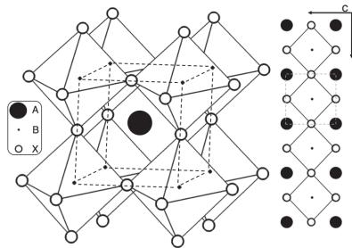
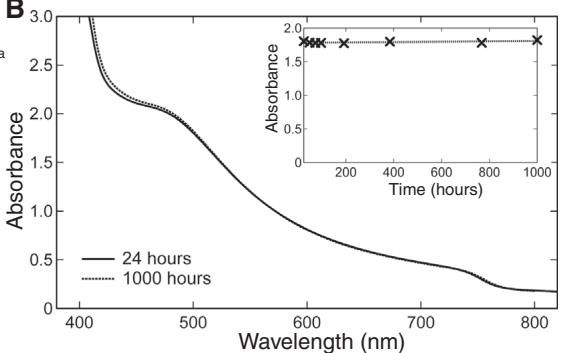
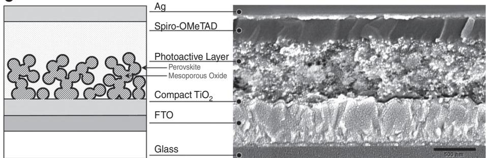
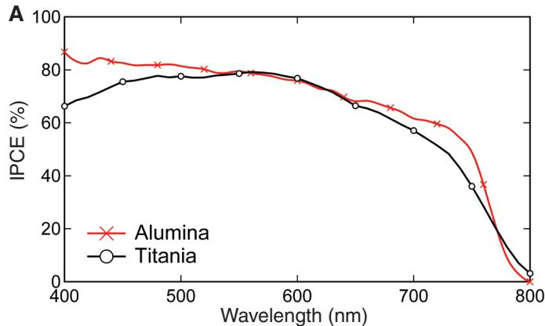
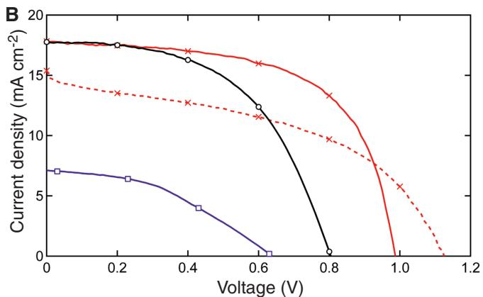
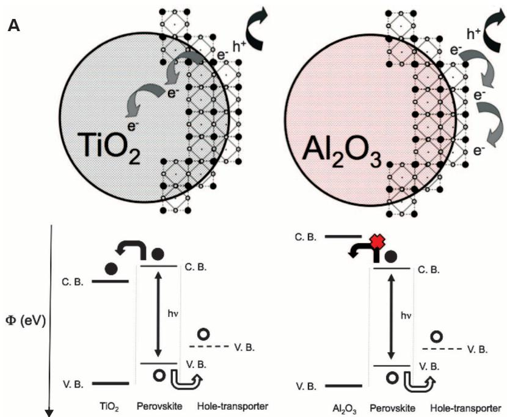
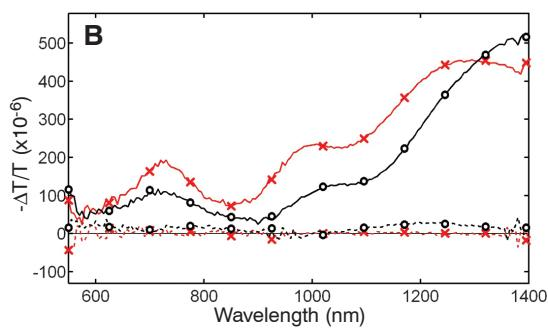
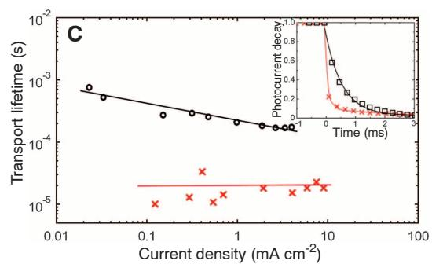

To further corroborate this successful entanglement creation, we transferred only one photon to $l = \pm 300$ and measured the other photon in the polarization bases. The measured witness value was $1.628 \pm 0.004$ . Therefore, our results demonstrate that single photons can carry $300\hbar$ of OAM (where $\hbar$ is Planck's constant divided by $2\pi$ ) and that entanglement between two photons differing by 600 in quantum number can be achieved. Even in classical optics, the highest value of OAM that had been created with an SLM was $l = 200$ (30).

Apart from the fundamental interest of entangling high quantum numbers, we also demonstrate the use of high-OAM entanglement for remote sensing. For this we use the same method as before for creating high-OAM entangled states (folded interferometric scheme including SLM) and analyzing them (slit wheel method). When we transfer one photon to high OAM values and keep the other in its polarization state, the pair can be used to remotely measure an angular rotation with a precision that is increased by a factor $l$ relative to the situation when only polarization-entangled photon pairs are used (Fig. 4) (22). This can lead to notable improvements for applications in the field of remote sensing, especially where low light intensities are required, such as in biological imaging experiments with light-sensitive material. An analogous improvement can be achieved classically if diagonally or circularly polarized light enters our transfer setup. However, the important difference is that entanglement enables the measurements to be done remotely, with the photons being spatially separated or even in unknown locations at some later time.

Our approach could be generalized to higher-dimensional entanglement for spatial modes—for example, by starting with higher-dimensional (hybrid) entanglement and a more complex interferometric scheme. Such a development would have potential benefits in applications such as quantum cryptography, quantum computation, and quantum metrology.

# References and Notes

1. A. Einstein, B. Podolsky, N. Rosen, Phys. Rev. 47, 777 (1935).   
2. J. S. Bell, Physics 1, 195 (1965).   
3. S. J. Freedman, J. F. Clauser, Phys. Rev. Lett. 28, 938 (1972).   
4. P. G. Kwiat, A. M. Steinberg, R. Y. Chiao, Phys. Rev. A 47, R2472 (1993).   
5. A. Mair, A. Vaziri, G. Weihs, A. Zeilinger, Nature 412, 313 (2001).   
6. J. C. Howell, R. S. Bennink, S. J. Bentley, R. W. Boyd, Phys. Rev. Lett. 92, 210403 (2004).   
7. S. Ramelow, L. Ratschbacher, A. Fedrizzi, N. K. Langford, A. Zeilinger, Phys. Rev. Lett. 103, 253601 (2009).   
8. L. Allen, M. W. Beijersbergen, R. J. C. Spreeuw, J. P. Woerdman, Phys. Rev. A 45, 8185 (1992).   
9. N. K. Langford et al., Phys. Rev. Lett. 93, 053601 (2004).   
10. J. Leach et al., Science 329, 662 (2010).   
11. A. Vaziri, G. Weihs, A. Zeilinger, Phys. Rev. Lett. 89, 240401 (2002).   
12. A. C. Dada, L. Leach, G. S. Buller, M. J. Padgett, E. Andersson, Nat. Phys. 7, 677 (2011).   
13. B.-J. Pors, F. Miatto, G. W. 't Hooft, E. R. Eliel, J. P. Woerdman, J. Opt. 13, 064008 (2011).   
14. A. J. Leggett, J. Phys. Condens. Matter 14, R415 (2002).   
15. M. Aspelmeyer, P. Meystre, K. Schwab, Phys. Today 65, 29 (2012).   
16. A. K. Jha, G. S. Agarwal, R. W. Boyd, Phys. Rev. A 83, 053829 (2011).   
17. J. Romero, D. Giovannini, S. Franke-Arnold, S. M. Barnett, M. J. Padgett, http://arxiv.org/abs/1205.1968 (2012).   
18. H. Di Lorenzo Pires, H. C. B. Florijn, M. P. van Exter, Phys. Rev. Lett. 104, 020505 (2010).

19. M. Žukowski, J. Pykacz, Phys. Lett. A 127, 1 (1988).   
20. E. Nagali et al., Phys. Rev. Lett. 103, 013601 (2009).   
21. E. J. Galvez, S. M. Nomoto, W. H. Schubert, M. D. Novenstern, paper presented at the International Conference on Quantum Information, Ottawa, 6 June 2011; www.opticsinfobase.org/abstract.cfm?URI=ICQI-2011-QMI18.   
22. See supplementary materials on Science Online.   
23. S. Chávez-Cerda et al., J. Opt. B 4, S52 (2002).   
24. J. B. Bentley, J. A. Davis, M. A. Bandres, J. C. Gutierrez-Vega, Opt. Lett. 31, 649 (2006).   
25. G. A. Siviloglou, J. Broky, A. Dogariu, D. N. Christodoulides, Phys. Rev. Lett. 99, 213901 (2007).   
26. T. Kim, M. Fiorentino, F. N. C. Wong, Phys. Rev. A 73, 012316 (2006).   
27. A. Fedrizzi, T. Herbst, A. Poppe, T. Jennewein, A. Zeilinger, Opt. Express 15, 15377 (2007).   
28. G. Campbell, B. Hage, B. Buchler, P. K. Lam, Appl. Opt. 51, 873 (2012).   
29. O. Gühne, G. Toth, Phys. Rep. 474, 1 (2009).   
30. A. Jesacher, S. Furhapter, C. Maurer, S. Bernet, M. Ritsch-Marte, Opt. Express 14, 6342 (2006).

Acknowledgments: Supported by the European Research Council (advanced grant QIT4QAD, 227844) and the Austrian Science Fund (FWF) within the Special Research Programs (SFB) F40 (Foundations and Applications of Quantum Science; FoQuS) and W1210-2 (Vienna Doctoral Program on Complex Quantum Systems; CoQuS). R.F. participated in the design and building of the experimental apparatus, collected and analyzed the data, and wrote the manuscript. R.L., C.S., and S.R. participated in the design and building of the experiment and assisted on the experimental side. W.N.P., S.R., and M.K. assisted on the theoretical side. A.Z. initiated the work and supervised the experiment. All authors contributed to conceiving the experiment, discussing the results, and contributing to the final text of the manuscript.

# Supplementary Materials

www.sciencemag.org/cgi/content/full/338/6107/640/DC1

Materials and Methods

Supplementary Text

Table S1

Fig. S1

9 July 2012; accepted 20 September 2012

10.1126/science.1227193

# Efficient Hybrid Solar Cells Based on Meso-Superstructured Organometal Halide Perovskites

Michael M. Lee, $^{1}$ Joël Teuscher, $^{1}$ Tsutomu Miyasaka, $^{2}$ Takurou N. Murakami, $^{2,3}$ Henry J. Snaith $^{1*}$

The energy costs associated with separating tightly bound excitons (photoinduced electron-hole pairs) and extracting free charges from highly disordered low-mobility networks represent fundamental losses for many low-cost photovoltaic technologies. We report a low-cost, solution-processable solar cell, based on a highly crystalline perovskite absorber with intense visible to near-infrared absorptivity, that has a power conversion efficiency of $10.9\%$ in a single-junction device under simulated full sunlight. This "meso-superstructured solar cell" exhibits exceptionally few fundamental energy losses; it can generate open-circuit photovoltaics of more than 1.1 volts, despite the relatively narrow absorber band gap of 1.55 electron volts. The functionality arises from the use of mesoporous alumina as an inert scaffold that structures the absorber and forces electrons to reside in and be transported through the perovskite.

An efficient solar cell must absorb over a broad spectral range, from visible to near-infrared (near-IR) wavelengths (350 to $\sim 950\mathrm{nm}$ ), and convert the incident light effectively into charges. The charges must be collected

at a high voltage with suitable current in order to do useful work (1-8). A simple measure of solar cell effectiveness at generating voltage is the difference in energy between the optical band gap of the absorber and the open-circuit voltage $(V_{\mathrm{oc}})$

generated by the solar cell under simulated air mass (AM) 1.5 solar illumination of $100\mathrm{mWcm}^{-2}$ (9). For instance, gallium arsenide (GaAs) solar cells exhibit $V_{\mathrm{oc}}$ of $1.11\mathrm{V}$ and an optical band gap of $1.4\mathrm{eV}$ , giving a difference of $\sim 0.29\mathrm{eV}$ (2). For dye-sensitized and organic solar cells, this difference is usually on the order of 0.7 to $0.8\mathrm{eV}$ (2, 9). For organic solar cells, such losses are predominantly caused by their low dielectric constants. Tightly bound excitons form, which require a heterojunction with an electron acceptor with a large energy offset to enable ionization and charge separation (10, 11). Likewise, dye-sensitized solar cells (DSSCs) have losses, both from electron transfer from the dye (or absorber) into the $\mathrm{TiO_2}$ , which requires a certain "driving force," and from dye regeneration from

the electrolyte, which requires an overpotential. Efforts have been made to reduce such losses in DSSCs by moving from a multielectron iodide-tri-iodide redox couple to one-electron outer-sphere redox couples, such as cobalt complexes or a solid-state hole conductor (1, 4, 12, 13).

Inorganic semiconductor-sensitized solar cells have recently become a focus of interest (14, 15). An extremely thin absorber (ETA) layer, 2 to $10\mathrm{~nm}$ in thickness, is coated upon the internal surface of a mesoporous $\mathrm{TiO}_2$ electrode and then contacted with an electrolyte or solid-state hole conductor. These devices have achieved power conversion efficiencies of up to $6.3\%$ (15). However, the ETA concept suffers from rather low $V_{\mathrm{oc}}$ ; the problem may lie in the electronically disordered, low-mobility n-type $\mathrm{TiO}_2$ (16). Perovskites are relatively underexplored alternatives (Fig. 1A) that provide a framework for binding organic and inorganic components into a molecular composite. With careful consideration of the interaction between organic and inorganic elements and suitable control of the size-tunable crystal cell (17), rudimentary wet chemistry can be used to create new and interesting materials. Era, Mitzi, and coworkers have shown that layered perovskites based on organometal halides demonstrate excellent performance as light-emitting diodes (18, 19) and transistors with mobilities comparable to amorphous silicon (20). Organometal halide perovskites have been used as sensitizers in liquid electrolyte-based photoelectrochemical cells with conversion efficiencies from 3.5 to $6.5\%$ (21, 22). Recently, a $\mathrm{CsSnI}_3$ perovskite was shown to function efficiently as a hole conductor in solid-state DSSCs, delivering up to $8.5\%$ power conversion efficiency (23, 24).

We report on a solution-processable solar cell that overcomes the fundamental losses of organic absorbers and disordered metal oxides. We followed the ETA approach and used a perovskite absorber, mesoporous $\mathrm{TiO_2}$ as the transparent n-type component, and $2,2^{\prime},7,7^{\prime}$ -tetrakis- $(N,N$ -di- $p$ -methoxyphenylamine) $9,9^{\prime}$ -spirobifluorene (spiro-OMeTAD) as the transparent p-type hole conductor. These devices exhibited power conversion efficiencies near $8\%$ . Remarkably, we also found that replacement of the mesoporous n-type $\mathrm{TiO_2}$ with insulating $\mathrm{Al_2O_3}$ improved the power conversion efficiency. The $\mathrm{Al_2O_3}$ is an insulator with a wide band gap (7 to $9\mathrm{eV}$ ) and purely acts as a "scaffold" upon which the perovskite is coated. We observed that electron transport through the perovskite layer was much faster than through the n-type $\mathrm{TiO_2}$ . In addition, we observed an increase in $V_{\mathrm{oc}}$ (moving from the $\mathrm{TiO_2}$ to the insulating $\mathrm{Al_2O_3}$ scaffold) of a few hundred millivolts and a power conversion efficiency of $10.9\%$ under simulated AM1.5 full solar illumination.

The specific perovskite we used is of mixed-halide form: methylammonium lead iodide chloride $\mathrm{(CH_3NH_3PbI_2Cl)}$ , which was processed from a precursor solution in $N,N$ -dimethylformamide via spin-coating in ambient conditions. X-ray diffraction analysis for $\mathrm{CH}_3\mathrm{NH}_3\mathrm{PbI}_2\mathrm{Cl}$ prepared

on glass (fig. S1) (25) showed diffraction peaks at $14.20^{\circ}$ , $28.58^{\circ}$ , and $43.27^{\circ}$ , which we assigned as the (110), (220), and (330) planes, respectively, of a tetragonal perovskite structure with lattice parameters $a = 8.825\AA$ , $b = 8.835\AA$ , $c = 11.24\AA$ , similar to the $\mathrm{CH}_3\mathrm{NH}_3\mathrm{PbI}_3$ previously reported (21). The extremely narrow diffraction peaks suggest that the films have long-range crystalline domains ( $>200\mathrm{nm}$ , peak width limited by instrument broadening) and are highly oriented with the $a$ axis (21, 26). In contrast to the methylammonium trihalogen plumbates previously reported in solar cells (i.e., $\mathrm{CH}_3\mathrm{NH}_3\mathrm{PbI}_3$ ) (21, 22), this iodide-chloride mixed-halide perovskite was remarkably stable to processing in air. The absorption spectra (Fig. 1B) demonstrated good light-harvesting capabilities over the visible to near-IR spectrum and was also stable to prolonged light exposure, as demonstrated by 1000 hours of constant illumination under simulated full sunlight. The absorbance of the film at $500\mathrm{nm}$ remained around 1.8 throughout the entire measurement period (absorbance of 1.8 corresponds to $98.4\%$ absorption) (Fig. 1B, inset). Note that the scale is optical density, where absorbance of $\sim 0.5$ at 700 nm corresponds to $\sim 70\%$ attenuation in a single pass; in the solar cell, there are two passes of light leading to $\sim 91\%$ absorption at this wavelength.

The solar cells were fabricated on semitransparent fluorine-doped tin oxide (FTO)-coated glass coated with a compact layer of $\mathrm{TiO_2}$ that

acted as an anode. The porous oxide films were fabricated from sol-gel-processed sintered nanoparticles. The perovskite precursor solution was infiltrated into the porous oxide mesostructure via spin-coating and was dried at $100^{\circ}\mathrm{C}$ , which enabled the perovskite to form via self-assembly of the constituent ions. Dark coloration was observed only after this drying step.

With respect to the perovskite coating process, there has been extensive work done on investigating how solution-cast materials infiltrate into mesoporous oxides (27-32). If the concentration of the solution is low enough and the solubility of the cast material high enough, the material will completely penetrate the pores as the solvent evaporates. Typically, the material forms a "wetting" layer upon the internal surface of the mesoporous film that uniformly coats the pore walls throughout the thickness of the electrode (28-31). The degree of "pore filling" can be controlled by varying the solution concentration (29-32). If the concentration of the casting solution is high, then maximum pore filling occurs, and any "excess" material forms a "capping layer" on top of the filled mesoporous oxide.

For the optimum perovskite precursor concentrations we used, there was no appearance of a capping layer, which implies that the perovskite was predominantly formed within the mesoporous film. We verified that the perovskite was within and uniformly distributed throughout the meso

  
A

  
B

  
C   
Fig. 1. (A) Left: Three-dimensional schematic representation of perovskite structure $\mathrm{ABX}_3$ ( $\mathrm{A} = \mathrm{CH}_3\mathrm{NH}_3$ , $\mathrm{B} = \mathrm{Pb}$ , and $\mathrm{X} = \mathrm{Cl}$ , I). Right: Two-dimensional schematic illustrating the perovskite unit cell. (B) Ultraviolet to visible (UV-Vis) absorbance spectra of the photoactive layer in the solar cell (mesoporous oxide; perovskite absorber; spiro-OMeTAD) sealed between two sheets of glass in nitrogen and exposed to simulated AM1.5 sunlight at $100\mathrm{mWcm}^{-2}$ irradiance for up to 1000 hours. No additional UV filtration was used for the solar irradiance. Inset: Extracted optical density at $500\mathrm{nm}$ as a function of time. (C) Left: Schematic representation of full device structure, where the mesoporous oxide is either $\mathrm{Al}_{2}\mathrm{O}_{3}$ or anatase $\mathrm{TiO}_2$ . Right: Cross-sectional SEM image of a full device incorporating mesoporous $\mathrm{Al}_{2}\mathrm{O}_{3}$ . Scale bar, $500\mathrm{nm}$ .

porous oxide films by performing cross-sectional scanning electron microscopy (SEM) with elemental mapping via energy-dispersive x-ray (EDX) analysis (fig. S2) (25). To complete the photoactive layer, the perovskite-coated porous electrode was further filled with the hole transporter, spiro-OMeTAD, via spin-coating; as shown in Fig. 1C, the spiro-OMeTAD forms a capping layer that ensures selective collection of holes at the silver electrode.

In Fig. 2A, the incident photon-to-electron conversion efficiency (IPCE) action spectrum is shown for the devices that use mesoporous $\mathrm{TiO_2}$ and $\mathrm{Al}_{2}\mathrm{O}_{3}$ , exhibiting spectral sensitivity spanning from the visible to the near-IR (400 to $800\mathrm{nm}$ ) with a peak IPCE of $>80\%$ for both oxides. The slight difference in shape arises from the slightly different perovskite concentrations in the optimized devices. In Fig. 2B, we show current density-voltage $(J - V)$ curves measured under simulated AM1.5 illumination of $100\mathrm{mW}$ $\mathrm{cm}^{-2}$ . The sensitized $\mathrm{TiO_2}$ solar cell exhibited a short-circuit photocurrent $(J_{\mathrm{sc}}) = 17.8\mathrm{mA}\mathrm{cm}^{-2}$ , $V_{\mathrm{oc}} = 0.80\mathrm{V}$ , and a fill factor of 0.53, yielding an overall power conversion efficiency $(\eta)$ of $7.6\%$ . We present two different $J - V$ curves for the $\mathrm{Al}_{2}\mathrm{O}_{3}$ -based device. The most efficient device exhibited $J_{\mathrm{sc}} = 17.8\mathrm{mA}\mathrm{cm}^{-2}$ , $V_{\mathrm{oc}} = 0.98\mathrm{V}$ , and a fill factor of 0.63, yielding $\eta = 10.9\%$ . The third curve (dashed trace) shows a device with $J_{\mathrm{sc}} = 15.4\mathrm{mA}\mathrm{cm}^{-2}$ and $V_{\mathrm{oc}} = 1.13\mathrm{V}$ but a low fill factor of 0.45, yielding $\eta = 7.8\%$ . [See (25) for histograms of device performance parameters for the $\mathrm{TiO_2}$ - and $\mathrm{Al}_{2}\mathrm{O}_{3}$ -based devices (fig. S3)].

The general trend is that the $\mathrm{Al_2O_3}$ cells generated open-circuit voltages that were $>200\mathrm{mV}$ higher than those generated by the sensitized $\mathrm{TiO_2}$ solar cells, with comparable short-circuit currents and slightly lower fill factors. From the solar cell measurements on alumina-based devices, it was apparent that the perovskite layer could function as both absorber and n-type component, transporting electronic charge out of the device. We further illustrate the "semiconducting"

nature of the perovskite by the construction of a planar-junction diode with the structure FTO / compact $\mathrm{TiO_2}$ / $\mathrm{CH}_3\mathrm{NH}_3\mathrm{PbI}_2\mathrm{Cl}$ / spiro-OMeTAD / Ag. The perovskite film was $\sim 150$ nm thick in this configuration, and the solar cell exhibited $J_{\mathrm{sc}} = 7.13\mathrm{mAcm}^{-2}$ , $V_{\mathrm{oc}} = 0.64\mathrm{V}$ , a fill factor of 0.4, and $\eta = 1.8\%$ .

If we take the optical band gap of $\mathrm{CH}_3\mathrm{NH}_3\mathrm{PbI}_2\mathrm{Cl}$ to be $1.55\mathrm{eV}$ from the IPCE onset at $800~\mathrm{nm}$ (33) and the open-circuit voltage to be $1.1\mathrm{V}$ , this represents a difference in energy of only $0.45\mathrm{eV}$ , competitive with the best thin-film technologies (2). To understand why we observed such an increase in voltage over the $\mathrm{TiO_2}$ cells, we need to consider the operational mode of the two concepts (Fig. 3A). For sensitized $\mathrm{TiO_2}$ devices, we would expect that after light absorption in the perovskite, electrons would be transferred to the $\mathrm{TiO_2}$ (with subsequent electron transport to the FTO electrode through the $\mathrm{TiO_2}$ ) and holes would be transferred to the spiro-OMeTAD (with subsequent transport to the silver electrode). For $\mathrm{Al}_{2}\mathrm{O}_{3}$ -based cells, the electrons must remain in the perovskite phase (34) until they are collected at the planar $\mathrm{TiO_2}$ -coated FTO electrode, and must hence be transported throughout the film thickness in the perovskite. Hole transfer from the photoexcited perovskite to the spiro-OMeTAD should occur in much the same way as in the sensitized device. $\mathrm{Al}_{2}\mathrm{O}_{3}$ did not act as an n-type oxide in DSSCs (fig. S4) (25).

To examine the charge generation in these devices, we performed photoinduced absorption (PIA) spectroscopy on the oxide films coated with the perovskite, both with and without the addition of spiro-OMeTAD. For the mesoporous $\mathrm{TiO_2}$ film coated with perovskite, the PIA spectrum revealed features in the near-IR assigned to the free electrons in the titania (35), confirming effective sensitization of the titania by the perovskite. In contrast, films made of $\mathrm{Al}_{2}\mathrm{O}_{3}$ coated with perovskite exhibited no PIA signal, confirming the insulating role of alumina. After addition of spiro-OMeTAD, we could efficiently monitor the oxidized species of spiro-OMeTAD created after

photoexcitation of the perovskite. They had absorption features at 525 and $750~\mathrm{nm}$ as well as a broad band around $1200~\mathrm{nm}$ , assigned to the hole located on the triarylamine moieties (28, 36), which dominated the spectra in both the $\mathrm{TiO_2}$ and $\mathrm{Al}_{2}\mathrm{O}_{3}$ -based samples. These results indicate that hole transfer is highly effective from the photoexcited perovskite to spiro-OMeTAD, and specifically that a hole conductor is required to enable long-lived charge species within the perovskite coated on the $\mathrm{Al}_{2}\mathrm{O}_{3}$ . We note that the PIA signal depended both on the concentration and lifetime of the species monitored; hence, from this measurement alone, quantification of the relative charge-generated yield is not possible.

To probe the effectiveness of the perovskite layer at transporting electronic charge out of the device, we performed small-perturbation transient photocurrent decay measurements (37). The solar cells were exposed to simulated sunlight and "flashed" with a small red light pulse; in such experiments, the decay rate of the transient photocurrent signal is approximately proportional to the rate of charge transport out of the photoactive layer (37). As shown in Fig. 3C, we observed that charge collection in the $\mathrm{Al_2O_3}$ -based devices was faster than in the $\mathrm{TiO_2}$ -based sensitized devices by a factor of $>10$ , indicating faster electron diffusion through the perovskite phase than through the n-type $\mathrm{TiO_2}$ .

Because there is no n-type oxide in the $\mathrm{Al_2O_3}$ based cells, the devices are not "sensitized" solar cells, but rather two-component hybrid solar cells. As designed, the $\mathrm{Al_2O_3}$ is simply acting as a mesoscale "scaffold" upon which the device is structured; we term this concept a "mesosuperstructured solar cell" (MSSC). The above measurements demonstrate that long-lived charge carriers can be generated via hole transfer from the perovskite to spiro-OMeTAD and that the perovskite layer is faster at transporting electronic charge than the mesoporous $\mathrm{TiO_2}$ . However, they do not explain the increase in $V_{\mathrm{oc}}$ values. The $V_{\mathrm{oc}}$ is generated by the build-up of electrons in

  
Fig. 2. (A) IPCE action spectrum of an $\mathrm{Al_2O_3}$ -based and perovskite-sensitized $\mathrm{TiO_2}$ solar cell, with device structure as follows: FTO / compact $\mathrm{TiO_2}$ / mesoporous $\mathrm{Al_2O_3}$ (red trace with crosses) or mesoporous $\mathrm{TiO_2}$ (black trace with circles) / $\mathrm{CH}_3\mathrm{NH}_3\mathrm{PbI}_2\mathrm{Cl}$ / spiro-OMeTAD / Ag. (B) Current density-voltage characteristics under simulated AM1.5 $100\mathrm{mWcm}^{-2}$ illumination for $\mathrm{Al_2O_3}$ -based cells, one

  
cell exhibiting high efficiency (red solid trace with crosses) and one exhibiting $V_{\mathrm{OC}} > 1.1 \mathrm{~V}$ (red dashed line with crosses); for a perovskite-sensitized $\mathrm{TiO}_2$ solar cell (black trace with circles); and for a planar-junction diode with structure FTO / compact $\mathrm{TiO}_2 / \mathrm{CH}_3\mathrm{NH}_3\mathrm{PbI}_2\mathrm{Cl} /$ spiro-OMeTAD / Ag (purple trace with squares).

  
Fig. 3. (A) Schematic illustrating the charge transfer and charge transport in a perovskite-sensitized $\mathrm{TiO}_2$ solar cell (left) and a noninjecting $\mathrm{Al}_{2}\mathrm{O}_{3}$ -based solar cell (right); a representation of the energy landscape is shown below, with electrons shown as solid circles and holes as open circles. (B) Photoinduced absorbance (PIA) spectra of the mesoporous $\mathrm{TiO}_2$ films (black circles) and $\mathrm{Al}_{2}\mathrm{O}_{3}$ films (red crosses) coated with perovskite with (solid lines) and without (dashed lines) spiro-OMeTAD hole transporter,   
under $496.5 \mathrm{~nm}$ excitation at $23 \mathrm{~Hz}$ repetition rate. (C) Charge transport lifetime determined by small-perturbation transient photocurrent decay measurement of perovskite-sensitized $\mathrm{TiO}_{2}$ cells (black circles) and $\mathrm{Al}_{2} \mathrm{O}_{3}$ cells (red crosses), both with lines to aid the eye. Inset shows normalized photocurrent transients for $\mathrm{Al}_{2} \mathrm{O}_{3}$ cells (red trace with crosses every 7th point) and $\mathrm{TiO}_{2}$ cells (black trace with circles every 7th point), set to generate $5 \mathrm{~mA} \mathrm{~cm}^{-2}$ photocurrent from the background light bias.

the n-type material and holes in the p-type material, resulting in splitting of the quasi Fermi levels for both electrons and holes. For mesoporous $\mathrm{TiO_2}$ , there exist sites in the tail of the density of states that extend into the band gap (38). These fill with electrons under illumination; the result is that the quasi-Fermi level for electrons $(E_{\mathrm{Fn}}^{*})$ is farther from the conduction band, for any given charge density, than would be the case if these states did not exist (i.e., in a highly crystalline semiconductor). The increased charge-storing capacity of materials with a high density of sub-band gap states is termed "chemical capacitance" (38). There is, in essence, no chemical capacitance of the $\mathrm{Al}_{2}\mathrm{O}_{3}$ , and for the MSSCs all the electronic charge resides in the perovskite, moving the $E_{\mathrm{Fn}}^{*}$ in this material nearer to the conduction band for the same charge density. The higher voltage indicates that there are fewer surface and sub-band gap states in the perovskite films than in the mesoporous $\mathrm{TiO_2}$ . Hence, the increased voltage is caused by a substantial reduction of the chemical capacitance of the solar cell. We used a compact layer of $\mathrm{TiO_2}$ as the electron-selective anode, but the chemical capacitance of this extremely thin (50 to $100\mathrm{nm}$ ) $\mathrm{TiO_2}$ layer was very low because of the low volume and surface area (i.e., flat). In addition, the compact layer deposited via spray pyrolysis has a donor density of $\sim 10^{18}\mathrm{cm}^{-3}$ (39), and the sub-band gap sites responsible for the chemical capacitance may be full.

A central question is whether the MSSC is excitonic or a distributed p-n junction. The pe

rovskites tend to form layered structures, with continuous two-dimensional metal halide planes perpendicular to the $z$ axis and the lower dielectric organic components (methyl amine) between these planes. The possible quasi-two-dimensional confinement of the excitons can result in an increased exciton binding energy, which can be up to a few hundred millielectron volts (40). The reasonably high photocurrents from the planar-junction solar cells (Fig. 2B) could be explained by either moderately delocalized and highly mobile excitons being quenched at the perovskite-spiro-OMeTAD interface, or the generation of free charges in the bulk of the perovskite films with reasonably good electron and hole migration out of the devices.

The key limitation in performance of the MSSC at present is a balance between series and shunt resistance. The perovskite absorber is reasonably conductive, measured to be on the order of $10^{-3}\mathrm{Scm}^{-3}$ ; thus, short-circuiting of the device occurs if contact exists between the silver electrode and the perovskite absorber. A thick capping layer of p-type spiro-OMeTAD readily resolves this issue, however; spiro-OMeTAD is less conductive $(\sim 10^{-5}\mathrm{Scm}^{-1})$ , so a thicker capping layer results in high series resistance. Thus, we are presented with a compromise.

Our work represents an evolution of the solid-state sensitized solar cell with low fundamental losses. The application of a mesostructured insulating scaffold upon which extremely thin films of n-type and p-type semiconductors are assembled, termed the meso-superstructured solar cell

(MSSC), has proven to be extraordinarily effective with an n-type perovskite, delivering more than $10.9\%$ power conversion efficiency under full solar illumination. Further advances in overall power conversion efficiency are expected by extending the absorption onset toward $940~\mathrm{nm}$ through the implementation of new perovskites or broadening this concept to other solution-processable semiconductors. Enhancing the light absorption near the band edge through carefully engineered mesostructures or better photon management would lead to increased photocurrent. Reduced series resistance through the use of higher-mobility hole transporters, or better control over the capping layer thickness, would improve the fill factor. Finally, extending this system to multijunction devices (without the requirement for lattice matching, as in conventional multijunction solar cells) would further enhance performance.

# References and Notes

1. B. O'Regan, M. Grätzel, Nature 353, 737 (1991).   
2. M. A. Green, K. Emery, Y. Hishikawa, W. Warta, E. D. Dunlop, Prog. Photovoltaic Res. Appl. 20, 12 (2012).   
3. L. Han et al., Energy Environ. Sci. 5, 6057 (2012).   
4. A. Yella et al., Science 334, 629 (2011).   
5. G. Yu, J. Gao, J. C. Hummelen, F. Wudl, A. J. Heeger, Science 270, 1789 (1995).   
6. J. M. Halls et al., Nature 376, 498 (1995).   
7. A. H. Ip et al., Nature Nano. 7, 577 (2012).   
8. T. K. Todorov, K. B. Reuter, D. B. Mitzi, Adv. Mater. 22, E156 (2010).   
9. H. J. Snaith, Adv. Funct. Mater. 20, 13 (2010).   
10. G. Dennler, M. C. Scharber, C. J. Brabec, Adv. Mater. 21, 1323 (2009).

11. B. E. Hardin, H. J. Snaith, M. D. McGehee, Nat. Photonics 6, 162 (2012).   
12. U. Bach et al., Nature 395, 583 (1998).   
13. J. Burschka et al., J. Am. Chem. Soc. 133, 18042 (2011).   
14. Y. Itzhaik, O. Niitsoo, M. Page, G. Hodes, J. Phys. Chem. C 113, 4254 (2009).   
15. J. A. Chang et al., Nano Lett. 12, 1863 (2012).   
16. J. Nelson, Phys. Rev. B 59, 15374 (1999).   
17. D. B. Mitzi, C. A. Field, W. T. A. Harrison, A. M. Guloy, Nature 369, 467 (1994).   
18. K. Chondroudis, D. B. Mitzi, Chem. Mater. 11, 3028 (1999).   
19. M. Era, T. Tsutsui, S. Saito, Appl. Phys. Lett. 67, 2436 (1995).   
20. C. R. Kagan, D. B. Mitzi, C. D. Dimitrakopoulos, Science 286, 945 (1999).   
21. A. Kojima, K. Teshima, Y. Shirai, T. Miyasaka, J. Am. Chem. Soc. 131, 6050 (2009).   
22. J. H. Im, C. R. Lee, J. W. Lee, S. W. Park, N. G. Park, Nanoscale 3, 4088 (2011).   
23. I. Chung, B. Lee, J. He, R. P. H. Chang, M. G. Kanatzidis, Nature 485, 486 (2012).   
24. H. J. Snaith, Energy Environ. Sci. 5, 6513 (2012).   
25. See supplementary materials on Science Online.

26. A. Poglitsch, D. Weber, J. Chem. Phys. 87, 6373 (1987).   
27. T. Leijtens et al., ACS Nano 6, 1455 (2012).   
28. H. J. Snaith et al., Nanotechnology 19, 424003 (2008).   
29. J. Melas-Kyriazi et al., Adv. Energy Mater. 1, 407 (2011).   
30. A. Abrusci et al., Energy Environ. Sci. 4, 3051 (2011).   
31. I.-K. Ding et al., Adv. Funct. Mater. 19, 2431 (2009).   
32. P. Docampo et al., Adv. Funct. Mater. 10.1002/adfm.201201223 (2012).   
33. D. A. R. Barkhouse, O. Gunawan, T. Gokmen, T. K. Todorov, D. B. Mitzi, Prog. Photovoltaic. Appl. 20, 6 (2012).   
34. A. Kojima, M. Ikegami, K. Teshima, T. Miyasaka, Chem. Lett. 41, 397 (2012).   
35. G. Rothenberger, D. Fitzmaurice, M. Graetzel, J. Phys. Chem. 96, 5983 (1992).   
36. G. Boschloo, A. Hagfeldt, Inorg. Chim. Acta 361, 729 (2008).   
37. P. Docampo et al., Adv. Funct. Mater. 20, 1787 (2010).   
38. J. Bisquert, Phys. Chem. Chem. Phys. 5, 5360 (2003).   
39. L. Kavan, M. Grätzel, Electrochim. Acta 40, 643 (1995).   
40. T. Ishihara, J. Takahashi, T. Goto, Phys. Rev. B 42, 11099 (1990).

Acknowledgments: Supported by the European Research Council (HYPER project no. 279881), the Strategic International Research Cooperative Program of the UK Engineering and Physical Sciences Research Council, and the Japan Science and Technology Agency. T.M. thanks the funding program for World-Leading Innovative R&D on Science and Technology (FIRST Program), Japan, for hybrid solar cell research. We thank the New Energy and Industrial Technology Development Organization for support. M.M.L. is grateful for support from the Simms Bursary granted by Merton College, Oxford. We thank S. K. Pathak for assistance with x-ray diffraction measurements and analysis, and A. Abrusci, J. Ball, P. Docampo, A. Hey, T. Leijtens, N. Noel, and A. Kojima for valuable discussions. The University of Oxford has filed three patents related to this work.

# Supplementary Materials

www.sciencemag.org/cgi/content/full/science.1228604/DC1

Materials and Methods

Supplementary Text

Figs. S1 to S4

31 May 2012; accepted 7 September 2012

Published online 4 October 2012;

10.1126/science.1228604

# Photoinduced Ullmann C-N Coupling: Demonstrating the Viability of a Radical Pathway

Sidney E. Creutz, $^{1*}$ Kenneth J. Lotito, $^{1*}$ Gregory C. Fu, $^{1,2\dagger}$ Jonas C. Peters $^{1\dagger}$

Carbon-nitrogen (C-N) bond-forming reactions of amines with aryl halides to generate arylamines (anilines), mediated by a stoichiometric copper reagent at elevated temperature $(>180^{\circ}\mathrm{C})$ , were first described by Ullmann in 1903. In the intervening century, this and related C-N bond-forming processes have emerged as powerful tools for organic synthesis. Here, we report that Ullmann C-N coupling can be photoinduced by using a stoichiometric or a catalytic amount of copper, which enables the reaction to proceed under unusually mild conditions (room temperature or even $-40^{\circ}\mathrm{C}$ ). An array of data are consistent with a single-electron transfer mechanism, representing the most substantial experimental support to date for the viability of this pathway for Ullmann C-N couplings.

Arylamines (anilines) are a commonly encountered subunit in organic compounds and are important in fields ranging from pharmaceuticals to materials science (1-3). Because many aryl halides and amines are readily available, coupling these two reactants provides a particularly attractive, convergent approach to the synthesis of arylamines. Thus, the discovery by Ullmann in 1903 that this C-N bond construction can be accomplished by heating these partners in the presence of a stoichiometric amount of copper was a landmark achievement (Fig. 1A) (4, 5). During the past 20 years, there have been numerous advances in C-N coupling reactions, ranging from the discovery of milder, copper-catalyzed

$^{1}$ Division of Chemistry and Chemical Engineering, California Institute of Technology, Pasadena, CA 91125, USA. $^{2}$ Department of Chemistry, Massachusetts Institute of Technology, Cambridge, MA 02139, USA.

*These authors contributed equally to this work. †To whom correspondence should be addressed. E-mail: gcfu@caltech.edu (G.C.F.); jpeters@caltech.edu (J.C.P.)

Ullmann processes to the development of methods based on palladium and other transition metals (6-11).

Despite the importance of copper-based Ullmann C-N coupling reactions, understanding of the mechanism of these processes has evolved only slowly (6-9, 12). It is believed that Ullmann couplings generally begin with $\mathrm{Cu - N}$ bond formation; however, a variety of pathways for the subsequent cleavage of the Ar-X bond have been proposed, including a concerted oxidative addition (13, 14) and a single-electron transfer (SET, which encompasses halogen-atom transfer) mechanism with radical intermediates (Fig. 1B) (15). It is likely that different pathways operate under different conditions.

Currently, there is virtually no direct experimental evidence for the viability of an SET mechanism for Ullmann C-N couplings (12), although Buchwald and Houk have recently published a computational study in support of this pathway for certain processes (15, 16). With respect to Ullmann C-C bond formation, Kim has observed

that oligothiophenes can be generated upon ultraviolet irradiation $(\sim 140\mathrm{nm})$ of 2,5-diiodothiophene on a copper metal surface, presumably via direct photodissociation of the C-I bond (17, 18). In this report, we provide an array of experimental data for the reaction of aryl halides with well-defined copper(I) amido complex 1, all of which are consistent with an SET/radical mechanism for Ullmann C-N coupling. In addition to furnishing the strongest evidence to date for the viability of an SET pathway, this study introduces a photoinduced variant of this powerful transformation.

During the past several years, we have explored the chemistry of copper(I) amido complexes (19, 20), and we have determined that adducts such as carbazolide complex $(\mathrm{Ph}_3\mathrm{P})_2\mathrm{Cu}(\mathrm{carbazolide})$ (2) are photoluminescent when irradiated between 300 and $400~\mathrm{nm}$ (21). We envisioned that we could capitalize on the photophysical properties of this family of complexes as a mechanistic tool in order to examine the viability of an SET/radical pathway for Ullmann C-N bond formation (Fig. 1C). Thus, irradiation of a copper-carbazolide complex could lead to electron transfer to the aryl halide to afford a radical anion, which would rapidly fragment to form an aryl radical and a halide anion (Fig. 1C, top) (22). This aryl radical could then react with the copper complex to furnish the C-N coupling product. Alternatively, the aryl radical could be generated directly through halogen atom transfer from the aryl halide to the copper-carbazolide complex (inner-sphere electron-transfer) (Fig. 1C, bottom). Regardless of which mechanism is followed, this would provide a photoinduced (23, 24) pathway for Ullmann C-N coupling.

In a preliminary investigation, we determined that the luminescence of $(\mathrm{Ph}_3\mathrm{P})_2\mathrm{Cu}(\mathrm{carbazolide})$ (2) is quenched upon the addition of iodobenzene; furthermore, irradiation of the mixture leads to C-N bond formation. However, our desire for improved solubility properties led us to synthesize a related copper complex in which the $\mathrm{PPh}_3$

# Efficient Hybrid Solar Cells Based on Meso-Superstructured Organometal Halide Perovskites

Michael M. Lee, Joel Teuscher, Tsutomu Miyasaka, Takurou N. Murakami, and Henry J. Snaith

Science 338 (6107), . DOI: 10.1126/science.1228604

# Perovskite Photovoltaics

For many types of low-cost solar cells, including those using dye-sensitized titania, performance is limited by low open-circuit voltages. Lee et al. (p. 643, published online 4 October; see the Perspective by Norris and Aydil) have developed a solid-state cell in which structured films of titania or alumina nanoparticles are solution coated with a lead-halide perovskite layer that acts as the absorber and n-type photoactive layer. These particles are coated with a spirobifluorene organic-hole conductor in a solar cell with transparent oxide and metal contacts. For the alumina particles, power conversion efficiencies of up to $10.9\%$ were obtained.

View the article online

https://www.science.org/doi/10.1126/science.1228604

Permissions

https://www.science.org/help/reprints-and-permissions

Use of this article is subject to the Terms of service