# pvsk2013-gaia

Add your description here

<!-- badges:start -->
<!-- badges:end -->

## Overview

> [!TIP]
> **Reasoning graph information gain: `2.2 bits`**
>
> Total mutual information between leaf premises and exported conclusions — measures how much the reasoning structure reduces uncertainty about the results.

```mermaid
---
config:
  flowchart:
    rankSpacing: 80
    nodeSpacing: 30
---
graph TB
    sequential_deposition_introduced["★ Sequential deposition method introduced\n(0.92 → 0.92)"]:::exported
    control_improvement["★ Sequential method improves morphology control\n(0.50 → 0.85)"]:::exported
    efficiency_achieved["★ 15% efficiency achieved with sequential deposition\n(0.50 → 0.79)"]:::exported
    reproducibility_improvement["★ Sequential method improves reproducibility\n(0.50 → 0.84)"]:::exported
    best_device_modification["★ Modified conditions for best-performing devices\n(0.88 → 0.88)"]:::exported
    pbi2_complete_infiltration["★ PbI2 completely contained within TiO2 nanopores\n(0.90 → 0.90)"]:::exported
    pbi2_crystal_size["★ PbI2 crystal size limited to ~22 nm in nanopores\n(0.88 → 0.88)"]:::exported
    perovskite_xrd_confirmed["★ Tetragonal perovskite XRD peaks observed after conversion\n(0.90 → 0.90)"]:::exported
    flat_substrate_incomplete_conversion["★ Flat substrate shows incomplete perovskite conversion\n(0.85 → 0.85)"]:::exported
    conversion_rate_enhancement["★ Nanoscopic confinement dramatically accelerates conversion\n(0.50 → 0.80)"]:::exported
    device_batch_statistics["★ Batch average PCE: 12.0% +/- 0.5%\n(0.90 → 0.90)"]:::exported
    ipce_peak_value["★ IPCE peak exceeds 90% in short wavelengths\n(0.90 → 0.90)"]:::exported
    integrated_current_match["★ Integrated IPCE current matches measured Jsc\n(0.50 → 0.86)"]:::exported
    apce_exceeds_90_percent["★ APCE exceeds 90% indicating near-unity quantum yield\n(0.90 → 0.90)"]:::exported
    best_device_performance["★ Best device: 15.0% PCE\n(0.50 → 0.77)"]:::exported
    best_device_improvement_attributed["★ Higher photocurrent from increased loading and light scattering\n(0.78 → 0.78)"]:::exported
    stability_result["★ Device retains >80% PCE after 500 hours\n(0.88 → 0.88)"]:::exported
    no_photodegradation["★ No photodegradation observed\n(0.85 → 0.85)"]:::exported
    pce_decrease_mechanism["★ PCE decrease due to Voc and FF reduction from shunt resistance loss\n(0.50 → 0.82)"]:::exported
    conversion_facilitation["★ Nanoporous confinement facilitates perovskite conversion\n(0.50 → 0.77)"]:::exported
    layered_pbi2_structure["★ Layered PbI2 structure enables cation insertion\n(0.90 → 0.90)"]:::exported
    thermodynamic_driving_force["★ Lattice energy difference drives conversion\n(0.82 → 0.82)"]:::exported
    reaction_kinetics_enhancement["★ Nanoscopic morphology combined with high formation energy enhances kinetics\n(0.85 → 0.85)"]:::exported
    strat_0(["infer\n0.25 bits"]):::weak
    apce_exceeds_90_percent --> strat_0
    ipce_peak_value --> strat_0
    strat_0 --> integrated_current_match
    strat_1(["infer\n0.30 bits"]):::weak
    best_device_improvement_attributed --> strat_1
    best_device_modification --> strat_1
    strat_1 --> best_device_performance
    strat_2(["infer\n0.20 bits"]):::weak
    control_improvement --> strat_2
    conversion_rate_enhancement --> strat_2
    strat_2 --> efficiency_achieved
    strat_3(["infer\n0.29 bits"]):::weak
    control_improvement --> strat_3
    device_batch_statistics --> strat_3
    strat_3 --> reproducibility_improvement
    strat_4(["infer\n0.30 bits"]):::weak
    flat_substrate_incomplete_conversion --> strat_4
    pbi2_crystal_size --> strat_4
    perovskite_xrd_confirmed --> strat_4
    strat_4 --> conversion_rate_enhancement
    strat_5(["infer\n0.31 bits"]):::weak
    layered_pbi2_structure --> strat_5
    reaction_kinetics_enhancement --> strat_5
    thermodynamic_driving_force --> strat_5
    strat_5 --> conversion_facilitation
    strat_6(["infer\n0.28 bits"]):::weak
    no_photodegradation --> strat_6
    stability_result --> strat_6
    strat_6 --> pce_decrease_mechanism
    strat_7(["infer\n0.24 bits"]):::weak
    pbi2_complete_infiltration --> strat_7
    sequential_deposition_introduced --> strat_7
    strat_7 --> control_improvement

    classDef premise fill:#ddeeff,stroke:#4488bb,color:#333
    classDef exported fill:#d4edda,stroke:#28a745,stroke-width:2px,color:#333
    classDef weak fill:#fff9c4,stroke:#f9a825,stroke-dasharray: 5 5,color:#333
    classDef contra fill:#ffebee,stroke:#c62828,color:#333
```

## Conclusions

| Label | Content | Prior | Belief |
|-------|---------|-------|--------|
| absorption_increase | The increase in perovskite absorption at 550 nm during conversion is practica... | 0.50 | 0.50 |
| apce_exceeds_90_percent | The absorbed-photon-to-current conversion efficiency (APCE) derived from IPCE... | 0.90 | 0.90 |
| best_device_improvement_attributed | The significantly higher photocurrent in top-performance devices is attribute... | 0.78 | 0.78 |
| best_device_modification | For the best-performing devices (15% PCE), the PbI2 is spin-cast at 6,500 rpm... | 0.88 | 0.88 |
| best_device_performance | The best-performing cell (fabricated with modified conditions) shows: Jsc = 2... | 0.50 | 0.77 |
| certified_efficiency | One of the best-performing devices was sent to an accredited photovoltaic cal... | 0.50 | 0.50 |
| color_change_observed | Dipping the TiO2/PbI2 composite film into CH3NH3I solution (10 mg/ml in 2-pro... | 0.50 | 0.50 |
| control_improvement | The sequential deposition method permits much better control over perovskite ... | 0.50 | 0.85 |
| conversion_facilitation | The confinement of PbI2 within the nanoporous TiO2 network greatly facilitate... | 0.50 | 0.77 |
| conversion_rate_enhancement | Confining PbI2 crystals to approximately 22 nm within mesoporous TiO2 drastic... | 0.50 | 0.80 |
| device_batch_statistics | Statistical data from a batch of ten photovoltaic devices shows an average PC... | 0.90 | 0.90 |
| device_structure | The photovoltaic device structure consists of: FTO-coated glass substrate (fr... | 0.50 | — |
| efficiency_achieved | Using the sequential deposition technique for solid-state mesoscopic solar ce... | 0.50 | 0.79 |
| flat_substrate_incomplete_conversion | On flat glass substrate, conversion of PbI2 to perovskite is incomplete; a la... | 0.85 | 0.85 |
| future_potential | Perovskite-based photovoltaic devices fabricated using this method have poten... | 0.50 | 0.50 |
| htm_deposition | The HTM is deposited by spin coating at 4,000 rpm for 30 s using a solution o... | 0.50 | — |
| integrated_current_match | Integrating the overlap of the IPCE spectrum with the AM1.5G solar photon flu... | 0.50 | 0.86 |
| ipce_measurement | IPCE spectra are recorded as functions of wavelength under constant white lig... | 0.50 | — |
| ipce_onset | IPCE shows photocurrent generation starting at 800 nm, consistent with the ba... | 0.50 | 0.50 |
| ipce_peak_value | IPCE reaches peak values of over 90% in the short-wavelength region of the vi... | 0.90 | 0.90 |
| j_v_measurement | Current-voltage characteristics are measured under simulated AM1.5G solar irr... | 0.50 | — |
| layered_pbi2_structure | The insertion of the organic cation is facilitated through the layered PbI2 s... | 0.90 | 0.90 |
| lhe_data | The low IPCE values in the 600-800 nm range result from the smaller absorptio... | 0.50 | 0.50 |
| mai_conversion | After PbI2 infiltration, films are dipped in a solution of CH3NH3I in 2-propa... | 0.50 | — |
| mesoporous_tio2_deposition | Mesoporous TiO2 films composed of 20-nm-sized particles are deposited by spin... | 0.50 | — |
| nanomorphology_enforced | The mesoporous TiO2 scaffold forces the perovskite to adopt a confined nanomo... | 0.50 | 0.50 |
| nanomorphology_enforcement | The mesoporous scaffold forces the perovskite to adopt a confined nanomorphol... | 0.50 | 0.50 |
| no_photodegradation | No change in short-circuit photocurrent is observed during the 500-hour stabi... | 0.85 | 0.85 |
| optical_spectroscopy | Optical absorption measurements are carried out using a Varian Cary 5 spectro... | 0.50 | — |
| pbi2_complete_infiltration | PbI2 infiltration into mesoporous TiO2 films is complete: cross-sectional SEM... | 0.90 | 0.90 |
| pbi2_crystal_size | When confined within mesoporous TiO2 scaffold, PbI2 crystal size is limited t... | 0.88 | 0.88 |
| pbi2_infiltration | PbI2 is dissolved in N,N-dimethylformamide (DMF) at a concentration of 462 mg... | 0.50 | — |
| pbi2_tio2_orientation | PbI2 loaded on mesoporous TiO2 shows three additional diffraction peaks (not ... | 0.50 | 0.50 |
| pce_decrease_mechanism | The decrease in PCE during stability testing is due only to decreases in open... | 0.50 | 0.82 |
| performance_table | Photovoltaic performance at different light intensities:

| Intensity (mW/cm^... | 0.50 | 0.50 |
| perovskite_definition | Solution-processable organic-inorganic hybrid perovskites have the general fo... | 0.50 | — |
| perovskite_pl_increase | The perovskite luminescence at 775 nm increases concomitantly with conversion... | 0.50 | 0.50 |
| perovskite_xrd_confirmed | XRD shows new diffraction peaks after CH3NH3I reaction that are in good agree... | 0.90 | 0.90 |
| pl_quenching_pbi2 | The conversion is accompanied by quenching of PbI2 emission at 425 nm, confir... | 0.50 | 0.50 |
| prior_work_limitation | The single-step deposition of perovskite pigment onto mesoporous metal oxide ... | 0.50 | 0.50 |
| reaction_kinetics_enhancement | The large energy of formation of the hybrid perovskite combined with the nano... | 0.85 | 0.85 |
| record_efficiency | The power conversion efficiency of 15% achieved with the best device is among... | 0.50 | 0.50 |
| reproducibility_demonstrated | The sequential deposition method provides a means to achieve excellent photov... | 0.50 | 0.50 |
| reproducibility_improvement | The sequential deposition method greatly increases the reproducibility of pho... | 0.50 | 0.84 |
| sequential_deposition_introduced | A sequential deposition method is introduced for the formation of the perovsk... | 0.92 | 0.92 |
| stability_result | A sealed photovoltaic device maintained more than 80% of its initial PCE afte... | 0.88 | 0.88 |
| stability_testing | For long-term stability tests, devices are sealed in argon using a 50-mm-thic... | 0.50 | — |
| thermodynamic_driving_force | The thermodynamic driving force for the two-step conversion is the difference... | 0.82 | 0.82 |
| two_step_method_applicability | The two-step sequential deposition method is applicable to other preformed me... | 0.50 | 0.50 |
| typical_device_performance | A typical photovoltaic device measured at 95.6 mW/cm^2 shows: short-circuit p... | 0.50 | 0.50 |
| xrd_measurement | X-ray powder diagrams are recorded on an X'Pert MPD PRO (PANalytical) with Cu... | 0.50 | — |

<!-- content:start -->
<!-- content:end -->
