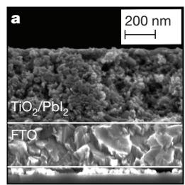
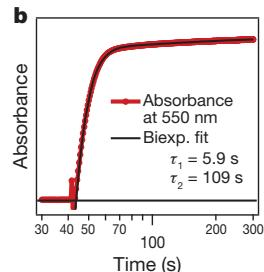
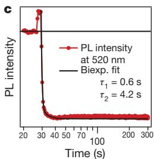
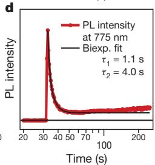
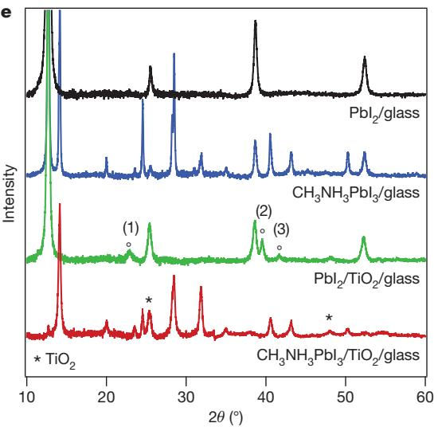
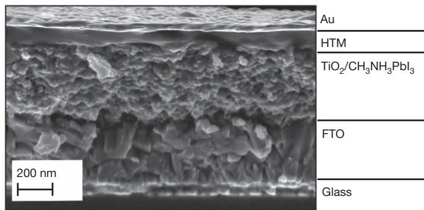
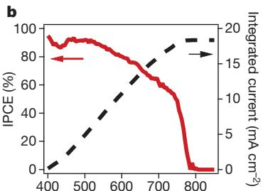
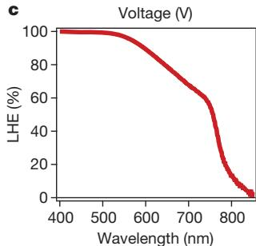
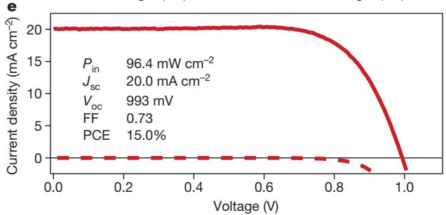

# Sequential deposition as a route to high-performance perovskite-sensitized solar cells

Julian Burschka1 *, Norman Pellet1,2*, Soo-Jin Moon1 , Robin Humphry-Baker1 , Peng Gao1 , Mohammad K. Nazeeruddin1 & Michael Gra¨tzel1

Following pioneering work1 , solution-processable organic–inorganic hybrid perovskites—such as $\mathrm { C H } _ { 3 } \mathrm { N H } _ { 3 } \mathrm { P b } \mathrm { X } _ { 3 }$ $( \mathbf { X } = \mathbf { C l } ,$ , Br, I)—have attracted attention as light-harvesting materials for mesoscopic solar cells2–15. So far, the perovskite pigment has been deposited in a single step onto mesoporous metal oxide films using a mixture of $\mathbf { P b } \mathbf { X } _ { 2 }$ and $\mathbf { C H } _ { 3 } \mathbf { N H } _ { 3 } \mathbf { X }$ in a common solvent. However, the uncontrolled precipitation of the perovskite produces large morphological variations, resulting in a wide spread of photovoltaic performance in the resulting devices, which hampers the prospects for practical applications. Here we describe a sequential deposition method for the formation of the perovskite pigment within the porous metal oxide film. $\mathbf { P b } \mathbf { I } _ { 2 }$ is first introduced from solution into a nanoporous titanium dioxide film and subsequently transformed into the perovskite by exposing it to a solution of $\mathrm { C H } _ { 3 } \mathrm { N H } _ { 3 } \mathrm { I }$ . We find that the conversion occurs within the nanoporous host as soon as the two components come into contact, permitting much better control over the perovskite morphology than is possible with the previously employed route. Using this technique for the fabrication of solid-state mesoscopic solar cells greatly increases the reproducibility of their performance and allows us to achieve a power conversion efficiency of approximately 15 per cent (measured under standard AM1.5G test conditions on solar zenith angle, solar light intensity and cell temperature). This twostep method should provide new opportunities for the fabrication of solution-processed photovoltaic cells with unprecedented power

conversion efficiencies and high stability equal to or even greater than those of today’s best thin-film photovoltaic devices.

We prepared mesoporous $\mathrm { T i O } _ { 2 }$ (anatase) films by spin-coating a solution of colloidal anatase particles onto a 30-nm-thick compact $\mathrm { T i O } _ { 2 }$ underlayer. The underlayer was deposited by aerosol spray pyrolysis on a transparent-conducting-oxide-coated glass substrate acting as the electric front contact of the solar cell. Lead iodide $\left( \mathrm { P b } _ { 2 } \right)$ ) was then introduced into the $\mathrm { T i O } _ { 2 }$ nanopores by spin-coating a $4 6 2 \mathrm { m g } \mathrm { m l } ^ { - 1 }$ $( \sim 1 \mathrm { { M } ) }$ solution of $\mathrm { P b }  { \mathrm { I } _ { 2 } }$ in N,N-dimethylformamide (DMF) kept at $7 0 ^ { \circ } \mathrm { C } .$ . The use of such a high $\mathrm { P b } _ { 2 }$ concentration is critical to obtaining the high loading of the mesoporous $\mathrm { T i O } _ { 2 }$ films required to fabricate solar cells of the highest performance. Further experimental details are provided in Methods.

Figure 1a presents a cross-sectional scanning electron microscopy (SEM) image of the thus-prepared film. The absence of any $\mathrm { P b }  { \mathrm { I } _ { 2 } }$ crystals protruding from the surface of the mesoporous anatase layer shows that our infiltration method leads to a structure in which the $\mathrm { P b }  { \mathrm { I } _ { 2 } }$ is entirely contained within the nanopores of the $\mathrm { T i O } _ { 2 }$ film.

Dipping the $\mathrm { T i O } _ { 2 } / \mathrm { P b I } _ { 2 }$ composite film into a solution of $\mathrm { C H } _ { 3 } \mathrm { N H } _ { 3 } \mathrm { I }$ in 2-propanol $( 1 0 \mathrm { m g } \mathrm { m l } ^ { - 1 }$ ) changes its colour immediately from yellow to dark brown, indicating the formation of $\mathrm { C H } _ { 3 } \mathrm { N H } _ { 3 } \mathrm { P b I } _ { 3 }$ . We monitored the dynamics of the formation of the perovskite by optical absorption, emission and X-ray diffraction (XRD) spectroscopy. Figure 1b shows that the increase over time of the perovskite absorption at $5 5 0 \mathrm { n m }$ is

  
Figure 1 | Transformation of $\mathbf { P b } \mathbf { I } _ { 2 }$ into $\mathbf { C H _ { 3 } N H _ { 3 } P b I _ { 3 } }$ within the nanopores of a mesoscopic ${ \bf { T i O } } _ { 2 }$ film. a, Cross-sectional SEM of a mesoporous $\mathrm { T i O } _ { 2 }$ film infiltrated with $\mathrm { P b } _ { 2 }$ . FTO, fluorine-doped tin oxide. b, Change in absorbance at $5 5 0 \mathrm { n m }$ of such a film monitored during the transformation. c, Change in photoluminescence (PL) intensity at $5 2 0 \mathrm { n m }$ monitored during the

  
transformation. Excitation at 460 nm. d, Change in photoluminescence intensity at 775 nm monitored during the transformation. Excitation at 660 nm. e, X-ray diffraction spectra of $\mathrm { P b } _ { 1 _ { 2 } }$ on glass and porous $\mathrm { T i O } _ { 2 } /$ glass before and after the transformation. The dipping time was 60 s in both cases. The plot shows the X-ray intensity as a function of $2 \theta$ (twice the diffraction angle).

practically complete within a few seconds of exposing the $\mathrm { P b } _ { 2 }$ -loaded $\mathrm { T i O } _ { 2 }$ film to the $\mathrm { C H } _ { 3 } \mathrm { N H } _ { 3 } \mathrm { I }$ solution. A small additional increase in the absorbance, occurring on a timescale of $1 0 0 s$ and contributing only a few per cent to the total increase of the signal, is attributed to morphological changes producing enhanced light scattering. The conversion is accompanied by a quenching of the $\mathrm { P b } _ { 2 }$ emission at 425 nm (Fig. 1c) and a concomitant increase in the perovskite luminescence at 775 nm (Fig. 1d). The latter emission passes through a maximum before decreasing to a stationary value. This decrease results from self-absorption of the luminescence by the perovskite formed during the reaction with $\mathrm { C H } _ { 3 } \mathrm { N H } _ { 3 } \mathrm { I }$ . The traces were fitted to a biexponential function yielding the decay times stated in Fig. 1b–d. We note that the increase in the emission intensity before the quenching in Fig. 1c is an optical artefact that results from opening the sample compartment to add the $\mathrm { C H } _ { 3 } \mathrm { N H } _ { 3 } \mathrm { I }$ solution.

The green and red curves in Fig. 1e show X-ray powder diffraction spectra measured before and, respectively, after the $\mathrm { T i O } _ { 2 } / \mathrm { P b I } _ { 2 }$ nanocomposite film is brought into contact with the $\mathrm { C H } _ { 3 } \mathrm { N H } _ { 3 } \mathrm { I }$ solution. For comparison, we spin-coated the $\mathrm { P b }  { \mathrm { I } _ { 2 } }$ also on a flat glass substrate and exposed the resulting film to a $\mathrm { C H } _ { 3 } \mathrm { N H } _ { 3 } \mathrm { I }$ solution in the same manner as the $\mathrm { T i O } _ { 2 } / \mathrm { P b I } _ { 2 }$ nanocomposite. On the basis of literature data, the $\mathrm { P b } _ { 2 }$ deposited by spin-coating from DMF solution crystallizes in the form of the hexagonal 2H polytype, the most common $\mathrm { P b }  { \mathrm { I } _ { 2 } }$ modification (Inorganic Crystal Structure Database, collection code 68819; http://www.fiz-karlsruhe.com/icsd.html). Moreover, the results show that on a flat glass substrate, crystals grow in a preferential orientation along the c axis, hence the appearance of only four diffraction peaks, corresponding to the (001), (002), (003) and (004) lattice planes (Fig. 1e, black curve). For the $\mathrm { P b } _ { 1 _ { 2 } }$ loaded on a mesoporous $\mathrm { T i O } _ { 2 }$ film (Fig. 1e, green curve), we find three additional diffraction peaks that do not originate from $\mathrm { T i O } _ { 2 }$ , suggesting that the anatase scaffold induces a different orientation for the $\mathrm { P b } _ { 2 }$ crystal growth. The peaks labelled (2) and (3) in Fig. 1e can be attributed to the (110) and (111) lattice planes of the 2H polytype. Peak (1) is assigned to a different $\mathrm { P b } \mathrm { I } _ { 2 }$ variant, whose identification is beyond the scope of this report in view of the large number of polytypes that have been reported for $\mathrm { P b } _ { 1 _ { 2 } }$ (ref. 16).

During the reaction with $\mathrm { C H } _ { 3 } \mathrm { N H } _ { 3 } \mathrm { I } ,$ , we observe the appearance of a series of new diffraction peaks that are in good agreement with literature data on the tetragonal phase of the $\mathrm { C H } _ { 3 } \mathrm { N H } _ { 3 } \mathrm { P b I } _ { 3 }$ perovskite17. However, when $\mathrm { P b } _ { 1 _ { 2 } }$ is deposited on a flat film (Fig. 1e, blue curve) the conversion to perovskite on exposure to the $\mathrm { C H } _ { 3 } \mathrm { N H } _ { 3 } \mathrm { I }$ solution is incomplete; a large amount of unreacted $\mathrm { P b } _ { 1 _ { 2 } }$ remained even after a dipping time of 45 min. This agrees with the observation that the $\mathrm { C H } _ { 3 } \mathrm { N H } _ { 3 } \mathrm { I }$ insertion hardly proceeds beyond the surface of thin $\mathrm { P b } _ { 1 _ { 2 } }$ films, and that the complete transformation of the crystal structure requires several hours18. A caveat associated with such long conversion times is that the perovskite dissolves in the methylammonium iodide solution over longer periods, hampering the transformation.

In striking contrast to the behaviour of thin films of $\mathrm { P b } _ { 1 _ { 2 } }$ deposited on a flat support, the conversion of $\mathrm { P b } _ { 1 _ { 2 } }$ nanocrystals in the mesoporous $\mathrm { T i O } _ { 2 }$ film is practically complete on a timescale of seconds, as is evident from the immediate disappearance of its most intense diffraction peak (the (001) peak) and the concomitant appearance of the XRD reflections for the tetragonal perovskite. When the $\mathrm { P b } _ { 2 }$ crystals are contained within the mesoporous $\mathrm { T i O } _ { 2 }$ scaffold, their size is limited to ${ \sim } 2 2 \mathrm { n m }$ by the pore size of the host. Notably, we find that confining the $\mathrm { P b } _ { 1 _ { 2 } }$ crystals to such a small size drastically enhances their rate of conversion to perovskite, which is complete within a few seconds of their coming into contact with the methylammonium iodide solution. However, when deposited on a flat surface, larger $\mathrm { P b } _ { 1 _ { 2 } }$ crystallites in the size range of 50–200 nm are formed, resulting in incomplete conversion of the $\mathrm { P b } _ { 2 }$ on exposure to $\mathrm { C H } _ { 3 } \mathrm { N H } _ { 3 } \mathrm { I } ,$ as shown by XRD. The SEM images of such a film that are depicted in Supplementary Fig. 1e, f show, however, that the perovskite produced by the sequential deposition technique adopts a morphology similar to that of the $\mathrm { P b } _ { 1 _ { 2 } }$ precursor. Supplementary Fig. 1 also shows that large crystals of $\mathrm { C H } _ { 3 } \mathrm { N H } _ { 3 } \mathrm { P b I } _ { 3 }$ with a

wide range of sizes are formed when the perovskite is deposited in a single step from a solution of $\mathrm { C H } _ { 3 } \mathrm { N H } _ { 3 } \mathrm { I }$ and $\mathrm { P b } _ { 2 }$ in $\gamma$ -butyrolactone or DMF.

A key finding of the present work is that the confinement of the $\mathrm { P b }  { \mathrm { I } _ { 2 } }$ within the nanoporous network of the $\mathrm { T i O } _ { 2 }$ film greatly facilitates its conversion to the perovskite pigment. Moreover, the mesoporous scaffold of the host forces the perovskite to adopt a confined nanomorphology.

The literature contains several examples in which a two-step procedure is used to fabricate nanostructures that are not easily, or not at all, accessible by a direct synthetic route. Ion exchange reactions have, for example, been used to convert dispersed II–V semiconductor nanocrystals into the corresponding III–V analogues while preserving particle size and distribution as well as the initial nanomorphology19–21. As reported, the thermodynamic driving force of such a reaction is the difference in bulk lattice energy for the two materials, and the initial crystal lattice serves as a template for the formation of the desired compound. As for $\mathrm { P b } _ { 2 }$ , the insertion of the organic cation is facilitated through the layered $\mathrm { P b } _ { 2 }$ structure, which consists of three spatially repeating planes, I–Pb–I (ref. 16). Numerous literature reports show that strong intralayer chemical bonding, as well as only weak interlayer van der Waals interactions, allows the easy insertion of guest molecules between these layers22–24. In our case, the large energy of formation of the hybrid perovskite, combined with the nanoscopic morphology of the $\mathrm { P b } _ { 2 }$ precursor, which greatly enhances the reaction kinetics, finally enables the transformation to be completed within seconds.

We used the sequential deposition technique to fabricate mesoscopic solar cells employing the triarylamine derivative $2 , 2 ^ { \prime } , 7 , 7 ^ { \prime }$ -tetrakis $\left[ N , \right.$ N-di- $\boldsymbol { \cdot } \boldsymbol { p }$ -methoxyphenylamine)- $^ { . 9 , 9 ^ { \prime } }$ -spirobifluorene (spiro-MeOTAD) (Supplementary Fig. 2) as a hole-transporting material (HTM). We note that, following a recently reported concept25, we use a Co(III) complex as a p-type dopant for the HTM at a molar doping level of $1 0 \%$ to ensure a sufficient conductivity and low series resistance. Figure 2 shows a crosssectional SEM picture of a typical device. The mesoporous $\mathrm { T i O } _ { 2 }$ film had an optimized thickness of around $3 5 0 \mathrm { n m }$ and was infiltrated with the perovskite nanocrystals using the above-mentioned two-step procedure. The HTM was subsequently deposited by spin coating. It penetrates into the remaining available pore volume and forms a 100-nm-thick layer on top of the composite structure. A thin gold layer was thermally evaporated under vacuum onto the HTM, forming the back contact of the device.

We measured the current density (J)–voltage (V) characteristics of the solar cells under simulated air mass 1.5 global (AM1.5G) solar irradiation and in the dark. Figure 3a shows $J { - } V$ curves measured at a light intensity of $9 5 . 6 \mathrm { m W } \mathrm { c m } ^ { - 2 }$ for a typical device. From this, we derive values for the short-circuit photocurrent $( J _ { \mathrm { s c } } )$ , the open-circuit voltage $\mathrm { ( } V _ { \mathrm { o c } } )$ and the fill factor of, respectively, $1 7 . 1 \mathrm { m A c m } ^ { = _ { 2 } }$ , $9 9 2 \mathrm { m V }$ and 0.73, yielding a solar-to-electric power conversion efficiency (PCE) of $1 2 . 9 \%$ (Table 1). Statistical data on a larger batch of ten photovoltaic devices is shown in Supplementary Table 1. From the

  
Figure 2 | Cross-sectional SEM of a complete photovoltaic device. Note that the thin $\mathrm { T i O } _ { 2 }$ compact layer present between the FTO and the mesoscopic composite is not resolved in the SEM image.

average PCE value of $1 2 . 0 \% \pm 0 . 5 \%$ and the small standard deviation, we infer that photovoltaics with excellent performance and high reproducibility can be realized using the method reported here.

Figure 3b shows the incident-photon-to-current conversion efficiency (IPCE), or external quantum efficiency, spectrum for the perovskite cell. Generation of photocurrent starts at $8 0 0 \mathrm { n m } ,$ in agreement with the bandgap of the $\mathrm { C H } _ { 3 } \mathrm { N H } _ { 3 } \mathrm { P b I } _ { 3 } ,$ and reaches peak values of over $9 0 \%$ in the short-wavelength region of the visible spectrum. Integrating the overlap of the IPCE spectrum with the AM1.5G solar photon flux yields a current density of $1 8 . 4 \mathrm { m A } \mathrm { c m } ^ { - 2 }$ , which is in excellent agreement with the measured photocurrent density, extrapolated to $\mathsf { \Pi } _ { 1 7 . 9 \mathrm { m A c m } } ^ { - 2 }$ at the standard solar AM1.5G intensity of $\mathrm { \ i } 0 0 \mathrm { m W } \mathrm { c m } ^ { - 2 }$ . This confirms that any mismatch between the simulated sunlight and the AM1.5G standard is negligibly small. Comparison with the absorptance or light-harvesting efficiency (LHE) depicted in Fig. 3c reveals that the low IPCE values in the range of 600–800 nm result from the smaller absorption of the perovskite in this spectral region. This is also reflected in the spectrum of the internal quantum efficiency, or absorbed-photon-to-current conversion efficiency (APCE), which can be derived from the IPCE and LHE and is shown in Fig. 3d. The APCE is greater than $9 0 \%$ over the whole visible region, without correction for reflective losses, indicating that the device achieves near-unity quantum yield for the generation and collection of charge carriers.

  
Figure 3 | Photovoltaic device characterization. a, J–V curves for a photovoltaic device measured at a simulated AM1.5G solar irradiation of $\mathsf { \partial } { 5 . 6 \mathrm { m W } } \mathsf { c m } ^ { - 2 }$ (solid line) and in the dark (dashed line). b, IPCE spectrum. The right-hand axis indicates the integrated photocurrent that is expected to be generated under AM1.5G irradiation. c, LHE spectrum. d, APCE spectrum derived from the IPCE and LHE. e, J–V curves for a best-performing cell measured at a simulated AM1.5G solar irradiation of $9 6 . 4 \mathrm { m W } \mathrm { c m } ^ { - \widetilde { 2 } }$ (solid line) and in the dark (dashed line). The device was fabricated using slightly modified deposition conditions (Methods). FF, fill factor.

Table 1 | Photovoltaics performance at different light intensities   

<table><tr><td>Intensity (mW cm-2)</td><td>Jsc(mA cm-2)</td><td>Voc(mV)</td><td>Fill factor</td><td>PCE (%)</td></tr><tr><td>9.3</td><td>1.7</td><td>901</td><td>0.77</td><td>12.6</td></tr><tr><td>49.8</td><td>8.9</td><td>973</td><td>0.75</td><td>13.0</td></tr><tr><td>95.6</td><td>17.1</td><td>992</td><td>0.73</td><td>12.9</td></tr></table>

In an attempt to increase the loading of the perovskite absorber on the $\mathrm { T i O } _ { 2 }$ structure and to obviate the lack of absorption in the longwavelength region of the spectrum, we slightly modified the conditions for the deposition of the $\mathrm { P b } _ { 2 }$ precursor as well as the transformation reaction. Details are provided in Methods. The $J { - } V$ characteristics of the best-performing cell of the series that was fabricated in this manner are depicted in Fig. 3e. From this data, we derive values of $2 0 . 0 \mathrm { m A c m } ^ { \dot { - } 2 }$ , $9 9 3 \mathrm { m V }$ and 0.73 for $J _ { \mathrm { s c } }$ $V _ { \mathrm { o c } }$ and the fill factor, respectively, yielding a PCE of $1 5 . 0 \%$ measured at a light intensity of $\bar { P _ { \mathrm { i n } } } \overset { \cdot } { = } 9 6 . 4 \dot { \mathrm { m W } } \bar { \mathrm { c m } } ^ { - \frac { \cdot } { 2 } }$ . To the best of our knowledge, this is the highest power conversion efficiency reported so far for organic or hybrid inorganic–organic solar cells and one of the highest for any solutionprocessed photovoltaic device. Several solar cells with PCEs between $1 4 \%$ and $1 5 \%$ were fabricated. One of these devices was sent to an accredited photovoltaic calibration laboratory for certification, confirming a power conversion efficiency of $1 4 . 1 4 \%$ measured under standard AM1.5G reporting conditions. Detailed photovoltaics data for this device can be found in Supplementary Fig. 3. Compared with the devices from which we took the data shown in Fig. 3a and Supplementary Table 1, these top-performance devices benefit from a significantly higher photocurrent. We attribute this trend to the increased loading of the porous $\mathrm { T i O } _ { 2 }$ film with the perovskite pigment and to increased light scattering, improving the long-wavelength response of the cell. The increase in light scattering is likely to result from the additional pre-wetting step that was used for the top-performance devices. The pre-wetting locally decreases the methylammonium iodide concentration, inducing the growth of larger crystals. Detailed studies that aim to identify the key role of the different parameters during the sequential deposition are ongoing.

To test the stability of the perovskite-based photovoltaics prepared using the aforementioned procedure, we subjected a sealed cell to longterm light soaking at a light intensity of ${ \sim } 1 0 \dot { 0 } \mathrm { m W } \mathrm { c m } ^ { - 2 }$ and a temperature of $4 5 ^ { \circ } \mathrm { C } .$ . The device was encapsulated under argon and maintained at the optimal electric power output during the ageing using maximumpower-point tracking. We found a very promising long-term stability: the photovoltaic device maintained more than $8 0 \%$ of its initial PCE after a period of $5 0 0 \mathrm { h }$ (Supplementary Fig. 4). Also, it is notable that we do not observe any change in the short-circuit photocurrent, indicating that there is no photodegradation of the perovskite light harvester. The decrease in PCE is therefore due only to a decrease in both the opencircuit potential and the fill factor, and the similar shape of the two decays suggests that they are linked to the same degradation mechanism. The change in these two parameters is mainly due to a decrease in the shunt resistance, as is apparent from Supplementary Fig. 5, where J–V curves of the device before and after the ageing process are shown.

The sequential deposition method for the fabrication of perovskitesensitized mesoscopic solar cells introduced here provides a means to achieve excellent photovoltaic performance with high reproducibility. The power conversion efficiency of $1 5 \%$ achieved with the best device is amongst the highest for solution-processed photovoltaics and sets a new record for organic or hybrid inorganic–organic solar cells in general. Our findings open new routes for the fabrication of perovskitebased photovoltaic devices, because other preformed metal halide mesostructures may be converted into the desired perovskite by the simple insertion reaction detailed here. On the basis of our results, we believe that this new class of mesoscopic solar cells will find widespread application and will eventually lead to devices that rival conventional silicon-based photovoltaics.

# METHODS SUMMARY

Device fabrication. Patterned transparent conducting oxide substrates were coated with a $\mathrm { T i O } _ { 2 }$ compact layer by aerosol spray pyrolysis. A 350-nm-thick mesoporous $\mathrm { T i O } _ { 2 }$ layer composed of 20-nm-sized particles was then deposited by spin coating. The mesoporous $\mathrm { T i O } _ { 2 }$ films were infiltrated with $\mathrm { P b I } _ { 2 }$ by spin-coating a $\mathrm { P b } \mathrm { I } _ { 2 }$ solution in DMF $( 4 6 2 \mathrm { m g } \mathrm { m l } ^ { - 1 } )$ ) that was kept at $7 0 ^ { \circ } \mathrm { C }$ . After drying, the films were dipped in a solution of $\mathrm { C H } _ { 3 } \mathrm { N H } _ { 3 } \mathrm { I }$ in 2-propanol $( 1 0 \mathrm { m g } \mathrm { m l } ^ { - 1 } )$ for 20 s and rinsed with 2-propanol. After drying, the HTM was deposited by spin-coating a solution of spiro-MeOTAD, 4-tert-butylpyridine, lithium bis(trifluoromethylsulphonyl)imide and tris(2-(1H-pyrazol-1-yl)-4-tert-butylpyridine)cobalt(III) bis(trifluoromethylsulphonyl)imide in chlorobenzene. Gold $\left( 8 0 \mathrm { n m } \right)$ was thermally evaporated on top of the device to form the back contact. For the fabrication of the best-performing devices, slightly modified conditions were used. First, $\mathrm { P b I } _ { 2 }$ was spin-cast for 5 s instead of 90 s and, second, the samples were subjected to a ‘prewetting’ by dipping in 2-propanol for 1–2 s before being dipped in the solution of $\mathrm { C H } _ { 3 } \mathrm { N H } _ { 3 } \mathrm { I }$ and 2-propanol. For all measurements, devices were equipped with a $0 . 2 8 5 \mathrm { - } \mathrm { c m } ^ { 2 }$ metal aperture to define the active area.

Long-term stability. Devices were sealed in argon and subjected to constant light soaking at approximately $1 0 0 \mathrm { m W } \mathrm { c m } ^ { - 2 }$ using an array of light-emitting diodes. During the testing, the devices were maintained at their maximum power point and a temperature of about $4 5 ^ { \circ } \mathrm { C }$ . Current density/voltage curves were recorded automatically every $^ { 2 \mathrm { h } }$ .

Optical spectroscopy. Mesoporous $\mathrm { T i O } _ { 2 }$ films were deposited on microscope glass slides and infiltrated with $\mathrm { P b I } _ { 2 }$ following the above-mentioned procedure. The samples were then placed vertically in a cuvette with a path length of $1 0 \mathrm { m m }$ . The solution of $\mathrm { C H } _ { 3 } \mathrm { N H } _ { 3 } \mathrm { I }$ was then rapidly injected into the cuvette while either the photoluminescence or the optical transmission was monitored.

Full Methods and any associated references are available in the online version of the paper.

# Received 3 April; accepted 29 May 2013. Published online 10 July 2013.

1. Kojima, A., Teshima, K., Shirai, Y. & Miyasaka, T. Organometal halide perovskites as visible-light sensitizers for photovoltaic cells. J. Am. Chem. Soc. 131, 6050–6051 (2009).   
2. Hagfeldt, A., Boschloo, G., Sun, L., Kloo, L. & Pettersson, H. Dye-sensitized solar cells. Chem. Rev. 110, 6595–6663 (2010).   
3. Im, J.-H. et al. $6 . 5 \%$ efficient perovskite quantum-dot-sensitized solar cell. Nanoscale 3, 4088–4093 (2011).   
4. Kim, H.-S. et al. Lead iodide perovskite sensitized all-solid-state submicron thin film mesoscopic solar cell with efficiency exceeding $9 \%$ . Sci. Rep. 2, 591 (2012).   
5. Lee, M. M., Teuscher, J., Miyasaka, T., Murakami, T. N. & Snaith, H. J. Efficient hybrid solar cells based on meso-superstructured organometal halide perovskites. Science 338, 643–647 (2012).   
6. Etgar, L. et al. Mesoscopic $\mathsf { C H } _ { 3 } \mathsf { N H } _ { 3 } \mathsf { P b l } _ { 3 } / \mathsf { T i O } _ { 2 }$ heterojunction solar cells. J. Am. Chem. Soc. 134, 17396–17399 (2012).   
7. Im, J.-H., Chung, J., Kim, S.-J. & Park, N.-G. Synthesis, structure, and photovoltaic property of a nanocrystalline 2H perovskite-type novel sensitizer $( \mathsf { C H } _ { 3 } \mathsf { C H } _ { 2 } \mathsf { N H } _ { 3 } ) \mathsf { P b l } _ { 3 }$ . Nanoscale Res. Lett. 7, 353 (2012).   
8. 3 2 3 3   Edri, E., Kirmayer, S., Cahen, D. & Hodes, G. High open-circuit voltage solar cells based on organic-inorganic lead bromide perovskite. Phys. Chem. Lett. 4, 897–902 (2013).   
9. Crossland, E. J. W. et al. Mesoporous ${ \mathsf { T i O } } _ { 2 }$ single crystals delivering enhanced mobility and optoelectronic device performance. Nature 495, 215–219 (2013).   
10. Noh, J. H., Im, S. H., Heo, J. H., Mandal, T. N. & Seok, S. I. Chemical management for colorful, efficient, and stable inorganic2organic hybrid nanostructured solar cells. Nano Lett. 13, 1764–1769 (2013).   
11. Cai, B., Xing, Y., Yang, Z., Zhang, W.-H. & Qiu, J. High performance hybrid solar cells sensitized by organolead halide perovskites.Energy Environ. Sci. 6,1480–1485 (2013).   
12. Qui, J. et al. All-solid-state hybrid solar cells based on a new organometal halide perovskite sensitizer and one-dimensional $\mathrm { T i O } _ { 2 }$ nanowire arrays. Nanoscale 5, 3245–3248 (2013).

13. Ball, J. M., Lee, M. M., Hey, A. & Snaith, H. J. Low-temperature processed mesosuperstructured to thin-film perovskite solar cells. Energy Environ. Sci. 6, 1739–1743 (2013).   
14. Bi, D., Yang, L., Boschloo, G., Hagfeldt, A. & Johansson, E. M. J. Effect of different hole transport materials on recombination in $\mathsf { C H } _ { 3 } \mathsf { N H } _ { 3 } \mathsf { P b l } _ { 3 }$ perovskite-sensitized mesoscopic solar cells. J. Phys. Chem. Lett. 4, 1532–1536 (2013).   
15. Heo, J. H. et al. Efficient inorganic–organic hybrid heterojunction solar cells containing perovskite compound and polymeric hole conductors. Nature Photon. 7, 486–492 (2013).   
16. Beckmann, A. A review of polytypism in lead iodide. Cryst. Res. Technol. 45, 455–460 (2010).   
17. Baikie, T. et al. Synthesis and crystal chemistry of the hybrid perovskite (CH3NH3)PbI3 for solid-state sensitized solar cell applications. J. Mater. Chem. A 1, 5628–5641 (2013).   
18. Liang, K., Mitzi, D. B. & Prikas, M. T. Synthesis and characterization of organicinorganic perovskite thin films prepared using a versatile two-step dipping technique. Chem. Mater. 10, 403–411 (1998).   
19. Beberwyck, B. J. & Alivisatos, A. P. Ion exchange synthesis of III–V nanocrystals. J. Am. Chem. Soc. 134, 19977–19980 (2012).   
20. Luther, J. M., Zheng, H., Sadtler, B. & Alivisatos, A. P. Synthesis of PbS nanorods and other ionic nanocrystals of complex morphology by sequential cation exchange reactions. J. Am. Chem. Soc. 131, 16851–16857 (2009).   
21. Li, H. et al. Sequential cation exchange in nanocrystals: preservation of crystal phase and formation of metastable phases. Nano Lett. 11, 4964–4970 (2011).   
22. Gurina, G. I. & Savchenko, K. V. Intercalation and formation of complexes in the system of lead(II) iodide–ammonia. J. Solid State Chem. 177, 909–915 (2004).   
23. Preda, N., Mihut, L., Baibarac, M., Baltog, I. & Lefrant, S. A distinctive signature in the Raman and photoluminescence spectra of intercalated $\mathsf { P b l } _ { 2 }$ . J. Phys. Condens. Matter 18, 8899–8912 (2006).   
24. Warren, R. F. & Liang, W. Y. Raman spectroscopy of new lead iodide intercalation compounds. J. Phys. Condens. Matter 5, 6407–6418 (1993).   
25. Burschka, J. et al. Tris(2-(1H-pyrazol-1-yl)pyridine)cobalt(III) as p-type dopant for organic semiconductors and its application in highly efficient solid-state dyesensitized solar cells. J. Am. Chem. Soc. 133, 18042–18045 (2011).

# Supplementary Information is available in the online version of the paper.

Acknowledgements We thank M. Marszalek for recording SEM images, M. Tschumi for help with the stability measurements and K. Schenk for the XRD characterization. We acknowledge financial support from Aisin Cosmos R&D Co., Ltd, Japan; the European Community’s Seventh Framework Programme (FP7/2007-2013)

ENERGY.2012.10.2.1; NANOMATCELL, grant agreement no. 308997; the Global Research Laboratory Program, Korea; the Center for Advanced Molecular

Photovoltaics (award no. KUS-C1-015-21) of King Abdullah University of Science and Technology; and Solvay S.A. M.K.N. thanks the World Class University programmes (Photovoltaic Materials, Department of Material Chemistry, Korea University), funded by the Ministry of Education, Science and Technology through the National Research Foundation of Korea (R31-2008-000-10035-0). M.G. thanks the Max Planck Society for a Max Planck Fellowship at the MPI for Solid State Research in Stuttgart, Germany; the King Abdulaziz University, Jeddah and the Nanyang Technolocal University, Singapore for Adjunct Professor appointments; and the European Research Council for an Advanced Research Grant (ARG 247404) funded under the ‘‘Mesolight’’ project.

Author Contributions J.B. developed the basic concept, carried out the spectroscopic characterization, fabricated and characterized photovoltaic devices, and coordinated the project. N.P. fabricated and characterized photovoltaic devices, optimized device performance and fabricated high-performance devices for the certification. S.-J.M. contributed to the fabrication and characterization of photovoltaic devices. R.H.-B. contributed to the spectroscopic characterization and data analysis. P.G. synthesized $C H _ { 3 } N H _ { 3 } |$ . M.G. and J.B. analysed the data and wrote the paper. M.K.N. contributed to the supervision of the project. M.G. had the idea for, anddirected, theproject. All authors reviewed the paper.

Author Information Reprints and permissions information is available at www.nature.com/reprints. The authors declare no competing financial interests. Readers are welcome to comment on the online version of the paper. Correspondence and requests for materials should be addressed to M.G. (michael.graetzel@epfl.ch).

# METHODS

Materials. Unless stated otherwise, all materials were purchased from Sigma-Aldrich or Acros Organics and used as received. Spiro-MeOTAD was purchased from Merck KGaA. $\mathrm { C H } _ { 3 } \mathrm { N H } _ { 3 } \mathrm { I }$ was synthesized according to a reported procedure3 .

Device fabrication. First, laser-patterned, FTO-coated glass substrates (Tec15, Pilkington) were cleaned by ultrasonication in an alkaline, aqueous washing solution, rinsed with deionized water, ethanol and acetone, and subjected to an $\mathrm { O } _ { 3 } / \mathrm { \Omega }$ ultraviolet treatment for 30 min. A 20–40-nm-thick $\mathrm { T i O } _ { 2 }$ compact layer was then deposited on the substrates by aerosol spray pyrolysis at $4 5 0 ^ { \circ } \mathrm { C }$ using a commercial titanium diisopropoxide bis(acetylacetonate) solution $7 5 \%$ in 2-propanol, Sigma-Aldrich) diluted in ethanol (1:39, volume ratio) as precursor and oxygen as carrier gas. After cooling to room temperature $( \sim 2 5 ^ { \circ } \mathrm { C } )$ , the substrates were treated in an $0 . 0 4 \mathbf { M }$ aqueous solution of $\mathrm { T i C l _ { 4 } }$ for $3 0 \mathrm { { m i n } }$ at $7 0 ^ { \circ } \mathrm { C } ,$ rinsed with deionized water and dried at $5 0 0 ^ { \circ } \mathrm { C }$ for $2 0 \mathrm { { m i n } }$ .

The mesoporous $\mathrm { T i O } _ { 2 }$ layer composed of 20-nm-sized particles was deposited by spin coating at 5,000 r.p.m. for 30 s using a commercial $\mathrm { T i O } _ { 2 }$ paste (Dyesol 18NRT, Dyesol) diluted in ethanol (2:7, weight ratio). After drying at ${ 1 2 5 } ^ { \circ } \mathrm { C } ,$ the $\mathrm { T i O } _ { 2 }$ films were gradually heated to $5 0 0 ^ { \circ } \mathrm { C } ,$ baked at this temperature for 15 min and cooled to room temperature. Prior to their use, the films were again dried at $5 0 0 ^ { \circ } \mathrm { C }$ for $3 0 \mathrm { { m i n } }$ .

$\mathrm { P b I } _ { 2 }$ was dissolved in N,N-dimethylformamide at a concentration of $4 6 2 \mathrm { m g } \mathrm { m l } ^ { - 1 }$ $( \sim 1 \mathrm { { M } ) }$ under stirring at $7 0 ^ { \circ } \mathrm { C }$ The solution was kept at $7 0 ^ { \circ } \mathrm { C }$ during the whole procedure. The mesoporous $\mathrm { T i O } _ { 2 }$ films were then infiltrated with $\mathrm { P b } _ { 2 }$ by spin coating at 6,500 r.p.m. for 90 s and dried at $7 0 ^ { \circ } \mathrm { C }$ for $3 0 \mathrm { { m i n } }$ . After cooling to room temperature, the films were dipped in a solution of $\mathrm { C H } _ { 3 } \mathrm { N H } _ { 3 } \mathrm { I }$ in 2-propanol $\mathrm { ( 1 0 m g }$ $\mathrm { m l } ^ { - \mathrm { i } }$ ) for 20 s, rinsed with 2-propanol and dried at $7 0 ^ { \circ } \mathrm { C }$ for 30 min.

The HTM was then deposited by spin coating at 4,000 r.p.m. for 30 s. The spincoating formulation was prepared by dissolving $7 2 . 3 \mathrm { m g }$ $( 2 , 2 ^ { \prime } , 7 , 7 ^ { \prime }$ -tetrakis(N, $N \cdot$ -di- $\mathcal { P }$ -methoxyphenylamine)-9,9-spirobifluorene) (spiro-MeOTAD), $2 8 . 8 \mu \mathrm { l }$ 4- tert-butylpyridine, $1 7 . 5 \mu \mathrm { l }$ of a stock solution of $5 2 0 \mathrm { m g } \mathrm { m l } ^ { - 1 }$ lithium bis(trifluoromethylsulphonyl)imide in acetonitrile and $2 9 \mu \mathrm { l }$ of a stock solution of $3 0 0 \mathrm { m g } \mathrm { m l } ^ { - 1 }$ tris(2-(1H-pyrazol-1-yl)-4-tert-butylpyridine)cobalt(III) bis(trifluoromethylsulphonyl)imide in acetonitrile in 1 ml chlorobenzene.

Finally, $8 0 \mathrm { n m }$ of gold was thermally evaporated on top of the device to form the back contact. The device fabrication was carried out under controlled atmospheric conditions and a humidity of ${ < } 1 \%$ . For the fabrication of the best-performing devices exhibiting a PCE of $1 5 \%$ , slightly modified conditions were used. First, $\mathrm { P b I } _ { 2 }$ was spin-cast at 6,500 r.p.m. for 5 s. Second, the samples were subjected to a ‘prewetting’ by dipping in 2-propanol for 1–2 s before being dipped in the solution of $\mathrm { C H } _ { 3 } \mathrm { N H } _ { 3 } \mathrm { I }$ and 2-propanol.

Device characterization. Current–voltage characteristics were recorded by applying an external potential bias to the cell while recording the generated photocurrent with a digital source meter (Keithley Model 2400). The light source was a 450-W xenon lamp (Oriel) equipped with a Schott K113 Tempax sunlight filter (Praezisions Glas & Optik GmbH) to match the emission spectrum of the lamp to the AM1.5G standard. Before each measurement, the exact light intensity was determined using a calibrated Si reference diode equipped with an infrared cut-off filter (KG-3, Schott). IPCE spectra were recorded as functions of wavelength under a constant white light bias of approximately $5 \mathrm { m W } \mathrm { c m } ^ { - 2 }$ supplied by an array of white lightemitting diodes. The excitation beam coming from a 300-W xenon lamp (ILC Technology) was focused through a Gemini-180 double monochromator (Jobin Yvon Ltd) and chopped at approximately 2 Hz. The signal was recorded using a Model SR830 DSP Lock-In Amplifier (Stanford Research Systems). All measurements were conducted using a non-reflective metal aperture of $0 . 2 8 5 \mathrm { c m } ^ { 2 }$ to define the active area of the device and avoid light scattering through the sides.

Long-term stability. For long-term stability tests, the devices were sealed in argon using a 50-mm-thick hot-melting polymer and a microscope coverslip, and subjected to constant light soaking at approximately $1 0 0 \mathrm { { m W } c m ^ { - \frac { 3 } { 2 } } }$ . The light source was an array of white light-emitting diodes (LXM3-PW51 4000K, Philips). During the testing, the devices were maintained at their maximum power point using electronic control and at a temperature of about $4 5 ^ { \circ } \mathrm { C }$ . An automatic J–V measurement at different light intensities $0 \%$ , $1 \%$ , $1 0 \%$ , $5 0 \%$ and $1 0 0 \%$ the solar value) was made every $^ { 2 \mathrm { h } }$ .

Optical spectroscopy. Mesoporous $\mathrm { T i O } _ { 2 }$ films were deposited on microscope glass slides and infiltrated with $\mathrm { P b } \mathrm { I } _ { 2 }$ following the above-mentioned procedure. The samples were then placed vertically in a standard cuvette of 10-mm path length using a Teflon holder. A solution of $\mathrm { C H } _ { 3 } \mathrm { N H } _ { 3 } \mathrm { I }$ in 2-propanol was then rapidly injected into the cuvette while either the photoluminescence or the optical transmission was monitored. Photoluminescence measurements were carried out on a Horiba Jobin Yvon Fluorolog spectrofluorometer. Optical absorption measurements were carried out on a Varian Cary 5 spectrophotometer.

X-ray diffraction measurements. For XRD measurements, flat $\mathrm { P b I } _ { 2 }$ and $\mathrm { T i O } _ { 2 } /$ $\mathrm { P b I } _ { 2 }$ nanocomposites were deposited on microscope glass slides using the abovementioned procedures. X-ray powder diagrams were recorded on an X’Pert MPD PRO from PANalytical equipped with a ceramic tube (Cu anode, $\lambda = 1 . 5 4 0 6 0 \mathring \mathrm { A }$ ), a secondary graphite (002) monochromator and a RTMS X’Celerator detector, and operated in BRAGG-BRENTANO geometry. The samples were mounted without further modification, and the automatic divergence slit and beam mask were adjusted to the dimensions of the thin films. A step size of 0.008 deg was chosen and an acquisition time of up to $7 . 5 \mathrm { m i n d e g } ^ { - 1 }$ . A baseline correction was applied to all X-ray powder diagrams to remove the broad diffraction peak arising from the amorphous glass slide.