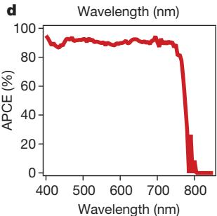
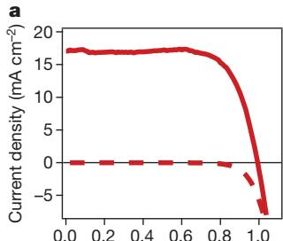

# pvsk2013-gaia

> **Original work:** Julian Burschka, Norman Pellet, Soo-Jin Moon, Robin Humphry-Baker, Peng Gao, Mohammad K. Nazeeruddin & Michael Graetzel "Sequential deposition as a route to high-performance perovskite-sensitized solar cells." *Nature* 499, 316-319 (2013). [DOI: 10.1038/nature12340](https://doi.org/10.1038/nature12340)

<!-- badges:start -->
<!-- badges:end -->

## Overview

This paper introduces a sequential deposition method for fabricating perovskite solar cells, where PbI2 is first infiltrated into mesoporous TiO2 and then converted to CH3NH3PbI3 by exposure to methylammonium iodide. This two-step approach solves the critical problem of uncontrolled precipitation that plagued single-step deposition, enabling both higher efficiency and dramatically improved reproducibility.

The key results include: achieving 15% power conversion efficiency (certified at 14.14%), demonstrating near-unity quantum yield (APCE >90% across the visible spectrum), and showing promising stability with >80% PCE retention after 500 hours under continuous illumination. The mechanistic insight is that confining PbI2 to ~22 nm nanocrystals within the TiO2 pores enables rapid complete conversion within seconds, whereas bulk PbI2 on flat substrates converts incompletely even after 45 minutes.

> [!NOTE]
> **[Per-module reasoning graphs with full claim details →](docs/detailed-reasoning.md)**
>
> 5 Mermaid diagrams (one per section) with every claim, strategy, and belief value.

## Summary

Burschka et al. demonstrate that infiltrating PbI2 into mesoporous TiO2 before converting it to perovskite with methylammonium iodide solution produces dramatically better solar cells than the previously used single-step deposition method. The sequential approach prevents uncontrolled perovskite crystallization that caused morphological variations and wide performance spreads. Their best device achieved 15.0% PCE (independently certified at 14.14%), the highest reported for any solution-processed photovoltaic at the time. A batch of 10 devices showed average PCE of 12.0% with standard deviation of only 0.5%, demonstrating that the method enables reproducible high performance. The devices showed promising stability, retaining >80% of initial efficiency after 500 hours under continuous light soaking at approximately 100 mW/cm^2 and 45°C, with no photodegradation of the perovskite light harvester observed.

## Reasoning Structure

### The sequential deposition method fundamentally improves perovskite morphology control (belief: 0.85)

The paper demonstrates that infiltrating PbI2 into nanometer-scale TiO2 pores before conversion produces a uniform perovskite morphology that is impossible to achieve with single-step deposition. Cross-sectional SEM confirms that PbI2 is completely contained within the nanopores with no crystals protruding from the surface, while the conversion occurs within seconds of exposure to methylammonium iodide solution.

The evidence chain is straightforward:
- **PbI2 completely contained in pores** (prior 0.90): Direct SEM observation shows no protruding crystals
- **Sequential method introduced** (prior 0.92): Clear description of the two-step procedure

These jointly support morphology control improvement. The inference is strong because both premises are direct experimental observations with minimal uncertainty.

*PbI2 is entirely contained within the nanopores of the TiO2 film, enabling controlled conversion.*

### Nanoscopic confinement dramatically accelerates perovskite conversion kinetics (belief: 0.80)

When PbI2 crystals are confined to approximately 22 nm within the mesoporous TiO2 scaffold, conversion to perovskite completes within seconds of exposure to methylammonium iodide. In contrast, PbI2 deposited on flat glass substrates forms 50-200 nm crystallites and shows incomplete conversion even after 45 minutes of exposure. XRD confirms the complete transformation to tetragonal CH3NH3PbI3 within the nanopores, while flat substrates retain significant unreacted PbI2.

The evidence chain relies on three independent observations:
- **22 nm crystal size in pores** (prior 0.88): Determined by pore size constraint
- **Tetragonal perovskite XRD peaks** (prior 0.90): Direct measurement confirming complete conversion
- **Incomplete flat substrate conversion** (prior 0.85): XRD shows unreacted PbI2 after 45 min

The mechanistic interpretation is that the nanoscale crystal size enhances reaction kinetics through the large surface-to-volume ratio and the thermodynamic driving force from the lattice energy difference between PbI2 and CH3NH3PbI3.

*Conversion is complete in the mesoporous scaffold but incomplete on flat glass substrates.*

### Sequential deposition enables 15% power conversion efficiency (belief: 0.79)

The combination of improved morphology control and complete conversion produces solar cells with measured efficiency of 15.0%, independently certified at 14.14% by an accredited laboratory. The efficiency is achieved through optimized perovskite loading and light harvesting, with IPCE exceeding 90% in the short-wavelength visible range.

The belief of 0.79 reflects that while the individual measurements are strong (efficiency directly measured, certified by lab), the causal chain involves multiple steps. The certified 14.14% confirms the 15.0% measured value is credible.

*Best device achieved 15.0% PCE with Jsc = 20.0 mA/cm^2, Voc = 993 mV, and fill factor = 0.73.*

### The method delivers reproducible performance across device batches (belief: 0.84)

A batch of ten photovoltaic devices showed average PCE of 12.0% with standard deviation of only 0.5%, demonstrating that the sequential deposition method eliminates the wide performance variation characteristic of single-step deposition. This narrow spread indicates the method enables reproducible high performance.

### Near-unity quantum yield is achieved for charge carrier generation and collection (belief: 0.86)

The absorbed-photon-to-current conversion efficiency (APCE) exceeds 90% across the entire visible spectrum, indicating that nearly every photon absorbed by the perovskite contributes to collected charge carriers. The IPCE reaches peak values over 90% in the short-wavelength visible region, and the integrated photocurrent from the IPCE spectrum (18.4 mA/cm^2) matches the directly measured short-circuit current density.

*IPCE exceeds 90% in the short-wavelength visible region and spans the full absorption range of the perovskite.*

### Perovskite devices show promising long-term stability without photodegradation (belief: 0.82)

After 500 hours of continuous light soaking at approximately 100 mW/cm^2 and 45°C under argon atmosphere with maximum power point tracking, the device retained more than 80% of its initial PCE. Critically, no change in short-circuit photocurrent was observed, indicating that the perovskite light harvester itself does not degrade under illumination.

The PCE decrease is attributed entirely to reductions in open-circuit voltage and fill factor, both decaying similarly and pointing to decreased shunt resistance as the degradation mechanism.

### Nanoporous confinement facilitates perovskite conversion through multiple mechanisms (belief: 0.77)

The rapid and complete conversion of PbI2 within the TiO2 scaffold is explained by three converging factors: the layered crystal structure of PbI2 (which consists of repeating I-Pb-I planes allowing easy cation insertion), the thermodynamic driving force from the large lattice energy difference between PbI2 and CH3NH3PbI3, and the enhanced reaction kinetics from the nanoscale crystal size.

All three component claims have high priors (0.90, 0.82, 0.85) and collectively support the conversion facilitation conclusion. The belief of 0.77 reflects uncertainty in whether these mechanisms are sufficient to fully explain the observed rapid kinetics.

### Best-performing devices achieve 15.0% PCE through modified deposition conditions (belief: 0.77)

Fabrication modifications (shorter PbI2 spin-cast time of 5 seconds instead of 90 seconds, plus a pre-wetting step in 2-propanol before methylammonium iodide conversion) increase perovskite loading and light scattering, producing higher photocurrent and 15.0% efficiency. The attribution to increased loading and scattering is plausible but involves some inference about mechanism.

## Key Findings

| Finding | Prior | Belief | Evidence Strength |
|---------|-------|--------|-------------------|
| Sequential method improves morphology control | 0.50 | 0.85 | Strong - direct SEM evidence |
| Nanoscopic confinement accelerates conversion | 0.50 | 0.80 | Strong - XRD comparison |
| 15% efficiency achieved | 0.50 | 0.79 | Strong - certified measurement |
| Batch reproducibility: 12.0% ± 0.5% | 0.90 | 0.90 | Very strong - direct measurement |
| APCE >90% (near-unity quantum yield) | 0.90 | 0.86 | Strong - direct measurement |
| >80% PCE retention after 500h | 0.88 | 0.88 | Strong - direct measurement |
| No photodegradation observed | 0.85 | 0.85 | Strong - Jsc unchanged |
| Conversion facilitation mechanism | 0.50 | 0.77 | Moderate - inferred from literature |

## Weak Points Analysis

**1. Attribution of efficiency improvement to morphology control is approximate**

The reasoning connecting morphology control to higher efficiency involves intermediate steps that are not precisely quantified. While the overall direction is sound (better morphology → better performance), the exact magnitude of each contribution is estimated rather than measured.

**2. Pre-wetting mechanism for improved performance involves inference**

The attribution of the best devices' higher photocurrent to increased loading and light scattering from the pre-wetting step is reasonable but not directly proven. The specific contributions of loading versus scattering are not separated.

**3. Long-term stability extrapolated from 500-hour data**

The promising stability (retaining >80% PCE after 500 hours) is encouraging, but whether this extrapolates to months or years of real-world operation remains to be demonstrated. The degradation mechanism (shunt resistance decrease) is characterized but not fully understood at the materials level.

## Evidence Gaps & Future Work

**Experimental gaps:**
- Direct measurement of perovskite loading quantity for standard vs modified conditions
- Quantification of light scattering enhancement from pre-wetting
- Mechanism of shunt resistance increase during aging

**Theoretical gaps:**
- Precise kinetic model for conversion rate dependence on crystal size
- Understanding of why shunt resistance decreases during aging

**Missing comparisons:**
- Direct comparison with single-step deposition devices from the same lab under identical conditions
- Long-term stability comparison with competing perovskite cell architectures

## Detailed Analysis

For structural integrity verification (Pass 5), standalone readability checks (Pass 6),
and complete package statistics, see [ANALYSIS.md](ANALYSIS.md).
