# pvsk2013-gaia

Add your description here

## Overview

```mermaid
graph LR
    perovskite_definition["Perovskite material definition"]:::setting
    prior_work_limitation["Single-step deposition produces morphological variability (0.50)"]:::orphan
    sequential_deposition_introduced["Sequential deposition method introduced (0.92)"]:::premise
    control_improvement["Sequential method improves morphology control (0.85)"]:::derived
    efficiency_achieved["15% efficiency achieved with sequential deposition (0.79)"]:::derived
    reproducibility_improvement["Sequential method improves reproducibility (0.84)"]:::derived
    device_structure["Device structure configuration"]:::setting
    mesoporous_tio2_deposition["Mesoporous TiO2 deposition protocol"]:::setting
    pbi2_infiltration["PbI2 infiltration protocol"]:::setting
    mai_conversion["Methylammonium iodide conversion protocol"]:::setting
    htm_deposition["HTM spin-coating formulation"]:::setting
    best_device_modification["Modified conditions for best-performing devices (0.88)"]:::premise
    j_v_measurement["J-V characterization method"]:::setting
    ipce_measurement["IPCE measurement method"]:::setting
    stability_testing["Long-term stability test protocol"]:::setting
    optical_spectroscopy["Optical spectroscopy methods"]:::setting
    xrd_measurement["XRD measurement parameters"]:::setting
    pbi2_complete_infiltration["PbI2 completely contained within TiO2 nanopores (0.90)"]:::premise
    pbi2_crystal_size["PbI2 crystal size limited to ~22 nm in nanopores (0.88)"]:::premise
    color_change_observed["Color change indicates rapid perovskite formation (0.50)"]:::orphan
    absorption_increase["Perovskite absorption increase complete within seconds (0.50)"]:::orphan
    pl_quenching_pbi2["PbI2 photoluminescence quenched during conversion (0.50)"]:::orphan
    perovskite_pl_increase["Perovskite emission at 775 nm increases then decreases (0.50)"]:::orphan
    pbi2_tio2_orientation["Mesoporous TiO2 induces different PbI2 crystal orientation (0.50)"]:::orphan
    perovskite_xrd_confirmed["Tetragonal perovskite XRD peaks observed after conversion (0.90)"]:::premise
    flat_substrate_incomplete_conversion["Flat substrate shows incomplete perovskite conversion (0.85)"]:::premise
    conversion_rate_enhancement["Nanoscopic confinement dramatically accelerates conversion (0.80)"]:::derived
    nanomorphology_enforced["Mesoporous scaffold enforces perovskite nanomorphology (0.50)"]:::orphan
    typical_device_performance["Typical device performance: 12.9% PCE (0.50)"]:::orphan
    device_batch_statistics["Batch average PCE: 12.0% +/- 0.5% (0.90)"]:::premise
    performance_table["Performance at different light intensities (0.50)"]:::orphan
    ipce_onset["IPCE onset at 800 nm matches perovskite bandgap (0.50)"]:::orphan
    ipce_peak_value["IPCE peak exceeds 90% in short wavelengths (0.90)"]:::premise
    integrated_current_match["Integrated IPCE current matches measured Jsc (0.86)"]:::derived
    lhe_data["Low IPCE in 600-800 nm due to reduced light harvesting (0.50)"]:::orphan
    apce_exceeds_90_percent["APCE exceeds 90% indicating near-unity quantum yield (0.90)"]:::premise
    best_device_performance["Best device: 15.0% PCE (0.77)"]:::derived
    certified_efficiency["Certified PCE: 14.14% (0.50)"]:::orphan
    best_device_improvement_attributed["Higher photocurrent from increased loading and light scattering (0.78)"]:::premise
    stability_result["Device retains >80% PCE after 500 hours (0.88)"]:::premise
    no_photodegradation["No photodegradation observed (0.85)"]:::premise
    pce_decrease_mechanism["PCE decrease due to Voc and FF reduction from shunt resistance loss (0.82)"]:::derived
    conversion_facilitation["Nanoporous confinement facilitates perovskite conversion (0.77)"]:::derived
    nanomorphology_enforcement["Mesoporous scaffold enforces perovskite nanomorphology (0.50)"]:::orphan
    layered_pbi2_structure["Layered PbI2 structure enables cation insertion (0.90)"]:::premise
    thermodynamic_driving_force["Lattice energy difference drives conversion (0.82)"]:::premise
    reaction_kinetics_enhancement["Nanoscopic morphology combined with high formation energy enhances kinetics (0.85)"]:::premise
    two_step_method_applicability["Sequential deposition applicable to other metal halide mesostructures (0.50)"]:::orphan
    record_efficiency["15% PCE sets record for solution-processed photovoltaics (0.50)"]:::orphan
    reproducibility_demonstrated["Method enables reproducible high performance (0.50)"]:::orphan
    future_potential["Perovskite photovoltaics may rival silicon (0.50)"]:::orphan
    apce_exceeds_90_percent --> integrated_current_match
    best_device_improvement_attributed --> best_device_performance
    best_device_modification --> best_device_performance
    control_improvement --> efficiency_achieved
    control_improvement --> reproducibility_improvement
    conversion_rate_enhancement --> efficiency_achieved
    device_batch_statistics --> reproducibility_improvement
    flat_substrate_incomplete_conversion --> conversion_rate_enhancement
    ipce_peak_value --> integrated_current_match
    layered_pbi2_structure --> conversion_facilitation
    no_photodegradation --> pce_decrease_mechanism
    pbi2_complete_infiltration --> control_improvement
    pbi2_crystal_size --> conversion_rate_enhancement
    perovskite_xrd_confirmed --> conversion_rate_enhancement
    reaction_kinetics_enhancement --> conversion_facilitation
    sequential_deposition_introduced --> control_improvement
    stability_result --> pce_decrease_mechanism
    thermodynamic_driving_force --> conversion_facilitation

    classDef setting fill:#f0f0f0,stroke:#999,color:#333
    classDef premise fill:#ddeeff,stroke:#4488bb,color:#333
    classDef derived fill:#ddffdd,stroke:#44bb44,color:#333
    classDef question fill:#fff3dd,stroke:#cc9944,color:#333
    classDef background fill:#f5f5f5,stroke:#bbb,stroke-dasharray: 5 5,color:#333
    classDef orphan fill:#fff,stroke:#ccc,stroke-dasharray: 5 5,color:#333
    classDef external fill:#fff,stroke:#aaa,stroke-dasharray: 3 3,color:#333
    classDef weak fill:#fff9c4,stroke:#f9a825,stroke-dasharray: 5 5,color:#333
    classDef contra fill:#ffebee,stroke:#c62828,color:#333
```

## Burschka2013: Sequential deposition as a route to high-performance perovskite-sensitized solar cells.

#### Perovskite material definition ★

📋 `perovskite_definition`

> Solution-processable organic-inorganic hybrid perovskites have the general formula CH3NH3PbX3 where X = Cl, Br, or I, and have attracted attention as light-harvesting materials for mesoscopic solar cells [@Burschka2013].

#### Single-step deposition produces morphological variability ★

📌 `prior_work_limitation`   |   Belief: **0.50**

> The single-step deposition of perovskite pigment onto mesoporous metal oxide films using a mixture of PbX2 and CH3NH3X in a common solvent produces large morphological variations, resulting in a wide spread of photovoltaic performance in the resulting devices [@Burschka2013].

#### Sequential deposition method introduced ★

📌 `sequential_deposition_introduced`   |   Prior: 0.92   |   Belief: **0.92**

> A sequential deposition method is introduced for the formation of the perovskite pigment within the porous metal oxide film: PbI2 is first introduced from solution into a nanoporous titanium dioxide film and subsequently transformed into the perovskite by exposing it to a solution of CH3NH3I [@Burschka2013].

#### Sequential method improves morphology control ★

📌 `control_improvement`   |   Belief: **0.85**

> The sequential deposition method permits much better control over perovskite morphology than the previously employed single-step route [@Burschka2013].

🔗 **support**([Sequential deposition method introduced](#sequential_deposition_introduced), [PbI2 completely contained within TiO2 nanopores](#pbi2_complete_infiltration))

Reasoning

The sequential method infiltrates PbI2 into TiO2 nanopores first, then converts in place. This prevents uncontrolled precipitation that causes morphological variations in single-step deposition (@prior_work_limitation). The complete infiltration shown by SEM confirms uniform loading within the porous structure.

#### 15% efficiency achieved with sequential deposition ★

📌 `efficiency_achieved`   |   Belief: **0.79**

> Using the sequential deposition technique for solid-state mesoscopic solar cells, a power conversion efficiency of approximately 15% is achieved under standard AM1.5G test conditions [@Burschka2013].

🔗 **support**([Sequential method improves morphology control](#control_improvement), [Nanoscopic confinement dramatically accelerates conversion](#conversion_rate_enhancement))

Reasoning

Better morphology control (@control_improvement) and rapid complete conversion (@conversion_rate_enhancement) produce uniform perovskite films with optimal light harvesting and charge collection, enabling the reported 15% PCE. The certified 14.14% (@certified_efficiency) confirms this performance.

#### Sequential method improves reproducibility ★

📌 `reproducibility_improvement`   |   Belief: **0.84**

> The sequential deposition method greatly increases the reproducibility of photovoltaic performance compared to single-step deposition [@Burschka2013].

🔗 **support**([Batch average PCE: 12.0% +/- 0.5%](#device_batch_statistics), [Sequential method improves morphology control](#control_improvement))

Reasoning

The batch average of 12.0% with standard deviation of only 0.5% (@device_batch_statistics) demonstrates excellent reproducibility. This stems from the controlled morphology (@control_improvement) that eliminates the wide performance spread seen in single-step deposition.

## Burschka2013: Methods and experimental section.

#### Device structure configuration ★

📋 `device_structure`

> The photovoltaic device structure consists of: FTO-coated glass substrate (front contact), 30-40 nm TiO2 compact layer (aerosol spray pyrolysis), 350 nm mesoporous TiO2 layer (20-nm-sized anatase particles), perovskite infiltrant, spiro-MeOTAD hole-transporting material (HTM), and 80 nm Au back contact [@Burschka2013].

#### Mesoporous TiO2 deposition protocol ★

📋 `mesoporous_tio2_deposition`

> Mesoporous TiO2 films composed of 20-nm-sized particles are deposited by spin coating at 5,000 rpm for 30 s using TiO2 paste (Dyesol 18NRT) diluted in ethanol (2:7 weight ratio), followed by drying at 125 C and annealing at 500 C for 15 min [@Burschka2013].

#### PbI2 infiltration protocol ★

📋 `pbi2_infiltration`

> PbI2 is dissolved in N,N-dimethylformamide (DMF) at a concentration of 462 mg/ml (~1 M) under stirring at 70 C. The mesoporous TiO2 films are infiltrated by spin coating at 6,500 rpm for 90 s, then dried at 70 C for 30 min [@Burschka2013].

#### Methylammonium iodide conversion protocol ★

📋 `mai_conversion`

> After PbI2 infiltration, films are dipped in a solution of CH3NH3I in 2-propanol (10 mg/ml) for 20 s, rinsed with 2-propanol, and dried at 70 C for 30 min to convert PbI2 to CH3NH3PbI3 perovskite [@Burschka2013].

#### HTM spin-coating formulation ★

📋 `htm_deposition`

> The HTM is deposited by spin coating at 4,000 rpm for 30 s using a solution of spiro-MeOTAD (72.3 mg), 4-tert-butylpyridine (28.8 ul), lithium bis(trifluoromethylsulphonyl)imide (17.5 ul of 520 mg/ml in acetonitrile), and Co(III) dopant (29 ul of 300 mg/ml in acetonitrile) in 1 ml chlorobenzene [@Burschka2013].

#### Modified conditions for best-performing devices ★

📌 `best_device_modification`   |   Prior: 0.88   |   Belief: **0.88**

> For the best-performing devices (15% PCE), the PbI2 is spin-cast at 6,500 rpm for 5 s (instead of 90 s), and samples are pre-wetted by dipping in 2-propanol for 1-2 s before the CH3NH3I conversion step [@Burschka2013].

#### J-V characterization method ★

📋 `j_v_measurement`

> Current-voltage characteristics are measured under simulated AM1.5G solar irradiation using a 450 W xenon lamp with Schott K113 Tempax sunlight filter. Light intensity is calibrated using a calibrated Si reference diode with KG-3 infrared cut-off filter. Devices are measured using a 0.285 cm^2 metal aperture [@Burschka2013].

#### IPCE measurement method ★

📋 `ipce_measurement`

> IPCE spectra are recorded as functions of wavelength under constant white light bias (approximately 5 mW/cm^2) from an array of white LEDs. The excitation beam from a 300 W xenon lamp is focused through a Gemini-180 double monochromator and chopped at approximately 2 Hz, detected with an SR830 DSP Lock-In Amplifier [@Burschka2013].

#### Long-term stability test protocol ★

📋 `stability_testing`

> For long-term stability tests, devices are sealed in argon using a 50-mm-thick hot-melting polymer and microscope coverslip. Devices are subjected to constant light soaking at approximately 100 mW/cm^2 using white LED array (Philips LXM3-PW51 4000K), maintained at maximum power point, at approximately 45 C. J-V measurements at different light intensities are recorded automatically every 2 h [@Burschka2013].

#### Optical spectroscopy methods ★

📋 `optical_spectroscopy`

> Optical absorption measurements are carried out using a Varian Cary 5 spectrophotometer. Photoluminescence is measured on a Horiba Jobin Yvon Fluorolog spectrofluorometer. Samples are placed vertically in a 10 mm path length cuvette [@Burschka2013].

#### XRD measurement parameters ★

📋 `xrd_measurement`

> X-ray powder diagrams are recorded on an X'Pert MPD PRO (PANalytical) with Cu anode (lambda = 1.54060 A), graphite (002) monochromator, and RTMS X'Celerator detector in BRAGG-BRENTANO geometry. Step size is 0.008 deg with acquisition time up to 7.5 min/deg [@Burschka2013].

## Burschka2013: Results section.

```mermaid
graph TD
    best_device_modification["Modified conditions for best-performing devices (0.88)"]:::external
    pbi2_complete_infiltration["PbI2 completely contained within TiO2 nanopores (0.90)"]:::premise
    pbi2_crystal_size["PbI2 crystal size limited to ~22 nm in nanopores (0.88)"]:::premise
    color_change_observed["Color change indicates rapid perovskite formation (0.50)"]:::orphan
    absorption_increase["Perovskite absorption increase complete within seconds (0.50)"]:::orphan
    pl_quenching_pbi2["PbI2 photoluminescence quenched during conversion (0.50)"]:::orphan
    perovskite_pl_increase["Perovskite emission at 775 nm increases then decreases (0.50)"]:::orphan
    pbi2_tio2_orientation["Mesoporous TiO2 induces different PbI2 crystal orientation (0.50)"]:::orphan
    perovskite_xrd_confirmed["Tetragonal perovskite XRD peaks observed after conversion (0.90)"]:::premise
    flat_substrate_incomplete_conversion["Flat substrate shows incomplete perovskite conversion (0.85)"]:::premise
    conversion_rate_enhancement["Nanoscopic confinement dramatically accelerates conversion (0.80)"]:::derived
    nanomorphology_enforced["Mesoporous scaffold enforces perovskite nanomorphology (0.50)"]:::orphan
    typical_device_performance["Typical device performance: 12.9% PCE (0.50)"]:::orphan
    device_batch_statistics["Batch average PCE: 12.0% +/- 0.5% (0.90)"]:::premise
    performance_table["Performance at different light intensities (0.50)"]:::orphan
    ipce_onset["IPCE onset at 800 nm matches perovskite bandgap (0.50)"]:::orphan
    ipce_peak_value["IPCE peak exceeds 90% in short wavelengths (0.90)"]:::premise
    integrated_current_match["Integrated IPCE current matches measured Jsc (0.86)"]:::derived
    lhe_data["Low IPCE in 600-800 nm due to reduced light harvesting (0.50)"]:::orphan
    apce_exceeds_90_percent["APCE exceeds 90% indicating near-unity quantum yield (0.90)"]:::premise
    best_device_performance["Best device: 15.0% PCE (0.77)"]:::derived
    certified_efficiency["Certified PCE: 14.14% (0.50)"]:::orphan
    best_device_improvement_attributed["Higher photocurrent from increased loading and light scattering (0.78)"]:::premise
    stability_result["Device retains >80% PCE after 500 hours (0.88)"]:::premise
    no_photodegradation["No photodegradation observed (0.85)"]:::premise
    pce_decrease_mechanism["PCE decrease due to Voc and FF reduction from shunt resistance loss (0.82)"]:::derived
    strat_1(["support"]):::weak
    pbi2_crystal_size --> strat_1
    perovskite_xrd_confirmed --> strat_1
    flat_substrate_incomplete_conversion --> strat_1
    strat_1 --> conversion_rate_enhancement
    strat_4(["support"]):::weak
    best_device_modification --> strat_4
    best_device_improvement_attributed --> strat_4
    strat_4 --> best_device_performance
    strat_5(["support"]):::weak
    stability_result --> strat_5
    no_photodegradation --> strat_5
    strat_5 --> pce_decrease_mechanism
    strat_7(["support"]):::weak
    ipce_peak_value --> strat_7
    apce_exceeds_90_percent --> strat_7
    strat_7 --> integrated_current_match

    classDef setting fill:#f0f0f0,stroke:#999,color:#333
    classDef premise fill:#ddeeff,stroke:#4488bb,color:#333
    classDef derived fill:#ddffdd,stroke:#44bb44,color:#333
    classDef question fill:#fff3dd,stroke:#cc9944,color:#333
    classDef background fill:#f5f5f5,stroke:#bbb,stroke-dasharray: 5 5,color:#333
    classDef orphan fill:#fff,stroke:#ccc,stroke-dasharray: 5 5,color:#333
    classDef external fill:#fff,stroke:#aaa,stroke-dasharray: 3 3,color:#333
    classDef weak fill:#fff9c4,stroke:#f9a825,stroke-dasharray: 5 5,color:#333
    classDef contra fill:#ffebee,stroke:#c62828,color:#333
```

#### PbI2 completely contained within TiO2 nanopores ★

📌 `pbi2_complete_infiltration`   |   Prior: 0.90   |   Belief: **0.90**

> PbI2 infiltration into mesoporous TiO2 films is complete: cross-sectional SEM shows no PbI2 crystals protruding from the surface of the mesoporous anatase layer, indicating the PbI2 is entirely contained within the nanopores of the TiO2 film [@Burschka2013].

#### PbI2 crystal size limited to ~22 nm in nanopores ★

📌 `pbi2_crystal_size`   |   Prior: 0.88   |   Belief: **0.88**

> When confined within mesoporous TiO2 scaffold, PbI2 crystal size is limited to approximately 22 nm by the pore size of the host [@Burschka2013].

#### Color change indicates rapid perovskite formation ★

📌 `color_change_observed`   |   Belief: **0.50**

> Dipping the TiO2/PbI2 composite film into CH3NH3I solution (10 mg/ml in 2-propanol) immediately changes its color from yellow to dark brown, indicating formation of CH3NH3PbI3 perovskite [@Burschka2013].

#### Perovskite absorption increase complete within seconds ★

📌 `absorption_increase`   |   Belief: **0.50**

> The increase in perovskite absorption at 550 nm during conversion is practically complete within a few seconds of exposing the PbI2-loaded TiO2 film to the CH3NH3I solution. A small additional increase occurring on a timescale of 100 s contributes only a few percent to the total signal and is attributed to morphological changes producing enhanced light scattering [@Burschka2013].

#### PbI2 photoluminescence quenched during conversion ★

📌 `pl_quenching_pbi2`   |   Belief: **0.50**

> The conversion is accompanied by quenching of PbI2 emission at 425 nm, confirming PbI2 consumption during the reaction with CH3NH3I [@Burschka2013].

#### Perovskite emission at 775 nm increases then decreases ★

📌 `perovskite_pl_increase`   |   Belief: **0.50**

> The perovskite luminescence at 775 nm increases concomitantly with conversion, passing through a maximum before decreasing to a stationary value due to self-absorption by the perovskite formed during the reaction [@Burschka2013].

#### Mesoporous TiO2 induces different PbI2 crystal orientation ★

📌 `pbi2_tio2_orientation`   |   Belief: **0.50**

> PbI2 loaded on mesoporous TiO2 shows three additional diffraction peaks (not present for flat glass) that suggest the anatase scaffold induces a different orientation for PbI2 crystal growth, with peaks attributed to the (110) and (111) lattice planes of the 2H polytype and a third peak assigned to a different PbI2 variant [@Burschka2013].

#### Tetragonal perovskite XRD peaks observed after conversion ★

📌 `perovskite_xrd_confirmed`   |   Prior: 0.90   |   Belief: **0.90**

> XRD shows new diffraction peaks after CH3NH3I reaction that are in good agreement with literature data on the tetragonal phase of CH3NH3PbI3 perovskite, confirming complete conversion within the mesoporous TiO2 scaffold [@Burschka2013].

#### Flat substrate shows incomplete perovskite conversion ★

📌 `flat_substrate_incomplete_conversion`   |   Prior: 0.85   |   Belief: **0.85**

> On flat glass substrate, conversion of PbI2 to perovskite is incomplete; a large amount of unreacted PbI2 remains even after a dipping time of 45 min, with CH3NH3I insertion hardly proceeding beyond the surface of thin PbI2 films [@Burschka2013].

#### Nanoscopic confinement dramatically accelerates conversion ★

📌 `conversion_rate_enhancement`   |   Belief: **0.80**

> Confining PbI2 crystals to approximately 22 nm within mesoporous TiO2 drastically enhances their rate of conversion to perovskite, completing within a few seconds of contact with methylammonium iodide solution. In contrast, flat surface deposition produces larger 50-200 nm crystallites resulting in incomplete conversion [@Burschka2013].

🔗 **support**([PbI2 crystal size limited to ~22 nm in nanopores](#pbi2_crystal_size), [Tetragonal perovskite XRD peaks observed after conversion](#perovskite_xrd_confirmed), [Flat substrate shows incomplete perovskite conversion](#flat_substrate_incomplete_conversion))

Reasoning

The 22 nm crystal size confined in TiO2 pores converts completely within seconds (@perovskite_xrd_confirmed), while flat substrates with 50-200 nm crystallites show incomplete conversion even after 45 min (@flat_substrate_incomplete_conversion). This demonstrates that nanoscopic confinement drastically accelerates conversion.

#### Mesoporous scaffold enforces perovskite nanomorphology ★

📌 `nanomorphology_enforced`   |   Belief: **0.50**

> The mesoporous TiO2 scaffold forces the perovskite to adopt a confined nanomorphology dictated by the pore structure [@Burschka2013].

#### Typical device performance: 12.9% PCE ★

📌 `typical_device_performance`   |   Belief: **0.50**

> A typical photovoltaic device measured at 95.6 mW/cm^2 shows: short-circuit photocurrent Jsc = 17.1 mA/cm^2, open-circuit voltage Voc = 992 mV, fill factor = 0.73, yielding a power conversion efficiency (PCE) of 12.9% [@Burschka2013].

#### Batch average PCE: 12.0% +/- 0.5% ★

📌 `device_batch_statistics`   |   Prior: 0.90   |   Belief: **0.90**

> Statistical data from a batch of ten photovoltaic devices shows an average PCE of 12.0% with a standard deviation of 0.5%, demonstrating high reproducibility [@Burschka2013].

#### Performance at different light intensities ★

📌 `performance_table`   |   Belief: **0.50**

> Photovoltaic performance at different light intensities:
> 
> | Intensity (mW/cm^2) | Jsc (mA/cm^2) | Voc (mV) | Fill factor | PCE (%) |
> |---------------------|---------------|----------|-------------|----------|
> | 9.3 | 1.7 | 901 | 0.77 | 12.6 |
> | 49.8 | 8.9 | 973 | 0.75 | 13.0 |
> | 95.6 | 17.1 | 992 | 0.73 | 12.9 |

#### IPCE onset at 800 nm matches perovskite bandgap ★

📌 `ipce_onset`   |   Belief: **0.50**

> IPCE shows photocurrent generation starting at 800 nm, consistent with the bandgap of CH3NH3PbI3 [@Burschka2013].

#### IPCE peak exceeds 90% in short wavelengths ★

📌 `ipce_peak_value`   |   Prior: 0.90   |   Belief: **0.90**

> IPCE reaches peak values of over 90% in the short-wavelength region of the visible spectrum [@Burschka2013].

#### Integrated IPCE current matches measured Jsc ★

📌 `integrated_current_match`   |   Belief: **0.86**

> Integrating the overlap of the IPCE spectrum with the AM1.5G solar photon flux yields a current density of 18.4 mA/cm^2, in excellent agreement with the measured photocurrent density extrapolated to 17.9 mA/cm^2 at standard AM1.5G intensity of 100 mW/cm^2. This confirms negligible mismatch between simulated sunlight and AM1.5G standard [@Burschka2013].

🔗 **support**([IPCE peak exceeds 90% in short wavelengths](#ipce_peak_value), [APCE exceeds 90% indicating near-unity quantum yield](#apce_exceeds_90_percent))

Reasoning

Peak IPCE >90% (@ipce_peak_value) and APCE >90% across visible range (@apce_exceeds_90_percent) demonstrate near-unity quantum yield for carrier generation and collection. This explains why the integrated current (18.4 mA/cm^2) matches the measured Jsc.

#### Low IPCE in 600-800 nm due to reduced light harvesting ★

📌 `lhe_data`   |   Belief: **0.50**

> The low IPCE values in the 600-800 nm range result from the smaller absorption of the perovskite in this spectral region, as shown by the light-harvesting efficiency (LHE) spectrum [@Burschka2013].

#### APCE exceeds 90% indicating near-unity quantum yield ★

📌 `apce_exceeds_90_percent`   |   Prior: 0.90   |   Belief: **0.90**

> The absorbed-photon-to-current conversion efficiency (APCE) derived from IPCE and LHE is greater than 90% over the whole visible region (without correction for reflective losses), indicating near-unity quantum yield for charge carrier generation and collection [@Burschka2013].

#### Best device: 15.0% PCE ★

📌 `best_device_performance`   |   Belief: **0.77**

> The best-performing cell (fabricated with modified conditions) shows: Jsc = 20.0 mA/cm^2, Voc = 993 mV, fill factor = 0.73, yielding a PCE of 15.0% measured at 96.4 mW/cm^2. Several cells achieved PCEs between 14% and 15% [@Burschka2013].

🔗 **support**([Modified conditions for best-performing devices](#best_device_modification), [Higher photocurrent from increased loading and light scattering](#best_device_improvement_attributed))

Reasoning

The modified conditions (shorter spin-cast time and pre-wetting) increase perovskite loading in the TiO2 pores and enhance light scattering (@best_device_improvement_attributed). This produces the higher Jsc of 20.0 mA/cm^2 and 15.0% PCE (@best_device_performance).

#### Certified PCE: 14.14% ★

📌 `certified_efficiency`   |   Belief: **0.50**

> One of the best-performing devices was sent to an accredited photovoltaic calibration laboratory for certification, confirming a power conversion efficiency of 14.14% under standard AM1.5G reporting conditions [@Burschka2013].

#### Higher photocurrent from increased loading and light scattering ★

📌 `best_device_improvement_attributed`   |   Prior: 0.78   |   Belief: **0.78**

> The significantly higher photocurrent in top-performance devices is attributed to increased loading of the porous TiO2 film with perovskite pigment and increased light scattering from the pre-wetting step, improving the long-wavelength response of the cell [@Burschka2013].

#### Device retains >80% PCE after 500 hours ★

📌 `stability_result`   |   Prior: 0.88   |   Belief: **0.88**

> A sealed photovoltaic device maintained more than 80% of its initial PCE after 500 hours of continuous light soaking at approximately 100 mW/cm^2 and 45 C under argon atmosphere with maximum power point tracking [@Burschka2013].

#### No photodegradation observed ★

📌 `no_photodegradation`   |   Prior: 0.85   |   Belief: **0.85**

> No change in short-circuit photocurrent is observed during the 500-hour stability test, indicating no photodegradation of the perovskite light harvester [@Burschka2013].

#### PCE decrease due to Voc and FF reduction from shunt resistance loss ★

📌 `pce_decrease_mechanism`   |   Belief: **0.82**

> The decrease in PCE during stability testing is due only to decreases in open-circuit voltage and fill factor, with similar decay shapes suggesting a linked degradation mechanism attributed mainly to a decrease in shunt resistance [@Burschka2013].

🔗 **support**([Device retains >80% PCE after 500 hours](#stability_result), [No photodegradation observed](#no_photodegradation))

Reasoning

After 500 hours of light soaking, the device retains >80% PCE (@stability_result) with no change in Jsc (@no_photodegradation), confirming the perovskite is stable. The PCE decrease is attributed to shunt resistance loss affecting Voc and FF, not to light harvester degradation.

## Burschka2013: Discussion section.

```mermaid
graph TD
    conversion_facilitation["Nanoporous confinement facilitates perovskite conversion (0.77)"]:::derived
    nanomorphology_enforcement["Mesoporous scaffold enforces perovskite nanomorphology (0.50)"]:::orphan
    layered_pbi2_structure["Layered PbI2 structure enables cation insertion (0.90)"]:::premise
    thermodynamic_driving_force["Lattice energy difference drives conversion (0.82)"]:::premise
    reaction_kinetics_enhancement["Nanoscopic morphology combined with high formation energy enhances kinetics (0.85)"]:::premise
    two_step_method_applicability["Sequential deposition applicable to other metal halide mesostructures (0.50)"]:::orphan
    record_efficiency["15% PCE sets record for solution-processed photovoltaics (0.50)"]:::orphan
    reproducibility_demonstrated["Method enables reproducible high performance (0.50)"]:::orphan
    future_potential["Perovskite photovoltaics may rival silicon (0.50)"]:::orphan
    strat_6(["support"]):::weak
    layered_pbi2_structure --> strat_6
    thermodynamic_driving_force --> strat_6
    reaction_kinetics_enhancement --> strat_6
    strat_6 --> conversion_facilitation

    classDef setting fill:#f0f0f0,stroke:#999,color:#333
    classDef premise fill:#ddeeff,stroke:#4488bb,color:#333
    classDef derived fill:#ddffdd,stroke:#44bb44,color:#333
    classDef question fill:#fff3dd,stroke:#cc9944,color:#333
    classDef background fill:#f5f5f5,stroke:#bbb,stroke-dasharray: 5 5,color:#333
    classDef orphan fill:#fff,stroke:#ccc,stroke-dasharray: 5 5,color:#333
    classDef external fill:#fff,stroke:#aaa,stroke-dasharray: 3 3,color:#333
    classDef weak fill:#fff9c4,stroke:#f9a825,stroke-dasharray: 5 5,color:#333
    classDef contra fill:#ffebee,stroke:#c62828,color:#333
```

#### Nanoporous confinement facilitates perovskite conversion ★

📌 `conversion_facilitation`   |   Belief: **0.77**

> The confinement of PbI2 within the nanoporous TiO2 network greatly facilitates its conversion to the perovskite pigment, compared to flat substrate deposition [@Burschka2013].

🔗 **support**([Layered PbI2 structure enables cation insertion](#layered_pbi2_structure), [Lattice energy difference drives conversion](#thermodynamic_driving_force), [Nanoscopic morphology combined with high formation energy enhances kinetics](#reaction_kinetics_enhancement))

Reasoning

The layered I-Pb-I structure of PbI2 (@layered_pbi2_structure) allows easy cation insertion between layers. The large lattice energy difference (@thermodynamic_driving_force) provides the driving force, and the 22 nm crystal size (@reaction_kinetics_enhancement) greatly enhances kinetics, together explaining the rapid complete conversion.

#### Mesoporous scaffold enforces perovskite nanomorphology ★

📌 `nanomorphology_enforcement`   |   Belief: **0.50**

> The mesoporous scaffold forces the perovskite to adopt a confined nanomorphology [@Burschka2013].

#### Layered PbI2 structure enables cation insertion ★

📌 `layered_pbi2_structure`   |   Prior: 0.90   |   Belief: **0.90**

> The insertion of the organic cation is facilitated through the layered PbI2 structure, which consists of three spatially repeating planes: I-Pb-I. Strong intralayer chemical bonding combined with weak interlayer van der Waals interactions allows easy insertion of guest molecules between the layers [@Burschka2013].

#### Lattice energy difference drives conversion ★

📌 `thermodynamic_driving_force`   |   Prior: 0.82   |   Belief: **0.82**

> The thermodynamic driving force for the two-step conversion is the difference in bulk lattice energy between PbI2 and CH3NH3PbI3, with the initial crystal lattice serving as a template for the formation of the desired compound. This is analogous to ion exchange reactions used to convert II-V semiconductor nanocrystals to III-V analogues while preserving particle size and distribution [@Burschka2013].

#### Nanoscopic morphology combined with high formation energy enhances kinetics ★

📌 `reaction_kinetics_enhancement`   |   Prior: 0.85   |   Belief: **0.85**

> The large energy of formation of the hybrid perovskite combined with the nanoscopic morphology of the PbI2 precursor (approximately 22 nm crystals) greatly enhances reaction kinetics, enabling complete transformation within seconds of contact with methylammonium iodide solution [@Burschka2013].

#### Sequential deposition applicable to other metal halide mesostructures ★

📌 `two_step_method_applicability`   |   Belief: **0.50**

> The two-step sequential deposition method is applicable to other preformed metal halide mesostructures that can be converted into the desired perovskite by insertion reactions [@Burschka2013].

#### 15% PCE sets record for solution-processed photovoltaics ★

📌 `record_efficiency`   |   Belief: **0.50**

> The power conversion efficiency of 15% achieved with the best device is amongst the highest for solution-processed photovoltaics and sets a new record for organic or hybrid inorganic-organic solar cells at the time of publication [@Burschka2013].

#### Method enables reproducible high performance ★

📌 `reproducibility_demonstrated`   |   Belief: **0.50**

> The sequential deposition method provides a means to achieve excellent photovoltaic performance with high reproducibility, addressing the wide spread of performance characteristic of single-step deposition methods [@Burschka2013].

#### Perovskite photovoltaics may rival silicon ★

📌 `future_potential`   |   Belief: **0.50**

> Perovskite-based photovoltaic devices fabricated using this method have potential for widespread application and may eventually rival conventional silicon-based photovoltaics [@Burschka2013].

## Inference Results

**BP converged:** True (2 iterations)

| Label | Type | Prior | Belief | Role |
|-------|------|-------|--------|------|
| [absorption_increase](#absorption_increase) | claim | — | 0.5000 | orphaned |
| [certified_efficiency](#certified_efficiency) | claim | — | 0.5000 | orphaned |
| [color_change_observed](#color_change_observed) | claim | — | 0.5000 | orphaned |
| [future_potential](#future_potential) | claim | — | 0.5000 | orphaned |
| [ipce_onset](#ipce_onset) | claim | — | 0.5000 | orphaned |
| [lhe_data](#lhe_data) | claim | — | 0.5000 | orphaned |
| [nanomorphology_enforced](#nanomorphology_enforced) | claim | — | 0.5000 | orphaned |
| [nanomorphology_enforcement](#nanomorphology_enforcement) | claim | — | 0.5000 | orphaned |
| [pbi2_tio2_orientation](#pbi2_tio2_orientation) | claim | — | 0.5000 | orphaned |
| [performance_table](#performance_table) | claim | — | 0.5000 | orphaned |
| [perovskite_pl_increase](#perovskite_pl_increase) | claim | — | 0.5000 | orphaned |
| [pl_quenching_pbi2](#pl_quenching_pbi2) | claim | — | 0.5000 | orphaned |
| [prior_work_limitation](#prior_work_limitation) | claim | — | 0.5000 | orphaned |
| [record_efficiency](#record_efficiency) | claim | — | 0.5000 | orphaned |
| [reproducibility_demonstrated](#reproducibility_demonstrated) | claim | — | 0.5000 | orphaned |
| [two_step_method_applicability](#two_step_method_applicability) | claim | — | 0.5000 | orphaned |
| [typical_device_performance](#typical_device_performance) | claim | — | 0.5000 | orphaned |
| [conversion_facilitation](#conversion_facilitation) | claim | — | 0.7660 | derived |
| [best_device_performance](#best_device_performance) | claim | — | 0.7739 | derived |
| [best_device_improvement_attributed](#best_device_improvement_attributed) | claim | 0.78 | 0.7800 | independent |
| [efficiency_achieved](#efficiency_achieved) | claim | — | 0.7894 | derived |
| [conversion_rate_enhancement](#conversion_rate_enhancement) | claim | — | 0.8022 | derived |
| [pce_decrease_mechanism](#pce_decrease_mechanism) | claim | — | 0.8171 | derived |
| [thermodynamic_driving_force](#thermodynamic_driving_force) | claim | 0.82 | 0.8200 | independent |
| [reproducibility_improvement](#reproducibility_improvement) | claim | — | 0.8437 | derived |
| [flat_substrate_incomplete_conversion](#flat_substrate_incomplete_conversion) | claim | 0.85 | 0.8500 | independent |
| [no_photodegradation](#no_photodegradation) | claim | 0.85 | 0.8500 | independent |
| [reaction_kinetics_enhancement](#reaction_kinetics_enhancement) | claim | 0.85 | 0.8500 | independent |
| [control_improvement](#control_improvement) | claim | — | 0.8509 | derived |
| [integrated_current_match](#integrated_current_match) | claim | — | 0.8635 | derived |
| [best_device_modification](#best_device_modification) | claim | 0.88 | 0.8800 | independent |
| [pbi2_crystal_size](#pbi2_crystal_size) | claim | 0.88 | 0.8800 | independent |
| [stability_result](#stability_result) | claim | 0.88 | 0.8800 | independent |
| [apce_exceeds_90_percent](#apce_exceeds_90_percent) | claim | 0.90 | 0.9000 | independent |
| [device_batch_statistics](#device_batch_statistics) | claim | 0.90 | 0.9000 | independent |
| [ipce_peak_value](#ipce_peak_value) | claim | 0.90 | 0.9000 | independent |
| [layered_pbi2_structure](#layered_pbi2_structure) | claim | 0.90 | 0.9000 | independent |
| [pbi2_complete_infiltration](#pbi2_complete_infiltration) | claim | 0.90 | 0.9000 | independent |
| [perovskite_xrd_confirmed](#perovskite_xrd_confirmed) | claim | 0.90 | 0.9000 | independent |
| [sequential_deposition_introduced](#sequential_deposition_introduced) | claim | 0.92 | 0.9200 | independent |
