# pvsk2014-gaia

> **Original work:** Jeon, N.J., Noh, J.H., Kim, Y.C., Yang, W.S., Ryu, S. & Seok, S.I. "Solvent engineering for high-performance inorganic–organic hybrid perovskite solar cells." *Nature* (2014). https://doi.org/10.1038/nature14190

<!-- badges:start -->
<!-- badges:end -->

## Overview

This package formalizes the reasoning structure of Jeon et al. 2014, which demonstrated that a bilayer architecture combining mesoscopic and planar heterojunction features — fabricated entirely by solution processing — achieves a certified 16.2% power conversion efficiency (PCE) in perovskite solar cells. The core innovation is a five-step solvent-engineering procedure in which a mixed gamma-butyrolactone (GBL) / dimethylsulphoxide (DMSO) solvent followed by toluene drop-casting during spin-coating produces an ultra-uniform perovskite layer via a MAI-PbI2-DMSO intermediate phase. The intermediate phase formation enables complete surface coverage and eliminates the hysteresis that plagued earlier planar cells.

The paper also systematically investigated the origin of J-V hysteresis in perovskite cells and showed that an optimally thick mesoporous TiO2 layer (~200 nm) eliminates scan-direction-dependent efficiency errors by improving charge collection. The highest-performing devices showed 16.5% average PCE (best cell) with negligible hysteresis, an IPCE plateau exceeding 80% from 420–700 nm, and 80% reproducibility across 108 independently fabricated devices.

> [!TIP]
> **Reasoning graph information gain: `3.2 bits`**
>
> Total mutual information between leaf premises and exported conclusions — measures how much the reasoning structure reduces uncertainty about the results.

```mermaid
---
config:
  flowchart:
    rankSpacing: 80
    nodeSpacing: 30
---
graph TB
    sequential_deposition_benchmark["★ sequential_deposition_benchmark\n(0.85 → 0.85)"]:::exported
    vacuum_deposition_benchmark["★ vacuum_deposition_benchmark\n(0.85 → 0.85)"]:::exported
    spin_coating_problem["★ spin_coating_problem\n(0.85 → 0.85)"]:::exported
    uniformity_limitation["★ uniformity_limitation\n(0.85 → 0.85)"]:::exported
    bilayer_architecture["★ bilayer_architecture\n(0.50 → 0.65)"]:::exported
    mixed_solvent_solution["★ mixed_solvent_solution\n(0.85 → 0.85)"]:::exported
    certified_efficiency["★ certified_efficiency\n(0.50 → 0.61)"]:::exported
    mixed_solvent_outcome["★ Mixed solvent with toluene drip yields uniform perovskite morphology\n(0.85 → 0.86)"]:::exported
    crystallinity_preserved["★ Crystallinity preserved with or without toluene drip\n(0.85 → 0.85)"]:::exported
    intermediate_phase_formation["★ Intermediate phase formation mechanism\n(0.85 → 0.86)"]:::exported
    dmso_retards_reaction["★ DMSO retards rapid reaction between PbI2 and MAI\n(0.80 → 0.82)"]:::exported
    intermediate_phase_identity["★ Intermediate phase is new MAI-PbI2-DMSO compound\n(0.50 → 0.65)"]:::exported
    elemental_analysis_confirms["★ Elemental analysis confirms intermediate phase composition\n(0.85 → 0.85)"]:::exported
    low_angle_xrd_peaks["★ Low-angle XRD peaks confirm intercalation structure\n(0.85 → 0.85)"]:::exported
    ftir_confirmation["★ FTIR confirms DMSO and MAI inclusion in intermediate phase\n(0.85 → 0.85)"]:::exported
    perovskite_conversion_temperature["★ Perovskite conversion complete at 130 degrees C\n(0.85 → 0.85)"]:::exported
    intermediate_phase_rms_roughness["★ Intermediate phase RMS roughness is 6.0 nm\n(0.85 → 0.86)"]:::exported
    perovskite_film_rms_roughness["★ Perovskite film RMS roughness is 8.3 nm\n(0.85 → 0.86)"]:::exported
    dense_grained_morphology["★ Dense-grained uniform morphology with 100-500 nm grains\n(0.85 → 0.86)"]:::exported
    full_surface_coverage["★ Full surface coverage achieved with solvent engineering\n(0.50 → 0.77)"]:::exported
    no_mp_tio2_forward_scan["★ Flat cell without mp-TiO2: forward scan performance\n(0.85 → 0.85)"]:::exported
    no_mp_tio2_reverse_scan["★ Flat cell without mp-TiO2: reverse scan performance\n(0.85 → 0.85)"]:::exported
    large_hysteresis_without_mp["★ Large hysteresis in cells without mp-TiO2\n(0.85 → 0.85)"]:::exported
    bilayer_forward_scan["★ Bilayer cell: forward scan performance\n(0.85 → 0.85)"]:::exported
    bilayer_reverse_scan["★ Bilayer cell: reverse scan performance\n(0.85 → 0.85)"]:::exported
    negligible_hysteresis_bilayer["★ Bilayer cell exhibits negligible hysteresis\n(0.85 → 0.85)"]:::exported
    average_bilayer_efficiency["★ Bilayer cell average efficiency 15.85%\n(0.85 → 0.85)"]:::exported
    thickness_vs_efficiency["★ Optimal mp-TiO2 thickness minimizes hysteresis\n(0.85 → 0.85)"]:::exported
    hysteresis_origin["★ Hysteresis originates from large diffusion capacitance\n(0.75 → 0.75)"]:::exported
    best_cell_average["★ Best cell average performance is 16.5% PCE\n(0.50 → 0.68)"]:::exported
    ipce_plateau["★ IPCE plateau exceeds 80% between 420-700 nm\n(0.85 → 0.85)"]:::exported
    jsc_from_ipce["★ IPCE-integrated Jsc matches J-V measurement\n(0.85 → 0.85)"]:::exported
    reproducibility_histogram["★ 80% of 108 devices exceed 15% PCE\n(0.85 → 0.85)"]:::exported
    certified_efficiency_162["★ Certified PCE of 16.2% under AM 1.5 G full sun\n(0.90 → 0.90)"]:::exported
    balanced_thickness_concept["★ Balanced mp-TiO2/perovskite layer ratio is critical\n(0.50 → 0.63)"]:::exported
    formation_mechanism["★ Stepwise formation mechanism of uniform perovskite layer\n(0.80 → 0.80)"]:::exported
    intermediate_phase_critical["★ Intermediate phase formation is decisive for uniform surface\n(0.50 → 0.64)"]:::exported
    role_of_dmso["★ DMSO coordinates with Pb2+ to form intermediate phase\n(0.80 → 0.80)"]:::exported
    role_of_toluene["★ Toluene removes DMSO and freezes constituents into uniform layer\n(0.85 → 0.85)"]:::exported
    solid_state_conversion["★ Solid-state conversion preserves uniformity from intermediate phase\n(0.50 → 0.68)"]:::exported
    bilayer_advantages["★ Bilayer architecture combines light absorption and charge collection advantages\n(0.50 → 0.59)"]:::exported
    mp_tio2_necessity["★ Optimal mp-TiO2 thickness (~200 nm) enables efficient charge collection\n(0.80 → 0.80)"]:::exported
    solvent_engineering_contribution["★ Solvent engineering enables low-cost high-efficiency perovskite solar cells\n(0.50 → 0.68)"]:::exported
    intercalation_strategy["★ Intercalation strategy enables uniform PbI2-based perovskite layers\n(0.50 → 0.59)"]:::exported
    key_achievement["★ Certified 16.2% PCE achieved by fully solution-based process\n(0.50 → 0.63)"]:::exported
    strat_0(["infer\n0.27 bits"]):::weak
    average_bilayer_efficiency --> strat_0
    best_cell_average --> strat_0
    certified_efficiency_162 --> strat_0
    strat_0 --> key_achievement
    strat_1(["infer\n0.29 bits"]):::weak
    average_bilayer_efficiency --> strat_1
    reproducibility_histogram --> strat_1
    strat_1 --> solvent_engineering_contribution
    strat_2(["infer\n0.26 bits"]):::weak
    bilayer_forward_scan --> strat_2
    bilayer_reverse_scan --> strat_2
    large_hysteresis_without_mp --> strat_2
    negligible_hysteresis_bilayer --> strat_2
    no_mp_tio2_forward_scan --> strat_2
    no_mp_tio2_reverse_scan --> strat_2
    strat_2 --> bilayer_advantages
    strat_3(["infer\n0.29 bits"]):::weak
    crystallinity_preserved --> strat_3
    perovskite_conversion_temperature --> strat_3
    strat_3 --> solid_state_conversion
    strat_4(["infer\n0.24 bits"]):::weak
    dense_grained_morphology --> strat_4
    dmso_retards_reaction --> strat_4
    intermediate_phase_formation --> strat_4
    intermediate_phase_rms_roughness --> strat_4
    mixed_solvent_outcome --> strat_4
    perovskite_film_rms_roughness --> strat_4
    strat_4 --> full_surface_coverage
    strat_5(["infer\n0.31 bits"]):::weak
    elemental_analysis_confirms --> strat_5
    ftir_confirmation --> strat_5
    low_angle_xrd_peaks --> strat_5
    strat_5 --> intermediate_phase_identity
    strat_6(["infer\n0.31 bits"]):::weak
    formation_mechanism --> strat_6
    role_of_dmso --> strat_6
    role_of_toluene --> strat_6
    strat_6 --> intermediate_phase_critical
    strat_7(["infer\n0.11 bits"]):::weak
    full_surface_coverage --> strat_7
    intermediate_phase_identity --> strat_7
    solid_state_conversion --> strat_7
    strat_7 --> intercalation_strategy
    strat_8(["infer\n0.30 bits"]):::weak
    hysteresis_origin --> strat_8
    mp_tio2_necessity --> strat_8
    thickness_vs_efficiency --> strat_8
    strat_8 --> balanced_thickness_concept
    strat_9(["infer\n0.29 bits"]):::weak
    ipce_plateau --> strat_9
    jsc_from_ipce --> strat_9
    strat_9 --> best_cell_average
    strat_10(["infer\n0.26 bits"]):::weak
    key_achievement --> strat_10
    sequential_deposition_benchmark --> strat_10
    vacuum_deposition_benchmark --> strat_10
    strat_10 --> certified_efficiency
    strat_11(["infer\n0.31 bits"]):::weak
    mixed_solvent_solution --> strat_11
    spin_coating_problem --> strat_11
    uniformity_limitation --> strat_11
    strat_11 --> bilayer_architecture

    classDef premise fill:#ddeeff,stroke:#4488bb,color:#333
    classDef exported fill:#d4edda,stroke:#28a745,stroke-width:2px,color:#333
    classDef weak fill:#fff9c4,stroke:#f9a825,stroke-dasharray: 5 5,color:#333
    classDef contra fill:#ffebee,stroke:#c62828,color:#333
```

> [!NOTE]
> **[Per-module reasoning graphs with full claim details →](docs/detailed-reasoning.md)**
>
> 5 Mermaid diagrams (one per section) with every claim, strategy, and belief value.

## Reasoning Structure

### A bilayer architecture solves the spin-coating uniformity problem (belief: 0.65)

The paper begins by identifying a fundamental limitation of simple spin-coating for perovskite film formation: even with convective spreading flow and slowly evaporating solvents, the resulting films exhibit non-uniform coverage and island-type morphology (prior art: Eperon 2014). Simple spin-coating using pure GBL solvent produces perovskite crystals immediately during rotation, forming inhomogeneous islands with low substrate coverage. The authors propose a bilayer architecture (glass/FTO/bl-TiO2/mp-TiO2-perovskite nanocomposite layer/perovskite upper layer/PTAA/Au) that combines the large charge-separation interface of the mesoscopic structure with the uniform light-absorbing planar upper layer.

The architecture emerges as a consequence of the solvent-engineering approach: the mixed solvent and toluene drip first produce a uniform intermediate phase, and the subsequent annealing converts this into a continuous upper perovskite layer while the lower layer remains infiltrated into the mesoporous TiO2 scaffold. The belief of 0.65 reflects that the architecture is a solution to the problem posed by spin_coating_problem and uniformity_limitation rather than a directly measured claim.

### The MAI-PbI2-DMSO intermediate phase is a newly identified crystalline compound (belief: 0.65)

When the MAI + PbI2 solution in GBL/DMSO is poured into toluene, a crystalline precipitate forms that is structurally distinct from PbI2, MAI, or the known PbI2(DMSO)2 complex. Three independent lines of evidence converge on this conclusion: (1) Elemental analysis yields weight percentages of H=1.6%, C=4.6%, N=2.0%, O=2.2%, S=3.7%, with remainder (Pb+I) matching the formula C3H12NSOPbI3 within experimental error. (2) Low-angle XRD peaks at 6.55 deg, 7.21 deg, and 9.17 deg indicate expanded interplanar distances consistent with intercalation of both MAI and DMSO into the PbI2 layered structure. (3) FTIR shows S-O stretching at 1,012 cm^-1 (DMSO coordinated to Pb2+), N-H stretching at 3,200–3,450 cm^-1 (MAI), and C-H stretching at 2,800–2,950 cm^-1 — confirming both guest molecules are present without toluene solvent interference.

The belief of 0.65 represents a moderate confidence derived from three independent analytical techniques that all point to the same composition. Each technique individually supports the conclusion (belief 0.85), but combining them with a support strategy propagates some uncertainty.

### The intermediate phase enables 100% surface coverage (belief: 0.77)

The most critical consequence of intermediate phase formation is that it produces a pinhole-free, uniformly thick perovskite film. AFM measurements show the intermediate phase has RMS roughness of 6.0 nm, which increases only to 8.3 nm after annealing to crystalline perovskite — a very small change indicating the morphology is locked in at the intermediate stage. SEM reveals dense-grained uniform morphology with grain sizes of 100–500 nm and complete surface coverage atop the mp-TiO2 scaffold. This contrasts sharply with control experiments: without toluene drip, the film shows textile-like inhomogeneous morphology with incomplete coverage.

The evidence chain supporting full_surface_coverage has two parts: first, mixed_solvent_outcome establishes that the GBL/DMSO + toluene protocol produces uniform morphology (prior 0.85, belief 0.86); second, intermediate_phase_formation explains why (toluene removes excess DMSO, freezing all constituents into the intermediate phase before crystallization can occur). The weakest link is the mechanistic inference from outcome to mechanism — dmso_retards_reaction (prior 0.80, belief 0.82) provides the link but is a mechanistic interpretation rather than direct observation.

### DMSO coordination with Pb2+ retards the reaction and prevents premature crystallization (belief: 0.82)

In the mixed solvent system, DMSO plays a specific structural role: it coordinates to Pb2+ in the lead iodide layers, retarding the rapid reaction between PbI2 and MAI during solvent evaporation. Without this retardation, crystallization occurs immediately during spin-coating, producing the inhomogeneous island morphology observed with pure GBL. The DMSO-containing intermediate phase forms instead, creating a flat film that is subsequently converted to perovskite only during the 100 deg C annealing step. This explains why pure GBL produces immediate crystallization while the mixed solvent requires both the DMSO and the toluene drip to achieve uniformity.

This mechanistic claim has belief 0.82 — higher than typical mechanistic interpretations — because the contrast between pure GBL (immediate crystallization) and GBL/DMSO + toluene (delayed crystallization) is a directly observed experimental difference that directly supports the retarding role of DMSO.

### The solid-state conversion from intermediate phase to perovskite preserves crystallinity (belief: 0.68)

Annealing the intermediate phase at 100 deg C for 10 minutes converts it to the crystalline MAPb(I1-xBrx)3 perovskite. Crucially, the full-width at half-maximum (FWHM) of the (110) XRD peak is essentially identical regardless of whether toluene drip was used, indicating that the crystallinity of the final perovskite does not depend on the solvent engineering process — only on the morphology of the intermediate phase. In situ high-temperature XRD shows that at 130 deg C the transformation is complete (intermediate phase peaks disappear entirely), while at the annealing temperature of 100 deg C both intermediate and perovskite phases coexist.

The belief of 0.68 is limited by the fact that crystallinity_preserved is an indirect inference: FWHM is a proxy for crystallite size, not a direct measurement of crystal quality. The mechanistic chain is short (crystallinity_preserved + perovskite_conversion_temperature -> solid_state_conversion) but relies on an approximate indicator.

### Optimal mp-TiO2 thickness (~200 nm) eliminates J-V hysteresis (belief: 0.63)

A major systematic study in the paper investigates why perovskite cells exhibit large scan-direction-dependent efficiency errors. Cells without mp-TiO2 (flat architecture) show severe hysteresis: reverse scan gives 14.4% PCE while forward scan gives only 9.1% — a 5.3 percentage point discrepancy. The origin is attributed to large diffusion capacitance causing slow charge redistribution during voltage sweep, leading to underestimation in forward scan and overestimation in reverse scan. As the mp-TiO2 layer thickness increases to approximately 200 nm, the discrepancy between forward and reverse scans reaches a minimum, and the bilayer cell with 200 nm mp-TiO2 shows nearly identical forward (15.8%) and reverse (15.9%) scan results.

The belief of 0.63 reflects that thickness_vs_efficiency (prior 0.85, belief 0.85) directly measures the thickness-dependence of hysteresis, hysteresis_origin (prior 0.75, belief 0.75) provides the mechanistic explanation, and mp_tio2_necessity (prior 0.80, belief 0.80) confirms the optimal thickness for charge collection. However, hysteresis_origin is itself a mechanistic interpretation — the large diffusion capacitance is inferred rather than directly measured, which limits confidence.

### The bilayer architecture eliminates hysteresis through improved charge collection (belief: 0.59)

Direct comparison between flat cells (without mp-TiO2) and bilayer cells (with 200 nm mp-TiO2) shows a stark difference in J-V behavior. Flat cells exhibit large hysteresis and scan-rate-dependent efficiency. Bilayer cells show coincident forward and reverse scans regardless of delay time (tested down to much shorter delays than the flat cells). This occurs because the mesoporous TiO2 layer with infiltrated perovskite provides a large charge-separation interface that enables efficient charge extraction, preventing charge accumulation in the perovskite bulk that causes the diffusion capacitance effect.

The belief of 0.59 is the lowest among the key conclusions. It is supported by six pieces of evidence (large_hysteresis_without_mp, no_mp_tio2_forward_scan, no_mp_tio2_reverse_scan, negligible_hysteresis_bilayer, bilayer_forward_scan, bilayer_reverse_scan) with information gain of only 0.26 bits. The multi-premise support strategy means the belief boost from each individual piece of evidence is multiplied through the chain, and with six independent observations the belief should be higher — but the prior of the strategy (0.5) was used as draft, reflecting uncertainty in how the hysteresis is eliminated at the evidence combination level.

### Best cell achieves 16.5% average PCE, validated by IPCE (belief: 0.68)

The highest-performing bilayer cell showed average PCE of 16.5% from forward and reverse scans (Jsc = 19.58 mA cm^-2, Voc = 1.105 V, FF = 76.2%). This performance was independently validated by the IPCE spectrum, which showed a broad plateau exceeding 80% quantum efficiency between 420–700 nm. The integrated Jsc from the IPCE spectrum agrees with the J-V-measured Jsc within experimental uncertainty, confirming the current measurement is accurate. A device was independently certified at 16.2% PCE under standard AM 1.5 G full sun conditions (100 mW cm^-2), confirming the lab-measured values.

The belief of 0.68 is supported by ipce_plateau and jsc_from_ipce, both with high prior (0.85) and belief (0.85). The inference is straightforward (IPCE validation of performance), but the prior of 0.5 for the strategy reflects that IPCE-based validation, while standard, is an indirect confirmation method. The certified_efficiency_162 (prior 0.90, belief 0.90) is the strongest individual piece of evidence but feeds into key_achievement rather than directly supporting best_cell_average.

### Solvent engineering enables highly reproducible high-efficiency devices (belief: 0.68)

Across 108 independently fabricated devices, approximately 80% achieved average PCE exceeding 15% under 1 sun conditions. The distribution of efficiencies across the batch demonstrates that the solvent-engineering process is robust and reliable — a critical requirement for any practical photovoltaic technology. The average bilayer cell efficiency of 15.85% (from forward and reverse scans) and the reproducibility histogram together show that the process does not require exceptional luck or precise control to achieve good results.

The evidence is strong: reproducibility_histogram (prior 0.85, belief 0.85) is direct statistical evidence from a large batch, and average_bilayer_efficiency (prior 0.85, belief 0.85) provides a single-device validation that aligns with the batch statistics. The belief of 0.68 reflects the multi-step reasoning chain (average_bilayer_efficiency + reproducibility_histogram -> solvent_engineering_contribution) combined with prior 0.5 for the strategy warrant.

### The certified 16.2% PCE exceeds prior benchmarks from both sequential deposition and vacuum evaporation (belief: 0.61)

The paper positions its result in the context of prior art: sequential deposition of PbI2 and MAI (Burschka 2013) achieved 15.0% PCE, and vacuum-deposited planar cells (Liu 2013) achieved 15.4% PCE. The solvent-engineered bilayer architecture achieves certified 16.2% PCE — a significant advance over both prior approaches and the first demonstration that a fully solution-based process (no vacuum, no high-temperature annealing beyond 100 deg C) can exceed 16% efficiency.

The belief of 0.61 is limited by the long reasoning chain: sequential_deposition_benchmark and vacuum_deposition_benchmark are well-established (prior 0.85, belief 0.85), but the inference to certified_efficiency passes through key_achievement, which itself has belief 0.63. The compounding of uncertainty through multiple hops reduces the final belief.

## Key Findings

| Claim | Belief | Type |
|-------|--------|------|
| Certified PCE of 16.2% under AM 1.5 G full sun | 0.90 | Highest confidence — independently certified |
| IPCE plateau exceeds 80% between 420-700 nm | 0.85 | Direct measurement |
| Bilayer cell average efficiency 15.85% | 0.85 | Direct J-V measurement |
| Dense-grained uniform morphology with 100-500 nm grains | 0.86 | Direct SEM observation |
| Full surface coverage achieved with solvent engineering | 0.77 | Inferred from morphology chain |
| Best cell average performance is 16.5% PCE | 0.68 | IPCE-validated J-V measurement |
| Certified 16.2% PCE achieved by fully solution-based process | 0.63 | Long chain through key_achievement |
| Bilayer architecture combines light absorption and charge collection advantages | 0.59 | Multi-premise support, moderate confidence |

Weak Points Analysis

**1. The hysteresis mechanism is inferred, not directly measured.** The claim hysteresis_origin (prior 0.75, belief 0.75) attributes the scan-direction-dependent efficiency error to "large diffusion capacitance" in the perovskite layer operating under forward/reverse biases. This explanation is physically plausible — diffusion capacitance is well-known in semiconductor devices — but the paper does not directly measure capacitance or impedance spectra to confirm it. The belief is therefore limited to 0.75, and any conclusions dependent on this claim (balanced_thickness_concept, bilayer_advantages) inherit this uncertainty.

**2. The DMSO retardation mechanism is a proposed explanation.** The claim dmso_retards_reaction (prior 0.80, belief 0.82) proposes that DMSO coordination with Pb2+ slows the reaction between PbI2 and MAI, preventing premature crystallization. This is consistent with all observations but is not a direct measurement of reaction kinetics. The alternative — that any high-boiling-point solvent would work — is not explicitly ruled out. If a different solvent system also produced uniform films without forming an intermediate phase, the entire mechanistic chain would need revision.

**3. The bilayer_architecture claim is derived from problem-solution reasoning rather than direct experiment.** The architecture emerges as a solution to the spin_coating_problem rather than being validated independently. While the paper demonstrates that the bilayer works, the claim that the specific configuration (glass/FTO/bl-TiO2/mp-TiO2-perovskite nanocomposite layer/perovskite upper layer/PTAA/Au) is optimal for the stated goals is not directly tested — no comparison with alternative bilayer designs is provided. The belief of 0.65 reflects this limitation.

**4. Long multi-hop reasoning chains suppress final conclusion beliefs.** The certified_efficiency (belief 0.61) passes through key_achievement (belief 0.63) which itself passes through average_bilayer_efficiency, best_cell_average, and certified_efficiency_162. Each hop multiplies uncertainties, so the final belief is considerably lower than any individual piece of evidence. This is structurally correct — it reflects that the comparison with prior benchmarks depends on multiple independently uncertain claims — but it means the most important conclusion in the paper has the lowest belief among the key exported conclusions.

Evidence Gaps & Future Work

**Experimental gaps:**

- **Direct impedance measurement of diffusion capacitance**: The hysteresis_origin claim would be strongly supported by impedance spectroscopy data showing frequency-dependent capacitance in the flat cells vs bilayer cells. Without this, the large diffusion capacitance explanation remains a plausible hypothesis.
- **Comparison with alternative solvent systems**: The paper argues DMSO is critical because it forms the intermediate phase, but does not test whether other high-boiling-point solvents (e.g., NMP, DMF) could achieve similar results. Testing alternative solvents would confirm the specificity of the DMSO role.
- **Long-term stability data**: The paper mentions Br substitution (x = 0.1–0.15) improves ambient atmosphere stability but does not provide quantified stability curves under continuous illumination or elevated temperature.

**Computational gaps:**

- **DFT calculation of DMSO-PbI2 binding energy**: A first-principles calculation of DMSO binding to PbI2 surfaces would provide quantitative support for the proposed mechanism and could explain why exactly DMSO (and not GBL) coordinates to form the intermediate phase.
- **Crystallographic refinement of intermediate phase structure**: The paper proposes a structural model based on XRD and FTIR data but does not provide a full crystal structure. Single-crystal XRD or neutron diffraction would definitively confirm the intercalation geometry.

**Theoretical gaps:**

- **Why does mp-TiO2 thickness affect hysteresis?**: The paper proposes that the mp-TiO2 layer improves charge collection by providing a large interface, but does not model the charge transport dynamics. A drift-diffusion model with capacitance terms would clarify whether the benefit is from faster extraction, reduced bulk field, or something else.
- **The role of Br substitution**: The paper uses Br contents of 10–15 mol% but does not investigate the mechanism by which Br improves stability. Understanding this could guide further composition optimization.

## Detailed Analysis

For structural integrity verification (Pass 5), standalone readability checks (Pass 6),
and complete package statistics, see [ANALYSIS.md](ANALYSIS.md).