# Solvent engineering for high-performance inorganic–organic hybrid perovskite solar cells

Nam Joong Jeon1†, Jun Hong Noh1†, Young Chan Kim1 , Woon Seok Yang1 , Seungchan Ryu1 and Sang Il Seok1,2*

Organolead trihalide perovskite materials have been successfully used as light absorbers in ecient photovoltaic cells. Two dierent cell structures, based on mesoscopic metal oxides and planar heterojunctions have already demonstrated very impressive advances in performance. Here, we report a bilayer architecture comprising the key features of mesoscopic and planar structures obtained by a fully solution-based process. We used $\mathsf { C H } _ { 3 } \mathsf { N H } _ { 3 } \mathsf { P b } ( \mathsf { I } _ { 1 - x } \mathsf { B r } _ { x } ) _ { 3 }$ (x =0.1–0.15) as the absorbing layer and poly(triarylamine) as a hole-transporting material. The use of a mixed solvent of $\gamma$ -butyrolactone and dimethylsulphoxide (DMSO) followed by toluene drop-casting leads to extremely uniform and dense perovskite layers via a $C H _ { 3 } N H _ { 3 } \vert - P b \vert _ { 2 }$ –DMSO intermediate phase, and enables the fabrication of remarkably improved solar cells with a certified power-conversion eciency of $1 6 . 2 \%$ and no hysteresis. These results provide important progress towards the understanding of the role of solutionprocessing in the realization of low-cost and highly ecient perovskite solar cells.

oday, crystalline silicon dominates the solar panel industry but remains relatively expensive to manufacture. If devices could be fabricated from cheap materials by a simple solution process without annealing at high temperature, their costs could be considerably reduced through mass production. Although dye-sensitized1, quantum dot2,3, organic4,5, and inorganic–organic heterojunction solar cells6,7 can be fabricated by multiple or single solution processes, the cells still suffer from problems such as a lack of long-term stability and low conversion efficiency due to fundamental energy losses associated with the extensive interface for charge separation. Recently, methylammonium lead halide $\mathrm { ( M A P b X _ { 3 } }$ , where MA is methylammonium $\mathrm { C H } _ { 3 } \mathrm { N H } _ { 3 }$ and X is a halogen) perovskites8–16 have offered the promise of a breakthrough for next-generation solar devices. The use of perovskites affords several advantages: excellent optical properties that are tunable by managing chemical compositions13; ambipolar charge transport10; and very long electron–hole diffusion lengths17,18. Perovskite materials have been applied as light absorbers to thin or thick mesoscopic metal oxides and planar heterojunction solar devices. For example, when $\mathrm { M A P b I } _ { 3 }$ was loaded on a mesoporous (mp)-TiO electrode by the sequential deposition of $\mathrm { P b I } _ { 2 }$ and methylammonium iodide (MAI), a $1 5 . 0 \%$ power-conversion efficiency (PCE) was achieved under 1 sun illumination11. The authors of ref. 12 reported a maximum performance of $1 5 . 4 \%$ efficiency with an open-circuit voltage $( V _ { \mathrm { o c } } )$ of $1 . 0 7 \mathrm { V }$ and shortcircuit current density $\left( J _ { \mathrm { s c } } \right)$ of $2 1 . 5 \mathrm { m A c m } ^ { - 2 }$ , based on uniform $\mathrm { M A P b I } _ { 3 - x } \mathrm { C l } _ { x }$ planar thin layers deposited by the vacuum thermal evaporation method without the mp- $\mathrm { T i O } _ { 2 }$ electrode. Several other groups also reported efficient planar solar cells, based on normal organic photovoltaic structure12,19. Although very impressive cell efficiencies have been achieved, the cell architecture, use of vacuum, or the two-step deposition process should be modified to improve efficiency and reduce fabrication cost.

Spin-coating, one of the cheapest film production methods, is widely used in solution-processed perovskite solar cells.

Evaporation and the convective self-assembly process during spinning immediately induce the formation of well-crystallized perovskite materials due to strong ionic interactions between the metal cations and halogen anions. Generally, $\gamma$ -butyrolactone (GBL), $N , N$ -dimethylformamide, DMSO and $N$ -methyl-2- pyrrolidone are used as effective solvents for lead halides and MAI. However, simple spin-coating did not yield a homogeneous perovskite layer having uniform thickness over a large area20, although the convective spreading flow due to centrifugal force was applied to the slowly evaporating solvents. Previously, we reported the formation of a pillared structure with an island-type upper layer10, and proposed the importance of a homogeneous upper layer on the mp- $\mathrm { \cdot T i O } _ { 2 }$ base; however, we were unable to deposit uniform thin films by the solution process. Furthermore, it was reported that the uniformity of the perovskite films depended on the thickness of the $\mathrm { T i O } _ { 2 }$ compact layer, and modification of the spinning conditions could not achieve $1 0 0 \%$ surface coverage20. This limited the applicability of the solution process.

Here, we report the solution-process fabrication of efficient perovskite solar cells comprising a bilayer architecture and $\mathrm { M A P b } ( \mathrm { I } _ { 1 - x } \mathrm { B r } _ { x } ) _ { 3 }$ perovskites formed by a solvent-engineering technology. The $\mathrm { M A P b } ( \mathrm { I } _ { 1 - x } \mathrm { B r } _ { x } ) _ { 3 }$ perovskite composition was used because the substitution of $1 0 { - } 1 5 \mathrm { m o l \% } \mathrm { B r ^ { - } }$ for $\mathrm { I } ^ { - }$ in $\mathrm { M A P b I } _ { 3 }$ greatly improved the stability in ambient atmosphere, and the dual halide material demonstrated similar performance over the compositional range13. When the perovskite was deposited using a mixture of GBL and DMSO, followed by a toluene drip while spinning, extremely uniform and dense layers were formed. This solvent-engineering technology enabled a fully solution-processed perovskite solar cell with a certified $1 6 . 2 \%$ power-conversion efficiency under standard reporting conditions.

Figure 1 presents a schematic diagram of the cell architecture and deposition of perovskite materials by the solvent-engineering technology by means of spin-coating, as well as X-ray diffraction (XRD) patterns of the resulting coatings. The cell architecture (Fig. 1a)

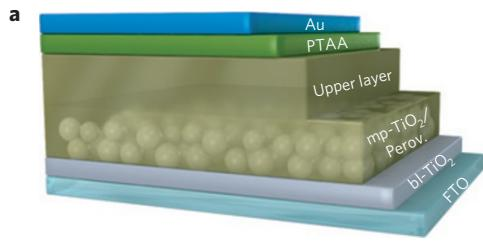

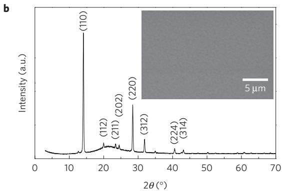

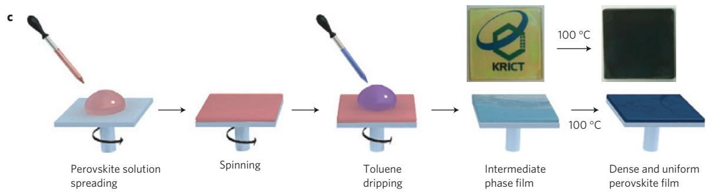  
Figure 1 | Device architecture, scheme of solvent engineering process, and XRD of perovskite layer. a, Device architecture of the bilayered perovskite solar cell (glass/FTO/bl-TiO2/mp-TiO2-perovskite nanocomposite layer/perovskite upper layer/PTAA/Au). b, XRD pattern of the annealed perovskite coating on fused silica substrate. The inset shows a SEM image of a surface consisting of a glass/FTO/bl-TiO2/mp-TiO2-perovskite nanocomposite layer/perovskite upper layer. c, Solvent engineering procedure for preparing the uniform and dense perovskite film.

reveals a bilayer structure comprising mesoscopic and planar structures, and is effective for sufficiently absorbing light and collecting charges. Atop the mp- $\mathrm { T i O } _ { 2 }$ layer lies a highly uniform perovskite active layer (100–300 nm thick). Poly(triarylamine) (PTAA) and Au metal were next deposited on the active layer as a hole-transporting material and photocathode, respectively. For this architecture, the formation of a homogeneous thin perovskite layer is extremely important, and we developed our solvent-engineering technology as an effective tool for creating such a layer. The process involves five stages, as depicted in Fig. 1c. First, a mixture of MAI, MABr, $\mathrm { P b I } _ { 2 }$ , $\mathrm { P b } \mathrm { B r } _ { 2 }$ , GBL and DMSO in the appropriate ratio is spread over the entire surface of the substrate. Second, the spin-coater is accelerated to the desired rotational speed and maintained there for several tens of seconds to evaporate the solvent. Third, a solvent that does not dissolve the perovskite materials and is miscible with DMSO and GBL (for example, toluene or chloroform) is dripped on the substrate during spinning. Fourth, all constituents are frozen into a uniform layer on the removal of the residual DMSO and then a new complex as an intermediate phase is formed (see below). Finally, the complex is converted into highly uniform and crystalline perovskite on annealing at $1 0 0 ^ { \circ } \mathrm { C }$ for $1 0 \mathrm { { m i n } }$ (Fig. 1b). As is apparent from Supplementary Fig. 1, the morphology of the perovskite thin layer is markedly changed by this solvent-engineering process, as compared with model systems on quartz substrate. In pure GBL, the perovskite crystals formed immediately, and the colour of the film on the substrate changed to dark hazy brown during rotation at $^ { 5 , 0 0 0 \mathrm { r . p . m . } }$ , regardless of the application of the toluene drip. The resulting morphology appears as inhomogeneous islands with low coverage on the substrate (Supplementary Fig. 1a). In contrast, in the DMSO and GBL mixed solvent, the colour change to dark brown is not observed during spin-coating, even after 5 min rotation. The spin-coated layer formed with the solvent mixture followed by the toluene drip is extremely uniform and transparent, and covers the full surface with low surface roughness. Without the toluene drip

treatment, the resulting material adopts a textile-like inhomogeneous layer that does not fully cover the substrate, and perovskite crystals are formed from the coating after annealing at $1 0 0 ^ { \circ } \mathrm { C }$ (Supplementary Fig. 1b). Here, the crystallinity of the perovskite films is almost the same regardless of the toluene drop-casting, as can be seen in values of full-width at half-maximum of (110) XRD peaks of Supplementary Fig. 2. Therefore, the solvent-engineering technique is critically important for this process.

To gain further insight into the mixed-solvent application and subsequent toluene drip treatment, we isolated the intermediate phase formed by pouring MAI and $\mathrm { P b I } _ { 2 }$ dissolved in GBL and DMSO into toluene. In this experiment, we excluded the doping of MABr and $\mathrm { P b } \mathrm { B r } _ { 2 }$ to simplify our analysis. The XRD profiles shown in Fig. 2a imply that the resultant intermediate phase is selforganized and highly crystalline in nature. Therefore, we think that the phase formed on toluene drop-casting in step 3 of Fig. 1c has a well-developed crystalline form. To get further information for the phase, we compared it with the XRD patterns for $\mathrm { P b I } _ { 2 }$ , MAI and $\mathrm { P b I } _ { 2 } ( \mathrm { D M S O } ) _ { 2 }$ , because the constituents in the mixed solvent can be simply precipitated in the non-dissolving solvent. Here, $\mathrm { P b I } _ { 2 }$ as a layered semiconductor material contains a plane of $\mathrm { P b }$ ions sandwiched between adjacent layers of hexagonally arranged iodide ions. The interlayer spaces allow rapid intercalation of different guest molecules owing to the weak bonding between the two planes by van der Waals-type interactions, leading to the expansion of the interlayer distance along the c axis21. It was known that the DMSO used as a solvent in this work can coordinate with lead halide to form a $\mathrm { P b I } _ { 2 } ( \mathrm { D M S O } ) _ { 2 }$ complex22. However, as can be seen in the figure, the isolated powder is a new and unreported compound that cannot be assigned to reported materials, and is related to the intermediate phase formed during perovskite deposition from DMSO and GBL. Thus, we considered a MAI– $\mathrm { P b I } _ { 2 }$ –DMSO complex as a possible crystalline compound that can be formed from the solution mixture. In the DMSO and GBL solution mixture,

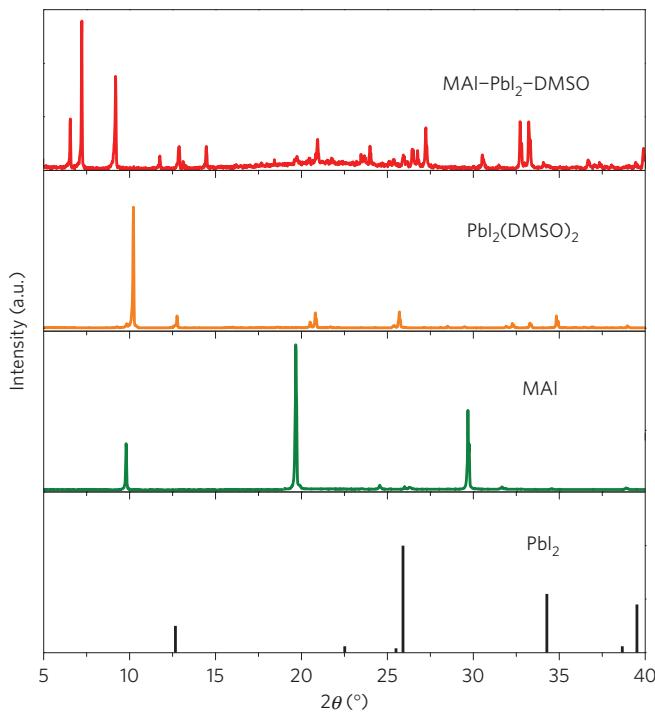  
a

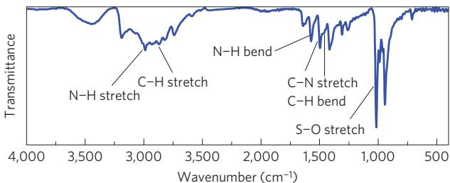  
b   
c

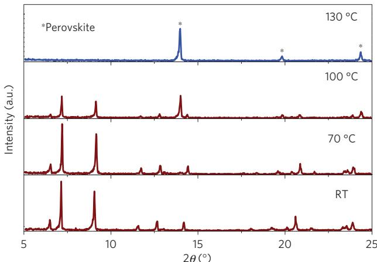

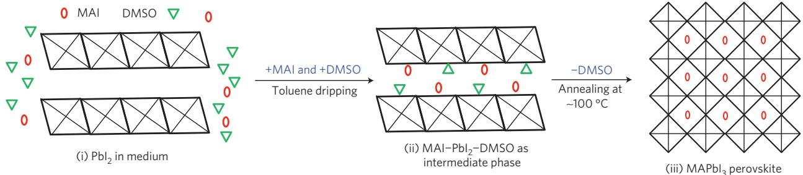  
d   
Figure 2 | XRD and FTIR of the intermediate phase and scheme for the formation of perovskite material via the intermediate phase. a, XRD spectra of $\mathsf { P b } | _ { 2 }$ (haematite, JCPDS file No. 07-0235), MAI, $\mathsf { P b l } _ { 2 } ( \mathsf { D M S O } ) _ { 2 }$ and MAI– $\cdot P b | _ { 2 }$ –DMSO intermediate phase powders. Comparing the XRD patterns of these powders, it is seen that the intermediate phase is dierent from the $\mathsf { P b l } _ { 2 }$ , MAI and $\mathsf { P b } | _ { 2 } ( \mathsf { D } M \mathsf { S } \mathsf { O } ) _ { 2 }$ phases. b, FTIR spectrum of the MAI– $\cdot P b | _ { 2 }$ –DMSO intermediate phase. N–H stretching and bending reveal that the intermediate phase includes MAI molecules. c, XRD spectra of the MAI– $\cdot P b | _ { 2 }$ –DMSO intermediate phase powder as a function of temperature. The intermediate phase is completely changed compared with the perovskite phase at $1 3 0 ^ { \circ } \mathsf C$ . d, Scheme for the formation of the perovskite material via the MAI– $\cdot P b | _ { 2 }$ –DMSO intermediate phase. (i) $\mathsf { P b } | _ { 2 }$ consisting of edge-sharing $[ \mathsf { P b } | _ { 6 } ] ^ { 4 - }$ -octahedral layers. (ii) MAI and DMSO guest molecules intercalated between the layers, forming the flat MAI– $\cdot \mathsf { P b } | _ { 2 }$ –DMSO intermediate phase film, when toluene is introduced onto the wet film comprising $\mathsf { P b } | _ { 2 }$ , MAI and DMSO. Here, the positions of the guest molecules are unconfirmed. (iii) Finally, the intermediate phase film is converted to the perovskite phase with corner-sharing octahedra via the extraction of DMSO guest molecules by the annealing process. The perovskite film is extremely uniform and flat because of the solid-state conversion from the uniform and flat intermediate phase film.

GBL functions purely as a solvent, which has a relatively higher evaporation rate than DMSO during spinning; XRD patterns of the intermediate phase completely matched the material isolated from DMSO in the absence of GBL. The mass percentage for a given element in MAI– $\mathrm { { P b } } _ { 2 }$ –DMSO $\mathrm { ' C _ { 3 } H _ { 1 2 } N S O P b I _ { 3 } }$ ) requires $\mathrm { H } = 1 . 7 \%$ ; $C = 5 . 2 \%$ ; $\Nu = 2 . 0 \%$ ; $\mathrm { O } = 2 . 3 \%$ ; $S \ : = \ : 4 . 6 \%$ ; $\mathrm { P b } = 2 9 . 7 \%$ ; and $\mathrm { I } = 5 4 . 5 \%$ . Elemental analysis of the intermediate phase yielded the following percentages by weight: $\mathrm { H } = 1 . 6 \%$ ; $\mathrm { C } = 4 . 6 \%$ ; $\Nu = 2 . 0 \%$ ; $\mathrm { O } = 2 . 2 \%$ ; and $S = 3 . 7 \%$ ; with a remainder of $8 5 . 9 \%$ . If the residue is assumed to be $\mathrm { P b }$ and 3I, the weight percentages of $\mathrm { P b }$ and I can be determined as $3 0 \%$ and $5 5 . 9 \%$ , respectively. As expected, the average atomic mass formula from elemental analysis is in agreement with MAI– $\mathrm { P b I } _ { 2 }$ –DMSO. In addition, the intercalation of both MAI and DMSO into $\mathrm { P b I } _ { 2 }$ can be observed by XRD peaks at low angles (6.55◦, $7 . 2 1 ^ { \circ }$ and $9 . 1 7 ^ { \circ }$ ). The appearance of XRD peaks at low angles indicates that the MAI– $\mathrm { . P b I } _ { 2 }$ –DMSO intermediate phase has longer interplanar distances, which are different from those

in the DMSO– $\mathrm { . P b I } _ { 2 }$ –DMSO complex, by the substitution of MAI for DMSO. The presence of MAI and DMSO in $\mathrm { P b I } _ { 2 }$ is further confirmed from the Fourier transform infrared spectroscopy (FTIR) spectrum for the intermediate phase. Figure 2b reveals the following spectral features and peak positions for the isolated powder; S–O and C–S stretching vibrations from DMSO coordinated to $\mathrm { P b } ^ { 2 + }$ at $1 , 0 1 2 \mathrm { c m } ^ { - 1 }$ ; N–H stretching in the range about $3 , 2 0 0 { - } 3 , 4 5 0 \mathrm { c m } ^ { - 1 }$ ; and C–H stretching in the range about $2 , 8 0 0 { - } 2 , 9 5 0 \ \mathrm { c m ^ { - 1 } }$ . The FTIR spectra of MAI, $\mathrm { P b I } _ { 2 }$ , DMSO–PbI –DMSO, MAI– $\mathrm { P b I } _ { 2 }$ –DMSO and $\mathrm { M A P b I } _ { 3 }$ are provided in Supplementary Fig. 3 for functional group comparison. The detection of both the N–H and S–O deformation modes in the intermediate phase guarantees the successful inclusion of a solvent molecule (DMSO) and MAI into the $\mathrm { P b I } _ { 2 }$ . Furthermore, the $\mathrm { C } { = } \mathrm { C }$ mode indicative of the toluene dripping solvent is not detected.

The conversion of the intermediate phase into perovskite with annealing temperature was monitored by in situ high-temperature

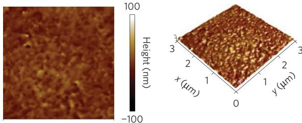  
a

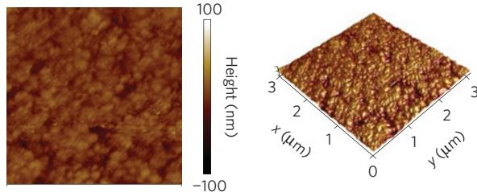  
b

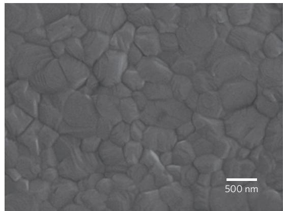  
c

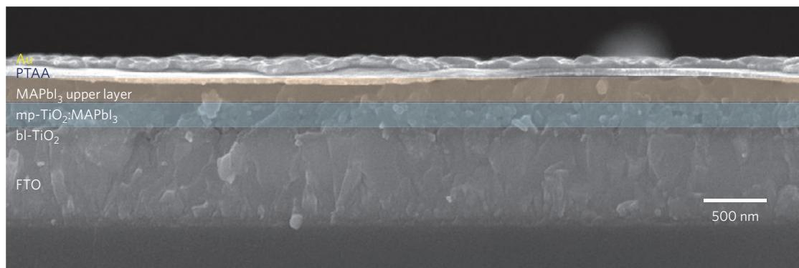  
d   
Figure 3 | AFM and SEM images of a perovskite device. a,b, AFM topography (left) and three-dimensional views (right) of the surface of the intermediate phase (a) and resulting perovskite film (b). The size of the AFM images is $3 \times 3 \mu \mathrm { m } ^ { 2 }$ . The measured root mean square roughness is $6 . 0 \mathsf { n m }$ (a) and $8 . 3 \mathsf { n m }$ (b). c, Higher-magnification SEM image of the upper layer. d, Cross-sectional SEM image of a complete perovskite device.

XRD. The low-angle diffraction peaks in the XRD pattern of Fig. 2c clearly show that, with increasing temperature, the putative MAI– $\mathrm { P b I } _ { 2 }$ –DMSO disappears and new peaks are observed due to the appearance of $\mathrm { M A P b I } _ { 3 }$ perovskite. We see that the formation of the perovskite phase is accompanied by the complete transformation of the MAI– $\mathrm { P b I } _ { 2 }$ –DMSO at $1 3 0 ^ { \circ } \mathrm { C } ,$ whereas both MAI– ${ \mathrm { . P b I } } _ { 2 } -$ DMSO and perovskite phases coexist at $1 0 0 ^ { \circ } \mathrm { C }$ .

On the basis of the above observations, we propose a plausible mechanism for the formation of the uniform and dense perovskite layer during spin-coating from MAI, $\mathrm { P b I } _ { 2 }$ and DMSO with a toluene drip treatment. As shown in Fig. 2d, at the initial stage during spinning, the film is composed of MAI and $\mathrm { P b I } _ { 2 }$ dissolved in the DMSO/GBL solvent mixture, whereas in the intermediate stage, the composition of the film is concentrated by the evaporation of GBL. Then the toluene droplets lead to the immediate freezing of the constituents on spinning via the quick removal of the excess DMSO solvent and the rapid formation of the MAI– $\mathrm { P b I } _ { 2 }$ –DMSO phase, leaving a uniform and transparent thin layer (Supplementary Fig. 1d). The role of DMSO in the MAI– $\mathrm { P b I } _ { 2 }$ –DMSO phase is to retard the rapid reaction between $\mathrm { P b I } _ { 2 }$ and MAI during the evaporation of solvent in the spin-coating process. Finally, the extremely homogeneous flat film (shown in Fig. 3a) is converted into a pure crystalline $\mathrm { M A P b I } _ { 3 }$ perovskite layer after annealing at $1 0 0 ^ { \circ } \mathrm { C }$ . In this process, the key material is the flat film consisting of MAI– $\mathrm { P b I } _ { 2 }$ –DMSO. These behaviours do not change by using the mixed-halide materials, $\mathrm { M A P b } ( \mathrm { I } _ { 1 - x } \mathrm { B r } _ { x } ) _ { 3 }$ $\scriptstyle x = 0 . 1 - 0 . 1 5 )$ ).

Accordingly, the formation of the intermediate phase is a critical factor for smoothing the surface via dropwise toluene application, which finally results in compact and uniform thin layers. Figure 3

illustrates images obtained by atomic force microscopy (AFM) for the intermediate film and the perovskite film on fused silica substrate, and field-emission scanning electron microscopy (SEM) images of the surface of the perovskite upper layer and the crosssection of a representative cell formed by our solvent-engineering technology. As can be seen in the three-dimensional AFM images and topography of Fig. 3a,b, the root mean square roughness values for the intermediate phase and crystalline perovskite layer are 6.0 and $8 . 3 \mathrm { n m }$ , respectively, even though the formation of the perovskite from the intermediate layer gave slightly increased roughness. In Fig. 3c, we can observe that the surface exhibits a dense-grained uniform morphology with grain sizes in the range $1 0 0 { - } 5 0 0 \mathrm { n m }$ . The entire film is composed of a homogeneous, wellcrystallized perovskite layer. In addition, from a typical crosssectional SEM image of a real device, we can see two uniform layers consisting of a $\mathrm { T i O } _ { 2 }$ /perovskite nanocomposite and the pure perovskite (Fig. 3d); the perovskite materials are fully infiltrated into the pores of the mp- $\mathrm { \cdot T i O } _ { 2 }$ film, and also deposited in a very uniform thick film with $1 0 0 \%$ surface coverage atop the mp- $\cdot \mathrm { T i O } _ { 2 }$ , compared with the conventional method10,11.

To fabricate efficient solar cells, the active layer of the light harvester must be thick enough to absorb sufficient incident light. Fortunately, the high absorption coefficient (Supplementary Fig. 4) of a perovskite light absorber film allows the use of very thin layers ${ \sim } 3 3 0 \mathrm { n m }$ thick) to absorb the entire range of visible light. Indeed, the authors of ref. 12 fabricated a highly efficient thin solar cell exceeding $1 5 \%$ efficiency with a perovskite absorber $\mathrm { ( M A P b I _ { 1 - x } C l _ { { \boldsymbol { x } } } } _ { \boldsymbol { x } }$ ) of ${ \sim } 3 0 0 \mathrm { n m }$ without mp- $\mathrm { T i O } _ { 2 }$ , and reported that the $\mathrm { M A P b I _ { 1 - x } C l } _ { x }$ perovskite had a long diffusion

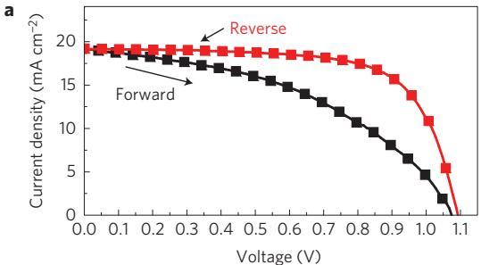

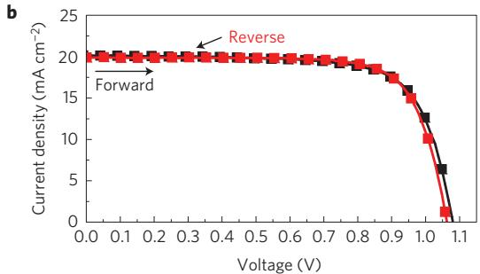

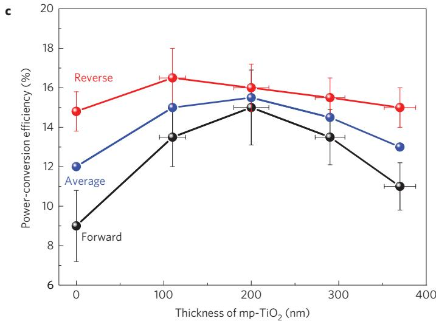  
Figure 4 | Photovoltaic performance as a function of scan direction and mp-TiO layer thickness. a, J–V curves for a flat cell (FTO/bl-TiO /350-nm-thick perovskite layer/PTAA/Au) measured by forward (short circuit open circuit) and reverse (open circuit short circuit) scans with $1 0 \mathsf { m V }$ voltage steps and 40 ms delay times under AM 1.5 G illumination. b, $J - V$ curves for a bilayered cell (FTO/bl-TiO2/200-nm-thick mp-TiO2-perovskite nanocomposite layer/perovskite upper layer/PTAA/Au) under the same measurement conditions. c, Relationship between the power-conversion eciency of the perovskite cells versus the thickness of the mp- $- \Upsilon \mathrm { i } { \cal O } _ { 2 }$ layer. For each thickness, 12 cells were characterized. The error bars represent maximum and minimum eciency values (vertical) and thickness values (horizontal; thickness calculated from SEM cross-sections).

length $( > 1 \mu \mathrm { m } ;$ ; ref. 17). These results encouraged us to fabricate a thin-film solar cell using $\mathrm { M A P b } ( \mathrm { I } _ { 1 - x } \mathrm { B r } _ { x } ) _ { 3 }$ $\left( x = 0 . 1 { - 0 . 1 5 } \right)$ with a thickness of $3 5 0 \mathrm { n m }$ in the absence of $\mathrm { m p - T i O } _ { 2 }$ . We were able to fabricate thin-film solar cells with extremely uniform, dense layers (Fig. 3a–c) by our solvent-engineering technology. Figure 4a presents the $I - V$ curves for a cell fabricated without the mp- $\mathrm { . T i O } _ { 2 }$ layer, measured with a 40 ms scanning delay in reverse (from the open-circuit voltage $( V _ { \mathrm { o c } } )$ to the short-circuit current $\left( I _ { \mathrm { s c } } \right) \mathrm { . }$ ) and forward (that is, from $I _ { \mathrm { s c } }$ to $V _ { \mathrm { o c . } }$ ) modes under standard airmass 1.5 global (AM 1.5 G) illumination. Table 1 summarizes the extracted short-circuit current density $( J _ { \mathrm { s c } } )$ ), $V _ { \mathrm { o c } }$ and fill factor (FF). Apparently, there is a large hysteresis and distortion in the $I - V$ curves. The $J _ { \mathrm { s c } }$ , $V _ { \mathrm { o c } }$ and FF values obtained from the $I - V$ curve of the reverse scan were $1 9 . 2 \mathrm { m A } \mathrm { c m } ^ { - 2 }$ , $1 . 0 9 \mathrm { V }$ and 0.69, respectively, yielding a PCE of $1 4 . 4 \%$ under standard AM 1.5 conditions. In contrast, the corresponding values from the I –V curve of the forward scan were $1 9 . 2 \mathrm { m } \mathrm { \bar { A } } \mathrm { c m } ^ { - 2 }$ , 1.07 V and 0.44, respectively, showing a pronounced discrepancy of $9 . 1 \%$ in overall efficiency. Such hysteresis and the discrepancy result in the underestimation of the real $J - V$ curves in the forward scan and overestimation in the reverse scan. Typically, reliable solar cell I–V measurements should exhibit coincident curves for both the forward and reverse scans. In some cases, depending on the cells, the measurements must be carried out with longer scanning delays. Thus, the efficiencies for the cell without the mp- $\mathrm { T i O } _ { 2 }$ layer were compared between the forward and reverse scans at various delay times ranging from 10 to $3 0 0 \mathrm { m s }$ . As can be seen in Supplementary Fig. 5a the efficiency decreased from 11.0 to $7 . 0 \%$ in the forward scan and from 16.5 to $8 . 5 \%$ in the reverse scan, as the delay time increased from 10 to 300 ms. The efficiencies did not approach similar values even when the scan time was long. Furthermore, the average efficiency from the reverse and forward scans continued to decline with increasing delay time. Thus, the large discrepancy and discordance with scan direction and delay time can induce a considerable error in evaluating cell efficiency. In contrast, the $J - V$ curves of the forward and reverse scans of the cell with the bilayer architecture {FTO/blocking

Table 1 | Photovoltaic performance of perovskite solar cells without mp-TiO2 or with 200-nm-thick mp-TiO2.   

<table><tr><td>Devices</td><td>Scan direction</td><td>Jsc(mA cm-2)</td><td>Voc(V)</td><td>FF</td><td>PCE (%)</td></tr><tr><td rowspan="2">W/O mp-TiO2</td><td>Forward</td><td>19.2</td><td>1.07</td><td>0.44</td><td>9.1</td></tr><tr><td>Reverse</td><td>19.2</td><td>1.09</td><td>0.69</td><td>14.4</td></tr><tr><td rowspan="2">200-nm-thick mp-TiO2</td><td>Forward</td><td>20.1</td><td>1.08</td><td>0.73</td><td>15.8</td></tr><tr><td>Reverse</td><td>19.9</td><td>1.06</td><td>0.75</td><td>15.9</td></tr></table>

layer (bl)- $\mathrm { T i O } _ { 2 } / \mathrm { m p } { \cdot } \mathrm { T i O } _ { 2 }$ ${ \sim } 2 0 0 \mathrm { n m }$ )/upper layer $( \sim 2 0 0 \mathrm { n m }$ )/PTAA $( 5 0 \mathrm { n m } ) / \mathrm { A u } \}$ (Fig. 4b) were well coincident. Moreover, the efficiency and average efficiency from both scan directions were symmetrical and identical regardless of the scanning direction, and results using a significantly shorter delay time were coincident with those from a cell lacking the mp- $\mathrm { \cdot T i O } _ { 2 }$ (Supplementary Fig. 5b). The $J _ { \mathrm { s c } }$ , $V _ { \mathrm { o c } }$ and FF values obtained from the $I - V$ curves of Fig. 4b for the reverse and forward scans are summarized in Table 1, and the overall efficiencies for both scan directions under the standard method are 15.8 and $1 5 . 9 \%$ with an average of $1 5 . 8 5 \%$ , clearly showing the reliability of the I–V measurements. Generally, the average value of the efficiency, determined from the forward and reverse scans should be widely accepted when the scanning delay time is longer than 40 ms (ref. 23), because an excessively long time to complete the measurement is impractical.

For a deeper understanding of the dependence of the $I - V$ parameters on both scan directions, we investigated the difference between the forward and reverse scans for a 40 ms scan time as a function of the thickness of the $\mathrm { m p - T i O } _ { 2 }$ layer. As the layer thickness increased to ${ \sim } 2 0 0 \mathrm { n m }$ , the difference in efficiency between the forward and reverse scans reached a minimum, and then again deviated slightly with continuing mp- $\mathrm { T i O } _ { 2 }$ thickness

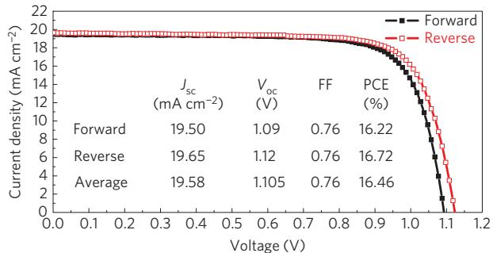  
a

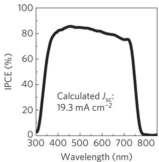  
b

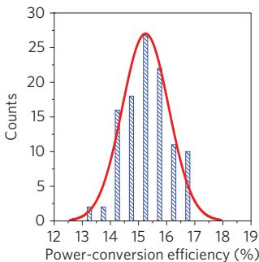  
c   
Figure 5 | J–V and IPCE characteristics for the best cell, and its reproducibility. a, J–V curves for the best cell measured by forward and reverse scans, fabricated using a 200-nm-thick mp-TiO2 layer. The average photovoltaic performance values from the two J–V curves are summarized (inset). b, The incident photon-to-current eciency (IPCE) spectrum for the best cell. c, Histogram of average eciencies for 108 devices.

increases (Fig. 4c). Interestingly, the efficiency measured in the reverse scan did not vary greatly with the mp- $\mathrm { \cdot T i O } _ { 2 }$ thickness, whereas the forward scan yielded a pronounced variation, resulting in a large discrepancy between the two scan directions. Such a strong dependence of the measured efficiency on the scan direction with mp- $\mathrm { T i O } _ { 2 }$ thickness suggests that solar cells fabricated from $\mathrm { M A P b X } _ { 3 }$ perovskite materials operate differently than other types of cells such as organic, dye-sensitized, and conventional Si solar cells. The stepwise increase or decrease in the bias voltage, corresponding to a reverse or forward scan, respectively, requires a charge redistribution to reach a new equilibrium state. These characteristics of perovskite solar cells may be related to the large diffusion capacitance of such cells operating under reverse or forward biases24. The large capacitance is assumed to be related to the underestimation in the forward scan and overestimation in the reverse scan by charging and discharging during the voltage sweep in the solar cells. In other words, the generated charge (electrons or holes) may persist in the perovskite owing to the slow charge collection in the thick perovskite layer, and require significant time for charge distribution. This would impede a quick response to the rapid scanning of the applied voltage for the $I - V$ measurements. Therefore, the slow charge collection via the perovskite material itself must be improved to eliminate the large discrepancy with scan direction, and an optimally thick mp- $\mathrm { \cdot T i O } _ { 2 }$ layer must be introduced for efficient charge collection from the perovskite via the large $\mathrm { T i O } _ { 2 }$ interface. Eventually, it will be very important to impart effective charge collection and light absorption properties through a balance in the ratios between the perovskite-infiltrated $\mathrm { T i O } _ { 2 }$ layer and the thin upper layers. Of course, the tendency for discrepancy according to scan direction can be related to the perovskite composition, because the exciton diffusion length was markedly changed by doping Cl ions into $\mathrm { M A P b I } _ { 3 }$ (ref. 17).

To further enhance the performance of our cells fabricated by solvent engineering, we repeated the fabrication procedure

using $\mathrm { m p - T i O } _ { 2 }$ with a thickness of ${ \sim } 2 0 0 \mathrm { n m }$ . The $J - V$ curves and incident photon-to-current efficiency (IPCE) spectrum of the best performing solar cell are presented in Fig. 5. The average values from the $J - V$ curves from the reverse and forward scans (Fig. 5a) exhibited a $J _ { \mathrm { s c } }$ of $1 9 . 5 8 \mathrm { m A c m } ^ { - 2 }$ , $V _ { \mathrm { o c } }$ of $1 . 1 0 5 \mathrm { V } ,$ and FF of $7 6 . 2 \%$ , corresponding to a PCE of $1 6 . 5 \%$ under standard AM $1 . 5 \ G$ conditions. The best device also showed a very broad IPCE plateau of over $8 0 \%$ between 420 and $7 0 0 \mathrm { n m }$ , as shown in Fig. 5b. The $J _ { \mathrm { s c } }$ value integrated from the IPCE agreed well with that measured by $I - V$ . In Fig. 5c a histogram of the average PCEs for all of the independently fabricated cells contributing to our study is presented. Around $8 0 \%$ of the cells made using our process exhibited an overall efficiency exceeding of $1 5 \%$ under 1 sun conditions, proving the conceptual validity of a balanced thickness between the $\mathrm { T i O } _ { 2 }$ and thin upper layers. In addition, an evaluation of the available results allows us to conclude that this solvent-engineering approach provides a simple and effective means for realizing highefficiency and low-cost perovskite-based solar cells. One of these devices was certified by the standardized method in a photovoltaics calibration laboratory, confirming a PCE of $1 6 . 2 \%$ under AM 1.5 G full sun (Supplementary Fig. 6).

In summary, we developed a solvent-engineering technology for the deposition of extremely uniform perovskite layers, and demonstrated a solution-processed perovskite solar cell with $1 6 . 5 \%$ PCE under standard conditions (AM 1.5 G radiation, 100 mW $\mathrm { c m } ^ { - 2 }$ ). We proposed a plausible mechanism for the formation of uniform and dense perovskite layers during the solvent-engineering process. The formation of a stable MAI(Br)– $\mathrm { P b I } _ { 2 }$ –DMSO phase via an intercalation process during the dropwise application of a non-dissolving solvent was a decisive factor in retarding the rapid reaction between MAI(Br) and $\mathrm { P b I } ( \mathrm { B r } ) _ { 2 }$ , which enabled the formation of a highly uniform and dense surface. Furthermore, we found that thick perovskite cells fabricated without mp- $\mathrm { \cdot T i O } _ { 2 }$ showed a large hysteresis and distortion between reverse and forward scans, and raised arguments about the estimation of conversion efficiencies for perovskite cells. Hence, the ratio of the thicknesses of the perovskite-infiltrated mp- $\mathrm { \cdot T i O } _ { 2 }$ and the pure perovskite should be optimized to fabricate efficient perovskite cells with coincident reverse and forward scans. These results will provide an effective strategy for forming uniform $\mathrm { P b I } _ { 2 }$ -based perovskite layers through intercalation, and lead to more efficient and costeffective inorganic–organic hybrid heterojunction solar cells in the future.

# Methods

Solar cell fabrication. A dense blocking layer of $\mathrm { T i O } _ { 2 }$ (bl- $\cdot \mathrm { T i O } _ { 2 }$ , ${ \sim } 7 0 \mathrm { n m }$ in thickness) was deposited onto a F-doped $\mathrm { S n O } _ { 2 }$ (FTO, Pilkington, TEC8) substrate by spray pyrolysis, using a $2 0 \mathrm { m M }$ titanium diisopropoxide bis(acetylacetonate) solution (Aldrich) at $4 5 0 ^ { \circ } \mathrm { C }$ to prevent direct contact between the FTO and the hole-conducting layer. A 200–300-nm-thick mesoporous $\mathrm { T i O } _ { 2 }$ (particle size: about $5 0 \mathrm { n m }$ , crystalline phase: anatase) film was spin-coated onto the $\mathrm { \ b l { - } T i O _ { 2 } / F T O }$ substrate using home-made pastes14 and calcining at $5 0 0 ^ { \circ } \mathrm { C }$ for 1 h in air to remove organic components. $\mathrm { C H } _ { 3 } \mathrm { N H } _ { 3 } \mathrm { I }$ (MAI) and $\mathrm { C H } _ { 3 } \mathrm { N H } _ { 3 } \mathrm { B r }$ (MABr) were first synthesized by reacting $2 7 . 8 6 \mathrm { m l }$ $\mathrm { C H } _ { 3 } \mathrm { N H } _ { 2 }$ $4 0 \%$ in methanol, Junsei Chemical) and 30 ml HI $5 7 \mathrm { w t \% }$ in water, Aldrich) or $4 4 \mathrm { m l }$ HBr $( 4 8 \mathrm { w t \% }$ in water, Aldrich) in a $2 5 0 \mathrm { m l }$ round-bottom flask at $0 ^ { \circ } \mathrm { C }$ for 4 h with stirring, respectively. The precipitate was recovered by evaporation at $5 5 ^ { \circ } \mathrm { C }$ for 1 h. MAI and MABr were dissolved in ethanol, recrystallized from diethyl ether, and dried at $6 0 ^ { \circ } \mathrm { C }$ in a vacuum oven for $2 4 \mathrm { h }$ . The prepared MAI and MABr powders, $\mathrm { P b I } _ { 2 }$ (Aldrich) and $\mathrm { P b } \mathrm { B r } _ { 2 }$ (Aldrich) for $0 . 8 \mathrm { { M } \ M A P b ( I _ { 1 - x } B r _ { { x } } ) _ { 3 } }$ $\scriptstyle x = 0 . 1 - 0 . 1 5$ ) solution were stirred in a mixture of GBL and DMSO $( 7 { : } 3 \mathrm { v } / \mathrm { v } )$ ) at $6 0 ^ { \circ } \mathrm { C }$ for $1 2 \mathrm { h }$ . The resulting solution was coated onto the mp- $\mathrm { \cdot T i O } _ { 2 } / \mathrm { b l }$ -TiO /FTO substrate by a consecutive two-step spin-coating process at 1,000 and $5 , 0 0 0 \mathrm { r . p . m }$ for 10 and 20 s, respectively. During the second spin-coating step, the substrate (around $1 \mathrm { c m }$ $\times \ 1 \mathrm { c m } )$ was treated with toluene drop-casting. A detailed time-rotation profile for the spin-coating is represented in Supplementary Fig. 1c. The substrate was dried on a hot plate at $1 0 0 ^ { \circ } \mathrm { C }$ for 10 min. A solution of poly(triarylamine) (15 mg, PTAA, EM Index, $M _ { \mathrm { w } } { = } 1 7 { , } 5 0 0 \mathrm { g m o l ^ { - 1 } } .$ ) in toluene $( 1 . 5 \mathrm { m l } )$ ) was mixed with $1 5 \mu \mathrm { l }$ of a solution of lithium bistrifluoromethanesulphonimidate $\mathrm { ( 1 7 0 m g ) }$ ) in

acetonitrile (1 ml) and $7 . 5 \mu \mathrm { l }$ 4-tert-butylpyridine and spin-coated on the $\mathrm { M A P b } ( \mathrm { I } _ { 1 - x } \mathrm { B r } _ { x } ) _ { 3 }$ $( x = 0 . 1 - 0 . 1 5 ) / \mathrm { m p } \mathrm { - T i O _ { 2 } / b l \mathrm { - } T i O _ { 2 } / F T O }$ substrate at ${ 3 , 0 0 0 } \mathrm { r . p . m }$ for 30 s. Finally, a Au counterelectrode was deposited by thermal evaporation. The active area of this electrode was fixed at $0 . 1 6 \mathrm { c m } ^ { 2 }$ .

Characterization. The XRD spectra of the prepared films were measured using a Rigaku SmartLab X-ray diffractometer, and in situ XRD experiments of the powder isolated as an intermediate phase were performed using a Rigaku Ultima IV with an X-ray tube (Cu Kα, $\lambda { = } \bar { 1 } . 5 4 0 6 \bar { \mathrm { A } }$ ). The elemental analysis (C, H, N λand S) of the complex was performed using a FISONS EA–1108 CHN analyser. The FTIR spectra $( 4 , 0 0 0 { - } 5 0 0 { \mathrm { c m } } ^ { - 1 }$ ) were recorded on a Bruker EQUINOX 55 spectrophotometer with samples prepared by the KBr pellet method. Ultraviolet–visible absorption spectra were recorded on a Shimadzu UV 2550 spectrophotometer in the $2 0 0 { - } 8 0 0 \mathrm { n m }$ wavelength range at room temperature. AFM was performed using Bruker multimode 8 in ‘tapping’ mode. The IPCE was measured using a power source (Newport 300 W xenon lamp, 66920) with a monochromator (Newport Cornerstone 260) and a multimeter (Keithley 2001). J –V curves were measured using a solar simulator (Newport, Oriel Class A, 91195A) with a source meter (Keithley 2420) at $1 0 0 \mathrm { m W } \mathrm { c m } ^ { - 2 }$ , AM 1.5 G illumination, and a calibrated Si-reference cell certified by the NREL. The J –V curves were measured by reverse (forward bias $( 1 . 2 \mathrm { V } ) $ short circuit (0 V)) or forward (short circuit $( 0 \mathrm { V } ) $ forward bias (1.2 V)) scan. The step voltage was fixed at $1 0 \mathrm { m V }$ and the delay time, which is a set delay at each voltage step before measuring each current, was modulated. J –V curves for all devices were measured by masking the active area with a metal mask $0 . 0 9 4 \mathrm { c m } ^ { - 2 }$ in area.

Received 24 February 2014; accepted 22 May 2014; published online 6 July 2014

# References

1. Yella, A. Porphyrin-sensitized solar cells with cobalt (II/III)–based redox electrolyte exceed 12 percent efficiency. Science 334, 629–634 (2011).   
2. Kramer, l. J. & Sargent, E. H. The architecture of colloidal quantum dot solar cells: Materials to devices.Chem.Rey 114,863-882 (2014).   
3. Im, S. H. et al. All solid state multiply layered PbS colloidal quantum-dot-sensitized photovoltaic cells. Energy Environ. Sci. 4, 4181–4186 (2011).   
4. Li, G., Zhu, R. & Yang, Y. Polymer solar cells. Nature Photon. 6, 153–161 (2012).   
5. Congreve, D. N. et al. External quantum efficiency above $1 0 0 \%$ in a singlet-exciton-fission-based organic photovoltaic cell. Science 340, 334–337 (2013).   
6. Chang, J. A. et al. High-performance nanostructured inorganic–organic heterojunction solar cells. Nano Lett. 10, 2609–2612 (2010).   
7. Chang, J. A. et al. Panchromatic photon-harvesting by hole-conducting materials in inorganic–organic heterojunction sensitized-solar cell through the formation of nanostructured electron channels. Nano Lett. 12, 1863–1867 (2012).   
8. Lee, M. M. et al. Efficient hybrid solar cells based on meso-superstructured organometal halide perovskites. Science 338, 643–647 (2012).   
9. Kim, H-S. et al. Lead iodide perovskite sensitized all-solid-state submicron thin film mesoscopic solar cell with efficiency exceeding $9 \%$ . Sci. Rep. 2, 591 (2012).   
10. Heo, J. H. et al. Efficient inorganic–organic hybrid heterojunction solar cells containing perovskite compound and polymeric hole conductors. Nature Photon. 7, 486–491 (2013).

11. Burschka, J. et al. Sequential deposition as a route to high-performance perovskite-sensitized solar cells. Nature 499, 316–319 (2013).   
12. Liu, M., Johnston, M. B. & Snaith, H. J. Efficient planar heterojunction perovskite solar cells by vapour deposition. Nature 501, 395–398 (2013).   
13. Noh, J. H., Im, S. H., Heo, J. H., Mandal, T. N. & Seok, S. I. Chemical management for colorful, efficient, and stable inorganic–organic hybrid nanostructured solar cells. Nano Lett. 13, 1764–1769 (2013).   
14. Malinkiewicz, O. et al. Perovskite solar cells employing organic charge-transport layers. Nature Photon. 6, 128–132 (2014).   
15. Waleed, W. A. & Etgar, L. Depleted hole conductor-free lead halide iodide heterojunction solar cells. Energy Environ. Sci. 6, 3249–3253 (2013).   
16. You, J. et al. Low-temperature solution-processed perovskite solar cells with high efficiency and flexibility. ACS Nano 8, 1674–1680 (2014).   
17. Stranks, S. D. et al. Electron–hole diffusion lengths exceeding 1 micrometer in an organometal trihalide perovskite absorber. Science 342, 341–344 (2013).   
18. Xing, G. et al. Long-range balanced electron- and hole-transport lengths in organic–inorganic $\mathrm { C H _ { 3 } N H _ { 3 } P b I _ { 3 } }$ . Science 342, 344–347 (2013).   
19. Jeng, J-U. et al. $\mathrm { C H _ { 3 } N H _ { 3 } P b I _ { 3 } }$ perovskite/fullerene planar-heterojunction hybrid solar cells. Adv. Mater. 25, 3727–3732 (2013).   
20. Eperon, G. E., Burlakov, V. M., Docampo, P., Goriely, A. & Snaith, H. J. Morphological control for high performance, solution-processed planar heterojunction perovskite solar cells. Adv. Funct. Mater. 24, 151–157 (2014).   
21. Beckmann, P. A. A review of polytypism in lead iodide. Cryst. Res. Technol. 45, 455–460 (2010).   
22. Miyamae, H. et al. The crystal structure of lead(II) iodide-dimethylsulphoxide(1/2), $\mathrm { P b I } _ { 2 } ( \mathrm { D M S O } ) _ { 2 }$ . Chem. Lett. 6, 663–664 (1980).   
23. Herman, M. et al. Optimal I –V curve scan time of solar cells and modules in light of irradiance level. Int. J. Photoenergy 2012, 151452 (2012).   
24. Koide, N. & Han, I. Measuring methods of cell performance of dye-sensitized solar cells. Rev. Sci. Instrum. 75, 2828–2831 (2004).

# Acknowledgements

This work was supported by the Global Research Laboratory (GRL) Program, the Global Frontier R&D Program of the Center for Multiscale Energy System funded by the National Research Foundation in Korea, and by a grant from the KRICT 2020 Program for Future Technology of the Korea Research Institute of Chemical Technology (KRICT), Republic of Korea.

# Author contributions

N.J.J., J.H.N. and S.I.S. conceived the experiments, data analysis and interpretation. N.J.J., Y.C.K., W.S.Y., S.R. and J.H.N. performed the fabrication of devices, device performance measurements and characterization. N.J.J., S.R., Y.C.K. and W.S.Y. carried out the synthesis of materials for perovskites and S.I.S prepared $\mathrm { T i O } _ { 2 }$ particles and pastes. The manuscript was written by S.I.S., J.H.N. and N.J.J. The project was planned, directed and supervised by S.I.S. All authors discussed the results and commented on the manuscript.

# Additional information

Supplementary information is available in the online version of the paper. Reprints and permissions information is available online at www.nature.com/reprints.

Correspondence and requests for materials should be addressed to S.I.S.

# Competing financial interests

The authors declare no competing financial interests.