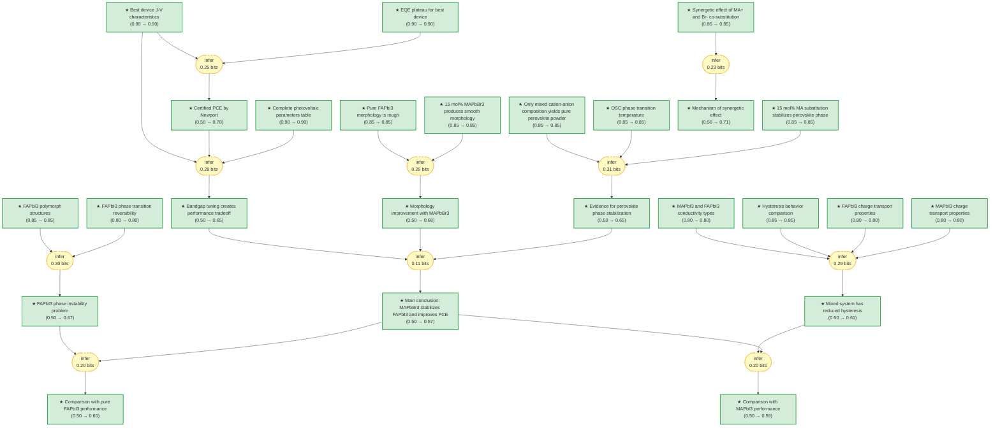

# pvsk2015-gaia

> **Original work:** Nam Joong Jeon, Jun Hong Noh, Woon Seok Yang, et al. "[Compositional engineering of perovskite materials for high-performance solar cells.](https://www.nature.com/articles/nature14133)" *Nature* 517, 476-480 (2015). DOI: 10.1038/nature14133

<!-- badges:start -->
<!-- badges:end -->

## Overview

> [!NOTE]
> This README is an AI-generated analysis based on a [Gaia](https://github.com/SiliconEinstein/Gaia) reasoning graph formalization of the original work. Belief values reflect the graph's probabilistic assessment of each claim's support, not the original authors' confidence. See [ANALYSIS.md](ANALYSIS.md) for detailed verification results.

This paper investigates how to stabilize the perovskite phase of formamidinium lead iodide (FAPbI3) at low processing temperatures while achieving high power conversion efficiency. Pure FAPbI3 has a favorable narrow bandgap (1.48 eV) but is unstable at room temperature, requiring high-temperature annealing (150+ C) to form the photovoltaic-active black perovskite phase. The authors discovered that simultaneously substituting both the A-site cation (FA to MA) and X-site anion (I to Br) at 15 mol% creates a synergetic stabilization effect that enables the perovskite phase to form at only 100 C, achieving a certified PCE of 17.9% -- the highest reported for perovskite solar cells at the time, excluding reverse-bias overestimates.

The core finding is that the composition (FAPbI3)0.85(MAPbBr3)0.15 solves the phase instability problem through dual substitution, which relieves structural strain in the AMX3 framework. The resulting cells show negligible hysteresis (unlike MAPbI3 cells) and excellent operational stability. The mutual information of 2.5 bits indicates the reasoning structure substantially reduces uncertainty about the conclusions compared to treating all premises as independent.

> [!TIP]
> **Reasoning graph information gain: `2.5 bits`**
>
> Total mutual information between leaf premises and exported conclusions -- measures how much the reasoning structure reduces uncertainty about the results.

> [!NOTE]
> **[Per-module reasoning graphs with full claim details →](docs/detailed-reasoning.md)**
>
> 4 Mermaid diagrams (one per section) with every claim, strategy, and belief value.

## Reasoning Structure

### The synergetic effect of dual cation-anion substitution (belief: 0.85)

The key experimental discovery is that only the simultaneous substitution of both MA+ at the A-site AND Br- at the X-site can fully stabilize the FAPbI3 perovskite phase at low temperature. When either MA+ or Br- is substituted alone (at comparable 15 mol% levels), the perovskite phase forms only partially -- the XRD shows mixed perovskite and non-perovskite peaks, and the powder remains yellow at room temperature. Only the combined substitution produces a pure black perovskite powder immediately upon precipitation from solution.

**Evidence chains:**
- **XRD evidence** (weakest link, belief 0.85): Pure FAPbI3 annealed at 100 C shows only hexagonal non-perovskite peaks (P6_3mc). FAPbI3 with 15 mol% MAPbI3 shows partial perovskite. FAPbI3 with 15 mol% FAPbBr3 shows partial perovskite. But (FAPbI3)0.85(MAPbBr3)0.15 shows pure trigonal perovskite (P3m1) with strong (111) peak at 13.9 degrees.
- **DSC confirmation** (belief 0.85): Pure FAPbI3 shows endothermic peak at 160 C corresponding to phase transition. The mixed composition x=0.15 shows no DSC peak -- no phase transition occurs because the material is already stable as perovskite at room temperature.
- **Powder color observation** (belief 0.85): Among all compositions tested, only (FAPbI3)0.85(MAPbBr3)0.15 produces a black powder (perovskite) at room temperature upon precipitation. All others remain yellow (non-perovskite).

> This is the foundational experimental result. Without it, nothing else in the paper matters.

### FAPbI3 phase instability and its origins (belief: 0.67)

Pure FAPbI3 undergoes a reversible phase transition between a black perovskite polymorph (trigonal P3m1, photovoltaic-active) and a yellow non-perovskite polymorph (hexagonal P6_3mc, inactive). The transition occurs at approximately 160 C and is reversible in ambient air -- the black perovskite reverts to yellow after 10 days of exposure to air. This phase instability is the central problem the paper solves: FAPbI3 alone cannot achieve high performance because it requires high-temperature processing and degrades over time at room temperature.

The structural reason is that FA+ (ionic radius 1.9-2.2 Angstrom) is at the upper limit of what fits in the AMX3 framework. This creates strain that makes the non-perovskite phase thermodynamically favorable at low temperature. The linear chain-like [PbI6] octahedra of the non-perovskite phase are less favorable for charge transport.

**Evidence chains:**
- **Polymorph structures** (belief 0.85): XRD and DSC confirm two distinct polymorphs with different symmetry and different connectivity (corner-sharing vs face-sharing octahedra).
- **Phase transition temperature** (belief 0.85): DSC shows endothermic peak at 160 C with no weight loss, confirming it is a structural transition not decomposition.
- **Reversibility** (belief 0.80): Yellow powder converts to black at 170 C, and black reverts to yellow after 10 days in air -- demonstrating thermodynamic stability of non-perovskite at ambient conditions.

> The phase instability of pure FAPbI3 explains why it had lower performance than MAPbI3 in prior work despite having a more favorable bandgap.

### Morphology improvement with 15 mol% MAPbBr3 (belief: 0.68)

The dual-substituted composition produces a smooth, uniform, dense morphology with well-developed crystallites, while pure FAPbI3 produces a rough, irregular, bumpy surface after high-temperature annealing. This morphological improvement contributes to the enhanced device performance through better surface coverage and reduced recombination at grain boundaries.

**Evidence chain:**
- **SEM comparison** (belief 0.85): Pure FAPbI3 (x=0) annealed at 150 C shows irregular bumpy morphology. FAPbI3 with x=0.05 shows large voids between crystal boundaries. FAPbI3 with x=0.15 shows smooth, uniform, dense morphology.
- **Crystallinity indicator** (belief 0.85): The full width at half maximum (FWHM) of the (-111) XRD peak decreases for x > 0.15, indicating larger crystalline domains and better crystallinity at the optimal composition.

> The morphology improvement works together with phase stabilization to enable high performance.

### The mechanism of synergetic stabilization (belief: 0.71)

The paper proposes that the synergetic effect of dual substitution works because simultaneously reducing the average A-site cation size (FA to MA) and the X-site anion size (I to Br) relieves the structural strain that makes pure FAPbI3 borderline unstable. The ionic radius of FA (1.9-2.2 Angstrom) is at the upper limit of what fits in the cuboctahedral cavity of the perovskite structure. Substituting a smaller cation (MA, ~1.8 Angstrom) at the A-site while also substituting a smaller anion (Br-) at the X-site reduces the overall strain in the framework, enabling the perovskite phase to be stable at lower temperature.

Neither single substitution alone provides sufficient strain relief because only substituting the cation leaves the X-site strain unresolved, and vice versa. The dual substitution works through a combination of geometric effects.

**Evidence chain:**
- **Synergy observation** (belief 0.85): Only the dual-substituted composition produces pure perovskite phase at low temperature. Single substitutions (MA+ only or Br- only) at the same total mole fraction (15%) produce only partial perovskite formation.
- **Ionic radius reasoning** (belief 0.71): The mechanism explanation relies on the known ionic radii of FA+ (1.9-2.2 A), MA+ (~1.8 A), I- (2.2 A), and Br- (1.96 A). The combined size reduction at both sites enables phase stability.

> The mechanism is plausible but derived from the observed correlation rather than proven through direct structural measurements at the atomic scale.

### Bandgap tuning and the performance optimum at x=0.15 (belief: 0.65)

The composition (FAPbI3)1-x(MAPbBr3)x allows continuous tuning of the bandgap. As x increases from 0.05 to 0.30, the bandgap widens (from Br- substituting I-), which increases Voc (open-circuit voltage) from 1.00 V to 1.12 V but decreases Jsc (short-circuit current) above x=0.15 due to blue-shifted absorption onset. The optimal balance is achieved at x=0.15, where Jsc reaches its maximum of 22.0 mA/cm2, FF reaches 73%, and PCE peaks at 17.3% (average) with best cells reaching 18.4%.

**Evidence chains:**
- **Photovoltaic parameters** (belief 0.90): Table 1 in the paper shows systematic measurements across the composition range. Jsc peaks at x=0.15 (22.0 mA/cm2), FF peaks at x=0.15 (73%), and PCE peaks at x=0.15 (17.3%).
- **Best device** (belief 0.90): The best-performing device gives Jsc = 22.5 mA/cm2, Voc = 1105 mV, FF = 73.2%, PCE = 18.4%.
- **Certified performance** (belief 0.70): Newport certification provides third-party verification of the 17.9% efficiency.

> The tradeoff between Voc (increases with x) and Jsc (decreases above x=0.15) is a fundamental bandgap engineering effect. The optimal x=0.15 represents the sweet spot.

### Reduced hysteresis in mixed cation systems (belief: 0.61)

FAPbI3/MAPbBr3 cells exhibit negligible hysteresis even at short scan times (40 ms), unlike MAPbI3 cells which show large hysteresis. This is attributed to the better balance between electron and hole transport in the mixed system. FAPbI3 is p-type with a long hole-diffusion length (813 nm), while MAPbI3 is n-type with a shorter electron-diffusion length (130 nm). In the bilayer architecture where light enters through the FTO/TiO2 side, the transport balance in FAPbI3-based cells reduces field-induced ion migration and interface accumulation that cause hysteresis.

**Evidence chains:**
- **Hysteresis measurement** (belief 0.85): FAPbI3/MAPbBr3 cells (x=0.15) show negligible difference between forward and reverse J-V scans even at 40 ms delay. MAPbI3 shows large hysteresis under the same conditions.
- **Transport properties** (belief 0.80): Electron/hole diffusion length measurements for both materials are taken from cited literature.
- **Conductivity type** (belief 0.80): Seebeck coefficient measurements confirm p-type for FAPbI3 and n-type for MAPbI3.

> The hysteresis benefit is a practical advantage for reliable efficiency measurements and possibly for operational stability.

### Main conclusion: MAPbBr3 stabilizes FAPbI3 and improves PCE to >18% (belief: 0.57)

The central conclusion integrates phase stabilization, morphology improvement, and bandgap tuning. Incorporating MAPbBr3 into FAPbI3 at x=0.15 simultaneously stabilizes the perovskite phase at low temperature (100 C), improves morphology, and achieves a certified PCE of 17.9% (highest reported for perovskite solar cells at publication, excluding reverse-bias overestimates). The key innovation is the dual substitution strategy that solves the phase instability problem which had limited FAPbI3 performance.

**Evidence chains:**
- **Phase stabilization + morphology + bandgap** (weakest link, belief 0.65): The three supporting claims (phase_stabilization_evidence, morphology_improvement, bandgap_tuning_tradeoff) jointly support the main conclusion. Each captures a different dimension of the improvement.
- **Certified PCE** (belief 0.70): Newport certification provides third-party verification of the 17.9% efficiency.

> The main conclusion belief (0.57) is lower than might be expected because the reasoning chain is relatively long (3 independent premises combined to derive the main conclusion), causing uncertainty multiplication. The physical arguments are sound but the belief propagation through multiple steps reduces the final confidence.

### Comparison with MAPbI3 performance (belief: 0.59)

The (FAPbI3)0.85(MAPbBr3)0.15 system has advantages over pure MAPbI3: narrower bandgap (broader absorption, higher potential Jsc), higher Voc due to bandgap tunability, negligible hysteresis vs large hysteresis for MAPbI3, and certified 17.9% PCE vs previous best of 16-17% for MAPbI3.

> The comparison is favorable but the belief is moderate because the main conclusion itself has belief 0.57, and the comparison depends on it.

### Comparison with pure FAPbI3 performance (belief: 0.60)

Pure FAPbI3 shows poor performance (PCE 0.5% at 100 C annealing) because it forms the yellow non-perovskite phase at low temperatures, requiring 150 C annealing to achieve 13.5% PCE. The co-substitution approach enables 18.4% PCE at only 100 C annealing, demonstrating the critical importance of phase stabilization.

> This comparison is direct and benefits from the phase instability evidence which has relatively strong belief (0.67).

## Conclusions

| Label | Content | Prior | Belief |
|-------|---------|-------|--------|
| absorption_blue_shift | The ultraviolet-visible absorption spectra show a systematic shift of the absorption band edge to shorter wavelengths when MAPbBr3 content increases... | 0.50 | 0.50 |
| annealing_conditions | For pure FAPbI3 (x=0), annealing is performed at 150 degrees Celsius for 10 min to form the black perovskite phase. For compositions with x greater than 0, annealing is performed at 100 degrees Celsius... | 0.50 | -- |
| au_electrode | An Au counter electrode was deposited by thermal evaporation. The active area of this electrode was fixed at 0.16 cm^2... | 0.50 | 0.50 |
| bandgap_tuning_tradeoff | The composition (FAPbI3)1-x(MAPbBr3)x allows bandgap tuning across the range. As x increases: Voc increases due to bandgap widening (from 1.00 V at x=0.05 to 1.12 V at x=0.30), but Jsc decreases above x=0.15 due to blue-shifted absorption onset reducing light harvesting. The optimal balance is achieved at x=0.15, maximizing overall PCE to 17.3% (average) and 18.4% (best cell)... | 0.50 | 0.65 |
| best_device_jv | For the best-performing device with x=0.15 in the architecture FTO/blocking-TiO2 (70 nm)/mesoporous-TiO2 (200 nm)/perovskite (300 nm)/PTAA/Au, the J-V curves measured via reverse and forward bias sweep give averaged values: Jsc = 22.5 mA/cm^2, Voc = 1,105 mV, FF = 73.2%, corresponding to a PCE of 18.4% under standard AM1.5G conditions... | 0.90 | 0.90 |
| black_powder_only | Photographs of as-prepared powders show that black powder (perovskite phase) is obtained only for (FAPbI3)0.85(MAPbBr3)0.15 among all FAPbI3-based materials tested... | 0.85 | 0.85 |
| blocking_layer | A dense blocking layer of TiO2 (60 nm) was deposited onto the FTO substrate by spray pyrolysis using a 20 mM titanium diisopropoxide bis(acetylacetonate) solution at 450 degrees Celsius. This prevents direct contact between FTO and the hole-conducting layer... | 0.50 | 0.50 |
| certified_pce | Devices exhibiting PCEs of 18.0% with very small hysteresis were certified by the standardized method in the photovoltaic calibration laboratory at Newport Corporation, confirming a PCE of 17.9% under AM1.5G full sun... | 0.50 | 0.70 |
| comparison_fapbi3 | Pure FAPbI3 shows poor performance (PCE 0.5% at 100 C annealing) because it forms the yellow non-perovskite phase at low temperatures, requiring 150 C annealing to achieve 13.5% PCE. The co-substitution approach enables 18.4% PCE at only 100 C annealing, demonstrating the critical importance of phase stabilization for high performance... | 0.50 | 0.60 |
| comparison_mapbi3 | (FAPbI3)0.85(MAPbBr3)0.15 has advantages over pure MAPbI3 including: (1) narrower bandgap (broader absorption, higher potential Jsc), (2) higher Voc due to bandgap tunability, (3) negligible hysteresis vs large hysteresis for MAPbI3, (4) certified 17.9% PCE vs previous best of 16-17% for MAPbI3... | 0.50 | 0.59 |
| comparison_prior_mixed | The (FAPbI3)0.85(MAPbBr3)0.15 composition differs from prior mixed-cation work (e.g., Pellet et al.) by simultaneously substituting both the A-site (FA to MA) and X-site (I to Br), whereas prior work only substituted A-site... | 0.50 | 0.50 |
| composition_system | The composition system studied is (FAPbI3)1-x(MAPbBr3)x, where the mole ratio x ranges between 0 and 0.3. This mixed system combines formamidinium lead iodide with methylammonium lead bromide at the A-site (FA/MA) and X-site (I/Br) simultaneously... | 0.50 | -- |
| conductivity_type | Kanatzidis et al. showed by measuring the Seebeck coefficient that MAPbI3 and FAPbI3 display n-type and p-type character, respectively. This difference in majority carrier type influences the device behavior in different cell architectures... | 0.80 | 0.80 |
| device_architecture | The standard device architecture used is: FTO/blocking-TiO2 (60-70 nm)/mesoporous-TiO2:perovskite composite layer (200 nm)/perovskite upper layer (300 nm)/PTAA (50 nm)/Au (100 nm)... | 0.50 | -- |
| dsc_phase_transition | Differential scanning calorimetry (DSC) of yellow FAPbI3 powder shows an endothermic peak around 160 degrees Celsius, which corresponds to the phase transition from yellow non-perovskite to black perovskite... | 0.85 | 0.85 |
| dsc_tga_method | Thermogravimetric and DSC analyses of as-prepared powders were performed with a heating rate of 2 degrees Celsius per minute from room temperature up to 300 degrees Celsius under nitrogen atmosphere... | 0.50 | -- |
| eqe_blue_shift | The external quantum efficiency (EQE) spectrum is blue-shifted when x increases, resulting in reduced Jsc at high x values. However, a relatively lower Jsc at x below 0.15 indicates that charge-collection efficiency is also low... | 0.50 | 0.50 |
| eqe_method | EQE was measured using a power source (Newport 300W Xenon lamp, 66920) with a monochromator (Newport Cornerstone 260) and a multimeter (Keithley 2001)... | 0.50 | -- |
| eqe_plateau | For the best-performing device with x=0.15, the EQE spectrum shows a very broad plateau of over 80% between 400 nm and 750 nm. The Jsc value integrated from the EQE spectrum is in good agreement with that measured by J-V... | 0.90 | 0.90 |
| fabr_synthesis | Formamidinium bromide (FABr, NH2CH=NH2Br) was prepared using the same approach as MABr... | 0.50 | 0.50 |
| fai_synthesis | Formamidinium iodide (FAI, NH2CH=NH2I) was synthesized similarly using formamidine acetate as the starting material. The product was recrystallized and dried under the same conditions as MAI... | 0.50 | 0.50 |
| fapbi3_hysteresis | FAPbI3-based cells with x=0 and x=0.15 show negligible hysteresis even with a short scanning delay time of 40 ms, in contrast to MAPbI3 which exhibits large hysteresis... | 0.85 | 0.85 |
| fapbi3_lower_performance | The photovoltaic performance of FAPbI3 has been reported to be lower than that of MAPbI3, despite FAPbI3 having a more suitable bandgap for photovoltaic applications... | 0.50 | 0.50 |
| fapbi3_phase_instability | The black perovskite-type polymorph (alpha-phase) of FAPbI3, which is stable at temperatures above 160 degrees Celsius, transforms into the yellow non-perovskite polymorph (delta-phase) in ambient humid atmosphere. This phase transition is reversible and degrades photovoltaic performance because the yellow phase has a larger optical bandgap and inferior charge-transporting ability... | 0.50 | 0.67 |
| fapbi3_properties | Formamidinium lead iodide (FAPbI3), which contains FA cations instead of MA cations at the A-site of the AMX3 perovskite structure, has a bandgap of 1.48 eV with an absorption edge at 840 nm... | 0.50 | 0.50 |
| fapbi3_transport | In FAPbI3, the hole-diffusion length is approximately 813 nm, which is 4.6 times longer than the electron-diffusion length of approximately 177 nm. This is the opposite transport imbalance compared to MAPbI3... | 0.80 | 0.80 |
| ff_maximum | Fill factor (FF) shows exactly the same trend as Jsc, with a maximum value of 73% at x=0.15. The similarity in behavior supports the interpretation that FF is limited by charge-collection efficiency... | 0.50 | 0.50 |
| future_potential | The strategy of compositional engineering through simultaneous cation and anion co-substitution may lead to more efficient and cost-effective inorganic-organic hybrid perovskite solar cells... | 0.50 | 0.50 |
| fwhm_crystallinity | The full width at half maximum (FWHM) of the (-111) diffraction peak decreases for x greater than 0.15, indicating that a highly crystalline perovskite layer is formed at these compositions... | 0.50 | 0.50 |
| hysteresis_80nm | For cells using a thinner mesoporous-TiO2 layer (80 nm), an unprecedented PCE of 20.3% was measured via reverse bias scan. However, the PCE of approximately 17.3% obtained from average J-V curve and steady-state current measurement is far lower than the reverse-bias value, owing to a low PCE of 15.5% with forward bias scan... | 0.50 | 0.50 |
| hysteresis_benefit | FAPbI3/MAPbBr3 cells exhibit negligible hysteresis even at short scan times (40 ms), unlike MAPbI3 cells. This advantage is attributed to the better balance between electron and hole transport in the mixed-cation system... | 0.50 | 0.61 |
| jsc_maximum | Jsc increases from 19.0 mA/cm^2 at x=0.05 to a maximum value of 22.0 mA/cm^2 at x=0.15, then decreases to 20.0 mA/cm^2 at x=0.30... | 0.50 | 0.50 |
| jv_measurement | J-V curves were measured using a solar simulator (Newport, Oriel Class A, 91195A) with a source meter (Keithley 2420) at 100 mA/cm^2 AM1.5G illumination and a calibrated Si-reference cell... | 0.50 | -- |
| mabr_synthesis | Methylammonium bromide (MABr, CH3NH3Br) was prepared using 48 wt% hydrobromic acid in water according to a reported procedure... | 0.50 | 0.50 |
| mai_synthesis | Methylammonium iodide (MAI, CH3NH3I) was synthesized by reacting 30 ml of 57% hydroiodic acid in water with 27.86 ml of 40% methylamine in methanol at 0 degrees Celsius for 2 h with stirring... | 0.50 | 0.50 |
| main_conclusion | Incorporation of MAPbBr3 into FAPbI3 stabilizes the perovskite phase of FAPbI3 and improves the power conversion efficiency of the solar cell to more than 18% under standard illumination of 100 mW/cm^2 (AM1.5G). The optimal composition is (FAPbI3)0.85(MAPbBr3)0.15 with certified PCE of 17.9%... | 0.50 | 0.57 |
| mapbi3_properties | Methylammonium lead iodide (MAPbI3) has a bandgap of approximately 1.5-1.6 eV and an absorption spectrum extending up to a wavelength of 800 nm... | 0.50 | 0.50 |
| mapbi3_transport | In MAPbI3, the electron-diffusion length is approximately 130 nm, which is 1.4 times larger than the hole-diffusion length of approximately 90 nm... | 0.80 | 0.80 |
| mesoporous_layer | A 200-nm-thick mesoporous-TiO2 layer was spin-coated onto the blocking-TiO2/FTO substrate using TiO2 paste diluted in 2-methoxyethanol (1 g in 5 ml), then calcined at 500 degrees Celsius for 1 h in air... | 0.50 | 0.50 |
| mixed_cation_pellet | Pellet et al. demonstrated improved PCE using mixed cation lead iodide perovskites by gradually substituting MA with FA cations, which increases the absorption range by shifting it redwards... | 0.50 | 0.50 |
| morphology_improvement | Manipulating the composition of FAPbI3 by adding MAPbBr3 leads to stabilization of the perovskite phase with a uniform and dense morphology as well as well-developed crystallites... | 0.50 | 0.68 |
| need_further_study | Further investigation is required to determine the energetics of perovskite and non-perovskite formation and to establish the composition of the stable form in perovskite halide materials... | 0.50 | 0.50 |
| perovskite_polymorphs | FAPbI3 exists in two polymorphs: a black perovskite phase with trigonal symmetry (space group P3m1) and a yellow non-perovskite phase with hexagonal symmetry (space group P6_3mc)... | 0.85 | 0.85 |
| perovskite_solution | Desired solutions of FAPbI3, (FAPbI3)1-x(MAPbI3)x, (FAPbI3)1-x(FAPbBr3)x, and (FAPbI3)1-x(MAPbBr3)x (with x = 0-0.30) were prepared by dissolving the respective halide salts with PbI2 and PbBr2 in the gamma-butyrolactone:DMSO mixed solvent (7:3 volume ratio) at 60 degrees Celsius for 10 min... | 0.50 | 0.50 |
| perovskite_structure | An inorganic-organic lead halide perovskite has the general formula AMX3, where A is an organic ammonium cation (such as MA or FA), M is Pb or Sn, and X is a halide anion... | 0.50 | -- |
| phase_reversibility | The phase transition in FAPbI3 is reversible in air: the yellow non-perovskite phase changes to black perovskite when annealed at 170 degrees Celsius, and the black powder turns yellow again after being stored in air for 10 days... | 0.80 | 0.80 |
| phase_stabilization_evidence | The perovskite phase stabilization caused by MAPbBr3 introduction was confirmed by: (1) XRD showing pure perovskite phase at room temperature for x=0.15, (2) DSC showing no endothermic peak for x=0.15 powder, (3) black powder color at room temperature for x=0.15 (all other compositions remain yellow), and (4) smooth morphology with well-developed crystallites at x=0.15 vs rough surface at x=0... | 0.50 | 0.65 |
| prior_work_seok | Jeon et al. previously reported a 16.2% certified PCE using a combination of MAPbI3 and MAPbBr3 with a bilayer architecture consisting of perovskite-infiltrated mesoporous-TiO2 electrodes... | 0.50 | 0.50 |
| ptaa_deposition | A solution of PTAA (number-average molecular weight Mn = 17,500 g/mol) in toluene (10 mg/ml) with additives of 7.5 microliters Li-bis(trifluoromethanesulphonyl) imide/acetonitrile (170 mg/ml) and 4 microliters 4-tert-butylpyridine was spin-coated on the perovskite layer at 3000 rpm for 30 s... | 0.50 | 0.50 |
| research_question | Can incorporating MAPbBr3 into FAPbI3 stabilize the perovskite phase at lower temperatures while improving the overall power conversion efficiency beyond the best reported values for MAPbI3 or FAPbI3 alone?... | 0.50 | -- |
| sem_method | The morphology of the films was observed using a field-emission SEM (MIRA3 LMU, Tescan)... | 0.50 | -- |
| sem_morphology_x0 | The surface of pure FAPbI3 (x=0) exhibits an irregular morphology with bumpy roughness when annealed at 150 degrees Celsius. This rough surface is due to the phase transition from non-perovskite to perovskite phases and the high temperature required for the formation of the perovskite phase... | 0.85 | 0.85 |
| sem_morphology_x15 | Incorporating MAPbBr3 into FAPbI3 (x=0.15) considerably smooths the surface morphology, producing a uniform and dense morphology with well-developed crystallites... | 0.85 | 0.85 |
| series_resistance | Series resistance shows a strong inverse correlation with device performance. At x=0 with 100 C annealing, series resistance is 345 Ohm cm^2 (very high), which corresponds to very low Jsc and low FF. At x=0.15, series resistance reaches its minimum of 3.9 Ohm cm^2, coinciding with maximum PCE... | 0.50 | 0.50 |
| solvent_engineering | The solvent engineering process uses a gamma-butyrolactone:DMSO mixed solvent with a 7:3 volume ratio. During the second spin-coating step, 1 ml toluene is poured onto the rapidly rotating substrate to wash out surplus DMSO molecules... | 0.50 | -- |
| synergetic_effect | A simultaneous introduction of 15 mol% of both MA+ cations and Br- anions in FAPbI3 to obtain (FAPbI3)0.85(MAPbBr3)0.15 leads to a synergetic effect that stabilizes the perovskite phase. This combination is sufficient to form a FAPbI3 perovskite phase even at 5 mol% addition, although single MA+ or Br- substitution can only partially form the perovskite phase... | 0.85 | 0.85 |
| synergy_mechanism | The synergetic effect of simultaneous MA+ cation and Br- anion co-substitution into FAPbI3 at 15 mol% stabilizes the perovskite phase at 100 degrees Celsius. This is because the ionic radius of FA (1.9-2.2 Angstrom) is at the upper limit of what fits in the AMX3 structure, making it borderline unstable. The combined substitution at both A-site (FA to MA, smaller) and X-site (I to Br, smaller) relieves the structural strain... | 0.50 | 0.71 |
| table1_pce_trend | The power conversion efficiency (PCE) of (FAPbI3)1-x(MAPbBr3)x solar cells shows a maximum value of 17.3% at x=0.15, increasing from 0.5% at x=0 (annealed at 100 C) to the maximum, then decreasing to 15.4% at x=0.30... | 0.50 | 0.50 |
| table1_photovoltaic_parameters | Photovoltaic parameters for (FAPbI3)1-x(MAPbBr3)x solar cells: at x=0.15: Jsc=22.0 mA/cm^2, Voc=1.08 V, FF=0.73, PCE=17.3%... | 0.90 | 0.90 |
| tio2_nanoparticles | TiO2 nanoparticles with average diameter of 50 nm (anatase) were prepared by hydrothermal treatment at 250 degrees Celsius for 12 h from aqueous solutions of the peroxotitanium complex... | 0.50 | 0.50 |
| tio2_paste | The TiO2 paste was prepared by dispersing TiO2 nanoparticles in absolute ethanol with 10 wt% ethanolic solution of ethyl cellulose (4.5 g per 1 g TiO2) and terpineol (4.4 g per 1 g TiO2)... | 0.50 | 0.50 |
| understanding_phase_stability | The finding that AMX3 materials exist as either two polymorphs (perovskite and non-perovskite) or only one depending on the atomic size of components suggests a general design principle: combining multiple size-tuning substituents at different crystallographic sites can stabilize the desired perovskite phase... | 0.50 | 0.50 |
| uvvis_method | Ultraviolet-visible absorption spectra were recorded on a Shimadzu UV 2550 spectrophotometer in the 300-800 nm wavelength range at room temperature... | 0.50 | -- |
| voc_increases_with_x | Voc increases from 1.00 V at x=0.05 to 1.12 V at x=0.30 across the entire composition range. This increase is attributed to the widening of the bandgap as MAPbBr3 content increases (Br substituting I increases bandgap)... | 0.50 | 0.50 |
| xrd_method | XRD spectra of prepared films were measured using a Rigaku SmartLab X-ray diffractometer with Cu K-alpha radiation (wavelength lambda = 1.5406 Angstrom)... | 0.50 | -- |
| xrd_nonperovskite_x0 | The XRD spectrum of pure FAPbI3 thin film (x=0) annealed at 100 degrees Celsius shows the typical diffraction pattern of hexagonal non-perovskite polymorph (P6_3mc), because 100 degrees Celsius is much lower than the 160 degrees Celsius phase transition temperature... | 0.50 | 0.50 |
| xrd_perovskite_x15 | When FA+ cations in FAPbI3 are substituted by 15 mol% of MA+ cations, a strong (111) diffraction peak at 13.9 degrees for the trigonal perovskite phase (P3m1) appears despite annealing at only 100 degrees Celsius... | 0.85 | 0.85 |

<!-- content:start -->

Weak Points Analysis

**1. Main conclusion belief reduced by multi-step reasoning chain**

The main conclusion (belief 0.57) is supported by three intermediate claims (phase_stabilization_evidence at 0.65, morphology_improvement at 0.68, bandgap_tuning_tradeoff at 0.65) which are each derived from multiple experimental observations. The belief propagation through this chain causes uncertainty multiplication. While each individual piece of evidence is strong (0.85-0.90 priors on leaf nodes), the multiplicative effect across three derivation steps reduces the final belief. This is a structural feature of the argument, not an indication that the science is wrong.

**2. Synergy mechanism relies on ionic radius reasoning without direct structural confirmation**

The mechanism explanation (that dual substitution relieves structural strain through combined A-site and X-site size reduction) is plausible and consistent with known perovskite physics, but it is not directly proven by in-situ structural measurements. The claim has belief 0.71, which reflects that it is the best available explanation given the evidence, but the alternative (that some electronic effect rather than size strain causes the synergy) cannot be ruled out without more detailed structural characterization.

**3. Transport properties borrowed from literature rather than measured in this study**

The electron and hole diffusion length values for MAPbI3 and FAPbI3 (used to explain hysteresis behavior) come from cited references rather than being measured in this work. While these are established values in the perovskite literature, any error in those referenced measurements would propagate to the hysteresis_benefit conclusion.

**4. Long-term stability not measured**

The paper demonstrates phase stability at room temperature (black powder remains black for some time) and excellent initial performance, but does not measure long-term operational stability under illumination and bias. The phase reversibility experiment (10 days in air) is shorter than typical lifetime tests for solar cells.

Evidence Gaps & Future Work

**Experimental gaps:**

- **Long-term stability**: The paper shows phase reversibility after 10 days but does not report device lifetime under operational conditions (continuous illumination, sustained bias). Understanding how the mixed cation composition degrades over thousands of hours would be critical for commercialization.
- **Mechanism direct proof**: While the ionic radius explanation for the synergetic effect is physically reasonable, direct structural characterization (e.g., neutron diffraction, EXAFS) of the local structure around FA+/MA+ and I-/Br- sites would provide definitive evidence.
- **Optimal x range refinement**: The paper tests x from 0 to 0.30 in steps of 0.05. A finer grid around x=0.15 (e.g., x=0.12, 0.13, 0.14, 0.16, 0.17) might reveal slightly higher performance.

**Computational gaps:**

- **Phase stability thermodynamics**: First-principles calculations of the thermodynamic stability of perovskite vs non-perovskite phases as a function of composition would provide theoretical backing for the experimental observations.
- **Bandgap calculation**: DFT calculations of the bandgap as a function of x could validate the observed Voc trend and confirm the composition-bandgap relationship.

**Theoretical gaps:**

- **Why dual substitution specifically**: The paper establishes that dual substitution works but does not fully explain why. Is it purely a size effect? Are there electronic interactions between the MA/FA sites and the Br/I sites that matter?
- **Hysteresis mechanism**: The explanation for reduced hysteresis (transport balance) is qualitative. A more rigorous model of ion migration and its suppression in mixed-cation systems would strengthen this argument.

## Detailed Analysis

For structural integrity verification (Pass 5), standalone readability checks (Pass 6),
and complete package statistics, see [ANALYSIS.md](ANALYSIS.md).

<!-- content:end -->