# Compositional engineering of perovskite materials for high-performance solar cells

Nam Joong Jeon1 *, Jun Hong $\mathrm { N o h ^ { 1 * } }$ , Woon Seok Yang1 , Young Chan $\mathrm { K i m ^ { 1 } }$ , Seungchan Ryu1 , Jangwon Seo1 & Sang Il Seok1,2

Of the many materials and methodologies aimed at producing lowcost, efficient photovoltaic cells, inorganic–organic lead halide perovskite materials1–17 appear particularly promising for next-generation solar devices owing to their high power conversion efficiency. The highest efficiencies reported for perovskite solar cells so far have been obtained mainly with methylammonium lead halide materials1–10. Here we combine the promising—owing to its comparatively narrow bandgap—but relatively unstable formamidinium lead iodide $\mathbf { ( F A P b I _ { 3 } ) }$ ) with methylammonium lead bromide $\mathbf { ( M A P b B r _ { 3 } }$ ) as the light-harvesting unit in a bilayer solar-cell architecture13. We investigated phase stability, morphology of the perovskite layer, hysteresis in current–voltage characteristics, and overall performance as a function of chemical composition. Our results show that incorporation of $\mathbf { M A P b B r _ { 3 } }$ into $\mathbf { F A P b } \mathbf { I } _ { 3 }$ stabilizes the perovskite phase of $\mathbf { F A P b I } _ { 3 }$ and improves the power conversion efficiency of the solar cell to more than 18 per cent under a standard illumination of 100 milliwatts per square centimetre. These findings further emphasize the versatility and performance potential of inorganic–organic lead halide perovskite materials for photovoltaic applications.

An inorganic–organic lead halide perovskite is any material that crystallizes into an $\mathrm { A M X } _ { 3 }$ (where A is an organic ammonium cation, M is Pb or Sn, and X is a halide anion) structure. The size of cation A is critical for the formation of a close-packed perovskite structure; in particular, cation A must fit into the space composed of four adjacent cornersharing $\mathrm { M X } _ { 6 }$ octahedra. Of the various inorganic–organic lead halide perovskite materials, methylammonium lead iodide $( \mathrm { M A P b I } _ { 3 } )$ ), with a bandgap of about $1 . 5 \mathrm { - } 1 . 6 \mathrm { e V }$ and a light absorption spectrum up to a wavelength of $8 0 0 \mathrm { n m }$ , has been extensively used as a light harvester in solar cells. Several methods, including a one-step spin-coating method $^ { 1 - 3 , 6 }$ , a two-step sequential method4 , and vapour deposition in a high-vacuum chamber5 , have been used to prepare $\mathrm { M A P b I } _ { 3 }$ materials. Additionally, different device architectures such as planar5,10 and mesostructured cells1,7 have also been proposed. The highest power conversion efficiency8,9,11 (PCE) so far, of $1 6 \%$ to $1 7 \%$ , was achieved for solution-processed $\mathrm { M A P b } \mathrm { I } _ { 3 }$ , although $1 9 . 3 \%$ in a planar device architecture was recently obtained from a reverse-bias current–voltage (I–V) curve12. We note that a PCE measured13–15 via a reverse-bias scan with the solar cells exhibiting a large-hysteresis $I { - } V$ curve can be highly overestimated.

We have already showed that chemical modification of the X site anions (for example, substitution of I with Br) of $\mathrm { M A P b I } _ { 3 }$ can tune the bandgaps to range between $1 . 5 \mathrm { e V }$ and $2 . 3 \mathrm { e V }$ by incorporating $\mathbf { M A P b B r } _ { 3 }$ $2 . 3 \mathrm { e V }$ bandgap); this resulted in colour variation and PCE modulation6 . In contrast, $\begin{array} { r } { \bar { \mathrm { H C } } ( \mathrm { N H } _ { 2 } ) _ { 2 } \mathrm { P b I } _ { 3 } , } \end{array}$ which contains formamidinium (FA) cations instead of methylammonium (MA) cations at the ‘A’ site of the $\mathrm { A M X } _ { 3 }$ perovskite structure, has a bandgap of $1 . 4 8 \mathrm { e V }$ , with an absorption edge of $8 4 0 \mathrm { n m }$ (refs 16–18). We expect that this reduced bandgap may allow absorption of photons over a broader solar spectrum. The structural and opto-electrical differences of $\mathrm { M A P b I } _ { 3 }$ and $\mathrm { F A P b } \mathrm { I } _ { 3 }$ are likely to originate from the difference in ionic radius of the MA (1.8 A˚ ) and FA ions $( 1 . 9 { - } 2 . 2 \mathring \mathrm { A } )$ . In fact, the relative ionic radii of A, M and X in the

$\mathrm { A M X } _ { 3 }$ perovskite structure have been widely used as a method of establishing the distortion of the $\mathrm { M X } _ { 6 }$ octahedron; in particular, a relatively smaller ion radius for X favours the formation of cubic structures18. However, the photovoltaic performance of $\mathrm { F A P b } \mathrm { I } _ { 3 }$ has been reported to be lower than that of $\mathrm { M A P b I } _ { 3 }$ (refs 16, 17). In addition, the black perovskite-type polymorph (a-phase), which is stable at relatively high temperatures (above $1 6 0 ^ { \circ } \mathrm { C } )$ , was observed to turn into the yellow $\mathrm { F A P b } \mathrm { I } _ { 3 }$ polymorph (d-phase) in an ambient humid atmosphere17. However, considering their suitable bandgap (which is lower than that in $\mathrm { M A P b I } _ { 3 }$ ), the performance of $\mathrm { F A P b I } _ { 3 }$ solar cells can be considerably improved by stabilizing the $\mathrm { F A P b } \mathrm { I } _ { 3 }$ phase, improving the crystallinity, and optimizing the cell architecture. In this regard, Pellet et al.19 demonstrated an improved PCE using mixed cation lead iodide perovskites by gradually substituting MA with FA cations—which increases the absorption range by shifting it redwards, allowing for a higher current density—but the performance was still dominated by $\mathrm { M A P b } \mathrm { I } _ { 3 }$ rather than $\mathrm { F A P b } \mathrm { I } _ { 3 }$ . We have recently reported a $1 6 . 2 \%$ certified PCE obtained from the combination of $\mathbf { M A P b }  { \mathrm { I } _ { 3 } }$ and $\mathbf { M A P b B r } _ { 3 }$ with a bilayer architecture consisting of perovskite-infiltrated mesoporous- $\mathrm { T i O } _ { 2 }$ electrodes, and an extremely uniform and dense upper perovskite layer obtained by solvent engineering techniques13; the absorption edge was below 770 nm. A strategy for extending the absorption range of solar light is thus to replace $\mathrm { M A P b I } _ { 3 }$ with $\mathrm { F A P b } \mathrm { I } _ { 3 }$ in the combined composition of $\mathrm { M A P b I } _ { 3 }$ and $\mathbf { M A P b } \mathbf { B } \mathbf { r } _ { 3 }$ .

Here we report the overall PCE and structural stability of $\left( \mathrm { F A P b I _ { 3 } } \right) _ { 1 } - \mathrm { { } } _ { x } ( \mathrm { M A P b B r _ { 3 } } ) _ { x } ,$ with the mole ratio $x$ ranging between 0 and 0.3. We investigated the performance of systems containing different amounts of $\mathbf { M A P b } \mathbf { B } \mathbf { r } _ { 3 }$ incorporated into FAPbI —that is, $\mathrm { ( F A P b I _ { 3 } ) } _ { 1 - x } \mathrm { ( M A P b B r _ { 3 } ) } _ { x }$ —by measuring their current density versus voltage $( J - V )$ . Figure 1a shows the PCEs obtained from the J2V curves for different $( \mathrm { F A P b I _ { 3 } } ) _ { 1 - x } ( \mathrm { M A P b B r _ { 3 } } ) _ { x }$ systems under standard air-mass 1.5 global (AM1.5G) illumination. The PCEs were averaged from the reverse (from the open-circuit voltage $V _ { \mathrm { o c } }$ to the short-circuit current $I _ { \mathrm { s c } } )$ and forward (from $I _ { \mathrm { s c } }$ to $V _ { \mathrm { o c } } )$ sweeps, because perovskite solar cells may experience a dependence of the measured efficiency on the scan direction. However, the hysteresis of the cells fabricated from $\mathrm { F A P b } \mathrm { I } _ { 3 }$ and $\mathrm { F A P b } \mathrm { I } _ { 3 }$ incorporating $1 5 \mathrm { m o l } \%$ $\mathbf { M A P b } \mathbf { B } \mathbf { r } _ { 3 }$ was not relevant, even after collecting J2V curves with the relatively short scanning delay time of 40 ms (Fig. 1b). In addition, the small discrepancies related to the scan direction for the $\mathrm { F A P b I _ { 3 } / M A P b B r _ { 3 } }$ systems disappeared at longer delay times (above 100 ms). That the hysteresis observed in $\mathrm { F A P b } \mathrm { I } _ { 3 }$ -based systems is negligible compared to the hysteresis in $\mathrm { M A P b } \mathrm { I } _ { 3 }$ (Fig. 1b inset) may be related to the balance between electron and hole transport within the perovskite layer.

As reported, the electron-diffusion length in $\mathrm { M A P b I } _ { 3 }$ ${ \sim } 1 3 0 \mathrm { n m } )$ is 1.4 times larger than the hole-diffusion length $( \sim 9 0 \mathrm { n m } ) ^ { 2 0 }$ , while $\mathrm { F A P b } \mathrm { I } _ { 3 }$ has a hole-diffusion length ${ \sim } 8 1 3 \mathrm { n m } )$ ) that is 4.6 times longer than the electron-diffusion length $( \sim 1 7 7 \mathrm { n m } ) ^ { 1 6 }$ . In addition, Kanatzidis et al.18 showed, by measuring the Seebeck coefficient, that $\mathrm { M A P b I } _ { 3 }$ and $\mathrm { F A P b } \mathrm { I } _ { 3 }$ display an n-type and a p-type character, respectively. Since the incident light of the $\mathrm { F T O / T i O } _ { 2 } /$ perovskite/PTAA/Au (where FTO is

1 Division of Advanced Materials, Korea Research Institute of Chemical Technology, 141 Gajeong-Ro, Yuseong-Gu, Daejeon 305-600, South Korea. 2 Department of Energy Science, 2066 Seoburo, Jangangu, Sungkyunkwan University, Suwon 440-746, South Korea.

*These authors contributed equally to this work.

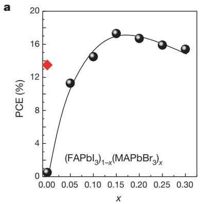

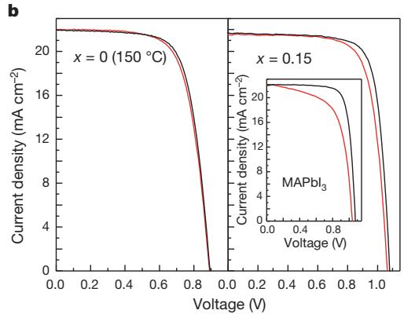

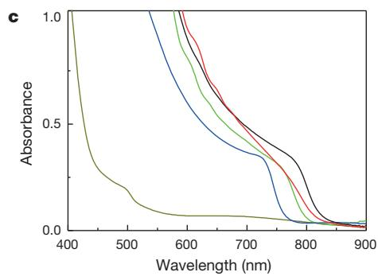

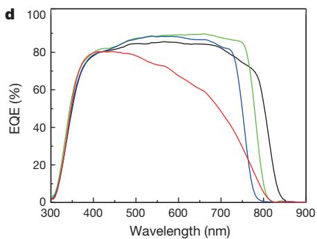  
Figure 1 | Characterization of materials. a, PCE values for cells using $\mathrm { ( F A P b I _ { 3 } ) } _ { 1 - x } \mathrm { ( M A P b B r _ { 3 } ) } _ { x }$ materials, which were annealed at $1 0 0 ^ { \circ } \mathrm { C }$ for $1 0 \mathrm { { m i n } }$ (black line); the red diamond indicates the PCE value for the cell fabricated using pure $\mathrm { F A P b I } _ { 3 }$ $( x = 0$ ); annealing was performed at $1 5 0 ^ { \circ } \mathrm { C }$ for 10 min to form the black perovskite phase. b, J–V curves for cells constructed from $\mathrm { F A P b I } _ { 3 }$ , $( { \mathrm { F A P b I } } _ { 3 } ) _ { 0 . 8 5 } ( { \mathrm { M A P b B r } } _ { 3 } ) _ { 0 . 1 5 }$ and $\mathbf { M A P b }  { \mathrm { I } _ { 3 } }$ (inset) films measured with a 40 ms scanning delay in reverse (from $V _ { \mathrm { o c } }$ to $I _ { \mathrm { s c } } )$ ) and forward (from $I _ { \mathrm { s c } }$ to $V _ { \mathrm { o c } } )$ modes under standard AM 1.5 G illumination. Pure $\mathrm { F A P b I } _ { 3 }$ $( x = 0$ ) was then annealed at $1 5 0 ^ { \circ } \mathrm { C }$ . c, Ultraviolet–visible absorption spectra of $\mathrm { ( F A P b I _ { 3 } ) } _ { 1 } \mathrm { - } _ { x } \mathrm { ( M A P b B r _ { 3 } ) } _ { x }$ films (with $x = 0$ , dark yellow; $x = 0 . 0 5$ , red; $x = 0 . 1 5$ , green; $x = 0 . 2 5$ , blue) annealed at $1 0 0 ^ { \circ } \mathrm { C }$ on fused silica substrates; the black line indicates absorption spectra for the pure $\mathrm { F A P b I } _ { 3 }$ film (perovskite phase) annealed at $1 5 0 ^ { \circ } \mathrm { C } ;$ the dark yellow line indicates a nonperovskite $\mathrm { F A P b I } _ { 3 }$ form. d, EQE spectra for cells using $\mathrm { ( F A P b I _ { 3 } ) } _ { 1 } \mathrm { - } _ { x } \mathrm { ( M A P b B r } _ { 3 } \mathrm { ) } _ { x }$ materials (with $x = 0$ , black; $x = 0 . 0 5$ , red; $x = 0 . 1 5$ , green; $x = 0 . 2 5$ , blue). Pure $\mathrm { F A P b } \mathrm { I } _ { 3 }$ $( x = 0$ ) was annealed at $1 5 0 ^ { \circ } \mathrm { C }$ .

fluorine-doped tin oxide and PTAA is poly(triarylamine)) cell configuration reaches the perovskite through the FTO side, more carriers are generated on the perovskite near $\mathrm { T i O } _ { 2 }$ than on the perovskite near PTAA. Therefore, many more holes than electrons should travel a long distance through the perovskite layer to the PTAA layer. This indicates that the balance between electron and hole transport in cells should be considered in compositional engineering for highly efficient perovskite solar cells. Data in Table 1 show that the solar cell annealed at $1 0 0 ^ { \circ } \mathrm { C }$ with $x = 0$ exhibits considerably low $J _ { \mathrm { s c } }$ $V _ { \mathrm { o c } }$ and fill factor (FF) values. In contrast, the overall PCE, including Jsc, $V _ { \mathrm { o c } }$ and FF, noticeably increased when annealing was performed at $1 5 0 ^ { \circ } \mathrm { C }$ . The trend of PCE as a function of $x$ in the cells fabricated with $\mathrm { F A P b I } _ { 3 } – \mathrm { M A P b B r } _ { 3 }$ showed that $J _ { \mathrm { s c } }$ increases from $1 9 . 0 \mathrm { m A } \mathrm { c m } ^ { - 2 }$ (at $x = 0 . 0 5$ ) to a maximum value of $2 2 \mathrm { m A } \mathrm { c m } ^ { - 2 }$ (at $x = 0 . 1 5$ ); after this point, $J _ { \mathrm { s c } }$ decreases to $2 0 \mathrm { m A c m } ^ { - 2 }$ (at $x = 0 . 3 0 \AA$ ). In this range, $V _ { \mathrm { o c } }$ increases from $1 . 0 \mathrm { V }$ to 1.12 V. Interestingly, the FF showed exactly the same $J _ { \mathrm { s c } }$ behaviour with a maximum value of $7 3 \%$ at $x = 0 . 1 5$ .

The ultraviolet–visible absorption spectra displayed in Fig. 1c show a systematic shift of the absorption band edge to shorter wavelengths when the $\mathbf { M A P b B r } _ { 3 }$ content is increased. The reduction of $J _ { \mathrm { s c } }$ observed with $x$ larger than 0.15 is directly related to the blue-shift of absorption onset, which in turn is responsible for the reduced light-harvesting efficiency. As expected, the external quantum efficiency (EQE) spectrum shown in Fig. 1d is blue-shifted when $x$ is increased, resulting in the reduction of $J _ { \mathrm { s c } }$ . However, a relatively lower $J _ { s c }$ below $x = 0 . 1 5$ , indicates that the charge-collection efficiency is also low, because $J _ { \mathrm { s c } }$ is

Table 1 | Photovoltaic parameters from $( \mathsf { F A P b l } _ { 3 } ) _ { 1 - x } ( \mathsf { I M A P b B r } _ { 3 } ) _ { x }$   

<table><tr><td>x</td><td>Jsc(mA cm-2)</td><td>Voc(V)</td><td>FF</td><td>PCE (%)</td><td>Series resistance (Ω cm2)</td></tr><tr><td>0 (150 °C)</td><td>22.0</td><td>0.88</td><td>0.70</td><td>13.5</td><td>5.7</td></tr><tr><td>0</td><td>1.10</td><td>0.88</td><td>0.51</td><td>0.5</td><td>345</td></tr><tr><td>0.05</td><td>17.1</td><td>1.02</td><td>0.65</td><td>11.3</td><td>6.0</td></tr><tr><td>0.10</td><td>21.0</td><td>1.04</td><td>0.66</td><td>14.5</td><td>4.8</td></tr><tr><td>0.15</td><td>22.0</td><td>1.08</td><td>0.73</td><td>17.3</td><td>3.9</td></tr><tr><td>0.20</td><td>21.5</td><td>1.09</td><td>0.71</td><td>16.7</td><td>4.3</td></tr><tr><td>0.25</td><td>21.0</td><td>1.10</td><td>0.69</td><td>15.9</td><td>4.9</td></tr><tr><td>0.30</td><td>20.0</td><td>1.12</td><td>0.69</td><td>15.4</td><td>5.7</td></tr></table>

proportional to the product of the charge-collection efficiency and the light-harvesting efficiency. The fact that the FF has a trend similar to that of $J _ { \mathrm { s c } }$ supports this, as confirmed by the considerably high series resistance shown below $x = 0 . 1 5$ (with annealing at $1 0 0 ^ { \circ } \mathrm { C }$ ). The increase of $V _ { \mathrm { o c } }$ over the entire range studied in this work may be attributed to the widening of the bandgap, which occurs when $x$ increases. Most importantly, the PCE of the solar cells fabricated in this study exhibits a maximum value of $1 7 . 3 \%$ at $x = 0 . 1 5$ , owing to the simultaneous enhancement of $\mathrm { \Delta } \mathrm { \dot { J } } _ { \mathrm { s c } }$ and FF, while $V _ { \mathrm { o c } }$ continues to increase (because the PCE is determined from the products of $J _ { s c }$ $V _ { \mathrm { o c } }$ and FF).

To further elucidate possible reasons for such low values of $J _ { s c }$ and $F F$ below $x = 0 . 1 5$ , we examined the phase stability of $\mathrm { F A P b } \mathrm { I } _ { 3 }$ . It is known that $\mathrm { F A P b } \mathrm { I } _ { 3 }$ is characterized by a reversible phase transition between two polymorphs, that is, a black perovskite with trigonal symmetry (space group $P 3 m 1$ ) and a yellow non-perovskite with hexagonal symmetry $( P 6 _ { 3 } m c ) ^ { 1 7 , 1 8 }$ . The latter contains linear chains of $[ \mathrm { P b } ] _ { 6 } ]$ octahedrons with face-sharing, while the former consists of a three-dimensional network of corner-sharing octahedrons.

Figure 2a shows the results of the differential scanning calorimetry (DSC) and thermogravimetric analysis of a yellow $\mathrm { F A P b } \mathrm { I } _ { 3 }$ powder heated at $3 0 0 ^ { \circ } \mathrm { C } .$ . An endothermic peak around $1 6 0 ^ { \circ } \mathrm { C }$ was found with the DSC analysis, which appears without any weight loss up to $2 5 0 ^ { \circ } \mathrm { C }$ in the thermogravimetric analysis. The X-ray diffraction (XRD) spectra of the yellow powder measured in situ (Extended Data Fig. 1) suggest that the endothermic peak can be assigned to the phase transition from yellow non-perovskite to black perovskite, in agreement with previous studies16,21. This indicates that the yellow non-perovskite phase for the pure $\mathrm { F A P b } \mathrm { I } _ { 3 }$ material is likely to be thermodynamically stable. This phase transition was also found to be reversible in air, that is, the prepared yellow non-perovskite phase changed to the black perovskite phase when annealing was performed at $1 7 0 ^ { \circ } \mathrm { C } ;$ the black powder turned yellow again after being stored in air for 10 days (Extended Data Fig. 2).

This unintentional phase transition in $\mathrm { F A P b } \mathrm { I } _ { 3 }$ solar cells may reduce the photovoltaic performance, because the yellow phase is characterized by a large optical bandgap (Fig. 1c) and an inferior charge-transporting ability due to the linear chain-like $\mathrm { [ P b I _ { 6 } ] }$ octahedron structure. Notably, $\mathrm { A M X } _ { 3 }$ (where A is Rb, Cs, MA or FA, M is Pb or Sn, and X is Cl, Br or I) metal trihalide materials exist as either two polymorphs (perovskite and non-perovskite) or only one of the two, depending on the atomic size of

the components22. For example, in contrast to $\mathrm { C s } \mathrm { S n I } _ { 3 }$ , which has two polymorphs, $\mathrm { M A S n I } _ { 3 }$ , with larger $\mathrm { M A } ^ { + }$ cations, shows only a perovskite phase and no phase transition near room temperature $( \sim 2 5 ^ { \circ } \mathrm { C } )$ . $\mathrm { R b } \mathrm { S n I } _ { 3 } ,$ with smaller $\mathrm { R b } ^ { + }$ cations, shows only a non-perovskite phase22–24. Therefore, the atomic combination of the A and X sites may lead to the stabilization of the $\mathrm { F A P b } \mathrm { I } _ { 3 }$ perovskite structure.

Figure 2b shows the XRD spectra of the prepared $\mathrm { F A P b } \mathrm { I } _ { 3 }$ , $( { \mathrm { F A P b I } } _ { 3 } ) _ { 1 - x } ( { \mathrm { M A P b I } } _ { 3 } ) _ { x } ,$ $( { \mathrm { F A P b I } } _ { 3 } ) _ { 1 } - { \mathrm { _ { \it x } } } ( { \mathrm { F A P b B r } } _ { 3 } ) _ { \it x } ,$ and $\mathrm { ( F A P b I _ { 3 } ) } _ { 1 } \mathrm { - } _ { x } \mathrm { ( M A P b B r _ { 3 } ) } _ { x }$ films (with $x = 0 . 1 5$ ) on mesoporous- $\cdot \mathrm { T i O } _ { 2 } /$ blocking- $\mathrm { \cdot T i O } _ { 2 } / \mathrm { F T O }$ glass substrates, after annealing at $1 0 0 ^ { \circ } \mathrm { C }$ for 10 min; these were prepared using the solvent-engineering process with precursor solutions of the desired compositions as previously reported13. The XRD spectrum of the pure $\mathrm { F A P b } \mathrm { I } _ { 3 }$ thin film shows the typical diffraction pattern of a hexagonal non-perovskite polymorph of $\mathrm { F A P b } \mathrm { I } _ { 3 }$ $( P 6 _ { 3 } m c ) ^ { 1 8 }$ ; this can be detected from DSC (Fig. 2a), because the temperature of the annealing $( 1 0 0 ^ { \circ } \mathrm { C } )$ is much lower than the temperature $( 1 6 0 ^ { \circ } \mathrm { C } )$ at which the phase transition occurs. However, when $\mathrm { F A } ^ { + }$ cations in $\mathrm { F A P b I } _ { 3 }$ are substituted by $1 5 \mathrm { m o l } \%$ of $\mathrm { \Delta \ m A ^ { + } }$ cations, a strong (111) diffraction peak at $1 3 . 9 ^ { \circ }$ for the trigonal perovskite phase $( P 3 m 1 )$ appears in spite of the annealing at $1 0 0 ^ { \circ } \mathrm { C }$ The same diffraction peaks are also observed in systems containing $\mathrm { B r } ^ { - }$ ions $( 1 5 \mathrm { m o l \% } )$ ), although the secondary phase coexists in the film.

Surprisingly, a simultaneous introduction of $1 5 \mathrm { m o l } \%$ of both $\mathrm { M A } ^ { + }$ cations and $\bar { \mathrm { B r } } ^ { - }$ anions in $\mathrm { F A P b } \mathrm { I } _ { 3 }$ to obtain $( { \mathrm { F A P b I } } _ { 3 } ) _ { 0 . 8 5 } ( { \mathrm { M A P b B r } } _ { 3 } ) _ { 0 . 1 5 }$ leads to a synergetic effect that stabilizes the perovskite phase. Interestingly, this is sufficient to form a $\mathrm { F A P b } \mathrm { I } _ { 3 }$ perovskite phase even after incorporating $5 \mathrm { m o l } \%$ of $\mathbf { M A P b } \mathbf { B } \mathbf { r } _ { 3 }$ (Extended Data Fig. 3), although

the single $\mathrm { M A } ^ { + }$ or $\mathrm { B r } ^ { - }$ can only partially form a perovskite phase. We also found that a highly crystalline perovskite layer is formed with values of $x$ larger than 0.15, according to the full width of half maximum (FWHM) of the $( - 1 1 1 )$ diffraction peak (Fig. 2c). Therefore, we surmise that the enhancement of the phase stability and crystallinity results in an improvement of PCE in the $x$ range of 0 to 0.15. The perovskite phase stabilization caused by the introduction of $\mathbf { M A P b } \mathbf { B } \mathbf { r } _ { 3 }$ to $\mathrm { F A P b } \mathrm { I } _ { 3 }$ was also confirmed by an analysis carried out on the synthesized powders, which were prepared at room temperature by precipitation from solutions of $\mathrm { F A P b I } _ { 3 } ,$ $\mathrm { ( F A P b I _ { 3 } ) _ { 1 } } _ { - x } \mathrm { ( M A P b I _ { 3 } ) } _ { x } ,$ $( { \mathrm { F A P b I } } _ { 3 } ) _ { 1 - x } ( { \mathrm { F A P b B r } } _ { 3 } ) _ { x }$ and $\mathrm { ( F A P b I _ { 3 } ) } _ { 1 - x } \mathrm { ( M A P b B r _ { 3 } ) } _ { x }$ with $x = 0 . 1 5$ . Photographs of the asprepared powders shown in Extended Data Fig. 4 indicate that a black powder like as-prepared $\mathrm { M A P b I } _ { 3 }$ is obtained only for $( \mathrm { F A P b I } _ { 3 } ) _ { 0 . 8 5 }$ $( \mathrm { M A P b B r } _ { 3 } ) _ { 0 . 1 5 }$ . In addition, the XRD spectra of the powders revealed that $\mathrm { ( F A P b I _ { 3 } ) _ { 0 . 8 5 } ( M A P b B r _ { 3 } ) _ { 0 . 1 5 } , }$ in contrast to $\mathrm { F A P b } \mathrm { I } _ { 3 }$ , shows a pure perovskite phase (Extended Data Fig. 5), with no endothermic DSC peaks (Fig. 2a). This finding confirms that the co-substitution of MA to FA and Br to I can efficiently stabilize the perovskite phase. However, further investigation is required to determine the energetics of the perovskite and non-perovskite formation and to establish the composition of the stable form in perovskite halide materials.

We recently successfully fabricated a complete bilayer on a mesoporous-$\mathrm { T i O } _ { 2 }$ using the solvent-engineering technology; our findings confirmed that surface coverage and morphology of perovskite materials is critical13. For this reason, here we analysed the surfaces deposited with different $x$ values for $\mathrm { M A P b B r } _ { 3 } / \mathrm { F A P b I } _ { 3 }$ using the solvent-engineering process. Figure 2d shows the surface scanning electron microscope (SEM) images

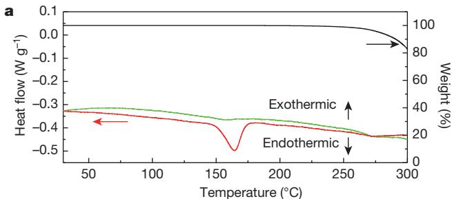

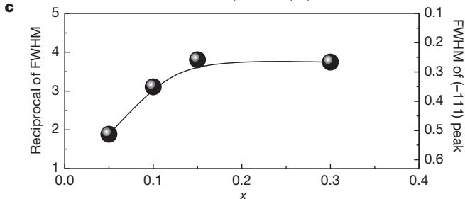

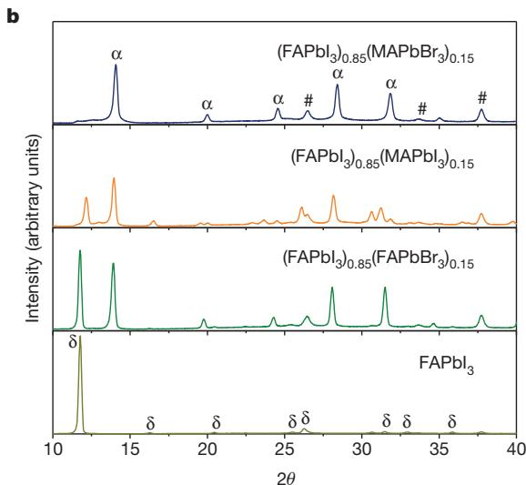

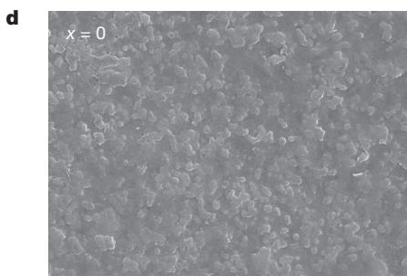

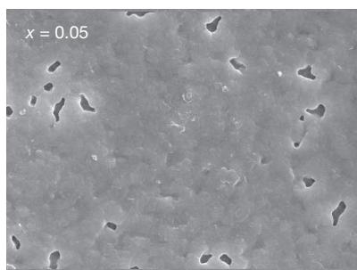

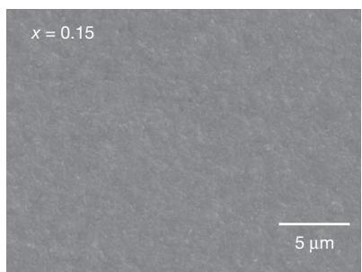  
Figure 2 | Characterization of materials. a, DSC and thermogravimetric curves of the as-prepared yellow $\mathrm { F A P b } \mathrm { I } _ { 3 }$ powder under an Ar atmosphere with a heating rate of $2 \stackrel { \circ } { \mathrm { C } } \operatorname* { m i n } ^ { - 1 }$ from room temperature to $3 0 0 ^ { \circ } \mathrm { C }$ . The green line indicates the DSC results for $( \mathrm { F A P b I _ { 3 } } ) _ { 0 . 8 5 } ( \mathrm { M A P b B r _ { 3 } } ) _ { 0 . 1 5 }$ powder, which was prepared at room temperature by precipitation from the same compositional solution. b, XRD spectra of solvent-engineering-processed $\mathrm { F A P b I } _ { 3 }$ , $\mathrm { ( F A P b I _ { 3 } ) _ { 1 } } _ { - x } \mathrm { ( M A P b I _ { 3 } ) } _ { x } ,$ $( { \mathrm { F A P b I } } _ { 3 } ) _ { 1 } \dots ( { \mathrm { F A P b B r } } _ { 3 } ) _ { x } ,$ and $\mathrm { ( F A P b I _ { 3 } ) _ { 1 } } _ { - x } \mathrm { ( M A P b B r _ { 3 } ) } _ { x }$ films with $x = 0 . 1 5$ , on mesoporous- $\mathrm { T i O } _ { 2 } /$   
blocking- $\mathrm { \ T i O } _ { 2 } / \mathrm { F T O }$ glass substrates after annealing at $1 0 0 ^ { \circ } \mathrm { C }$ for $1 0 \mathrm { { m i n } }$ . a, d and $\#$ denote the identified diffraction peaks corresponding to the perovskite and non-perovskite polymorphs of $\mathrm { F A P b I } _ { 3 }$ and FTO, respectively. c, FWHM of the $( - 1 1 1 )$ peak for $\mathrm { ( F A P b I _ { 3 } ) } _ { 1 } \mathrm { - } _ { x } \mathrm { ( M A P b B r _ { 3 } ) } _ { x }$ films as a function of $x$ from XRD spectra of solvent-engineering-processed $\mathrm { ( F A P b I _ { 3 } ) } _ { 1 } \mathrm { - } _ { x } \mathrm { ( M A P b B r _ { 3 } ) } _ { x }$ films (see Extended Data Fig. 4 for further details). d, SEM plane view images of $( \mathrm { F A P b I _ { 3 } } ) _ { 1 - x } ( \mathrm { M A P b B r _ { 3 } } ) _ { x } ^ { - }$ films with $x = 0$ , 0.05 and 0.15.

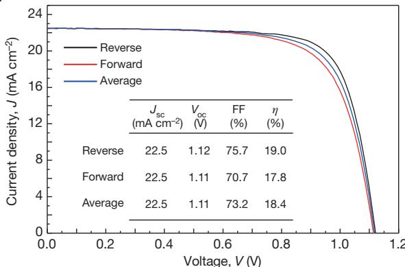  
a   
b

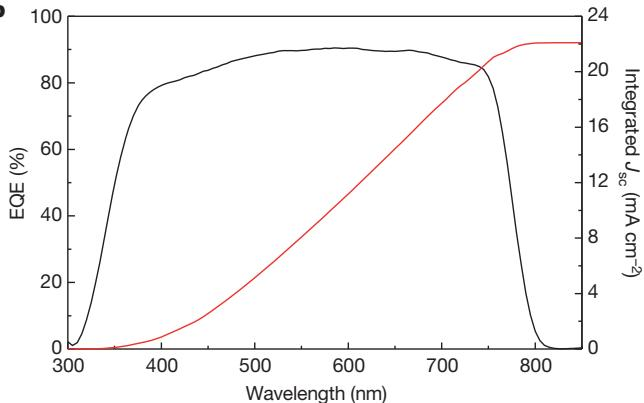  
Figure 3 | J–V and IPCE characteristics for the best cell obtained in this study. a, J–V curves of forward and reverse bias sweep and their averaged curve for the solar cell using the $( \mathrm { F A P b I _ { 3 } } ) _ { 0 . 8 5 } ( \mathrm { M A P b B r _ { 3 } } ) _ { 0 . 1 5 }$ perovskite active layer. b, EQE spectrum and integrated $J _ { s c }$ .

of $\left( \mathrm { F A P b I } _ { 3 } \right) _ { 1 } - \ d _ { x } ( \mathrm { M A P b B r } _ { 3 } ) _ { x } ,$ with $x = 0$ , 0.05 and 0.15, on a 200-nmthick mesoporous- $\mathrm { T i O } _ { 2 } ,$ blocking- $\mathrm { \cdot T i O } _ { 2 } / \mathrm { F T O }$ annealed for 10 min at $1 5 0 ^ { \circ } \mathrm { C }$ $( x = 0 )$ and $1 0 0 ^ { \circ } \mathrm { C } .$ , respectively. Our results showed that the surface of $\mathrm { F A P b } \mathrm { I } _ { 3 }$ exhibits an irregular morphology with bumpy roughness. Incorporating $\mathbf { M A P b B r } _ { 3 }$ into $\mathrm { F A P b } \mathrm { I } _ { 3 }$ (with $x = 0 . 1 5$ ) considerably smoothed the surface; however, systems characterized by $x = 0 . 0 5$ still presented large voids between crystal boundaries. The rough surface of $\mathrm { F A P b } \mathrm { I } _ { 3 }$ may be due to the transition from non-perovskite to perovskite phases and to the high temperature required for the formation of the perovskite phase. Indeed, manipulating the composition of $\mathrm { F A P b } \mathrm { I } _ { 3 }$ by adding $\mathbf { M A P b } \mathbf { B } \mathbf { r } _ { 3 }$ led to the stabilization of the perovskite phase with a uniform and dense morphology as well as well-developed crystallites, which are responsible for the highly improved cell performance.

On the basis of these results, we repeated the fabrication procedure, fixing $x$ to a value of 0.15 to enhance further the performance of the $\mathrm { F A P b I } _ { 3 } – \mathrm { M A P b B r } _ { 3 }$ system with an architecture as follows: FTO/blocking-$\mathrm { T i O } _ { 2 }$ (70 nm)/mesoporous- $\mathrm { T i O } _ { 2 }$ :perovskite composite layer $( 2 0 0 \mathrm { n m } ) /$ / perovskite upper layer (300 nm)/PTAA (50 nm)/Au (100 nm). Of the devices obtained, Fig. 3a shows the J–V curves measured via reverse and forward bias sweep for one of the best-performing solar cells. The $J _ { s c }$ $V _ { \mathrm { o c } }$ and FF values averaged from the $J - V$ curves of this device are $2 2 . 5 \mathrm { m A c m } ^ { - 2 }$ , $1 { , } 1 0 5 \mathrm { m V }$ and $7 3 . 2 \%$ , respectively; these correspond to a PCE of $1 8 . 4 \%$ under standard AM1.5G conditions. The PCE value is in agreement with that obtained from the stabilized power output near the maximum power point, reflecting the device performance in the working condition more closely (Extended Data Fig. 6).

In the case of the cell using thinner mesoporous- $\mathrm { . T i O } _ { 2 }$ layer (80 nm), as shown in Extended Data Fig. 7, although an unprecedented PCE of $2 0 . 3 \%$ was measured via reverse bias scan, the PCE of around $1 7 . 3 \%$ obtained from an average J–V curve and steady-state current measurement is far lower than that from the best cell using a 200-nm-thick mesoporous- $\mathrm { T i O } _ { 2 }$ layer, owing to the low PCE of $1 5 . 5 \%$ with forward

bias scan. This result is similar to those of ref. 12 and implies that substantial PCE values should be obtained from J–V curves averaged with reverse and forward bias sweep. Figure 3b shows the EQE spectrum for one of the best-performing solar cells. A very broad EQE plateau of over $8 0 \%$ between $4 0 0 \mathrm { n m }$ and $7 5 0 \mathrm { n m }$ was observed. The $J _ { \mathrm { s c } }$ value integrated from EQE was found to be in good agreement with that measured by J–V. The highly performing devices exhibiting PCEs of $1 8 . 0 \%$ with very small hysteresis was certified by the standardized method in the photovoltaic calibration laboratory, confirming a PCE of $1 7 . 9 \%$ under AM1.5G full sun (Extended Data Fig. 8). To the best of our knowledge, such a PCE value is the highest ever reported for a perovskite-based solar cell, excluding the value overestimated by reverse bias scan.

We have described the compositional engineering of $\mathrm { ( F A P b I _ { 3 } ) } _ { 1 } \mathrm { - } _ { x } \mathrm { ( M A P b B r } _ { 3 } \mathrm { ) } _ { x }$ for efficient perovskite solar cells. $( \mathrm { F A P b I } _ { 3 } ) _ { 0 . 8 5 }$ $( \mathrm { M A P b B r } _ { 3 } ) _ { 0 . 1 5 }$ has many advantages over other systems such $\mathrm { M A P b I } _ { 3 }$ , $\mathrm { F A P b I } _ { 3 } ,$ and $\mathrm { M A P b } ( \mathrm { I } _ { 0 . 8 5 } \mathrm { B r } _ { 0 . 1 5 } ) _ { 3 }$ . This strategy may lead to more efficient and cost-effective inorganic–organic hybrid perovskite solar cells.

Online Content Methods, along with any additional Extended Data display items and Source Data, are available in the online version of the paper; references unique to these sections appear only in the online paper.

# Received 20 October; accepted 2 December 2014.

# Published online 7 January 2015.

1. Lee, M. M. et al. Efficient hybrid solar cells based on meso-superstructured organometal halide perovskites. Science 338, 643–647 (2012).   
2. Kim, H.-S. et al. Lead iodide perovskite sensitized all-solid-state submicron thin film mesoscopic solar cell with efficiency exceeding $9 \%$ . Sci. Rep. 2, 1–7 (2012).   
3. Heo, J. H. et al. Efficient inorganic-organic hybrid heterojunction solar cells containing perovskite compound and polymeric hole conductors. Nature Photon. 7, 486–491 (2013).   
4. Burschka, J. et al. Sequential deposition as a route to high-performance perovskite-sensitized solar cells. Nature 499, 316–319 (2013).   
5. Liu, M., Johnston, M. B. & Snaith, H. J. Efficient planar heterojunction perovskite solar cells by vapor deposition. Nature 501, 395–398 (2013).   
6. Noh, J. H., Im, S. H., Heo, J. H., Mandal, T. N. & Seok, S. I. Chemical management for colorful, efficient, and stable inorganic-organic hybrid nanostructured solar cells. Nano Lett. 13, 1764–1769 (2013).   
7. Ball, J. M., Lee, M. M., Hey, A. & Snaith, H. J. Low-temperature processed mesosuperstructured to thin-film solar cells. Energy Environ. Sci. 6, 1739–1743 (2013).   
8. Jeon, N. J. et al. o-Methoxy substituents in Spiro-OMeTAD for efficient inorganic– organic hybrid perovskite solar cells. J. Am. Chem. Soc. 136, 7837–7840 (2014).   
9. Ryu, S. et al. Voltage output of efficient perovskite solar cells with high open-circuit voltage and fill factor. Energy Environ. Sci. 7, 2614–2618 (2014).   
10. Malinkiewicz, O. et al. Perovskite solar cells employing organic charge-transport layers. Nature Photon. 8, 128–132 (2014).   
11. Lee, J.-W. et al. High-efficiency perovskitesolar cells based on the black polymorph of ${ \mathsf { H C } } ( { \mathsf { N H } } _ { 2 } ) _ { 2 } { \mathsf { P b l } } _ { 3 }$ . Adv. Mater. 26, 4991–4998 (2014).   
12. Zhou, H. et al. Interface engineering of highly efficient perovskite solar cells. Science 345, 542–546 (2014).   
13. Jeon, N. J. et al. Solvent engineering for high-performance inorganic-organic hybrid perovskite solar cells. Nature Mater. 13, 897–903 (2014).   
14. Snaith, H. J. et al. Anomalous hysteresis in perovskite solar cells. J. Phys. Chem. Lett. 5, 1511–1515 (2014).   
15. Kim, H. S. & Park, N.-G. Parameters affecting I–V hysteresis of CH NH PbI perovskite solar cells: effect of perovskite crystal size and mesoporous $\mathsf { T i O } _ { 2 }$ layer. J. Phys. Chem. Lett. 5, 2927–2934 (2014).   
16. Eperon, G. E. et al. Formamidinium lead halide: a broad tunable perovskite for efficient planar heterojunction solar cells. Energy Environ. Sci. 7, 982–988 (2014).   
17. Koh, T. M. et al. Formamidinium-containing metal-halide: an alternative material for near-IR absorption perovskite solar cells. J. Phys. Chem. C 118, 16458–16462 (2014).   
18. Stoumpos, C. C. et al. Semiconducting tin and lead iodide perovskites with organic cations: phase transition, high mobilities, and near-infrared photoluminescent properties. Inorg. Chem. 52, 9019–9038 (2013).   
19. Pellet, N, et al. Mixed-organic-cation perovskite photovoltaics for enhanced solarlight harvesting. Angew. Chem. Int. Ed. 53, 3151–3157 (2014).   
20. Xing, G. et al. Long-range balanced electron and hole-transport lengths in organicinorganic $\mathsf { C H } _ { 3 } \mathsf { N H } _ { 3 } \mathsf { P b l } _ { 3 }$ . Science 342, 344–347 (2013).   
21. Scaife, D. E., Weller, P. F. & Fisher, W. G. Crystal preparation and properties of cesium tin(II) trihalides. J. Solid State Chem. 9, 308–314 (1974).   
22. Chung, I. et al. $\mathsf { C s S } \mathsf { n l } _ { 3 }$ : semiconductor or metal? High electrical conductivity and strong near-infrared photoluminescence from a single material. High hole mobility and phase-transitions. J. Am. Chem. Soc. 134, 8579–8587 (2012).   
23. Takahashi, Y. et al. Charge-transport in tin-iodide perovskite CH NH SnI : origin of high conductivity. Dalton Trans. 40, 5563–5568 (2011).   
24. Amat, A. et al. Cation-induced band-gap tuning in organohalide perovskites: interplay of spin-orbit coupling and octahetra tilting. Nano Lett. 14, 3608–3616 (2014).

Acknowledgements This work was supported by the Global Research Laboratory (GRL) Program, the Global Frontier R&D Program of the Center for Multiscale Energy System, funded by the National Research Foundation in Korea, and by a grant from the Korea Research Institute of Chemical Technology (KRICT) 2020 Program for Future Technology in South Korea.

Author Contributions N.J.J., J.H.N. and S.I.S. conceived the experiments and analysed and interpreted the data. N.J.J., Y.C.K., J.H.N. and J.S. performed the fabrication of devices, device performance measurements and characterization. N.J.J., W.S.Y. and S.R. carried out the synthesis of materials for perovskites, and

S.I.S. prepared $\phantom { + } \mathsf { T i O } _ { 2 }$ particles and pastes. The manuscript was mainly written and revised by S.I.S. and J.H.N. The project was planned, directed and supervised by S.I.S. All authors discussed the results and commented on the manuscript.

Author Information Reprints and permissions information is available at www.nature.com/reprints. The authors declare no competing financial interests. Readers are welcome to comment on the online version of the paper. Correspondence and requests for materials should be addressed to S.I.S. (seoksi@krict.re.kr or seoksi@skku.edu).

# METHODS

Materials. Unless stated otherwise, all materials were purchased from Sigma-Aldrich or Junsei Organics and used as received. PTAA was purchased from EM Index. Synthesis of the $\mathrm { T i O } _ { 2 }$ paste. The $\mathrm { T i O } _ { 2 }$ nanoparticles used in the paste were prepared by hydrothermal treatment at $2 5 0 ^ { \circ } \mathrm { C }$ for $1 2 \mathrm { h }$ from aqueous solutions of the peroxotitanium complex, as described elsewhere25,26. The peroxotitanium complex solutions were synthesized via a reaction between hydrogen peroxide and the $\mathrm { T i O ( O H ) } _ { 2 }$ wet cake. The wet cake was obtained by the dropwise addition of a $\mathrm { N H _ { 4 } O H }$ solution into $0 . 3 3 \mathrm { M T i O C l } _ { 2 }$ aqueous solution obtained by the hydrolysis of $\mathrm { T i C l _ { 4 } }$ . The resulting cake was purified by repeated washing with deionized water until no $\mathrm { C l } ^ { - }$ ions were detected. Then, $2 0 0 \mathrm { m l }$ of $3 5 \mathrm { w t \% }$ hydrogen peroxide was added into $3 0 0 \mathrm { m l }$ of a 2 wt% TiO(OH) -dispersed aqueous solution such that the $\mathrm { H } _ { 2 } \mathrm { O } _ { 2 } / \mathrm { T i } ^ { 4 + }$ ratio was ${ \sim } 4 0$ ; the solution was constantly stirred in an ice bath. Once the addition of $\mathrm { H } _ { 2 } \mathrm { O } _ { 2 }$ was completed, the colour of the precipitate changed from white to turbid yellowish, and finally light orange- or reddish-coloured transparent solutions were formed within 1 h.

The $\mathrm { T i O } _ { 2 }$ -nanoparticle (average diameter $5 0 \mathrm { n m }$ , anatase) slurry obtained by the hydrothermal treatment was stirred for 1 h, while several drops of concentrated nitric acid were added to obtain a colloidal dispersion solution. Then the $\mathrm { T i O } _ { 2 }$ nanoparticles were collected by the centrifugal method. The $\mathrm { T i O } _ { 2 }$ wet cake was re-dispersed and centrifuged in absolute ethanol by ultrasonic irradiation. The process with absolute ethanol was repeated for three cycles. The collected $\mathrm { T i O } _ { 2 }$ nanoparticles were dispersed in $1 0 0 \mathrm { m l }$ of absolute ethanol, $4 . 5 \mathrm { g }$ (per 1 g of $\mathrm { T i O } _ { 2 }$ ) of a $1 0 \mathrm { w t } \%$ ethanolic solution of ethyl cellulose (Fluka, 46070), and $4 . 4 \mathrm { g }$ (per 1 g of $\mathrm { T i O } _ { 2 } .$ ) of terpineol. After the addition of each component, the mix was stirred for 10 min and homogenized by ultrasonic irradiation. The paste was finally produced by a three-rollermill grinder (EXAKT) after concentrating the mixture solution in a rotary evaporator. Synthesis of the inorganic–organic mixed perovskite. $\mathrm { C H } _ { 3 } \mathrm { N H } _ { 3 } \mathrm { I }$ and ${ \mathrm { N H } } _ { 2 } { \mathrm { C H } } =$ $\mathrm { N H } _ { 2 } \mathrm { I }$ were first synthesized by reacting 30 ml hydroiodic acid $5 7 \%$ in water, Aldrich), $2 7 . 8 6 \mathrm { m l C H } _ { 3 } \mathrm { N H } _ { 2 }$ $4 0 \%$ in methanol, Junsei Chemical), and 15 g formamidine acetate (Aldrich) in a $2 5 0 \mathrm { m l }$ round-bottomed flask at $0 ^ { \circ } \mathrm { C }$ for 2 h with stirring. The precipitates were recovered by evaporating the solutions at $5 0 ^ { \circ } \mathrm { C }$ for 1 h. The products were dissolved in ethanol, recrystallized using diethyl ether, and finally dried at $6 0 ^ { \circ } \mathrm { C }$ in a vacuum oven for $2 4 \mathrm { h }$ . Similarly, $\mathrm { C H } _ { 3 } \mathrm { N H } _ { 3 } \mathrm { B r }$ and $\mathrm { N H } _ { 2 } \mathrm { C H } = \mathrm { N H } _ { 2 } \mathrm { B r }$ were prepared using hydrobromic acid $4 8 \mathrm { w t \% }$ in water, Aldrich) according to a reported procedure27. The desired solutions of $\mathrm { F A P b } \mathrm { I } _ { 3 }$ , $\left( \mathrm { F A P b I } _ { 3 } \right) _ { 1 - x } ( \mathrm { M A P b I } _ { 3 } ) _ { x } ,$ $( { \mathrm { F A P b I } } _ { 3 } ) _ { 1 } \dots ( { \mathrm { F A P b B r } } _ { 3 } ) _ { x } ,$ and $\mathrm { ( F A P b I _ { 3 } ) } _ { 1 } \mathrm { - } _ { x } \mathrm { ( M A P b B r _ { 3 } ) } _ { x }$ (with $x = 0 { - } 0 . 3 0 )$ were prepared by dissolution of the $\mathrm { C H } _ { 3 } \mathrm { N H } _ { 3 } \mathrm { I } .$ , $\mathrm { C H } _ { 3 } \mathrm { N H } _ { 3 } \mathrm { B r }$ , $\mathrm { N H } _ { 2 } \mathrm { C H } = \mathrm { N H } _ { 2 } \mathrm { I }$ , and $\mathrm { N H } _ { 2 } \mathrm { C H } = \mathrm { N H } _ { 2 } \mathrm { B r }$ powders with $\mathrm { P b } \mathrm { I } _ { 2 }$ (Aldrich) and $\mathrm { P b } \mathsf { B r } _ { 2 }$ (Aldrich) in the $\gamma$ -butyrolactone:DMSO mixed solvent (7:3, volume ratio) at $6 0 ^ { \circ } \mathrm { C }$ for $1 0 \mathrm { { m i n } }$ .

Solar cell fabrication. A dense blocking layer of $\mathrm { T i O } _ { 2 }$ ( $6 0 \mathrm { n m }$ , blocking- $\mathrm { T i O } _ { 2 }$ ) was deposited onto an F-doped $\mathrm { S n O } _ { 2 }$ (FTO, Pilkington, TEC8) substrate by spray pyrolysis using a $2 0 \mathrm { m M }$ titanium diisopropoxide bis(acetylacetonate) solution (Aldrich) at $4 5 0 ^ { \circ } \mathrm { C } ;$ this was done to prevent a direct contact between FTO and the holeconducting layer. A 200-nm-thick mesoporous- $\mathrm { \Delta T i O } _ { 2 }$ was spin-coated onto the blocking-TiO2/FTO substrate using $\mathrm { T i O } _ { 2 }$ pastes diluted in 2-methoxyethanol (1 g in $5 \mathrm { m l }$ ) and calcinated at $5 0 0 ^ { \circ } \mathrm { C }$ for 1 h in air to remove the organic components.

The inorganic–organic lead halide perovskite solutions were then coated onto the mesoporous- $\cdot \mathrm { T i O } _ { 2 } /$ blocking-TiO2/FTO substrate by two consecutive spin-coating steps, at 1,000 rpm and 5,000 rpm for 40 s and 20 s, respectively. During the second spin-coating step, 1 ml toluene was poured onto the substrate, according to the procedure reported in ref. 13. To obtain a uniform and flat intermediate-phase film, toluene should be quickly cast in one-shot mode on a rapidly rotating (at $5 , 0 0 0 \mathrm { r p m } )$ ) substrate to wash out the surplus of DMSO molecules that did not participate in the formation of the $\mathrm { P b } \mathrm { I } _ { 2 } \mathrm { - N H } _ { 2 } \mathrm { C H } = \mathrm { N H } _ { 2 } \mathrm { I } .$ –DMSO complex. The substrate was then dried on a hot plate at $1 0 0 ^ { \circ } \mathrm { C }$ or $1 5 0 ^ { \circ } \mathrm { C }$ for $1 0 \mathrm { { m i n } }$ . A solution of PTAA (EM Index, $[ \mathrm { M n } ] = 1 7 { , } 5 0 0 \mathrm { g m o l } ^ { - 1 } .$ )/toluene $( 1 0 \mathrm { m g } \mathrm { m l } ^ { - 1 } .$ ) with an additive of $7 . 5 \mu \mathrm { l }$ Li-bis(trifluoromethanesulphonyl) imide/acetonitrile $( 1 7 0 \mathrm { m g m l ^ { - 1 } } ,$ ) and $4 \mu \mathrm { l }$ 4-tert-butylpyridine was spin-coated on the perovskite layer/mesoporous-$\mathrm { T i O } _ { 2 }$ /blocking-TiO2/FTO substrate at 3,000 rpm for $3 0 s$ . Finally, an Au counter electrode was deposited by thermal evaporation; the active area of this electrode was fixed a $0 . 1 6 \dot { \mathrm { c m } } ^ { 2 }$ . The different inorganic–organic lead halide triiodide powders were prepared by precipitation using toluene at room temperature from the desired compositional solutions obtained by dissolving $\mathrm { C H } _ { 3 } \mathrm { N H } _ { 3 } \mathrm { I }$ $\mathrm { C H _ { 3 } N H _ { 3 } I , C H _ { 3 } N H _ { 3 } B r , N H _ { 2 } C H = }$ $\mathrm { N H } _ { 2 } \mathrm { I }$ and $\mathrm { N H } _ { 2 } \mathrm { C H } = \mathrm { N H } _ { 2 } \mathrm { B r }$ powders with $\mathrm { P b } \mathrm { I } _ { 2 }$ and $\mathrm { P b } \mathtt { B r } _ { 2 }$ in $\gamma$ -butyrolactone.

Characterization. The XRD spectra of the prepared films were measured using a Rigaku SmartLab X-ray diffractometer; the in situ XRD experiment of the as-prepared FAPbI3 yellow powder was performed using a Rigaku Ultima IV with an X-ray tube (Cu Ka, wavelength $\lambda = 1 . { \dot { 5 } } 4 0 6 { \dot { \mathrm { A } } }$ ). Ultraviolet–visible absorption spectra were recorded on a Shimadzu UV 2550 spectrophotometer in the 300–800 nm wavelength range at room temperature. The morphology of the films was observed using a field-emission SEM (MIRA3 LMU, Tescan). Thermogravimetric and DSC analyses of the as-prepared powders were performed with a heating rate of $2 ^ { \circ } \mathrm { C } \mathrm { m i n } ^ { - 1 }$ from room temperature up to $3 0 0 ^ { \circ } \mathrm { C }$ under a nitrogen atmosphere using TA Instruments SDT 2960 and DSC 2910, respectively. EQE was measured by a power source (Newport 300W Xenon lamp, 66920) with a monochromator (Newport Cornerstone 260) and a multimeter (Keithley2001). The J–V curves were measured using a solar simulator (Newport, Oriel Class A, 91195A) with a source meter (Keithley 2420) at $1 0 0 \mathrm { m A c m } ^ { - 2 }$ AM1.5G illumination and a calibrated Si-reference cell certified by the National Renewable Energy Laboratory, USA. The J–V curves were measured by reverse scan (forward bias $( 1 . 2 \mathrm { V } ) $ short circuit (0 V)) or forward scan (short circuit $( 0 \mathrm { V } ) $ forward bias (1.2 V)). The step voltage was fixed at $1 0 \mathrm { m V }$ and the delay time, which is a delay set at each voltage step before measuring each current, was modulated. The J–V curves for all devices were measured by masking the active area with a metal mask (area of $0 . 0 9 6 \mathrm { c m } ^ { 2 \cdot }$ ).

25. Baek, I. C. et al. Facile preparation of large aspect ratio ellipsoidal anatase $\Gamma _ { 1 0 _ { 2 } }$ nanoparticles and their application to dye-sensitized solar cell. Electrochem. Commun. 11, 909–912 (2009).   
26. Seok, S. I. et al. Colloidal $\Gamma _ { \mathrm { i O } _ { 2 } }$ nanocrystals prepared from peroxotitanium complex solutions: phase evolution from different precursors. J. Colloid Interf. Sci. 346, 66–71 (2010).   
27. Pang, S. et al. ${ \mathsf { N H } } _ { 2 } { \mathsf { C H } } = { \mathsf { N H } } _ { 2 } { \mathsf { P b l } } _ { 3 }$ : an alternative organolead iodide perovskite sensitizer for mesoscopic solar cells. Chem. Mater. 26, 1485–1491 (2014).

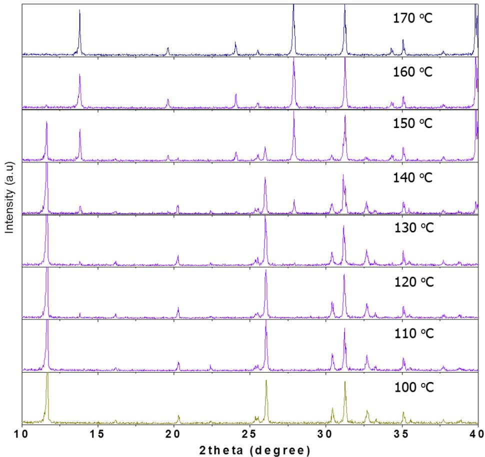  
Extended Data Figure 1 | In situ XRD spectra (heating from $\mathbf { 1 0 0 } ^ { \circ } \mathbf { C }$ to $1 7 \mathbf { 0 } ^ { \circ } \mathbf { C } )$ for $\mathbf { F A P b } \mathbf { I } _ { 3 }$ yellow powders prepared at room temperature. Hexagonal non-perovskite $\mathrm { F A P b I } _ { 3 }$ $( P 6 _ { 3 } m c )$ converted into a trigonal   
perovskite phase $( P 3 m 1 )$ near $1 5 0 ^ { \circ } \mathrm { C }$ . The $( - 1 1 1 )$ diffraction peak for perovskite $\mathrm { F A P b I } _ { 3 }$ at $2 \theta = 1 4 . 3 ^ { \circ }$ appeared at a temperature of $1 5 0 ^ { \circ } \mathrm { C } ;$ ： simultaneously the main peak of non-perovskite $\mathrm { F A P b I } _ { 3 }$ at $1 1 . 6 ^ { \circ }$ disappeared.

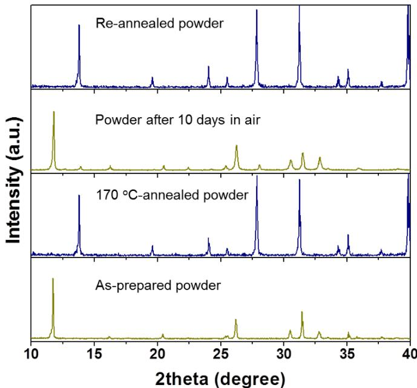  
Extended Data Figure 2 | XRD spectra of $\mathbf { F A P b } \mathbf { I } _ { 3 }$ powders. The as-prepared yellow $\mathrm { F A P b } \mathrm { I } _ { 3 }$ powder shows a non-perovskite phase and is converted to perovskite phase by annealing at $1 7 0 ^ { \circ } \mathrm { C }$ . The perovskite $\mathrm { F A P b I } _ { 3 }$ black powder returned to the yellow non-perovskite powder after being stored in air for $1 0 \mathrm { { h } }$ ; the yellow powder reversibly changed to black perovskite phase by re-annealing at $1 7 0 ^ { \circ } \mathrm { C }$ .

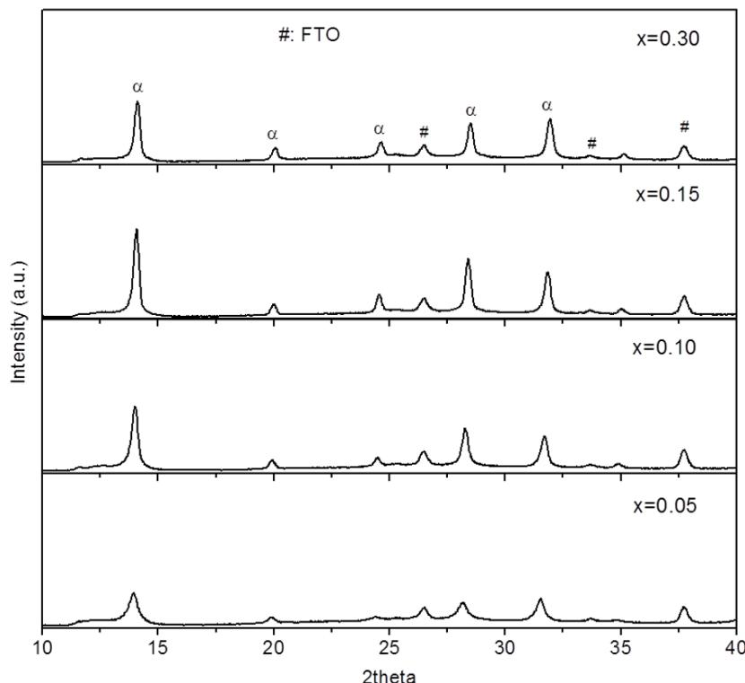  
Extended Data Figure 3 | XRD spectra of $\mathbf { ( F A P b I _ { 3 } ) _ { 1 } } _ { - x } ( \mathbf { M A P b B r } _ { 3 } ) _ { x }$ cells as a function of $\mathbf { x } .$ XRD spectra of solvent-engineering processed $( \mathrm { F A _ { 1 } } - x \mathrm { M A _ { x } } ) \mathrm { P b } ( \mathrm { I } _ { 1 } - x \mathrm { B r } _ { \mathrm { x } } ) _ { 3 }$ films on the mesoporous- $\mathrm { T i O } _ { 2 }$ /blocking- $\cdot \mathrm { T i O } _ { 2 } /$   
FTO glass substrate after annealing at $1 0 0 ^ { \circ } \mathrm { C }$ for 10 min. a, a-phase of FAPbI3; #, peaks diffracted from FTO.

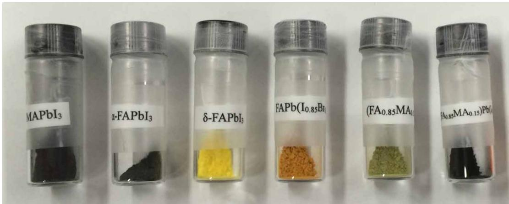  
Extended Data Figure 4 | Photographs of inorganic–organic hybrid halide powders. Photographs show the colour of the as-prepared $\mathrm { M A P b I } _ { 3 }$ , annealed $\mathrm { F A P b I } _ { 3 }$ at $1 7 0 ^ { \circ } \mathrm { C } ,$ ， $\mathrm { F A P b I } _ { 3 }$ , $\mathrm { ( F A P b I _ { 3 } ) _ { 1 } } _ { - x } \mathrm { ( M A P b I _ { 3 } ) } _ { x } ,$   
$( { \mathrm { F A P b I } } _ { 3 } ) _ { 1 } { \mathrm { - } } _ { x } ( { \mathrm { F A P b B r } } _ { 3 } ) _ { x } ,$ and $\mathrm { ( F A P b I _ { 3 } ) } _ { 1 } \mathrm { - } _ { x } \mathrm { ( M A P b B r } _ { 3 } \mathrm { ) } _ { x }$ powders with $x = 0 . 1 5$ (from left to right). The $\mathrm { ( F A P b I _ { 3 } ) } _ { 1 } \mathrm { - } _ { x } \mathrm { ( M A P b B r } _ { 3 } \mathrm { ) } _ { x }$ powder is the only black powder among the as-prepared $\mathrm { F A P b I } _ { 3 }$ -based materials.

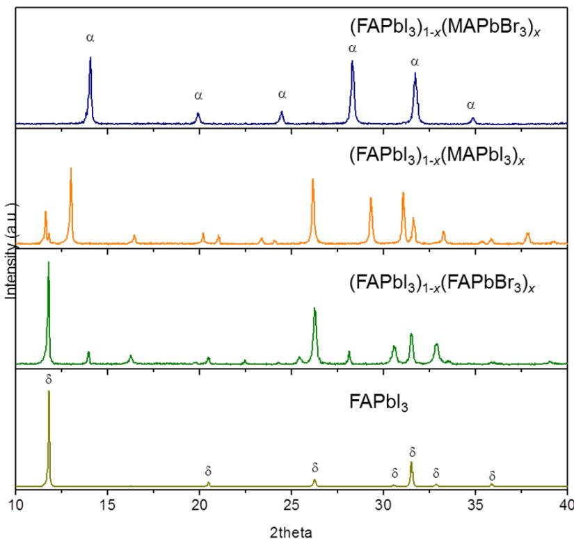  
Extended Data Figure 5 | XRD spectra of the as-prepared powders at room temperature. XRD spectra of the as-prepared $\mathrm { F A P b I } _ { 3 } ,$ $( { \mathrm { F A P b I } } _ { 3 } ) _ { 1 - x } { \mathrm { ( M A P b I } } _ { 3 } ) _ { x } { \mathrm { ) } }$ $( \mathrm { F A P \bar { b } I _ { 3 } } ) _ { 1 - x } ( \mathrm { F A P b B \bar { r } _ { 3 } } ) _ { x } ^ { - }$ and   
$\mathrm { ( F A P b I _ { 3 } ) } _ { 1 } \mathrm { - } _ { x } \mathrm { ( M A P b B r _ { 3 } ) } _ { x }$ powders with $x = 0 . 1 5$ (from left to right). Only the $\mathrm { ( F A P b I _ { 3 } ) } _ { 1 } \mathrm { - } _ { x } \mathrm { ( M A P b B r _ { 3 } ) } _ { x }$ powder shows a pure perovskite phase. $\mathsf { \Omega } \circ ,$ black perovskite-type polymorph; d, yellow non-perovskite polymorph.

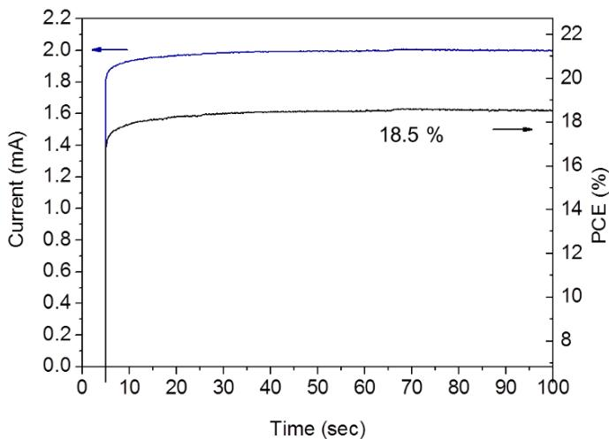  
Extended Data Figure 6 | Steady-state current measurement. Steady-state current measured at a maximum power point (0.89 V) and stabilized power output.

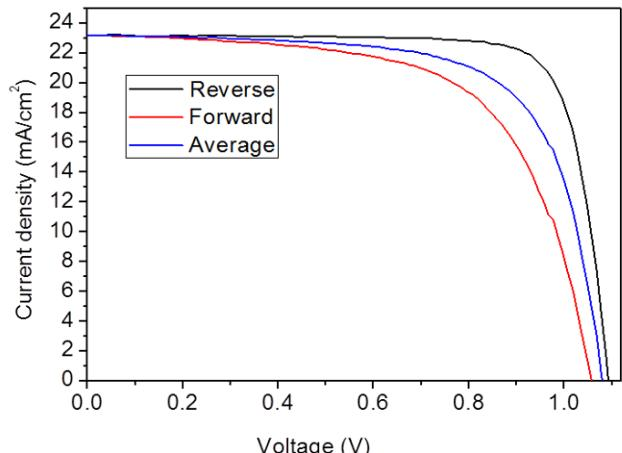

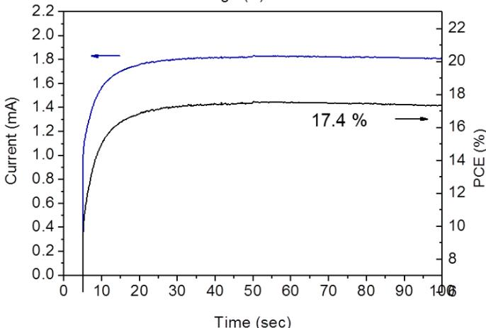  
Extended Data Figure 7 | Photovoltaic performance. a, J–V curves measured by forward and reverse bias sweep and their averaged curve for cell using the $( { \mathrm { F A P b I } } _ { 3 } ) _ { 0 . 8 5 } ( { \mathrm { M A P b B r } } _ { 3 } ) _ { 0 . 1 5 }$ perovskite active layer and 80-nm-thick mesoporous- $\mathrm { T i O } _ { 2 }$ layer. $\eta$ , PCE. b, Steady-state current measured at a maximum power point (0.92 V)and stabilized power output.

IVCurve NewportCalCert#1005

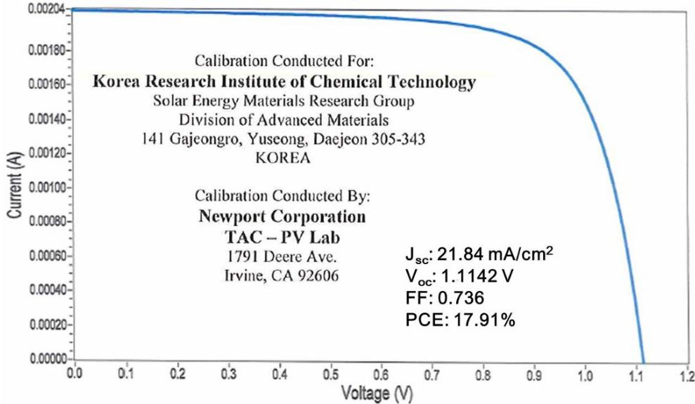  
Extended Data Figure 8 | Independent certification from Newport Corporation, confirming a PCE of $1 7 . 9 \%$ .