# pvsk2015-gaia

Add your description here

## Overview

```mermaid
graph LR
    perovskite_structure["AMX3 perovskite structure definition"]:::setting
    mapbi3_properties["MAPbI3 optoelectronic properties (0.50)"]:::orphan
    fapbi3_properties["FAPbI3 optoelectronic properties (0.50)"]:::orphan
    fapbi3_phase_instability["FAPbI3 phase instability problem (0.67)"]:::derived
    fapbi3_lower_performance["FAPbI3 performance limitation (0.50)"]:::orphan
    research_question["research_question"]:::question
    mixed_cation_pellet["Prior mixed cation work (Pellet) (0.50)"]:::orphan
    prior_work_seok["Prior work from same group (Seok) (0.50)"]:::orphan
    mapbi3_transport["MAPbI3 charge transport properties (0.80)"]:::premise
    fapbi3_transport["FAPbI3 charge transport properties (0.80)"]:::premise
    conductivity_type["MAPbI3 and FAPbI3 conductivity types (0.80)"]:::premise
    composition_system["Composition system (FAPbI3)1-x(MAPbBr3)x"]:::setting
    device_architecture["Device architecture description"]:::setting
    solvent_engineering["Solvent engineering process"]:::setting
    annealing_conditions["Annealing conditions by composition"]:::setting
    mai_synthesis["MAI synthesis procedure (0.50)"]:::orphan
    fai_synthesis["FAI synthesis procedure (0.50)"]:::orphan
    mabr_synthesis["MABr synthesis procedure (0.50)"]:::orphan
    fabr_synthesis["FABr synthesis procedure (0.50)"]:::orphan
    perovskite_solution["Perovskite solution preparation (0.50)"]:::orphan
    tio2_nanoparticles["TiO2 nanoparticle synthesis (0.50)"]:::orphan
    tio2_paste["TiO2 paste preparation (0.50)"]:::orphan
    blocking_layer["TiO2 blocking layer deposition (0.50)"]:::orphan
    mesoporous_layer["Mesoporous TiO2 layer preparation (0.50)"]:::orphan
    ptaa_deposition["PTAA hole transport layer deposition (0.50)"]:::orphan
    au_electrode["Au electrode evaporation (0.50)"]:::orphan
    xrd_method["X-ray diffraction characterization method"]:::setting
    uvvis_method["UV-vis absorption characterization method"]:::setting
    sem_method["Scanning electron microscopy method"]:::setting
    dsc_tga_method["DSC and TGA characterization method"]:::setting
    eqe_method["External quantum efficiency measurement method"]:::setting
    jv_measurement["J-V measurement conditions"]:::setting
    table1_pce_trend["PCE trend with composition x (0.50)"]:::orphan
    table1_photovoltaic_parameters["Complete photovoltaic parameters table (0.90)"]:::premise
    jsc_maximum["Jsc trend with composition (0.50)"]:::orphan
    voc_increases_with_x["Voc trend with composition (0.50)"]:::orphan
    ff_maximum["FF trend with composition (0.50)"]:::orphan
    series_resistance["Series resistance trend with composition (0.50)"]:::orphan
    fapbi3_hysteresis["Hysteresis behavior comparison (0.85)"]:::premise
    absorption_blue_shift["Absorption spectra blue-shift with increasing x (0.50)"]:::orphan
    eqe_blue_shift["EQE spectra behavior (0.50)"]:::orphan
    eqe_plateau["EQE plateau for best device (0.90)"]:::premise
    dsc_phase_transition["DSC phase transition temperature (0.85)"]:::premise
    phase_reversibility["FAPbI3 phase transition reversibility (0.80)"]:::premise
    perovskite_polymorphs["FAPbI3 polymorph structures (0.85)"]:::premise
    xrd_nonperovskite_x0["Pure FAPbI3 XRD shows non-perovskite phase (0.50)"]:::orphan
    xrd_perovskite_x15["15 mol% MA substitution stabilizes perovskite phase (0.85)"]:::premise
    synergetic_effect["Synergetic effect of MA+ and Br- co-substitution (0.85)"]:::premise
    fwhm_crystallinity["FWHM indicates improved crystallinity at x>0.15 (0.50)"]:::orphan
    black_powder_only["Only mixed cation-anion composition yields pure perovskite powder (0.85)"]:::premise
    sem_morphology_x0["Pure FAPbI3 morphology is rough (0.85)"]:::premise
    sem_morphology_x15["15 mol% MAPbBr3 produces smooth morphology (0.85)"]:::premise
    best_device_jv["Best device J-V characteristics (0.90)"]:::premise
    certified_pce["Certified PCE by Newport (0.70)"]:::derived
    hysteresis_80nm["Thin mesoporous layer shows hysteresis issues (0.50)"]:::orphan
    main_conclusion["Main conclusion: MAPbBr3 stabilizes FAPbI3 and improves PCE (0.57)"]:::derived
    synergy_mechanism["Mechanism of synergetic effect (0.71)"]:::derived
    phase_stabilization_evidence["Evidence for perovskite phase stabilization (0.65)"]:::derived
    morphology_improvement["Morphology improvement with MAPbBr3 (0.68)"]:::derived
    bandgap_tuning_tradeoff["Bandgap tuning creates performance tradeoff (0.65)"]:::derived
    hysteresis_benefit["Mixed system has reduced hysteresis (0.61)"]:::derived
    comparison_mapbi3["Comparison with MAPbI3 performance (0.59)"]:::derived
    comparison_fapbi3["Comparison with pure FAPbI3 performance (0.60)"]:::derived
    comparison_prior_mixed["Comparison with prior mixed-cation approaches (0.50)"]:::orphan
    future_potential["Future potential of compositional engineering (0.50)"]:::orphan
    understanding_phase_stability["General principle for perovskite phase stability (0.50)"]:::orphan
    need_further_study["Areas requiring further investigation (0.50)"]:::orphan
    bandgap_tuning_tradeoff --> main_conclusion
    best_device_jv --> bandgap_tuning_tradeoff
    best_device_jv --> certified_pce
    black_powder_only --> phase_stabilization_evidence
    certified_pce --> bandgap_tuning_tradeoff
    conductivity_type --> hysteresis_benefit
    dsc_phase_transition --> phase_stabilization_evidence
    eqe_plateau --> certified_pce
    fapbi3_hysteresis --> hysteresis_benefit
    fapbi3_phase_instability --> comparison_fapbi3
    fapbi3_transport --> hysteresis_benefit
    hysteresis_benefit --> comparison_mapbi3
    main_conclusion --> comparison_fapbi3
    main_conclusion --> comparison_mapbi3
    mapbi3_transport --> hysteresis_benefit
    morphology_improvement --> main_conclusion
    perovskite_polymorphs --> fapbi3_phase_instability
    phase_reversibility --> fapbi3_phase_instability
    phase_stabilization_evidence --> main_conclusion
    sem_morphology_x0 --> morphology_improvement
    sem_morphology_x15 --> morphology_improvement
    synergetic_effect --> synergy_mechanism
    table1_photovoltaic_parameters --> bandgap_tuning_tradeoff
    xrd_perovskite_x15 --> phase_stabilization_evidence

    classDef setting fill:#f0f0f0,stroke:#999,color:#333
    classDef premise fill:#ddeeff,stroke:#4488bb,color:#333
    classDef derived fill:#ddffdd,stroke:#44bb44,color:#333
    classDef question fill:#fff3dd,stroke:#cc9944,color:#333
    classDef background fill:#f5f5f5,stroke:#bbb,stroke-dasharray: 5 5,color:#333
    classDef orphan fill:#fff,stroke:#ccc,stroke-dasharray: 5 5,color:#333
    classDef external fill:#fff,stroke:#aaa,stroke-dasharray: 3 3,color:#333
    classDef weak fill:#fff9c4,stroke:#f9a825,stroke-dasharray: 5 5,color:#333
    classDef contra fill:#ffebee,stroke:#c62828,color:#333
```

## Motivation module for Jeon2015 (Nature 2015).

#### AMX3 perovskite structure definition ★

📋 `perovskite_structure`

> An inorganic-organic lead halide perovskite has the general formula AMX3, where A is an organic ammonium cation (such as MA or FA), M is Pb or Sn, and X is a halide anion. The size of cation A is critical for forming a close-packed perovskite structure; A must fit into the space composed of four adjacent corner-sharing MX6 octahedra.

#### MAPbI3 optoelectronic properties ★

📌 `mapbi3_properties`   |   Belief: **0.50**

> Methylammonium lead iodide (MAPbI3) has a bandgap of approximately 1.5-1.6 eV and an absorption spectrum extending up to a wavelength of 800 nm. It has been extensively used as a light harvester in solar cells. The highest reported PCE for solution-processed MAPbI3 has been 16-17%, though 19.3% was reported in a planar device architecture from a reverse-bias current-voltage (I-V) curve [@Jeon2015].

#### FAPbI3 optoelectronic properties ★

📌 `fapbi3_properties`   |   Belief: **0.50**

> Formamidinium lead iodide (FAPbI3), which contains FA cations instead of MA cations at the A-site of the AMX3 perovskite structure, has a bandgap of 1.48 eV with an absorption edge at 840 nm. The structural and opto-electrical differences between MAPbI3 and FAPbI3 originate from the difference in ionic radius: MA is approximately 1.8 Angstrom, while FA is 1.9-2.2 Angstrom [@Jeon2015].

#### FAPbI3 phase instability problem ★

📌 `fapbi3_phase_instability`   |   Belief: **0.67**

> The black perovskite-type polymorph (alpha-phase) of FAPbI3, which is stable at temperatures above 160 degrees Celsius, transforms into the yellow non-perovskite polymorph (delta-phase) in ambient humid atmosphere. This phase transition is reversible and degrades photovoltaic performance because the yellow phase has a larger optical bandgap and inferior charge-transporting ability due to its linear chain-like [PbI6] octahedron structure with face-sharing [@Jeon2015].

🔗 **support**([FAPbI3 polymorph structures](#perovskite_polymorphs), [FAPbI3 phase transition reversibility](#phase_reversibility))

Reasoning

The two polymorph structures (perovskite vs non-perovskite) and reversible phase transition under ambient conditions explain FAPbI3 instability.

#### FAPbI3 performance limitation ★

📌 `fapbi3_lower_performance`   |   Belief: **0.50**

> The photovoltaic performance of FAPbI3 has been reported to be lower than that of MAPbI3, despite FAPbI3 having a more suitable bandgap for photovoltaic applications. The performance limitation is attributed to the phase instability and the need for high-temperature annealing to achieve the perovskite phase [@Jeon2015].

#### research_question ★

❓ `research_question`

> Can incorporating MAPbBr3 into FAPbI3 stabilize the perovskite phase at lower temperatures while improving the overall power conversion efficiency beyond the best reported values for MAPbI3 or FAPbI3 alone?

#### Prior mixed cation work (Pellet) ★

📌 `mixed_cation_pellet`   |   Belief: **0.50**

> Pellet et al. demonstrated improved PCE using mixed cation lead iodide perovskites by gradually substituting MA with FA cations, which increases the absorption range by shifting it redwards. However, the performance was still dominated by MAPbI3 rather than FAPbI3 [@Jeon2015].

#### Prior work from same group (Seok) ★

📌 `prior_work_seok`   |   Belief: **0.50**

> Jeon et al. previously reported a 16.2% certified PCE using a combination of MAPbI3 and MAPbBr3 with a bilayer architecture consisting of perovskite-infiltrated mesoporous-TiO2 electrodes and an extremely uniform and dense upper perovskite layer obtained by solvent engineering techniques, with absorption edge below 770 nm [@Jeon2015].

#### MAPbI3 charge transport properties ★

📌 `mapbi3_transport`   |   Prior: 0.80   |   Belief: **0.80**

> In MAPbI3, the electron-diffusion length is approximately 130 nm, which is 1.4 times larger than the hole-diffusion length of approximately 90 nm. This imbalance affects the photocurrent collection efficiency [@Jeon2015].

#### FAPbI3 charge transport properties ★

📌 `fapbi3_transport`   |   Prior: 0.80   |   Belief: **0.80**

> In FAPbI3, the hole-diffusion length is approximately 813 nm, which is 4.6 times longer than the electron-diffusion length of approximately 177 nm. This is the opposite transport imbalance compared to MAPbI3 [@Jeon2015].

#### MAPbI3 and FAPbI3 conductivity types ★

📌 `conductivity_type`   |   Prior: 0.80   |   Belief: **0.80**

> Kanatzidis et al. showed by measuring the Seebeck coefficient that MAPbI3 and FAPbI3 display n-type and p-type character, respectively. This difference in majority carrier type influences the device behavior in different cell architectures [@Jeon2015].

## Methods module for Jeon2015 (Nature 2015).

#### Composition system (FAPbI3)1-x(MAPbBr3)x ★

📋 `composition_system`

> The composition system studied is (FAPbI3)1-x(MAPbBr3)x, where the mole ratio x ranges between 0 and 0.3. This mixed system combines formamidinium lead iodide with methylammonium lead bromide at the A-site (FA/MA) and X-site (I/Br) simultaneously [@Jeon2015].

#### Device architecture description ★

📋 `device_architecture`

> The standard device architecture used is: FTO/blocking-TiO2 (60-70 nm)/mesoporous-TiO2:perovskite composite layer (200 nm)/perovskite upper layer (300 nm)/PTAA (50 nm)/Au (100 nm). FTO is fluorine-doped tin oxide, and PTAA is poly(triarylamine) hole conductor. The active area of the Au electrode is fixed at 0.16 cm^2 [@Jeon2015].

#### Solvent engineering process ★

📋 `solvent_engineering`

> The solvent engineering process uses a gamma-butyrolactone:DMSO mixed solvent with a 7:3 volume ratio. The perovskite solution is coated via two consecutive spin-coating steps at 1000 rpm and 5000 rpm for 40 s and 20 s, respectively. During the second step, 1 ml toluene is poured onto the rapidly rotating substrate to wash out surplus DMSO molecules that do not participate in the formation of the PbI2-NH2CH=NH2I-DMSO complex. This produces a uniform and flat intermediate-phase film [@Jeon2015].

#### Annealing conditions by composition ★

📋 `annealing_conditions`

> For pure FAPbI3 (x=0), annealing is performed at 150 degrees Celsius for 10 min to form the black perovskite phase. For compositions with x greater than 0, annealing is performed at 100 degrees Celsius for 10 min to form the perovskite phase [@Jeon2015].

#### MAI synthesis procedure ★

📌 `mai_synthesis`   |   Belief: **0.50**

> Methylammonium iodide (MAI, CH3NH3I) was synthesized by reacting 30 ml of 57% hydroiodic acid in water with 27.86 ml of 40% methylamine in methanol at 0 degrees Celsius for 2 h with stirring. The precipitate was recovered by evaporating at 50 degrees Celsius for 1 h, then dissolved in ethanol, recrystallized using diethyl ether, and finally dried at 60 degrees Celsius in a vacuum oven for 24 h [@Jeon2015].

#### FAI synthesis procedure ★

📌 `fai_synthesis`   |   Belief: **0.50**

> Formamidinium iodide (FAI, NH2CH=NH2I) was synthesized similarly using formamidine acetate as the starting material. The product was recrystallized and dried under the same conditions as MAI [@Jeon2015].

#### MABr synthesis procedure ★

📌 `mabr_synthesis`   |   Belief: **0.50**

> Methylammonium bromide (MABr, CH3NH3Br) was prepared using 48 wt% hydrobromic acid in water according to a reported procedure [@Jeon2015].

#### FABr synthesis procedure ★

📌 `fabr_synthesis`   |   Belief: **0.50**

> Formamidinium bromide (FABr, NH2CH=NH2Br) was prepared using the same approach as MABr [@Jeon2015].

#### Perovskite solution preparation ★

📌 `perovskite_solution`   |   Belief: **0.50**

> Desired solutions of FAPbI3, (FAPbI3)1-x(MAPbI3)x, (FAPbI3)1-x(FAPbBr3)x, and (FAPbI3)1-x(MAPbBr3)x (with x = 0-0.30) were prepared by dissolving the respective halide salts (MAI, FAI, MABr, FABr) with PbI2 and PbBr2 in the gamma-butyrolactone:DMSO mixed solvent (7:3 volume ratio) at 60 degrees Celsius for 10 min [@Jeon2015].

#### TiO2 nanoparticle synthesis ★

📌 `tio2_nanoparticles`   |   Belief: **0.50**

> TiO2 nanoparticles with average diameter of 50 nm (anatase) were prepared by hydrothermal treatment at 250 degrees Celsius for 12 h from aqueous solutions of the peroxotitanium complex. The peroxotitanium complex was synthesized via reaction between hydrogen peroxide and TiO(OH)2 wet cake obtained from hydrolysis of TiCl4 [@Jeon2015].

#### TiO2 paste preparation ★

📌 `tio2_paste`   |   Belief: **0.50**

> The TiO2 paste was prepared by dispersing TiO2 nanoparticles in absolute ethanol with 10 wt% ethanolic solution of ethyl cellulose (4.5 g per 1 g TiO2) and terpineol (4.4 g per 1 g TiO2). The mixture was homogenized by ultrasonic irradiation, then concentrated in a rotary evaporator and processed through a three-roller mill grinder [@Jeon2015].

#### TiO2 blocking layer deposition ★

📌 `blocking_layer`   |   Belief: **0.50**

> A dense blocking layer of TiO2 (60 nm) was deposited onto the FTO substrate by spray pyrolysis using a 20 mM titanium diisopropoxide bis(acetylacetonate) solution at 450 degrees Celsius. This prevents direct contact between FTO and the hole-conducting layer [@Jeon2015].

#### Mesoporous TiO2 layer preparation ★

📌 `mesoporous_layer`   |   Belief: **0.50**

> A 200-nm-thick mesoporous-TiO2 layer was spin-coated onto the blocking-TiO2/FTO substrate using TiO2 paste diluted in 2-methoxyethanol (1 g in 5 ml), then calcined at 500 degrees Celsius for 1 h in air to remove organic components [@Jeon2015].

#### PTAA hole transport layer deposition ★

📌 `ptaa_deposition`   |   Belief: **0.50**

> A solution of PTAA (number-average molecular weight Mn = 17,500 g/mol) in toluene (10 mg/ml) with additives of 7.5 microliters Li-bis(trifluoromethanesulphonyl) imide/acetonitrile (170 mg/ml) and 4 microliters 4-tert-butylpyridine was spin-coated on the perovskite layer at 3000 rpm for 30 s [@Jeon2015].

#### Au electrode evaporation ★

📌 `au_electrode`   |   Belief: **0.50**

> An Au counter electrode was deposited by thermal evaporation. The active area of this electrode was fixed at 0.16 cm^2 [@Jeon2015].

#### X-ray diffraction characterization method ★

📋 `xrd_method`

> XRD spectra of prepared films were measured using a Rigaku SmartLab X-ray diffractometer with Cu K-alpha radiation (wavelength lambda = 1.5406 Angstrom). In situ XRD experiments on FAPbI3 yellow powder were performed using a Rigaku Ultima IV with the same X-ray source [@Jeon2015].

#### UV-vis absorption characterization method ★

📋 `uvvis_method`

> Ultraviolet-visible absorption spectra were recorded on a Shimadzu UV 2550 spectrophotometer in the 300-800 nm wavelength range at room temperature [@Jeon2015].

#### Scanning electron microscopy method ★

📋 `sem_method`

> The morphology of the films was observed using a field-emission SEM (MIRA3 LMU, Tescan) [@Jeon2015].

#### DSC and TGA characterization method ★

📋 `dsc_tga_method`

> Thermogravimetric and DSC analyses of as-prepared powders were performed with a heating rate of 2 degrees Celsius per minute from room temperature up to 300 degrees Celsius under nitrogen atmosphere using TA Instruments SDT 2960 and DSC 2910, respectively [@Jeon2015].

#### External quantum efficiency measurement method ★

📋 `eqe_method`

> EQE was measured using a power source (Newport 300W Xenon lamp, 66920) with a monochromator (Newport Cornerstone 260) and a multimeter (Keithley 2001) [@Jeon2015].

#### J-V measurement conditions ★

📋 `jv_measurement`

> J-V curves were measured using a solar simulator (Newport, Oriel Class A, 91195A) with a source meter (Keithley 2420) at 100 mA/cm^2 AM1.5G illumination and a calibrated Si-reference cell certified by the National Renewable Energy Laboratory, USA. J-V curves were measured by reverse scan (forward bias 1.2 V to short circuit 0 V) or forward scan (short circuit 0 V to forward bias 1.2 V). The step voltage was fixed at 10 mV and the delay time was modulated. J-V curves for all devices were measured by masking the active area with a metal mask (area 0.096 cm^2) [@Jeon2015].

## Results module for Jeon2015 (Nature 2015).

```mermaid
graph TD
    table1_pce_trend["PCE trend with composition x (0.50)"]:::orphan
    table1_photovoltaic_parameters["Complete photovoltaic parameters table (0.90)"]:::premise
    jsc_maximum["Jsc trend with composition (0.50)"]:::orphan
    voc_increases_with_x["Voc trend with composition (0.50)"]:::orphan
    ff_maximum["FF trend with composition (0.50)"]:::orphan
    series_resistance["Series resistance trend with composition (0.50)"]:::orphan
    fapbi3_hysteresis["Hysteresis behavior comparison (0.85)"]:::premise
    absorption_blue_shift["Absorption spectra blue-shift with increasing x (0.50)"]:::orphan
    eqe_blue_shift["EQE spectra behavior (0.50)"]:::orphan
    eqe_plateau["EQE plateau for best device (0.90)"]:::premise
    dsc_phase_transition["DSC phase transition temperature (0.85)"]:::premise
    phase_reversibility["FAPbI3 phase transition reversibility (0.80)"]:::premise
    perovskite_polymorphs["FAPbI3 polymorph structures (0.85)"]:::premise
    xrd_nonperovskite_x0["Pure FAPbI3 XRD shows non-perovskite phase (0.50)"]:::orphan
    xrd_perovskite_x15["15 mol% MA substitution stabilizes perovskite phase (0.85)"]:::premise
    synergetic_effect["Synergetic effect of MA+ and Br- co-substitution (0.85)"]:::premise
    fwhm_crystallinity["FWHM indicates improved crystallinity at x>0.15 (0.50)"]:::orphan
    black_powder_only["Only mixed cation-anion composition yields pure perovskite powder (0.85)"]:::premise
    sem_morphology_x0["Pure FAPbI3 morphology is rough (0.85)"]:::premise
    sem_morphology_x15["15 mol% MAPbBr3 produces smooth morphology (0.85)"]:::premise
    best_device_jv["Best device J-V characteristics (0.90)"]:::premise
    certified_pce["Certified PCE by Newport (0.70)"]:::derived
    hysteresis_80nm["Thin mesoporous layer shows hysteresis issues (0.50)"]:::orphan
    strat_6(["support"]):::weak
    best_device_jv --> strat_6
    eqe_plateau --> strat_6
    strat_6 --> certified_pce

    classDef setting fill:#f0f0f0,stroke:#999,color:#333
    classDef premise fill:#ddeeff,stroke:#4488bb,color:#333
    classDef derived fill:#ddffdd,stroke:#44bb44,color:#333
    classDef question fill:#fff3dd,stroke:#cc9944,color:#333
    classDef background fill:#f5f5f5,stroke:#bbb,stroke-dasharray: 5 5,color:#333
    classDef orphan fill:#fff,stroke:#ccc,stroke-dasharray: 5 5,color:#333
    classDef external fill:#fff,stroke:#aaa,stroke-dasharray: 3 3,color:#333
    classDef weak fill:#fff9c4,stroke:#f9a825,stroke-dasharray: 5 5,color:#333
    classDef contra fill:#ffebee,stroke:#c62828,color:#333
```

#### PCE trend with composition x ★

📌 `table1_pce_trend`   |   Belief: **0.50**

> The power conversion efficiency (PCE) of (FAPbI3)1-x(MAPbBr3)x solar cells shows a maximum value of 17.3% at x=0.15, increasing from 0.5% at x=0 (annealed at 100 degrees C) to the maximum, then decreasing to 15.4% at x=0.30. The PCE trend follows the simultaneous enhancement of Jsc and FF, while Voc continues to increase with x due to bandgap widening [@Jeon2015].

#### Complete photovoltaic parameters table ★

📌 `table1_photovoltaic_parameters`   |   Prior: 0.90   |   Belief: **0.90**

> Photovoltaic parameters for (FAPbI3)1-x(MAPbBr3)x solar cells:
> 
> | x | Jsc (mA/cm^2) | Voc (V) | FF | PCE (%) | Series resistance (Ohm cm^2) |
> |---|---|---|---|---|---|
> | 0 (150 C anneal) | 22.0 | 0.88 | 0.70 | 13.5 | 5.7 |
> | 0 (100 C anneal) | 1.10 | 0.88 | 0.51 | 0.5 | 345 |
> | 0.05 | 17.1 | 1.02 | 0.65 | 11.3 | 6.0 |
> | 0.10 | 21.0 | 1.04 | 0.66 | 14.5 | 4.8 |
> | 0.15 | 22.0 | 1.08 | 0.73 | 17.3 | 3.9 |
> | 0.20 | 21.5 | 1.09 | 0.71 | 16.7 | 4.3 |
> | 0.25 | 21.0 | 1.10 | 0.69 | 15.9 | 4.9 |
> | 0.30 | 20.0 | 1.12 | 0.69 | 15.4 | 5.7 |
> 
> All cells annealed at 100 C except x=0 which also had a 150 C condition. PCE values are averaged from reverse and forward J-V sweeps [@Jeon2015].

#### Jsc trend with composition ★

📌 `jsc_maximum`   |   Belief: **0.50**

> Jsc increases from 19.0 mA/cm^2 at x=0.05 to a maximum value of 22.0 mA/cm^2 at x=0.15, then decreases to 20.0 mA/cm^2 at x=0.30. The trend reflects the trade-off between charge-collection efficiency (higher at low x due to better phase stability) and light-harvesting efficiency (reduced at high x due to bandgap widening causing blue-shift of absorption onset) [@Jeon2015].

#### Voc trend with composition ★

📌 `voc_increases_with_x`   |   Belief: **0.50**

> Voc increases from 1.00 V at x=0.05 to 1.12 V at x=0.30 across the entire composition range. This increase is attributed to the widening of the bandgap as MAPbBr3 content increases (Br substituting I increases bandgap) [@Jeon2015].

#### FF trend with composition ★

📌 `ff_maximum`   |   Belief: **0.50**

> Fill factor (FF) shows exactly the same trend as Jsc, with a maximum value of 73% at x=0.15. The similarity in behavior supports the interpretation that FF is limited by charge-collection efficiency, which is reflected in the series resistance values: 345 Ohm cm^2 at x=0 (100 C anneal), decreasing to 3.9 Ohm cm^2 at x=0.15, then increasing again at higher x [@Jeon2015].

#### Series resistance trend with composition ★

📌 `series_resistance`   |   Belief: **0.50**

> Series resistance shows a strong inverse correlation with device performance. At x=0 with 100 C annealing, series resistance is 345 Ohm cm^2 (very high), which corresponds to very low Jsc (1.10 mA/cm^2) and low FF (0.51). At x=0.15, series resistance reaches its minimum of 3.9 Ohm cm^2, coinciding with maximum PCE (17.3%) and FF (73%). At x=0.30, series resistance increases to 5.7 Ohm cm^2 [@Jeon2015].

#### Hysteresis behavior comparison ★

📌 `fapbi3_hysteresis`   |   Prior: 0.85   |   Belief: **0.85**

> FAPbI3-based cells with x=0 and x=0.15 show negligible hysteresis even with a short scanning delay time of 40 ms, in contrast to MAPbI3 which exhibits large hysteresis. The small discrepancies related to scan direction for FAPbI3/MAPbBr3 systems disappear at longer delay times above 100 ms. This may be related to the balance between electron and hole transport within the perovskite layer [@Jeon2015].

#### Absorption spectra blue-shift with increasing x ★

📌 `absorption_blue_shift`   |   Belief: **0.50**

> The ultraviolet-visible absorption spectra show a systematic shift of the absorption band edge to shorter wavelengths (blue-shift) when MAPbBr3 content increases. This is because Br has a larger electronegativity than I, which widens the bandgap of the mixed halide perovskite. The reduction of Jsc observed at x greater than 0.15 is directly related to this blue-shift of absorption onset and resulting reduced light-harvesting efficiency [@Jeon2015].

#### EQE spectra behavior ★

📌 `eqe_blue_shift`   |   Belief: **0.50**

> The external quantum efficiency (EQE) spectrum is blue-shifted when x increases, resulting in reduced Jsc at high x values. However, a relatively lower Jsc at x below 0.15 indicates that charge-collection efficiency is also low, because Jsc is proportional to the product of charge-collection efficiency and light-harvesting efficiency [@Jeon2015].

#### EQE plateau for best device ★

📌 `eqe_plateau`   |   Prior: 0.90   |   Belief: **0.90**

> For the best-performing device with x=0.15, the EQE spectrum shows a very broad plateau of over 80% between 400 nm and 750 nm. The Jsc value integrated from the EQE spectrum is in good agreement with that measured by J-V curve [@Jeon2015].

#### DSC phase transition temperature ★

📌 `dsc_phase_transition`   |   Prior: 0.85   |   Belief: **0.85**

> Differential scanning calorimetry (DSC) of yellow FAPbI3 powder shows an endothermic peak around 160 degrees Celsius, which corresponds to the phase transition from yellow non-perovskite to black perovskite. This peak appears without any weight loss up to 250 degrees Celsius in thermogravimetric analysis, confirming it is a structural phase transition rather than decomposition. The XRD spectra measured in situ confirm this assignment of the endothermic peak [@Jeon2015].

#### FAPbI3 phase transition reversibility ★

📌 `phase_reversibility`   |   Prior: 0.80   |   Belief: **0.80**

> The phase transition in FAPbI3 is reversible in air: the yellow non-perovskite phase changes to black perovskite when annealed at 170 degrees Celsius, and the black powder turns yellow again after being stored in air for 10 days. This reversibility indicates the yellow phase is thermodynamically stable at room temperature in ambient conditions [@Jeon2015].

#### FAPbI3 polymorph structures ★

📌 `perovskite_polymorphs`   |   Prior: 0.85   |   Belief: **0.85**

> FAPbI3 exists in two polymorphs: a black perovskite phase with trigonal symmetry (space group P3m1) and a yellow non-perovskite phase with hexagonal symmetry (space group P6_3mc). The black phase consists of a three-dimensional network of corner-sharing octahedra, while the yellow phase contains linear chains of [PbI6] octahedra with face-sharing. Only the black perovskite phase is photovoltaically active [@Jeon2015].

#### Pure FAPbI3 XRD shows non-perovskite phase ★

📌 `xrd_nonperovskite_x0`   |   Belief: **0.50**

> The XRD spectrum of pure FAPbI3 thin film (x=0) annealed at 100 degrees Celsius shows the typical diffraction pattern of hexagonal non-perovskite polymorph (P6_3mc), because 100 degrees Celsius is much lower than the 160 degrees Celsius phase transition temperature. This explains the poor photovoltaic performance [@Jeon2015].

#### 15 mol% MA substitution stabilizes perovskite phase ★

📌 `xrd_perovskite_x15`   |   Prior: 0.85   |   Belief: **0.85**

> When FA+ cations in FAPbI3 are substituted by 15 mol% of MA+ cations, a strong (111) diffraction peak at 13.9 degrees for the trigonal perovskite phase (P3m1) appears despite annealing at only 100 degrees Celsius. The same diffraction peaks are observed in systems containing Br- ions (15 mol%), although a secondary phase coexists in the film [@Jeon2015].

#### Synergetic effect of MA+ and Br- co-substitution ★

📌 `synergetic_effect`   |   Prior: 0.85   |   Belief: **0.85**

> A simultaneous introduction of 15 mol% of both MA+ cations and Br- anions in FAPbI3 to obtain (FAPbI3)0.85(MAPbBr3)0.15 leads to a synergetic effect that stabilizes the perovskite phase at 100 degrees Celsius. This combination is sufficient to form a FAPbI3 perovskite phase even at 5 mol% addition, although single MA+ or Br- substitution can only partially form the perovskite phase [@Jeon2015].

#### FWHM indicates improved crystallinity at x>0.15 ★

📌 `fwhm_crystallinity`   |   Belief: **0.50**

> The full width at half maximum (FWHM) of the (-111) diffraction peak decreases for x greater than 0.15, indicating that a highly crystalline perovskite layer is formed at these compositions. The enhancement of phase stability and crystallinity results in improvement of PCE in the x range of 0 to 0.15 [@Jeon2015].

#### Only mixed cation-anion composition yields pure perovskite powder ★

📌 `black_powder_only`   |   Prior: 0.85   |   Belief: **0.85**

> Photographs of as-prepared powders show that black powder (perovskite phase) is obtained only for (FAPbI3)0.85(MAPbBr3)0.15 among all FAPbI3-based materials tested. XRD spectra of these powders confirm that only (FAPbI3)0.85(MAPbBr3)0.15 shows a pure perovskite phase with no endothermic DSC peaks [@Jeon2015].

#### Pure FAPbI3 morphology is rough ★

📌 `sem_morphology_x0`   |   Prior: 0.85   |   Belief: **0.85**

> The surface of pure FAPbI3 (x=0) exhibits an irregular morphology with bumpy roughness when annealed at 150 degrees Celsius. This rough surface is due to the phase transition from non-perovskite to perovskite and the high temperature required for perovskite formation [@Jeon2015].

#### 15 mol% MAPbBr3 produces smooth morphology ★

📌 `sem_morphology_x15`   |   Prior: 0.85   |   Belief: **0.85**

> Incorporating MAPbBr3 into FAPbI3 (x=0.15) considerably smooths the surface morphology, producing a uniform and dense morphology with well-developed crystallites. However, at x=0.05, large voids between crystal boundaries are still present. The improved morphology is responsible for the highly improved cell performance [@Jeon2015].

#### Best device J-V characteristics ★

📌 `best_device_jv`   |   Prior: 0.90   |   Belief: **0.90**

> For the best-performing device with x=0.15 in the architecture FTO/blocking-TiO2 (70 nm)/mesoporous-TiO2 (200 nm)/perovskite (300 nm)/PTAA/Au, the J-V curves measured via reverse and forward bias sweep give averaged values: Jsc = 22.5 mA/cm^2, Voc = 1,105 mV, FF = 73.2%, corresponding to a PCE of 18.4% under standard AM1.5G conditions. The PCE value is in agreement with that obtained from stabilized power output near the maximum power point (0.89 V) [@Jeon2015].

#### Certified PCE by Newport ★

📌 `certified_pce`   |   Belief: **0.70**

> Devices exhibiting PCEs of 18.0% with very small hysteresis were certified by the standardized method in the photovoltaic calibration laboratory at Newport Corporation, confirming a PCE of 17.9% under AM1.5G full sun. This is the highest reported PCE for perovskite-based solar cells, excluding values overestimated by reverse bias scan [@Jeon2015].

🔗 **support**([Best device J-V characteristics](#best_device_jv), [EQE plateau for best device](#eqe_plateau))

Reasoning

The best device's J-V curves and EQE-integrated Jsc agree, supporting the certified PCE validity.

#### Thin mesoporous layer shows hysteresis issues ★

📌 `hysteresis_80nm`   |   Belief: **0.50**

> For cells using a thinner mesoporous-TiO2 layer (80 nm), an unprecedented PCE of 20.3% was measured via reverse bias scan. However, the PCE of approximately 17.3% obtained from average J-V curve and steady-state current measurement is far lower than the reverse-bias value, owing to a low PCE of 15.5% with forward bias scan. This result demonstrates that PCE should be obtained from J-V curves averaged with reverse and forward bias sweep, not from reverse-bias alone [@Jeon2015].

## Discussion module for Jeon2015 (Nature 2015).

```mermaid
graph TD
    fapbi3_phase_instability["FAPbI3 phase instability problem (0.67)"]:::external
    mapbi3_transport["MAPbI3 charge transport properties (0.80)"]:::external
    fapbi3_transport["FAPbI3 charge transport properties (0.80)"]:::external
    conductivity_type["MAPbI3 and FAPbI3 conductivity types (0.80)"]:::external
    table1_photovoltaic_parameters["Complete photovoltaic parameters table (0.90)"]:::external
    fapbi3_hysteresis["Hysteresis behavior comparison (0.85)"]:::external
    dsc_phase_transition["DSC phase transition temperature (0.85)"]:::external
    xrd_perovskite_x15["15 mol% MA substitution stabilizes perovskite phase (0.85)"]:::external
    synergetic_effect["Synergetic effect of MA+ and Br- co-substitution (0.85)"]:::external
    black_powder_only["Only mixed cation-anion composition yields pure perovskite powder (0.85)"]:::external
    sem_morphology_x0["Pure FAPbI3 morphology is rough (0.85)"]:::external
    sem_morphology_x15["15 mol% MAPbBr3 produces smooth morphology (0.85)"]:::external
    best_device_jv["Best device J-V characteristics (0.90)"]:::external
    certified_pce["Certified PCE by Newport (0.70)"]:::external
    main_conclusion["Main conclusion: MAPbBr3 stabilizes FAPbI3 and improves PCE (0.57)"]:::derived
    synergy_mechanism["Mechanism of synergetic effect (0.71)"]:::derived
    phase_stabilization_evidence["Evidence for perovskite phase stabilization (0.65)"]:::derived
    morphology_improvement["Morphology improvement with MAPbBr3 (0.68)"]:::derived
    bandgap_tuning_tradeoff["Bandgap tuning creates performance tradeoff (0.65)"]:::derived
    hysteresis_benefit["Mixed system has reduced hysteresis (0.61)"]:::derived
    comparison_mapbi3["Comparison with MAPbI3 performance (0.59)"]:::derived
    comparison_fapbi3["Comparison with pure FAPbI3 performance (0.60)"]:::derived
    comparison_prior_mixed["Comparison with prior mixed-cation approaches (0.50)"]:::orphan
    future_potential["Future potential of compositional engineering (0.50)"]:::orphan
    understanding_phase_stability["General principle for perovskite phase stability (0.50)"]:::orphan
    need_further_study["Areas requiring further investigation (0.50)"]:::orphan
    strat_0(["support"]):::weak
    phase_stabilization_evidence --> strat_0
    morphology_improvement --> strat_0
    bandgap_tuning_tradeoff --> strat_0
    strat_0 --> main_conclusion
    strat_1(["support"]):::weak
    xrd_perovskite_x15 --> strat_1
    dsc_phase_transition --> strat_1
    black_powder_only --> strat_1
    strat_1 --> phase_stabilization_evidence
    strat_2(["support"]):::weak
    sem_morphology_x15 --> strat_2
    sem_morphology_x0 --> strat_2
    strat_2 --> morphology_improvement
    strat_3(["support"]):::weak
    table1_photovoltaic_parameters --> strat_3
    best_device_jv --> strat_3
    certified_pce --> strat_3
    strat_3 --> bandgap_tuning_tradeoff
    strat_4(["support"]):::weak
    synergetic_effect --> strat_4
    strat_4 --> synergy_mechanism
    strat_5(["support"]):::weak
    fapbi3_hysteresis --> strat_5
    mapbi3_transport --> strat_5
    fapbi3_transport --> strat_5
    conductivity_type --> strat_5
    strat_5 --> hysteresis_benefit
    strat_6(["support"]):::weak
    best_device_jv --> strat_6
    strat_6 --> certified_pce
    strat_8(["support"]):::weak
    main_conclusion --> strat_8
    hysteresis_benefit --> strat_8
    strat_8 --> comparison_mapbi3
    strat_9(["support"]):::weak
    fapbi3_phase_instability --> strat_9
    main_conclusion --> strat_9
    strat_9 --> comparison_fapbi3

    classDef setting fill:#f0f0f0,stroke:#999,color:#333
    classDef premise fill:#ddeeff,stroke:#4488bb,color:#333
    classDef derived fill:#ddffdd,stroke:#44bb44,color:#333
    classDef question fill:#fff3dd,stroke:#cc9944,color:#333
    classDef background fill:#f5f5f5,stroke:#bbb,stroke-dasharray: 5 5,color:#333
    classDef orphan fill:#fff,stroke:#ccc,stroke-dasharray: 5 5,color:#333
    classDef external fill:#fff,stroke:#aaa,stroke-dasharray: 3 3,color:#333
    classDef weak fill:#fff9c4,stroke:#f9a825,stroke-dasharray: 5 5,color:#333
    classDef contra fill:#ffebee,stroke:#c62828,color:#333
```

#### Main conclusion: MAPbBr3 stabilizes FAPbI3 and improves PCE ★

📌 `main_conclusion`   |   Belief: **0.57**

> Incorporation of MAPbBr3 into FAPbI3 stabilizes the perovskite phase of FAPbI3 and improves the power conversion efficiency of the solar cell to more than 18% under standard illumination of 100 mW/cm^2 (AM1.5G). The optimal composition is (FAPbI3)0.85(MAPbBr3)0.15 with certified PCE of 17.9% [@Jeon2015].

🔗 **support**([Evidence for perovskite phase stabilization](#phase_stabilization_evidence), [Morphology improvement with MAPbBr3](#morphology_improvement), [Bandgap tuning creates performance tradeoff](#bandgap_tuning_tradeoff))

Reasoning

The phase stabilization evidence (XRD, DSC, powder color), morphology improvement (SEM), and photovoltaic performance data (PCE trend with x) all jointly support that MAPbBr3 incorporation stabilizes FAPbI3 and improves efficiency.

#### Mechanism of synergetic effect ★

📌 `synergy_mechanism`   |   Belief: **0.71**

> The synergetic effect of simultaneous MA+ cation and Br- anion co-substitution into FAPbI3 at 15 mol% stabilizes the perovskite phase at 100 degrees Celsius. This is because the ionic radius of FA (1.9-2.2 Angstrom) is at the upper limit of what fits in the AMX3 structure, making it borderline unstable. The combined substitution at both A-site (FA to MA, smaller) and X-site (I to Br, smaller) relieves the structural strain and enables the perovskite phase to form at lower temperature. Neither MA+ nor Br- substitution alone achieves the same stabilization effect [@Jeon2015].

🔗 **support**([Synergetic effect of MA+ and Br- co-substitution](#synergetic_effect))

Reasoning

The experimental observation that only co-substitution (MA+ and Br-) produces pure perovskite phase at low temperature supports the synergy mechanism explanation.

#### Evidence for perovskite phase stabilization ★

📌 `phase_stabilization_evidence`   |   Belief: **0.65**

> The perovskite phase stabilization caused by MAPbBr3 introduction was confirmed by: (1) XRD showing pure perovskite phase at room temperature for x=0.15, (2) DSC showing no endothermic peak (no phase transition) for x=0.15 powder, (3) black powder color at room temperature for x=0.15 (all other compositions remain yellow), and (4) smooth morphology with well-developed crystallites at x=0.15 vs rough surface at x=0 [@Jeon2015].

🔗 **support**([15 mol% MA substitution stabilizes perovskite phase](#xrd_perovskite_x15), [DSC phase transition temperature](#dsc_phase_transition), [Only mixed cation-anion composition yields pure perovskite powder](#black_powder_only))

Reasoning

XRD shows perovskite phase at 100C for x=0.15, DSC shows no phase transition, and black powder forms at room temperature for x=0.15 - all confirm phase stabilization.

#### Morphology improvement with MAPbBr3 ★

📌 `morphology_improvement`   |   Belief: **0.68**

> Manipulating the composition of FAPbI3 by adding MAPbBr3 leads to stabilization of the perovskite phase with a uniform and dense morphology as well as well-developed crystallites. These morphological improvements are responsible for the highly improved cell performance, alongside the electrical benefits of balanced charge transport [@Jeon2015].

🔗 **support**([15 mol% MAPbBr3 produces smooth morphology](#sem_morphology_x15), [Pure FAPbI3 morphology is rough](#sem_morphology_x0))

Reasoning

SEM shows smooth uniform morphology at x=0.15 vs rough irregular morphology at x=0, confirming improved surface coverage.

#### Bandgap tuning creates performance tradeoff ★

📌 `bandgap_tuning_tradeoff`   |   Belief: **0.65**

> The composition (FAPbI3)1-x(MAPbBr3)x allows bandgap tuning across the range. As x increases: Voc increases due to bandgap widening (from 1.00 V at x=0.05 to 1.12 V at x=0.30), but Jsc decreases above x=0.15 due to blue-shifted absorption onset reducing light harvesting. The optimal balance is achieved at x=0.15, maximizing overall PCE to 17.3% (average) and 18.4% (best cell) [@Jeon2015].

🔗 **support**([Complete photovoltaic parameters table](#table1_photovoltaic_parameters), [Best device J-V characteristics](#best_device_jv), [Certified PCE by Newport](#certified_pce))

Reasoning

Table 1 shows PCE peaks at x=0.15 (17.3% average, 18.4% best), certified 17.9%, and performance declines at higher x due to blue-shifted absorption.

#### Mixed system has reduced hysteresis ★

📌 `hysteresis_benefit`   |   Belief: **0.61**

> FAPbI3/MAPbBr3 cells exhibit negligible hysteresis even at short scan times (40 ms), unlike MAPbI3 cells. This advantage is attributed to the better balance between electron and hole transport in the mixed-cation system: FAPbI3 has p-type character with long hole-diffusion length (813 nm), while MAPbI3 has n-type character with shorter electron-diffusion length. In the bilayer architecture with light entering through FTO/TiO2, this transport balance reduces hysteresis [@Jeon2015].

🔗 **support**([Hysteresis behavior comparison](#fapbi3_hysteresis), [MAPbI3 charge transport properties](#mapbi3_transport), [FAPbI3 charge transport properties](#fapbi3_transport), [MAPbI3 and FAPbI3 conductivity types](#conductivity_type))

Reasoning

Transport properties (electron/hole diffusion lengths) and conductivity type explain why FAPbI3/MAPbBr3 has less hysteresis than MAPbI3.

#### Comparison with MAPbI3 performance ★

📌 `comparison_mapbi3`   |   Belief: **0.59**

> (FAPbI3)0.85(MAPbBr3)0.15 has advantages over pure MAPbI3 including: (1) narrower bandgap (broader absorption, higher potential Jsc), (2) higher Voc due to bandgap tunability, (3) negligible hysteresis vs large hysteresis for MAPbI3, (4) certified 17.9% PCE vs previous best of 16-17% for MAPbI3. Pure FAPbI3 alone cannot achieve high performance due to phase instability requiring high-temperature processing [@Jeon2015].

🔗 **support**([Main conclusion: MAPbBr3 stabilizes FAPbI3 and improves PCE](#main_conclusion), [Mixed system has reduced hysteresis](#hysteresis_benefit))

Reasoning

The mixed cation system's certified 17.9% PCE and negligible hysteresis directly compare favorably to MAPbI3 performance limitations.

#### Comparison with pure FAPbI3 performance ★

📌 `comparison_fapbi3`   |   Belief: **0.60**

> Pure FAPbI3 shows poor performance (PCE 0.5% at 100 C annealing) because it forms the yellow non-perovskite phase at low temperatures, requiring 150 C annealing to achieve 13.5% PCE. The co-substitution approach enables 18.4% PCE at only 100 C annealing, demonstrating the critical importance of phase stabilization for high performance [@Jeon2015].

🔗 **support**([FAPbI3 phase instability problem](#fapbi3_phase_instability), [Main conclusion: MAPbBr3 stabilizes FAPbI3 and improves PCE](#main_conclusion))

Reasoning

The phase instability of pure FAPbI3 at low temperature vs the stabilized performance at x=0.15 demonstrates the critical importance of the co-substitution approach.

#### Comparison with prior mixed-cation approaches ★

📌 `comparison_prior_mixed`   |   Belief: **0.50**

> The (FAPbI3)0.85(MAPbBr3)0.15 composition differs from prior mixed-cation work (e.g., Pellet et al.) by simultaneously substituting both the A-site (FA to MA) and X-site (I to Br), whereas prior work only substituted A-site. The dual substitution creates the synergetic stabilization effect that enables high performance at low processing temperature [@Jeon2015].

#### Future potential of compositional engineering ★

📌 `future_potential`   |   Belief: **0.50**

> The strategy of compositional engineering through simultaneous cation and anion co-substitution may lead to more efficient and cost-effective inorganic-organic hybrid perovskite solar cells. The approach demonstrates that fine-tuning composition can simultaneously optimize multiple device parameters including phase stability, morphology, bandgap, and charge transport balance [@Jeon2015].

#### General principle for perovskite phase stability ★

📌 `understanding_phase_stability`   |   Belief: **0.50**

> The finding that AMX3 materials exist as either two polymorphs (perovskite and non-perovskite) or only one depending on the atomic size of components suggests a general design principle: combining multiple size-tuning substituents at different crystallographic sites can stabilize the desired perovskite phase. This understanding applies to other perovskite systems beyond FAPbI3 [@Jeon2015].

#### Areas requiring further investigation ★

📌 `need_further_study`   |   Belief: **0.50**

> Further investigation is required to determine the energetics of perovskite and non-perovskite formation and to establish the composition of the stable form in perovskite halide materials. Understanding the fundamental thermodynamic and kinetic factors will enable rational design of even better compositions [@Jeon2015].

## Inference Results

**BP converged:** True (2 iterations)

| Label | Type | Prior | Belief | Role |
|-------|------|-------|--------|------|
| [absorption_blue_shift](#absorption_blue_shift) | claim | — | 0.5000 | orphaned |
| [au_electrode](#au_electrode) | claim | — | 0.5000 | orphaned |
| [blocking_layer](#blocking_layer) | claim | — | 0.5000 | orphaned |
| [comparison_prior_mixed](#comparison_prior_mixed) | claim | — | 0.5000 | orphaned |
| [eqe_blue_shift](#eqe_blue_shift) | claim | — | 0.5000 | orphaned |
| [fabr_synthesis](#fabr_synthesis) | claim | — | 0.5000 | orphaned |
| [fai_synthesis](#fai_synthesis) | claim | — | 0.5000 | orphaned |
| [fapbi3_lower_performance](#fapbi3_lower_performance) | claim | — | 0.5000 | orphaned |
| [fapbi3_properties](#fapbi3_properties) | claim | — | 0.5000 | orphaned |
| [ff_maximum](#ff_maximum) | claim | — | 0.5000 | orphaned |
| [future_potential](#future_potential) | claim | — | 0.5000 | orphaned |
| [fwhm_crystallinity](#fwhm_crystallinity) | claim | — | 0.5000 | orphaned |
| [hysteresis_80nm](#hysteresis_80nm) | claim | — | 0.5000 | orphaned |
| [jsc_maximum](#jsc_maximum) | claim | — | 0.5000 | orphaned |
| [mabr_synthesis](#mabr_synthesis) | claim | — | 0.5000 | orphaned |
| [mai_synthesis](#mai_synthesis) | claim | — | 0.5000 | orphaned |
| [mapbi3_properties](#mapbi3_properties) | claim | — | 0.5000 | orphaned |
| [mesoporous_layer](#mesoporous_layer) | claim | — | 0.5000 | orphaned |
| [mixed_cation_pellet](#mixed_cation_pellet) | claim | — | 0.5000 | orphaned |
| [need_further_study](#need_further_study) | claim | — | 0.5000 | orphaned |
| [perovskite_solution](#perovskite_solution) | claim | — | 0.5000 | orphaned |
| [prior_work_seok](#prior_work_seok) | claim | — | 0.5000 | orphaned |
| [ptaa_deposition](#ptaa_deposition) | claim | — | 0.5000 | orphaned |
| [series_resistance](#series_resistance) | claim | — | 0.5000 | orphaned |
| [table1_pce_trend](#table1_pce_trend) | claim | — | 0.5000 | orphaned |
| [tio2_nanoparticles](#tio2_nanoparticles) | claim | — | 0.5000 | orphaned |
| [tio2_paste](#tio2_paste) | claim | — | 0.5000 | orphaned |
| [understanding_phase_stability](#understanding_phase_stability) | claim | — | 0.5000 | orphaned |
| [voc_increases_with_x](#voc_increases_with_x) | claim | — | 0.5000 | orphaned |
| [xrd_nonperovskite_x0](#xrd_nonperovskite_x0) | claim | — | 0.5000 | orphaned |
| [main_conclusion](#main_conclusion) | claim | — | 0.5717 | derived |
| [comparison_mapbi3](#comparison_mapbi3) | claim | — | 0.5869 | derived |
| [comparison_fapbi3](#comparison_fapbi3) | claim | — | 0.5956 | derived |
| [hysteresis_benefit](#hysteresis_benefit) | claim | — | 0.6086 | derived |
| [bandgap_tuning_tradeoff](#bandgap_tuning_tradeoff) | claim | — | 0.6463 | derived |
| [phase_stabilization_evidence](#phase_stabilization_evidence) | claim | — | 0.6532 | derived |
| [fapbi3_phase_instability](#fapbi3_phase_instability) | claim | — | 0.6696 | derived |
| [morphology_improvement](#morphology_improvement) | claim | — | 0.6802 | derived |
| [certified_pce](#certified_pce) | claim | — | 0.7019 | derived |
| [synergy_mechanism](#synergy_mechanism) | claim | — | 0.7121 | derived |
| [conductivity_type](#conductivity_type) | claim | 0.80 | 0.8000 | independent |
| [fapbi3_transport](#fapbi3_transport) | claim | 0.80 | 0.8000 | independent |
| [mapbi3_transport](#mapbi3_transport) | claim | 0.80 | 0.8000 | independent |
| [phase_reversibility](#phase_reversibility) | claim | 0.80 | 0.8000 | independent |
| [black_powder_only](#black_powder_only) | claim | 0.85 | 0.8500 | independent |
| [dsc_phase_transition](#dsc_phase_transition) | claim | 0.85 | 0.8500 | independent |
| [fapbi3_hysteresis](#fapbi3_hysteresis) | claim | 0.85 | 0.8500 | independent |
| [perovskite_polymorphs](#perovskite_polymorphs) | claim | 0.85 | 0.8500 | independent |
| [sem_morphology_x0](#sem_morphology_x0) | claim | 0.85 | 0.8500 | independent |
| [sem_morphology_x15](#sem_morphology_x15) | claim | 0.85 | 0.8500 | independent |
| [synergetic_effect](#synergetic_effect) | claim | 0.85 | 0.8500 | independent |
| [xrd_perovskite_x15](#xrd_perovskite_x15) | claim | 0.85 | 0.8500 | independent |
| [best_device_jv](#best_device_jv) | claim | 0.90 | 0.9000 | independent |
| [eqe_plateau](#eqe_plateau) | claim | 0.90 | 0.9000 | independent |
| [table1_photovoltaic_parameters](#table1_photovoltaic_parameters) | claim | 0.90 | 0.9000 | independent |
