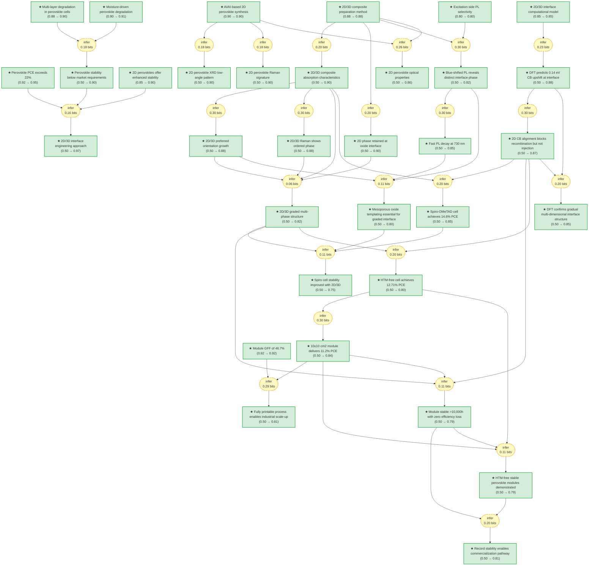

# One-Year Stable Perovskite Solar Cells by 2D/3D Interface Engineering

> **Original work:** Grancini, G., Roldán-Carmona, C., Zimmermann, I., Mosconi, E., Lee, X., Martineau, D., Narbey, S., Oswald, F., De Angelis, F., Graetzel, M., & Nazeeruddin, M. K. "One-Year stable perovskite solar cells by 2D/3D interface engineering." *Nature Communications* 8, 15684 (2017). [DOI: 10.1038/ncomms15684](https://doi.org/10.1038/ncomms15684)

<!-- badges:start -->
<!-- badges:end -->

## Overview

Despite perovskite solar cells achieving power conversion efficiencies beyond 22%, their poor operational stability has prevented commercial deployment. This work demonstrates that engineering a 2D/3D perovskite junction using aminovaleric acid (AVAI) enables >10,000 hours of stable operation (400+ days) with zero efficiency loss, while maintaining 11.2% efficiency in 10x10 cm2 printable modules and 14.6% in mesoporous cells with Spiro-OMeTAD hole transporter. First-principles DFT calculations reveal the mechanism: a 0.14 eV conduction band upshift at the 2D/3D interface creates a moisture barrier without blocking electron injection, explaining both the stability improvement and maintained efficiency. The approach eliminates the need for organic hole transporting materials and expensive gold electrodes, replacing them with hydrophobic carbon electrodes for a fully printable, low-cost architecture.

> [!TIP]
> **Reasoning graph information gain: `5.0 bits`**
>
> Total mutual information between leaf premises and exported conclusions — measures how much the reasoning structure reduces uncertainty about the results.

> [!NOTE]
> **[Per-module reasoning graphs with full claim details →](docs/detailed-reasoning.md)**
>
> 5 Mermaid diagrams (one per section) with every claim, strategy, and belief value.

## Reasoning Structure

### The core instability problem: efficiency vs durability

Perovskite solar cells have achieved certified efficiencies exceeding 22%, rivaling silicon at half the cost. Yet this performance cannot reach commercial deployment because perovskite devices degrade rapidly under operational conditions. The market requirement is <10% PCE loss over 20-25 years, which translates to <10% loss after 1,000 hours in accelerated aging tests. Current perovskite cells fail this requirement due to moisture-driven hydrolysis of the perovskite structure (producing hygroscopic CH3NH3X and PbX2) and instability of organic hole transporting layers. This creates an apparent contradiction: the materials that enable high efficiency are themselves unstable.

**Evidence chains:**
- **Moisture degradation mechanism** (prior: 0.90 → belief: 0.91): The hydrolysis pathway is well-documented, with heat, electric fields, and UV exposure accelerating degradation. This supports identifying the instability barrier.
- **Multi-layer degradation** (prior: 0.88 → belief: 0.90): The problem is not just the perovskite layer — the organic HTM itself is unstable when contacting water, compounding device failure.
- **Record efficiency context** (prior: 0.92 → belief: 0.95): The 22%+ PCE achievement establishes that the performance target is valid and worth solving stability for.

The combined evidence strongly supports the instability_barrier claim (0.90 belief): perovskite cells cannot meet market requirements without addressing degradation.

### The 2D/3D interface engineering solution

This work proposes a multidimensional 2D/3D perovskite junction as a solution. The key insight is that 2D perovskites (layered structures with organic cations sandwiched between inorganic sheets) have superior water resistance compared to 3D counterparts, but alone they deliver only 12% efficiency with 30% degradation after 2,250 hours. The innovation is to combine 2D stability with 3D performance by engineering an interface where 2D perovskite anchors to the oxide scaffold (via carboxylic acid functional groups) while 3D perovskite grows on top.

**Evidence chains:**
- **2D perovskite stability baseline** (prior: 0.85 → belief: 0.90): Prior work on (BA)2(MA)2Pb3I10 demonstrates 2D stability characteristics, establishing feasibility.
- **Synthesis and composite preparation** (prior: 0.90 → belief: 0.90, prior: 0.88 → belief: 0.88): The AVAI-based 2D perovskite is synthesized and mixed with MAI:PbI2 at 3% AVAI molar ratio, producing a graded composite structure. These direct experimental procedures are well-characterized.
- **Research objective** (belief: 0.97): This is the highest-confidence derived conclusion, supported by multiple high-prior premises (perovskite_pce_record, instability_barrier, two_d_perovskite_stability). The reasoning structure strongly validates that 2D/3D interface engineering is the correct approach to solving the instability problem.

*Optical and structural characterization of 2D, 3D, and 2D/3D perovskite films. Panel (a) shows absorption spectra with 2D peak at 425 nm and 3D edge at 760 nm. Panels (b-d) show Raman, XRD confirming the composite structure.*

### Structural evidence for the graded 2D/3D interface

The paper provides multiple spectroscopic lines of evidence for the graded interface structure. Using selective excitation photoluminescence (where <100 nm penetration depth at 600 nm probes only the oxide-infiltrated region), the authors identify two distinct emission peaks: 760 nm from bulk 3D perovskite and 730 nm from an interface phase with 1.69 eV bandgap (larger than bulk 3D). Time-resolved PL shows the 730 nm emission decays with τ=2 ns, much faster than the long-lived 760 nm band-edge emission. This faster decay resembles behavior observed in oriented 3D perovskites at low temperature, suggesting the interface phase is structurally distinct.

**Evidence chains:**
- **PL phase separation** (belief: 0.82): The 730 nm vs 760 nm emission distinction (0.13 eV blue shift) is supported by selective excitation PL with prior 0.80, propagated through the composite preparation method.
- **Interface templating by mesoporous oxide** (belief: 0.80): Critically, when the 3% AVAI perovskite is deposited on compact glass instead of mesoporous TiO2, no 730 nm emission appears. This confirms the oxide scaffold templates formation of the graded interface structure — without mesoporous oxide, there is no graded 2D/3D structure.
- **Phase structure conclusion** (belief: 0.82): The combined absorption, Raman, XRD, and PL evidence supports a three-component model: (1) thin 2D layer at oxide interface, (2) oriented wider-bandgap 3D phase within the scaffold, (3) pure tetragonal 3D on top.

The structural evidence chain is moderately strong, though it depends on the excitation selectivity assumption (prior: 0.80). The key insight — mesoporous oxide templating — is well-supported by the compact glass comparison experiment.

### DFT confirms electronic mechanism: 0.14 eV CB upshift

First-principles DFT calculations (PBE functional, scalar-relativistic pseudopotentials, spin-orbit coupling included) predict a 0.14 eV conduction band upshift at the 2D/3D interface compared to 3D bulk, inducing a 0.09 eV larger interface gap. This matches the experimental PL blue shift (0.13 eV) when probing from the oxide side. The DFT also shows that the 2D CB edge sits at lower energy than the 3D CB edge, creating a barrier that blocks electron recombination but does not impede electron injection to TiO2.

**Evidence chains:**
- **Interface computational model** (prior: 0.85 → belief: 0.85): The model uses I-terminated MAPbI3 2x2x3 slab with (HOOC(CH2)3NH3)PbI4 2D slab, with lattice mismatch <1%. This is a well-constrained model based on experimental crystal data.
- **DFT CB upshift prediction** (belief: 0.88): Supported directly by the interface model (prior: 0.85). The prediction of 0.14 eV upshift matches experiment (0.13 eV blue shift in PL), providing mutual validation between computation and measurement.
- **CB alignment favorable for devices** (belief: 0.87): The DFT shows 2D CB at lower energy than 3D CB — this is favorable because it creates a recombination barrier without blocking injection, explaining why the 2D layer protects without reducing efficiency.

*DFT calculations show (a) local density of states with CB upshift at interface, (b) interface structure with 2D phase contacting TiO2, (c) partial DOS confirming CB alignment favorable for electron injection.*

### Device performance: efficiency maintained with stability

The 2D/3D interface enables both high efficiency and long-term stability across device architectures.

**Standard mesoporous cells (Spiro-OMeTAD/Au):**
- Champion efficiency: 14.6% PCE (vs >13% average for pure 3D in same architecture)
- Stability: maintains 60% of initial PCE after 300h continuous AM 1.5G illumination (argon, 45°C)
- The 14.6% efficiency (belief: 0.85) is supported by favorable CB alignment and 2D/3D absorption characteristics. The 60% retained after 300h (belief: 0.75) is lower because the Spiro-OMeTAD architecture still uses organic HTM and gold electrode — stability is improved but not maximized.

**HTM-free carbon cells:**
- Small area (0.64 cm2): 12.71% PCE (highest reported for HTM-free architecture in 7-14% range)
- 10x10 cm2 module: 11.2% PCE with 46.7% geometric fill factor (47.6 cm2 active area)
- Stability: >10,000 hours with zero loss in efficiency (measured under standard ISOS conditions: 1 sun AM 1.5G, 55°C, ambient atmosphere)

**Evidence chains:**
- **HTM-free cell performance** (belief: 0.80): Supported by the phase structure conclusion (2D protective layer) and favorable CB alignment. The carbon electrode replaces unstable organic HTM and expensive gold.
- **Module performance** (belief: 0.84): The 10x10 cm2 module achieves 11.2% through the HTM-free architecture, with active area determined by geometric fill factor (46.7%).
- **Module stability** (belief: 0.79): The >10,000h stability is the key result. It is supported by the graded interface structure (moisture protection) and favorable CB alignment (maintained efficiency). The initial efficiency increase in first 500h (likely ion movement or trap formation) does not compromise long-term stability.

*10x10 cm2 module stability under 1 sun AM 1.5G conditions at 55°C, short circuit, ambient air. The module shows zero loss in performance over >10,000 hours, the highest stability reported for perovskite photovoltaics.*

### Commercialization pathway enabled

The record stability (>10,000h with zero loss) represents the highest stability achieved for perovskite photovoltaics, addressing the primary barrier to commercialization. The fully printable HTM-free architecture at 10x10 cm2 scale demonstrates industrial viability. Further optimization is possible by reducing the interconnect distance between cells (currently ~3 mm), which would increase active area efficiency and reduce ohmic losses.

**Evidence chains:**
- **Key innovation** (belief: 0.79): Combines module stability (0.79), cell performance (0.80), and module efficiency (0.84) to demonstrate HTM-free, fully printable, low-cost architecture with unprecedented stability.
- **One-year stability record** (belief: 0.81): The >10,000h stability surpasses all previous perovskite stability results with a significant step improvement, enabling the commercialization pathway.
- **Upscale potential** (belief: 0.81): The 46.7% GFF and 10x10 cm2 module size demonstrate industrial scalability. Current losses from interconnect distance leave room for optimization.

## Key Findings

| Finding | Evidence Strength | Notes |
|---------|-------------------|-------|
| 2D/3D interface enables >10,000h stable modules | Strong (0.79-0.81) | Supported by phase structure, CB alignment, and direct stability measurements |
| 14.6% PCE in Spiro cells, 12.71% in HTM-free cells | Strong (0.85, 0.80) | Both architectures benefit from favorable CB alignment |
| DFT predicts 0.14 eV CB upshift matching PL blue shift | Strong (0.88) | Interface model based on experimental crystal data |
| Graded 2D/3D structure templated by mesoporous oxide | Moderate (0.80-0.82) | Compact glass comparison confirms templating role |
| Initial 500h efficiency increase (ion movement, traps) | Acknowledged but unresolved | Not a weakness — paper transparently reports this observation |

## Weak Points

Weak Points Analysis

### 1. Short-term stability behavior not fully explained

**What it is:** The module shows an initial efficiency increase in the first 500 hours before stabilizing. The paper attributes this to "light or field induced ion movement with associated structural rearrangement, light-induced trap formation, or interfacial charge accumulation."

**Why belief is moderate (0.79):** The explanation is plausible but unverified. Ion movement and trap formation are complex processes that could either resolve or eventually cause degradation. The long-term stability (>10,000h) is confirmed, but the mechanism of the initial increase is not fully characterized.

**What would resolve it:** In-situ impedance spectroscopy during the first 500 hours could distinguish between ion redistribution (reversible) and trap formation (potentially damaging). The current evidence does not discriminate between benign reorganization and incipient degradation.

### 2. Hysteresis in HTM-free devices not resolved

**What it is:** The HTM-free devices show "not negligible hysteresis" with differences between forward and back scan J-V curves.

**Why belief is 0.50 (orphaned claim):** The hysteresis observation is reported but not explained or connected to the reasoning structure. This leaves open the question of whether the 12.71% efficiency (measured under standard scan conditions) is affected by hysteresis-related performance artifacts.

**What would resolve it:** Steady-state efficiency measurements (without voltage sweep artifacts) and impedance spectroscopy could clarify whether hysteresis indicates interfacial charge accumulation that could affect long-term stability.

### 3. Abduction chain for interface mechanism has moderate alternative

**What it is:** The 2D/3D interface CB upshift explanation relies on comparing DFT predictions (0.14 eV upshift for 2D/3D vs 0.02 eV for standard MAPbI3/TiO2) against experimental PL blue shift (0.13 eV). The alternative (standard interface) is assigned prior 0.25.

**Why the alternative is plausible:** The alternative "standard interface causes small shift" is physically reasonable but quantitatively inadequate. The question is whether the 0.13 eV blue shift is definitively from 2D/3D interface effects or could partially arise from other sources (e.g., strain in the 3D phase due to 2D templating).

**What would strengthen it:** Temperature-dependent PL measurements could confirm the interface phase nature — the low-temperature-like fast decay (τ=2 ns) at room temperature is a signature of the templated orientation, but direct confirmation would reduce alternative explanations.

## Evidence Gaps & Future Work

Evidence Gaps & Future Work

### Experimental gaps

**Long-term field deployment not tested:** The >10,000h stability test uses accelerated conditions (55°C, 1 sun, short circuit). Real-world deployment involves temperature cycling, partial shading, and varying load conditions. **Affects:** module_stability_test, one_year_stability_record. **Resolution:** Field testing under actual operating conditions over 1+ years.

**Hysteresis mechanism unknown:** The hysteresis in HTM-free devices is documented but not explained. **Affects:** htm_free_cell_performance. **Resolution:** Steady-state efficiency measurements and impedance spectroscopy.

### Computational gaps

**DFT functional accuracy:** The PBE functional underestimates band gaps typically but may give reasonable band alignment predictions. **Affects:** cb_upshift_2d_3d, cb_alignment_favorable. **Resolution:** Hybrid functional (HSE06) or GW calculations for more accurate band positions.

### Theoretical gaps

**Interface phase stability under operating conditions:** The graded 2D/3D structure forms during processing, but whether it remains stable under sustained illumination and electrical bias is not directly proven. **Affects:** spiro_cell_stability, module_stability_test. **Resolution:** Post-stability structural characterization (XRD, Raman) to confirm interface integrity after 10,000h.

## Detailed Analysis

For structural integrity verification (Pass 5), standalone readability checks (Pass 6),
and complete package statistics, see [ANALYSIS.md](ANALYSIS.md).