ARTICLE

Received 19 Aug 2016 | Accepted 20 Apr 2017 | Published 1 Jun 2017

DOI: 10.1038/ncomms15684

OPEN

# One-Year stable perovskite solar cells by 2D/3D interface engineering

G. Grancini1 , C. Rolda´n-Carmona1 , I. Zimmermann1 , E. Mosconi2,3, X. Lee4, D. Martineau5, S. Narbey5, F. Oswald5, F. De Angelis2,3, M. Graetzel4 & Mohammad Khaja Nazeeruddin1

Despite the impressive photovoltaic performances with power conversion efficiency beyond $2 2 \%$ , perovskite solar cells are poorly stable under operation, failing by far the market requirements. Various technological approaches have been proposed to overcome the instability problem, which, while delivering appreciable incremental improvements, are still far from a market-proof solution. Here we show one-year stable perovskite devices by engineering an ultra-stable 2D/3D $( H O O C ( C H _ { 2 } ) _ { 4 } N H _ { 3 } ) _ { 2 } P b | _ { 4 } / C H _ { 3 } N H _ { 3 } P b | _ { 3 }$ perovskite junction. The 2D/3D forms an exceptional gradually-organized multi-dimensional interface that yields up to $1 2 . 9 \%$ efficiency in a carbon-based architecture, and $1 4 . 6 \%$ in standard mesoporous solar cells. To demonstrate the up-scale potential of our technology, we fabricate $1 0 \times 1 0 \mathsf { c m } ^ { 2 }$ solar modules by a fully printable industrial-scale process, delivering $1 1 . 2 \%$ efficiency stable for $> 1 0 , 0 0 0 { \mathrm { h } }$ with zero loss in performances measured under controlled standard conditions. This innovative stable and low-cost architecture will enable the timely commercialization of perovskite solar cells.

With power conversion efficiencies (PCE) beyondcomparable to silicon solar cells at half of the pri $2 2 \%$ comparable to silicon solar cels at half of the pricel-3, organo lead-halide perovskite solar cells (PSC) are leading the photovoltaic research scene. However, despite the big excitement, the unacceptably low-device stability under operative conditions currently represents an apparently unbearable barrier for their market uptake4,5. Notably, a marketable product requires a warranty for 20–25 years with $< 1 0 \%$ drop in performances. This corresponds, on standard accelerated aging tests, to having $< 1 0 \%$ drop in PCE for at least $1 , 0 0 0 \mathrm { { h } }$ . Hybrid perovskite solar cells are still struggling to reach this goal. Perovskite are sensitive to water and moisture, ultraviolet light and thermal stress6–8. When exposed to moisture, the perovskite structure tend to hydrolyse6 , undergoing irreversible degradation and decomposing back into the precursors, for example, the highly hygroscopic $\mathrm { C H } _ { 3 } \mathrm { N H } _ { 3 } \mathrm { X }$ and $\bar { \mathrm { C H } } ( \mathrm { N H } _ { 2 } ) _ { 2 } \mathrm { X }$ salts and $\mathrm { \bar { P b } X } _ { 2 }$ , with $\mathrm { X = }$ halide, a process that can be dramatically accelerated by heat, electric field and ultraviolet exposure7,8. Material instability can be controlled to a certain extent using cross-linking additives9 or by compositional engineering10, that is, adding a combination of $\mathrm { P b } ( \mathrm { C H } _ { 3 } \mathrm { \bar { C O } } _ { 2 } ) _ { 2 } \cdot 3 \mathrm { H } _ { 2 } \mathrm { O }$ and $\mathrm { P b C l } _ { 2 }$ in the precursors11 or using cation cascade, including Cs and Rb cations, as recently demonstrated2,3, to reduce the material photo-instability and/or optimize the film morphology. However, solar cell

degradation is not only due by the poor stability of the perovskite layers, but can be also accelerated by the instability of the other layers of the solar cell stack. For instance, the organic hole transporting material (HTM) is unstable when in contact with water. This can be partially limited by proper device encapsulation12–14 using buffer layers between perovskite and $\mathrm { H T M } ^ { 1 5 }$ or moisture-blocking $\mathrm { H T M } ^ { 1 6 }$ such as $\bar { \mathrm { N i O } } _ { x }$ (ref. 17) delivering, in this case, up to $1 , 0 0 0 \mathrm { { h } }$ stability at room temperature. However, this approach increases the device complexity, and the cost of materials and processing. It is also worth to mention that most of the device stability measurements reported in literature are often done under arbitrary conditions far from the required standards18 such as not performed under continuous light illumination17, measured at an undefined temperature, or leaving the device under uncontrolled light and humidity conditions19. This makes a proper comparison among the different strategies used challenging. On the other hand, two-dimensional (2D) perovskites have recently attracted a substantial interest due to their superior stability and water resistance, far above their three-dimensional (3D) counterpart14,20,21. In this respect, solar cells based on the quasi-2D $( \mathrm { B A } ) _ { 2 } ( \mathrm { M A } ) _ { 2 } \mathrm { P b } _ { 3 } \mathrm { I } _ { 1 0 }$ $\mathrm { B A } = \mathrm { n }$ -butylammonium) perovskite have recently shown $1 2 \%$ efficiency21. However, their performances drop by $3 0 \%$ after running for $2 , 2 5 0 \mathrm { h }$ in ambient conditions.

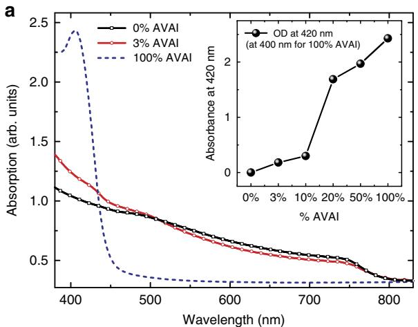

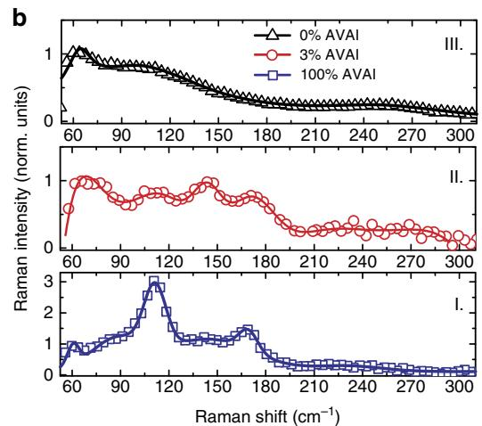

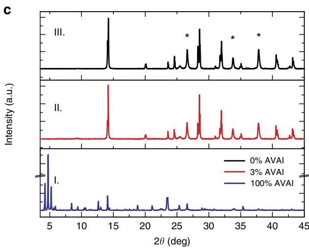

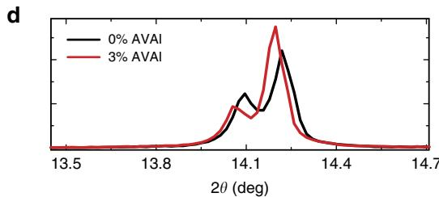

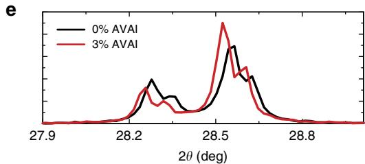  
Figure 1 | Optical and Structural characterization. (a) Absorption spectra of the $( { \mathsf { H O O C } } ( \mathsf { C H } _ { 2 } ) _ { 4 } { \mathsf { N H } } _ { 3 } ) _ { 2 } { \mathsf { P b l } } _ { 4 }$ (blue dashed line), 3D $\mathsf { C H } _ { 3 } \mathsf { N H } _ { 3 } \mathsf { P b l } _ { 3 }$ (black line) and 2D/3D (red line) using $3 \%$ of ${ \mathsf { H O O C } } ( { \mathsf { C H } } _ { 2 } ) _ { 4 } { \mathsf { N H } } _ { 3 } |$ , AVAI hereafter. In the inset the intensity of the peak at $4 2 0 \mathsf { n m }$ with increasing the percentage of AVAI to $\mathsf { P b l } _ { 2 }$ . (b) Raman spectra for 100%AVAI (panel I.), 3%AVAI (panel II) and 0%AVAI (panel III) perovskites. Solid lines represent the fit from multi-gaussian peaks fitting procedure (Supplementary Fig. 3 for details). For 3D perovskite main peak at: 78, 109 and $2 5 0 \mathsf { c m } ^ { - 1 }$ ; for 2D at: 73, 109, 143, $1 7 1 \mathsf { c m } ^ { - 1 }$ and for 2D/3D at: 62, 87, 112, 143, $1 6 9 \mathsf { c m } ^ { - 1 }$ ; (c) X-Ray diffraction pattern of 100%AVAI (panel I); $3 \%$ AVAI (panel II) and 0%AVAI (panel III) perovskite. Peaks denoted with a star originate from the $\mathsf { F T O } / \mathsf { T i O } _ { 2 }$ substrate. (d) Zoom of the X-ray diffraction pattern comparing the $3 \%$ AVAI with the pure 0%AVAI perovskites at selected angles. Substrate: mesoporous $\mathrm { T i O } _ { 2 }$ .

Here we develop an innovative concept by engineering a multidimensional junction made of 2D/3D perovskites. This 2D/3D interface brings together the enhanced stability of 2D perovskite with the panchromatic absorption and excellent charge transport of the 3D ones, enabling the fabrication of efficient and ultra-stable solar cells, an important proof of concept for further device optimization and up-scaling. In particular, we develop HTM-free solar cells and modules substituting the HTM with hydrophobic carbon electrodes22,23. Within this configuration we demonstrate, for the first time, a remarkable long-term stability of $> 1 0 { , } 0 0 0 \mathrm { h }$ , corresponding to $> 4 0 0$ days with zero loss in efficiency over a large-area, fully printable, low-cost and high-efficient solar module of $1 0 \mathrm { { 0 } } \mathrm { { c m } } ^ { 2 }$ (active area of around $5 0 \mathrm { c m } ^ { 2 } .$ ) measured under controlled standard conditions and in the presence of oxygen and moisture.

# Results

Structural and optoelectronic characterization. Inspired by the concept of crystal engineering and supramolecular synthons in 2D layered perovskite24,25, we have first realized a lowdimensional perovskite using the protonated salt of aminovaleric acid iodide $\mathrm { ( H O O \bar { C } ( C H _ { 2 } ) _ { 4 } N H _ { 3 } I , }$ AVAI hereafter), as the organic precursor mixed with $\mathrm { P b }  { \mathrm { I } _ { 2 } }$ (see Supplementary Information for details), following the procedure of the previous work of few of $\mathtt { u s } ^ { 2 3 , 2 6 }$ . The deposition results in the formation of a low-dimensional perovskite possibly arranging into a $( \mathrm { H O O C ( C H _ { 2 } ) _ { 4 } N H _ { 3 } } ) _ { 2 } \mathrm { P b I _ { 4 } }$ structure. A yellowish film containing needle-like crystallites is formed (Supplementary Fig. 1). As shown in Fig. 1a, the absorption spectra of the film shows a clear band edge at $4 5 0 \mathrm { n m }$ and an excitonic peak at $4 2 5 \mathrm { n m } ^ { 2 4 , 2 5 }$ . Band edge emission at $4 5 3 \mathrm { n m }$ is observed in the photoluminescence (PL) spectrum (Supplementary Fig. 2). The structural properties of the $\mathrm { ( H O O C ( C H _ { 2 } ) _ { 4 } N H _ { 3 } ) _ { 2 } P b I _ { 4 } }$ are investigated by Raman spectroscopy and X-ray diffraction. The Raman spectra of the $1 0 0 \% \mathrm { A V A I }$ sample is compared with the one collected from the 3D perovskite $( 0 \% \mathrm { { A V A I } ) }$ and to the mixed $3 \%$ AVAI, as shown in Fig. 1b (panels I–III). For the $1 0 0 \% \mathrm { A V A I }$ perovskite sharper peaks in the $5 0 { - } 2 0 0 \mathrm { c m } ^ { - 1 }$ range are observed. More in details, the peaks at 87, 112 and $1 6 9 \mathrm { c m } ^ { - 1 }$ are related to $P b \mathrm { - } I$ stretching and bending modes27–29, while the modes at 62 and at $1 4 3 \mathrm { c m } ^ { - \dagger }$ are associated to the rotation and libration of the organic cations, leading to an overall spectra very similar in shape to that of $\mathrm { P b }  { \mathrm { I } _ { 2 } }$ 2intercalated with ammonia molecules27–29. The X-ray diffraction

measurement of the $1 0 0 \% \mathrm { A V A I }$ perovskite, Fig. 1c (panel I), collected on an extended range down to $3 ^ { \circ }$ , exhibits a rich diffraction pattern at low angles with a strong dominant peak at $4 . 7 ^ { \circ }$ along with two lateral peaks at 4.2 and $5 . 2 ^ { \circ }$ . The data provide evidence of the formation of a low-dimensional perovskite with a possible much more complex crystal structure as evident by the multiple reflections at low angles $( 2 \theta < 1 0 ^ { \mathrm { o } } ) ^ { 2 4 , 2 5 , 3 0 }$ . As the second step, we engineer the 2D/3D composite by mixing the (AVAI:PbI2) and $\left( \mathrm { C H } _ { 3 } \mathrm { N H } _ { 3 } \mathrm { I } { : } \mathrm { P b I } _ { 2 } \right)$ ) precursors at different molar ratios $( 0 - 3 - 5 - 1 0 - 2 0 - 5 0 \% )$ , as described in Supplementary Information). The mixed solution is infiltrated in the mesoporous oxide scaffold by a single-step deposition followed by a slow drying-process, allowing the reorganization of the components in the film before solidification. The mixed films obtained by varying the precursors ratio absorb across the whole visible region with an edge at $7 6 0 \mathrm { n m }$ and a peak around $4 3 0 \mathrm { n m }$ , see Fig. 1a and Supplementary Fig. 4. Figure 1a shows the results for the film obtained by $3 \%$ AVAI, representing the optimized concentration for the best performing device (see below). The absorption band edge matches with that of 3D $\mathrm { C H } _ { 3 } \mathrm { N H } _ { 3 } \mathrm { P b I } _ { 3 }$ perovskite, while the peak at $4 3 0 \mathrm { n m }$ , which linearly gains intensity upon increasing the $\mathrm { A V A I \% }$ (see inset in Fig. 1a and Supplementary Fig. 4), resembles the absorption peak of the 2D perovskite, although partially red-shifted. The addition of $3 \%$ AVAI thus induces the formation of a mixed 2D/3D composite, partly retaining the features of its 2D and 3D constituents. Figure 1b compares the Raman spectrum of the $1 0 0 \% \mathrm { A V A I }$ sample with those from the $0 \%$ AVAI and the optimized $3 \%$ AVAI sample. Additional data at different AVAI concentration are reported in Supplementary Figs 5 and 6. The spectrum of the 2D/3D 3%AVAI composite shows well-defined Raman lines spectrally matching the 2D peaks and standing out of a broader band that is characteristic of the modes of the inorganic lattice of the 3D $\mathrm { C H } _ { 3 } \mathrm { N H } _ { 3 } \mathrm { P b I } _ { 3 }$ (refs 28,29). In the $3 \%$ AVAI sample, sharp Raman features with reduced broadening are identified, suggesting an overall more ordered crystal rearrangement of the 2D/3D film compared with the pure 3D phase. The X-ray diffraction pattern of the 2D/3D is reported in Fig. 1c–e and Supplementary Figs 7 and 8 for the different AVAI content. The most prominent peak is observed at $1 4 . 1 3 ^ { \circ }$ , related to the (110) direction of the $\mathrm { C H } _ { 3 } \mathrm { N H } _ { 3 } \mathrm { P b I } _ { 3 }$ tetragonal phase30. More in details, as revealed by the zoom in Fig. $^ { 1 \mathrm { d } , \boldsymbol { \mathrm { e } } , }$ , the 2D/3D film shows a remarkable change in intensity of the (00l) and (hk0) peaks

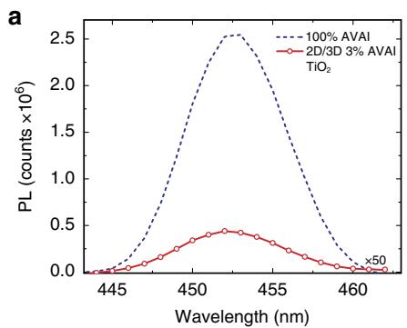

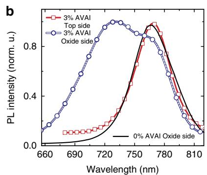

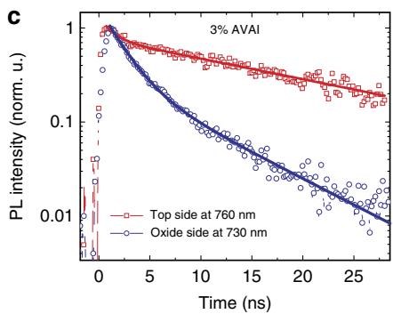  
Figure 2 | Emission Properties. (a) PL spectra, excitation at $4 0 0 \mathsf { n m }$ , for the $100 \%$ HOOC(CH2)4NH3I, AVAI hereafter and 2D/3D at 3%AVAI, exciting from the $\mathrm { T i O } _ { 2 }$ side, where perovskite is infiltrated within the mesoporous scaffold. (b) Normalized PL spectra, excitation at 600 nm, for the 2D/3D at $3 \%$ AVAI exciting from the top perovskite layer and from the $\mathrm { T i O } _ { 2 }$ side, where perovskite is infiltrated within the mesoporous scaffold compared to 3D 0%AVAI exciting from the mesoporous side (solid line). Since the light penetration depth is $< 1 0 0 \mathsf { n m }$ at 600 nm, excitation of the perovskite film from the oxide side (scaffold thickness of around $1 \mu \mathrm { m } )$ interrogates the perovskite nano-crystallites grown within the scaffold, while excitation from the perovskite top layer probes the intrinsic properties of the bulk perovskite growing on top. (c) PL dynamics of the bulk perovskite (exciting from the top layer) at $7 6 0 \mathsf { n m }$ and from the oxide side at $7 3 0 \mathsf { n m }$ of the 3%AVAI deposited on the insulating $Z \mathsf { r O } _ { 2 }$ mesoporous substrate.

compared with the pattern of the 3D $\mathrm { C H } _ { 3 } \mathrm { N H } _ { 3 } \mathrm { P b I } _ { 3 }$ perovskite. With $3 \%$ AVAI both (002) and (004) decrease in intensity, while the intensity of the (110) and (220) reflections are increased, speaking in favour for a preferred orientation along the ${ \mathrm { < h k 0 > } }$ direction23. On the other side, no clear evidence of the peaks related to the 2D phase is observed for $3 \%$ AVAI, while they appear if the AVAI percentage exceeds $1 0 \%$ (Supplementary Figs 7 and 8). We can rationalize these results suggesting that the 2D/3D perovskite film with $3 \%$ AVAI is constituted by a thin layer (possibly a monolayer) of 2D perovskite; an oriented interface where the 3D phase has a marked preferential growth direction, and a pure 3D perovskite arranging in the tetragonal phase on top. To further elucidate the properties of the 2D/3D interface, we measure the steady-state PL spectra and timeresolved PL dynamics, see Fig. 2.

In particular, we measure the 2D/3D perovskite infiltrated into an inert $\mathrm { Z r O } _ { 2 }$ scaffold by varying the excitation side to selectively interrogate the perovskite crystals within the oxide or the top bulk perovskite layer, Fig. 2a. The PL measured when exciting from the oxide side reveals a weak emission around $4 5 0 \mathrm { n m } ,$ , matching with the one of $\mathrm { ( H O O C ( C H _ { 2 } ) _ { 4 } N H _ { 3 } ) _ { 2 } P b I _ { 4 } }$ (Supplementary Figs 2 and 10a). This suggests the presence of a 2D phase mostly retained at the interface with the oxide due to the favourable anchoring of the carboxylic acid group of the AVAI ligand to the $\mathrm { T i O } _ { 2 }$ scaffold31. Monitoring a more extended spectral window, Fig. 2b, excitation of the bulk top layer results in a single PL peak at $7 6 0 \mathrm { n m } ,$ as one would expect, while excitation from the oxide side leads to a peak at $7 3 0 \mathrm { n m }$ along with a shoulder at 760 nm. The emission at $7 3 0 \mathrm { n m }$ suggests that a different perovskite phase with a larger band-gap (of 1.69 eV) is formed within the oxide scaffold, but only in the presence of the AVAI precursor. Interestingly, a similar higher energy emission has been found at low-temperature, for the 3D $\mathrm { C H } _ { 3 } \mathrm { N H } _ { 3 } \mathrm { P b I } _ { 3 }$ perovskite, but was never observed at room temperature32,33. If we deposit a thicker oxide scaffold, avoiding the formation of the bulk $\mathrm { C H } _ { 3 } \mathrm { N H } _ { 3 } \mathrm { P b I } _ { 3 }$ perovskite capping layer, only the peak at $7 3 0 \mathrm { n m }$ appears (Supplementary Figs 9, 10), confirming that the emission at $7 6 0 \mathrm { n m }$ comes from the bulk perovskite. Notably, the pristine 3D $\mathrm { C H } _ { 3 } \mathrm { N H } _ { 3 } \mathrm { P b I } _ { 3 }$ excited from the oxide side does not show such blueshifted emission. Figure 2c compares the PL dynamics probing the temporal decay of the two different peaks. At $7 6 0 \mathrm { n m }$ , the PL shows a long-lived decay (extending out of our temporal window) typically assigned to electron-hole recombination at the band edges32,33, while at $7 3 0 \mathrm { n m }$ a fast component with a time constant $\tau = 2$ ns dominates, see Supplementary Table 1. Interestingly, such faster decay has been observed in the more oriented 3D $\mathrm { C H } _ { 3 } \mathrm { N H } _ { 3 } \mathrm { P b I } _ { 3 }$ that appears only at low temperature32,33, possibly due to intrinsic reduced electron-hole

lifetime34. Note that we intentionally use the insulating $\mathrm { Z r O } _ { 2 }$ substrate to highlight the intrinsic behaviour of the two phases, however a relative shortening of the lifetime is also observed on $\mathrm { T i O } _ { 2 }$ (Supplementary Fig. 11).

Overall, our analysis demonstrates the unique role of the 2D perovskite, anchored on the oxide network, in templating the growth of a biphasic 3D $\mathrm { C H } _ { 3 } \mathrm { N H } _ { 3 } \mathrm { P b I } _ { 3 }$ : an oriented wider bandgap phase within the oxide scaffold and a standard tetragonal phase on top of it. It is important to remark the fundamental role of the oxide in templating the graded 2D/3D interface. Indeed, if the $3 \%$ AVAI perovskite is deposited on a compact glass substrate the blue-shifted emission peak at $7 3 0 \mathrm { n m }$ is not observed, while only the emission at around $7 6 0 \mathrm { n m }$ is visible, independently from the excitation side (see Supplementary Figs 12,13 and the discussion in Supplementary Information).

Simulation of the 2D/3D interface. To check the impact of the suggested 2D/3D perovskite interface on the composite electronic properties, we carried out first principles simulations of the 2D/ 3D interface, Fig. 3. We built periodic (in the direction orthogonal to the interface) slabs of the 2D and 3D perovskites ensuring a lattice mismatch within ${ < } 1 \%$ . The methylammonium cations of the 3D perovskite layer contacting the 2D slab were replaced by AVA cations from the 2D slab and, employing the cell parameters of the 3D perovskite, we relaxed the atomic positions of the overall system by means of scalar-relativistic plane-wave/pseudopotential density functional theory calculations employing the PBE functional. As seen in Fig. 3a, there is a $0 . 1 4 \mathrm { e V }$ CB upshift at the 2D/3D interface compared to the bulk of the 3D perovskite, which induces a $0 . 0 9 \mathrm { e V }$ larger interface gap compared to the 3D bulk. This is clearly consistent with the PL blue shift experimentally observed $( 0 . 1 3 \mathrm { e V } )$ when probing the system from the oxide side. Notably, only a small shift (around $0 . 0 2 \mathrm { e V } )$ of opposite sign was found at the MAPbI3/TiO2 interface35. $\mathrm { M A P b I _ { 3 } / T i O _ { 2 } }$

# Discussion

These results suggest that the 2D/3D interaction widens the 3D perovskite band-gap in the interface region. Additionally, the thin 2D layer does not constitute a barrier to electron injection to $\mathrm { T i O } _ { 2 } .$ , but it rather constitutes a barrier towards electron recombination, since the 2D conduction band is found at lower energy than that of the 3D CB. This result is confirmed also in the presence of spin-orbit-coupling, see PDOS in Fig. 3c and Supplementary Fig. 14. The results indicate that the 2D/3D perovskite organizes in a gradual multi-dimensional structure

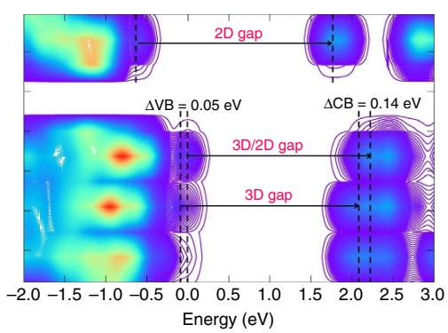  
a

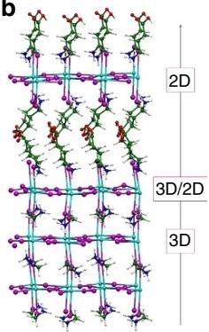

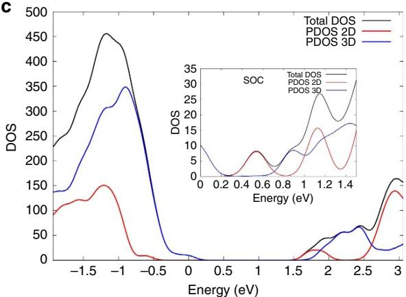  
  
Figure 3 | First principles simulations of the 2D/3D interface. (a) Local density of state (DOS) of the 3D/2D interface and (b) interface structure with the 2D phase contacting the $\mathrm { T i O } _ { 2 }$ surface. (c) Partial DOS summed on the 2D and 3D fragments calculated by including spin-orbit-coupling (SOC, inset) and without it. Notice the favourable alignment of conduction band states for electron injection into the 2D perovskite and possibly further into $\mathrm { T i O } _ { 2 }$ .

retaining the individual 2D and 3D phases, but, importantly also templating the formation of a novel oriented $\mathrm { C H } _ { 3 } \mathrm { N H } _ { 3 } \mathrm { P b I } _ { 3 }$ phase stabilized at the 2D/3D interface.

We have then fabricated solar cells with the 2D/3D perovskite optimizing the $\mathrm { A V A I \% }$ using both an architecture with an organic HTM and Au electrode, and a fully printable HTM-free configuration, where the HTM and gold are substituted with a carbon matrix23, and a $\mathrm { T i O } _ { 2 }$ mesoporous layer as electron transporting layer36, as depicted in the cartoon in Fig. 4a. J–V characteristic of the 2D/3D perovskite solar cell using an optimal 3%AVAI composition and Spiro-OMeTAD/Au is shown in Fig. 4b. The solar cell delivers a champion efficiency of $1 4 . 6 \%$ (see also Table in the inset of Fig. 4c, Supplementary Fig. 15 and device statistics in the inset and in Supplementary Figs 16,17). Importantly, it shows a much better trend in the device stability with respect to pure 3D $\mathrm { C H } _ { 3 } \mathrm { N H } _ { 3 } \mathrm { P b I } _ { 3 }$ cell (delivering an average efficiency above $1 3 \%$ in the same cell architecture), as shown in Fig. 4c. This represents an important proof of concept that paves the way to further stabilize the high efficiency (beyond $2 1 \%$ ) mesoporous solar cells based on a mixed halide composition2,37,38. Using the 2D/3D perovskite compared to the standard 3D $\mathrm { C H } _ { 3 } \mathrm { \bar { N } H } _ { 3 } \mathrm { P b I } _ { 3 }$ , the efficiency is maintained up to $6 0 \%$ of the initial value after $3 0 0 \mathrm { h }$ continuous illumination under argon atmosphere, more stable than the standard 3D perovskite (Fig. 4c).

On the other side, based on the pioneering work by Mei et al.23 we developed HTM-free solar cells, being at present the cheapest, fully printable low-cost deposition process. It presents the most attractive photovoltaic solution, being a simple monolithic architecture without the use of the instable and expensive organic HTM and without the additional barrier layers17. We have developed small area cells $( 0 . 6 4 \mathrm { c m } ^ { 2 } )$ and large area $1 0 \times 1 0 \mathrm { c m } ^ { 2 }$ solar modules as shown in Fig. 5a,b reporting the average $J { - } V$ curve of the cell and the module, as well as the device statistics in the inset. The modules were prepared with a total size of $1 0 \times 1 0 \mathrm { c m } ^ { 2 }$ , with a geometric fill factor (GFF), the ratio between the active area and the total area of the module, of $4 6 . 7 \%$ . This leads to an active area of $4 7 . 6 \mathrm { c m } ^ { 2 }$ per module, which is the area considered to calculate the device efficiency. In addition, to avoid any mechanical damage of the cells, the devices were protected with a glass slide via a very simple sealing method under air conditions (see details in Supplementary Information), not under any inert or humidity controlled atmosphere as usually reported in literature, further confirming the higher robustness of

our devices. The champion cell and module deliver an efficiency of $1 2 . 7 1 \%$ and $1 1 . 2 \%$ , respectively, among the highest reported so far ranging from 7 to $1 4 \%$ (refs 39–42), as shown in Supplementary Table 2 (ref. 22). It is worth mentioning that a fair comparison among the majority of reported module efficiencies is challenging because the GFF and the geometric shape of the devices are most of the times not indicated. In our work, the modules consist of 8 cells of $8 5 \times 7 \mathrm { m m } ^ { 2 }$ , which leads to an active area of $5 . 9 5 \mathrm { c m } ^ { 2 }$ per cell and $4 7 . 6 0 \mathrm { c m } ^ { 2 }$ per module. In this module design, both the interconnect distance (around $3 \mathrm { m m }$ ) and the margins around the module aperture are admittedly large, implying an important loss in the area (which is included in the total area considered for the module). Further optimizations could be done by reducing the interconnect distance between cells, which will probably have two different impacts: less area will be lost, increasing the efficiency per total area in the module and the ohmic losses at the FTO between the interconnect gap will be reduced, improving the efficiency per active area. In addition, producing larger modules will not significantly increase the area for the margins, which would also have a positive impact on the final module performance. We have tested the modules under different conditions under simulated AM 1.5 G solar illumination at $1 0 0 0 \mathrm { W } \mathrm { m } ^ { - 2 }$ and cycling of temperature up to $9 0 ^ { \circ } \mathrm { C }$ under ambient conditions, in agreements with the standards (Supplementary Fig. 17). The results, in Fig. 5c, show an extraordinary long-term stability of $> 1 0 { , } 0 0 0 \mathrm { h }$ and excellent response at elevated temperature (Supplementary Fig. 17), reported here for the first time. It is fair to notice that an initial increase is detected in Fig. 5c in the first $5 0 0 \mathrm { h }$ of the stability test. This can be due to concomitant effects such as light or field induced ion movement with the associated structural rearrangement, light-induced trap formation, or interfacial charge accumulation that can alter the device behaviour (and also cause the device hysteresis), at present under intense scrutiny37,43,44. Supplementary Fig. 18 and Supplementary Table 4 report the comparison of the $J { - } V$ characteristic and parameters, when the device is measured in forward and back scan direction. As mentioned above, it is fair noticing that these devices show a not negligible hysteresis that is subject of ongoing investigation. Remarkably, the long stability here reported is at present the highest record value obtained for perovskite photovoltaics, surpassing with a gigantic step the results obtained so far.

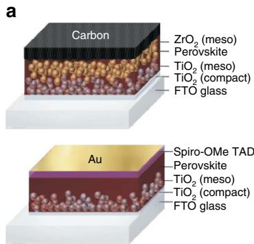

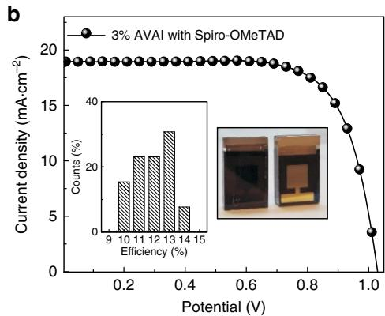

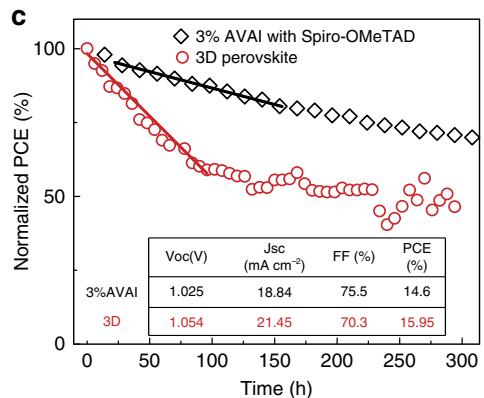  
Figure 4 | 2D/3D Mesoporous Solar cell characteristics and stability. (a) Device cartoon of the Hole transporting Material (HTM)-free solar cell and of the standard HTM-based solar cell. (b) Current density voltage (J–V) curve using the 2D/3D perovskite with $3 \%$ $\% \mathsf { H O O C } ( \mathsf { C H } _ { 2 } ) _ { 4 } \mathsf { N H } _ { 3 } \mathsf { I }$ , AVAI hereafter, in a standard mesoporous configuration using $2 , 2 ^ { \prime } , 7 , 7 ^ { \prime }$ -tetrakis(N,N-di-p-methoxyphenylamine)- $^ { . 9 , 9 ^ { \prime } }$ -spirobifluorene (spiro-OMeTAD)/Au (devise statistics and picture of the cell in the inset). (c) Stability curve of the Spiro-OMeTAD/Au cell comparing standard 3D with the mixed 2D/3D perovskite at maximum power point under AM 1.5G illumination, argon atmosphere and stabilized temperature of $4 5 ^ { \circ } \mathsf { C }$ . Solid line represent the linear fit. In the inset the champion device parameters are listed.

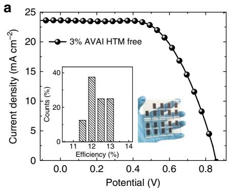

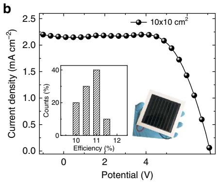

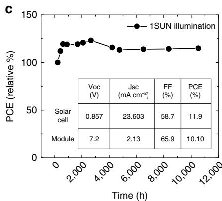  
Figure 5 | 2D/3D Carbon based Solar cell characteristics and stability. (a) J–V curve using the 2D/3D perovskite with 3%AVAI in HTM-free solar cell measured under Air Mass (AM) 1.5G illumination (device statistics and picture in the inset). (b) J–V curve using the 2D/3D perovskite with $3 \%$ AVAI in a HTM-free $1 0 \times 1 0 \mathsf { c m } ^ { 2 }$ module (device statistics and picture in the inset). (c) Typical module stability test under 1 sun AM 1.5 G conditions at stabilized temperature of $5 5 ^ { \circ }$ and at short circuit conditions. Stability measurements done according to the standard aging conditions. In the inset device parameters of the devices represented in a and b. Champions devices reported in Supplementary Table 2.

In conclusion, we interface engineering a built-in 2D/3D perovskite which grows forming a peculiar bottom-up phasesegregated graded structure. The unique combination of the 2D layer acting as a protective window against moisture, preserving the 3D perovskite and of the efficient 3D one provides the hint for the development of a stable perovskite technology, paving the way for the realization of near term high efficient and stable perovskite solar cells for widespread deployment.

# Methods

Materials development. $\mathrm { C H } _ { 3 } \mathrm { N H } _ { 3 } \mathrm { I }$ (MAI), $\mathrm { H O O C } ( \mathrm { C H } _ { 2 } ) _ { 4 } \mathrm { N H } _ { 3 } \mathrm { I }$ (AVAI) and $\mathrm { T i O } _ { 2 }$ paste (30 NR-D) have been purchased from Dyesol Company. $\mathrm { P b } \mathrm { I } _ { 2 }$ was purchased from TCI Europe. All chemicals were used as received without further purification.

Fabrication of Spiro-OMeTAD based solar cells. The solar cells were prepared on fluorine-doped tin oxide coated glass (NSG10) substrates. Before the deposition of the different layers, the substrates were cleaned by sequentially sonicating them during 15 min in hellmanex solution $( 2 \mathrm { v o l } \% )$ , 5 min in distilled water and finally 5 min more in isopropanol, followed by 15 min of ultraviolet-ozone treatment. A 30 nm thick $\mathrm { T i O } _ { 2 }$ blocking layer was deposited by spray pyrolysis from a solution containing $6 0 0 \mu \mathrm { l }$ Titanium diisopropoxide bis(acetylacetonate) $7 5 \%$ from Sigma Aldrich in 9 ml of isopropanol. After sintering at $4 5 0 ^ { \circ } \mathrm { C } ,$ the mesoporous $\mathrm { T i O } _ { 2 }$ layer was spin-coated from a $4 0 0 \mathrm { m g } \mathrm { m l } ^ { - 1 }$ solution of 30NRD Dyesol paste in EtOH at 1,000 r.p.m. for 10 s and annealed at $5 0 0 ^ { \circ } \mathrm { C }$ for $3 0 \mathrm { { m i n } }$ . Once the substrates were cooled down, $4 0 \mu \mathrm { l }$ of a solution containing 1.25 M $\mathrm { P b } \mathrm { I } _ { 2 }$ /MAI (1:1) in DMSO was spin-coated on top through a two-step process: the first step consisting of 1,000 r.p.m. during 10 s (preconditioning of the layer) and the second step at $4 { , } 5 0 0 \mathrm { r . p . m }$ . during 30 s. Ten seconds before the end of the program, $1 0 0 \mathrm { m l }$ of chlorobenzene were spin-coated on top of the perovskite layer, according to the antisolvent method previously described in literature38, and finally the perovskite films were sintered at $1 0 0 ^ { \circ } \mathrm { C }$ during 1 h. Different compositions of 2D–3D perovskite were also tested by mixing different amounts of 1.1 M solution of $\operatorname { A V A I : P b I } _ { 2 }$ (2:1) with the $\mathbf { M A I : P b I } _ { 2 }$ precursor solution (0, 3 and $5 \%$ molar ratio). After the annealing time, Spiro-OMeTAD was spin-coated at 4,000 r.p.m., 20 s from a chlorobenzene solution $( 2 8 . 9 \mathrm { m g }$ in $4 0 0 \mu \mathrm { l }$ , 60 mmol) containing Li-TFSI ${ \mathrm { 7 . 0 } } \mu \mathrm { l }$ from a $5 2 0 \mathrm { m g } \mathrm { m l } ^ { - 1 }$ stock solution in acetonitrile), TBP $( 1 1 . 5 \mu \mathrm { l } )$ and Co(II)TFSI $1 0 \mathrm { m o l \% }$ , $8 . 8 \mu \mathrm { l }$ from a $4 0 \mathrm { m g } \mathrm { m l } ^ { - 1 }$ stock solution) as dopants. Finally, a $1 0 0 \mathrm { n m }$ gold electrode was evaporated.

Fabrication of carbon-based mesoscopic solar cells. The FTO glass was first etched to form two separated electrodes before being cleaned ultrasonically with ethanol. Then, the patterned substrates were coated by a compact $\mathrm { T i O } _ { 2 }$ layer by aerosol spray pyrolysis, and a $1 \mu \mathrm { m }$ nanoporous $\mathrm { T i O } _ { 2 }$ layer was deposited by screen-printing of a $\mathrm { T i O } _ { 2 }$ slurry, which was prepared as reported previously23. After being sintered at $4 5 0 ^ { \circ } \mathrm { C }$ for 30 min, a $2 \mu \mathrm { m } Z \mathrm { r O } _ { 2 }$ spacer layer was printed on the top of the nanoporous $\mathrm { T i O } _ { 2 }$ layer using a $\mathrm { Z r O } _ { 2 }$ slurry, which acts as an insulating layer to prevent electrons from reaching the back contact. Finally, a carbon black/graphite counter electrode with a thickness of about $1 0 \mu \mathrm { m }$ was coated on top of the $\mathrm { Z r O } _ { 2 }$ layer by printing a carbon black/graphite composite slurry, and sintering at $4 0 0 ^ { \circ } \mathrm { C }$ for $3 0 \mathrm { { m i n } }$ . After cooling down to room temperature,

the perovskite precursor solution was infiltrated through a semi-continuous printing process from the top of the carbon counter electrode by drop casting. The complete printing process was carried out in air conditions. After drying at $5 0 ^ { \circ } \mathrm { C }$ for 1 h, the mesoscopic solar cells containing perovskite was obtained. The perovskite precursor solution was prepared as follows: for the 3D precursor solution, $1 . 2 \mathbf { M }$ of MAI and $1 . 2 \mathbf { M }$ of $\mathrm { P b I } _ { 2 }$ were dissolved in $\gamma$ -butyrolactone, and then stirred at $6 0 ^ { \circ } \mathrm { C }$ overnight. For the 2D perovskite $1 . 2 \mathbf { M }$ of AVAI and $1 . 2 \mathbf { M }$ of $\mathrm { P b I } _ { 2 }$ were dissolved in $\gamma$ -butyrolactone and then stirred at $6 0 ^ { \circ } \mathrm { C }$ overnight. The $( \mathrm { A V A } ) _ { x } ( \mathrm { M A } ) 1 { \cdot } \mathrm { x P b } \mathrm { I } _ { 3 }$ precursor solution was prepared in the same manner except that a mixture of $( \mathrm { A V A I } { : } \mathrm { P b I } _ { 2 } )$ ) and $\left( \mathrm { M A I } { : } \mathrm { P b } \mathrm { I } _ { 2 } \right.$ ) with 3, 10, 20, 50 vol% (that is, $\mathrm { ( A V A I { : } P b I _ { 2 } ) / ( ( A V A I { : } P b I _ { 2 } ) + ( M A I { : } P b I _ { 2 } ) ) } \}$ ) was used. All the cells were encapsulated in ambient atmosphere to protect the cell from mechanical damage, with no special control on the humidity and oxygen content. The encapsulation was performed by covering the cells with a thin glass and sealing the edges using DuPont Surlyn polymer. In the case of the modules, the same process was carried out but adding an extra ring of epoxy glue around the cell as a second protection.

X-ray diffraction measurements. X-ray diffraction measurements were done on thin films using a D8 Advance diffractometer from Bruker (Bragg–Brentano geometry). Perovskite layers grown on top of mesoporous titania, as well as mesoporous zirconia and were analysed on addition of various amounts of AVAI.

Solar cells and module characterization. For Spiro-based solar cells, photocurrent density voltage (J–V) curves were characterized with a Keithley 2400 source/metre and a Newport solar simulator (model 91192) giving light with AM 1.5G spectral distribution. A black mask with an aperture $( 0 . \bar { 1 } 6 c m ^ { 2 } )$ smaller than the active area of the square solar cell $( 0 . 5 \mathrm { c m } ^ { 2 } )$ ) was applied on top of the cell. The measured $J _ { \mathrm { s c } }$ did not change using a mask.

Cells with HTM-free $0 . 6 4 \mathrm { c m } ^ { 2 }$ large) were measured in air, but sealed with the glass slide and Surlyn polymer, the cell temperature during the measurements reaches $6 0 ^ { \circ }$ . Current–voltage characteristics of cells were measured under AM 1.5 simulated sunlight (class AAA solar simulator from Newport equipped with a 1000 W Xenon lamp) with a potentiostat (Keithley). The light intensity was measured for calibration with an NREL certified KG5 filtered Si reference diode. Light source used is a solar simulator equipped with a discharge Xe lamp, properly calibrated using a reference Si solar cell. Same cell are also measured with an inhouse developed AAA class simulator using a plasma lamp with a spectrum that exactly superimposes to the standard. No preconditioning protocol is used. Each cell is measured five times and the last one is taken as defined protocol, no differences are observed, no average of the scans are made. The module has been sealed with a back glass sheet and the stability tests were carried out in ambient air. The HTM-free cells used an adhesive mask with square aperture which is $\mathbf { 8 \times 8 } \mathbf { m m } ^ { 2 }$ in aperture to avoid external rays. For the module no mask is used, as the active area is the size of the glass. The total active area for each $1 0 \times 1 0 \mathrm { c m } ^ { 2 }$ module is $4 6 . 7 \mathrm { c m } ^ { 2 }$ . The overall GFF for the module that is the ratio between the active area and the total area of the module is then $4 6 . 7 \%$ , standing within the range observed for fully printed organic photovoltaic modules.

Solar cells reproducibility. Spiro-OMeTAD solar cells: batch of 16 devices has been produced twice. HTM-free: 1 batch is $1 0 \times 1 0$ glass with 18 cell, in total 9

batch have been continuously produced so far. For the modules, $> 1 0$ at paper submission time, 20 so far. Data are reproducible comparing batch to batch.

Stability measurements. Spiro-OMeTAD based solar cells. The cells are placed in a sealed cell holder with a glass cover that is flushed with a flow of argon of $3 0 \mathrm { m l } \mathrm { m i n } ^ { - 1 }$ . The holder is therefore exempt of water and oxygen, avoiding the need of sealing and improving the reproducibility. IV curves were characterized by an electronic system using 22 bits delta-sigma analogic to digital converter. For IV curves measurement, a scan rate of $2 5 \mathrm { m } \breve { \mathrm { V } } s ^ { - 1 }$ with a step of $5 \mathrm { m V }$ was used, maintaining the temperature of the holder to $3 5 ^ { \circ } \mathrm { C }$ while the temperature of the cells was measured around $4 5 ^ { \circ } \mathrm { C }$ . The system comprises a set of I–V curves at different light intensities (dark current, 10 and $1 0 0 \mathrm { \ m W } \mathrm { c m } ^ { - 2 } ,$ ). Between each measurement the cells are maintained at the maximum power point using a MPPT algorithm under $1 0 0 \mathrm { m W } \mathrm { c m } ^ { - 2 }$ . A reference Si-photodiode is placed in the holder to verify the stability of the light.

Carbon-based mesoscopic solar cells. The cells are prepared and sealed with a glass cover under ambient atmosphere as previously described. For the stability the cells are at $5 5 ^ { \circ }$ temperature, 1sun illumination for 24 h per day, sealed under ambient atmosphere. An ultraviolet filter up to $3 9 0 \mathrm { n m }$ is on top of all over the samples. Solar simulator class A $1 . 5 \mathrm { M }$ at full sun under short circuit condition. Stability measurements done according to the ISOS standard conditions.

Sample for spectroscopy. The FTO glass was first etched to form two separated electrodes before being cleaned ultrasonically with ethanol. The patterned substrates were coated by a compact $\mathrm { T i O } _ { 2 }$ layer by aerosol spray pyrolysis, and $1 \mu \mathrm { m }$ nanoporous $\mathrm { T i O } _ { 2 }$ or $\mathrm { Z r O } _ { 2 }$ layer were deposited by screen-printing and sintered at $4 5 0 ^ { \circ } \mathrm { C }$ for $3 0 \mathrm { { m i n } }$ , as described previously. After cooling down to room temperature, the perovskite precursor solution was infiltrated by drop casting and let it drying at $5 0 ^ { \circ } \mathrm { C }$ for 1 h. The perovskite infiltrates in the mesoporous scaffold forming a capping layer of around $1 \mu \mathrm { m }$ thick. All the samples were encapsulated with a microscope glass to prevent any interaction with oxygen and moisture.

Absorption and photoluminescence. The absorption spectra have been registered with a ultraviolet–vis-infrared spectrophotometer (PerkinElmer Instrument). Photoluminescence (PL) Measurements: CW and time-resolved PL experiments were performed with a spectrophotometer (Gilden Photonics) using the lamp or a pulsed source at $4 6 0 \mathrm { n m }$ (Ps diode lasers BDS-SM, pulse with ${ < } 1 0 0 \mathrm { p s }$ , from Photonic Solutions, 20 MHz repetition rate, $\sim 5 0 0 \mu \mathrm { m }$ spot radius), respectively. The excitation density is around few $\mathrm { n J } \mathrm { c m } ^ { - 2 }$ . The steady-state spectra and the time-resolved signal were recorded by a photomultiplier tube, and by a Time Correlated Single Photon Counting detection technique with a time resolution of 1 ns, respectively. A monoexponential and bi-exponential fitting were used to analyse the background-corrected PL decay signal.

Raman spectroscopy. The micro-Raman system is based on an optical microscope (Renishaw microscope, equipped with $\times 5 , \times 2 0 , \times 5 0$ and $\times 1 0 0$ short and long working distance microscope objectives) used to focus the excitation light and collect it in a back scattering configuration, a monochromator, notch filters system and a charge coupled detector. The sample is mounted on a translation stage of a Leica microscope. The excitation used consists of a laser diode at $5 3 2 \mathrm { n m }$ . The system has been calibrated against the $5 2 0 . 5 \mathrm { c m } ^ { - 1 }$ line of an internal silicon wafer. The spectra have been registered in the $5 0 { - } 2 5 0 \mathrm { c m } ^ { - 1 }$ range, particularly sensitive the Pb-I modes. The final data have been averaged over 50 accumulations in order to maximize the signal to noise ratio. The measurements were conducted at room temperature on encapsulated samples using the $\times 1 0 0$ long working distance objective. To prevent sample degradation or thermal effects the laser power intensity is kept below $5 0 \mu \mathrm { W }$ .

Computational details. DFT calculations within periodic boundary conditions have been performed within the planewave/pseudopotential formalism, as implemented in the PWSCF package of Quantum-Espresso45. For the geometry optimization we used the PBE exchange-correlation functional46 along with ultrasoft47, scalar relativistic pseudopotentials for all the atoms. Electrons from I 5s, 5p; O, N and C 2s, 2p; H 1s; Pb 6s, 6p, 5d shells explicitly included in the calculations. Spin-orbit coupling was included in the calculations of the DOS of Fig. 3.

The cutoffs for the wave function and the electronic density expansions were set to 25 and $2 0 0 \mathrm { R y }$ cutoffs, respectively.

Our model system for the 3D system is made by I-terminated $\mathrm { M A P b I } _ { 3 } 2 \times 2 \times 3$ tetragonal perovskite slab exposing the 001 surfaces. The 2D slab was obtained by using the experimental X-ray data reported for $\mathrm { ( H O O C ( C H _ { 2 } ) _ { 3 } N H _ { 3 } ) P b I _ { 4 } }$ in ref. 25 To model the 2D/3D interface we deposit the $2 \times 2 \times 1$ 2D perovskite slab exposing the 001 surfaces onto the 3D slab, replacing one $\mathrm { M A } +$ layers from the top of the 3D slab with one $\mathrm { H O O C } ( \mathrm { C H } _ { 2 } ) _ { 3 } \mathrm { N H } _ { 3 }$ layer, see Supplementary Fig. 12.

The experimental $\mathrm { M A P b I } _ { 3 }$ cell parameters $( a = b = 8 . 8 5 5 6 )$ ) are employed to build a periodic supercell in the $x$ and $y$ directions of twice the unit cell size ( $a = b = 1 7 . 7 1 1 2$ ), leaving $1 0 \mathrm { \AA }$ vacuum along the $z$ direction.

Data availability. The data that support the findings of this study are available from the corresponding author upon request.

# References

1. National Renewable Energy Laboratory, N.R.E.L. http://www.nrel.gov/ncpv/ images/efficiency_chart.png. Accessed 20 December 2016.   
2. Saliba, M. et al. Incorporation of rubidium cations into perovskite solar cells improves photovoltaic performance. Science 354, 206–209 (2016).   
3. Saliba, M. et al. Cesium-containing triple cation perovskite solar cells: improved stability, reproducibility and high efficiency. Energy Environ. Sci. 9, 1989–1997 (2016).   
4. Wang, D., Wright, M., Elumalai, N. K. & Uddin, A. Stability of perovskite solar cells. Sol. Energy Mater. Sol. Cells 147, 255–275 (2016).   
5. Berhe, T. A. et al. Organometal halide perovskite solar cells: degradation and stability. Energy Environ. Sci. 9, 323–356 (2016).   
6. Leguy, A. M. A. et al. Reversible Hydration of CH3NH3PbI3 in Films, Single Crystals, and Solar Cells. Chem. Mater. 27, 3397–3407 (2015).   
7. Sutton, R. J. et al. Bandgap-tunable cesium lead halide perovskites with high thermal stability for efficient solar cells. Adv. Energy Mater. 5, 1502458 (2016).   
8. Conings, B. et al. Intrinsic thermal instability of methylammonium lead trihalide perovskite. Adv. Energy Mater. 5, 1500477 (2016).   
9. Li, X. et al. Improved performance and stability of perovskite solar cells by crystal crosslinking with alkylphosphonic acid o-ammonium chlorides. Nat. Chem. 7, 703–711 (2015).   
10. Yang, Z. et al. Stabilized wide bandgap perovskite solar cells by tin substitution. Nano Lett. 16, 7739–7747 (2016).   
11. Qiu, W. et al. Pinhole-free perovskite films for efficient solar modules. Energy Environ. Sci. 9, 484–489 (2016).   
12. Kaltenbrunner, M. et al. Flexible high power-per-weight perovskite solar cells with chromium oxide-metal contacts for improved stability in air. Nat. Mater. 14, 1032–1039 (2015).   
13. Han, Y. et al. Degradation observations of encapsulated planar CH3NH3PbI3 perovskite solar cells at high temperatures and humidity. J. Mater. Chem. A 3, 8139–8147 (2015).   
14. Smith, I. C. et al. Hybrid perovskite solar-cell absorber with enhanced moisture stability. Angew. Chem. 126, 11414–11417 (2014).   
15. Domanski, K. et al. Not all that glitters is gold: metal-migration-induced degradation in perovskite solar cells. ACS Nano. 10, 6306–6314 (2016).   
16. Habisreutinger, S. N. et al. Carbon nanotube/polymer composites as a highly stable hole collection layer in perovskite solar cells. Nano Lett. 14, 5561–5568 (2014).   
17. You, J. et al. Improved air stability of perovskite solar cells via solutionprocessed metal oxide transport layers. Nat. Nanotechnol. 11, 75–81 (2016).   
18. IEC 61646. Thin Film Terrestrial Photovoltaic (PV) Modules—Design Qualification and Type Approval (IEC Central Office, 2008).   
19. Bella, F. et al. Improving efficiency and stability of perovskite solar cells with photocurable fluoropolymers. Science 354, 203–206 (2016).   
20. Cao, D. H., Stoumpos, C. C., Farha, O. K., Hupp, J. T. & Kanatzidis, M. G. 2D Homologous perovskites as light-absorbing materials for solar cell applications. J. Am. Chem. Soc. 137, 7843–7850 (2015).   
21. Tsai, H. et al. High-efficiency two-dimensional Ruddlesden–Popper perovskite solar cells. Nature 536, 312–316 (2016).   
22. Hambsch, M., Lin, Q., Armin, A., Burn, P. L. & Meredith, P. Efficient, monolithic large area organohalide perovskite solar cells. J. Mater. Chem. A 4, 13830–13836 (2016).   
23. Mei, A. et al. A hole-conductor–free, fully printable mesoscopic perovskite solar cell with high stability. Science 345, 295–298 (2014).   
24. Mercier, N., Poiroux, S., Riou, A. & Batail, P. Unique hydrogen bonding correlating with a reduced band gap and phase transition in the hybrid perovskites $\mathrm { ( H O ( C H _ { 2 } ) 2 N H _ { 3 } ) 2 P b X _ { 4 } }$ $\mathrm { { X } = \mathrm { { I } } }$ , Br). Inorg. Chem. 43, 8361–8366 (2004).   
25. Mercier, N. $\mathrm { ( H O _ { 2 } C ( C H _ { 2 } ) 3 N H _ { 3 } ) 2 ( C H _ { 3 } N H _ { 3 } ) P b _ { 2 } I _ { 7 } } ;$ a predicted noncentrosymmetrical structure built up from carboxylic acid supramolecular synthons and bilayer perovskite sheets. Cryst. Eng. Commun. 7, 429–432 (2005).   
26. Li, X. et al. Outdoor performance and stability under elevated temperatures and long-term light soaking of triple-layer mesoporous perovskite photovoltaics. Energy Technol. 3, 551–555 (2015).   
27. Preda, N., Mihut, L., Baibarac, M., Baltog, I. & Lefrant, S. A distinctive signature in the Raman and photoluminescence spectra of intercalated $\mathrm { P b I } _ { 2 }$ . J. Phys. Condens. Matter 18, 8899 (2006).   
28. Quarti, C. et al. The Raman spectrum of the $\mathrm { C H } _ { 3 } \mathrm { N H } _ { 3 } \mathrm { P b I } _ { 3 }$ hybrid perovskite: interplay of theory and experiment. J. Phys. Chem. Lett. 5, 279–284 (2014).   
29. Grancini, G. et al. The impact of the crystallization processes on the structural and optical properties of hybrid perovskite films for photovoltaics. J. Phys. Chem. Lett. 5, 3836–3842 (2014).

30. Mitzi, D. B. in Progress in Inorganic Chemistry (ed. Karlin, K. D.) 1–121 (John Wiley & Sons, Inc., 1999) http://onlinelibrary.wiley.com/doi/10.1002/ 9780470166499.ch1/summary.   
31. Prajongtat, P. & Dittrich, T. Precipitation of $\mathrm { C H _ { 3 } N H _ { 3 } P b C l _ { 3 } }$ in CH3NH3PbI3 and Its Impact on Modulated Charge Separation. J. Phys. Chem. C. 119, 9926–9933 (2015).   
32. Wehrenfennig, C., Liu, M., Snaith, H. J., Johnston, M. B. & Herz, L. M. Charge carrier recombination channels in the low-temperature phase of organicinorganic lead halide perovskite thin films. APL Mater. 2, 81513 (2014).   
33. Fang, H.-H. et al. Photophysics of organic–inorganic hybrid lead iodide perovskite single crystals. Adv. Funct. Mater. 25, 2378–2385 (2015).   
34. Leijtens, T. et al. Modulating the electron–hole interaction in a hybrid lead halide perovskite with an electric field. J. Am. Chem. Soc. 137, 15451–15459 (2015).   
35. Mosconi, E., Ronca, E. & De Angelis, F. First-principles investigation of the $\mathrm { T i O } _ { 2 } /$ /organohalide perovskites interface: the role of interfacial chlorine. J. Phys. Chem. Lett. 5, 2619–2625 (2014).   
36. Rolda´n-Carmona, C. et al. High efficiency methylammonium lead triiodide perovskite solar cells: the relevance of non-stoichiometric precursors. Energy Environ. Sci. 8, 3550–3556 (2015).   
37. Gratia, P. et al. Intrinsic halide segregation at nanometer scale determines the high efficiency of mixed cation/mixed halide perovskite solar cells. J. Am. Chem. Soc. 138, 15821–15824 (2016).   
38. Jeon, N. J. et al. Solvent engineering for high-performance inorganic–organic hybrid perovskite solar cells. Nat. Mater. 13, 897–903 (2014).   
39. Hambsch, M., Lin, Q., Armin, A., Burn, P. L. & Meredith, P. Efficient, monolithic large area organohalide perovskite solar cells. J. Mater. Chem. A 4, 13830–1386 (2016).   
40. Liao, H.-C. et al. Enhanced efficiency of hot-cast large-area planar perovskite solar cells/modules having controlled chloride incorporation. Adv. Energy Mater. 7, 1601660 (2017).   
41. Di Giacomo, F. et al. Flexible perovskite photovoltaic modules and solar cells based on atomic layer deposited compact layers and UV-irradiated $\mathrm { T i O } _ { 2 }$ scaffolds on plastic substrates. Adv. Energy Mater. 5, 1401808 (2015).   
42. Qiu, w. et al. Pinhole-free perovskite films for efficient solar modules. Energy Environ. Sci. 9, 484–489 (2016).   
43. Liao, W.-Q. et al. A lead-halide perovskite molecular ferroelectric. Nat. Commun. 6, 7338 (2015).   
44. Saparov, B. & Mitzi, D. B. Organic-inorganic perovskites: structural versatility for functional materials design. Chem. Rev. 116, 4558–4596 (2016).   
45. Giannozzi, P. et al. QUANTUM ESPRESSO: a modular and open-source software project for quantum simulations of materials. J. Phys. Condens. Matter 21, 395502 (2009).   
46. Perdew, J. P., Burke, K. & Ernzerhof, M. Generalized gradient approximation made simple. Phys. Rev. Lett. 77, 3865–3868 (1996).   
47. Vanderbilt, D. Soft self-consistent pseudopotentials in a generalized eigenvalue formalism. Phys. Rev. B 41, 7892–7895 (1990).

# Acknowledgements

G.G. is supported by the co-funded Marie Skłodowska Curie fellowship, H2020 Grant agreement no. 665667 and fund number 588072. We acknowledge funding from the European Union Seventh Framework Programme (FP7/2007-2013) under grant agreement no. 604032 of the MESO project. We thank Manuel Tschumi for the assistance in the stability measurements and Dr Toby Meyer for the valuable discussion.

# Author contributions

G.G. performed absorption, Raman and PL measurements; C.R.-C., I.Z., X.L., S.N. and F.O. prepared and characterized the solar cell; E.M. and F.D.A. performed the theoretical simulations; all the authors contributed in data analysis and in editing the manuscript; G.G., M.G. and M.K.N. conceived the idea, M.K.N. supervised the research project.

# Additional information

Supplementary Information accompanies this paper at http://www.nature.com/ naturecommunications

Competing interests: The authors declare no competing financial interests.

Reprints and permission information is available online at http://npg.nature.com/ reprintsandpermissions/

How to cite this article: Grancini, G. et al. One-Year stable perovskite solar cells by 2D/3D interface engineering. Nat. Commun. 8, 15684 doi: 10.1038/ncomms15684 (2017).

Publisher’s note: Springer Nature remains neutral with regard to jurisdictional claims in published maps and institutional affiliations.

Open Access This article is licensed under a Creative Commons

Attribution 4.0 International License, which permits use, sharing, ribution and reproduction in any medium or format, as long as you give dit to the original author(s) and the source, provide a link to the Creative se, and indicate if changes were made. The images or other third party article are included in the article’s Creative Commons license, unless wise in a credit line to the material. If material is not included in the e Commons license and your intended use is not permitted by statutory ceeds the permitted use, you will need to obtain permission directly from older. To view a copy of this license, visit http://creativecommons.org/

$©$ The Author(s) 2017