# Cesium-containing triple cation perovskite solar cells

> **Original work:** Michael Saliba, Taisuke Matsui, Ji-Youn Seo, Konrad Domanski, Juan-Pablo Correa-Baena, Mohammad Khaja Nazeeruddin, Shaik M. Zakeeruddin, Wolfgang Tress, Antonio Abate, Anders Hagfeldt, Michael Graetzel. "Cesium-containing triple cation perovskite solar cells: improved stability, reproducibility and high efficiency." *Energy & Environmental Science* 9, 1989 (2016). [DOI: 10.1039/c5ee03874j](https://doi.org/10.1039/c5ee03874j)

<!-- badges:start -->
<!-- badges:end -->

## Overview

This paper demonstrates that adding small amounts of inorganic cesium (Cs) to the standard methylammonium/formamidinium (MA/FA) mixed-cation perovskite formulation dramatically improves both the stability and reproducibility of perovskite solar cells. The resulting triple-cation composition (Cs/MA/FA) produces devices with stabilized power conversion efficiency exceeding 21.1% under operational conditions, maintaining approximately 18% efficiency after 250 hours of continuous operation — one of the highest stability values reported for high-efficiency perovskite devices at the time. The key innovation is that Cs acts as an effective "crystallizer" that suppresses the photoinactive hexagonal yellow phase of FA perovskite and enables uniform grain growth at lower temperatures, making the fabrication process less sensitive to processing variations. This robustness to temperature, solvent vapor, and heating protocol fluctuations is critical for reproducible, large-scale manufacturing of perovskite photovoltaics.

> [!TIP]
> **Reasoning graph information gain: `1.4 bits`**
>
> Total mutual information between leaf premises and exported conclusions — measures how much the reasoning structure reduces uncertainty about the results.

```mermaid
---
config:
  flowchart:
    rankSpacing: 80
    nodeSpacing: 30
---
graph TB
    mapbi3_never_exceeded_20percent["★ MAPbI3 never exceeded 20% efficiency\n(0.92 → 0.92)"]:::exported
    mapbi3_phase_transition["★ MAPbI3 phase transition and stability issues\n(0.90 → 0.90)"]:::exported
    fapi3_instability["★ FAPbI3 structural instability\n(0.85 → 0.85)"]:::exported
    cspbi3_bandgap["★ CsPbI3 band gap and stability constraints\n(0.88 → 0.88)"]:::exported
    mixed_cations_design_principle["★ Mixed cations as design principle for stability\n(0.50 → 0.65)"]:::exported
    ma_crystallizer["★ MA as crystallizer of FA perovskite\n(0.88 → 0.90)"]:::exported
    yellow_phase_impurities["★ Yellow phase impurities limit performance\n(0.88 → 0.90)"]:::exported
    cs_ionic_radius["★ Cs ionic radius smaller than MA or FA\n(0.95 → 0.96)"]:::exported
    cs_effectively_promotes_black_phase["★ Cs promotes black phase formation in FA perovskite\n(0.82 → 0.85)"]:::exported
    ma_induces_slowly["★ MA induces FA crystallization slowly\n(0.80 → 0.83)"]:::exported
    triple_cation_strategy["★ Triple cation Cs/MA/FA strategy\n(0.50 → 0.86)"]:::exported
    triple_cation_versatility["★ Triple cation enables high efficiency and stability\n(0.50 → 0.94)"]:::exported
    triple_cation_robustness["★ Triple cation improves robustness to processing variations\n(0.50 → 0.82)"]:::exported
    cs_suppresses_yellow_phase["★ Cs suppresses yellow phase and improves grain uniformity\n(0.50 → 0.84)"]:::exported
    industrialization_relevance["★ Triple cation strategy for industrialization\n(0.50 → 0.78)"]:::exported
    xrd_measurement["★ XRD characterisation of CsxM series\n(0.90 → 0.91)"]:::exported
    cs_addition_eliminates_impurities["★ Cs addition eliminates yellow phase and PbI2 peaks\n(0.88 → 0.90)"]:::exported
    cs_integrated_into_lattice["★ Cs integrates into perovskite lattice\n(0.75 → 0.78)"]:::exported
    black_phase_entropically_stabilized["★ Black phase entropically stabilized at room temperature\n(0.78 → 0.80)"]:::exported
    thermal_stability_test["★ Cs10M shows improved thermal stability at 130C\n(0.90 → 0.91)"]:::exported
    cs_increases_thermal_stability["★ Cs increases thermal stability for fixed halide ratio\n(0.82 → 0.84)"]:::exported
    film_formation_no_annealing["★ Cs0M does not form perovskite without annealing\n(0.90 → 0.91)"]:::exported
    film_formation_with_cs["★ Cs10M forms black perovskite phase at room temperature\n(0.90 → 0.91)"]:::exported
    processing_temperature_sensitivity["★ Cs10M less sensitive to processing temperature variations\n(0.88 → 0.88)"]:::exported
    cs_benefits_summary["★ Cs benefits MA/FA perovskites in multiple ways\n(0.50 → 0.75)"]:::exported
    fill_factor_improvement["★ Fill factor improves to 0.77 at 10% Cs\n(0.50 → 0.70)"]:::exported
    cs_ma_ratio_optimization["★ Both Cs and MA required for optimal device performance\n(0.78 → 0.81)"]:::exported
    cs5m_monomorphic_grains["★ Cs5M shows monolithic grain structure\n(0.85 → 0.86)"]:::exported
    seed_assisted_crystal_growth["★ Cs acts as seed for crystal growth\n(0.68 → 0.69)"]:::exported
    device_statistics["★ Device statistics: Cs5M outperforms Cs0M across all parameters\n(0.90 → 0.92)"]:::exported
    cs_benefits_reproducibility["★ Cs addition improves reproducibility by reducing temperature sensitivity\n(0.82 → 0.84)"]:::exported
    best_stabilized_pce["★ Best device achieves 21.1% stabilized PCE\n(0.88 → 0.91)"]:::exported
    long_term_stability["★ Cs5M maintains ~18% efficiency after 250 hours under operational conditions\n(0.85 → 0.88)"]:::exported
    fill_factor_degradation["★ Fill factor is main source of degradation\n(0.82 → 0.86)"]:::exported
    high_performer_stability["★ State-of-the-art 20% Cs devices show superior stability\n(0.80 → 0.84)"]:::exported
    strat_0(["infer\n0.08 bits"]):::weak
    best_stabilized_pce --> strat_0
    cs_ma_ratio_optimization --> strat_0
    device_statistics --> strat_0
    fill_factor_degradation --> strat_0
    fill_factor_improvement --> strat_0
    high_performer_stability --> strat_0
    long_term_stability --> strat_0
    triple_cation_strategy --> strat_0
    strat_0 --> triple_cation_versatility
    strat_1(["infer\n0.14 bits"]):::weak
    black_phase_entropically_stabilized --> strat_1
    cs_increases_thermal_stability --> strat_1
    cs_integrated_into_lattice --> strat_1
    thermal_stability_test --> strat_1
    strat_1 --> triple_cation_robustness
    strat_2(["infer\n0.22 bits"]):::weak
    cs5m_monomorphic_grains --> strat_2
    seed_assisted_crystal_growth --> strat_2
    strat_2 --> fill_factor_improvement
    strat_3(["infer\n0.10 bits"]):::weak
    cs_addition_eliminates_impurities --> strat_3
    film_formation_no_annealing --> strat_3
    film_formation_with_cs --> strat_3
    xrd_measurement --> strat_3
    strat_3 --> cs_suppresses_yellow_phase
    strat_4(["infer\n0.28 bits"]):::weak
    cs_benefits_reproducibility --> strat_4
    cs_benefits_summary --> strat_4
    device_statistics --> strat_4
    triple_cation_robustness --> strat_4
    strat_4 --> industrialization_relevance
    strat_5(["infer\n0.10 bits"]):::weak
    cs_effectively_promotes_black_phase --> strat_5
    cs_ionic_radius --> strat_5
    ma_crystallizer --> strat_5
    ma_induces_slowly --> strat_5
    yellow_phase_impurities --> strat_5
    strat_5 --> triple_cation_strategy
    strat_6(["infer\n0.31 bits"]):::weak
    cspbi3_bandgap --> strat_6
    fapi3_instability --> strat_6
    mapbi3_never_exceeded_20percent --> strat_6
    mapbi3_phase_transition --> strat_6
    strat_6 --> mixed_cations_design_principle
    strat_7(["infer\n0.14 bits"]):::weak
    processing_temperature_sensitivity --> strat_7
    strat_7 --> cs_benefits_summary

    classDef premise fill:#ddeeff,stroke:#4488bb,color:#333
    classDef exported fill:#d4edda,stroke:#28a745,stroke-width:2px,color:#333
    classDef weak fill:#fff9c4,stroke:#f9a825,stroke-dasharray: 5 5,color:#333
    classDef contra fill:#ffebee,stroke:#c62828,color:#333
```

> [!NOTE]
> **[Per-module reasoning graphs with full claim details →](docs/detailed-reasoning.md)**

## Reasoning Structure

### Triple cation composition enables 21.1% stabilized efficiency with operational stability maintained at ~18% for 250 hours (belief: 0.94)

The central achievement of this work is demonstrating that a triple-cation perovskite composition (Cs/MA/FA) can achieve both high efficiency and long-term operational stability simultaneously. The best device reaches a stabilized power output of 21.1% under maximum power point tracking (measured at 960 mV), with the efficiency remaining at approximately 18% after 250 hours under continuous illumination in a nitrogen atmosphere at room temperature. The slow half-life component is estimated at approximately 5000 hours — one of the highest values reported for high-efficiency perovskite solar cells. Crucially, this stability test was performed on state-of-the-art devices exceeding 20% initial efficiency, which are more likely to show pronounced degradation than lower-performing devices, making this result particularly significant for industrial applications.

**Evidence support:**
- **Direct stability measurement** (weakest link, belief 0.85): The 250-hour aging test under operational conditions with periodic JV scans and maximum power point tracking every 60 seconds is a rigorous stress test. However, this represents a single long-term experiment rather than a statistical ensemble.
- **Statistical robustness** (belief 0.92): Device statistics from 98 Cs5M devices across 18 batches prepared by three different people show consistent ~19.2% average PCE with reduced standard deviation, confirming the reproducibility of the approach.
- **Fill factor as primary degradation mechanism** (belief 0.86): The observation that current and voltage remain stable while fill factor degrades suggests the HTM (spiro-OMeTAD) is the main degradation pathway rather than the perovskite absorber itself, which is addressable through better sealing or alternative HTM materials.

### Cesium effectively suppresses the photoinactive yellow phase and enables room-temperature perovskite formation (belief: 0.84)

XRD measurements on the Csx(MA0.17FA0.83)(1-x)Pb(I0.83Br0.17)3 series reveal that Cs0M (without cesium) exhibits characteristic peaks at 11.6 degrees and 12.7 degrees corresponding to the hexagonal yellow phase of FAPbI3 and cubic PbI2 respectively. Upon addition of 5-15% Cs, these impurity peaks disappear completely, and the perovskite peak at approximately 14 degrees becomes the only crystalline phase. Furthermore, Cs10M forms a black perovskite phase directly at room temperature during spin-coating, without requiring the subsequent annealing step that Cs0M needs. At 18 degrees Celsius glove box temperature, Cs0M does not form perovskite even after annealing at 100 degrees Celsius for 1 hour, while Cs10M readily forms at this temperature. Increasing the processing temperature by only 7 degrees Celsius (to 25 degrees Celsius) becomes sufficient to induce the black phase in Cs0M, demonstrating the extreme temperature sensitivity of the MA/FA-only composition.

**Evidence support:**
- **XRD evidence of phase elimination** (belief 0.90): Direct measurement showing disappearance of yellow phase peaks at 11.6 and 12.7 degrees upon Cs addition — unambiguous structural evidence.
- **Room-temperature formation observation** (belief 0.91): Visual color change (red to black), absorption spectra, and XRD all confirm perovskite formation at room temperature for Cs10M without annealing.
- **Temperature sensitivity differential** (belief 0.88): The comparison between Cs0M and Cs10M at 18 degrees versus 25 degrees Celsius provides clear evidence of reduced sensitivity, but the precise mechanism linking Cs to this robustness is inferred rather than directly measured.

*XRD spectra showing disappearance of yellow phase (11.6 degrees) and PbI2 (12.7 degrees) peaks upon Cs addition. Adapted from Saliba et al.*

### The Goldschmidt tolerance factor adjustment explains cesium's effectiveness in stabilizing the black phase (belief: 0.86)

The mechanistic explanation offered in the paper is that the smaller Cs ionic radius (1.81 Angstrom) compared to MA (2.70 Angstrom) and FA (2.79 Angstrom) lowers the effective cation radius in the mixed composition. This shifts the Goldschmidt tolerance factor toward the cubic perovskite structure, enabling entropy-driven stabilization of the photoactive black phase at room temperature. The hexagonal yellow phase of FA perovskite, which is not entropically stabilized at room temperature, is thus suppressed. This mechanism is consistent with prior reports by Li et al. and Yi et al. on Cs/FA mixtures. Critically, using three cations rather than just Cs/FA may alleviate the phase separation observed by Li et al. at high Cs concentrations, because the relative size differences between all three cations are smaller.

**Evidence support:**
- **Ionic radius precision** (belief 0.96): Cs ionic radius of 1.81 Angstrom is a well-established crystallographic value that is not in dispute.
- **Black phase stabilization mechanism** (belief 0.80): The entropy-driven stabilization explanation is theoretically sound and consistent with observations, though direct experimental confirmation of the entropy contribution is challenging.
- **Comparative crystallization rates** (belief 0.83): MA also induces FA crystallization but much more slowly because MA is only slightly smaller than FA, permitting yellow phase to persist. This comparison supports the size-difference argument for Cs's effectiveness.

### Triple cation perovskites are thermally stable and robust to processing variations (belief: 0.82)

Thermal stability tests at 130 degrees Celsius for 3 hours in dry air show that Cs0M films start bleaching (degrading) while Cs10M retains the dark black color and does not bleach noticeably. Beyond thermal stability, Cs10M is less sensitive to the precise temperature during spin-coating, the heating protocol, and solvent vapor exposure. This "robustness" is the key enabler of reproducibility: when Cs is absent, even small temperature variations during fabrication cause large performance differences between batches. In one experiment, a "bad batch" of Cs0M devices fabricated at artificially low glove box temperature (due to maintenance) yielded less than 15% PCE, while adding Cs restored performance to approximately 16%. This demonstrates that Cs addition effectively widens the process parameter tolerance window.

**Evidence support:**
- **Direct thermal stress test** (belief 0.91): 130 degrees Celsius for 3 hours is an aggressive stress test with clear visual and spectroscopic evidence of difference between Cs0M and Cs10M.
- **Processing window tolerance** (belief 0.88): Direct comparison at 18 versus 25 degrees Celsius with absorption and XRD confirmation provides clear evidence.
- **Bad batch correlation** (belief 0.84): The correlation between low temperature during fabrication and poor Cs0M performance provides circumstantial evidence linking processing sensitivity to the MA/FA system specifically.

### The triple cation approach represents a practical strategy for industrialization (belief: 0.78)

The paper argues that reproducibility and stability are the two key requirements for cost-efficient large-scale manufacturing of perovskite solar cells that are currently underappreciated in research labs. Triple cation mixtures address both: they produce more thermally stable films, are less sensitive to processing parameters, and enable consistent high efficiency across many batches and multiple researchers. The authors note that using this approach, efficiencies larger than 20% are reached on a regular basis, with the best devices exceeding 21%. The paper also suggests that other alkali metals (Li, Na, K, Rb) could be explored in similar multi-cation strategies, opening a broad avenue for further optimization.

**Evidence support:**
- **Reproducibility across 18 batches** (belief 0.92): 98 devices across 18 batches prepared by 3 people provides strong statistical evidence of reproducibility.
- **Industrial parameter tolerance** (belief 0.84): The connection between reduced temperature sensitivity and improved batch-to-batch reproducibility is well-supported, though the precise quantitative relationship is not established.
- **Future alkali metal exploration** (belief 0.78): This is a speculative suggestion rather than a result from the paper's data, so confidence is lower.

### Mixed cations as a design principle for perovskite stability (belief: 0.65)

The paper establishes why pure perovskite compounds are inadequate: MAPbI3 never exceeds 20% efficiency, undergoes a structural phase transition at 55 degrees Celsius, and degrades in moisture and under light; FAPbI3 is structurally unstable at room temperature, crystallizing into the photoinactive yellow phase; and CsPbI3 black phase is only stable above 300 degrees Celsius. This motivates the mixed-cation approach as a design principle to combine advantages while avoiding the individual drawbacks. While this conclusion is well-supported by the literature cited, the reasoning chain is relatively long and involves multiple separate pure-compound limitations, which accounts for the moderate belief value.

**Evidence support:**
- **Historical efficiency data for MAPbI3** (belief 0.92): MAPbI3 never exceeding 20% is a well-established empirical fact.
- **Phase transition and stability issues** (belief 0.90): The 55 degree Celsius phase transition in MAPbI3 is widely documented.
- **FAPbI3 room temperature instability** (belief 0.85): Yellow phase formation at room temperature is confirmed by multiple studies.

### Device fill factor improves with cesium addition due to monolithic grain structure (belief: 0.70)

The addition of cesium improves the fill factor from approximately 0.69 (baseline Cs0M) to 0.77 at optimal 10% Cs concentration, with some devices reaching approximately 0.80. Cross-sectional SEM images reveal that Cs5M devices have more monolithic perovskite grains extending from the electron-collecting layer to the hole-collecting layer, while Cs0M grains tend to stack on top of each other. This more uniform grain structure enables better charge transport, explaining the improved fill factor. The authors hypothesize that Cs acts as a seed for perovskite crystallization at room temperature, providing nucleation sites for uniform grain growth, though they note more research is needed to fully characterize the crystallization mechanism.

**Evidence support:**
- **SEM morphological evidence** (belief 0.86): Direct cross-sectional imaging provides clear visual evidence of grain structure difference.
- **Seed-assisted mechanism hypothesis** (belief 0.69): The proposed mechanism is plausible given the room-temperature perovskite formation observation, but the precise crystallization pathway has not been fully characterized.
- **Fill factor correlation** (belief 0.70): The inference from grain structure to fill factor improvement involves two hops through the seed-assisted crystal growth hypothesis.

## Key Findings

| Finding | Prior | Belief | Interpretation |
|---------|-------|--------|----------------|
| Triple cation enables 21.1% PCE and ~18% after 250h | 0.50 | **0.94** | Very strong support from multiple independent lines of evidence |
| Cs suppresses yellow phase, enables room-temp formation | 0.50 | **0.84** | Strong XRD and absorption evidence |
| Cs enables robust processing across temperature variations | 0.50 | **0.82** | Strong experimental data from multiple batch conditions |
| Cs integrates into lattice, shifts tolerance factor | 0.75 | **0.78** | Consistent with data but mechanism is inferred |
| Seed-assisted crystal growth mechanism | 0.68 | **0.69** | Plausible hypothesis but not fully characterized |
| Mixed cations as design principle | 0.50 | **0.65** | Supported by literature but long reasoning chain |
| Fill factor improvement to 0.77 at 10% Cs | 0.50 | **0.70** | Supported by grain structure evidence |

## Weak Points Analysis

### Seed-assisted crystal growth mechanism remains unconfirmed

The claim that Cs acts as a seed for perovskite crystal growth at room temperature, providing nucleation sites for uniform grain formation, is labeled as a hypothesis that requires more research to prove. The belief of 0.69 reflects this uncertainty. If the mechanism is incorrect, the explanation for why Cs produces monolithic grains would need revision, though the empirical correlation between Cs addition and grain structure improvement remains valid.

### Mixed cations design principle has moderate belief due to reasoning chain depth

The conclusion that mixing cations is the right design principle for perovskite stability depends on a chain of four premises (pure MAPbI3 limitations, pure FAPbI3 limitations, pure CsPbI3 limitations, and the mixed approach). While all premises are individually well-supported, the belief of 0.65 reflects the multiplicative uncertainty across the chain. Future work that demonstrates direct comparison between pure and mixed approaches could strengthen this conclusion.

### Operational stability represents single long-term experiment

The 250-hour stability test, while rigorous, represents a single experimental condition (nitrogen atmosphere, room temperature, constant illumination). The estimated half-life of ~5000 hours is extrapolated from this limited data. Additional stability tests under varied conditions (humidity, temperature cycling, different illumination intensities) would reduce uncertainty in the long-term stability predictions.

## Evidence Gaps & Future Work

**Experimental gaps:**
- Direct characterization of the seed-assisted crystal growth mechanism (in-situ XRD during film formation, TEM cross-sections at early stages)
- Long-term stability tests under varied conditions (humidity, temperature cycling, outdoor illumination patterns)
- Statistical ensemble of high-temperature aging tests across multiple devices

**Theoretical gaps:**
- Precise quantification of entropy contribution to black phase stabilization at room temperature
- Computational modeling of cation distribution in triple-cation perovskite lattice
- Understanding of why three cations alleviate phase separation better than two

**Methodological gaps:**
- Whether the 7-degree Celsius processing window advantage translates to meaningful manufacturing tolerances at scale
- Long-term stability of alternative HTM materials to address fill factor degradation

## Detailed Analysis

For structural integrity verification (Pass 5), standalone readability checks (Pass 6),
and complete package statistics, see [ANALYSIS.md](ANALYSIS.md).