# Energy& Energy & Environ

www.rsc.org/ees

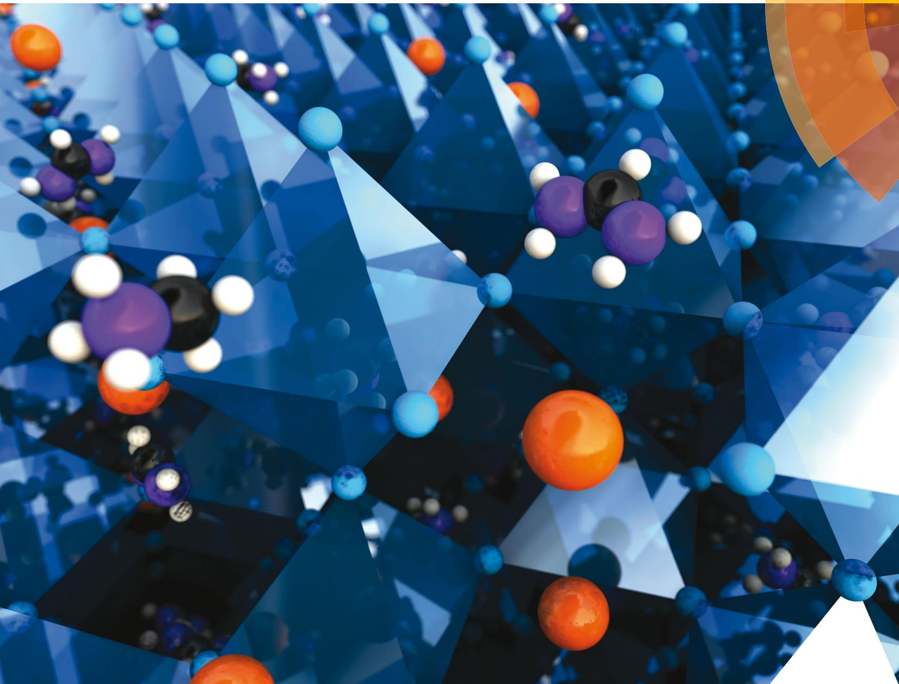  
ISSN 1754-5692

# COMMUNICATION

View Article Online

View Journal | View Issue

Cite this: Ener2016, 9, 1989

Received 24th December 2015, Accepted 14th March 2016

DOI: 10.1039/c5ee03874j

www.rsc.org/ees

# Cesium-containing triple cation perovskite solar cells: improved stability, reproducibility and high efficiency†

Michael Saliba,‡*ab Taisuke Matsui,‡c Ji-Youn Seo,a Konrad Domanski,a Juan-Pablo Correa-Baena,d Mohammad Khaja Nazeeruddin,b Shaik M. Zakeeruddin,a Wolfgang Tress,a Antonio Abate,a Anders Hagfeldtd and Michael Gra¨tzela

Today’s best perovskite solar cells use a mixture of formamidinium and methylammonium as the monovalent cations. With the addition of inorganic cesium, the resulting triple cation perovskite compositions are thermally more stable, contain less phase impurities and are less sensitive to processing conditions. This enables more reproducible device performances to reach a stabilized power output of $2 1 . 1 \%$ and $\sim 1 8 \%$ after 250 hours under operational conditions. These properties are key for the industrialization of perovskite photovoltaics.

# Introduction

Perovskite solar cells have attracted enormous interest in recent years with power conversion efficiencies (PCE) leaping from $3 . 8 \%$ in $2 0 0 9 ^ { 1 }$ to the current world record of $2 2 . 1 \%$ .2

An organic–inorganic perovskite material has an $\mathbf { A B X } _ { 3 }$ structure and is typically comprised of an organic cation, $\mathbf { A } =$ (methylammonium (MA) $\mathrm { C H } _ { 3 } \mathrm { N H } _ { 3 } ^ { + }$ ; formamidinium (FA) $\mathrm { C H } _ { 3 } ( \mathrm { N H } _ { 2 } ) _ { 2 } ^ { + } ) , ^ { 3 - 5 }$ a divalent metal, $\mathbf { B } = \bigl ( \mathbf { P b } ^ { 2 + } ; \mathbf { S n } ^ { 2 + } ; \mathbf { G e } ^ { 2 + } \bigr ) , ^ { 4 , 6 }$ and an anion $\mathbf { X } = ( \mathbf { C l } ^ { - } ;$ ; $\mathrm { B r } ^ { - }$ ; $\Gamma ^ { - }$ , $\mathrm { B F _ { 4 } } ^ { - }$ ; $\mathrm { P F } _ { 6 } ^ { - }$ ; $\mathbf { S C N } ^ { - }$ ).7–11 These perovskites can be processed using various techniques ranging from spin coating,4 dip coating,12 2-step interdiffusion,13 chemical vapour deposition,14 spray pyrolysis,15 atomic layer deposition,16 ink-jet printing,17 to thermal evaporation18,19 making them one of the most versatile photovoltaic (PV) technologies. The high performances of perovskite solar cells have been attributed to exceptional material properties such as remarkably high absorption over

a Laboratory of Photonics and Interfaces, Institute of Chemical Sciences and Engineering, E´cole Polytechnique Fe´de´rale de Lausanne, Lausanne CH-1015, Switzerland. E-mail: michael.saliba@epfl.ch   
b Group for Molecular Engineering of Functional Materials, Institute of Chemical Sciences and Engineering, E´cole Polytechnique Fe´de´rale de Lausanne, Sion CH-1951, Switzerland   
c Advanced Research Division, Materials Research Laboratory, Panasonic Corporation, 1006 Kadoma, Kadoma City, Osaka 571-8501, Japan   
d Laboratory of Photomolecular Science (LSPM) E´cole Polytechnique Fe´de´rale de Lausanne (EPFL), 1015 Lausanne, Switzerland   
† Electronic supplementary information (ESI) available. See DOI: 10.1039/c5ee03874j   
$^ { \ddagger }$ These authors contributed equally.

# Broader context

Due to their enormous potential for use in the future of photovoltaics, perovskite solar cells have attracted much attention recently. However, achieving stable and reproducible high efficiency results is a major concern towards industrialization. To date, the best perovskite solar cells use mixed organic cations (methylammonium (MA) and formamidinium (FA)) and mixed halides. Unfortunately, MA/FA compositions are sensitive to processing conditions because of their intrinsic structural and thermal instability. The films frequently contain detrimental impurities and tend to be less crystalline explaining the large variability observed by many. Adding small amounts of inorganic cesium (Cs) in a ‘‘triple cation’’ (Cs/ MA/FA) configuration results in highly monolithic grains of more pure perovskite. The films are more robust to subtle variations during the fabrication process enabling a breakthrough in terms of reproducibility where efficiencies larger than $2 0 \%$ are reached on a regular basis. Using this approach, efficiencies up to $2 1 . 1 \%$ (stabilized) and an output of $1 8 \%$ , even after 250 hours of aging under operational conditions are achieved. Therefore, triple (or multiple) cation mixtures are a novel compositional strategy on the road to industrialization of perovskite solar cells with better stabilities and repeatable high efficiencies.

the visible spectrum,6 low exciton binding energy,20,21 charge carrier diffusion lengths in the $\mu \mathrm { m }$ range,22–24 a sharp optical band edge, and a tuneable band gap from 1.1 to $2 . 3 \ \mathrm { \ e V }$ by interchanging the above cations,25,26 metals27,28 and/or halides.29 This has extended the scope of such perovskites towards lasing,30,31 light emitting devices,32 plasmonics,33,34 tandem solar cells,35,36 photodetectors37,38 and XRD detection.39

Using perovskites with mixed cations and halides has become important because the pure perovskite compounds suitable for PV applications, which are primarily $\mathbf { M A P b } \mathbf { X } _ { 3 }$ , $\mathrm { F A P b } { \mathrm { X } } _ { 3 }$ and $\mathrm { C s P b X _ { 3 } }$ $\mathbf { \Delta X } = \mathbf { B r }$ or I), come with numerous disadvantages.

$\mathbf { M A P b } \mathbf { I } _ { 3 }$ perovskites, for example, have never reached efficiencies larger than $2 0 \%$ despite the numerous attempts made since the early days of research in the field.1,4 Moreover, there are concerns with respect to the structural phase transition at $5 5 ~ ^ { \circ } \mathbf { C } , ^ { 2 8 }$ degradation upon contact with moisture, thermal stability,40,41 as well as light-induced trap-state formation and halide segregation in the case of ‘‘mixed halide’’ perovskites $\mathbf { M A P b B r } _ { x } \mathbf { I } _ { ( 3 - x ) } .$ .42

In principle, using $\mathrm { F A P b I } _ { 3 }$ instead of $\mathbf { M A P b } \mathbf { I } _ { 3 }$ is advantageous due to the reduced band gap, which is closer to the singlejunction optimum43 and would thus allow for higher solar light harvesting efficiency. However, pure $\mathrm { F A P b I } _ { 3 }$ lacks structural stability at room temperature as it can crystallize either into a photoinactive, non-perovskite hexagonal d-phase (‘‘yellow phase’’); or a photoactive perovskite $\propto$ -phase (‘‘black phase’’),28,44,45 which is sensitive to solvents or humidity.46

Alternatively, the often overlooked purely inorganic cesium leads trihalide perovskites to exhibit excellent thermal stability.47 However, $\mathrm { C s } \mathrm { P b } { \mathrm { B r } } _ { 3 }$ does not have an ideal band gap for PVs. The perovskite phase of $\mathrm { C s P b I } _ { 3 }$ on the other hand has a more suitable band gap of $1 . 7 3 \ \mathrm { e V } ^ { 4 8 }$ and has been investigated for its good emissive properties.49 Unfortunately, $\mathrm { C s P b I } _ { 3 }$ crystallizes in a photoinactive, orthorhombic d-phase (‘‘yellow phase’’) at room temperature and the photoactive perovskite phase (‘‘black phase’’) is only stable at temperatures above $3 0 0 ~ ^ { \circ } \mathrm { C }$ .48

Consequently, the pure perovskite compounds fall short mainly due to thermal or structural instabilities. Therefore, it has become an important design principle to mix cations and halides in order to achieve perovskite compounds with improved thermal and structural stability.

Indeed, the perovskites for the highest PCEs, using the ‘‘antisolvent method’’, have mixed cations and halides.46 Our group has followed a similar approach using the mixed ‘ $\mathbf { \Phi } ^ { \mathbf { \Lambda } } \mathbf { M } \mathbf { A } _ { 0 . 1 7 } \mathbf { F } \mathbf { A } _ { 0 . 8 3 } \mathbf { P } \mathbf { b } \big ( \mathbf { I } _ { 0 . 8 3 } \mathbf { B } \mathbf { r } _ { 0 . 1 7 } \big ) _ { 3 } ,$ ’ formulation that has reached efficiencies exceeding $1 8 \%$ for planar devices.35 Using this material, we have recently achieved a PCE of $2 0 . 2 \%$ with a novel hole transporter material $\left( \mathbf { H } \mathbf { T } \mathbf { M } \right) ^ { 5 0 }$ as well as $2 0 . 8 \%$ upon inclusion of lead excess.51 This shows that combining different cations can combine the advantages of the constituents while avoiding their drawbacks. The recent success of the MA/FA mixtures demonstrates that a small amount of MA is already sufficient to induce a preferable crystallization into the photoactive phase of FA perovskite resulting in a more thermally and structurally stable composition than the pure MA or FA compounds. This illustrates that the MA can be thought of as a ‘‘crystallizer’’ (or stabilizer) of the black phase FA perovskite. From this, we conclude that using smaller cations such as MA plays a key role in the formation of the structurally stable black phase FA perovskite. However, even with MA present, it is still challenging to obtain FA perovskite with no traces of the yellow phase as is frequently observed even for very high efficiency solar cells.25,46 These yellow phase impurities need to be avoided as even small quantities influence the crystal growth and morphology of the perovskite inhibiting efficient charge collection and thereby limiting the performance of the devices.

One cation that has recently attracted attention in mixed cation perovskites is the inorganic cesium (Cs) with an ionic radius of 1.81 Å, which is considerably smaller than MA (2.70 Å) or FA (2.79 Å).52 To date, only a few reports investigate the effect of cation mixtures with Cs. Choi et al. present Cs/MA mixtures which prove, in principle, that embedding small amounts of Cs in a $\mathbf { M A P b } \mathbf { I } _ { 3 }$ structure can result in a stable perovskite film reaching $8 \%$ PCE.53 Furthermore, Park and co-workers report on Cs/FA mixtures showing enhanced thermal and humidity

stability, reaching a PCE of $1 6 . 5 \%$ .54 The improved structural stability is explained by Yi et al. who showed that Cs is effective in assisting the crystallisation of the black phase in FA perovskite due to entropic stabilisation.55 In that work the halides (Br and I) are also mixed resulting in PCEs up to $1 8 \%$ . McMeekin et al. also found that a similar composition, with a shifted band gap, is particularly suitable for perovskite– silicon tandems.56 While this manuscript was being prepared, another study by Li et al. found that the effective ionic radius of the Cs/FA cation can be used to fine-tune the Goldschmidt tolerance factor towards more structurally stable regions.57,58 From this, it is evident that Cs is very effective in ‘‘pushing’’ FA into the beneficial black perovskite phase due to the large size difference between Cs and FA. MA on the other hand also induces the crystallisation of FA perovskite but at a much slower rate (because MA is only slightly smaller than FA) which still permits a large fraction of the yellow phase to persist. As already mentioned, such MA/FA compounds already show impressive PCEs and thus the advancement of these compounds is a likely avenue in the advancement of perovskite solar cells in general.

Hence, this gives rise to our novel strategy of using a triple $\mathbf { C s / M A / F A }$ cation mixture where Cs is used to improve MA/FA perovskite compounds further. We hypothesize and show that already a small amount of Cs is sufficient to effectively suppress yellow phase impurities permitting the preparation of more pure, defect-free perovskite films.

We demonstrate that the use of all three cations, Cs, MA, and FA, provides additional versatility in fine-tuning high quality perovskite films that can yield stabilized PCEs exceeding $2 1 \%$ and $\sim 1 8 \%$ after 250 hours under operational conditions. The triple cation perovskite films are thermally more stable and less affected by fluctuating surrounding variables such as temperature, solvent vapours or heating protocols. This robustness is important for reproducibility, which is one of the (often underappreciated) key requirements for cost-efficient large scale manufacturing of perovskite solar cells.

# Results and discussion

We investigated triple cation perovskites of the generic form $\mathrm { ^ { \ast } C s } _ { x } \big ( \mathbf { M A } _ { 0 . 1 7 } \mathbf { F A } _ { 0 . 8 3 } \big ) _ { ( 1 0 0 - x ) } \mathbf { P b } \big ( \mathrm { I } _ { 0 . 8 3 } \mathbf { B r } _ { 0 . 1 7 } \big ) _ { 3 } \mathrm { ^ { \ast } } ,$ abbreviated for convenience as $\mathbf { \mathrm { C s } } _ { x } \mathbf { M }$ from here $x$ is in percentage throughout the manuscript), where M stands for ‘‘mixed perovskite’’. $\mathbf { \mathrm { C s } _ { 0 } M }$ , i.e. no Cs, is the basic composition for the best state-of-the-art devices.2 We note that these compositions refer to the precursor that also contains a lead excess as reported elsewhere.51,59 All preparation details are given in the ESI.†

# Film characterisation

In Fig. 1a, we show X-ray diffraction (XRD) data for $\mathbf { C } _ { x } \mathbf { M }$ with $x = 0$ , 5, 10, $1 5 \%$ . All compositions exhibit a typical perovskite peak at ${ \sim } 1 4 ^ { \circ }$ . For $\mathbf { \mathrm { C s } _ { 0 } M }$ , we also note the small side peaks at $1 1 . 6 ^ { \circ }$ and $1 2 . 7 ^ { \circ }$ corresponding to the photoinactive hexagonal d-phase of $\mathrm { F A P b I } _ { 3 }$ and the cubic $\mathrm { P b } \mathbf { I } _ { 2 }$ , respectively. This is a very

typical observation for the mixed perovskite composition showing incomplete conversion of the FA perovskite into the photoactive black phase. Upon addition of small amounts of Cs from 0, 5, 10, to $1 5 \%$ , the yellow phase and the $\mathrm { P b I } _ { 2 }$ peak disappear completely. Moreover, the absorption and photoluminescence (PL) spectra in Fig. 1b are blue-shifted by $\sim 1 0 \ \mathrm { n m }$ from $\mathrm { C s } _ { 0 } \mathbf { M }$ to $\mathbf { C } s _ { 1 5 } \mathbf { M }$ . In Fig. S1 $\left( \mathrm { E S I \dag } \right)$ , we also show top view scanning electron microscopy (SEM) images for the $\mathbf { \mathrm { C s } } _ { x } \mathbf { M }$ series.

The data in Fig. 1 are consistent with the Cs cation being integrated into the perovskite lattice. The influence of the smaller Cs on the MA/FA combination leads to a lowering of the effective Cs/MA/FA cation radius in the new perovskite compound. This shifts the tolerance factor towards a cubic lattice structure that matches the black perovskite phase. Now, the photoactive black phase is entropically stabilized at room temperature, resulting in a suppression of the hexagonal yellow phase of FA perovskite (which is not entropically stabilized at room temperature anymore). This explanation is in good agreement with the recent reports of Li et al.,57 Yi et al.,55 and Lee et al.54 who used Cs/FA mixtures as the effective cation. Interestingly, Li et al. observe phase separation at relatively high Cs concentrations, which is attributed to the large size mismatch between Cs and FA. Using a mixture of three cations may alleviate this constraint because the relative size differences of the cations are smaller which in turn could decrease the entropic preference for phase separation.

The suppression of the yellow phase in the $\mathbf { \mathrm { C s } } _ { x } \mathbf { M }$ series is noteworthy because the $\mathbf { \mathrm { C s } _ { 0 } M }$ perovskite already shows extraordinarily high PCEs that have resulted from a very laborious optimisation process (including the electron and hole extracting layers). Thus, finding another variable that can improve the transition into the black phase without affecting the other parameters is very important for further developments. This is especially true as we are getting closer to the theoretical Shockley–Queisser limit of $\sim 3 0 \%$ for a single junction PSC with a band gap of $1 . 5 5 ~ \mathrm { e V }$ .43

We characterize $\mathbf { \mathrm { C s } } _ { x } \mathbf { M }$ further by assessing its thermal stability and choose, for simplicity, to only compare $\mathbf { \mathrm { C s } _ { 0 } M }$ and $\mathbf { \mathrm { C s } _ { 1 0 } M }$ in the following (because we initially measured the best device performance close to $2 1 \%$ on a $\mathbf { C } s _ { 1 0 } \mathbf { M }$ device, see Fig. S6a, ESI†). In Fig. 2, we show films of $\mathbf { \mathrm { C s } _ { 0 } M }$ and $\mathbf { \mathrm { C s } _ { 1 0 } M }$ kept at $1 3 0 ~ ^ { \circ } \mathrm { C }$ for 3 hours in dry air. It is evident from the inset images that the perovskite films without Cs (Fig. 2a) start bleaching after this aggressive thermal stress test as evidenced by the decreased absorption spectrum. $\mathbf { \mathrm { C s } _ { 1 0 } M }$ on the other hand retains the dark black colour and does not bleach noticeably (see Fig. 2b); albeit some degradation is visible but it is much less pronounced than for $\mathbf { \mathrm { C s } _ { 0 } M }$ . Thus, we conclude an improved thermal stability for the $\mathbf { C s _ { 1 0 } M }$ films. In the $\mathbf { E S I \dagger }$ Note 1, we show XRD data for different cationic mixtures. Fig. S2 $\left( \mathrm { E S I \dag } \right)$ shows $\mathbf { \mathrm { C s } _ { 0 } M }$ and $\mathbf { \mathrm { C s } _ { 1 0 } M }$ films at different times during the $1 3 0 ~ ^ { \circ } \mathrm { C }$ aging procedure revealing that the Cs-containing films degrade less quickly. Fig. S3 (ESI†) shows an MA-free version of our champion recipe, i.e. $\mathrm { \mathrm { \mathrm { \mathrm { \mathrm { \Lambda } ^ { 4 \mathrm { \prime } } C S _ { 0 . 1 0 } F A _ { 0 . 9 0 } P b } \big ( I _ { 0 . 8 3 } B r _ { 0 . 1 7 } \big ) _ { 3 } } } } ,$ ’ after $4 \ \mathrm { h }$ at $1 3 0 ~ ^ { \circ } \mathrm { C }$ revealing rapid degradation compared to the similar $\mathrm { C S _ { 0 . 1 7 } F A _ { 0 . 8 3 } P b ( I _ { 0 . 6 0 } B r _ { 0 . 4 0 } ) _ { 3 } }$ compound.56 Therefore, we conclude that Cs increases the thermal stability for a fixed halide ratio and also note that an increased Br content contributes considerably to thermal stability.

Furthermore, we investigate the film formation dependence on processing conditions in the glove box. Fig. 2c reveals that, unsurprisingly, $\mathbf { \mathrm { C s } _ { 0 } M }$ does not form a perovskite phase directly after deposition (without the annealing step) as can be seen from the absorbance data, which do not show the characteristic perovskite absorption onset. This is confirmed by the inset image (showing that the film remains red) and the corresponding XRD data that do not exhibit the characteristic perovskite peak at ${ \sim } 1 4 ^ { \circ }$ . On the other hand, the same deposition conditions for $\mathbf { \mathrm { C s } _ { 1 0 } M }$ yield a clear black perovskite phase as evidenced by the film’s colour, the absorption spectrum and the perovskite peak in the inset XRD pattern confirming that Cs induces the black phase at room temperature. We hypothesize

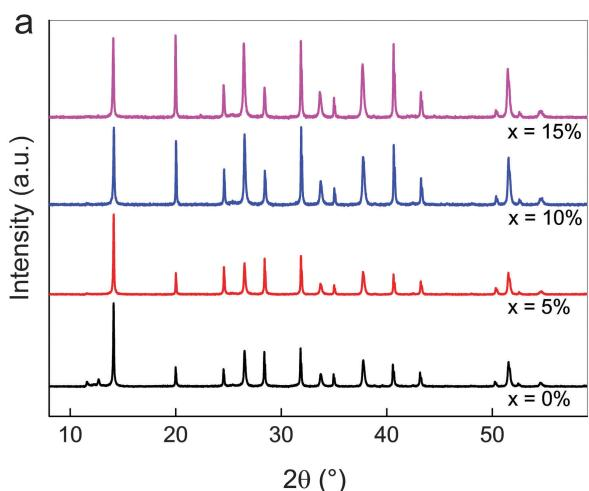

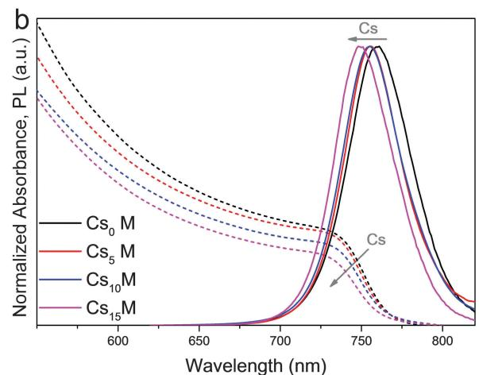  
Fig. 1 XRD and optical characterisation of ${ \mathsf { C } } { \mathsf { S } } _ { X } { \mathsf { M } }$ compounds. (a) XRD spectra of perovskite upon addition of Cs investigating the series $\mathsf { C S } _ { x } ( \mathsf { M A } _ { 0 . 1 7 } \mathsf { F A } _ { 0 . 8 3 } ) _ { ( 1 - x ) } \mathsf { P b } ( \mathsf { I } _ { 0 . 8 3 } \mathsf { B r } _ { 0 . 1 7 } ) _ { 3 } ,$ , abbreviated as ${ \mathsf { C } } { \mathsf { S } } _ { X } { \mathsf { M } }$ where M stands for ‘‘mixed perovskite’’. ${ \mathsf { C s } } _ { x } M$ with $x = 0 .$ , 5, 10, $1 5 \%$ . (b) The corresponding (dashed lines) and photoluminescence (PL) spectra (solid lines).

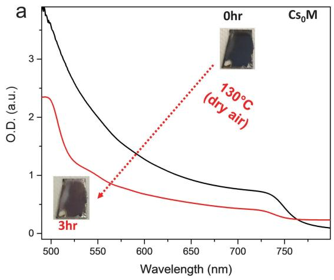

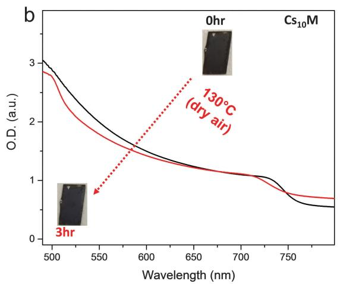

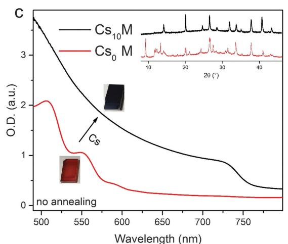

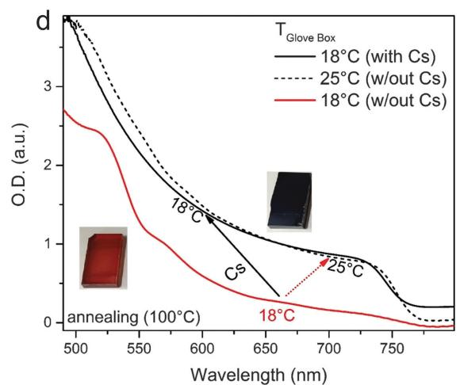  
Fig. 2 Thermal stability and film formation dependence on processing conditions. UV-visible absorption of ${ \mathsf { C s } } _ { 0 } M$ (a) and ${ \mathsf { C s } } _ { 1 0 } M$ (b) films annealed at $1 3 0 ~ ^ { \circ } \mathsf { C }$ for 3 hours in dry air with the corresponding images. (c) Absorption spectra of as-fabricated films (at room temperature) without the subsequent annealing step, the ${ \mathsf { C s } } _ { 0 } M$ film is red (red line, image of red film). Upon addition of cesium, the ${ \mathsf { C s } } _ { 1 0 } M$ film turns black (black line, image of black film). The inset XRD data show that ${ \mathsf { C s } } _ { 1 0 } M$ has the characteristic perovskite pattern whereas ${ \mathsf { C s } } _ { 0 } M$ does not. (d) When the spin coating processing temperature, TGlove box, is kept at ${ 1 8 } \ ^ { \circ } \mathsf C ,$ ${ \mathsf { C s } } _ { 0 } M$ does not form a perovskite phase even after annealing at $1 0 0 ~ ^ { \circ } \mathsf { C }$ for 1 hour (solid red line). The perovskite phase forms, however, when using a processing temperature of $2 5 ^ { \circ } \mathsf { C }$ (dashed black line). ${ \mathsf { C s } } _ { 1 0 } M$ forms readily the perovskite phase at $1 8 ~ ^ { \circ } \mathsf { C }$ (solid black line). The inset images show representative ${ \mathsf { C s } } _ { 0 } M$ films at $1 8 ~ ^ { \circ } \mathsf { C }$ (red), ${ 2 5 ^ { \circ } } \mathsf { C }$ (black); or for ${ \mathsf { C s } } _ { 1 0 } M$ at $1 8 ~ ^ { \circ } \mathsf { C }$ (black).

therefore that the Cs containing system is less sensitive to temperature variations in the heating protocol or the precise temperature in the glove box at the very beginning of the perovskite film formation. We verified this hypothesis by spin-coating $\mathbf { \mathrm { C s } _ { 0 } M }$ and $\mathbf { \mathrm { C s } _ { 1 0 } M }$ precursor solutions in a temperature-controlled, nitrogen-filled glove box setting the temperature to $1 8 ~ ^ { \circ } \mathrm { C }$ and $2 5 ~ ^ { \circ } \mathrm { C }$ with the subsequent annealing of the perovskite films at $1 0 0 ~ ^ { \circ } \mathrm { C }$ for 1 hour. The results are shown in Fig. 2d. At $1 8 ~ ^ { \circ } \mathrm { C }$ , the $\mathbf { \mathrm { C s } _ { 0 } M }$ perovskite precursor does not yield the black phase; it remains red and resembles the non-annealed films as shown in Fig. 2c despite heating at $1 0 0 ~ ^ { \circ } \mathrm { C }$ for 1 hour. On the other hand, the $\mathbf { \mathrm { C s } _ { 1 0 } M }$ turns black directly after spin coating and remains in the black phase after the 1 hour annealing step. Increasing the temperature of the glove box by $7 \ { } ^ { \circ } \mathbf { C }$ towards $2 5 ~ ^ { \circ } \mathrm { C }$ is already sufficient to induce the black phase formation in the $\mathbf { \mathrm { C s } _ { 0 } M }$ perovskite as can be seen from the absorbance data. This last point is especially interesting as it may help in identifying possible ‘‘hidden’’

variables during the manufacturing process, which are not taken into account adequately because their relevance is not appreciated sufficiently yet. Hence, we can already conclude that adding Cs benefits MA/FA perovskites in terms of suppression of the yellow phase, thermal stability and ‘‘robustness’’ to temperature variations during processing. In the next section, we present the application of these triple cation perovskite films in solar cells.

# Device characterisation

As illustrated in the cross-sectional SEM images in Fig. 3, the solar cell architecture used is a stack of glass/fluorine-doped tin oxide/compact $\mathrm { T i O } _ { 2 } / \mathrm { L i }$ -doped mesoporous $\mathrm { T i O } _ { 2 } ^ { 5 9 } /$ /perovskite/ spiro-OMeTAD/gold. All fabrication details can be found in the ESI.†

For the first optimisation, we use the above $\mathbf { \mathrm { C s } } _ { x } \mathbf { M }$ series and present current density–voltage $( J V )$ scans in Fig. S4 and Table S1, ESI. $^ \dagger$ The efficiency for our baseline on this batch of devices was

just below $1 7 \%$ with respectable currents of $\sim 2 0 \mathrm { m A c m } ^ { - 2 }$ . Open circuit voltages in general were relatively high reaching 1.1 V. The main parameter lacking was the fill factor at 0.7. As the Cs is added, the series improves mainly in the fill factor reaching 0.77 at optimum $x = 1 0 \%$ .

With three cations present, the parameter space for possible compositions increases accordingly (especially considering that the halide ratio could be tuned as well). Thus, in $\mathbf { E S I \dagger }$ Note 2, together with Fig. S5 and Table S2 (ESI†), we vary the ratio of Cs : MA for the $\mathbf { \mathrm { C s } _ { 1 0 } M }$ composition while keeping FA fixed. We show that the resulting device data have an optimum with both Cs and MA present indicating that the presence of both Cs and MA is highly relevant. Although we initially achieved our highest PCE with $\mathbf { \mathrm { C s } _ { 1 0 } M }$ , we found later that we reach slightly more consistent and equally high values with $\mathbf { C } s _ { 5 } \mathbf { M }$ (not shown here). In a next step, we compare the cross-sectional SEM images of a full $\mathbf { \mathrm { C s } _ { 0 } M }$ (Fig. 3a) and $\mathbf { C } s _ { 5 } \mathbf { M }$ (Fig. 3b and c) device. Interestingly, we observe that the perovskite grains for the $\mathbf { C } \mathbf { S } _ { 5 } \mathbf { M }$ devices are more monolithic, i.e. they tend to go from bottom to top. For $\mathbf { \mathrm { C s } _ { 0 } M }$ , the grains tend to stack on top of each other. This could be a first reason for the superior and more consistent device performances of $\mathbf { C } s _ { 5 } \mathbf { M }$ because more uniform grains enable better charge transport, which explains the higher fill factor. We hypothesize that the film formation is assisted by the addition of Cs inducing perovskite seeds already at room temperature. These seeds in turn become nucleation sites for further growth during the crystallisation leading to more uniform grains. A similar process was recently reported by Li et al. where MAI-modified PbS nanoparticles acted as seeds for crystal growth

of highly uniform perovskite films.60 This presumed mechanism is supported by the fact that the Cs-based films are already black at room temperature with the XRD data showing a pronounced perovskite peak (see the inset of Fig. 2c). However, we note that more research is necessary to fully characterise and prove the precise crystallisation mechanism.

One important aspect of perovskite solar cell research and development is manufacturability (production capacity and yields) without large batch-to-batch variations which, unfortunately, can be the case for the MA/FA mixtures. This has been hampering the entire research field and it is hard to pinpoint ‘‘hidden’’ variables influencing this system (apart from preparative errors). Simply put, perovskite solar cells can only be a serious contender in the PV industry if they can be shown to be long-term stable (towards which the Cs containing perovskites may contribute greatly as pointed out in the thermal stability tests in Fig. 2a and b) and at the same time manufactured in a reproducible way at a large scale.

Table S3 $\bigl ( \mathrm { E S I \dag } \bigr )$ is especially instructive in elucidating this point. In this experiment, we fixed the FA ratio to $8 3 \%$ and varied the remaining Cs : MA ratio from 0 (no Cs) to $1 7 \%$ (no MA). $\mathbf { \mathrm { C s } _ { 0 } M }$ , which corresponds to $8 3 \%$ FA and $1 7 \%$ MA, should in principle result in high efficiency control devices. However, we had a ‘‘bad batch’’ with low device efficiencies $\cdot < 1 5 \%$ PCE) without any easily discernible explanation. Interestingly, upon addition of Cs, the device performances improved towards reasonable efficiencies of about $1 6 \%$ . We believe that this is an important hint to the cause of the variability observed for MA/FA mixtures by so many groups, including ours. As we have

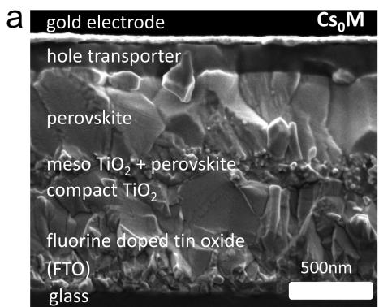

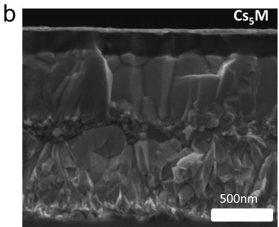

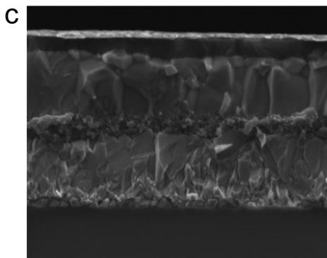

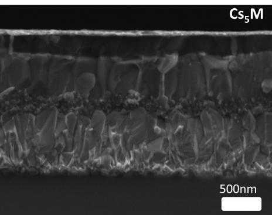  
Fig. 3 Cross-sectional scanning electron microscopy (SEM) images of (a) ${ \mathsf { C s } } _ { 0 } M$ (b) ${ \mathsf { C s } } _ { 5 } { \mathsf { M } }$ and (c) low magnification ${ \mathsf { C s } } _ { 5 } M$ devices.

noted in Fig. 2c and d, the stabilisation of the black phase of FA perovskite with MA alone is very sensitive to the temperature at the beginning of the crystallisation process.

This could cause large deviation even within the same batch as the processing temperature may have changed during the fabrication. It is plausible that other variables, such as solvent vapours, affect the MA/FA perovskite composition strongly as well. Therefore, the MA/FA composition puts very narrow constraints on the manufacturing process as extreme care and precision is required in order to obtain high quality perovskite films. This is not a robust manufacturing protocol and therefore not suitable for industrial-scale manufacturing, where widening the parameter tolerance for high quality perovskite films translates into a higher likelihood for economic feasibility of the process. In the case of the ‘‘bad batch’’, we deduced that temperature in the glove box was artificially low on the day of fabrication due to maintenance reasons, which highlights the need to have precise temperature control when using MA/FA mixtures.

Upon reinstating the previous operation conditions, we conducted a large scale test with the $\mathbf { C } s _ { 5 } \mathbf { M }$ composition. Fig. 4 shows the device statistics (open circuit voltage, short circuit current, fill factor and PCE) of 40 controls $\mathbf { ( { C s _ { 0 } M } ) }$ and 98 $\mathbf { C } s _ { 5 } \mathbf { M }$ devices collected over 18 different batches (prepared by three different people). We note improvements in all device parameters and especially in the standard deviation (S.D.), which is a metric for the reproducibility: the $V _ { \mathrm { o c } }$ improved from $1 1 2 1 \pm 2 5$ $\left( n = 4 0 \right)$ to $1 1 3 2 \pm 2 5 ~ \mathrm { m V }$ $\left( n = 9 8 \right)$ , the $J _ { \mathrm { s c } }$ improved

from $2 1 . 0 6 \pm 1 . 5 3$ to $2 2 . 6 9 \pm 0 . 7 5 ~ \mathrm { m A } ~ \mathrm { c m } ^ { - 2 }$ , the FF improved from $0 . 6 9 3 \pm 0 . 0 2 8$ to $0 . 7 4 8 \pm 0 . 0 1 8$ , and the PCE improved from $1 6 . 3 7 \pm 1 . 4 9$ to $1 9 . 2 0 \pm 0 . 9 1 \%$ . 20 independent devices show efficiencies $> 2 0 \%$ .

In Fig. 5a, we show our highest stabilized PCE exceeding $2 1 \%$ . The inset depicts the stabilized power output under maximum power point tracking reaching $2 1 . 1 \%$ (at $9 6 0 \ \mathrm { m V } )$ ) which is in good agreement with the $J V$ scans.

In Fig. S6a and b (together with Fig. S7, and Tables S5 and S6, ESI†), we show more high performance devices verifying the reproducibility of our devices. The voltage scan rate for all scans was $1 0 \mathrm { \ m V \ } s ^ { - 1 }$ and no device preconditioning, such as light soaking or forward voltage bias applied for a long time, was applied before starting the measurement. This resembles quasi steady-state conditions as suggested by Unger et al. and Kamat and co-workers.61,62 Additionally, in Fig. S8 (ESI†) we show another $\mathbf { C } s _ { 5 } \mathbf { M }$ device measured with different scan speeds to illustrate further that the slow scan speeds are reliable for devices with small hysteresis. We note the exceptionally high fill factors reaching up to $\sim 0 . 8$ , values rarely reached even for the highest performances. We predict that this composition can be the basis for $> 2 1 . 1 \%$ devices in the future using simple manufacturing improvements.

Furthermore, in Fig. 5b we investigate long-term device stability of a high performance $\mathbf { \mathrm { C s } _ { 0 } M }$ and $\mathbf { C } s _ { 5 } \mathbf { M }$ device in a nitrogen atmosphere held at room temperature under constant illumination and maximum power point tracking. The maximum

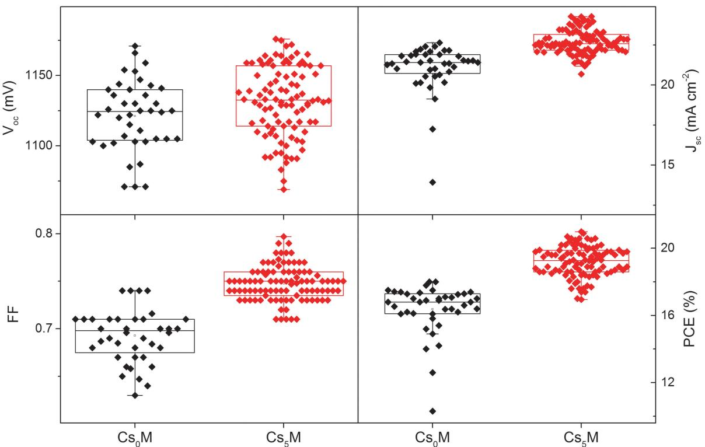  
Fig. 4 Statistics of 40 controls $( \mathsf { C s } _ { 0 } M )$ and 98 Cs-based $( \mathsf { C s } _ { 5 } \mathsf { M } )$ devices as collected over 18 different batches. We note that all device parameters and the standard deviation (S.D.), a metric for the reproducibility, improved: the $V _ { \mathrm { { o c } } }$ improved from $1 1 2 1 \pm 2 5$ $h = 4 0 )$ ) to $1 1 3 2 \pm 2 5 \mathrm { m V }$ $( n = 9 8 )$ , the $\scriptstyle { \mathcal { J } } _ { \mathsf { s c } }$ improved from $2 1 . 0 6 \pm 1 . 5 3$ to $2 2 . 6 9 \pm 0 . 7 5 \mathrm { m A c m } ^ { - 2 }$ , the FF improved from $0 . 6 9 3 \pm 0 . 0 2 8$ to $0 . 7 4 8 \pm 0 . 0 1 8$ , and the PCE improved from $1 6 . 3 7 \pm 1 . 4 9$ to $1 9 . 2 0 \pm$ $0 . 9 1 \%$ . 20 independent devices show efficiencies $> 2 0 \%$ .

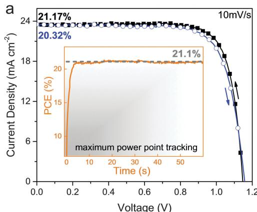

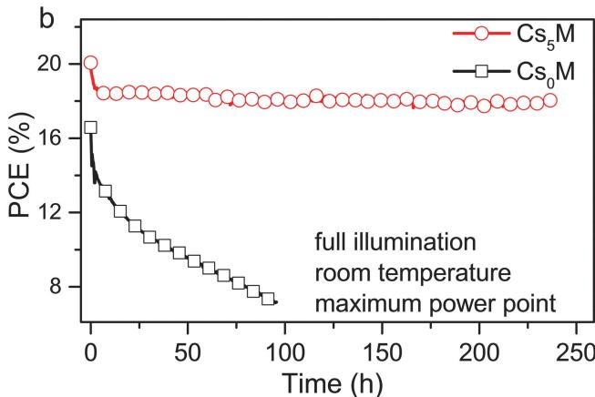  
Fig. 5 JV and stability characteristics (a) current–voltage scans for the best performing ${ \mathsf { C s } } _ { 5 } M$ device showing PCEs exceeding $21 \%$ . The full hysteresis loop is reported in Table S4 (ESI†). The inset shows the power output under maximum power point tracking for $6 0 \ 5 ,$ starting from forward bias and resulting in a stabilized power output of $2 1 . 1 \%$ (at $9 6 0 ~ \mathrm { m V } )$ . The voltage scan rate for all scans was $1 0 \mathrm { m V s ^ { - 1 } }$ and no device preconditioning, such as light soaking or forward voltage bias applied for a long time, was applied before starting the measurement. (b) Aging for $^ { 2 5 0 \mathrm { h } }$ of a high performance ${ \mathsf { C s } } _ { 5 } { \mathsf { M } }$ and ${ \mathsf { C s } } _ { 0 } M$ devices in a nitrogen atmosphere held at room temperature under constant illumination and maximum power point tracking. The maximum power point was updated every 60 s by measuring the current response to a small perturbation in potential. A JV scan was taken periodically to extract the device parameters. This aging test resembles sealed devices under realistic operational conditions (as opposed to ‘‘shelf stability’’ of devices kept in a dry atmosphere in the dark and measured periodically). The device efficiency of ${ \mathsf { C s } } _ { 5 } M$ drops from $20 \%$ to $\sim 1 8 \%$ (red curve, circles) where it stays relatively stable for at least 250 h. This is not the case for ${ \mathsf { C s } } _ { 0 } M$ (black curve, squares).

power point was updated every 60 s by measuring the current response to a small perturbation in potential. A JV scan was taken periodically to extract the observed device parameters. This aging protocol resembles sealed devices under realistic operational conditions (as opposed to ‘‘shelf stability’’ of devices kept in a dry atmosphere in the dark and measured periodically). The device efficiency of $\mathrm { C s } _ { 5 } \mathrm { M }$ drops within a few hours from $2 0 \%$ to $\sim 1 8 \%$ where it stays stable for at least $2 5 0 { \mathrm { ~ h ~ } }$ . The $\mathrm { C s } _ { 0 } \mathbf { M }$ device, on the other hand, shows much less stable behaviour. This biexponential decay behaviour is in agreement with our previous work where we extract a half-life parameter as a long-term metric for stability.63 In our case the $\mathrm { C s } _ { 5 } \mathrm { M }$ device has a slow half-life component of $\sim 5 0 0 0 \mathrm { ~ h ~ }$ which is one of the highest values reported for the comparable system of high efficiency perovskite solar cells (see Table S7, ESI†).

This indicates that the film stabilities from above correlate with improved device stabilities. The other device parameters ( Jsc, $V _ { \mathrm { o c } }$ and FF) are shown in Fig. S9 $\left( \mathrm { E S I \dag } \right)$ . It is noteworthy that the current and voltage do not decrease significantly and that most degradation stems from the fill factor. This could potentially be remedied by choosing a suitable HTM or advanced sealing techniques as fill factor losses can stem from decreased conductivity of a degraded organic HTM.63–65 In Fig. S10 (ESI†), we show more control devices. We observe that none of the high performing $\mathbf { \mathrm { C s } _ { 0 } M }$ devices $\left( 1 6 \mathrm { - } 1 8 \% \right)$ was as stable as the best Cs devices and especially the current degraded significantly over time. The stability tests are not complete yet and more data (which are very time-consuming for aging tests) are needed for a full study on the long term potential of the triple cation compositions.

These stability data are noteworthy because they were collected on some of the highest performing devices in the field and to our knowledge this is the first test where a state-of-the-art $2 0 \%$ device

was aged (which is more likely to show a pronounced loss compared to a lower performing device) demonstrating the great potential of perovskite solar cells for industrial applications.

# Conclusion

This work, for the first time, used a mixture of a triple Cs/MA/ FA cation, to achieve high efficiency perovskite solar cells with a stabilized PCE at $2 1 . 1 \%$ and an output at $1 8 \%$ under operational conditions after 250 hours (maximum power point tracking under full illumination held at room temperature). Adding Cs to MA/FA mixtures, which are currently reported as the best performing devices, suppresses yellow phase impurities and induces highly uniform perovskite grains extending from the electron to the hole collecting layer consistent with seed-assisted crystal growth.

The triple cation perovskites are also more robust to subtle variations during the fabrication process enabling a breakthrough in terms of reproducibility where PCEs $> 2 0 \%$ were reached on a regular basis. This work also opens the prospect for other alkali metals, such as Li, Na, K and Rb, to be explored as cations for perovskites. Therefore, triple (or multiple) cation mixtures are a novel compositional strategy on the road to industrialization of perovskite solar cells.

# Author contribution

M. S. and T. M. conceived and designed the overall experiments. J.-Y. S. and J.-P. C.-B. conducted SEM, PL and XRD experiments on the perovskite films. K. D. and W. T. conducted long-term aging tests on the devices. M. S., T. M., J.-P. C.-B. and A. A. prepared and

characterised PV devices. M. S. wrote the first draft of the paper. All authors contributed to the discussion and writing of the paper.

# Acknowledgements

M. S. acknowledges support from the co-funded Marie Skłodowska Curie fellowship, H2020 Grant agreement no. 665667. A. A. received funding from the European Union’s Seventh Framework Programme for research, technological development and demonstration under grant agreement no. 291771. M. G. thanks the financial support from the Swiss National Science Foundation, the SNSF-NanoTera (SYNERGY) and Swiss Federal Office of Energy (SYNERGY), CCEM-CH in the 9th call proposal 906: CONNECT PV, the SNSF NRP70 ‘‘Energy Turnaround’’, the King Abdulaziz City for Science and Technology (KACST) and the European Union’s Horizon 2020 research and innovation programme under the grant agreement No 687008 is gratefully acknowledged. M. K. N. acknowledges funding by the Swiss National Science Foundation under NRP 70, grant No 407040_154056; CEPF VS – Funds No 563068 & 563083; QEERI T1 PV – Funds No 531224. The information and views set out in this article are those of the author(s) and do not necessarily reflect the official opinion of the European Union. Neither the European Union institutions and bodies nor any person acting on their behalf may be held responsible for the use which may be made of the information contained herein.

# References

1 A. Kojima, K. Teshima, Y. Shirai and T. Miyasaka, J. Am. Chem. Soc., 2009, 131, 6050–6051.   
2 NREL chart, http://www.nrel.gov/ncpv/images/efficiency_ chart.jpg, Accessed 13.03.2016, 2016.   
3 T. M. Koh, K. W. Fu, Y. N. Fang, S. Chen, T. C. Sum, N. Mathews, S. G. Mhaisalkar, P. P. Boix and T. Baikie, J. Phys. Chem. C, 2014, 118, 16458–16462.   
4 M. M. Lee, J. Teuscher, T. Miyasaka, T. N. Murakami and H. J. Snaith, Science, 2012, 338, 643–647.   
5 H. S. Kim, C. R. Lee, J. H. Im, K. B. Lee, T. Moehl, A. Marchioro, S. J. Moon, R. Humphry-Baker, J. H. Yum, J. E. Moser, M. Gratzel and N. G. Park, Sci. Rep., 2012, 2, 591.   
6 F. Hao, C. C. Stoumpos, D. H. Cao, R. P. H. Chang and M. G. Kanatzidis, Nat. Photonics, 2014, 8, 489–494.   
7 C. H. Hendon, R. X. Yang, L. A. Burton and A. Walsh, J. Mater. Chem. A, 2015, 3, 9067–9070.   
8 J. H. Heo, D. H. Song and S. H. Im, Adv. Mater., 2014, 26, 8179–8183.   
9 Q. Jiang, D. Rebollar, J. Gong, E. L. Piacentino, C. Zheng and T. Xu, Angew. Chem., 2015, 54, 7617–7620.   
10 S. Nagane, U. Bansode, O. Game, S. Chhatre and S. Ogale, Chem. Commun., 2014, 50, 9741–9744.   
11 P. Prajongtat and T. Dittricht, J. Phys. Chem. C, 2015, 119, 9926–9933.   
12 J. Burschka, N. Pellet, S. J. Moon, R. Humphry-Baker, P. Gao, M. K. Nazeeruddin and M. Gratzel, Nature, 2013, 499, 316–319.

13 Z. G. Xiao, C. Bi, Y. C. Shao, Q. F. Dong, Q. Wang, Y. B. Yuan, C. G. Wang, Y. L. Gao and J. S. Huang, Energy Environ. Sci., 2014, 7, 2619–2623.   
14 Q. Chen, H. Zhou, Z. Hong, S. Luo, H. S. Duan, H. H. Wang, Y. Liu, G. Li and Y. Yang, J. Am. Chem. Soc., 2014, 136, 622–625.   
15 A. T. Barrows, A. J. Pearson, C. K. Kwak, A. D. F. Dunbar, A. R. Buckley and D. G. Lidzey, Energy Environ. Sci., 2014, 7, 2944–2950.   
16 B. R. Sutherland, S. Hoogland, M. M. Adachi, P. Kanjanaboos, C. T. Wong, J. J. McDowell, J. Xu, O. Voznyy, Z. Ning, A. J. Houtepen and E. H. Sargent, Adv. Mater., 2015, 27, 53–58.   
17 Z. Wei, H. Chen, K. Yan and S. Yang, Angew. Chem., 2014, 53, 13239–13243.   
18 M. Liu, M. B. Johnston and H. J. Snaith, Nature, 2013, 501, 395–398.   
19 O. Malinkiewicz, A. Yella, Y. H. Lee, G. M. Espallargas, M. Graetzel, M. K. Nazeeruddin and H. J. Bolink, Nat. Photonics, 2014, 8, 128–132.   
20 Q. Q. Lin, A. Armin, R. C. R. Nagiri, P. L. Burn and P. Meredith, Nat. Photonics, 2015, 9, 106–112.   
21 A. Miyata, A. Mitioglu, P. Plochocka, O. Portugall, J. T. W. Wang, S. D. Stranks, H. J. Snaith and R. J. Nicholas, Nat. Phys., 2015, 11, U582–U594.   
22 S. D. Stranks, G. E. Eperon, G. Grancini, C. Menelaou, M. J. Alcocer, T. Leijtens, L. M. Herz, A. Petrozza and H. J. Snaith, Science, 2013, 342, 341–344.   
23 G. Xing, N. Mathews, S. Sun, S. S. Lim, Y. M. Lam, M. Gratzel, S. Mhaisalkar and T. C. Sum, Science, 2013, 342, 344–347.   
24 Q. Dong, Y. Fang, Y. Shao, P. Mulligan, J. Qiu, L. Cao and J. Huang, Science, 2015, 347, 967–970.   
25 N. Pellet, P. Gao, G. Gregori, T. Y. Yang, M. K. Nazeeruddin, J. Maier and M. Gratzel, Angew. Chem., 2014, 53, 3151–3157.   
26 W. S. Yang, J. H. Noh, N. J. Jeon, Y. C. Kim, S. Ryu, J. Seo and S. I. Seok, Science, 2015, 348, 1234–1237.   
27 Y. Ogomi, A. Morita, S. Tsukamoto, T. Saitho, N. Fujikawa, Q. Shen, T. Toyoda, K. Yoshino, S. S. Pandey, T. Ma and S. Hayase, J. Phys. Chem. Lett., 2014, 5, 1004–1011.   
28 C. C. Stoumpos, C. D. Malliakas and M. G. Kanatzidis, Inorg. Chem., 2013, 52, 9019–9038.   
29 J. H. Noh, S. H. Im, J. H. Heo, T. N. Mandal and S. I. Seok, Nano Lett., 2013, 13, 1764–1769.   
30 G. Xing, N. Mathews, S. S. Lim, N. Yantara, X. Liu, D. Sabba, M. Gratzel, S. Mhaisalkar and T. C. Sum, Nat. Mater., 2014, 13, 476–480.   
31 M. Saliba, S. M. Wood, J. B. Patel, P. K. Nayak, J. Huang, J. A. Alexander-Webber, B. Wenger, S. D. Stranks, M. T. Horantner, J. T. Wang, R. J. Nicholas, L. M. Herz, M. B. Johnston, S. M. Morris, H. J. Snaith and M. K. Riede, Adv. Mater., 2016, 28, 923–929.   
32 Z. K. Tan, R. S. Moghaddam, M. L. Lai, P. Docampo, R. Higler, F. Deschler, M. Price, A. Sadhanala, L. M. Pazos, D. Credgington, F. Hanusch, T. Bein, H. J. Snaith and R. H. Friend, Nat. Nanotechnol., 2014, 9, 687–692.   
33 M. Saliba, W. Zhang, V. M. Burlakov, S. D. Stranks, Y. Sun, J. M. Ball, M. B. Johnston, A. Goriely, U. Wiesner and H. J. Snaith, Adv. Funct. Mater., 2015, 25, 5038–5046.

34 W. Zhang, M. Saliba, S. D. Stranks, Y. Sun, X. Shi, U. Wiesner and H. J. Snaith, Nano Lett., 2013, 13, 4505–4510.   
35 J. P. C. Baena, L. Steier, W. Tress, M. Saliba, S. Neutzner, T. Matsui, F. Giordano, T. J. Jacobsson, A. R. S. Kandada, S. M. Zakeeruddin, A. Petrozza, A. Abate, M. K. Nazeeruddin, M. Gratzel and A. Hagfeldt, Energy Environ. Sci., 2015, 8, 2928–2934.   
36 S. Albrecht, M. Saliba, J. P. C. Baena, F. Lang, L. Kegelmann, M. Mews, L. Steier, A. Abate, J. Rappich, L. Korte, R. Schlatmann, M. K. Nazeeruddin, A. Hagfeldt, M. Gratzel and B. Rech, Energy Environ. Sci., 2016, 9, 81–88.   
37 R. Dong, Y. Fang, J. Chae, J. Dai, Z. Xiao, Q. Dong, Y. Yuan, A. Centrone, X. C. Zeng and J. Huang, Adv. Mater., 2015, 27, 1912–1918.   
38 K. Domanski, W. Tress, T. Moehl, M. Saliba, M. K. Nazeeruddin and M. Gratzel, Adv. Funct. Mater., 2015, 25, 6936–6947.   
39 S. Yakunin, M. Sytnyk, D. Kriegner, S. Shrestha, M. Richter, G. J. Matt, H. Azimi, C. J. Brabec, J. Stangl, M. V. Kovalenko and W. Heiss, Nat. Photonics, 2015, 9, 444–449.   
40 B. Conings, J. Drijkoningen, N. Gauquelin, A. Babayigit, J. D’Haen, L. D’Olieslaeger, A. Ethirajan, J. Verbeeck, J. Manca, E. Mosconi, F. De Angelis and H. G. Boyen, Adv. Energy Mater., 2015, 5, DOI: 10.1002/aenm.201500477.   
41 R. K. Misra, S. Aharon, B. Li, D. Mogilyansky, I. Visoly-Fisher, L. Etgar and E. A. Katz, J. Phys. Chem. Lett., 2015, 6, 326–330.   
42 E. T. Hoke, D. J. Slotcavage, E. R. Dohner, A. R. Bowring, H. I. Karunadasa and M. D. McGehee, Chem. Sci., 2015, 6, 613–617.   
43 W. Shockley and H. J. Queisser, J. Appl. Phys., 1961, 32, 510–519.   
44 G. E. Eperon, S. D. Stranks, C. Menelaou, M. B. Johnston, L. M. Herz and H. J. Snaith, Energy Environ. Sci., 2014, 7, 982–988.   
45 J. W. Lee, D. J. Seol, A. N. Cho and N. G. Park, Adv. Mater., 2014, 26, 4991–4998.   
46 N. J. Jeon, J. H. Noh, W. S. Yang, Y. C. Kim, S. Ryu, J. Seo and S. I. Seok, Nature, 2015, 517, 476–480.   
47 M. Kulbak, D. Cahen and G. Hodes, J. Phys. Chem. Lett., 2015, 6, 2452–2456.   
48 C. K. Moller, Nature, 1958, 182, 1436.   
49 Y. Bekenstein, B. A. Koscher, S. W. Eaton, P. Yang and A. P. Alivisatos, J. Am. Chem. Soc., 2015, 137, 16008–16011.   
50 M. Saliba, S. Orlandi, T. Matsui, S. Aghazada, M. Cavazzini, J.-P. Correa-Baena, P. Gao, R. Scopelliti, E. Mosconi, K.-H. Dahmen, F. De Angelis, A. Abate, A. Hagfeldt, G. Pozzi,

M. Graetzel and M. K. Nazeeruddin, Nature Energy, 2016, 1, 15017.   
51 D. Bi, W. Tress, M. I. Dar, P. Gao, J. Luo, C. Renevier, K. Schenk, A. Abate, F. Giordano, J. P. Correa Baena, J. D. Decoppet, S. M. Zakeeruddin, M. K. Nazeeruddin, M. Gratzel and A. Hagfeldt, Sci. Adv., 2016, 2, e1501170.   
52 A. Amat, E. Mosconi, E. Ronca, C. Quarti, P. Umari, M. K. Nazeeruddin, M. Gratzel and F. De Angelis, Nano Lett., 2014, 14, 3608–3616.   
53 H. Choi, J. Jeong, H. B. Kim, S. Kim, B. Walker, G. H. Kim and J. Y. Kim, Nano Energy, 2014, 7, 80–85.   
54 J. W. Lee, D. H. Kim, H. S. Kim, S. W. Seo, S. M. Cho and N. G. Park, Adv. Energy Mater., 2015, 5, DOI: 10.1002/ aenm.201501310.   
55 C. Yi, J. Luo, S. Meloni, A. Boziki, N. Ashari-Astani, C. Gra¨tzel, S. M. Zakeeruddin, U. Ro¨thlisberger and M. Gra¨tzel, Energy Environ. Sci., 2016, 9, 656–662.   
56 D. P. McMeekin, G. Sadoughi, W. Rehman, G. E. Eperon, M. Saliba, M. T. Horantner, A. Haghighirad, N. Sakai, L. Korte, B. Rech, M. B. Johnston, L. M. Herz and H. J. Snaith, Science, 2016, 351, 151–155.   
57 Z. Li, M. Yang, J.-S. Park, S.-H. Wei, J. J. Berry and K. Zhu, Chem. Mater., 2016, 28, 284–292.   
58 V. M. Goldschmidt, Die Naturwissenschaften, 1926, 14, 477–485.   
59 F. Giordano, A. Abate, J. P. Correa Baena, M. Saliba, T. Matsui, S. H. Im, S. M. Zakeeruddin, M. K. Nazeeruddin, A. Hagfeldt and M. Graetzel, Nat. Commun., 2016, 7, 10379.   
60 S.-S. Li, C.-H. Chang, Y.-C. Wang, C.-W. Lin, D.-Y. Wang, J.-C. Lin, C.-C. Chen, H.-S. Sheu, H.-C. Chia, W.-R. Wu, U. S. Jeng, C.-T. Liang, R. Sankar, F.-C. Chou and C.-W. Chen, Energy Environ. Sci., 2016, DOI: 10.1039/ C5EE03229F.   
61 E. L. Unger, E. T. Hoke, C. D. Bailie, W. H. Nguyen, A. R. Bowring, T. Heumuller, M. G. Christoforo and M. D. McGehee, Energy Environ. Sci., 2014, 7, 3690–3698.   
62 J. A. Christians, J. S. Manser and P. V. Kamat, J. Phys. Chem. Lett., 2015, 6, 852–857.   
63 A. Abate, S. Paek, F. Giordano, J. P. Correa-Baena, M. Saliba, P. Gao, T. Matsui, J. Ko, S. M. Zakeeruddin, K. H. Dahmen, A. Hagfeldt, M. Gratzel and M. K. Nazeeruddin, Energy Environ. Sci., 2015, 8, 2946–2953.   
64 K. A. Bush, C. D. Bailie, Y. Chen, A. R. Bowring, W. Wang, W. Ma, T. Leijtens, F. Moghadam and M. D. McGehee, Adv. Mater., 2016, DOI: 10.1002/adma.201505279.   
65 W. Chen, Y. Z. Wu, Y. F. Yue, J. Liu, W. J. Zhang, X. D. Yang, H. Chen, E. B. Bi, I. Ashraful, M. Gratzel and L. Y. Han, Science, 2015, 350, 944–948.