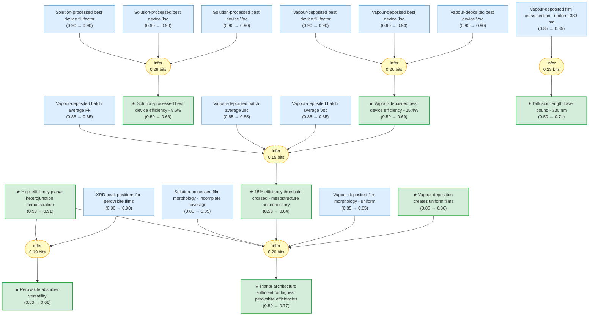

# Efficient planar heterojunction perovskite solar cells by vapour deposition

> **Original work:** Mingzhen Liu, Michael B. Johnston, Henry J. Snaith. "Efficient planar heterojunction perovskite solar cells by vapour deposition." *Nature* 501, 395-398 (2013). [DOI: 10.1038/nature12509](https://doi.org/10.1038/nature12509)

<!-- badges:start -->
<!-- badges:end -->

> [!NOTE]
> This README is an AI-generated analysis based on a [Gaia](https://github.com/SiliconEinstein/Gaia) reasoning graph formalization of the original work. Belief values reflect the graph's probabilistic assessment of each claim's support, not the original authors' confidence. See [ANALYSIS.md](ANALYSIS.md) for detailed verification results.

## Overview

This paper demonstrates that organometal halide perovskite absorbers can achieve high power conversion efficiency (>15%) in a simple planar heterojunction architecture without requiring complex mesostructures. The key innovation is dual-source vapour deposition to create uniform CH3NH3PbI3-xClx perovskite films, which overcomes the morphology limitations of solution processing. The best vapour-deposited device achieved 15.4% efficiency (Jsc = 21.5 mA/cm², Voc = 1.07 V, FF = 0.68), compared to 8.6% for the solution-processed control, establishing vapour deposition as a viable route for high-quality perovskite films compatible with existing thin-film PV manufacturing infrastructure.

> [!TIP]
> **Reasoning graph information gain: `1.3 bits`**
>
> Total mutual information between leaf premises and exported conclusions — measures how much the reasoning structure reduces uncertainty about the results.

> [!NOTE]
> **[Per-module reasoning graphs with full claim details →](docs/detailed-reasoning.md)**
>
> 4 Mermaid diagrams (one per section) with every claim, strategy, and belief value.

## Reasoning Structure

### Vapour deposition produces uniform perovskite films (belief: 0.86)

The paper demonstrates that dual-source thermal evaporation creates CH3NH3PbI3-xClx films with superior uniformity compared to solution processing. SEM imaging reveals vapour-deposited films have crystalline features on the hundreds-of-nanometres scale with no visible pinholes, while solution-processed films show incomplete substrate coverage with micrometre-scale platelets and voids extending to the TiO2 layer.

**Evidence chains:**
- **Morphology contrast** (belief 0.85): The direct SEM comparison shows the two deposition methods produce fundamentally different film topologies. This is the foundation for understanding why vapour deposition outperforms.
- **Film thickness control** (belief 0.85): Cross-sectional SEM shows uniform 330 nm thickness for vapour-deposited films, compared to 50-410 nm undulation for solution-processed films, with complete pinholes in some regions.

### Vapour-deposited planar heterojunction achieves 15.4% efficiency (belief: 0.69)

The best-performing vapour-deposited device achieved 15.4% power conversion efficiency under simulated AM1.5 sunlight (101 mW/cm²), with Jsc = 21.5 mA/cm², Voc = 1.07 V, and FF = 0.68. A batch of 12 identically processed devices showed average PCE of 12.3 ± 2.0%, demonstrating reasonable reproducibility.

**Evidence chains:**
- **PCE calculation from Jsc, Voc, FF** (belief 0.69): The efficiency is derived from three independent electrical measurements, each with high prior (0.90). The moderate belief reflects the multiplicative uncertainty from combining three measurements.
- **Batch statistics** (belief 0.85): The 12-device batch average (18.9 ± 1.8 mA/cm² Jsc, 1.05 ± 0.03 V Voc, 0.62 ± 0.05 FF) confirms the best-device performance is representative, not an outlier.

*Current-density/voltage curves of best-performing solution-processed (blue) and vapour-deposited (red) planar heterojunction perovskite solar cells measured under simulated AM1.5 sunlight.*

### Solution-processed planar heterojunction achieves 8.6% efficiency (belief: 0.68)

The best-performing solution-processed control device achieved only 8.6% efficiency (Jsc = 17.6 mA/cm², Voc = 0.84 V, FF = 0.58), significantly underperforming the vapour-deposited devices across all four key metrics.

**Evidence chains:**
- **Direct J-V measurements** (belief 0.90): Both devices were measured under identical conditions, providing reliable comparison.
- **Performance gap analysis** (belief 0.68): The ~6.8 percentage point efficiency difference is attributable to poorer Jsc (17.6 vs 21.5 mA/cm²), significantly lower Voc (0.84 vs 1.07 V), and reduced FF (0.58 vs 0.68).

### Diffusion length exceeds 330 nm in CH3NH3PbI3-xClx (belief: 0.71)

Since charges are successfully collected at both p-type and n-type heterojunctions across the 330 nm vapour-deposited film, the electron and hole diffusion length must be at least this value. This sets a lower bound, not a precise measurement.

**Evidence chains:**
- **Charge collection across film thickness** (belief 0.85): The uniform 330 nm film thickness and successful device operation imply diffusion length >= 330 nm. The belief is reduced because this is an indirect inference, not a direct measurement.
- **Consistency with high Jsc** (belief 0.71): The high short-circuit current (21.5 mA/cm²) supports the interpretation that carriers reach both electrodes before recombining.

*Cross-sectional SEM images of complete solar cells: (c) vapour-deposited perovskite film showing uniform ~330 nm thickness, (d) solution-processed film showing large grain sizes.*

### The 15% efficiency threshold has been crossed with planar architecture (belief: 0.64)

The best vapour-deposited device at 15.4% PCE and the batch average of 12.3% demonstrate that planar heterojunction architecture can achieve >15% efficiency with organometal halide perovskites, proving that mesostructure is not essential for high performance.

**Evidence chains:**
- **Best device vs threshold** (belief 0.69): The 15.4% efficiency clearly exceeds the 15% threshold.
- **Batch average confirmation** (belief 0.85): The 12-device average of 12.3 ± 2.0% shows the result is reproducible, though with notable variance.
- **Combined inference** (weakest link, belief 0.64): The threshold crossing conclusion combines batch statistics with the best-device performance, reducing confidence due to the batch variance (2.0% standard deviation).

### Planar architecture is sufficient for highest perovskite efficiencies (belief: 0.77)

Perovskite absorbers can function at the highest efficiencies in simplified device architectures without complex mesostructures. This is supported by the >15% PCE achieved with a simple FTO/TiO2/perovskite/spiro-OMeTAD/Ag planar stack.

**Evidence chains:**
- **High-efficiency demonstration** (belief 0.91): The 15.4% efficiency directly demonstrates that mesostructure is unnecessary.
- **Morphology advantage** (belief 0.85): Uniform vapour-deposited films enable consistent performance, validating the planar approach.
- **Threshold crossing** (belief 0.64): Combining the best-device result with batch statistics strengthens the conclusion that planar architecture is sufficient, not just capable.
- **Uniformity-performance link** (belief 0.86): The paper explicitly attributes improved performance to superior film uniformity from vapour deposition.

### Perovskite absorbers are versatile materials for highly efficient solar cells (belief: 0.66)

The demonstration of >15% efficiency in a simple planar architecture, combined with the known flexibility of the ABX3 perovskite family (many possible A, B, X combinations), establishes perovskite versatility. The material is compatible with both solution and vapour deposition processing.

**Evidence chains:**
- **High-efficiency planar result** (belief 0.91): The primary evidence for versatility.
- **XRD structure confirmation** (belief 0.90): Both vapour and solution processes produce the same orthorhombic CH3NH3PbI3-xClx structure, demonstrating processing flexibility.
- **Dual-route compatibility** (belief 0.66): The paper shows perovskite works with both processing methods, supporting the versatility claim, though the moderate belief reflects that this conclusion extrapolates beyond the specific experimental evidence.

## Conclusions

| Label | Content | Prior | Belief |
|-------|---------|-------|--------|
| diffusion_length_lower_bound | The vapour-deposited film thickness of 330 nm sets a lower limit on the electron and hole diffusion length in this perovskite absorber | 0.50 | 0.71 |
| high_efficiency_planar_demonstrated | A simple planar heterojunction solar cell incorporating vapour-deposited perovskite as the absorbing layer can achieve solar-to-electrical power conversion efficiencies exceeding 15% | 0.90 | 0.91 |
| perovskite_versatility | The perovskite absorbers are versatile materials for incorporation into highly efficient solar cells | 0.50 | 0.66 |
| planar_architecture_sufficiency | Perovskite absorbers can function at the highest efficiencies in simplified device architectures | 0.50 | 0.77 |
| solution_best_PCE | The best-performing solution-processed planar heterojunction perovskite solar cell produced an overall efficiency of 8.6% | 0.50 | 0.68 |
| threshold_15_percent | The planar heterojunction perovskite solar cell has crossed the 15% efficiency threshold | 0.50 | 0.64 |
| vapour_best_PCE | The best-performing vapour-deposited perovskite device achieved a power conversion efficiency of 15.4% | 0.50 | 0.69 |
| vapour_deposition_enables_uniform_films | Dual-source vapour deposition creates uniform flat films of the mixed halide perovskite | 0.85 | 0.86 |

Weak Points Analysis

**1. Batch device variance is high (2.0% standard deviation on 12.3% average)**

The 12-device batch average shows PCE = 12.3 ± 2.0%, indicating considerable device-to-device variation. This affects the threshold_15_percent conclusion, as the batch average does not itself exceed 15%. The belief of 0.64 reflects this uncertainty — while the best device achieves 15.4%, the reproducibility is imperfect.

**2. Solution-processed baseline is not fully optimized**

The solution-processed devices (8.6% best) may not represent the full potential of solution processing for planar heterojunctions. The paper acknowledges this is a control comparison rather than an optimized baseline. However, the paper still demonstrates a significant efficiency gap that cannot be fully attributed to optimization differences.

**3. Diffusion length is a lower bound, not a precise measurement**

The 330 nm lower bound on diffusion length is inferred from successful charge collection, not measured directly. The paper explicitly states "more work is required to determine the electron and hole diffusion lengths precisely." This means the diffusion_length_lower_bound claim (belief 0.71) is structurally sound but quantitatively imprecise.

**4. Long-term stability not addressed**

The paper does not report stability testing under continuous illumination or extended storage. This is a significant gap for practical applications, though outside the scope of the initial efficiency demonstration.

Evidence Gaps & Future Work

**Experimental gaps:**
- **Precise diffusion length measurement**: Time-resolved transient absorption or fluorescence quenching measurements would give exact diffusion length values rather than lower bounds.
- **Device stability testing**: Lifetime measurements under 1 sun illumination for 1000+ hours would establish practical viability.
- **Capturing the shunt path mechanism**: While the paper identifies pinholes as the cause of lower FF and Voc in solution-processed devices, the exact shunting mechanism is not fully characterized.

**Theoretical gaps:**
- **Charge generation mechanism**: The paper notes more work is needed to "understand the primary excitation and the mechanisms for free-charge generation in these materials."
- **Interface recombination**: The role of TiO2/perovskite and perovskite/spiro-OMeTAD interfaces on Voc is not explored in detail.

**Manufacturing gaps:**
- **Scale-up validation**: The 1 cm² device area is small relative to commercial PV; larger-area uniformity needs demonstration.
- **Vapour deposition parameter optimization**: While 4:1 CH3NH3I:PbCl2 was optimal, the process window and manufacturing yield are not characterized.

## Detailed Analysis

For structural integrity verification (Pass 5), standalone readability checks (Pass 6),
and complete package statistics, see [ANALYSIS.md](ANALYSIS.md).