# pvsknature12509-gaia

Add your description here

<!-- badges:start -->
<!-- badges:end -->

## Overview

> [!TIP]
> **Reasoning graph information gain: `6.0 bits`**
>
> Total mutual information between leaf premises and exported conclusions — measures how much the reasoning structure reduces uncertainty about the results.

```mermaid
---
config:
  flowchart:
    rankSpacing: 80
    nodeSpacing: 30
---
graph TB
    meso_superstructured_improvement["★ Meso-superstructured solar cell improvement\n(0.85 → 0.85)"]:::exported
    meso_superstructured_mechanism["★ Meso-superstructured open-circuit voltage mechanism\n(0.50 → 0.71)"]:::exported
    meso_efficiency_progress["★ Meso-superstructured efficiency progress\n(0.50 → 0.68)"]:::exported
    solution_planarHeterojunction["★ Solution-processed planar heterojunction efficiency\n(0.80 → 0.80)"]:::exported
    high_efficiency_planar_demonstrated["★ High-efficiency planar heterojunction demonstration\n(0.90 → 0.91)"]:::exported
    vapour_deposition_enables_uniform_films["★ Vapour deposition creates uniform films\n(0.85 → 0.86)"]:::exported
    xrd_peak_positions["★ XRD peak positions for perovskite films\n(0.90 → 0.90)"]:::exported
    xrd_phase_purity["★ High phase purity from XRD analysis\n(0.50 → 0.72)"]:::exported
    xrd_c_axis_contraction["★ c-axis contraction indicates Cl positioning\n(0.50 → 0.68)"]:::exported
    crystal_structure_description["★ Perovskite ABX3 crystal structure\n(0.50 → 0.72)"]:::exported
    vapour_deposited_morphology["★ Vapour-deposited film morphology - uniform\n(0.85 → 0.85)"]:::exported
    solution_processed_morphology["★ Solution-processed film morphology - incomplete coverage\n(0.85 → 0.85)"]:::exported
    vapour_deposited_cross_section["★ Vapour-deposited film cross-section - uniform 330 nm\n(0.85 → 0.85)"]:::exported
    solution_processed_cross_section["★ Solution-processed film cross-section - undulating with pinholes\n(0.80 → 0.80)"]:::exported
    crystal_size_limited["★ Crystal size estimation from XRD peak width\n(0.50 → 0.72)"]:::exported
    vapour_best_Jsc["★ Vapour-deposited best device Jsc\n(0.90 → 0.90)"]:::exported
    vapour_best_Voc["★ Vapour-deposited best device Voc\n(0.90 → 0.90)"]:::exported
    vapour_best_FF["★ Vapour-deposited best device fill factor\n(0.90 → 0.90)"]:::exported
    vapour_best_PCE["★ Vapour-deposited best device efficiency - 15.4%\n(0.50 → 0.69)"]:::exported
    solution_best_Jsc["★ Solution-processed best device Jsc\n(0.90 → 0.90)"]:::exported
    solution_best_Voc["★ Solution-processed best device Voc\n(0.90 → 0.90)"]:::exported
    solution_best_FF["★ Solution-processed best device fill factor\n(0.90 → 0.90)"]:::exported
    solution_best_PCE["★ Solution-processed best device efficiency - 8.6%\n(0.50 → 0.68)"]:::exported
    vapour_batch_Jsc_avg["★ Vapour-deposited batch average Jsc\n(0.85 → 0.85)"]:::exported
    vapour_batch_Voc_avg["★ Vapour-deposited batch average Voc\n(0.85 → 0.85)"]:::exported
    vapour_batch_FF_avg["★ Vapour-deposited batch average FF\n(0.85 → 0.85)"]:::exported
    vapour_batch_PCE_avg["★ Vapour-deposited batch average PCE\n(0.50 → 0.66)"]:::exported
    diffusion_length_lower_bound["★ Diffusion length lower bound - 330 nm\n(0.50 → 0.71)"]:::exported
    uniformity_advantage["★ Vapour deposition uniformity advantage for performance\n(0.50 → 0.70)"]:::exported
    pinhole_shunting["★ Solution-processed pinholes cause shunting\n(0.50 → 0.67)"]:::exported
    solution_efficiency_surprise["★ Solution-processed efficiency despite inhomogeneity\n(0.50 → 0.61)"]:::exported
    perovskite_versatility["★ Perovskite absorber versatility\n(0.50 → 0.66)"]:::exported
    vapour_deposition_maturity["★ Vapour deposition maturity for industrial applications\n(0.80 → 0.80)"]:::exported
    oled_vapour_deposition_compatibility["★ OLED vapour deposition commercial success\n(0.80 → 0.80)"]:::exported
    tandem_top_cell_potential["★ Perovskite as top cell in tandem configuration\n(0.50 → 0.68)"]:::exported
    all_perovskite_multijunction["★ All-perovskite multi-junction prospect\n(0.50 → 0.61)"]:::exported
    infra_compatibility["★ Compatibility with existing PV manufacturing infrastructure\n(0.50 → 0.66)"]:::exported
    manufacturing_route_question["★ Manufacturing route question - vapour vs solution\n(0.50 → 0.63)"]:::exported
    diffusion_length_needs_work["★ Future work needed on diffusion length characterization\n(0.50 → 0.68)"]:::exported
    wider_bandgap_top_cell_target["★ Perovskite as wide-bandgap top cell achieving community target\n(0.50 → 0.61)"]:::exported
    threshold_15_percent["★ 15% efficiency threshold crossed - mesostructure not necessary\n(0.50 → 0.64)"]:::exported
    planar_architecture_sufficiency["★ Planar architecture sufficient for highest perovskite efficiencies\n(0.50 → 0.77)"]:::exported
    future_directions["★ Future research directions\n(0.50 → 0.67)"]:::exported
    vapour_vs_solution_fom_comparison["★ Vapour vs solution processing key metrics comparison\n(0.50 → 0.63)"]:::exported
    strat_0(["infer\n0.29 bits"]):::weak
    crystal_structure_description --> strat_0
    high_efficiency_planar_demonstrated --> strat_0
    strat_0 --> perovskite_versatility
    strat_1(["infer\n0.30 bits"]):::weak
    diffusion_length_lower_bound --> strat_1
    strat_1 --> diffusion_length_needs_work
    strat_2(["infer\n0.30 bits"]):::weak
    diffusion_length_needs_work --> strat_2
    strat_2 --> future_directions
    strat_3(["infer\n0.24 bits"]):::weak
    high_efficiency_planar_demonstrated --> strat_3
    threshold_15_percent --> strat_3
    uniformity_advantage --> strat_3
    vapour_deposition_enables_uniform_films --> strat_3
    strat_3 --> planar_architecture_sufficiency
    strat_4(["infer\n0.29 bits"]):::weak
    high_efficiency_planar_demonstrated --> strat_4
    vapour_deposition_maturity --> strat_4
    strat_4 --> tandem_top_cell_potential
    strat_5(["infer\n0.27 bits"]):::weak
    infra_compatibility --> strat_5
    solution_planarHeterojunction --> strat_5
    strat_5 --> manufacturing_route_question
    strat_6(["infer\n0.20 bits"]):::weak
    infra_compatibility --> strat_6
    tandem_top_cell_potential --> strat_6
    strat_6 --> wider_bandgap_top_cell_target
    strat_7(["infer\n0.23 bits"]):::weak
    meso_superstructured_improvement --> strat_7
    strat_7 --> meso_superstructured_mechanism
    strat_8(["infer\n0.30 bits"]):::weak
    meso_superstructured_mechanism --> strat_8
    strat_8 --> meso_efficiency_progress
    strat_9(["infer\n0.31 bits"]):::weak
    oled_vapour_deposition_compatibility --> strat_9
    vapour_deposition_maturity --> strat_9
    strat_9 --> infra_compatibility
    strat_10(["infer\n0.20 bits"]):::weak
    perovskite_versatility --> strat_10
    tandem_top_cell_potential --> strat_10
    strat_10 --> all_perovskite_multijunction
    strat_11(["infer\n0.20 bits"]):::weak
    pinhole_shunting --> strat_11
    solution_best_PCE --> strat_11
    strat_11 --> solution_efficiency_surprise
    strat_12(["infer\n0.29 bits"]):::weak
    solution_best_FF --> strat_12
    solution_best_Jsc --> strat_12
    solution_best_Voc --> strat_12
    strat_12 --> solution_best_PCE
    strat_13(["infer\n0.31 bits"]):::weak
    solution_best_FF --> strat_13
    solution_best_Jsc --> strat_13
    solution_best_Voc --> strat_13
    vapour_best_FF --> strat_13
    vapour_best_Jsc --> strat_13
    vapour_best_Voc --> strat_13
    strat_13 --> vapour_vs_solution_fom_comparison
    strat_14(["infer\n0.30 bits"]):::weak
    solution_processed_cross_section --> strat_14
    solution_processed_morphology --> strat_14
    strat_14 --> pinhole_shunting
    strat_15(["infer\n0.21 bits"]):::weak
    solution_processed_morphology --> strat_15
    vapour_deposited_morphology --> strat_15
    strat_15 --> uniformity_advantage
    strat_16(["infer\n0.28 bits"]):::weak
    vapour_batch_FF_avg --> strat_16
    vapour_batch_Jsc_avg --> strat_16
    vapour_batch_Voc_avg --> strat_16
    strat_16 --> vapour_batch_PCE_avg
    strat_17(["infer\n0.14 bits"]):::weak
    vapour_batch_PCE_avg --> strat_17
    vapour_best_PCE --> strat_17
    strat_17 --> threshold_15_percent
    strat_18(["infer\n0.26 bits"]):::weak
    vapour_best_FF --> strat_18
    vapour_best_Jsc --> strat_18
    vapour_best_Voc --> strat_18
    strat_18 --> vapour_best_PCE
    strat_19(["infer\n0.23 bits"]):::weak
    vapour_deposited_cross_section --> strat_19
    strat_19 --> diffusion_length_lower_bound
    strat_20(["infer\n0.18 bits"]):::weak
    xrd_peak_positions --> strat_20
    strat_20 --> crystal_size_limited
    strat_21(["infer\n0.18 bits"]):::weak
    xrd_peak_positions --> strat_21
    strat_21 --> crystal_structure_description
    strat_22(["infer\n0.18 bits"]):::weak
    xrd_peak_positions --> strat_22
    strat_22 --> xrd_phase_purity
    strat_23(["infer\n0.30 bits"]):::weak
    xrd_phase_purity --> strat_23
    strat_23 --> xrd_c_axis_contraction

    classDef premise fill:#ddeeff,stroke:#4488bb,color:#333
    classDef exported fill:#d4edda,stroke:#28a745,stroke-width:2px,color:#333
    classDef weak fill:#fff9c4,stroke:#f9a825,stroke-dasharray: 5 5,color:#333
    classDef contra fill:#ffebee,stroke:#c62828,color:#333
```

## Conclusions

| Label | Content | Prior | Belief |
|-------|---------|-------|--------|
| all_perovskite_multijunction | Ultimately an 'all-perovskite' multi-junction cell should be realizable, leve... | 0.50 | 0.61 |
| as_deposited_molar_ratio | The as-deposited molar ratio of CH3NH3I to PbCl2 was 4:1 (based on sensor rea... | 0.50 | 0.50 |
| compact_tio2_deposition | A compact n-type TiO2 layer was deposited by spin-coating an acidic solution ... | 0.50 | 0.50 |
| composition_optimization | The CH3NH3I to PbCl2 ratio was varied from 1:1 to 7:1 at fixed film thickness... | 0.50 | 0.50 |
| crystal_size_limited | Crystal sizes for both films are larger than can be determined from the peak ... | 0.50 | 0.72 |
| crystal_structure_description | The perovskite absorber adopts the ABX3 form where A is methylammonium (CH3NH... | 0.50 | 0.72 |
| deposition_pressure | The chamber was pumped down to below 10^-5 mbar before deposition, with sourc... | 0.50 | 0.50 |
| device_architecture_description | The planar heterojunction p-i-n solar cell is constructed from the light-inci... | 0.85 | 0.85 |
| device_completion | Devices were completed by thermal evaporation of silver cathode at 10^-6 mbar... | 0.50 | 0.50 |
| diffusion_length_lower_bound | The vapour-deposited film thickness of 330 nm sets a lower limit on the elect... | 0.50 | 0.71 |
| diffusion_length_needs_work | More work is required to determine the electron and hole diffusion lengths pr... | 0.50 | 0.68 |
| dual_source_evaporation_system | The dual-source evaporation system (Kurt J. Lesker Mini Spectros) uses cerami... | 0.50 | 0.50 |
| film_annealing | As-deposited films were annealed at 100°C for 45 min in N2-filled glovebox be... | 0.50 | 0.50 |
| film_thickness_optimization | Film thickness was varied from 125 to 500 nm at optimum CH3NH3I:PbCl2 ratio o... | 0.50 | 0.50 |
| future_directions | Future work should focus on: (1) precise determination of electron and hole d... | 0.50 | 0.67 |
| high_efficiency_planar_demonstrated | A simple planar heterojunction solar cell incorporating vapour-deposited pero... | 0.90 | 0.91 |
| hole_transporter_deposition | The hole-transporter layer was deposited by spin-coating (2,000 rpm for 45 s)... | 0.50 | 0.50 |
| infra_compatibility | Vapour deposition of perovskite layers is entirely compatible with convention... | 0.50 | 0.66 |
| manufacturing_route_question | Whether vapour deposition emerges as the preferred route for manufacture or s... | 0.50 | 0.63 |
| meso_efficiency_progress | Further removal of thermal sintering of mesoporous Al2O3 layer and better opt... | 0.50 | 0.68 |
| meso_superstructured_improvement | Replacing mesoporous TiO2 with mesoporous Al2O3 in perovskite solar cells res... | 0.85 | 0.85 |
| meso_superstructured_mechanism | The observed enhancement in open-circuit voltage in meso-superstructured cell... | 0.50 | 0.71 |
| oled_vapour_deposition_compatibility | Organic light-emitting diodes (OLEDs) have proved commercially sound with ext... | 0.80 | 0.80 |
| optimized_deposition_rate | The optimal deposition rate was 5.3 Å s^-1 for CH3NH3I (achieved with crucibl... | 0.50 | 0.50 |
| perovskite_material_introduction | Organometal trihalide perovskites with general formula (RNH3)BX3 (R = CnH2n+1... | 0.80 | 0.80 |
| perovskite_versatility | The perovskite absorbers are versatile materials for incorporation into highl... | 0.50 | 0.66 |
| photovoltaic_generations | The photovoltaic technology landscape comprises: (1) wafer-based first-genera... | 0.80 | 0.80 |
| pinhole_shunting | The complete absence of material (pinholes) in some regions of solution-proce... | 0.50 | 0.67 |
| planar_architecture_sufficiency | Perovskite absorbers can function at the highest efficiencies in simplified d... | 0.50 | 0.77 |
| planar_vs_meso_question | Is mesostructure essential for the highest efficiencies with perovskite absor... | 0.50 | — |
| precursor_materials | The precursor salts are methylammonium iodide (CH3NH3I) and lead chloride (Pb... | 0.50 | 0.50 |
| solution_best_FF | The best-performing solution-processed planar heterojunction perovskite solar... | 0.90 | 0.90 |
| solution_best_Jsc | The best-performing solution-processed planar heterojunction perovskite solar... | 0.90 | 0.90 |
| solution_best_PCE | The best-performing solution-processed planar heterojunction perovskite solar... | 0.50 | 0.68 |
| solution_best_Voc | The best-performing solution-processed planar heterojunction perovskite solar... | 0.90 | 0.90 |
| solution_efficiency_surprise | It is remarkable that such inhomogeneous and undulating solution-cast films c... | 0.50 | 0.61 |
| solution_planarHeterojunction | CH3NH3PbI3-xClx can operate relatively efficiently as a thin-film absorber in... | 0.80 | 0.80 |
| solution_processed_cross_section | The cross-sectional SEM image of solution-processed perovskite film appears e... | 0.80 | 0.80 |
| solution_processed_morphology | Solution-processed perovskite films appear to coat the substrate only partial... | 0.85 | 0.85 |
| study_rationale | The purpose of this study was to understand and optimize the properties of th... | 0.80 | 0.80 |
| substrate_preparation_method | FTO-coated glass (TEC7, 7V/% sheet resistivity) was patterned by etching with... | 0.50 | 0.50 |
| tandem_top_cell_potential | An interesting possibility for the vapour-deposited perovskite technology is ... | 0.50 | 0.68 |
| threshold_15_percent | The planar heterojunction perovskite solar cell built with vapour-deposited a... | 0.50 | 0.64 |
| tooling_factor_method | Tooling factors were estimated by comparing quartz crystal monitor readings t... | 0.50 | 0.50 |
| uniformity_advantage | Dual-source vapour deposition results in superior uniformity of the coated pe... | 0.50 | 0.70 |
| vapour_batch_FF_avg | A batch of 12 identically processed vapour-deposited perovskite solar cells s... | 0.85 | 0.85 |
| vapour_batch_Jsc_avg | A batch of 12 identically processed vapour-deposited perovskite solar cells s... | 0.85 | 0.85 |
| vapour_batch_PCE_avg | A batch of 12 identically processed vapour-deposited perovskite solar cells s... | 0.50 | 0.66 |
| vapour_batch_Voc_avg | A batch of 12 identically processed vapour-deposited perovskite solar cells s... | 0.85 | 0.85 |
| vapour_best_FF | The best-performing vapour-deposited perovskite device achieved a fill factor... | 0.90 | 0.90 |
| vapour_best_Jsc | The best-performing vapour-deposited perovskite device achieved a short-circu... | 0.90 | 0.90 |
| vapour_best_PCE | The best-performing vapour-deposited perovskite device achieved a power conve... | 0.50 | 0.69 |
| vapour_best_Voc | The best-performing vapour-deposited perovskite device achieved an open-circu... | 0.90 | 0.90 |
| vapour_deposited_cross_section | The cross-sectional SEM image of vapour-deposited perovskite film shows a uni... | 0.85 | 0.85 |
| vapour_deposited_morphology | Vapour-deposited perovskite films are extremely uniform with crystalline feat... | 0.85 | 0.85 |
| vapour_deposition_enables_uniform_films | Dual-source vapour deposition creates uniform flat films of the mixed halide ... | 0.85 | 0.86 |
| vapour_deposition_maturity | Vapour deposition is a mature technique used in the glazing industry, liquid-... | 0.80 | 0.80 |
| vapour_vs_solution_fom_comparison | Vapour-deposited devices outperform solution-processed planar heterojunction ... | 0.50 | 0.63 |
| wider_bandgap_top_cell_target | A key target for the photovoltaics community has been to find a wider-bandgap... | 0.50 | 0.61 |
| xrd_c_axis_contraction | The mixed-halide perovskite shows a slight contraction of the c axis compared... | 0.50 | 0.68 |
| xrd_peak_positions | X-ray diffraction spectra of both vapour-deposited and solution-processed CH3... | 0.90 | 0.90 |
| xrd_phase_purity | The (110) diffraction peak region at 14.12° shows only a small signature of a... | 0.50 | 0.72 |

<!-- content:start -->
<!-- content:end -->
