# Efficient planar heterojunction perovskite solar cells by vapour deposition

Mingzhen Liu1 , Michael B. Johnston1 & Henry J. Snaith1

Many different photovoltaic technologies are being developed for large-scale solar energy conversion1–4. The wafer-based firstgeneration photovoltaic devices1 have been followed by thin-film solid semiconductor absorber layers sandwiched between two charge-selective contacts3 and nanostructured (or mesostructured) solar cells that rely on a distributed heterojunction to generate charge and to transport positive and negative charges in spatially separated phases4–6. Although many materials have been used in nanostructured devices, the goal of attaining high-efficiency thinfilm solar cells in such a way has yet to be achieved7 . Organometal halide perovskites have recently emerged as a promising material for high-efficiency nanostructured devices8–11. Here we show that nanostructuring is not necessary to achieve high efficiencies with this material: a simple planar heterojunction solar cell incorporating vapour-deposited perovskite as the absorbing layer can have solar-to-electrical power conversion efficiencies of over 15 per cent (as measured under simulated full sunlight). This demonstrates that perovskite absorbers can function at the highest efficiencies in simplified device architectures, without the need for complex nanostructures.

Within a solar cell there are many different components with discrete roles and having different tolerances for purity and optoelectronic properties. The hybrid inorganic–organic solar cell concept is ‘material agnostic’ in that it aims to use the optimum material for each individual function. Any material that is easy to process, inexpensive and abundant can be used, with the aim of delivering a high-efficiency solar cell. Hybrid solar cells have been demonstrated in $\pi$ -conjugated polymer blends containing semiconductor nanocrystals such as CdSe (ref. 12), ${ \mathrm { C u l n } } \mathrm { S } _ { 2 }$ (ref. 13) and PbS (ref. 14). Dye-sensitized solar cells are hybrid solar cells containing a mesostructured inorganic n-type oxide (such as $\mathrm { T i O } _ { 2 }$ ) sensitized with an organic or metal complex dye, and infiltrated with an organic p-type hole-conductor4 . Recently, organometal trihalide perovskite absorbers with the general formula $( \mathrm { R N H } _ { 3 } ) \mathrm { B X } _ { 3 }$ (where R i $\mathrm { ; C _ { \mathfrak { n } } H _ { 2 { \mathfrak { n } } + 1 } , X }$ is the halogen I, Br or Cl, and B is Pb or Sn)15, have been used instead of the dye in dye-sensitized solar cells to deliver solid-state solar cells with a power conversion efficiency of over $1 0 \%$ (refs 8, 11, 16).

Evolving from the dye-sensitized solar cells, we found that replacing the mesoporous $\mathrm { T i O } _ { 2 }$ with mesoporous $\mathrm { { A l } } _ { 2 } \mathrm { { O } } _ { 3 }$ resulted in a significant improvement in efficiency, delivering an open-circuit voltage of over $1 . 1 \mathrm { V }$ in a device which we term a ‘meso-superstructured solar cell’8 . We reason that this observed enhancement in open-circuit voltage is due to confinement of the photo-excited electrons within the perovskite phase, thereby increasing the splitting of the quasi-Fermi levels for electrons and holes under illumination, which is ultimately responsible for generating the open-circuit voltage. Further removal of the thermal sintering of the mesoporous $\mathrm { { A l } } _ { 2 } \mathrm { { O } } _ { 3 }$ layer, and better optimization of processing, has led to meso-superstructured solar cells with more than $1 2 \%$ efficiency17. In addition, $\mathrm { C H } _ { 3 } \mathrm { N H } _ { 3 } \mathrm { P b I } _ { 3 - x } \mathrm { C l } _ { x }$ can operate relatively efficiently as a thin-film absorber in a solution-processed planar heterojunction solar cell configuration, delivering around $5 \%$ efficiency when no mesostructure is involved17. This previous work demonstrates that the perovskite absorber is capable of operating in a much simpler

planar architecture, but raises the question of whether mesostructure is essential for the highest efficiencies, or whether the thin-film planar heterojunction will lead to a superior technology.

Here, as a means of creating uniform flat films of the mixed halide perovskite $\mathrm { C H } _ { 3 } \mathrm { N H } _ { 3 } \mathrm { P b I } _ { 3 } - { \mathrm { } _ { x } } \mathrm { C l } _ { x } ,$ we use dual-source vapour deposition. In Fig. 1 we show an illustration of the vapour-deposition set-up, along with an illustration of a planar heterojunction p–i–n solar cell (see Fig. 1c). From the bottom (the side from which the light is incident), the device is constructed on fluorine-doped tin oxide (FTO)-coated glass, coated with a compact layer of n-type $\mathrm { T i O } _ { 2 }$ that acts as the electronselective contact. The perovskite layer is then deposited on the n-type compact layer, followed by the p-type hole conductor, $^ { 2 , 2 ^ { \prime } , 7 , 7 ^ { \prime } }$ -tetrakis-(N,N-di-p-methoxyphenylamine) ${ \sf \ p } { \sf \mathsf { \sf { g } } } , { \sf { g } } ^ { \prime }$ -spirobifluorene (spiro-OMeTAD), which ensures the selective collection of holes at the silver cathode. Given that the purpose of this study was to understand and optimize the properties of the vapour-deposited perovskite absorber layer, the compact $\mathrm { T i O } _ { 2 }$ and the spiro-OMeTAD hole transporter were solutionprocessed, as is usual in meso-superstructured solar cells17.

In Fig. 1b, we compare the X-ray diffraction pattern of films of $\mathrm { C H } _ { 3 } \mathrm { N H } _ { 3 } \mathrm { P b I } _ { 3 - x } \mathrm { C l } _ { x }$ either vapour-deposited or solution-cast onto compact $\mathrm { T i O } _ { 2 }$ -coated FTO-coated glass. The main diffraction peaks, assigned to the 110, 220 and 330 peaks at $1 4 . 1 2 ^ { \circ }$ , $2 8 . 4 4 ^ { \circ }$ and, respectively, $4 3 . 2 3 ^ { \circ }$ , are in identical positions for both solution-processed and vapour-deposited films, indicating that both techniques have produced the same mixed-halide perovskite with an orthorhombic crystal structure8 . Notably, looking closely in the region of the (110) diffraction peak at $1 4 . 1 2 ^ { \circ }$ , there is only a small signature of a peak at $1 2 . 6 5 ^ { \circ }$ (the (001) diffraction peak for $\mathrm { P b } \mathrm { I } _ { 2 }$ ) and no measurable peak at $1 5 . 6 8 ^ { \circ }$ (the (110) diffraction peak for $\mathrm { C H } _ { 3 } \mathrm { N H } _ { 3 } \mathrm { P b } \mathrm { C l } _ { 3 } )$ ), indicating a high level of phase purity. A diagram of the crystal structure is shown in Fig. 1d. The main difference between $\mathrm { C H } _ { 3 } \mathrm { N H } _ { 3 } \mathrm { P b I } _ { 3 }$ and the mixed-halide perovskite presented here is evident in a slight contraction of the $c$ axis. This is consistent with the Cl atoms in the mixed-halide perovskite residing in the apical positions, out of the $\mathrm { P b I _ { 4 } }$ plane, as opposed to in the equatorial octahedral sites, as has been theoretically predicted18.

We now make a comparison between the thin-film topology and crosssectional structure of devices fabricated by either vapour deposition or solution processing. The top-view scanning electron microscope (SEM) images in Fig. 2a, b highlight the considerable differences between the film morphologies produced by the two deposition processes. The vapour-deposited films are extremely uniform, with what appear to be crystalline features on the length scale of hundreds of nanometres. In contrast, the solution-processed films appear to coat the substrate only partially, with crystalline ‘platelets’ on the length scale of tens of micrometres. The voids between the crystals in the solution-processed films appear to extend directly to the compact $\mathrm { T i O } _ { 2 }$ -coated FTOcoated glass.

The cross-sectional images of the completed devices in Fig. 2c, d reveal more information about the crystal size. The vapour-deposited perovskite film (Fig. 2c) is uniform and similar in appearance to the FTO layer, albeit with slightly larger crystal features. The solutionprocessed perovskite film (Fig. 2d) is extremely smooth in the SEM

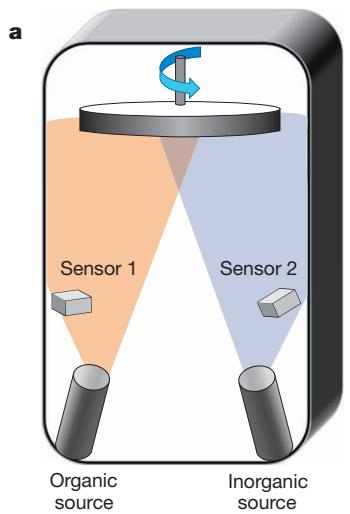

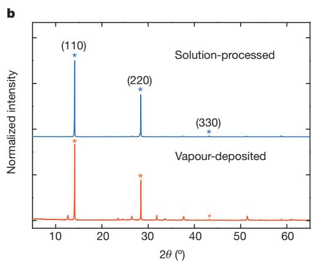

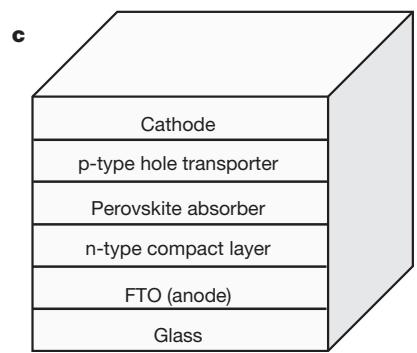

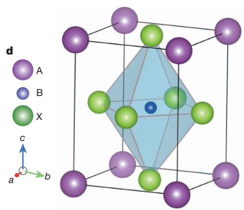  
Figure 1 | Material deposition system and characterization. a, Dual-source thermal evaporation system for depositing the perovskite absorbers; the organic source was methylammonium iodide and the inorganic source $\mathrm { P b C l } _ { 2 }$ . b, X-ray diffraction spectra of a solution-processed perovskite film (blue) and vapourdeposited perovskite film (red). The baseline is offset for ease of comparison

image, consistent with much larger crystal grain size than the field of view. For both of these films the crystal sizes are larger than we are able to determine from the peak width of the X-ray diffraction spectra (about $4 0 0 \mathrm { n m }$ ), owing to machine broadening. On zooming out, the vapour-deposited film in Fig. 2e remains flat, having an average film thickness of approximately $3 3 0 \mathrm { n m }$ . In contrast, the solution-processed film in Fig. 2f has an undulating nature, with film thickness varying from 50 to $4 1 0 \mathrm { n m }$ . Notably, this cross-section is still within a single ‘platelet’, and so even greater long-range roughness occurs owing to the areas where the perovskite absorber is completely absent (a thickness variation from 0 to $4 6 5 \mathrm { n m }$ was observed in multiple SEM images).

The current-density/voltage curves measured under simulated AM1.5, $1 0 1 \mathrm { m W } \mathrm { c m } ^ { - 2 }$ irradiance (simulated sunlight) for the best-performing vapour-deposited and solution-processed planar heterojunction solar cells are shown in Fig. 3. The most efficient vapour-deposited perovskite device had a short-circuit photocurrent of $2 1 . { \dot { 5 } } \operatorname { m A } { \mathsf { c m } } ^ { \div 2 }$ , an open-circuit voltage of $1 . 0 7 \mathrm { V }$ and a fill factor of 0.68, yielding an efficiency of $1 5 . 4 \%$ . In the same batch, the best solution-processed planar heterojunction perovskite solar cell produced a short-circuit photocurrent of $1 7 . 6 \operatorname* { m i c m } ^ { - 2 }$ , an open-circuit voltage of $0 . 8 4 \mathrm { V }$ and a fill factor of 0.58, yielding an overall efficiency of $8 . 6 \%$ . In Table 1 we show the extracted performance parameters for these best-performing cells and the average with standard deviation of a batch of 12 vapourdeposited perovskite solar cells fabricated in an identical manner to the best-performing cell.

Dual-source vapour deposition results in superior uniformity of the coated perovskite films over a range of length scales, which subsequently results in substantially improved solar cell performance. In optimizing planar heterojunction perovskite solar cells, perovskite film thickness

and the intensity has been normalized. c, Generic structure of a planar heterojunction p–i–n perovskite solar cell. d, Crystal structure of the perovskite absorber adopting the perovskite $\mathrm { A B X } _ { 3 }$ form, where A is methylammonium, B is $\mathrm { { \mathrm { P b } } }$ and X is I or Cl.

is a key parameter. If the film is too thin, then that region will not absorb sufficient sunlight. If the film is too thick, there is a significant chance that the electron and hole (or exciton) diffusion length will be shorter than the film thickness, and that the charge will therefore not be collected at the p-type and n-type heterojunctions. Furthermore, the complete absence of material from some regions in the solution-processed films (pinholes) will result in direct contact of the p-type spiro-OMeTAD and the $\mathrm { T i O } _ { 2 }$ compact layer. This leads to a shunting path that is probably partially responsible for the lower fill factor and open-circuit voltage in the solution-cast planar heterojunction devices17,19. Indeed, it is remarkable that such inhomogeneous and undulating solution-cast films can deliver devices with over $8 \%$ efficiency.

The results presented here demonstrate that solid perovskite layers can operate extremely well in a solar cell, and in essence set a lower limit of $3 3 0 \mathrm { n m }$ (the film thickness) on the electron and hole diffusion length in this perovskite absorber. However, more work is required to determine the electron and hole diffusion lengths precisely and to understand the primary excitation and the mechanisms for free-charge generation in these materials.

A distinct advantage of vapour deposition over solution processing is the ability to prepare layered multi-stack thin films over large areas. Vapour deposition is a mature technique used in the glazing industry, the liquid-crystal display industry and the thin-film solar cell industry, among others. Vapour deposition can lead to full optimization of electronic contact at interfaces through multilayers with controlled levels of doping20, as is done in the crystalline silicon ‘heterojunction with thin intrinsic layer’ solar cell21 and in thin-film solar cells3 . Additionally, organic light-emitting diodes22,23 have proved to be commercially sound, with devices with extremely thin multilayer stacks fabricated by vapour

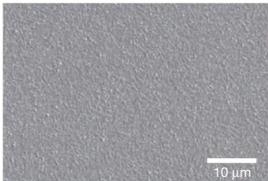  
a   
Vapour-deposited

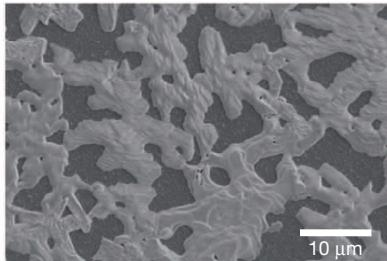  
b   
Solution-processed

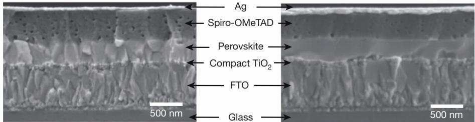  
c   
d

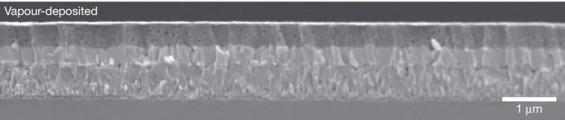  
e

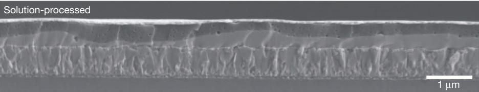  
f   
Figure 2 | Thin-film topology characterization. a, b, SEM top views of a vapour-deposited perovskite film (a) and a solution-processed perovskite film (b). c, d, Cross-sectional SEM images under high magnification of complete solar cells constructed from a vapour-deposited perovskite film (c) and a

deposition. Small molecular organic photovoltaics have also been able to compete directly with solution-processed organic photovoltaics despite much lower levels of research and development, because with

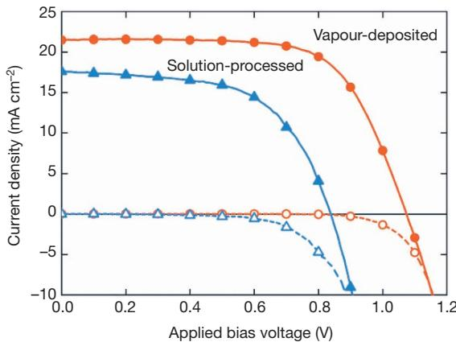  
Figure 3 | Solar cell performance. Current-density/voltage curves of the bestperforming solution-processed (blue lines, triangles) and vapour-deposited (red lines, circles) planar heterojunction perovskite solar cells measured under simulated AM1.5 sunlight of $\mathrm { 1 0 i m W c m ^ { \cdot - 2 } }$ irradiance (solid lines) and in the dark (dashed lines). The curves are for the best-performing cells measured and their reproducibility is shown in Table 1.

solution-processed perovskite film (d). e, f, Cross-sectional SEM images under lower magnification of completed solar cells constructed from a vapourdeposited perovskite film (e) and a solution-processed perovskite film (f).

vapour deposition the charge-collection interfaces can be carefully tuned, and multi-junction architectures are more straightforward to realize24. An interesting possibility for the current vapour-deposited perovskite technology is to use it as a ‘top cell’ in a hybrid tandem junction with either crystalline silicon or copper indium gallium (di)selenide. Although ultimately an ‘all-perovskite’ multi-junction cell should be realizable, the perovskite cells have now achieved a performance that is sufficient to increase the absolute efficiency of high-efficiency crystalline silicon and copper indium gallium (di)selenide solar cells25. Additionally, because vapour deposition of the perovskite layers is entirely compatible with conventional processing methods for siliconwafer-based and thin-film solar cells, the infrastructure could already be in place to scale up this technology.

We have built vapour-deposited organometal trihalide perovskite solar cells based on a planar heterojunction thin-film architecture that have a solar-to-electrical power conversion efficiency of over $1 5 \%$ with an open-circuit voltage of 1.07 V. The perovskite absorbers seem to be versatile materials for incorporation into highly efficient solar cells, given the low-temperature processing they require, the option of using either solution processing or vapour deposition or both, the simplified device architecture and the availability of many other metal and organic salts that could form a perovskite structure. Whether vapour deposition emerges as the preferred route for manufacture or simply represents a benchmark method for fabricating extremely uniform

Table 1 | Solar cell performance parameters   

<table><tr><td></td><td>Current density (mA cm-2)</td><td>Open-circuit voltage (V)</td><td>Fill factor</td><td>Efficiency (%)</td></tr><tr><td>Vapour-deposited</td><td>21.5</td><td>1.07</td><td>0.67</td><td>15.4</td></tr><tr><td>Vapour-deposited (average ± s.d.)</td><td>18.9 ± 1.8</td><td>1.05 ± 0.03</td><td>0.62 ± 0.05</td><td>12.3 ± 2.0</td></tr><tr><td>Solution-processed</td><td>17.6</td><td>0.84</td><td>0.58</td><td>8.6</td></tr></table>

Solar cell performance parameters are extracted from the current–voltage curves presented in Fig. 3. The average and standard deviation (s.d) values of a batch of 12 identically processed planar heterojunction vapour-deposited $\mathsf { C H } _ { 3 } \mathsf { N H } _ { 3 } \mathsf { P b l } _ { 3 - x } \mathsf { C l } _ { x }$ perovskite solar cells are also shown.

films (that will ultimately be matched by solution processing) remains to be seen. Finally, a key target for the photovoltaics community has been to find a wider-bandgap highly efficient ‘top cell’, to enable the next step in improving the performance of crystalline silicon and existing second-generation thin-film solar cells. This perovskite technology is now compatible with these first- and second-generation technologies, and is hence likely to be adopted by the conventional photovoltaics community and industry. Therefore, it may find its way rapidly into utility-scale power generation.

# METHODS SUMMARY

The perovskite absorber was deposited by a dual-source evaporation system (Kurt J. Lesker Mini Spectros) with ceramic crucibles (organic light-emitting diode sources) in a nitrogen-filled glovebox. The vapour-deposited perovskite devices were fabricated on FTO-coated glass. A compact layer of $\mathrm { T i O } _ { 2 }$ was deposited on the FTO-coated glass by spin-coating (solution-processing) it with a mildly acidic solution of titanium isopropoxide in ethanol17, and subsequently the perovskite absorber was deposited on the compact $\mathrm { T i O } _ { 2 }$ -coated FTO substrate. Methylammonium iodide $\mathrm { C H } _ { 3 } \mathrm { N H } _ { 3 } \mathrm { I } )$ and lead chloride $( \mathrm { P b C l } _ { 2 } )$ were the organic and inorganic precursor salts, evaporated simultaneously from separate sources at $1 0 ^ { - 5 }$ mbar with an as-deposited molar ratio of 4:1, based on the reading of the sensors above the crucibles. A dark reddish-brown colour was observed immediately after evaporation. Annealing the perovskite absorbers before spin-coating the hole-transporter layer fully crystallized the perovskite layer. After spin-coating the hole transporter, spiro-OMeTAD, from a chlorobenzene solution to form the photoactive layer (including lithium bis(trifluoromethylsyfonyl)imide salt and tert-butylpyridine as additives)8 , the devices were capped with silver metal electrodes through thermal evaporation at $1 0 ^ { - 6 }$ mbar. Full details of material and device fabrication and characterization techniques are available in Methods. All other characterizations and measurements were carried out as previously described17.

Online Content Any additional Methods, Extended Data display items and Source Data are available in the online version of the paper; references unique to these sections appear only in the online paper.

# Received 19 June; accepted 25 July 2013.

# Published online 11 September 2013.

1. Green, M. A. Silicon photovoltaic modules: a brief history of the first 50 years. Prog. Photovolt. Res. Appl. 13, 447–455 (2005).   
2. Graetzel, M., Janssen, R. A. J., Mitzi, D. B. & Sargent, E. H. Materials interface engineering for solution-processed photovoltaics. Nature 488, 304–312 (2012).   
3. Chopra, K. L., Paulson, P. D. & Dutta, V. Thin-film solar cells: an overview. Prog. Photovolt. Res. Appl. 12, 69–92 (2004).   
4. O’Regan, B. & Gra¨tzel, M. A low-cost, high-efficiency solar cell based on dyesensitized colloidal $\Gamma _ { 1 0 _ { 2 } }$ films. Nature 353, 737–740 (1991).   
5. Halls, J. J. M. et al. Efficient photodiodes from interpenetrating polymer networks. Nature 376, 498–500 (1995).   
6. Yu, G., Gao, J., Hummelen, J. C., Wudl, F. & Heeger, A. J. Polymer photovoltaic cells: enhanced efficiencies via a network of internal donor-acceptor heterojunctions. Science 270, 1789–1791 (1995).   
7. Green, M. A., Emery, K., Hishikawa, Y., Warta, W. & Dunlop, E. D. Solar cell efficiency tables (version 40). Prog. Photovolt. Res. Appl. 20, 606–614 (2012).

8. Lee, M. M., Teuscher, J., Miyasaka, T., Murakami, T. N. & Snaith, H. J. Efficient hybrid solar cells based on meso-superstructured organometal halide perovskites. Science 338, 643–647 (2012).   
9. Kojima, A., Teshima, K., Shirai, Y. & Miyasaka, T. Organometal halide perovskites as visible-light sensitizers for photovoltaic cells. J. Am. Chem. Soc. 131, 6050–6051 (2009).   
10. Kim, H.-S. et al. Lead iodide perovskite sensitized all-solid-state submicron thin film mesoscopic solar cell with efficiency exceeding $9 \%$ . Sci. Rep. 2, 591, doi:10.1038/srep00591 (2012).   
11. Noh, J. H., Im, S. H., Heo, J. H., Mandal, T. N. & Il Seok, S. Chemical management for colorful, efficient, and stable inorganic-organic hybrid nanostructured solar cells. Nano Lett. 13, 1764–1769 (2013).   
12. Huynh, W. U., Dittmer, J. J. & Alivisatos, A. P. Hybrid nanorod-polymer solar cells. Science 295, 2425–2427 (2002).   
13. Arici, E., Sariciftci, N. S. & Meissner, D. Hybrid solar cells based on nanoparticles of CuInS in organic matrices. Adv. Funct. Mater. 13, 165–171 (2003).   
14. McDonald, S. A. et al. Solution-processed PbS quantum dot infrared photodetectors and photovoltaics. Nature Mater. 4, 138–142 (2005).   
15. Cheng, Z. & Lin, J. Layered organic–inorganic hybrid perovskites: structure, optical properties, film preparation, patterning and templating engineering. CrystEngComm 12, 2646–2662 (2010).   
16. Heo, J. H. et al. Efficient inorganic-organic hybrid heterojunction solar cells containing perovskite compound and polymeric hole conductors. Nature Photon. 7, 486–491 (2013).   
17. Ball, J. M., Lee, M. M., Hey, A. & Snaith, H. J. Low-temperature processed mesosuperstructured to thin-film perovskite solar cells. Energy Environ. Sci. 6, 1739–1743 (2013).   
18. Mosconi, E., Amat, A., Nazeeruddin, M. K., Gra¨tzel, M. & De Angelis, F. First principles modeling of mixed halide organometal perovskites for photovoltaic applications. J. Phys. Chem. C 117, 13902–13913 (2013).   
19. Snaith, H. J., Greenham, N. C. & Friend, R. H. The origin of collected charge and open-circuit voltage in blended polyfluorene photovoltaic devices. Adv. Mater. 16, 1640–1645 (2004).   
20. Yang, F., Shtein, M. & Forrest, S. R. Morphology control and material mixing by high-temperature organic vapor-phase deposition and its application to thin-film solar cells. J. Appl. Phys. 98, 014906 (2005).   
21. Sakata, H. et al. in Photovoltaic Specialists Conf. (Conference Record of the Twenty-Eighth IEEE) 7–12, doi:10.1109/PVSC.2000.915742 (2000).   
22. Reineke, S. et al. White organic light-emitting diodes with fluorescent tube efficiency. Nature 459, 234–238 (2009).   
23. You, H., Dai, Y., Zhang, Z. & Ma, D. Improved performances of organic light-emitting diodes with metal oxide as anode buffer. J. Appl. Phys. 101, 026105 (2007).   
24. Riede, M. et al. Efficient organic tandem solar cells based on small molecules. Adv. Funct. Mater. 21, 3019–3028 (2011).   
25. Beiley, Z. M. & McGehee, M. D. Modeling low cost hybrid tandem photovoltaics with the potential for efficiencies exceeding $20 \%$ . Energy Environ. Sci. 5, 9173–9179 (2012).

Acknowledgements This work was funded by EPSRC and the European Research Council (ERC) ‘Hyper Project’ number 279881. The Oxford University Press (John Fell) Fund provided support for equipment used in this study, specifically the organic light-emitting diode vapour-deposition equipment. We thank S. Sun, E. Crossland, P. Docampo, G. Eperon, J. Zhang and J. Liu for discussions and experimental and technical assistance.

Author Contributions M.L. performed the experimental work, data analysis and experimental planning. The project was conceived, planned and supervised by H.S. and M.J. The manuscript was written by all three authors.

Author Information Reprints and permissions information is available at www.nature.com/reprints. The authors declare no competing financial interests. Readers are welcome to comment on the online version of the paper. Correspondence and requests for materials should be addressed to H.J.S. (h.snaith1@physics.ox.ac.uk).

# METHODS

Device substrate preparation. Substrate preparation was undertaken under ambient conditions. TEC7 Glass FTO-coated glass (TEC7, 7V/% sheet resistivity) was patterned by etching with Zn metal powder and 2 M HCl diluted in deionized water. The substrates were then cleaned with a $2 \%$ solution of Hellmanex cuvette cleaning detergent diluted in deionized water, rinsed with deionized water, acetone and ethanol, and dried with clean dry air8 . Oxygen plasma was subsequently used to treat the substrate for 10 min. An acidic solution of titanium isopropoxide in ethanol was spin-coated (solution-processed) onto the clean substrates at 2,000 r.p.m. for 1 min, before drying at $1 5 0 ^ { \circ } \mathrm { C }$ for $1 0 \mathrm { { m i n } }$ and then sintering at $5 0 0 ^ { \circ } \mathrm { C }$ for $3 0 \mathrm { { m i n } }$ to form a compact n-type layer of $\mathrm { T i O } _ { 2 }$ (ref. 17).

Vapour deposition of perovskite absorber from precursor salts. Subsequently, the perovskite absorbers were deposited through dual-source evaporation from lead chloride $( \mathrm { P b C l } _ { 2 } )$ and methylammonium iodide $\mathrm { ( C H } _ { 3 } \mathrm { N H } _ { 3 } \mathrm { I ) }$ simultaneously, onto the $\mathrm { T i O } _ { 2 }$ -compact-layer-coated FTO substrates under high vacuum.

Tooling factor estimation. Each vapour-deposition source was monitored using a quartz crystal monitor positioned a short distance from the source. The sourceto-monitor distance is different to the source-to-substrate distance, and so a tooling factor (which is a ratio of the material deposited on the sensors to that on the samples) was estimated for each source individually before dual-source evaporation. The tooling factor for both sources was initially set to 1 on the evaporator programme. The parameters required for estimating the thickness of the deposited material are shown in Extended Data Table 1. We note that the density and acoustic impedance of the $\mathrm { C H } _ { 3 } \mathrm { N H } _ { 3 } \mathrm { I }$ were unknown but both set to be 1 (the density of $\mathrm { C H } _ { 3 } \mathrm { N H } _ { 3 } \mathrm { C l }$ has been reported as being $1 . 1 \mathrm { g c m } ^ { - 3 }$ so this is probably close, and any absolute difference is accommodated by using the tooling factor). Initially, we ramped the temperature of each source individually, and simultaneously measured the deposition rate to gain an appreciation of the temperature range and range of deposition rates feasible for each material. We then chose a temperature for each material which would give a reasonable thickness of deposited material over a 30-min deposition period. We then carried out an evaporation of each source for a total time of approximately 30 min at a fixed evaporation rate, with the final deposited thickness recorded on the crystal monitor. The actual deposited thickness on the substrate we then measured with a surface profilometer and the tooling factor was estimated by dividing the sensor-estimated thickness by the measured deposited thickness on the substrate. The tooling results are shown in Extended Data Table 1. These tooling factors were then subsequently applied during co-depositions. The deposition rate for $\mathrm { C H } _ { 3 } \mathrm { N H } _ { 3 } \mathrm { I }$ typically varied by $\pm 1 5 \%$ during an evaporation, whereas the rate for $\mathrm { P b C l } _ { 2 }$ varied by $\pm 1 0 \%$ .

Dual-source evaporation. We placed approximately $5 0 0 \mathrm { m g }$ of $\mathrm { C H } _ { 3 } \mathrm { N H } _ { 3 } \mathrm { I }$ and $1 0 0 \mathrm { m g }$ of $\mathrm { P b C l } _ { 2 }$ into separate crucibles. The device substrates were placed in a substrate holder above the sources with the $\mathrm { T i O } _ { 2 }$ -coated FTO side facing down towards the sources. Once the pressure in the chamber was pumped down to below $1 0 ^ { - 5 }$ mbar, the two sources were heated slightly above their desired deposition temperatures for approximately 5 min (that is, $\mathrm { C H } _ { 3 } \mathrm { N H } _ { 3 } \mathrm { I }$ was heated to about $1 2 0 ^ { \circ } \mathrm { C }$ and $\mathrm { P b C l } _ { 2 }$ was heated to about $3 2 5 ^ { \circ } \mathrm { C } ,$ ) to remove volatile impurities before depositing the materials onto the substrate. The substrate holder was rotated to ensure uniform coating throughout deposition, because the right-hand source predominantly coats the right-hand side of the substrate and similarly for the left. The substrate holder was water-cooled to approximately $2 1 ^ { \circ } \mathrm { C } ,$ , though precise measurement of the substrate temperature during deposition was not performed. Perovskite films were optimized for best device performance by varying the key deposition parameters such as the deposition rates and times for the

two sources. In particular, device performance was very sensitive to the relative composition of $\mathrm { C H } _ { 3 } \mathrm { N H } _ { 3 } \mathrm { I }$ to $\mathrm { P b C l } _ { 2 }$ as well as to the overall deposited thickness.

In our trials we performed the following steps. (1) We varied the as-deposited composition of $\mathrm { C H } _ { 3 } \mathrm { N H } _ { 3 } \mathrm { I }$ to $\mathrm { P b C l } _ { 2 }$ from 1:1 to 7:1, at a fixed as-annealed film thickness of $1 2 5 \mathrm { n m }$ . (2) We varied the film thickness—at the optimum ratio of $\mathrm { C H } _ { 3 } \mathrm { N H } _ { 3 } \mathrm { I } { : } \mathrm { P b } \mathrm { C l } _ { 2 } = 3 . 5 { : } 1 -$ —from 125 to $5 0 0 \mathrm { n m }$ and found the optimum performance at $3 3 0 \mathrm { n m }$ . (3) We fine-tuned the $\mathrm { C H } _ { 3 } \mathrm { N H } _ { 3 } \mathrm { I } { : } \mathrm { P b } \mathrm { C l } _ { 2 }$ ratio for films with about $3 3 0 \mathrm { n m }$ thickness to obtain an optimum composition of 4:1 $\mathrm { C H } _ { 3 } \mathrm { N H } _ { 3 } \mathrm { I } { : } \mathrm { P b } \mathrm { C l } _ { 2 }$ . (4) We optimized the hole-transporter thickness (solution concentration) and Li-TFSI dopant concentration to maximize performance on the ${ \sim } 3 3 0 \mathrm { - n m }$ -thick, 4:1 $\mathrm { C H } _ { 3 } \mathrm { N H } _ { 3 } \mathrm { I } { : } \mathrm { P b } \mathrm { C l } _ { 2 }$ deposited perovskite films. The optimal deposition rate was $5 . 3 \mathring { \mathrm { A } } \mathfrak { s } ^ { - 1 }$ for $\mathrm { C H } _ { 3 } \mathrm { N H } _ { 3 } \mathrm { I }$ (achieved with a crucible temperature of around $1 1 6 ^ { \circ } \mathrm { C }$ ) and $1 \mathring { \mathrm { A } } s ^ { - 1 }$ for $\mathrm { P b C l } _ { 2 }$ (achieved with a crucible temperature of around $3 2 0 ^ { \circ } \mathrm { C } )$ , maintained for approximately 128 min of evaporation as shown in Extended Data Table 2.

The colour of the samples after deposition varied depending on the composition of the two sources. For the best-performing devices, a reddish-brown colour was observed and the film appears to be partially crystallized in the topological SEM image of the as-deposited film, as shown in Extended Data Fig. 1. Annealing the asdeposited films at $1 0 0 ^ { \circ } \mathrm { C }$ for 45 min in the $\Nu _ { 2 }$ -filled glove box before spin-coating the hole transporter enabled full crystallization of the perovskite, darkening the colour and resulting in an apparent growth of the crystal features visible in the SEM image, as shown in Extended Data Fig. 1. After annealing, the best-performing samples had an average thickness of approximately $3 3 0 \mathrm { n m }$ . As would be expected from the non-stoichiometric as-deposited molar ratio, there is clearly significant mass loss and hence thickness loss during perovskite film formation.

Hole-transporter deposition. The hole-transporter layer was deposited by spincoating (2,000 r.p.m. for 45 s) $2 5 \mu \mathrm { l }$ of chlorobenzene solution that contained $6 1 . 4 \mathrm { m M }$ spiro-OMeTAD, $5 5 \mathrm { m M }$ tert-butylpyridine (tBP) and $2 6 ~ \mathrm { m M }$ lithium bis(trifluoromethylsyfonyl)imide salt. Before completing the device fabrication by the thermal evaporation of a silver cathode, the devices were left in a desiccator overnight and the unsealed devices were tested in air immediately after the cathode fabrication. Note that the vapour deposition of the perovskite absorbers and the spin coating of the hole transporter layer were both done in the $\Nu _ { 2 }$ -filled glove box. X-ray diffraction. 2h scans were obtained from samples of perovskite deposited on the compact- $\mathrm { T i O } _ { 2 }$ -coated FTO-coated glass using an X-ray diffractometer (Panalytical X’Pert Pro).

SEM images. An emission SEM (Hitachi S-4300 field) was used for collecting the SEM images. The instrument uses an electron beam accelerated at $5 0 0 \mathrm { V }$ to $3 0 \mathrm { k V }$ , enabling operation at a variety of currents.

Current–voltage characteristics. Current–voltage characteristics were measured (2400 Series SourceMeter, Keithley Instruments) under simulated AM1.5 sunlight at $1 0 1 \mathrm { m W } \mathrm { c m } ^ { - 2 }$ irradiance generated by an Abet Class AAB Sun 2000 simulator, with the intensity calibrated with a National Renewables Energy Laboratory calibrated KG5-filtered Si reference cell (the rated error in the short-circuit photocurrent on the reference cell is $1 . 3 6 \%$ to $9 5 \%$ certainty). The mismatch factor was estimated to be less than $1 \%$ . The solar devices were masked with a metal aperture to define the active area of about $0 . 0 7 6 \pm 0 . 0 0 2 \mathrm { c m } ^ { - 2 }$ (error in mask area estimated from multiple measurements of a number of different masks, designed to be the same size) and measured in a light-tight sample holder to minimize any edge effects and ensure that both the reference and test cells were located in the same spot under the solar simulator during measurement.

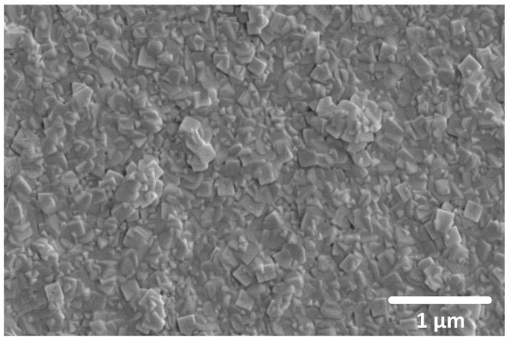  
a

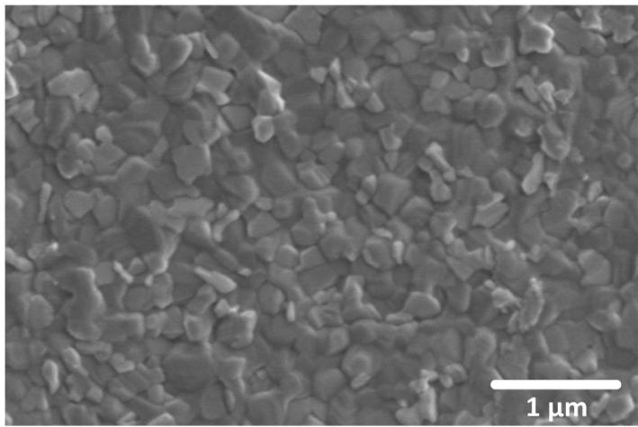  
b   
Extended Data Figure 1 | Top-view SEM images for the vapour-deposited perovskite films. a, As-deposited perovskite film; b, post-annealed perovskite film.

Extended Data Table 1 | Tooling factor measurement of the dual-source vapour-deposition system.   

<table><tr><td>Source</td><td>Density</td><td>Evaporation rate</td><td>Values on sensors</td><td>Actual film thickness (mean)</td><td>Tooling factor</td></tr><tr><td>Source 1: CH3NH3I</td><td>1 g cm-3*</td><td>15 Ås-1</td><td>30 kÅ</td><td>1.39 μm</td><td>2.16</td></tr><tr><td>Source 2: PbCl2</td><td>5.85 g cm-3</td><td>5 Ås-1</td><td>10 kÅ</td><td>185 nm</td><td>5.41</td></tr></table>

* The density of $C H _ { 3 } N H _ { 3 } |$ is assumed to be $1 \mathrm { g c m } ^ { - 3 }$ because its precise density is not known.

Extended Data Table 2 | Optimized deposition conditions for the evaporated perovskite solar devices.   

<table><tr><td>Source</td><td>Evaporation rate</td><td>Values on sensors</td><td>Tooling factor</td><td>Actual deposited equivalent thickness</td><td>Approximate molar ratio on substrate (CH3NH3I : PbCl2)</td></tr><tr><td>Source 1: CH3NH3I</td><td>5.3±0.8 Ås-1</td><td>42.4 kÅ</td><td>2.16</td><td>1.96 μm</td><td rowspan="2">4:1</td></tr><tr><td>Source 2: PbCl2</td><td>1 Ås-1</td><td>8 kÅ</td><td>5.41</td><td>148 nm</td></tr></table>

We have used the densities shown in Extended Data Table 1 and the relative molecular mass of 157 for CH NH I and 278 for $\mathsf { P b C l } _ { 2 }$ to calculate the relative molar ratio of as-deposited material.