# Roll-to-Roll Perovskite Solar Cell Modules

> **Original work:** Hasitha C. Weerasinghe, Nasiruddin Macadam, Jueng-Eun Kim, et al. "The first demonstration of entirely roll-to-roll fabricated perovskite solar cell modules under ambient room conditions." *Nature Communications* 15, 46016 (2024). [DOI: https://doi.org/10.1038/s41467-024-46016-1](https://doi.org/10.1038/s41467-024-46016-1)

<!-- badges:start -->
<!-- badges:end -->

> [!NOTE]
> This README is an AI-generated analysis based on a [Gaia](https://github.com/SiliconEinstein/Gaia) reasoning graph formalization of the original work. Belief values reflect the graph's probabilistic assessment of each claim's support, not the original authors' confidence. See [ANALYSIS.md](ANALYSIS.md) for detailed verification results.

## Overview

This paper demonstrates the first fully roll-to-roll (R2R) fabricated perovskite solar cell (PeSC) modules produced under ambient room conditions. The work addresses the critical challenge of translating laboratory-scale solution-based perovskite deposition to continuous manufacturing by developing: (i) a printing-friendly sequential deposition (PFSD) technique using sub-stoichiometric organic cations to control crystallization, (ii) a perovskite-friendly carbon ink to replace costly vacuum-deposited gold electrodes, and (iii) a high-throughput R2R experimental platform enabling rapid optimization over large parameter spaces. The optimized devices achieve up to 15.5% PCE for individual cells and 11.0% PCE for serially-interconnected modules, with a projected manufacturing cost of approximately 0.7 USD/W_p at scale.

```mermaid
---
config:
  flowchart:
    rankSpacing: 80
    nodeSpacing: 30
---
graph TB
    lab_scale_limitation["★ Lab-scale fabrication limitations\n(0.85 → 0.85)"]:::exported
    vacuum_electrode_cost["★ Vacuum electrode cost barrier\n(0.90 → 0.90)"]:::exported
    commercial_tce_cost["★ Transparent conductive electrode cost\n(0.85 → 0.85)"]:::exported
    r2r_promise["★ R2R manufacturing advantages\n(0.50 → 0.69)"]:::exported
    manufacturing_challenge["★ R2R manufacturing challenges\n(0.50 → 0.67)"]:::exported
    pfsd_demonstration["★ PFSD technique enables R2R PeSCs\n(0.50 → 0.67)"]:::exported
    cost_prediction["★ R2R PeSC manufacturing cost prediction\n(0.70 → 0.70)"]:::exported
    pfsd_technique_description["★ PFSD technique uses sub-stoichiometric organic cations\n(0.80 → 0.80)"]:::exported
    pfsd_advantage["★ PFSD enables rapid perovskite conversion\n(0.50 → 0.70)"]:::exported
    shallow_angle_blowing["★ Shallow-angle blowing technique for R2R\n(0.50 → 0.70)"]:::exported
    edge_blowing_result["★ Edge-blowing produces uniform perovskite films\n(0.50 → 0.62)"]:::exported
    xrd_analysis["★ XRD shows no PbI₂ residual in edge-blown films\n(0.50 → 0.66)"]:::exported
    sem_improvement["★ SEM confirms improved film morphology\n(0.50 → 0.66)"]:::exported
    humidity_tolerance["★ Shallow-angle blowing enhances humidity tolerance\n(0.50 → 0.62)"]:::exported
    pfsd_record_pce["★ PFSD enables up to 17.9% PCE with Au electrodes\n(0.50 → 0.61)"]:::exported
    carbon_electrode_replacement["★ Carbon ink replaces vacuum electrodes\n(0.50 → 0.72)"]:::exported
    high_throughput_capability["★ High-throughput R2R fabrication and testing\n(0.85 → 0.85)"]:::exported
    throughput_example["★ 1600 PeSCs tested with 20 parameter combinations\n(0.50 → 0.71)"]:::exported
    maistoi_ratio_effect["★ Stoichiometric MAI content yields best performance\n(0.50 → 0.68)"]:::exported
    thicker_film_behavior["★ Thickness-dependent performance trends\n(0.50 → 0.68)"]:::exported
    composition_dependence["★ Composition-dependent device performance identified\n(0.50 → 0.62)"]:::exported
    htab_p3ht_introduction["★ HTAB-P3HT HTL system introduced\n(0.50 → 0.66)"]:::exported
    htab_passivation["★ HTAB provides surface passivation and molecular anchoring\n(0.80 → 0.80)"]:::exported
    p3ht_heating_requirement["★ Substrate heating enables uniform P3HT coating\n(0.75 → 0.75)"]:::exported
    htab_p3ht_outperforms["★ HTAB-P3HT outperforms PPDT2FBT\n(0.50 → 0.65)"]:::exported
    reliable_production["★ Reliable 13% average PCE across humidity conditions\n(0.50 → 0.66)"]:::exported
    best_cell_performance["★ Best cell achieves 15.5% PCE\n(0.50 → 0.58)"]:::exported
    film_thickness_range["★ Perovskite film thickness 600-1000 nm\n(0.50 → 0.68)"]:::exported
    module_scalability["★ Module fabrication uses scaled-up SD coating\n(0.50 → 0.65)"]:::exported
    five_channel_deposition["★ Five-channel SD coating for module production\n(0.50 → 0.66)"]:::exported
    carbon_ink_deposition["★ RG carbon coating and screen printing for module electrodes\n(0.50 → 0.68)"]:::exported
    silver_grid_design["★ Silver grid design for optimal charge collection\n(0.50 → 0.67)"]:::exported
    carbon_sheet_resistance["★ High carbon sheet resistance requires grid design\n(0.50 → 0.67)"]:::exported
    module_active_area["★ Module active area ~50 cm²\n(0.50 → 0.66)"]:::exported
    module_gff["★ Module GFF is 75% due to stripe pattern limitation\n(0.50 → 0.67)"]:::exported
    module_performance["★ Module achieves up to 11.0% PCE\n(0.50 → 0.61)"]:::exported
    sequence_a_description["★ Sequence A has vacuum-deposited Au electrode\n(0.50 → 0.69)"]:::exported
    sequence_b_description["★ Sequence B uses printed carbon electrode\n(0.50 → 0.65)"]:::exported
    sequence_c_description["★ Sequence C eliminates TCE and silver grids\n(0.50 → 0.66)"]:::exported
    cost_fraction_sequence_a["★ Seq A: Au electrode and TCE are highest cost components\n(0.50 → 0.67)"]:::exported
    cost_fraction_sequence_b["★ Seq B: TCE and encapsulation are highest cost components\n(0.50 → 0.66)"]:::exported
    production_cost_area["★ Module production cost per area\n(0.50 → 0.59)"]:::exported
    production_cost_power["★ Module production cost per peak watt\n(0.50 → 0.55)"]:::exported
    cost_reduction_achieved["★ Cost reduction achieved but still above Si\n(0.50 → 0.64)"]:::exported
    market_position["★ R2R PeSCs competitive in portable PV market\n(0.50 → 0.61)"]:::exported
    future_improvement_needed["★ Silver-free modules needed for long-term stability\n(0.50 → 0.60)"]:::exported
    future_cost_potential["★ Further cost reduction potential identified\n(0.50 → 0.67)"]:::exported
    five_stripe_flow_rates["★ Module flow rates for five-stripe coating\n(0.50 → 0.66)"]:::exported
    first_demo_conclusion["★ World-first fully R2R-fabricated PeSC modules\n(0.50 → 0.57)"]:::exported
    carbon_ink_achievement["★ Carbon ink replaces vacuum electrodes\n(0.50 → 0.64)"]:::exported
    throughput_system["★ Automated R2R systems enable high-throughput\n(0.50 → 0.66)"]:::exported
    cell_record["★ 15.5% PCE record for fully R2R-fabricated cells\n(0.50 → 0.57)"]:::exported
    module_record["★ 11% PCE for fully R2R-printed modules\n(0.50 → 0.60)"]:::exported
    cost_conclusion["★ 0.7 USD/W_p manufacturing cost predicted\n(0.50 → 0.59)"]:::exported
    future_direction["★ Silver-free modules as next development target\n(0.50 → 0.61)"]:::exported
    strat_0(["infer\n0.11 bits"]):::weak
    best_cell_performance --> strat_0
    htab_p3ht_outperforms --> strat_0
    pfsd_advantage --> strat_0
    strat_0 --> cell_record
    strat_1(["infer\n0.30 bits"]):::weak
    best_cell_performance --> strat_1
    strat_1 --> module_scalability
    strat_2(["infer\n0.11 bits"]):::weak
    best_cell_performance --> strat_2
    module_performance --> strat_2
    production_cost_area --> strat_2
    strat_2 --> production_cost_power
    strat_3(["infer\n0.20 bits"]):::weak
    carbon_electrode_replacement --> strat_3
    carbon_ink_deposition --> strat_3
    strat_3 --> carbon_ink_achievement
    strat_4(["infer\n0.30 bits"]):::weak
    carbon_electrode_replacement --> strat_4
    strat_4 --> carbon_ink_deposition
    strat_5(["infer\n0.11 bits"]):::weak
    carbon_electrode_replacement --> strat_5
    module_performance --> strat_5
    pfsd_demonstration --> strat_5
    strat_5 --> first_demo_conclusion
    strat_6(["infer\n0.28 bits"]):::weak
    carbon_electrode_replacement --> strat_6
    commercial_tce_cost --> strat_6
    strat_6 --> sequence_b_description
    strat_7(["infer\n0.30 bits"]):::weak
    carbon_ink_deposition --> strat_7
    strat_7 --> carbon_sheet_resistance
    strat_8(["infer\n0.30 bits"]):::weak
    carbon_sheet_resistance --> strat_8
    strat_8 --> silver_grid_design
    strat_9(["infer\n0.28 bits"]):::weak
    commercial_tce_cost --> strat_9
    vacuum_electrode_cost --> strat_9
    strat_9 --> sequence_a_description
    strat_10(["infer\n0.25 bits"]):::weak
    cost_prediction --> strat_10
    future_improvement_needed --> strat_10
    strat_10 --> future_direction
    strat_11(["infer\n0.25 bits"]):::weak
    cost_prediction --> strat_11
    module_performance --> strat_11
    strat_11 --> market_position
    strat_12(["infer\n0.20 bits"]):::weak
    edge_blowing_result --> strat_12
    sem_improvement --> strat_12
    strat_12 --> humidity_tolerance
    strat_13(["infer\n0.30 bits"]):::weak
    edge_blowing_result --> strat_13
    strat_13 --> sem_improvement
    strat_14(["infer\n0.30 bits"]):::weak
    edge_blowing_result --> strat_14
    strat_14 --> xrd_analysis
    strat_15(["infer\n0.11 bits"]):::weak
    film_thickness_range --> strat_15
    htab_p3ht_outperforms --> strat_15
    reliable_production --> strat_15
    strat_15 --> best_cell_performance
    strat_16(["infer\n0.30 bits"]):::weak
    five_channel_deposition --> strat_16
    strat_16 --> five_stripe_flow_rates
    strat_17(["infer\n0.30 bits"]):::weak
    five_channel_deposition --> strat_17
    strat_17 --> module_active_area
    strat_18(["infer\n0.20 bits"]):::weak
    future_cost_potential --> strat_18
    production_cost_power --> strat_18
    strat_18 --> cost_conclusion
    strat_19(["infer\n0.23 bits"]):::weak
    high_throughput_capability --> strat_19
    strat_19 --> throughput_example
    strat_20(["infer\n0.28 bits"]):::weak
    high_throughput_capability --> strat_20
    throughput_example --> strat_20
    strat_20 --> throughput_system
    strat_21(["infer\n0.30 bits"]):::weak
    htab_p3ht_outperforms --> strat_21
    strat_21 --> htab_p3ht_introduction
    strat_22(["infer\n0.30 bits"]):::weak
    htab_p3ht_outperforms --> strat_22
    strat_22 --> reliable_production
    strat_23(["infer\n0.31 bits"]):::weak
    htab_passivation --> strat_23
    p3ht_heating_requirement --> strat_23
    strat_23 --> htab_p3ht_outperforms
    strat_24(["infer\n0.20 bits"]):::weak
    humidity_tolerance --> strat_24
    pfsd_advantage --> strat_24
    strat_24 --> pfsd_record_pce
    strat_25(["infer\n0.28 bits"]):::weak
    lab_scale_limitation --> strat_25
    vacuum_electrode_cost --> strat_25
    strat_25 --> r2r_promise
    strat_26(["infer\n0.20 bits"]):::weak
    maistoi_ratio_effect --> strat_26
    thicker_film_behavior --> strat_26
    strat_26 --> composition_dependence
    strat_27(["infer\n0.30 bits"]):::weak
    manufacturing_challenge --> strat_27
    strat_27 --> pfsd_demonstration
    strat_28(["infer\n0.20 bits"]):::weak
    market_position --> strat_28
    silver_grid_design --> strat_28
    strat_28 --> future_improvement_needed
    strat_29(["infer\n0.30 bits"]):::weak
    module_active_area --> strat_29
    strat_29 --> module_gff
    strat_30(["infer\n0.20 bits"]):::weak
    module_gff --> strat_30
    silver_grid_design --> strat_30
    strat_30 --> module_performance
    strat_31(["infer\n0.20 bits"]):::weak
    module_performance --> strat_31
    module_scalability --> strat_31
    strat_31 --> module_record
    strat_32(["infer\n0.30 bits"]):::weak
    module_scalability --> strat_32
    strat_32 --> five_channel_deposition
    strat_33(["infer\n0.20 bits"]):::weak
    pfsd_advantage --> strat_33
    shallow_angle_blowing --> strat_33
    strat_33 --> edge_blowing_result
    strat_34(["infer\n0.26 bits"]):::weak
    pfsd_technique_description --> strat_34
    strat_34 --> pfsd_advantage
    strat_35(["infer\n0.26 bits"]):::weak
    pfsd_technique_description --> strat_35
    strat_35 --> shallow_angle_blowing
    strat_36(["infer\n0.30 bits"]):::weak
    production_cost_power --> strat_36
    strat_36 --> cost_reduction_achieved
    strat_37(["infer\n0.30 bits"]):::weak
    r2r_promise --> strat_37
    strat_37 --> manufacturing_challenge
    strat_38(["infer\n0.30 bits"]):::weak
    sequence_a_description --> strat_38
    strat_38 --> cost_fraction_sequence_a
    strat_39(["infer\n0.11 bits"]):::weak
    sequence_a_description --> strat_39
    sequence_b_description --> strat_39
    sequence_c_description --> strat_39
    strat_39 --> production_cost_area
    strat_40(["infer\n0.30 bits"]):::weak
    sequence_b_description --> strat_40
    strat_40 --> cost_fraction_sequence_b
    strat_41(["infer\n0.30 bits"]):::weak
    sequence_b_description --> strat_41
    strat_41 --> sequence_c_description
    strat_42(["infer\n0.30 bits"]):::weak
    sequence_c_description --> strat_42
    strat_42 --> future_cost_potential
    strat_43(["infer\n0.30 bits"]):::weak
    throughput_example --> strat_43
    strat_43 --> film_thickness_range
    strat_44(["infer\n0.30 bits"]):::weak
    throughput_example --> strat_44
    strat_44 --> maistoi_ratio_effect
    strat_45(["infer\n0.30 bits"]):::weak
    throughput_example --> strat_45
    strat_45 --> thicker_film_behavior
    strat_46(["infer\n0.18 bits"]):::weak
    vacuum_electrode_cost --> strat_46
    strat_46 --> carbon_electrode_replacement

    classDef premise fill:#ddeeff,stroke:#4488bb,color:#333
    classDef exported fill:#d4edda,stroke:#28a745,stroke-width:2px,color:#333
    classDef weak fill:#fff9c4,stroke:#f9a825,stroke-dasharray: 5 5,color:#333
    classDef contra fill:#ffebee,stroke:#c62828,color:#333
```

> [!NOTE]
> **[Per-module reasoning graphs with full claim details](docs/detailed-reasoning.md)**
>
> 7 Mermaid diagrams (one per section) with every claim, strategy, and belief value.

## Reasoning Structure

### Lab-scale limitations and the R2R manufacturing promise

Lab-scale perovskite solar cells are fabricated using materials and methods that are not economically viable for scale-up, including spin coating, vacuum-deposited electrodes, and controlled atmosphere processing (belief: 0.85). The highest-cost component in typical PeSCs is the vacuum-processed Au electrode, followed by transparent conductive electrodes (TCEs) with sheet resistance of approximately 8 ohms per square (belief: 0.90). These cost barriers make R2R manufacturing attractive because it enables high-volume, continuous production at low cost, but imposes technical challenges including time and temperature constraints on a moving substrate (belief: 0.69 from prior 0.85).

**Evidence support:**
- **Lab-scale limitations** (belief 0.85): Well-documented in literature that solution-based methods used in lab cells cannot be economically scaled. This is a high-confidence premise.
- **Vacuum electrode cost** (belief 0.90): Widely recognized as the highest-cost PeSC component; this is well-established in the field.
- **R2R advantages-to-challenges chain** (weakest link belief 0.67): The inference that R2R manufacturing challenges follow from R2R advantages is relatively direct, but the jump from lab-scale limitations to "R2R is the solution" involves an assumption that the technology can overcome these barriers.

### The PFSD technique for controlled perovskite crystallization

The printing-friendly sequential deposition (PFSD) technique enables R2R PeSC fabrication by adding organic cations at less than 50 mol% of PbI2, far below the stoichiometric amount required for perovskite formation (belief: 0.80). This sub-stoichiometric loading creates an amorphous intermediate film with excellent film-forming properties that can be rapidly converted to perovskite upon subsequent MAI deposition. The technique produces films with no detectable PbI2 residual by XRD and improved morphology by SEM (belief: 0.66). With PFSD and vacuum-deposited Au electrodes, up to 17.9% PCE was achieved, and the shallow-angle blowing technique developed for R2R scaling produces more uniform films than conventional right-angle blowing (belief: 0.70).

**Evidence support:**
- **PFSD mechanism** (belief 0.80): The sub-stoichiometric organic cation loading is a specific technical claim demonstrated in the paper. High confidence because it is a direct description of their method.
- **XRD and SEM validation** (belief 0.66): Direct experimental characterization supports the film quality claims. The belief is moderated by the usual uncertainty in translating lab-scale characterization to continuous R2R conditions.
- **Shallow-angle blowing innovation** (belief 0.70): The edge-blowing approach is novel and shows clear improvement, but the mechanism for why shallow angle works better is somewhat empirical.

*Schematic of the shallow-angle blowing technique for R2R perovskite fabrication. The angle of incidence can be adjusted to near-zero degrees by repositioning the blower head. Adapted from Weerasinghe et al.*

### Carbon ink replacement of vacuum electrodes

A major contribution is the development of a perovskite-friendly carbon ink that replaces vacuum-deposited gold electrodes, which are the highest-cost component in PeSC manufacturing (belief: 0.72 from prior 0.90). The carbon ink uses a two-stage preparation: first a high-viscosity EC binder + carbon pigment dispersion, then dilution with PGMEA solvent. The carbon layer has sheet resistance of approximately 800 ohms per square, requiring silver grid design for optimal charge collection. This enables the transition from vacuum-based Sequence A (high-cost, high-performance with Au) to fully printed Sequence B (fully R2R-fabricated with carbon electrode).

**Evidence support:**
- **Vacuum electrode replacement** (belief 0.72): The inference from high vacuum electrode cost to carbon replacement is straightforward, but depends on whether the carbon ink truly achieves comparable function. The paper demonstrates functional devices, giving moderate confidence.
- **Carbon sheet resistance** (belief 0.67): Direct measurement shows 800 ohms per square is high compared to ITO (10-15 ohms/sq), requiring grid design. The paper's silver grid solution addresses this.
- **Sequence B description** (belief 0.65): Builds on carbon electrode replacement and commercial TCE cost to describe the fully printed configuration.

### High-throughput R2R optimization platform

A programmable R2R SD coater was developed for unmanned operation, enabling fabrication and testing of thousands of cells per day (belief: 0.85). Using this platform, 1600 cells were produced and tested across 20 parameter combinations, exploring the effects of MAI/PbI2 stoichiometry, film thickness, and composition. The key finding from this high-throughput study is that devices with MAI content close to stoichiometric amounts show better performance (belief: 0.68), and thicker films show composition-dependent behavior where MAI-deficient films perform better (belief: 0.68). This systematic exploration enabled reliable production of cells with approximately 13% average PCE across varying humidity conditions.

**Evidence support:**
- **High-throughput capability** (belief 0.85): Well-demonstrated capability with clear numbers (1600 cells, 20 combinations). High confidence because the claim describes a capability they actually built and used.
- **MAI stoichiometry effect** (belief 0.68): Based on systematic experimental variation. The belief is moderated by whether the specific optimal composition generalizes to other conditions.
- **Reliability across humidity** (belief 0.66): Multiple batches under different conditions show consistent ~13% average PCE, supporting reproducibility claim.

### HTAB-P3HT hole transport layer system

A significant improvement came from introducing the HTAB-P3HT hole transport layer system, where HTAB (hexadecyltrimethylammonium bromide) provides both surface passivation of the perovskite and molecular anchoring for P3HT (belief: 0.80). Uniform P3HT coating requires substrate heating to 45 degrees C to lower viscosity (belief: 0.75). The HTAB-P3HT system clearly outperforms the previous PPDT2FBT HTL, with devices showing higher VOC and better stability (belief: 0.65). This enables the best cell performance of 15.5% PCE with 19.9 mA/cm2 JSC, 76.1% fill factor, and VOC not specified in the conclusion but implied by the PCE calculation.

**Evidence support:**
- **HTAB passivation mechanism** (belief 0.80): Well-established literature mechanism for surface trap passivation and molecular anchoring. High confidence because this is a known effect in the perovskite literature.
- **P3HT heating requirement** (belief 0.75): Specific technical parameter demonstrated in the paper. Moderate-high confidence.
- **HTAB-P3HT superiority** (belief 0.65): The inference from HTAB passivation and P3HT heating to HTAB-P3HT outperforming PPDT2FBT depends on the specific comparison data. The claim is supported but the relative performance may be condition-dependent.
- **Best cell 15.5% PCE** (belief 0.58): This is the record claim for fully R2R cells. The belief is moderated by the multi-step inference chain (film thickness, HTAB-P3HT performance, reliable production all contribute).

### Module fabrication and performance

Module fabrication scaled up the optimized cell parameters using five-channel SD coating, with flow rates scaled from single-stripe optimization (belief: 0.66). The module comprises five series-connected strip cells on a flexible substrate, with active area approximately 50 cm2 and geometric fill factor of 75% due to the stripe pattern limitation (belief: 0.67). The entirely R2R-fabricated modules achieve up to 11.0% active-area-based PCE (belief: 0.61). The silver grid design achieves minimal coverage while maintaining adequate charge collection, but the printed silver may not be suitable for long-term outdoor operation, requiring silver-free alternatives in the future (belief: 0.60).

**Evidence support:**
- **Five-channel scaling** (belief 0.66): Direct multiplication of single-stripe flow rates by five. Simple but reasonable scaling assumption.
- **Module GFF 75%** (belief 0.67): The geometric fill factor is determined by the stripe width and spacing. The 75% value reflects the practical limitation of the interconnection pattern.
- **11% module PCE** (belief 0.61): The inference from module GFF and silver grid design to module performance involves multiple assumptions about series resistance and fill factor losses.

### Manufacturing cost analysis

A cost model based on the demonstrated devices and materials predicts manufacturing cost of approximately 0.7 USD/W_p for a production rate of 1,000,000 m2 per year in Australia (belief: 0.70). For Sequence A (vacuum-deposited Au), the Au electrode and TCE are the highest cost components. For Sequence B (fully printed), the TCE and encapsulation dominate. Sequence C (eliminating TCE and silver grids entirely) offers potential for further significant cost reduction but was not experimentally demonstrated. The cost reduction achieved brings R2R PeSCs closer to crystalline silicon cost levels, but still above parity, positioning them competitively in portable PV markets where form factor and flexibility provide added value (belief: 0.61).

**Evidence support:**
- **0.7 USD/W_p projection** (belief 0.70): Based on demonstrated device performance and established cost models. This is a prediction for future production scale, so some uncertainty is appropriate.
- **Cost fraction analysis** (belief 0.67/0.66): The attribution of cost fractions to specific components follows logically from the material costs, but the model involves assumptions about yields and overhead.
- **Market positioning** (belief 0.61): The inference from cost and efficiency to market position involves market surveys and competitive analysis that are somewhat subjective.

### World-first demonstrations and records

This work achieves two world-first demonstrations: the first fully R2R-printed individual PeSCs with 15.5% PCE (belief: 0.57), and the first PeSC modules produced using only industry-relevant R2R techniques under ambient room conditions with 11.0% PCE (belief: 0.60). The record cell efficiency of 15.5% for fully R2R-fabricated cells represents significant progress from the prior 10.8% record set earlier in 2023. The projected manufacturing cost of approximately 0.7 USD/W_p positions this technology for emerging PV markets where lightweight flexibility provides unique value.

**Evidence support:**
- **15.5% cell record** (belief 0.57): The lowest belief among the key records. This reflects the complex multi-step inference required: best cell performance depends on film thickness, HTAB-P3HT properties, and reliable production, each contributing uncertainty.
- **11% module record** (belief 0.60): Slightly higher confidence because module performance inference has fewer intermediate steps.
- **0.7 USD/W_p cost** (belief 0.59): The cost projection depends on production volume assumptions and may not reflect realized manufacturing costs.

## Key Findings

| Conclusion | Belief | Key Evidence |
|------------|--------|--------------|
| Best cell achieves 15.5% PCE | 0.58 | HTAB-P3HT HTL, film thickness 600-1000 nm, reliable 13% average |
| PFSD enables 17.9% PCE with Au | 0.61 | PFSD technique, shallow-angle blowing, humidity tolerance |
| Carbon ink replaces vacuum electrodes | 0.72 | Two-stage ink prep, 800 Ω/sq sheet resistance, functional devices |
| 11.0% PCE for R2R modules | 0.61 | Five-channel coating, 75% GFF, silver grid design |
| 0.7 USD/W_p manufacturing cost | 0.59 | Cost model, Sequence A/B/C comparison, market positioning |
| 1600 cells tested across 20 conditions | 0.71 | High-throughput platform capability, systematic variation |
| HTAB provides surface passivation | 0.80 | Known mechanism in perovskite literature |

Weak Points Analysis

The reasoning graph identifies several structural weaknesses worth noting:

1. **Cell record belief (0.58) is lowest among key claims**: The 15.5% PCE record for fully R2R-fabricated cells depends on a multi-premise inference chain combining film thickness range, HTAB-P3HT performance, and reliable production statistics. Each of these contributes uncertainty, and the multiplicative effect of the chain reduces the final belief. The graph suggests this is the weakest major conclusion despite the paper presenting it as a key achievement.

2. **Cost projection (0.59) carries forward uncertainty from production scale**: The 0.7 USD/W_p prediction is for a hypothetical production rate of 1,000,000 m2/year in Australia. This extrapolates from lab-scale demonstration to manufacturing scale, incorporating assumptions about yield, throughput, and material costs that have not been validated in an actual production setting.

3. **Module GFF (75%) represents a significant geometric loss**: The 75% geometric fill factor means 25% of the module area is inactive due to the stripe pattern and interconnection design. While acknowledged as a limitation, the graph's structural constraints do not propagate this back to a specific process improvement claim. The silver grid design mitigates series resistance but does not recover the geometric loss.

4. **High-throughput findings may be condition-specific**: The optimal MAI stoichiometry and film thickness findings come from a specific parameter space exploration (20 combinations). The graph does not assert generality, and the belief values for composition dependence (0.62) and thickness effects (0.68) are appropriately moderated.

5. **Sequence C is theoretical, not demonstrated**: The lowest-cost manufacturing scenario (Sequence C, eliminating TCE and silver grids entirely) is a modeling exercise, not an experimentally demonstrated process. The graph correctly propagates this as higher uncertainty.

Evidence Gaps & Future Work

**Experimental gaps:**
- Long-term stability data for R2R-fabricated devices under outdoor operating conditions is limited. The paper acknowledges that printed silver may not be suitable for long-term operation, and accelerated lifetime testing would strengthen the technology viability claims.
- Sequence C (silver-free, TCE-free modules) was not experimentally demonstrated. Actual fabrication and testing of these ultra-low-cost modules would validate the cost model projections.
- Humidity tolerance is demonstrated but the mechanism could be investigated more thoroughly. The paper notes enhanced humidity tolerance with shallow-angle blowing but does not fully characterize why.

**Computational gaps:**
- The cost model uses a production rate assumption of 1,000,000 m2/year. Sensitivity analysis to different production volumes would show the cost trajectory as manufacturing scale increases.
- Model validation against actual R2R manufacturing costs from other thin-film technologies (organic PV, DSSC) would provide calibration benchmarks.

**Theoretical gaps:**
- The PFSD mechanism for sub-stoichiometric organic cation loading is empirically validated but the fundamental crystallization pathway could be characterized in more detail. In situ XRD during R2R processing would illuminate the phase transformation kinetics.
- The HTAB passivation mechanism is assumed from literature but not directly demonstrated in this work. Chemical analysis (XPS, FTIR) of the perovskite/HTAB interface would strengthen this claim.

## Detailed Analysis

For structural integrity verification (Pass 5), standalone readability checks (Pass 6),
and complete package statistics, see [ANALYSIS.md](ANALYSIS.md).

## Conclusions

| Label | Content | Prior | Belief |
|-------|---------|-------|--------|
| best_cell_performance | The best-performing device achieved 15.5% PCE, 19.9 mA cm⁻² J_sc, 76.1% FF | 0.50 | 0.58 |
| carbon_electrode_replacement | Carbon ink replaces vacuum-processed metal electrodes | 0.50 | 0.72 |
| cell_record | 15.5% PCE record for fully R2R-fabricated cells | 0.50 | 0.57 |
| module_record | 11% PCE for fully R2R-printed modules | 0.50 | 0.60 |
| first_demo_conclusion | World-first fully R2R-fabricated PeSC modules | 0.50 | 0.57 |
| pfsd_record_pce | PFSD enables up to 17.9% PCE with Au electrodes | 0.50 | 0.61 |
| cost_prediction | ~0.7 USD/W_p manufacturing cost at 1,000,000 m²/year | 0.70 | 0.70 |
| high_throughput_capability | Fabrication and testing of thousands of cells per day | 0.85 | 0.85 |
| htab_passivation | HTAB provides surface passivation and molecular anchoring | 0.80 | 0.80 |
| pfsd_technique_description | PFSD uses sub-stoichiometric organic cations (<50 mol% of PbI₂) | 0.80 | 0.80 |
| vacuum_electrode_cost | Vacuum-processed Au is the highest-cost PeSC component | 0.90 | 0.90 |
| lab_scale_limitation | Lab-scale methods are not economically viable for scale-up | 0.85 | 0.85 |
| commercial_tce_cost | TCE with ~8 Ω sq⁻¹ sheet resistance is a significant cost component | 0.85 | 0.85 |
| module_performance | Module achieves up to 11.0% PCE | 0.50 | 0.61 |
| cost_conclusion | 0.7 USD/W_p manufacturing cost predicted | 0.50 | 0.59 |