# pvsks41560-023-01254-3-gaia

> **Original work:** Hangyu Gu, Chengbin Fei, Guang Yang, Bo Chen, Md Aslam Uddin, Hengkai Zhang, Zhenyi Ni, Haoyang Jiao, Wenzhan Xu, Zijie Yan & Jinsong Huang. "Design optimization of bifacial perovskite minimodules for improved efficiency and stability." *Nature Energy* 8, 628-637 (2023). [DOI: 10.1038/s41560-023-01254-3](https://doi.org/10.1038/s41560-023-01254-3)

<!-- badges:start -->
<!-- badges:end -->

## Overview

> [!TIP]
> **Reasoning graph information gain: `3.8 bits`**
>
> Total mutual information between leaf premises and exported conclusions — measures how much the reasoning structure reduces uncertainty about the results.

```mermaid
---
config:
  flowchart:
    rankSpacing: 80
    nodeSpacing: 30
---
graph TB
    bifacial_gain_background["★ Bifacial silicon modules show 5-30% power gain\n(0.85 → 0.87)"]:::exported
    research_objective["★ Research objective: record efficiency and stability\n(0.90 → 0.98)"]:::exported
    front_efficiency_record["★ Front efficiency comparable to monofacial record\n(0.50 → 0.97)"]:::exported
    stability_demonstrated["★ 97% retention after 6000h light soaking\n(0.50 → 0.81)"]:::exported
    power_generation_density_measurement["★ PGD of 26.4 mW/cm2 at albedo 0.2\n(0.50 → 0.96)"]:::exported
    ag_grid_design["★ Ag grid design balances resistance and shading\n(0.85 → 0.90)"]:::exported
    optimal_ag_grid_spacing["★ Optimal Ag grid spacing ~2mm reduces PCE loss to <0.9%\n(0.85 → 0.91)"]:::exported
    relative_pce_loss_reduction["★ PCE loss reduced from 8.6% to <0.9% with Ag grid\n(0.85 → 0.90)"]:::exported
    ff_improvement_with_ag_grid["★ FF increases from 0.70 to 0.77, bifacial gain 15%\n(0.90 → 0.98)"]:::exported
    bifacial_gain_percentage["★ 15% bifacial power gain at albedo 0.2\n(0.50 → 0.88)"]:::exported
    simulated_pgds_by_albedo["★ Simulated PGDs: 21.5-26.4 mW/cm2 for albedos 0.1-0.4\n(0.80 → 0.86)"]:::exported
    tpfb_in_htl_protection["★ TPFB in HTL protects perovskite from moisture\n(0.85 → 0.94)"]:::exported
    tpfb_spread_to_perovskite["★ 35% of TPFB spreads from HTL to perovskite surface\n(0.85 → 0.94)"]:::exported
    hydrophobic_surface_confirmation["★ TPFB increases surface hydrophobicity\n(0.85 → 0.98)"]:::exported
    tpfb_passivation_effect["★ TPFB passivates perovskite, increases PL and lifetime\n(0.85 → 0.99)"]:::exported
    tpfb_reduced_trap_density["★ TPFB reduces trap density of states\n(0.85 → 0.89)"]:::exported
    tpfb_frei_level_ptaa["★ TPFB p-dopes PTAA, lowers Fermi level to -4.82 eV\n(0.85 → 0.90)"]:::exported
    ff_improvement_tpfb["★ FF increases from 0.68 to 0.76 with TPFB in HTL\n(0.90 → 0.98)"]:::exported
    tpfb_enhanced_stability["★ TPFB enhances perovskite stability under light\n(0.80 → 0.95)"]:::exported
    sio2_np_light_scattering["★ SiO2 NPs scatter light via Mie resonance\n(0.85 → 0.89)"]:::exported
    optimal_np_size_range["★ Optimal NP size 400-600nm for red/NIR scattering\n(0.80 → 0.86)"]:::exported
    optimal_np_spacing_range["★ Optimal NP spacing 1-1.5 um gives 5.4-19.8% more 800nm absorption\n(0.80 → 0.86)"]:::exported
    absorption_enhancement_simulation["★ FDTD shows 5.4-19.8% enhanced 800nm absorption with optimal NP spacing\n(0.80 → 0.96)"]:::exported
    np_synthesis_and_embedding["★ 500nm SiO2 NPs embedded by blade coating at 30 mg/ml\n(0.85 → 0.90)"]:::exported
    no_extra_recombination_from_np["★ SiO2 NPs do not introduce extra recombination\n(0.85 → 0.93)"]:::exported
    jsc_increase_with_optimal_np["★ Jsc increases from 23.1 to 23.9 mA/cm2 with optimal NPs\n(0.90 → 0.98)"]:::exported
    front_pce_improvement_with_np["★ PCE increases from 22.1% to 23.2% with optimal SiO2 NPs\n(0.90 → 0.99)"]:::exported
    small_cell_front_pce["★ Small cell front PCE ~20.2%\n(0.90 → 0.94)"]:::exported
    small_cell_rear_pce["★ Small cell rear PCE 18.5%, bifaciality ~80%\n(0.90 → 0.94)"]:::exported
    bifaciality_small_cell["★ Small cell bifaciality ~80%\n(0.90 → 0.99)"]:::exported
    power_generation_density_albedo_02["★ PGD 26.4 mW/cm2 at albedo 0.2 - best single-junction\n(0.85 → 0.90)"]:::exported
    minimodule_front_aperture_efficiency["★ Minimodule front 20.2%, rear 15.0%, area >20 cm2\n(0.90 → 0.96)"]:::exported
    minimodule_rear_aperture_efficiency["★ Minimodule rear efficiency 15.0%, bifaciality 74.3%\n(0.90 → 0.96)"]:::exported
    nrel_certified_front_efficiency["★ NREL certified stabilized front efficiency 19.2%\n(0.95 → 0.99)"]:::exported
    average_front_efficiency_8_modules["★ Average front efficiency 19.5% across 8 modules\n(0.85 → 0.90)"]:::exported
    average_rear_efficiency_8_modules["★ Average rear efficiency 14.5% across 8 modules\n(0.85 → 0.90)"]:::exported
    pgd_by_albedo["★ Average PGD 22.4-25.3 mW/cm2 for albedos 0.2-0.4\n(0.85 → 0.99)"]:::exported
    initial_pce_retention_6000h["★ 97% retention after 6000h light soaking at 60C\n(0.90 → 0.96)"]:::exported
    damp_heat_retention["★ 84% retention after 1000h damp-heat at 85C/85% RH\n(0.80 → 0.93)"]:::exported
    ald_sno2_stabilization_benefit["★ ALD SnO2 stabilizes interface and prevents recrystallization\n(0.80 → 0.85)"]:::exported
    stability_benefits_composition["★ Stability from ALD SnO2 and FA-Cs perovskite composition\n(0.80 → 0.85)"]:::exported
    strat_0(["infer\n0.22 bits"]):::weak
    absorption_enhancement_simulation --> strat_0
    jsc_increase_with_optimal_np --> strat_0
    no_extra_recombination_from_np --> strat_0
    strat_0 --> front_pce_improvement_with_np
    strat_1(["infer\n0.23 bits"]):::weak
    ag_grid_design --> strat_1
    optimal_ag_grid_spacing --> strat_1
    relative_pce_loss_reduction --> strat_1
    strat_1 --> ff_improvement_with_ag_grid
    strat_2(["infer\n0.31 bits"]):::weak
    ald_sno2_stabilization_benefit --> strat_2
    stability_benefits_composition --> strat_2
    strat_2 --> damp_heat_retention
    strat_3(["infer\n0.31 bits"]):::weak
    ald_sno2_stabilization_benefit --> strat_3
    initial_pce_retention_6000h --> strat_3
    stability_benefits_composition --> strat_3
    strat_3 --> stability_demonstrated
    strat_4(["infer\n0.09 bits"]):::weak
    average_front_efficiency_8_modules --> strat_4
    average_rear_efficiency_8_modules --> strat_4
    strat_4 --> pgd_by_albedo
    strat_5(["infer\n0.24 bits"]):::weak
    bifacial_gain_background --> strat_5
    ff_improvement_with_ag_grid --> strat_5
    optimal_ag_grid_spacing --> strat_5
    strat_5 --> bifacial_gain_percentage
    strat_6(["infer\n0.17 bits"]):::weak
    bifacial_gain_percentage --> strat_6
    ff_improvement_tpfb --> strat_6
    ff_improvement_with_ag_grid --> strat_6
    front_pce_improvement_with_np --> strat_6
    initial_pce_retention_6000h --> strat_6
    pgd_by_albedo --> strat_6
    strat_6 --> research_objective
    strat_7(["infer\n0.21 bits"]):::weak
    bifaciality_small_cell --> strat_7
    initial_pce_retention_6000h --> strat_7
    minimodule_front_aperture_efficiency --> strat_7
    minimodule_rear_aperture_efficiency --> strat_7
    nrel_certified_front_efficiency --> strat_7
    pgd_by_albedo --> strat_7
    strat_7 --> front_efficiency_record
    strat_8(["infer\n0.19 bits"]):::weak
    hydrophobic_surface_confirmation --> strat_8
    tpfb_spread_to_perovskite --> strat_8
    strat_8 --> tpfb_passivation_effect
    strat_9(["infer\n0.26 bits"]):::weak
    minimodule_front_aperture_efficiency --> strat_9
    minimodule_rear_aperture_efficiency --> strat_9
    strat_9 --> nrel_certified_front_efficiency
    strat_10(["infer\n0.25 bits"]):::weak
    no_extra_recombination_from_np --> strat_10
    np_synthesis_and_embedding --> strat_10
    optimal_np_spacing_range --> strat_10
    strat_10 --> jsc_increase_with_optimal_np
    strat_11(["infer\n0.21 bits"]):::weak
    optimal_np_size_range --> strat_11
    sio2_np_light_scattering --> strat_11
    strat_11 --> absorption_enhancement_simulation
    strat_12(["infer\n0.15 bits"]):::weak
    pgd_by_albedo --> strat_12
    power_generation_density_albedo_02 --> strat_12
    research_objective --> strat_12
    simulated_pgds_by_albedo --> strat_12
    strat_12 --> power_generation_density_measurement
    strat_13(["infer\n0.17 bits"]):::weak
    small_cell_front_pce --> strat_13
    small_cell_rear_pce --> strat_13
    strat_13 --> bifaciality_small_cell
    strat_14(["infer\n0.22 bits"]):::weak
    tpfb_frei_level_ptaa --> strat_14
    tpfb_in_htl_protection --> strat_14
    tpfb_passivation_effect --> strat_14
    strat_14 --> ff_improvement_tpfb
    strat_15(["infer\n0.25 bits"]):::weak
    tpfb_in_htl_protection --> strat_15
    tpfb_spread_to_perovskite --> strat_15
    strat_15 --> hydrophobic_surface_confirmation
    strat_16(["infer\n0.29 bits"]):::weak
    tpfb_passivation_effect --> strat_16
    tpfb_reduced_trap_density --> strat_16
    strat_16 --> tpfb_enhanced_stability

    classDef premise fill:#ddeeff,stroke:#4488bb,color:#333
    classDef exported fill:#d4edda,stroke:#28a745,stroke-width:2px,color:#333
    classDef weak fill:#fff9c4,stroke:#f9a825,stroke-dasharray: 5 5,color:#333
    classDef contra fill:#ffebee,stroke:#c62828,color:#333
```

> [!NOTE]
> **[Per-module reasoning graphs with full claim details →](docs/detailed-reasoning.md)**
>
> 6 Mermaid diagrams (one per section) with every claim, strategy, and belief value.

## Summary

This paper demonstrates the design and development of bifacial perovskite solar minimodules that achieve both record-high efficiency comparable to the best monofacial modules and long-term operational stability exceeding 6,000 hours. The key innovations address three critical challenges unique to bifacial perovskite devices: (1) resistive loss from the rear transparent electrode, solved by optimized silver grid design; (2) moisture damage during atomic layer deposition of SnO2, addressed by incorporating tris(pentafluorophenyl)borane (TPFB) in the hole transport layer; and (3) light absorption loss from the absence of reflective metal electrodes, recovered by embedding 500-nm silicon oxide nanoparticles in the perovskite film. The resulting minimodules achieve a certified front efficiency of 19.2% (NREL-verified), bifaciality of 74.3%, and power-generation density of 23.2 mW/cm^2 at an albedo of 0.2, with 97% efficiency retention after 6,000 hours of light soaking at 60 degrees C.

## Reasoning Structure

### Bifacial gain of 15% at albedo 0.2 through optimized silver grid design

The bifacial structure enables 15% more power output compared to monofacial counterparts by harvesting albedo light from the rear side. This gain is enabled by a silver grid electrode design that balances the tradeoff between resistance loss reduction and rear-side light shading. With an optimal grid spacing of approximately 2 mm (width 0.2 mm, height 500 nm), the relative power conversion efficiency loss induced by the rear electrode resistance is reduced from 8.6% to less than 0.9%, and the fill factor increases from 0.70 to 0.77. The modeling shows this grid spacing maximizes the bifacial gain while maintaining low series resistance.

**Evidence chain:**
- **Optimal grid spacing from resistance modeling** (weakest link: 0.86): The optimal spacing of approximately 2 mm is determined by modeling that balances resistance loss reduction against shading from the grid lines. The prior of 0.86 reflects that this is a simulation result validated experimentally but the parameter space studied was limited.
- **FF improvement from 0.70 to 0.77** (belief 0.98): Direct measurement shows the fill factor increases substantially with the Ag grid, confirming the modeling prediction.
- **15% bifacial power gain** (belief 0.88): The combination of improved fill factor and rear-side light harvesting delivers a measurable 15% power increase at typical albedo conditions.

> The silver grid design is well-established engineering practice adapted from silicon bifacial cells. The key innovation is the quantitative optimization specific to perovskite's different optical and electrical properties.

### Fill factor improvement from 0.68 to 0.76 through TPFB in the hole transport layer

During atomic layer deposition of SnO2 as the electron transport layer, moisture damage frequently degrades perovskite films, causing low fill factors in bifacial devices. Adding 5 wt% tris(pentafluorophenyl)borane (TPFB) to the PTAA hole transport layer protects the perovskite during the ALD process and improves device reproducibility. XPS measurements confirm that approximately 35% of the added TPFB spreads from the HTL into the perovskite surface, increasing hydrophobicity and passivating defects. TPFB also p-dopes the PTAA, lowering its Fermi level from -4.51 eV to -4.82 eV and improving energy alignment for better charge extraction. The fill factor increases from 0.68 (control) to 0.76 (TPFB-modified) for bifacial modules.

**Evidence chain:**
- **TPFB moisture protection mechanism** (weakest link: 0.94): The protective effect is demonstrated through accelerated moisture testing where TPFB-modified films remain intact while control films show PbI2 formation and morphological damage. The belief of 0.94 reflects strong experimental evidence.
- **35% TPFB spreading to perovskite surface** (belief 0.94): XPS depth profiling directly confirms fluorine presence at the perovskite surface after TPFB is added to the HTL, confirming the spreading mechanism.
- **FF improvement to 0.76** (belief 0.98): Statistical validation across 14 samples shows the fill factor improvement is real and reproducible.

> TPFB serves dual functions: it protects the perovskite during processing and passivates surface defects, both contributing to improved stability and fill factor.

### SiO2 nanoparticle integration recovers absorption loss and improves short-circuit current density

The absence of a reflective metal back electrode in bifacial devices reduces short-circuit current density by approximately 1.3 mA/cm^2 due to insufficient absorption in the red and near-infrared wavelength range. Embedding 500-nm silicon oxide (SiO2) nanoparticles in the perovskite film scatters incident light through resonant Mie scattering, increasing the optical path and enhancing absorption of red and near-infrared photons. FDTD simulation shows that particles in the 400-600 nm size range optimally scatter red/NIR light while minimizing UV-visible absorption loss. With an optimized NP spacing of 1-1.5 micrometers (achieved at SiO2 concentration of 30 mg/ml), the perovskite film absorbs 5.4-19.8% more 800 nm light. Critically, photoluminescence measurements confirm that the embedded nanoparticles do not introduce additional non-radiative recombination pathways.

**Evidence chain:**
- **Optimal NP size 400-600nm from FDTD simulation** (weakest link: 0.86): The size optimization is based on 3D finite-difference time-domain simulation requiring accurate material optical constants. The belief of 0.86 reflects this computational dependence.
- **No extra recombination from NPs** (belief 0.93): PL intensity and carrier lifetime measurements show comparable values to control films, confirming NPs do not introduce traps or recombination centers.
- **Jsc increase from 23.1 to 23.9 mA/cm^2** (belief 0.98): Direct electrical measurement across 14 samples shows the improvement is statistically significant and reproducible.

> The SiO2 nanoparticles occupy only 1.9-7.6% of the film volume yet deliver a measurable Jsc improvement without compromising charge collection or film stability.

### Small-cell bifaciality of approximately 80% demonstrates effective rear-side light harvesting

The champion small cell (8 mm^2 aperture area) achieves a front efficiency of 20.2% and rear efficiency of 18.5%, yielding bifaciality of approximately 80%. This high bifaciality confirms that both sides of the device can effectively collect photogenerated carriers. External quantum efficiency measurements from both sides confirm the photocurrent generation capability, with the front and rear currents differing primarily due to parasitic absorption in the C60 layer.

**Evidence chain:**
- **Front and rear efficiency values** (belief 0.94): Both efficiencies are directly measured from current-voltage characterization and validated against EQE integration.
- **Bifaciality ~80%** (belief 0.99): This is a derived ratio that is well-supported by the front and rear efficiency measurements.

> [!TIP]
> Bifaciality is defined as the ratio of rear efficiency to front efficiency. Values above 70% are considered good for perovskite devices due to their typically asymmetric transport properties.

### Minimodule achieves NREL-certified front efficiency of 19.2%, comparable to best monofacial modules

The champion minimodule with aperture area exceeding 20 cm^2 demonstrates a front aperture efficiency of 20.2% (measured) and NREL-certified stabilized efficiency of 19.2%, while the rear achieves 15.0% (measured) and 14.1% (certified). Among eight independently fabricated minimodules, the average front efficiency is 19.5% and rear efficiency is 14.5%, demonstrating good reproducibility. The corresponding power-generation densities at albedos of 0.2, 0.3, and 0.4 are 22.4, 23.9, and 25.3 mW/cm^2 respectively. This performance represents the first bifacial perovskite minimodule with efficiency comparable to the best monofacial minimodules.

**Evidence chain:**
- **NREL certification** (weakest link: 0.99): The National Renewable Energy Laboratory provides independent third-party verification of the efficiency values, giving the highest confidence.
- **Reproducibility across 8 modules** (belief 0.90): Statistical data demonstrates that the performance is reproducible across multiple fabrication runs.
- **Power-generation density at albedo 0.2** (belief 0.99): The PGD of 23.2 mW/cm^2 at typical outdoor albedo conditions confirms practical energy yield advantage.

> The certified performance exceeds the best monofacial minimodules, validating the bifacial approach as a viable path to higher energy yield in perovskite photovoltaics.

### 97% efficiency retention after 6,000 hours of light soaking demonstrates record stability

The best bifacial minimodule retains 97% of its initial power conversion efficiency after more than 6,000 hours of continuous light soaking under simulated 1-sun illumination at 60 plus/minus 5 degrees C in air, representing the most stable reported perovskite minimodule. Under damp-heat conditions (85 degrees C, approximately 85% relative humidity), another minimodule retains approximately 84% of its initial efficiency after 1,000 hours. The stability benefits arise from two factors: the ALD SnO2 layer which protects against laser scribing damage and prevents recrystallization of the C60/electrode interface, and the FA_0.92Cs_0.08PbI3 perovskite composition which has demonstrated good intrinsic light stability.

**Evidence chain:**
- **6,000-hour light soaking retention** (weakest link: 0.96): This is a directly measured experimental result with a long-duration protocol that is well-documented.
- **ALD SnO2 stabilization mechanism** (belief 0.85): The explanation for why ALD SnO2 improves stability is reasoned from multiple observations including PL imaging of scribing damage and the known tendency of BCP to recrystallize. This is a mechanistic interpretation rather than a direct measurement.
- **FA-Cs composition stability** (belief 0.85): The composition's intrinsic stability is supported by prior literature demonstrating good photostability of FA-Cs perovskites.

> The combination of interface stabilization (ALD SnO2) and bulk stability (FA-Cs composition) addresses both the additional degradation pathways specific to bifacial modules and the intrinsic stability challenges of perovskite materials.

## Conclusions

| Label | Content | Prior | Belief |
|-------|---------|-------|--------|
| absorption_enhancement_simulation | FDTD simulation shows enhanced 800nm absorption with NP spacing | 0.80 | 0.96 |
| ag_grid_design | Silver grids on rear ITO reduce resistance loss | 0.85 | 0.90 |
| ald_sno2_stabilization_benefit | ALD SnO2 stabilizes interface, prevents recrystallization | 0.80 | 0.85 |
| average_front_efficiency_8_modules | Average front efficiency 19.5% across 8 modules | 0.85 | 0.90 |
| average_rear_efficiency_8_modules | Average rear efficiency 14.5% across 8 modules | 0.85 | 0.90 |
| bifacial_gain_background | Bifacial silicon modules show 5-30% power gain | 0.85 | 0.87 |
| bifacial_gain_percentage | 15% bifacial power gain at albedo 0.2 | 0.50 | 0.88 |
| bifaciality_small_cell | Small cell bifaciality ~80% | 0.90 | 0.99 |
| damp_heat_retention | 84% retention after 1000h damp-heat at 85C/85% RH | 0.80 | 0.93 |
| ff_improvement_tpfb | FF increases from 0.68 to 0.76 with TPFB in HTL | 0.90 | 0.98 |
| ff_improvement_with_ag_grid | FF increases from 0.70 to 0.77, bifacial gain 15% | 0.90 | 0.98 |
| front_efficiency_record | Front efficiency comparable to monofacial record | 0.50 | 0.97 |
| front_pce_improvement_with_np | PCE increases from 22.1% to 23.2% with optimal SiO2 NPs | 0.90 | 0.99 |
| hydrophobic_surface_confirmation | TPFB increases surface hydrophobicity | 0.85 | 0.98 |
| initial_pce_retention_6000h | 97% retention after 6000h light soaking at 60C | 0.90 | 0.96 |
| jsc_increase_with_optimal_np | Jsc increases from 23.1 to 23.9 mA/cm2 with optimal NPs | 0.90 | 0.98 |
| minimodule_front_aperture_efficiency | Minimodule front 20.2%, rear 15.0%, area >20 cm2 | 0.90 | 0.96 |
| minimodule_rear_aperture_efficiency | Minimodule rear efficiency 15.0%, bifaciality 74.3% | 0.90 | 0.96 |
| no_extra_recombination_from_np | SiO2 NPs do not introduce extra recombination | 0.85 | 0.93 |
| np_synthesis_and_embedding | 500nm SiO2 NPs embedded by blade coating at 30 mg/ml | 0.85 | 0.90 |
| nrel_certified_front_efficiency | NREL certified stabilized front efficiency 19.2% | 0.95 | 0.99 |
| optimal_ag_grid_spacing | Optimal Ag grid spacing ~2mm reduces PCE loss to <0.9% | 0.85 | 0.91 |
| optimal_np_size_range | Optimal NP size 400-600nm for red/NIR scattering | 0.80 | 0.86 |
| optimal_np_spacing_range | Optimal NP spacing 1-1.5 um gives 5.4-19.8% more 800nm absorption | 0.80 | 0.86 |
| pgd_by_albedo | Average PGD 22.4-25.3 mW/cm2 for albedos 0.2-0.4 | 0.85 | 0.99 |
| power_generation_density_albedo_02 | PGD 26.4 mW/cm2 at albedo 0.2 - best single-junction | 0.85 | 0.90 |
| power_generation_density_measurement | PGD of 26.4 mW/cm2 at albedo 0.2 | 0.50 | 0.96 |
| relative_pce_loss_reduction | PCE loss reduced from 8.6% to <0.9% with Ag grid | 0.85 | 0.90 |
| research_objective | Record efficiency and stability demonstrated | 0.90 | 0.98 |
| simulated_pgds_by_albedo | Simulated PGDs: 21.5-26.4 mW/cm2 for albedos 0.1-0.4 | 0.80 | 0.86 |
| sio2_np_light_scattering | SiO2 NPs scatter light via Mie resonance | 0.85 | 0.89 |
| small_cell_front_pce | Small cell front PCE ~20.2% | 0.90 | 0.94 |
| small_cell_rear_pce | Small cell rear PCE 18.5%, bifaciality ~80% | 0.90 | 0.94 |
| stability_benefits_composition | Stability from ALD SnO2 and FA-Cs perovskite composition | 0.80 | 0.85 |
| stability_demonstrated | 97% retention after 6000h light soaking at 60C | 0.50 | 0.81 |
| tpfb_enhanced_stability | TPFB enhances perovskite stability under light | 0.80 | 0.95 |
| tpfb_frei_level_ptaa | TPFB p-dopes PTAA, lowers Fermi level to -4.82 eV | 0.85 | 0.90 |
| tpfb_in_htl_protection | TPFB in HTL protects perovskite from moisture | 0.85 | 0.94 |
| tpfb_passivation_effect | TPFB passivates perovskite, increases PL and lifetime | 0.85 | 0.99 |
| tpfb_reduced_trap_density | TPFB reduces trap density of states | 0.85 | 0.89 |
| tpfb_spread_to_perovskite | 35% of TPFB spreads from HTL to perovskite surface | 0.85 | 0.94 |

## Weak Points Analysis

Weak Points Analysis

### 1. Stability mechanism attribution relies on indirect evidence

The claim that ALD SnO2 stabilizes the module interface and prevents recrystallization of the C60 layer (belief 0.85) is a reasoned interpretation based on multiple observations rather than a direct measurement. The evidence includes PL imaging showing reduced damage around P2 scribing lines with ALD SnO2, and the known tendency of BCP to recrystallize during operation. However, the recrystallization itself is not directly observed in situ. The stability_benefits_composition claim (belief 0.85) similarly relies on literature precedent rather than direct measurement in this work.

### 2. NP size and spacing optimization rely on FDTD simulation with limited experimental validation

The optimal NP size range (400-600 nm) and NP spacing range (1-1.5 um) are derived primarily from 3D FDTD simulations. While the simulation predictions are validated by the subsequent Jsc and efficiency improvements, the specific optical constants used for perovskite (measured by refractometer) and SiO2 (from literature) may not capture all device conditions. The belief of 0.86 for these simulation-based claims reflects this computational dependence.

### 3. The 84% damp-heat retention after 1,000 hours is a single-module result

The damp-heat stability claim is based on a single minimodule tested for over 1,000 hours at 85 degrees C and approximately 85% relative humidity. Without statistical replication across multiple modules, the uncertainty around this result is higher than for the light-soaking test.

### 4. Long-term stability extrapolation assumes linear degradation behavior

The 97% retention after 6,000 hours is a strong result, but the T97 lifetime is used as the metric rather than T80 (industry standard). The paper does not fully characterize the degradation curve shape, making it difficult to extrapolate to longer lifetimes with confidence.

## Evidence Gaps & Future Work

Evidence Gaps & Future Work

**Damp-heat statistics:** The damp-heat stability claim (84% retention after 1,000h) comes from a single module. Testing additional modules would establish whether this is representative.

**Degradation curve shape:** The stability test measures retention at single time points. Measuring at multiple durations would reveal whether degradation is linear, accelerating, or decelerating.

**Bifaciality loss over time:** Whether the high bifaciality (74.3%) is maintained over 6,000 hours of operation is not reported.

**NP concentration optimization:** The optimal SiO2 NP concentration was identified experimentally but the full concentration space was not mapped systematically.

## Detailed Analysis

For structural integrity verification (Pass 5), standalone readability checks (Pass 6),
and complete package statistics, see [ANALYSIS.md](ANALYSIS.md).