# Design optimization of bifacial perovskite minimodules for improved efficiency and stability

Received: 12 September 2022

Accepted: 22 March 2023

Published online: 20 April 2023

Check for updates

Hangyu Gu  1 , Chengbin Fei1 , Guang Yang  1 , Bo Chen1 , Md Aslam Uddin  1 , Hengkai Zhang1 , Zhenyi Ni  1 , Haoyang Jiao  1 , Wenzhan Xu1 , Zijie Yan  1 & Jinsong Huang  1,2

The efciency and stability of bifacial perovskite solar modules are still relatively low. Here we report bifacial minimodules with front efciency comparable to opaque monofacial counterparts, while gaining additional energy from albedo light. We add a hydrophobic additive to the hole transport layer to protect the perovskite flms from moisture. We integrate silica nanoparticles with proper size and spacing in perovskite flms to recover the absorption loss induced by the absence of refective metal electrodes. The small-area single-junction bifacial perovskite cells have a power-generation density of $2 6 . 4 \mathsf { m w c m ^ { - 2 } }$ under 1 sun illumination and an albedo of 0.2. The bifacial minimodules show front efciency of over $20 \%$ and bifaciality of $7 4 . 3 \%$ and thus a power-generation density of over $2 3 \mathsf { m } \mathsf { W } \mathsf { c m } ^ { - 2 }$ at an albedo of 0.2. The bifacial minimodule retains $9 7 \%$ of its initial efciency after light soaking under 1 sun for over 6,000 hours at $6 0 \pm 5 ^ { \circ } \mathrm { C }$ .

The certified power conversion efficiencies (PCEs) of small-area perovskite solar cells (PSCs) have rapidly increased to over $2 5 \%$ in the past few years which is comparable to the market-dominating silicon solar cells but still at a much smaller size $( < 1 \mathsf { c m } ^ { 2 } )$ (refs. 1,2). Rapidly improving stabilities have also been demonstrated with small-area PSCs by composition and processing engineering of perovskites, interfaces and electrodes3–9 . It is essential to transfer small-area laboratory-scale PSCs into large-area modules while maintaining their high efficiency and good stability for the commercialization of this technology10,11. Some recent efforts have been devoted to improving the efficiency and stability of perovskite minimodules by suppressing iodide migration via filling the iodide vacancies12, reducing substrate interface voids with solid-state carbohydrazide13, controlling the nucleation and crystallization process by halide-templated strategy14 and various types of additive engineering15–17. However, the highest stabilized efficiency of perovskite minimodules is still far behind that of the small cells. In addition, the stability of perovskite minimodules has been rarely

reported, particularly about the additional degradation pathways specific to perovskite modules.

Bifacial structure has been demonstrated to be powerful in improving the energy yield of silicon solar modules by harvesting reflected and diffused sunlight from the rear side18–22. The market share of silicon bifacial modules has quickly risen in recent years23. Albedo is defined by the ratio of sunlight reflected by the ground surface, which determines the amount of extra radiation and gain of bifacial modules. An average albedo of 0.2 or higher has been recorded in many geographic locations24,25, and outdoor performance testing of bifacial silicon modules has shown a $5 \%$ to over $30 \%$ more power output than monofacial modules depending on the albedo and installation conditions such as height and density of solar panels21,26–28. Nevertheless, there are very few studies of bifacial perovskite cells and modules, and their efficiencies are far behind their monofacial counterparts29–35. Critical challenges need to be addressed to achieve high-efficiency and large-area bifacial perovskite solar modules, such as increased resistive

1 Department of Applied Physical Sciences, University of North Carolina at Chapel Hill, Chapel Hill, NC, USA. 2 Department of Chemistry, University of North Carolina at Chapel Hill, Chapel Hill, NC, USA.  e-mail: jhuang@unc.edu

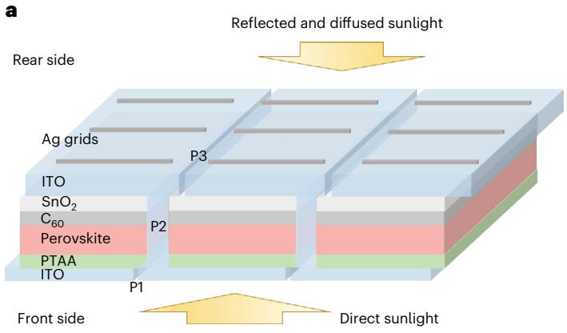

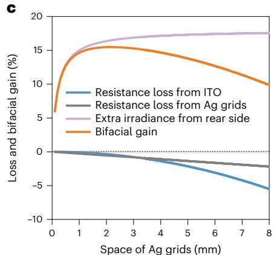

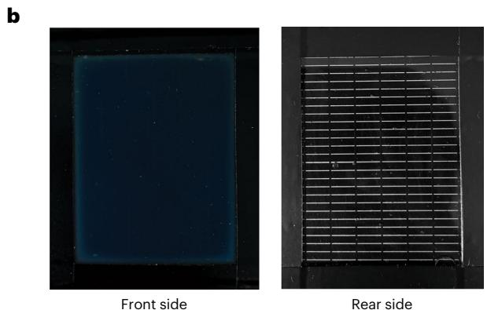

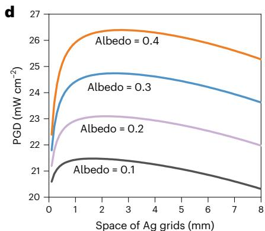  
Fig. 1 | Bifacial perovskite module structure and efficiency simulation. a, Structure of a perovskite bifacial module. P1, P2 and P3 are the three scribing lines in thin-film modules connected in series. b, Photo of a perovskite bifacial minimodule from the front and rear sides with Ag grids, respectively. The aperture area size of the minimodule is $3 9 \mathrm { m m } \times 5 5 \mathrm { m m }$ . c, Simulated resistance   
loss and bifacial gain of perovskite bifacial modules as a function of space between silver grids under an albedo of 0.2. d, PGDs of a bifacial module under different albedos based on a monofacial module that can produce an aperture PCE of $2 0 \%$ .

loss from the rear semitransparent electrode and insufficient absorption of long wavelength light due to the absence of the reflective metal electrodes in the bifacial device structure.

In this Article, we demonstrated the design and development of perovskite bifacial minimodules with both record high efficiency and stability. The bifacial minimodules achieved a front and rear efficiency of $2 0 . 2 \%$ and $1 5 . 0 \%$ , respectively (certified stabilized front efficiency of $1 9 . 2 \%$ and rear efficiency of $1 4 . 1 \%$ ), with an aperture area of over $2 0 \mathsf { c m } ^ { 2 }$ , converting to a power-generation density (PGD) of over $2 3 \mathsf { m } \mathsf { W } \mathsf { c m } ^ { - 2 }$ under 1 sun illumination and albedo of 0.2, which is much higher than the best certified monofacial modules. The bifacial minimodule retained $9 7 \%$ of the initial PCE after 6,000 hours of light soaking under simulated 1-sun illumination.

# Module structure and rear electrode

The rear electrode of bifacial modules requires a different design to achieve low resistance loss comparable to metal electrodes. The bifacial perovskite module structure is shown in Fig. 1a, which adopts a $\mathsf { p } { \mathsf { - i - n } }$ perovskite solar cell structure, and Fig. 1b shows the photo of a perovskite bifacial module from the rear side. The bifacial perovskite module has poly[bis(4-phenyl)(2,4,6-trimethylphenyl)amine] (PTAA) and fullerene $\mathrm { ( C } _ { 6 0 } )$ as hole and electron transport layers (HTL and ETL, respectively). Perovskites studied here have a composition of formamidinium–methylammonium mixed-cation lead triiodide $( \mathbf { M A } _ { 0 . 7 } \mathbf { F A } _ { 0 . 3 } \mathbf { P b l } _ { 3 } )$ or formamidinium–caesium mixed-cation lead triiodide $( \mathsf { F A } _ { 0 . 9 2 } \mathsf { C s } _ { 0 . 0 8 } \mathsf { P b l } _ { 3 } )$ ) with slightly excess CsI12,13. Among various transparent electrode materials, transparent oxides deposited by sputtering, such as indium tin oxide (ITO), are still one of the best choices because

of their industrial processability36,37. To avoid the sputter damage to the underneath layers, a compact $\mathsf { S n O } _ { 2 }$ layer grown by atomic layer deposition (ALD) is used as a buffer layer38. Bifacial perovskite solar modules have transparent conductive electrodes on both sides that impose several new technical challenges to achieve a high efficiency in addition to those for monofacial ones. We achieved a low sheet resistance of ~30 Ω per square with high transparency for ITO $\mathbf { 1 5 0 } \mathsf { n m } ,$ ) sputtered at room temperature (Supplementary Fig. 1), but the bifacial minimodules still showed a poor fill factor (FF) of 0.39 when ITO was directly used to replace the copper electrode (Supplementary Fig. 2).

Applying silver grids on a rear ITO electrode (Fig. 1a,b) is an effective way to reduce resistance loss, but it requires a rational design to balance the resistance loss and the shadowing effect of silver grids, which reduces the bifacial gain. As shown in Fig. 1c, we calculated the optimal Ag grid spacing using the maximum bifacial gain as a reference with a perovskite bandgap of 1.53 eV. The details of the calculation can be found in Supplementary Note 1 and Supplementary Fig. 3. When the width and height of Ag grids were fixed at $0 . 2 \mathsf { m m }$ and $5 0 0 \mathsf { n m }$ , which is the narrowest grid we could make by thermal evaporation using a shadow mask, a linear resistance of $8 \Omega \mathrm { c m } ^ { - 1 }$ was measured by a four-point probe method. The modelling shows that the relative PCE loss induced by the rear electrode resistance is reduced from $8 . 6 \%$ to $< 0 . 9 \%$ after adding the Ag grid with a spacing of ${ \sim } 2 \mathsf { m m }$ , accompanied with an increase of FF from 0.70 to 0.77. The bifacial perovskite modules gain $1 5 \%$ more power output with an albedo of 0.2 compared with monofacial modules. Figure 1d shows the maximum PGDs of bifacial modules calculated under various albedos. The calculation was based on a monofacial module with subcell operational voltage of 0.96 V, an

active-area operational current density of $2 3 \mathsf { m A c m } ^ { - 2 }$ , a subcell active width of ~0.6 cm and a dead area width of $\cdot 0 . 0 5 \mathrm { c m }$ , which results in an aperture efficiency of $20 \%$ , close to the best monofacial minimodule achieved so far13. The simulated PGDs of bifacial modules are 21.5, 23.1, 24.7 and $2 6 . 4 \mathsf { m w c m ^ { - 2 } }$ under 1 sun illumination with albedos of 0.1, 0.2, 0.3 and 0.4, respectively. Increasing the width of evaporated Ag grids results in lower total power output due to the shading loss, despite that the resistance loss decreases (Supplementary Fig. 4a). We also calculated the PGDs using industry-ready screen-printed Ag grids that have a width of $2 0 \mathrm { - } 8 0 \mu \mathrm { m }$ and a height of $1 8 \mu \mathrm { m }$ (ref. 39). A narrower Ag grid is still preferred to reduce shading loss. The optimal Ag grid spacing is $1 . 7 \mathsf { m m }$ at an albedo of 0.2, and the simulated PGD of bifacial modules reaches $2 3 . 5 \mathsf { m w c m ^ { - 2 } }$ (Supplementary Fig. 4b). The module structure and top-view microscope image of the perovskite bifacial module with Ag grids are shown in Supplementary Fig. 5.

# Hydrophobic additive in hole transport layer

The ALD deposition of $\mathbf { S n O } _ { 2 }$ imposes a second challenge of damaging the perovskites for bifacial perovskite minimodule fabrication. Hydrophobic additives or surface treatment by two-dimensional (2D) perovskites such as phenylethylammonium (PEA+ ) are broadly used to improve the moisture resistance of perovskites40,41. However, we found that although high-efficiency bifacial PSCs could be achieved in small-area cells $( 0 . 0 8 \mathsf { c m } ^ { 2 } )$ ) using phenethylammonium iodide (PEAI) as an additive, it is frequently observed that a fraction of bifacial PSCs from the same batch exhibit much lower FF compared with their monofacial counterparts with ${ \mathrm { C } } _ { 6 0 } /$ bathocuproine (BCP) as ETL (Supplementary Fig. 6), which leads to poor performance and reproducibility on large-area modules. We introduced a water-repelling material, tris(pentafluorophenyl)borane (TPFB), as an additive in perovskite films to further alleviate the damage by moisture. The bifacial PSCs with the optimized TPFB/Pb ratio of $0 . 0 0 7 \mathrm { m o l \% }$ to Pb as an additive in perovskite films showed obviously increased reproducibility, but the PCE of bifacial PSCs remained low. Fortunately, we found mixing $5 \mathrm { w t \% }$ of TPFB into a PTAA hole transport layer (HTL) surprisingly protected the perovskite films from moisture damage during the ALD process and resulted in an even better device reproducibility than adding it in perovskite film or modifying the perovskite surface (Supplementary Fig. 7). To demonstrate the increased moisture resistance by TPFB in the HTL, we did an accelerated test to find out how moisture in the ALD chamber impacted the morphology of perovskite films by increasing the water vapour pressure from 0.7 to $^ { 1 3 \pm 2 }$ Torr, turning off the tin supplier and removing the $\mathsf { C } _ { 6 0 }$ layer. The scanning electron microscope (SEM) images in Fig. 2a,b show that the surface of the control perovskite film was damaged after the accelerated test (red dashed circle in the image), while the film with TPFB remained intact. $\mathsf { P b l } _ { 2 }$ showed up in the control perovskite film, as evidenced by the appearance of a $\mathsf { P b l } _ { 2 }$ diffraction peak from an X-ray diffraction (XRD) study, while it was not obvious in the TPFB-modified film (Fig. 2c).

To find out why TPFB in PTAA would enhance the moisture resistance of perovskites, we first examined the crystallinity of perovskites. XRD patterns show very small differences between the two types of sample (Supplementary Fig. 8), indicating TPFB in PTAA did not change the crystallization of initial perovskite films. The grain structure of initial perovskite films also did not show obvious change from the SEM images (Supplementary Fig. 9). We found that TPFB could dissolve in the solvent (2-methoxyethanol) of perovskites and thus get into perovskite films during the deposition and annealing process. X-ray photoelectron spectroscopy (XPS) measurement of the perovskite top surface shows the presence of F from TPFB, indicating that TPFB can spread from the bottom HTL layer to the perovskite surface (Supplementary Fig. 10). The detection depth of XPS $\left( \sim \mathbf { 1 0 } \mathsf { n m } \right)$ ) is larger than the thickness of the HTL, which makes it possible to quantify the change of F in HTL using elements in ITO, such as indium, as a reference. It was found that ${ \sim } 3 5 \%$ of TPFB added in the HTL spread into the perovskite

film (Supplementary Fig. 11). It should be noted that the added TPFB is $5 \mathrm { w t \% }$ in PTAA, so the amount of TPFB entering the perovskite layer is $\mathbf { \tilde { \Gamma } } ^ { 0 . 0 6 7 \mathbf { m o l \% } }$ TPFB to Pb. The surface contact-angle measurement directly confirmed that the modified perovskites with TPFB had a more hydrophobic surface (Supplementary Fig. 12). Thus, we can reasonably infer that part of TPFB spread from the HTL to the surface of perovskite films and increased the moisture resistance of perovskite films, as illustrated in Fig. 2d. TPFB was found to also passivate perovskite films, evidenced by the stronger photoluminescence (PL) intensity and longer recombination lifetime from perovskite films covered by a layer of TPFB, as shown in Supplementary Fig. 13. Perovskite solar cells with TPFB showed reduced trap density of states, further confirming the passivation effect of TPFB (Supplementary Fig. 14a). TPFB does not change the Fermi level of perovskite film (Supplementary Fig. 14b), while the addition of TPFB in PTAA pulled down the Fermi level of PTAA from −4.51 eV to $- 4 . 8 2 \ : \mathrm { e V }$ as measured by ultraviolet photoelectron spectroscopy (Supplementary Fig. 15). The $p$ -doped HTL by TPFB enables better energy alignment and conductivity42,43, which also contributes to the FF enhancement compared with devices with TPFB as an additive in perovskites. The statistical result in Fig. 2e and Supplementary Table 1 shows that bifacial PSCs fabricated on modified HTLs have higher FF and much better reproducibility, thus leading to improved performance for large-area bifacial minimodules. As shown in Fig. 2f, the bifacial module using TPFB:PTAA as the HTL has a larger FF of 0.76 and much higher efficiency, while FF of the control is only 0.68 measured from the front side. We also checked the light stability of perovskite films with and without TFFB in the HTL under accelerated testing conditions. As shown by the images in Supplementary Fig. 16, perovskite films deposited on TPFB:PTAA degraded slower than control samples, proving that TPFB enhances the stability of perovskites. It may be caused by the slightly modified grain-growth process that resulted in smaller point-defect density as shown in the trap density of states measurement.

# Light scattering by dielectric nanoparticles

The third challenge for transferring monofacial modules into bifacial ones comes from the loss of light absorption by perovskites of the same thickness because of the absence of a reflecting/opaque metal electrode. This would reduce short-circuit current density $( \boldsymbol { J } _ { \mathrm { s c } } )$ by $\mathbf { \widetilde { \Gamma } } ^ { 1 . 3 \mathbf { m A c m } ^ { - 2 } }$ due to the insufficient absorption in the red and near-infrared (NIR) wavelength range (Supplementary Fig. 17). Here we introduced nanoparticles (NPs) in perovskites to scatter incident sunlight and thus increase the optical path. We avoid using metal NPs despite their plasmonic effect to enhance light absorption because of the concerns of their potential chemical reaction with perovskites and strong non-radiative charge recombination at NP surfaces. Dielectric NPs are applied here to scatter light based on resonant Mie scattering. Silicon oxide $( \mathrm { { S i O } } _ { 2 } )$ ) NPs are chosen because of their established simple solution synthesis in large scale, excellent chemical stability and compatibility with perovskites.

Light-scattering properties of spherica $\mathsf { S i O } _ { 2 } \mathsf { N P s }$ were studied by the three-dimensional finite-difference time-domain (FDTD) method to find the optimized size and spacing for scattering of red and NIR light in perovskite films. It was found that $\mathsf { S i O } _ { 2 } \mathsf { N P s }$ should be larger than $4 0 0 \mathsf { n m }$ to efficiently scatter red and NIR light and smaller than $6 0 0 \mathsf { n m }$ to minimize losing absorption of UV–visible light (Supplementary Note 2 and Supplementary Fig. 18). To study the mechanism of light scattering of NPs in perovskite film, we build a model that confines the incident light in the near region $( 1 \mu \mathrm { m } \times 1 \mu \mathrm { m } )$ of a $5 0 0 \mathsf { n m }$ $\mathrm { S i O } _ { 2 } \mathrm { N P }$ , as shown in Fig. 3a. A wide region $( 4 . 4 \mu \mathrm { m } \times 4 . 4 \mu \mathrm { m } )$ with a larger cross section was further defined, and two monitors were used to record the absorptions in the perovskite film of the two regions. Figure 3a shows the intensity distribution of $8 0 0 \mathsf { n m }$ light in the y–z plane of the perovskite film and air, where x–y is the device plane and z is along the direction perpendicular to the device plane. Apparently,

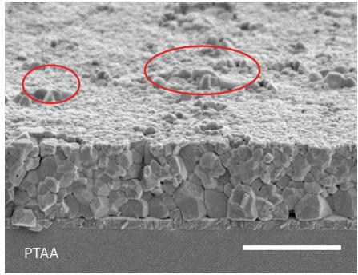  
a

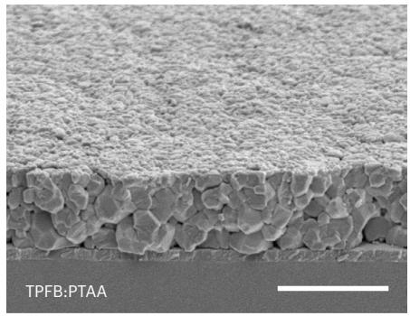  
b

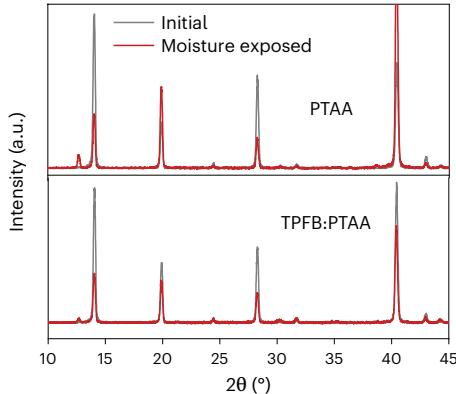  
c

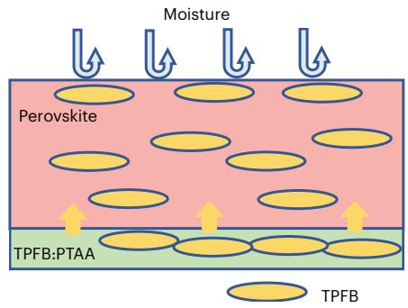  
d

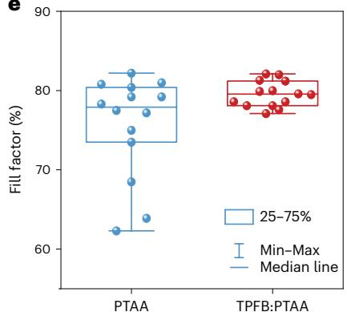

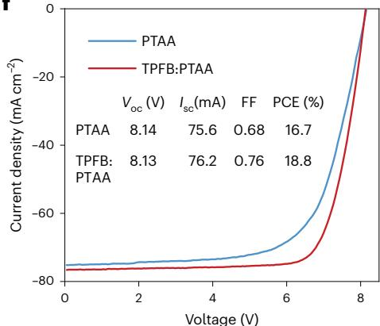  
  
Fig. 2 | Hydrophobic additive in the HTL. a,b, SEM image of a moisture-exposed perovskite film using PTAA as the HTL (a) and using TPFB:PTAA as the HTL (b). Red circles indicate damaged areas of perovskite film. Scale bar equals $1 \mu \mathrm { m }$ . c, XRD patterns of moisture-exposed perovskite films with and without TPFB in PTAA. d, Schematic diagram of how TPFB prevented the damage of water to perovskite. Yellow arrows indicate the spread of TPFB from the HTL to perovskite film. e, Statistical distribution of the FF of bifacial small cells with PTAA and   
TPFB:PTAA as the HTL. The lines from top to bottom indicate maximum, third quartile (top box edge), median, first quartile (bottom box edge) and minimum of the data. Min–Max, minimum and maximum of the data. Fourteen samples were included for each condition. f, I–V curve of the front side of bifacial modules with PTAA and TPFB:PTAA as the HTL. Both measurements have the same minimodule aperture area of $2 5 . 0 3 \mathrm { c m } ^ { 2 }$ . The minimodule has seven subcells connected in a series. The perovskite composition is $\mathbf { M A } _ { 0 . 7 } \mathbf { F A } _ { 0 . 3 } \mathbf { P b l } _ { 3 }$ .

the NP scatters a significant portion of light into the transverse plane of the perovskite film as shown in the two wings $( 0 . 5 \mu \mathrm { m } < \mu ) < 2 . 2 \mu \mathrm { m } )$ where no incident light exists. We further analysed how the changed light intensity around NPs affect the light absorption by the perovskite film. As shown in Supplementary Fig. 19, the absorption is obviously enhanced in the wide region because of transverse scattering of red and NIR light, which increases their optical path in perovskite film. Considering that too-small NP spacing would reduce the perovskite volume despite the enhanced light scattering, we studied the optimal spacing of NPs to maximize the light absorption of the whole films. Figure 3b shows the simulated absorption of incident light by perovskite with different spacings of NPs. It is shown that the perovskite film with NP spacing from 1– $\cdot 1 . 5 \mu \mathrm { m }$ can absorb 5.4–19.8% more 800 nm light than pure film from the front side; larger spacing also increases light absorption but is not obvious.

$\mathrm { S i O } _ { 2 }$ NPs with a diameter of $5 0 0 \mathsf { n m }$ were synthesized using a reported method that can yield NPs with uniform size (Supplementary Fig. $2 0 ) ^ { 4 4 , 4 5 }$ . They were dispersed in ethanol and then pre-deposited on ITO substrate using blade coating with the assistance of ${ \Nu } _ { 2 }$ flow, followed by the blading of HTL and perovskite layers. SEM images in Fig. 3c,d and Supplementary Fig. 20a show that a monolayer of $\mathrm { S i O } _ { 2 }$ NPs was formed by the simple blading process, and they were nicely embedded in the perovskite layer without causing cracks in perovskites or voids at the bottom interface. Although some bumps show up at the surface of perovskite films that register the location of ${ \mathrm { S i O } } _ { 2 } { \mathsf { N P s } }$ , conformal electron transfer layers and ITO electrodes could still be coated on perovskites (Supplementary Fig. 21b). To control the spacing between

$\mathsf { S i O } _ { 2 } \mathsf { N P s }$ , we prepared $\mathrm { S i O } _ { 2 } \mathrm { N P }$ suspension with different concentrations. We studied the absorption of perovskites with NPs of different spacing by measuring transmittance (T) and reflectance (R) from front side of the resultant films. As shown in Fig. 3e,f, embedded $\mathrm { S i O } _ { 2 }$ NPs with an optimized NP concentration of $3 0 \mathrm { m g } \mathrm { m l ^ { - 1 } }$ gives a NP spacing of 1– ${ \cdot } 2 \mu \mathrm { m }$ (Fig. 3d and Supplementary Fig. 22) and obviously enhanced the absorption $\left( 1 - R - T \right)$ of red and NIR light by perovskites. The NPs occupied 1.9–7.6% of the total volume of the whole film, indicating these perovskite solar cells contain less lead but absorbed more light. Further increasing the $\mathrm { S i O } _ { 2 }$ concentration resulted in higher reflectance of red and NIR light, which is due to reduced spacing and partial aggregation of NPs (Supplementary Fig. 23). A photo of perovskite films with and without embedded NPs in front of a light-emitting diode (LED) light is shown in Fig. 3g, where the darker colour of film with NPs directly indicates less transmittance and stronger absorption of red light.

To study how NPs affect the charge recombination and extraction, photoluminescence (PL) intensities and PL decay lifetimes of perovskite film with and without embedded NPs were studied as shown in Supplementary Fig. 24. Perovskite film with NPs exhibited comparable PL intensity and carrier lifetime with the optimized perovskite films without NPs, showing that these NPs do not introduce an additional non-radiative charge recombination pathway to the perovskite films. Small-size $( 8 \mathsf { m m } ^ { 2 } ) \mathsf { M A } _ { 0 . 7 } \mathsf { F A } _ { 0 . 3 } \mathsf { P b l } _ { 3 }$ bifacial perovskite cells processed from $\mathrm { S i O } _ { 2 } \mathrm { N P }$ solution of different concentrations were fabricated to evaluate the light-scattering effect and charge extraction. Statistical data in Fig. 3h and Supplementary Fig. 25 show the average fron $J _ { \mathrm { S C } }$ of bifacial PSCs with optimal $\mathrm { S i O } _ { 2 } \mathrm { N P }$ spacing increased from 23.1 to

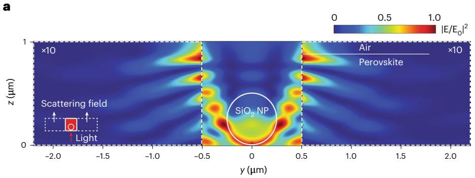

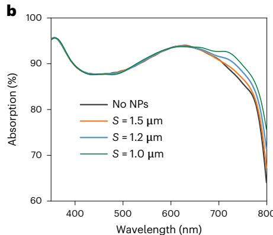

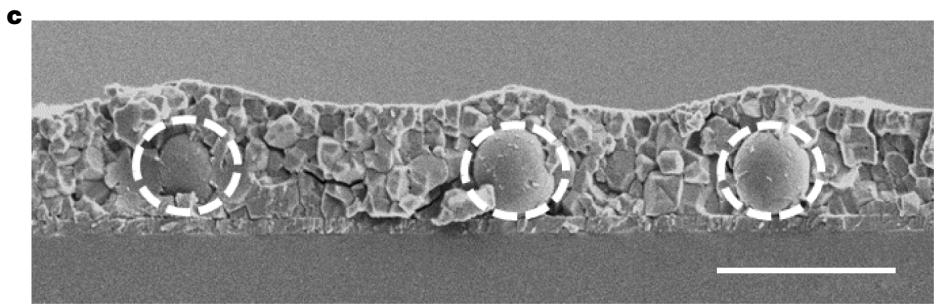

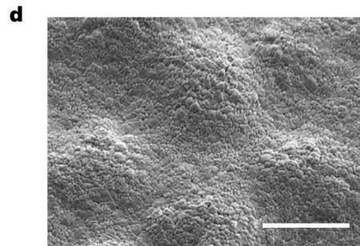

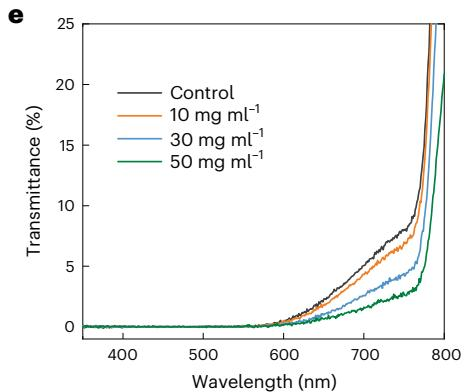

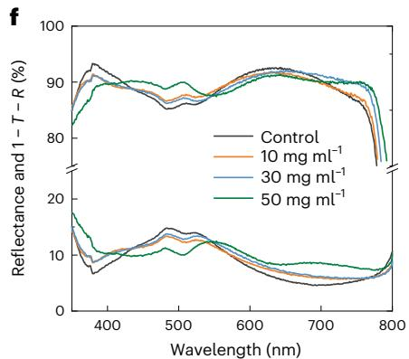

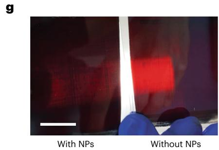

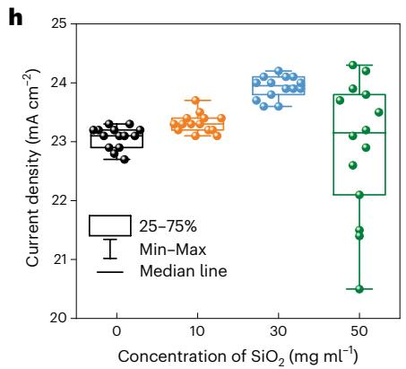

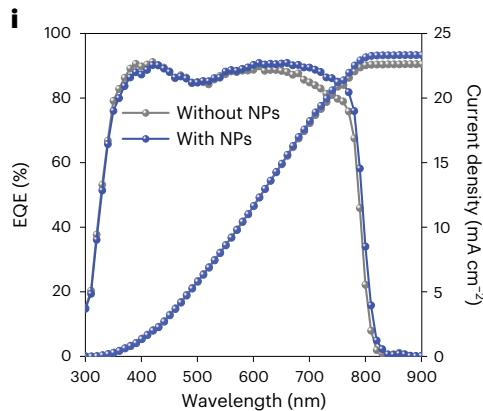

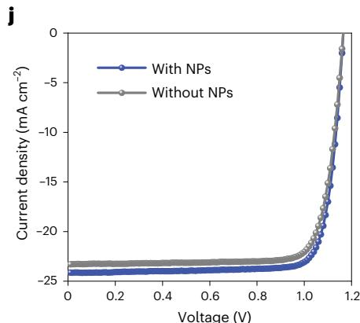  
Fig. 3 | Enhancing absorption and photocurrent by embedded $\mathbf { S i O } _ { 2 } \mathbf { N P s }$ . a, Intensity distribution of light $( 8 0 0 \mathsf { n m } )$ in the y–z plane of perovskite film and air. The intensities in the two wings are magnified by ten times for better visualization. The bottom-left inset shows the model of perovskite film embedded with a $\mathsf { S i O } _ { 2 } \mathsf { N P }$ , and light illuminates only the near region $( 1 \mu \mathrm { m } \times 1 \mu \mathrm { m } )$ ). b, Simulated absorption of incident light by perovskite film with different spacing (S) of NPs. c,d, Cross section (c) and tilted surface morphology of perovskite film embedded with $\mathsf { S i O } _ { 2 } \mathsf { N P s }$ (d). Dashed white circles indicate $\mathrm { S i O } _ { 2 }$ NPs. The scale bars are 1 $\mu \mathrm { m }$ . e,f, Transmittance (e) and reflectance and 1 − R − T   
of ITO/SiO2/PTAA/perovskite film embedded with $\mathsf { S i O } _ { 2 } \mathsf { N P s }$ of different spacings, with a break from $2 5 \%$ to $7 5 \%$ added for clarity (f). g, A photo of perovskite films with and without embedded NPs, taken with a LED light source behind the films. Scale bar is $2 0 \mathsf { m m }$ . h, Statistical distribution of J of bifacial PSCs with $\mathsf { S i O } _ { 2 } \mathsf { N P s }$ of different spacings. The lines from top to bottom indicate maximum, third quartile (top box edge), median, first quartile (bottom box edge) and minimum of the data. Fourteen samples were included for each condition. i, Front EQE and integrated $J _ { \mathrm { S C } }$ of bifacial PSCs with and without $\mathsf { S i O } _ { 2 } \mathsf { N P s } . \mathsf { j } , J \mathsf { - }$ –V curves of bifacial PSCs with and without $\mathsf { S i O } _ { 2 } \mathsf { N P s }$ .

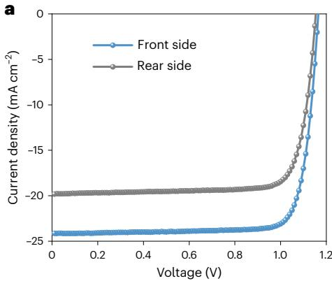

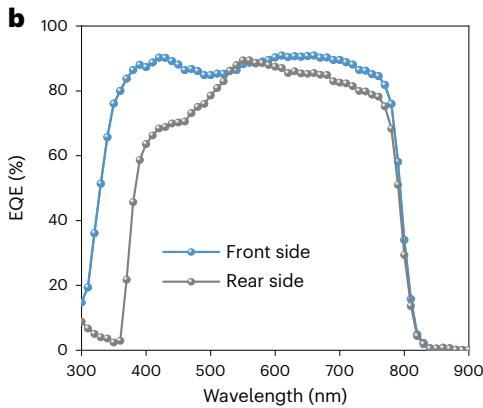

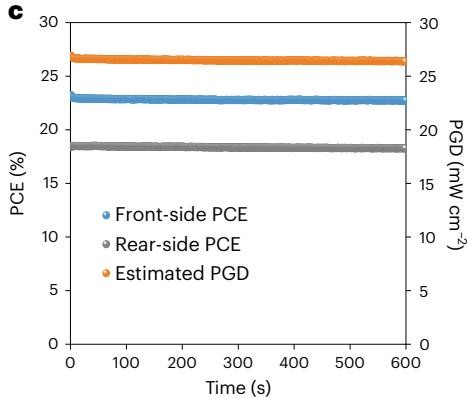

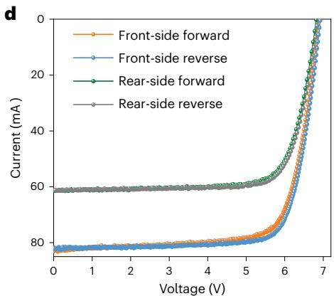

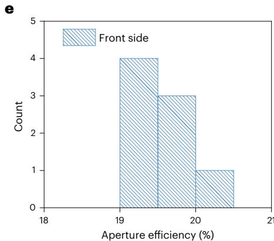

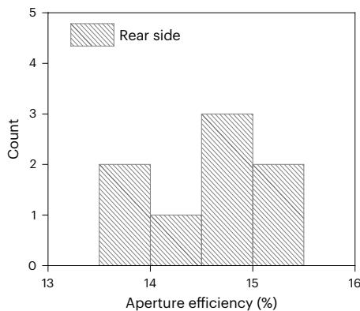

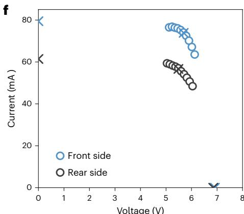

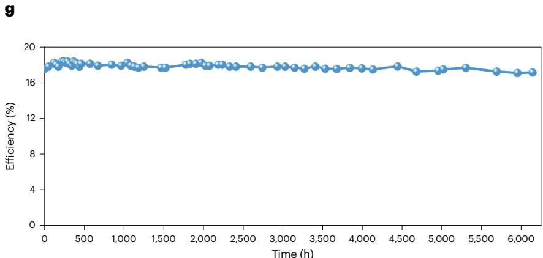  
Fig. 4 | Photovoltaic performance of bifacial perovskite solar cells and minimodules. a, J–V curves of the champion small-size bifacial perovskite solar cell. b, EQE of front and rear side of the small-size bifacial perovskite solar cell. c, The measured stabilized efficiency of the front and rear side of the champion small-size bifacial perovskite solar cell for 600 s, with estimated powergeneration density at an albedo of 0.2. d, I–V curves of the champion bifacial minimodule with light coming from front and rear sides. e, The front and rear   
aperture efficiencies of eight bifacial minimodules. f, NREL-certified stabilized power output around the maximum power point with light from front and rear sides, respectively. g, Evolution of efficiency of an encapsulated perovskite bifacial minimodule at open-circuit condition in air under simulated 1-sun illumination from the front side and $6 \mathrm { - } 1 0 \%$ albedo light from the rear side. The front surface temperature was $6 0 \pm 5 ^ { \circ } \mathrm { C }$ . Credit: f, National Renewable Energy Laboratory.

$2 3 . 9 \mathsf { m A c m } ^ { - 2 }$ without notably changing device open-circuit voltage $( V _ { \mathrm { o c } } )$ and FF, which confirm that the $\mathrm { S i O } _ { 2 } \mathrm { N P s }$ with optimal spacing did not introduce extra defects in the perovskite film and change the charge collection or recombination process. The device efficiency and reproducibility started to deteriorate with further increased $\mathrm { S i O } _ { 2 }$ NP concentration, which can be explained by the aggregation of NPs and increased voids in perovskites as shown in Supplementary Fig. 23. Front external quantum efficiency (EQE) of bifacial PSC with NPs in Fig. 3i overlapped with control PSC in wavelength range $< 6 0 0 \mathsf { n m }$ but clearly increased in wavelength range of 600–800 nm, confirms that $\mathrm { S i O } _ { 2 }$ NPs can enhance absorption of red and NIR light by perovskite PSCs without blocking charge diffusion and extraction. Perovskites

have sufficient long carrier-diffusion length so that photogenerated charges can still be efficiently extracted even when some local areas are blocked, which has been demonstrated by non-contact perovskite solar cells and those with non-continuous poly(methyl methacrylate) (PMMA) interfacial layers46. As a result, the integrated front side $J _ { \mathrm { S C } }$ from EQE increased from 22.5 to $2 3 . 3 \mathsf { m A c m ^ { - 2 } }$ , matching well with the statistica $1 J _ { \mathrm { s c } }$ measured from the current–voltage $( I - V )$ scan in Fig. 3h. The embedding of the NPs significantly recovered the light absorption loss after optimizing the concentration of the NPs, and the front PCE of champion bifacial PSCs increased from $2 2 . 1 \%$ to $2 3 . 2 \%$ (Fig. 3j). The embedded NPs also slightly increase the light absorption when light incidents from the rear side, which can be explained by transverse

scattering of light by NPs and changed surface roughness of the perovskite film (Supplementary Fig. 26). The embedding of silica NPs did not affect the stability of perovskite films, which was confirmed by the accelerated stability test under strong light intensity and elevated temperature. Bifacial solar cells with and without NPs showed a comparable degradation rate. (Supplementary Fig. 27).

# Photovoltaic performance of bifacial modules

Combining all above strategies, the front PCE of the small $\mathsf { M } \mathsf { A } _ { 0 . 7 } \mathsf { F A } _ { 0 . 3 } \mathsf { P b l } _ { 3 }$ bifacial PSC is comparable to the optimized opaque PSCs with Cu electrode, and a rear PCE of $1 8 . 5 \%$ was reached, giving a high bifaciality of ${ \sim } 8 0 \%$ (Fig. 4a and Supplementary Table 2). The $J _ { \mathrm { S C } }$ for light from both sides were confirmed by EQE of bifacial PSCs (Fig. 4b), which also shows that the parasitic absorption of $\mathrm { C } _ { 6 0 }$ limits the bifaciality. Further study is needed to investigate whether the charge collection efficiency, or internal quantum efficiency, is different when light comes in from either side. Benefitting from both high front efficiency and bifacility, the bifacial cells with aperture area of $8 \mathsf { m m } ^ { 2 }$ delivered an estimated power-generation density of $2 6 . 4 \mathrm { m W } \mathrm { c m } ^ { - 2 }$ $( \mathrm { P G D } _ { \mathrm { f r o n t } } + \mathrm { a l b e d o } \times \mathrm { P G D } _ { \mathrm { r e a r } } )$ at an albedo of 0.2 (Fig. 4c), better than any reported single-junction perovskite solar cells.

We fabricated bifacial minimodules with aperture areas from 14.3 to $2 5 . 1 \mathrm { c m } ^ { 2 }$ . The champion $\mathsf { M } \mathsf { A } _ { 0 . 7 } \mathsf { F A } _ { 0 . 3 } \mathsf { P b l } _ { 3 }$ bifacial minimodule with an aperture area of ${ \tt > } 2 0 \thinspace { \tt c m } ^ { 2 }$ showed a front aperture efficiency of $2 0 . 2 \%$ and rear aperture efficiency of $1 5 . 0 \%$ (Fig. 4d and Supplementary Table 3), respectively. This converts to PGD of 23.2 and $2 4 . 7 \mathsf { m w c m } ^ { - 2 }$ at albedos of 0.2 and 0.3, respectively. To understand how the albedo light impacts the actual photovoltaic (PV) performance, we measured the I–V of a bifacial minimodule under different albedos from 0.1 to 0.3 while keeping the front light intensity to be $1 0 0 \mathrm { m } \mathrm { W } \mathrm { c m } ^ { - 2 }$ . The albedo light was generated by LED array, and the light intensity was calibrated by a silicon reference cell as illustrated in Supplementary Figs. 28 and 29. With added albedo light, the $V _ { \mathrm { { o c } } }$ of minimodules slightly increased and FF slightly reduced, and the measured power-generation densities are very close to $\mathrm { P G D } _ { \mathrm { f r o n t } } + \mathbf { a } \mathbf { l } \mathbf { b } \mathbf { e } \mathbf { d } \mathbf { o } \times \mathrm { P G D } _ { \mathrm { r e a r } }$ (Supplementary Fig. 30 and Supplementary Table 4). The bifacial minimodules also show good reproducibility, as shown by the statistics of PCE and other parameters in Fig. 4e and Supplementary Table 5. We also fabricated several bifacial modules with only ITO of the same thickness, and their photovoltaic performances are summarized in Supplementary Table 6. After removing the silver grid, the measured device FFs were reduced from $7 5 \pm 2 \%$ to $6 9 . 5 \pm 0 . 5 \%$ , which is in excellent agreement with the modelling result in Note 1. Among eight bifacial minimodules with Ag grids, the average front and rear aperture efficiency reached $1 9 . 5 \%$ and $1 4 . 5 \%$ , respectively, giving average PGDs of 22.4, 23.9 and $2 5 . 3 \mathsf { m w c m } ^ { - 2 }$ with albedos of 0.2, 0.3 and 0.4 (Supplementary Fig. 31), respectively. The efficiency of the bifacial modules was certified by National Renewable Energy Laboratory (NREL), giving a stabilized front efficiency of $1 9 . 2 \%$ and rear efficiency of $1 4 . 1 \%$ for a minimodule with aperture area of ${ \sim } 2 2 . 0 \mathsf { c m } ^ { 2 }$ (Fig. 4f and Supplementary Figs. 32 and 33). The certified front efficiency of the bifacial minimodule is comparable to the best certified monofacial minimodules13,14.

The operational stability and damp-heat stability of the encapsulated bifacial perovskite minimodules were tested based on $\mathsf { F A } _ { 0 . 9 2 } \mathsf { C s } _ { 0 . 0 8 } \mathsf { P b l } _ { 3 }$ perovskite due to its demonstrated good light stability12. The best bifacial minimodule retained $9 7 \%$ of the initial PCE $( T _ { 9 7 } )$ after light soaking for ${ \scriptstyle > 6 , 0 0 0 }$ hours from front side at open-circuit condition and temperature of $6 0 \pm 5 ^ { \circ } \mathrm { C }$ (Fig. 4g and Supplementary Fig. 34), which is the most stable reported perovskite minimodule. Another minimodule maintained ${ \sim } 8 4 \%$ of the initial efficiency after damp-heat testing for ${ \scriptstyle \mathrm { \tt > } } 1 , 0 0 0$ hours (Supplementary Fig. 35). The very good stability of these bifacial minimodules benefits from the ALD $\mathsf { S n O } _ { 2 }$ in addition to the very good intrinsic stability of $\mathsf { F A } _ { 0 . 9 2 } \mathsf { C s } _ { 0 . 0 8 } \mathsf { P b l } _ { 3 }$ optimized by previous methods12. First, the ALD $\mathsf { S n O } _ { 2 }$ layer greatly reduced the damage of perovskite in the laser scribing process, which

would otherwise form amorphous perovskites with reduced PL intensity around P2 scribing lines (Supplementary Fig. 36). Although the damaged regions do not affect the performance of fresh modules, because they are in dead zone anyway, they would spread into active areas after long-term illumination. Supplementary Fig. 37 shows the spread of damaged regions from P2 in a regular module after light soaking for 150 h. Second, most p–i–n structure monofacial opaque modules use BCP as a buffer layer between $\mathbf { C } _ { 6 0 }$ and Cu to enhance the device efficiency, but the amorphous BCP deposited by thermal evaporation could recrystallize during operation or at high temperatures. Replacing BCP with the ALD $\mathsf { S n O } _ { 2 }$ layer also stabilized this interface.

In summary, we have demonstrated the design and development of perovskite bifacial minimodules with front efficiency comparable to the best monofacial modules. The rear-grid electrode design enabled a good balance of conductivity and bifacial gain. TPFB introduced in PTAA spread to the perovskite surface and significantly enhanced the water resistance and reproducibility of bifacial PSCs. The embedded $\mathrm { S i O } _ { 2 }$ NPs in perovskite films increased the absorption of bifacial PSCs by scattering red and NIR light. The bifacial minimodules achieved a high estimated power-generation density of over $2 3 \mathsf { m w c m } ^ { - 2 }$ under albedo of 0.2 and exhibited an excellent $T _ { \mathfrak { g } _ { 7 } }$ lifetime of over 6,000 h after light soaking under simulated 1-sun light in air without temperature control.

# Methods

# Materials

PTAA (average Mn 7,000–10,000), BCP, $\mathsf { P b l } _ { 2 }$ $9 9 . 9 9 9 \%$ trace metals), TPFB, dimethyl sulfoxide (DMSO), 2-methoxyethanol (2-ME), ethyl alcohol and toluene were purchased from Sigma–Aldrich and used without further purification. $\mathsf { C } _ { 6 0 }$ was purchased from Nano-C Inc. MAI, FAI, CsI, FACl and phenethylammonium iodide (PEAI and PEACl) were purchased from GreatCell Solar. CYTOP was purchased from AGC Chemicals Americas Inc. Epoxy was purchased from Devcon Industries Inc.

# Preparation of TPFB:PTAA

PTAA and TPFB were dissolved in toluene separately and then mixed together with a weight ratio of 5:95, 10:90 and 15:85 and then light soaked under a solar simulator for 2–3 mins until the colour of the mixed solution changed from transparent to light brown. The final concentration of TPFB:PTAA in toluene is $3 . 3 \mathrm { m g } \mathrm { m l } ^ { - 1 }$ 1.

# Device fabrication

Patterned ITO glass substrates were cleaned by acetone and then UV–ozone treated for 15 min before use. All perovskite solar devices were prepared by blade coating at room temperature inside a fume hood with a relative humidity of $30 \pm 5 \%$ . $\mathrm { S i O } _ { 2 }$ particles with a size of ~500 nm were ultrasonically dispersed into ethyl alcohol for 12 h and allowed to stand for 20 min before use; the NP layer was deposited by blade coating with the assistance of ${ \bf N } _ { 2 }$ flow. The PTAA or TPFB:PTAA layer with a concentration of $3 . 3 \mathrm { m g } \mathrm { m l } ^ { - 1 }$ was dissolved in toluene and blade coated on the NP layer. The $\mathbf { M A } _ { 0 . 7 } \mathbf { F A } _ { 0 . 3 } \mathbf { P b l } _ { 3 }$ perovskite precursor solutions were prepared by dissolving corresponding organic halides and lead iodide in 2-ME and stored in an ${ \Nu } _ { 2 }$ -filled glovebox. Before blade coating, all the additives and DMSO were mixed and diluted to a 1.4 M $\mathbf { M A } _ { 0 . 7 } \mathbf { F A } _ { 0 . 3 } \mathbf { P b l } _ { 3 }$ solution. The mole ratio of DMSO and additives to Pb were controlled to be $2 5 \%$ . The precursor solution was blade coated on the glass/ITO/SiO /HTL substrates with ${ \Nu } _ { 2 }$ flow. After that, the perovskite films were annealed at $1 3 0 ^ { \circ } \mathrm { C }$ for 5 min in air. The $\mathbf { C } \mathsf { s } _ { 0 . 0 8 } \mathsf { F A } _ { 0 . 9 2 } \mathsf { P b l } _ { 3 }$ perovskite precursor solutions was prepared by $\mathsf { F A P b l } _ { 3 }$ in 2-ME and $\mathsf { C s P b l } _ { 3 }$ in DMSO ink. Before coating, it was mixed and diluted by 2-ME to obtain a concentration of 1.1 M $\mathbf { C S } _ { 0 . 0 8 } \mathbf { F A } _ { 0 . 9 2 } \mathbf { P b l } _ { 3 }$ . FACl, PEACl or PEAI, FAI and $\mathrm { F A H } _ { 2 } \mathrm { P O } _ { 2 }$ were added as additives. The precursor solution was blade coated on substrates with a movement speed of $2 0 \mathsf { m m } \mathsf { s } ^ { - 1 }$ as reported before, and the film was annealed at $1 5 0 ^ { \circ } \mathrm { C }$ for 2.5–3 min in air to get the perovskite phase. The monofacial PSCs were fabricated by thermally evaporating $\mathrm { C } _ { 6 0 } ( 3 0 \mathrm { n m } )$ , BCP (6 nm) and 100 nm copper. The bifacial

PSCs were completed by thermally evaporating $\mathbf { C } _ { 6 0 }$ , automatic layer deposition (ALD) of ${ \mathsf { S n O } } _ { 2 } ,$ , sputtering coating of ITO $( 1 1 0 - 1 5 0 \mathsf { n m } ,$ ) and thermally evaporating silver grids $( 5 0 0 \mathsf { n m } )$ ). The bifacial minimodules were fabricated on the pre-patterned large ITO glass substrates following the same procedure of bifacial small cells. The laser scribing was performed twice after the deposition of $\mathsf { S n O } _ { 2 }$ and ITO, respectively.

# Device characterization

At the University of North Carolina at Chapel Hill (UNC), the I–V characteristics of solar cells and minimodules were performed using a xenon lamp-based solar simulator (Oriel Sol3A, Class AAA Solar Simulator), and the power of the simulated light was calibrated to $1 0 0 \mathsf { m } \mathsf { W } \mathsf { c m } ^ { - 2 }$ by a silicon reference cell (Newport 91150V-KG5). The albedo light was generated by a LikeSuns LED array. The light intensity from the rear side was also calibrated by the silicon reference cell. To avoid the interference of two light sources, a black board was inserted between them for the measurement of bifacial performance. All devices were measured using a Keithley 2400 source meter without temperature controller, and the scan rate was around $0 . 1 \mathsf { V } \mathsf { s } ^ { - 1 }$ for small cells and $0 . 5 \mathsf { V } \mathsf { S } ^ { - 1 }$ for minimodules. At NREL, the current vs voltage was measured with the NREL X-25 IV system using the NREL Asymptotic Pmax Scan method. Asymptotic scans were measured by holding the cell at a set of voltages near $V _ { \mathrm { m a x } }$ until the current reaches an asymptotic level for each voltage. The criterion for stabilization is when the current change per minute is less than $0 . 1 \%$ , the cell is biased to the next voltage. The voltage vs asymptotic current data was then applied to a standard $P _ { \mathrm { m a x } }$ derivation algorithm. EQE spectra were obtained with a Newport QE measurement kit by focusing a monochromatic beam of light onto the devices. SEM images were taken by a Hitachi S-4700 cold cathode field emission scanning electron microscope. The transmittance and reflectance were measured by a LAMBDA 1050 UV/Vis/NIR spectrophotometer. PL mapping was conducted with PicoQuant MicroTime 100 system at room temperature. The photoluminescence, time-resolved photoluminescence (TRPL) studies were conducted with a FluoTime 300system by PicoQuant. The XRD was measured by a Rigaku SmartLab X-ray diffraction system. The resistances of sputtered ITO and silver grids were measured by a LakeShore 2-inch wafer probe station with four probes. The XPS spectra were measured by a Kratos Axis Supra X-ray photoelectron spectrometer.

# Device encapsulation and stability tests

A thin layer of CYTOP was blade coated on the rear side of the solar modules and dried at $6 0 ^ { \circ } \mathrm { C }$ for 10 min in air, then the minimodules were encapsulated by a cover glass (thickness of $1 . 1 \mathsf { m m }$ ) sealed with Devcon 5-minute epoxy in a glovebox filled with $\mathsf { N } _ { 2 }$ . The operational stability of minimodules were measured under open-circuit condition in air, and a LED with intensity equivalent to AM 1.5 G was used as the solar simulator; the temperature of the surface of the solar modules was measured to be ${ \bf \nabla } \cdot 6 0 ^ { \circ } \mathrm { C }$ , and the relative humidity was $20 \%$ . For the damp-heat stability, the encapsulated minimodules were placed in an ESPEC Criterion Benchtop test chamber with controllable humidity $( \sim 8 5 \% )$ and temperature $( \sim 8 5 ^ { \circ } \mathbf { C } )$ . The PCEs of the solar modules at different testing stages were extracted by taking it out for I–V scan using the same methods as the characterization part.

# FDTD simulations

Simulations of the perovskite solar cells were conducted using the 3D FDTD method with the Lumerical FDTD software. In a typical simulation, a perovskite solar cell was modelled by a three-layer structure, including an $8 5 0 \mathsf { n m }$ -thick perovskite film on a $1 0 0 \mathsf { n m }$ ITO layer over a $5 0 0 \mathsf { n m }$ silica glass. Single-silica NPs of different diameters were embedded in the perovskite film (over the ITO layer). The real part of the complex refractive index of the perovskite was measured by a refractometer, and the imaginary part was calculated from the absorption spectrum of the perovskite film. The refractive index of ITO and

silica came from the literature47,48. A white light source was visible from the glass side with a linear polarization along the x axis and wave vector along the z direction. The transmission spectrum was recorded by a monitor in air over the perovskite surface. Absorption by a certain volume of the perovskite was obtained by calculating the net power flow with a power transmission box enclosing the volume.

# Reporting summary

Further information on research design is available in the Nature Portfolio Reporting Summary linked to this article.

# Data availability

All data generated or analysed during this study are included in the published article and its supplementary information. Source data are provided with this paper.

# References

1. Best Research-Cell Eficiency Chart (NREL, 2023); https://www. nrel.gov/pv/cell-eficiency.html   
2. Min, H. et al. Perovskite solar cells with atomically coherent interlayers on $\mathsf { S n O } _ { 2 }$ electrodes. Nature 598, 444–450 (2021).   
3. Li, Z. et al. Organometallic-functionalized interfaces for highly eficient inverted perovskite solar cells. Science 376, 416–420 (2022).   
4. Azmi, R. et al. Damp heat stable perovskite solar cells with tailored-dimensionality 2D/3D heterojunctions. Science 376, 73–77 (2022).   
5. Zhao, X. et al. Accelerated aging of all-inorganic, interfacestabilized perovskite solar cells. Science 377, 307–310 (2022).   
6. Bella, F. et al. Improving eficiency and stability of perovskite solar cells with photocurable fluoropolymers. Science 354, 203–206 (2016).   
7. Yang, S. et al. Stabilizing halide perovskite surfaces for solar cell operation with wide-bandgap lead oxysalts. Science 365, 473–478 (2019).   
8. Bai, S. et al. Planar perovskite solar cells with long-term stability using ionic liquid additives. Nature 571, 245–250 (2019).   
9. Ku, Z., Rong, Y., Xu, M., Liu, T. & Han, H. Full printable processed mesoscopic $\mathsf { C H } _ { 3 } \mathsf { N H } _ { 3 } \mathsf { P b l } _ { 3 } / \mathsf { T i O } _ { 2 }$ heterojunction solar cells with carbon counter electrode. Sci. Rep. 3, 3132 (2013).   
10. Park, N.-G. & Zhu, K. Scalable fabrication and coating methods for perovskite solar cells and solar modules. Nat. Rev. Mater. 5, 333–350 (2020).   
11. Kim, M. et al. Conformal quantum do $\mathsf { S n O } _ { 2 }$ layers as electron transporters for eficient perovskite solar cells. Science 375, 302–306 (2022).   
12. Deng, Y. et al. Defect compensation in formamidinium–caesium perovskites for highly eficient solar mini-modules with improved photostability. Nat. Energy 6, 633–641 (2021).   
13. Chen, S. et al. Stabilizing perovskite–substrate interfaces for highperformance perovskite modules. Science 373, 902–907 (2021).   
14. Bu, T. et al. Lead halide templated crystallization of methylaminefree perovskite for eficient photovoltaic modules. Science 372, 1327–1332 (2021).   
15. Deng, Y. et al. Surfactant-controlled ink drying enables highspeed deposition of perovskite films for eficient photovoltaic modules. Nat. Energy 3, 560–566 (2018).   
16. Yoo, J. W. et al. Eficient perovskite solar mini-modules fabricated via bar-coating using 2-methoxyethanol-based formamidinium lead tri-iodide precursor solution. Joule 5, 2420–2436 (2021).   
17. Yang, Z. et al. Slot-die coating large-area formamidinium-cesium perovskite film for eficient and stable parallel solar module. Sci. Adv. 7, eabg3749 (2021).   
18. Hiroshi, M. Radiation Energy Transducing Device. US patent US3278811A (1966).

19. Hübner, A., Aberle, A. G. & Hezel, R. Novel cost-efective bifacial silicon solar cells with $1 9 . 4 \%$ front and $1 8 . 1 \%$ rear eficiency. Appl. Phys. Lett. 70, 1008–1010 (1997).   
20. Guerrero-Lemus, R., Vega, R., Kim, T., Kimm, A. & Shephard, L. Bifacial solar photovoltaics–a technology review. Renew. Sust. Energy Rev. 60, 1533–1549 (2016).   
21. Seo Y, et al. Efect of front irradiance and albedo on bifacial gain in 1.8 kW bifacial silicon photovoltaic system. In 2019 IEEE 46th Photovoltaic Specialists Conference (PVSC), 1298–1301 (IEEE, 2019).   
22. Liang, T. S. et al. A review of crystalline silicon bifacial photovoltaic performance characterisation and simulation. Energy Environ. Sci. 12, 116–148 (2019).   
23. Bifacial Solar Market Research Report (Market Research Future, 2023); https://www.marketresearchfuture.com/reports/bifacialsolar-market-10149   
24. Albedo data for bifacial PV systems—dataset. DuraMAT https://datahub.duramat.org/project/albedo-study   
25. Marion, B. Albedo data sets for bifacial PV systems. In 2020 47th IEEE Photovoltaic Specialists Conference (PVSC), 0485–0489 (IEEE, 2020).   
26. Park, H., Chang, S., Park, S. & Kim, W. K. Outdoor performance test of bifacial n-type silicon photovoltaic modules. Sustainability 11, 6234 (2019).   
27. Muehleisen, W. et al. Energy yield measurement of an elevated PV system on a white flat roof and a performance comparison of monofacial and bifacial modules. Renew. Energy 170, 613–619 (2021).   
28. Stein, J.S. et al. Outdoor field performance from bifacial photovoltaic modules and systems. In Conference Record of the IEEE Photovoltaic Specialists Conference, 2017, 3184–3189 (IEEE, 2017).   
29. Hanmandlu, C. et al. Bifacial perovskite solar cells featuring semitransparent electrodes. ACS Appl. Mater. Interfaces 9, 32635–32642 (2017).   
30. Song, Z. et al. Assessing the true power of bifacial perovskite solar cells under concurrent bifacial illumination. Sustain Energy Fuels 5, 2865–2870 (2021).   
31. Song, Z., Li, C., Chen, L. & Yan, Y. Perovskite solar cells go bifacial—mutual benefits for eficiency and durability. Adv. Mater. 34, 2106805 (2022).   
32. Kim, S. et al. Over $30 \%$ eficiency bifacial 4-terminal perovskiteheterojunction silicon tandem solar cells with spectral albedo. Sci. Rep. 11, 15524 (2021).   
33. Zhang, C. et al. CNT-based bifacial perovskite solar cells toward highly eficient 4-terminal tandem photovoltaics. Energy Environ. Sci. 15, 1536–1544 (2022).   
34. De Bastiani, M. et al. Eficient bifacial monolithic perovskite/ silicon tandem solar cells via bandgap engineering. Nat. Energy 6, 167–175 (2021).   
35. Chen, B. et al. Bifacial all-perovskite tandem solar cells. Sci. Adv. 8, eadd0377 (2022).   
36. Albrecht, S. et al. Monolithic perovskite/silicon-heterojunction tandem solar cells processed at low temperature. Energy Environ. Sci. 9, 81–88 (2016).   
37. Bush, K. A. et al. Thermal and environmental stability of semi‐ transparent perovskite solar cells for tandems enabled by a solution‐processed nanoparticle bufer layer and sputtered ITO electrode. Adv. Mater. 28, 3937–3943 (2016).   
38. Bush, K. A. et al. $2 3 . 6 \%$ -eficient monolithic perovskite/silicon tandem solar cells with improved stability. Nat. Energy 2, 17009 (2017).   
39. Tepner, S. et al. Screen pattern simulation for an improved front‐ side Ag‐electrode metallization of Si-solar cells. Prog. Photovolt. Res. Appl. 28, 1054–1062 (2020).   
40. Fu, W. et al. Tailoring the functionality of organic spacer cations for eficient and stable quasi-2D perovskite solar cells. Adv. Funct. Mater. 29, 1900221 (2019).

41. Wu, W. Q., Rudd, P. N., Wang, Q., Yang, Z. & Huang, J. Blading phase‐pure formamidinium‐alloyed perovskites for high-eficiency solar cells with low photovoltage deficit and improved stability. Adv. Mater. 32, 2000995 (2020).   
42. Ye, T. et al. Enhanced eficiency of planar heterojunction perovskite solar cells by a light soaking treatment on tris (pentafluorophenyl) borane-doped poly (triarylamine) solution. ACS Appl. Mater. Interfaces 11, 14004–14010 (2019).   
43. Yurash, B. et al. Towards understanding the doping mechanism of organic semiconductors by Lewis acids. Nat. Mater. 18, 1327–1334 (2019).   
44. Gu, H. et al. Construction of three-dimensional ordered porous carbon bulk networks for high performance lithium-sulfur batteries. J. Colloid Interface Sci. 533, 445–451 (2019).   
45. Stöber, W., Fink, A. & Bohn, E. Controlled growth of monodisperse silica spheres in the micron size range. J. Colloid Interface Sci. 26, 62–69 (1968).   
46. Peng, J. et al. Nanoscale localized contacts for high fill factors in polymer-passivated perovskite solar cells. Science 371, 390–395 (2021).   
47. Palik, E.D. Handbook of Optical Constants of Solids (Academic Press, 1998).   
48. Konig, T. A. et al. Electrically tunable plasmonic behavior of nanocube–polymer nanomaterials induced by a redox-active electrochromic polymer. ACS Nano 8, 6182–6192 (2014).

# Acknowledgements

We thank the University of North Carolina at Chapel Hill for financial support. This work was performed in part at the Chapel Hill Analytical and Nanofabrication Laboratory, CHANL, supported by the National Science Foundation grant ECCS-2025064. XPS characterization was supported in part by the Center for Hybrid Approaches in Solar Energy to Liquid Fuels (CHASE), an Energy Innovation Hub funded by the US Department of Energy, Ofice of Basic Energy Sciences under award number DE-SC0021173.

# Author contributions

J.H. and H.G. conceived the idea. H.G., M.A.U., C.F. and W.X. prepared blade-coating inks. H.G. fabricated perovskite bifacial solar cells and modules. Z.N. and G.Y carried out PL intensity, TRPL and PL mapping measurements. G.Y. optimized the ALD $\mathsf { S n O } _ { 2 }$ bufer-layer growth parameters. B.C. optimized the ITO deposition parameters and measured the contact angle. H.G. and H.Z. performed XRD measurements. H.G. and H.J. studied the decay mechanism of the perovskite module. Z.Y. performed FDTD simulation of light scattering. H.G., J.H. and Z.Y. wrote the paper, and all authors reviewed the paper.

# Competing interests

The authors declare no competing interests.

# Additional information

Supplementary information The online version contains supplementary material available at https://doi.org/10.1038/s41560-023-01254-3.

Correspondence and requests for materials should be addressed to Jinsong Huang.

Peer review information Nature Energy thanks Zhaoning Song and the other, anonymous, reviewer(s) for their contribution to the peer review of this work.

Reprints and permissions information is available at www.nature.com/reprints.

Publisher’s note Springer Nature remains neutral with regard to jurisdictional claims in published maps and institutional afiliations.

Springer Nature or its licensor (e.g. a society or other partner) holds exclusive rights to this article under a publishing agreement with

the author(s) or other rightsholder(s); author self-archiving of the accepted manuscript version of this article is solely governed by the terms of such publishing agreement and applicable law.

$\circledcirc$ The Author(s), under exclusive licence to Springer Nature Limited 2023

# Solar Cells Reporting Summary

NatureResearchishestoimproethereproducibityftheworkthatwepublishhisforisintendedforpublicatioithalaceptedapers reportingthecaracterifpotoltaicdevcesadrovidestructureforosistecadrasparecyieportiomelistsight not apply to an individual manuscript, but allfields must be completed for clarity.

For further information on Nature Research policies,including our data availability policy,see Authors & Referees.

# Experimental design

# Please check: are the following details reported in the manuscript?

# 1． Dimensions

Area of the tested solar cells

Method used to determine the device area

# 2. Current-voltage characterization

Current density-voltage (J-V) plots in both forward and backward direction

Voltage scan conditions

For instance:scan direction,speed,dwelltime

Test environment

For instance: characterization temperature,in air orin glove box

Protocol for preconditioning of the device before its characterization

Stability of the J-V characteristic

Verified with time evolution of the maximum power point or with the photocurrent at maximum power point; see ref.7for details.

# 3． Hysteresis or any other unusual behaviour

Description of the unusual behaviour observed during the characterization

Related experimental data

# 4.Efficiency

External quantum efficiency (EQE) or incident photons to current efficiency (IPCE)

A comparison between the integrated response under the standard reference spectrum and the response measure under the simulator

For tandem solar cells,the bias illumination and bias voltage used for each subcell

# 5．Calibration

Light source and reference cell or sensor used for the characterization

Confirmation that the reference cell was calibrated and certified

YesSupplementaryTable2-6,Suppementary Figure 32&33   
No   
YesAperture area of modules were measured by NREL, USA   
区No   
YesFig.4d   
No   
YesSection "Device characterization"   
No   
YesSection "Device characterization"and Suppementary Figure 32&33   
No   
区YesSupplementary Figure 32&33   
□No   
YesSectio"evieacterti,igcFig3fdlemearyie   
No

]YesWe used maximum power output for both smallsize solar cells and mini modules   
区No   
  
区No

YesFig.3iFig.4emeargure17ndupplemetarie26   
No   
YesFig.3h-jand Fig.4a&b   
No   
YesNot tandem solar cells   
区No

YesSection "Device characterization"   
No   
YesSection "Device characterization"   
No

Calculation of spectral mismatch between the reference cell and the devices under test

# 6.Mask/aperture

Size of the mask/aperture used during testing

Variation of the measured short-circuit current density with the mask/aperture area

# 7.Performance certification

Identity of the independent certification laboratory that confirmed the photovoltaic performance

A copy of any certificate(s)

Provide in Supplementary Information

# 8.Statistics

Number of solar cells tested

Statistical analysis of the device performance

# 9．Long-term stability analysis

Type of analysis,bias conditions and environmental conditions

For instance:illumination type,temperature,atmosphere humidity,encapsulation method,preconditioning temperature

Yes 区No

区Yes NO Yes 区No

Supplementary Figure 32&33

区Yes No 区Yes □ No

Certified by NREL, Fig.4f,Supplementary Figure 32&33

区Yes □ NO 区Yes

Fig.2e,Fig.3h,Fig.4e,Supplementary Table 1,Supplementary Table 5, Supplementary Figure 6&7,Supplementary Figure 25

区Yes □ No

Fig.2e, Fig.3h,Fig.4e, Supplementary Fig.6-7,and Supplementary Figure 25

Section "Device encapsulation and stability tests", Fig.4g,and Supplementary Figure 35