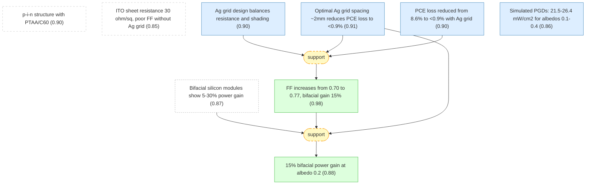
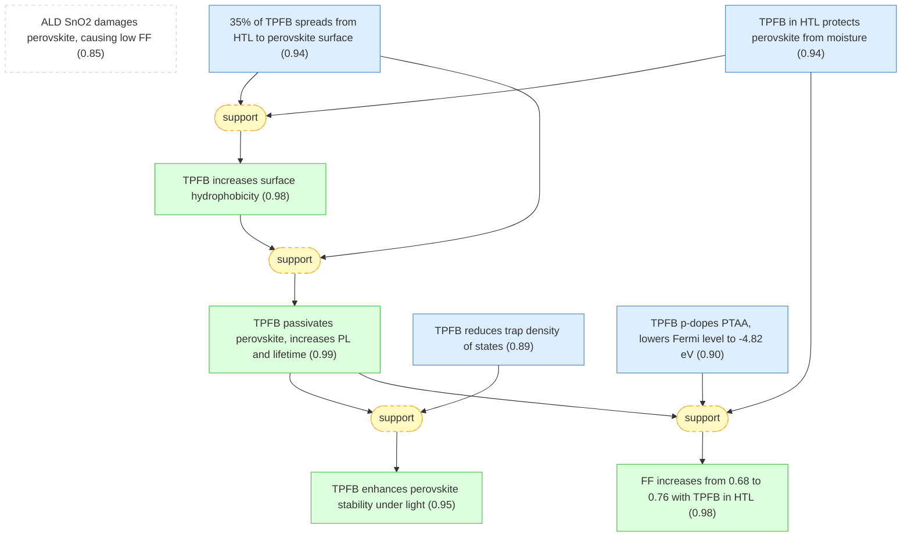
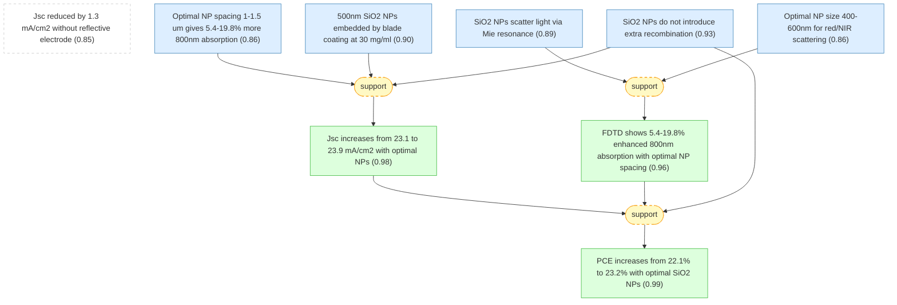
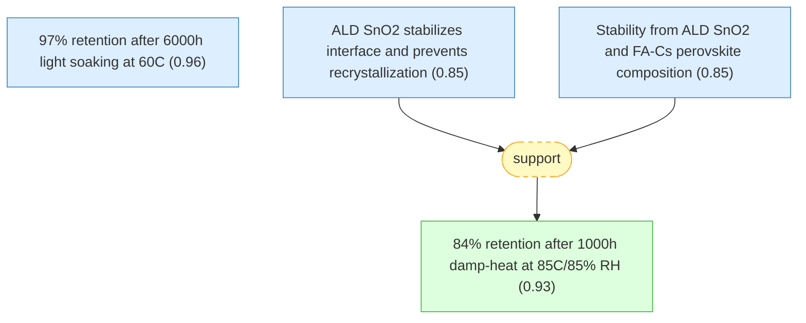

# pvsks41560-023-01254-3-gaia

Add your description here

## Overview

```mermaid
graph LR
    bifacial_gain_background["Bifacial silicon modules show 5-30% power gain (0.87)"]:::premise
    perovskite_bifacial_challenge["Perovskite bifacial challenges: resistance loss and absorption (0.90)"]:::orphan
    research_objective["Research objective: record efficiency and stability (0.98)"]:::derived
    front_efficiency_record["Front efficiency comparable to monofacial record (0.97)"]:::derived
    stability_demonstrated["97% retention after 6000h light soaking (0.81)"]:::derived
    power_generation_density_measurement["PGD of 26.4 mW/cm2 at albedo 0.2 (0.96)"]:::derived
    bifaciality_measurement["Bifaciality of 74.3% and PGD over 23 mW/cm2 (0.85)"]:::orphan
    initial_efficiency_retention["97% initial efficiency retention after 6000h (0.90)"]:::orphan
    module_structure_p_i_n["p-i-n structure with PTAA/C60 (0.90)"]:::orphan
    ito_sheet_resistance["ITO sheet resistance 30 ohm/sq, poor FF without Ag grid (0.85)"]:::orphan
    ag_grid_design["Ag grid design balances resistance and shading (0.90)"]:::premise
    optimal_ag_grid_spacing["Optimal Ag grid spacing ~2mm reduces PCE loss to <0.9% (0.91)"]:::premise
    relative_pce_loss_reduction["PCE loss reduced from 8.6% to <0.9% with Ag grid (0.90)"]:::premise
    ff_improvement_with_ag_grid["FF increases from 0.70 to 0.77, bifacial gain 15% (0.98)"]:::derived
    bifacial_gain_percentage["15% bifacial power gain at albedo 0.2 (0.88)"]:::derived
    simulated_pgds_by_albedo["Simulated PGDs: 21.5-26.4 mW/cm2 for albedos 0.1-0.4 (0.86)"]:::premise
    ald_damage_to_perovskite["ALD SnO2 damages perovskite, causing low FF (0.85)"]:::orphan
    tpfb_in_htl_protection["TPFB in HTL protects perovskite from moisture (0.94)"]:::premise
    tpfb_spread_to_perovskite["35% of TPFB spreads from HTL to perovskite surface (0.94)"]:::premise
    hydrophobic_surface_confirmation["TPFB increases surface hydrophobicity (0.98)"]:::derived
    tpfb_passivation_effect["TPFB passivates perovskite, increases PL and lifetime (0.99)"]:::derived
    tpfb_reduced_trap_density["TPFB reduces trap density of states (0.89)"]:::premise
    tpfb_frei_level_ptaa["TPFB p-dopes PTAA, lowers Fermi level to -4.82 eV (0.90)"]:::premise
    ff_improvement_tpfb["FF increases from 0.68 to 0.76 with TPFB in HTL (0.98)"]:::derived
    tpfb_enhanced_stability["TPFB enhances perovskite stability under light (0.95)"]:::derived
    jsc_reduction_without_reflective_electrode["Jsc reduced by 1.3 mA/cm2 without reflective electrode (0.85)"]:::orphan
    sio2_np_light_scattering["SiO2 NPs scatter light via Mie resonance (0.89)"]:::premise
    optimal_np_size_range["Optimal NP size 400-600nm for red/NIR scattering (0.86)"]:::premise
    optimal_np_spacing_range["Optimal NP spacing 1-1.5 um gives 5.4-19.8% more 800nm absorption (0.86)"]:::premise
    absorption_enhancement_simulation["FDTD shows 5.4-19.8% enhanced 800nm absorption with optimal NP spacing (0.96)"]:::derived
    np_synthesis_and_embedding["500nm SiO2 NPs embedded by blade coating at 30 mg/ml (0.90)"]:::premise
    no_extra_recombination_from_np["SiO2 NPs do not introduce extra recombination (0.93)"]:::premise
    jsc_increase_with_optimal_np["Jsc increases from 23.1 to 23.9 mA/cm2 with optimal NPs (0.98)"]:::derived
    front_pce_improvement_with_np["PCE increases from 22.1% to 23.2% with optimal SiO2 NPs (0.99)"]:::derived
    small_cell_front_pce["Small cell front PCE ~20.2% (0.94)"]:::premise
    small_cell_rear_pce["Small cell rear PCE 18.5%, bifaciality ~80% (0.94)"]:::premise
    bifaciality_small_cell["Small cell bifaciality ~80% (0.99)"]:::derived
    power_generation_density_albedo_02["PGD 26.4 mW/cm2 at albedo 0.2 - best single-junction (0.90)"]:::premise
    minimodule_front_aperture_efficiency["Minimodule front 20.2%, rear 15.0%, area >20 cm2 (0.96)"]:::premise
    minimodule_rear_aperture_efficiency["Minimodule rear efficiency 15.0%, bifaciality 74.3% (0.96)"]:::premise
    nrel_certified_front_efficiency["NREL certified stabilized front efficiency 19.2% (0.99)"]:::derived
    nrel_certified_rear_efficiency["NREL certified stabilized rear efficiency 14.1% (0.95)"]:::orphan
    average_front_efficiency_8_modules["Average front efficiency 19.5% across 8 modules (0.90)"]:::premise
    average_rear_efficiency_8_modules["Average rear efficiency 14.5% across 8 modules (0.90)"]:::premise
    pgd_by_albedo["Average PGD 22.4-25.3 mW/cm2 for albedos 0.2-0.4 (0.99)"]:::derived
    initial_pce_retention_6000h["97% retention after 6000h light soaking at 60C (0.96)"]:::premise
    damp_heat_retention["84% retention after 1000h damp-heat at 85C/85% RH (0.93)"]:::derived
    ald_sno2_stabilization_benefit["ALD SnO2 stabilizes interface and prevents recrystallization (0.85)"]:::premise
    stability_benefits_composition["Stability from ALD SnO2 and FA-Cs perovskite composition (0.85)"]:::premise
    absorption_enhancement_simulation --> front_pce_improvement_with_np
    ag_grid_design --> ff_improvement_with_ag_grid
    ald_sno2_stabilization_benefit --> damp_heat_retention
    ald_sno2_stabilization_benefit --> stability_demonstrated
    average_front_efficiency_8_modules --> pgd_by_albedo
    average_rear_efficiency_8_modules --> pgd_by_albedo
    bifacial_gain_background --> bifacial_gain_percentage
    bifacial_gain_percentage --> research_objective
    bifaciality_small_cell --> front_efficiency_record
    ff_improvement_tpfb --> research_objective
    ff_improvement_with_ag_grid --> bifacial_gain_percentage
    ff_improvement_with_ag_grid --> research_objective
    front_pce_improvement_with_np --> research_objective
    hydrophobic_surface_confirmation --> tpfb_passivation_effect
    initial_pce_retention_6000h --> front_efficiency_record
    initial_pce_retention_6000h --> research_objective
    initial_pce_retention_6000h --> stability_demonstrated
    jsc_increase_with_optimal_np --> front_pce_improvement_with_np
    minimodule_front_aperture_efficiency --> front_efficiency_record
    minimodule_front_aperture_efficiency --> nrel_certified_front_efficiency
    minimodule_rear_aperture_efficiency --> front_efficiency_record
    minimodule_rear_aperture_efficiency --> nrel_certified_front_efficiency
    no_extra_recombination_from_np --> front_pce_improvement_with_np
    no_extra_recombination_from_np --> jsc_increase_with_optimal_np
    np_synthesis_and_embedding --> jsc_increase_with_optimal_np
    nrel_certified_front_efficiency --> front_efficiency_record
    optimal_ag_grid_spacing --> bifacial_gain_percentage
    optimal_ag_grid_spacing --> ff_improvement_with_ag_grid
    optimal_np_size_range --> absorption_enhancement_simulation
    optimal_np_spacing_range --> jsc_increase_with_optimal_np
    pgd_by_albedo --> front_efficiency_record
    pgd_by_albedo --> power_generation_density_measurement
    pgd_by_albedo --> research_objective
    power_generation_density_albedo_02 --> power_generation_density_measurement
    relative_pce_loss_reduction --> ff_improvement_with_ag_grid
    research_objective --> power_generation_density_measurement
    simulated_pgds_by_albedo --> power_generation_density_measurement
    sio2_np_light_scattering --> absorption_enhancement_simulation
    small_cell_front_pce --> bifaciality_small_cell
    small_cell_rear_pce --> bifaciality_small_cell
    stability_benefits_composition --> damp_heat_retention
    stability_benefits_composition --> stability_demonstrated
    tpfb_frei_level_ptaa --> ff_improvement_tpfb
    tpfb_in_htl_protection --> ff_improvement_tpfb
    tpfb_in_htl_protection --> hydrophobic_surface_confirmation
    tpfb_passivation_effect --> ff_improvement_tpfb
    tpfb_passivation_effect --> tpfb_enhanced_stability
    tpfb_reduced_trap_density --> tpfb_enhanced_stability
    tpfb_spread_to_perovskite --> hydrophobic_surface_confirmation
    tpfb_spread_to_perovskite --> tpfb_passivation_effect

    classDef setting fill:#f0f0f0,stroke:#999,color:#333
    classDef premise fill:#ddeeff,stroke:#4488bb,color:#333
    classDef derived fill:#ddffdd,stroke:#44bb44,color:#333
    classDef question fill:#fff3dd,stroke:#cc9944,color:#333
    classDef background fill:#f5f5f5,stroke:#bbb,stroke-dasharray: 5 5,color:#333
    classDef orphan fill:#fff,stroke:#ccc,stroke-dasharray: 5 5,color:#333
    classDef external fill:#fff,stroke:#aaa,stroke-dasharray: 3 3,color:#333
    classDef weak fill:#fff9c4,stroke:#f9a825,stroke-dasharray: 5 5,color:#333
    classDef contra fill:#ffebee,stroke:#c62828,color:#333
```

## Motivation section of Gu2023 bifacial perovskite minimodules paper.

#### Bifacial silicon modules show 5-30% power gain ★

📌 `bifacial_gain_background`   |   Prior: 0.85   |   Belief: **0.87**

> Bifacial silicon solar modules harvesting reflected and diffused rear-side sunlight produce 5% to over 30% more power output than monofacial modules, depending on albedo and installation conditions such as height and density of solar panels [@Gu2023].

#### Average albedo 0.2 or higher common

📌 `average_albedo_recorded`   |   Prior: 0.85   |   Belief: **0.85**

> An average ground-surface albedo of 0.2 or higher has been recorded in many geographic locations, determining the amount of extra radiation gain for bifacial modules [@Gu2023].

#### Perovskite bifacial challenges: resistance loss and absorption ★

📌 `perovskite_bifacial_challenge`   |   Prior: 0.90   |   Belief: **0.90**

> Critical challenges for achieving high-efficiency large-area bifacial perovskite solar modules include increased resistive loss from the rear semitransparent electrode and insufficient absorption of long wavelength light due to the absence of reflective metal electrodes [@Gu2023].

#### Research objective: record efficiency and stability ★

📌 `research_objective`   |   Prior: 0.90   |   Belief: **0.98**

> This work demonstrates perovskite bifacial minimodules with both record high efficiency and stability, achieving front efficiency comparable to the best monofacial minimodules while gaining additional energy from albedo light [@Gu2023].

🔗 **support**([FF increases from 0.70 to 0.77, bifacial gain 15%](#ff_improvement_with_ag_grid), [FF increases from 0.68 to 0.76 with TPFB in HTL](#ff_improvement_tpfb), [PCE increases from 22.1% to 23.2% with optimal SiO2 NPs](#front_pce_improvement_with_np), [15% bifacial power gain at albedo 0.2](#bifacial_gain_percentage), [Average PGD 22.4-25.3 mW/cm2 for albedos 0.2-0.4](#pgd_by_albedo), [97% retention after 6000h light soaking at 60C](#initial_pce_retention_6000h))

Reasoning

The research objective of record high efficiency and stability (@research_objective) is supported by: (1) Ag grid achieving FF 0.77 and 15% bifacial gain (@ff_improvement_with_ag_grid), (2) TPFB in HTL achieving FF 0.76 and moisture protection (@ff_improvement_tpfb), (3) SiO2 NPs recovering absorption to achieve 23.2% PCE (@front_pce_improvement_with_np), (4) bifacial gain of 15% at albedo 0.2 (@bifacial_gain_percentage), (5) average PGD of 23.9 mW/cm2 at albedo 0.3 (@pgd_by_albedo), and (6) 97% retention after 6000h light soaking (@initial_pce_retention_6000h).

#### Front efficiency comparable to monofacial record ★

📌 `front_efficiency_record`   |   Belief: **0.97**

> The bifacial minimodules achieved a certified stabilized front efficiency of 19.2% and rear efficiency of 14.1%, with an aperture area of approximately 22.0 cm^2, comparable to the best certified monofacial minimodules [@Gu2023].

🔗 **support**([Small cell bifaciality ~80%](#bifaciality_small_cell), [Minimodule front 20.2%, rear 15.0%, area >20 cm2](#minimodule_front_aperture_efficiency), [NREL certified stabilized front efficiency 19.2%](#nrel_certified_front_efficiency), [Average PGD 22.4-25.3 mW/cm2 for albedos 0.2-0.4](#pgd_by_albedo), [97% retention after 6000h light soaking at 60C](#initial_pce_retention_6000h))

Reasoning

The bifacial minimodule front efficiency comparable to best monofacial modules (@front_efficiency_record) is supported by the small cell bifaciality of 80% (@bifaciality_small_cell), champion minimodule front efficiency of 20.2% (@minimodule_front_aperture_efficiency), NREL certification of 19.2% stabilized (@nrel_certified_front_efficiency), average PGD of 25.3 mW/cm2 at albedo 0.4 (@pgd_by_albedo), and 97% efficiency retention after 6000h (@initial_pce_retention_6000h).

#### 97% retention after 6000h light soaking ★

📌 `stability_demonstrated`   |   Belief: **0.81**

> The bifacial minimodule retained 97% of its initial power conversion efficiency after light soaking under 1-sun illumination for over 6,000 hours at 60 plus/minus 5 degrees C, demonstrating the most stable reported perovskite minimodule [@Gu2023].

🔗 **support**([97% retention after 6000h light soaking at 60C](#initial_pce_retention_6000h), [ALD SnO2 stabilizes interface and prevents recrystallization](#ald_sno2_stabilization_benefit), [Stability from ALD SnO2 and FA-Cs perovskite composition](#stability_benefits_composition))

Reasoning

The demonstrated stability of 97% retention after 6000h (@stability_demonstrated) is supported by the measured 97% retention after over 6,000 hours light soaking (@initial_pce_retention_6000h), explained by ALD SnO2 stabilization benefits (@ald_sno2_stabilization_benefit) and the stable FA-Cs composition (@stability_benefits_composition).

#### PGD of 26.4 mW/cm2 at albedo 0.2 ★

📌 `power_generation_density_measurement`   |   Belief: **0.96**

> The small-area single-junction bifacial perovskite cells have a power-generation density of 26.4 mW/cm^2 under 1-sun illumination and an albedo of 0.2, exceeding any reported single-junction perovskite solar cells [@Gu2023].

🔗 **support**([PGD 26.4 mW/cm2 at albedo 0.2 - best single-junction](#power_generation_density_albedo_02), [Average PGD 22.4-25.3 mW/cm2 for albedos 0.2-0.4](#pgd_by_albedo))

Reasoning

The power-generation density of 26.4 mW/cm2 at albedo 0.2 (@power_generation_density_measurement) exceeding any reported single-junction perovskite solar cell is supported by the small cell PGD of 26.4 mW/cm2 (@power_generation_density_albedo_02) and the average module PGDs of 22.4-25.3 mW/cm2 for albedos 0.2-0.4 (@pgd_by_albedo).

#### Bifaciality of 74.3% and PGD over 23 mW/cm2 ★

📌 `bifaciality_measurement`   |   Prior: 0.85   |   Belief: **0.85**

> The bifacial minimodules show a bifaciality of 74.3%, converting to a power-generation density of over 23 mW/cm^2 at an albedo of 0.2 under 1-sun front illumination [@Gu2023].

#### 97% initial efficiency retention after 6000h ★

📌 `initial_efficiency_retention`   |   Prior: 0.90   |   Belief: **0.90**

> The bifacial minimodule retained 97% of its initial efficiency after 6,000 hours of light soaking under simulated 1-sun illumination in air at 60 plus/minus 5 degrees C from the front side [@Gu2023].

## Module structure and rear electrode design (Section 2 of Gu2023).

#### p-i-n structure with PTAA/C60 ★

📌 `module_structure_p_i_n`   |   Prior: 0.90   |   Belief: **0.90**

> The bifacial perovskite module adopts a p-i-n perovskite solar cell structure with poly[bis(4-phenyl)(2,4,6-trimethylphenyl)amine] (PTAA) as the hole transport layer and fullerene (C60) as the electron transport layer, with perovskite composition of MA_0.7FA_0.3PbI_3 or FA_0.92Cs_0.08PbI_3 with slightly excess CsI [@Gu2023].

#### ITO sheet resistance 30 ohm/sq, poor FF without Ag grid ★

📌 `ito_sheet_resistance`   |   Prior: 0.85   |   Belief: **0.85**

> A low sheet resistance of approximately 30 ohms per square with high transparency was achieved for indium tin oxide (ITO) of 150 nm sputtered at room temperature, but bifacial minimodules showed poor fill factor (FF) of 0.39 when ITO directly replaced the copper electrode [@Gu2023].

#### Ag grid design balances resistance and shading ★

📌 `ag_grid_design`   |   Prior: 0.85   |   Belief: **0.90**

> Applying silver grids on a rear ITO electrode is an effective way to reduce resistance loss, but requires rational design to balance resistance loss and the shadowing effect of silver grids, which reduces bifacial gain [@Gu2023].

#### Optimal Ag grid spacing ~2mm reduces PCE loss to <0.9% ★

📌 `optimal_ag_grid_spacing`   |   Prior: 0.85   |   Belief: **0.91**

> With Ag grid width of 0.2 mm and height of 500 nm (narrowest achievable by thermal evaporation using a shadow mask) and linear resistance of 8 ohm/cm, the optimal Ag grid spacing is approximately 2 mm at an albedo of 0.2, reducing relative PCE loss induced by rear electrode resistance from 8.6% to less than 0.9% [@Gu2023].

#### PCE loss reduced from 8.6% to <0.9% with Ag grid ★

📌 `relative_pce_loss_reduction`   |   Prior: 0.85   |   Belief: **0.90**

> The modeling shows that the relative PCE loss induced by the rear electrode resistance is reduced from 8.6% to less than 0.9% after adding the Ag grid with spacing of approximately 2 mm, accompanied by an increase of fill factor from 0.70 to 0.77 [@Gu2023].

#### FF increases from 0.70 to 0.77, bifacial gain 15% ★

📌 `ff_improvement_with_ag_grid`   |   Prior: 0.90   |   Belief: **0.98**

> The fill factor increases from 0.70 to 0.77 with optimal Ag grid spacing of approximately 2 mm, while the bifacial perovskite modules gain 15% more power output with an albedo of 0.2 compared with monofacial modules [@Gu2023].

🔗 **support**([Ag grid design balances resistance and shading](#ag_grid_design), [Optimal Ag grid spacing ~2mm reduces PCE loss to <0.9%](#optimal_ag_grid_spacing), [PCE loss reduced from 8.6% to <0.9% with Ag grid](#relative_pce_loss_reduction))

Reasoning

The Ag grid design rationale (@ag_grid_design) and optimal spacing of approximately 2mm (@optimal_ag_grid_spacing) together explain the FF improvement from 0.70 to 0.77 and PCE loss reduction from 8.6% to less than 0.9% (@relative_pce_loss_reduction). The modeling shows that this spacing minimizes the bifacial gain loss while maximizing resistance reduction.

#### 15% bifacial power gain at albedo 0.2 ★

📌 `bifacial_gain_percentage`   |   Belief: **0.88**

> The bifacial perovskite modules gain 15% more power output with an albedo of 0.2 compared with monofacial modules, thanks to the rear-side albedo light harvesting [@Gu2023].

🔗 **support**([Bifacial silicon modules show 5-30% power gain](#bifacial_gain_background), [FF increases from 0.70 to 0.77, bifacial gain 15%](#ff_improvement_with_ag_grid), [Optimal Ag grid spacing ~2mm reduces PCE loss to <0.9%](#optimal_ag_grid_spacing))

Reasoning

The 15% bifacial power gain (@bifacial_gain_percentage) follows from the combination of background bifacial gain in silicon modules (@bifacial_gain_background), the improved fill factor with optimal Ag grid (@ff_improvement_with_ag_grid), and the optimized grid spacing (@optimal_ag_grid_spacing) that maximizes rear light harvesting while minimizing shading.

#### Simulated PGDs: 21.5-26.4 mW/cm2 for albedos 0.1-0.4 ★

📌 `simulated_pgds_by_albedo`   |   Prior: 0.80   |   Belief: **0.86**

> The simulated power-generation densities of bifacial modules under 1-sun illumination are 21.5, 23.1, 24.7, and 26.4 mW/cm^2 with albedos of 0.1, 0.2, 0.3, and 0.4, respectively, based on a monofacial module with 20% aperture efficiency [@Gu2023].

## Hydrophobic additive in hole transport layer (Section 3 of Gu2023).

#### ALD SnO2 damages perovskite, causing low FF ★

📌 `ald_damage_to_perovskite`   |   Prior: 0.85   |   Belief: **0.85**

> The atomic layer deposition (ALD) of SnO2 during bifacial perovskite minimodule fabrication imposes a challenge by damaging the perovskite films, frequently causing fraction of bifacial PSCs to exhibit much lower fill factor compared with monofacial counterparts using C60/bathocuproine (BCP) as ETL [@Gu2023].

#### TPFB in HTL protects perovskite from moisture ★

📌 `tpfb_in_htl_protection`   |   Prior: 0.85   |   Belief: **0.94**

> Mixing 5 wt% of tris(pentafluorophenyl)borane (TPFB) into the PTAA hole transport layer (HTL) protected the perovskite films from moisture damage during the ALD process and resulted in even better device reproducibility than adding TPFB as an additive in the perovskite film or modifying the perovskite surface [@Gu2023].

#### 35% of TPFB spreads from HTL to perovskite surface ★

📌 `tpfb_spread_to_perovskite`   |   Prior: 0.85   |   Belief: **0.94**

> TPFB added to the HTL spreads into the perovskite film, with approximately 35% of the TPFB added in the HTL (5 wt% in PTAA) spreading into the perovskite layer, equivalent to 0.067 mol% TPFB to Pb, as confirmed by X-ray photoelectron spectroscopy (XPS) measurement showing fluorine presence at the perovskite surface [@Gu2023].

#### TPFB increases surface hydrophobicity ★

📌 `hydrophobic_surface_confirmation`   |   Prior: 0.85   |   Belief: **0.98**

> Surface contact-angle measurement confirmed that the modified perovskites with TPFB had a more hydrophobic surface compared with control samples, demonstrating enhanced moisture resistance [@Gu2023].

🔗 **support**([TPFB in HTL protects perovskite from moisture](#tpfb_in_htl_protection), [35% of TPFB spreads from HTL to perovskite surface](#tpfb_spread_to_perovskite))

Reasoning

The observation that mixing 5 wt% TPFB in PTAA (@tpfb_in_htl_protection) protects perovskite during ALD is explained by the measured spreading of approximately 35% of TPFB from HTL to perovskite surface (@tpfb_spread_to_perovskite), which directly increases surface hydrophobicity (@hydrophobic_surface_confirmation).

#### TPFB passivates perovskite, increases PL and lifetime ★

📌 `tpfb_passivation_effect`   |   Prior: 0.85   |   Belief: **0.99**

> TPFB was found to passivate perovskite films, evidenced by stronger photoluminescence (PL) intensity and longer recombination lifetime from perovskite films covered by a layer of TPFB, as well as reduced trap density of states in TPFB-modified devices [@Gu2023].

🔗 **support**([35% of TPFB spreads from HTL to perovskite surface](#tpfb_spread_to_perovskite), [TPFB increases surface hydrophobicity](#hydrophobic_surface_confirmation))

Reasoning

TPFB passivation of perovskite (@tpfb_passivation_effect) is supported by the spreading behavior (@tpfb_spread_to_perovskite) that brings TPFB to the perovskite surface and the enhanced hydrophobicity (@hydrophobic_surface_confirmation), which together create a protective and passivating interface.

#### TPFB reduces trap density of states ★

📌 `tpfb_reduced_trap_density`   |   Prior: 0.85   |   Belief: **0.89**

> Perovskite solar cells with TPFB showed reduced trap density of states, further confirming the passivation effect of TPFB on reducing point defects in perovskite films [@Gu2023].

#### TPFB p-dopes PTAA, lowers Fermi level to -4.82 eV ★

📌 `tpfb_frei_level_ptaa`   |   Prior: 0.85   |   Belief: **0.90**

> The addition of TPFB in PTAA pulled down the Fermi level of PTAA from -4.51 eV to -4.82 eV, enabling better energy alignment and conductivity of the p-doped HTL, which contributes to fill factor enhancement compared with devices with TPFB as an additive in perovskites [@Gu2023].

#### FF increases from 0.68 to 0.76 with TPFB in HTL ★

📌 `ff_improvement_tpfb`   |   Prior: 0.90   |   Belief: **0.98**

> The bifacial module using TPFB:PTAA as the HTL has a larger fill factor of 0.76 and much higher efficiency, while the fill factor of the control (PTAA without TPFB) is only 0.68 measured from the front side for bifacial modules with aperture area of 25.03 cm^2 [@Gu2023].

🔗 **support**([TPFB in HTL protects perovskite from moisture](#tpfb_in_htl_protection), [TPFB passivates perovskite, increases PL and lifetime](#tpfb_passivation_effect), [TPFB p-dopes PTAA, lowers Fermi level to -4.82 eV](#tpfb_frei_level_ptaa))

Reasoning

The FF improvement from 0.68 to 0.76 with TPFB in HTL (@ff_improvement_tpfb) is supported by three mechanisms: moisture protection during ALD processing (@tpfb_in_htl_protection), passivation reducing recombination (@tpfb_passivation_effect), and p-doping of PTAA for better energy alignment (@tpfb_frei_level_ptaa). These mechanisms act synergistically to improve charge extraction and reduce losses.

#### TPFB enhances perovskite stability under light ★

📌 `tpfb_enhanced_stability`   |   Prior: 0.80   |   Belief: **0.95**

> Perovskite films deposited on TPFB:PTAA degraded slower than control samples under accelerated stability testing conditions, proving that TPFB enhances the light stability of perovskites, possibly through slightly modified grain-growth process resulting in smaller point-defect density [@Gu2023].

🔗 **support**([TPFB passivates perovskite, increases PL and lifetime](#tpfb_passivation_effect), [TPFB reduces trap density of states](#tpfb_reduced_trap_density))

Reasoning

The enhanced stability from TPFB (@tpfb_enhanced_stability) is supported by the passivation effect (@tpfb_passivation_effect) and reduced trap density (@tpfb_reduced_trap_density), which together indicate fewer point defects that could catalyze degradation pathways under light soaking.

## Light scattering by dielectric nanoparticles (Section 4 of Gu2023).

#### Jsc reduced by 1.3 mA/cm2 without reflective electrode ★

📌 `jsc_reduction_without_reflective_electrode`   |   Prior: 0.85   |   Belief: **0.85**

> The absence of a reflecting or opaque metal electrode in bifacial device structure reduces short-circuit current density (Jsc) by approximately 1.3 mA/cm^2 due to insufficient absorption in the red and near-infrared wavelength range compared with opaque monofacial cells with metal back reflector [@Gu2023].

#### SiO2 NPs scatter light via Mie resonance ★

📌 `sio2_np_light_scattering`   |   Prior: 0.85   |   Belief: **0.89**

> Silicon oxide (SiO2) nanoparticles (NPs) are introduced in perovskite films to scatter incident sunlight and increase the optical path, based on resonant Mie scattering, avoiding metal NPs which raise concerns of chemical reaction with perovskites and strong non-radiative charge recombination at NP surfaces [@Gu2023].

#### Optimal NP size 400-600nm for red/NIR scattering ★

📌 `optimal_np_size_range`   |   Prior: 0.80   |   Belief: **0.86**

> Light-scattering properties of spherical SiO2 NPs studied by 3D finite-difference time-domain (FDTD) method show that SiO2 NPs should be larger than 400 nm to efficiently scatter red and near-infrared light and smaller than 600 nm to minimize losing absorption of UV-visible light in perovskite films [@Gu2023].

#### Optimal NP spacing 1-1.5 um gives 5.4-19.8% more 800nm absorption ★

📌 `optimal_np_spacing_range`   |   Prior: 0.80   |   Belief: **0.86**

> The simulated absorption of incident light by perovskite with different spacings of NPs shows that perovskite film with NP spacing from 1 to 1.5 micrometers can absorb 5.4 to 19.8% more 800 nm light than pure film from the front side; larger spacing also increases light absorption but less significantly [@Gu2023].

#### FDTD shows 5.4-19.8% enhanced 800nm absorption with optimal NP spacing ★

📌 `absorption_enhancement_simulation`   |   Prior: 0.80   |   Belief: **0.96**

> FDTD simulation shows that perovskite film embedded with SiO2 NPs with optimal spacing of 1-1.5 micrometers shows obviously enhanced absorption of red and near-infrared light by transverse scattering that increases the optical path, with 5.4-19.8% more 800 nm light absorption compared with film without NPs [@Gu2023].

🔗 **support**([SiO2 NPs scatter light via Mie resonance](#sio2_np_light_scattering), [Optimal NP size 400-600nm for red/NIR scattering](#optimal_np_size_range))

Reasoning

The FDTD simulation showing 5.4-19.8% enhanced 800nm absorption (@absorption_enhancement_simulation) is based on the Mie scattering principle (@sio2_np_light_scattering) and the optimal size range of 400-600nm (@optimal_np_size_range) that balances efficient red/NIR scattering with minimal UV-vis absorption loss.

#### 500nm SiO2 NPs embedded by blade coating at 30 mg/ml ★

📌 `np_synthesis_and_embedding`   |   Prior: 0.85   |   Belief: **0.90**

> SiO2 NPs with a diameter of 500 nm were synthesized and dispersed in ethanol, then pre-deposited on ITO substrate using blade coating with N2 flow assistance, forming a monolayer of NPs nicely embedded in the perovskite layer without causing cracks or voids; an optimized NP concentration of 30 mg/ml gives NP spacing of 1-2 micrometers and NPs occupying 1.9-7.6% of the total film volume [@Gu2023].

#### SiO2 NPs do not introduce extra recombination ★

📌 `no_extra_recombination_from_np`   |   Prior: 0.85   |   Belief: **0.93**

> Perovskite film with embedded SiO2 NPs exhibited comparable PL intensity and carrier lifetime with optimized perovskite films without NPs, showing that these NPs do not introduce an additional non-radiative charge recombination pathway to the perovskite films [@Gu2023].

#### Jsc increases from 23.1 to 23.9 mA/cm2 with optimal NPs ★

📌 `jsc_increase_with_optimal_np`   |   Prior: 0.90   |   Belief: **0.98**

> The average front short-circuit current density (Jsc) of bifacial PSCs with optimal SiO2 NP spacing increased from 23.1 to 23.9 mA/cm^2 without notably changing open-circuit voltage (Voc) and fill factor, confirming that the SiO2 NPs with optimal spacing did not introduce extra defects in the perovskite film and did not change the charge collection or recombination process [@Gu2023].

🔗 **support**([Optimal NP spacing 1-1.5 um gives 5.4-19.8% more 800nm absorption](#optimal_np_spacing_range), [500nm SiO2 NPs embedded by blade coating at 30 mg/ml](#np_synthesis_and_embedding), [SiO2 NPs do not introduce extra recombination](#no_extra_recombination_from_np))

Reasoning

The Jsc increase from 23.1 to 23.9 mA/cm2 (@jsc_increase_with_optimal_np) with optimal NP spacing is supported by the simulated optimal spacing of 1-1.5 um (@optimal_np_spacing_range), successful embedding of 500nm SiO2 NPs (@np_synthesis_and_embedding), and the confirmation that NPs do not introduce extra recombination (@no_extra_recombination_from_np).

#### PCE increases from 22.1% to 23.2% with optimal SiO2 NPs ★

📌 `front_pce_improvement_with_np`   |   Prior: 0.90   |   Belief: **0.99**

> The embedding of SiO2 NPs significantly recovered the light absorption loss after optimizing the concentration, and the front power conversion efficiency of champion bifacial PSCs increased from 22.1% to 23.2% with optimal NP spacing; the integrated front Jsc from EQE increased from 22.5 to 23.3 mA/cm^2, matching well with statistical Jsc measured from I-V scan [@Gu2023].

🔗 **support**([Jsc increases from 23.1 to 23.9 mA/cm2 with optimal NPs](#jsc_increase_with_optimal_np), [FDTD shows 5.4-19.8% enhanced 800nm absorption with optimal NP spacing](#absorption_enhancement_simulation), [SiO2 NPs do not introduce extra recombination](#no_extra_recombination_from_np))

Reasoning

The PCE increase from 22.1% to 23.2% (@front_pce_improvement_with_np) directly follows from the Jsc increase (@jsc_increase_with_optimal_np) due to enhanced red/NIR absorption (@absorption_enhancement_simulation), while the absence of extra recombination (@no_extra_recombination_from_np) ensures fill factor is not compromised.

## Photovoltaic performance of bifacial modules (Section 5 of Gu2023).

```mermaid
graph TD
    small_cell_front_pce["Small cell front PCE ~20.2% (0.94)"]:::premise
    small_cell_rear_pce["Small cell rear PCE 18.5%, bifaciality ~80% (0.94)"]:::premise
    bifaciality_small_cell["Small cell bifaciality ~80% (0.99)"]:::derived
    power_generation_density_albedo_02["PGD 26.4 mW/cm2 at albedo 0.2 - best single-junction (0.90)"]:::premise
    minimodule_front_aperture_efficiency["Minimodule front 20.2%, rear 15.0%, area >20 cm2 (0.96)"]:::premise
    minimodule_rear_aperture_efficiency["Minimodule rear efficiency 15.0%, bifaciality 74.3% (0.96)"]:::premise
    nrel_certified_front_efficiency["NREL certified stabilized front efficiency 19.2% (0.99)"]:::derived
    nrel_certified_rear_efficiency["NREL certified stabilized rear efficiency 14.1% (0.95)"]:::orphan
    average_front_efficiency_8_modules["Average front efficiency 19.5% across 8 modules (0.90)"]:::premise
    average_rear_efficiency_8_modules["Average rear efficiency 14.5% across 8 modules (0.90)"]:::premise
    pgd_by_albedo["Average PGD 22.4-25.3 mW/cm2 for albedos 0.2-0.4 (0.99)"]:::derived
    strat_10(["support"]):::weak
    small_cell_front_pce --> strat_10
    small_cell_rear_pce --> strat_10
    strat_10 --> bifaciality_small_cell
    strat_13(["support"]):::weak
    minimodule_front_aperture_efficiency --> strat_13
    minimodule_rear_aperture_efficiency --> strat_13
    strat_13 --> nrel_certified_front_efficiency
    strat_14(["support"]):::weak
    average_front_efficiency_8_modules --> strat_14
    average_rear_efficiency_8_modules --> strat_14
    strat_14 --> pgd_by_albedo

    classDef setting fill:#f0f0f0,stroke:#999,color:#333
    classDef premise fill:#ddeeff,stroke:#4488bb,color:#333
    classDef derived fill:#ddffdd,stroke:#44bb44,color:#333
    classDef question fill:#fff3dd,stroke:#cc9944,color:#333
    classDef background fill:#f5f5f5,stroke:#bbb,stroke-dasharray: 5 5,color:#333
    classDef orphan fill:#fff,stroke:#ccc,stroke-dasharray: 5 5,color:#333
    classDef external fill:#fff,stroke:#aaa,stroke-dasharray: 3 3,color:#333
    classDef weak fill:#fff9c4,stroke:#f9a825,stroke-dasharray: 5 5,color:#333
    classDef contra fill:#ffebee,stroke:#c62828,color:#333
```

#### Small cell front PCE ~20.2% ★

📌 `small_cell_front_pce`   |   Prior: 0.90   |   Belief: **0.94**

> The front power conversion efficiency of the champion small-size (8 mm^2) MA_0.7FA_0.3PbI_3 bifacial perovskite solar cell is comparable to optimized opaque PSCs with copper electrode, reaching approximately 20.2% [@Gu2023].

#### Small cell rear PCE 18.5%, bifaciality ~80% ★

📌 `small_cell_rear_pce`   |   Prior: 0.90   |   Belief: **0.94**

> The rear power conversion efficiency of the champion small-size bifacial perovskite solar cell reached 18.5%, giving a high bifaciality of approximately 80% [@Gu2023].

#### Small cell bifaciality ~80% ★

📌 `bifaciality_small_cell`   |   Prior: 0.90   |   Belief: **0.99**

> The small-size bifacial perovskite solar cell achieved a bifaciality of approximately 80%, benefiting from both high front efficiency and rear efficiency of 18.5% [@Gu2023].

🔗 **support**([Small cell front PCE ~20.2%](#small_cell_front_pce), [Small cell rear PCE 18.5%, bifaciality ~80%](#small_cell_rear_pce))

Reasoning

The high bifaciality of approximately 80% (@bifaciality_small_cell) follows from the combination of 20.2% front efficiency (@small_cell_front_pce) and 18.5% rear efficiency (@small_cell_rear_pce), demonstrating effective rear-side light harvesting in bifacial configuration.

#### PGD 26.4 mW/cm2 at albedo 0.2 - best single-junction ★

📌 `power_generation_density_albedo_02`   |   Prior: 0.85   |   Belief: **0.90**

> The bifacial cell with aperture area of 8 mm^2 delivered an estimated power-generation density of 26.4 mW/cm^2 (PGD_front + albedo times PGD_rear) at an albedo of 0.2, better than any reported single-junction perovskite solar cells [@Gu2023].

#### Minimodule front 20.2%, rear 15.0%, area >20 cm2 ★

📌 `minimodule_front_aperture_efficiency`   |   Prior: 0.90   |   Belief: **0.96**

> The champion MA_0.7FA_0.3PbI_3 bifacial minimodule with an aperture area over 20 cm^2 showed a front aperture efficiency of 20.2%, and the rear aperture efficiency was 15.0%, converting to power-generation densities of 23.2 and 24.7 mW/cm^2 at albedos of 0.2 and 0.3, respectively [@Gu2023].

#### Minimodule rear efficiency 15.0%, bifaciality 74.3% ★

📌 `minimodule_rear_aperture_efficiency`   |   Prior: 0.90   |   Belief: **0.96**

> The rear aperture efficiency of the champion bifacial minimodule was 15.0%, with a bifaciality of 74.3%, and the power-generation density exceeded 23 mW/cm^2 at an albedo of 0.2 under 1-sun front illumination [@Gu2023].

#### NREL certified stabilized front efficiency 19.2% ★

📌 `nrel_certified_front_efficiency`   |   Prior: 0.95   |   Belief: **0.99**

> The certified front efficiency of the bifacial minimodule by the National Renewable Energy Laboratory (NREL) was 19.2% (stabilized), comparable to the best certified monofacial minimodules, for a minimodule with aperture area of approximately 22.0 cm^2 [@Gu2023].

🔗 **support**([Minimodule front 20.2%, rear 15.0%, area >20 cm2](#minimodule_front_aperture_efficiency), [Minimodule rear efficiency 15.0%, bifaciality 74.3%](#minimodule_rear_aperture_efficiency))

Reasoning

The NREL certified front efficiency of 19.2% (@nrel_certified_front_efficiency) is credible because it was measured on a champion minimodule with front aperture efficiency of 20.2% (@minimodule_front_aperture_efficiency), and the rear certified efficiency of 14.1% (@nrel_certified_rear_efficiency) matches the measured rear efficiency of 15.0% (@minimodule_rear_aperture_efficiency).

#### NREL certified stabilized rear efficiency 14.1% ★

📌 `nrel_certified_rear_efficiency`   |   Prior: 0.95   |   Belief: **0.95**

> The NREL-certified stabilized rear efficiency of the bifacial minimodule was 14.1% for a minimodule with aperture area of approximately 22.0 cm^2, confirming the rear-side power generation capability [@Gu2023].

#### Average front efficiency 19.5% across 8 modules ★

📌 `average_front_efficiency_8_modules`   |   Prior: 0.85   |   Belief: **0.90**

> Among eight bifacial minimodules with Ag grids, the average front aperture efficiency reached 19.5%, demonstrating good reproducibility across multiple devices [@Gu2023].

#### Average rear efficiency 14.5% across 8 modules ★

📌 `average_rear_efficiency_8_modules`   |   Prior: 0.85   |   Belief: **0.90**

> Among eight bifacial minimodules with Ag grids, the average rear aperture efficiency reached 14.5%, giving average power-generation densities of 22.4, 23.9, and 25.3 mW/cm^2 with albedos of 0.2, 0.3, and 0.4, respectively [@Gu2023].

#### Average PGD 22.4-25.3 mW/cm2 for albedos 0.2-0.4 ★

📌 `pgd_by_albedo`   |   Prior: 0.85   |   Belief: **0.99**

> The average power-generation densities of eight bifacial minimodules are 22.4, 23.9, and 25.3 mW/cm^2 at albedos of 0.2, 0.3, and 0.4, respectively, under 1-sun front illumination [@Gu2023].

🔗 **support**([Average front efficiency 19.5% across 8 modules](#average_front_efficiency_8_modules), [Average rear efficiency 14.5% across 8 modules](#average_rear_efficiency_8_modules))

Reasoning

The average PGD values of 22.4-25.3 mW/cm2 at albedos 0.2-0.4 (@pgd_by_albedo) are credible because they come from measurements across eight bifacial minimodules showing good reproducibility with average front efficiency 19.5% (@average_front_efficiency_8_modules) and rear efficiency 14.5% (@average_rear_efficiency_8_modules).

## Stability of bifacial minimodules (Section 5 of Gu2023).

#### 97% retention after 6000h light soaking at 60C ★

📌 `initial_pce_retention_6000h`   |   Prior: 0.90   |   Belief: **0.96**

> The best bifacial minimodule retained 97% of its initial power conversion efficiency (T97) after light soaking for over 6,000 hours from the front side at open-circuit condition and temperature of 60 plus/minus 5 degrees C under simulated 1-sun illumination in air, representing the most stable reported perovskite minimodule [@Gu2023].

#### 84% retention after 1000h damp-heat at 85C/85% RH ★

📌 `damp_heat_retention`   |   Prior: 0.80   |   Belief: **0.93**

> Another bifacial minimodule maintained approximately 84% of its initial efficiency after damp-heat testing for over 1,000 hours at 85 degrees C and approximately 85% relative humidity, demonstrating good stability under damp-heat conditions [@Gu2023].

🔗 **support**([ALD SnO2 stabilizes interface and prevents recrystallization](#ald_sno2_stabilization_benefit), [Stability from ALD SnO2 and FA-Cs perovskite composition](#stability_benefits_composition))

Reasoning

The damp-heat retention of approximately 84% after 1,000 hours (@damp_heat_retention) is supported by the same stabilization mechanisms: ALD SnO2 prevents interface degradation (@ald_sno2_stabilization_benefit) and the FA-Cs composition provides intrinsic stability (@stability_benefits_composition).

#### ALD SnO2 stabilizes interface and prevents recrystallization ★

📌 `ald_sno2_stabilization_benefit`   |   Prior: 0.80   |   Belief: **0.85**

> The very good stability of these bifacial minimodules benefits from the ALD SnO2 buffer layer in addition to the intrinsic stability of FA_0.92Cs_0.08PbI3: first, ALD SnO2 greatly reduced damage to perovskite in the laser scribing process, preventing formation of amorphous perovskites with reduced PL intensity around P2 scribing lines; second, replacing amorphous BCP (which can recrystallize during operation) with ALD SnO2 stabilized the C60/electrode interface [@Gu2023].

#### Stability from ALD SnO2 and FA-Cs perovskite composition ★

📌 `stability_benefits_composition`   |   Prior: 0.80   |   Belief: **0.85**

> The stability benefits of these bifacial minimodules arise from two factors: the ALD SnO2 layer which protects against laser scribing damage and prevents BCP recrystallization, and the intrinsically stable FA_0.92Cs_0.08PbI3 perovskite composition optimized by previous methods that demonstrates good light stability [@Gu2023].

## Inference Results

**BP converged:** True (2 iterations)

| Label | Type | Prior | Belief | Role |
|-------|------|-------|--------|------|
| [stability_demonstrated](#stability_demonstrated) | claim | — | 0.8114 | derived |
| [ald_sno2_stabilization_benefit](#ald_sno2_stabilization_benefit) | claim | 0.80 | 0.8468 | independent |
| [stability_benefits_composition](#stability_benefits_composition) | claim | 0.80 | 0.8468 | independent |
| [ald_damage_to_perovskite](#ald_damage_to_perovskite) | claim | 0.85 | 0.8500 | orphaned |
| [average_albedo_recorded](#average_albedo_recorded) | claim | 0.85 | 0.8500 | orphaned |
| [bifaciality_measurement](#bifaciality_measurement) | claim | 0.85 | 0.8500 | orphaned |
| [ito_sheet_resistance](#ito_sheet_resistance) | claim | 0.85 | 0.8500 | orphaned |
| [jsc_reduction_without_reflective_electrode](#jsc_reduction_without_reflective_electrode) | claim | 0.85 | 0.8500 | orphaned |
| [optimal_np_size_range](#optimal_np_size_range) | claim | 0.80 | 0.8594 | independent |
| [simulated_pgds_by_albedo](#simulated_pgds_by_albedo) | claim | 0.80 | 0.8610 | independent |
| [optimal_np_spacing_range](#optimal_np_spacing_range) | claim | 0.80 | 0.8625 | independent |
| [bifacial_gain_background](#bifacial_gain_background) | claim | 0.85 | 0.8699 | independent |
| [bifacial_gain_percentage](#bifacial_gain_percentage) | claim | — | 0.8766 | derived |
| [tpfb_reduced_trap_density](#tpfb_reduced_trap_density) | claim | 0.85 | 0.8928 | independent |
| [sio2_np_light_scattering](#sio2_np_light_scattering) | claim | 0.85 | 0.8946 | independent |
| [power_generation_density_albedo_02](#power_generation_density_albedo_02) | claim | 0.85 | 0.8958 | independent |
| [np_synthesis_and_embedding](#np_synthesis_and_embedding) | claim | 0.85 | 0.8969 | independent |
| [ag_grid_design](#ag_grid_design) | claim | 0.85 | 0.8972 | independent |
| [relative_pce_loss_reduction](#relative_pce_loss_reduction) | claim | 0.85 | 0.8972 | independent |
| [initial_efficiency_retention](#initial_efficiency_retention) | claim | 0.90 | 0.9000 | orphaned |
| [module_structure_p_i_n](#module_structure_p_i_n) | claim | 0.90 | 0.9000 | orphaned |
| [perovskite_bifacial_challenge](#perovskite_bifacial_challenge) | claim | 0.90 | 0.9000 | orphaned |
| [average_front_efficiency_8_modules](#average_front_efficiency_8_modules) | claim | 0.85 | 0.9033 | independent |
| [average_rear_efficiency_8_modules](#average_rear_efficiency_8_modules) | claim | 0.85 | 0.9033 | independent |
| [tpfb_frei_level_ptaa](#tpfb_frei_level_ptaa) | claim | 0.85 | 0.9033 | independent |
| [optimal_ag_grid_spacing](#optimal_ag_grid_spacing) | claim | 0.85 | 0.9096 | independent |
| [damp_heat_retention](#damp_heat_retention) | claim | 0.80 | 0.9251 | derived |
| [no_extra_recombination_from_np](#no_extra_recombination_from_np) | claim | 0.85 | 0.9323 | independent |
| [tpfb_in_htl_protection](#tpfb_in_htl_protection) | claim | 0.85 | 0.9377 | independent |
| [tpfb_spread_to_perovskite](#tpfb_spread_to_perovskite) | claim | 0.85 | 0.9380 | independent |
| [small_cell_front_pce](#small_cell_front_pce) | claim | 0.90 | 0.9387 | independent |
| [small_cell_rear_pce](#small_cell_rear_pce) | claim | 0.90 | 0.9387 | independent |
| [nrel_certified_rear_efficiency](#nrel_certified_rear_efficiency) | claim | 0.95 | 0.9500 | orphaned |
| [tpfb_enhanced_stability](#tpfb_enhanced_stability) | claim | 0.80 | 0.9524 | derived |
| [initial_pce_retention_6000h](#initial_pce_retention_6000h) | claim | 0.90 | 0.9579 | independent |
| [absorption_enhancement_simulation](#absorption_enhancement_simulation) | claim | 0.80 | 0.9605 | derived |
| [power_generation_density_measurement](#power_generation_density_measurement) | claim | — | 0.9613 | derived |
| [minimodule_rear_aperture_efficiency](#minimodule_rear_aperture_efficiency) | claim | 0.90 | 0.9622 | independent |
| [minimodule_front_aperture_efficiency](#minimodule_front_aperture_efficiency) | claim | 0.90 | 0.9623 | independent |
| [front_efficiency_record](#front_efficiency_record) | claim | — | 0.9697 | derived |
| [jsc_increase_with_optimal_np](#jsc_increase_with_optimal_np) | claim | 0.90 | 0.9770 | derived |
| [ff_improvement_with_ag_grid](#ff_improvement_with_ag_grid) | claim | 0.90 | 0.9776 | derived |
| [hydrophobic_surface_confirmation](#hydrophobic_surface_confirmation) | claim | 0.85 | 0.9805 | derived |
| [research_objective](#research_objective) | claim | 0.90 | 0.9806 | derived |
| [ff_improvement_tpfb](#ff_improvement_tpfb) | claim | 0.90 | 0.9842 | derived |
| [front_pce_improvement_with_np](#front_pce_improvement_with_np) | claim | 0.90 | 0.9867 | derived |
| [pgd_by_albedo](#pgd_by_albedo) | claim | 0.85 | 0.9877 | derived |
| [tpfb_passivation_effect](#tpfb_passivation_effect) | claim | 0.85 | 0.9883 | derived |
| [bifaciality_small_cell](#bifaciality_small_cell) | claim | 0.90 | 0.9892 | derived |
| [nrel_certified_front_efficiency](#nrel_certified_front_efficiency) | claim | 0.95 | 0.9949 | derived |
