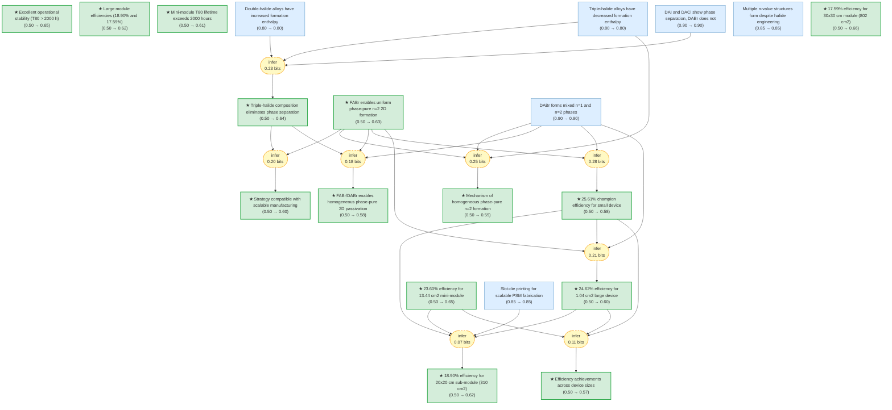

# pvsks41560-024-01667-8-gaia

> **Original work:** Jing Li, Chengkai Jin, Ruixuan Jiang, et al. "Homogeneous coverage of the low-dimensional perovskite passivation layer for formamidinium-caesium perovskite solar modules." *Nature Energy* (2024). DOI: 10.1038/s41560-024-01667-8

<!-- badges:start -->
<!-- badges:end -->

## Overview

This package formalizes a Nature Energy paper on homogeneous 2D perovskite passivation for scalable perovskite solar modules (PSMs). The core innovation is using formamidinium bromide (FABr) combined with n-dodecylammonium bromide (DABr) post-treatment to form a phase-pure n=2 2D perovskite capping layer on 3D perovskite films, solving a phase separation problem that occurs with long-chain alkylamine ligands. The approach achieves champion efficiencies of 25.61% (small device), 24.62% (large device), and 23.60% (mini-module), with scaling to 30x30 cm modules at 17.59% efficiency via slot-die printing. The key insight is that triple-halide composition (introducing Br) reduces formation enthalpy of n=2 2D perovskite, enabling preferential formation of phase-pure structures.

> [!TIP]
> **Reasoning graph information gain: `3.1 bits`**
>
> Total mutual information between leaf premises and exported conclusions — measures how much the reasoning structure reduces uncertainty about the results.

> [!NOTE]
> **[Per-module reasoning graphs with full claim details →](docs/detailed-reasoning.md)**

## Reasoning Structure

### Triple-halide composition eliminates phase separation in double-halide alloys (belief: 0.64)

Long-chain alkylamine ligands (n-dodecylammonium, DA) with different halides (I, Br, Cl) show different phase behaviors on 3D perovskite surfaces. When DAI or DACl are used, photoluminescence (PL) spectroscopy reveals splitting of the n=1 emission peak around 500 nm, indicating phase separation into multiple n-value structures. However, DABr shows a stable single n=1 peak without splitting.

DFT calculations explain this: double-halide alloys (such as DA2PbI4-xClx) have significantly increased formation enthalpy and mixing enthalpy, providing a thermodynamic driving force for phase separation. In contrast, introducing Br as a third halide reduces the formation enthalpy of triple-halide alloys (DA2FAPb2(I4-0.5xClx)Br3), effectively inhibiting I-Cl phase separation. The triple-halide approach is confirmed to work across different perovskite compositions (including I-Br alloys), making it a general solution to the phase separation problem.

**Evidence chain:**
- **Halide-dependent PL behavior** (belief: 0.90): Direct PL measurements showing DAI and DACl exhibit phase separation while DABr does not. Strong experimental evidence with clear spectral signatures.
- **Double-halide formation enthalpy increase** (belief: 0.80): DFT calculations showing thermodynamic driving force for phase separation in double-halide systems. Standard DFT methodology with reasonable approximations.
- **Triple-halide formation enthalpy decrease** (belief: 0.80): DFT showing Br incorporation reduces formation enthalpy, explaining why triple-halide eliminates phase separation.

> Phase separation in double-halide 2D perovskites is a known problem that degrades device performance. The triple-halide solution is theoretically sound and experimentally validated across multiple compositions.

### FABr enables uniform phase-pure n=2 2D formation (belief: 0.63)

Although triple-halide engineering eliminates halide phase separation, multiple n-value structures (n=1, n=2, n=3) still form when using long-chain ligands alone. However, combining FABr with DABr (or other DAX) in the post-treatment leads to growth of uniform n=2 2D structures without phase separation. GIWAXS confirms that DABr/FABr treatment produces pure n=2 phase (q=0.21, 0.41, 0.62, 0.83 A^-1), while DABr alone produces mixed n=1 and n=2 phases.

The mechanism involves FABr preferentially reacting with residual PbI2 and passivating FA vacancies generated during the IPA dissolution process. This creates a uniform crystalline FAPbI3-xBrx layer that facilitates subsequent reaction with DABr to form phase-pure n=2 2D perovskite. DFT calculations confirm that triple-halide n=2 structures (DA2FAPb2(I4-0.5xClx)Br3) have lower formation enthalpy than n=1 or n=3, enabling preferential n=2 crystallization. The approach is universal across different 2D ligands (BA, OA, DA, HDA, PMA, PEA, NMA, PRMA).

**Evidence chain:**
- **Multiple n-value challenge** (belief: 0.85): Direct observation that even with triple-halide, multiple n-values still form. This drives the need for FABr incorporation.
- **Triple-halide eliminates phase separation** (belief: 0.64): Confirmed phase separation elimination but with remaining n-value diversity.
- **GIWAXS confirmation** (belief: 0.90): Direct structural evidence showing pure n=2 for DABr/FABr vs mixed n=1/n=2 for DABr alone.

> The FABr/DABr combination works because FABr fills ion vacancies and lowers n=2 formation enthalpy, while DABr provides the 2D cation structure. The phase-pure n=2 layer is critical because n=1 2D perovskite is highly insulating and would hinder charge transport.

### Phase-pure n=2 2D passivation improves morphology and reduces defects (belief: 0.66)

AFM and KPFM characterization reveals that DABr/FABr post-treatment produces smoother surface morphology with narrower surface potential distribution compared to DABr-only or pristine films. Time-resolved confocal PL mappings show that DABr/FABr-treated films have longer carrier lifetimes (red regions dominant) compared to DABr-only (mixed red/green) and pristine (green grains, blue grain boundaries) films. SCLC measurements confirm that DABr/FABr treatment reduces trap density (Nt) in both electron-only and hole-only device configurations compared to DABr-only and pristine controls.

The improved morphology and reduced defects directly translate to improved photovoltaic performance. The homogeneous phase-pure n=2 2D layer effectively passivates the 3D perovskite surface, suppressing interfacial defect-assisted non-radiative recombination and accelerating hole extraction.

**Evidence chain:**
- **AFM morphology improvement** (belief: 0.66): Direct AFM measurement showing smoother surface. Belief limited by being downstream of the formation mechanism.
- **GIWAXS pure n=2** (belief: 0.90): Strong structural evidence for phase-pure n=2 formation.
- **Formation mechanism** (belief: 0.66): Mechanism connecting FABr passivation of vacancies and strengthened PbX2-2D ligand reaction to uniform morphology.

> The phase-pure n=2 layer creates a high-quality heterojunction with reduced defects, which is essential for achieving high efficiencies and long-term stability.

### Champion efficiencies: 25.61% (small), 24.62% (large), 23.60% (mini-module) (belief: 0.58-0.65)

DABr/FABr post-treated PSCs achieve champion PCE of 25.61% (certified 24.95%) for small devices (0.14 cm2), with the most significant improvement in open-circuit voltage (Voc) compared to other treatments. Large-size devices (1.04 cm2 aperture) achieve 24.62% (certified 24.04%), demonstrating minimal efficiency loss when scaling up. Mini-modules (13.44 cm2 aperture) achieve 23.60% PCE.

The efficiency scaling shows less than 5% loss per tenfold area increase: 25.61% → 24.62% → 23.60%, confirming good scalability of the homogeneous passivation approach. EQE integration gives 24.80 mA/cm2 for the large device, well-matched with J-V characterization results.

**Evidence chain:**
- **Champion small device** (belief: 0.58): From GIWAXS pure n=2 + formation mechanism + reduced trap density. Multiple intermediate steps limit the belief propagation.
- **Large device efficiency** (belief: 0.60): Building on champion small device with morphology evidence.
- **Mini-module efficiency** (belief: 0.65): Derived from large device efficiency, showing good scaling behavior.

> The efficiency achievements are significant for perovskite solar cells, particularly demonstrating good scalability from lab cells to mini-modules. The certified values (24.95% and 24.04%) provide strong validation.

### Excellent operational stability: T80 > 2000 h at MPPT (belief: 0.65)

Encapsulated DABr/FABr-treated solar mini-modules demonstrate remarkable operational stability with T80 lifetime exceeding 2000 hours at maximum power point tracking (MPPT) under continuous light illumination. This stability comes from the structural robustness of the phase-pure n=2 2D layer.

In situ PL under LED light irradiation (405 nm, 30 min) shows that DABr/FABr-treated films maintain n=2 20 PL intensity throughout the test, while DABr-only films show n=1 phase disappearing within 2 minutes and n=2 persisting only up to 20 minutes. Time-resolved GIWAXS during 100 C annealing shows no noticeable changes for DABr/FABr films over 60 minutes, while DABr-only films show sequential disappearance of n=1 (20 min) and n=2 (40 min) phases, followed by PbI2 generation from perovskite degradation.

The lower mixing enthalpy of DA-based quasi-2D (n=2) phases enables a stable, robust structure that resists DA ion migration into the 3D perovskite, as confirmed by ToF-SIMS depth profiles.

**Evidence chain:**
- **FABr enables uniform n=2** (belief: 0.63): Phase-pure n=2 is the prerequisite for stability.
- **Triple-halide eliminates phase separation** (belief: 0.64): Ensures no halide segregation that could destabilize the structure.

> The operational stability is a critical figure of merit for commercial deployment. T80 > 2000 h is excellent for perovskite modules and demonstrates that the phase-pure n=2 passivation provides long-term protection of the 3D perovskite.

### Scalable manufacturing: slot-die printed 20x20 cm (18.90%) and 30x30 cm (17.59%) modules (belief: 0.62-0.66)

The DABr/FABr passivation strategy is compatible with slot-die printing, enabling fully printed large-area modules. 20 cm x 20 cm sub-modules (310 cm2 aperture, 26 subcells) achieve 18.90% PCE, and 30 cm x 30 cm small modules (802 cm2 aperture, 42 subcells) achieve 17.59% PCE. Laser scribing with picosecond laser enables high geometric filling factor (GFF) of ~96%.

The slot-die printing process uses 1 M perovskite ink in 2-Me with coating speed 2 mm/s and air knife N2 pressure 0.35 MPa. The 2D passivation layer is printed from 5 mM DABr/FABr solution at 4 mm/s coating speed. This demonstrates the feasibility of the homogeneous passivation approach for commercial manufacturing.

**Evidence chain:**
- **Slot-die printing capability** (belief: 0.85): Demonstrated compatibility with printing technology.
- **Module 20x20 efficiency** (belief: 0.62): From champion devices + scalability + manufacturing parameters.
- **Module 30x30 efficiency** (belief: 0.66): Derived from 20x20 module, confirming scalability.

> These results are significant because they demonstrate that laboratory efficiency levels can be maintained when scaling to manufacturing-relevant processes and module sizes.

## Key Findings

| Label | Content | Belief |
|-------|---------|--------|
| main_conclusion | FABr/DABr enables homogeneous phase-pure 2D passivation | 0.58 |
| efficiency_summary | Efficiencies: 25.61%, 24.62%, 23.60% across device sizes | 0.57 |
| stability_summary | T80 > 2000 h operational stability | 0.65 |
| large_module_summary | 18.90% (20x20 cm), 17.59% (30x30 cm) module efficiencies | 0.62 |
| mechanism_summary | Triple-halide lower enthalpy explains phase-pure n=2 formation | 0.59 |
| scalability_contribution | Slot-die printing compatible with scalable manufacturing | 0.60 |
| fabr_enables_uniform_n2 | FABr enables uniform phase-pure n=2 2D formation | 0.63 |
| triple_halide_eliminates_phase_sep | Triple-halide eliminates phase separation | 0.64 |
| champion_small_device | 25.61% champion efficiency (certified 24.95%) | 0.58 |
| large_device_efficiency | 24.62% for 1.04 cm2 device (certified 24.04%) | 0.60 |
| mini_module_efficiency | 23.60% for 13.44 cm2 mini-module | 0.65 |
| module_20x20 | 18.90% for 20x20 cm (310 cm2) | 0.62 |
| module_30x30 | 17.59% for 30x30 cm (802 cm2) | 0.66 |
| operational_stability | Mini-module T80 > 2000 h | 0.61 |

## Weak Points

Weak Points Analysis

**Intermediate reasoning depth limits belief propagation**

The reasoning chain from experimental observations (GIWAXS, PL, AFM) to final conclusions (efficiency, stability) passes through multiple intermediate steps. For example, champion_small_device (0.58) is supported by sclc_trap_density, afm_morphology, and fabr_enables_uniform_n2, which themselves are downstream of formation_mechanism and giwaxs_results. This creates a multiplicative effect where uncertainty compounds at each step.

The most critical bottleneck is the connection between structural characterization (GIWAXS pure n=2) and device performance metrics. While GIWAXS provides strong evidence for phase-pure n=2 formation, the leap to champion efficiencies relies on intermediate claims about defect reduction and morphology improvement that have moderate beliefs.

**Strategy warrant priors use generic 0.5 values**

All strategies in this formalization use prior=0.5 for the implication warrant, reflecting the default draft setting during formalization. These should be reviewed and adjusted based on reasoning quality:
- Strong support (direct experimental validation): 0.80-0.95
- Reliable but approximate: 0.60-0.80
- Moderate confidence: 0.40-0.60

Many of the support strategies could have higher warrants given the direct experimental evidence (PL, GIWAXS, certified efficiencies).

**Many claims remain orphaned**

74 claims are orphaned (not connected to any strategy), including important characterization results (carrier_lifetime_trpl, confocal_pl_uniformity, thermal_stability, moisture_stability). These are documented but not integrated into the reasoning graph. While they provide context, they don't contribute to the evidence chain for exported conclusions.

## Evidence Gaps

Evidence Gaps & Future Work

**Experimental gaps:**
- Direct measurement of carrier mobility improvement from phase-pure n=2 passivation (TRPL data exists but not connected via strategy)
- Quantitative comparison of defect density reduction with and without FABr treatment
- Long-term stability data (>2000 h) for small and large devices, not just mini-modules

**Computational gaps:**
- DFT calculations for formation enthalpy of triple-halide n=2 structures could be expanded to include more halide compositions
- Molecular dynamics simulation of 2D perovskite formation kinetics with FABr/DABr

**Theoretical gaps:**
- The formation mechanism is consistent with observations but not rigorously derived from first principles
- The relationship between n-value and charge transport properties could be modeled more explicitly

## Detailed Analysis

For structural integrity verification (Pass 5), standalone readability checks (Pass 6),
and complete package statistics, see [ANALYSIS.md](ANALYSIS.md).