# Homogeneous coverage of the low-dimensional perovskite passivation layer for formamidinium–caesium perovskite solar modules

Received: 3 March 2024

Accepted: 10 October 2024

Published online: 12 November 2024

Check for updates

Jing Li1,7, Chengkai Jin1,7, Ruixuan Jiang1 , Jie $\mathsf { \pmb { S u } } \oplus ^ { 2 }$ , Ting Tian3 , Chunyang Yin  4 , Jiashen Meng1 , Zongkui Kou  1 , Sai Bai  4 , Peter Müller-Buschbaum  3 , Fuzhi Huang $\oplus 1 . 5 \bigcirc ,$ Liqiang Mai  1,6 , Yi-Bing Cheng  1,5 & Tongle Bu  1

The formation of a homogeneous passivation layer based on phase-pure two-dimensional (2D) perovskites is a challenge for perovskite solar cells, especially when upscaling the devices to modules. Here we reveal a chain-length-dependent and halide-related phase separation problem of 2D perovskite growing on top of three-dimensional perovskites. We demonstrate that a homogeneous 2D perovskite passivation layer can be formed upon treatment of the perovskite layer with formamidinium bromide in long-chain $( > 1 0 )$ alkylamine ligand salts. We achieve champion active-area efciencies of $2 5 . 6 1 \%$ , $2 4 . 6 2 \%$ and $2 3 . 6 0 \%$ for antisolvent-free processed small- $( 0 . 1 4 \mathrm { c m } ^ { 2 } )$ ) and large-size $\scriptstyle \left( 1 . 0 4 \thinspace \mathrm { c m } ^ { 2 } \right)$ ) devices and mini-modules $( 1 3 . 4 4 \mathrm { c m } ^ { 2 } )$ ), respectively. This passivation strategy is compatible with printing technology, enabling champion aperture-area efciencies of $1 8 . 9 0 \%$ and $1 7 . 5 9 \%$ for fully slot-die printed large solar modules with areas of $3 1 0 \mathsf { c m } ^ { 2 }$ and $8 0 2 \mathsf { c m } ^ { 2 }$ , respectively, demonstrating the feasibility of the upscaling manufacturing.

Surface passivation of three-dimensional (3D) perovskite light-harvesting layers with two-dimensional (2D) perovskites serves as an effective strategy to boost the stability and power conversion efficiency (PCE) of perovskite solar cells (PSCs). Such 2D layers offer superior hydrophobicity and thermostability1–6 , and more importantly, they can passivate defects at the 3D perovskite surface7–9 , thus reducing the interface charge recombination and improving carrier transport10–12. Therefore, substantial research has been dedicated to

exploring novel ligands to form more effective 2D passivation layers. However, few reports concern the homogeneity of the formation of 2D perovskite capping layers, which is more crucial for large-size perovskite solar modules (PSMs)13.

A high level of homogeneity in terms of both morphology and phase distribution is highly desirable for the 2D passivation layers6,14. Otherwise, the poor coverage and random distribution of the 2D phases will dominate the undesirable energy disorder at the interface,

1 State Key Laboratory of Advanced Technology for Materials Synthesis and Processing, Wuhan University of Technology, Wuhan, People’s Republic of China. 2 State Key Laboratory of Wide Bandgap Semiconductor Devices and Integrated Technology, School of Microelectronics, Xidian University, Xi’an, People’s Republic of China. 3 TUM School of Natural Sciences, Department of Physics, Chair for Functional Materials, Technical University of Munich, Garching, Germany. 4 Institute of Fundamental and Frontier Sciences, University of Electronic Science and Technology of China, Chengdu, People’s Republic of China. 5 Xianhu Laboratory of the Advanced Energy Science and Technology Guangdong Laboratory, Foshan, People’s Republic of China. 6 Hubei Longzhong Laboratory, Wuhan University of Technology (Xiangyang Demonstration Zone), Xiangyang, People’s Republic of China. 7 These authors contributed equally: Jing Li, Chengkai Jin.  e-mail: fuzhi.huang@whut.edu.cn; mlq518@whut.edu.cn; tongle.bu@whut.edu.cn

thereby deteriorating the device performance. As for the 2D perovskites assembly using alkylamine ligands, a smaller spacer prefers to form higher $n$ -value structures due to the ease of diffusion15. By contrast, a large ligand length often tends to give rise to 2D structures with smaller n values16,17, where n represents the number of $\mathsf { P b X } _ { 6 } ^ { 4 - }$ layers in the 2D structure, and X is a halide18–21. However, both of them generally possess a variety of $n$ -value structures on the 3D perovskite surface, resulting in an uneven distribution of 2D phases8,22–24. Besides, the selected ligand with different halides will also form different halides- or n-value-based 2D phases25. For example, Zhang et al. used neo-pentylammonium (neo-PA+ ) salt to investigate the effect of halide selection on the phase composition of 2D perovskites and found that neoPABr and neoPAI generated pure $n =$ 1 iodide-based 2D perovskite films, whereas neoPACl induced the formation of mixed-phase $\scriptstyle { n = 1 }$ and 2) 2D perovskite capping layer because of the strong electronegativity of $\mathrm { C l } ^ { - 2 6 }$ . Such introduced interfacial energy disorder will serve as a recombination channel and undoubtedly deteriorate the interfacial charge transport of the 3D/2D perovskite bilayers. To minimize efficiency losses during the upscaling of PSMs, gaining an in-depth and comprehensive understanding of the formation kinetics of 2D structures and homogenizing the 2D passivation layer are of vital importance.

Recently, some studies have dealt with this point and suggest that the passivation effect of 2D perovskites with uniform n value is preferable to ensure efficient and stable photovoltaic devices27,28. For example, Jang et al. reported a solid-state in-plane growth of phase-pure $n = 1 2 \mathrm { D }$ perovskite $( ( \mathsf { C } _ { 4 } \mathsf { H } _ { 9 } \mathsf { N H } _ { 3 } ) _ { 2 } \mathsf { P b l } _ { 4 }$ or $\mathsf { B A } _ { 2 } \mathsf { P b l } _ { 4 }$ ) on the 3D perovskite by carefully controlling the formation conditions, demonstrating efficient and stable 3D/2D PSCs with an impressive PCE of $2 4 . 8 \%$ (ref. 6). Siraj et al. tailored solvents for deterministic fabrication of 3D/2D perovskite bilayer stacks with specific n-value BA-based 2D perovskites, enabling a uniform $n = 3$ 2D capping layer and thus exhibiting superior operational stability of $T _ { 9 9 }$ of ${ \scriptstyle > 2 , 0 0 0 }$ hours (ref. 29). However, it is uncertain whether these techniques or strategies satisfy the upscaling fabrication of large-size PSMs and whether they can be applied to other kinds of 2D materials, especially for large-space or long-chain alkylamine ligands that are generally considered more stable due to their inherent hydrophobicity and strong steric hindrance for inhibiting ions migration4,30. Therefore, it is of great importance to emphatically regulate the formation kinetics of 2D structures for the simultaneous pursuit of high-efficiency and stable PSMs.

To this end, we systematically investigate the effects of typical 2D ligands with different halides on the homogeneity of the formed 2D perovskite passivation layers. For the first time, we identify a phase separation problem in double-halide alloyed 2D perovskites with long-chain alkylamine ligands and reveal that tailoring a triple-halide composition could successfully eliminate the problematic phase separation. Moreover, we develop a universal strategy by incorporating formamidinium (FA) cation into large-size organic passivation agents to realize a phase-pure n-value 2D perovskite capping layer with homogeneous morphology. On this basis, the long-chain alkylamine ligand (n-dodecylammonium, DA) is bestowed with the capability to achieve high-quality, stable 3D/2D heterostructure perovskite with more uniform morphology, fewer defects and faster charge transfer at the interface. On the basis of our antisolvent-free depositing strategy, champion active-area efficiencies of $2 5 . 6 1 \%$ , $2 4 . 6 2 \%$ and $2 3 . 6 0 \%$ are achieved for $0 . 1 4 \thinspace { \mathrm { c m } } ^ { 2 }$ small-size devices, $1 . 0 4 \mathrm { c m } ^ { 2 }$ large-size devices and $1 3 . 4 4 \mathrm { c m } ^ { 2 }$ mini-modules, respectively, demonstrating a small efficiency loss of ${ < } 5 \%$ per ten times magnification. In addition, the corresponding encapsulated solar mini-modules exhibit remarkable operational stability, with a $T _ { 8 0 }$ lifetime exceeding 2,000 h at maximum power point tracking (MPPT) under continuous light illumination. Most notably, this strategy can be easily upscaled by printing, enabling champion efficiencies of $1 8 . 9 0 \%$ and $1 7 . 5 9 \%$ for fully slot-die printed

$2 0 \mathsf { c m } \times 2 0$ cm and $3 0 \mathrm { c m } \times 3 0$ cm large PSMs with aperture areas of $3 1 0 \mathrm { c m } ^ { 2 }$ and ${ 8 0 2 } \mathrm { c m } ^ { 2 }$ , respectively.

# Results and discussion

# Phase separation and suppression in 2D perovskites

To pursue efficient and stable large-scale PSMs, FA-dominated perovskite $( \mathbf { F A _ { 0 . 9 3 } C s _ { 0 . 0 7 } P b l _ { 3 } } )$ featuring a slightly narrow bandgap is used in this Article, with a $5 \%$ reduction in Cs concentration compared to our previous report31. The corresponding crystallization dynamics are further optimized by solvent modulation, resulting in a high-quality pinhole-free morphology without the use of antisolvent (Supplementary Fig. 1 and Supplementary Note 1). To systematically evaluate the effect of 2D perovskite capping layers on defect passivation of this FA-dominated perovskite and identify the most effective 2D ligands for the scalable fabrication of PSMs, commonly used ammonium halides are selected as post-treatment agents as displayed in Fig. 1a, and the corresponding configuration of PSMs is shown in Fig. 1b. These monoammonium 2D ligands are typically linear alkylamine with varying chain lengths or cyclic phenylammonium with different numbers of phenyl groups. From the corresponding steady-state photoluminescence (PL) results presented in Fig. 1c, the strongest emission peak near 800 nm can be unambiguously assigned to the fluorescence signal of 3D perovskite. In accordance with the 2D perovskite phases with different n values, distinct PL emissions emerge in the 450–650 nm range (Supplementary Fig. 2), where a shorter wavelength corresponds to a lower n value19,32. Generally, 2D ligands with shorter chain lengths or smaller spacer sizes favour the formation of 2D perovskites. Otherwise, 2D perovskites will be more difficult to form with the space increase, or even not form as revealed by the density functional theory (DFT) calculations (Fig. 1f, Supplementary Fig. 3 and Supplementary Note 2)2,33. Intriguingly, the splitting of the emission peak around $5 0 0 \mathsf { n m }$ , which belongs to the $n = 1$ phase (Supplementary Fig. 4b), only occurs in the long-chain $n$ -dodecylammonium iodide (DAI), $n$ -dodecylammonium chloride (DACl) and hexadecylammonium iodide (HDAI) samples, as indicated by the arrows in Fig. 1c. This systematic comparison clearly demonstrates that the carbon-chain length determines such phase separation.

To further understand the mechanism underlying this phase separation and to achieve a homogeneous 2D perovskite passivation layer, long-chain n-dodecylammonium halides (DAX, $\scriptstyle \chi = 1$ , Br, Cl) are chosen for detailed investigation. As emphatically described in Fig. 1d, the PL splitting of the $n = 1$ perovskite only appears in the DAI and DACl samples, whereas the DABr sample shows a stable single $n = 1$ peak. Typically, a substantial amount of MACl $( 3 0 - 4 0 \%$ molar ratio to FAPbI ) is introduced to improve the quality of FA-dominated perovskite film34–37. Our X-ray photoelectron spectroscopy characterizations reveal that the surface Cl residues persist even after prolonged annealing at $1 0 0 ^ { \circ } \mathrm { C }$ for 3 hours (Supplementary Fig. 5, Supplementary Note 3 and Supplementary Table 1). We also applied post-treatment to MACl-free pure I-based perovskites and observed distinct I- or Br-rich phase separation and I- or Cl-rich phase separation of the $\scriptstyle n = 1 2 0$ perovskites following post-treatment with DABr and DACl, respectively. Only the formation of a single peak of the $\scriptstyle n = 1 2 0$ phase occurs on the MACl-free pure I-based perovskite surface following DAI post-treatment (Supplementary Fig. 6). Interestingly, a single peak of the $\scriptstyle n = 1 2 0$ phase also forms on the MACl-free pure I-based perovskite surface by a mixed DABr/DACl post-treatment. These results indicate that the phase separation easily forms in double-halide-alloyed $\scriptstyle n = 1 2 0$ perovskites, but it can be mitigated in triple-halide alloys. This speculation is further supported by the post-treatment of typical I–Br alloyed perovskites with different halide 2D salts (Supplementary Fig. 7). In addition, corresponding DFT calculations further verify a pronounced increase in the formation enthalpy $( E _ { \mathrm { f } } )$ and mixing enthalpy of double-halide alloys, but an obvious decrease in that of triple-halide alloys (Supplementary Figs. 8 and 9 and Supplementary Note 4). Therefore, the introduction of Br can significantly reduce the formation enthalpy of the self-assembled

  
a

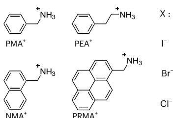

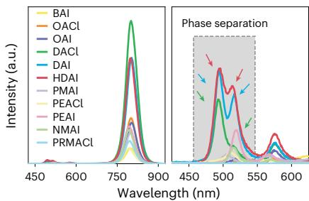  
c

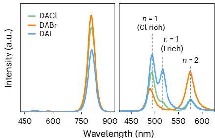  
d

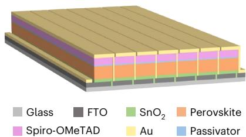  
b

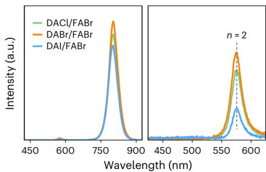  
e

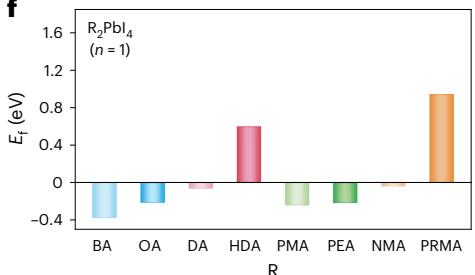

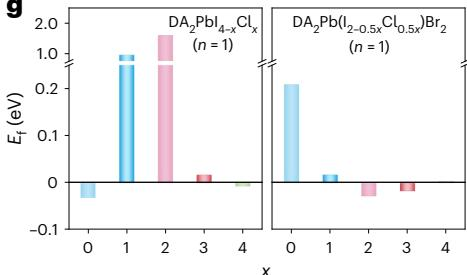

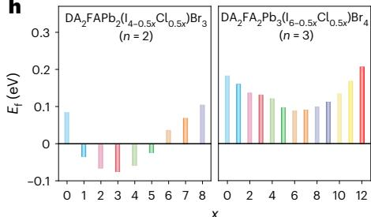  
  
Fig. 1 | Compositional engineering of the 2D perovskite phase for scalable solar modules. a, Chemical structure of 2D ligands (RX) for passivation of perovskite films. RX represents the ammonium halides, in which R and X are organic ammoniums (depicted on the left-hand side) and halides (depicted on the right-hand side), respectively. BA, $n$ -butylammonium; OA, $n$ -octylammonium; DA, dodecylammonium; HDA, hexadecylammonium; PMA, phenmethylammonium; PEA, phenylethylammonium; NMA, 1-naphthylmethylammonium; PRMA, 1-pyrenemethylammonium. b, The schematic diagram of PSM with the structure of glass/FTO/SnO /perovskite/   
passivator/spiro-OMeTAD/Au. c–e, PL (left) and local enlarged PL (right) spectra of perovskite films post-treated with different organic RX salts (c), DAX (d) and DAX/FABr (e). The grey box and coloured arrows in c highlight the appearance of $n = 1 2 \mathrm { D }$ phase separation, which is observed in HDAI (pink arrow), DAI (blue arrow) and DACl (green arrow) samples. The vertical dashed lines indicate the PL peak position. f–h, Calculated formation enthalpies of ${ \mathsf { R } } _ { 2 } { \mathsf { P b I } } _ { 4 } ( n = 1 )$ (f), $\mathbf { D A } _ { 2 } \mathbf { P b I } _ { 4 - x } \mathbf { C l } _ { x } ( n = 1 )$ and $\mathrm { D A } _ { 2 } \mathrm { P b } ( \mathfrak { I } _ { 2 - 0 . 5 x } \mathrm { C l } _ { 0 . 5 x } ) \mathrm { B r } _ { 2 } \left( n = 1 \right) ( \mathbf { g } )$ , and $\mathrm { D A } _ { 2 } \mathrm { F A P b } _ { 2 } ( \mathrm { I } _ { 4 - 0 . 5 x } \mathrm { C l } _ { 0 . 5 x } )$ $\mathrm { B r } _ { 3 } ( n = 2 )$ and $\mathrm { D A } _ { 2 } \mathrm { F A } _ { 2 } \mathrm { P b } _ { 3 } ( \vert _ { 6 - 0 . 5 x } \mathrm { C l } _ { 0 . 5 x } ) \mathrm { B r } _ { 4 } ( n = 3 )$ (h). The y-axis break in g enables intuitive data comparison.

$n { = } 1 \left. { - } \mathbf { C } \right.$ alloyed 2D perovskites and thus effectively inhibit the I–Cl phase separation as shown in Fig. 1g.

Although the halide phase separation in double-halide 2D perovskites compositions can be avoided by the construction of triple-halide compositions, they still prefer to form several different n-value structures. In general, for effective 3D/2D perovskite stacking, high n-value 2D perovskites with higher charge carrier mobility are more favoured, as the comparatively insulating $n = 1$ 2D perovskite may hinder the interfacial charge transport38–40. To achieve highly efficient and stable PSCs, the construction of a homogeneous 2D structure with a pure phase and appropriately high n value is vital. Therefore, we further introduced FABr into DAX for post-treatment of the 3D perovskite surface. Surprisingly, the combined use of DAX and FABr leads to the growth of uniform $n = 2$ 2D structures without phase separation on the 3D perovskite as shown in Fig. 1e. We believe that this behaviour can be attributed to the lower formation enthalpy of the triple-halide of $n = 2 \mathrm { D A } _ { 2 } \mathrm { F A P b } _ { 2 } ( \mathrm { I } _ { 4 - 0 . 5 x } \mathrm { C l } _ { 0 . 5 x } ) \mathrm { B r } _ { 3 }$ perovskites than that of $n = 1$ and $n = 3$ perovskites in Fig. 1g,h, thereby enabling the preferential formation of phase-pure $n = 2$ perovskite (Supplementary Fig. 4c, Supplementary Fig. 10 and Supplementary Note 5). Moreover, such a post-treatment strategy is promised to be universal in suppressing the unfavourable phase separation and stabilizing the pure 2D phases as it can be successfully extended to most conventional 2D ligands (Supplementary Figs. 11 and 12 and Supplementary Note 6).

# Mechanisms of the homogenized 2D phase construction

To gain mechanistic insights into the formation of such a homogenized 2D phase enabled by FABr, in situ PL characterizations are performed to reveal the formation kinetics of 2D phase assembly during the dynamic spin coating of 2D salt/isopropanol (IPA) solutions onto the 3D perovskite surface. Figure 2a depicts the in situ PL spectra during the spin-coating process (120 s), during which different post-treatment solutions are dripped at 20 s. In the control sample, only a pure IPA solvent is used for the post-treatment of the pristine 3D perovskite in which the variation in emission peak intensity around $8 0 0 \mathsf { n m }$ is ascribed to the solvent-induced dissolution and recrystallization within the 3D perovskite41,42. In the case of DABr, the $\scriptstyle n = 2 2 0$ phase appears at ~550 nm at about ~40 s, obviously earlier than the $n = 1 2 \mathrm { D }$ phase ( ~54 s), thus suggesting that the formation of the $n = 2$ phase is preferred to the $n = 1$ phase. By contrast, the mixed FABr/DABr post-treatment enables the fast appearance of a strong and broad emission from single $\scriptstyle n = 2 2 0$ perovskite at $\sim 3 3 \mathsf { s }$ , markedly faster than the DABr-treated, indicating that FABr facilitates the formation of homogeneous $n = 2$ 2D perovskite even at room temperature, which is consistent with the DFT calculations.

According to the intensity evolution of the 3D phase, two main regimes can be distinguished before and after IPA solvent volatilization, as shown in Fig. 2b. During stage I (20 to ~31 s), the variation in PL intensity after the FABr post-treatment is almost negligible compared

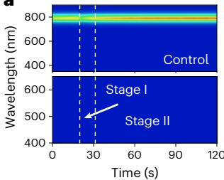  
a

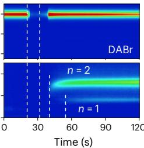

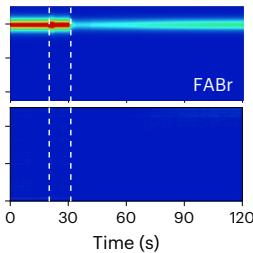

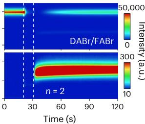

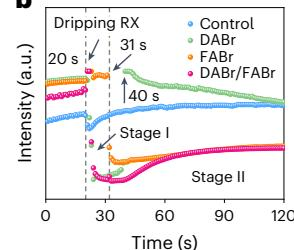  
b

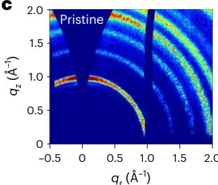

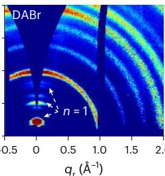

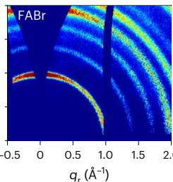

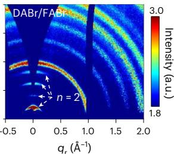

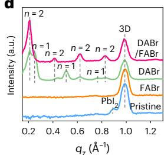  
d

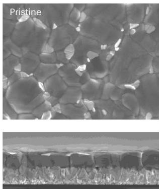  
e

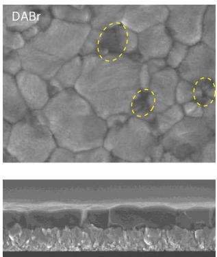

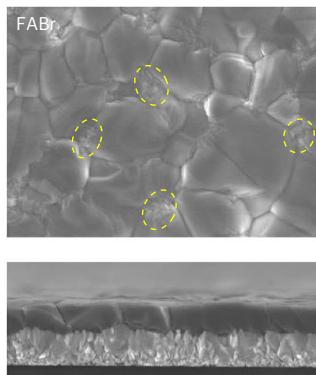

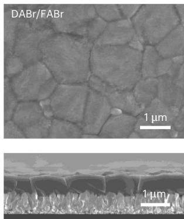

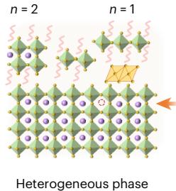  
f

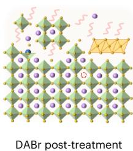

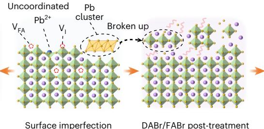

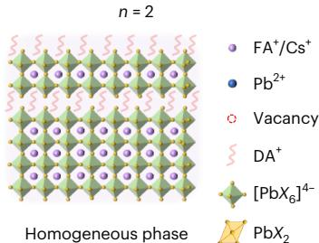  
Fig. 2 | Growth kinetics and formation mechanism of the homogeneous 2D phase structure. a, In situ PL measurements of perovskite films with different organic salts post-treatment during spin coating. b, PL intensity evolution of the 3D perovskite phase derived from in situ PL measurements. The grey dashed lines and arrows with numbers highlight a turning point in the evolution of PL intensity. c, 2D GIWAXS data of perovskite films post-treated with different   
salts after annealing. d, 1D integrated intensity of 2D GIWAXS data along the out-of-plane scattering vectors, $q _ { z }$ . e, The top-view and the cross-sectional SEM images of perovskite films post-treated with different organic slats. The yellow circles highlight distinct features of morphology. f, Schematic diagram of self-assembled different organic salts on the 3D perovskite surface producing different surface structures. V, vacancy.

to that of the control sample. This indicates that the introduced FABr substantially fills the ion vacancy generated by the IPA dissolution, thereby confirming the positive passivation effect of FABr. A sharp intensity drop occurs at the beginning of stage II ( ~31 to ~120 s), which may be due to the reaction between the FABr and residua $\mathrm { P b l } _ { 2 } ,$ resulting in a uniform crystalline $\mathsf { F A P b l } _ { 3 - x } \mathsf { B r } _ { x }$ layer covering the 3D perovskite. Analogously, a sharp intensity drop also occurs in the DABr/FABr case at the beginning of stage II, indicating the formation of a uniform $n = 2$ 2D capping layer. However, an obvious signal breakage during stage I occurs in both the DABr and DABr/FABr cases, this missing emission before the 2D phase formation may be caused by the introduced DABr organic salts obstruction. On the contrary, there is no substantial intensity drop during stage II for single DABr post-treatment, indicating an uneven coverage of the formed inhomogeneous 2D perovskites.

A similar tendency is also found in different 3D perovskite compositions with post-treatment of different long-chain ( >10) 2D ligands (Supplementary Fig. 13), suggesting the validity and generality of this homogeneous passivation approach.

After dynamic spin coating, these films are all annealed at $1 0 0 ^ { \circ } \mathrm { C }$ for 5 min and then cooled down to room temperature. The grazing-incidence wide-angle X-ray scattering (GIWAXS) characterization further confirms the remained 2D structures on the 3D perovskite surface in Fig. 2c,d. The pristine sample displays an isotropic diffraction ring at $q { \approx } 1 . 0 \mathring { \mathsf { A } } ^ { - 1 }$ of the 3D perovskite phase and a faint residual $\mathsf { P b l } _ { 2 }$ diffraction arc at $q \approx 0 . 9 \mathring { \mathsf { A } } ^ { - 1 }$ . Such a $\mathsf { P b l } _ { 2 }$ signal vanishes after FABr treatment, implying that FABr preferentially reacts with $\mathsf { P b l } _ { 2 } ^ { 4 3 }$ . Notably, multiple out-of-plane scattering peaks are clearly visible in the DABr post-treated sample in which the n = 1 (q = 0.25, 0.51 and $0 . 7 7 \mathring { \mathbf { A } } ^ { - 1 }$ ) and

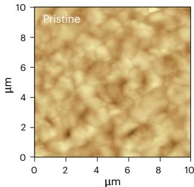  
a

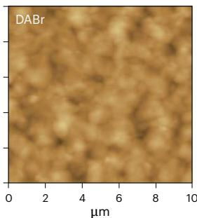

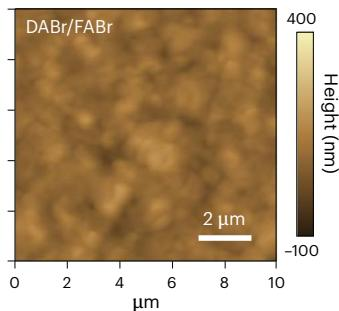

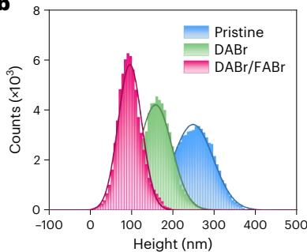  
b

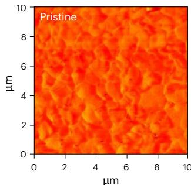  
c

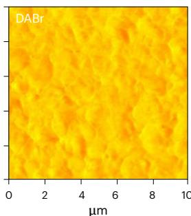

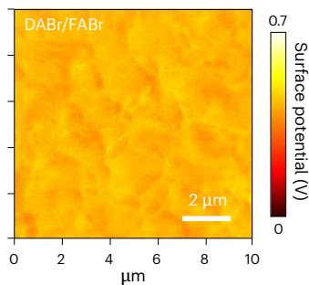

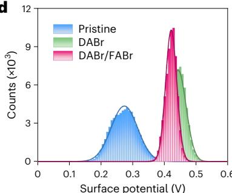

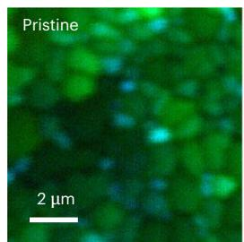  
e

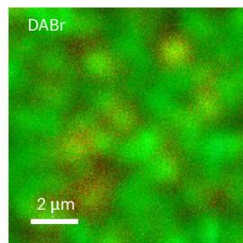

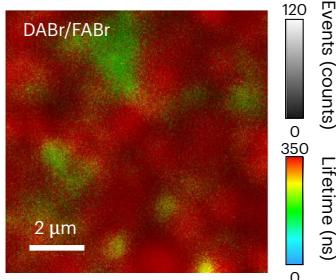

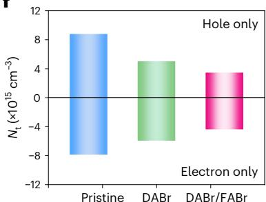  
f

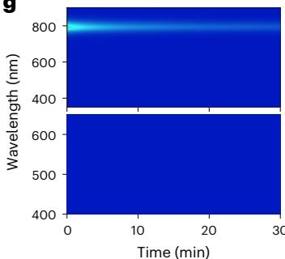  
g

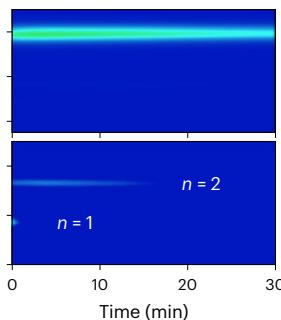

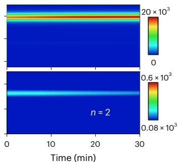  
h

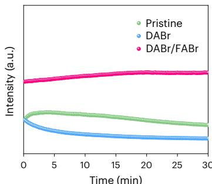  
Fig. 3 | Homogeneous surface morphology and defect passivation. a–d, AFM (a) and KPFM (c) images of different perovskite films (from left to right: pristine 3D, DABr- and DABr/FABr-treated perovskites) and the corresponding statistical distribution of height (b) and surface potential (d) derived from a and c, respectively. The curves on top of the data fit a Gaussian distribution. e,f, Timeresolved confocal PL mappings (e) and the trap densities (N ) calculated from the   
dark current–voltage (I–V) curves of hole-only and electron-only devices (f) for the control, DABr-treated and DABr/FABr-treated perovskite films. g,h, In situ PL mapping of perovskite films post-treated with different organic salts (from left to right: pristine 3D, DABr- and DABr/FABr-treated perovskites) under continuous LED light source irradiation (g) and corresponding PL intensity evolution of the 3D peak (h).

$n = 2$ ( $\scriptstyle { g = 0 . 2 1 }$ , 0.41, 0.62 and $0 . 8 3 \mathring { \mathbf { A } } ^ { - 1 }$ ) 2D structures coexist, whereas only a uniform $\scriptstyle n = 2 2 0$ structure exists in the DABr/FABr post-treated sample44. Besides, the corresponding confocal PL mappings also verify more uniform PL emissions of 2D signals in the DABr/FABr post-treated perovskite than that of the DABr post-treated counterpart, indicating the homogeneous formation of 2D capping layers over large areas (Supplementary Fig. 14a–c).

To further verify the morphology uniformity, the corresponding surface and cross-sectional morphologies are characterized by scanning electron microscopy (SEM) as shown in Fig. 2e and Supplementary Fig. 15. The pristine 3D perovskite film consists of densely packed

large grains $( { \sim } 1 \mu \mathrm { m } )$ , with $\mathsf { P b l } _ { 2 }$ fragments appearing at the corners of adjacent grains. Upon the FABr post-treatment, the elimination of such $\mathsf { P b l } _ { 2 }$ fragments can be found in SEM images. With the post-treatment of DABr, distinct features of morphology occur at the grains and grain boundaries of perovskite. The 3D time-of-flight secondary-ion mass spectrometry (ToF-SIMS) images also confirm the uneven distribution of DA cations and Br ions on the surface of 3D perovskite after DABr post-treatment compared to DABr/FABr post-treatment (Supplementary Fig. 16), which is consistent with the PL and GIWAXS results.

Drawing from the experimental results and theoretical calculations discussed above, we propose the different 2D structural formation

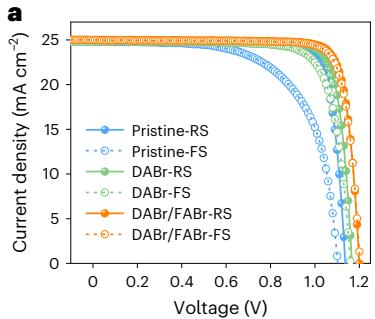

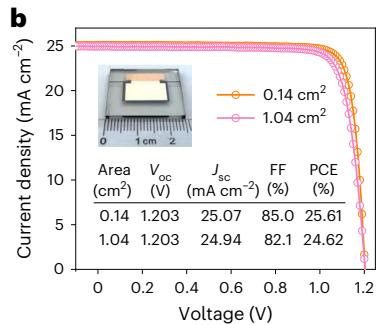

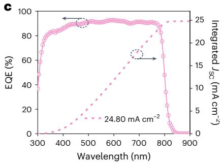

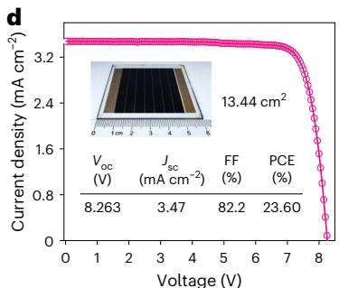

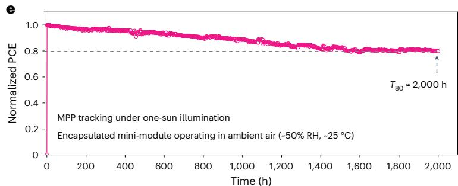  
Fig. 4 | Photovoltaic performance and stability characterization. a, J–V curves of small-sized devices with the post-treatment of different organic salts. b, J–V curve of the champion devices with the post-treatment of DABr/FABr. Inset: the corresponding photograph of a $1 . 0 4 \cdot \mathrm { c m } ^ { 2 }$ large-sized device. c, EQE curve   
of the large-sized device with the post-treatment of DABr/FABr. d, J–V curve of the champion mini-module with the post-treatment of DABr/FABr. Inset: the photograph of a mini-module. e, Continuous MPP tracking for the encapsulated mini-module in ambient air. FF, fill factor; FS, forward scan; RS, reverse scan.

mechanisms in Fig. 2f. Beginning with the defect-rich 3D perovskite surface, post-treatment using DABr leads to the corner-sharing 2D octahedral layers with mixed phases $\scriptstyle { \mathcal { n } } = 1$ and $n = 2$ ), predominantly due to the incomplete reaction between the $\mathsf { P b l } _ { 2 }$ and 2D cation ligands, thus hindering further diffusion of DA cations. As indicated by lower formation enthalpy, the further incorporation of FABr into DABr can easily break up the big $\mathsf { P b } { \mathsf { X } } _ { 2 }$ fragments and strengthen the reaction between the $\mathsf { P b } X _ { 2 }$ and 2D ligands, and the introduced FABr can passivate the FA vacancy generated by the IPA dissolution, thus generating a high-quality, uniformly distributed, phase-pure $\scriptstyle n = 2 2 0$ structure on top of the 3D perovskites. As such, the intrinsic defects present on the surface are expected to be substantially eliminated.

# Optimized passivation effect

Following the successful construction of phase-pure 2D perovskite capping layers, systematic characterizations are next performed to visualize the defect passivation effects. As revealed by atomic force microscopy (AFM) and Kelvin probe force microscopy (KPFM), the mixed DABr/FABr post-treated perovskite film is endowed with a smoother surface morphology and a narrower surface potential distribution compared with the DABr post-treated and the pristine perovskite films (Fig. 3a–d). The confocal PL mappings also demonstrate uniform and strong PL emission of 3D signal for the mixed DABr/FABr post-treated perovskite than that of the pristine and the DABr post-treated perovskite films (Supplementary Fig. 14d–f), indicating the effective suppression of interfacial defect-assisted non-radiative recombination. In addition, time-resolved confocal PL mappings are further performed to evaluate the non-radiative recombination of perovskite films in microdomains, as shown in Fig. 3e. The pristine perovskite film demonstrates a long lifetime (green region) in the perovskite grains but a relatively short lifetime (blue region) at grain boundaries due to excessive $\mathsf { P b l } _ { 2 }$ fragments. Corresponding to longer PL lifetimes, red regions appear after DABr post-treatment and become dominant after DABr/FABr post-treatment, implying that a phase-pure $n = 2$ 2D structure with uniform morphology can minimize defect-assisted charge recombination to a greater extent than mixed $n = 1$ and 2 structures.

Furthermore, the average carrier lifetimes $( \tau _ { \mathrm { a v e } } )$ calculated from the time-resolved PL (TRPL) spectra of different perovskite films with and without hole transport layer (HTL) at the top further confirm that the introduction of a proper amount of DABr/FABr modification markedly passivates surface defects and accelerates hole extraction simultaneously (Supplementary Fig. 17 and Supplementary Tables 2 and 3). Besides, the electron and hole trap density (Nt) and mobility $( \mu )$ values of these perovskite films are further quantified through the space charge-limited current (SCLC) measurements by constructing electron-only and hole-only devices (Supplementary Fig. 18)45–47. Compared to the DABr post-treated and pristine perovskite films, the DABr/ FABr post-treatment gives rise to the most considerable reduction of $N _ { \mathrm { t } }$ values in both device configurations as shown in Fig. 3f, which is correlated with improved perovskite film quality and is beneficial for enhancing device performance48,49.

To explore the structural stability of the 2D perovskites upon continuous light irradiation, in situ PL spectra are performed with a light-emitting diode (LED) light source emitting at 405 nm for 30 minutes (Fig. 3g). For the DABr post-treated film, the emission of the $n = 1$ 2D phase disappears quickly within 2 min, whereas the $n = 2$ phase persists up to 20 min. Distinct from these, the $\scriptstyle n = 2 2 0$ phase in the DABr/ FABr post-treated film exhibits a higher PL intensity in the initial stage and can still be distinguished even at 30 min. Figure 3h illustrates the intensity evolution of the 3D phase emission in which the DABr/FABr post-treated perovskite film exhibits no notable decay compared to the others. Thus, pure $\scriptstyle n = 2 2 0$ perovskite is more structurally robust, and its better coverage also contributes to the stability of 3D perovskites underneath.

Moreover, the possible degradation or transformation of 3D/2D heterojunctions is monitored by time-resolved GIWAXS and PL during $1 0 0 { } ^ { \circ } \mathrm { C }$ thermal annealing (Supplementary Fig. 19). Following the sequential disappearance of $n = 1$ (20 min) and $n = 2$ (40 min) 2D phases, the generation of extra $\mathsf { P b l } _ { 2 }$ (60 min) attributed to the perovskite degradation can be identified within the DABr post-treated film. By contrast, no noticeable changes can be tracked for the DABr/FABr post-treated film throughout the entire heating process, indicating

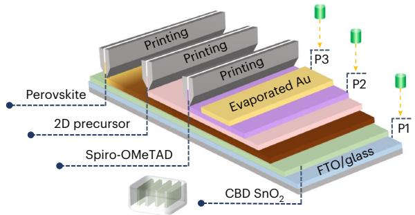  
a   
b

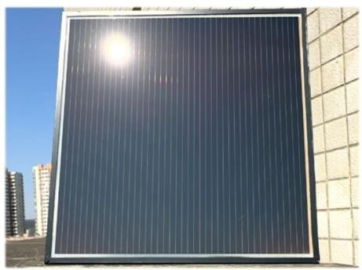

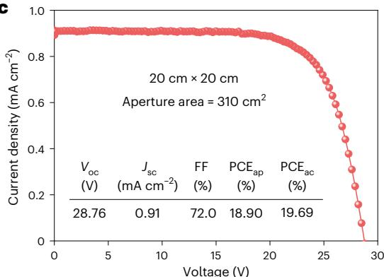

  
d   
Fig. 5 | Scalable printed large-area modules. a, Schematic illustration for the scalable fabrication of large-sized PSMs with the corresponding laser processing (green cylinder) and the chemical bath deposition of large-scale $\mathsf { S n O } _ { 2 }$ films (bottom inset). b, Photograph of a $3 0 \ : \mathrm { c m } \times 3 0 \ : \mathrm { c m P S M } . \mathrm { c } , J ^ { - }$ –V curve of the   
champion $2 0 \mathrm { c m } \times 2 0$ cm sub-module with a series connection of 26 subcells. $\mathbf { d } , J -$ –V curve of the champion $3 0 \mathrm { c m } \times 3 0$ cm small module with a series connection of 42 subcells. $\mathsf { P C E } _ { \mathsf { a p } } ,$ , aperture-area efficiency; $\mathsf { P C E } _ { \mathrm { a c } } ,$ active-area efficiency.

that the structural integrity of the 3D/2D heterojunction is well maintained. This may be attributed to the lower mixing enthalpy of DA-based quasi-2D $( n = 2 )$ ) phases, which enables a stable and robust structure even after 60 minutes of thermal ageing, thus resisting the DA ions migration into 3D perovskite as demonstrated in the ToF-SIMS spectra (Supplementary Fig. 20). From these, the phase-pure 2D layer with homogeneous morphology is also thermally stable and thus can protect the underlying 3D perovskite against any thermal decomposition.

# Enhanced photovoltaic performance

To evaluate the photovoltaic performance with these perovskites as a light absorber layer, the PSCs with a typical structure of FTO/SnO2/ 3D-perovskite/2D-perovskite/Spiro-OMeTAD/Au were fabricated. Figure 4a shows the current density–voltage $( \jmath - W )$ curves of typical small PSCs with different post-treatments, and all the detailed photovoltaic parameters and statistical distributions of photovoltaic parameters of 15 devices are summarized in Supplementary Figs. 21 and 22, respectively. Among perovskites with different post-treatments, the DABr/FABr post-treatment achieves the highest photovoltaic parameters, with the most significant improvement in the open-circuit voltage $( V _ { \mathrm { o c } } )$ (Supplementary Fig. 22a), which can be attributed to the defect minimization and the favourable band alignment of the uniform phase-pure quasi-2D perovskite passivation layer (Supplementary Fig. 23). Notably, the DABr/FABr post-treated PSCs demonstrate a champion PCE of $2 5 . 6 1 \%$ (certified $2 4 . 9 5 \%$ ) and the large-size PSCs with an aperture area of $1 . 0 4 \mathrm { c m } ^ { 2 }$ also demonstrate a champion PCE of $2 4 . 6 2 \%$ (certified $2 4 . 0 4 \%$ (Fig. 4b and Supplementary Figs. 24 and 25), and the corresponding integrated current density is as high as $2 4 . 8 0 \mathsf { m A c m } ^ { - 2 }$ (Fig. 4c), which is well matched with the J–V characterization results.

In addition, this post-treatment strategy can easily maintain a homogeneous passivation effect over a large area as illustrated in Supplementary Fig. 26, thus enabling an antisolvent-free spin-coated

mini-modules with a high PCE of $2 3 . 6 0 \%$ on a total aperture area of $1 3 . 4 4 \mathrm { c m } ^ { 2 }$ (Fig. 4d and Supplementary Fig. 27). We also demonstrated high efficiency of $2 2 . 2 2 \%$ on an aperture area of 16 cm2 with a geometric filling factor (GFF) of approximately $9 6 \%$ , which is equivalent to an active-area PCE of $2 3 . 1 \%$ (Supplementary Fig. 28). Although the efficiency of the HDABr/FABr-treated device is lower than that of the DABr/ FABr-treated device due to oversized 2D ligand, it also demonstrates notable improvement over that of the single HDABr-treated device (Supplementary Fig. 29), suggesting the validity of our homogeneous passivation approach.

The stability of devices with different post-treatment strategies is also systematically compared (Supplementary Fig. 30). Benefiting from the structural robustness upon heating as discussed above, the DABr/FABr post-treated PSCs show great thermal stability, which maintains $89 \%$ of their initial PCEs after ~650 h under $5 5 ^ { \circ } \mathrm { C }$ , in ${ \Nu } _ { 2 }$ , which is more thermally stable than the DABr post-treated ( ${ \sim } 7 2 \%$ after ~650 h) and pristine $. - 5 9 \%$ after ~450 h) devices, respectively. The DABr/FABr-treated perovskite film is more moisture-resistant, as suggested by the larger water contact angle and slower film fading under highly humid air (Supplementary Fig. 31). Therefore, the DABr/FABr-modified PSCs remain ${ \sim } 8 8 \%$ of the initial PCEs in ambient air fo ${ > } 3 { , } 0 0 0 \mathsf { h }$ $\cdot 2 0 ^ { \circ } \mathrm { C } , 2 0 \%$ relative humidity (RH)), whereas the DABr and pristine devices only retain $78 \%$ and $6 4 \%$ , respectively. Moreover, the DABr/FABr devices exhibit a superior light soaking stability in an ${ \sf N } _ { 2 }$ atmosphere than their counterparts, maintaining ${ \sim } 9 3 \%$ of the original efficiency for 2,500 h under a white LED light irradiation (Supplementary Fig. 30c). In addition, we also characterize the operational stability of the DABr/FABr post-treated mini-modules as shown in Fig. 4e. The encapsulated solar mini-module demonstrates remarkable operational stability with a $T _ { 8 0 }$ lifetime exceeding 2,000 h at MPPT under continuous light illumination compared with previously published results (Supplementary Table 4), and the corresponding performance before and after the MPPT test is shown in Supplementary Fig. 32.

# Scalable printed large-area modules

To further verify the feasibility of this passivation strategy for the commercial fabrication of sub-modules or small modules, we provide a scalable manufacturing strategy for large-size PSMs as shown in Fig. 5a in which slot-die printing is used to deposit both large-scale perovskite and 2D passivation layers. Figure 5b shows a photograph of the printed $3 0 \mathsf { c m } \times 3 0 \mathsf { c m }$ small module, and the corresponding detailed design of $2 0 \mathsf { c m } \times 2 0 \mathsf { c m }$ and $3 0 \mathsf { c m } \times 3 0 \mathsf { c m }$ PSMs are shown in Supplementary Figs. 33 and 34. Through carefully modulating the laser scribing process of P1, P2 and P3 patterns, a high GFF of ${ \sim } 9 6 \%$ was created for large PSMs. Therefore, by implementing this homogenized low-dimensional structure perovskite passivation engineering, we achieved impressive efficiencies of $1 8 . 9 0 \%$ and $1 7 . 5 9 \%$ for $2 0 \mathsf { c m } \times 2 0$ cm sub-modules and $3 0 \mathrm { c m } \times 3 0$ cm small modules with aperture areas of $3 1 0 \mathsf { c m } ^ { 2 }$ and ${ 8 0 2 } \thinspace { \mathrm { c m } } ^ { 2 }$ , respectively (Fig. 5c,d), indicating that this uniform high $n$ -value 2D phase capping layer on 3D perovskite is scalable and effective for commercial manufacturing. Therefore, this homogenized interface low-dimensional structure engineering offers more opportunities for the commercialization of efficient and stable PSMs.

# Conclusion

We report an effective, scalable passivation strategy that enables the homogeneous formation of a phase-pure 2D perovskite capping layer on the surface of 3D perovskites by suppressing unfavourable phase segregations in terms of composition and dimensionality. The selective incorporation of FABr into DABr for 3D perovskite post-treatment facilitates the 2D perovskite transition from mixed $\scriptstyle n = 1$ and 2) to pure $( n = 2 )$ with lower formation enthalpy, reduced mixing enthalpy and faster formation kinetics, thereby contributing to uniform morphology, fewer defects, faster interface charge transfer and structurally robust 3D/2D heterojunction. As a consequence, champion efficiencies of $2 5 . 6 1 \%$ (certified $2 4 . 9 5 \%$ ), $2 4 . 6 2 \%$ (certified $2 4 . 0 4 \%$ ) and $2 3 . 6 0 \%$ are achieved for the small-size device $( 0 . 1 4 \thinspace { \mathrm { c m } } ^ { 2 } )$ ), large-size device $( 1 . 0 4 \mathrm { c m } ^ { 2 } )$ and mini-module $( 1 3 . 4 4 \mathrm { c m } ^ { 2 } )$ ), respectively, demonstrating relatively small efficiency loss with increasing active area. Also, the solar mini-modules exhibit a $T _ { 8 0 }$ lifetime exceeding 2,000 h at MPPT, indicating excellent stability. Most remarkably, the $2 0 \ : \mathrm { c m } \times 2 0$ cm and $3 0 \mathrm { c m } \times 3 0$ cm large-size PSMs also demonstrate champion efficiencies of $1 8 . 9 0 \%$ and $1 7 . 5 9 \%$ on aperture areas of $3 1 0 \mathsf { c m } ^ { 2 }$ and $8 0 2 \mathsf { c m } ^ { 2 }$ , respectively. This homogenized low-dimensional structure passivation strategy holds considerable potential for accelerating the commercialization of PSMs.

# Methods

# Materials

The following reagents were used without additional purification. $\mathsf { P b l } _ { 2 }$ $( 9 9 . 9 9 \% )$ ), FABr $( 9 9 . 9 9 \%$ ) and DABr were purchased from TCI. FAI, MACl, BAI, OACl, OAI, DAI, DACl, HDAI, PMAI, PEAI, PEACl and $\mathsf { P C } _ { 6 1 } \mathsf { B M }$ were purchased from Xi’an Yuri Solar Co. CsI $( 9 9 . 9 9 9 \% )$ ), $\mathsf { S n C l } _ { 2 } { \cdot } 2 \mathsf { H } _ { 2 } 0$ $( 9 9 . 9 9 5 \% )$ ), Li-TFSI $( 9 9 . 9 5 \% )$ ) and FK209 Co (III) TFSI salt $( 9 8 \% )$ , urea $( 9 9 . 5 \% )$ and all solvents involved in the experiment (including DMF, 2-Me, NMP, CBZ, ACN and IPA) were purchased from Sigma-Aldrich. PMACl, NMAI and PRMACl were purchased from Aladdin. Spiro-OMeTAD was purchased from Vizu Chem.

# Precursor solution preparation

For antisolvent-free spin-coated perovskite films, $\mathsf { F A } _ { 0 . 9 3 } \mathsf { C s } _ { 0 . 0 7 } \mathsf { P b l } _ { 3 }$ precursor solution with an equal molar amount of NMP and excess 7 mol% $\mathsf { P b l } _ { 2 }$ and $3 5 \mathrm { m o l \% }$ MACl was dissolved in a DMF/2-Me mixed solvent $( 3 0 0 \mu | / 2 5 0 \mu | )$ ). The Spiro-OMeTAD solution was prepared by dissolving 91.4 mg Spiro-OMeTAD in 1 ml CBZ, adding $2 1 . 0 \mu \mathrm { l }$ Li-TFSI/ACN solution $( 5 2 0 \mathrm { m g } \mathrm { m l ^ { - 1 } } .$ ) and 11.5 µl FK209/ACN solution $( 3 0 0 \mathrm { m g } \mathrm { m l ^ { - 1 } } )$ ) and $3 5 . 6 \mu \mathrm { l }$ tBP. The post-treatment solutions were prepared by dissolving 15 mmol of different organic halide salts in 1 ml IPA solution.

# Antisolvent-free spin-coated perovskite solar cells

The patterned FTO glass was ultrasonically cleaned with detergent, purified water and ethanol for $2 0 \mathrm { { m i n } }$ , respectively. The $\mathsf { S n O } _ { 2 }$ layers were deposited on FTO substrates using the chemical bath deposition technique31. After being treated with ultraviolet ozone for 15 minutes, the prepared perovskite precursor solution was antisolvent-free spin-coated on the prepared glass/FTO $/ { \mathsf { S n O } } _ { 2 }$ substrates in the ${ \Nu } _ { 2 }$ glovebox ( ${ \bf \tau } ^ { - 1 8 } ^ { \circ } { \bf C } , 5 , 0 0 0$ rpm for 60 s). After annealing at $7 0 ^ { \circ } \mathrm { C }$ in $\mathsf { N } _ { 2 }$ for 1 min, the film was taken out and annealed at $1 0 0 ^ { \circ } \mathrm { C }$ for 2 h in an ambient with a relative humidity of $. 3 0 \%$ . For the surface post-treatment, 15 mM FABr, DABr, or DABr/FABr solution was dynamically spun onto the perovskite surface ( ~18 °C, 4,000 rpm for 30 s), followed by annealing at $1 0 0 ^ { \circ } \mathrm { C }$ for 5 min. After cooling the film to room temperature, the Spiro-OMeTAD solution was spin-coated on the perovskite film at 4,000 rpm for $2 0 s$ . Finally, 80 nm thick gold was deposited by thermal evaporation to complete the whole device.

# Antisolvent-free spin-coated perovskite mini-modules

The designed P1 patterns of the mini-module (Supplementary Figs. 27c and 28d) were first etched (power: 12 W, speed: $\mathsf { 4 } , 0 0 0 \mathsf { m m s ^ { - 1 } }$ ) by a picosecond laser and then cleaned before use. The preparation of large-size $\mathsf { S n O } _ { 2 }$ substrates and perovskite films with or without passivation was consistent with the small solar cells mentioned above. The Spiro-OMeTAD solution was diluted by tetrahydrofuran with a volume ratio of 1:1 to improve wettability for a uniform and dense hole transport layer, followed by P2 pattern etching (power: 9.3 W, speed: $2 , 0 0 0 \mathsf { m m s ^ { - 1 } }$ ). Before the evaporation of the Au counter electrode, a $0 . 5 \mathsf { m m }$ wide tape was stuck to P3 to complete the series connection of the subcells. For the $5 \mathrm { c m } \times 5$ cm perovskite mini-module with a GFF of approximately $96 \%$ , the P3 pattern was processed by a picosecond laser (power: 8.4 W, speed: $3 , 0 0 0 \mathsf { m m s } ^ { - 1 }$ ).

# Slot-die printed $\bf { 2 0 ~ c m \times 2 0 }$ cm and $\mathbf { 0 ~ c m \times 3 0 }$ cm large modules

Patterning and cleaning of FTO glass and deposition of the $\mathsf { S n O } _ { 2 }$ layer were described above. The perovskite precursor ink was first diluted by 2-Me to 1 M and then slot-die printed on the $2 0 \mathsf { c m } \times 2 0 \mathsf { c m }$ and $3 0 \mathrm { c m } \times 3 0$ cm substrates in ambient air $\mathbf { \partial } ^ { \prime } \cdot 2 0 ^ { \circ } \mathbf { C } , \mathbf { - } 2 0 \% \mathbf { R H } )$ ). A syringe pump set to $0 . 2 \mathsf { m } \mathsf { l } \mathsf { s } ^ { - 1 }$ was used to pump the perovskite precursor to a stainless steel slot-die head with a $1 0 \mu \mathrm { m }$ internal shim. The gap height between the slot-die head and substrate was $1 1 0 \mu \mathrm { m }$ . During the printing process, the coating speed was set at $2 \mathsf { m } \mathsf { m } \mathsf { s } ^ { - 1 }$ , and an air knife with a nitrogen pressure of 0.35 MPa was used to facilitate the deposition of the ink. The printed perovskite film was annealed at $1 0 0 ^ { \circ } \mathrm { C }$ for 1 h and then annealed at $1 2 0 { ^ \circ } \mathrm { C }$ for 1.5 h in ambient air. For slot-die printing of 2D layers, the syringe pump was adjusted to $0 . 2 \mathsf { m } \mathsf { l } \mathsf { s } ^ { - 1 }$ and a gap height of $1 3 0 \mu \mathrm { m }$ and a coating speed of $4 \mathsf { m } \mathsf { m } \mathsf { s } ^ { - 1 }$ were used to print a 5 mM DABr/FABr solution on the perovskite films. Then the printed film was annealed at $1 0 0 ^ { \circ } \mathrm { C }$ for 5 min to form a 2D perovskite passivation layer. The Spiro-OMeTAD solution was also slot-die printed on the surface of the 2D perovskite layer until it was fully covered. Finally, the gold was evaporated to complete the devices. To form a series of connected modules with a high GFF, a picosecond laser (Suzhou Microtreat Intelligent Technology Co.) was used to process the P1, P2 and P3 patterns during the fabrication of the large modules, and the corresponding designs are depicted in Supplementary Figs. 33 and 34.

# Perovskite film characterization

The GIWAXS was performed using an in-house instrument (GANESHA 300 XL SAXS SYSTEM by JJ X-Ray Systems ApS) with the X-ray photon energy of $8 . 0 5 \mathsf { k e V }$ (the corresponding wavelength $= 1 . 5 4 \mathring \mathbf { A }$ ). The incidence light angle was $0 . 8 ^ { \circ }$ and a Pilatus 300k detector was used to collect the scattering signal. The field-emission scanning electron microscopy (SEM, JSM-7500F, Zeiss Ultra Plus), atomic force microscopy and Kelvin probe force microscopy (AFM and KPFM, SPM-9700,

Asylum Research), X-ray photoelectron spectroscopy and ultraviolet photoelectron spectroscopy (XPA and UPS, AXIS SUPRA, Shimadzu) were used to characterize the perovskite films. The steady-state photoluminescence (PL) spectra and in situ PL spectra were obtained using a PL microscopic spectrometer with an LED light source emitting at 405 nm in an ambient environment with ${ \sim } 2 0 { } ^ { \circ } \mathrm { C }$ low humidity. An Ocean Optical spectrometer (QE65Pro, Ocean Insight) was used to collect the PL emission. In situ PL spectroscopy measurements were performed during the spin-coating process at 1 s intervals for a total of 2 min and under continuous light irradiation at 12 s intervals for a total of 30 min. Time-resolved confocal photoluminescence mapping spectra were measured by a fluorescence spectrometer with a 404 nm laser with a repetition rate of 1 MHz (TRPL mapping, Micro Time 200, Pico-Quant GmbH). The time-resolved photoluminescence spectra were measured at 800 nm using a 485 nm picosecond pulsed diode laser with a roughly 200-ps pulse width and an impulse energy of 14 pJ per pulse (TRPL, Nano LED-C2 N-485L, HORIBA Scientific Company). Time-of-flight secondary-ion mass spectrometry (PHI nano TOFII Time-of-Flight SIMS) was used to perform ToF-SIMS depth profiles of perovskite films. For the PL mapping images, the microzone optical images were taken by a home-built scanning confocal microscope. The output of a 405 nm picosecond diode laser (PiL040-FS, NKT Photonics) was reflected by a $4 4 0 \mathsf { n m }$ dichroic mirror and focused on the sample surface by an objective lens (EC EPN $1 0 0 \times / 0 . 9$ DIC VAC, Zeiss). The PL signals collected by the same objective lens were sent through optical filters, sent to an avalanche photodiode (APD) ($PD-050-CTE, MPD) and analysed by a time-corrected single photon counting device (Multiharp 150, Picoquant). A $4 2 5 \mathsf { n m }$ long-pass filter was used to get the total photon counts of 2D perovskites and 3D perovskites, and a 650 nm short-pass filter was added to only get the photon counts of 2D perovskites. The measured photon counts were corrected by dividing (1-measured photon counts $\times$ dead time) considering the dead time of the APD is ~60 ns. An XY-scanning piezoelectric nanopositioning stage (527000, Gu-optics) with precisions of 50 nm was used to control the sample position in steps of $2 0 0 \mathsf { n m }$ , and PL photon counts on the zone of $4 0 \mu \mathrm { m } \times 4 0 \mu \mathrm { m }$ were constructed to the microzone images.

# Photovoltaic performance characterization

A Keithley 2400 source meter was used to measure the J–V curves of all the devices. To match AM 1.5 G, a solar simulator (Oriel 94023 A, 300 W) served as the light source, the intensity of light was calibrated at $1 0 0 \mathrm { m } \mathrm { W } \mathrm { c m } ^ { - 2 }$ using a reference silicon solar cell (Oriel, VLSI standards). A black metal aperture with a mask area of $\mathrm { 0 . 1 4 c m ^ { 2 } }$ for small-size devices and $1 . 0 4 \mathrm { c m } ^ { 2 }$ for large-area devices with a scan rate of $1 0 \mathrm { m V s ^ { - 1 } }$ , $1 3 . 4 4 \mathrm { c m } ^ { 2 }$ for mini-modules with a scan rate of $5 0 \mathrm { m } \mathrm { V } \mathsf { s } ^ { - 1 }$ , $1 6 \mathrm { c m } ^ { 2 }$ for $5 \mathrm { c m } \times 5$ cm mini-modules with a scan rate of $5 0 \mathrm { m } \mathrm { V } \mathsf { s } ^ { - 1 }$ , $3 1 0 \mathsf { c m } ^ { 2 }$ for $2 0 \mathsf { c m } \times 2 0$ cm sub-modules with a scan rate of $3 . 0 \mathsf { V } \mathsf { s } ^ { - 1 }$ , $8 0 2 \mathsf { c m } ^ { 2 }$ for $3 0 \mathrm { c m } \times 3 0$ cm small modules with a scan rate of $4 . 5 \mathsf { V } \mathsf { S } ^ { - 1 }$ . The external quantum efficiency spectra (EQE) were measured by using a commercial EQE system (QE-R, Enlitech).

# Devices stability characterization

The maximum power point tracking (MPPT) was tested by a multi-channel solar cell stability test system with an LED light source (6500 K, white-light LED array) calibrated to equivalent one sun illumination (Wuhan 91PVKSolar). For the MPPT test, a 4-nm-thick layer of $\mathrm { C } _ { 6 0 }$ was deposited onto the $\mathsf { S n O } _ { 2 }$ ETLs using thermal evaporation and a 150 nm thick layer of $\mathbf { M o O } _ { x }$ was evaporated on the complete devices before encapsulation50,51. To suppress external moisture and oxygen during operation in ambient conditions ( ${ \sim } 5 0 \%$ RH), mini-modules were encapsulated with polyisobutylene and a cover glass in an $\mathsf { N } _ { 2 }$ atmosphere. To prevent irreversible damage from epoxy resin, the epoxy was first applied to the connection between the cover glass and the polyisobutylene. After curing, the entire device was encapsulated

within an epoxy-filled mould; the corresponding encapsulation PSMs are shown in Supplementary Fig. 32.

# Computational methods

All first-principles calculations were performed based on the density functional theory (DFT) using the Vienna ab initio simulation package code52,53. The interaction between core and valence electrons was described by the projector augmented wave method53. The exchange–correlation interactions were described using the Perdew–Burke–Ernzerhof (PBE) functional within the generalized gradient approximation54. The van der Waals interaction was corrected by the Grimme potential (D2)55. The plane-wave basis cut-off energy was 400 eV. A k-point mesh of $0 . 0 1 5 \mathring { \mathsf { A } } ^ { - 1 }$ was adopted. The geometric structures were fully relaxed until the convergence criteria of energy and force were less than $1 \times 1 0 ^ { - 5 } \mathrm { e V }$ and $0 . 0 1 \mathrm { e V } \mathring { \mathbf { A } } ^ { - 1 }$ , respectively. The numerical calculations in this paper have been done on the HPC system of Xidian University.

# Reporting summary

Further information on research design is available in the Nature Portfolio Reporting Summary linked to this article.

# Data availability

All data generated or analysed during this study are included in the published article and its Supplementary Information. Source data are provided with this paper.

# Code availability

The code used in this Article is available from the corresponding authors upon reasonable request.

# References

1. Liu, Y. et al. Ultrahydrophobic 3D/2D fluoroarene bilayer-based water-resistant perovskite solar cells with eficiencies exceeding $2 2 \%$ . Sci. Adv. 5, eaaw2543 (2019).   
2. Xue, J. J. et al. Reconfiguring the band-edge states of photovoltaic perovskites by conjugated organic cations. Science 371, 636–640 (2021).   
3. Kore, B. P., Zhang, W., Hoogendoorn, B. W., Safdari, M. & Gardner, J. M. Moisture tolerant solar cells by encapsulating 3D perovskite with long-chain alkylammonium cation-based 2D perovskite. Commun. Mater. 2, 100 (2021).   
4. Azmi, R. et al. Damp heat-stable perovskite solar cells with tailored-dimensionality 2D/3D heterojunctions. Science 376, 73–77 (2022).   
5. Luo, L. et al. Stabilization of 3D/2D perovskite heterostructures via inhibition of ion difusion by cross-linked polymers for solar cells with improved performance. Nat. Energy 8, 294–303 (2023).   
6. Jang, Y.-W. et al. Intact 2D/3D halide junction perovskite solar cells via solid-phase in-plane growth. Nat. Energy 6, 63–71 (2021).   
7. Jung, E. H. et al. Eficient, stable and scalable perovskite solar cells using poly(3-hexylthiophene). Nature 567, 511–515 (2019).   
8. Yoo, J. J. et al. An interface stabilized perovskite solar cell with high stabilized eficiency and low voltage loss. Energy Environ. Sci. 12, 2192–2199 (2019).   
9. Jeong, J. et al. Pseudo-halide anion engineering for ${ \mathsf { \alpha } } \mathrm { - } { \mathsf { F A P b } } { \mathsf { I } } _ { 3 }$ perovskite solar cells. Nature 592, 381–385 (2021).   
10. Yang, W. et al. Visualizing interfacial energy ofset and defects in eficient 2D/3D heterojunction perovskite solar cells and modules. Adv. Mater. 35, 2302071 (2023).   
11. Zhang, F. et al. Metastable Dion-Jacobson 2D structure enables eficient and stable perovskite solar cells. Science 375, 71–76 (2022).   
12. Jiang, Q. et al. Surface passivation of perovskite film for eficient solar cells. Nat. Photon. 13, 460–466 (2019).

13. Chen, P., He, D., Huang, X., Zhang, C. & Wang, L. Bilayer 2D-3D perovskite heterostructures for eficient and stable solar cells. ACS Nano 18, 67–88 (2023).   
14. Huang, W., Bu, T., Huang, F. & Cheng, Y.-B. Stabilizing high eficiency perovskite solar cells with 3D–2D heterostructures. Joule 4, 975–979 (2020).   
15. Lin, Y. et al. Enhanced thermal stability in perovskite solar cells by assembling 2D/3D stacking structures. J. Phys. Chem. Lett. 9, 654–658 (2018).   
16. Aharon, S., Wierzbowska, M. & Etgar, L. The efect of the alkylammonium ligand’s length on organic–inorganic perovskite nanoparticles. ACS Energy Lett. 3, 1387–1393 (2018).   
17. Du, Y. et al. Manipulating the formation of 2D/3D heterostructure in stable high‐performance printable CsPbI perovskite solar cells. Adv. Mater. 35, 2206451 (2022).   
18. Grancini, G. & Nazeeruddin, M. K. Dimensional tailoring of hybrid perovskites for photovoltaics. Nat. Rev. Mater. 4, 4–22 (2018).   
19. Cao, D. H., Stoumpos, C. C., Farha, O. K., Hupp, J. T. & Kanatzidis, M. G. 2D homologous perovskites as light-absorbing materials for solar cell applications. J. Am. Chem. Soc. 137, 7843–7850 (2015).   
20. Stoumpos, C. C. et al. Ruddlesden–Popper hybrid lead iodide perovskite 2D homologous semiconductors. Chem. Mater. 28, 2852–2867 (2016).   
21. Jiang, R. et al. Insights into the efects of oriented crystallization on the performance of quasi-two-dimensional perovskite solar cells. Mater 1, 100044 (2023).   
22. Wang, L. et al. Interface regulation enables hysteresis free wide-bandgap perovskite solar cells with low $V _ { \mathrm { { o c } } }$ deficit and high stability. Nano Energy 90, 106537 (2021).   
23. Bu, T. et al. Structure engineering of hierarchical layered perovskite interface for eficient and stable wide bandgap photovoltaics. Nano Energy 75, 104917 (2020).   
24. Gao, L., Hu, P. & Liu, S. Low-dimensional perovskite modified 3D structures for higher-performance solar cells. J. Energy Chem. 81, 389–403 (2023).   
25. Tan, L. et al. Pure chloride 2D/3D heterostructure passivation for eficient and stable perovskite solar cells. Adv. Energy Sustain. Res. 4, 2200189 (2023).   
26. Liu, X. et al. Influence of halide choice on formation of low‐ dimensional perovskite interlayer in eficient perovskite solar cells. Energy Environ. Mater. 5, 670–682 (2022).   
27. Guo, Z. et al. Homogeneous phase distribution in Q‐2D perovskites via co‐assembly of spacer cations for eficient light‐ emitting diodes. Adv. Mater. 35, 2302711 (2023).   
28. Li, P. et al. Phase pure 2D perovskite for high‐performance 2D–3D heterostructured perovskite solar cells. Adv. Mater. 30, 1805323 (2018).   
29. Sidhik, S. et al. Deterministic fabrication of 3D/2D perovskite bilayer stacks for durable and eficient solar cells. Science 377, 1425–1430 (2022).   
30. Zhang, J. et al. Exploring the steric hindrance of alkylammonium cations in the structural reconfiguration of quasi‐2D perovskite materials using a high‐throughput experimental platform. Adv. Funct. Mater. 32, 2207101 (2022).   
31. Bu, T. et al. Modulating crystal growth of formamidinium–caesium perovskites for over 200 cm2 photovoltaic sub-modules. Nat. Energy 7, 528–536 (2022).   
32. Liang, C. et al. Two-dimensional Ruddlesden–Popper layered perovskite solar cells based on phase-pure thin films. Nat. Energy 6, 38–45 (2020).   
33. Miao, Y., Chen, Y., Chen, H., Wang, X. & Zhao, Y. Using steric hindrance to manipulate and stabilize metal halide perovskites for optoelectronics. Chem. Sci. 12, 7231–7247 (2021).

34. Kim, M. et al. Methylammonium chloride induces intermediate phase stabilization for eficient perovskite solar cells. Joule 3, 2179–2192 (2019).   
35. Odysseas Kosmatos, K. et al. Μethylammonium chloride: a key additive for highly eficient, stable, and up‐scalable perovskite solar cells. Energy Environ. Mater. 2, 79–92 (2019).   
36. Ye, F. et al. Roles of MACl in sequentially deposited bromine‐free perovskite absorbers for eficient solar cells. Adv. Mater. 33, 2007126 (2020).   
37. Kang, D.-H., Lee, S.-U. & Park, N.-G. Efect of residual chloride in $\mathsf { F A P b } \mathsf { I } _ { 3 }$ film on photovoltaic performance and stability of perovskite solar cell. ACS Energy Lett. 8, 2122–2129 (2023).   
38. Yan, L. et al. Charge‐carrier transport in quasi‐2D Ruddlesden– Popper perovskite solar cells. Adv. Mater. 34, 2106822 (2022).   
39. Su, H. et al. Polarity regulation for stable 2D-perovskite-encapsulated high-eficiency 3D-perovskite solar cells. Nano Energy 95, 106965 (2022).   
40. Chen, H. et al. Quantum-size-tuned heterostructures enable eficient and stable inverted perovskite solar cells. Nat. Photon. 16, 352–358 (2022).   
41. Yang, T. et al. Amidino-based Dion-Jacobson 2D perovskite for eficient and stable 2D/3D heterostructure perovskite solar cells. Joule 7, 574–586 (2023).   
42. Yan, Y. et al. Implementing an intermittent spin-coating strategy to enable bottom-up crystallization in layered halide perovskites. Nat. Commun. 12, 6603 (2021).   
43. Li, Y. et al. Homologous bromides treatment for improving the open-circuit voltage of perovskite solar cells. Adv. Mater. 34, 2106280 (2022).   
44. Shen, L. et al. Ion difusion management enables all-interface defect passivation of perovskite solar cells. Adv. Mater. 35, 2301624 (2023).   
45. Le Corre, V. M. et al. Revealing charge carrier mobility and defect densities in metal halide perovskites via space-charge-limited current measurements. ACS Energy Lett. 6, 1087–1094 (2021).   
46. Sajedi Alvar, M., Blom, P. W. M. & Wetzelaer, G.-J. A. H. Space-charge-limited electron and hole currents in hybrid organic-inorganic perovskites. Nat. Commun. 11, 4023 (2020).   
47. Shi, D. et al. Low trap-state density and long carrier difusion in organolead trihalide perovskite single crystals. Science 347, 519–522 (2015).   
48. Zhu, C. et al. Stress compensation based on interfacial nanostructures for stable perovskite solar cells. Interdiscip. Mater. 2, 348–359 (2023).   
49. Wang, S. et al. Suppressed recombination for monolithic inorganic perovskite/silicon tandem solar cells with an approximate eficiency of $2 3 \%$ . eScience 2, 339–346 (2022).   
50. Belich, N. A. et al. How to stabilize standard perovskite solar cells to withstand operating conditions under an ambient environment for more than 1000 hours using simple and universal encapsulation. J. Energy Chem. 78, 246–252 (2023).   
51. Shi, L. et al. Gas chromatography–mass spectrometry analyses of encapsulated stable perovskite solar cells. Science 368, 1328 (2020).   
52. Kohn, W. & Sham, L. J. Self-consistent equations including exchange and correlation efects. Phys. Rev. 140, A1133–A1138 (1965).   
53. Kresse, G. & Joubert, D. From ultrasoft pseudopotentials to the projector augmented-wave method. Phys. Rev. B 59, 1758–1775 (1999).   
54. Perdew, J. P., Burke, K. & Ernzerhof, M. Generalized gradient approximation made simple. Phys. Rev. Lett. 77, 3865–3868 (1996).   
55. Grimme, S. Semiempirical GGA‐type density functional constructed with a long‐range dispersion correction. J. Comput. Chem. 27, 1787–1799 (2006).

# Acknowledgements

This work was supported by funding from the National Key Research and Development Program of China (grant number 2020YFA0715000, L.M.), the National Natural Science Foundation of China (52322315, T.B.; 22279099, T.B.; 52172230, F.H.), the Guangdong Pearl River Talent Program (2021ZT09L400, Y.-B.C.) and the Fundamental Research Funds for the Central Universities (WUT: 2023IVB074, T.B.). P.M.-B. acknowledges support from Deutsche Forschungsgemeinschaft (DFG, German Research Foundation) under Germany’s Excellence Strategy-EXC 2089/1-390776260 (e-conversion). In addition, the ETSC Technologies are acknowledged for the time-resolved confocal photoluminescence mapping characterization.

# Author contributions

T.B. and F.H. supervised this work. T.B. conceived the ideas and designed the experiments. J.L. and C.J. conducted the corresponding device and basic characterization. T.T. did the GIWAXS characterization and analyses. J.S. conducted the DFT calculation and analysis. C.Y. and S.B. did the PL mapping characterization and analysis. R.J., J.M., Z.K., P.M.-B., F.H., L.M. and Y.-B.C. provided valuable suggestions for the paper. T.B. and J.L. participated in all the data analysis and wrote the paper, and all authors reviewed the paper.

# Competing interests

The authors declare no competing interests.

# Additional information

Supplementary information The online version contains supplementary material available at https://doi.org/10.1038/s41560-024-01667-8.

Correspondence and requests for materials should be addressed to Fuzhi Huang, Liqiang Mai or Tongle Bu.

Peer review information Nature Energy thanks Yi Yang and the other, anonymous, reviewer(s) for their contribution to the peer review of this work.

Reprints and permissions information is available at

www.nature.com/reprints.

Publisher’s note Springer Nature remains neutral with regard to jurisdictional claims in published maps and institutional afiliations.

Springer Nature or its licensor (e.g. a society or other partner) holds exclusive rights to this article under a publishing agreement with the author(s) or other rightsholder(s); author self-archiving of the accepted manuscript version of this article is solely governed by the terms of such publishing agreement and applicable law.

$\circledcirc$ The Author(s), under exclusive licence to Springer Nature Limited 2024

# Solar Cells Reporting Summary

Nature Portfolio wishes to improve the reproducibility of the work that we publish. This form is intended for publication with all accepted papers reporting the characterization of photovoltaic devices and provides structure for consistency and transparency in reporting. Some list items might not apply to an individual manuscript, but all fields must be completed for clarity.

For further information on Nature Research policies, including our data availability policy, see Authors & Referees.

# Experimental design

Please check the following details are reported in the manuscript, and provide a brief description or explanation where applicable.

# 1. Dimensions

Area of the tested solar cells

0.14 cm2 for small-sized devices, 1.04 cm2 for large-sized devices, 13.44 cm2 for mini-modules, 310 cm2 for $2 0 \mathsf { c m } \times 2 0 \mathsf { c m }$ sub-modules and $8 0 2 \ \mathsf { c m } 2$ for 30 cm x 30 cm small modules, as described in the Photovoltaic performance characterization part in Methods.

Explain why this information is not reported/not relevant.

Method used to determine the device area

Metal masks were used to determine the aperture area of the tested solar cells and solar modules.

Explain why this information is not reported/not relevant.

# 2. Current-voltage characterization

Current density-voltage (J-V) plots in both forward and backward direction

Unless otherwise specified, the J-V curve scans in the reverse direction. The J-V plots in both forward and reverse direction were provided in Fig. 4a and Supplementary Fig. 21.

Voltage scan conditions

The J-V curves were measured with a scan rate of 10 mV s-1 for all the small-sized and large-sized devices, however, the scan rates of 50 mV s-1, 3.0 V s-1 and 4.5 V s-1 for mini-modules, sub-modules and small modules, respectively.

Test environment

Explain why this information is not reported/not relevant.

Protocol for preconditioning of the device before its characterization

All devices were tested at ${ \sim } 2 0 ~ \mathsf { \textdegree C }$ and $\sim 2 0 \%$ relative humidity in ambient air. Explain why this information is not reported/not relevant.

Provide a description of the protocol. No specific protocol for preconditioning was applied.

Stability of the J-V characteristic

Stable photocurrent output at fixed voltage corresponding to the maximum power point (Supplementary Fig. 21). Explain why this information is not reported/not relevant.

# 3. Hysteresis or any other unusual behaviour

Description of the unusual behaviour observed during the characterization

The optimized devices show negligible hysteresis (Fig. 4a and Supplementary Fig. 21-22). Explain why this information is not reported/not relevant.

Related experimental data

The related experimental data was provided in Fig. 4a and Supplementary Fig. 21-22. Explain why this information is not reported/not relevant.

# 4. Efficiency

External quantum efficiency (EQE) or incident photons to current efficiency (IPCE)

EQE spectra of small-sized and large-sized devices were measured in Supplementary Fig. 21 and Fig. 4c. Explain why this information is not reported/not relevant.

A comparison between the integrated response under the standard reference spectrum and the response measure under the simulator

For tandem solar cells, the bias illumination and bias voltage used for each subcell

# 5. Calibration

Light source and reference cell or sensor used for the characterization

Confirmation that the reference cell was calibrated and certified

Calculation of spectral mismatch between the reference cell and the devices under test

# 6. Mask/aperture

Size of the mask/aperture used during testing

Variation of the measured short-circuit current density with the mask/aperture area

# 7. Performance certification

Identity of the independent certification laboratory that confirmed the photovoltaic performance

A copy of any certificate(s)

# 8. Statistics

Number of solar cells tested

Statistical analysis of the device performance

# 9. Long-term stability analysis

Type of analysis, bias conditions and environmental conditions

Yes

No

Yes

No

Yes

No

Yes

No

Yes

No

Yes

No

Yes

No

Yes

No

Yes

No

Yes

No

Yes

No

Yes

No

The integrated current densities from EQE are well matched with the J-V

characterization, as shown in Fig. 4c and Supplementary Fig. 21.

Explain why this information is not reported/not relevant.

Provide a description of the measurement conditions.

This work dose not include tandem solar cells.

To match AM 1.5G, a solar simulator (Newport Oriel 94023 A, 300 W) served as the light source, the intensity of light is calibrated at 100 mW cm-2 using a reference silicon solar cell (Oriel, VLSI standards).

Explain why this information is not reported/not relevant.

The reference silicon solar cell purchased from Newport Corporation is calibrated.

Explain why this information is not reported/not relevant.

No spectral mismatch calculation was performed.

Explain why this information is not reported/not relevant.

All the devices were tested using a black metal mask with aperture areas of $0 . 1 4 \thinspace { \mathsf { c m } } 2$ for small-sized devices, $1 . 0 4 \ : \mathrm { c m } 2$ for large-area devices, $1 3 . 4 4 \mathrm { c m } 2$ for mini-modules, 310 cm2 for $2 0 \mathsf { c m } \times 2 0$ cm sub-modules and $8 0 2 \ \mathsf { c m } 2$ for $3 0 \thinspace { \mathsf { c m } } \times 3 0$ cm small modules, as described in the Photovoltaic performance characterization part in Methods.

Explain why this information is not reported/not relevant.

Report the difference in the short-circuit current density values measured with the mask and aperture area.

We did not measure the devices with masks of different sizes .

The photovoltaic performance were certified by National PV Industry Measurement and Testing Center in China (Supplementary Fig.24-25).

Explain why this information is not reported/not relevant.

Supplementary Fig. 24-25.

Explain why this information is not reported/not relevant.

This information can be found in Supplementary Fig. 5e and Supplementary Fig. 22.

Explain why this information is not reported/not relevant.

The statistical distribution of the photovoltaic parameters were provided in Supplementary Fig. 5e and Fig. 22.

Explain why this information is not reported/not relevant.

Explain why this information is not reported/not relevant.