# Pseudo-halide Anion Engineering for α-FAPbI3 Perovskite Solar Cells

> **Original work:** Jeong, J., Kim, M., Seo, J., Lu, H., et al. "Pseudo-halide anion engineering for α-FAPbI3 perovskite solar cells." *Nature* 592, 627-632 (2021). [DOI: 10.1038/s41586-021-03406-5](https://doi.org/10.1038/s41586-021-03406-5)

<!-- badges:start -->
<!-- badges:end -->

> [!NOTE]
> This README is an AI-generated analysis based on a [Gaia](https://github.com/SiliconEinstein/Gaia) reasoning graph formalization of the original work. Belief values reflect the graph's probabilistic assessment of each claim's support, not the original authors' confidence. See [ANALYSIS.md](ANALYSIS.md) for detailed verification results.

## Overview

This paper demonstrates that formate (HCOO-) anions can be used to passivate iodide vacancies in FAPbI3 perovskite films, achieving a certified power conversion efficiency of 25.2% (peak 25.6%) — breaking the 25% barrier for FAPbI3-based solar cells. The formate operates at grain boundaries and surfaces rather than incorporating into the bulk lattice, as confirmed by solid-state NMR spectroscopy and ab initio molecular dynamics simulations. The resulting devices show dramatically improved operational stability (450 hours MPP tracking with only 15% degradation) and electroluminescence efficiency (EQE_EL > 10%, a 5x improvement over the reference). This work provides a direct route to eliminate the most abundant and deleterious lattice defects in metal halide perovskites through a simple solution-processable anion engineering strategy.

> [!TIP]
> **Reasoning graph information gain: `0.9 bits`**
>
> Total mutual information between leaf premises and exported conclusions — measures how much the reasoning structure reduces uncertainty about the results.

```mermaid
---
config:
  flowchart:
    rankSpacing: 80
    nodeSpacing: 30
---
graph TB
    fapbi3_emergence["FAPbI3 as most promising perovskite\n(0.90 → 0.92)"]:::premise
    pce_progress["PSC efficiency progression to 25.5%\n(0.90 → 0.92)"]:::premise
    fapbi3_phase_transition_problem["FAPbI3 phase transition problem\n(0.90 → 0.92)"]:::premise
    previous_mixture_approaches["Previous mixture approaches cause issues\n(0.85 → 0.88)"]:::premise
    alpha_fapbi3_candidate["Pure α-FAPbI3 as optimal candidate\n(0.88 → 0.90)"]:::premise
    voc_lag["Voc lags behind radiative limit\n(0.85 → 0.88)"]:::premise
    previous_anion_engineering["Previous anion engineering with Br, Cl, SCN\n(0.85 → 0.85)"]:::premise
    formate_previous_studies["Previous formate studies on MAPbI3\n(0.82 → 0.82)"]:::premise
    key_role_of_formate["★ HCOO- removes halide vacancies\n(0.50 → 0.67)"]:::exported
    formate_size_fits_vacancy["★ Formate fits iodide vacancy size\n(0.85 → 0.92)"]:::exported
    defect_passivation_crystallinity["★ Defect passivation + improved crystallinity\n(0.88 → 0.94)"]:::exported
    strat_0(["infer\n0.30 bits"]):::weak
    alpha_fapbi3_candidate --> strat_0
    fapbi3_phase_transition_problem --> strat_0
    previous_mixture_approaches --> strat_0
    strat_0 --> defect_passivation_crystallinity
    strat_1(["infer\n0.30 bits"]):::weak
    fapbi3_emergence --> strat_1
    pce_progress --> strat_1
    voc_lag --> strat_1
    strat_1 --> formate_size_fits_vacancy
    strat_2(["infer\n0.30 bits"]):::weak
    formate_previous_studies --> strat_2
    previous_anion_engineering --> strat_2
    strat_2 --> key_role_of_formate

    classDef premise fill:#ddeeff,stroke:#4488bb,color:#333
    classDef exported fill:#d4edda,stroke:#28a745,stroke-width:2px,color:#333
    classDef weak fill:#fff9c4,stroke:#f9a825,stroke-dasharray: 5 5,color:#333
    classDef contra fill:#ffebee,stroke:#c62828,color:#333
```

> [!NOTE]
> **[Per-module reasoning graphs with full claim details →](docs/detailed-reasoning.md)**
>
> 6 Mermaid diagrams (one per section) with every claim, strategy, and belief value.

## Reasoning Structure

The paper's central argument proceeds from the established challenges with FAPbI3 perovskite through the discovery that formate's small size and high binding affinity enable it to passivate iodide vacancies, then to the demonstration that this passivation improves both efficiency and stability. Each conclusion is supported by multiple independent evidence chains.

### The target PSC achieves 25.6% peak efficiency (certified 25.2%), breaking the 25% barrier for FAPbI3 (belief: 0.90)

The target device with 2% formamidinium formate (FAHCOO) added to the FAPbI3 precursor achieved a maximum PCE of 25.59% under reverse scan conditions, with Jsc = 26.35 mA/cm², Voc = 1.189 V, and fill factor = 81.7%. Newport certification confirmed a quasi-steady-state PCE of 25.21% — the first certified efficiency exceeding 25% for FAPbI3-based solar cells, compared to the previous record of 23.73%.

**Evidence support:**
- **J-V measurement chain** (belief 0.90): Direct measurement with standardized protocol (NREL-calibrated simulator, 100 mV/s scan speed) gives 25.59% maximum PCE.
- **Certification chain** (belief 0.92): Newport's accredited measurement confirms 25.21% quasi-steady-state, ruling out transient artifacts.
- **Statistical reproducibility** (belief 0.90): Multiple devices show consistent improvement, confirming the effect is reproducible.

*J-V curves under both reverse and forward voltage scans. Target (2% Fo-FAPbI3) shows higher current and voltage than reference.*

> This is the paper's primary result. The high belief reflects multiple independent confirmations (reverse scan, forward scan, certification). The key is that this exceeds 25% for FAPbI3 specifically — previous record was 23.73% with a different composition.

---

### Formate fits into iodide vacancies due to its small ionic size, enabling passivation of this prevalent defect (belief: 0.92)

The formate anion (HCOO-, ionic radius ~1.5 Å) is small enough to occupy iodide vacancy sites (I- radius ~2.2 Å) in the FAPbI3 lattice. This geometric fit allows formate to passivate the most abundant and deleterious lattice defects in metal halide perovskites — the iodide vacancies that act as electron traps and cause non-radiative recombination.

**Evidence support:**
- **Size compatibility** (belief 0.92): The claim that formate is "small enough to fit" is a structural fact derived from ionic radii; the graph assigns high belief based on the prior (0.85).
- **Coordination strength** (belief 0.82): MD simulations show HCOO- coordinates strongly with Pb2+ cations in solution, consistent with the geometric passivation mechanism.
- **Binding affinity** (belief 0.85): DFT calculations show HCOO- has the highest binding energy to I- vacancies among all tested anions (Cl-, Br-, I-, BF4-), making it uniquely effective.

*Ball-and-stick model showing HCOO- (red O, green C, white H) passivating I- vacancy at FAPbI3 surface. Pb2+ yellow, I- pink.*

> The 0.92 belief is strong because this is a structural/geometric claim that does not depend on experimental uncertainty. The mechanism is physically plausible: smaller anion fits into vacancy.

---

### Formate does NOT incorporate into the FAPbI3 bulk lattice — it operates at surfaces and grain boundaries (belief: 0.88)

Solid-state 207Pb NMR spectroscopy shows that the Pb resonance in α-FAPbI3 remains unchanged at 1,543 ppm when FAHCOO is added, whereas adding FABr produces a clearly distinguishable shoulder from [PbBrI5] sites. This confirms that formate does not substitute for iodide in the lattice. The 13C NMR shows formate's characteristic broadening, consistent with a distribution of local environments at surfaces or grain boundaries rather than a well-defined bulk position.

**Evidence support:**
- **207Pb NMR invariance** (belief 0.88): If formate substituted at iodide sites, the 207Pb resonance would shift (as it does with Br-). The unchanged resonance is direct evidence against bulk incorporation.
- **13C NMR broadening** (belief 0.85): Formate's 13C signal shows considerable broadening in Fo-FAPbI3 vs the well-defined peak in crystalline FAHCOO, indicating formate interacts with undercoordinated Pb2+ at interfaces.
- **TOF-SIMS confirmation** (belief 0.82): Mass spectrometry confirms formate is present in the film, ruling out complete loss during processing.

*207Pb NMR spectra: (1) α-FAPbI3, (2) with FABr (shows shoulder from PbBrI5 sites), (3) with FAHCOO (unchanged resonance).*

> This is a critical finding because it distinguishes formate from other anion dopants (Br-, Cl-) that do incorporate into the lattice. The passivation mechanism is surface/grain boundary specific, not bulk substitution.

---

### The 2% formate device shows a fivefold reduction in non-radiative recombination (EQE_EL improved from 2.2% to 10.1%) (belief: 0.88)

The external quantum efficiency of electroluminescence (EQE_EL) increased from 2.2% (reference) to 10.1% (target) at injection current densities matching Jsc under 1 sun illumination. EQE_EL directly measures the fraction of carriers that recombine radiatively; a 5x improvement indicates a corresponding 5x reduction in non-radiative recombination rate.

**Evidence support:**
- **Direct EQE_EL measurement** (belief 0.88): Calibrated Si photodiode measurement at controlled current densities shows 10.1% vs 2.2%.
- **Connection to passivation** (belief 0.88): The reduction in non-radiative recombination is consistent with elimination of iodide vacancy traps (the primary defects in halide perovskites).

*EQE_EL vs injection current density. Target (red) shows ~10% vs reference (black) ~2% at matched current densities.*

> This 5x improvement is the most direct optoelectronic evidence for the passivation mechanism. The high belief reflects the direct, calibrated measurement and the physical connection to defect elimination.

---

### Formate achieves Voc of 1.21 V, reaching 96% of the Shockley-Queisser radiative limit (belief: 0.88)

The open-circuit voltage of 1.21 V measured via EQE_EL for the target device represents 96% of the Shockley-Queisser limit (1.25 V) for FAPbI3's 1.53 eV bandgap — the highest Voc reported for FAPbI3 PSCs. This near-unity Voc ratio indicates that non-radiative recombination has been suppressed to near-minimal levels.

**Evidence support:**
- **Voc from EQE_EL** (belief 0.88): The Voc is derived from the EQE_EL measurement using the detailed balance principle, not from simple J-V extrapolation.
- **Comparison to radiative limit** (belief 0.88): 1.21 V / 1.25 V = 96.8% represents near-perfect Voc with minimal losses.

> This near-ideal Voc confirms that the formate passivation effectively eliminates the dominant non-radiative recombination channels that previously limited FAPbI3 efficiency.

---

### The ideality factor drops from 1.52 (reference) to 1.18 (target), indicating reduced trap-assisted recombination (belief: 0.88)

The ideality factor, derived from the slope of Voc vs light intensity, decreased from 1.52 to 1.18 with formate treatment — approaching the ideal value of 1.0 for band-to-band recombination. A lower ideality factor indicates less trap-assisted (Shockley-Read-Hall) recombination, consistent with passivation of iodide vacancy defects.

**Evidence support:**
- **Light intensity measurement** (belief 0.88): Voc measured at multiple light intensities shows linear relationship with slope = ηid kBT/q.
- **Connection to traps** (belief 0.85): Ideality factor of 1.18 vs 1.52 directly indicates reduced trap density and trap-assisted recombination.

> The reduction in ideality factor is a clean indicator of trap passivation. ηid = 1.18 is also lower than the previously reported best value (1.27) for high-efficiency PSCs.

---

### The 2% formate addition improves FAPbI3 crystallinity (larger grains, narrower XRD peaks) while 4% degrades it (belief: 0.85)

XRD measurements show that the 2% Fo-FAPbI3 film has decreased full-width at half-maximum (FWHM) of the α-phase peak, indicating improved crystallinity. SEM shows grain size up to 2 μm (vs reference). However, 4% Fo-FAPbI3 shows additional XRD peaks and irregular grain size, indicating excess formate degrades crystallinity.

**Evidence support:**
- **XRD FWHM reduction** (belief 0.85): Direct measurement of diffraction peak breadth indicates larger crystallite size.
- **SEM grain size** (belief 0.85): Direct imaging shows larger grains in 2% Fo-FAPbI3.
- **4% degradation** (belief 0.85): The fact that 4% shows degradation confirms the 2% concentration is optimal and excess formate is detrimental.

> The crystallinity improvement is attributed to HCOO- coordination with Pb2+ slowing crystal growth, but the narrow optimal window (2%) suggests a balance between beneficial passivation and potential disruption.

---

### The 2% Fo-FAPbI3 film stabilizes the α-phase against humidity-induced phase transition to the photoinactive δ-phase (belief: 0.88)

Grazing-incidence XRD at ~100% relative humidity and 30°C shows δ-phase in the reference film but no δ-phase in the 2% Fo-FAPbI3 film. This humidity-stability of the α-phase is important for real-world deployment where moisture exposure is inevitable.

**Evidence support:**
- **2D GI-XRD measurement** (belief 0.88): Direct structural evidence at accelerated humidity conditions.
- **Absence of δ-phase** (belief 0.88): Clear binary result — δ-phase present or absent.

*2D GI-XRD patterns: (e) reference showing δ-phase spots, (f) 2% Fo-FAPbI3 showing only α-phase.*

> The stabilization against humidity is likely related to the surface passivation and hydrogen-bonding network that formate forms with FA+ at the surface, blocking water ingress pathways.

---

### The target PSC retains 90% of initial PCE after 1,000 hours shelf-life (vs reference 65%) (belief: 0.85)

Unencapsulated devices stored in dark at 25°C and 20% relative humidity show target retains ~90% vs reference ~65% after 1,000 hours. This 3.5x improvement in shelf-life stability demonstrates that formate passivation provides long-term ambient stability.

**Evidence support:**
- **Aging test** (belief 0.85): Periodic J-V measurements over 1,000 hours with controlled conditions.
- **Calculation** (belief 0.85): 90% retention calculated from normalized PCE curves.

> Shelf-life stability is critical for commercialization. The formate passivation appears to protect against the moisture-mediated degradation mechanisms that affect reference FAPbI3.

---

### The target PSC retains 80% of initial efficiency after 1,000 hours at 60°C (vs reference 40%) (belief: 0.85)

Heat stability at 60°C and 20% relative humidity shows target retains ~80% vs reference ~40% after 1,000 hours. This 2x thermal stability improvement is attributed to the combination of improved crystallinity and reduced halide vacancy concentration from formate passivation.

**Evidence support:**
- **Heat aging test** (belief 0.85): Devices annealed at 60°C with periodic measurement.
- **Mechanism** (belief 0.85): Improved crystallinity and reduced defects prevent thermal degradation pathways.

> The thermal stability improvement is particularly important for outdoor deployment where module temperatures can exceed 60°C in sunlight.

---

### Long-term operational stability shows only ~15% degradation over 450 hours MPP tracking (vs reference ~30%) (belief: 0.88)

Under continuous MPP tracking at 1 sun illumination in nitrogen atmosphere, the target PSC loses ~15% of initial PCE vs reference ~30% over 450 hours. The reference degradation is linked to perovskite instability (Jsc and FF decrease) and Li+ migration from the hole transport layer.

**Evidence support:**
- **MPP tracking test** (belief 0.88): Continuous operation with periodic J-V curves over 450 hours.
- **Reference mechanism** (belief 0.82): Analysis shows Jsc and FF decline in reference attributed to de-doping from Li+ migration under illumination.

> The operational stability (450 hours is significant progress toward the 1,000+ hour target for commercial viability) is attributed to the reduced halide vacancy concentration — vacancies lead to photoinduced iodine loss under illumination.

---

## Key Findings

| Label | Content | Prior | Belief |
|-------|---------|-------|--------|
| alpha_stabilization_humidity | The 2% Fo-FAPbI3 film stabilizes the α-phase against humidity, preventing the transition to photoinactive δ-phase | 0.88 | 0.88 |
| defect_passivation_crystallinity | The combination of defect passivation and improved crystallinity from 2% FAHCOO enables high efficiency and stability | 0.88 | 0.94 |
| formate_at_interfaces | The HCOO- 13C NMR signal shows broadening indicative of formate at surfaces/grain boundaries with distribution of environments | 0.85 | 0.85 |
| formate_highest_affinity | HCOO- has the highest binding energy to I- vacancy among all tested anions (Cl-, Br-, I-, BF4-) | 0.85 | 0.85 |
| formate_not_in_bulk | 207Pb NMR resonance unchanged with formate addition — formate does not substitute in the bulk lattice | 0.88 | 0.88 |
| formate_size_fits_vacancy | Formate's small size allows it to fit into iodide vacancies, enabling passivation | 0.85 | 0.92 |
| key_role_of_formate | HCOO- anions remove halide vacancies — the predominant lattice defects enabling PCE > 25% | 0.50 | 0.67 |
| long_term_operational_stability | Target loses only ~15% vs reference ~30% over 450h MPP tracking | 0.88 | 0.88 |
| non_radiative_recombination_reduction | EQE_EL increases 5x (2.2% → 10.1%), indicating 5x reduction in non-radiative recombination | 0.88 | 0.88 |
| pcertified_performance | Newport certified 25.21% quasi-steady-state PCE | 0.92 | 0.92 |
| reduced_ideality_factor | Ideality factor drops from 1.52 to 1.18, indicating reduced trap-assisted recombination | 0.88 | 0.88 |
| target_device_performance | Target achieves 25.59% PCE (Jsc=26.35, Voc=1.189V, FF=81.7%) | 0.90 | 0.90 |
| target_heat_stability_80_percent | Target retains 80% vs reference 40% after 1000h at 60°C | 0.85 | 0.85 |
| target_shelf_life_retains_90 | Target retains 90% vs reference 65% after 1000h shelf-life | 0.85 | 0.85 |
| voc_shadowqueisser | Voc of 1.21V is 96% of Shockley-Queisser limit (1.25V) — highest for FAPbI3 | 0.88 | 0.88 |

---

Weak Points Analysis

The reasoning graph reveals several structural vulnerabilities in the paper's argument chain:

**1. The key_role_of_formate conclusion has the lowest belief among exported conclusions (0.67)**

The claim that "HCOO- anions play a key role in removing halide vacancies" has prior 0.50 and belief only 0.67 — the weakest among exported conclusions. This is because the inference chain depends on two premises with moderate belief (formate_previous_studies at 0.82 and previous_anion_engineering at 0.85), but these are indirect analogies from MAPbI3 studies rather than direct FAPbI3 evidence. The actual FAPbI3-specific evidence for iodide vacancy elimination comes from indirect measurements (EQE_EL, PL) rather than direct observation of vacancy removal.

**2. All performance improvements are attributed to formate, but the control experiments are incomplete**

The formamidinium acetate control (negative effect) and formate-without-MACl experiment (positive effect) support formate-specific benefits, but the full mechanism remains partially inferential. The reasoning graph does not include a formal contradiction between "formate is the active agent" and "MACl interaction is required" — the evidence suggests formate works alone, but this is not definitively proven.

**3. The 2% concentration is optimal but the mechanism for the optimal concentration is not fully resolved**

The paper establishes that 2% is optimal (4% degrades), but the reasoning for the specific 2% value is empirical, not derived from first principles. The mechanism likely involves a balance between beneficial passivation and formate disrupting the crystal structure at higher concentrations, but the graph does not model this explicitly.

**4. The mechanism by which formate improves crystallinity is inferred, not directly measured**

The MD simulations predict slower crystal growth due to HCOO- coordination with Pb2+, and in situ images show slower color change. However, the direct causal link (coordination → slower growth → larger grains) is inferred rather than measured in real-time during film formation.

**5. Many stability claims depend on the interpretation that defects cause degradation**

The stability improvements (shelf-life, thermal, operational) are attributed to reduced halide vacancies, but the causal chain (formate reduces vacancies → improved stability) is partially inferential. The graph models the correlation (improved crystallinity + improved stability) but does not include a formal mechanism linking specific defect types to specific degradation pathways.

---

Evidence Gaps & Future Work

**Experimental gaps:**

- **Direct vacancy observation**: No direct measurement of iodide vacancy concentration before/after formate treatment (e.g., Positron Annihilation Lifetime Spectroscopy). The vacancy elimination is inferred from indirect measurements (EQE_EL, PL decay, ideality factor).
- **Real-time crystallization monitoring**: The mechanism of improved crystallinity (slower growth → larger grains) is inferred from MD simulations and in situ images, but not directly observed at the molecular level during spin-coating.
- **Longer operational stability**: The 450-hour MPP tracking is significant but falls short of the 1,000+ hour commercial target. What happens at 1,000 hours? Does the target eventually degrade at a similar rate?

**Computational gaps:**

- **DFT binding energies**: The calculated binding affinities (HCOO- highest among Cl-, Br-, I-, BF4-) are based on DFT with specific functionals and basis sets. Sensitivity to the computational method is not explored.
- **MD simulation validation**: The MD predictions (HCOO- coordination, hydrogen-bonded network formation) are validated qualitatively but not quantitatively against experimental structure factors.

**Theoretical gaps:**

- **Optimal concentration mechanism**: Why is 2% optimal and not higher or lower? The balance between passivation benefit and crystal disruption at high formate concentration is not quantitatively modeled.
- **Stability mechanism detail**: The link between reduced halide vacancies and improved operational stability (preventing photoinduced iodine loss) is conceptually clear but not quantitatively modeled. What vacancy concentration is required for the observed stability improvement?

**What would most strengthen the argument:**

1. Direct vacancy density measurement (Positron Annihilation) before/after formate treatment — would confirm the core mechanism.
2. Extended stability tracking (1,000+ hours) — would validate the commercial viability claim.
3. Concentration optimization study with finer granularity around 2% — would strengthen the structure-property relationship.

---

## Detailed Analysis

For structural integrity verification (Pass 5), standalone readability checks (Pass 6),
and complete package statistics, see [ANALYSIS.md](ANALYSIS.md).