# Pseudo-halide anion engineering for α-FAPbI3 perovskite solar cells

https://doi.org/10.1038/s41586-021-03406-5

Received: 25 September 2020

Accepted: 1 March 2021

Published online: 5 April 2021

Check for updates

Jaeki Jeong1,2,3,11, Minjin Kim4,11, Jongdeuk Seo1,11, Haizhou Lu2,3,11, Paramvir Ahlawat5 , Aditya Mishra6 , Yingguo Yang7 , Michael A. Hope6 , Felix T. Eickemeyer2 , Maengsuk Kim1 , Yung Jin Yoon1 , In Woo Choi4 , Barbara Primera Darwich8 , Seung Ju Choi4 , Yimhyun Jo4 , Jun Hee Lee1 , Bright Walker9 , Shaik M. Zakeeruddin2 , Lyndon Emsley6 , Ursula Rothlisberger5 , Anders Hagfeldt3,10 ✉, Dong Suk Kim4 ✉, Michael Grätzel2 ✉ & Jin Young Kim1 ✉

Metal halide perovskites of the general formula $\mathsf { A B X } _ { 3 }$ —where A is a monovalent cation such as caesium, methylammonium or formamidinium; B is divalent lead, tin or germanium; and X is a halide anion—have shown great potential as light harvesters for thin-film photovoltaics1–5 . Among a large number of compositions investigated, the cubic α-phase of formamidinium lead triiodide $\left( \mathsf { F A P b l } _ { 3 } \right)$ ) has emerged as the most promising semiconductor for highly efficient and stable perovskite solar cells6–9 , and maximizing the performance of this material in such devices is of vital importance for the perovskite research community. Here we introduce an anion engineering concept that uses the pseudo-halide anion formate (HCOO− ) to suppress anion-vacancy defects that are present at grain boundaries and at the surface of the perovskite films and to augment the crystallinity of the films. The resulting solar cell devices attain a power conversion efficiency of 25.6 per cent (certified 25.2 per cent), have long-term operational stability (450 hours) and show intense electroluminescence with external quantum efficiencies of more than 10 per cent. Our findings provide a direct route to eliminate the most abundant and deleterious lattice defects present in metal halide perovskites, providing a facile access to solution-processable films with improved optoelectronic performance.

Perovskite solar cells (PSCs) have attracted much attention since their first demonstration in $2 0 0 9 ^ { 1 - 5 }$ . The rapid expansion of research into PSCs has been driven by their low-cost solution processing and attractive optoelectronic properties, including a tunable bandgap6 , high absorption coefficient10, low recombination rate11 and high mobility of charge carriers12. Within a decade, the power conversion efficiency (PCE) of single-junction PSCs progressed from $3 \%$ to a certified value of $2 5 . 5 \% ^ { 1 3 }$ , the highest value obtained for thin-film photovoltaics. Moreover, through the use of additive and interface engineering strategies, the long-term operational stability of PSCs now exceeds 1,000 hours in full sunlight14,15. PSCs therefore show great promise for deployment as the next generation of photovoltaics.

Compositional engineering plays a key part in achieving highly efficient and stable PSCs. In particular, mixtures of methylammonium lead triiodide $( \mathsf { M A P b l } _ { 3 } ,$ ) with formamidinium lead triiodide $\left( \mathsf { F A P b l } _ { 3 } \right)$ have been extensively studied5,7 . Compared to MAPbI , $\mathsf { F A P b l } _ { 3 }$ is thermally more stable and has a bandgap closer to the Shockley–Queisser limit6 , rendering FAPbI the most attractive perovskite layer for single-junction PSCs.

Unfortunately, thin $\mathsf { F A P b l } _ { 3 }$ films undergo a phase transition from the black $\alpha$ -phase to a photoinactive yellow δ-phase below a temperature o ${ \bf 1 5 0 ^ { \circ } C }$ . Previous approaches to overcome this problem have included mixing $\mathsf { F A P b l } _ { 3 }$ with a combination of methylammonium (MA+ ), caesium $( \mathbf { C } \mathbf { s } ^ { + } )$ and bromide (Br− ) ions; however, this comes at the cost of blue-shifted absorbance and phase segregation under operational conditions7–9,16.

Nevertheless, $\mathbf { \alpha } _ { \mathbf { { \alpha } } } \mathbf { { \alpha } } _ { \mathbf { { \alpha } } } \mathbf { { \alpha } } _ { \mathbf { { \alpha } } } \mathbf { { \alpha } } _ { \mathbf { { \alpha } } } \mathbf { { \alpha } } _ { \mathbf { { \alpha } } } \mathbf { { \alpha } } _ { \mathbf { { \alpha } } } \mathbf { { \alpha } } _ { \mathbf { { \alpha } } } \mathbf { { \alpha } } _ { \mathbf { { \alpha } } }$ has recently emerged as the candidate of choice for highly efficient and stable $\mathsf { P S C S } ^ { 9 , 1 7 , 1 8 }$ . We have previously prepared $\mathbf { \alpha } _ { \mathbf { { \alpha } } } \mathbf { { \alpha } } _ { \mathbf { { \alpha } } } \mathbf { { \vec { \alpha } } } _ { \mathbf { { \beta } } } \mathbf { { \vec { \alpha } } } _ { \mathbf { { \beta } } } = \mathbf { \beta } _ { \mathbf { { \alpha } } } _ { 3 }$ by spin-coating a precursor solution o $\mathsf { \Pi } _ { \mathsf { F A P b l } _ { 3 } }$ mixed with excess methylammonium chloride (MACl), and achieved a certified efficiency of $2 3 . 4 8 \%$ for the resulting mesoporous $\mathsf { F A P b l _ { 3 } P S C ^ { \mathrm { 1 7 } } }$ . By fully exploiting the absorption spectrum of FAPbI together with proper light management, a certified efficiency of $2 3 . 7 3 \%$ was reported18—approaching the theoretical maximum—with a short-circuit current density $( \boldsymbol { J } _ { \mathrm { s c } } )$ of $2 6 . 7 \mathsf { m A c m } ^ { - 2 }$ . However, the open-circuit voltage $( V _ { \mathrm { o c } } )$ of around 1.15 V for FAPbI PSCs still lags behind the radiative limit9,18, which suggests that more work is needed to further reduce the density of defects in the $\mathsf { F A P b l } _ { 3 }$ perovskite films to suppress the non-radiative recombination of charge carriers.

1 Department of Energy Engineering, School of Energy and Chemical Engineering, Ulsan National Institute of Science and Technology (UNIST), Ulsan, Republic of Korea. 2 Laboratory of Photonics and Interfaces, Institute of Chemical Sciences and Engineering, École Polytechnique Fédérale de Lausanne (EPFL), Lausanne, Switzerland. 3 Laboratory of Photomolecular Science, Institute of Chemical Sciences Engineering, École Polytechnique Fédérale de Lausanne (EPFL), Lausanne, Switzerland. 4 Korea Institute of Energy Research (KIER), Ulsan, Republic of Korea. 5 Laboratory of Computational Chemistry and Biochemistry, Institute of Chemical Sciences and Engineering, École Polytechnique Fédérale de Lausanne (EPFL), Lausanne, Switzerland. 6 Laboratory of Magnetic Resonance, Institute of Chemical Sciences and Engineering, École Polytechnique Fédérale de Lausanne (EPFL), Lausanne, Switzerland. 7 Shanghai Synchrotron Radiation Facility (SSRF), Zhangjiang Lab, Shanghai Advanced Research Institute, Chinese Academy of Sciences, Shanghai, P. R. China. 8 Laboratory for Molecular Engineering of Optoelectronic Nanomaterials, École Polytechnique Fédérale de Lausanne (EPFL), Lausanne, Switzerland. 9 Department of Chemistry and Research Institute of Basic Sciences, Kyung Hee University, Seoul, Republic of Korea. 10Present address: Department of Chemistry, Ångström Laboratory, Uppsala University, Uppsala, Sweden. 11These authors contributed equally: Jaeki Jeong, Minjin Kim, Jongdeuk Seo, Haizhou Lu. ✉e-mail: anders.hagfeldt@uu.se; kimds@kier.re.kr; michael.graetzel@epfl.ch; jykim@unist.ac.kr

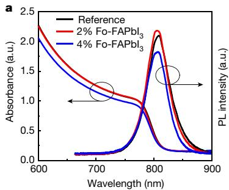

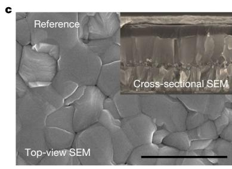

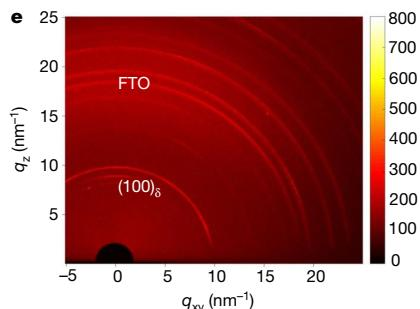

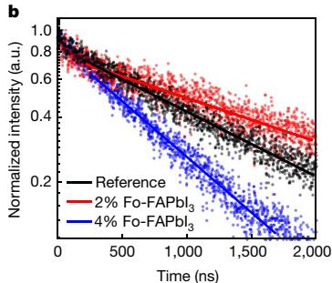

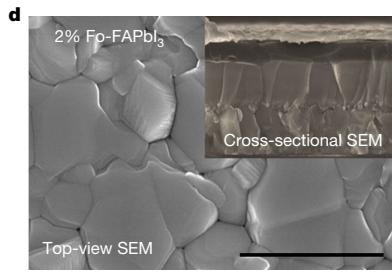

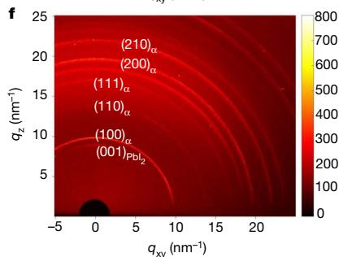  
Fig. 1 | Characterization of the FAPbI films. a, UV–vis absorption and photoluminescence (PL) spectra of the FAPbI3 films. b, Time-resolved photoluminescence of the FAPbI films. c, d, SEM images of the reference   
$\mathsf { F A P b l } _ { 3 }$ (c) and $2 \%$ Fo-FAPbI (d) films. The insets show cross-sectional SEM images. Scale bar, $2 \mu \mathrm { m }$ . e, f, Two-dimensional grazing-incidence XRD patterns of the reference (e) and $2 \%$ Fo-FAPbI (f) films.

Bromide, chloride (Cl− ) and thiocyanate (SCN− ) anions have commonly been used to improve the crystallinity and stability of perovskite films8,9,11,17–22. Another pseudo-halide anion, formate (HCOO− ), has also been investigated in connection with $\mathbf { M A P b l _ { 3 } P S C S ^ { 2 3 - 2 6 } }$ . Two studies23,24 reported that MAHCOO improves the quality of $\mathbf { M A P b l } _ { 3 }$ films by controlling the growth of the perovskite crystals, while others25,26 reported that formic acid accelerates the crystallization of perovskites based on MA cations. Previous work has therefore mainly dealt with the effect of formate on the morphology, nucleation and growth of $\mathbf { M A P b l } _ { 3 }$ . There has also been a recent report of a highly fluorescent methylammonium lead bromide and formate mixture in water27. However, a fundamental understanding of the effects of formate on perovskite films has yet to be achieved.

Here we uncover the key role of HCOO− anions in removing halide vacancies, which are the predominant lattice defects in $\mathsf { F A P b l } _ { 3 }$ perovskite films. This enables the PCE of the PSC to exceed $2 5 \%$ , combined with a high operational stability and external quantum efficiency (EQE) of electroluminescence $( \mathrm { E Q E } _ { \mathrm { E L } } )$ ) that exceeds $10 \%$ . Iodide vacancies are also the principal cause of the unwanted ionic conductivity of metal halide perovskites, which has deleterious effect on their operational stability. We provide insight into the mode of formate intervention. Formate is small enough to fit into the iodide vacancy22, thereby eliminating a prevalent and notorious defect in the metal halide perovskite that accelerates the non-radiative recombination of photogenerated charge carriers, in turn decreasing both the fill factor and the $V _ { \mathrm { o c } }$ of a solar cell. We generated $\mathsf { F A P b l } _ { 3 }$ perovskite films with improved crystallinity and larger grain size by introducing $2 \%$ formamidine formate (FAHCOO) into the precursor solution. The defect passivation and the improved crystallinity are essential to attain the levels of efficiency and stability that are demonstrated by our $\mathsf { F A P b l } _ { 3 }$ -based PSCs.

# Characterization of the perovskite films

The reference FAPbI3 film, hereafter denoted ‘reference’, was prepared as previously reported using a precursor solution containing a mixture of $\mathsf { F A P b l } _ { 3 }$ powder with $3 5 \mathrm { m o l \% }$ additional MACl17. For the formate-doped FAPbI (Fo-FAPbI ) film, x mol% $( x \le 4 )$ ) FAHCOO was added to the reference precursor solution (for experimental details, see Supplementary Information). At a later stage in this work, we quantify the amount of MA

in the resulting perovskite material to be $5 \%$ , but for simplicity we refer to this sample as $\mathsf { F A P b l } _ { 3 }$ . Figure 1a shows the ultraviolet–visible (UV–vis) absorption and photoluminescence spectra of the FAPbI perovskite films $( x = 0 , 2$ and 4). The absorption threshold and photoluminescence peak position were identical for all films; however, there was an obvious decrease in absorbance for the 4% Fo-FAPbI3 film. We derived a bandgap of 1.53 eV for the films using the Tauc plot (Extended Data Fig. 1a). Fig. 1b shows the time-resolved photoluminescence of the FAPbI3 perovskite films. The $2 \%$ $\mathsf { F o - F A P b l } _ { 3 }$ perovskite film showed a slower photoluminescence decay than the reference, which indicates a reduced non-radiative recombination rate due to a reduction in trap-mediated bulk or surface recombination. By contrast, the $4 \% \mathsf { F o - F A P b l } _ { 3 }$ perovskite film showed a faster photoluminescence decay than the reference. A full photoluminescence decay up to 4 μs is shown in Extended Data Fig. 1b. A quantitative analysis of the time-resolved photoluminescence is presented in Supplementary Note 1.

Scanning electron microscopy (SEM) measurements were performed to investigate the morphology of the perovskite film. Compared to the reference film (Fig. 1c), the $2 \%$ Fo-FAPbI film (Fig. 1d) had a slightly larger grain size of up to $2 \mu \mathrm { m }$ (Extended Data Fig. 1c). The insets of Fig. 1c, d show the cross-sectional SEM images of the corresponding perovskite films. Both the reference and $2 \%$ Fo-FAPbI films showed monolithic grains from the top to the bottom. Extended Data Fig. 1d, e shows the irregular grain size of the 4% Fo-FAPbI3 films. Atomic force microscopy measurements (Extended Data Fig. 1f, g) revealed a surface roughness of 41.66 nm and 57.47 nm for the reference and $2 \% \mathsf { F o - F A P b l } _ { 3 }$ films, respectively. The slightly increased surface roughness of the $2 \% \mathsf { F o - F A P b l } _ { 3 }$ film is probably due to the slightly increased grain size.

X-ray diffraction (XRD) measurements (Extended Data Fig. 1h) showed identical peak positions at around $1 3 . 9 5 ^ { \circ }$ and $2 7 . 8 5 ^ { \circ }$ for both the reference and the Fo-FAPbI3 perovskite films, corresponding to the $\alpha$ -phase of $\mathsf { F A P b l } _ { 3 }$ . However, the XRD pattern of the $4 \% \mathsf { F o - F A P b l } _ { 3 }$ $4 \%$ film showed additional peaks, which are assigned to fluorine-doped tin oxide (FTO) substrates and different orientations of $\mathbf { \alpha } _ { \mathbf { { \alpha } } } \mathbf { { \alpha } } _ { \mathbf { { \alpha } } } \mathbf { { \alpha } } _ { \mathbf { { \alpha } } } \mathbf { { \alpha } } _ { \mathbf { { \alpha } } } \mathbf { { \alpha } } _ { \mathbf { { \alpha } } } \mathbf { { \alpha } } _ { \mathbf { { \alpha } } } \mathbf { { \alpha } } _ { \mathbf { { \alpha } } } \mathbf { { \alpha } } _ { \mathbf { { \alpha } } }$ . The broader and lower-intensity diffraction peaks—resulting in a higher relative noise level—indicate a poor crystallinity, which is consistent with the poor optical measurements of the $4 \% \mathsf { F o - F A P b l } _ { 3 }$ film described above. Synchrotron-based two-dimensional grazing-incidence XRD measurements were also obtained for the $\mathsf { F A P b l } _ { 3 }$ films at a relative

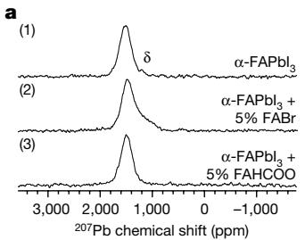

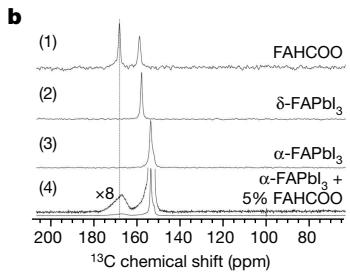

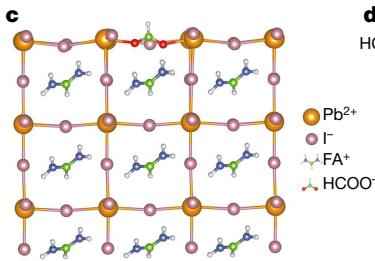

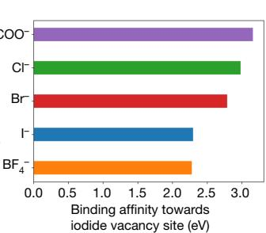  
Fig. 2 | Solid-state NMR spectra and molecular dynamics simulations. a, 207Pb solid-state NMR spectra (recorded at 298 K and a magic-angle spinning (MAS) rate of 15 kHz) of α-FAPbI3 (1), $\mathrm { \alpha \mathrm { - } F A P b I _ { 3 } } + 5 \%$ FABr (2) and $\mathrm { \alpha \mathrm { - } F A P b I _ { 3 } } + 5 \%$ FAHCOO (3). In (1), a small amount of the δ-phase can be seen, but this is distinct from the shoulder seen in (2), and is not seen in (3). b, $^ { 1 3 } { \mathsf { C } }$ solid-state NMR spectra (recorded at 100 K and 12 kHz MAS) of FAHCOO (1), ${ \delta \mathrm { - } } \mathsf { F A P b l } _ { 3 } ( 2 )$ , $\mathbf { \alpha } \mathbf { \alpha } \mathbf { \mathrm { - } } \mathsf { F A P b l } _ { 3 } ( 3 )$ and $\mathrm { \alpha \mathrm { - } F A P b I _ { 3 } } + 5 \%$ FAHCOO (4) (the top trace in (4) is an eightfold magnification). c, Calculated structure illustrating the passivation of an I− vacancy at the $\mathsf { F A P b l } _ { 3 }$ surface by a HCOO− anion. All chemical species are shown in ball-and-stick representation. $\mathsf { P b } ^ { 2 ^ { + } }$ , yellow; I− , pink; oxygen atoms, red; carbon, green; nitrogen, blue; hydrogen, white. d, The relative interaction strengths of different anions with the I− vacancy at the surface.

humidity of around $100 \%$ at $3 0 ^ { \circ } \mathrm { C }$ in air. Figure 1e clearly shows the presence of the δ-phase in the reference, whereas this phase was absent in the $2 \%$ Fo-FAPbI film (Fig. 1f). This provides strong evidence that FAHCOO stabilizes the α-phase of $\mathsf { \Pi } _ { \mathsf { F A P b l } _ { 3 } }$ against humidity. In addition, the full-width at half-maximum of the $\alpha$ -phase peak was decreased for the $2 \% \mathsf { F o - F A P b l } _ { 3 }$ $2 \%$ film, which is hereafter denoted as ‘target’. The integrated one-dimensional diffraction intensity is shown in Extended Data Fig. 1i. We infer from these data that including $2 \%$ FAHCOO in the synthesis of the $\mathsf { F A P b l } _ { 3 }$ films strongly enhances their crystallinity.

We obtained solid-state nuclear magnetic resonance (NMR) spectroscopy measurements in order to elucidate the molecular mechanisms that lead to the improvements afforded by the HCOO− anions. We prepared the samples by mixing formamidinium iodide and $\mathsf { P b l } _ { 2 }$ powders with 5 mol% excess FAHCOO using a mechano-synthesis method. Experimental details are provided in Methods. The $^ { 2 0 7 } { \sf P b }$ spectrum is sensitive to the nature of the anions that are coordinated to $\mathsf { P b } ^ { 2 + }$ in the perovskite crystal28. Figure 2a shows the $^ { 2 0 7 } { \sf P b }$ NMR spectrum of $\mathbf { \alpha } _ { \mathbf { { \alpha } } } \mathbf { { \alpha } } _ { \mathbf { { \alpha } } } \mathbf { { \alpha } } _ { \mathbf { { \alpha } } } \mathbf { { \alpha } } _ { \mathbf { { \alpha } } } \mathbf { { \alpha } } _ { \mathbf { { \alpha } } } \mathbf { { \alpha } } _ { \mathbf { { \alpha } } } \mathbf { { \alpha } } _ { \mathbf { { \alpha } } } \mathbf { { \alpha } } _ { \mathbf { { \alpha } } }$ , in which the $^ { 2 0 7 } { \sf P b }$ resonance appears at 1,543 ppm. The addition of $5 \%$ FABr results in a notable shoulder on the low-frequency side of the resonance, as shown in Fig. 2a (2). This shoulder corresponds to 207Pb in a [PbBrI ] site, which resonates at lower frequency than in a $[ \mathsf { P b l } _ { 6 } ]$ site, because $^ { 2 0 7 } { \sf P b }$ in a $\left[ \mathsf { P b B r } _ { 6 } \right]$ site in $\mathsf { F A P b B } \mathsf { r } _ { 3 }$ resonates at $5 1 0 { \mathsf { p p m } } ^ { 2 8 }$ . However, the 207Pb resonance of $\mathbf { \alpha } _  \mathbf { { \alpha } } \mathbf { { \alpha } } \mathbf { { \alpha } } \mathbf { { \alpha } } \mathbf { { \alpha } } \mathbf { { \alpha } } \mathbf { { \alpha } } \mathbf { { \alpha } } \mathbf { { \alpha } } _  \mathbf { { \alpha } } \mathbf { { \alpha } } \mathbf { { \alpha } } \mathbf { { \alpha } } \mathbf { { \alpha } } \mathbf { { \alpha } } _  \mathbf { { \alpha } } \mathbf { { \alpha } } \mathbf { { \alpha } } \mathbf { { \alpha } } \mathbf { { \alpha } } \mathbf { { \alpha } } _  \mathbf { { \alpha } } \mathbf { { \alpha } } \mathbf { { \alpha } } \mathbf { { \alpha } } \mathbf { { \alpha } } \mathbf { { \alpha } } \mathbf { { \alpha } } \mathbf { { \alpha } } \mathbf { { \alpha } } \mathbf { { \alpha } } \mathbf { { \alpha } } \mathbf { { \alpha \alpha } } \mathbf { { \alpha \alpha } } \mathbf { { \alpha \alpha } } _ { \mathbf { { \alpha \alpha } } \mathbf { { \alpha \alpha } } \mathbf { { \alpha \alpha } } }$ remained the same even when $5 \%$ FAHCOO was added during the synthesis, which is strong evidence that HCOO− does not substitute for iodide anions in the $\mathbf { \alpha } _ { \mathbf { { \alpha } } \mathbf { { \tilde { c } } } \mathbf { { A } } } \mathbf { P } \mathbf { b } \mathbf { l } _ { 3 }$ lattice. This is also supported by the density functional theory (DFT) calculations of the formation energy (Supplementary Note 2).

To explore the local environment of the HCOO− anions in the Fo-FAPbI perovskite, ${ } ^ { 1 } \mathsf { H } - { } ^ { 1 3 } \mathsf { C }$ cross-polarization experiments 29 were performed at 100 K. Figure 2b (1) shows $^ { 1 3 } \mathsf { C }$ resonance signals at 167.8 ppm and 158.5 ppm for the HCOO− and $\mathsf { F A } ^ { + }$ environments in FAHCOO, respectively. Figure 2b, (2) and (3) show the δ-FAPbI3 and α-FAPbI3 and $^ { 1 3 } \mathrm { C }$ resonances

at 157.6 ppm and 153.4 ppm, respectively. Upon mixing 5 mol% FAHCOO with FAPbI3, the $^ { 1 3 } \mathrm { C }$ signal of α-FAPbI3 remained unchanged at 153.4 ppm (Fig. 2b (4)); this further corroborates the lack of substitution of iodide by HCOO− inside the FAPbI lattice, which would broaden the $^ { 1 3 } \mathrm { C }$ resonance of FAPbI3. The HCOO− peak, however, exhibited considerable broadening—indicative of a distribution of local environments—in contrast to the well-defined environment in crystalline FAHCOO. This is consistent with interaction of the HCOO− anion with undercoordinated $\mathsf { P b } ^ { 2 + }$ to passivate iodide vacancies that are present at the surface or the grain boundaries of the perovskite, as predicted by molecular dynamics simulations (see below). For the spin-coated target thin films, the formate $^ { 1 3 } { \sf C }$ signal is less intense, appearing as a shoulder on the $\mathbf { \alpha } _  \mathbf { { \alpha } } \mathbf { { \alpha } } \mathbf { { \alpha } } \mathbf { { \alpha } } \mathbf { { \alpha } } \mathbf { { \alpha } } \mathbf { { \alpha } } \mathbf { { \alpha } } \mathbf { { \alpha } } _  \mathbf { { \alpha } } \mathbf { { \alpha } } \mathbf { { \alpha } } \mathbf { { \alpha } } \mathbf { { \alpha } } \mathbf { { \alpha } } _  \mathbf { { \alpha } } \mathbf { { \alpha } } \mathbf { { \alpha } } \mathbf { { \alpha } } \mathbf { { \alpha } } \mathbf { { \alpha } } _ { \mathbf { { \alpha } } \mathbf { { \alpha } } \mathbf { { \alpha } } \mathbf { { \alpha } } \mathbf { { \alpha } } \mathbf { { \alpha } } \mathbf { { \alpha } } \mathbf { { \alpha } } \mathbf { { \alpha } } \mathbf { { \alpha } } \mathbf { { \alpha } } \mathbf { { \alpha } } \mathbf { { \alpha } } \mathbf { { \alpha } } \mathbf { { \alpha \alpha } } \mathbf { { \alpha } } \mathbf { { \alpha \alpha } } \mathbf { { \alpha \alpha } } \mathbf { { \alpha \alpha } } \mathbf { { \alpha \alpha } } \mathbf { { \alpha \alpha } } }$ peak (Extended Data Fig. 2a, b). This is due to a combination of the lower initial formate concentration and—because the exposed area is greater—the potentially greater evaporation of formate during annealing in the thin films compared to that in the powders; however, it should be noted that cross-polarization spectra are not quantitative. The presence of FAHCOO in the $\mathbf { \alpha } _ { \mathbf { { \alpha } } } \mathbf { { \alpha } } _ { \mathbf { { \alpha } } } \mathbf { { \alpha } } _ { \mathbf { { \alpha } } } \mathbf { { \alpha } } _ { \mathbf { { \alpha } } } \mathbf { { \alpha } } _ { \mathbf { { \alpha } } } \mathbf { { \alpha } } _ { \mathbf { { \alpha } } } \mathbf { { \alpha } } _ { \mathbf { { \alpha } } } \mathbf { { \alpha } } _ { \mathbf { { \alpha } } }$ films is also supported by the time-of-flight secondary-ion mass spectrometry measurements (Extended Data Fig. 2c, d). We further quantified the composition of the spin-coated target films using directly detected $^ { 1 3 } \mathsf { C }$ NMR at 100 K (Extended Data Fig. 2e). Integration of the FA+ and MA+ resonances in the quantitative $^ { 1 3 } \mathsf { C }$ spectrum yields a concentration of ${ \mathsf { M } } { \mathsf { A } } ^ { + }$ in the final film of $5 . 1 \%$ (Supplementary Note 3).

# Molecular dynamics simulations

To explore in more detail the unique role of HCOO− anions, we performed ab initio molecular dynamics simulations of a homogeneous mixture of different ions in the precursor solution (see Extended Data Fig. 3a, b and Supplementary Note 4)—comprising $\mathsf { P b } ^ { 2 + }$ , I− , HCOO− and $\mathsf { F } \mathsf { A } ^ { + }$ —and found that HCOO− anions coordinate strongly with $\mathsf { P b } ^ { 2 + }$ cations (Supplementary Video 1). This strong coordination might help to slow the growth process, resulting in larger stacked grains of the perovskite film; this is validated by the in situ images of the perovskite films without annealing (Supplementary Fig. 1). Compared to the reference film, the target film showed a slower colour change from brown to black. We also performed molecular dynamics simulations to understand the surface passivation effects of HCOO− anions. Extended Data Fig. 3c shows a super cell of a $\mathbf { \alpha } _ { \mathbf { { \alpha } } } \mathbf { { \alpha } } _ { \mathbf { { \alpha } } } \mathbf { { \alpha } } _ { \mathbf { { \alpha } } } \mathbf { { \alpha } } _ { \mathbf { { \alpha } } } \mathbf { { \alpha } } _ { \mathbf { { \alpha } } } \mathbf { { \alpha } } _ { \mathbf { { \alpha } } } \mathbf { { \alpha } } _ { \mathbf { { \alpha } } } \mathbf { { \alpha } } _ { \mathbf { { \alpha } } }$ perovskite slab, in which surface iodides are replaced by formate anions. We found that HCOO− anions can form a hydrogen-bonded network with FA+ ions (Extended Data Fig. 3d, Supplementary Video 2), in agreement with the hydrogen bonding that is observed in FAHCOO crystal structures30. In addition, HCOO− anions can also form a bonding network on the $\mathsf { P b } ^ { 2 + }$ ion-terminated surface, owing to their strong affinity towards lead (Extended Data Fig. 3e, Supplementary Video 3). Figure 2c shows a calculated structure that illustrates an HCOO− anion passivating an I− vacancy at the $\mathsf { F A P b l } _ { 3 }$ surface. I− vacancy defects are the most deleterious defects for halide perovskites. They act as electron traps—inducing the non-radiative recombination of charge carriers—and are responsible for the ionic conductivity of perovskites that causes operational instability. We estimated the relative binding affinities of different anions to I− vacancies at the surface (Extended Data Fig. 4).The energies shown in Fig. 2d reveal that HCOO− has the highest binding energy to I− vacant sites in comparison with Cl− , Br− , I− and $\mathsf { B F } _ { 4 } ^ { - }$ . Furthermore, we also calculated the bonding energies of FA+ cations at the interface with HCOO− anions and with other anions (Extended Data Fig. 5, Supplementary Note 5). We found that $\mathsf { F A } ^ { + }$ cations at the interface form stronger bonds with HCOO− than with the other anions. We therefore conclude that the HCOO− anion acts by eliminating anion-vacancy defects.

# Photovoltaic performance of the PSCs

We further explored the photovoltaic performance of the PSCs. FAPbI PSCs were fabricated using a configuration as illustrated in Fig. 3a.

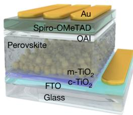  
a

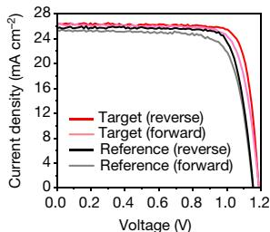  
b

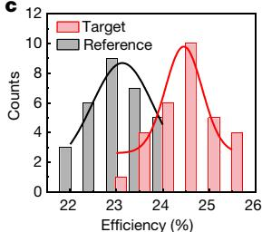

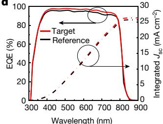

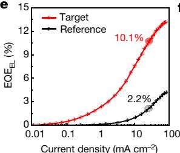

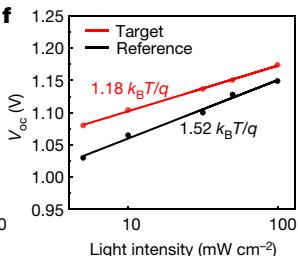  
  
Fig. 3 | Characterization of the photovoltaic performance of the FAPbI3 PSCs. a, The configuration of a typical FAPbI3 PSC device. Spiro-OMeTAD, 2,2′,7,7′-tetrakis(N,N-di-$p$ -methoxyphenylamine)9,9′-spirobifluorene. $\mathbf { b , } J$ –V curves of the reference and target PSCs under both reverse and forward voltage scans. c, The distribution of the PCEs of the reference and target PSCs. d, EQE and the integrated Jsc of the reference and target PSCs. e, $\mathtt { E Q E } _ { \mathtt { E L } }$ measurements of the reference and target PSCs under current densities from 0.01 mA cm−2 to 100 mA cm−2. f, The relationship between the measured $V _ { \mathrm { o c } }$ and light intensity for the reference and target PSCs.

Figure 3b shows current density (J)–voltage (V) curves of the reference and target PSCs under both forward and reverse scans. The reference cell had a maximum PCE of $2 3 . 9 2 \%$ with $\mathsf { a } J _ { \mathrm { s c } }$ of $2 5 . 7 2 \mathsf { m A c m ^ { - 2 } }$ , a $V _ { \mathrm { o c } }$ of 1.153 V and a fill factor of $8 0 . 6 9 \%$ . The target PSC had a maximum PCE of $2 5 . 5 9 \%$ with $\mathsf { a } J _ { \mathrm { s c } }$ of $2 6 . 3 5 \mathsf { m A c m } ^ { - 2 }$ , a $V _ { \mathrm { o c } }$ of 1.189 V and a fill factor of $8 1 . 7 \%$ . The detailed parameters are summarized in Extended Data Table 1. A statistical distribution of the measured PCE of the reference and target PSCs are shown in Fig. 3c. To verify the efficiency, we sent one of our best target PSCs to an accredited photovoltaic test laboratory (Newport, USA) for certification. Supplementary Fig. 2 represents a certified quasi-steady-state efficiency of $2 5 . 2 1 \%$ , with a $V _ { \mathrm { o c } }$ of 1.174 V, a $J _ { \mathrm { s c } }$ of $2 6 . 2 5 \mathsf { m A c m } ^ { - 2 }$ and a fill factor of $8 1 . 8 \%$ .

EQE measurements (Fig. 3d) were performed to verify the measured $J _ { \mathrm { s c } }$ . The EQE of the target cell was higher than that of the reference cell over the whole visible-light absorption region. By integrating the EQE over the AM 1.5G standard spectrum, the projecte $\mathrm { d } J _ { \mathrm { s c } }$ of the reference and target PSCs are $2 5 . 7 5 \mathsf { m A c m } ^ { - 2 }$ and $2 6 . 3 5 \mathsf { m A c m ^ { - 2 } }$ , respectively, which well match the measured $J _ { \mathrm { s c } }$ under the solar simulator. Figure 3e shows the $\mathsf { E O E } _ { \mathtt { E L } }$ of the PSCs. It is known that the photovoltage of a solar cell is directly related to the ability to extract its internal luminescence31. $\mathtt { E Q E } _ { \mathtt { E L } }$ values have previously been successfully used to predict the $V _ { \mathrm { o c } }$ of $\mathsf { P S C S } ^ { 3 2 }$ . In this case, the $\mathsf { E Q E } _ { \mathtt { E L } }$ of the reference cell was $2 . 2 \%$ , whereas that of the target cell was $1 0 . 1 \%$ for injection current densities of $2 5 . 5 \mathsf { m A }$ $\mathsf { c m } ^ { - 2 }$ and $2 6 . 5 \mathsf { m A c m } ^ { - 2 }$ (corresponding to the $J _ { \mathrm { s c } }$ measured under 1 sun

illumination), respectively. Treatment with formate therefore results in a fivefold reduction in the non-radiative recombination rate. The $V _ { \mathrm { o c } }$ of 1.21 V that we obtained for the target cell (Extended Data Fig. 6a) is $9 6 \%$ of the Shockley–Queisser limit of $1 . 2 5 \mathsf { V } ^ { 3 2 , 3 3 }$ —to our knowledge, this is the highest value yet obtained. To further confirm the role of formate, we also measured the performance of devices fabricated using formamidinium acetate as an additive (Extended Data Fig. 6b); however, this additive had a negative effect on performance. For the devices fabricated without MACl additives or passivation layers, those that contained formate still showed an advantage (Extended Data Fig. 6c, d).

Supplementary Fig. 3 shows a linear relationship (with a slope of approximately 0.95) between $J _ { \mathrm { s c } }$ and light intensity for both the reference and target PSCs—indicating good charge transport and negligible bimolecular recombination—and Fig. 3f shows a linear relationship between $V _ { \mathrm { o c } }$ and the logarithm of light intensity. We fitted the data points with a slope of $\eta _ { \mathrm { i d } } k _ { \mathrm { B } } T / q$ , where $\eta _ { \mathrm { i d } }$ is the ideality factor, $k _ { \mathrm { B } }$ is the Boltzmann constant, T is temperature and $q$ is the electron charge. The reference cell had an $\eta _ { \mathrm { i d } }$ of 1.52, whereas that of the target cell was 1.18—lower than the previously reported value33 of 1.27. A summary of the detailed photovoltaic parameters can be found in Extended Data Table 2. The reduction in $\eta _ { \mathrm { i d } }$ , as well as the space-charge-limited current measurements (Supplementary Fig. 4), further support our findings of a reduction in trap-assisted recombination34,35. Because the fill factor

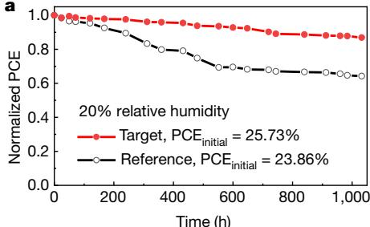

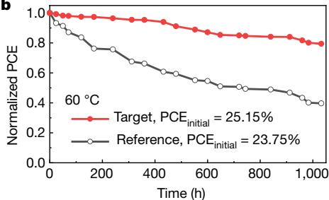

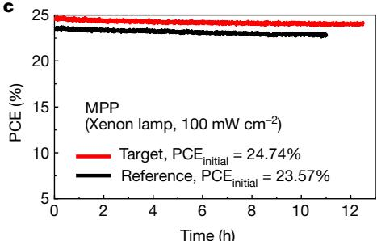

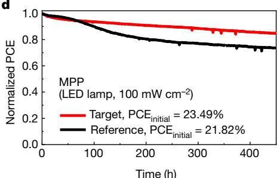  
  
Fig. 4 | Stability of the FAPbI3 PSCs. a, The shelf-life stability of the reference and target PSCs. b, The heat stability of the reference and target PSCs. c, The operational stability of the reference and target PSCs, showing high performance. d, The long-term operational stability of the reference and target PSCs.

critically depends36 on ηid, the reduction in $\eta _ { \mathrm { i d } }$ that we observe here also contributes to the increase in fill factor measured for the target PSCs.

# Shelf-life and operational stability of the PSCs

To assess the stability of our PSCs, we measured first their shelf life by storing the unencapsulated devices in the dark at $2 5 ^ { \circ } \mathrm { C }$ and $20 \%$ relative humidity. Figure 4a shows that the PCE of the reference cell decreased by about $3 5 \%$ after 1,000 h aging, whereas the target cell showed a degradation of only $10 \%$ over this time. A heat-stability test was also performed by annealing the unencapsulated PSC devices at $6 0 ^ { \circ } \mathrm { C }$ under $20 \%$ relative humidity. Figure 4b shows that the target cell retained around $80 \%$ of its initial efficiency after 1,000 h aging, whereas the reference cell retained only about $40 \%$ .

We further investigated the operational stability of the PSCs by aging the unencapsulated devices under a nitrogen atmosphere, using maximum power point (MPP) tracking under a simulated 1-sun illumination. Figure 4c shows the PCE of the PSCs under continuous light soaking using a xenon lamp. The PCE of the target cell remained above $2 4 \%$ after 10-h MPP tracking, whereas that of the reference cell decreased to $2 2 . 8 \%$ . Figure 4d shows the long-term operational stability of the PSCs. The PCE of the reference cell decreased by about $30 \%$ , whereas the target cell only lost around $1 5 \%$ of its initial efficiency. Note that during this experiment the temperature of the PSCs was measured to be around $3 5 ^ { \circ } \mathrm { C } ,$ , as we did not cool the cells during illumination. Compared to the target PSC, the reference cell showed a considerable decrease in $J _ { \mathrm { s c } }$ and fill factor over the 450-h MPP tracking test (Extended Data Fig. 7), which suggests that reference perovskite layer is less stable. We attribute the decline in fill factor to a de-doping of the hole conductor due to Li+ ion migration under illumination37.

The improvement in thermal and operational stability of the target cell compared with the reference cell is ascribed to the better crystallinity of the perovskite film and a reduced concentration of halide defects, because NMR experiments show that formate is not incorporated into the bulk of the perovskite. It is known that crystallinity is crucial for the stability of the perovskites, because the main degradation process starts from defects near the grain boundaries. The high crystallinity and large grain size of the formate-containing perovskite films—as validated by SEM and XRD measurements—will contribute to their greater stability and performance. Our simulations and calculations suggest that formate anions have the highest binding affinity among all halides and pseudo halides for iodide vacancy sites, and are therefore the best candidates to eliminate the most abundant and deleterious lattice defects present in halide perovskite films. This results in a marked reduction of trap-mediated non-radiative recombination, which we validated by $\mathsf { E O E } _ { \mathtt { E L } }$ , time-resolved photoluminescence, $n _ { \mathrm { i d } } ,$ and SCLC measurements. A low level of halide vacancies is beneficial for the stability of solar cells, because halide vacancies can lead to degradation as a result of photoinduced iodine loss, especially under light illumination.

Overall, we demonstrate $\alpha$ -FAPbI -based PSCs with a PCE of $2 5 . 6 \%$ (certified $2 5 . 2 \%$ ) and high stability, achieved through solution processing by introducing $2 \%$ formamidinium formate into the $\mathsf { F A P b l } _ { 3 }$ perovskite precursor solution. Our molecular dynamics simulations, together with solid-state NMR spectroscopy analysis and in-depth optoelectronic device characterization, provide an understanding of the role of HCOO− anions as passivating agents for $\mathsf { F A P b l } _ { 3 }$ perovskites. Our findings pave the way for facile access to high-performance PSCs approaching their theoretical efficiency limit.

# Online content

Any methods, additional references, Nature Research reporting summaries, source data, extended data, supplementary information, acknowledgements, peer review information; details of author contributions and competing interests; and statements of data and code availability are available at https://doi.org/10.1038/s41586-021-03406-5.

1. Kojima, A., Teshima, K., Shirai, Y. & Miyasaka, T. Organometal halide perovskites as visible-light sensitizers for photovoltaic cells. J. Am. Chem. Soc. 131, 6050–6051 (2009).   
2. Grätzel, M. The light and shade of perovskite solar cells. Nat. Mater. 13, 838–842 (2014).   
3. Park, N.-G. et al. Towards stable and commercially available perovskite solar cells. Nat. Energy 1, 16152 (2016).   
4. Correa-Baena, J. P. et al. Promises and challenges of perovskite solar cells. Science 358, 739–744 (2017).   
5. Lu, H., Krishna, A., Zakeeruddin, S. M., Grätzel, M. & Hagfeldt, A. Compositional and interface engineering of organic-inorganic lead halide perovskite solar cells. iScience 23, 101359 (2020).   
6. Eperon, G. E. et al. Formamidinium lead trihalide: a broadly tunable perovskite for efficient planar heterojunction solar cells. Energy Environ. Sci. 7, 982–988 (2014).   
7. Pellet, N. et al. Mixed-organic-cation perovskite photovoltaics for enhanced solar-light harvesting. Angew. Chem. Int. Ed. 53, 3151–3157 (2014).   
8. Jeon, N. J. et al. Compositional engineering of perovskite materials for high-performance solar cells. Nature 517, 476–480 (2015).   
9. Lu, H. et al. Vapor-assisted deposition of highly efficient, stable black-phase $\mathsf { F A P b l } _ { 3 }$ perovskite solar cells. Science 370, eabb8985 (2020).   
10. De Wolf, S. et al. Organometallic halide perovskites: sharp optical absorption edge and its relation to photovoltaic performance. J. Phys. Chem. Lett. 5, 1035–1039 (2014).   
11. Stranks, S. D. et al. Electron-hole diffusion lengths exceeding 1 micrometer in an organometal trihalide perovskite absorber. Science 342, 341–344 (2013).   
12. Herz, L. M. et al. Charge-carrier mobilities in metal halide perovskites: fundamental mechanisms and limits. ACS Energy Lett. 2, 1539–1548 (2017).   
13. NREL. Best Research-Cell Efficiency Chart https://www.nrel.gov/pv/cell-efficiency.html (accessed 17 March 2021).   
14. Zheng, X. et al. Managing grains and interfaces via ligand anchoring enables $2 2 . 3 \%$ -efficiency inverted perovskite solar cells. Nat. Energy 5, 131–140 (2020)   
15. Liu, Z. et al. A holistic approach to interface stabilization for efficient perovskite solar modules with over 2,000-hour operational stability. Nat. Energy 5, 596–604 (2020).   
16. Saliba, M. et al. Cesium-containing triple cation perovskite solar cells: improved stability, reproducibility and high efficiency. Energy Environ. Sci. 9, 1989–1997 (2016).   
17. Kim, M. et al. Methylammonium chloride induces intermediate phase stabilization for efficient perovskite solar cells. Joule 3, 2179–2192 (2019).   
18. Min, H. et al. Efficient, stable solar cells by using inherent bandgap of α-phase formamidinium lead iodide. Science 366, 749–753 (2019).   
19. Yang, S. et al. Thiocyanate assisted performance enhancement of formamidinium based planar perovskite solar cells through a single one-step solution process. J. Mater. Chem. A 4, 9430–9436 (2016).   
20. Kim, D. H. et al. Bimolecular additives improve wide-band-gap perovskites for efficient tandem solar cells with CIGS. Joule 3, 1734–1745 (2019).   
21. Kim, D. et al. Efficient, stable silicon tandem cells enabled by anion-engineered wide-bandgap perovskites. Science 368, 155–160 (2020).   
22. Walker, B., Kim, G. H. & Kim, J. Y. Pseudohalides in lead-based perovskite semiconductors. Adv. Mater. 31, 1807029 (2019).   
23. Moore, D. T. et al. Direct crystallization route to methylammonium lead iodide perovskite from an ionic liquid. Chem. Mater. 27, 3197–3199 (2015).   
24. Seo, J. et al. Ionic liquid control crystal growth to enhance planar perovskite solar cells efficiency. Adv. Energy Mater. 6, 1600767 (2016).   
25. Nayak, P. K. et al. Mechanism for rapid growth of organic–inorganic halide perovskite crystals. Nat. Commun. 7, 13303 (2016).   
26. Meng, L. et al. Improved perovskite solar cell efficiency by tuning the colloidal size and free ion concentration in precursor solution using formic acid additive. J. Energy Chem. 41, 43–51 (2020).   
27. Khan, Y. et al. Waterproof perovskites: high fluorescence quantum yield and stability from a methylammonium lead bromide/formate mixture in water. J. Mater. Chem. C 8, 5873– 5881 (2020).   
28. Askar, A. M. et al. Composition-tunable formamidinium lead mixed halide perovskites via solvent-free mechanochemical synthesis: decoding the Pb environments using solid-state NMR spectroscopy. J. Phys. Chem. Lett. 9, 2671–2677 (2018).   
29. Kubicki, D. J. et al. Cation dynamics in mixed-cation $( \mathsf { M A } ) _ { x } ( \mathsf { F A } ) _ { 1 - x } \mathsf { P b l } _ { 3 }$ hybrid perovskites from solid-state NMR. J. Am. Chem. Soc. 139, 10055–10061 (2017).   
30. Zhou, Z. et al. Synthesis, microwave spectra, X-ray structure, and high-level theoretical calculations for formamidinium formate. J. Chem. Phys. 150, 094305 (2019).   
31. Ross, R. et al. Some thermodynamics of photochemical systems. J. Chem. Phys. 46, 4590–4593 (1967).   
32. Tress, W. et al. Predicting the open-circuit voltage o $\mathsf { C H } _ { 3 } \mathsf { N H } _ { 3 } \mathsf { P b l } _ { 3 }$ perovskite solar cells using electroluminescence and photovoltaic quantum efficiency spectra: the role of radiative and non-radiative recombination. Adv. Energy Mater. 5, 1400812 (2015).   
33. Jiang, Q. et al. Surface passivation of perovskite film for efficient solar cells. Nat. Photonics 13, 460–466 (2019).   
34. Yang, D. et al. Surface optimization to eliminate hysteresis for record efficiency planar perovskite solar cells. Energy Environ. Sci. 9, 3071–3078 (2016).   
35. Kuik, M., Koster, L. J., Wetzelaer, G. A. & Blom, P. W. Trap-assisted recombination in disordered organic semiconductors. Phys. Rev. Lett. 107, 256805 (2011).   
36. Green, M. Accuracy of analytical expressions for solar cell fill factors. Solar Cells 7, 337– 340 (1982).   
37. Wang, Y. et al. Stabilizing heterostructures of soft perovskite semiconductors. Science 365, 687–691 (2019).

Publisher’s note Springer Nature remains neutral with regard to jurisdictional claims in published maps and institutional affiliations.

$\circledcirc$ The Author(s), under exclusive licence to Springer Nature Limited 2021

# Article

# Methods

# Materials

Formamidine acetate salt $( 9 9 \% )$ , hydroiodic acid (HI, 57 wt% in water), titanium diisopropoxide bis(acetylacetonate), 2-propanol (anhydrous, $9 9 . 5 \% )$ , chlorobenzene (anhydrous, $9 9 . 8 \%$ ), N,N-dimethylformamide (DMF, anhydrous $9 9 . 8 \% ,$ ), dimethyl sulfoxide (DMSO, ${ > } 9 9 . 5 \%$ ), 2-methoxyethanol (anhydrous, $9 9 . 8 \%$ ) and formic acid were procured from Sigma-Aldrich and used as received. Methylamine hydrochloride (MACl, $98 \%$ ) was procured from Acros Organics. Fluorine-doped tin oxide on glass (FTO glass, $7 \Omega \thinspace \mathsf { s q } ^ { - 1 } )$ was obtained from Asahi. Ethanol (absolute, $9 9 . 9 \%$ ) was procured from Changshu Yangyuan Chemicals. Diethyl ether (extra pure grade) was procured from Duksan. ${ \mathrm { T i O } } _ { 2 }$ paste (SC-HT040) was procured from ShareChem. Lead iodide $( \mathsf { P b l } _ { 2 } , \mathsf { 9 9 . 9 9 9 } \% )$ ) was purchased from TCI.

# Materials synthesis

Formamidinium iodide (FAI) was synthesized as reported elsewhere8 . In brief, 25 g formamidine acetate was directly mixed with 50 ml hydroiodic acid in a 500 ml round-bottomed flask with vigorous stirring. A light-yellow powder was obtained by evaporating the solvent at $8 0 ^ { \circ } \mathrm { C }$ for 1 h in a vacuum evaporator. The resulting powder was then dissolved in ethanol and precipitated using diethyl ether. This procedure was repeated three times until white powder was obtained, and the white powder was recrystallized from ethanol and diethyl ether in a refrigerator. After recrystallization, the resulting powders were collected and dried at $6 0 ^ { \circ } \mathrm { C }$ for 24 h. As reported previously18, black FAPbI3 powder was synthesized by mixing the synthesized FAI (0.8 M) with $\mathsf { P b l } _ { 2 }$ (1:1 molar ratio) in 30 ml of 2-methoxyethanol with stirring. The yellow mixed solution was heated with a stirring bar at $1 2 0 ^ { \circ } \mathrm { C }$ and then recrystallized using the retrograde method. The resulting powder was filtered using a glass filter and baked at $1 5 0 ^ { \circ } \mathrm { C }$ for 30 min. Formamidine formate (FAHCOO) was synthesized by dissolving formamidine acetate in an excess of formic acid. The resulting solution was dried a $8 0 ^ { \circ } \mathrm { C }$ by rotary evaporation to remove most of the formic acid and acetic acid. A wet formamidine formate powder was obtained. This wet powder was recrystallized with a small amount of ethanol. A transparent, plate-like crystal was formed after the recrystallization, which was consecutively dried in vacuum for 10 h to obtain the final formamidine formate. Bulk perovskite samples for solid-state NMR are prepared by grinding the reactant (FAI and $\mathsf { P b l } _ { 2 }$ with FABr or FAHCOO as appropriate) in an electric ball (Retsch Ball Mill MM-200) for 30 min at $2 5 \mathsf { H z }$ , before annealing at $1 5 0 ^ { \circ } \mathrm { C }$ for 15 min.

# Substrate preparation

Asahi FTO glass $( 1 . 8 \mathrm { m m } , 7 \Omega \mathsf { s q } ^ { - 1 } )$ was used as the substrate for the devices. The substrates were cleaned using the RCA-2 $\left( \mathsf { H } _ { 2 } \mathbf { O } _ { 2 } { \cdot } \mathsf { H C l } { \cdot } \mathsf { H } _ { 2 } \mathbf { O } \right)$ procedure for 15 min to remove metal-ion impurities. Then, the substrates were cleaned sequentially with acetone, ethanol and isopropyl alcohol (IPA) in an ultrasonic system for 15 min. To deposit the compact ${ \mathrm { T i O } } _ { 2 } ( { \bf c } { \cdot } { \mathrm { T i O } } _ { 2 } )$ layer, $6 0 \mathrm { m l }$ of a titanium diisopropoxide bis(acetylacetonate)/ethanol (1:10 volume ratio) solution was applied using the spray-pyrolysis method. Prior to the spraying process, the FTO substrates were placed on a hot plate and the temperature was increased to $4 5 0 ^ { \circ } \mathrm { C }$ rapidly. After the spray pyrolysis step, the substrates were stored at $4 5 0 ^ { \circ } \mathrm { C }$ for 1 h and then slowly cooled to room temperature. On top of the ${ \mathsf { c } } { \cdot } { \mathsf { T i O } } _ { 2 }$ layer, a mesoporous ${ \mathrm { T i O } } _ { 2 }$ $\mathrm { T i O } _ { 2 } ( \mathrm { m } { \cdot } \mathrm { T i O } _ { 2 } )$ layer was deposited by spin-coating a $\mathrm { T i O } _ { 2 }$ paste dispersed in ethanol/terpineol $( 7 8 { : } 2 2 \mathbf { w } / \mathbf { w } )$ . The ${ \mathrm { T i O } } _ { 2 }$ nanoparticles have a diameter of approximately 50 nm and were purchased from ShareChem. The FTO $/ { \bf c } \mathrm { - } \Gamma \mathrm { i } 0 _ { 2 }$ substrates prepared with $\mathbf { m } { \cdot } \mathbf { T i O } _ { 2 }$ were heated at $5 0 0 ^ { \circ } \mathrm { C }$ on a hot plate for 1 h to remove organic compounds first, and then slowly cooled to $2 0 0 ^ { \circ } \mathrm { C }$ .

# Device fabrication

For the fabrication of the perovskite layer, the whole process was carried out at controlled room temperature $( 2 5 ^ { \circ } \mathrm { C } )$ and humidity $20 \%$ relative

humidity). The reference perovskite precursor solution was prepared by mixing 1,139 mg FAPbI and $3 5 \mathrm { m o l \% }$ MACl in a mixture of DMF and DMSO (4:1). For the Fo-FAPbI perovskite film, extra FAHCOO was added to the reference solution in the range of $1 { - } 4 \mathrm { m o l \% }$ . For each sample, $7 0 \mu \mathrm { l }$ of the solution was spread over the $\mathbf { m } { \cdot } \mathbf { T i O } _ { 2 }$ layer at 6,000 rpm for 50 s with 0.1 s ramping. During the spin-coating, 1 ml diethyl ether was dripped after spinning for 10 s. The perovskite film was then dried on a hot plate at $1 5 0 ^ { \circ } \mathrm { C }$ for 10 min immediately. See Supplementary Video 4 for details of the fabrication of perovskite films. After cooling the perovskite film on the bench, 15 mM of octylammonium iodide dissolved in IPA was spin-coated on top of the perovskite film at 3,000 rpm for 30 s. The hole-transport layer was deposited by spin-coating a Spiro-OMeTAD (Lumtech) solution at 4,000 rpm for 30 s. Details of the Spiro-OMeTAD solution was reported in the previous study18. Finally, a gold electrode was deposited on top of the Spiro-OMeTAD layer using a thermal evaporation system. The back and front contacts were formed with 100-nm-thick Au films deposited under a pressure of $1 0 ^ { - 6 }$ Torr.

# Characterization of the solar cells

The solar cells without encapsulation were measured with a solar simulator (McScience, K3000 Lab solar cell I-V measurement system, Class AAA) in a room with relative humidity below $2 5 \%$ at $2 5 ^ { \circ } \mathrm { C }$ . An anti-reflecting coating layer was used for the devices. The light intensity was calibrated to AM 1.5G (100 mW cm−2) using a Si-reference cell certified by the National Renewable Energy Laboratory before performing measurements. No light soaking was applied before the potential I–V scans. All J–V curves were measured using a reverse scan (from 1.25 V to 0 V) and a forward scan (from 0 V to 1.25 V) under a constant scan speed of $\mathsf { i } 0 0 \mathsf { m } \mathsf { V } \mathsf { s } ^ { - 1 }$ . The stabilized power output was measured at the maximum power point using a xenon lamp light source. A non-reflective mask with an aperture area of $0 . 0 8 0 4 \mathrm { c m } ^ { 2 }$ was used to cover the active area of the device to avoid the artefacts produced by the scattered light (the mask area is determined using a microscope). EQE measurements were obtained using a QEX7 system (PV Measurements). For the $\mathsf { E O E } _ { \mathtt { E L } }$ measurements, different bias voltages or currents were applied to the PSCs with a BioLogic SP300 potentiostat. The emitted photon flux from the PSCs was recorded using a calibrated, large-area $( 1 \mathsf { c m } ^ { 2 } )$ Si photodiode (Hamamatsu S1227-1010BQ). All measurements were performed in the ambient environment $40 \%$ relative humidity, $2 4 ^ { \circ } \mathrm { C } )$ ).

# Characterization of the device stability

For the stability tests, all PSCs were used without encapsulation. The shelf-life stability was assessed by measuring the photovoltaic performance of PSCs every tens of hours. The thermal stability test was performed by ageing the solar cells on a hot plate at $6 0 ^ { \circ } \mathrm { C }$ at $20 \%$ relative humidity. The performance of the devices was periodically measured after cooling the devices to room temperature. The operational stability was performed with a BioLogic potentiostat under an LED or a lamp that was adjusted to AM 1.5G $( 1 0 0 \mathrm { { m w c m } ^ { - 2 } ) }$ . The PSCs were masked and placed inside a homemade sample holder purged with continuous $\mathsf { N } _ { 2 }$ flow. The devices were aged with a maximum point power tracking routine under continuous illumination. The temperature-control system was not activated during the measurements. J–V curves with reverse voltage scans were recorded every 30 min during the whole operational test.

# Characterization of the perovskite film

UV–vis absorption spectra of the perovskite films were recorded on a UV-1800 (Shimadzu) spectrophotometer. The SEM images of the perovskite films were taken with a field-emission scanning electron microscope (FE-SEM, S-4800, Hitachi). XRD patterns of the perovskite films were performed using a D8 Advance (Bruker) diffractometer equipped with Cu Kα radiation $( \lambda = 0 . 1 5 4 2 \mathrm { n m }$ ) as the X-ray source. Steady-state photoluminescence and time-resolved photoluminescence measurements of the perovskite films were conducted using a

PicoQuant FluoTime 300 (PicoQuant GmbH) equipped with a PDL 820 laser pulse driver. A pulsed laser diode $\left( \lambda = 3 7 5 \mathsf { n m } \right.$ , pulse full-width at half-maximum $< 7 0$ ps, repetition rate 200 kHz–40 MHz) was used to excite the perovskite sample. Surface roughness was assessed using a Cypher S atomic force microscope from Asylum Research under ambient conditions $2 4 ^ { \circ } \mathrm { C }$ , $50 \%$ relative humidity). An Olympus AC240-TS tip was used, and the system was operated under tapping mode. Two-dimensional grazing-incidence XRD of the perovskite films was performed at the BL14B1 beamline of the Shanghai Synchrotron Radiation Facility (SSRF) using X-rays with a wavelength of 0.6887 Å. Two-dimensional grazing-incidence XRD patterns were acquired by a MarCCD mounted vertically at a distance of around $6 3 2 \mathsf { m m }$ from the sample with grazing-incidence angles of $0 . 4 ^ { \circ }$ and an exposure time of 30 s. For the time-of-flight secondary-ion mass spectrometry (TOF-SIMS) measurements, the reference and $2 \% \mathsf { F o - F A P b l } _ { 3 }$ $2 \%$ films were coated on a glass substrate using anti-solvent methods. The samples were analysed by TOF-SIMS using a hybrid IONTOF TOF-SIMS instrument. Depth profiling was accomplished with a three-lens 25-keV BiMn primary ion gun and a $\mathsf { B i } _ { 3 } ^ { + }$ primary ion-beam cluster (1 pA pulsed beam current). Measurements used a caesium-ion beam for sputtering with an energy of 500 eV (sputtering current 1–23 nA). Profiling was completed with a $1 0 0 \times 1 0 0 \mu \mathrm { m } ^ { 2 }$ primary-beam area and a $3 0 0 \times 3 0 0 \mu \mathrm { m } ^ { 2 }$ sputter-beam raster. Non-interlaced mode was used to limit beam damage from the primary ion-beam (1 frame, 2 s sputter, 2 s pause).

# Solid-state NMR measurements

Low-temperature (100 K) $\mathrm { ^ 1 H - ^ { 1 3 } C }$ cross-polarization and directly detected $^ { 1 3 } \mathsf { C }$ (125.8 MHz) NMR spectra, and room-temperature $^ { 2 0 7 } { \sf P b }$ (104.7 MHz) NMR spectra were recorded on a Bruker Avance III 11.7 T spectrometer equipped with a $3 . 2 \cdot \mathsf { m m }$ low-temperature CPMAS probe. $^ { 2 0 7 } { \bf P } { \bf b }$ and $^ { 1 3 } \mathsf { C }$ spectra were referenced to $\mathsf { P b } ( \mathsf { N O } _ { 3 } ) _ { 2 }$ at –3,492 ppm and the $\mathrm { C H } _ { 2 }$ resonance of solid adamantane at 38.48 ppm, respectively, at room temperature. Room temperature $^ { 2 0 7 } { \sf P b }$ spectra were recorded with a Hahn echo and an effective recycle delay of 17 ms. The low-temperature $\mathrm { ^ 1 H - ^ { 1 3 } C }$ cross-polarization spectra of $\mathbf { \delta - F A P b l } _ { 3 }$ and $\mathbf { \alpha } _ { \mathbf { { \alpha } } } \mathbf { { \alpha } } _ { \mathbf { { \alpha } } } \mathbf { { \alpha } } _ { \mathbf { { \alpha } } } \mathbf { { \alpha } } _ { \mathbf { { \alpha } } } \mathbf { { \alpha } } _ { \mathbf { { \alpha } } } \mathbf { { \alpha } } _ { \mathbf { { \alpha } } } \mathbf { { \alpha } } _ { \mathbf { { \alpha } } } \mathbf { { \alpha } } _ { \mathbf { { \alpha } } } \mathbf { { \alpha } } _ { \mathbf { { \alpha } } }$ $\alpha$ were recorded with 1 ms contact time, recycle delays of 1.5 s and 4 s, respectively, and 12 kHz MAS. The low-temperature $\mathrm { ^ 1 H - ^ { 1 3 } C }$ spectra of FAHCOO and Fo- $\mathbf { \nabla } \cdot \mathsf { F A P b } \mathsf { I } _ { 3 }$ were recorded with 2 ms contact time, 10 s recycle delay and 12 kHz MAS. The quantitative, directly detected $^ { 1 3 } \mathsf { C }$ experiment on a scraped $2 \%$ Fo-FAPbI film was performed with a single pulse experiment, 12 kHz MAS and a 10 s recycle delay, which is more than 5 times the longitudinal relaxation time of $^ { \cdot 1 3 } \mathrm { C }$ (1 s). All $^ { 1 3 } \mathrm { C }$ spectra were acquired with $1 0 0 \mathsf { k H z } ^ { \mathrm { 1 } } \mathsf { H }$ decoupling. The low-temperature 1 H– $^ { 1 3 } \mathsf { C }$ cross-polarization spectrum of scraped $2 \%$ Fo-FAPbI thin-film was measured with 2 ms contact time, 4 s recycle delay and 12 kHz MAS. NMR characterization was performed with $5 \%$ Fo-FAPbI , because the greater amount of formate in the sample provides higher sensitivity compared to $2 \%$ Fo-FAPbI3. MACl was not included in the mechanosynthesized samples for NMR spectroscopy, because this would lead to broadening of the $^ { 1 3 } \mathrm { C }$ and $^ { 2 0 7 } { \sf P b }$ resonances of FAPbI (ref. 29), owing to different local

environments with slightly different chemical shifts that arise from MA+ substitution of nearest-neighbour—and more distant—A-site cations. This broadening would obscure the small changes in the $^ { 2 0 7 } { \sf P b }$ and $^ { 1 3 } \mathrm { C }$ resonances that arise from the incorporation of formate. However, given that the incorporation of MA+ ions has a minimal effect on the lattice structure, these findings also apply to the ${ \mathsf { M } } { \mathsf { A } } ^ { + }$ -doped composition studied here.

# Data availability

The data that support the findings of this study are available from the corresponding author upon reasonable request.

# Code availability

The code used for this study is available from the corresponding author upon reasonable request.

Acknowledgements We thank W. R. Tress for discussions, and the staff at beamlines BL17B1, BL14B1, BL11B, BL08U and BL01B1 of the SSRF for providing the beamline, and the Swiss National Supercomputing Centre (CSCS) and EPFL computing center (SCITAS) for their support. This research was supported by the Technology Development Program to Solve Climate Changes of the National Research Foundation (NRF) funded by the Ministry of Science, ICT & Future Planning (2020M1A2A2080746). This work was also supported by ‘The Research Project Funded by U-K Brand’ (1.200030.01) of Ulsan National Institute of Science & Technology (UNIST). D.S.K. acknowledges the Development Program of the Korea Institute of Energy Research (KIER) (C0-2401 and C0-2402). L.E. acknowledges support from the Swiss National Science Foundation, grant number 200020_178860. U.R. acknowledges funding from the Swiss National Science Foundation via individual grant number 200020_185092 and the NCCR MUST. A.H. acknowledges the Swiss National Science Foundation, project ‘Fundamental studies of dye-sensitized and perovskite solar cells’, project number 200020_185041. M.G. acknowledges financial support from the European Union’s Horizon 2020 research and innovation programme under grant agreement number 881603, and the King Abdulaziz City for Science and Technology (KACST).

Author contributions J.J., B.W. and J.Y.K. conceived the project. J.J., Minjin Kim and H.L. prepared the samples, performed the relevant photovoltaic measurements, analysed the data and wrote the manuscript. J.S. synthesised the FAHCOO material. Minjin Kim and D.S.K. certified the efficiency of the PSCs. Y.J.Y. carried out photoluminescence and UV–vis absorption spectroscopy. S.J.C. and I.W.C. performed the time-resolved photoluminescence, SEM and XRD measurements. Y.J. and H.L. collected the light-intensity-dependent J–V data. P.A. and U.R. designed and performed all the DFT calculations and molecular dynamics simulations. Maengsuk Kim and J.H.L contributed to the DFT calculations. A.M., M.A.H. and L.E. conducted the solid-state NMR measurements and analysis. B.P.D. performed the atomic force microscopy measurements. H.L. conducted the long-term operational stability measurements, $E \mathsf { Q } \mathsf { E } _ { \mathsf { E } }$ measurements and analysed the data. Y.Y. performed the two-dimensional grazing-incidence XRD measurements. F.T.E contributed to the analysis of the time-resolved photoluminescence data. S.M.Z. coordinated the project. A.H. and M.G. proposed experiments and M.G. wrote the final version of the manuscript. A.H., D.S.K., M.G. and J.Y.K. directed the work. All authors analysed the data and contributed to the discussions.

Competing interests The authors declare no competing interests.

# Additional information

Supplementary information The online version contains supplementary material available at https://doi.org/10.1038/s41586-021-03406-5.

Correspondence and requests for materials should be addressed to A.H., D.S.K., M.G. or J.Y.K. Peer review information Nature thanks the anonymous reviewers for their contribution to the peer review of this work.

Reprints and permissions information is available at http://www.nature.com/reprints.

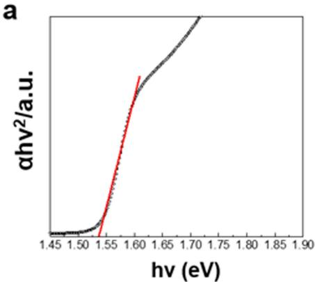

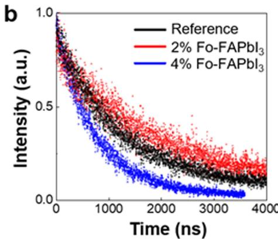

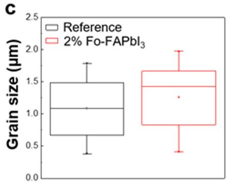

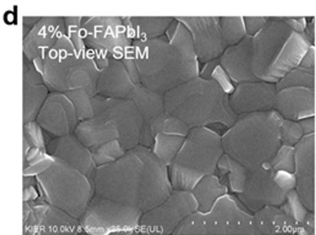

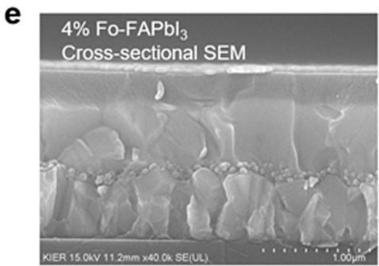

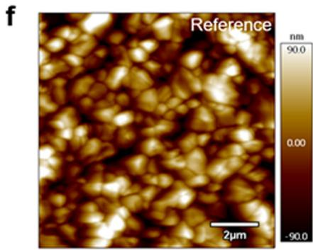

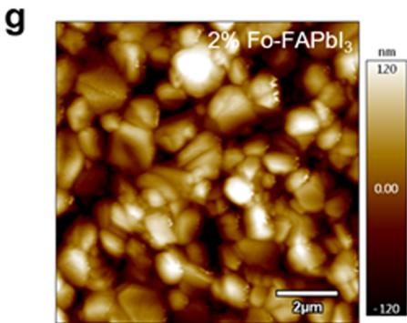

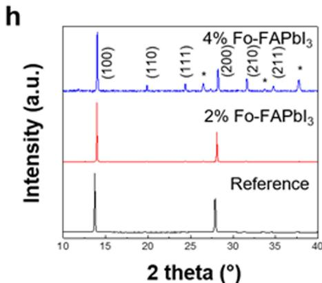

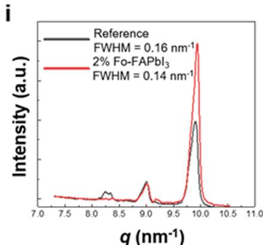  
Extended Data Fig. 1 | Characterization of the perovskite films with and without FAFo. a, The Tauc plot of the $2 \%$ Fo-FAPbI perovskite film. b, A full photoluminescence decay of the reference, $2 \%$ Fo-FAPbI and $4 \%$ Fo-FAPbI perovskite films. c, The distribution of the grain sizes of the reference and $2 \%$ Fo-FAPbI3 films. The box + whisker plots show the distribution of the grain sizes for both reference and $2 \%$ Fo-FAPbI3 perovskite films. The distribution is based on 22 data points each. d, e, The top-view SEM image (d) and the cross-sectional   
SEM image (e) of the 4% Fo-FAPbI3 perovskite film. f, g, AFM images of the reference (f) and the $2 \%$ Fo-FAPbI (g) perovskite films. h, The XRD patterns of the reference, $2 \%$ Fo- $\mathsf { F A P b l } _ { 3 }$ and $4 \%$ Fo-FAPbI perovskite films. Peaks labelled with an asterisk are assigned to the FTO substrates, which can be seen for the $4 \%$ sample owing to the lower intensity of the perovskite reflections. i, Integrated one-dimensional grazing-incidence XRD pattern of the reference and $2 \%$ Fo-FAPbI3 films.

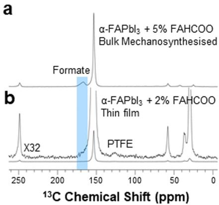

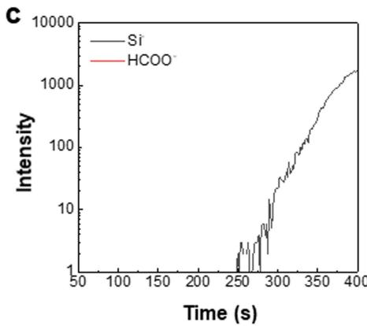

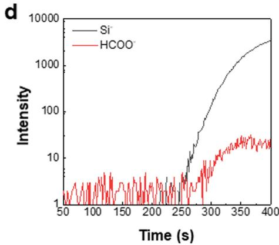

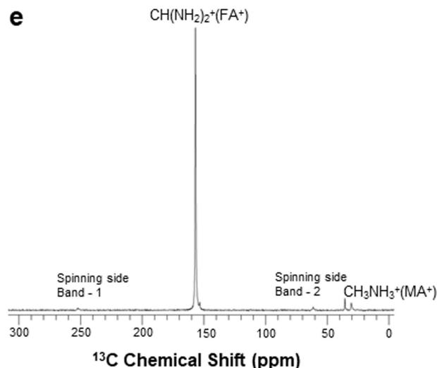  
Extended Data Fig. 2 | The composition of the Fo-FAPbI3 perovskite film. a, b, ${ } ^ { 1 } \mathsf { H } - { } ^ { 1 3 } \mathsf { C }$ cross-polarization spectra of mechanosynthesized FAPbI with $5 \%$ FAHCOO (a) and a scraped thin film of 2% Fo-FAPbI3 (b), recorded at 12 kHz MAS and 100 K. In b the formate signal can be seen as a minor shoulder on the FAPbI   
peak. A minor signal arising from the PTFE that is used to seal the rotor is also visible. c, d, TOF-SIMS measurements of the reference (c) and the $2 \%$ Fo-FAPbI (d) films. e, Quantitative, directly detected $^ { 1 3 } \mathsf { C }$ solid-state NMR measurement of 2% Fo-FAPbI scraped thin film at 12 kHz MAS and 100 K.

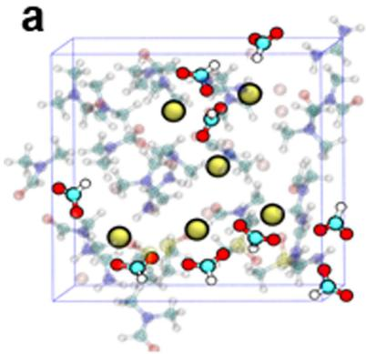

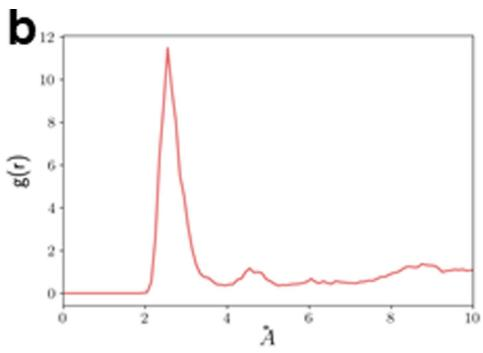

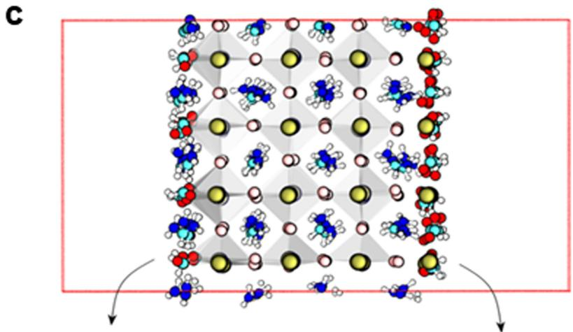

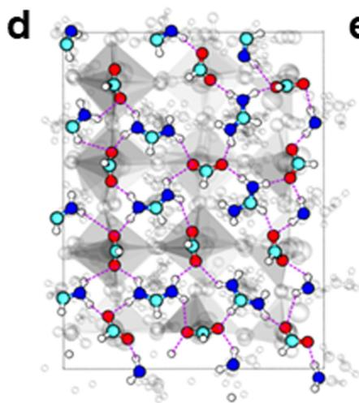

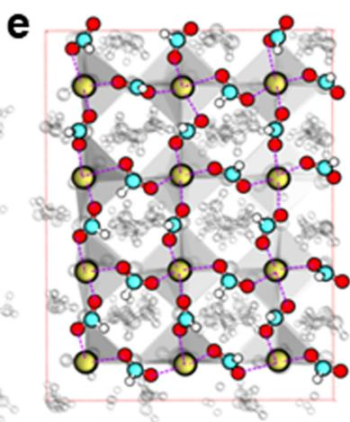  
Extended Data Fig. 3 | Ab initio molecular dynamics simulations. a, Molecular dynamics snapshot showing the coordination of $\mathsf { P b } ^ { 2 + }$ ions with HCOO− anions in the perovskite precursor solution. As a guide to the eye, we highlight only $\mathsf { P b } ^ { 2 ^ { + } }$ and HCOO− ions; the remaining ions and solvent molecules are shown as transparent. b, The radial distribution function g(r) between the oxygen atoms of HCOO− and $\mathsf { P b } ^ { 2 ^ { + } }$ over the full ab initio molecular dynamics trajectory of around 11 ps. c, Initial configuration of FAPbI with surface iodide   
replaced by HCOO− anions. d, The top view of surface atoms on the $\mathsf { F A } ^ { + }$ -terminated side. e, The top view of the surface atoms on the $\mathsf { P b } ^ { 2 ^ { + } }$ -terminated side. $\mathsf { P b } ^ { 2 + }$ –HCOO− and $\mathsf { F A } ^ { + }$ –HCOO− bonding and hydrogen-bonding networks are illustrated with magenta dashed lines. All ions are shown in ball-and-stick representation. $\mathsf { P b } ^ { 2 + }$ ions, yellow; iodide, light pink; oxygen, red; carbon, light blue; nitrogen, dark blue; sulfur, light yellow; hydrogen, white.

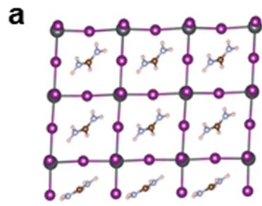

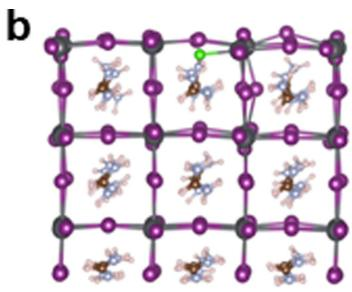

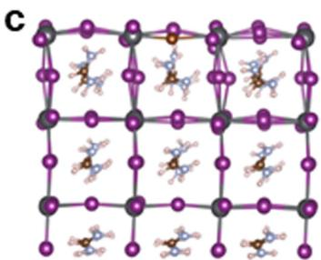

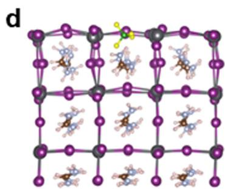

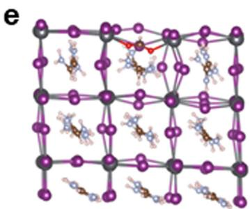

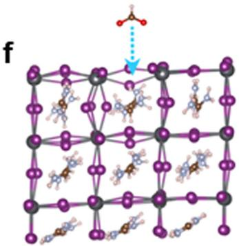

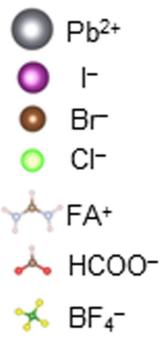

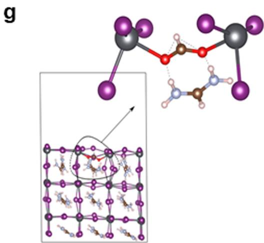

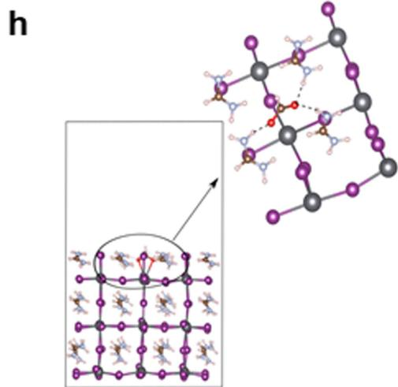  
Extended Data Fig. 4 | DFT-relaxed slabs of FAPbI3 with different anions adsorbed at an iodide-vacancy site on the surface. a, Structure of a pure FAPbI3 slab with a Pb–I terminated surface on the top and an FA–I terminated surface on the bottom side. b–e, Front view of the Cl− (b), Br− (c), BF − (d) and HCOO− (e) passivated surface. f, An illustration of iodide-vacancy passivation by HCOO− . g, h, DFT-relaxed FAPbI3 slab with HCOO− adsorbed at the   
iodide-vacancy site on the Pb–I (g) and the FA–I (h) terminated surface. All chemical species are shown in ball-and-stick representation. $\mathsf { P b } ^ { 2 ^ { + } }$ , grey; iodide, violet; oxygen, red; carbon, dark brown; nitrogen, light blue; bromide, red-brown; chloride, light green; boron atoms, dark green; fluoride, yellow; hydrogen atoms, white.

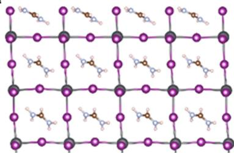  
a

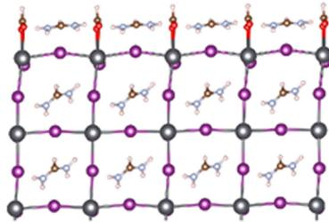  
b

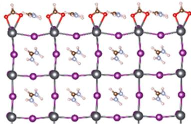  
C

Pb2+

-

Br

CF-

  
d   
e

  
f

  
Extended Data Fig. 5 | Bonding between formamidinium and different anions on the surface of FAPbI . a, Structure of a pure FAPbI slab with FA–I termination on the top and Pb–I termination on the bottom side. b, c, The front view (b) and the side view (c) of the HCOO− passivated surface. d–f, Cl− (d), Br− (e) and $\mathsf { B F _ { 4 } } ^ { - } \left( \mathbf { f } \right)$ passivated surface. All chemical species are shown in   
ball-and-stick representation. $\mathsf { P b } ^ { 2 + }$ , grey; iodide, violet; oxygen, red; carbon, dark brown; nitrogen, light blue; bromide, red-brown; chloride, light green; boron atoms, dark green; fluoride, yellow; hydrogen, white. g, Relative desorption strength of FA+ cations on different passivated surfaces.

  
Extended Data Fig. 6 | Photovoltaic performance of the PSCs under different conditions. a, J–V curve of the target PSC measured without a metal mask. b, J–V curves of the reference PSC and the PSC with $2 \%$ formamidinium

  
acetate. c, J–V curves of the reference and $2 \%$ Fo-FAPbI PSCs without the MACl additive. ${ \bf d } , J$ –V curves of the reference and the $2 \%$ Fo-FAPbI PSCs without using octylammonium iodide passivation. FF, fill factor.

  
Time (h)   
Extended Data Fig. 7 | J–V metrics of the reference and target PSCs during the operational stability test. a–c, The change $\mathrm { i n } J _ { \mathrm { s c } }$ (a), $V _ { \mathrm { o c } }$ (b) and fill factor (c) of the reference and target cells over the 450-h MPP tracking measurement.

Extended Data Table 1 | Detailed J–V parameters of the reference and target PSCs under both reverse and forward voltage scans   

<table><tr><td>Condition</td><td>Jsc(mA/cm2)</td><td>Voc(V)</td><td>FF (%)</td><td>PCE (%)</td></tr><tr><td>Reference_rev</td><td>25.72</td><td>1.153</td><td>80.69</td><td>23.92</td></tr><tr><td>Reference_for</td><td>25.31</td><td>1.156</td><td>75.69</td><td>22.13</td></tr><tr><td>Target_rev</td><td>26.35</td><td>1.189</td><td>81.70</td><td>25.59</td></tr><tr><td>Target_for</td><td>26.11</td><td>1.185</td><td>79.09</td><td>24.47</td></tr></table>

# Article

Extended Data Table 2 | Detailed J–V parameters of the reference and target PSCs under different light intensities   

<table><tr><td></td><td>Light intensity (mW/cm2)</td><td>Jsc(mA/cm2)</td><td>Voc(V)</td><td>FF (%)</td><td>PCE (%)</td></tr><tr><td rowspan="5">Reference</td><td>100</td><td>25.49</td><td>1.151</td><td>77.1</td><td>22.62</td></tr><tr><td>50</td><td>13.69</td><td>1.128</td><td>78.1</td><td></td></tr><tr><td>31.6</td><td>8.65</td><td>1.109</td><td>78.4</td><td></td></tr><tr><td>10</td><td>2.98</td><td>1.061</td><td>77.8</td><td></td></tr><tr><td>5</td><td>1.55</td><td>1.030</td><td>76.1</td><td></td></tr><tr><td rowspan="5">Target</td><td>100</td><td>25.60</td><td>1.174</td><td>83.4</td><td>25.06</td></tr><tr><td>50</td><td>13.33</td><td>1.151</td><td>84.4</td><td></td></tr><tr><td>31.6</td><td>8.51</td><td>1.137</td><td>84.2</td><td></td></tr><tr><td>10</td><td>2.91</td><td>1.104</td><td>84.1</td><td></td></tr><tr><td>5</td><td>1.48</td><td>1.081</td><td>83.6</td><td></td></tr></table>