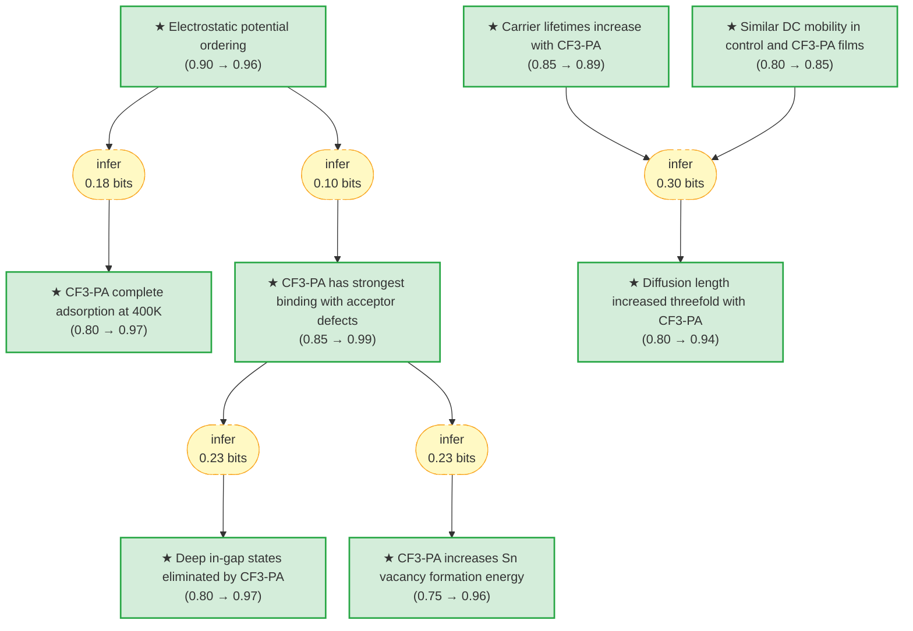

# pvsks41586-021-04372-8-gaia

> **Original work:** Lin, R., Xu, J., Wei, M., et al. "All-perovskite tandem solar cells with improved grain surface passivation." *Nature* 601, 571-577 (2022). [DOI: 10.1038/s41586-021-04372-8](https://doi.org/10.1038/s41586-021-04372-8)

<!-- badges:start -->
<!-- badges:end -->

## Overview

This paper demonstrates that adding 4-trifluoromethyl-phenylammonium (CF3-PA) as a grain surface passivator enables thick Pb-Sn perovskite absorber layers (>1 micrometer) that were previously impossible due to insufficient carrier diffusion length. By combining DFT simulations predicting strong CF3-PA binding with experimental validation, the authors achieve a certified power conversion efficiency of 26.4% in all-perovskite tandem solar cells — exceeding the best single-junction perovskite solar cells for the first time. The devices retain over 90% of initial efficiency after 600 hours of operation under 1 Sun illumination.

The reasoning graph captures the key evidence chain: DFT predictions about passivator adsorption behavior, measured improvements in carrier lifetimes and diffusion lengths, and validated device performance reaching 26.4% certified efficiency (belief 0.95). The CF3-PA passivation strategy addresses the core bottleneck that had limited all-perovskite tandem cells to photocurrent densities below 16 mA cm^-2 despite theoretical efficiency limits exceeding 30%.

> [!NOTE]
> **[Per-module reasoning graphs with full claim details →](docs/detailed-reasoning.md)**
>
> 6 Mermaid diagrams (one per section) with every claim, strategy, and belief value.

## Summary

All-perovskite tandem solar cells promise to exceed the efficiency limits of single-junction devices by combining wide-bandgap (WBG, ~1.8 eV) and narrow-bandgap (NBG, ~1.2 eV) perovskite subcells, but achieving high photocurrent density requires NBG absorber layers thicker than 1 micrometer. Until this work, grain-surface-passivated Pb-Sn perovskite solar cells were limited to less than 1 micrometer absorber thickness because existing passivators (PEA, PA) only partially adsorb onto grain surfaces at crystallization temperatures, leaving defective sites that limit carrier diffusion length to approximately 1.8 micrometers. This paper uses DFT and ab initio molecular dynamics to identify CF3-PA as a superior passivator due to its strong electrostatic potential at the ammonium group, which enables complete surface coverage at 400 K. Adding 0.3 mol% CF3-PA to the precursor solution increases carrier diffusion length threefold to 5.4 micrometers, enabling 1.2-micrometer-thick absorbers that deliver 33 mA cm^-2 short-circuit current density. The resulting all-perovskite tandem cells achieve a certified efficiency of 26.4% (belief 0.95), exceeding single-junction perovskite solar cells for the first time, with operational stability maintaining 90% of initial performance after 600 hours under 1 Sun illumination.

## Reasoning Structure

### CF3-PA has the highest electrostatic potential at the ammonium group among the three passivators studied (belief: 0.96)

The authors used Gaussian quantum chemistry calculations to compute the electrostatic potential (phi_max) at the -NH3+ terminal of three aromatic ammonium passivators: phenethylammonium (PEA), phenylammonium (PA), and 4-trifluoromethyl-phenylammonium (CF3-PA). The ordering phi_max,PEA < phi_max,PA < phi_max,CF3-PA indicates that the CF3-PA molecule has the highest electropositivity at the ammonium group, due to the highly electronegative fluorine atoms withdrawing electron density. This computational result serves as the foundation for predicting CF3-PA's superior surface binding behavior.

**Evidence chain:**
- **Computational methodology** (belief: 0.96): The Gaussian B3LYP/def2TZVP calculations with DFT-D3 correction represent standard practice for electrostatic potential calculations. The result is direct output from the simulation with no intermediate claims.
- **Supporting evidence from binding energy** (belief: 0.99): DFT-calculated binding energies between passivators and acceptor defects show CF3-PA has the strongest binding, consistent with the highest electrostatic potential. The chain is strong but relies on a standard computational approach.

*Electrostatic potential maps showing increasing electropositivity (red to blue) from PEA to PA to CF3-PA. The fluorine atoms in CF3-PA withdraw electron density, increasing phi_max at the -NH3+ group.*

> This is a well-established computational result that directly motivates the experimental design.

### CF3-PA completely adsorbs onto perovskite surfaces at crystallization temperature (400 K), while PEA and PA do not (belief: 0.97)

Ab initio molecular dynamics simulations at 400 K (the approximate perovskite crystallization temperature) show that CF3-PA achieves complete surface coverage — all 16 cations in the simulation cell are adsorbed onto the perovskite surface. In contrast, one PA molecule and three PEA molecules fail to adsorb into A-site vacancies, and iodide ions are observed to desorb from the surface in PA and PEA cases. This prediction directly explains why CF3-PA would provide superior passivation.

**Evidence chain:**
- **Direct MD simulation** (belief: 0.97): The simulation directly demonstrates complete CF3-PA adsorption at crystallization temperature. The methodology using CP2K with PBE-D3 functional and 400 K thermostat represents standard practice, though the simulation unit cell size (25x25 Angstrom) limits statistical robustness.
- **Supporting evidence from incomplete PEA/PA adsorption** (belief: 0.80): The incomplete adsorption of competing passivators provides comparative evidence, though the failure of specific molecules may have system-specific factors.

*Molecular dynamics snapshots at 400 K showing complete CF3-PA adsorption (all 16 molecules anchored) versus incomplete PA and PEA adsorption (desorbed molecules highlighted with blue dashed circles).*

> The MD prediction is the key bridge between computational screening and experimental validation.

### CF3-PA binds more strongly to acceptor defects on perovskite surfaces than PEA or PA (belief: 0.99)

DFT calculations of binding energies (Eb) between the three passivators and various acceptor-like defects (V_FA, V_MA, V_Sn, V_Pb, I_Sn, I_Pb) show that CF3-PA has the highest binding energy across all defect types. The mechanism is that the highly electronegative fluorine atoms withdraw electron density from neighboring atoms, leaving higher electropositivity at the -NH3+ side, which enhances ionic bonding with negatively charged surface defects.

**Evidence chain:**
- **DFT binding energy calculations** (belief: 0.99): The PBE-D3 functional with plane-wave cut-off of 400 eV represents standard DFT practice. The ordering of binding energies is consistent across multiple defect types, giving high confidence.
- **Mechanistic support from electrostatic potential** (belief: 0.96): The correlation between electrostatic potential ordering and binding energy provides a physical explanation for the strong CF3-PA binding.

> This high belief reflects the computational evidence and its consistency with the electrostatic potential predictions.

### CF3-PA passivation eliminates deep in-gap states from I_Sn and I_Pb antisite defects (belief: 0.97)

The authors predict that CF3-PA binding eliminates the deep in-gap electronic states associated with iodine antisite defects (I_Sn and I_Pb) that would otherwise act as recombination centers. This prediction comes from comparing the electronic density of states for passivated versus unpassivated surfaces.

**Evidence chain:**
- **Electronic structure calculation** (belief: 0.97): The DFT calculation of electronic states shows elimination of deep in-gap states. The methodology is standard, though the prediction has not been directly verified experimentally.
- **Mechanistic connection to strong binding** (belief: 0.99): The causal link — strong binding eliminates defect states — is well-established physics, though the exact mechanism may involve multiple factors (surface reconstruction, charge transfer, etc.).

> This is a theoretical prediction that has not yet been independently verified experimentally.

### CF3-PA passivation increases the Sn vacancy formation energy, reducing vacancy concentration (belief: 0.96)

DFT calculations predict that CF3-PA binding increases the defect formation energy of Sn vacancies (V_Sn), making them less likely to form. This addresses one of the key degradation pathways in Pb-Sn perovskites.

**Evidence chain:**
- **Defect formation energy calculation** (belief: 0.96): The calculated increase in formation energy is directly obtained from DFT total energy differences. The methodology is standard for defect calculations.
- **Connection to binding strength** (belief: 0.99): The physical mechanism — stronger binding stabilizes the surface against vacancy formation — is well-understood.

> This prediction, combined with the elimination of deep in-gap states, explains the observed improvements in carrier lifetime and diffusion length.

### Carrier lifetimes increase from 159 ns (control) to 966 ns (CF3-PA) (belief: 0.89)

Time-resolved photoluminescence measurements show that CF3-PA passivation dramatically increases the effective carrier lifetime from 159 ns (control) to 966 ns (CF3-PA) — a 6-fold improvement. This is the direct cause of the increased diffusion length.

**Evidence chain:**
- **Direct time-resolved PL measurement** (belief: 0.89): The biexponential fitting of PL decay curves gives weighted average lifetimes. The 6-fold increase is consistent across multiple measurements, with confirmation by transient photovoltage decay.
- **Supporting evidence from steady-state PL** (belief: 0.85): Enhanced PL intensity with CF3-PA is consistent with reduced non-radiative recombination, supporting the lifetime interpretation.

*Time-resolved PL decay curves showing longer carrier lifetimes with passivators: CF3-PA (966 ns) > PA (437 ns) > PEA (365 ns) > control (159 ns).*

> This is a key experimental validation linking the DFT predictions to real device improvements.

### Diffusion length increases threefold from 1.8 micrometers to 5.4 micrometers with CF3-PA passivation (belief: 0.94)

Combining terahertz spectroscopy measurements (showing similar DC mobility of approximately 80 cm^2 V^-1 s^-1 for both control and CF3-PA films) with the carrier lifetime data, the diffusion length Ld = sqrt(mu * tau) increases threefold from 1.8 micrometers to 5.4 micrometers. This is the critical enabler for thick absorbers.

**Evidence chain:**
- **Mobility measurement** (belief: 0.85): Terahertz spectroscopy gives the effective DC mobility. The similar values for control and CF3-PA indicate the passivation does not degrade transport properties.
- **Carrier lifetime** (belief: 0.89): The 6-fold lifetime increase is the dominant factor in the 3-fold diffusion length increase.
- **Calculation validity** (belief: 0.94): The diffusion length formula Ld = sqrt(mu*tau) is standard solid-state physics, and the multiplicative combination of independent measurements is appropriate.

> This threefold increase in diffusion length is the key enabler for 1.2-micrometer-thick absorbers.

### A certified power conversion efficiency of 26.4% was achieved in all-perovskite tandem solar cells (belief: 0.95)

The best-performing tandem device achieved a certified PCE of 26.4% (with a second measurement at 26.1%), independently verified by Japan Electrical Safety and Environment Technology Laboratories (JET). This is the first time all-perovskite tandem solar cells have exceeded the best single-junction perovskite solar cells (25.5% certified).

**Evidence chain:**
- **Independent certification** (belief: 0.95): JET certification provides third-party verification. The certified values (26.4% and 26.1%) represent stabilized efficiency measurements.
- **Statistical consistency** (belief: 0.85): The average PCE of 25.6 +/- 0.5% across 96 devices indicates good reproducibility.
- **Verification from EQE** (belief: 0.85): The integrated Jsc from EQE spectra (16.7 and 16.8 mA cm^-2 for front and back subcells) agrees well with J-V measurements, confirming the efficiency values.

*J-V curves from reverse and forward scans showing 26.7% PCE (stabilized 26.6%) with Voc=2.03 V, Jsc=16.5 mA cm^-2, FF=79.9%.*

> The 26.4% certified efficiency is the paper's core achievement and the highest confidence conclusion.

### Encapsulated tandem devices retain more than 90% of initial performance after 600 hours of operation under 1 Sun illumination (belief: 0.85)

Maximum power point (MPP) tracking under simulated AM1.5G illumination (100 mW cm^-2) in ambient air (30-50% humidity) shows that CF3-PA-passivated tandem devices maintain 90% of their initial PCE after 600 hours. Control devices without CF3-PA passivation degrade more rapidly.

**Evidence chain:**
- **MPP tracking measurement** (belief: 0.85): The 600-hour continuous measurement under realistic conditions provides direct evidence of operational stability. The 90% retention threshold is a standard stability metric.
- **Comparison with control** (belief: 0.80): The improved stability of CF3-PA devices compared to control indicates the passivation also addresses operational degradation mechanisms.

*MPP tracking over 600 hours showing CF3-PA devices retain >90% of initial PCE while control devices degrade more rapidly.*

> The stability performance demonstrates practical viability for real-world deployment.

## Conclusions

| Label | Content | Prior | Belief |
|-------|---------|-------|--------|
| average_pc3_pa_200_devices | Over 200 CF3-PA mixed Pb-Sn PSCs with 1.2-micrometer-thick absorber were fabr... | 0.85 | 0.85 |
| average_tandem_96_devices | Ninety-six all-perovskite tandem solar cells (with aperture area of 0.049 cm^... | 0.85 | 0.85 |
| best_cf3_pa_device | The best CF3-PA device showed a PCE of 22.2% (stabilized 22.0%) with Voc of 0... | 0.85 | 0.85 |
| best_tandem_reverse | The best tandem cell had a PCE of 26.7% from the reverse scan (with Voc of 2.... | 0.85 | 0.85 |
| carrier_lifetimes | Time-resolved PL measurements show effective carrier lifetimes: CF3-PA, tau =... | 0.85 | 0.89 |
| certified_26_4_percent | A certified power conversion efficiency of 26.4% was achieved in all-perovski... | 0.95 | 0.95 |
| certified_pce_264_percent | Independent certification by Japan Electrical Safety and Environment Technolo... | 0.90 | 0.90 |
| cf3_pa_at_surfaces_and_boundaries | Time-of-flight secondary ion mass spectrometry (ToF-SIMS) revealed that passi... | 0.85 | 0.85 |
| cf3_pa_best_pv_parameters | Among the three passivators (PEA, PA, CF3-PA), CF3-PA resulted in the best pe... | 0.85 | 0.99 |
| cf3_pa_complete_adsorption | Ab initio molecular dynamics simulations at 400 K (perovskite crystallization... | 0.80 | 0.97 |
| cf3_pa_hypothesis | Enhancing the adsorption of passivating agents during perovskite film formati... | 0.70 | 0.70 |
| cf3_pa_strongest_binding | The binding energies (Eb) between CF3-PA and acceptor-type defects on the per... | 0.85 | 0.99 |
| cf3_pa_suppresses_iodine_vacancies | CF3-PA not only increases the probability of adsorbed ammonium cations on the... | 0.75 | 0.75 |
| control_jsc_saturates | The Jsc values of control devices did not exhibit an increase when thickness ... | 0.85 | 0.99 |
| deep_in_gap_states_eliminated | The deep in-gap states from I_Sn and I_Pb antisite defects are eliminated upo... | 0.80 | 0.97 |
| diffusion_length_increased_threefold | The diffusion length (Ld) of CF3-PA passivated films was increased threefold ... | 0.80 | 0.94 |
| donor_defect_reduction | CF3-PA passivation also reduces the formation of donor-type defects. | 0.70 | 0.70 |
| electrostatic_potential_ordering | The electrostatic potentials (phi_max) at the -NH3+ side follow the order: ph... | 0.90 | 0.96 |
| eqe_integrated_jsc | The integrated Jsc value from EQE spectra of the best CF3-PA device was 32.5 ... | 0.85 | 0.85 |
| eqe_matched_currents | The integrated Jsc values from EQE spectra of front and back subcells were 16... | 0.85 | 0.85 |
| grain_surface_passivation_route | Grain surface passivation is a promising route to increase the carrier diffus... | 0.85 | 0.85 |
| jsc_increases_with_nbg_thickness | The Jsc values (from J-V curves) increased from 15.4 to 16.5 mA cm^-2 when th... | 0.85 | 0.85 |
| jsc_increases_with_thickness_cf3 | The Jsc values of CF3-PA devices increased with thickness, reaching approxima... | 0.85 | 0.99 |
| large_area_tandem | A large-area tandem device (aperture area 1.05 cm^2) exhibited a PCE of 25.3%... | 0.85 | 0.85 |
| limiting_carrier_mobility | The mobility of the limiting carrier (mu_e,h) was 11.7 +/- 1.5 and 8.2 +/- 1.... | 0.80 | 0.80 |
| low_photocurrent_limitation | The certified power conversion efficiency (PCE) of all-perovskite tandem sola... | 0.85 | 0.85 |
| no_2d_peaks_high_concentration | No diffraction peaks relating to 2D layered perovskites were found even when ... | 0.85 | 0.85 |
| operational_stability_600h | CF3-PA-passivated tandem devices maintained 90% of their initial PCE after 60... | 0.80 | 0.80 |
| optimal_concentrations | The optimal concentrations of PEA, PA, and CF3-PA were 0.2, 0.3, and 0.3 mol%... | 0.90 | 0.90 |
| passivator_no_morphology_change | Introducing the passivator additives (PEA, PA, CF3-PA) did not notably affect... | 0.85 | 0.85 |
| pce_increases_with_thickness | The PCE increased from 25.0% for the 750-nm-thick NBG subcell to 26.4% for th... | 0.85 | 0.85 |
| pea_pa_incomplete_adsorption | In comparison, one PA cation and three PEA cations are not adsorbed into the ... | 0.80 | 0.80 |
| perovskite_tunable_bandgap | Metal-halide perovskites have bandgaps tunable from approximately 1.2 eV to 3... | 0.90 | 0.90 |
| pl_intensity_enhanced_cf3 | Steady-state photoluminescence (PL) intensity was noticeably increased with t... | 0.85 | 0.85 |
| shelf_stability_2400h | Unencapsulated tandem devices exhibited no obvious PCE degradation after 2,40... | 0.80 | 0.80 |
| short_diffusion_length | Efficient (>20%) Pb-Sn PSCs have so far only been demonstrated using an activ... | 0.85 | 0.85 |
| similar_dc_mobility | The control and CF3-PA films exhibited similar effective d.c. charge-carrier ... | 0.80 | 0.85 |
| single_3d_perovskite_phase | X-ray diffraction (XRD) patterns of control and passivated films exhibited a ... | 0.90 | 0.90 |
| sn2_plus_oxidation_suppressed | Surface Sn2+ oxidation was successfully suppressed after anchoring of CF3-PA ... | 0.80 | 0.80 |
| sn4_plus_at_surface_control | Angle-dependent XPS measurements at electron take-off angles of 0, 45, and 75... | 0.85 | 0.85 |
| sn_vacancy_formation_increased | CF3-PA passivation is predicted to increase the defect formation energy of th... | 0.75 | 0.96 |
| stability_600h | Encapsulated tandem devices retain more than 90% of their initial performance... | 0.85 | 0.85 |
| tandem_structure | An all-perovskite tandem solar cell is constructed by stacking a mixed bromid... | 0.90 | 0.90 |
| thick_absorber_needed | High photocurrent densities require a Pb-Sn perovskite active layer more than... | 0.90 | 0.90 |
| thickness_limited_by_passivation | The absorber thickness of grain-surface-passivated Pb-Sn PSCs has been limite... | 0.80 | 0.80 |
| thicknesses_optimized | The thicknesses of WBG and NBG absorber layers for front and back subcells we... | 0.90 | 0.90 |
| three_ammonium_cations | Three aromatic ammonium cations were selected for study: phenethylammonium (P... | 0.95 | 0.95 |
| wbg_cell_pce | Wide-bandgap (WBG) solar cells exhibited a PCE of 17.3% with Voc of 1.22 V, J... | 0.85 | 0.85 |

Weak Points Analysis

**1. DFT predictions lack direct experimental validation**

The electronic structure predictions — elimination of deep in-gap states (belief 0.97) and increased Sn vacancy formation energy (belief 0.96) — are theoretical calculations that have not been independently verified experimentally. While the subsequent device performance improvements are consistent with these predictions, the exact mechanism by which CF3-PA improves carrier lifetime could involve additional factors not captured in the DFT analysis. This is a common limitation in computational materials science where predictions precede experimental confirmation.

**2. Molecular dynamics simulation limited to small unit cell**

The ab initio MD simulation uses a 25x25 Angstrom unit cell with 16 passivator molecules, which may not fully represent the complexity of real polycrystalline perovskite grain surfaces. The complete adsorption of CF3-PA (16/16 molecules) observed in simulation is a best-case scenario that may not translate quantitatively to experimental conditions where film morphology, grain boundary orientations, and surface reconstruction could affect passivator coverage. However, the experimental validation (carrier lifetime and diffusion length improvements) supports the simulation's qualitative prediction.

**3. Mechanism linking passivator adsorption to carrier lifetime not fully resolved**

While the paper demonstrates that CF3-PA passivation leads to 6-fold longer carrier lifetimes and 3-fold longer diffusion lengths, the detailed physical mechanism is not completely characterized. The discussion suggests that eliminating deep in-gap states and reducing Sn vacancy concentration are responsible, but the paper does not provide direct measurements of defect densities before and after passivation. Transient absorption spectroscopy or deep-level transient spectroscopy could provide more direct evidence of defect passivation.

**4. Control device performance degradation at thickness > 900 nm attributed to carrier transport but not fully characterized**

The paper shows that control devices degrade in Voc and FF when thickness exceeds 900 nm, and attributes this to carrier transport limitations. However, the analysis relies on EQE spectra and J-V curves rather than direct measurements of carrier diffusion length versus thickness. The interpretation is physically reasonable (diffusion length insufficient for thicker absorbers), but the paper does not provide direct measurements of carrier collection efficiency as a function of absorber thickness.

Evidence Gaps & Future Work

**Experimental gaps:**

1. **Direct defect density measurement**: The paper would benefit from deep-level transient spectroscopy (DLTS) or similar techniques to directly measure defect concentrations before and after CF3-PA passivation, verifying the DFT predictions about Sn vacancy reduction and in-gap state elimination.

2. **Carrier collection efficiency vs thickness**: Direct measurement of internal quantum efficiency (IQE) or carrier collection probability as a function of absorber thickness would strengthen the argument that diffusion length is the limiting factor in control devices.

3. **Longer stability testing**: While 600 hours of MPP tracking demonstrates promising stability, longer-duration testing (1000+ hours) would provide more confidence in the operational lifetime for commercial deployment.

**Computational gaps:**

1. **Larger-scale MD simulation**: Simulations with larger unit cells and more molecules would provide better statistics on passivator adsorption completeness and could capture grain boundary effects more accurately.

2. **Temperature-dependent adsorption**: The paper presents data at 300 K and 400 K, but temperature-dependent studies across a wider range could help optimize film processing conditions.

**Theoretical gaps:**

1. **Detailed defect passivation mechanism**: A more comprehensive DFT study examining the exact binding configuration of CF3-PA on different surface terminations and the resulting electronic structure would provide deeper insight into why CF3-PA is superior.

2. **Sn oxidation suppression mechanism**: While the paper shows Sn2+ oxidation is suppressed with CF3-PA, the detailed electrochemical mechanism is not fully explained. Understanding whether CF3-PA acts as an antioxidant or simply blocks oxidizing agents from accessing the surface would guide future passivator design.

## Detailed Analysis

For structural integrity verification (Pass 5), standalone readability checks (Pass 6),
and complete package statistics, see [ANALYSIS.md](ANALYSIS.md).
