# All-perovskite tandem solar cells with improved grain surface passivation

https://doi.org/10.1038/s41586-021-04372-8

Received: 1 August 2021

Accepted: 20 December 2021

Published online: 17 January 2022

Check for updates

Renxing Lin1,8, Jian $\mathbf { x } _ { \mathbf { u } } \mathbf { \varepsilon } ^ { 2 , 8 }$ , Mingyang Wei2,8, Yurui Wang1,8, Zhengyuan Qin3,8, Zhou Liu1 , Jinlong Wu1 , Ke Xiao1,4, Bin Chen2 , So Min Park2 , Gang Chen5 , Harindi R. Atapattu6 , Kenneth R. Graham6 , Jun Xu4 , Jia Zhu1 , Ludong Li1 , Chunfeng Zhang3 , Edward H. Sargent2 ✉ & Hairen Tan1,7 ✉

All-perovskite tandem solar cells hold the promise of surpassing the efciency limits of single-junction solar cells1–3 ; however, until now, the best-performing all-perovskite tandem solar cells have exhibited lower certifed efciency than have single-junction perovskite solar cells4,5 . A thick mixed Pb–Sn narrow-bandgap subcell is needed to achieve high photocurrent density in tandem solar cells6 , yet this is challenging owing to the short carrier difusion length within Pb–Sn perovskites. Here we develop ammonium-cation-passivated Pb–Sn perovskites with long difusion lengths, enabling subcells that have an absorber thickness of approximately $1 . 2 \mu \mathrm { m }$ . Molecular dynamics simulations indicate that widely used phenethylammonium cations are only partially adsorbed on the surface defective sites at perovskite crystallization temperatures. The passivator adsorption is predicted to be enhanced using 4-trifuoromethyl-phenylammonium (CF3-PA), which exhibits a stronger perovskite surface-passivator interaction than does phenethylammonium. By adding a small amount of CF3-PA into the precursor solution, we increase the carrier difusion length within Pb–Sn perovskites twofold, to over $5 \mu \mathrm { m }$ , and increase the efciency of Pb–Sn perovskite solar cells to over $22 \%$ . We report a certifed efciency of $2 6 . 4 \%$ in all-perovskite tandem solar cells, which exceeds that of the best-performing single-junction perovskite solar cells. Encapsulated tandem devices retain more than $90 \%$ of their initial performance after 600 h of operation at the maximum power point under 1 Sun illumination in ambient conditions.

Metal-halide perovskites are emerging photovoltaic (PV) materials that are suitable for tandem solar cell applications: their bandgaps can be tuned from approximately 1.2 eV to 3.0 eV through compositional engineering2 . An all-perovskite tandem solar cell is constructed by stacking a mixed bromide/iodide wide-bandgap (WBG, approximately 1.8 eV) perovskite front cell and a mixed lead–tin (Pb–Sn) narrow-bandgap (NBG, approximately 1.2 eV) perovskite back cell4,7 . All-perovskite tandem solar cells unite low-cost solution processing with the prospect of high efficiency8 . Despite this promise, the certified power conversion efficiency (PCE) of all-perovskite tandem solar cells has yet to surpass that of single-junction perovskite solar cells (PSCs) (which have a highest certified PCE of $2 5 . 5 \% )$ 9 , a limitation that is dominated by the low photocurrent density (below $1 6 \mathsf { m A c m } ^ { - 2 }$ ) seen in all-perovskite tandem solar cells to date4,10–13. Considering the current-matching condition, high photocurrent densities will require a Pb–Sn perovskite active layer more than 1 μm thick in the bottom subcell (Extended Data Fig. 1). However, efficient $( > 2 0 \% )$ Pb–Sn PSCs have so far only been demonstrated using an active-layer thickness of less than $1 \mu \mathrm { m }$ (refs. 6,10,11,13–15). We reason that this is due to the short carrier diffusion length of

polycrystalline Pb–Sn perovskite thin films: the carrier diffusion length should be several times the absorber thickness to ensure sufficient charge transport and good PV performance in $\mathsf { P S C S } ^ { 1 6 , 1 7 }$ .

Grain surface passivation is a promising route to increase the carrier diffusion length of perovskite films13,18, given that grain surfaces (film surface and grain boundaries) exhibit a trap density one to several orders of magnitude higher than that within the grain19–22. Two-dimensional (2D) perovskites, Lewis bases/acids23 and zwitterions10 have been used for the passivation of Pb–Sn perovskites, all of which are approaches that address deep traps and reduce $\mathsf { S } \mathsf { n } ^ { 2 + }$ oxidation24–26. However, until now, the absorber thickness of grain-surface-passivated Pb–Sn PSCs has been limited to less than $1 \mu \mathrm { m }$ in optimized devices10,11,15,27. This we attribute to insufficient defect passivation: a certain amount of surface area remains unpassivated, due to the incomplete adsorption of passivating agent into the defective sites during film formation28. We posit that enhancing the adsorption of passivating agents during perovskite film formation—in effect, increasing the completeness of the coverage using passivators, ensuring that they fully interact with the defective sites on the grain surfaces—could further improve passivation and thus

1 National Laboratory of Solid State Microstructures, Collaborative Innovation Center of Advanced Microstructures, Jiangsu Key Laboratory of Artificial Functional Materials, College of Engineering and Applied Sciences, Nanjing University, Nanjing, China. 2 Department of Electrical and Computer Engineering, University of Toronto, Toronto, Ontario, Canada. 3 School of Physics, Nanjing University, Nanjing, China. 4 School of Electronic Science and Engineering, Nanjing University, Nanjing, China. 5 School of Physical Science and Technology, Shanghai Tech University, Shanghai, China. 6 Department of Chemistry, University of Kentucky, Lexington, Kentucky, USA. 7 Frontiers Science Center for Critical Earth Material Cycling, Nanjing University, Nanjing, China. 8 These authors contributed equally: Renxing Lin, Jian Xu, Mingyang Wei, Yurui Wang, Zhengyuan Qin. ✉e-mail: ted.sargent@utoronto.ca; hairentan@nju.edu.cn

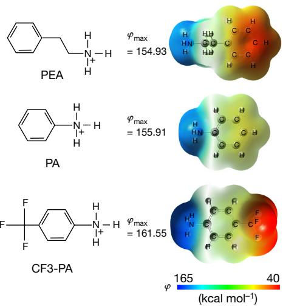  
a

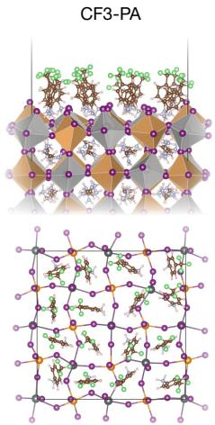  
c

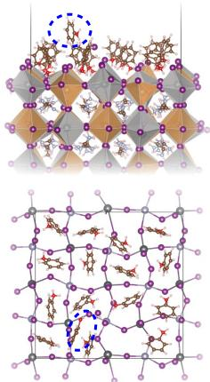  
PA

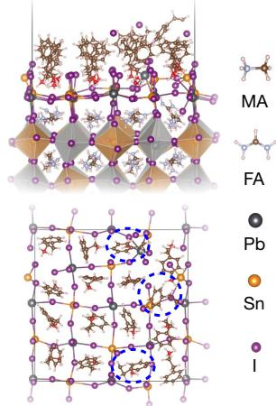  
PEA

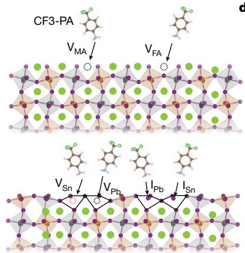  
b

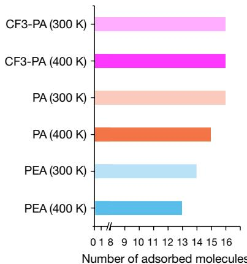

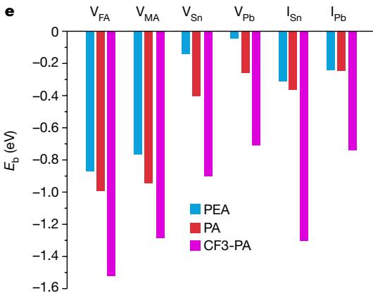  
Fig. 1 | Interaction between passivator and Pb–Sn perovskite surface. a, The molecular structures of three passivators (PEA, PA and CF3-PA). PA and CF3-PA exhibit molecular structures similar to that of PEA, but without any alkyl chain between the benzene ring and ammonium group. Corresponding Gaussian calculated electrostatic potentials $( \varphi )$ are shown. The right colour bar from red to blue marks the increase of electropositivity. b, Schematic diagram of the interaction between ammonium cations with the acceptor-like defects, that is, formamidinium (FA) vacancy $( \mathsf { V } _ { \mathtt { F A } } )$ , methylammonium (MA) vacancy $( \mathsf { V } _ { \mathrm { M A } } )$ , Sn vacancy $( \mathsf { V } _ { \mathsf { S n } } )$ , Pb vacancy $( \mathsf { V } _ { \mathrm { P b } } )$ , I substituted at Sn site $( \boldsymbol { \mathrm { I } } _ { \mathrm { S n } } )$ and I substituted at   
Pb site $\mathrm { ( I _ { P b } ) }$ . Both the A-I and B-I terminated (001) perovskite surfaces are considered. c, Ab initio molecular dynamics snapshots and top views of the CF3-PA, PA and PEA adsorbed perovskite surfaces at a temperature of 400 K. F atoms, green; N atoms in PA and PEA cations, red. The desorbed molecules are highlighted with blue dashed circles in the top views. d, The number of adsorbed molecules for CF3-PA, PA and PEA at temperatures of 300 and 400 K. A molecule number of 16 represents complete surface coverage in the simulation unit. e, The binding energy $( E _ { \mathrm { { b } } } )$ between passivators and various acceptor-like defects.

increase the diffusion length in thick Pb–Sn perovskite films. This will enable thicker absorber layers in Pb–Sn PSCs and thus higher matched photocurrent densities in all-perovskite tandem solar cells. We note that this requires further progress to be made in the rational molecular design of passivators. Previous works have designed passivating molecules based on a static picture of the interaction between passivators and perovskite surfaces29; here we instead explore the dynamic process of passivator adsorption on grain surfaces using ab initio molecular dynamic simulations, an approach that guided our experimental design.

# Density functional theory studies

Here we investigated the passivation capability of ammonium cations for mixed Pb–Sn perovskite surfaces30–32. Three aromatic ammonium cations, phenethylammonium (PEA), phenylammonium (PA) and 4-trifluoromethyl-phenylammonium (CF3-PA), were selected to study how the molecular properties influence the adsorption and binding on mixed Pb–Sn perovskite surfaces (Fig. 1a). The electrostatic potentials $( \varphi _ { \mathrm { m a x } } )$ at the $\mathrm { - N H } _ { 3 } ^ { + }$ side are different for the three passivators: $\varphi _ { \mathrm { m a x , P E A } } < \varphi _ { \mathrm { m a x , P A } } < \varphi _ { \mathrm { m a x , C F 3 \cdot P A } }$ (Fig. 1a). We posited that this electrostatic potential difference could affect the surface adsorption of ammonium cations33. We carried out density functional theory (DFT) simulations

to study the surface adsorption and defect passivation for the three ammonium cations (see details in the Methods). As illustrated in Fig. 1b, the three passivators interact with acceptor-like defects at the Pb–Sn perovskite surfaces through ionic bonding and hydrogen bonding, and are therefore anchored on the surfaces. We note that this mechanism of passivator adsorption is distinct from that of Lewis base molecules18.

The passivator adsorption is a dynamic process that occurs during perovskite crystallization at elevated temperatures. We first investigated, using ab initio molecular dynamics simulations, the dynamic process of passivator adsorption on the grain surface (see details in the Methods and Supplementary Fig. 1). CF3-PA has the strongest tendency to anchor on the perovskite surface during film formation (at a temperature of approximately 400 K), with all 16 cations adsorbed completely on the surface (Fig. 1c, d). In comparison, one PA cation and three PEA cations are not adsorbed into the A-site vacancies. Iodide ions are also seen to escape from the surface at $4 0 0 \mathsf { K }$ in the PA and PEA cases (Fig. 1c), which indicates that CF3-PA not only increases the probability of adsorbed ammonium cations on the perovskite grain surface but also suppresses the formation of iodine vacancies on the surface at elevated temperatures. Reduced iodide desorption may also suppress the formation of iodine interstitial (I ) defects34.

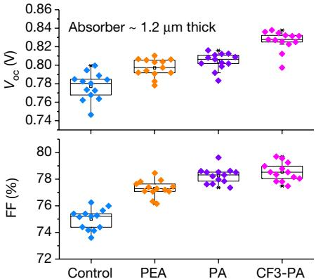  
a

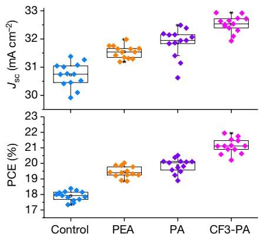

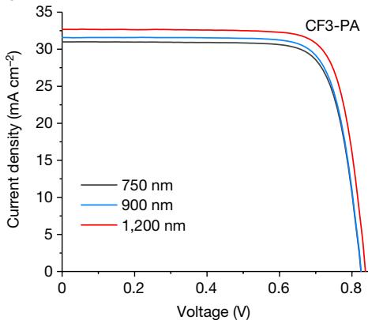  
b

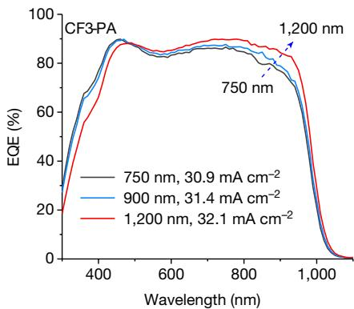  
c

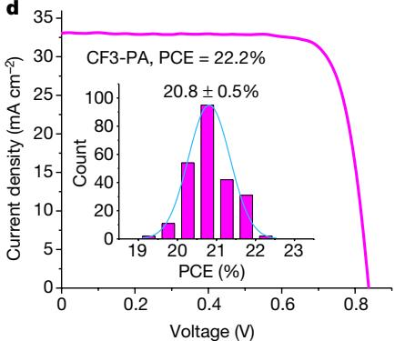

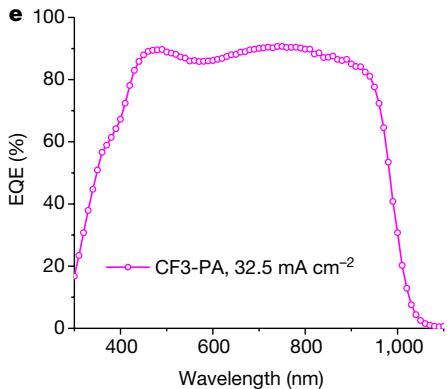  
Fig. 2 | PV performance of Pb–Sn perovskite solar cells. a, PV parameters of devices with different passivating agents (15 devices for each type). b, c, Representative J–V (b) and EQE (c) curves of CF3-PA devices with absorber   
layer thicknesses of 750, 900 and 1,200 nm. d, e, J–V (d) and EQE (e) curves of the best CF3-PA device (with 1.2-μm-thick absorber). The inset in d shows the PCE distribution of 237 CF3-PA devices, showing an average PCE of $2 0 . 8 \pm 0 . 5 \%$ .

The binding energies $( E _ { \mathrm { { b } } } )$ shown in Fig. 1e indicate that CF3-PA has the strongest binding with acceptor-type defects on the perovskite grain surface. The highly electronegative fluorine atom in CF3-PA withdraws electron density strongly from the neighbouring atoms, leaving a higher electropositivity at the $\mathrm { N H } _ { 3 } ^ { + }$ side, thus enhancing the binding with the negatively charged defects. Looking at the electronic structures, one can see that the deep in-gap states from the $\mathbf { l } _ { \mathsf { S n } }$ and $\mathbf { l _ { P b } }$ antisite defects are eliminated (Supplementary Fig. 2). In addition, CF3-PA passivation is predicted to increase the defect formation energy of the Sn vacancy $( \mathsf { V } _ { \mathsf { S n } } )$ , reducing the numbers of vacancies (Supplementary Fig. 3). CF3-PA passivation also reduces the formation of donor-type defects (Supplementary Note 1 and Supplementary Figs. 4 and 5).

# PV performance of Pb–Sn PSCs

DFT calculations indicated that CF3-PA has the potential to provide more effective grain surface passivation than does conventional PEA. To test this idea, we fabricated mixed Pb–Sn PSCs with a thick absorber layer (approximately $1 . 2 \mu \mathrm { m } )$ ) to evaluate the effect of passivating agents on materials and device characteristics. We incorporated the passivating agents onto the grain surfaces of Pb–Sn perovskite films by adding PEA, PA and CF3-PA directly into the perovskite precursor solutions (Methods). The optimal concentrations of PEA, PA and CF3-PA were 0.2, 0.3 and $0 . 3 \mathrm { m o l \% }$ , respectively (Extended Data Fig. 2).

Figure 2a and Supplementary Table 1 compare the PV parameters of the control, PEA PA and CF3-PA solar cells (15 devices for each type) with an absorber layer thickness of $1 . 2 \mu \mathrm { m }$ fabricated over several identical runs. Compared with control devices, Pb–Sn PSCs with passivating agents showed improved performance across all PV parameters. Among the three passivators investigated here, CF3-PA resulted in the best performance values of open-circuit voltage $( V _ { \mathrm { o c } } )$ , short-circuit current density $( \boldsymbol { J } _ { \mathrm { s c } } )$ , fill factor (FF) and thus PCE.

We also fabricated control and CF3-PA devices with a range of absorber thicknesses; the corresponding current density–voltage $J ^ { . }$ –V curves and PV parameters are summarized in Fig. 2b, Extended Data Fig. 3 and Supplementary Table 2. The $J _ { \mathrm { s c } }$ values of the CF3-PA devices increased with thickness, reaching approximately $3 3 \mathsf { m A c m } ^ { - 2 }$ at a thickness of $1 . 2 \mu \mathrm { m }$ . The increased J with thicker absorber is ascribed to higher light absorption at the near-infrared range, as indicated by the external quantum efficiency (EQE) spectra in Fig. 2c. By contrast, the $J _ { \mathrm { s c } }$ values of the control devices did not exhibit an increase when the thickness was increased from 900 to 1,200 nm, whereas the $V _ { \mathrm { o c } }$ and FF values (and thus PCE) dropped considerably with thickness beyond $9 0 0 \mathsf { n m }$ (Extended Data Fig. 3). This indicates that the photogenerated carrier transport limits the performance in thick devices based on the control material processing strategy (Extended Data Fig. 4a). By adding CF3-PA, we increased the diffusion length to achieve higher $J _ { \mathrm { s c } } , V _ { \mathrm { o c } }$ and FF values.

We fabricated more than 200 CF3-PA mixed Pb–Sn PSCs with $1 . 2 \mathrm { \cdot } \mu \mathrm { m }$ -thick absorber; a histogram of their PCE values is shown in the inset of Fig. 2d. The devices exhibited an average PCE of $2 0 . 8 \pm 0 . 5 \%$ , which is a narrow distribution compared with typical Pb–Sn perovskite statistics. The best CF3-PA device showed a PCE of $2 2 . 2 \%$ (stabilized $2 2 . 0 \%$ ), with a $V _ { \mathrm { o c } }$ of $0 . 8 4 1 \mathrm { V } , \mathsf { a } J _ { \mathrm { s c } }$ of $3 3 . 0 \mathsf { m A c m } ^ { - 2 }$ and a FF of $80 \%$ under reverse scan (Fig. 2d and Extended Data Fig. 4b, c). Figure 2e presents the EQE spectra of the best CF3-PA device, with the integrated $J _ { \mathrm { s c } }$ value of $3 2 . 5 \mathsf { m A c m } ^ { - 2 }$ , in good agreement with the J–V characterization.

# Characterization of Pb–Sn perovskites

To understand the improvement of device performance by passivating agents, we performed structural and optoelectronic characterization of Pb–Sn perovskite films. We first investigated the effect of passivating agents on the morphology and crystal structure of Pb–Sn perovskite films. Scanning electron microscopy (SEM) images show that

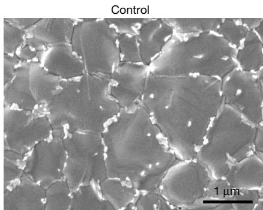  
a

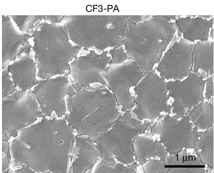  
b

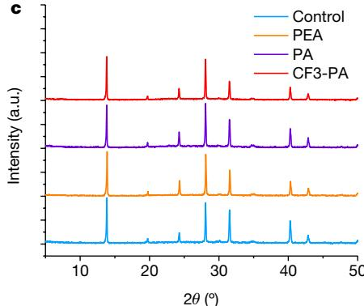

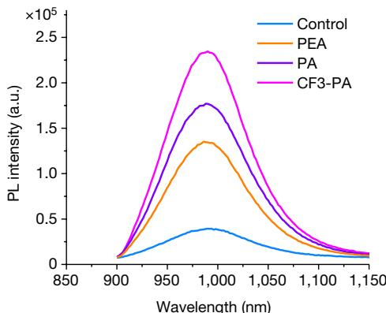  
d

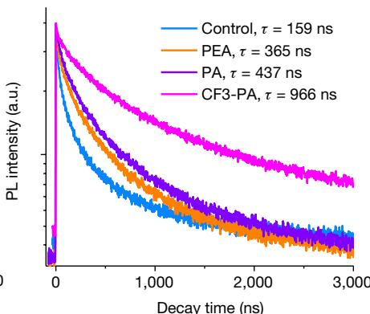  
e

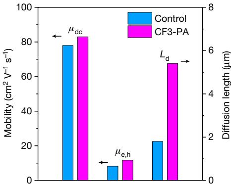  
f   
Fig. 3 | Characterization of mixed Pb–Sn perovskite films with passivating agents. a, b, SEM images of the control (a) and CF3-PA (b) perovskite films. c, XRD patterns of the control, PEA, PA and CF3-PA perovskite films. a.u., arbitrary   
units. d, e, Steady-state (d) and time-resolved (e) PL spectra of the control, PEA, PA and CF3-PA perovskite films. f, Mobilities and diffusion lengths of the CF3-PA and control Pb–Sn perovskite films.

introducing the passivator additives did not notably affect the surface morphology (Fig. 3a, b and Supplementary Fig. 6 and Extended Data Fig. 5a, b). The presence of passivating agents (for example, CF3-PA) in the perovskite films is indicated by X-ray photoelectron spectroscopy (XPS) measurements (Extended Data Fig. 5c). The spatial distribution of the CF3-PA cations within the perovskite film was investigated using time-of-flight secondary ion mass spectrometry (ToF-SIMS, Extended Data Fig. 5d). This revealed that passivators were anchored on the top and bottom film surfaces as well as at the grain boundaries within the film. X-ray diffraction (XRD) patterns of the control and the films modified by the passivating agent exhibited a single three-dimensional (3D) perovskite phase without a 2D (reduced-dimensional) phase and without non-perovskite phases (Fig. 3c and Supplementary Fig. 7). We found no diffraction peaks relating to 2D layered perovskites even when a large amount of CF3-PA (for example, $2 0 \mathrm { m o l \% }$ ) was added to the precursor solution (Supplementary Note 2 and Supplementary Fig. 8). The absence of 2D perovskite is beneficial for charge transport and extraction throughout the thick Pb–Sn perovskite absorber in solar cells. We also extended the structural characterization to different thicknesses of Pb–Sn perovskite films (Supplementary Note 2 and Supplementary Fig. 9–11). The above results indicate that the introduction of a trace amount of passivating agent is not likely to change the film formation.

To examine the extent of surface $\mathsf { S } \mathsf { n } ^ { 2 + }$ oxidation, we performed angle-dependent XPS measurements (Extended Data Fig. 6a). Spectra were recorded at electron take-off angles of $0 ^ { \circ }$ , $4 5 ^ { \mathrm { { o } } }$ and $7 5 ^ { \mathrm { { \circ } } }$ , with the probing depth varying from approximately 6–8 nm at $0 ^ { \circ }$ to 1.5–2 nm at $7 5 ^ { \mathrm { { \circ } } }$ (ref. 28). The XPS spectra for the control film only show a ${ \mathsf { S n } } ^ { 4 + }$ peak for the most surface sensitive angle at $7 5 ^ { \mathrm { { o } } }$ (Extended Data Fig. 6b), which indicates that ${ \mathsf { S n } } ^ { 4 + }$ primarily forms on the surface28. Surface $\mathsf { S } \mathsf { n } ^ { 2 + }$ oxidation was successfully suppressed after anchoring of CF3-PA on the grain surfaces (Extended Data Fig. 6f), indicating that passivation

of surface defects (for example, undercoordinated Sn atoms and Sn vacancies) could retard the Sn2+ oxidation21,30. $\mathsf { S } \mathsf { n } ^ { 2 + }$

The three passivators were then assessed using steady-state photoluminescence (PL). The PL intensity was increased noticeably with the CF3-PA passivating agent (Fig. 3d), implying suppressed non-radiative charge recombination through the defects. An enhanced PL intensity was also observed in perovskite films passivated with PEA and PA, but it was not as strong as that with CF3-PA. In addition, we carried out time-resolved PL to study the charge-carrier dynamics (Fig. 3e). The perovskite films with passivating agents exhibited effective carrier lifetimes (CF3-PA, $\scriptstyle { \tau = 9 6 6 }$ ns; PA, $\pmb { \tau } = 4 3 7$ ns; PEA, $\tau = 3 6 5$ ns) that were much longer than that of the non-passivated control film $\scriptstyle \tau = 1 5 9$ ns). The longer charge-carrier recombination lifetime with CF3-PA was also confirmed by transient photovoltage decay measurements (Supplementary Fig. 12).

We further performed femtosecond-resolved optical-pump terahertz-probe spectroscopy to obtain the carrier mobility of Pb–Sn perovskite films35–37. The control and CF3-PA films exhibited similar effective d.c. charge-carrier mobilities $( \mu _ { \mathrm { d . c . } } )$ of approximately $8 0 \mathsf { c m } ^ { 2 } \mathsf { V } ^ { - 1 } \mathsf { s } ^ { - 1 }$ , where $\mu _ { \mathrm { d . c . } }$ is the sum of the electron and hole mobilities $( \mu _ { \mathrm { d . c . } } = \mu _ { \mathrm { e } } + \mu _ { \mathrm { h } }$ , Supplementary Note 3 and Supplementary Fig. 13). Although it is challenging to obtain directly the exact mobility of electrons versus holes, we found the mobility of the limiting carrier $( \mu _ { \mathrm { e , h } } )$ to be $1 1 . 7 \pm 1 . 5$ and $8 . 2 \pm 1 . 2 \mathsf { c m } ^ { 2 } \mathsf { V } ^ { - 1 } \mathsf { s } ^ { - 1 }$ for the CF3-PA and control Pb–Sn perovskite films, respectively (see details in Supplementary Note 3 and Supplementary Fig. 14). Because of the longer carrier lifetimes, the diffusion length $( L _ { \mathrm { d } } )$ of the CF3-PA passivated films was increased threefold when compared to that of the control films $( 5 . 4 \mu \mathrm { m }$ versus $1 . 8 \mu \mathrm { m } )$ (Fig. 3f). Overall, device performance and film characterization demonstrate improved grain surface passivation in mixed Pb–Sn perovskite films with CF3-PA. The DFT studies suggest one possible mechanism for the origin of the improvement: the higher surface adsorption of the passivating agent enables better passivation in perovskite films.

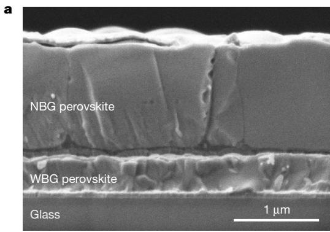

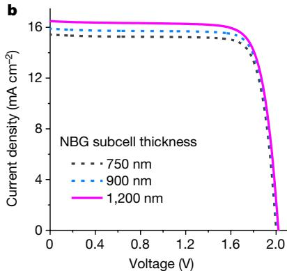

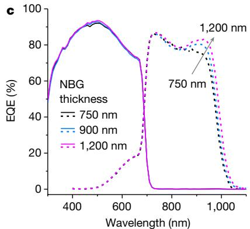

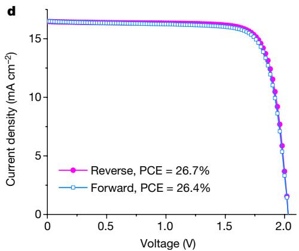

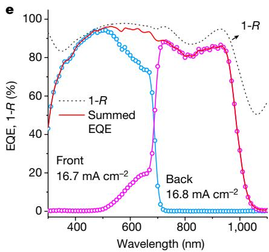

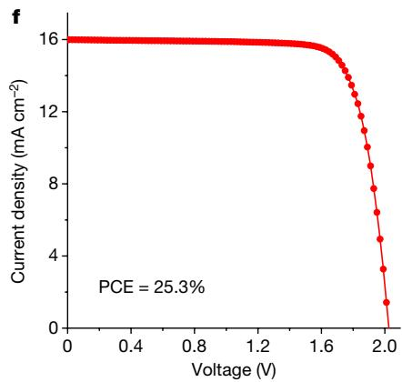

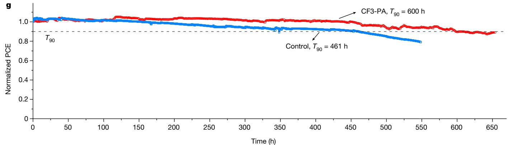  
Fig. 4 | PV performance and stability of all-perovskite tandem solar cells with CF3-PA additive. a, Cross-sectional SEM image of an all-perovskite tandem solar cell. b, $\mathbf { c } , J - V ( \mathbf { b } )$ and EQE (c) curves of tandem cells with back subcell thicknesses of 750, 900 and 1,200 nm. d, e, J–V (d) and EQE and total absorptance (1-R) (e) curves of the best tandem device (with aperture area of $0 . 0 4 9 \mathrm { c m } ^ { 2 }$ ) with approximately $1 . 2 { \cdot } { \mu } { \mathsf { m } }$ -thick Pb–Sn perovskite absorber layer. R is the primary optical reflectance measured from the front glass side. f, J–V curve of a large-area tandem device (aperture area $= 1 . 0 5 \mathrm { c m } ^ { 2 } ;$ ). g, Continuous MPP tracking of the encapsulated CF3-PA and control tandem solar cells (with   
aperture area of $0 . 0 4 9 \mathrm { c m } ^ { 2 }$ ) under simulated 1 Sun illumination (equivalent to AM1.5G, $1 0 0 \mathsf { m } \mathsf { W } \mathsf { c m } ^ { - 2 }$ , multicolor LED simulator) in ambient air with a humidity of $3 0 { - } 5 0 \%$ . The CF3-PA and control tandem devices had initial PCEs of $2 5 . 6 \%$ and $2 4 . 3 \%$ measured under a two-lamp simulator, respectively. The device temperature was approximately $3 5 ^ { \circ } \mathrm { C }$ during operation, which was a result of self-heating under solar illumination. There was no active cooling during device operation and the environmental temperature was kept at approximately $2 5 ^ { \circ } \mathrm { C }$ . $T _ { 9 0 }$ represents the lifetime at which the PCE declines to $9 0 \%$ of its initial value.

# Performance and stability of tandem solar cells

We fabricated monolithic all-perovskite tandem solar cells using the optimized NBG perovskite layers described above (see details in the Methods). The WBG solar cells exhibited a PCE of $1 7 . 3 \%$ , with a $V _ { \mathrm { o c } }$ of 1.22 V, $\mathbf { a } J _ { \mathrm { s c } }$ of $1 7 . 4 \mathrm { m A c m } ^ { - 2 }$ and a FF of $8 1 . 6 \%$ (Extended Data Fig. 7). The NBG perovskite films were fabricated using the CF3-PA additive. The thicknesses of the WBG and NBG absorber layers for the front and back subcells were optimized to be approximately 380 and $1 { , } 2 0 0 \mathsf { n m }$ (Fig. 4a), respectively, to obtain a high matched current density between the subcells.

Figure 4b presents the J–V curves of all-perovskite tandem devices with various thicknesses (750, 900 and 1,200 nm) for the NBG absorber; the corresponding PV parameters are summarized in Supplementary Table 3.

The $J _ { \mathrm { s c } }$ values, as determined from the J–V curves, were increased from 15.4 to $1 6 . 5 \mathsf { m A c m } ^ { - 2 }$ when the thickness of the NBG perovskite absorber increased from 750 to $1 { , } 2 0 0 \mathsf { n m }$ (the WBG perovskite thickness was kept at approximately $3 8 0 \mathsf { n m }$ ). Correspondingly, the PCE was increased from $2 5 . 0 \%$ for the ${ 7 5 0 } { \cdot } \mathsf { n m }$ -thick NBG subcell to $2 6 . 4 \%$ for the 1.2-μm-thick NBG subcell. The highe $\mathbf { \gamma } _ { { J } _ { s c } }$ is due mainly to the higher spectral response (light absorption) in the back subcell, as shown in Fig. 4c and Supplementary Fig. 15.

We fabricated 96 all-perovskite tandem solar cells (with aperture area of $0 . 0 4 9 \mathrm { c m } ^ { 2 }$ ) with $1 . 2 \mathsf { - } \mu \mathsf { m }$ -thick NBG subcells; the devices had an average PCE of $2 5 . 6 \pm 0 . 5 \%$ (Extended Data Fig. 8a). Figure 4d shows the J–V curves of the best-performing tandem device measured from both reverse and forward scans, showing very minor hysteresis.

# Article

The best tandem cell had a PCE of $2 6 . 7 \%$ from the reverse scan (with a $V _ { \mathrm { o c } }$ of 2.03 V, $\mathsf { a } J _ { \mathrm { s c } }$ of $1 6 . 5 \mathsf { m A c m } ^ { - 2 }$ and a FF of $7 9 . 9 \%$ ) and exhibited a stabilized PCE of $2 6 . 6 \%$ (Extended Data Fig. 8b and Extended Data Table 1). The integrated $J _ { \mathrm { s c } }$ values of the front and back subcells from EQE spectra (Fig. 4e) were 16.7 and $1 6 . 8 \mathsf { m A c m } ^ { - 2 }$ , respectively, agreeing well with the $J _ { \mathrm { s c } }$ value determined from the J–V measurements. The $J _ { \mathrm { s c } }$ achieved $( \geq 1 6 . 5 \mathsf { m A c m ^ { - 2 } } .$ ) was considerably higher than those reported in previous works (typically $< 1 6 \mathrm { m A c m } ^ { - 2 } ) ^ { 1 2 , 1 3 , 3 }$ 8, mainly because of the use of thicker NBG perovskite without sacrificing the electrical performance (that is, $V _ { \mathrm { o c } }$ and FF) with the use of CF3-PA additive. We also fabricated tandem cells with larger area; our best-performing large-area device (aperture area $= 1 . 0 5 \mathrm { c m } ^ { 2 }$ ) exhibited a PCE of $2 5 . 3 \%$ with a $V _ { \mathrm { o c } }$ of 2.03 $\mathsf { V } , \mathsf { a } J _ { \mathsf { s c } }$ of $1 6 \mathsf { m A c m } ^ { - 2 }$ and a FF of $78 \%$ (Fig. 4f and Extended Data Fig. 9). The relatively modest performance gap between small-area and large-area devices was ascribed to improved film uniformity in Pb–Sn perovskites films as a result of the addition of formamidine sulfinic acid (FSA) in the precursor solutions10.

We sent tandem solar cells to an accredited independent PV calibration laboratory ( Japan Electrical Safety and Environment Technology Laboratories, JET). These delivered certified stabilized PCEs of $2 6 . 4 \%$ and $2 6 . 1 \%$ (Supplementary Fig. 16). This value of the PCE has been included in recently published Solar Cell Efficiency Tables (version 58)9 . The certified PCE of $2 6 . 4 \%$ exceeds that of other thin-film solar cells and is comparable to that of the best single-crystalline silicon solar cells (Supplementary Table 4). We anticipate that the PCE of all-perovskite tandem solar cells can improve further (Supplementary Note 4).

To assess the stability of tandem solar cells, we first tracked their shelf life by storing the unencapsulated devices under dark conditions in an ${ \sf N } _ { 2 }$ glovebox. The tandem devices exhibited no obvious PCE degradation after $2 , 4 0 0 \mathsf { h }$ of aging (Supplementary Fig. 17). In addition, we investigated the operating stability of the CF3-PA and control tandem devices: we kept the encapsulated devices in ambient air and used maximum power point (MPP) tracking under simulated 1 Sun illumination (using a multicolour light-emitting diode (LED) solar simulator with intensity equivalent to $1 0 0 \mathrm { m W } \mathrm { c m } ^ { - 2 }$ ). The spectrum of the LED simulator is presented in previous work39. CF3-PA-passivated tandem devices maintained $90 \%$ of their initial PCE after 600 h of MPP operation and exhibited improved operating stability compared to unpassivated devices (Fig. 4g). The high efficiency together with the promising stability achieved here indicate a step towards viability for all-perovskite tandem solar cells.

# Online content

Any methods, additional references, Nature Research reporting summaries, source data, extended data, supplementary information, acknowledgements, peer review information; details of author contributions and competing interests; and statements of data and code availability are available at https://doi.org/10.1038/s41586-021-04372-8.

1. Albrecht, S. & Rech, B. Perovskite solar cells: on top of commercial photovoltaics. Nat. Energy 2, 16196 (2017).   
2. Wang, R. et al. Prospects for metal halide perovskite-based tandem solar cells. Nat. Photonics 15, 411–425 (2021).   
3. Jošt, M., Kegelmann, L., Korte, L. & Albrecht, S. Monolithic perovskite tandem solar cells: a review of the present status and advanced characterization methods toward $3 0 \%$ efficiency. Adv. Energy Mater. 10, 1904102 (2020).   
4. Lin, R. et al. Monolithic all-perovskite tandem solar cells with $2 4 . 8 \%$ efficiency exploiting comproportionation to suppress Sn(II) oxidation in precursor ink. Nat. Energy 4, 864–873 (2019).   
5. Min, H. et al. Perovskite solar cells with atomically coherent interlayers on $\mathsf { S n O } _ { 2 }$ electrodes. Nature 598, 444–450 (2021).

6. Yang, Z. et al. Enhancing electron diffusion length in narrow-bandgap perovskites for efficient monolithic perovskite tandem solar cells. Nat. Commun. 10, 4498 (2019).   
7. Eperon, G. E. et al. Perovskite-perovskite tandem photovoltaics with optimized band gaps. Science 354, 861–865 (2016).   
8. Li, Z. et al. Cost analysis of perovskite tandem photovoltaics. Joule 2, 1559–1572 (2018).   
9. Green, M. A. et al. Solar cell efficiency tables (version 58). Prog. Photovoltaics Res. Appl. 29, 657–667 (2021).   
10. Xiao, K. et al. All-perovskite tandem solar cells with $2 4 . 2 \%$ certified efficiency and area over 1 cm2 using surface-anchoring zwitterionic antioxidant. Nat. Energy 5, 870–880 (2020).   
11. Tong, J. et al. Carrier lifetimes of >1 μs in Sn-Pb perovskites enable efficient all-perovskite tandem solar cells. Science 364, 475–479 (2019).   
12. Yu, Z. et al. Simplified interconnection structure based on $\mathsf { C } _ { 6 0 } / \mathsf { S n O } _ { 2 \cdot \mathsf { x } }$ for all-perovskite tandem solar cells. Nat. Energy 5, 657–665 (2020).   
13. Li, C. et al. Low-bandgap mixed tin–lead iodide perovskites with reduced methylammonium for simultaneous enhancement of solar cell efficiency and stability. Nat. Energy 5, 768–776 (2020).   
14. Liu, H. et al. Modulated crystallization and reduced voc deficit of mixed lead–tin perovskite solar cells with antioxidant caffeic acid. ACS Energy Lett. 6, 2907–2916 (2021).   
15. Kapil, G. et al. Tin-lead perovskite fabricated via ethylenediamine interlayer guides to the solar cell efficiency of $2 1 . 7 4 \%$ . Adv. Energy Mater. 11, 2101069 (2021).   
16. Kirchartz, T. & Rau, U. What makes a good solar cell? Adv. Energy Mater. 8, 1703385 (2018).   
17. Kirchartz, T., Bisquert, J., Mora-Sero, I. & Garcia-Belmonte, G. Classification of solar cells according to mechanisms of charge separation and charge collection. Phys. Chem. Chem. Phys. 17, 4007–4014 (2015).   
18. Aydin, E., Bastiani, M. & Wolf, S. Defect and contact passivation for perovskite solar cells. Adv. Mater. 31, 1900428 (2019).   
19. Ni, Z., Xu, S. & Huang, J. Resolving spatial and energetic distributions of trap states in metal halide perovskite solar cells. Science 371, 1352–1358 (2021).   
20. Yang, Y. et al. Top and bottom surfaces limit carrier lifetime in lead iodide perovskite films. Nat. Energy 2, 16207 (2017).   
21. Ricciarelli, D., Meggiolaro, D., Ambrosio, F. & De Angelis, F. instability of tin iodide perovskites: bulk p-doping versus surface tin oxidation. ACS Energy Lett. 5, 2787–2795 (2020).   
22. Savill, K. J., Ulatowski, A. M. & Herz, L. M. Optoelectronic properties of tin–lead halide perovskites. ACS Energy Lett. 6, 2413–2426 (2021).   
23. Zong, Y., Zhou, Z., Chen, M., Padture, N. P. & Zhou, Y. Lewis‐adduct mediated grain‐ boundary functionalization for efficient ideal‐bandgap perovskite solar cells with superior stability. Adv. Energy Mater. 8, 1800997 (2018).   
24. Luo, D., Su, R., Zhang, W., Gong, Q. & Zhu, R. Minimizing non-radiative recombination losses in perovskite solar cells. Nat. Rev. Mater. 5, 44–60 (2020).   
25. Gao, F., Zhao, Y., Zhang, X. & You, J. Recent progresses on defect passivation toward efficient perovskite solar cells. Adv. Energy Mater. 10, 1902650 (2019).   
26. Chen, J. & Park, N.-G. Materials and methods for interface engineering toward stable and efficient perovskite solar cells. ACS Energy Lett. 5, 2742–2786 (2020).   
27. Li, C. et al. Vertically aligned 2D/3D Pb–Sn perovskites with enhanced charge extraction and suppressed phase segregation for efficient printable solar cells. ACS Energy Lett. 5, 1386–1395 (2020).   
28. Park, S. M., Abtahi, A., Boehm, A. M. & Graham, K. R. Surface ligands for methylammonium lead iodide films: surface coverage, energetics, and photovoltaic performance. ACS Energy Lett. 5, 799–806 (2020).   
29. Wang, R. et al. Constructive molecular configurations for surface-defect passivation of perovskite photovoltaics. Science 366, 1509–1513 (2019).   
30. Wei, M. et al. Combining efficiency and stability in mixed tin–lead perovskite solar cells by capping grains with an ultrathin 2D layer. Adv. Mater. 32, 1907058 (2020).   
31. Chen, B., Rudd, P. N., Yang, S., Yuan, Y. & Huang, J. Imperfections and their passivation in halide perovskite solar cells. Chem. Soc. Rev. 48, 3842–3867 (2019).   
32. Jiang, Q. et al. Surface passivation of perovskite film for efficient solar cells. Nat. Photonics 13, 460–466 (2019).   
33. Abate, A. et al. Supramolecular halogen bond passivation of organic-inorganic halide perovskite solar cells. Nano Lett. 14, 3247–3254 (2014).   
34. Walsh, A., Scanlon, D. O., Chen, S., Gong, X. G. & Wei, S. Self‐regulation mechanism for charged point defects in hybrid halide perovskites. Angew. Chemie 127, 1811–1814 (2015).   
35. Wehrenfennig, C., Eperon, G. E., Johnston, M. B., Snaith, H. J. & Herz, L. M. High charge carrier mobilities and lifetimes in organolead trihalide perovskites. Adv. Mater. 26, 1584–1589 (2014).   
36. Hempel, H., Hages, C. J., Eichberger, R., Repins, I. & Unold, T. Minority and majority charge carrier mobility in $\mathsf { C u } _ { 2 } Z \mathsf { n S n S e } _ { 4 }$ revealed by terahertz spectroscopy. Sci. Rep. 8, 14476 (2018).   
37. Al-Ashouri, A. et al. Monolithic perovskite/silicon tandem solar cell with ${ > } 2 9 \%$ efficiency by enhanced hole extraction. Science 370, 1300–1309 (2020).   
38. Palmstrom, A. F. et al. Enabling flexible all-perovskite tandem solar cells. Joule 3, 2193–2204 (2019).   
39. Gao, H. et al. Thermally stable all‐perovskite tandem solar cells fully using metal oxide charge transport layers and tunnel junction. Sol. RRL 5, 2100814 (2021).

Publisher’s note Springer Nature remains neutral with regard to jurisdictional claims in published maps and institutional affiliations.

$\circledcirc$ The Author(s), under exclusive licence to Springer Nature Limited 2022

# Methods

# DFT simulation

Ab initio molecular dynamic simulations were performed with the CP2K package40 in the constant-volume and constant-temperature (NVT) ensemble. The temperature was controlled with a Nosé–Hoover thermostat41 at room temperature (300 K) and 400 K. The time step was set to 1.0 fs. A PBE-D3 functional was used with double-zeta basis sets (DZVP-MOLOPT)42 and Goedecker–Teter–Hutter pseudopotentials43. The cut-off was set to 560 Ry. We constructed the $\mathsf { F A } _ { 0 . 7 5 } \mathsf { M A } _ { 0 . 2 5 } \mathsf { P b } _ { 0 . 5 } \mathsf { S n } _ { 0 . 5 } \mathsf { l } _ { 3 }$ (001) surface (approximately $2 5 \times 2 5 \mathring { \mathbf { A } } ^ { 2 \cdot }$ ) with a 25 Å vacuum in the $z$ direction. The ammonium cations were initially placed in the z direction away from the perovskite surface with a distance of $2 . 5 \mathring \mathrm { A }$ . The ab initio molecular dynamic simulations were run for approximately 10–20 ps to ensure equilibrium. First-principles calculations based on DFT were carried out using the Vienna Ab initio Simulation Package44. The generalized gradient approximation of Perdew–Burke–Ernzerhof functional was used as the exchange-correlation functional45. In addition, we used the DFT-D3 method for the van der Waals correction and also dipole corrections for the slab calculations46. A plane-wave cut-off energy of 400 eV was used. The energy and force convergence criteria were set to 10−5 eV and $0 . 0 3 \mathrm { e V } \mathring { \mathbf { A } } ^ { - 1 }$ , respectively. The Brillouin zone was sampled with Γ-centred $k$ -mesh densities of $2 \pi \times 0 . 0 2 \mathring { \mathsf { A } } ^ { - 1 }$ in the calculations of the energetic and electronic properties. We used a vacuum of 20 Å to separate neighbouring surfaces in the $z$ -direction. The binding energies $( E _ { \mathrm { { b } } } )$ of different ammonium cations (CF3-PA, PA and PEA) with the perovskite surface were calculated a $5 E _ { \mathrm { m o l / p v s k } } - E _ { \mathrm { p v s k } } - E _ { \mathrm { m o l } } ,$ , where $E _ { \mathrm { m o l / p v s k } } ,$ $E _ { \mathrm { p v s k } }$ and $E _ { \mathrm { m o l } }$ are the total energies of the adsorption system, the perovskite system and CF3-PAI/PAI/PEAI (I represents iodide), respectively. The electrostatic potentials $( \varphi )$ of the passivators were calculated using the Gaussian 09 package at the B3LYP/def2TZVP level with DFT-D3. The maximum $\varphi ( \varphi _ { \mathrm { m a x } } )$ of the $\mathrm { N H } _ { 3 } ^ { + }$ terminal group in these passivators was obtained with the help of Multiwfn code47.

# Materials

All materials were used as received without further purification. The organic halide salts (FAI, FABr, MAI, FAI, PEACl, PACl, CF3-PACl) were purchased from GreatCell Solar Materials (Australia). Poly(3,4-ethylenedioxythiophene) polystyrene sulfonate (PEDOT:PSS) aqueous solution (Al 4083) was purchased from Heraeus Clevios (Germany). N4,N4'-Di(naphthalen-1-yl)-N4,N4'-bis(4-vinylphenyl) biphenyl-4,4'-diamine (VNPB) was purchased from Lumtec. $\mathsf { P b l } _ { 2 } ( 9 9 . 9 9 \% )$ , $\mathsf { C s l } ( 9 9 . 9 \% )$ and CsBr $( 9 9 . 9 \% )$ were purchased from TCI Chemicals. $\mathbf { S n l } _ { 2 } ( 9 9 . 9 9 9 \% )$ ) was purchased from Alfa Aesar. $\mathsf { S n F } _ { 2 } ( 9 9 \% )$ , dimethylformamide (DMF, $9 9 . 8 \%$ anhydrous), dimethyl sulfoxide (DMSO, $9 9 . 9 \%$ anhydrous), formamidine sulfinic acid $( \geq 9 8 \% )$ , ethyl acetate $( 9 9 . 8 \%$ anhydrous) and chlorobenzene $( 9 9 . 8 \%$ anhydrous) were purchased from Sigma-Aldrich. $\mathbf { C } _ { 6 0 }$ was purchased from Nano-C (USA). Bathocuproine (BCP) $( > 9 9 \%$ sublimed) was purchased from Xi’an Polymer Light Technology (China).

# Perovskite precursor solution

NBG $\mathbf { F A } _ { 0 , 7 } \mathbf { M A } _ { 0 , 3 } \mathbf { P b } _ { 0 , 5 } \mathbf { S } \mathsf { n } _ { 0 , 5 } \mathsf { I } _ { 3 }$ perovskite. The precursor solution was prepared in mixed solvents of DMF and DMSO with a volume ratio of 2:1. The molar ratios for FAI/MAI and $\mathrm { P b I } _ { 2 } / \mathsf { S n l } _ { 2 }$ were 0.7:0.3 and 0.5:0.5, respectively. The molar ratio of (FAI+MAI)/ $( \mathsf { P b l } _ { 2 } ^ { } + \mathsf { S n l } _ { 2 } ^ { } )$ was 1:1. $\mathsf { S n F } _ { 2 }$ $( 1 0 \mathrm { m o l \% }$ relative to $\mathsf { S n l } _ { 2 }$ ) was added to the precursor solution. The precursor solution was then stirred at room temperature for 2 h. Tin powders $( 5 \mathrm { m g } \mathrm { m l ^ { - 1 } } )$ ) and formamidine sulfinic acid $( 0 . 3 \mathrm { m o l \% }$ ) were added to the precursor to reduce ${ \mathsf { S } } { \mathsf { n } } ^ { 4 + }$ in the precursor solution and to improve film uniformity. For solution with passivating agents, PEACl, PACl or CF3-PACl was added to the precursor solution at their optimized concentrations. It is noted that we introduced additives at a concentration lower than $0 . 4 \ : \mathrm { m o l \% }$ relative to the B-site metal cations, which is below the concentration of large A-site cations required to form

2D/3D heterostructures. The precursor solution was filtered through $0 . 2 2 \mu \mathrm { m }$ Polytetrafluoroethylene (PTFE) membrane before making perovskite films.

WBG $\mathbf { F } \pmb { \Delta } _ { 0 . 8 } \mathbf { C } \pmb { \mathscr { s } } _ { 0 . 2 } \mathbf { P } \mathbf { b } ( \mathbf { I } _ { 0 . 6 2 } \mathbf { B } \mathbf { r } _ { 0 . 3 8 } ) _ { 3 }$ perovskite. The precursor solution (1.2 M) was prepared from six precursors dissolved in mixed solvents of DMF and DMSO with a volume ratio of 4:1. The molar ratios for FAI/FABr/CsI/CsBr and $\mathsf { P b I } _ { 2 } / \mathsf { P b B r } _ { 2 }$ were 0.48:0.32:0.12:0.08 and 0.62:0.38, respectively. The molar ratio of $( \mathrm { F A I + F A B r + C s I + C s B r } ) / $ $\left( \mathsf { P b l } _ { 2 } \mathsf { + P b B r } _ { 2 } \right)$ was 1:1. The precursor solution was stirred at $5 0 ^ { \circ } \mathrm { C }$ for 2 h and then filtered through a $0 . 2 2 \mu \mathrm { m }$ PTFE membrane before use. We found in our previous work that the six precursor approach improved the photostability and suppressed phase-segregation of the WBG perovskites, compared with those fabricated from four precursors (CsI, FAI, $\mathsf { P b l } _ { 2 }$ and $\mathsf { P b B r } _ { 2 } ,$ )10. We also noted that the halide segregation in WBG perovskites was dependent on illumination intensity (Supplementary Fig. 18). The WBG perovskite films had a composition $\mathrm { C s _ { 0 . 2 } F A _ { 0 . 8 } P b I _ { 1 . 8 6 } B r _ { 1 . 1 4 } }$ and a slightly lower bandgap (approximately 1.76 eV) than that used in our previous work10, in order to obtain a higher matched current density in all-perovskite tandem solar cells, enabled by a thicker Pb–Sn perovskite absorber.

# Device fabrication

Mixed Pb–Sn perovskite solar cells. The prepatterned indium tin oxide (ITO) glass substrates were sequentially cleaned using acetone and isopropanol. PEDOT:PSS was spin-coated on ITO substrates at 4,000 rpm for 30 s and annealed on a hotplate at $1 5 0 ^ { \circ } \mathrm { C }$ for 10 min in ambient air. After cooling, we transferred the substrates immediately to a nitrogen-filled glovebox for the deposition of perovskite films. The perovskite films were deposited with a two-step spin-coating procedure: (1) 1,000 rpm for 10 s with an acceleration of 200 rpm $\mathsf { \pmb { S } } ^ { - 1 }$ and (2) 4,000 rpm for 40 s with a ramp-up of 1,000 rpm $\mathsf { \pmb { S } } ^ { - 1 }$ . Ethyl acetate $( 3 0 0 \mu \mathrm { l } )$ was dropped onto the spinning substrate during the second spin-coating step at 20 s before the end of the procedure. The substrates were then transferred on to a hotplate and heated at $1 0 0 ^ { \circ } \mathrm { C }$ for 10 min. After cooling down to room temperature, the substrates were transferred to the evaporation system. Finally, $\mathsf C _ { 6 0 } ( 2 0 \mathsf { n m } ) / \mathsf { B C P } ( 7 \mathsf { n m } ) /$ Cu (150 nm) were sequentially deposited on top of the perovskite by thermal evaporation (Beijing Technol Science). The thickness of the Pb–Sn perovskite layer was varied by changing the concentration of the precursor solution: 1.6 M for 750 nm, 2.0 M for 900 nm, 2.2 M for 1,050 nm, 2.4 M for 1,200 nm and 2.8 M for $1 { , } 4 5 0 \mathsf { n m }$ .

All-perovskite tandem solar cells. NiO nanocrystal $( 2 5 \mathrm { m g } \mathrm { m l ^ { - 1 } }$ in water) layers were first spin-coated on ITO substrates at 3,000 rpm for 30 s and annealed on a hotplate at $1 3 0 ^ { \circ } \mathrm { C }$ for 30 min in air. NiO nanocrystals were synthesized as reported previously48. After cooling, the substrates were immediately transferred to the glovebox. VNPB $( 1 \mathrm { m g } \mathrm { m l } ^ { - 1 } )$ ) in chlorobenzene without doping was spin-coated on the NiO film at 6,000 rpm for 30 s and was then annealed at $1 5 0 ^ { \circ } \mathrm { C }$ for 10 min. The WBG perovskite films were deposited on top of the VNPB-modified NiO with a two-step spin-coating procedure: (1) 2,000 rpm for 10 s with an acceleration of 200 rpm s–1 and (2) 6,000 rpm for 40 s with a ramp-up of 2,000 rpm s–1. Chlorobenzene $( 2 0 0 \mu \mathrm { l } )$ was dropped onto the spinning substrate during the second spin-coating step at 20 s before the end of the procedure. The substrates were then transferred onto a hotplate and heated at $1 0 0 ^ { \circ } \mathrm { C }$ for 15 min. After cooling down to room temperature, the substrates were transferred to the evaporation system and a 20-nm-thick $\mathbf { C } _ { 6 0 }$ film was subsequently deposited on top by thermal evaporation at a rate of $0 . 2 \mathring \mathbf { A } \mathbf { S } ^ { ^ { - 1 } }$ . The substrates were then transferred to the atomic layer deposition (ALD) system (Veeco Savannah S200) to deposit $2 0 \mathsf { n m } \mathsf { S n O } _ { 2 }$ at low temperatures (typically $1 0 0 ^ { \circ } \mathrm { C } )$ ) using precursors of tetrakis(dimethylamino) tin (iv) $( 9 9 . 9 9 9 9 \%$ , Nanjing Ai Mou Yuan Scientific Equipment Co., Ltd) and deionized water. After ALD deposition, the substrates were transferred back to

# Article

the thermal evaporation system to deposit an ultra-thin layer of Au clusters layer (approximately 1 nm) on ALD- $S \mathbf { n O } _ { 2 }$ . PEDOT:PSS layers were spin-cast on top of the front cells and annealed in air at $1 2 0 ^ { \circ } \mathrm { C }$ for $2 0 \mathrm { { m i n } }$ . After the substrates had cooled, we immediately transferred them to a nitrogen-filled glovebox for the deposition of NBG perovskite films with identical procedures used for the single-junction devices. Finally, $2 0 \mathrm { n m C } _ { 6 0 } ,$ 7 nm BCP and 150 nm Cu films were sequentially deposited by thermal evaporation (Beijing Technol Science). Details on the deposition of ALD- $S \mathsf { n O } _ { 2 }$ layers can be found in our previous work10.

# Characterization of solar cells

For single-junction solar cells, the J–V characteristics were measured using a Keithley 2400 sourcemeter under the illumination of a solar simulator (EnliTech, Class AAA) at a light intensity of $1 0 0 \mathrm { m } \mathrm { w } \mathrm { c m } ^ { - 2 }$ as checked with NREL calibrated reference solar cells (KG-5 and KG-0 reference cells were used for the measurements of the WBG and NBG solar cells, respectively). Unless otherwise stated, the J–V curves were all measured in a nitrogen-filled glovebox with a scanning rate of $1 0 0 \mathrm { \ m V s ^ { - 1 } }$ (with voltage steps of $2 0 \mathrm { m V }$ and a delay time of 100 ms). The active area was determined by the aperture shade masks (0.049 or $1 . 0 5 \mathrm { c m } ^ { 2 }$ ) placed in front of the solar cells. EQE measurements were performed in ambient air using a QE system (EnliTech) with monochromatic light focused on the device pixel and a chopper frequency of ${ 2 0 } \mathsf { H z }$ . For tandem solar cells, the measurements of the J–V characteristics were carried out under the illumination of a two-lamp high spectral match solar simulator (SAN-EI ELECTRIC, XHS-50S1). The spectrum from the simulator was finely tuned to ensure that spectral mismatch was in the region of $100 \pm 3 \%$ for each $5 0 \mathsf { n m }$ interval in the wavelength range of 400–1,000 nm. The solar simulator was set at a light intensity of 100 mW cm−2 as checked with a calibrated crystalline silicon reference solar cell with a quartz window (KG-0). We note that a dual-lamp solar simulator, rather than a single Xe lamp, is preferred for the characterization of tandem solar cells, due to the better spectral match with AM1.5G solar irradiance (see the detailed discussion in Supplementary Note 5). EQE measurements were performed in ambient air and the bias illumination from very bright LEDs with emission peaks of 850 and 460 nm were used for the measurements of the front and back subcells, respectively. No bias voltage was applied during the EQE measurements of the tandem solar cells.

# Stability tests of solar cells

The operating stability tests were carried out under full AM1.5G illumination (Class AAA, multicolour LED solar simulator, Guangzhou Crysco Equipment Co. Ltd)39 with an intensity of $1 0 0 \mathsf { m } \mathsf { W } \mathsf { c m } ^ { - 2 }$ using a home-made LabVIEW-based MPP tracking system and a Perturb and observe method in ambient conditions (under a humidity of $3 0 { - } 5 0 \%$ ). The solar cells were encapsulated with a cover glass and ultraviolet (UV) epoxy (Three Bond), which was cured under an UV-LED lamp (peak emission at $3 6 5 \mathsf { n m } ,$ ) for 3 min. No UV filter was applied during operation. The environmental temperature was kept at around $2 5 ^ { \circ } \mathrm { C }$ . The solar cell temperature increased to approximately $3 5 ^ { \circ } \mathrm { C }$ under illumination as no active cooling was implemented at the measurement stage. The illumination intensity was regularly calibrated to check the degradation of the LED lamp. The assessments of the dark long-term shelf stability of the solar cells (without encapsulation) were carried out by repeating the J–V characterizations at various times and the devices were stored in a ${ \sf N } _ { 2 }$ glovebox.

# Femtosecond-resolved optical-pump-terahertz probe spectroscopy

A commercial Ti:Sapphire amplified laser (Libra, Coherent) with a pulse duration of 90 fs, centre wavelength of $8 0 0 \mathsf { n m }$ and repetition rate of 1 kHz was used to generate terahertz radiation by optical rectification in a 0.5-mm-thick ZnTe(110) nonlinear single crystal. The radiation was detected using free-space electro-optic sampling in a $0 . 5 { \cdot } \mathsf { m m }$ -thick

ZnTe(110) crystal. Perovskite thin films deposited on z-cut quartz substrates were photoexcited at $8 0 0 \mathsf { n m }$ with fluences in the range of $1 . 5 { - } 5 0 \mu \mathrm { J } \mathsf { c m } ^ { - 2 }$ . The change in terahertz amplitude was monitored as a function of the time delay between the $8 0 0 \mathsf { n m }$ optical pump pulse and the terahertz probe pulse using a translation stage. All measurements were carried out in a nitrogen-purged environment to avoid potential degradation of the perovskite films in ambient air.

# Optical simulation of tandem solar cells

A validated optical model GenPro4 as developed by Delft University of Technology was used for the optical modelling of the tandem solar cells49. The complex refractive index of each layer was measured by a spectroscopic ellipsometer ( J.A. Woollam). The implied photocurrent density of each subcell can be calculated using GenPro4 by assuming that the individual absorptances of the front and back cells are equivalent to the EQE of the two cells, respectively. The current density of the tandem cell is determined by taking the lower value between the two subcells.

# Other characterizations

SEM images were obtained using a TESCAN microscope with an accelerating voltage of $2 \operatorname { k V } .$ XRD patterns were collected using a Rigaku MiniFlex 600 diffractometer equipped with a NaI scintillation counter and using monochromatized Cu Kα radiation (wavelength $\lambda { = } 1 . 5 4 0 6 \mathring \mathrm { A } ,$ ). The grazing-incidence wide-angle X-ray scattering data were recorded using an Xeuss 2.0 system with an X-ray beam size of $1 0 0 \times 1 0 0 \mu \mathrm { m } ^ { 2 }$ . The photon energy was 8 keV $\begin{array} { r } { ( \lambda { = } 1 . 5 4 \mathring \mathrm { A } ) } \end{array}$ ) and the incident angle was $0 . 0 5 ^ { \circ }$ (relative to the top surface of the perovskite films) or $0 . 5 ^ { \circ }$ . The diffracted X-rays were collected by a Pilatus 300k detector at a distance of 160 cm. XPS analysis was carried out using a Thermo Scientific Al K-Alpha XPS system with energy steps of 0.1 eV. Angle-dependent XPS characterizations were performed with a PHI 5600 ultrahigh vacuum system with a hemispherical electron energy analyser, an Al Kα source (1,486.6 eV, PHI 04-548 dual anode X-ray source) for excitation and a pass energy of 23.5 eV for XPS acquisition28. Optical absorption measurements were carried out on a Lambda 950 UV/Vis spectrophotometer. Transient photovoltage decays were measured on a home-made system. A 540 nm green LED was used to modulate $V _ { \mathrm { o c } }$ with a constant light bias and the repetition rate was set to $2 { , } 0 0 0 \mathsf { H z }$ . A white LED was illuminated on the active area of the solar cell under study for constant light bias. The intensity of the pulsed illumination was set in such a way that the modulated $V _ { \mathrm { o c } }$ was approximately $1 0 \mathrm { m V }$ , to ensure a perturbation regime. The open circuit voltage transient, induced by the light perturbation, was measured with a digital oscilloscope set to an input impedance of 1 MΩ. The charge recombination lifetime was fitted by a single exponential decay. Steady-state PL and time-resolved PL were measured using a Horiba Fluorolog time-correlated single-photon-counting system with photomultiplier tube detectors. The light was illuminated onto the top surface of the perovskite film. For steady-state PL measurements, the excitation source was a monochromated Xe lamp (peak wavelength at 520 nm with a line width of 2 nm). For time-resolved PL, the excitation source was a green laser diode $\begin{array} { r } { ( \lambda = 5 1 0 \mathrm { n m } . } \end{array}$ ) with an excitation power density of $5 \mathsf { m w } \mathsf { c m } ^ { - 2 }$ . The PL decay curves were fitted with biexponential components to obtain fast and slow decay lifetimes. The mean carrier lifetimes τ for the biexponential fit were calculated by the weighted average method. ToF-SIMS was performed using ToF-SIMS6 from IONTOF GmbH. Samples were analysed in the dual-beam profiling mode. All profiles were performed in the non-interlaced mode. Spectral data were acquired in the high mass-resolution mode. The primary ion for analysis was $3 0  { \mathrm { k e V } }  { \mathbf { B } }  { \mathsf { i } } ^ { 3 + }$ at $0 . 3 { \mathsf { p A } }$ (with Bi liquid metal ion source). This ion beam was applied over a $5 0 \times 5 0 \mu \mathrm { m } ^ { 2 }$ area at the centre of the sputter crater. The sputter ion was 1 keV $\mathbf { A } \mathbf { r } ^ { + }$ at 120 nA (with Ar electron impact ion source). $\phantom { - } 1 2 0 0 \times 2 0 0 \mu \mathrm { m } ^ { 2 }$ sputter crater was used. During the sputtering process, the mass spectra in the same

layer were consistent and different layers had well-defined profiles, which means that beam damage was not observed. The MA cation, FA cation, CF3-PA cation, Pb+ and ${ \mathsf { S } } { \mathsf { n } } ^ { + }$ were identified based on masses of 32.0483 amu, 45.0430 amu, 162.0551 amu, 207.9715 amu and 119.8997 amu, respectively.

# Data availability

The data that support the findings of this study are available from the corresponding authors on reasonable request.

40. Kühne, T. D. et al. CP2K: an electronic structure and molecular dynamics software package -Quickstep: Efficient and accurate electronic structure calculations. J. Chem. Phys. 152, 194103 (2020).   
41. Nosé, S. A unified formulation of the constant temperature molecular dynamics methods. J. Chem. Phys. 81, 511–519 (1984).   
42. VandeVondele, J. & Hutter, J. Gaussian basis sets for accurate calculations on molecular systems in gas and condensed phases. J. Chem. Phys. 127, 114105 (2007).   
43. Goedecker, S. & Teter, M. Separable dual-space Gaussian pseudopotentials. Phys. Rev. B 54, 1703–1710 (1996).   
44. Kresse, G. & Furthmüller, J. Efficient iterative schemes for ab initio total-energy calculations using a plane-wave basis set. Phys. Rev. B 54, 11169–11186 (1996).   
45. Perdew, J. P., Burke, K. & Ernzerhof, M. Generalized gradient approximation made simple. Phys. Rev. Lett. 77, 3865–3868 (1996).   
46. Lee, K., Murray, É. D., Kong, L., Lundqvist, B. I. & Langreth, D. C. Higher-accuracy van der Waals density functional. Phys. Rev. B 82, 3–6 (2010).   
47. Lu, T. & Chen, F. Multiwfn: a multifunctional wavefunction analyzer. J. Comput. Chem. 33, 580–592 (2012).   
48. Han, Q. et al. Low-temperature processed inorganic hole transport layer for efficient and stable mixed Pb-Sn low-bandgap perovskite solar cells. Sci. Bull. 64, 1399–1401 (2019).   
49. Santbergen, R. et al. GenPro4 optical model for solar cell simulation and its application to multijunction solar cells. IEEE J. Photovolt. 7, 919–926 (2017).

Acknowledgements This work was financially supported by the National Key R&D Program of China (grant no. 2018YFB1500102), the National Natural Science Foundation of China (grant nos. 61974063 and 61921005), the Natural Science Foundation of Jiangsu Province (grant nos. BK20202008 and BK20190315), the Technology Innovation Fund of Nanjing University, Fundamental Research Funds for the Central Universities (grant nos. 0213/14380206 and 0205/14380252), the Frontiers Science Center for Critical Earth Material Cycling Fund (grant no. DLTD2109), the Program A for Outstanding PhD Candidate of Nanjing University, and the Program for Innovative Talents and Entrepreneur in Jiangsu. The work at the University of Toronto was supported by the US Department of the Navy, Office of Naval Research (grant no. N00014-20-1-2572). SciNet is funded by the Canada Foundation for Innovation under the auspices of Compute Canada. K.R.G., S.M.P. and H.R.A. acknowledge the US Department of Energy, Office of Basic Energy Sciences under grant no. DE-SC0018208 for supporting the photoelectron spectroscopy measurements.

Author contributions H.T. conceived and directed the overall project. R.L. and Y.W. fabricated all the devices and conducted the characterization. Jian X. carried out the DFT simulation. M.W. performed Tof-SIMS, PL and PL-decay characterization. Z.Q. and C.Z. performed the terahertz measurements and analysis. Z.L. and G.C. carried out the grazing-incidence wide-angle X-ray scattering measurements. J.W., Z.L., K.X., B.C., Jun X., J.Z. and L.L. carried out device fabrication and materials characterization. S.M.P., H.R.A. and K.R.G. performed angle-dependent XPS characterization and analysis. E.H.S. and H.T. supervised the project and assisted in data analysis. R.L., M.W., Jian X., E.H.S. and H.T. wrote the manuscript. All authors discussed the results and commented on the paper.

Competing interests The authors declare no competing interests.

# Additional information

Supplementary information The online version contains supplementary material available at https://doi.org/10.1038/s41586-021-04372-8.   
Correspondence and requests for materials should be addressed to Edward H. Sargent or Hairen Tan.   
Peer review information Nature thanks the anonymous reviewers for their contribution to the peer review of this work.   
Reprints and permissions information is available at http://www.nature.com/reprints.

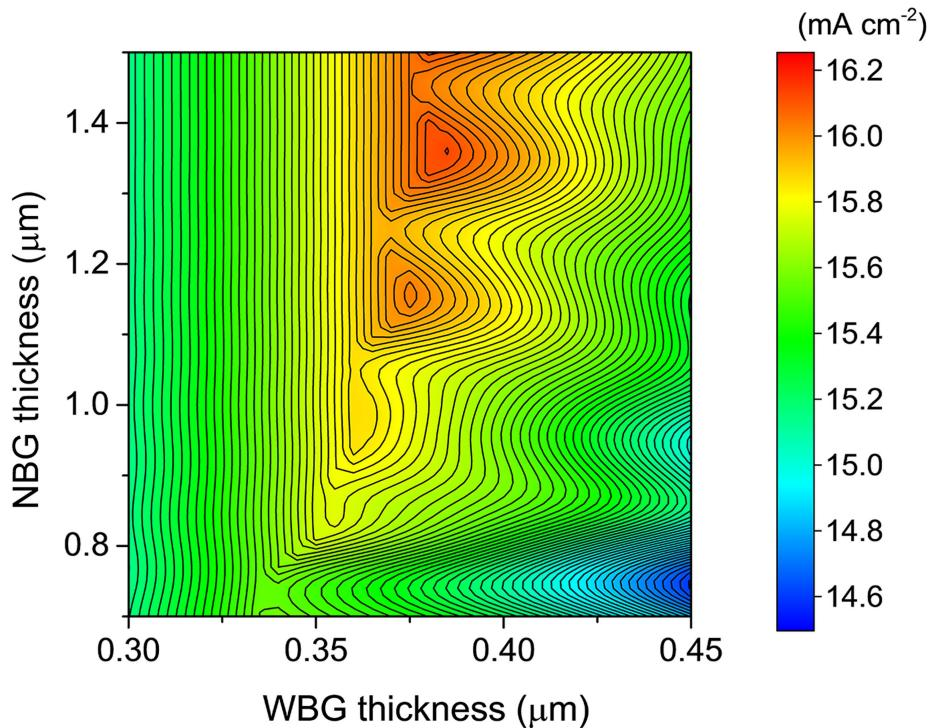  
Implied photocurrent density   
Extended Data Fig. 1 | Optical simulation of all-perovskite tandem solar cells. The implied photocurrent density $( J _ { s c } )$ of tandems was calculated as function of wide-bandgap and narrow-bandgap perovskite layer thicknesses.

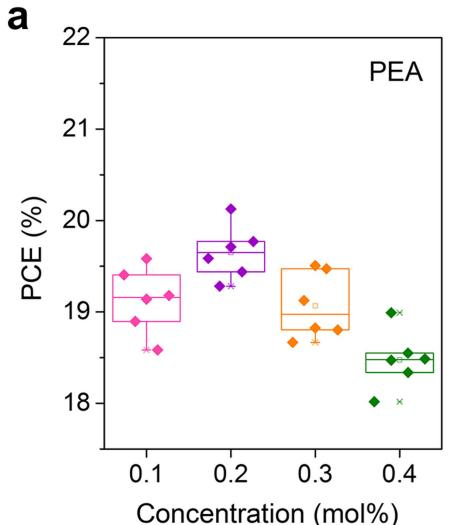

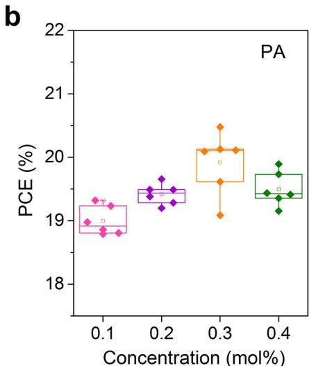

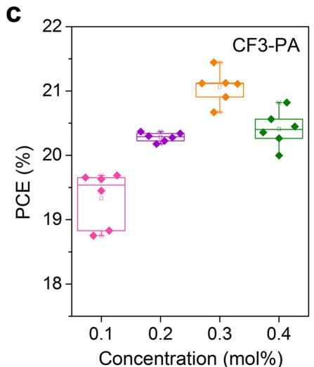  
Extended Data Fig. 2 | PCEs of mixed Pb-Sn perovskite solar cells with various concentrations of passivating agents. a, PEA; b, PA; c, CF3-PA. The absorber layer thickness is ~1,200 nm.

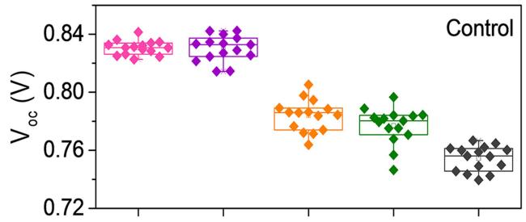  
a

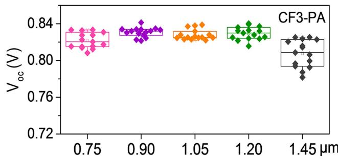

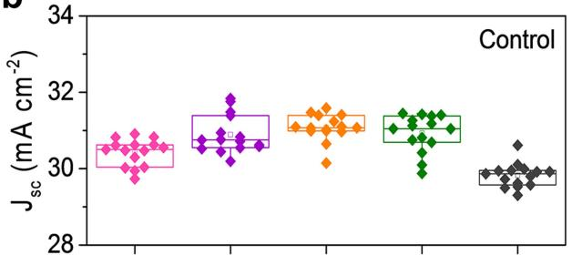  
b

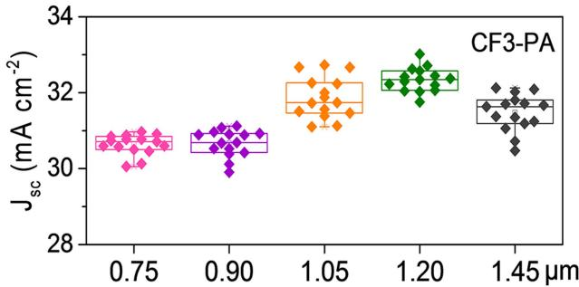

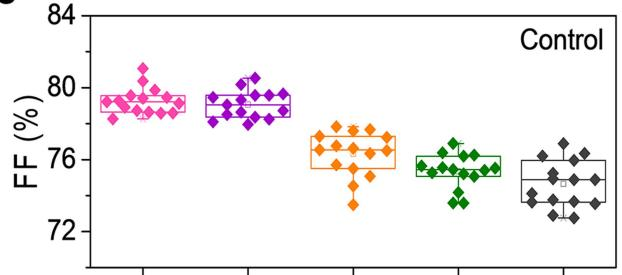  
C

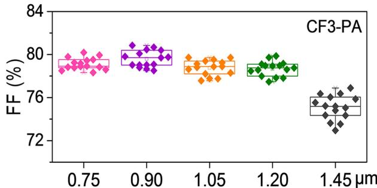

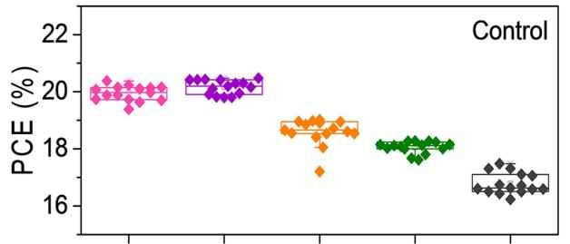  
d

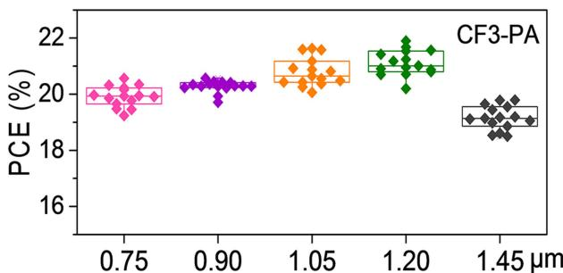  
Extended Data Fig. 3 | Performance of control and CF3-PA mixed Pb-Sn perovskite solar cells with various absorber thicknesses. For regular thinner Pb-Sn perovskite solar cells (thicknesses of 750 and $9 0 0 \mathsf { n m }$ ), the diffusion lengths are sufficiently long to ensure charge transport within devices. This agrees with the finding that no obvious improvement was   
observed in regular thinner devices after we added the CF3-PA passivating agent. The abrupt drop in performance at the thickness of $1 . 4 5 \mu \mathrm { m }$ comes because the precursor solution fails to form high-quality films, a result of finite solubility of metal halides in DMF/DMSO solvent.

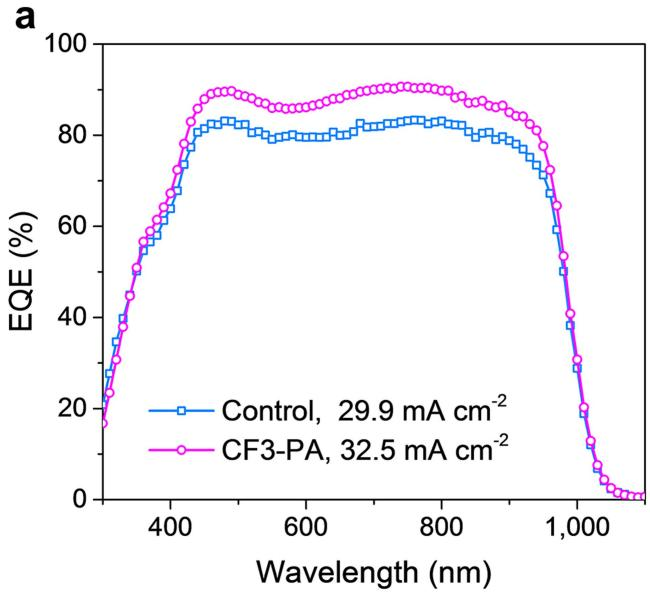

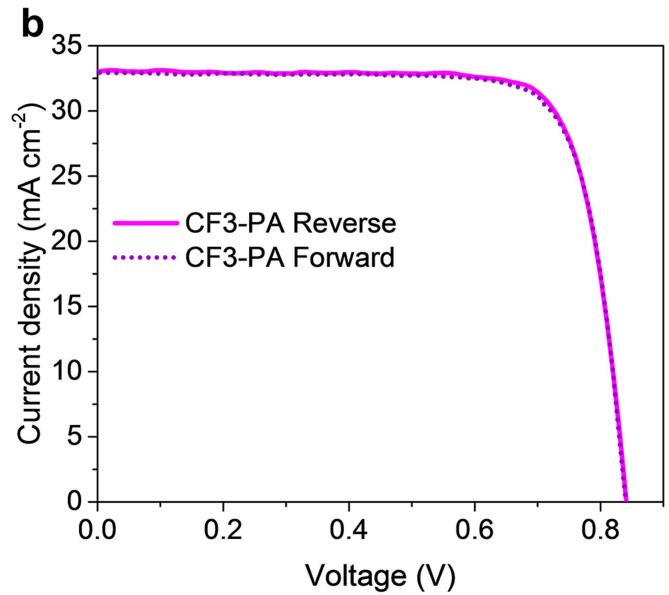

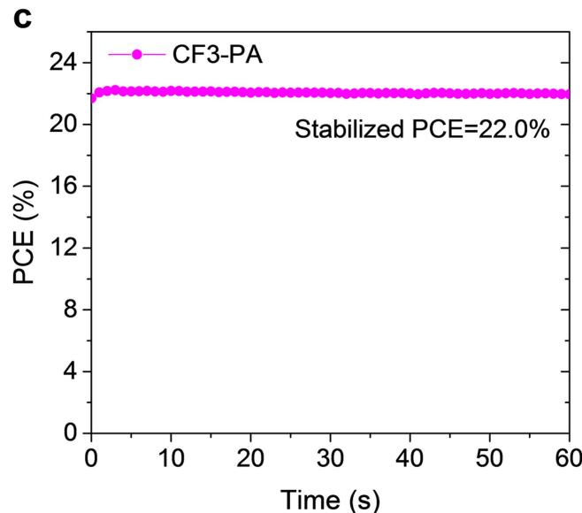  
Extended Data Fig. 4 | Performance of champion mixed Pb-Sn perovskite solar cells. a, EQE spectra of champion control and CF3-PA mixed Pb-Sn solar cells. The EQE values of CF3-PA device are substantially higher than those of previous works at wavelengths above $8 0 0 \mathsf { n m }$ , mainly due to the use of thicker   
absorber while maintaining sufficient carrier transport. It is noted that such a $\hbar \mathrm { i g h } J _ { \mathrm { s c } }$ value is obtained herein together with high $V _ { \mathrm { o c } }$ and FF even when using a 1,200 nm absorber. b, Reverse and forward J-V curves of the champion CF3-PA mixed Pb-Sn solar cell. c, The steady-state PCE of the champion CF3-PA device.

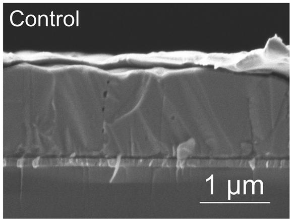  
a

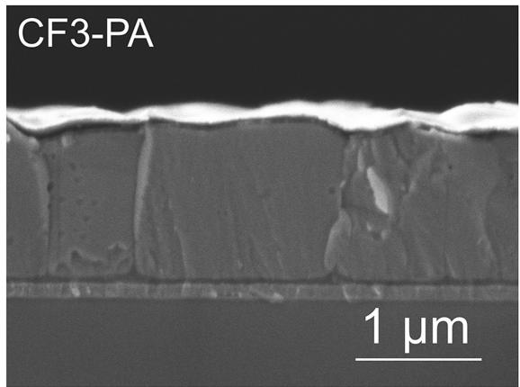  
b

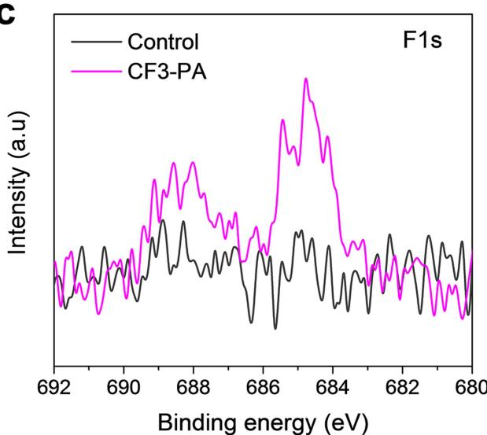

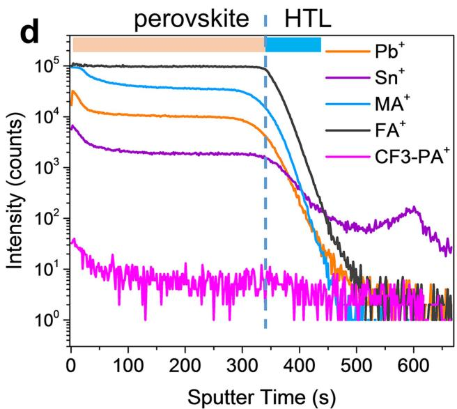  
  
Extended Data Fig. 5 | Characterization of control and CF3-PA mixed Pb-Sn perovskite films. a–b, Cross-sectional SEM images of 1200-nm-thick (a) control and (b) CF3-PA mixed Pb-Sn perovskite solar cells. c, The F 1s XPS   
spectra of the control and CF3-PA perovskite films. d, TOF-SIMS spectra of mixed Pb-Sn perovskite film with CF3-PA additive. The additive is accumulated on the top perovskite surface and at the perovskite/HTL interface.

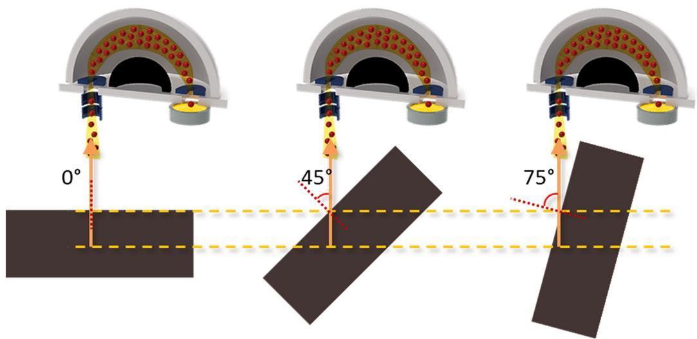  
a

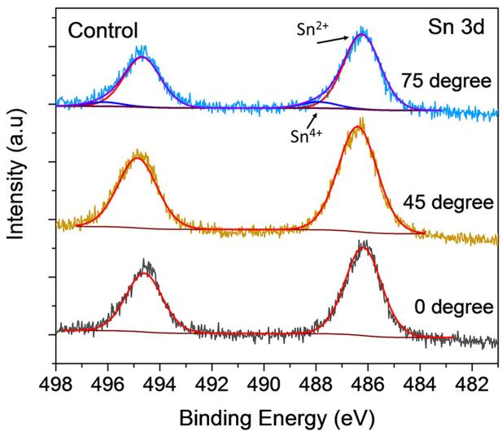  
b   
Extended Data Fig. 6 | Schematic of angle-dependent XPS measurements. a, Schematic of angle-dependent XPS measurements with dashed yellow lines indicating the relative photoelectron probing depth. Angles were defined as

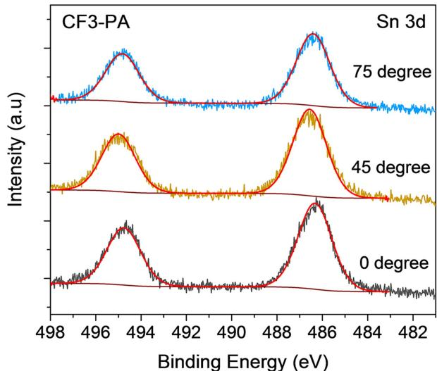  
C   
normal of the sample to detector. b–c, Angle-dependent XPS spectra of the Sn 3d at detector take-off angle $\boldsymbol { \theta } = \mathbf { 0 }$ , 45, and $7 5 ^ { \circ }$ for (b) control and (c) CF3-PA perovskite films. Red peaks are fitted to $\mathsf { S } \mathsf { n } ^ { 2 + }$ and the blue peaks are fitted to $S \mathfrak { n } ^ { 4 \mathrm { + } }$ +.

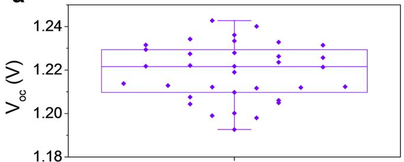  
a

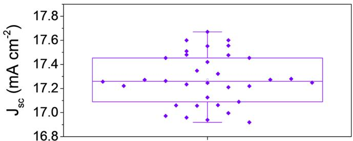

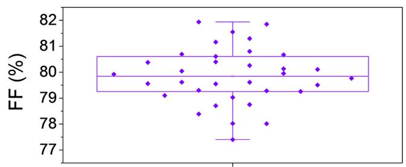

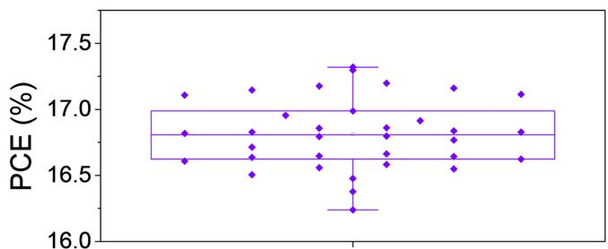

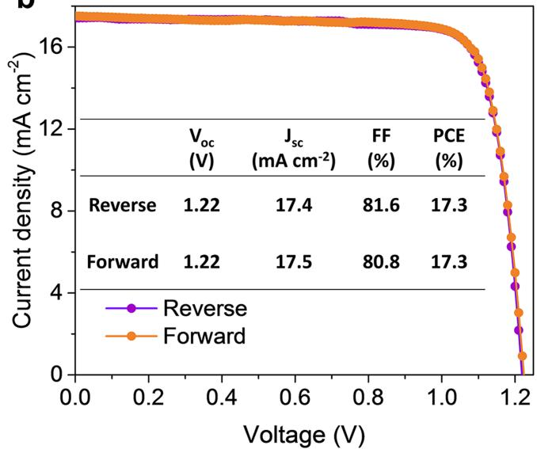  
b

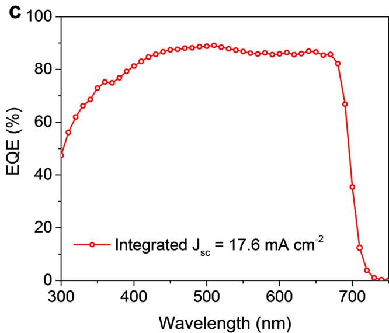  
  
Extended Data Fig. 7 | Photovoltaic performance of wide-bandgap perovskite solar cells. a, Statistics of PV parameters among 34 devices. b, c, J-V and EQE curves of the best-performing device.

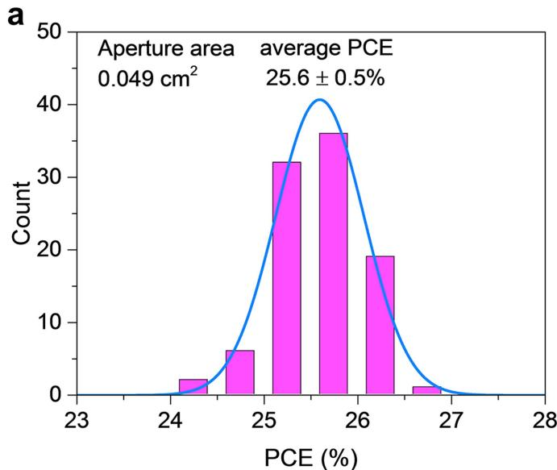  
Extended Data Fig. 8 | Photovoltaic performance of all-perovskite tandem solar cells. a, The PCE histogram of all-perovskite tandem solar cells (96 devices) with 1,200-nm-thick NBG subcell. The devices were measured with a

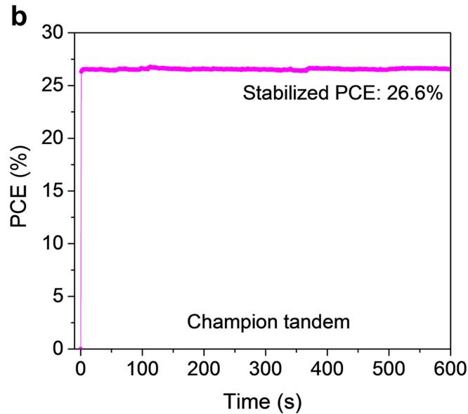  
mask having aperture area of $0 . 0 4 9 \mathrm { c m } ^ { 2 }$ . b, Steady-state output of the champion all-perovskite tandem solar over 600 s. The device exhibited a stabilized PCE of $2 6 . 6 \%$ .

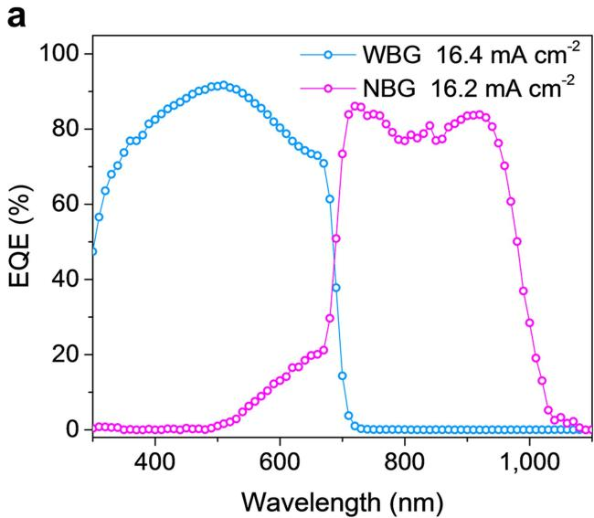

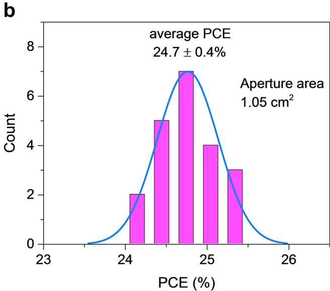  
Extended Data Fig. 9 | Photovoltaic performance of large-area all-perovskite tandem solar cells. a, EQE spectra of large-area tandem solar cell. b, PCE distribution of 21 large-area tandem devices.

Extended Data Table 1 | Photovoltaic parameters of champion WBG subcell, NBG subcell and all-perovskite tandem solar cell   

<table><tr><td>Device</td><td>Scan direction</td><td>Voc(V)</td><td>Jsc(mA cm-2)</td><td>FF (%)</td><td>PCE (%)</td></tr><tr><td rowspan="2">WBG subcell</td><td>Reverse</td><td>1.22</td><td>17.4</td><td>81.6</td><td>17.3</td></tr><tr><td>Forward</td><td>1.22</td><td>17.5</td><td>80.8</td><td>17.3</td></tr><tr><td rowspan="2">NBG subcell</td><td>Reverse</td><td>0.84</td><td>33.0</td><td>80.0</td><td>22.2</td></tr><tr><td>Forward</td><td>0.84</td><td>33.0</td><td>79.6</td><td>22.0</td></tr><tr><td rowspan="2">Tandem</td><td>Reverse</td><td>2.03</td><td>16.5</td><td>79.9</td><td>26.7</td></tr><tr><td>Forward</td><td>2.03</td><td>16.5</td><td>78.8</td><td>26.4</td></tr></table>

The devices have aperture area of 0.049 cm2 .