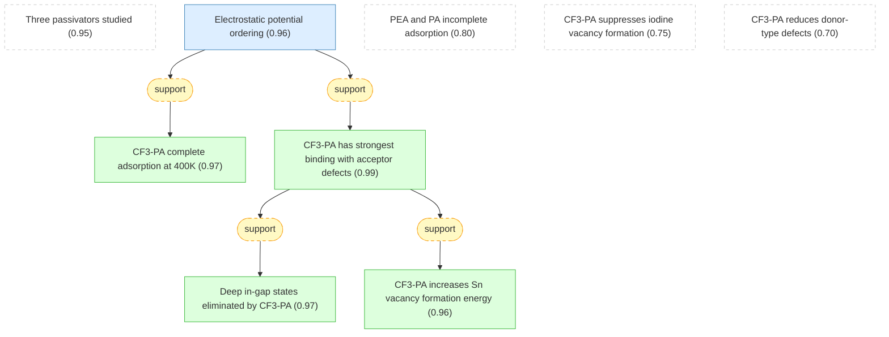

# pvsks41586-021-04372-8-gaia

Add your description here

## Overview

```mermaid
graph LR
    perovskite_tunable_bandgap["Perovskite bandgap tunability (0.90)"]:::orphan
    tandem_structure["All-perovskite tandem structure (0.90)"]:::orphan
    low_photocurrent_limitation["Low photocurrent density limitation (0.85)"]:::orphan
    thick_absorber_needed["Thick absorber requirement for tandem cells (0.90)"]:::orphan
    short_diffusion_length["Short carrier diffusion length limits absorber thickness (0.85)"]:::orphan
    grain_surface_passivation_route["Grain surface passivation increases diffusion length (0.85)"]:::orphan
    thickness_limited_by_passivation["Passivation incomplete at current thicknesses (0.80)"]:::orphan
    cf3_pa_hypothesis["CF3-PA enhanced adsorption hypothesis (0.70)"]:::orphan
    research_question["research_question"]:::question
    certified_26_4_percent["26.4% certified tandem efficiency (0.95)"]:::orphan
    stability_600h["Tandem device operational stability (0.85)"]:::orphan
    three_ammonium_cations["Three passivators studied (0.95)"]:::orphan
    electrostatic_potential_ordering["Electrostatic potential ordering (0.96)"]:::premise
    cf3_pa_complete_adsorption["CF3-PA complete adsorption at 400K (0.97)"]:::derived
    pea_pa_incomplete_adsorption["PEA and PA incomplete adsorption (0.80)"]:::orphan
    cf3_pa_suppresses_iodine_vacancies["CF3-PA suppresses iodine vacancy formation (0.75)"]:::orphan
    cf3_pa_strongest_binding["CF3-PA has strongest binding with acceptor defects (0.99)"]:::derived
    deep_in_gap_states_eliminated["Deep in-gap states eliminated by CF3-PA (0.97)"]:::derived
    sn_vacancy_formation_increased["CF3-PA increases Sn vacancy formation energy (0.96)"]:::derived
    donor_defect_reduction["CF3-PA reduces donor-type defects (0.70)"]:::orphan
    optimal_concentrations["Optimal passivator concentrations (0.90)"]:::orphan
    cf3_pa_best_pv_parameters["CF3-PA yields best PV parameters (0.99)"]:::premise
    jsc_increases_with_thickness_cf3["CF3-PA Jsc increases with absorber thickness (0.99)"]:::premise
    control_jsc_saturates["Control device Jsc saturates and performance drops (0.99)"]:::premise
    best_cf3_pa_device["Best CF3-PA device performance (0.85)"]:::orphan
    average_pc3_pa_200_devices["Average PCE of 20.8% across 200+ devices (0.85)"]:::orphan
    eqe_integrated_jsc["EQE integrated Jsc matches J-V measurement (0.85)"]:::orphan
    passivator_no_morphology_change["Passivators do not change surface morphology (0.85)"]:::orphan
    cf3_pa_at_surfaces_and_boundaries["Passivators anchored at surfaces and grain boundaries (0.85)"]:::orphan
    single_3d_perovskite_phase["Single 3D perovskite phase maintained (0.90)"]:::orphan
    no_2d_peaks_high_concentration["No 2D perovskite formation even at high CF3-PA concentration (0.85)"]:::orphan
    sn4_plus_at_surface_control["Sn4+ forms at surface of control films (0.85)"]:::orphan
    sn2_plus_oxidation_suppressed["CF3-PA suppresses Sn2+ oxidation (0.80)"]:::orphan
    pl_intensity_enhanced_cf3["CF3-PA enhances PL intensity (0.85)"]:::orphan
    carrier_lifetimes["Carrier lifetimes increase with CF3-PA (0.89)"]:::premise
    similar_dc_mobility["Similar DC mobility in control and CF3-PA films (0.85)"]:::premise
    diffusion_length_increased_threefold["Diffusion length increased threefold with CF3-PA (0.94)"]:::derived
    limiting_carrier_mobility["Limiting carrier mobility values (0.80)"]:::orphan
    wbg_cell_pce["WBG subcell performance (0.85)"]:::orphan
    thicknesses_optimized["Optimal thickness configuration for tandem cells (0.90)"]:::orphan
    jsc_increases_with_nbg_thickness["Tandem Jsc increases with NBG thickness (0.85)"]:::orphan
    pce_increases_with_thickness["Tandem PCE increases with NBG thickness (0.85)"]:::orphan
    best_tandem_reverse["Best tandem device reverse scan performance (0.85)"]:::orphan
    eqe_matched_currents["EQE shows well-matched subcell currents (0.85)"]:::orphan
    average_tandem_96_devices["Average PCE of 25.6% across 96 tandem devices (0.85)"]:::orphan
    certified_pce_264_percent["Certified PCE of 26.4% by JET (0.90)"]:::orphan
    large_area_tandem["Large-area tandem device performance (0.85)"]:::orphan
    shelf_stability_2400h["Shelf stability over 2400 hours (0.80)"]:::orphan
    operational_stability_600h["CF3-PA tandem retains 90% PCE after 600h operation (0.80)"]:::orphan
    carrier_lifetimes --> diffusion_length_increased_threefold
    cf3_pa_strongest_binding --> deep_in_gap_states_eliminated
    cf3_pa_strongest_binding --> sn_vacancy_formation_increased
    electrostatic_potential_ordering --> cf3_pa_complete_adsorption
    electrostatic_potential_ordering --> cf3_pa_strongest_binding
    similar_dc_mobility --> diffusion_length_increased_threefold

    classDef setting fill:#f0f0f0,stroke:#999,color:#333
    classDef premise fill:#ddeeff,stroke:#4488bb,color:#333
    classDef derived fill:#ddffdd,stroke:#44bb44,color:#333
    classDef question fill:#fff3dd,stroke:#cc9944,color:#333
    classDef background fill:#f5f5f5,stroke:#bbb,stroke-dasharray: 5 5,color:#333
    classDef orphan fill:#fff,stroke:#ccc,stroke-dasharray: 5 5,color:#333
    classDef external fill:#fff,stroke:#aaa,stroke-dasharray: 3 3,color:#333
    classDef weak fill:#fff9c4,stroke:#f9a825,stroke-dasharray: 5 5,color:#333
    classDef contra fill:#ffebee,stroke:#c62828,color:#333
```

## All-perovskite tandem solar cells with improved grain surface passivation.

#### Perovskite bandgap tunability ★

📌 `perovskite_tunable_bandgap`   |   Prior: 0.90   |   Belief: **0.90**

> Metal-halide perovskites have bandgaps tunable from approximately 1.2 eV to 3.0 eV through compositional engineering, making them suitable for tandem solar cell applications.

#### All-perovskite tandem structure ★

📌 `tandem_structure`   |   Prior: 0.90   |   Belief: **0.90**

> An all-perovskite tandem solar cell is constructed by stacking a mixed bromide/iodide wide-bandgap (WBG, approximately 1.8 eV) perovskite front cell and a mixed lead-tin (Pb-Sn) narrow-bandgap (NBG, approximately 1.2 eV) perovskite back cell.

#### Low photocurrent density limitation ★

📌 `low_photocurrent_limitation`   |   Prior: 0.85   |   Belief: **0.85**

> The certified power conversion efficiency (PCE) of all-perovskite tandem solar cells had not surpassed that of single-junction perovskite solar cells (PSCs), with a limitation dominated by low photocurrent density (below 16 mA cm^-2).

#### Thick absorber requirement for tandem cells ★

📌 `thick_absorber_needed`   |   Prior: 0.90   |   Belief: **0.90**

> High photocurrent densities require a Pb-Sn perovskite active layer more than 1 micrometer thick in the bottom subcell to satisfy the current-matching condition.

#### Short carrier diffusion length limits absorber thickness ★

📌 `short_diffusion_length`   |   Prior: 0.85   |   Belief: **0.85**

> Efficient (>20%) Pb-Sn PSCs have so far only been demonstrated using an active-layer thickness of less than 1 micrometer, attributed to the short carrier diffusion length of polycrystalline Pb-Sn perovskite thin films.

#### Grain surface passivation increases diffusion length ★

📌 `grain_surface_passivation_route`   |   Prior: 0.85   |   Belief: **0.85**

> Grain surface passivation is a promising route to increase the carrier diffusion length of perovskite films, given that grain surfaces exhibit trap density one to several orders of magnitude higher than within the grain.

#### Passivation incomplete at current thicknesses ★

📌 `thickness_limited_by_passivation`   |   Prior: 0.80   |   Belief: **0.80**

> The absorber thickness of grain-surface-passivated Pb-Sn PSCs has been limited to less than 1 micrometer in optimized devices, due to incomplete adsorption of passivating agent into defective sites during film formation.

#### CF3-PA enhanced adsorption hypothesis ★

📌 `cf3_pa_hypothesis`   |   Prior: 0.70   |   Belief: **0.70**

> Enhancing the adsorption of passivating agents during perovskite film formation could further improve passivation and thus increase the diffusion length in thick Pb-Sn perovskite films, enabling thicker absorber layers and higher matched photocurrent densities in all-perovskite tandem solar cells.

#### research_question ★

❓ `research_question`

> Can CF3-PA passivation enable thick Pb-Sn perovskite absorbers (>1 micrometer) with sufficient carrier diffusion length to achieve high photocurrent density in all-perovskite tandem solar cells?

#### 26.4% certified tandem efficiency ★

📌 `certified_26_4_percent`   |   Prior: 0.95   |   Belief: **0.95**

> A certified power conversion efficiency of 26.4% was achieved in all-perovskite tandem solar cells, exceeding that of the best-performing single-junction perovskite solar cells.

#### Tandem device operational stability ★

📌 `stability_600h`   |   Prior: 0.85   |   Belief: **0.85**

> Encapsulated tandem devices retain more than 90% of their initial performance after 600 hours of operation at the maximum power point under 1 Sun illumination in ambient conditions.

## Density functional theory studies -- computational methods and predictions.

#### Three passivators studied ★

📌 `three_ammonium_cations`   |   Prior: 0.95   |   Belief: **0.95**

> Three aromatic ammonium cations were selected for study: phenethylammonium (PEA), phenylammonium (PA), and 4-trifluoromethyl-phenylammonium (CF3-PA).

#### Electrostatic potential ordering ★

📌 `electrostatic_potential_ordering`   |   Prior: 0.90   |   Belief: **0.96**

> The electrostatic potentials (phi_max) at the -NH3+ side follow the order: phi_max,PEA < phi_max,PA < phi_max,CF3-PA, with CF3-PA having the highest electropositivity at the ammonium group.

#### CF3-PA complete adsorption at 400K ★

📌 `cf3_pa_complete_adsorption`   |   Prior: 0.80   |   Belief: **0.97**

> Ab initio molecular dynamics simulations at 400 K (perovskite crystallization temperature) show that CF3-PA has the strongest tendency to anchor on the perovskite surface, with all 16 cations adsorbed completely on the surface in simulation.

🔗 **support**([Electrostatic potential ordering](#electrostatic_potential_ordering))

Reasoning

Ab initio molecular dynamics at crystallization temperature (400 K) directly simulates the dynamic adsorption process and shows CF3-PA achieves complete surface coverage, consistent with its higher electrostatic potential.

#### PEA and PA incomplete adsorption ★

📌 `pea_pa_incomplete_adsorption`   |   Prior: 0.80   |   Belief: **0.80**

> In comparison, one PA cation and three PEA cations are not adsorbed into the A-site vacancies at 400 K, and iodide ions are observed to escape from the surface in PA and PEA cases.

#### CF3-PA suppresses iodine vacancy formation ★

📌 `cf3_pa_suppresses_iodine_vacancies`   |   Prior: 0.75   |   Belief: **0.75**

> CF3-PA not only increases the probability of adsorbed ammonium cations on the perovskite grain surface but also suppresses the formation of iodine vacancies on the surface at elevated temperatures, which may also suppress the formation of iodine interstitial defects.

#### CF3-PA has strongest binding with acceptor defects ★

📌 `cf3_pa_strongest_binding`   |   Prior: 0.85   |   Belief: **0.99**

> The binding energies (Eb) between CF3-PA and acceptor-type defects on the perovskite grain surface are highest compared to PA and PEA, due to the highly electronegative fluorine atom in CF3-PA withdrawing electron density strongly from neighboring atoms, leaving higher electropositivity at the -NH3+ side for enhanced binding with negatively charged defects.

🔗 **support**([Electrostatic potential ordering](#electrostatic_potential_ordering))

Reasoning

The electrostatic potential ordering (phi_max,PEA < phi_max,PA < phi_max,CF3-PA) indicates CF3-PA has the highest electropositivity at the -NH3+ side, which enhances binding with negatively charged acceptor defects on the perovskite surface.

#### Deep in-gap states eliminated by CF3-PA ★

📌 `deep_in_gap_states_eliminated`   |   Prior: 0.80   |   Belief: **0.97**

> The deep in-gap states from I_Sn and I_Pb antisite defects are eliminated upon CF3-PA passivation.

🔗 **support**([CF3-PA has strongest binding with acceptor defects](#cf3_pa_strongest_binding))

Reasoning

Stronger binding of CF3-PA to surface defects eliminates the deep in-gap states associated with I_Sn and I_Pb antisite defects.

#### CF3-PA increases Sn vacancy formation energy ★

📌 `sn_vacancy_formation_increased`   |   Prior: 0.75   |   Belief: **0.96**

> CF3-PA passivation is predicted to increase the defect formation energy of the Sn vacancy (V_Sn), reducing the numbers of vacancies.

🔗 **support**([CF3-PA has strongest binding with acceptor defects](#cf3_pa_strongest_binding))

Reasoning

The strong binding of CF3-PA with Sn vacancies increases the defect formation energy, making vacancies less likely to form.

#### CF3-PA reduces donor-type defects ★

📌 `donor_defect_reduction`   |   Prior: 0.70   |   Belief: **0.70**

> CF3-PA passivation also reduces the formation of donor-type defects.

## PV performance of Pb-Sn perovskite solar cells.

```mermaid
graph TD
    optimal_concentrations["Optimal passivator concentrations (0.90)"]:::orphan
    cf3_pa_best_pv_parameters["CF3-PA yields best PV parameters (0.99)"]:::premise
    jsc_increases_with_thickness_cf3["CF3-PA Jsc increases with absorber thickness (0.99)"]:::premise
    control_jsc_saturates["Control device Jsc saturates and performance drops (0.99)"]:::premise
    best_cf3_pa_device["Best CF3-PA device performance (0.85)"]:::orphan
    average_pc3_pa_200_devices["Average PCE of 20.8% across 200+ devices (0.85)"]:::orphan
    eqe_integrated_jsc["EQE integrated Jsc matches J-V measurement (0.85)"]:::orphan

    classDef setting fill:#f0f0f0,stroke:#999,color:#333
    classDef premise fill:#ddeeff,stroke:#4488bb,color:#333
    classDef derived fill:#ddffdd,stroke:#44bb44,color:#333
    classDef question fill:#fff3dd,stroke:#cc9944,color:#333
    classDef background fill:#f5f5f5,stroke:#bbb,stroke-dasharray: 5 5,color:#333
    classDef orphan fill:#fff,stroke:#ccc,stroke-dasharray: 5 5,color:#333
    classDef external fill:#fff,stroke:#aaa,stroke-dasharray: 3 3,color:#333
    classDef weak fill:#fff9c4,stroke:#f9a825,stroke-dasharray: 5 5,color:#333
    classDef contra fill:#ffebee,stroke:#c62828,color:#333
```

#### Optimal passivator concentrations ★

📌 `optimal_concentrations`   |   Prior: 0.90   |   Belief: **0.90**

> The optimal concentrations of PEA, PA, and CF3-PA were 0.2, 0.3, and 0.3 mol%, respectively.

#### CF3-PA yields best PV parameters ★

📌 `cf3_pa_best_pv_parameters`   |   Prior: 0.85   |   Belief: **0.99**

> Among the three passivators (PEA, PA, CF3-PA), CF3-PA resulted in the best performance values of open-circuit voltage (Voc), short-circuit current density (Jsc), fill factor (FF), and thus power conversion efficiency (PCE) for 1.2-micrometer-thick devices.

#### CF3-PA Jsc increases with absorber thickness ★

📌 `jsc_increases_with_thickness_cf3`   |   Prior: 0.85   |   Belief: **0.99**

> The Jsc values of CF3-PA devices increased with thickness, reaching approximately 33 mA cm^-2 at a thickness of 1.2 micrometers, due to higher light absorption at the near-infrared range as indicated by external quantum efficiency (EQE) spectra.

#### Control device Jsc saturates and performance drops ★

📌 `control_jsc_saturates`   |   Prior: 0.85   |   Belief: **0.99**

> The Jsc values of control devices did not exhibit an increase when thickness increased from 900 to 1,200 nm, and Voc and FF values dropped considerably with thickness beyond 900 nm, indicating photogenerated carrier transport limits performance in thick devices.

#### Best CF3-PA device performance ★

📌 `best_cf3_pa_device`   |   Prior: 0.85   |   Belief: **0.85**

> The best CF3-PA device showed a PCE of 22.2% (stabilized 22.0%) with Voc of 0.841 V, Jsc of 33.0 mA cm^-2, and FF of 80% under reverse scan for a 1.2-micrometer-thick absorber.

#### Average PCE of 20.8% across 200+ devices ★

📌 `average_pc3_pa_200_devices`   |   Prior: 0.85   |   Belief: **0.85**

> Over 200 CF3-PA mixed Pb-Sn PSCs with 1.2-micrometer-thick absorber were fabricated, exhibiting an average PCE of 20.8 +/- 0.5%, which is a narrow distribution compared with typical Pb-Sn perovskite statistics.

#### EQE integrated Jsc matches J-V measurement ★

📌 `eqe_integrated_jsc`   |   Prior: 0.85   |   Belief: **0.85**

> The integrated Jsc value from EQE spectra of the best CF3-PA device was 32.5 mA cm^-2, in good agreement with the J-V characterization.

## Characterization of Pb-Sn perovskite films.

```mermaid
graph TD
    passivator_no_morphology_change["Passivators do not change surface morphology (0.85)"]:::orphan
    cf3_pa_at_surfaces_and_boundaries["Passivators anchored at surfaces and grain boundaries (0.85)"]:::orphan
    single_3d_perovskite_phase["Single 3D perovskite phase maintained (0.90)"]:::orphan
    no_2d_peaks_high_concentration["No 2D perovskite formation even at high CF3-PA concentration (0.85)"]:::orphan
    sn4_plus_at_surface_control["Sn4+ forms at surface of control films (0.85)"]:::orphan
    sn2_plus_oxidation_suppressed["CF3-PA suppresses Sn2+ oxidation (0.80)"]:::orphan
    pl_intensity_enhanced_cf3["CF3-PA enhances PL intensity (0.85)"]:::orphan
    carrier_lifetimes["Carrier lifetimes increase with CF3-PA (0.89)"]:::premise
    similar_dc_mobility["Similar DC mobility in control and CF3-PA films (0.85)"]:::premise
    diffusion_length_increased_threefold["Diffusion length increased threefold with CF3-PA (0.94)"]:::derived
    limiting_carrier_mobility["Limiting carrier mobility values (0.80)"]:::orphan
    strat_5(["support"]):::weak
    carrier_lifetimes --> strat_5
    similar_dc_mobility --> strat_5
    strat_5 --> diffusion_length_increased_threefold

    classDef setting fill:#f0f0f0,stroke:#999,color:#333
    classDef premise fill:#ddeeff,stroke:#4488bb,color:#333
    classDef derived fill:#ddffdd,stroke:#44bb44,color:#333
    classDef question fill:#fff3dd,stroke:#cc9944,color:#333
    classDef background fill:#f5f5f5,stroke:#bbb,stroke-dasharray: 5 5,color:#333
    classDef orphan fill:#fff,stroke:#ccc,stroke-dasharray: 5 5,color:#333
    classDef external fill:#fff,stroke:#aaa,stroke-dasharray: 3 3,color:#333
    classDef weak fill:#fff9c4,stroke:#f9a825,stroke-dasharray: 5 5,color:#333
    classDef contra fill:#ffebee,stroke:#c62828,color:#333
```

#### Passivators do not change surface morphology ★

📌 `passivator_no_morphology_change`   |   Prior: 0.85   |   Belief: **0.85**

> Introducing the passivator additives (PEA, PA, CF3-PA) did not notably affect the surface morphology of Pb-Sn perovskite films.

#### Passivators anchored at surfaces and grain boundaries ★

📌 `cf3_pa_at_surfaces_and_boundaries`   |   Prior: 0.85   |   Belief: **0.85**

> Time-of-flight secondary ion mass spectrometry (ToF-SIMS) revealed that passivators were anchored on the top and bottom film surfaces as well as at the grain boundaries within the film.

#### Single 3D perovskite phase maintained ★

📌 `single_3d_perovskite_phase`   |   Prior: 0.90   |   Belief: **0.90**

> X-ray diffraction (XRD) patterns of control and passivated films exhibited a single three-dimensional (3D) perovskite phase without a 2D (reduced-dimensional) phase and without non-perovskite phases.

#### No 2D perovskite formation even at high CF3-PA concentration ★

📌 `no_2d_peaks_high_concentration`   |   Prior: 0.85   |   Belief: **0.85**

> No diffraction peaks relating to 2D layered perovskites were found even when a large amount of CF3-PA (20 mol%) was added to the precursor solution, which is beneficial for charge transport and extraction throughout the thick Pb-Sn perovskite absorber.

#### Sn4+ forms at surface of control films ★

📌 `sn4_plus_at_surface_control`   |   Prior: 0.85   |   Belief: **0.85**

> Angle-dependent XPS measurements at electron take-off angles of 0, 45, and 75 degrees show that Sn4+ primarily forms on the surface of control films (probing depth 1.5-2 nm at 75 degrees), indicating surface Sn2+ oxidation.

#### CF3-PA suppresses Sn2+ oxidation ★

📌 `sn2_plus_oxidation_suppressed`   |   Prior: 0.80   |   Belief: **0.80**

> Surface Sn2+ oxidation was successfully suppressed after anchoring of CF3-PA on the grain surfaces, indicating that passivation of surface defects (undercoordinated Sn atoms and Sn vacancies) could retard Sn2+ oxidation.

#### CF3-PA enhances PL intensity ★

📌 `pl_intensity_enhanced_cf3`   |   Prior: 0.85   |   Belief: **0.85**

> Steady-state photoluminescence (PL) intensity was noticeably increased with the CF3-PA passivating agent, implying suppressed non-radiative charge recombination through defects.

#### Carrier lifetimes increase with CF3-PA ★

📌 `carrier_lifetimes`   |   Prior: 0.85   |   Belief: **0.89**

> Time-resolved PL measurements show effective carrier lifetimes: CF3-PA, tau = 966 ns; PA, tau = 437 ns; PEA, tau = 365 ns; control (non-passivated), tau = 159 ns. The longer charge-carrier recombination lifetime with CF3-PA was also confirmed by transient photovoltage decay measurements.

#### Similar DC mobility in control and CF3-PA films ★

📌 `similar_dc_mobility`   |   Prior: 0.80   |   Belief: **0.85**

> The control and CF3-PA films exhibited similar effective d.c. charge-carrier mobilities (mu_dc) of approximately 80 cm^2 V^-1 s^-1, where mu_dc is the sum of electron and hole mobilities (mu_dc = mu_e + mu_h).

#### Diffusion length increased threefold with CF3-PA ★

📌 `diffusion_length_increased_threefold`   |   Prior: 0.80   |   Belief: **0.94**

> The diffusion length (Ld) of CF3-PA passivated films was increased threefold compared to control films (5.4 micrometers versus 1.8 micrometers), due to longer carrier lifetimes despite similar mobilities.

🔗 **support**([Carrier lifetimes increase with CF3-PA](#carrier_lifetimes), [Similar DC mobility in control and CF3-PA films](#similar_dc_mobility))

Reasoning

Diffusion length depends on both mobility and lifetime (Ld = sqrt(mu*tau)). Although mobilities are similar, the 6-fold increase in carrier lifetime (966 ns vs 159 ns) produces the 3-fold increase in diffusion length (5.4 um vs 1.8 um).

#### Limiting carrier mobility values ★

📌 `limiting_carrier_mobility`   |   Prior: 0.80   |   Belief: **0.80**

> The mobility of the limiting carrier (mu_e,h) was 11.7 +/- 1.5 and 8.2 +/- 1.2 cm^2 V^-1 s^-1 for CF3-PA and control Pb-Sn perovskite films, respectively.

## Performance and stability of all-perovskite tandem solar cells.

#### WBG subcell performance ★

📌 `wbg_cell_pce`   |   Prior: 0.85   |   Belief: **0.85**

> Wide-bandgap (WBG) solar cells exhibited a PCE of 17.3% with Voc of 1.22 V, Jsc of 17.4 mA cm^-2, and FF of 81.6%.

#### Optimal thickness configuration for tandem cells ★

📌 `thicknesses_optimized`   |   Prior: 0.90   |   Belief: **0.90**

> The thicknesses of WBG and NBG absorber layers for front and back subcells were optimized to approximately 380 nm and 1,200 nm, respectively, to obtain a high matched current density between subcells.

#### Tandem Jsc increases with NBG thickness ★

📌 `jsc_increases_with_nbg_thickness`   |   Prior: 0.85   |   Belief: **0.85**

> The Jsc values (from J-V curves) increased from 15.4 to 16.5 mA cm^-2 when the thickness of the NBG perovskite absorber increased from 750 to 1,200 nm, with WBG thickness kept at approximately 380 nm.

#### Tandem PCE increases with NBG thickness ★

📌 `pce_increases_with_thickness`   |   Prior: 0.85   |   Belief: **0.85**

> The PCE increased from 25.0% for the 750-nm-thick NBG subcell to 26.4% for the 1.2-micrometer-thick NBG subcell, mainly due to higher spectral response (light absorption) in the back subcell.

#### Best tandem device reverse scan performance ★

📌 `best_tandem_reverse`   |   Prior: 0.85   |   Belief: **0.85**

> The best tandem cell had a PCE of 26.7% from the reverse scan (with Voc of 2.03 V, Jsc of 16.5 mA cm^-2, and FF of 79.9%), and exhibited a stabilized PCE of 26.6%.

#### EQE shows well-matched subcell currents ★

📌 `eqe_matched_currents`   |   Prior: 0.85   |   Belief: **0.85**

> The integrated Jsc values from EQE spectra of front and back subcells were 16.7 and 16.8 mA cm^-2, respectively, agreeing well with the Jsc value from J-V measurements.

#### Average PCE of 25.6% across 96 tandem devices ★

📌 `average_tandem_96_devices`   |   Prior: 0.85   |   Belief: **0.85**

> Ninety-six all-perovskite tandem solar cells (with aperture area of 0.049 cm^2) with 1.2-micrometer-thick NBG subcells had an average PCE of 25.6 +/- 0.5%.

#### Certified PCE of 26.4% by JET ★

📌 `certified_pce_264_percent`   |   Prior: 0.90   |   Belief: **0.90**

> Independent certification by Japan Electrical Safety and Environment Technology Laboratories (JET) delivered certified stabilized PCEs of 26.4% and 26.1%, included in Solar Cell Efficiency Tables (version 58), exceeding other thin-film solar cells and comparable to best single-crystalline silicon solar cells.

#### Large-area tandem device performance ★

📌 `large_area_tandem`   |   Prior: 0.85   |   Belief: **0.85**

> A large-area tandem device (aperture area 1.05 cm^2) exhibited a PCE of 25.3% with Voc of 2.03 V, Jsc of 16 mA cm^-2, and FF of 78%, with the performance gap attributed to improved film uniformity from formamidine sulfinic acid (FSA) addition.

#### Shelf stability over 2400 hours ★

📌 `shelf_stability_2400h`   |   Prior: 0.80   |   Belief: **0.80**

> Unencapsulated tandem devices exhibited no obvious PCE degradation after 2,400 hours of aging under dark conditions in N2 glovebox.

#### CF3-PA tandem retains 90% PCE after 600h operation ★

📌 `operational_stability_600h`   |   Prior: 0.80   |   Belief: **0.80**

> CF3-PA-passivated tandem devices maintained 90% of their initial PCE after 600 hours of maximum power point (MPP) operation under 1 Sun illumination (AM1.5G, 100 mW cm^-2) in ambient air (humidity 30-50%), exhibiting improved operating stability compared to unpassivated control devices.

## Inference Results

**BP converged:** True (2 iterations)

| Label | Type | Prior | Belief | Role |
|-------|------|-------|--------|------|
| [cf3_pa_hypothesis](#cf3_pa_hypothesis) | claim | 0.70 | 0.7000 | orphaned |
| [donor_defect_reduction](#donor_defect_reduction) | claim | 0.70 | 0.7000 | orphaned |
| [cf3_pa_suppresses_iodine_vacancies](#cf3_pa_suppresses_iodine_vacancies) | claim | 0.75 | 0.7500 | orphaned |
| [limiting_carrier_mobility](#limiting_carrier_mobility) | claim | 0.80 | 0.8000 | orphaned |
| [operational_stability_600h](#operational_stability_600h) | claim | 0.80 | 0.8000 | orphaned |
| [pea_pa_incomplete_adsorption](#pea_pa_incomplete_adsorption) | claim | 0.80 | 0.8000 | orphaned |
| [shelf_stability_2400h](#shelf_stability_2400h) | claim | 0.80 | 0.8000 | orphaned |
| [sn2_plus_oxidation_suppressed](#sn2_plus_oxidation_suppressed) | claim | 0.80 | 0.8000 | orphaned |
| [thickness_limited_by_passivation](#thickness_limited_by_passivation) | claim | 0.80 | 0.8000 | orphaned |
| [average_pc3_pa_200_devices](#average_pc3_pa_200_devices) | claim | 0.85 | 0.8500 | orphaned |
| [average_tandem_96_devices](#average_tandem_96_devices) | claim | 0.85 | 0.8500 | orphaned |
| [best_cf3_pa_device](#best_cf3_pa_device) | claim | 0.85 | 0.8500 | orphaned |
| [best_tandem_reverse](#best_tandem_reverse) | claim | 0.85 | 0.8500 | orphaned |
| [cf3_pa_at_surfaces_and_boundaries](#cf3_pa_at_surfaces_and_boundaries) | claim | 0.85 | 0.8500 | orphaned |
| [eqe_integrated_jsc](#eqe_integrated_jsc) | claim | 0.85 | 0.8500 | orphaned |
| [eqe_matched_currents](#eqe_matched_currents) | claim | 0.85 | 0.8500 | orphaned |
| [grain_surface_passivation_route](#grain_surface_passivation_route) | claim | 0.85 | 0.8500 | orphaned |
| [jsc_increases_with_nbg_thickness](#jsc_increases_with_nbg_thickness) | claim | 0.85 | 0.8500 | orphaned |
| [large_area_tandem](#large_area_tandem) | claim | 0.85 | 0.8500 | orphaned |
| [low_photocurrent_limitation](#low_photocurrent_limitation) | claim | 0.85 | 0.8500 | orphaned |
| [no_2d_peaks_high_concentration](#no_2d_peaks_high_concentration) | claim | 0.85 | 0.8500 | orphaned |
| [passivator_no_morphology_change](#passivator_no_morphology_change) | claim | 0.85 | 0.8500 | orphaned |
| [pce_increases_with_thickness](#pce_increases_with_thickness) | claim | 0.85 | 0.8500 | orphaned |
| [pl_intensity_enhanced_cf3](#pl_intensity_enhanced_cf3) | claim | 0.85 | 0.8500 | orphaned |
| [short_diffusion_length](#short_diffusion_length) | claim | 0.85 | 0.8500 | orphaned |
| [sn4_plus_at_surface_control](#sn4_plus_at_surface_control) | claim | 0.85 | 0.8500 | orphaned |
| [stability_600h](#stability_600h) | claim | 0.85 | 0.8500 | orphaned |
| [wbg_cell_pce](#wbg_cell_pce) | claim | 0.85 | 0.8500 | orphaned |
| [similar_dc_mobility](#similar_dc_mobility) | claim | 0.80 | 0.8513 | independent |
| [carrier_lifetimes](#carrier_lifetimes) | claim | 0.85 | 0.8885 | independent |
| [certified_pce_264_percent](#certified_pce_264_percent) | claim | 0.90 | 0.9000 | orphaned |
| [optimal_concentrations](#optimal_concentrations) | claim | 0.90 | 0.9000 | orphaned |
| [perovskite_tunable_bandgap](#perovskite_tunable_bandgap) | claim | 0.90 | 0.9000 | orphaned |
| [single_3d_perovskite_phase](#single_3d_perovskite_phase) | claim | 0.90 | 0.9000 | orphaned |
| [tandem_structure](#tandem_structure) | claim | 0.90 | 0.9000 | orphaned |
| [thick_absorber_needed](#thick_absorber_needed) | claim | 0.90 | 0.9000 | orphaned |
| [thicknesses_optimized](#thicknesses_optimized) | claim | 0.90 | 0.9000 | orphaned |
| [diffusion_length_increased_threefold](#diffusion_length_increased_threefold) | claim | 0.80 | 0.9371 | derived |
| [certified_26_4_percent](#certified_26_4_percent) | claim | 0.95 | 0.9500 | orphaned |
| [three_ammonium_cations](#three_ammonium_cations) | claim | 0.95 | 0.9500 | orphaned |
| [electrostatic_potential_ordering](#electrostatic_potential_ordering) | claim | 0.90 | 0.9570 | independent |
| [sn_vacancy_formation_increased](#sn_vacancy_formation_increased) | claim | 0.75 | 0.9613 | derived |
| [cf3_pa_complete_adsorption](#cf3_pa_complete_adsorption) | claim | 0.80 | 0.9653 | derived |
| [deep_in_gap_states_eliminated](#deep_in_gap_states_eliminated) | claim | 0.80 | 0.9706 | derived |
| [cf3_pa_strongest_binding](#cf3_pa_strongest_binding) | claim | 0.85 | 0.9876 | derived |
| [control_jsc_saturates](#control_jsc_saturates) | claim | 0.85 | 0.9942 | independent |
| [jsc_increases_with_thickness_cf3](#jsc_increases_with_thickness_cf3) | claim | 0.85 | 0.9943 | independent |
| [cf3_pa_best_pv_parameters](#cf3_pa_best_pv_parameters) | claim | 0.85 | 0.9944 | independent |
