# All-perovskite tandem solar cells with 3D/3D bilayer perovskite heterojunction

> **Original work:** Lin, R., Wang, Y., Lu, Q., Tang, B., Li, J., Gao, H., et al. "All-perovskite tandem solar cells with 3D/3D bilayer perovskite heterojunction." Nature 619, 7478 (2023). [DOI: 10.1038/s41586-023-06278-z](https://doi.org/10.1038/s41586-023-06278-z)

<!-- badges:start-->
<!-- badges:end-->

## Overview

This paper demonstrates a record-high certified power conversion efficiency (PCE) of 28.0% for all-perovskite tandem solar cells through the development of an immiscible 3D/3D bilayer perovskite heterojunction (PHJ) with type II band structure. The key innovation addresses a fundamental trade-off in mixed lead-tin (Pb-Sn) narrow-bandgap perovskite subcells: conventional 2D/3D heterojunctions can passivate surface defects but hinder charge transport, limiting fill factor (FF). The proposed 3D/3D bilayer PHJ is formed by depositing a thin layer (approximately 50 nm) of lead-halide wide-bandgap (FL-WBG) perovskite on top of the mixed Pb-Sn perovskite using a non-destructive hybrid evaporation-solution method. This structure simultaneously improves open-circuit voltage (Voc) by suppressing interfacial non-radiative recombination and maintains high FF through favorable band alignment for charge extraction. The champion tandem device achieved 28.5% PCE (certified 28.0% by JET), and encapsulated devices retained 93% of initial performance after 600 hours of continuous operation under simulated one-sun illumination.

> [!TIP]
> **Reasoning graph information gain: `1.7 bits`**
>
> Total mutual information between leaf premises and exported conclusions — measures how much the reasoning structure reduces uncertainty about the results.

```mermaid
---
config:
  flowchart:
    rankSpacing: 80
    nodeSpacing: 30
---
graph TB
    tandem_configuration["★ All-perovskite tandem configuration\n(0.90 → 0.94)"]:::exported
    performance_potential["★ Tandem cells offer higher efficiency potential\n(0.90 → 0.94)"]:::exported
    previous_limitation["★ Previous record tandems had high Voc deficit and low FF\n(0.90 → 0.98)"]:::exported
    two_d_three_d_problem["★ 2D/3D heterojunctions cause transport losses\n(0.90 → 0.97)"]:::exported
    surface_passivation_tradeoff["★ Trade-off between passivation and conductivity\n(0.85 → 0.95)"]:::exported
    phj_solution["★ 3D/3D bilayer PHJ solves the trade-off\n(0.85 → 1.00)"]:::exported
    type_two_band_alignment["★ Type II band alignment at PHJ\n(0.90 → 1.00)"]:::exported
    bilateral_improvement["★ PHJ simultaneously improves Voc and FF\n(0.90 → 1.00)"]:::exported
    hybrid_deposition_method["★ Hybrid evaporation-solution deposition method\n(0.88 → 0.96)"]:::exported
    ion_immiscibility["★ Limited metal-ion intermixing enables stable PHJ\n(0.88 → 0.96)"]:::exported
    nbg_champion_pce["★ NBG PSC with PHJ achieves 23.8% PCE\n(0.90 → 0.94)"]:::exported
    nbg_average_improvement["★ Average performance improvement with PHJ\n(0.88 → 0.93)"]:::exported
    heterojunction_verification["★ Heterojunction structure verification\n(0.90 → 0.94)"]:::exported
    phj_layer_thickness["★ PHJ layer thickness verification\n(0.88 → 0.93)"]:::exported
    ion_distribution_stability["★ PHJ structural stability over time\n(0.88 → 0.93)"]:::exported
    work_functions["★ Work function and valence band measurements\n(0.92 → 0.95)"]:::exported
    bandgaps["★ Bandgap values for both perovskite layers\n(0.92 → 0.95)"]:::exported
    control_vs_phj_comparison["★ PHJ improves Voc and FF over control devices\n(0.88 → 0.93)"]:::exported
    device_statistics["★ PHJ device statistics (148 devices)\n(0.88 → 0.93)"]:::exported
    champion_device["★ Champion PHJ device performance\n(0.90 → 1.00)"]:::exported
    eqe_validation["★ EQE validates J-V measurements\n(0.90 → 0.97)"]:::exported
    pl_intensity_increase["★ PHJ increases PL intensity\n(0.88 → 0.92)"]:::exported
    trapped_reduction["★ PHJ reduces traps and dark current\n(0.85 → 0.90)"]:::exported
    built_in_potential["★ PHJ increases built-in potential by 50 mV\n(0.88 → 0.92)"]:::exported
    el_qy_comparison["★ PHJ device has higher EL quantum yield\n(0.88 → 0.93)"]:::exported
    voc_loss_reduction["★ 50 mV Voc loss reduction with PHJ\n(0.88 → 0.93)"]:::exported
    trpl_phj_film["★ PHJ film TRPL: fast charge separation\n(0.88 → 0.92)"]:::exported
    trpl_control_film["★ Control film TRPL: slower recombination\n(0.88 → 0.93)"]:::exported
    electron_transfer_rate["★ PHJ enables faster electron transfer to ETL\n(0.85 → 0.90)"]:::exported
    control_ta_spectrum["★ Control film shows single TA peak\n(0.88 → 0.93)"]:::exported
    phj_ta_nbg_pumped["★ PHJ shows charge transfer when pumped from NBG side\n(0.88 → 0.93)"]:::exported
    phj_ta_fl_wbg_pumped["★ No back-transfer from FL-WBG to NBG\n(0.88 → 0.93)"]:::exported
    wbg_subcell_performance["★ WBG subcell performance\n(0.90 → 0.94)"]:::exported
    nbg_subcell_in_tandem["★ PHJ improves tandem performance\n(0.88 → 0.93)"]:::exported
    tandem_ff_improvement["★ Tandem FF and PCE improvement with PHJ\n(0.88 → 0.93)"]:::exported
    tandem_champion["★ Champion tandem device achieves 28.5% PCE\n(0.90 → 0.94)"]:::exported
    eqe_tandem["★ EQE confirms current matching in tandem\n(0.90 → 0.94)"]:::exported
    certified_efficiency["★ Tandem certified at 28.0% by JET\n(0.95 → 0.97)"]:::exported
    large_area_tandem["★ Large-area tandem achieves 26.9% PCE\n(0.85 → 0.91)"]:::exported
    operational_stability["★ Tandem retains 93% efficiency after 600h\n(0.88 → 0.93)"]:::exported
    degradation_mechanism["★ FF drop causes long-term degradation\n(0.80 → 0.87)"]:::exported
    reverse_bias_stability["★ Tandem has good reverse-bias stability\n(0.85 → 0.90)"]:::exported
    simulation_model["★ SCAPS-1D simulation of PHJ effect\n(0.82 → 0.87)"]:::exported
    dil_trap_density_effect["★ PHJ mitigates high DIL trap density effects\n(0.85 → 0.89)"]:::exported
    dil_thickness_effect["★ PHJ performance insensitive to DIL thickness\n(0.85 → 0.89)"]:::exported
    simulated_improvement["★ Simulation predicts >40mV Voc and 5% FF improvement\n(0.82 → 0.87)"]:::exported
    type_ii_mechanism["★ Type II band alignment reduces recombination in DIL\n(0.88 → 1.00)"]:::exported
    depletion_region["★ PHJ widens depletion region\n(0.85 → 0.91)"]:::exported
    charge_separation["★ Fast TRPL decay indicates charge separation\n(0.88 → 0.97)"]:::exported
    electron_extraction_acceleration["★ Type II alignment accelerates electron extraction\n(0.85 → 0.91)"]:::exported
    two_d_layer_limitation["★ 2D layers limit charge transport\n(0.90 → 0.94)"]:::exported
    three_d_advantage["★ 3D/3D PHJ achieves both passivation and transport\n(0.88 → 0.98)"]:::exported
    remaining_voc_ff_loss["★ Voc and FF losses remain below SQ limit\n(0.85 → 0.89)"]:::exported
    optical_losses["★ Optical losses limit Jsc\n(0.85 → 0.89)"]:::exported
    future_improvement_path["★ 30% PCE is achievable with further improvements\n(0.80 → 0.94)"]:::exported
    long_term_stability["★ PHJ structure is stable over long periods\n(0.88 → 1.00)"]:::exported
    thermal_stability_note["★ Thermal stability can be improved further\n(0.82 → 0.88)"]:::exported
    bromide_migration["★ Br- diffusion does not affect bandgap\n(0.88 → 0.92)"]:::exported
    record_efficiency["★ Record 28.0% certified PCE achieved\n(0.95 → 1.00)"]:::exported
    bilateral_voc_ff["★ PHJ simultaneously improves Voc and FF\n(0.90 → 0.94)"]:::exported
    solution_processadvantage["★ Hybrid method enables 3D/3D PHJ fabrication\n(0.88 → 0.98)"]:::exported
    strat_0(["infer\n0.10 bits"]):::weak
    bandgaps --> strat_0
    work_functions --> strat_0
    strat_0 --> type_two_band_alignment
    strat_1(["infer\n0.25 bits"]):::weak
    bilateral_voc_ff --> strat_1
    two_d_layer_limitation --> strat_1
    strat_1 --> three_d_advantage
    strat_2(["infer\n0.20 bits"]):::weak
    bromide_migration --> strat_2
    long_term_stability --> strat_2
    thermal_stability_note --> strat_2
    strat_2 --> solution_processadvantage
    strat_3(["infer\n0.00 bits"]):::weak
    built_in_potential --> strat_3
    control_ta_spectrum --> strat_3
    depletion_region --> strat_3
    dil_thickness_effect --> strat_3
    dil_trap_density_effect --> strat_3
    el_qy_comparison --> strat_3
    electron_extraction_acceleration --> strat_3
    phj_ta_fl_wbg_pumped --> strat_3
    phj_ta_nbg_pumped --> strat_3
    pl_intensity_increase --> strat_3
    simulated_improvement --> strat_3
    simulation_model --> strat_3
    trapped_reduction --> strat_3
    trpl_control_film --> strat_3
    type_two_band_alignment --> strat_3
    voc_loss_reduction --> strat_3
    strat_3 --> type_ii_mechanism
    strat_4(["infer\n0.00 bits"]):::weak
    certified_efficiency --> strat_4
    eqe_tandem --> strat_4
    large_area_tandem --> strat_4
    nbg_subcell_in_tandem --> strat_4
    tandem_champion --> strat_4
    tandem_ff_improvement --> strat_4
    wbg_subcell_performance --> strat_4
    strat_4 --> record_efficiency
    strat_5(["infer\n0.03 bits"]):::weak
    champion_device --> strat_5
    control_vs_phj_comparison --> strat_5
    device_statistics --> strat_5
    nbg_average_improvement --> strat_5
    surface_passivation_tradeoff --> strat_5
    two_d_three_d_problem --> strat_5
    strat_5 --> bilateral_improvement
    strat_6(["infer\n0.07 bits"]):::weak
    degradation_mechanism --> strat_6
    operational_stability --> strat_6
    reverse_bias_stability --> strat_6
    strat_6 --> long_term_stability
    strat_7(["infer\n0.28 bits"]):::weak
    electron_transfer_rate --> strat_7
    trpl_phj_film --> strat_7
    strat_7 --> charge_separation
    strat_8(["infer\n0.13 bits"]):::weak
    eqe_validation --> strat_8
    nbg_champion_pce --> strat_8
    strat_8 --> champion_device
    strat_9(["infer\n0.05 bits"]):::weak
    heterojunction_verification --> strat_9
    hybrid_deposition_method --> strat_9
    ion_distribution_stability --> strat_9
    ion_immiscibility --> strat_9
    phj_layer_thickness --> strat_9
    solution_processadvantage --> strat_9
    surface_passivation_tradeoff --> strat_9
    two_d_three_d_problem --> strat_9
    strat_9 --> phj_solution
    strat_10(["infer\n0.29 bits"]):::weak
    optical_losses --> strat_10
    remaining_voc_ff_loss --> strat_10
    strat_10 --> future_improvement_path
    strat_11(["infer\n0.25 bits"]):::weak
    performance_potential --> strat_11
    tandem_configuration --> strat_11
    strat_11 --> previous_limitation

    classDef premise fill:#ddeeff,stroke:#4488bb,color:#333
    classDef exported fill:#d4edda,stroke:#28a745,stroke-width:2px,color:#333
    classDef weak fill:#fff9c4,stroke:#f9a825,stroke-dasharray: 5 5,color:#333
    classDef contra fill:#ffebee,stroke:#c62828,color:#333
```

> [!NOTE]
> **[Per-module reasoning graphs with full claim details →](docs/detailed-reasoning.md)**
>
> 6 Mermaid diagrams (one per section) with every claim, strategy, and belief value.

## Reasoning Structure

### Record 28.0% certified PCE achieved for all-perovskite tandem solar cells (belief: 1.00)

The central achievement of this work is demonstrating a record-high certified PCE of 28.0% for all-perovskite tandem solar cells, surpassing the previous record of approximately 24.8% for this class of devices. The tandem device comprises a wide-bandgap (WBG, ~1.78 eV) FA0.8Cs0.2Pb(I0.62Br0.38)3 perovskite top cell and a narrow-bandgap (NBG, ~1.25 eV) mixed Pb-Sn perovskite bottom cell with the 3D/3D bilayer PHJ. The champion device achieved 28.5% PCE (certified 28.0% by JET) with Voc of 2.112 V, Jsc of 16.5 mA/cm2, and FF of 81.9% under reverse scan. A large-area device (1.05 cm2 aperture) achieved 26.9% PCE, demonstrating good scalability.

**Evidence chains:**
- **Subcell performance chain** (weakest link: wbg_subcell_performance at 0.94): WBG subcell achieves 18.6% independently; the tandem combines WBG (18.6%) and NBG with PHJ (23.8%) subcells through current matching. The WBG subcell's 1.78 eV bandgap composition is well-established.
- **Tandem integration chain** (weakest link: nbg_subcell_in_tandem at 0.93): PHJ in NBG subcell improves tandem FF from 78.0% to 81.4% and PCE from 26.0% to 27.7%. Subcell performance in tandem configuration depends on current matching conditions.
- **Certification chain** (strongest link: certified_efficiency at 0.97): JET certification provides independent third-party validation, the strongest evidence for the efficiency claim.

> This is a strongly supported conclusion with third-party certification. The main remaining uncertainty is long-term stability under real-world operating conditions.

### 3D/3D bilayer PHJ simultaneously improves Voc and FF (belief: 1.00)

The key innovation is the 3D/3D bilayer PHJ structure that overcomes the trade-off between surface passivation and conductivity. For NBG PSCs with PHJ, average Voc increased from 0.824 V (control) to 0.869 V, and average FF increased from 78.5% to 80.8%, while Jsc remained similar. The champion PHJ device achieved Voc of 0.873 V, Jsc of 33.0 mA/cm2, and FF of 82.6%, yielding 23.8% PCE (vs 21.0% average for controls). This simultaneous improvement in both Voc and FF is the hallmark of the PHJ approach.

**Evidence chains:**
- **Device statistics chain** (weakest link: device_statistics at 0.93): 26 control and 26 PHJ devices from identical runs show consistent improvement. 148 PHJ devices show histogram centered at 22-23% PCE, confirming reproducibility.
- **Control comparison chain** (weakest link: control_vs_phj_comparison at 0.93): Direct comparison shows PHJ improves both Voc and FF simultaneously, unlike 2D/3D approaches which often sacrifice FF for Voc improvement.
- **Champion validation chain** (strongest link: eqe_validation at 0.97): EQE integrated photocurrent (32.5 mA/cm2) matches J-V measurement (33.0 mA/cm2), confirming measurement accuracy.

> The bilateral improvement in Voc and FF is the most important finding. It validates that the 3D/3D PHJ solves the surface passivation versus conductivity trade-off that limits 2D/3D heterojunctions.

### Type II band alignment at the 3D/3D PHJ interface (belief: 1.00)

UV photoemission spectroscopy measurements and bandgap calculations establish a type II (staggered) band alignment between Pb-Sn NBG (bandgap 1.25 eV, work function 4.68 eV, VBM 5.27 eV) and FL-WBG (bandgap 1.62 eV, work function 4.55 eV, VBM 5.79 eV) perovskites. This alignment creates a favorable band bending that drives electrons toward the ETL while repelling holes from the defective interface layer (DIL), suppressing non-radiative recombination.

**Evidence chains:**
- **UPS measurements** (strongest link: work_functions at 0.95): Direct measurement of work functions for both perovskite layers using UV photoemission spectroscopy.
- **Bandgap calculation** (strongest link: bandgaps at 0.95): Optical bandgap measurements for both layers enable calculation of conduction band minima (4.02 eV for Pb-Sn, 4.17 eV for FL-WBG).

> This is the mechanistic foundation for the PHJ's success. The type II alignment is well-established by direct measurements.

### Type II band alignment reduces recombination in the defective interface layer (belief: 1.00)

Multiple experimental techniques confirm that the type II band alignment suppresses non-radiative recombination at the Pb-Sn perovskite/C60 ETL interface:

1. **Electroluminescence quantum yield**: PHJ devices show 3.09% ELQY vs 0.47% for control, corresponding to Voc loss of only 97 mV vs 147 mV for control (a 50 mV improvement).
2. **Photoluminescence intensity**: PHJ films show noticeably increased steady-state PL intensity compared to control films.
3. **Trap density**: Space-charge-limited current measurements show reduced trap density in PHJ films.
4. **Built-in potential**: Mott-Schottky analysis shows 50 mV improvement in built-in potential (0.775 V vs 0.724 V).
5. **TRPL dynamics**: PHJ films show fast 7 ns decay component (charge separation) followed by slow 3,614 ns bimolecular recombination; control films show no fast decay and faster recombination (283 ns, 1,073 ns).
6. **Transient absorption**: When pumping PHJ from NBG side, a second 780 nm peak rises after 300 ps, indicating electron transfer from Pb-Sn to FL-WBG perovskite.
7. **SCAPS-1D simulation**: Confirms PHJ maintains performance at high DIL trap densities where control devices degrade severely.

**Evidence chains:**
- **Recombination suppression chain** (weaker link: voc_loss_reduction at 0.93): The 50 mV Voc loss reduction is a derived quantity based on EL quantum yield measurements and the reciprocity relation between electroluminescence and photovoltaic quantum efficiency.
- **Charge transfer chain** (weaker link: phj_ta_nbg_pumped at 0.93): TA spectroscopy shows charge transfer, but the time resolution (300 ps delay before signal appears) may miss faster transfer processes.
- **Simulation chain** (weaker link: simulation_model at 0.87): SCAPS-1D simulation uses approximations for defect states and interface properties; the DIL parameters are estimated rather than directly measured.

> The mechanism is well-supported by multiple independent techniques (PL, EL, TRPL, TA, SCLC, Mott-Schottky). The main uncertainty is whether the simulation accurately captures the interfacial recombination kinetics.

### The non-destructive hybrid evaporation-solution method enables 3D/3D PHJ fabrication (belief: 0.98)

Conventional solution-based deposition of Pb-halide perovskites on Pb-Sn perovskites causes irreversible damage due to solvent attack. This work develops a hybrid two-step method: (1) dual-source evaporation of PbI2 and CsBr to form an inorganic framework (~30 nm), then (2) spin-coating of organic salts (FAI:FABr) and conversion to FL-WBG perovskite. The method preserves the underlying Pb-Sn perovskite while forming a distinct ~50 nm FL-WBG layer. EDX and ToF-SIMS confirm no Sn2+ diffusion into the FL-WBG layer after 60 days of storage.

**Evidence chains:**
- **Structure verification chain** (strongest link: heterojunction_verification at 0.94): HR-STEM, EDX, and ToF-SIMS confirm planar heterojunction structure with ~50 nm FL-WBG layer.
- **Ion stability chain** (strongest link: ion_distribution_stability at 0.93): ToF-SIMS shows no Sn2+ diffusion after 60 days, confirming immiscibility of Pb and Sn.
- **Ion immiscibility chain** (weakest link: ion_immiscibility at 0.96): The limited intermixing is attributed to the high activation energy for Pb2+/Sn2+ ion migration, which is supported by the experimental observation.

> This is a practical breakthrough. The method is well-documented and reproducible (148+ PHJ devices), with structural stability confirmed over 60 days.

### 3D/3D PHJ achieves both passivation and transport (belief: 0.98)

Unlike 2D/3D heterojunctions where the 2D layer improves passivation but hinders charge transport, the 3D/3D PHJ achieves both. The FL-WBG perovskite provides surface passivation (reducing non-radiative recombination) while its 3D crystal structure maintains high electrical conductivity. This is confirmed by the simultaneous Voc and FF improvement, which would not be possible if transport were hindered.

**Evidence chains:**
- **2D limitation chain** (weakest link: two_d_layer_limitation at 0.94): The limitation of 2D layers for charge transport is well-documented in the literature for perovskite solar cells.
- **Bilateral improvement chain** (strongest link: bilateral_voc_ff at 0.94): Direct experimental demonstration shows both Voc and FF improve simultaneously, which is only possible if both passivation AND transport are enhanced.

> This conclusion is strongly supported by the experimental data. The bilateral improvement is the key evidence that differentiates 3D/3D from 2D/3D approaches.

### The tandem retains 93% of initial PCE after 600 hours of MPP tracking (belief: 0.93)

Encapsulated tandem devices with PHJ maintained 93% of initial PCE after 600 hours of continuous operation under simulated AM 1.5G illumination (100 mW/cm2) in ambient air with 30-50% humidity. The degradation after 688 hours was mainly due to fill factor drop, attributed to Au migration from the tunnel recombination junction into the perovskite absorber. The PHJ structure itself showed no degradation (no Sn2+ diffusion after 60 days), and bromide migration had no notable effect on bandgap.

**Evidence chains:**
- **Operational stability chain** (weakest link: operational_stability at 0.93): 600-hour MPP tracking is a standard test for operational stability, but real-world conditions may differ.
- **Degradation attribution chain** (weakest link: degradation_mechanism at 0.87): The attribution to Au migration is based on Supplementary Figure 46 correlation rather than direct compositional analysis.

> The operational stability is good but not exceptional. The 7% degradation over 600h suggests room for improvement, particularly in the tunnel junction stability.

### 30% PCE is achievable with further improvements (belief: 0.94)

The paper identifies remaining electrical losses (non-radiative recombination, inefficient charge collection) and optical losses (reflection, parasitic absorption, insufficient NBG absorption) that limit current tandems below the Shockley-Queisser limit. With improvements in bulk defect density, contact interface passivation, light management, and more transparent front electrodes, the authors estimate PCE of 30% is achievable (assuming Voc = 2.2 V, Jsc = 17 mA/cm2, FF = 82%).

**Evidence chains:**
- **Loss analysis chain** (weakest link: remaining_voc_ff_loss at 0.89): The comparison with SQ limit uses idealized calculations; actual losses depend on device-specific factors.
- **Optical loss analysis chain** (weakest link: optical_losses at 0.89): The analysis of optical losses is qualitative rather than quantitative.

> This is a forward-looking statement based on the paper's analysis of remaining losses. The 30% target is reasonable but requires significant improvements in multiple areas.

## Key Findings

| Finding | Belief | Evidence Strength |
|---------|--------|-------------------|
| Record 28.0% certified PCE | 1.00 | JET certification |
| PHJ simultaneously improves Voc and FF | 1.00 | Direct experimental comparison |
| Type II band alignment at PHJ | 1.00 | UPS and bandgap measurements |
| Type II reduces DIL recombination | 1.00 | Multiple complementary techniques |
| Hybrid method enables 3D/3D PHJ | 0.98 | Structural verification |
| 3D/3D achieves both passivation/transport | 0.98 | Bilateral improvement |
| 93% efficiency after 600h | 0.93 | MPP tracking measurement |
| 30% PCE achievable | 0.94 | Loss analysis projection |

## Weak Points Analysis

### Type II mechanism relies on many indirect measurements

The type_ii_mechanism conclusion (belief: 1.00) is supported by 16 different pieces of evidence spanning PL, EL, TRPL, TA, SCLC, Mott-Schottky, and simulation. However, several of these are indirect:

1. **Built-in potential**: The 50 mV improvement from Mott-Schottky analysis is an indirect measure of interface field changes; direct measurement of band bending would be stronger.
2. **Simulation chain**: The SCAPS-1D model uses estimated DIL parameters rather than directly measured values; the 0.00 bits information gain for type_ii_mechanism suggests the evidence chain is essentially deterministic (all premises strongly support the conclusion).
3. **TA spectroscopy**: The 300 ps delay before the 780 nm signal appears is attributed to electron transfer, but alternative explanations (e.g., energy transfer) are not ruled out.

### Degradation mechanism attribution is indirect

The degradation_mechanism claim (belief: 0.87) attributes FF drop to Au migration from the tunnel junction. This is inferred from Supplementary Figure 46 correlation rather than direct compositional profiling of the degraded interfaces. The attribution is plausible but not definitively proven.

### SCAPS simulation uses estimated DIL parameters

The simulation_model (belief: 0.87) and simulated_improvement (belief: 0.87) rely on defective interface layer (DIL) parameters (trap density, thickness) that are estimated to match experimental conditions rather than directly measured. The simulation qualitatively explains PHJ behavior but the quantitative predictions may have significant uncertainty.

### Operational stability limited to 600 hours

The operational_stability claim (belief: 0.93) only demonstrates 93% retention after 600 hours. While this is a standard test duration, practical deployment requires much longer lifetimes (25+ years for solar cells). The degradation trend suggests further losses beyond 600 hours, with FF drop as the main concern.

## Evidence Gaps and Future Work

### Experimental gaps

- **Direct band bending measurement**: Kelvin probe force microscopy or similar techniques could directly measure the band bending at the PHJ interface, providing direct evidence for the type II mechanism.
- **DIL parameter extraction**: The defective interface layer parameters in simulation are estimated. Junction capacitance measurements or drive-level capacitance profiling could provide direct values.
- **Au migration tracking**: Time-of-flight SIMS or XPS depth profiling before and after degradation could confirm Au migration hypothesis.
- **Longer stability testing**: 1000+ hour MPP tracking to assess whether the 93% retention is maintained or continues to degrade.

### Computational gaps

- **Device simulation accuracy**: The SCAPS-1D model could be calibrated with more precise interface parameters to reduce uncertainty in the simulated improvement predictions.
- **Band alignment calculation**: First-principles calculations of the Pb-Sn/FL-WBG interface band alignment could complement experimental measurements.

### Theoretical gaps

- **Bromide migration mechanism**: While the paper shows Br- diffuses without affecting bandgap, the detailed mechanism of how Br- migration affects (or does not affect) device performance is not fully explained.
- **Charge transfer dynamics**: The 300 ps delay in TA spectroscopy could be more thoroughly modeled to distinguish between electron transfer and other possible mechanisms.

## Detailed Analysis

For structural integrity verification (Pass 5), standalone readability checks (Pass 6),
and complete package statistics, see [ANALYSIS.md](ANALYSIS.md).