# All-perovskite tandem solar cells with 3D/3D bilayer perovskite heterojunction

https://doi.org/10.1038/s41586-023-06278-z

Received: 7 November 2022

Accepted: 31 May 2023

Published online: 8 June 2023

Check for updates

Renxing Lin1,4, Yurui Wang1,4, Qianwen Lu1,4, Beibei Tang2 , Jiayi Li1 , Han Gao1 , Yuan Gao1 , Hongjiang Li1 , Changzeng Ding3 , Jin Wen1 , Pu Wu1 , Chenshuaiyu Liu1 , Siyang Zhao1 , Ke Xiao1 , Zhou Liu1 , Changqi Ma3 , Yu Deng1 , Ludong Li1 , Fengjia Fan2 & Hairen Tan1 ✉

All-perovskite tandem solar cells promise higher power-conversion efciency (PCE) than single-junction perovskite solar cells (PSCs) while maintaining a low fabrication cost1–3 . However, their performance is still largely constrained by the subpar performance of mixed lead–tin (Pb–Sn) narrow-bandgap (NBG) perovskite subcells, mainly because of a high trap density on the perovskite flm surface4–6 . Although heterojunctions with intermixed 2D/3D perovskites could reduce surface recombination, this common strategy induces transport losses and thereby limits device fll factors (FFs)7–9 . Here we develop an immiscible 3D/3D bilayer perovskite heterojunction (PHJ) with type II band structure at the Pb–Sn perovskite–electrontransport layer (ETL) interface to suppress the interfacial non-radiative recombination and facilitate charge extraction. The bilayer PHJ is formed by depositing a layer of lead-halide wide-bandgap (WBG) perovskite on top of the mixed Pb–Sn NBG perovskite through a hybrid evaporation–solution-processing method. This heterostructure allows us to increase the PCE of Pb–Sn PSCs having a 1.2- $\mu \mathrm { m }$ -thick absorber to $2 3 . 8 \%$ , together with a high open-circuit voltage $( V _ { \mathrm { o c } } )$ of 0.873 V and a high FF of $8 2 . 6 \%$ . We thereby demonstrate a record-high PCE of $2 8 . 5 \%$ (certifed $2 8 . 0 \%$ ) in all-perovskite tandem solar cells. The encapsulated tandem devices retain more than $90 \%$ of their initial performance after 600 h of continuous operation under simulated one-sun illumination.

All-perovskite tandem solar cells comprise a lead-based mixed bromide–iodide WBG (approximately 1.8 eV) perovskite top cell and a mixed Pb–Sn NBG (approximately 1.2 eV) perovskite bottom cell10–13. Tandem solar cells can theoretically outperform single-junction solar cells owing to the increased range of solar spectrum use and lower thermalization losses. Combined with high efficiency limits and inexpensive manufacturing, all-perovskite tandem solar cells are expected to emerge as the next-generation photovoltaic (PV) technology.

The previously reported record-performing all-perovskite tandem solar cells have undesirable high $V _ { \mathrm { o c } }$ deficit and relatively low FF in the mixed Pb–Sn perovskite bottom cell14. They are primarily caused by non-radiative carrier recombination at the interface between the Pb–Sn perovskites and the fullerene $( \mathbf { C } _ { 6 0 } )$ -based ETL15,16. Constructing an intermixed 2D/3D PHJ by using a post-treatment on the perovskite film surface has been by far the most studied approach to suppress surface recombination in ${ \mathsf { P S C S } } ^ { \mathbf { C } \mathbf { S } ^ { 1 7 - 1 9 } }$ . Although the 2D/3D heterojunction could alleviate interfacial recombination losses to a certain extent, the 2D layer may hinder charge transport and thus increase the series resistance of PSCs, owing to its asymmetric conductivity and potentially non-uniform distributions7–9 .

To fundamentally address the trade-off between surface passivation and passivation-layer conductivity, we sought to devise a new type of

heterojunction by replacing the 2D interlayer with more conductive 3D perovskites. In Pb-halide perovskites, such material design is limited by ion migration: heterojunctions introduced by the chemical gradients of A-site cations or X-site halides of $\mathsf { A P b } \mathsf { X } _ { 3 }$ perovskites will tend to be homogenized over time, given the low activation energy $( < \mathbf { 1 } \thinspace \mathbf { e V } )$ for A-site and X-site ion diffusion20–22. Because the $\mathsf { P b } ^ { 2 + }$ or $\mathsf { S } \mathsf { n } ^ { 2 + }$ ion migration is considerably prohibited, constructing heterojunctions using only 3D perovskites is feasible within the Pb–Sn perovskite bottom cell when Pb-halide perovskite is used as the interface layer. However, challenges must be overcome to build such a 3D/3D bilayer PHJ: the conventional solution-based deposition of Pb-halide perovskites will cause irreversible damage to the underlying Pb–Sn perovskite absorber.

Here we devise a 3D/3D bilayer PHJ in mixed Pb–Sn NBG perovskite subcell by depositing a thin layer of Pb-halide WBG perovskite on top of the NBG perovskite through a non-destructive hybrid two-step deposition method. Owing to the limited metal–ion intermixing, the PHJ retains a clearly defined 3D/3D bilayer heterostructure after fabrication and, at the same time, gives a favourable type II band alignment at the interface that facilitates charge extraction. With the use of 3D/3D bilayer PHJ, we obtained a high $V _ { \mathrm { o c } }$ of about 0.88 V and a high FF of more than $82 \%$ for the mixed Pb–Sn PSCs, leading to a high PCE of $2 3 . 8 \%$ . Device simulation shows that the FF of an all-perovskite tandem solar cell is

1 National Laboratory of Solid State Microstructures, College of Engineering and Applied Sciences, Frontiers Science Center for Critical Earth Material Cycling, Nanjing University, Nanjing, China. 2 School of Physical Sciences, University of Science and Technology of China, Hefei, China. 3 i-Lab & Printable Electronics Research Center, Suzhou Institute of Nano-Tech and Nano-Bionics, Chinese Academy of Sciences (CAS), Suzhou, China. 4 These authors contributed equally: Renxing Lin, Yurui Wang, Qianwen Lu. ✉e-mail: hairentan@nju.edu.cn

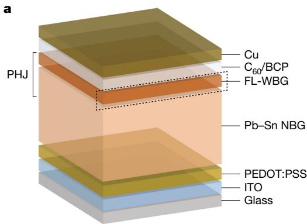

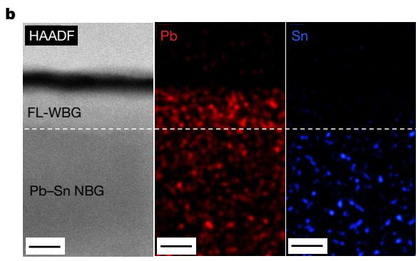

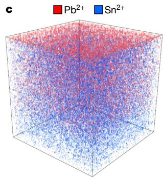

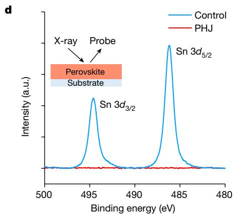

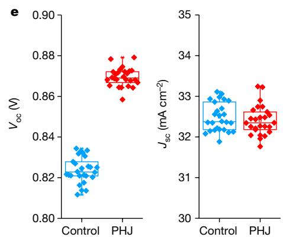

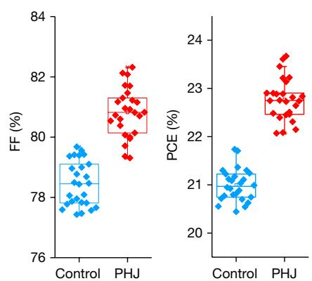

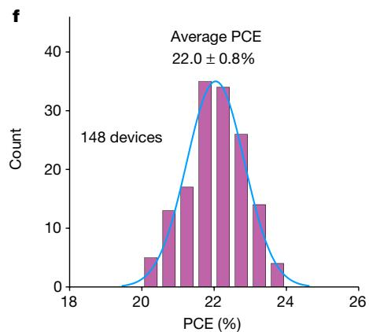

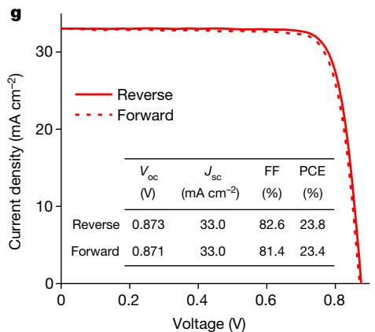

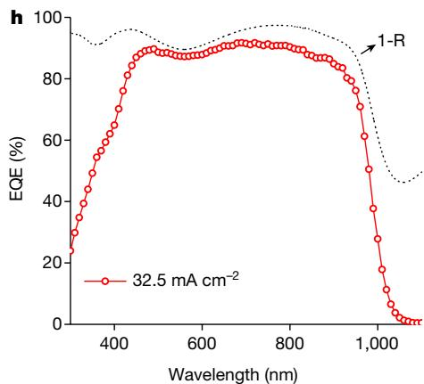  
Fig. 1 | Device structure and PV performance of mixed Pb–Sn NBG PSCs with 3D/3D bilayer PHJ constructed. a, The schematic structure of Pb–Sn PSCs with a 3D/3D bilayer PHJ. b, Cross-sectional HR-STEM image and corresponding EDX mapping of Pb–Sn PSCs with PHJs. Scale bars, $5 0 \mathrm { n m }$ . c, Reconstructed, background-subtracted 3D maps showing the distribution of $\mathrm { \bf \ddot { P } b } ^ { 2 + }$ and $\mathsf { S } \mathsf { n } ^ { 2 + }$ ions within perovskite films. The raster area of the primary ion beam was $1 0 0 \mu \mathrm { m } \times 1 0 0 \mu \mathrm { m }$ and the thickness axis was expanded for clarity. d, Sn $\mathsf { 1 3 } d _ { 5 / 2 } \mathsf { X P S }$

limited by the FF of each subcell under the current matching condition. The improved FF and $V _ { \mathrm { o c } }$ of the NBG bottom cell thereby result in higher FF and $V _ { \mathrm { o c } }$ and thus higher PCE in all-perovskite tandem solar cells. When further integrated with 1.78-eV WBG PSCs, we achieved a record-high certified PCE of $2 8 . 0 \%$ for all-perovskite tandem solar cells23.

# Pb–Sn PSCs with 3D/3D bilayer PHJ

Figure 1a depicts the device architecture of mixed Pb–Sn PSCs with a bilayer PHJ constructed using only 3D perovskites, in which a full-lead wide-bandgap (FL-WBG) perovskite layer was deposited on top of the mixed Pb–Sn perovskite. We used a hybrid two-step method for the deposition of FL-WBG perovskite on top of the Pb–Sn perovskite layer

spectra of control and PHJ perovskite films. e, Comparison of photovoltaic performance between control and PHJ mixed Pb–Sn PSCs with 1,200-nm-thick absorber fabricated over identical runs (26 devices for each type). f, Histograms of PCEs for the PHJ solar cells (148 devices). g, The J–V curve of a champion PHJ solar cell under reverse and forward scans. h, EQE spectra and total absorptance (1-R) of the corresponding champion PHJ device. a.u., arbitrary units; HAADF, high-angle annular dark-field imaging.

(see details in Methods and Supplementary Fig. 1). The formation of the FL-WBG perovskite interlayer was verified using cross-sectional scanning electron microscopy (SEM; Supplementary Fig. 2). To improve the performance of Pb–Sn PSCs with PHJs, we further optimized the composition and thickness of the FL-WBG perovskite layer (see details in Supplementary Note 1, Supplementary Figs. 3–9 and Supplementary Tables 1 and 2). The optimal PV performance was obtained with a composition of $\mathbf { F A } _ { 0 . 7 } \mathbf { C s } _ { 0 . 3 } \mathbf { P b } ( \mathbf { I } _ { 0 . 8 5 } \mathbf { B r } _ { 0 . 1 4 } ) _ { 3 }$ and a thickness of $5 0 \mathsf { n m }$ for the FL-WBG perovskite layer.

We first investigated the morphology and crystalline structure of PHJ-incorporated $\mathtt { P b - S n }$ perovskite films. The FL-WBG perovskite covers the surface of Pb–Sn perovskite film uniformly and densely, as observed from the SEM images (Supplementary Fig. 10). The X-ray

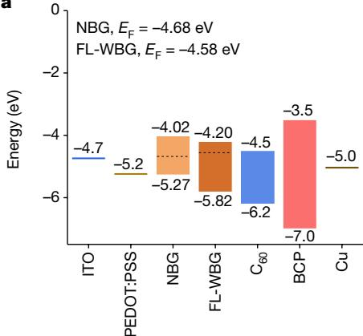  
  
b

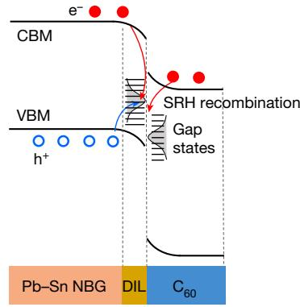  
c

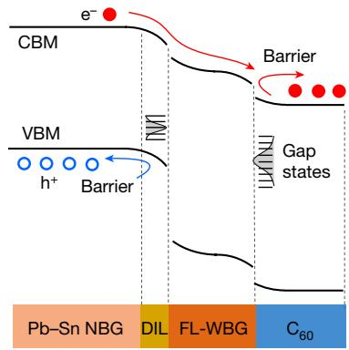

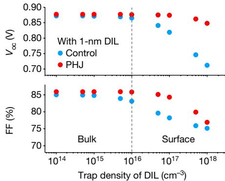

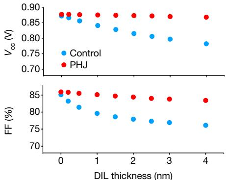  
e

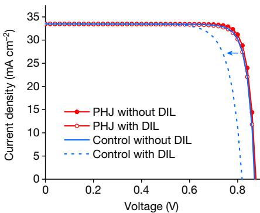  
f   
Fig. 2 | Energy diagram and simulated PV performance of Pb–Sn PSCs with and without PHJs. a, Energy level of each layer in Pb–Sn PSCs with PHJs. The energy-level alignment references the vacuum level (dashed black lines denote the Fermi $( E _ { \mathrm { F } } )$ levels). b,c, Energy diagram for the control and PHJ Pb–Sn PSCs (the structure is shown at the bottom). The PHJ structure enables holes to be driven away (blue lines) and accelerates the drift of electrons (red lines) into the $\mathrm { C } _ { 6 0 }$ transport layer, thereby reducing the non-radiative recombination at the   
DIL. The black and blue lines denote the non-radiative recombination pathways and the directions of carrier drift, respectively. d,e, Simulated performance of the control and PHJ Pb–Sn PSCs with DILs having varying trap density (d) and thickness (e). f, Simulated performance of the control and PHJ Pb–Sn PSCs with and without DILs. CBM, conduction band minimum; SRH, Shockley–Read–Hall; VBM, valence band maximum.

diffraction (XRD) patterns show that the FL-WBG and Pb–Sn perovskite phases independently exist in the heterostructured film. We noted that a thin (for example, approximately $8 0 \mathsf { n m }$ ) PbI /CsBr inorganic layer was able to be completely converted into perovskite phase without the presence of moisture (Supplementary Fig. 11) and there was no residual $\mathsf { P b l } _ { 2 }$ observed in the converted FL-WBG film. The vertical structure of the PHJ was then investigated using cross-sectional high-resolution scanning transmission electron microscopy (HR-STEM) and time-of-flight secondary-ion mass spectrometry (ToF-SIMS). Magnified STEM images and energy-dispersive X-ray (EDX) mapping clearly illustrate a planar heterojunction structure between the FL-WBG and Pb–Sn perovskite layers: we identified a layer thickness of approximately $5 0 \mathsf { n m }$ for the FL-WBG perovskites on top (Fig. 1b). ToF-SIMS results show that $\mathsf { P b } ^ { 2 + }$ and $\mathsf { S } \mathsf { n } ^ { 2 + }$ ions are uniformly distributed within the Pb–Sn perovskite film beneath (Supplementary Fig. 14) and there is a stronger signal of $\mathsf { P b } ^ { 2 + }$ near the heterojunction surface (representing the FL-WBG layer) without noticeable signal of $\mathsf { S } \mathsf { n } ^ { 2 + }$ (Fig. 1c). We found a similar result from the X-ray photoelectron spectroscopy (XPS) measurements (Fig. 1d), indicating no obvious presence of $\mathsf { S } \mathsf { n } ^ { 2 + }$ on the surface of the PHJ. To investigate the structure stability of PHJs, we used EDX and ToF-SIMS to track the spatial distribution of $\mathsf { S } \mathsf { n } ^ { 2 + }$ within the heterojunction for samples stored in an ${ \sf N } _ { 2 }$ -filled glovebox for 60 days (Supplementary Figs. 15 and 16). The results show that the PHJ sample retained its distinct heterostructure, with no evidence of $\mathsf { S } \mathsf { n } ^ { 2 + }$ diffusion into the FL-WBG layer. On the other hand, Br− easily diffused into Pb–Sn perovskites even in fresh PHJ samples (Supplementary Figs. 17 and 18). However, bromide migration has no notable effect on the absorption (bandgap) of Pb–Sn perovskites compared with

the control film (Supplementary Fig. 19) and PHJ devices exhibited no obvious PCE degradation after 3,000 h ageing in the dark (Supplementary Fig. 20).

We then compared the performance of mixed Pb–Sn PSCs with and without PHJs. The PV parameters of the control and PHJ solar cells are compared in Fig. 1e and Supplementary Table 4. The average $V _ { \mathrm { o c } }$ and FF values of the PHJ devices were substantially higher than those of the controls (0.824 V versus 0.869 V, $7 8 . 5 \%$ versus $8 0 . 8 \%$ ; Fig. 1e and Supplementary Table 4), whereas the short-circuit current $( \boldsymbol { J } _ { \mathrm { s c } } )$ remained similar. Correspondingly, the PHJ devices had a considerably higher average PCE of $2 2 . 8 \%$ $2 1 . 0 \%$ for the control). We fabricated 148 PHJ devices and the histogram of their PCE values is presented in Fig. 1f. The best PHJ device showed a PCE of $2 3 . 8 \%$ (stabilized $2 3 . 5 \%$ ; Supplementary Fig. 21), with a $V _ { \mathrm { o c } }$ of 0.873 V, J of 33.0 mA cm−2 and FF o $8 2 . 6 \%$ under reverse scan (Fig. 1g). Figure 1h presents the external quantum efficiency (EQE) spectra of a champion PHJ device, with the integrated photocurrent value of $3 2 . 5 \mathsf { m A c m } ^ { - 2 }$ , in good agreement with the J–V characterization. With 3D PHJs, both the $V _ { \mathrm { o c } }$ and the FF of Pb–Sn PSCs are simultaneously improved, suggesting suppressed non-radiative carrier recombination along with good electrical contact24. We further verified that such performance improvement was probably not because of the diffusion of Br− from the FL-WBG layer into the Pb–Sn absorber layer and chemical passivation (Supplementary Figs. 22 and 23). We also showed that PHJ devices exhibited better tolerance to the deposition process of atomic layer deposition (ALD) $\mathsf { S n O } _ { 2 }$ than did the controls, which would otherwise cause the damage of Pb–Sn perovskite surfaces and thus performance degradation (Supplementary Fig. 24). The unencapsulated ALD $\mathsf { S n O } _ { 2 } \mathsf { P H }$ devices exhibited no obvious PCE degradation

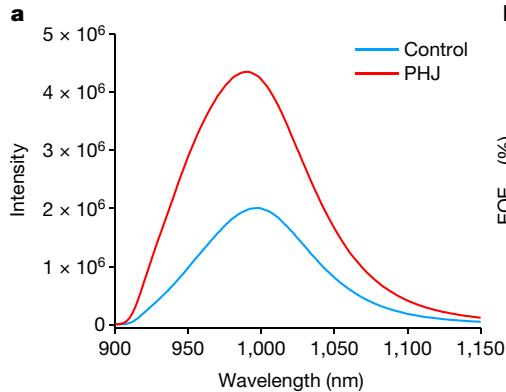

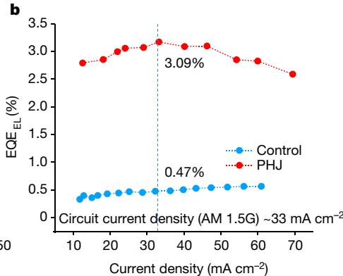

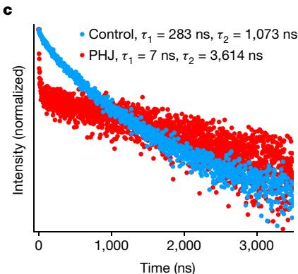

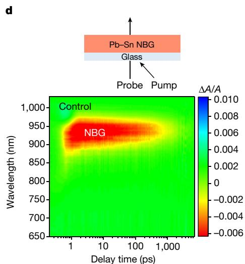

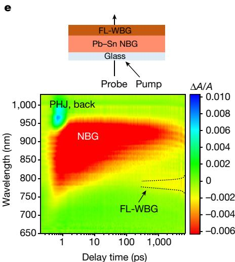

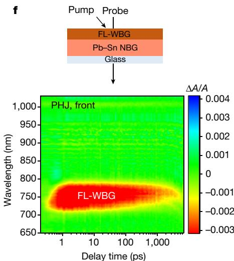  
Fig. 3 | Charge-carrier dynamics at the 3D/3D bilayer PHJ. a, Steady-state PL spectra of control and PHJ Pb–Sn perovskite films (excitation from the glass side). b, Electroluminescence quantum efficiency $\mathrm { ( E O E _ { E L } ) }$ ) versus current density for the control and PHJ devices. c, Steady-state (panel a) and   
time-resolved (panel b) PL spectra of control and PHJ Pb–Sn perovskite films (excitation from the glass side). d–f, The ultrafast TA spectra of control Pb–Sn perovskite films (d) and PHJ perovskite with 405-nm pump light, pumped from the NBG side (e) and the FL-WBG side (f).

after 300 min in air (Supplementary Note 2, Supplementary Figs. 24 and 25 and Supplementary Table 5).

# Charge-carrier dynamics of PHJs

Interfaces play a key role in the performance of PSCs, as they cause severe non-radiative carrier recombination and influence carrier transport5–7 . We used ultraviolet (UV) photoemission spectroscopy to investigate the energy-level alignment between mixed Pb–Sn and FL-WBG perovskites to explain the electronic structure of PHJs. As shown in Supplementary Fig. 26, the work function and valence band maximum of the Pb–Sn (FL-WBG) perovskites are around 4.68 (4.55) eV and 5.27 (5.79) eV, respectively. We further calculated the conduction band minimum based on the optical bandgaps of the Pb–Sn and FL-WBG perovskite films (1.25 eV versus 1.62 eV) (Supplementary Fig. 27). Figure 2a–c illustrates the energy diagrams of PSCs with and without PHJs. We identified a type II band alignment between the Pb–Sn and FL-WBG perovskites, which could substantially reduce the hole concentration and thus reduce charge recombination in the defective interface layer (DIL; the surface layer that has much higher trap density than in the bulk) and facilitate electron extraction into the $\mathrm { C } _ { 6 0 }$ layer owing to the favourable band bending. The type II PHJ is thereby anticipated to suppress non-radiative recombination at the DIL without affecting the carrier transport.

We used the SCAPS-1D simulation tool25 to investigate the effect of PHJs on the PV performance of mixed Pb–Sn PSCs (Fig. 2d,e, Supplementary Figs. 28 and 29 and Supplementary Tables 6–10). We varied

the trap density and layer thickness of the DIL and found that, at low DIL trap densities (similar to the bulk), the PV performances of the control and PHJ devices are comparable. However, when the trap density in the DIL exceeds that of the bulk, the control devices suffer a marked reduction in PV performance as the trap density increases, whereas the PHJ devices do not. Also, unlike the control devices, the performance of PHJ devices is much less sensitive to the DIL thickness. We observed a more than $4 0 \mathrm { m V }$ increase in $V _ { \mathrm { o c } }$ and an absolute $5 \%$ increase in FF when the PHJ was incorporated with DIL thickness and trap density reasonable for experimental conditions (Fig. 2f). Our simulation results indicate that the PHJ can effectively reduce the interfacial non-radiative recombination losses and thereby improve the $V _ { \mathrm { o c } }$ and FF in mixed Pb–Sn PSCs.

We then performed optoelectronic characterization on Pb–Sn perovskite thin films to better understand—in experiments—the improvement in device efficiency by perovskite planar heterostructure. The steady-state photoluminescence (PL) intensity was noticeably increased with PHJs (Fig. 3a), implying suppressed non-radiative recombination24,26. This is further supported by a reduced trap in the PHJ film from space-charge-limited current measurements, a lower dark-saturation-current density of PHJ devices and smaller ideality factor than those of the control (Supplementary Figs. 30–32). Also, Mott–Schottky plot measurements reveal an improvement of about $5 0 \mathrm { m V }$ in built-in potential $( V _ { \mathrm { b i } } )$ in PHJ devices (0.724 V versus 0.775 V, control versus PHJ; Supplementary Fig. 33). On the basis of these findings, we suggest that the heterojunction induces a wider depletion region27, which improves charge-collection efficiency and suppresses

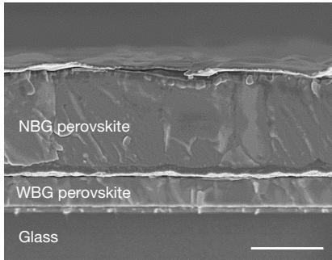  
a

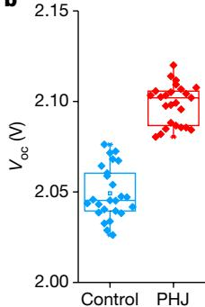  
b

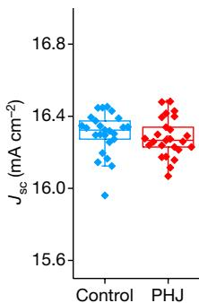

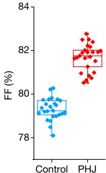

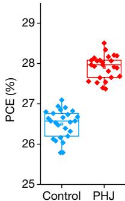

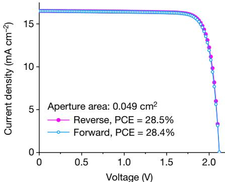  
c

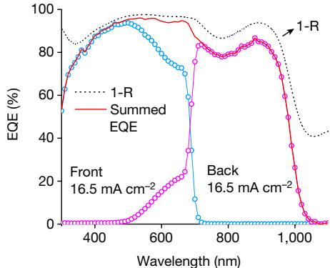  
d

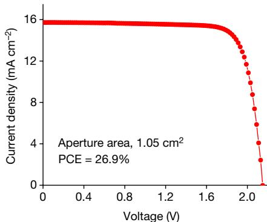  
e

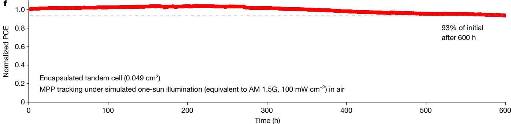  
  
Fig. 4 | PV performance of all-perovskite tandem solar cells with 3D/3D bilayer PHJ in mixed Pb–Sn perovskite subcell. a, Cross-sectional SEM image of all-perovskite tandem solar cell. Scale bar, 1 µm. b, Comparison of PV performance between control and PHJ tandem solar cells processed in the same runs (26 devices for each type). c,d, J–V, EQE and total absorptance (1-R) curves of the champion tandem device with PHJs. e, J–V curve of a large-area tandem device. f, Continuous MPP tracking of an encapsulated tandem solar   
cell over 600 h under simulated AM 1.5G illumination $( 1 0 0 \mathsf { m w c m } ^ { - 2 }$ , multicolour LED simulator) in ambient air with a humidity of $3 0 { - } 5 0 \%$ . The device had an initial PCE of $2 7 . 4 \%$ . The device temperature was around $3 5 ^ { \circ } \mathrm { C }$ during operation owing to the self-heating under solar illumination. There was no passive cooling during device operation, in which the environmental temperature was kept at around $2 5 ^ { \circ } \mathrm { C }$ .

surface recombination by reducing the hole concentration near the film surface28 (Fig. 2b,c).

The electroluminescence quantum yield was further used to analyse the charge-carrier recombination29. At current densities equivalent to the $J _ { \mathrm { s c } }$ at one sun, the electroluminescence quantum yields of control and PHJ devices were $0 . 4 7 \%$ and $3 . 0 9 \%$ (Fig. 3b), corresponding to $V _ { \mathrm { o c } }$ losses of $1 4 7 \mathrm { m V }$ and $9 7 \mathrm { m V }$ , respectively (Supplementary Table 11). Therefore, the reduced $V _ { \mathrm { o c } }$ loss (by around $5 0 \mathrm { m V } ,$ ) with PHJ structures is mainly ascribed to suppressed non-radiative charge-carrier recombination. We carried out time-resolved PL measurements to investigate charge-carrier dynamics (Fig. 3c). The perovskite films with PHJs exhibited an initial fast decay $\mathbf { \Delta } \cdot \mathbf { { \tau } } _ { 1 } = 7$ ns) that is ascribed to the charge-carrier separation, followed by a slow decay component $\ T _ { 2 } { = } 3 , 6 1 4$ ns), mainly caused by bimolecular carrier recombination. The rapid decay component for the PHJ film points towards a fast charge transfer at the type II heterojunction interface30. The control film, on the other hand, has no rapid decay component, whereas its rate of bimolecular recombination $( \tau _ { 1 } = 2 8 3$ ns and $\tau _ { 2 } { = } 1 , 0 7 3$ ns) is shorter than

that of the PHJ film, indicating more severe non-radiative recombination31. We further used differential lifetimes to analyse the process of electron transfer into ETL32,33 (Supplementary Fig. 34). We compare the charge-transfer-rate difference with differential lifetimes between the PHJ and control. The observed gradient for the PHJ sample implied a faster electron transfer to the ETL relative to the control (70 ns versus 110 ns, PHJ versus control; Supplementary Fig. 34), which indicates that the 3D/3D heterostructure promotes electron transfer to the ETL.

We next used ultrafast transient absorption (TA) spectroscopy to prove that the charge-transfer process exists in PHJs. The control film showed a single photobleaching peak at 934 nm without noticeable shift at different time delays (Fig. 3d), indicating a homogenous composition and phase (bandgap) for the control perovskites. We then fabricated a heterojunction sample with a bilayer structure of $3 0 0 \mathsf { n m }$ Pb–Sn NBG/100 nm FL-WBG perovskites (Supplementary Fig. 35) and pumped it using 405-nm light on the NBG side. As well as the 934-nm peak, a second bleaching peak at 780 nm was observed in the TA spectra (Fig. 3e), which we attributed to the FL-WBG perovskite phase. This

Table 1 | PV parameters of the champion WBG subcell, NBG subcell and all-perovskite tandem solar cell   

<table><tr><td>Device</td><td>Scan direction</td><td>Voc(V)</td><td>Jsc(mAcm-2)</td><td>FF(%)</td><td>PCE (%)</td></tr><tr><td rowspan="2">WBG subcell</td><td>Reverse</td><td>1.274</td><td>17.7</td><td>82.6</td><td>18.6</td></tr><tr><td>Forward</td><td>1.272</td><td>17.6</td><td>82.0</td><td>18.4</td></tr><tr><td rowspan="2">NBG subcell</td><td>Reverse</td><td>0.873</td><td>33.0</td><td>82.6</td><td>23.8</td></tr><tr><td>Forward</td><td>0.871</td><td>33.0</td><td>81.4</td><td>23.4</td></tr><tr><td rowspan="3">Tandem</td><td>Reverse</td><td>2.112</td><td>16.5</td><td>81.9</td><td>28.5</td></tr><tr><td>Forward</td><td>2.111</td><td>16.5</td><td>81.4</td><td>28.4</td></tr><tr><td>Stabilized</td><td>-</td><td>-</td><td>-</td><td>28.4</td></tr></table>

The devices have aperture area of 0.049 cm2 .

signal did not appear immediately after photoexcitation but increased over time after 300 ps, indicating that electrons were injected from the Pb–Sn perovskite into the FL-WBG perovskite. When the FL-WBG side was pumped with $4 0 5 \cdot \mathsf { n m }$ pump light, only a 780-nm bleach peak appeared in the TA spectrum without a notable charge-transfer process (Fig. 3f). This suggests that photocarriers are unlikely to be back-transferred from FL-WBG perovskite to Pb–Sn perovskite in solar cells—consistent with the type II band alignment.

# All-perovskite tandem solar cells

Previously reported record-performing all-perovskite tandem solar cells by our group exhibited relatively low FF values (below $78 \%$ )14. Our device-simulation results indicate that the low FF observed in tandem devices is mainly ascribed to the low FFs of NBG subcells under the current-matching condition34 (Supplementary Note 3, Supplementary Fig. 36 and Supplementary Table 12). To investigate how PHJs in the NBG subcell influences the PV performance of tandem devices, we fabricated all-perovskite tandem solar cells with and without PHJs (details in Methods). The self-assembled monolayer (SAM) was introduced to modify the NiO hole-transport layer, which can improve the performance of WBG PSCs35. The WBG perovskite films had a composition of $\mathrm { F A _ { 0 . 8 } C s _ { 0 . 2 } P b ( l _ { 0 . 6 2 } B r _ { 0 . 3 8 } ) _ { 3 } }$ (bandgap of about 1.78 eV). The WBG solar cells exhibited a PCE of $1 8 . 6 \%$ , with a $V _ { \mathrm { o c } }$ of $1 . 2 7 4 \mathrm { V } , J _ { \mathrm { s c } }$ of $1 7 . 7 \mathsf { m A c m } ^ { - 2 }$ and FF of $8 2 . 6 \%$ (Supplementary Fig. 37). The thicknesses of WBG and NBG absorber layers for the front and back subcells were optimized to be about 380 nm and about 1, $2 0 0 \mathsf { n m }$ (Fig. 4a), respectively, to obtain a high matched current density between the subcells.

Typical performances of different subcells and tandem solar cells are shown in Supplementary Fig. 38 and Supplementary Table 13. Under current-matching conditions, the FF of tandem cells is limited by the subpar subcell with poor FF. When the control NBG subcell has low FF, the tandem with NiO/SAM in the WBG subcell exhibited very minor improvement in FF $7 8 . 0 \%$ versus $7 8 . 9 \%$ ). Further, the tandem with the PHJ NBG subcell shows a FF and PCE $7 8 . 0 \%$ versus $8 1 . 4 \%$ and $2 6 . 0 \%$ versus $2 7 . 7 \%$ , control versus PHJ). Figure 4b and Supplementary Table 14 compare the PV parameters of control and PHJ tandem solar cells processed over several identical runs. Compared with control devices without PHJs in NBG subcells, PHJ tandems exhibited substantially improved performance in FF and $V _ { \mathrm { o c } }$ . The average PCE of PHJ tandems is thereby improved to $2 7 . 9 \pm 0 . 3 \%$ (versus $2 6 . 5 \pm 0 . 3 \%$ for control devices). We further fabricated 282 PHJ tandem devices (Supplementary Fig. 39) and a relatively narrow distribution indicates a good reproducibility of tandem solar cells with PHJs. The J–V curves of the best-performing PHJ tandem device measured from both reverse and forward scans are presented in Fig. 4c, showing very minor hysteresis. The champion tandem cell had a PCE o $2 8 . 5 \%$ from the reverse scan (with a $V _ { \mathrm { o c } } { \bf o f } 2 . 1 1 2 \ : \mathrm { V } ,$ $V _ { \mathrm { o c } }$ , $J _ { \mathrm { s c } }$ of 16.5 mA cm−2 and FF of $8 1 . 9 \%$ ; Table 1) and exhibited a stabilized

PCE of $2 8 . 4 \%$ (Supplementary Fig. 40). The integrated $J _ { \mathrm { s c } }$ values of the WBG and NBG subcells from EQE spectra are both $1 6 . 5 \mathsf { m A c m } ^ { - 2 }$ (Fig. 4d), in good agreement with the $J _ { \mathrm { s c } }$ determined from J–V measurements. We sent a tandem solar cell to an accredited independent PV calibration laboratory ( Japan Electrical Safety & Environment Technology Laboratories, JET) for independent measurements. The tandem device delivered a certified stabilized PCE of $2 8 . 0 \%$ (Supplementary Fig. 41). We also fabricated tandem cells with a larger area; our best-performing large-area device (aperture area of $1 . 0 5 \mathrm { c m } ^ { 2 }$ ) exhibited a PCE of up to $2 6 . 9 \%$ with a $V _ { \mathrm { o c } }$ of $2 . 1 4 9 \mathrm { V } , J _ { \mathrm { s c } }$ of $1 5 . 7 \mathsf { m A c m } ^ { - 2 }$ and FF of $7 9 . 8 \%$ (Fig. 4e). The corresponding EQE spectra are presented in Supplementary Fig. 42.

Nevertheless, there remain electrical and optical losses that need to be further addressed to leverage the full potential of all-perovskite tandem solar cells (Supplementary Note 4, Supplementary Fig. 43, Table 1 and Supplementary Table 15). Comparing the PV performance of tandem cells with the Shockley–Queisser limit36, there is notable electrical loss for $V _ { \mathrm { o c } }$ and FF. Such $V _ { \mathrm { o c } }$ and FF losses are mainly because of the non-radiative recombination and inefficient charge collection in perovskite bulk and perovskite–transport layer interface37,38. Also, combining WBG and NBG subcells in tandem can lead to a further $V _ { \mathrm { o c } }$ loss by the tunnel recombination junction (Supplementary Fig. 43a and Supplementary Table 15). Two promising pathways to minimize the electrical loss include reducing the bulk defect density and passivating the contact interface. Furthermore, $J _ { \mathrm { s c } }$ in tandems can be further improved by reducing optical losses, originated from reflection and parasitic absorption within the tandem devices, as well as insufficient light absorption by the NBG perovskite absorber14 (Supplementary Note 4, Fig. 4d and Supplementary Fig. 43b). Potential methods to address the optical loss include reducing optical reflection through light management, using more transparent front electrodes and hole-transport material, and exploring thicker NBG perovskite absorber layers. Combining these efforts, a PCE higher than $30 \%$ is likely to be reached by empirically assuming a $V _ { \mathrm { o c } }$ of 2.2 V, $\mathsf { a } J _ { \mathrm { s c } }$ of 17 mA cm−2 and an FF of $82 \%$ .

We investigated the operational stability of encapsulated tandem devices in ambient air (Supplementary Fig. 44), using maximum power point (MPP) tracking under a simulated one-sun illumination. The tandem device with PHJ exhibited promising operational stability and maintained $9 3 \%$ of its initial PCE after MPP operation over $^ { 6 0 0 \mathrm { h } }$ (Supplementary Fig. 45 and Fig. 4f). We found that the performance degradation after 688 h of operation was mainly because of FF drop (Supplementary Fig. 46), which could partially result from the migration of Au from the tunnel recombination junction into the perovskite absorber13. Notably, we observed that the reverse-bias stability of all-perovskite tandem solar cells was superior to that of singlejunction PSCs (Supplementary Note 6 and Supplementary Fig. 47). The improvement in reverse-bias stability is beneficial to the robustness of all-perovskite tandem solar cells under partial shading conditions. We also investigated the thermal stability of the tandem devices and found that the PCE of tandem cells declined faster at elevated temperatures than at room temperature. However, we did not observe any signal of $\mathsf { S } \mathsf { n } ^ { 2 + }$ on FL-WBG perovskite after stressing for 264 h (Supplementary Note 7 and Supplementary Figs. 48 and 49). Our previous work showed that the thermal stability of all-perovskite tandem solar cells can be further improved by replacing the back-metal electrodes with more robust materials such as conductive transparent oxides, developing MA-free and PEDOT:PSS-free Pb–Sn perovskite subcells and using thermally stable tunnel recombination junctions13,39,40. Advanced stabilization technologies should be further coupled in depth with degradation mechanisms to enhance the stability of all-perovskite tandems in future research.

# Online content

Any methods, additional references, Nature Portfolio reporting summaries, source data, extended data, supplementary information,

acknowledgements, peer review information; details of author contributions and competing interests; and statements of data and code availability are available at https://doi.org/10.1038/s41586-023-06278-z.

1. Jošt, M., Kegelmann, L., Korte, L. & Albrecht, S. Monolithic perovskite tandem solar cells: a review of the present status and advanced characterization methods toward $3 0 \%$ efficiency. Adv. Energy Mater. 10, 1904102 (2020).   
2. Li, Z. et al. Cost analysis of perovskite tandem photovoltaics. Joule 2, 1559–1572 (2018).   
3. Albrecht, S. & Rech, B. Perovskite solar cells: on top of commercial photovoltaics. Nat. Energy 2, 16196 (2017).   
4. Savill, K. J., Ulatowski, A. M. & Herz, L. M. Optoelectronic properties of tin–lead halide perovskites. ACS Energy Lett. 6, 2413–2426 (2021).   
5. Yang, Y. et al. Top and bottom surfaces limit carrier lifetime in lead iodide perovskite films. Nat. Energy 2, 16207 (2017).   
6. Ricciarelli, D., Meggiolaro, D., Ambrosio, F. & De Angelis, F. Instability of tin iodide perovskites: bulk p-doping versus surface tin oxidation. ACS Energy Lett. 5, 2787–2795 (2020).   
7. Park, S. M., Abtahi, A., Boehm, A. M. & Graham, K. R. Surface ligands for methylammonium lead iodide films: surface coverage, energetics, and photovoltaic performance. ACS Energy Lett. 5, 799–806 (2020).   
8. La-Placa, M. G. et al. Vacuum-deposited 2D/3D perovskite heterojunctions. ACS Energy Lett. 4, 2893–2901 (2019).   
9. Chen, C. et al. Arylammonium-assisted reduction of the open-circuit voltage deficit in wide-bandgap perovskite solar cells: the role of suppressed ion migration. ACS Energy Lett. 5, 2560–2568 (2020).   
10. Lin, R. et al. Monolithic all-perovskite tandem solar cells with $2 4 . 8 \%$ efficiency exploiting comproportionation to suppress Sn(II) oxidation in precursor ink. Nat. Energy 4, 864–873 (2019).   
11. Xiao, K. et al. All-perovskite tandem solar cells with $2 4 . 2 \%$ certified efficiency and area over 1 cm2 using surface-anchoring zwitterionic antioxidant. Nat. Energy 5, 870–880 (2020).   
12. Xiao, K. et al. Scalable processing for realizing $2 1 . 7 \%$ -efficient all-perovskite tandem solar modules. Science 376, 762–767 (2022).   
13. Gao, H. et al. Thermally stable all-perovskite tandem solar cells fully using metal oxide charge transport layers and tunnel junction. Sol. RRL 5, 2100814 (2021).   
14. Lin, R. et al. All-perovskite tandem solar cells with improved grain surface passivation. Nature 603, 73–78 (2022).   
15. Park, K., Lee, J. H. & Lee, J. W. Surface defect engineering of metal halide perovskites for photovoltaic applications. ACS Energy Lett. 7, 1230–1239 (2022).   
16. Liu, J. et al. Efficient and stable perovskite-silicon tandem solar cells through contact displacement by MgF . Science 377, 302–306 (2022).   
17. Azmi, R. et al. Damp heat-stable perovskite solar cells with tailored-dimensionality 2D/3D heterojunctions. Science 376, 73–77 (2022).   
18. Wei, M. et al. Combining efficiency and stability in mixed tin–lead perovskite solar cells by capping grains with an ultrathin 2D layer. Adv. Mater. 32, 1907058 (2020).   
19. Chen, H. et al. Quantum-size-tuned heterostructures enable efficient and stable inverted perovskite solar cells. Nat. Photonics 16, 352–358 (2022).   
20. Azpiroz, J. M., Mosconi, E., Bisquert, J. & De Angelis, F. Defect migration in methylammonium lead iodide and its role in perovskite solar cell operation. Energy Environ. Sci. 8, 2118–2127 (2015).

21. Mosconi, E. & De Angelis, F. Mobile ions in organohalide perovskites: interplay of electronic structure and dynamics. ACS Energy Lett. 1, 182–188 (2016).   
22. Haruyama, J., Sodeyama, K., Han, L. & Tateyama, Y. First-principles study of ion diffusion in perovskite solar cell sensitizers. J. Am. Chem. Soc. 137, 10048–10051 (2015).   
23. Green, M. A. et al. Solar cell efficiency tables (Version 60). Prog. Photovolt. Res. Appl. 30, 687–701 (2022).   
24. Hu, S. et al. Optimized carrier extraction at interfaces for 23.6% efficient tin–lead perovskite solar cells. Energy Environ. Sci. 15, 2096–2107 (2022).   
25. Burgelman, M., Nollet, P. & Degrave, S. Modelling polycrystalline semiconductor solar cells. Thin Solid Films 361, 527–532 (2000).   
26. Kapil, G. et al. Tin-lead perovskite fabricated via ethylenediamine interlayer guides to the solar cell efficiency of $2 1 . 7 4 \%$ . Adv. Energy Mater. 11, 2101069 (2021).   
27. Jang, Y. W. et al. Intact 2D/3D halide junction perovskite solar cells via solid-phase in-plane growth. Nat. Energy 6, 63–71 (2021).   
28. Menzel, D. et al. Field effect passivation in perovskite solar cells by a LiF interlayer. Adv. Energy Mater. 12, 2201109 (2022).   
29. Rau, U. Reciprocity relation between photovoltaic quantum efficiency and electroluminescent emission of solar cells. Phys. Rev. B 76, 085303 (2007).   
30. Wu, Y. et al. Perovskite solar cells with $1 8 . 2 1 \%$ efficiency and area over 1 cm2 fabricated by heterojunction engineering. Nat. Energy 1, 16148 (2016).   
31. Tong, J. et al. Carrier lifetimes of >1 μs in Sn-Pb perovskites enable efficient all-perovskite tandem solar cells. Science 364, 475–479 (2019).   
32. Krogmeier, B., Staub, F., Grabowski, D., Rau, U. & Kirchartz, T. Quantitative analysis of the transient photoluminescence of $\mathsf { C H } _ { 3 } \mathsf { N H } _ { 3 } \mathsf { P b l } _ { 3 } / \mathsf { P C } _ { 6 1 } \mathsf { B M }$ heterojunctions by numerical simulations. Sustain. Energy Fuels 2, 1027–1034 (2018).   
33. Caprioglio, P. et al. Monolithic perovskite/silicon tandem solar cell wit ${ > } 2 9 \%$ efficiency by enhanced hole extraction. Science 370, 1300–1309 (2020).   
34. Santbergen, R. et al. GenPro4 optical model for solar cell simulation and its application to multijunction solar cells. IEEE J. Photovolt. 7, 919–926 (2017).   
35. Li, L. et al. Flexible all-perovskite tandem solar cells approaching $2 5 \%$ efficiency with molecule-bridged hole-selective contact. Nat. Energy 7, 708–717 (2022).   
36. Rühle, S. Tabulated values of the Shockley–Queisser limit for single junction solar cells. Sol. Energy 130, 139–147 (2016).   
37. Thiesbrummel, J. et al. Understanding and minimizing $V _ { \mathrm { o c } }$ losses in all-perovskite tandem photovoltaics. Adv. Energy Mater. 13, 2202674 (2022).   
38. Stolterfoht, M. et al. Approaching the fill factor Shockley–Queisser limit in stable, dopant-free triple cation perovskite solar cells. Energy Environ. Sci. 10, 1530–1539 (2017).   
39. Wen, J. et al. Steric engineering enables efficient and photostable wide-bandgap perovskites for all-perovskite tandem solar cells. Adv. Mater. 34, 2110356 (2022).   
40. Wu, P. et al. Efficient and thermally stable all-perovskite tandem solar cells using all-FA narrow-bandgap perovskite and metal-oxide-based tunnel junction. Adv. Energy Mater. 12, 220948 (2022).

Publisher’s note Springer Nature remains neutral with regard to jurisdictional claims in published maps and institutional affiliations.

Springer Nature or its licensor (e.g. a society or other partner) holds exclusive rights to this article under a publishing agreement with the author(s) or other rightsholder(s); author self-archiving of the accepted manuscript version of this article is solely governed by the terms of such publishing agreement and applicable law.

© The Author(s), under exclusive licence to Springer Nature Limited 2023

# Methods

# Materials

All materials were used as received without further purification. The organic halide salts (FAI, FABr, MAI, FAI and CF3-PACl) were purchased from GreatCell Solar Materials. PEDOT:PSS aqueous solution (Al 4083) was purchased from Heraeus Clevios. SAM: 2-PACz and MeO-2PACz, $\mathsf { P b l } _ { 2 } ( 9 9 . 9 9 \% )$ , CsI (99.9%) and CsBr $( 9 9 . 9 \% )$ were purchased from TCI Chemicals. $\mathbf { S n l } _ { 2 } ( 9 9 . 9 9 9 \% )$ $\mathsf { S n l } _ { 2 }$ was purchased from Alfa Aesar. $\mathsf { S n F } _ { 2 } ( 9 9 \% )$ , DMF $( 9 9 . 8 \%$ anhydrous), DMSO $( 9 9 . 9 \%$ anhydrous), ethyl acetate $( 9 9 . 8 \%$ anhydrous), chlorobenzene $9 9 . 8 \%$ anhydrous) and propan-2-ol (IPA, $9 9 . 8 \%$ anhydrous) were purchased from Sigma-Aldrich. $\mathbf { C } _ { 6 0 }$ was purchased from Nano-C. BCP $5 9 9 \%$ sublimed) was purchased from Xi’an Polymer Light Technology.

# Perovskite precursor solution

NBG $\mathbf { F A } _ { 0 , 7 } \mathbf { M A } _ { 0 , 3 } \mathbf { P b } _ { 0 , 5 } \mathbf { S } \mathsf { n } _ { 0 , 5 } \mathsf { I } _ { 3 }$ perovskite. The precursor solution was prepared in mixed solvents of DMF and DMSO with a volume ratio of 2:1. The molar ratios for FAI/MAI and $\mathrm { P b I } _ { 2 } / \mathsf { S n l } _ { 2 }$ were 0.7:0.3 and 0.5:0.5, respectively. The molar ratio of (FAI+MAI)/ $( \mathsf { P b l } _ { 2 } ^ { } + \mathsf { S n l } _ { 2 } ^ { } )$ ) was 1:1. $\mathsf { S n F } _ { 2 }$ $( 1 0 \mathrm { m o l \% }$ relative to $\mathsf { S n l } _ { 2 }$ ) was added in the precursor solution. The precursor solution was stirred at room temperature for 2 h. Tin powders $( 5 \mathrm { { m g } \mathrm { { m l } ^ { - 1 } ) } }$ were added in the precursor to reduce ${ \mathsf { S n } } ^ { 4 + }$ in the precursor solution and to improve film uniformity. For mixed Pb–Sn precursor solution, passivating ligand 4-trifluoromethyl-phenylammonium chloride (CF3-PACl, $0 . 3 \mathrm { m o l \% }$ ) was added, and the role of CF3-PA additive was discussed in our previous work14. Note that CF3-PA was added to all the mixed Pb–Sn perovskite films, including the PHJ samples, to improve the PV performance of Pb–Sn NBG PSCs. The precursor solution was filtered through a $0 . 2 2 \cdot \mu \mathrm { m }$ PTFE membrane before making perovskite films.

WBG $\mathbf { F A } _ { 0 . 8 } \mathbf { C s } _ { 0 . 2 } \mathbf { P b } ( \mathbf { I } _ { 0 . 6 2 } \mathbf { B } \mathbf { r } _ { 0 . 3 8 } ) _ { 3 }$ perovskite. The precursor solution (1.2 M) was prepared from six precursors dissolved in mixed solvents of DMF and DMSO with a volume ratio of 4:1. The molar ratios for FAI/ FABr/CsI/CsBr and $\mathsf { P b I } _ { 2 } / \mathsf { P b B r } _ { 2 }$ were 0.48:0.32:0.12:0.08 and 0.62:0.38, respectively. The molar ratio of (FAI+FABr+CsI+CsBr)/ $( \mathsf { P b l } _ { 2 } \mathsf { + P b B r } _ { 2 } )$ was 1:1. The precursor solution was stirred at $5 0 ^ { \circ } \mathrm { C }$ for 2 h and then filtered through a $0 . 2 2 \cdot \mu \mathrm { m }$ PTFE membrane before use.

FL-WBG organic salt solution. The precursor solution (0.1 M) was prepared from FAI and FABr dissolved in IPA. The molar ratio for FAI/ FABr was 1:1. The precursor solution was stirred at $2 5 ^ { \circ } \mathrm { C }$ for 12 h and then filtered through a $0 . 2 2 \cdot \mu \mathrm { m }$ PTFE membrane before use.

# Device fabrication

Control mixed Pb–Sn PSCs. The PSCs had a device structure of glass/ ITO/PEDOT:PSS/perovskite $\mathrm { \prime C _ { 6 0 } / B C P / C u }$ , in which PEDOT:PSS is poly (3,4-ethylenedioxythiophene) polystyrene sulfonate, $\mathsf { C } _ { 6 0 }$ is fullerene and BCP is bathocuproine. The pre-patterned ITO glass substrates were sequentially cleaned using acetone and isopropanol. PEDOT:PSS was spin-coated on ITO substrates at 4,000 rpm for 30 s and annealed on a hot plate at $1 5 0 ^ { \circ } \mathrm { C }$ for 10 min in ambient air. After cooling, we transferred the substrates immediately to a nitrogen-filled glovebox for the deposition of perovskite films. The perovskite films (2.4 M) were deposited with two-step spin-coating procedures: (1) 1,000 rpm for 10 s with an acceleration of 200 rpm $\mathsf { \pmb { S } } ^ { - 1 }$ and (2) 4,000 rpm for 40 s with a ramp-up of 1,000 rpm s−1. Ethyl acetate $( 3 0 0 \mu \mathrm { l } )$ was dropped on the spinning substrate during the second spin-coating step at 20 s before the end of the procedure. The substrates were then transferred on a hot plate and heated at $1 0 0 ^ { \circ } \mathrm { C }$ for 10 min. After cooling down to room temperature, the substrates were transferred to the evaporation system. Finally, $\mathrm { C } _ { 6 0 } ( 2 0 \ : \mathrm { n m } ) / \mathrm { B C P } \left( 7 \ : \mathrm { n m } \right) / \mathrm { C u } \left( 1 5 0 \ : \mathrm { n m } \right)$ were sequentially deposited on top of the perovskite by thermal evaporation (Beijing Technol Science).

3D/3D bilayer PHJ mixed Pb–Sn PSCs. The control mixed Pb–Sn perovskite films were transferred to the evaporation system. $\mathsf { P b l } _ { 2 } /$ CsBr was deposited on the control NBG perovskite films according to different evaporation rate ratios, and the evaporation deposition rates of $\mathsf { P b l } _ { 2 }$ and CsBr were slow to obtain dense FL-WBG perovskites. We prepared inorganic framework layers with a dual-source co-evaporation of $\mathrm { P b l } _ { 2 }$ at $0 . 2 5 \mathring { \mathbf { A } } \mathbf { S } ^ { - 1 }$ and CsBr at $0 . { \overset { \cdot } { 1 } } { \overset { \circ } { \mathbf { A } } } \mathbf { s } ^ { - 1 }$ (the PbI /CsBr rate ratio was kept at 5:2), until the thickness of the inorganic framework layer reached roughly 30 nm. The thickness of the $\mathsf { P b l } _ { 2 }$ /CsBr layer was read from the evaporation equipment and the thickness was calibrated by the films evaporated on bare ITO glass substrates. We transferred the NBG perovskite films with the PbI2/CsBr inorganic layer deposited on top to a spin coater for organic salt deposition. The organic salt was deposited with two-step spin-coating procedures in a $\mathsf { N } _ { 2 }$ glovebox: (1) 1,000 rpm for 10 s with an acceleration of 1,000 rpm $\mathsf { \pmb { S } } ^ { - 1 }$ and (2) 4,000 rpm for 30 s with a ramp-up of 2,000 rpm $\mathsf { s } ^ { - 1 }$ . Organic salt $( 1 6 0 \mu \mathrm { l } )$ ) was dropped on the spinning substrate during the second spin-coating step at 20 s before the end of the procedure. The substrates were then transferred on a hot plate and heated at $1 0 0 ^ { \circ } \mathrm { C }$ for 2 min. After cooling down to room temperature, the surface of the NBG perovskite film with FL-WBG layer was washed with $2 6 0 \mu \mathrm { l } \mathsf { I } \mathsf { I } \mathsf { P } \mathsf { A }$ (4,000 rpm for 20 s) to remove excess organic salts. The substrates were then transferred on a hot plate and heated at $1 0 0 ^ { \circ } \mathrm { C }$ for 1 min. After cooling down to room temperature, $8 0 \mu \mathrm { l }$ PEAI $\mathrm { 1 m g m l ^ { - 1 } }$ in IPA) was dynamically spin-coated on FL-WBG and transferred on a hot plate and heated at $1 0 0 ^ { \circ } \mathrm { C }$ for 30 s. The thickness of the converted FL-WBG perovskite layer deposited on bare ITO glass substrate was measured by SEM cross-section. Supplementary Figs. 12 and 13 and Supplementary Table 3 compare the PV performance of control and PHJ Pb–Sn solar cells processed over several identical runs. PHJ devices with PEAI post-treatment showed a slightly higher average FF and PCE $( 8 0 . 1 \%$ versus $8 1 . 2 \%$ and $2 2 . 5 \%$ versus $2 2 . 7 \%$ , without versus with PEAI post-treatment). However, such PEAI post-treatment deteriorated the PV performance of control Pb–Sn devices. After cooling down to room temperature, the substrates were transferred to the evaporation system. Finally, $\mathrm { C } _ { 6 0 } ( 2 0 \ : \mathrm { n m } ) / \mathrm { B C P } \left( 7 \ : \mathrm { n m } \right) / \mathrm { C u } \left( 1 5 0 \ : \mathrm { n m } \right)$ were sequentially deposited on top of the perovskite by thermal evaporation (Beijing Technol Science). For Pb–Sn subcells with ALD $\mathsf { S n O } _ { 2 }$ as the ETL, the BCP layer was replaced by an ALD $\mathsf { S n O } _ { 2 }$ layer (about 15 nm), which was deposited at low temperatures (typically $7 5 ^ { \circ } \mathrm { C } )$ to avoid any damage to the Pb–Sn perovskite absorber layer. Details on the deposition condition of ALD $\mathsf { S n O } _ { 2 }$ layers can be found in our previous work11.

All-perovskite tandem solar cells. We fabricated all-perovskite tandem solar cells with a device configuration of glass/ITO/NiO/SAM/ WBG perovskite/C60/ALD SnO2/Au/PEDOT:PSS/NBG perovskite $/ { \mathsf C } _ { 6 0 } /$ BCP or ALD/Cu. NiO nanocrystal $( 1 5 \mathsf { m g m l ^ { - 1 } }$ in water) layers were first spin-coated on ITO substrates at 3,000 rpm for 30 s and annealed on a hot plate at $1 3 0 ^ { \circ } \mathrm { C }$ for 30 min in air. NiO nanocrystals were synthesized according to a previous report41. After cooling, the substrates were immediately transferred to the glovebox. SAM: 2PACz and MeO-2PACz, mixed with volume ratios of 75:25 at the same concentration (1 mM in IPA), were spin-coated on the NiO film at 6,000 rpm for 30 s and the sample was then annealed at $1 5 0 ^ { \circ } \mathrm { C }$ for 10 min. Details on the mixed SAMs for HTL has been discussed in our previous work35. The WBG perovskite films were deposited on top of SAM modified NiO with two-step spin-coating procedures. The first step was 2,000 rpm for 10 s with an acceleration of $2 0 0 \ r { \mathsf { p m } } s ^ { - 1 }$ $\mathsf { \pmb { S } } ^ { - 1 }$ . The second step was 6,000 rpm for 40 s with a ramp-up of 2,000 rpm $\mathsf { \pmb { S } } ^ { - 1 }$ . Chlorobenzene $( 2 0 0 \mu \mathrm { l } )$ was dropped on the spinning substrate during the second spin-coating step at 20 s before the end of the procedure. The substrates were then transferred on a hot plate and heated at $1 0 0 ^ { \circ } \mathrm { C }$ for 15 min. After cooling down to room temperature, the substrates were transferred to the evaporation system and a 20-nm-thick $\mathbf { C } _ { 6 0 }$ film was subsequently deposited on top by thermal evaporation at a rate of $0 . 2 \mathring \mathbf { A } \mathbf { S } ^ { - 1 }$ . The substrates were

# Article

then transferred to the ALD system (Veeco Savannah S200) to deposit $2 0 \mathsf { n m } \mathsf { S n O } _ { 2 }$ at low temperatures (typically $1 0 0 ^ { \circ } \mathrm { C } ,$ ) using precursors of tetrakis(dimethylamino)tin(IV) $( 9 9 . 9 9 9 9 \%$ ; Nanjing Ai Mou Yuan Scientific Equipment Co., Ltd.) and deionized water. After ALD deposition, the substrates were transferred back to the thermal evaporation system to deposit an ultrathin layer of Au clusters (approximately $0 . 4 \mathsf { n m } )$ ) on ALD $\mathsf { S n O } _ { 2 }$ . PEDOT:PSS layers were spin-cast on top of front cells and annealed in air at $1 2 0 ^ { \circ } \mathrm { C }$ for 20 min. After the substrates had cooled, we immediately transferred the substrates to a nitrogen-filled glovebox for the deposition of control and PHJ NBG perovskite films with identical procedures used for the single-junction devices. Finally, $2 0 \mathrm { n m C } _ { 6 0 } ,$ 7 nm BCP and 150 nm Cu films were sequentially deposited by thermal evaporation (Beijing Technol Science). Details on the deposition of ALD $\mathsf { S n O } _ { 2 }$ layers can be found in our previous work11.

# Encapsulation

Perovskite outside the encapsulation area is removed before the encapsulation. The cover glass has a cavity inside to make sure that there is no direct contact between the active area of the solar cell and the cover glass. The UV epoxy is attached around the edges of the cover glass and should not make contact with the active area of the solar cell. To improve the protection effect of the encapsulation, UV epoxy is applied to the entire active area of the solar cell and a plane glass is used for encapsulation. After this encapsulation, we observed a slight decrease in FF of the device (Supplementary Note 5 and Supplementary Fig. 45a), which is probably because of the reaction of the perovskite material with vapours outgassing from the UV epoxy during the UV epoxy curing process42.

# Characterization of solar cells

For single-junction solar cells, the current density–voltage ( J–V) characteristics were measured using a Keithley 2400 SourceMeter under the illumination of the Enlitech Solar Simulator (Class AAA) at the light intensity of $1 0 0 \mathsf { m } \mathsf { W } \mathsf { c m } ^ { - 2 }$ , as checked with NREL-calibrated reference solar cells (KG-5 and KG-0 reference cells were used for the measurements of WBG and NBG solar cells, respectively). Unless otherwise stated, the J–V curves were all measured in a nitrogen-filled glovebox with a scanning rate of $1 0 0 \mathrm { m V s ^ { - 1 } }$ (voltage steps of $2 0 \mathrm { m V }$ and a delay time of 100 ms). The active area was determined by the aperture shade masks (0.049 or $1 . 0 5 \mathrm { c m } ^ { 2 } )$ ) placed in front of the solar cells. EQE measurements were performed in ambient air using a QE system (Enlitech) with monochromatic light focused on the device pixel and a chopper frequency of ${ 2 0 } \mathrm { H z }$ . For tandem solar cells, the J–V characteristics were carried out under the illumination of a two-lamp high-spectral-match solar simulator (San-EI Electric, XHS-50S1). The spectra from the simulator were finely tuned to ensure that spectral mismatch is within $100 \pm 3 \%$ for each 50-nm interval in the wavelength range 400–1,000 nm. The solar simulator was set at the light intensity of $1 0 0 \mathsf { m } \mathsf { W } \mathsf { c m } ^ { - 2 }$ , as checked with a calibrated crystalline silicon reference solar cell with a quartz window (KG-0). EQE measurements were performed in ambient air and the bias illumination from highly bright light-emitting diodes (LEDs) with emission peaks of 850 and $4 6 0 \mathsf { n m }$ were used for the measurements of the front and back subcells, respectively.

# Stability tests of solar cells

The operational stability tests were carried out under full AM 1.5G illumination (Class AAA, multicolour LED solar simulator; Guangzhou Crysco Equipment Co. Ltd.) with an intensity of $1 0 0 \mathsf { m } \mathsf { W } \mathsf { c m } ^ { - 2 }$ using a home-built LabVIEW-based MPP tracking system and a ‘perturb and observe’ method in ambient conditions (humidity of $3 0 { - } 5 0 \%$ ). The solar cells were encapsulated with a cover glass and UV epoxy (ThreeBond), which was cured under a UV-LED lamp (peak emission at 365 nm) for 3 min. No UV filter was applied during operation. The environmental temperature was kept at around $2 5 ^ { \circ } \mathrm { C }$ . The solar-cell temperature increased to about $3 5 ^ { \circ } \mathrm { C }$ under illumination, as no passive

cooling was implemented to the measurement stage. The illumination intensity was regularly calibrated to check the degradation of the LED lamp. The dark long-term shelf-stability assessments of solar cells (without encapsulation) were carried out by repeating the J–V characterizations over various times and the devices were stored in a ${ \Nu } _ { 2 }$ glovebox.

# Steady-state and time-resolved PL

Steady-state PL and time-resolved PL were measured using a HORIBA Fluorolog time-correlated single-photon-counting system with photomultiplier tube detectors. The light was illuminated from the top surface of the perovskite film. For steady-state PL measurements, the excitation source was from a monochromated Xe lamp (peak wavelength at $5 2 0 \mathsf { n m }$ with a line width of $2 \mathsf { n m }$ ). For time-resolved PL, a green laser diode $\lambda = 5 4 0 \mathrm { n m }$ ) was used for the excitation source with an excitation power density of $5 \mathsf { m w c m } ^ { - 2 }$ . The PL decay curves were fitted with biexponential components to obtain a fast and a slow decay lifetime.

# Femtosecond transient absorption measurements

Femtosecond laser pulses were produced using a regeneratively amplified Yb:KGW laser at a 5-kHz repetition rate (Light Conversion, PHAROS). The pump pulse was generated by passing a portion of the 1,030-nm probe pulse through an optical parametric amplifier (Light Conversion, ORPHEUS), with the second harmonic of the signal pulse selected for 400-nm light. Both the pump and probe pulses (pulse duration 250 fs) were directed into an optical bench (Ultrafast, Helios), in which a white-light continuum was generated by focusing the 1,030-nm probe pulse through a sapphire crystal. The time delay was adjusted by optically delaying the probe pulse, with time steps increasing exponentially. A chopper was used to block every other pump pulse and each probe pulse was measured by a charge-coupled device after dispersion by a grating spectrograph (Ultrafast, Helios). Samples were prepared on a glass substrate and translated at 1 mm $\mathsf { \pmb { S } } ^ { - 1 }$ during the measurement. Pump fluences were kept at $4 \mu \ c \mathrm { m } ^ { - 2 }$ .

# Space-charge-limited current

The hole-only and electron-only devices were fabricated to obtain the density of hole traps or electron traps using the following architectures: ITO/PEDOT:PSS/perovskite/spiro-OMeTAD/Au for holes and ITO/ TiO2-Cl/PCBM/perovskite $\mathrm { \langle C _ { 6 0 } / B C P / C u }$ for electrons. Measurements were carried out in a glovebox using a Keithley 2400 SourceMeter. The trap density $N _ { \mathrm { t r a p } }$ is determined by the equation $V _ { \mathrm { T F L } } = q N _ { \mathrm { t r a p } } L ^ { 2 } / ( 2 \varepsilon \varepsilon _ { 0 } )$ , in which $V _ { \mathrm { T F L } }$ is the trap-filled limit voltage, L is the thickness of perovskite film, $\varepsilon$ is the relative dielectric constant of perovskite and $\varepsilon _ { 0 }$ is the vacuum permittivity.

# Other characterizations

SEM images were obtained using a TESCAN microscope with an accelerating voltage of 2 kV. XRD patterns were collected using a Rigaku MiniFlex 600 diffractometer equipped with a NaI scintillation counter and using monochromatized copper Kα radiation $( \lambda = 1 . 5 4 0 6 \mathring \mathrm { A } )$ ). We carried out XPS analysis using the Thermo Scientific Al K-Alpha XPS system with energy steps of 0.1 eV. Optical-absorption measurements were carried out in a Lambda 950 UV/Vis spectrophotometer. Transient photovoltage decays were measured on a home-made system. A 540-nm green LED was used to modulate the $V _ { \mathrm { o c } }$ with a constant light bias and the repetition rate was set to $2 { , } 0 0 0 \mathsf { H z }$ . A white LED was illuminated on the active area of the solar cell under study for the constant light bias. The intensity of the pulsed illumination was set in a way that the modulated $V _ { \mathrm { o c } }$ was about $1 0 \mathrm { m V }$ to ensure a perturbation regime. The open-circuit voltage transient, induced by the light perturbation, was measured with a digital oscilloscope set to an input impedance of 1 MΩ. The charge-recombination lifetime was fitted by a single exponential decay.

# Reporting summary

Further information on research design is available in the Nature Portfolio Reporting Summary linked to this article.

# Data availability

All data are available in the main text or the supplementary materials. Further data are available from the corresponding author on reasonable request.

41. Han, Q. et al. Low-temperature processed inorganic hole transport layer for efficient and stable mixed Pb-Sn low-bandgap perovskite solar cells. Sci. Bull. 64, 1399–1401 (2019).   
42. Han, Y. et al. Degradation observations of encapsulated planar $\mathsf { C H } _ { 3 } \mathsf { N H } _ { 3 } \mathsf { P b l } _ { 3 }$ perovskite solar cells at high temperatures and humidity. J. Mater. Chem. A 3, 8139–8147 (2015).

Acknowledgements This work was financially supported by the National Key R&D Program of China (2022YFB4200304), National Natural Science Foundation of China (U21A2076, 61974063), Natural Science Foundation of Jiangsu Province (BE2022021, BE2022026, BK20202008, BK20190315), Fundamental Research Funds for the Central Universities

(0213/14380219, 0213/14380218, 0213/14380216, 0205/14380252), Frontiers Science Center for Critical Earth Material Cycling Fund (DLTD2109) and Program for Innovative Talents and Entrepreneur in Jiangsu. We would also like to thank the technical support for Nano-X from Suzhou Institute of Nano-Tech and Nano-Bionics, Chinese Academy of Sciences (no. A2107).

Author contributions H.T. conceived the idea and directed the overall project. R.L., Y.W. and Q.L. fabricated all the devices and conducted the characterization. B.T. and F.F. performed the TA measurements. J.L. and Y.D. performed the HR-STEM and EDX measurements. C.D. and C.M. performed ToF-SIMS characterization. Y.G. performed the optical and electrical simulation of single and tandem solar cells with GenPro4. R.L. and J.L. carried out the SCAPS-1D simulation. H.G., P.W., C.L., S.Z., J.W., K.X., Z.L. and L.L. carried out device fabrication and materials characterization. R.L. and H.T. wrote the manuscript. All authors discussed the results and commented on the paper.

Competing interests Hairen Tan is the founder, chief scientific officer and chairman of Renshine Solar Co., Ltd., a company that is commercializing perovskite photovoltaics. The other authors declare no competing interests.

# Additional information

Supplementary information The online version contains supplementary material available at https://doi.org/10.1038/s41586-023-06278-z.   
Correspondence and requests for materials should be addressed to Hairen Tan.   
Peer review information Nature thanks Michele De Bastiani and the other, anonymous, reviewer(s) for their contribution to the peer review of this work.   
Reprints and permissions information is available at http://www.nature.com/reprints.

# Solar Cells Reporting Summary

Nature Research wishes to improve the reproducibility of the work that we publish. This form is intended for publication with all accepted papers reporting the characterization of photovoltaic devices and provides structure for consistency and transparency in reporting. Some list items might not apply to an individual manuscript, but all fields must be completed for clarity.

For further information on Nature Research policies, including our data availability policy, see Authors & Referees.

# ` Experimental design

# Please check: are the following details reported in the manuscript?

# 1. Dimensions

Area of the tested solar cells

Method used to determine the device area

# 2. Current-voltage characterization

Current density-voltage (J-V) plots in both forward and backward direction

Voltage scan conditions

For instance: scan direction, speed, dwell times

Test environment

For instance: characterization temperature, in air or in glove box

Protocol for preconditioning of the device before its characterization

Stability of the J-V characteristic

Verified with time evolution of the maximum power point or with the photocurrent at maximum power point; see ref. 7 for details.

# 3. Hysteresis or any other unusual behaviour

Description of the unusual behaviour observed during the characterization

Related experimental data

# 4. Efficiency

External quantum efficiency (EQE) or incident photons to current efficiency (IPCE)

A comparison between the integrated response under the standard reference spectrum and the response measure under the simulator

For tandem solar cells, the bias illumination and bias voltage used for each subcell

# 5. Calibration

Light source and reference cell or sensor used for the characterization

Confirmation that the reference cell was calibrated and certified

No

Yes

No

Yes

No

Yes

No

Yes

No

Yes

No

Yes

No

Yes

□ No

Yes

No

Yes

No

Yes

No

Yes

No

Yes

No

Yes

No

Aperture areas of 0.049 and 1.05 cm2 were used in this work.   
Black metal aperture masks were used during the J-V measurements.   
Provided in this manuscript   
Provided in Method section.   
Provided in Method section.   
Explain why this information is not reported/not relevant.   
Stabilized PCEs of both single-junction and tandem solar cells were provided.   
Very minor hysteresis was observed for devices herein.   
EQE curves were provided.

Calculation of spectral mismatch between the reference cell and the devices under test

# 6. Mask/aperture

Size of the mask/aperture used during testing

Variation of the measured short-circuit current density with the mask/aperture area

# 7. Performance certification

Identity of the independent certification laboratory that confirmed the photovoltaic performance

A copy of any certificate(s) Provide in Supplementary Information

# 8. Statistics

Number of solar cells tested

Statistical analysis of the device performance

# 9. Long-term stability analysis

Type of analysis, bias conditions and environmental conditions

For instance: illumination type, temperature, atmosphere humidity, encapsulation method, preconditioning temperature

The light spectrum used for measurements matches well with the reference silicon cell, and we did not calculate the spectral mismatch between the reference cell and the tested devices

Metal aperture masks with areas of 0.049 and 1.05 cm2 were used for testing.

We measured all devices with masks.

All-perovskite tandem PSC was certified by Japan Electrical Safety and Environment Technology Laboratories (JET).

Provided in the supplementary information.

Stated in the manuscript.

Stated in the manuscript.

Stated in Method section.