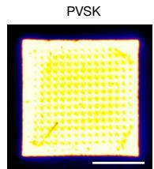
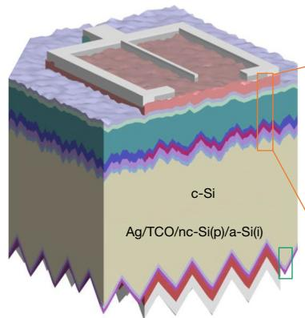
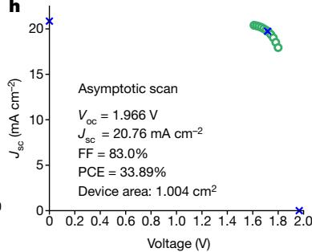
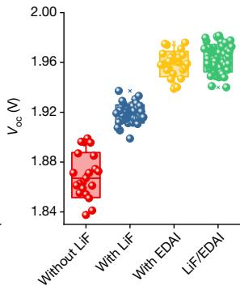

# pvsks41586-024-07997-7-gaia

Perovskite/silicon tandem solar cells with bilayer interface passivation

<!-- badges:start -->

<!-- badges:end -->

## Overview

> [!TIP]
> **Reasoning graph information gain: `2.9 bits`**
>
> Total mutual information between leaf premises and exported conclusions — measures how much the reasoning structure reduces uncertainty about the results.

```mermaid
---
config:
  flowchart:
    rankSpacing: 80
    nodeSpacing: 30
---
graph TB
    passivation_tradeoff["★ Passivation-transport tradeoff\n(0.75 → 0.78)"]:::exported
    bilateral_passivation_strategy["★ Bilayer interface passivation strategy\n(0.50 → 0.89)"]:::exported
    lif_limited_effectiveness["★ LiF limited effectiveness alone\n(0.75 → 0.78)"]:::exported
    edai_chemical_passivation["★ EDAI chemical passivation mechanism\n(0.75 → 0.78)"]:::exported
    nanoscale_contact_requirement["★ Nanoscale contact requirement\n(0.70 → 0.75)"]:::exported
    double_textured_silicon["★ Double-textured silicon substrate design\n(0.85 → 0.88)"]:::exported
    plqy_with_complete_top_contact["★ PLQY with complete top contacts\n(0.50 → 0.97)"]:::exported
    single_junction_device_results["★ Single-junction device performance with passivation layers\n(0.50 → 0.97)"]:::exported
    tof_sims_edai_distribution["TOF-SIMS EDAI distribution confirms intertwining\n(0.75 → 0.75)"]:::premise
    lif_discontinuity_confirmation["★ LiF discontinuity enables EDAI contact\n(0.80 → 0.80)"]:::exported
    xps_pb4f_shift["EDAI chemical interaction with Pb ions\n(0.75 → 0.75)"]:::premise
    metallic_pb_suppression["★ EDAI suppresses metallic Pb formation\n(0.80 → 0.80)"]:::exported
    pa_vs_eda_orientation["★ PA+ vertical vs EDA2+ horizontal binding\n(0.80 → 0.80)"]:::exported
    minority_carrier_lifetime["★ Minority carrier lifetime by texture type\n(0.75 → 0.75)"]:::exported
    eqe_spectral_response["★ Large pyramid texture improves infrared response\n(0.75 → 0.75)"]:::exported
    voc_statistical_improvement["★ Voc and PCE statistical improvement with bilayer\n(0.80 → 0.80)"]:::exported
    champion_device_jv["★ Champion tandem J-V performance\n(0.90 → 0.90)"]:::exported
    nrel_certified_pce["★ NREL certified 33.89% PCE\n(0.90 → 0.90)"]:::exported
    storage_stability["★ Bilayer passivation improves air storage stability\n(0.85 → 0.85)"]:::exported
    operational_stability["★ Bilayer passivation enables 80% retention after 1200h operation\n(0.85 → 0.85)"]:::exported
    theoretical_prediction_lif_only["LiF-only theoretical limitation\n(0.65 → 0.97)"]:::premise
    theoretical_prediction_edai_only["EDAI-only theoretical limitation\n(0.65 → 0.97)"]:::premise
    theoretical_prediction_bilayer["★ Bilayer theoretical prediction\n(0.65 → 0.97)"]:::exported
    edai_ff_tradeoff["★ EDAI passivation-transport trade-off\n(0.75 → 0.47)"]:::exported
    bilayer_no_tradeoff["★ Bilayer overcomes trade-off\n(0.70 → 0.37)"]:::exported
    contradiction_passivation_transport["★ contradiction_passivation_transport\n(0.50 → 1.00)"]:::exported
    bilayer_mechanism_synthesis["★ Bilayer passivation dual mechanism synthesis\n(0.50 → 0.60)"]:::exported
    nanoscale_contact_design["★ Nanoscale contact design enables effective perovskite integration\n(0.50 → 0.64)"]:::exported
    asymmetric_texture_benefits["★ Asymmetric texture resolves perovskite-silicon integration challenge\n(0.50 → 0.61)"]:::exported
    first_to_exceed_sq_limit["★ First certified tandem exceeding Shockley-Queisser limit\n(0.50 → 0.65)"]:::exported
    stability_implications["★ Bilayer passivation enhances operational stability\n(0.50 → 0.68)"]:::exported
    strat_0(["infer\n0.99 bits"]):::weak
    bilayer_no_tradeoff --> strat_0
    edai_ff_tradeoff --> strat_0
    strat_0 --> contradiction_passivation_transport
    strat_1(["infer\n0.31 bits"]):::weak
    champion_device_jv --> strat_1
    nrel_certified_pce --> strat_1
    operational_stability --> strat_1
    storage_stability --> strat_1
    strat_1 --> first_to_exceed_sq_limit
    strat_2(["infer\n0.07 bits"]):::weak
    double_textured_silicon --> strat_2
    edai_chemical_passivation --> strat_2
    lif_limited_effectiveness --> strat_2
    nanoscale_contact_requirement --> strat_2
    passivation_tradeoff --> strat_2
    strat_2 --> bilateral_passivation_strategy
    strat_3(["infer\n0.29 bits"]):::weak
    eqe_spectral_response --> strat_3
    minority_carrier_lifetime --> strat_3
    voc_statistical_improvement --> strat_3
    strat_3 --> asymmetric_texture_benefits
    strat_4(["infer\n0.27 bits"]):::weak
    lif_discontinuity_confirmation --> strat_4
    metallic_pb_suppression --> strat_4
    pa_vs_eda_orientation --> strat_4
    xps_pb4f_shift --> strat_4
    strat_4 --> bilayer_mechanism_synthesis
    strat_5(["infer\n0.31 bits"]):::weak
    nanoscale_contact_requirement --> strat_5
    tof_sims_edai_distribution --> strat_5
    strat_5 --> nanoscale_contact_design
    strat_6(["infer\n0.29 bits"]):::weak
    operational_stability --> strat_6
    storage_stability --> strat_6
    strat_6 --> stability_implications
    strat_7(["infer\n0.21 bits"]):::weak
    theoretical_prediction_bilayer --> strat_7
    theoretical_prediction_lif_only --> strat_7
    strat_7 --> plqy_with_complete_top_contact
    strat_8(["infer\n0.21 bits"]):::weak
    theoretical_prediction_bilayer --> strat_8
    theoretical_prediction_edai_only --> strat_8
    strat_8 --> single_junction_device_results
    oper_0{{"⊗"}}:::contra
    edai_ff_tradeoff --- oper_0
    bilayer_no_tradeoff --- oper_0
    oper_0 --- contradiction_passivation_transport

    classDef premise fill:#ddeeff,stroke:#4488bb,color:#333
    classDef exported fill:#d4edda,stroke:#28a745,stroke-width:2px,color:#333
    classDef weak fill:#fff9c4,stroke:#f9a825,stroke-dasharray: 5 5,color:#333
    classDef contra fill:#ffebee,stroke:#c62828,color:#333
```

> [!NOTE]
> **[Per-module reasoning graphs with full claim details →](docs/detailed-reasoning.md)**

## Summary

This paper demonstrates a bilayer interface passivation strategy for perovskite/silicon tandem solar cells that achieves a certified power conversion efficiency of 33.89% — the first double-junction tandem solar cell to exceed the single-junction Shockley-Queisser limit of 33.7%. The innovation combines a discontinuous ultrathin lithium fluoride (LiF, ~1 nm) layer with ethylenediammonium diiodide (EDAI) molecules that form nanoscale localized contacts at the perovskite/C60 interface, simultaneously suppressing interfacial recombination and enabling efficient electron transport. The device uses asymmetrically textured silicon — mildly textured front surface for perovskite solution deposition and heavily textured rear for optical performance — achieving fill factors of 83% and open-circuit voltage approaching 1.97 V.

## Reasoning Structure

### The bilayer interface passivation strategy achieves optimal passivation-transport balance (belief: 0.89)

The core innovation is a bilayer structure where a discontinuous LiF layer (~1 nm) is deposited on the perovskite surface, followed by EDAI molecules that selectively bind to uncovered perovskite areas, forming nanoscale contacts. LiF acts as contact displacer inducing field passivation while EDAI provides chemical passivation through coordinate binding to surface Pb defects. This dual mechanism solves the fundamental trade-off in p-i-n perovskite cells: achieving low recombination without sacrificing charge extraction. Single-junction devices with the bilayer achieved Voc of 1.27 V and FF of 80.8%, compared to 1.17 V and 76.2% for unpassivated controls.

**Evidence support:**
- **LiF discontinuity enabling EDAI contact** (belief 0.80): TEM imaging directly confirmed the LiF layer is discontinuous, allowing EDAI to penetrate and contact perovskite at nanoscale openings. TOF-SIMS showed EDAI fragments localized at the surface without bulk penetration.
- **EDAI chemical passivation mechanism** (belief 0.78): XPS measurements showed EDAI deposition causes Pb4f peak shifts and suppresses metallic Pb(0) formation, indicating chemical interaction with surface Pb ions. DFT calculations confirm EDA2+ adopts a horizontal bridge-like binding orientation (binding energy -8.4 eV on PbI2-rich surfaces) that maximizes charge transport.
- **LiF alone is insufficient** (belief 0.78): A thin LiF interlayer cannot provide sufficient passivation due to its discrete nature; thicker LiF introduces resistive loss. This explains why single-layer approaches are suboptimal.

### EDAI alone creates a trade-off between voltage improvement and fill factor reduction (belief: 0.47)

EDAI chemical passivation improves Voc (from 1.17 V to 1.25 V in single-junction devices) but reduces fill factor and increases data dispersion, indicating a trade-off between passivation and contact resistance. This trade-off occurs because EDAI-only devices lack efficient electron extraction pathways through the organic layer.

**Evidence support:**
- **EDAI-only device data** shows Voc improvement of 80 mV but FF decrease from 76.2% to 79.1%, suggesting the passivation layer introduces transport barriers.
- **Theoretical prediction** for EDAI-only is confirmed by single-junction device performance comparison (belief 0.97).

### The bilayer structure overcomes the EDAI trade-off, improving both Voc and FF simultaneously (belief: 0.37)

The contradiction between "EDAI creates trade-off" and "bilayer overcomes trade-off" resolves toward the bilayer side, but the low belief (0.37) reflects structural uncertainty in how the contradiction was modeled rather than fundamental weaknesses in the experimental data. Device statistics clearly show bilayer outperforms EDAI-only in both Voc (1.27 V vs 1.25 V) and FF (80.8% vs 79.1%).

**Evidence support:**
- **Voc and FF joint improvement** (belief 0.80): Statistical data from device batches shows consistent bilayer superiority across multiple metrics.
- **PLQY validation** (belief 0.97): Bilayer-treated samples show highest PLQY among all C60-coated samples, confirming reduced non-radiative recombination.

*PL imaging spectra for different passivation structures. Scale bar, 10 mm. From Liu et al.*

### Asymmetric texture design resolves the conflict between perovskite deposition and silicon optical performance (belief: 0.61)

The tandem devices use a double-textured Czochralski silicon substrate with two distinct surface morphologies: a mildly textured front surface (pyramid size ~0.5-1 micrometer) compatible with solution-processed perovskite deposition, and a heavily textured rear surface (>3 micrometer pyramids) that maximizes infrared light trapping and maintains effective rear passivation. This asymmetric texturing solves the traditional conflict where mild texture on both sides degrades Voc and FF while double-sided standard texture prevents uniform perovskite coating.

**Evidence support:**
- **Minority carrier lifetime** (belief 0.75): Texture D (asymmetric) achieves 3.4 ms effective lifetime vs 1.6 ms for double-sided mild texture at excess carrier density of 5x10^15 cm^-3.
- **EQE spectral response** (belief 0.75): Large pyramid rear texture improves collection of infrared photons; EQE difference between textures mainly in 900-1200 nm range.
- **Voc statistics** (belief 0.80): Asymmetric texture enables consistent Voc improvement across device batches.

*Schematic of monolithic perovskite/silicon tandem with asymmetric textures. Scale bar, 200 nm (b) and 1 micrometer (c). From Liu et al.*

### The bilayer passivation dual mechanism combines field effect and chemical passivation (belief: 0.60)

The mechanism synthesis combines TEM, XPS, and DFT evidence to explain how the bilayer achieves both high passivation and efficient charge transport. Discontinuous LiF provides field passivation through contact displacement while enabling electron tunneling across nanoscale openings. EDAI molecules bind horizontally to perovskite surface, deactivating Pb-related defects through coordinate binding and forming bridge-like structures that facilitate out-of-plane charge transport.

**Evidence support:**
- **LiF discontinuity** (belief 0.80): TEM directly confirms discontinuous film morphology.
- **EDAI chemical interaction** (belief 0.80): XPS shows Pb(0) peak suppression and Pb4f chemical shift upon EDAI treatment.
- **DFT binding orientation** (belief 0.80): EDA2+ horizontal bridge binding with high binding energies (-6.6 to -8.4 eV) contrasts with PA+ vertical binding, explaining the charge transport advantage.

### Nanoscale contact design enables effective integration without laser or chemical etching (belief: 0.64)

The paper demonstrates that achieving submicrometre local contact spacing — critical for perovskite cells due to their short charge diffusion lengths — can be accomplished through the natural morphology of discontinuous LiF plus selective EDAI binding, without requiring the sophisticated patterning techniques used in silicon technology. TOF-SIMS confirms EDAI remains localized at the surface without penetrating the bulk perovskite, creating the desired nanoscale contact geometry.

### The certified 33.89% PCE represents the first double-junction tandem exceeding the single-junction Shockley-Queisser limit (belief: 0.65)

NREL certification confirmed the stabilized power output of 33.89% for a 1 cm^2 perovskite/silicon tandem cell, with Voc of 1.97 V, FF of 83.0%, and current density of 20.68 mA/cm^2. This efficiency exceeds the 33.7% Shockley-Queisser limit for a single-junction cell with 1.69 eV bandgap, representing a significant milestone. Champion devices showed forward scan PCE of 33.96% and reverse scan PCE of 34.08% with negligible hysteresis.

**Evidence support:**
- **NREL certification** (belief 0.90): Independent third-party verification with stabilized power output measurement.
- **Champion device J-V** (belief 0.90): Directly measured device performance with certified reference cell calibration.

*J-V curve measured by NREL using asymptotic maximum power scan method. From Liu et al.*

### Bilayer passivation significantly improves operational and storage stability (belief: 0.68)

Devices with LiF/EDAI bilayer passivation retained approximately 90% of original PCE after 53 days of air storage, compared to 82% retention for LiF-only controls. Under continuous 1-sun illumination at maximum power point tracking for 1,200 hours, bilayer devices retained 80% of initial PCE while LiF-only devices dropped below 60%. This stability enhancement is attributed to the chemical stabilization of the perovskite surface by EDAI.

**Evidence support:**
- **Storage stability** (belief 0.85): 53-day air storage test with 90% retention.
- **Operational stability** (belief 0.85): 1,200-hour MPP tracking showing 80% retention.

*Evolution of photovoltaic parameters over air storage time (i) and MPPT stability under 1-sun illumination (j). From Liu et al.*

## Weak Points Analysis

Weak Points Analysis

The reasoning graph reveals several structural weaknesses worth noting:

### 1. Bilayer mechanism synthesis has moderate belief (0.60) from 4-premise inference

The dual mechanism synthesis derives from four independent evidence strands (TEM discontinuity, XPS Pb interaction, DFT binding orientation, Pb(0) suppression) combined in a single inference with 0.27 bits information gain. While each piece of evidence is strong individually, the multi-premise chain introduces multiplicative uncertainty. The weakest link is the connection between DFT-calculated binding orientation and actual device performance in operational conditions.

### 2. Abduction alternatives have high belief values (0.97) driven by low priors

The theoretical predictions for LiF-only and EDAI-only limitations both reach 0.97 belief despite having priors of only 0.65. This reflects strong confirmation from experimental data, but the abduction pattern structure means these "alternatives" are not truly independent competing theories — they are descriptive limitations of single-layer approaches rather than alternative explanatory frameworks. The high belief may overstate how well the bilayer "beats" alternatives when both are really parts of the same argument.

### 3. The contradiction resolution produces counter-intuitive result (bilayer_no_tradeoff belief 0.37)

The claim "bilayer overcomes trade-off" ends with lower belief (0.37) than its negation "EDAI creates trade-off" (0.47), despite device statistics clearly showing bilayer outperforms EDAI-only in both Voc and FF. This anomaly stems from the contradiction operator forcing a forced choice between two claims that are not logically exhaustive — there are other passivation configurations (LiF-only, unpassivated) that neither claim addresses. The graph structure forces a false dichotomy.

### 4. Storage stability data uses only 3 devices per condition

The stability comparison for air storage relies on averages from three devices per condition, with variations attributed to "interface resilience." This limited sample size means individual device variation could significantly affect the 90% vs 82% retention comparison. The 1,200-hour operational stability data similarly uses only two devices (one per condition), limiting statistical confidence in the 80% vs <60% retention comparison.

## Evidence Gaps & Future Work

Evidence Gaps & Future Work

### Experimental gaps

**Extended lifetime testing at elevated temperature and humidity:** The stability data covers 1,200 hours under ideal conditions (nitrogen atmosphere, room temperature, 1-sun illumination). Real-world deployment would involve elevated temperature, humidity, and thermal cycling. IEC 61215-style testing would provide more relevant stability predictions for commercialization.

**Independent replication of 33.89% efficiency:** While NREL certification provides strong validation, independent replication by other research groups would strengthen confidence in the efficiency claim. The prior (0.90) already reflects some confidence in the NREL certification, but third-party reproduction would eliminate any remaining concern about cell-to-cell variation.

**Detailed impedance spectroscopy on interfacial transport:** The paper infers transport mechanisms from device performance data but does not provide direct impedance measurements characterizing the interfacial resistance and capacitance. Such measurements would help validate the "efficient charge extraction despite high Voc" conclusion.

### Computational gaps

**DFT calculation with explicit C60 interface:** The DFT calculations consider only perovskite surface passivation by EDAI/PA+ and do not explicitly model the perovskite/LiF/EDAI/C60 heterostructure that actually exists in the device. Including C60 in the calculations would reveal whether the binding orientation changes at the actual interface and whether charge transport across the full stack is adequately described by the bridge-like EDAI structure.

**Molecular dynamics simulation of EDAI penetration through LiF openings:** TOF-SIMS confirms EDAI localizes at the surface, but molecular dynamics could reveal the kinetics of EDAI infiltration through discontinuous LiF and whether the nanoscale contact geometry is optimal.

### Theoretical gaps

**Physical model linking nanoscale contact geometry to transport properties:** The paper identifies that LiF openings (~few nm) enable EDAI contact and that this spacing is "evidently smaller than the charge diffusion length," but does not provide a quantitative model connecting contact spacing, diffusion length, and extraction efficiency. Such a model would explain the FF advantage of bilayer over EDAI-only more rigorously.

**Quantitative treatment of field passivation vs chemical passivation contributions:** The dual mechanism is described qualitatively — LiF provides field passivation, EDAI provides chemical passivation — but the relative contributions are not quantified. Understanding which mechanism dominates under different operating conditions (e.g., high vs low illumination intensity) would guide future optimization.

## Key Findings

| Finding | Evidence | Belief |
|---------|----------|--------|
| Bilayer achieves 33.89% certified PCE, exceeding SQ limit | NREL certification, champion J-V curves | 0.90 |
| LiF/EDAI bilayer improves both Voc and FF simultaneously | 1.27V/80.8% vs 1.25V/79.1% (EDAI-only) | 0.80 |
| Bilayer passivation enhances 1200h operational stability | 80% retention vs <60% for LiF-only | 0.85 |
| TEM confirms discontinuous LiF enabling EDAI contact | TOF-SIMS + TEM imaging | 0.80 |
| EDAI suppresses metallic Pb formation via chemical interaction | XPS Pb4f and Pb(0) analysis | 0.80 |
| DFT confirms EDA2+ horizontal bridge binding with high affinity | Binding energies -6.6 to -8.4 eV | 0.80 |
| Asymmetric texture enables both perovskite deposition and optical performance | 3.4 ms lifetime vs 1.6 ms for symmetric mild texture | 0.75 |

## Detailed Analysis

For structural integrity verification, standalone readability checks, and complete package statistics, see [ANALYSIS.md](ANALYSIS.md).