# Perovskite/silicon tandem solar cells with bilayer interface passivation

https://doi.org/10.1038/s41586-024-07997-7

Received: 23 December 2023

Accepted: 28 August 2024

Published online: 5 September 2024

Check for updates

Jiang Liu1,2,11 ✉, Yongcai He1,10,11, Lei Ding1,2,11, Hua Zhang1,11, Qiaoyan Li1 , Lingbo Jia1 , Jia Yu3 , Ting Wai Lau4 , Minghui Li5 , Yuan Qin1 , Xiaobing Gu1 , Fu Zhang1 , Qibo Li1 , Ying Yang1 , Shuangshuang Zhao1 , Xiaoyong Wu1 , Jie Liu1 , Tong Liu1 , Yajun Gao1 , Yonglei Wang1 , Xin Dong1 , Hao Chen1 , Ping Li1 , Tianxiang Zhou1 , Miao Yang1 , Xiaoning Ru1 , Fuguo Peng1 , Shi Yin1 , Minghao Qu1 , Dongming Zhao6 , Zhiguo Zhao6 , Menglei Li6 , Penghui Guo7 , Hui Yan8 , Chuanxiao Xiao5,9, Ping Xiao6 ✉, Jun Yin4 ✉, Xiaohong Zhang3 ✉, Zhenguo Li1 ✉, Bo He1 ✉ & Xixiang Xu1 ✉

Two-terminal monolithic perovskite/silicon tandem solar cells demonstrate huge advantages in power conversion efciency compared with their respective singlejunction counterparts1,2 . However, suppressing interfacial recombination at the wide-bandgap perovskite/electron transport layer interface, without compromising its superior charge transport performance, remains a substantial challenge for perovskite/silicon tandem cells3,4 . By exploiting the nanoscale discretely distributed lithium fuoride ultrathin layer followed by an additional deposition of diammonium diiodide molecule, we have devised a bilayer-intertwined passivation strategy that combines efcient electron extraction with further suppression of non-radiative recombination. We constructed perovskite/silicon tandem devices on a doubletextured Czochralski-based silicon heterojunction cell, which featured a mildly textured front surface and a heavily textured rear surface, leading to simultaneously enhanced photocurrent and uncompromised rear passivation. The resulting perovskite/silicon tandem achieved an independently certifed stabilized power conversion efciency of $3 3 . 8 9 \%$ , accompanied by an impressive fll factor of $8 3 . 0 \%$ and an open-circuit voltage of nearly 1.97 V. To the best of our knowledge, this represents the frst reported certifed efciency of a two-junction tandem solar cell exceeding the single-junction Shockley–Queisser limit of $3 3 . 7 \%$ .

For decades, crystalline silicon (c-Si)-based solar cells have retained their dominance in the photovoltaic market due to their exceptional efficiency, abundant material supply and long-term reliability. The certified power conversion efficiency (PCE) of a crystalline silicon solar cell has exceeded $2 7 \%$ , which was recently achieved by LONGi Green Energy Technology using commercial Czochralski (CZ) silicon wafers5,6 . Nevertheless, further enhancements in silicon cell performance are mainly limited by Auger recombination and parasitic absorption7–9 . To elevate the PCE to new heights, the strategy of integrating a wide-bandgap metal halide perovskites atop silicon heterojunction (SHJ) bottom cells in a tandem configuration, minimizing carrier thermalization losses, has emerged as a profoundly effective approach. The perovskite/silicon tandem has garnered substantial attention, as recently demonstrated by several groups with independently certified PCEs exceeding $31 \%$ (refs. 10–12).

State-of-the-art high-efficiency tandem solar cells predominantly adopt an inverted p–i–n configuration, combining the advantages of low parasitic absorption and film structure with a gradient refractive index on the sun-facing front contacts13–18. However, p–i–n-type perovskite devices still suffer from strong interface recombination at the perovskite $\mathrm { \prime C } _ { 6 0 }$ interface for electron extraction, leading to an undesirably large open-circuit voltage $( V _ { \mathrm { o c } } )$ deficit and a consequent loss in power output19–21. Several approaches have been explored to address this issue, such as through the incorporation of ultrathin lithium fluoride (LiF) or $\mathsf { M g F } _ { x }$ interlayers, targeting improved band alignment and reduced non-radiative recombination22–24. Moreover, the use of interfacial capping layers on the perovskite surface, often realized through ammonium ligands or functional reactive compounds, has a positive impact on efficiency and stability25–28. The selection of ammonium ligands and processing strategies for the regular n–i–p devices is usually not directly applicable to p–i–n devices, due to the

1 LONGi Central R&D Institute, LONGi Green Energy Technology Co. Ltd, Xi’an, China. 2 College of Energy, Soochow Institute for Energy and Materials Innovations, Soochow University, Suzhou, China. 3 Institute of Functional Nano & Soft Materials (FUNSOM), Jiangsu Key Laboratory of Advanced Negative Carbon Technologies, Soochow University, Suzhou, China. 4 Department of Applied Physics, The Hong Kong Polytechnic University, Hung Hom, Hong Kong, China. 5 Ningbo Institute of Materials Technology and Engineering, Chinese Academy of Sciences, Ningbo City, China. 6 Huaneng Clean Energy Research Institute, Beijing, China. 7 International Research Center for Renewable Energy (IRCRE), State Key Laboratory of Multiphase Flow in Power Engineering, Xi’an Jiaotong University, Xi’an, China. 8 The Faculty of Materials and Manufacturing, Beijing University of Technology, Beijing, China. 9 Ningbo New Materials Testing and Evaluation Center Co. Ltd, Ningbo City, China. 10Present address: The Faculty of Materials and Manufacturing, Beijing University of Technology, Beijing, China. 11These authors contributed equally: Jiang Liu, Yongcai He, Lei Ding, Hua Zhang. ✉e-mail: liujiang28@longi.com; p_xiao@qny.chng.com.cn; jun.yin@polyu.edu.hk; xiaohong_zhang@suda.edu.cn; lzg@longi.com; hebo3@longi.com; xuxixiang@longi.com

  
a

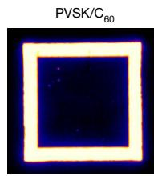

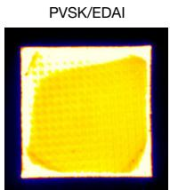

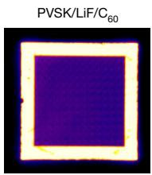

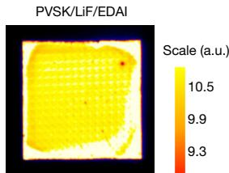

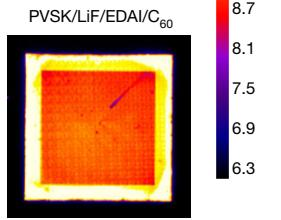

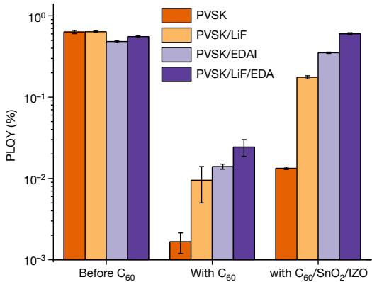  
b

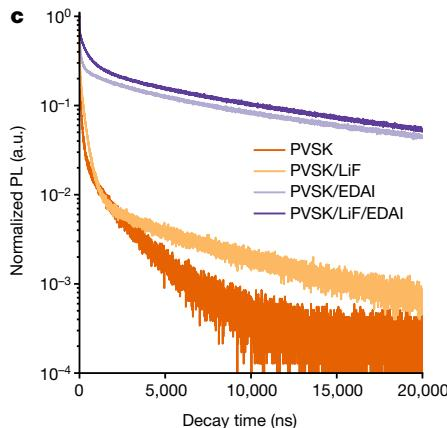

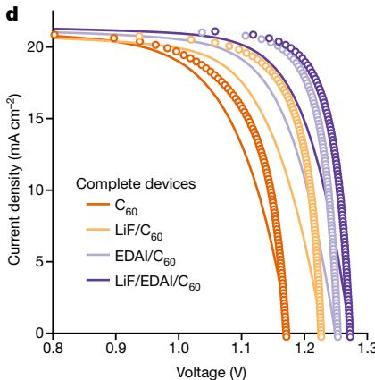

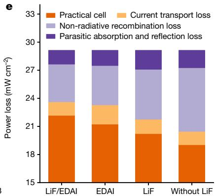  
Fig. 1 | PL spectra and performance loss analysis. a, PL imaging spectra for the bare perovskite (PVSK), PVSK/EDAI, PVSK/LiF/EDAI, $\mathrm { P V S K / C } _ { 6 0 }$ $/ { \mathsf C } _ { 6 0 }$ , PVSK/LiF/ $\mathrm { C } _ { 6 0 }$ and PVSK/LiF/EDAI/C60. The substrate size is around $2 0 \mathrm { m m } \times 2 0 \mathrm { m m }$ , and ${ \mathsf C } _ { 6 0 }$ deposition was defined by a mask of $1 5 \mathrm { { m m } \times 1 5 \mathrm { { m m } } }$ . Scale bar, $1 0 \mathsf { m m }$ . b, PLQY data of the perovskite films without $\mathbf { C } _ { 6 0 }$ layer, after $\mathrm { C } _ { 6 0 }$ layer deposition and after complete top $\mathrm { C } _ { 6 0 } / \mathrm { S n O } _ { 2 } / \mathrm { I Z O }$ contact depositions. c, TRPL spectra of   
the perovskite films coated with different passivation layers, followed by complete top contacts of $\mathrm { C } _ { 6 0 } / \mathrm { S n O } _ { 2 } / \mathrm { I Z O } . \mathbf { d }$ , Typical measured J–V curves (solid line) and pseudo-J–V curves (hollow circle) from the suns– $\cdot V _ { \mathrm { o c } }$ measurements for semitransparent single-junction perovskite devices with an aperture area of $1 . 0 \mathrm { c m } ^ { 2 }$ and with different passivation layers. e, Power loss analysis for different passivation layer stacks.

different band alignment requirements29–31. A fundamental challenge in implementing these passivation layers in p–i–n devices resides in achieving the best balance between minimizing recombination loss and restricting contact resistance, thereby ensuring efficient electron transport and hole blocking simultaneously.

In this work, we demonstrate a bilayer interface passivation strategy to simultaneously maximize electron transport and hole blocking, which involves the incorporation of a thin LiF layer followed by the deposition of a short-chain ethylenediammonium diiodide (EDAI) molecule. LiF itself cannot chemically react with perovskite through strong chemical bonds; it mainly acts as a contact displacer and induces field passivation23,32. A thin LiF interlayer with a typical thickness of approximately 1 nm cannot provide sufficient passivation efficacy due to its discrete nature, still showing a large voltage deficit. A thicker LiF layer may help to improve passivation, but it comes with considerable, undesirable resistive loss. Nevertheless, the EDAI molecule can chemically passivate the unpassivated areas that are not contacted by the LiF layer, forming nanoscale localized contacts at the perovskite $/ { \mathrm { C } } _ { 6 0 }$ interface. This can provide an optimal trade-off between passivation and charge extraction. Although local contact and selective emitter doping have been widely used in current mainstream silicon cell technologies33,34, implementing them in perovskite cells poses a substantial challenge due to the considerably shorter charge diffusion lengths of perovskite absorbers compared with silicon. This necessitates the local contact spacing to be at the submicrometre or nanoscale level35–37. Nevertheless, our bilayer interface passivation strategy can achieve this without

the need for cumbersome laser- or chemical-etching steps. For the fabrication of monolithic perovskite/silicon tandem solar cells, we have used SHJ silicon wafers with asymmetrically sized textures, featuring a mildly textured front surface for the solution-processed perovskite layer and a heavily textured rear side for uncompromised rear passivation and improved spectral response. Combining these enhancements, we achieved a certified stabilized PCE of $3 3 . 8 9 \%$ with a fill factor (FF) of $8 3 \%$ for a 1-cm2 -area perovskite/silicon tandem solar cell.

# Recombination loss analysis

For the assessment of non-radiative recombination loss at the perovskite/electron transport layer (ETL) interface, photoluminescence (PL) images through a band-pass filter $( 7 3 0 \pm 3 0 \mathrm { n m } )$ following 520 nm laser excitation were obtained (Fig. 1a). As expected, the bare perovskite sample without any capping layer exhibited the highest PL intensity. The PL intensity of the LiF/EDAI bilayer was shown to lie between those of samples with LiF and EDAI alone. In particular, direct deposition of $\mathbf { C } _ { 6 0 }$ on a perovskite surface resulted in a substantial reduction in PL emission intensity and time-resolved PL (TRPL) lifetime (Supplementary Fig. 1), which indicates a high defect density at this interface and correspondingly high non-radiative recombination loss. We collected the PL quantum yield (PLQY) data of the perovskite films with a series of layer stacks (Fig. 1b). In the absence of a $\mathbf { C } _ { 6 0 }$ layer, a slight increase in PLQY was observed after LiF deposition on the bare perovskite surface, whereas EDAI deposition alone showed a slight decrease in PLQY.

# Article

Overall, on a logarithmic scale, there was no significant change in the PLQY if only the cases without $\mathsf { C } _ { 6 0 }$ were compared. The difference in the PLQY values became clear in the presence of $\mathbf { C } _ { 6 0 }$ , indicating that the passivation effect could be manifested only when the perovskite was paired with $\mathsf { C } _ { 6 0 }$ . Interestingly, after the complete $\mathrm { C } _ { 6 0 } / \mathrm { S n O } _ { 2 } /$ indium zinc oxide (IZO) top contact depositions, a further increase in PLQY was observed, but the trend that the EDAI/LiF bilayer passivation could lead to the highest PLQY among all the $\mathrm { C } _ { 6 0 }$ -coated samples remained consistent. TRPL results and PL images further cross-validated this result (Fig. 1c and Supplementary Fig. 2). With the complete top contact of the $\mathsf { S n O } _ { 2 } /$ IZO/IZO stack, the initial charge transfer process could accommodate more electrons from the perovskite into the contact, which may then transfer back into the perovskite at a longer timescale, resulting in a low differential lifetime in the long-decay-time region, which is still governed by the interface trap state density. In particular, the EDAI and LiF/EDAI samples exhibited an impressively high differential lifetime of >10 μs at a rather high PL flux, suggesting a minimized non-radiative recombination. This enhancement is expected to benefit the $V _ { \mathrm { o c } }$ and FF values of the perovskite device. Furthermore, we could also infer that effective passivation should target the perovskite $/ { \mathsf { C } } _ { 6 0 }$ interface rather than the bare perovskite surface. Only after the deposition of the $\mathbf { C } _ { 6 0 }$ layer or even the complete top contacts, the passivation efficacy of these interlayers could finally be revealed.

For a comparative assessment of the passivation effects of the stacked layers, we fabricated semitransparent single-junction p–i–n devices (aperture area, approximately $1 . 0 \mathrm { c m } ^ { 2 } .$ ) on textured silicon substrates with a symmetrical structure. The single-junction perovskite devices were constructed on the same underlying substrate environment as the tandem devices, and were then evaluated under light illumination from the top ETL side, which directly reflects the performance contribution of perovskite subcell in subsequent tandems. The suns– $V _ { \mathrm { o c } }$ pseudo-current density–voltage $( J - W )$ curves, implying negligible series resistance losses, were also constructed by obtaining $V _ { \mathrm { o c } }$ at different incident light intensities (Fig. 1d). The unpassivated device, lacking any interlayer at the perovskite $\scriptstyle { \mathcal { C } } _ { 6 0 }$ interface, yielded $V _ { \mathrm { o c } }$ and FF values of approximately 1.17 V and $7 6 . 2 \%$ , respectively, with a pseudo-FF of $8 2 . 0 \%$ . With the introduction of LiF, EDAI and LiF/EDAI bilayer, the $V _ { \mathrm { o c } }$ value improved to approximately 1.20, 1.25 and 1.27 V, which was consistent with the results of suppressed interfacial recombination, whereas the FF increased to $7 7 . 7 \%$ , $7 9 . 1 \%$ and $8 0 . 8 \%$ , respectively. The passivation enhancement was also reflected in increased pseudo-FF values of $8 3 . 6 \%$ , $8 6 . 5 \%$ and $8 6 . 1 \%$ , respectively. Furthermore, cell performance losses (Fig. 1e) were analysed by assuming no resistive losses, no non-radiative recombination losses and no optical losses in a successive order38. The theoretical limit of a 1.69-eV-bandgap cell with $2 9 . 1 \%$ efficiency and $9 0 . 9 \%$ FF was used for comparison. The optical properties remained nearly unchanged due to the ultrathin nature of the passivation layers, as evidenced by the measured external quantum efficiency (EQE) and reflectance (Supplementary Fig. 4). The use of LiF/EDAI bilayer passivation resulted in an increase in the device efficiency to $2 2 . 2 \%$ , compared with $2 0 . 2 \%$ and $2 1 . 2 \%$ for the LiF and EDAI cases, respectively. Compared with EDAI alone, the LiF/EDAI bilayer exhibited a reduced current transport loss, narrowing it from 2.1 to $1 . 5 \mathsf { m w c m } ^ { - 2 }$ , indicating that bilayer passivation could provide a lower contact resistance.

# Interfacial properties

To probe the interfacial properties of the LiF/EDAI bilayer, we conducted time-of-flight secondary ion mass spectrometry (TOF-SIMS) measurements, showing some molecular fragment distributions as a function of film depth (Fig. 2a,b and Supplementary Fig. 5). The $\mathsf { C s } _ { 2 } \mathsf { C N } ^ { + }$ signal can be attributed to EDA+ from EDAI, as the EDAI molecules may have been fragmented during Cs-ion sputtering. On the front interface, an obvious peak of the EDA+ signal could be observed, followed by a flat region instead of a gradual decline in the sputter-time range from 150 to 500 s.

This phenomenon could indicate that the EDAI did not penetrate into the bulk perovskite. The signals related to the LiF and EDAI layers are mainly localized on the surface of the perovskite, and no clear interface between the two layers can be observed. This indicates that the LiF and EDAI layers are intertwined with each other. Our transmission electron microscopy results (Supplementary Fig. 6) confirmed that the ultrathin LiF layer is discontinuous, which allows us to propose that the EDAI molecule locally contacts the perovskite across the LiF layer (Fig. 2c). The charge carrier transport at the LiF/EDAI bilayer interface will not be affected as the LiF opening spacing is only a few nanometres, which is evidently smaller than the charge diffusion length of the perovskite absorber. On one hand, the thin LiF layer enables electron tunnelling, but at the cost of high contact resistivity. On the other hand, the local $\mathrm { E D A I / C _ { 6 0 } }$ contacts could provide extra electron transport paths, avoiding inefficient tunnelling. In a full device, the LiF/EDAI bilayer structure can suppress interface recombination by reducing the contact area between perovskite and $\mathrm { C } _ { 6 0 } ,$ spontaneously achieving efficient charge transport through local contact.

To provide evidence for the hypothesis above, Kelvin probe force microscopy (KPFM) was used to image the surface potential and surface topography, aiming to confirm the existence of discontinuous LiF. For the samples without a LiF layer (Supplementary Fig. 7b,h), the surface potential mapping is relatively smooth, and no evident point-like features could be observed. By contrast, on the surface of those samples with a LiF layer (Supplementary Fig. 7d,f,j,l), point-like regions with low potentials could frequently be observed, which could be attributed to discrete LiF fragments. To understand the interface electrical-field distribution after EDAI modification, KPFM meausrements on the device cross-section were performed, following previously established methodology39,40 (Fig. 2d–f and Supplementary Figs. 8–10). The upper and lower interfaces of the perovskite layer could be identified clearly in the amplitude or topography images. Accordingly, we observed electrical-field spikes at the two interfaces at which charge separation occurred. For the unpassivated and LiF-treated devices, the amplitude of electric-field variation at the perovskite/ETL interface is relatively small. In particular, by implementing extra EDAI treatment on the LiF-coated device, the changes in the interfacial electric field become significant. Regardless of whether the perovskite contacted the valley or the spire region of the silicon wafer pyramid, the amplitude of the electric-field change does not seem to change. These findings suggest that LiF/EDAI bilayer passivation enables improved charge separation at the perovskite $/ { \mathsf { C } } _ { 6 0 }$ interface.

To investigate changes in the chemical environment of key elements, X-ray photoelectron spectroscopy (XPS) measurements were conducted. A small shift in the two characteristic main peaks of Pb4f (Fig. 2g) was observed after EDAI deposition, signifying a chemical interaction of EDAI with Pb ions. Moreover, two other peaks at approximately 141.5 eV and around 136.5 eV were observed for the samples without EDAI treatments, which were attributed to the presence of metallic Pb(0), which might be transformed from uncoordinated surface $\mathsf { P b } ^ { 2 + }$ ions or the photodegraded $\mathsf { P b l } _ { 2 }$ phase41,42. After EDAI deposition, the magnitude of the Pb(0) peak could be reduced to almost invisible, providing strong evidence that the EDAI treatment could chemically modify the perovskite surface. By contrast, the LiF interlayer did not seem to have this effect. On the basis of these observations, it could be inferred that EDAI surface treatment could ensure that the surface Pb atoms had sufficient coordination numbers through coordinate binding, thereby deactivating Pb-related defects and stabilizing the surface composition. The LiF/EDAI bilayer treatment showed an identical effect as the EDAI treatment in suppressing the appearance of metallic Pb(0), further confirming that the ultrathin LiF layer with discontinuous film-forming characteristics did not hinder the chemical interaction between the perovskite and EDAI. The N1s signals (Fig. 2b and Supplementary Fig. 14) displayed two separated peaks, corresponding to the $\mathsf { C } \mathrm { = } \mathsf { N }$ bond of formamidinium (FA) at around 400.5 eV, and the C–N

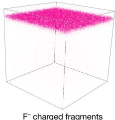  
a

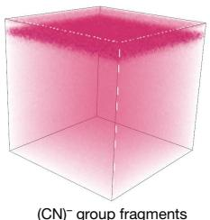  
b

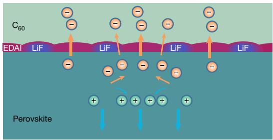  
c

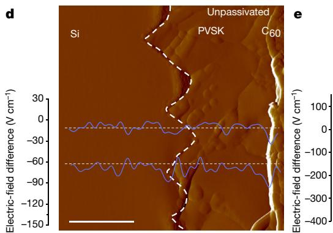

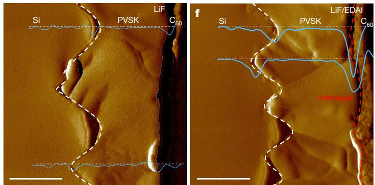

PVSK   
PVSK/LiF   
PVSK/EDAI   
PVSK/LiF/EDAI

C–NH2/C=NH2 ratio   
0.19   
0.21   
0.21 0.44   
0.44 0.35

Film

PVSK/C

$E _ { \mathsf { F } } - E _ { \mathsf { V } }$ values   
0.90 eV   
1.15 eV   
1.41 eV   
1.41 eV   
1.77 eV   
1.80 eV

Fi

PVSK   
PVSK   
PVSK/   
PVSK/   
PVSK   
PVSK/

WFs

4.47 eV   
4.35 eV   
4.12 eV   
4.06 eV   
4.56 eV   
4.27 eV

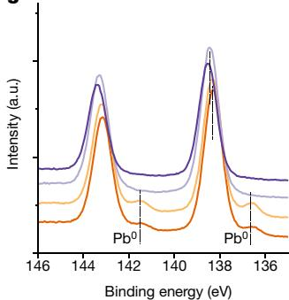  
g

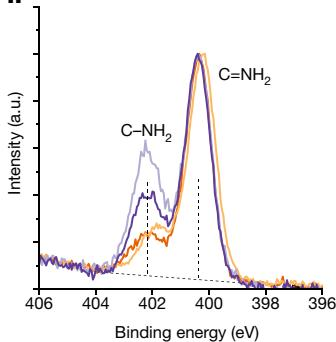  
h

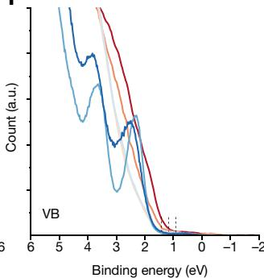  
i

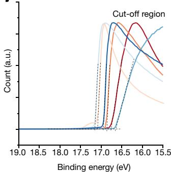  
j   
Fig. 2 | Interface interaction and electronic properties. a,b, ToF-SIMS threedimensional map distribution of LiF-related (a) and EDAI-related (b) charged fragments for the LiF/EDAI bilayer-treated perovskite films followed by ${ \sf C } _ { 6 0 }$ and $\mathsf { S n O } _ { 2 }$ deposition fabricated on textured silicon substrate. c, Schematic of the perovskite/ETL interface structure with LiF/EDAI bilayer passivation. d–f, Cross-sectional KPFM amplitude images for the perovskite subcells on a textured silicon substrate for the unpassivated (d), LiF-treated (e) and LiF/EDAI-bilayer-treated (f) devices. The electrical-field distribution along   
the lateral direction of a pyramid valley area and a spire area were directly plotted on the graphs. Scale bars, $5 0 0 \mathsf { n m }$ . g,h, XPS spectra of the $\mathrm { P b } 4 f ( \mathbf { g } )$ and N1s (h) core levels for the bare perovskite film and passivated films. i,j, VB edge region (i) and photoelectron cut-off region (j) for the bare perovskite and EDAItreated perovskite films with and without a $3  { \mathrm { n m } }  { \mathrm { C } _ { 6 0 } }$ capping layer. All the samples were deposited on IZO/Self-Assembled Monolayers (SAMs)-coated c-Si substrates.

bond of methylammonium (MA) or EDAI molecules at approximately 402.5 eV. After subtracting the MA component from the perovskite film, we observed that the $\scriptstyle \mathbf { C } - \mathbf { N } / \mathbf { C } = \mathbf { N }$ ratio was significantly weakened as EDAI was deposited on the LiF-coated perovskite. This indicates that the LiF interlayer could reduce the reactivity of EDAI with the perovskite surface or limit the penetration into the perovskite film30, which may ensure low contact resistance and effective passivation for the solution-coated overlayer, especially on a relatively rough perovskite surface.

To characterize the electronic structure of the perovskite films, we conducted ultraviolet photoemission spectroscopy (UPS) measurements (Fig. 2i,j). The bilayer-treated sample exhibited a smaller work function (WF) of 4.06 eV compared with the bare perovskite (4.47 eV). The difference between the Fermi level and valence band (VB) edge in

the EDAI-treated sample $( E _ { \mathrm { { F } } } E _ { \mathrm { { v } } } { = } 1 . 4 1 \mathrm { { e V } } _ { \cdot }$ ) was larger than that on the bare perovskite surface (0.90 eV). This implied that the surface energy level bent downwards after EDAI treatments, which could enhance electron transport. By adding the WF value and VB position relative to the Fermi level, we could get the ionization potential (IE) values, which was 5.37 eV for the bare perovskite and 5.47 eV for the bilayer-treated sample. The surface treatments caused a slight increase in IE, indicating the presence of an interfacial dipole, which was consistent with a previous study12, although the magnitude observed was relatively small. With the 3-nm-thin $\mathsf { C } _ { 6 0 }$ layer, the variation in IE became significant, with the IE value of the untreated and bilayer-treated samples being 6.36 and 6.04 eV, respectively. A possible reason was that surface treatment might have affected the properties of the subsequently deposited $\mathrm { C } _ { 6 0 }$ layer close to the interface. With the involvement of electrostatic

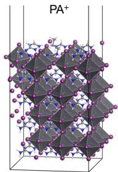  
a   
FAI-rich (100) with surface VFA

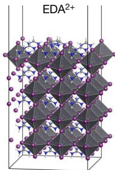

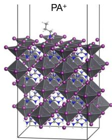  
b   
PbI -rich (100) 2with surface VPb

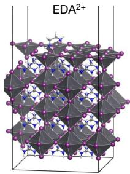

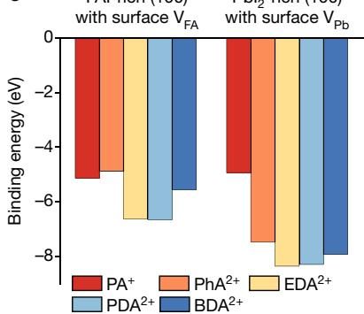  
c

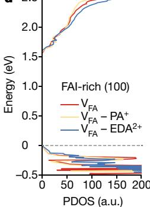  
d

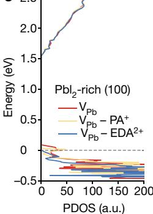  
e   
Fig. 3 | DFT calculations. a,b, Optimized slab structures for defective FAI-rich (100) $- \mathsf { V } _ { \mathrm { F A } }$ with PA+ and EDA2+ adsorption (a) and defective PbI2-rich $( 1 0 0 ) ^ { - } \mathsf { V } _ { \mathsf { P b } }$ $\mathbf { \nabla \cdot V _ { \mathrm { P b } } }$ with $\mathsf { P A } ^ { 2 + }$ and EDA2+ adsorption (b). c, Calculated binding energies between ammonium cation (PA+ , PhA2+, $\mathsf { E D A } ^ { 2 + }$ +, PDA2+ and BDA2+) and defective FAPbI (100) surfaces. PhA, 1,4-phenylenediammonium; EDA, ethylenediammonium; PDA, propane-1,3-diammonium;   
BDA, butane-1,4-diammonium;. d,e, Projected density of states (PDOS) for defective FAI-rich (100) $\mathbf { \nabla \cdot V _ { F A } }$ before and after $\mathsf { P A } ^ { + }$ and EDA2+ adsorption (d) and defective PbI -rich (100) $\mathbf { \nabla \cdot V _ { \mathrm { P b } } }$ before and after $\mathsf { P A } ^ { + }$ and EDA2+ adsorption (e). All the DFT calculations were performed at the generalized gradient approximation/Perdew–Burke–Ernzerhof $^ +$ van der Waals level of theory.

dipoles, the conduction band offset between the perovskite and $\mathbf { C } _ { 6 0 }$ would also change correspondingly.

# Theoretical calculations

To gain insights into the interaction between the perovskite surface and EDAI molecules, we performed density functional theory (DFT) calculations on the representative $\mathsf { F A P b l } _ { 3 } ( 1 0 0 )$ surfaces before and after molecular passivation (Fig. 3 and Supplementary Figs. 17–19). For comparison, other divalent diammonium cations with different carbon chains, as well as monovalent n-propylammonium cations (PA+ ) featuring an alkyl end instead of two amine ends, have also been examined. We considered two key terminations: formamidinium iodide (FAI)-rich and $\mathsf { P b l } _ { 2 }$ -rich terminations, each bearing surface defects in the form of a lead vacancy $( \mathsf { V } _ { \mathsf { P b } } )$ and an FA vacancy $( \mathsf { V } _ { \mathtt { F A } } )$ , respectively. The optimized perovskite slab structures after absorption of $\mathsf { P A } ^ { + }$ and $\mathsf { E D A } ^ { 2 + }$ cations are shown in Fig. 3a,b. Our calculations revealed a distinct contrast in the orientations of PA+ and EDA2+ with respect to their binding to the perovskite surface. $\mathsf { P } \mathsf { A } ^ { + }$ exhibited nearly vertical bind to the perovskite surface. By contrast, $\mathsf { E D A } ^ { 2 + }$ adopted a horizontal configuration, forming a bridge-like structure with its two amine groups. This arrangement maximizes the out-of-plane charge transport across the organic layer. In particular, the calculated binding energies $( E _ { \mathrm { { b } } } )$ for diammonium $\mathsf { E D A } ^ { 2 + }$ on FAI-rich and $\mathsf { P b l } _ { 2 }$ -rich surfaces were −6.6 and −8.4 eV (Fig. 3c), respectively, and are substantially larger in absolute value than those of monoammonium $\mathbf { P A } ^ { + }$ . This observation suggests that the EDAI molecules can bind more firmly to the perovskite surface, potentially providing enhanced chemical passivation capabilities. Moreover, the calculated projected density of states of all the slabs (Fig. 3d,e) demonstrated the existence of shallow trap states near the VB edge for the defective $\mathsf { P b l } _ { 2 }$ -rich case in the absence of $\mathsf { P A } ^ { + }$ and ethyl acetate cation adsorption. However, these shallow states were

effectively eliminated after EDAI passivation, displaying a substantial passivation effect.

# Photovoltaic performance and stability

To assess the role of our passivation strategy in device performance, we applied our bilayer passivation to 1.69-eV perovskites on double-side-textured silicon bottom cells in a tandem configuration. The schematic of the device structure and the corresponding scanning electron microscopy images are shown in Fig. 4a–c. To adapt the silicon bottom cell for perovskite solution deposition, we optimized the pyramid size of the silicon front surface, with an optimal range of $0 . 5 \mathrm { - } 1 \mu \mathrm { m }$ (Supplementary Figs. 20 and 21). With mild texturing on both sides of the wafer (texture C), $V _ { \mathrm { o c } }$ and FF losses were consistently observed compared with our standard SHJ pilot production line, which used a pyramid size of $3 ^ { - } 5 \mu \mathrm { m }$ on both sides (texture A). It is noteworthy that an n-type rear junction cell is highly sensitive to the texture state of the rear surface. Thus, to preserve the rear morphology of the silicon wafer and maximize the silicon bottom cell efficiency, we adopted an asymmetrically sized texture (texture D; Supplementary Fig. 22). A small-sized pyramid texture on the front surface was formed to ensure complete coverage by the subsequent perovskite film, and a standard-sized pyramid texture was used on the rear side for good surface passivation. This texture led to improvements in both $V _ { \mathrm { o c } }$ and FF compared with the double-sided mild texture, and exhibited optical and electrical performances comparable to the case of double-sided standard texture (Supplementary Figs. 22–24).

As shown in Fig. 4d, texture A and texture D could hold $\tau _ { \mathrm { e f f } }$ values of 3.2 and 3.4 ms, respectively, under an excess carrier density of $5 \times 1 0 ^ { 1 5 } \mathrm { c m } ^ { - 3 }$ , whereas the use of a mild texture on the rear side (texture C) reduced the lifetime to only 1.6 ms. Moreover, multiple reflections

  
a

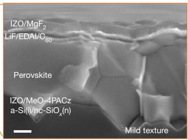  
b

c   
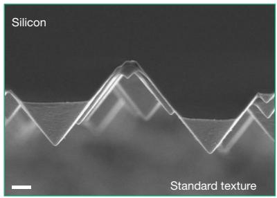  
9 Texture A, double-sided standard texture Texture C, double-sided mild texture Texture D, asymmetrically sized texture

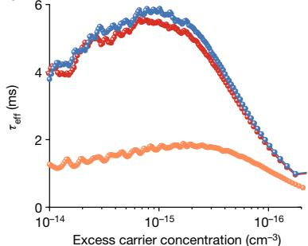  
d

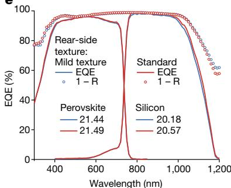  
e

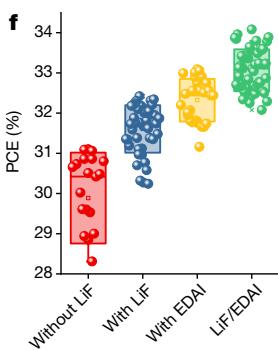

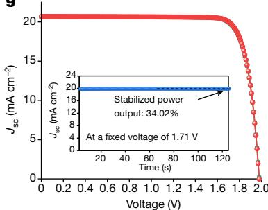  
g

<table><tr><td></td><td>Jsc(mA cm-2)</td><td>Voc(V)</td><td>FF (%)</td><td>PCE (%)</td></tr><tr><td>For</td><td>20.67</td><td>1.981</td><td>82.9</td><td>33.96</td></tr><tr><td>Rev</td><td>20.68</td><td>1.980</td><td>83.2</td><td>34.08</td></tr></table>

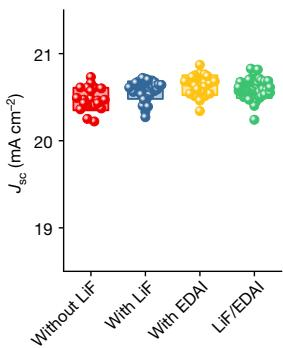

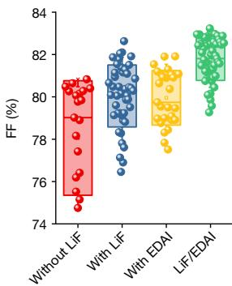

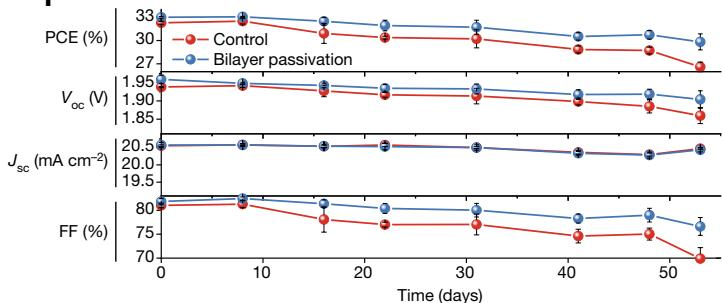  
i

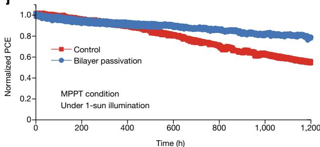  
j   
Fig. 4 | Photovoltaic performances and stability tests. a, Schematic of the monolithic perovskite/silicon tandem solar cell built from a double-sidetextured SHJ cell, featuring asymmetrically sized textures on the front and rear surfaces. The front surface on the silicon bottom cell displays a submicrometre pyramid texture, whereas the rear surface has a pyramid texture o $> 3 \mu \mathrm { m }$ . b,c, Scanning electron microscopy cross-sectional images of our tandem, showing solution-processed perovskite on mildly textured front surface (b) and standard-sized pyramid texture on the rear side (c). Scale bars, $2 0 0 \mathsf { n m } ( \mathsf { b } )$ and 1 μm (c). d, Effective minority carrier lifetime $( \tau _ { \mathrm { e f f } } )$ measurements on three kinds of wafer featuring different textures. e, EQE comparison of the perovskite/silicon tandems using mild texture and standard texture on the rear side. f, Photovoltaic performance parameter statistics for 1 cm2 perovskite/ silicon tandem based on different interfacial stack structures at the ETL side. The box outline represents the standard deviation of the data. g, In-house J–V   
curves of our tandem cell before shipping to NREL, measured under forward (For) and reverse (Rev) scans. The inset shows the stabilized power output of the tandem device at a fixed applied voltage of 1.71 V under AM 1.5G illumination. h, J–V curve and the maximum power output point of one tandem cell, measured by NREL using the asymptotic maximum power scan method. i, Evolution of the photovoltaic parameters over air storage time for the control (LiF treated) and bilayer passivated tandems. The symbols represent the average values from three devices. The measurements were performed in the ambient environment under AM 1.5G illumination. Between each measurement, the unencapsulated devices were stored in the laboratory environment at around $2 5 ^ { \circ } \mathrm { C }$ and approximately $2 0 \%$ relative humidity. j, Maximum power point tracking (MPPT) stability of the perovskite/silicon tandems under simulated 1-sun illumination at room temperature.

# Article

(R) at the back induced by large-sized pyramids results in improved collection of infrared photons, as evidenced by the EQE (Fig. 4e). The EQE difference between the two kinds of textures mainly lies in the long-wavelength range. The photocurrent density loss in the short-wavelength range $( 3 0 0 - 8 0 0 \mathrm { n m } ,$ ) can be separated into front surface reflection loss (approximately $0 . 8 \mathsf { m A } \mathsf { c m } ^ { - 2 }$ ) and parasitic absorption loss (around $0 . 3 \mathsf { m A c m ^ { - 2 } }$ ) from the $\mathrm { C } _ { 6 0 }$ layer and top electrode. The mild texture suffers a loss of $2 . 1 \mathsf { m A } \mathsf { c m } ^ { - 2 }$ in the $9 0 0 \mathrm { - } 1 , 2 0 0 \mathrm { n m }$ wavelength range, compared with only $1 . 9 \mathsf { m A } \mathsf { c m } ^ { - 2 }$ for the standard texture.

The advantage of the LiF/EDAI bilayer passivation in improving the device performance could be further verified on the basis of the device statistical results (Fig. 4f and Supplementary Figs. 25–28). As shown in Fig. 4f, for unpassivated tandems, the $V _ { \mathrm { o c } }$ value is mostly below 1.90 V. In particular, with LiF, EDAI and LiF/EDAI bilayer passivation, the average $V _ { \mathrm { o c } }$ value consistently improves to around 1.92, 1.94 and 1.96 V, respectively. It is worth noting that heavily passivated perovskite devices often exhibit an increase in $V _ { \mathrm { o c } } ,$ accompanied by a reduction in FF, which is associated with increased contact resistance and inappropriate band alignment29. Thus, ideal passivation schemes should seek to balance the suppression of interface recombinations with low interfacial contact resistance, which presents a key challenge in enhancing the device performance. In the case of EDAI passivation, the aforementioned trade-off could be observed. The EDAI capping layer improved $V _ { \mathrm { o c } }$ in an obvious manner, but led to reduced FF and increased data dispersion (Fig. 4f). By contrast, LiF/EDAI bilayer passivation not only improved the $V _ { \mathrm { o c } }$ value but also increased the FF value, which could be attributed to suppressed interfacial recombination coupled with more efficient charge extraction at the ETL interface. The bilayer-treated devices achieved an average PCE exceeding $3 3 \%$ , with some tandem devices reaching above $3 3 . 8 \%$ . It is noteworthy that our laboratory used carefully calibrated light intensity in conjunction with irradiation adjustments to ensure in-house results consistent with those of accredited laboratories. Figure 4g shows forward and reverse J–V scans of our champion tandem, displaying negligible hysteresis with a reverse-scan PCE of $3 4 . 1 \%$ , current density $( \boldsymbol { J } _ { \mathrm { s c } } )$ of $2 0 . 6 8 \mathsf { m A c m } ^ { - 2 }$ , $V _ { \mathrm { o c } }$ of 1.980 V and FF of $8 3 . 2 \%$ . A maximum power output of $3 4 . 0 \mathsf { m w c m ^ { - 2 } }$ at a fixed voltage of 1.71 V was achieved under standard AM 1.5G spectra. One unencapsulated device has been sent for certification to the National Renewable Energy Laboratory (NREL), which delivered a stabilized PCE of $3 3 . 8 9 \%$ and also verified our in-house measurements (Fig. 4h and Supplementary Figs. 29–31). To our knowledge, this represents the first double-junction tandem surpassing the single-junction Shockley–Queisser limit of $3 3 . 7 \%$ (ref. 43).

Devices with LiF/EDAI bilayer passivation exhibited improved long-term storage stability in air for over 50 days, compared with the LiF-treated control device without EDAI (Fig. 4h). Three LiF/EDAI devices with an average PCE of $3 3 . 0 \%$ were used for stability comparison. After 53 days of air storage, only a minor change in Jsc was observed, with variations primarily observed in $V _ { \mathrm { o c } }$ and FF. These variations were mainly associated with the resilience of the device interface to ambient conditions. Importanly, the devices featuring LiF/ EDAI bilayer passivation retained approximately $90 \%$ of their original PCEs, whereas the value decreased to $82 \%$ for the control devices, underscoring the advantage of bilayer passivation over the use of a LiF interlayer alone in terms of stability. We further evaluated the operational stability of a bilayer-treated perovskite/silicon tandem cell together with a LiF-treated control cell under simulated 1-sun illumination (Fig. 4j). The tandems were subjected to the maximum power point tracking condition at room temperature and in a nitrogen environment. Our bilayer passivation method is effective in enhancing the device stability, surpassing the performance of the LiF-treated control device. The corresponding PCEs of the two tandems before stability testing were $3 3 . 2 \%$ and $3 0 . 7 \%$ . The device using bilayer passivation retained approximately $80 \%$ of its initial PCE after 1,200 h of

operation, whereas the LiF-treated device retained less than $60 \%$ of its initial PCE. This result also highlights the need for further in-depth investigations on the interface structure and exploration of effective strategies to improve device stability and maintain high efficiency in future studies.

# Online content

Any methods, additional references, Nature Portfolio reporting summaries, source data, extended data, supplementary information, acknowledgements, peer review information; details of author contributions and competing interests; and statements of data and code availability are available at https://doi.org/10.1038/s41586-024-07997-7.

1. Aydin, E. et al. Pathways toward commercial perovskite/silicon tandem photovoltaics. Science 383, eadh3849 (2024).   
2. Shi, Y., Berry, J. J. & Zhang, F. Perovskite/silicon tandem solar cells: insights and outlooks. ACS Energy Lett. 9, 1305–1330 (2024).   
3. Al-Ashouri, A. et al. Monolithic perovskite/silicon tandem solar cell with ${ > } 2 9 \%$ efficiency by enhanced hole extraction. Science 370, 1300–1309 (2020).   
4. Chen, H. et al. Improved charge extraction in inverted perovskite solar cells with dualsite-binding ligands. Science 384, 189–193 (2024).   
5. Wu, H. et al. Silicon heterojunction back contact solar cells by laser patterning. Nature https://doi.org/10.1038/s41586-024-08110-8 (2024).   
6. NREL. Best research-cell efficiency chart. Photovoltaic Research; https://www.nrel.gov/pv/ cell-efficiency.html (accessed 02 September 2024).   
7. Niewelt, T. et al. Reassessment of the intrinsic bulk recombination in crystalline silicon. Sol. Energy Mater. Sol. Cells 235, 111467 (2022).   
8. Long, W. et al. On the limiting efficiency for silicon heterojunction solar cells. Sol. Energy Mater. Sol. Cells 231, 111291 (2021).   
9. Liu, W. et al. Light-induced activation of boron doping in hydrogenated amorphous silicon for over $2 5 \%$ efficiency silicon solar cells. Nat. Energy 7, 427–437 (2022).   
10. Aydin, E. et al. Enhanced optoelectronic coupling for perovskite/silicon tandem solar cells. Nature 623, 732–738 (2023).   
11. Chin, X. Y. et al. Interface passivation for $3 1 . 2 5 \%$ -efficient perovskite/silicon tandem solar cells. Science 381, 59–63 (2023).   
12. Mariotti, S. et al. Interface engineering for high-performance, triple-halide perovskite-silicon tandem solar cells. Science 381, 63–69 (2023).   
13. Aydin, E. et al. Ligand-bridged charge extraction and enhanced quantum efficiency enable efficient n–i–p perovskite/silicon tandem solar cells. Energy Environ. Sci. 14, 4377–4390 (2021).   
14. Xu, L. et al. Monolithic perovskite/silicon tandem photovoltaics with minimized cell-to module losses by refractive-index engineering. ACS Energy Lett. 7, 2370–2372 (2022).   
15. Mazzarella, L. et al. Infrared light management using a nanocrystalline silicon oxide interlayer in monolithic perovskite/silicon heterojunction tandem solar cells with efficiency above $2 5 \%$ . Adv. Energy Mater. 9, 1803241 (2019).   
16. Hou, Y. et al. Efficient tandem solar cells with solution-processed perovskite on textured crystalline silicon. Science 367, 1135–1140 (2020).   
17. Chen, B. et al. Blade-coated perovskites on textured silicon for $2 6 \%$ -efficient monolithic perovskite/silicon tandem solar cells. Joule 4, 850–864 (2020).   
18. Liu, J. et al. $2 8 . 2 \%$ -efficient, outdoor-stable perovskite/silicon tandem solar cell. Joule 5, 3169–3186 (2021).   
19. Stolterfoht, M. et al. The impact of energy alignment and interfacial recombination on the internal and external open-circuit voltage of perovskite solar cells. Energy Environ. Sci. 12, 2778–2788 (2019).   
20. Wang, J. et al. Reducing surface recombination velocities at the electrical contacts will improve perovskite photovoltaics. ACS Energy Lett. 4, 222–227 (2018).   
21. Caprioglio, P. et al. Open-circuit and short-circuit loss management in wide-gap perovskite p-i-n solar cells. Nat. Commun. 14, 932 (2023).   
22. Stolterfoht, M. et al. Visualization and suppression of interfacial recombination for highefficiency large-area pin perovskite solar cells. Nat. Energy 3, 847–854 (2018).   
23. Liu, J. et al. Efficient and stable perovskite-silicon tandem solar cells through contact displacement by MgF . Science 377, 302–306 (2022).   
24. Peña-Camargo, F. et al. Halide segregation versus interfacial recombination in bromiderich wide-gap perovskite solar cells. ACS Energy Lett. 5, 2728–2736 (2020).   
25. Li, Z. et al. Organometallic-functionalized interfaces for highly efficient inverted perovskite solar cells. Science 376, 416–420 (2022).   
26. Li, F. et al. Regulating surface termination for efficient inverted perovskite solar cells with greater than $2 3 \%$ efficiency. J. Am. Chem. Soc. 142, 20134–20142 (2020).   
27. Chen, H. et al. Regulating surface potential maximizes voltage in all-perovskite tandems. Nature 613, 676–681 (2023).   
28. Zhang, F. et al. Metastable Dion-Jacobson 2D structure enables efficient and stable perovskite solar cells. Science 375, 71–76 (2022).   
29. Chen, H. et al. Quantum-size-tuned heterostructures enable efficient and stable inverted perovskite solar cells. Nat. Photon. 16, 352–358 (2022).   
30. Park, S. M. et al. Engineering ligand reactivity enables high-temperature operation of stable perovskite solar cells. Science 381, 209–215 (2023).   
31. Azmi, R. et al. Damp heat-stable perovskite solar cells with tailored-dimensionality 2D/3D heterojunctions. Science 376, 73–77 (2022).   
32. Menzel, D. et al. Field effect passivation in perovskite solar cells by a LiF interlayer. Adv. Energy Mater. 12, 2201109 (2022).

33. Richter, A. et al. Design rules for high-efficiency both-sides-contacted silicon solar cells with balanced charge carrier transport and recombination losses. Nat. Energy 6, 429–438 (2021).   
34. Liu, W. et al. Flexible solar cells based on foldable silicon wafers with blunted edges. Nature 617, 717–723 (2023).   
35. Peng, J. et al. Nanoscale localized contacts for high fill factors in polymer-passivated perovskite solar cells. Science 371, 390–395 (2021).   
36. Adhyaksa, G. W. P., Johlin, E. & Garnett, E. C. Nanoscale back contact perovskite solar cell design for improved tandem efficiency. Nano Lett. 17, 5206–5212 (2017).   
37. Mao, K. et al. Unveiling and balancing the passivation‐transport trade‐off in perovskite solar cells with double‐side patterned insulator contacts. Adv. Energy Mater. 13, 2302132 (2023).   
38. Guillemoles, J.-F., Kirchartz, T., Cahen, D. & Rau, U. Guide for the perplexed to the Shockley–Queisser model for solar cells. Nat. Photon. 13, 501–505 (2019).   
39. Cai, M. et al. Control of electrical potential distribution for high-performance perovskite solar cells. Joule 2, 296–306 (2018).   
40. Jiang, C.-S. et al. Carrier separation and transport in perovskite solar cells studied by nanometre-scale profiling of electrical potential. Nat. Commun. 6, 8397 (2015).

41. Turkay, D. et al. Synergetic substrate and additive engineering for over 30%-efficient perovskite-Si tandem solar cells. Joule https://doi.org/10.1016/j.joule.2024.04.015 (2024).   
42. Juarez-Perez, E. J. et al. Photodecomposition and thermal decomposition in methylammonium halide lead perovskites and inferred design principles to increase photovoltaic device stability. J. Mater. Chem. A 6, 9604–9612 (2018).   
43. Rühle, S. Tabulated values of the Shockley–Queisser limit for single junction solar cells. Sol. Energy 130, 139–147 (2016).

Publisher’s note Springer Nature remains neutral with regard to jurisdictional claims in published maps and institutional affiliations.

Springer Nature or its licensor (e.g. a society or other partner) holds exclusive rights to this article under a publishing agreement with the author(s) or other rightsholder(s); author self-archiving of the accepted manuscript version of this article is solely governed by the terms of such publishing agreement and applicable law.

$\circledcirc$ The Author(s), under exclusive licence to Springer Nature Limited 2024

# Article

# Methods

# Materials

Lead iodide $( \mathsf { P b l } _ { 2 } , \mathsf { 9 9 . 9 9 9 \% } )$ ), lead bromide $( \mathsf { P b B r } _ { 2 } , 9 9 . 9 9 9 \% )$ ) and caesium iodide $( 9 9 . 9 9 9 \% )$ were purchased from TCI. FAI, methylammonium bromide and $\mathrm { C } _ { 6 0 } ( > 9 9 . 5 \%$ $\mathsf { C } _ { 6 0 }$ purity) were purchased from Xi’an Yuri Solar. Caesium iodide $( 9 9 . 9 9 9 \%$ ), anhydrous dimethylformamide (anhydrous, $9 9 . 8 \% )$ ), dimethyl sulfoxide (anhydrous, $2 9 9 . 9 \%$ ), ethyl acetate (anhydrous, $9 9 . 8 \%$ , isopropanol (anhydrous), LiF were purchased from Sigma-Aldrich. [4-(3,6-Dimethoxy-9H-carbazol-9-yl)butyl]phosphonic acid was purchased from TCI. All the chemicals were used as received without further purification.

# Si bottom cell fabrication

An n-doped ${ \bf < 1 0 0 > }$ CZ Si wafer with a resistivity of 1–4 Ω cm was used for the Si bottom cell fabrication. An aggressive etching step was first conducted to remove the surface saw damage and polish the wafer. Then, the rear surface of the wafers was textured using a standard texture procedure, which results in a pyramid size of $3 \mathrm { - } 5 \mu \mathrm { m }$ , to improve the optical response of the bottom cell in the near-infrared region. The front surface of the CZ wafers was mildly textured using a relatively low alkaline concentration, to ensure the process was compatible with the perovskite deposition. After a standard cleaning and hydrogen fluoride dip process, hydrogenated intrinsic amorphous (i-a-Si:H) layers with a thickness of approximately 5 nm were grown on both sides of the CZ wafers. Then, n-type nanocrystalline silicon oxide $( \boldsymbol { \mathrm { n c } } { \cdot } \mathsf { S i O } _ { x } { : } \boldsymbol { \mathrm { H } } )$ ) and p-type nc-Si:H layers with thicknesses of approximately ${ 1 5 } \mathsf { n m }$ and about $2 0 \mathsf { n m }$ were deposited on the front and back, respectively. To complete the silicon bottom cell fabrication, a 100-nm-thick $\ln _ { 2 } { \bf O } _ { 3 }$ -based transparent conductive oxide was deposited on the rear side, followed by silver deposition, and a 10-nm-thick transparent conductive oxide film was deposited on the front side. The front and rear transparent conductive oxide layers have an area of $1 . 1 \times 1 . 1 \mathsf { c m } ^ { 2 }$ . The silicon bottom cells were then laser cut to a $2 . 0 3 \times 2 . 0 3 \mathrm { c m } ^ { 2 }$ substrate for tandem fabrication.

# Tandem fabrication

The perovskite top cell with p–i–n configuration was fabricated on the silicon bottom cell. For hole transport layer deposition, $1 \mathrm { m g } \mathrm { m l } ^ { - 1 }$ [4-(3,6-dimethoxy-9H-carbazol-9-yl)butyl]phosphonic acid in ethanol was used and spin coated on IZO-coated substrates at 3,000 r.p.m. for $3 0 s$ , followed by drying at $1 0 0 ^ { \circ } \mathrm { C }$ for 10 min. Thereafter, 1.6 M wide-bandgap perovskite precursor solution with a composition of $\mathrm { F A _ { 0 . 8 } M A _ { 0 . 1 5 } C s _ { 0 . 0 5 } P b ( l _ { 0 . 7 6 } B r _ { 0 . 2 4 } ) _ { 3 } }$ and $5 \%$ excess PbX2 (X = I, Br) was prepared by dissolving 39.5 mg caesium iodide, 51.0 mg methylammonium bromide, 418 mg FAI, $3 3 2 \mathrm { m g } \mathsf { P b } \mathsf { B r } _ { 2 }$ and 1,057 mg $\mathsf { P b l } _ { 2 }$ in 2 ml mixed solvent of dimethylformamide:dimethyl sulfoxide $( \mathbf { v } ; \mathbf { v } = 4 ; 1 )$ ). The precursor solution was stirred for over 4 h, and then filtered using a $0 . 2 2 \mu \mathrm { m }$ polytetrafluoroethylene membrane before use. Before spin coating, the glovebox was purged for at least 10 min to eliminate possible residual organic atmosphere. A two-step spin-coating procedure (1,000 r.p.m. for 40 s and 3,000 r.p.m. for 20 s) was adopted to prepare the perovskite film. Ethyl acetate $( 2 0 0 \mu \mathrm { l } )$ was dropped in the centre the substrates 10 s before the end of the spin-coating process. Then, the substrates were immediately transferred onto a hotplate at $1 0 0 ^ { \circ } \mathrm { C }$ and were annealed for 30 min. The pipette carrying the antisolvent has a volume capacity of 1 ml, and the pipette tip was cut off from the middle to reduce the impact of the antisolvent on the perovskite surface. After perovskite deposition, approximately 1 nm LiF was deposited by thermal evaporation. The organic salt EDAI was ultrasonically dissolved in isopropanol with an optimal concentration of $0 . 3 \mathrm { m g } \mathrm { m l } ^ { - 1 }$ . The EDAI solution was spin coated on a LiF-coated perovskite surface at 3,000 r.p.m. for 30 s and then annealed for 2 min at $1 0 0 ^ { \circ } \mathrm { C } .$ . After cooling down, the isopropanol solvent was dropped at 5,000 r.p.m. onto the substrate to wash possible residual EDAI material. Subsequently, $1 0 \mathrm { n m C } _ { 6 0 }$ was deposited by

thermal evaporation. Then, 15 nm $\mathsf { S n O } _ { 2 }$ was deposited by atomic layer deposition using tetrakis(dimethylamino)tin(iv) and water as precursors. An IZO layer was deposited using radio-frequency magnetron sputtering on top of $\mathbf { S n O } _ { 2 }$ through a shadow mask. A silver finger with a thickness of 700 nm was thermally evaporated using a high-precision shadow mask. Finally, $\mathbf { 1 1 0 n m M g F } _ { 2 }$ was thermally evaporated as an anti-reflection layer.

# Fabrication of single-junction perovskite solar cell

To fabricate single-junction perovskite cells, silicon substrates with a symmetrical structure of nc $\mathrm { \bullet } \mathrm { s } \mathrm { i } 0 _ { x } \mathrm { : } \mathrm { H }$ (n type)/i-a-Si:H/n-type c-Si/i-a-Si:H/ $\mathsf { n c } { \cdot } \mathsf { S i O } _ { x } { \cdot } \mathsf { H }$ (n type) were fabricated. In this configuration, an n-doped charge transport layer instead of a p-type nc-Si:H layer was used on the back of Si wafer, leading to the Si substrate behaving as only a conductive substrate. The fabrication procedure for the single-junction perovskite cells, including the substrate morphology and device active area (approximately 1 cm2 ), is exactly the same as that for tandem cells. Thus, the performance of our single-junction perovskite cell can directly reflect its contribution in the tandem cell.

# Solar cell characterization

Current–voltage measurements on single-junction perovskite cells and perovskite/silicon tandem cells were performed in air using a Keithley 2400 device with a controlled stage temperature of $2 5 ^ { \circ } \mathrm { C }$ under AM 1.5G illumination from a light-emitting diode-based solar simulator (WaveLabs SINUS-230). The spectral irradiance was measured regularly using an external spectrometer, and was adjusted to make sure the mismatch factor for both cells was around $1 . 0 0 \pm 0 . 0 1$ . The light intensity was calibrated to be $1 , 0 0 0 \mathsf { W } \mathsf { m } ^ { - 2 }$ using Fraunhofer ISE CalLab-certified c-Si solar cells. The silicon substrates were placed on a water-cooled copper stage, with the temperature controlled at $2 5 ^ { \circ } \mathbf { C } .$ . The J–V curves were obtained with a step size of $1 0 \mathrm { m V }$ and a delay time of 10 ms. No preconditioning was used in this work. A black mask with an aperture area of $\mathrm { 1 . 0 } \mathrm { c m } ^ { 2 }$ was used for each test. Suns– $\boldsymbol { V _ { \mathrm { o c } } }$ measurements were conducted using the WaveLabs SINUS-230 system. Suns– $V _ { \mathrm { o c } }$ directly measures $V _ { \mathrm { o c } }$ as a function of the light intensity, varying from approximately 0.01 to 1.1 suns. The final pseudo-J–V curves were obtained by shifting the data at 1 sun to the $V _ { \mathrm { o c } }$ point. For EQE measurements of the Si bottom subcell in tandem, green light-emitting diode light with peak wavelength of 525 nm was illuminated on the cell and 0.5 V bias voltages were applied. When measuring the perovskite top subcell, a near-infrared light-emitting diode with peak wavelength of $8 4 5 \mathsf { n m }$ was illuminated on the cell and a 0.5 V bias voltage was applied.

# UPS/XPS measurements

UPS and XPS measurements were conducted using a Thermo Fisher ESCALAB Xi+ system. The surface WF and valence region were studied by UPS with a vacuum ultraviolet unfiltered He(1) (21.22 eV) source. The samples were biased to −10 V to observe the secondary electron cut-off. Repeated scans were recorded to assess any shifts resulting from photoemission-induced surface charging. For the perovskite samples, the band edge was determined by locating the inflection point on the logarithmic intensity scale, as the perovskite had extremely low density of states at the top of the VB. For the $\mathbf { C } _ { 6 0 }$ -coated samples, the band edge was determined from a linear extrapolation to zero of the baseline, because the $\mathbf { C } _ { 6 0 }$ material did not exhibit such a shallow slope at the onset of occupied states like the perovskite. XPS measurements were conducted with a monochromated Al Kα X-ray source (1,487.6 eV), with the samples in electrical contact to the analyser at ground potential.

# PL measurement

The PL images were acquired at room temperature using a Visiontec luminescence analyser. The samples were uniformly illuminated with

two 530 nm blue lasers. A Si charge-coupled device camera (Princeton Instruments) with a band-pass filter $( 7 3 0 \pm 3 0 \mathrm { n m } )$ ) was used to image the luminescence from the perovskite layer with an exposure time of 100 ms. TRPL measurements were carried out with a fluorescence spectrometer (FluoTime 250, PicoQuant). A picosecond laser diode with a wavelength of $4 0 5 \mathsf { n m }$ was used as the excitation source. A long-pass $4 2 5 \mathsf { n m }$ filter was used to block scattered laser light from entering the detector. For PLQY measurements, a $5 3 2 \mathsf { n m }$ laser with 1-sun equivalent intensity was used for excitation. The excitation light is coupled into a fibre directed into the integrating sphere on which the sample was illuminated. The emission from the sample was coupled into another fibre that was connected to a spectrometer.

# TOF-SIMS measurement

TOF-SIMS was conducted with an IONTOF TOF.SIMS 5-100 device. A $\ifmmode \mathrm { B i } _ { 3 } ^ { \phantom { \dagger } + }$ beam $( 3 0 \mathsf { k } \mathsf { V } _ { i }$ , $4 5 ^ { \circ }$ incidence) was used as the primary beam to detect the samples, and sputter etching was performed using a Cs+ beam (1 kV, 8 nA, $4 5 ^ { \circ }$ incidence) to obtain the desired depth profile. The area of analysis was $1 0 0 \times 1 0 0 \mu \mathrm { m } ^ { 2 }$ , and the sputtering area was $3 0 0 \times 3 0 0 \mu \mathrm { m } ^ { 2 }$ .

# DFT calculations

The DFT calculations were performed using the projector-augmented wave method as implemented in the Vienna ab initio simulation package code. The generalized gradient approximation together with the Perdew–Burke–Ernzerhof exchange–correlation functional was used. The van der Waals interactions were also considered in the calculations using the zero-damping Grimme’s DFT-D3 method44. A uniform grid of $6 \times 6 \times 6 k$ mesh in the Brillouin zone was used to optimize the crystal structures of bulk cubic-phase $\mathsf { F A P b l } _ { 3 }$ , $4 \times 4 \times 1 k$ mesh for $\mathsf { F A P b l } _ { 3 }$ slabs and $2 \times 2 \times 1 k$ mesh for ammonium cations (PA+ , $\mathsf { P h A } ^ { 2 + }$ , $\mathsf { E D A } ^ { 2 + }$ , $\mathsf { P D A } ^ { 2 + }$ and $\mathsf { B D A } ^ { 2 + } ) / \mathsf { F A P b l } _ { 3 }$ interfaces. The energy cut-offs of the WFs were set at 500 eV for the bulk and 450 eV for the slabs and interfaces. The unit cells had a $2 \times 2$ lateral periodicity and contained four octahedral layers of $\mathsf { F A P b l } _ { 3 }$ with an exposed (100) surface with different terminations (FAI rich and $\mathsf { P b l } _ { 2 }$ rich) and surface defects $\mathbf { \widetilde { V } } _ { \mathrm { F A } }$ and $\mathsf { V } _ { \mathrm { P b } } )$ ). The slab replicas were separated by approximately $2 0 \mathring { \mathbf { A } }$ of vacuum. Each structure was optimized until forces on single atoms were smaller than $0 . 0 1 \mathrm { e V } \mathring { \mathbf { A } } ^ { - 1 }$ .

# KPFM measurements

KPFM were performed on a custom-built system inside an argon-filled glovebox, which measured the contact-potential difference between the probe (NANOSENSORS PPP-EFM, Pt–Ir coated) and sample. We cleaved the device to expose a sufficiently flat cross section. We mapped the potential under open- and short-circuit conditions, with the Si substrates grounded. For data processing, we subtracted the short-circuit potential from the open-circuit condition, and then took the first derivative to identify photovoltage and electric-field distribution.

# Other characterizations

The reflectance was measured by a PerkinElmer Lambda-950 spectrophotometer. Scanning electron microscopy images were obtained using a JOEL ( JSM-7900F) measurement system. X-ray diffraction analysis was performed with a Bruker D8 Advance diffraction meter operated at $3 0 \kappa \nu$ and 10 mA using Cu Kα radiation (wavelength λ of 1.54 Å). For grazing-incidence small-angle X-ray scattering experiments, the scattered intensities were collected using a Dectris EIGER2 Si1M detector with an exposure time of 1,200 s and Ω of approximately $0 . 5 ^ { \circ }$ . An X-ray beam from Cu Kα radiation $( \lambda = 0 . 1 5 4 \mathrm { n m }$ ) was used.

# Reporting summary

Further information on research design is available in the Nature Portfolio Reporting Summary linked to this article.

# Data availability

The data that support the findings of this study are available from the corresponding authors upon reasonable request.

44. Grimme, S., Hansen, A., Brandenburg, J. G. & Bannwarth, C. Dispersion-corrected mean-field electronic structure methods. Chem. Rev. 116, 5105–5154 (2016).

Acknowledgements This work was supported by LONGi Central R&D Institute, the National Key Research and Development Program of China (no. 2023YFB4202505); Two-chain Integration Key Program of Shaanxi Province (no. 2023-LL-QY-16); the National Natural Science Foundation of China (no. 51821002); the Collaborative Innovation Center of Suzhou Nano Science & Technology, Key Basic Research Program of Jiangsu Province (no. BK20243031); the Soochow University (nos. NH16000124 and SR16000123); the Hong Kong Polytechnic University (no. P0042930); and the Research Grants Council of the Hong Kong Special Administrative Region, China (nos. PolyU 25300823 and PolyU 15300724).

Author contributions Jiang Liu, Y.H., L.D. and H.Z. conceived this work and designed the experiment. Jiang Liu, H.Z. and Qiaoyan Li acquired the PL spectra. J. Yu conducted the ToF-SIMS measurements. T.W.L. and J. Yin conducted the DFT calculations. Minghui Li and C.X. performed the KPFM measurements. Jiang Liu, Y.H. and L.D. designed the texture structure and contributed to its development. Y.H., L.D., H.Z., L.J., Y.Q., X.G, F.Z, Qibo Li, Y.Y., S.Z., X.W., Jie Liu, T.L., Y.G., Y.W. and X.D. fabricated and optimized the perovskite/silicon tandem solar cells. H.C., P.L., T.Z., M.Y., X.R., F.P., S.Y., M.Q., P.X., Z.Z. and Menglei Li fabricated and optimized the silicon bottom cells. P.G. conducted the XPS and UPS measurements. Jiang Liu and Y.H. wrote the draft of the manuscript. Jiang Liu, Y.H., L.D., B.H. and X.X. reviewed and polished the manuscript. C.X., P.X., H.Y., J. Yin, X.Z., Z.L., B.H. and X.X. supervised the project and secured the funding.

Competing interests A patent application (No. 202310730135.2, filed in China) that covers the asymmetrically sized texturing used in this work has been submitted.

# Additional information

Supplementary information The online version contains supplementary material available at https://doi.org/10.1038/s41586-024-07997-7.

Correspondence and requests for materials should be addressed to Jiang Liu, Ping Xiao, Jun Yin, Xiaohong Zhang, Zhenguo Li, Bo He or Xixiang Xu.

Peer review information Nature thanks Marko Mladenovic and the other, anonymous, reviewer(s) for their contribution to the peer review of this work.

Reprints and permissions information is available at http://www.nature.com/reprints.

# Solar Cells Reporting Summary

NaturePortfoliwisstomproetereproducibilityftheorkthatwepublshisfisintendedfopublicationithllacetedaps reportingthecharacterzatiofpotovltaicdevicsandprovidesstructureforconsistencyandtransparecyineportingSomelistitsight not apply toan individual manuscript,but all fields must be completed for clarity.

For further information on Nature Research policies,including our data availabilitypolicy,see Authors &Referees.

# Experimental design

Pleasecheckthefollwingdetailsarereportedinthemanuscript,andprovideabriefdescriptionorexplanationwhereaplicable

# 1.Dimensions

Area of the tested solar cells

Method used to determine the device area

# 2. Current-voltage characterization

Current density-voltage (J-V) plots in both forward and backward direction

Voltage scan conditions

Test environment

Protocol for preconditioning of the device before its characterization

Stability of the J-V characteristic

# 3. Hysteresis or any other unusual behaviour

Description of the unusual behaviour observed during the characterization

Related experimental data

# 4.Efficiency

External quantum efficiency (EQE) or incident photons to current efficiency (IPCE)

Yes

A black mask with an aperture area of 1.O cm2 was used for each test.It has been stated in the Methods section

Yes

No

□

Yes

No

in the Methods section

Yes

No

in the Fig. 4g

Yes

No

Current-voltage (J-V) curves were obtained with a step size of $1 0 \mathsf { m V }$ and a delay time of 10 ms.It has been stated in the Methods section.

Yes

No No

Yes

No

The silicon substrates were placed on a water-cooled copper stage with a temperature controlled at 25 Cin air environment.

No any preconditioning was used in this work.

in the Fig. 4g

Yes

No

in the Fig. 4g

Yes

No

in the Fig.4g and Fig.4h

Yes

No

For EQE measurements of Si bottom subcellin tandem,a green LED light with peak wavelength of 525 nm was illuminated on the celland a O.5 V bias voltages were applied.When measuring perovskite top subcell,a near-infrared LED with peak wavelength of 845 nm wasilluminated on the cell and a O.5 V bias voltages were applied.It has been stated in the Methods section.

A comparison between the integrated response under the standard reference spectrum and the response measure under the simulator

For tandem solar cells,the bias illumination and bias voltage used for each subcell

# 5．Calibration

Light source and reference cell or sensor used for the characterization

Confirmation that the reference cell was calibrated and certified

Calculation of spectral mismatch between the reference cell and the devices under test

# 6. Mask/aperture

Size of the mask/aperture used during testing

Variation of the measured short-circuit current density with the mask/aperture area

# 7.Performance certification

Identity of the independent certification laboratory that confirmed the photovoltaic performance

A copy of any certificate(s)

# 8.Statistics

Number of solar cells tested

Statistical analysis of the device performance

# 9.Long-term stability analysis

Type of analysis, bias conditions and environmental conditions

in the Fig.4g and Fig.4h

in the Methods section

The reference cell was certified by the Fraunhofer ISE, Germany.It has been stated in the Methods section.

The reference cell was certified by the Fraunhofer ISE.

The mismatch factor for both cells is around $1 . 0 0 { \scriptstyle \pm 0 . 0 1 }$ .The spectra irradiance in our lab was measured regularly using an external spectrometer.

A black mask with an aperture area of $1 . 0 \mathsf { c m } 2$ was used for each test.It has been stated in the Methods sectio

NREL calibrated the mask area,in the Supplementary Fig.S29

National Renewable Energy Laboratory (NREL) confirmed the device performance

in the Supplementary Fig.S29-S31

in the Fig. 4f

in the Fig.4f and the Supplementary Fig.S25-S28

in the Fig. 4i and Fig.4j