# pvsks41586-024-07997-7-gaia

Add your description here

## Overview

```mermaid
graph LR
    csi_solar_cell_dominance["c-Si solar cell market dominance"]:::setting
    auger_recombination_limit["Silicon cell efficiency limits"]:::setting
    tandem_strategy["Perovskite/silicon tandem strategy"]:::setting
    pin_interface_recombination["p-i-n interface recombination challenge"]:::setting
    passivation_tradeoff["Passivation-transport tradeoff (0.78)"]:::premise
    research_question["Research question"]:::question
    bilateral_passivation_strategy["Bilayer interface passivation strategy (0.89)"]:::derived
    lif_limited_effectiveness["LiF limited effectiveness alone (0.78)"]:::premise
    edai_chemical_passivation["EDAI chemical passivation mechanism (0.78)"]:::premise
    nanoscale_contact_requirement["Nanoscale contact requirement (0.75)"]:::premise
    double_textured_silicon["Double-textured silicon substrate design (0.88)"]:::premise
    champion_device_performance["Champion device certified performance (0.50)"]:::orphan
    pl_intensity_ranking["PL intensity ranking of passivation layers (0.50)"]:::orphan
    plqy_increase_with_c60["PLQY behavior with and without C60 (0.50)"]:::orphan
    plqy_with_complete_top_contact["PLQY with complete top contacts (0.97)"]:::derived
    trpl_lifetime_results["TRPL lifetime results (0.50)"]:::orphan
    single_junction_device_results["Single-junction device performance with passivation layers (0.97)"]:::derived
    power_loss_analysis["Power loss analysis comparison (0.50)"]:::orphan
    lif_discontinuity_confirmation["LiF discontinuity enables EDAI contact (0.80)"]:::premise
    electric_field_enhancement["EDAI enhances interfacial electric field (0.50)"]:::orphan
    metallic_pb_suppression["EDAI suppresses metallic Pb formation (0.80)"]:::premise
    pa_vs_eda_orientation["PA+ vertical vs EDA2+ horizontal binding (0.80)"]:::premise
    binding_energy_comparison["EDA2+ binding energy substantially larger than PA+ (0.50)"]:::orphan
    trap_state_elimination["EDAI effectively eliminates shallow trap states (0.50)"]:::orphan
    minority_carrier_lifetime["Minority carrier lifetime by texture type (0.75)"]:::premise
    eqe_spectral_response["Large pyramid texture improves infrared response (0.75)"]:::premise
    voc_statistical_improvement["Voc and PCE statistical improvement with bilayer (0.80)"]:::premise
    champion_device_jv["Champion tandem J-V performance (0.90)"]:::premise
    nrel_certified_pce["NREL certified 33.89% PCE (0.90)"]:::premise
    storage_stability["Bilayer passivation improves air storage stability (0.85)"]:::premise
    operational_stability["Bilayer passivation enables 80% retention after 1200h operation (0.85)"]:::premise
    theoretical_prediction_bilayer["Bilayer theoretical prediction (0.97)"]:::premise
    edai_ff_tradeoff["EDAI passivation-transport trade-off (0.47)"]:::premise
    bilayer_no_tradeoff["Bilayer overcomes trade-off (0.37)"]:::premise
    contradiction_passivation_transport["contradiction_passivation_transport (1.00)"]:::derived
    bilayer_mechanism_synthesis["Bilayer passivation dual mechanism synthesis (0.60)"]:::derived
    nanoscale_contact_design["Nanoscale contact design enables effective perovskite integration (0.64)"]:::derived
    asymmetric_texture_benefits["Asymmetric texture resolves perovskite-silicon integration challenge (0.61)"]:::derived
    first_to_exceed_sq_limit["First certified tandem exceeding Shockley-Queisser limit (0.65)"]:::derived
    stability_implications["Bilayer passivation enhances operational stability (0.68)"]:::derived
    bilayer_no_tradeoff --> contradiction_passivation_transport
    champion_device_jv --> first_to_exceed_sq_limit
    double_textured_silicon --> bilateral_passivation_strategy
    edai_chemical_passivation --> bilateral_passivation_strategy
    edai_ff_tradeoff --> contradiction_passivation_transport
    eqe_spectral_response --> asymmetric_texture_benefits
    lif_discontinuity_confirmation --> bilayer_mechanism_synthesis
    lif_limited_effectiveness --> bilateral_passivation_strategy
    metallic_pb_suppression --> bilayer_mechanism_synthesis
    minority_carrier_lifetime --> asymmetric_texture_benefits
    nanoscale_contact_requirement --> bilateral_passivation_strategy
    nanoscale_contact_requirement --> nanoscale_contact_design
    nrel_certified_pce --> first_to_exceed_sq_limit
    operational_stability --> first_to_exceed_sq_limit
    operational_stability --> stability_implications
    pa_vs_eda_orientation --> bilayer_mechanism_synthesis
    passivation_tradeoff --> bilateral_passivation_strategy
    storage_stability --> first_to_exceed_sq_limit
    storage_stability --> stability_implications
    theoretical_prediction_bilayer --> plqy_with_complete_top_contact
    theoretical_prediction_bilayer --> single_junction_device_results
    voc_statistical_improvement --> asymmetric_texture_benefits

    classDef setting fill:#f0f0f0,stroke:#999,color:#333
    classDef premise fill:#ddeeff,stroke:#4488bb,color:#333
    classDef derived fill:#ddffdd,stroke:#44bb44,color:#333
    classDef question fill:#fff3dd,stroke:#cc9944,color:#333
    classDef background fill:#f5f5f5,stroke:#bbb,stroke-dasharray: 5 5,color:#333
    classDef orphan fill:#fff,stroke:#ccc,stroke-dasharray: 5 5,color:#333
    classDef external fill:#fff,stroke:#aaa,stroke-dasharray: 3 3,color:#333
    classDef weak fill:#fff9c4,stroke:#f9a825,stroke-dasharray: 5 5,color:#333
    classDef contra fill:#ffebee,stroke:#c62828,color:#333
```

## Motivation module for pvsks41586-024-07997-7-gaia.

#### c-Si solar cell market dominance ★

📋 `csi_solar_cell_dominance`

> Crystalline silicon (c-Si) solar cells dominate the photovoltaic market due to exceptional efficiency, abundant material supply, and long-term reliability. Commercial CZ silicon wafer cells have achieved certified PCE exceeding 27% (LONGi Green Energy Technology).

#### Silicon cell efficiency limits ★

📋 `auger_recombination_limit`

> Further enhancements in silicon cell performance are mainly limited by Auger recombination and parasitic absorption.

#### Perovskite/silicon tandem strategy ★

📋 `tandem_strategy`

> Integrating a wide-bandgap metal halide perovskite atop silicon heterojunction (SHJ) bottom cells in a tandem configuration minimizes carrier thermalization losses and has demonstrated independently certified PCEs exceeding 31%.

#### p-i-n interface recombination challenge ★

📋 `pin_interface_recombination`

> State-of-the-art high-efficiency tandem solar cells predominantly adopt an inverted p-i-n configuration. However, p-i-n-type perovskite devices suffer from strong interface recombination at the perovskite/C60 interface for electron extraction, leading to an undesirably large open-circuit voltage (Voc) deficit.

#### Passivation-transport tradeoff ★

📌 `passivation_tradeoff`   |   Prior: 0.75   |   Belief: **0.78**

> A fundamental challenge in implementing passivation layers in p-i-n devices is achieving the best balance between minimizing recombination loss and restricting contact resistance, thereby ensuring efficient electron transport and hole blocking simultaneously.

#### Research question ★

❓ `research_question`

> How can interfacial recombination at the wide-bandgap perovskite/electron transport layer interface be suppressed without compromising superior charge transport performance in perovskite/silicon tandem cells?

#### Bilayer interface passivation strategy ★

📌 `bilateral_passivation_strategy`   |   Belief: **0.89**

> A bilayer interface passivation strategy was developed that involves the incorporation of a thin lithium fluoride (LiF) layer followed by the deposition of a short-chain ethylenediammonium diiodide (EDAI) molecule. LiF acts as a contact displacer and induces field passivation, while EDAI chemically passivates unpassivated areas that are not contacted by the LiF layer, forming nanoscale localized contacts at the perovskite/C60 interface.

🔗 **support**([Double-textured silicon substrate design](#double_textured_silicon))

Reasoning

The double-textured silicon substrate (@double_textured_silicon) enables the bilayer passivation strategy to be implemented effectively by providing a mildly textured front for perovskite deposition and a heavily textured rear for optical performance.

#### LiF limited effectiveness alone ★

📌 `lif_limited_effectiveness`   |   Prior: 0.75   |   Belief: **0.78**

> A thin LiF interlayer with typical thickness of approximately 1 nm cannot provide sufficient passivation efficacy due to its discrete nature, still showing a large voltage deficit. A thicker LiF layer may improve passivation but introduces considerable undesirable resistive loss.

#### EDAI chemical passivation mechanism ★

📌 `edai_chemical_passivation`   |   Prior: 0.75   |   Belief: **0.78**

> The EDAI molecule can chemically passivate unpassivated areas not contacted by the LiF layer, forming nanoscale localized contacts at the perovskite/C60 interface. This provides an optimal trade-off between passivation and charge extraction.

#### Nanoscale contact requirement ★

📌 `nanoscale_contact_requirement`   |   Prior: 0.70   |   Belief: **0.75**

> Local contact and selective emitter doping are widely used in mainstream silicon cell technologies. Implementing them in perovskite cells poses a substantial challenge due to the considerably shorter charge diffusion lengths of perovskite absorbers compared with silicon, necessitating local contact spacing at the submicrometre or nanoscale level.

#### Double-textured silicon substrate design ★

📌 `double_textured_silicon`   |   Prior: 0.85   |   Belief: **0.88**

> The tandem devices were constructed on a double-textured Czochralski-based silicon heterojunction cell featuring a mildly textured front surface (for solution-processed perovskite) and a heavily textured rear surface (for uncompromised rear passivation and improved spectral response).

#### Champion device certified performance ★

📌 `champion_device_performance`   |   Belief: **0.50**

> The resulting perovskite/silicon tandem achieved an independently certified stabilized power conversion efficiency of 33.89%, accompanied by a fill factor of 83.0% and an open-circuit voltage of nearly 1.97 V. This represents the first reported certified efficiency of a two-junction tandem solar cell exceeding the single-junction Shockley-Queisser limit of 33.7%.

## Results module for pvsks41586-024-07997-7-gaia.

```mermaid
graph TD
    pl_intensity_ranking["PL intensity ranking of passivation layers (0.50)"]:::orphan
    plqy_increase_with_c60["PLQY behavior with and without C60 (0.50)"]:::orphan
    plqy_with_complete_top_contact["PLQY with complete top contacts (0.97)"]:::derived
    trpl_lifetime_results["TRPL lifetime results (0.50)"]:::orphan
    passivation_targets_perovskite_c60["Passivation must target perovskite/C60 interface (0.50)"]:::orphan
    single_junction_device_results["Single-junction device performance with passivation layers (0.97)"]:::derived
    pseudo_ff_values["Pseudo-FF improvement with passivation (0.50)"]:::orphan
    power_loss_analysis["Power loss analysis comparison (0.50)"]:::orphan
    tof_sims_lif_distribution["TOF-SIMS LiF fragment distribution (0.50)"]:::orphan
    tof_sims_edai_distribution["TOF-SIMS EDAI distribution confirms intertwining (0.75)"]:::premise
    lif_discontinuity_confirmation["LiF discontinuity enables EDAI contact (0.80)"]:::premise
    kpfm_surface_potential["KPFM confirms discrete LiF regions (0.50)"]:::orphan
    electric_field_enhancement["EDAI enhances interfacial electric field (0.50)"]:::orphan
    xps_pb4f_shift["EDAI chemical interaction with Pb ions (0.75)"]:::premise
    metallic_pb_suppression["EDAI suppresses metallic Pb formation (0.80)"]:::premise
    xps_n1s_results["N1s XPS confirms EDAI surface modification (0.50)"]:::orphan
    work_function_reduction["Work function reduction with bilayer treatment (0.50)"]:::orphan
    fermi_level_to_valence_band["Fermi level to VB edge increase (0.50)"]:::orphan
    ionization_potential_slight_increase["Ionization potential increase with treatment (0.50)"]:::orphan
    c60_interface_ie_variation["C60 causes significant IE change (0.50)"]:::orphan
    dft_slab_structures["DFT calculation setup and surface defects (0.50)"]:::orphan
    pa_vs_eda_orientation["PA+ vertical vs EDA2+ horizontal binding (0.80)"]:::premise
    binding_energy_comparison["EDA2+ binding energy substantially larger than PA+ (0.50)"]:::orphan
    trap_state_elimination["EDAI effectively eliminates shallow trap states (0.50)"]:::orphan
    textured_substrate_optimization["Asymmetric texture optimization improves performance (0.50)"]:::orphan
    minority_carrier_lifetime["Minority carrier lifetime by texture type (0.75)"]:::premise
    eqe_spectral_response["Large pyramid texture improves infrared response (0.75)"]:::premise
    voc_statistical_improvement["Voc and PCE statistical improvement with bilayer (0.80)"]:::premise
    fill_factor_improvement["Bilayer achieves both Voc improvement and FF enhancement (0.50)"]:::orphan
    champion_device_jv["Champion tandem J-V performance (0.90)"]:::premise
    stabilized_power_output["Stabilized power output (0.50)"]:::orphan
    nrel_certified_pce["NREL certified 33.89% PCE (0.90)"]:::premise
    storage_stability["Bilayer passivation improves air storage stability (0.85)"]:::premise
    operational_stability["Bilayer passivation enables 80% retention after 1200h operation (0.85)"]:::premise
    theoretical_prediction_lif_only["LiF-only theoretical limitation (0.97)"]:::premise
    theoretical_prediction_edai_only["EDAI-only theoretical limitation (0.97)"]:::premise
    theoretical_prediction_bilayer["Bilayer theoretical prediction (0.97)"]:::premise
    edai_ff_tradeoff["EDAI passivation-transport trade-off (0.47)"]:::premise
    bilayer_no_tradeoff["Bilayer overcomes trade-off (0.37)"]:::premise
    contradiction_passivation_transport["contradiction_passivation_transport (1.00)"]:::derived
    strat_3(["support"]):::weak
    theoretical_prediction_bilayer --> strat_3
    strat_3 --> plqy_with_complete_top_contact
    strat_4(["support"]):::weak
    theoretical_prediction_lif_only --> strat_4
    strat_4 --> plqy_with_complete_top_contact
    strat_7(["support"]):::weak
    theoretical_prediction_bilayer --> strat_7
    strat_7 --> single_junction_device_results
    strat_8(["support"]):::weak
    theoretical_prediction_edai_only --> strat_8
    strat_8 --> single_junction_device_results
    oper_0{{"⊗"}}:::contra
    edai_ff_tradeoff --- oper_0
    bilayer_no_tradeoff --- oper_0
    oper_0 --- contradiction_passivation_transport

    classDef setting fill:#f0f0f0,stroke:#999,color:#333
    classDef premise fill:#ddeeff,stroke:#4488bb,color:#333
    classDef derived fill:#ddffdd,stroke:#44bb44,color:#333
    classDef question fill:#fff3dd,stroke:#cc9944,color:#333
    classDef background fill:#f5f5f5,stroke:#bbb,stroke-dasharray: 5 5,color:#333
    classDef orphan fill:#fff,stroke:#ccc,stroke-dasharray: 5 5,color:#333
    classDef external fill:#fff,stroke:#aaa,stroke-dasharray: 3 3,color:#333
    classDef weak fill:#fff9c4,stroke:#f9a825,stroke-dasharray: 5 5,color:#333
    classDef contra fill:#ffebee,stroke:#c62828,color:#333
```

#### PL intensity ranking of passivation layers ★

📌 `pl_intensity_ranking`   |   Belief: **0.50**

> PL imaging showed the bare perovskite sample without any capping layer exhibited the highest PL intensity. The PL intensity of the LiF/EDAI bilayer lay between those of samples with LiF and EDAI alone. Direct deposition of C60 on perovskite surface resulted in substantial reduction in PL emission intensity and TRPL lifetime, indicating high defect density at this interface.

#### PLQY behavior with and without C60 ★

📌 `plqy_increase_with_c60`   |   Belief: **0.50**

> PLQY data showed that in the absence of C60 layer, slight increase in PLQY was observed after LiF deposition on bare perovskite surface, whereas EDAI deposition alone showed slight decrease. On a logarithmic scale, no significant change in PLQY was observed for cases without C60. Difference in PLQY values became clear in presence of C60, indicating passivation effect manifests only when perovskite is paired with C60.

#### PLQY with complete top contacts ★

📌 `plqy_with_complete_top_contact`   |   Belief: **0.97**

> After complete C60/SnO2/IZO top contact depositions, further increase in PLQY was observed, but the trend that EDAI/LiF bilayer passivation leads to highest PLQY among all C60-coated samples remained consistent.

🔗 **support**([LiF-only theoretical limitation](#theoretical_prediction_lif_only))

Reasoning

The LiF-only prediction (@theoretical_prediction_lif_only) explains the intermediate PLQY observed for LiF-only samples.

#### TRPL lifetime results ★

📌 `trpl_lifetime_results`   |   Belief: **0.50**

> TRPL results and PL images showed that with complete top contact of SnO2/IZO/IZO stack, EDAI and LiF/EDAI samples exhibited impressively high differential lifetime of >10 microseconds at rather high PL flux, suggesting minimized non-radiative recombination. This enhancement benefits Voc and FF values of the perovskite device.

#### Passivation must target perovskite/C60 interface

📌 `passivation_targets_perovskite_c60`   |   Belief: **0.50**

> Effective passivation should target the perovskite/C60 interface rather than bare perovskite surface. Only after deposition of C60 layer or complete top contacts, passivation efficacy of interlayers can be revealed.

#### Single-junction device performance with passivation layers ★

📌 `single_junction_device_results`   |   Belief: **0.97**

> Semitransparent single-junction p-i-n devices with aperture area approximately 1.0 cm^2 were fabricated on textured silicon substrates. The unpassivated device yielded Voc and FF of approximately 1.17 V and 76.2%, respectively, with pseudo-FF of 82.0%. With LiF, EDAI, and LiF/EDAI bilayer, Voc improved to approximately 1.20, 1.25, and 1.27 V, respectively, while FF increased to 77.7%, 79.1%, and 80.8%, respectively.

🔗 **support**([EDAI-only theoretical limitation](#theoretical_prediction_edai_only))

Reasoning

The EDAI-only prediction (@theoretical_prediction_edai_only) explains the observed Voc improvement but FF reduction in EDAI-only devices.

#### Pseudo-FF improvement with passivation

📌 `pseudo_ff_values`   |   Belief: **0.50**

> Pseudo-FF values increased to 83.6%, 86.5%, and 86.1% for LiF, EDAI, and LiF/EDAI samples, respectively, compared with 82.0% for unpassivated device.

#### Power loss analysis comparison ★

📌 `power_loss_analysis`   |   Belief: **0.50**

> Theoretical limit of a 1.69-eV-bandgap cell with 29.1% efficiency and 90.9% FF was used for comparison. Using LiF/EDAI bilayer passivation resulted in increase in device efficiency to 22.2%, compared with 20.2% and 21.2% for LiF and EDAI cases, respectively. Compared with EDAI alone, LiF/EDAI bilayer exhibited reduced current transport loss narrowing from 2.1 to 1.5 mW/cm^2, indicating lower contact resistance.

#### TOF-SIMS LiF fragment distribution

📌 `tof_sims_lif_distribution`   |   Belief: **0.50**

> TOF-SIMS measurements showed LiF-related fragment distribution confirming discontinuous nature of the LiF layer. The Cs2CN+ signal attributed to EDA+ from EDAI showed obvious peak at front interface followed by flat region (150-500 s sputter time), indicating EDAI did not penetrate into bulk perovskite.

#### TOF-SIMS EDAI distribution confirms intertwining

📌 `tof_sims_edai_distribution`   |   Prior: 0.75   |   Belief: **0.75**

> TOF-SIMS showed EDAI-related charged fragments mainly localized on surface of perovskite. No clear interface between LiF and EDAI layers was observed, indicating the two layers are intertwined with each other.

#### LiF discontinuity enables EDAI contact ★

📌 `lif_discontinuity_confirmation`   |   Prior: 0.80   |   Belief: **0.80**

> TEM results confirmed that the ultrathin LiF layer is discontinuous, allowing EDAI molecule to locally contact perovskite across the LiF layer. The charge carrier transport at LiF/EDAI bilayer interface is not affected as LiF opening spacing is only a few nanometers, which is evidently smaller than charge diffusion length of perovskite absorber.

#### KPFM confirms discrete LiF regions

📌 `kpfm_surface_potential`   |   Belief: **0.50**

> KPFM imaging showed that for samples without LiF layer, surface potential mapping is relatively smooth with no evident point-like features. For samples with LiF layer, point-like regions with low potentials could frequently be observed, attributed to discrete LiF fragments.

#### EDAI enhances interfacial electric field ★

📌 `electric_field_enhancement`   |   Belief: **0.50**

> Cross-sectional KPFM measurements showed that for unpassivated and LiF-treated devices, amplitude of electric-field variation at perovskite/ETL interface is relatively small. Implementing extra EDAI treatment on LiF-coated device made changes in interfacial electric field become significant. LiF/EDAI bilayer passivation enables improved charge separation at perovskite/C60 interface regardless of perovskite contacting valley or spire region of silicon wafer pyramid.

#### EDAI chemical interaction with Pb ions

📌 `xps_pb4f_shift`   |   Prior: 0.75   |   Belief: **0.75**

> XPS measurements showed small shift in two characteristic main peaks of Pb4f after EDAI deposition, signifying chemical interaction of EDAI with Pb ions.

#### EDAI suppresses metallic Pb formation ★

📌 `metallic_pb_suppression`   |   Prior: 0.80   |   Belief: **0.80**

> Samples without EDAI treatments showed peaks at approximately 141.5 eV and 136.5 eV attributed to presence of metallic Pb(0), which might be transformed from uncoordinated surface Pb2+ ions or photodegraded PbI2 phase. After EDAI deposition, magnitude of Pb(0) peak was reduced to almost invisible, providing strong evidence that EDAI treatment chemically modifies perovskite surface. LiF/EDAI bilayer treatment showed identical effect as EDAI treatment in suppressing metallic Pb(0), confirming ultrathin LiF layer did not hinder chemical interaction.

#### N1s XPS confirms EDAI surface modification

📌 `xps_n1s_results`   |   Belief: **0.50**

> N1s signals displayed two separated peaks corresponding to C=N bond of formamidinium (FA) at around 400.5 eV and C-N bond of methylammonium (MA) or EDAI molecules at approximately 402.5 eV. After subtracting MA component from perovskite film, C-N/C=N ratio was significantly weakened as EDAI was deposited on LiF-coated perovskite, indicating LiF interlayer could reduce reactivity of EDAI with perovskite surface or limit penetration into perovskite film.

#### Work function reduction with bilayer treatment

📌 `work_function_reduction`   |   Belief: **0.50**

> UPS measurements showed bilayer-treated sample exhibited smaller work function (WF) of 4.06 eV compared with bare perovskite (4.47 eV).

#### Fermi level to VB edge increase

📌 `fermi_level_to_valence_band`   |   Belief: **0.50**

> The difference between Fermi level and valence band (VB) edge in EDAI-treated sample (EF-EV = 1.41 eV) was larger than that on bare perovskite surface (0.90 eV), implying surface energy level bent downwards after EDAI treatments enhancing electron transport.

#### Ionization potential increase with treatment

📌 `ionization_potential_slight_increase`   |   Belief: **0.50**

> Ionization potential (IE) values were 5.37 eV for bare perovskite and 5.47 eV for bilayer-treated sample. Surface treatments caused slight increase in IE indicating presence of interfacial dipole.

#### C60 causes significant IE change

📌 `c60_interface_ie_variation`   |   Belief: **0.50**

> With 3-nm-thin C60 layer, IE variation became significant with values of 6.36 eV (untreated) and 6.04 eV (bilayer-treated). Surface treatment affected properties of subsequently deposited C60 layer close to the interface, affecting conduction band offset between perovskite and C60.

#### DFT calculation setup and surface defects

📌 `dft_slab_structures`   |   Belief: **0.50**

> DFT calculations on representative FAPbI3(100) surfaces before and after molecular passivation considered two key terminations: FAI-rich and PbI2-rich, each bearing surface defects in form of lead vacancy (VPb) and FA vacancy (VFA). Calculations examined diammonium cations with different carbon chains and monovalent n-propylammonium cations (PA+) featuring alkyl end instead of two amine ends.

#### PA+ vertical vs EDA2+ horizontal binding ★

📌 `pa_vs_eda_orientation`   |   Prior: 0.80   |   Belief: **0.80**

> DFT calculations revealed distinct contrast in orientations of PA+ and EDA2+ with respect to binding to perovskite surface. PA+ exhibited nearly vertical binding to perovskite surface. By contrast, EDA2+ adopted horizontal configuration forming bridge-like structure with its two amine groups, maximizing out-of-plane charge transport across organic layer.

#### EDA2+ binding energy substantially larger than PA+ ★

📌 `binding_energy_comparison`   |   Belief: **0.50**

> Calculated binding energies (Eb) for diammonium EDA2+ on FAI-rich and PbI2-rich surfaces were -6.6 and -8.4 eV, respectively, substantially larger in absolute value than those of monoammonium PA+. This suggests EDAI molecules bind more firmly to perovskite surface providing enhanced chemical passivation capabilities.

#### EDAI effectively eliminates shallow trap states ★

📌 `trap_state_elimination`   |   Belief: **0.50**

> Calculated projected density of states (PDOS) demonstrated existence of shallow trap states near VB edge for defective PbI2-rich case in absence of PA+ and EDA2+ adsorption. However, these shallow states were effectively eliminated after EDAI passivation, displaying substantial passivation effect.

#### Asymmetric texture optimization improves performance

📌 `textured_substrate_optimization`   |   Belief: **0.50**

> To adapt silicon bottom cell for perovskite solution deposition, pyramid size of silicon front surface was optimized with optimal range of 0.5-1 micrometer. Double-sided mild texture caused Voc and FF losses compared with standard SHJ production line using pyramid size of 3-5 micrometer on both sides. Asymmetrically sized texture (texture D) with small-sized pyramid on front and standard-sized pyramid on rear improved both Voc and FF compared with double-sided mild texture.

#### Minority carrier lifetime by texture type ★

📌 `minority_carrier_lifetime`   |   Prior: 0.75   |   Belief: **0.75**

> Effective minority carrier lifetime measurements showed texture A and texture D could hold tau_eff values of 3.2 and 3.4 ms, respectively, at excess carrier density of 5x10^15 cm^-3. Double-sided mild texture (texture C) reduced lifetime to only 1.6 ms.

#### Large pyramid texture improves infrared response ★

📌 `eqe_spectral_response`   |   Prior: 0.75   |   Belief: **0.75**

> EQE comparison showed multiple reflections at back induced by large-sized pyramids results in improved collection of infrared photons. EQE difference between textures mainly lies in long-wavelength range. Mild texture suffers loss of 2.1 mA/cm^2 in 900-1200 nm wavelength range compared with only 1.9 mA/cm^2 for standard texture.

#### Voc and PCE statistical improvement with bilayer ★

📌 `voc_statistical_improvement`   |   Prior: 0.80   |   Belief: **0.80**

> For unpassivated tandems, Voc value was mostly below 1.90 V. With LiF, EDAI, and LiF/EDAI bilayer passivation, average Voc improved to around 1.92, 1.94, and 1.96 V, respectively. Bilayer passivation achieved average PCE exceeding 33% with some devices reaching above 33.8%.

#### Bilayer achieves both Voc improvement and FF enhancement

📌 `fill_factor_improvement`   |   Belief: **0.50**

> EDAI capping layer improved Voc obviously but led to reduced FF and increased data dispersion due to trade-off between passivation and contact resistance. By contrast, LiF/EDAI bilayer passivation not only improved Voc but also increased FF due to suppressed interfacial recombination coupled with more efficient charge extraction at ETL interface.

#### Champion tandem J-V performance ★

📌 `champion_device_jv`   |   Prior: 0.90   |   Belief: **0.90**

> Champion tandem device showed forward scan PCE of 33.96% and reverse scan PCE of 34.08%, with current density (Jsc) of 20.67 mA/cm^2 (forward) and 20.68 mA/cm^2 (reverse), Voc of 1.981 V (forward) and 1.980 V (reverse), and FF of 82.9% (forward) and 83.2% (reverse).

#### Stabilized power output

📌 `stabilized_power_output`   |   Belief: **0.50**

> Maximum power output of 34.0 mW/cm^2 at fixed voltage of 1.71 V was achieved under standard AM 1.5G spectra.

#### NREL certified 33.89% PCE ★

📌 `nrel_certified_pce`   |   Prior: 0.90   |   Belief: **0.90**

> NREL certified the device delivering stabilized PCE of 33.89% verified against in-house measurements, representing the first double-junction tandem surpassing single-junction Shockley-Queisser limit of 33.7%.

#### Bilayer passivation improves air storage stability ★

📌 `storage_stability`   |   Prior: 0.85   |   Belief: **0.85**

> Devices with LiF/EDAI bilayer passivation exhibited improved long-term storage stability in air for over 50 days compared with LiF-treated control device. After 53 days of air storage, LiF/EDAI devices retained approximately 90% of original PCEs, whereas control devices decreased to 82%.

#### Bilayer passivation enables 80% retention after 1200h operation ★

📌 `operational_stability`   |   Prior: 0.85   |   Belief: **0.85**

> Under simulated 1-sun illumination and maximum power point tracking at room temperature in nitrogen environment, bilayer-treated tandem retained approximately 80% of initial PCE after 1,200 hours of operation, whereas LiF-treated device retained less than 60% of initial PCE. Bilayer passivation initial PCE was 33.2% versus 30.7% for LiF-treated control.

#### LiF-only theoretical limitation

📌 `theoretical_prediction_lif_only`   |   Prior: 0.65   |   Belief: **0.97**

> LiF alone (discontinuous ~1nm) provides field passivation through contact displacement but cannot sufficiently passivate the perovskite/C60 interface due to its discrete nature, leading to large voltage deficit and high contact resistance.

#### EDAI-only theoretical limitation

📌 `theoretical_prediction_edai_only`   |   Prior: 0.65   |   Belief: **0.97**

> EDAI alone provides chemical passivation through coordinate binding to Pb defects but faces trade-off between passivation and charge extraction, resulting in reduced fill factor and increased contact resistance.

#### Bilayer theoretical prediction ★

📌 `theoretical_prediction_bilayer`   |   Prior: 0.65   |   Belief: **0.97**

> LiF/EDAI bilayer combines field passivation from discontinuous LiF with chemical passivation from EDAI at nanoscale localized contacts, achieving optimal balance between recombination suppression and efficient charge extraction.

#### EDAI passivation-transport trade-off ★

📌 `edai_ff_tradeoff`   |   Prior: 0.75   |   Belief: **0.47**

> EDAI capping layer improves Voc but reduces FF and increases data dispersion due to passivation-transport trade-off.

#### Bilayer overcomes trade-off ★

📌 `bilayer_no_tradeoff`   |   Prior: 0.70   |   Belief: **0.37**

> LiF/EDAI bilayer passivation improves both Voc and FF simultaneously, overcoming the passivation-transport trade-off seen with EDAI alone.

#### contradiction_passivation_transport ★

📌 `contradiction_passivation_transport`   |   Prior: 0.50   |   Belief: **1.00**

> not_both_true(A, B)

## Discussion module for pvsks41586-024-07997-7-gaia.

```mermaid
graph TD
    nanoscale_contact_requirement["Nanoscale contact requirement (0.75)"]:::external
    tof_sims_edai_distribution["TOF-SIMS EDAI distribution confirms intertwining (0.75)"]:::external
    lif_discontinuity_confirmation["LiF discontinuity enables EDAI contact (0.80)"]:::external
    xps_pb4f_shift["EDAI chemical interaction with Pb ions (0.75)"]:::external
    metallic_pb_suppression["EDAI suppresses metallic Pb formation (0.80)"]:::external
    pa_vs_eda_orientation["PA+ vertical vs EDA2+ horizontal binding (0.80)"]:::external
    minority_carrier_lifetime["Minority carrier lifetime by texture type (0.75)"]:::external
    eqe_spectral_response["Large pyramid texture improves infrared response (0.75)"]:::external
    voc_statistical_improvement["Voc and PCE statistical improvement with bilayer (0.80)"]:::external
    champion_device_jv["Champion tandem J-V performance (0.90)"]:::external
    nrel_certified_pce["NREL certified 33.89% PCE (0.90)"]:::external
    storage_stability["Bilayer passivation improves air storage stability (0.85)"]:::external
    operational_stability["Bilayer passivation enables 80% retention after 1200h operation (0.85)"]:::external
    bilayer_mechanism_synthesis["Bilayer passivation dual mechanism synthesis (0.60)"]:::derived
    nanoscale_contact_design["Nanoscale contact design enables effective perovskite integration (0.64)"]:::derived
    asymmetric_texture_benefits["Asymmetric texture resolves perovskite-silicon integration challenge (0.61)"]:::derived
    first_to_exceed_sq_limit["First certified tandem exceeding Shockley-Queisser limit (0.65)"]:::derived
    stability_implications["Bilayer passivation enhances operational stability (0.68)"]:::derived
    strat_11(["support"]):::weak
    lif_discontinuity_confirmation --> strat_11
    xps_pb4f_shift --> strat_11
    metallic_pb_suppression --> strat_11
    pa_vs_eda_orientation --> strat_11
    strat_11 --> bilayer_mechanism_synthesis
    strat_12(["support"]):::weak
    nanoscale_contact_requirement --> strat_12
    tof_sims_edai_distribution --> strat_12
    strat_12 --> nanoscale_contact_design
    strat_13(["support"]):::weak
    eqe_spectral_response --> strat_13
    minority_carrier_lifetime --> strat_13
    voc_statistical_improvement --> strat_13
    strat_13 --> asymmetric_texture_benefits
    strat_14(["support"]):::weak
    champion_device_jv --> strat_14
    nrel_certified_pce --> strat_14
    storage_stability --> strat_14
    operational_stability --> strat_14
    strat_14 --> first_to_exceed_sq_limit
    strat_15(["support"]):::weak
    operational_stability --> strat_15
    storage_stability --> strat_15
    strat_15 --> stability_implications

    classDef setting fill:#f0f0f0,stroke:#999,color:#333
    classDef premise fill:#ddeeff,stroke:#4488bb,color:#333
    classDef derived fill:#ddffdd,stroke:#44bb44,color:#333
    classDef question fill:#fff3dd,stroke:#cc9944,color:#333
    classDef background fill:#f5f5f5,stroke:#bbb,stroke-dasharray: 5 5,color:#333
    classDef orphan fill:#fff,stroke:#ccc,stroke-dasharray: 5 5,color:#333
    classDef external fill:#fff,stroke:#aaa,stroke-dasharray: 3 3,color:#333
    classDef weak fill:#fff9c4,stroke:#f9a825,stroke-dasharray: 5 5,color:#333
    classDef contra fill:#ffebee,stroke:#c62828,color:#333
```

#### Bilayer passivation dual mechanism synthesis ★

📌 `bilayer_mechanism_synthesis`   |   Belief: **0.60**

> The LiF/EDAI bilayer interface passivation strategy works through two complementary mechanisms: (1) discontinuous LiF layer (~1nm) provides field passivation and contact displacement while enabling electron tunneling through nanoscale openings, and (2) EDAI molecule provides chemical passivation at perovskite surface through coordinate binding to Pb defects, forming bridge-like structure with two amine groups that maximize out-of-plane charge transport. The LiF openings with spacing of only a few nanometers allow EDAI to form local contacts, which is smaller than the charge diffusion length of perovskite absorber.

🔗 **support**([LiF discontinuity enables EDAI contact](#lif_discontinuity_confirmation), [EDAI chemical interaction with Pb ions](#xps_pb4f_shift), [EDAI suppresses metallic Pb formation](#metallic_pb_suppression), [PA+ vertical vs EDA2+ horizontal binding](#pa_vs_eda_orientation))

Reasoning

TEM confirms LiF discontinuity (@lif_discontinuity_confirmation). XPS shows EDAI chemical interaction with Pb (@xps_pb4f_shift, @metallic_pb_suppression). DFT shows EDA2+ horizontal bridge-like binding (@pa_vs_eda_orientation). Together these evidence points explain the dual passivation-transport mechanism.

#### Nanoscale contact design enables effective perovskite integration ★

📌 `nanoscale_contact_design`   |   Belief: **0.64**

> The design successfully achieves submicrometre/nanoscale local contacts required for perovskite cells without cumbersome laser- or chemical-etching steps. This is essential because perovskite charge diffusion lengths are considerably shorter than silicon, necessitating nanoscale contact spacing for effective charge extraction.

🔗 **support**([Nanoscale contact requirement](#nanoscale_contact_requirement), [TOF-SIMS EDAI distribution confirms intertwining](#tof_sims_edai_distribution))

Reasoning

The nanoscale contact requirement (@nanoscale_contact_requirement) explains why discrete LiF spacing must be smaller than perovskite diffusion length. TOF-SIMS confirms EDAI localizes at perovskite surface (@tof_sims_edai_distribution) forming nanoscale contacts without penetrating bulk.

#### Asymmetric texture resolves perovskite-silicon integration challenge ★

📌 `asymmetric_texture_benefits`   |   Belief: **0.61**

> The asymmetric texture design (mildly textured front for perovskite solution deposition, heavily textured rear for optical response) simultaneously enhanced photocurrent through improved infrared photon collection and maintained rear passivation. This解决了 the conflict between perovskite deposition requirements and silicon bottom cell optical performance.

🔗 **support**([Large pyramid texture improves infrared response](#eqe_spectral_response), [Minority carrier lifetime by texture type](#minority_carrier_lifetime), [Voc and PCE statistical improvement with bilayer](#voc_statistical_improvement))

Reasoning

EQE shows improved infrared response from large pyramid rear texture (@eqe_spectral_response). Minority carrier lifetime confirms rear passivation maintained with texture D (@minority_carrier_lifetime). Voc statistics show improvement with asymmetric texture (@voc_statistical_improvement).

#### First certified tandem exceeding Shockley-Queisser limit ★

📌 `first_to_exceed_sq_limit`   |   Belief: **0.65**

> The certified stabilized PCE of 33.89% represents the first reported certified efficiency of a two-junction tandem solar cell exceeding the single-junction Shockley-Queisser limit of 33.7%, marking a significant milestone in photovoltaic efficiency.

🔗 **support**([Champion tandem J-V performance](#champion_device_jv), [NREL certified 33.89% PCE](#nrel_certified_pce), [Bilayer passivation improves air storage stability](#storage_stability), [Bilayer passivation enables 80% retention after 1200h operation](#operational_stability))

Reasoning

Champion device shows 33.96%/34.08% forward/reverse PCE (@champion_device_jv). NREL certified 33.89% stabilized PCE (@nrel_certified_pce), first to exceed 33.7% SQ limit. Storage and operational stability demonstrate practical viability (@storage_stability, @operational_stability).

#### Bilayer passivation enhances operational stability ★

📌 `stability_implications`   |   Belief: **0.68**

> The improved operational stability (80% retention after 1,200 hours) with bilayer passivation compared to LiF-only control (less than 60% retention) demonstrates that the interface modification strategy not only improves efficiency but also enhances long-term device durability. This highlights the importance of interface structure in perovskite/silicon tandem stability.

🔗 **support**([Bilayer passivation enables 80% retention after 1200h operation](#operational_stability), [Bilayer passivation improves air storage stability](#storage_stability))

Reasoning

Operational stability shows 80% retention after 1200h vs <60% for control (@operational_stability). Air storage stability shows 90% retention after 53 days vs 82% for control (@storage_stability). These demonstrate interface structure critically affects device durability.

## Inference Results

**BP converged:** True (2 iterations)

| Label | Type | Prior | Belief | Role |
|-------|------|-------|--------|------|
| [bilayer_no_tradeoff](#bilayer_no_tradeoff) | claim | 0.70 | 0.3698 | independent |
| [edai_ff_tradeoff](#edai_ff_tradeoff) | claim | 0.75 | 0.4748 | independent |
| [binding_energy_comparison](#binding_energy_comparison) | claim | — | 0.5000 | orphaned |
| [c60_interface_ie_variation](#c60_interface_ie_variation) | claim | — | 0.5000 | orphaned |
| [champion_device_performance](#champion_device_performance) | claim | — | 0.5000 | orphaned |
| [dft_slab_structures](#dft_slab_structures) | claim | — | 0.5000 | orphaned |
| [electric_field_enhancement](#electric_field_enhancement) | claim | — | 0.5000 | orphaned |
| [fermi_level_to_valence_band](#fermi_level_to_valence_band) | claim | — | 0.5000 | orphaned |
| [fill_factor_improvement](#fill_factor_improvement) | claim | — | 0.5000 | orphaned |
| [ionization_potential_slight_increase](#ionization_potential_slight_increase) | claim | — | 0.5000 | orphaned |
| [kpfm_surface_potential](#kpfm_surface_potential) | claim | — | 0.5000 | orphaned |
| [passivation_targets_perovskite_c60](#passivation_targets_perovskite_c60) | claim | — | 0.5000 | orphaned |
| [pl_intensity_ranking](#pl_intensity_ranking) | claim | — | 0.5000 | orphaned |
| [plqy_increase_with_c60](#plqy_increase_with_c60) | claim | — | 0.5000 | orphaned |
| [power_loss_analysis](#power_loss_analysis) | claim | — | 0.5000 | orphaned |
| [pseudo_ff_values](#pseudo_ff_values) | claim | — | 0.5000 | orphaned |
| [stabilized_power_output](#stabilized_power_output) | claim | — | 0.5000 | orphaned |
| [textured_substrate_optimization](#textured_substrate_optimization) | claim | — | 0.5000 | orphaned |
| [tof_sims_lif_distribution](#tof_sims_lif_distribution) | claim | — | 0.5000 | orphaned |
| [trap_state_elimination](#trap_state_elimination) | claim | — | 0.5000 | orphaned |
| [trpl_lifetime_results](#trpl_lifetime_results) | claim | — | 0.5000 | orphaned |
| [work_function_reduction](#work_function_reduction) | claim | — | 0.5000 | orphaned |
| [xps_n1s_results](#xps_n1s_results) | claim | — | 0.5000 | orphaned |
| [bilayer_mechanism_synthesis](#bilayer_mechanism_synthesis) | claim | — | 0.5959 | derived |
| [asymmetric_texture_benefits](#asymmetric_texture_benefits) | claim | — | 0.6123 | derived |
| [nanoscale_contact_design](#nanoscale_contact_design) | claim | — | 0.6404 | derived |
| [first_to_exceed_sq_limit](#first_to_exceed_sq_limit) | claim | — | 0.6460 | derived |
| [stability_implications](#stability_implications) | claim | — | 0.6802 | derived |
| [eqe_spectral_response](#eqe_spectral_response) | claim | 0.75 | 0.7500 | independent |
| [minority_carrier_lifetime](#minority_carrier_lifetime) | claim | 0.75 | 0.7500 | independent |
| [tof_sims_edai_distribution](#tof_sims_edai_distribution) | claim | 0.75 | 0.7500 | independent |
| [xps_pb4f_shift](#xps_pb4f_shift) | claim | 0.75 | 0.7500 | independent |
| [nanoscale_contact_requirement](#nanoscale_contact_requirement) | claim | 0.70 | 0.7507 | independent |
| [edai_chemical_passivation](#edai_chemical_passivation) | claim | 0.75 | 0.7810 | independent |
| [lif_limited_effectiveness](#lif_limited_effectiveness) | claim | 0.75 | 0.7810 | independent |
| [passivation_tradeoff](#passivation_tradeoff) | claim | 0.75 | 0.7810 | independent |
| [pa_vs_eda_orientation](#pa_vs_eda_orientation) | claim | 0.80 | 0.8000 | independent |
| [voc_statistical_improvement](#voc_statistical_improvement) | claim | 0.80 | 0.8000 | independent |
| [lif_discontinuity_confirmation](#lif_discontinuity_confirmation) | claim | 0.80 | 0.8000 | independent |
| [metallic_pb_suppression](#metallic_pb_suppression) | claim | 0.80 | 0.8000 | independent |
| [operational_stability](#operational_stability) | claim | 0.85 | 0.8500 | independent |
| [storage_stability](#storage_stability) | claim | 0.85 | 0.8500 | independent |
| [double_textured_silicon](#double_textured_silicon) | claim | 0.85 | 0.8772 | independent |
| [bilateral_passivation_strategy](#bilateral_passivation_strategy) | claim | — | 0.8872 | derived |
| [champion_device_jv](#champion_device_jv) | claim | 0.90 | 0.9000 | independent |
| [nrel_certified_pce](#nrel_certified_pce) | claim | 0.90 | 0.9000 | independent |
| [theoretical_prediction_edai_only](#theoretical_prediction_edai_only) | claim | 0.65 | 0.9691 | independent |
| [theoretical_prediction_lif_only](#theoretical_prediction_lif_only) | claim | 0.65 | 0.9691 | independent |
| [plqy_with_complete_top_contact](#plqy_with_complete_top_contact) | claim | — | 0.9698 | derived |
| [single_junction_device_results](#single_junction_device_results) | claim | — | 0.9698 | derived |
| [theoretical_prediction_bilayer](#theoretical_prediction_bilayer) | claim | 0.65 | 0.9698 | independent |
| [contradiction_passivation_transport](#contradiction_passivation_transport) | claim | 0.50 | 0.9989 | structural |
