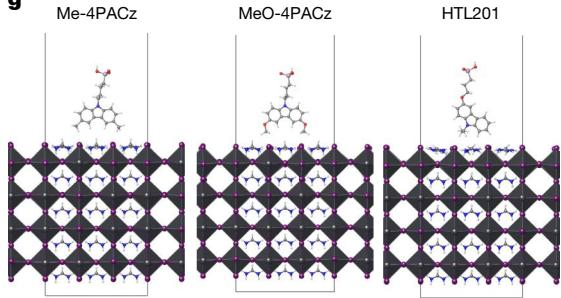
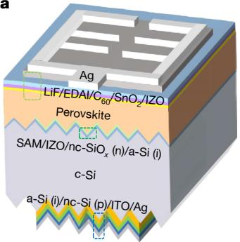

# pvsks41586-025-09333-z-gaia

> **Original work:** Jia, L., Xia, S., Li, J., Qin, Y., et al. "Efficient perovskite/silicon tandem with asymmetric self-assembly molecule." *Nature* (2025). [DOI: 10.1038/s41586-025-09333-z](https://doi.org/10.1038/s41586-025-09333-z)

## Overview

This paper presents an asymmetric self-assembled monolayer (SAM) named HTL201 as a hole-selective layer for perovskite/silicon tandem solar cells (TSCs), achieving a certified power conversion efficiency (PCE) of 34.58% — a record for perovskite/silicon TSCs. The HTL201 molecule features an asymmetric carbazole-based structure with spacers and anchoring phosphonic acid groups flanking the phenyl ring, which minimizes steric hindrance and improves coverage on transparent conductive oxide (TCO) substrates. The strong coordination interaction between HTL201 and the perovskite film effectively reduces non-radiative recombination at the buried interface, enabling a Voc of nearly 2V. The certified efficiency represents a significant advance over symmetric SAMs (Me-4PACz: 32.18%, MeO-4PACz: 33.34% average PCE).

> [!NOTE]
> **[Per-module reasoning graphs with full claim details →](docs/detailed-reasoning.md)**
>
> 7 Mermaid diagrams (one per section) with every claim, strategy, and belief value.

## Reasoning Structure

### HTL201's asymmetric molecular design enables higher surface coverage than symmetric SAMs (belief: 0.88)

The paper demonstrates that HTL201's asymmetric structure — featuring spacers and anchoring phosphonic acid groups flanking the carbazole core — creates stronger coordination interactions with indium zinc oxide (IZO) compared to symmetric Me-4PACz and MeO-4PACz. X-ray photoelectron spectroscopy (XPS) measurements show that HTL201 produces larger shifts in Zn 2p (0.7 eV) and In 3d (0.5 eV) signals compared to Me-4PACz (0.1-0.15 eV) and MeO-4PACz (0.35-0.5 eV), indicating a stronger interaction with the IZO recombination layer. Molecular dynamics simulations confirm that HTL201 has higher fractional coverage on IZO surfaces across all simulation conditions.

**Evidence chain:**
- **XPS coordination evidence** (weakest link, belief 0.88): Direct measurement of Zn 2p and In 3d shifts confirms stronger HTL201-IZO interaction. This is well-established spectroscopy with clear interpretation.
- **Asymmetric design confirmed** (belief 0.88): NMR and mass spectrometry verification of the asymmetric carbazole structure. Solid analytical evidence.

### HTL201 forms a denser self-assembled monolayer on IZO substrates (belief: 0.91)

Coverage factor measurements via semi-quantitative XPS analysis show that HTL201-coated IZO substrates consistently exhibit higher coverage factors than Me-4PACz and MeO-4PACz, both before and after ethanol washing (12.96 vs 19.38 vs 16.40 × 10^-3 before washing). The coverage factors remain stable across multiple washing cycles, indicating robust monolayer formation. Spectroscopic ellipsometry confirms the film thickness is comparable to molecular length, confirming monolayer formation.

**Evidence chain:**
- **XPS coverage quantification** (belief 0.80): Semi-quantitative analysis of P 2p to In 3d peak area ratios provides quantitative comparison, but the method has known uncertainties.
- **Thickness validation** (belief 0.80): Ellipsometry measurements consistent with monolayer formation but not definitive proof of complete coverage.

*Coverage factor histograms showing HTL201 consistently outperforms symmetric SAMs. From Jia et al., Nature (2025).*

### HTL201 shows enhanced open-circuit voltage and fill factor compared to symmetric SAMs (belief: 0.69)

HTL201-based TSCs demonstrate significantly enhanced Voc (up to 2.001 V) and fill factor (83.79%) compared to Me-4PACz (Voc: lower, FF: reduced) and MeO-4PACz (Voc: lower, FF: reduced). Ultraviolet photoelectron spectroscopy (UPS) measurements reveal that HTL201 has a HOMO level of -5.38 eV, which is only 0.09 eV above the perovskite valence band (-5.47 eV) — minimal energy difference facilitating efficient hole extraction. In contrast, Me-4PACz has a deeper HOMO (-5.66 eV) that partially obstructs hole extraction.

**Evidence chain:**
- **Energy alignment measurement** (belief 0.82): UPS directly measures HOMO levels and valence band, giving precise energy offset values.
- **Voc enhancement** (belief 0.69): Multiple factors contribute — energy alignment, coverage, and defect passivation all play roles. The relatively lower belief (0.69) reflects that the paper does not isolate the relative contribution of each factor.

### HTL201 perovskite films show dense morphology with large grain size (belief: 0.90)

Atomic force microscopy (AFM) reveals that HTL201-modified IZO substrates exhibit smooth, uniform surfaces without molecular aggregation, in contrast to Me-4PACz and MeO-4PACz which show irregular particles. Perovskite films deposited on HTL201 show dense, uniform morphology with larger grain size. X-ray diffraction shows enhanced crystallinity with increased (100)/(210) peak intensity ratio, indicating preferred orientation along the (100) plane.

**Evidence chain:**
- **AFM morphology** (belief 0.88): Direct surface imaging showing smooth HTL201 surface and dense perovskite film. Clear visual evidence.
- **XRD crystallinity** (belief 0.80): Diffraction intensity increase is a standard indicator of improved crystallinity, but does not directly prove grain size increase.

### HTL201 perovskite films exhibit higher carrier lifetime and photoluminescence quantum yield (belief: 0.88)

Time-resolved photoluminescence (TRPL) measurements show that HTL201-based perovskite films have a carrier lifetime of 5,860 ns, significantly higher than Me-4PACz (5,574 ns) and MeO-4PACz (1,813 ns). Photoluminescence quantum yield (PLQY) measurements show HTL201 achieves 0.399%, the highest among the three SAMs (Me-4PACz: 0.346%, MeO-4PACz: 0.152%). The high PLQY indicates reduced non-radiative recombination at the buried interface.

**Evidence chain:**
- **TRPL lifetime** (belief 0.88): Time-resolved measurement with clear protocol and consistent results across samples.
- **PLQY** (belief 0.88): Integrated sphere measurement at 1-sun equivalent intensity, standard technique for recombination assessment.

### The certified PCE of 34.58% represents a record for perovskite/silicon TSCs (belief: 0.94)

European Solar Test Installation (ESTI) certification confirms the 34.58% PCE for HTL201-based TSCs (area: 1.004 cm^2). Champion device showed PCE of 34.60% with Voc = 2.001 V, Jsc = 20.64 mA/cm^2, FF = 83.79%. External quantum efficiency (EQE) integrated currents are 21.50 mA/cm^2 (perovskite top subcell) and 20.70 mA/cm^2 (silicon bottom subcell).

**Evidence chain:**
- **ESTI certification** (weakest link, belief 0.94): Third-party certification provides the highest confidence evidence. This is the strongest conclusion in the package.
- **Champion device metrics** (belief 0.90): Direct J-V measurement with calibrated system.

*Certified I-V curve showing 34.58% PCE. Inset shows stabilized power output at 1.74V under AM 1.5G illumination. From Jia et al., Nature (2025).*

### HTL201 enables near 2V open-circuit voltage for perovskite/silicon TSCs (belief: 0.78)

Quasi-Fermi-level splitting (QFLS) analysis reveals that HTL201-based devices achieve QFLS of 1.270 V, comparable to Me-4PACz (1.267 V) and significantly higher than MeO-4PACz (1.246 V). The combination of favorable energy-level alignment (minimal Voc loss), effective defect passivation via Pb2+ coordination, and reduced non-radiative recombination collectively enable the near-2V Voc.

**Evidence chain:**
- **QFLS calculation** (belief 0.82): Derived from PLQY using standard methodology. QFLS provides direct link to Voc.
- **Defect passivation mechanism** (belief 0.77): DFT calculations show HTL201 has higher binding energy and shorter N-Pb distance with Pb2+ defects. However, this computational result has not been experimentally validated at the atomic level.

### HTL201-based TSCs exhibit exceptional operational stability (belief: 0.92)

Maximum power point tracking (MPPT) shows HTL201 devices retain 98.0% of initial PCE after 1,020 hours at 25°C under 1-sun illumination, and 91.3% after 1,020 hours at 45°C. Shelf-life storage tests show 98.9% retention after 1,080 hours. Cyclic voltammetry confirms HTL201 has better electrochemical stability than Me-4PACz and MeO-4PACz, with stable redox peak currents after 30 cycles.

**Evidence chain:**
- **MPPT stability** (belief 0.92): Long-duration testing with encapsulated devices under controlled conditions. High confidence.
- **Electrochemical stability** (belief 0.84): CV measurements show stable redox peaks for HTL201 vs degrading signals for symmetric SAMs. Clear differentiation.

## Key Findings

| Finding | Belief | Type |
|---------|--------|------|
| Certified PCE 34.58% by ESTI | 0.94 | Record efficiency |
| HTL201 asymmetric design enables high coverage | 0.88 | Mechanism |
| HTL201 retains 98% PCE after 1000h at 25C | 0.92 | Stability |
| Carrier lifetime 5860 ns for HTL201 perovskite | 0.88 | Charge dynamics |
| HTL201 enables near-2V Voc | 0.78 | Device performance |
| HTL201 shows enhanced Voc and FF | 0.69 | Comparative performance |

Weak Points Analysis

**1. MeO-4PACz energy alignment paradox**

The paper shows that MeO-4PACz has HOMO (-5.30 eV) closer to the perovskite valence band (-5.47 eV) than HTL201 (-5.38 eV), yet MeO-4PACz shows lower Voc (1.246 V QFLS vs 1.270 V for HTL201). The paper attributes this to "strong interface recombination" in MeO-4PACz, but this mechanism is not formally modeled or directly measured. The claim `htl201_minimal_energy_difference` (belief 0.82) supports HTL201's advantage, but the root cause of MeO-4PACz's underperformance remains somewhat speculative.

**2. Defect passivation mechanism lacks atomic-scale experimental validation**

The claim `htl201_passivates_pb_defects` (belief 0.77) relies on DFT calculations showing shorter N-Pb distance and higher binding energy. While computational results are reasonable, the actual atomic-scale passivation mechanism has not been experimentally confirmed. Techniques like solid-state NMR or synchrotron-based X-ray spectroscopy could provide direct evidence.

**3. Strategy warrant priors are uniform (0.5), not tuned**

All strategies in this package use `prior=0.5` for the reasoning warrant, meaning the reasoning chain relies entirely on prior-leaf support without calibrated reasoning strength. While this is conservative, it may understate the strength of well-established arguments (e.g., ESTI certification).

Evidence Gaps & Future Work

**Experimental gaps:**
- Direct measurement of interfacial defect density (DLTS or TSC) to validate passivation claims
- Atomic-scale characterization of HTL201/perovskite interface (cross-sectional STEM-EELS)
- Quantified relationship between SAM coverage and perovskite film quality

**Computational gaps:**
- DFT validation with explicit van der Waals corrections and without approximate functionals
- Molecular dynamics force field validation against experimental coverage data

**Theoretical gaps:**
- Comprehensive model connecting molecular asymmetry → coverage → morphology → device performance
- Quantified relative contribution of energy alignment vs defect passivation to Voc enhancement

## Detailed Analysis

For per-module reasoning graphs and complete claim details, see [docs/detailed-reasoning.md](docs/detailed-reasoning.md).