# Efficient perovskite/silicon tandem with asymmetric self-assembly molecule

https://doi.org/10.1038/s41586-025-09333-z

Received: 26 September 2024

Accepted: 30 June 2025

Published online: 7 July 2025

Check for updates

Lingbo Jia1,8, Simeng Xia1,8, Jian Li1,8, Yuan Qin1,8, Bingbing Pei1 , Lei Ding1,2, Jun Yin3 , Tao Du3 , Zheng Fang2 , Yue Yin2 , Jiang Liu1,2 ✉, Ying Yang1 , Fu Zhang1 , Xiaoyong Wu1 , Qiaoyan Li1 , Shuangshuang Zhao1 , Hua Zhang1 , Qibo Li1 , Qi Jia1 , Chi Liu1 , Xiaobing Gu1 , Bo Liu1 , Xin Dong1 , Jie Liu1 , Tong Liu1 , Yajun Gao1 , Miao Yang1 , Shi Yin1 , Xiaoning Ru1 , Hao Chen1 , Bo Yang1 , Zilong Zheng4 , Wencai Zhou4 , Maofeng Dou1 , Simin Wang1 , Shan Gao1 , Lan Chen1 , Minghao Qu1 , Junxiong Lu1 , Liang Fang1 , Yichun Wang1 , Hao Deng1 , Jia Yu5 , Xiaohong Zhang5 , Minghui Li6 , Xiting Lang6 , Chuanxiao Xiao6 , Qin Hu7 , Chaowei Xue1 , Linyu Ning2 , Yongcai He1 ✉, Zhenguo Li1 ✉, Xixiang Xu1 ✉ & Bo He1 ✉

Achieving highly ordered and uniformly covered self-assembled monolayers with optimal packing confguration on textured silicon substrates remains a critical challenge for further improving the efciency of perovskite/silicon tandem solar cells1–3 . Here we design an asymmetric self-assembled monolayer (named as HTL201) featuring an anchoring group and a spacer fanking a carbazole core, serving as a hole-selective layer for perovskite/silicon tandem solar cells. When compared with symmetric self-assembled monolayers with a nitrogen-bonded phosphonic acid group, the HTL201 molecule shows minimized steric hindrance and improved coverage on the transparent conductive oxide recombination layer. The strong coordination interaction between HTL201 and the perovskite flm efectively reduces non-radiative recombination at the buried interface. Notably, the optimized energylevel alignment between the perovskite and HTL201, accompanied by an increase in the quasi-Fermi-level splitting value of the perovskite layer, enables an impressive voltage of nearly 2 V for perovskite/silicon tandem solar cells, resulting in a certifed power conversion efciency of up to $3 4 . 5 8 \%$ based on a silicon heterojunction solar cell.

Perovskite/silicon tandem solar cells (TSCs) have become a research focus owing to their superior optoelectronic properties, which have enabled them to go beyond the efficiency limit of single-junction cells. The efficiency of single-junction solar cells has plateaued, whereas TSCs continue to show significant growth4–10. Enhancing the conversion efficiency of solar cells is crucial for driving down the levelized cost of photovoltaic electricity, and among the various types of solar cell, perovskite/silicon TSCs still have substantial room for further improvement11–13.

Given the high maturity of silicon cell technology, efforts to improve the efficiency of TSCs have primarily focused on wide-bandgap perovskite solar cells7,14. However, the open-circuit voltage $( V _ { \mathrm { o c } } )$ loss in wide-bandgap perovskite solar cells tends to increase sharply with increasing bandgap15,16, mainly owing to trap-assisted non-radiative recombination12,17. The selection of charge transport layers that facilitates charge transfer and passivation of the defects is crucial to achieving high-efficiency and stable devices. Self-assembled monolayers (SAMs) are highly transparent, dopant-free, easy to process, low-cost and scalable18,19. These advantages have made SAMs increasingly

attractive as hole-selective layers for high-efficiency single-junction cells and TSCs18,20–22. In addition to the favourable energetically aligned interfaces with perovskites, the optimized SAM offers additional key advantage of forming a conformal layer on the textured structure owing to their self-assembly properties. Several frequently used SAMs, such as [2-(9H-carbazol-9-yl)ethyl] phosphonic acid (2PACz) and its derivatives, show symmetric molecular structures based on a carbazole core, in which the nitrogen atom is bonded to a phosphonic acid anchoring group. These SAMs have achieved significant progress in both single-junction cells and TSCs20–24. However, the adsorption behaviour of SAMs on transparent conductive oxide (TCO) varies depending on their chemical structures. This in turn influences the deposition of the perovskite layer25,26. From a molecular design perspective, developing SAMs that can form full coverage on TCO, as well as achieving a favourable energy level, is essential for achieving high-efficiency perovskite/ silicon TSCs.

Here, through rational molecular design, we have successfully developed an asymmetric SAM named as HTL201. This SAM features spacers and anchoring phosphonic acid groups flanking the phenyl ring of the

1 LONGi Green Energy Technology Co. Ltd, Xi’an, China. 2 College of Energy, Soochow Institute for Energy and Materials Innovations, Soochow University, Suzhou, China. 3 Department of Applied Physics, The Hong Kong Polytechnic University, Hong Kong, China. 4 The College of Materials Science and Engineering, Beijing University of Technology, Beijing, China. 5 Institute of Functional Nano and Soft Materials (FUNSOM), Jiangsu Key Laboratory of Advanced Negative Carbon Technologies, Soochow University, Suzhou, China. 6 Ningbo Institute of Materials Technology and Engineering, Chinese Academy of Sciences, Ningbo City, China. 7 School of Microelectronics, University of Science and Technology of China, Hefei, China. 8 These authors contributed equally: Lingbo Jia, Simeng Xia, Jian Li, Yuan Qin. ✉e-mail: liujiang@suda.edu.cn; heyongcai@longi.com; lzg@longi.com; xuxixiang@longi.com; hebo3@longi.com

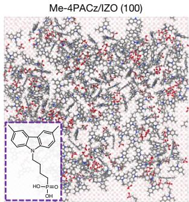  
a

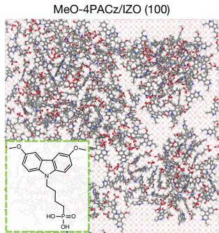

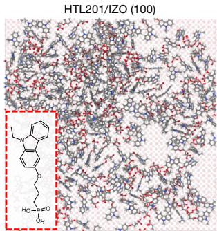

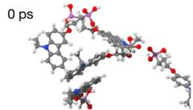  
c

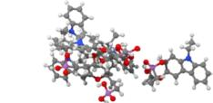  
10 ps   
20 ps

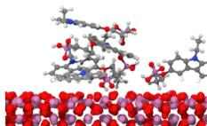

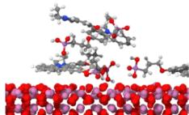  
50 ps

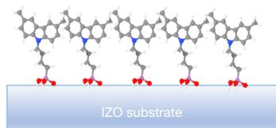  
e   
Me-4PACz

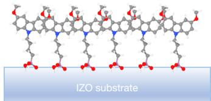  
MeO-4PACz

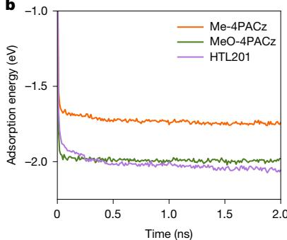

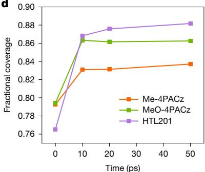

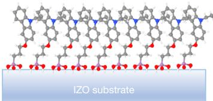  
Denser self-assembled hole-selective layer   
  
  
N   
  
P   
HTL201

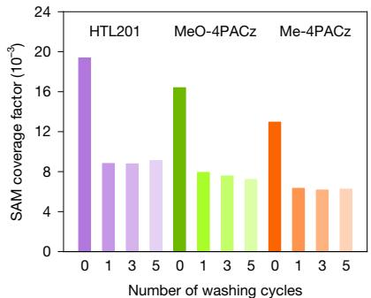  
f

  
g

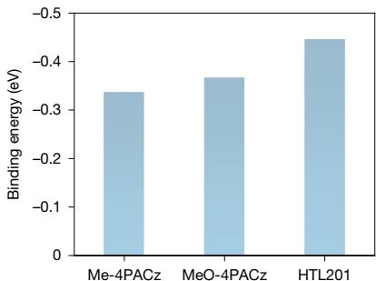  
h   
Fig. 1 | Fractional coverage of different SAMs on IZO and the interaction

between SAMs and perovskite. a, Top view of equilibrated molecular representations on the IZO surface. b, Calculated adsorption energies of Me-4PACz, MeO-4PACz and HTL201 on the surface of IZO substrate as a function of simulation time. c, Adsorption process of HTL201 molecules on the IZO substrate. d, Fractional coverage of IZO surface by the Me-4PACz, MeO-4PACz and HTL201 molecules. e, Schematic diagram of interfacial interactions

carbazole core, serving as a hole-selective layer in perovskite/silicon TSCs. The vertical configuration of HTL201 can minimize steric hindrance and enhance its interaction with the TCO recombination layer, resulting in improved coverage on the TCO substrate. The favourable energy-level alignment between the perovskite and HTL201 facilitates efficient hole extraction and reduces interfacial non-radiative recombination. In addition, effective defect passivation at the buried interface enhances the quasi-Fermi-level splitting (QFLS) of the perovskite layer, leading to an impressive $V _ { \mathrm { o c } }$ of nearly 2 V for perovskite/silicon TSCs. Consequently, the perovskite/silicon TSCs achieved a certified power conversion efficiency (PCE) of $3 4 . 5 8 \%$ with an area of $1 . 0 0 4 \mathrm { c m } ^ { 2 }$ .

between IZO and different SAMs. f, Coverage factor histograms of different SAMs on IZO substrates without and with different washing cycles by ethanol. g,h, Optimized interfacial structures (g) and calculated binding energies (h) for formamidinium-iodide-rich FAPbI (100) adsorbed by Me-4PACz, MeO-4PACz and HTL201. The density functional theory calculations were performed at the GGA/PBE+vdW level of theory.

# Molecular structure design

Different from most reported carbazole-based SAMs, which feature a symmetric molecular structure with nitrogen atoms bonded to phosphonic acid anchoring groups, we constructed an asymmetric carbazole-based SAM that incorporates spacers and anchoring phosphonic acid groups flanking the phenyl ring of the carbazole core. More details about molecular structure design are illustrated in Supplementary Text 1.

The chemical structure of HTL201 (Fig. 1a) is verified through $^ 1 \mathsf { H }$ nuclear magnetic resonance (NMR) spectroscopy, $^ { 1 3 } \mathrm { C }$ NMR

# Article

spectroscopy, mass spectrometry and Fourier transform infrared spectroscopy, as shown in Supplementary Figs. 1–11. To demonstrate the positive impact of the side-chain phosphonic acid group on the performance enhancement, two symmetric SAMs, Me-4PACz and MeO-4PACz (Fig. 1a), were also examined for comparison. Thermal gravimetric analysis (Supplementary Fig. 12) was conducted to evaluate the thermal stability of these SAMs. All three SAM molecules show thermal decomposition temperatures above $2 0 0 ^ { \circ } \mathrm { C }$ . This indicates that all three SAMs are capable of withstanding the high temperatures $( 1 0 0 ^ { \circ } \mathrm { C } )$ used for the device fabrication. The electrochemical properties of all SAMs were assessed by cyclic voltammetry analysis (Supplementary Fig. 13 and Supplementary Table 1). The highest occupied molecular orbital (HOMO) energy levels of Me-4PACz, MeO-4PACz and HTL201 were measured at −5.32 eV, −5.08 eV and −5.11 eV, respectively.

# Interface interactions

We first performed X-ray photoelectron spectroscopy (XPS) measurements (Supplementary Fig. 14) to evaluate the coordination interaction between the SAMs and the indium zinc oxide (IZO) recombination layer. When compared with pristine IZO, the characteristic Zn 2p and In 3dsignals of the IZO/HTL201 show significant shifts of about 0.7 eV and 0.5 eV, respectively. These shifts are more pronounced than those observed in the IZO/MeO-4PACz (about 0.5 eV and 0.35 eV) and the IZO/ Me-4PACz (about 0.1 eV and 0.15 eV). This indicates that HTL201 has a stronger interaction with the IZO recombination layer27, which in turn promotes the surface coverage of HTL201 anchoring. The enhanced coverage of HTL201 on TCO substrates was validated through classical molecular dynamics simulations27. The calculated adsorption energies of Me-4PACz, MeO-4PACz and HTL201 on the surface of the IZO substrate as a function of simulation times are shown in Fig. 1b. HTL201 has a stronger affinity for the IZO surface than Me-4PACz and MeO-4PACz. The surface coverage of Me-4PACz, MeO-4PACz and HTL201 on the IZO substrate at different simulated times is shown in Extended Data Fig. 1. The simulated adsorption process of HTL201 molecules on the IZO substrate is illustrated in Fig. 1c. The adsorption process of SAM molecules onto the IZO substrate is relatively fast and can be divided into three stages. First, it undergoes a physisorption process, followed by chemisorption of the molecules, and finally forms a densely packed configuration with ordered orientation and arrangement domains28. Moreover, we observed that after adjusting the spacers and anchoring phosphonic acid groups on the side of the carbazole core, HTL201 molecules showed higher fractional coverage on the IZO surface (Fig. 1d). Stronger interaction between HTL201 and IZO substrate contributes significantly to the higher coverage of the HTL201 film on the IZO substrate (Fig. 1e).

XPS measurements (Supplementary Fig. 15) were carried out to confirm the formation and surface coverage of SAMs on the IZO substrate. All samples showed characteristic signals of the phosphorus (P) element, indicating the successful anchoring of the three SAMs. To further evaluate the coverage capability, a semi-quantitative analysis was conducted by examining the area ratio of the P $2 p$ peak in the SAMs to the In $3 d _ { 3 / 2 }$ peak in the IZO substrate based on the XPS results25,29. The calculated coverage factors for the as-deposited Me-4PACz-, MeO-4PACzand HTL201-modified IZO substrates before washing were $1 9 . 3 8 \times 1 0 ^ { - 3 }$ , $1 6 . 4 0 \times 1 0 ^ { - 3 }$ and $1 2 . 9 6 \times 1 0 ^ { - 3 }$ , respectively (Fig. 1f and Supplementary Table 2). After removing the residual unbound SAMs during the ethanol washing process, all the samples showed a decrease in the coverage factor. However, the coverage factors of Me-4PACz, MeO-4PACz and HTL201 showed negligible variation as the number of washing cycles increased from one to five (Fig. 1f). Interestingly, in both cases with and without washing, HTL201-coated IZO substrates always showed a higher coverage factor value compared with the other two SAMs, which further indicates that HTL201 can form a denser thin film. These findings align well with the molecular dynamics simulations. We employed

spectroscopic ellipsometry to investigate the thickness variation of Me-4PACz, MeO-4PACz and HTL201 with and without ethanol washing (Supplementary Fig. 16 and Supplementary Table 3). The thicknesses of unwashed SAMs were larger than for the washed samples. Clearly, the obtained specific thickness value was comparable to the molecule length, indicating that the molecules anchored to the substrate formed a monolayer after solvent washing, whereas the SAMs without washing may not be a monolayer. In this work, all the SAMs were deposited without the ethanol washing process. In this case, the unbound SAMs on the substrates could diffuse into the perovskite layer, which is evidenced by the time-of-flight secondary ion mass spectrometry measurement (Supplementary Fig. 17). These SAMs can serve as defect passivators of perovskite films. In addition, it is worth mentioning that for the SAMs anchored onto the IZO substrate, the opposite terminals of Me-4PACz and MeO-4PACz are methyl and methoxyl, respectively, whereas that of HTL201 is a nitrogen-containing ring with a lone pair of electrons. We further calculated the binding energy between different SAMs and the perovskite film (Fig. 1g). The strong binding (Fig. 1h) between HTL201 and the perovskite is driven by an enhanced dipole moment $( \mu )$ (Supplementary Table 4), which is induced by the asymmetric molecular structure design of HTL201 and promotes polar dipole interaction between the perovskite and the SAM. We further calculated the binding energy between the different SAMs and the perovskite film with $\mathsf { P b } ^ { 2 + }$ defects (Supplementary Fig. 18). HTL201 shows a higher binding energy and a shorter distance (D[N–Pb]) between the N in the SAM and the $\mathsf { P b } ^ { 2 + }$ defect in the perovskite film compared with Me-4PACz and MeO-4PACz. Therefore, we speculated that the coordination interaction between HTL201 and the $\mathsf { P b } ^ { 2 + }$ defect can passivate the defects at the SAM/perovskite surface22.

# Photovoltaic performance

We employed silicon heterojunction solar cells as the bottom cells to construct monolithic perovskite/silicon TSCs. The top perovskite solar cells were fabricated based on different SAMs with the stack of IZO/ SAM/perovskite/LiF/ethylenediammonium diiodide (EDAI) $/ \mathrm { C } _ { 6 0 } / \mathrm { S n O } _ { 2 } /$ $\mathsf { I Z O / A g / M g F } _ { 2 }$ (ref. 30). The device configuration and cross-sectional scanning electron microscopy image of the HTL201-based device are shown in Fig. 2a,b. The box plots (Fig. 2c–f) and the corresponding photovoltaic parameters (Supplementary Table 5) of the 20 independent devices based on different SAMs provide a direct comparison. For the devices utilizing HTL201, an average PCE of $3 4 . 2 2 \%$ was achieved. The champion TSC using HTL201 achieved an efficiency of $3 4 . 6 0 \%$ , with a $V _ { \mathrm { o c } }$ of up to 2.001 V, a short-circuit current density $( J _ { \mathrm { { s c } } } )$ of $2 0 . 6 4 \ : \mathrm { m A c m ^ { - 2 } }$ and a fill factor (FF) of $8 3 . 7 9 \%$ . By contrast, the average PCEs for Me-4PACz and MeO-4PACz were $3 2 . 1 8 \%$ and $3 3 . 3 4 \%$ , respectively. The HTL201-bearing devices showed a significantly enhanced $V _ { \mathrm { o c } }$ and FF compared with the other two SAMs. Figure 2g shows the current density–voltage ( J–V) curves of the best TSCs based on Me-4PACz, MeO-4PACz and HTL201. Figure 2h illustrates the external quantum efficiency curves of the HTL201-based TSCs. The integrated photogenerated current densities are calculated to be $2 1 . 5 0 \mathsf { m A c m ^ { - 2 } }$ and $2 0 . 7 0 \mathsf { m A c m } ^ { - 2 }$ for the perovskite top subcell and silicon bottom subcell, respectively. One optimized HTL201-based TSC was sent to the European Solar Test Installation for certification, demonstrating a certified PCE of $3 4 . 5 8 \%$ (Fig. 2i and Supplementary Fig. 19), which, to our knowledge, is a record efficiency among the reported perovskite/ silicon TSC studies. We also fabricated TSCs without EDAI interfacial modification (Supplementary Table 6). It is evident that regardless of the front surface modification, the average PCE of the HTL201-based devices significantly increases compared with the control devices. We further investigated the device performance of HTL201-like derivatives named HTL207 and HTL203 with different aliphatic chain lengths $\scriptstyle n = 2$ and $n = 4$ ). The HTL207- and HTL203-based devices also delivered higher efficiency compared with the Me-4PACz- and MeO-4PACz based

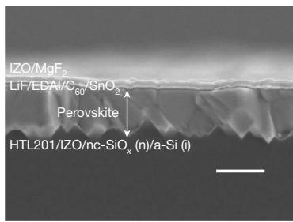  
b

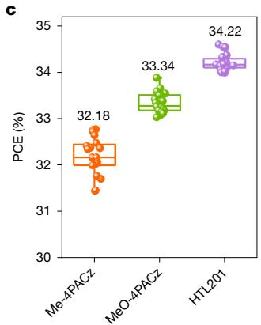

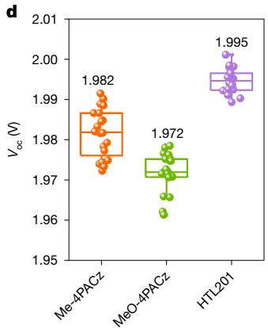

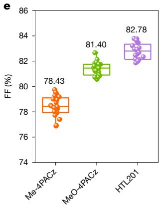

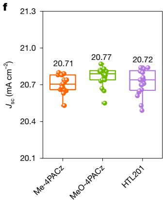

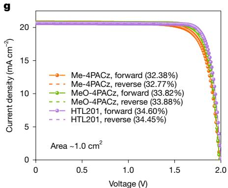

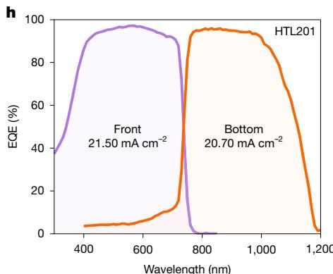

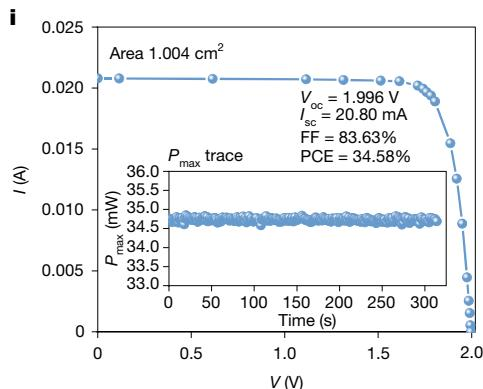  
Fig. 2 | Device performance of TSCs based on different hole-selective layers. a,b, Schematic of two terminal (2T) perovskite/crystalline silicon (c-Si) TSC (a) and cross-sectional scanning electron microscopy image of the HTL201- based device (b). c–f, Box plots of performance parameter statistics for an approximately $1 . 0 \cdot \mathrm { c m } ^ { 2 }$ perovskite/silicon tandem cell based on different SAMs and interfaces (20 devices were fabricated for each condition, and the box outline represents the standard deviation of the data). PCE (c), $V _ { \mathrm { o c } }$ (d), FF (e)

devices (Extended Data Fig. 2 and Supplementary Table 7), although HTL201 shows the best performance among the HTL201-like derivatives. These results prove that the asymmetric molecular design is a generally successful strategy.

# Morphology and crystallinity

We conducted contact-angle measurements to evaluate the impact of different SAMs on wettability. The water contact angles of the Me-4PACz-, MeO-4PACz- and HTL201-coated IZO substrates are $1 0 4 . 6 ^ { \circ }$ , $7 9 . 6 ^ { \circ }$ and $1 0 5 . 6 ^ { \circ }$ , respectively (Supplementary Fig. 20). Interestingly, when changing the probe liquid from water to a mixed solvent of N,N-dimethylformamide and dimethyl sulfoxide (4:1, v/v), all three SAMs showed excellent contact properties. However, when the perovskite precursor solution was used, the contact angles on the MeO-4PACz and HTL201 SAMs are nearly $0 ^ { \circ }$ , whereas the contact angle on Me-4PACz

and $J _ { \mathrm { S C } }$ (f). g, J–V curves of devices with Me-4PACz, MeO-4PACz and HTL201. h, External quantum efficiency (EQE) curve of the HTL201-based device. i, Certified I–V curve of one HTL201-based tandem cell measured by the European Solar Test Installation. Inset, the stabilized power output of the tandem device at a fixed applied voltage of 1.74 V under Air Mass 1.5 Global (AM 1.5G) illumination. $P _ { \mathrm { m a x } } ,$ maximum power. Scale bar $. 1 \mu \mathrm { m }$ (b).

increases to $1 1 . 6 ^ { \circ }$ . The low contact angle of the perovskite precursor on the substrates is crucial for achieving full coverage of perovskite films31,32.

The uniformity of the SAMs on the IZO substrates was characterized by atomic force microscopy (AFM) measurements (Supplementary Fig. 21). The bare IZO substrate shows a smooth morphology. After coating Me-4PACz and MeO-4PACz SAMs, some irregular particles can be observed on the sample surface, which may be caused by molecular aggregation. By contrast, the HTL201-modified IZO substrate shows good smoothness and uniformity without obvious aggregates, which will facilitate interfacial charge transfer and suppress non-radiative recombination33.

We further monitored the morphology and crystallinity of perovskite films deposited on these different SAMs. The perovskite film based on a HTL201 layer shows dense and uniform morphology with larger grain size (Supplementary Fig. 22). We infer that the relatively

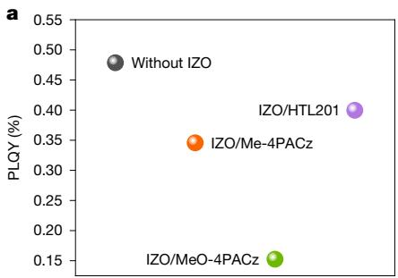

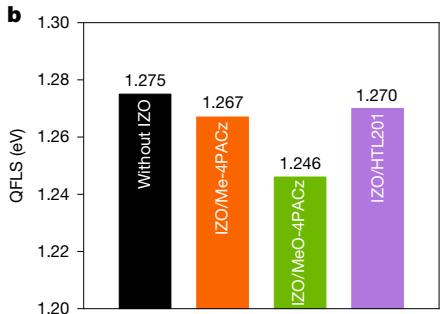

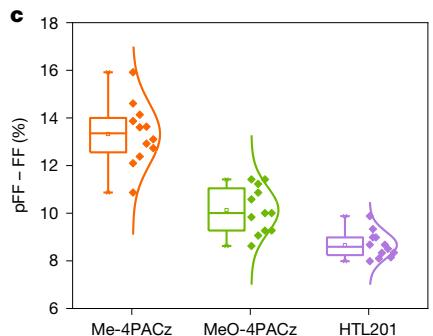

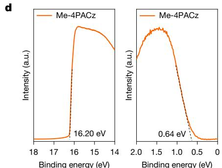

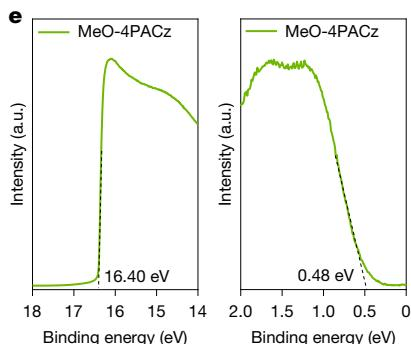

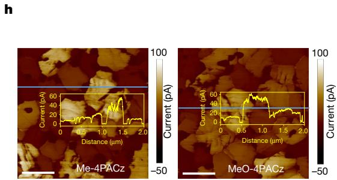

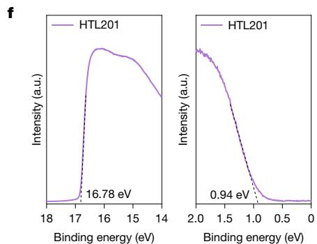

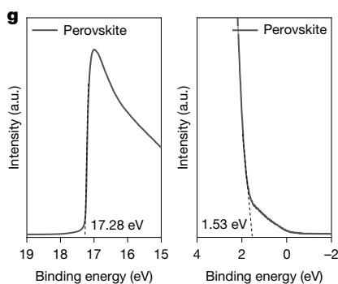

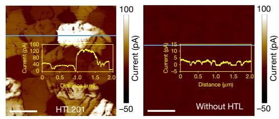  
Fig. 3 | Effect of different SAMs on charge-carrier dynamics. a, PLQY of perovskite films deposited on various SAM-coated textured silicon substrates. b, QFLS in the case of perovskite films with different SAM-coated textured silicon substrates. c, Difference between the pFF and the actual FF values. The box outline represents the standard deviation of the data. d–g, UPS spectra of IZO substrates covered by Me-4PACz (d), MeO-4PACz (e) and HTL201 (f).   
For the perovskite sample (g), we prepared a perovskite film on a silicon substrate that was coated with IZO, without the use of a SAM. Left, UPS spectra around the secondary electron cut-off (work function). Right, UPS spectra in the valence-band region. h, C-AFM images of perovskite films deposited atop IZO substrates with and without different SAMs. HTL, hole-transport layer. Insets, the corresponding conducting current spectra. Scale bars, $5 0 0 \mathsf { n m }$ .

small contact angle of the HTL201 substrate promotes the formation of large perovskite crystals32. The thickness of the perovskite film is about $9 0 0 \mathsf { n m }$ (Supplementary Fig. 22). We utilized X-ray diffraction to investigate the crystallinity of perovskite films grown on different SAMs (Supplementary Fig. 23). The increased diffraction intensity reveals enhanced crystallinity of perovskite film based on HTL201. A larger (100)/(210) peak intensity ratio suggests a highly ordered crystal growth along the (100) plane34. Furthermore, synchrotron-based grazing incidence wide-angle X-ray scattering was performed. The brightest diffraction rings in the grazing incidence wide-angle X-ray scattering spectra (Supplementary Fig. 24) of the HTL201-based perovskite films corroborates the enhanced crystallinity and crystal orientation of the perovskite film grown on HTL20135. To investigate the crystallization dynamics, we further conducted in situ optical microscope and in situ photoluminescence (PL) characterizations24,36. As shown in Supplementary Fig. 25, the HTL201-based sample shows a large number of nuclei after 540 s, which is slightly longer than that of the Me-4PACz-coated (180 s) and MeO-4PACz-coated (300 s) substrates. As verified by the in situ PL measurements (Extended Data Fig. 3), the PL intensity gradually increased upon dripping antisolvent. Notably, a clear PL signal was observed at 70 s, 75 s and 85 s for the Me-4PACz, MeO-4PACz and HTL201 samples, respectively. The above

results illustrate that the nucleation and crystallization processes were notably delayed when using the HTL201-coated substrate, which can effectively improve the quality of perovskite films.

# Effect of SAMs on charge dynamics

We carried out PL mapping and steady-state PL measurements (Extended Data Fig. 4) to study the effect of different SAMs on charge dynamics21,23. The perovskite film deposited on HTL201 shows brighter PL mapping images than those on Me-4PACz and MeO-4PACz, suggesting a lower trap density. The steady-state PL spectra of perovskite films show a characteristic PL peak at 733 nm, which is consistent with the bandgap of 1.69 eV. In addition, time-resolved PL (Extended Data Fig. 4) was used to examine the charge kinetics of the perovskite film on different SAMs. The perovskite film on HTL201 shows a higher carrier lifetime (5,860 ns) than those on Me-4PACz (5,574 ns) and MeO-4PACz (1,813 ns), indicating a lower trap density and suppressed non-radiative recombination at the buried interface, which is beneficial for the $V _ { \mathrm { o c } }$ enhancement. The lower trap density of the perovskite film can be attributed to the improved crystallinity and the effective defect passivation provided by HTL201. The interaction between the perovskite films with the different SAMs was characterized by using XPS measurements37. As illustrated in

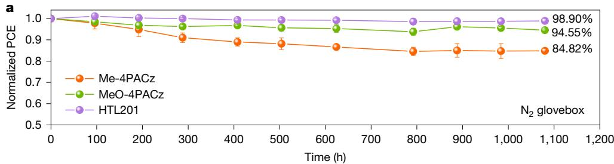

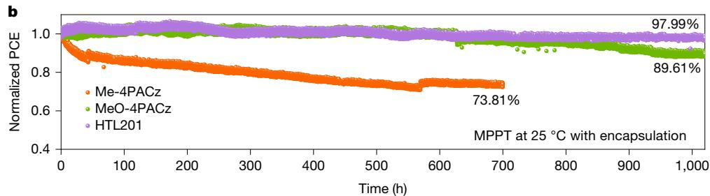

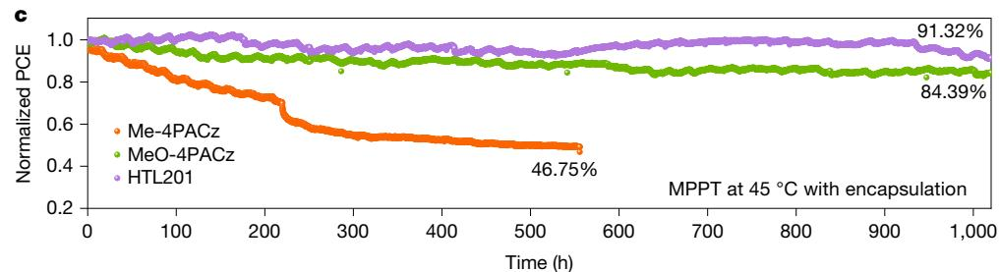  
Fig. 4 | Long-term stability of TSCs. a, Stability of the unencapsulated TSCs based on Me-4PACz, MeO-4PACz and HTL201. The samples were stored in a nitrogen glovebox and were taken out regularly for standard measurements in air. The symbols represent the average values from five devices. Error bars   
represent the standard deviation of five devices. b,c, Maximum power point tracking (MPPT) of the encapsulated TSCs measured at $2 5 ^ { \circ } \mathrm { C }$ (b) and $4 5 ^ { \circ } \mathrm { C }$ (c) under continuous 1-sun illumination.

Supplementary Fig. 26a, the Pb 4fsignals of the perovskite films after coating the SAMs all shift to lower binding energies compared with the bare perovskite film, indicating an increased electron cloud density around the Pb atoms. The most significant shift of the Pb core level was observed in the HTL201-modified perovskite film, indicating the stronger interaction between the perovskite film and HTL201. The total density of states and space-charge-limited current measurements verify the lower trap density of perovskite film grown on the HTL20137,38 (Supplementary Fig. 26b,c). The PL quantum yield (PLQY) was determined to quantify the non-radiative recombination loss at the buried interface26,39. As shown in Fig. 3a, the PLQY values of perovskite films grown on IZO/ Me-4PACz, IZO/MeO-4PACz and IZO/HTL201 substrates are $0 . 3 4 6 \%$ , $0 . 1 5 2 \%$ and $0 . 3 9 9 \%$ , respectively. The HTL201-based perovskite film shows the highest PLQY value, indicating the superior ability of diminishing the recombination loss at the perovskite/HTL interface. Furthermore, QFLS analysis was performed using the PLQY results. As shown in Fig. 3b, the samples based on Me-4PACz, MeO-4PACz and HTL201 show QFLS values of 1.267 V, 1.246 V and 1.270 V, respectively. The high QFLS values of Me-4PACz- and HTL201-based solar cells explained the cause of their high $V _ { \mathrm { o c } }$ . All these positive results corroborate that HTL201 significantly reduces the interfacial recombination.

To directly evaluate the passivation effects of the device utilizing different SAMs, we constructed single-junction inverted devices on textured silicon substrates with a symmetrical structure30,40 (Extended Data Fig. 5a–d). The suns– $\boldsymbol { \cdot } \boldsymbol { V _ { \mathrm { o c } } }$ pseudo J–V curves for the single-junction device based on the three different SAMs were utilized to investigate the pseudo-FF (pFF) values (FF in absence of series resistance losses). When the series resistance losses are not considered, all devices can achieve high pFF values (Extended Data Fig. 5e). Figure 3c and Extended Data Fig. 5f compare the difference between the pseudo-FF and the

real FF values, as well as the series resistance $( R _ { \mathrm { S } } )$ for device based on different SAMs. The group of devices based on HTL201 exhibit the smaller value difference between the pFF and the actual FF, as well as the lower series resistance $( R _ { \mathrm { S } } )$ . This indicates that the transport losses and non-radiative recombination at the buried interface are significantly suppressed. Furthermore, we measured the J–V curves of single-junction device under dark conditions (Supplementary Fig. 27). The HTL201 device showed a much lower reverse saturation current, suggesting the suppressed carrier recombination. This notable suppression can be attributed to the efficient hole extraction and reduced trap states at the HTL201/perovskite interface.

To investigate the reasons behind the improved $V _ { \mathrm { o c } }$ and FF of TSCs with HTL201, we conducted ultraviolet photoelectron spectroscopy (UPS) and conductive AFM (C-AFM) measurements. UPS was used to examine the interfacial energy-level alignment and C-AFM was used to assess the conductivity of the perovskite films26. As shown in Fig. 3d–g, Supplementary Fig. 28 and Supplementary Table 8, the valence band of the perovskite film is measured to be −5.47 eV, and the HOMO of Me-4PACz, MeO-4PACz and HTL201 is −5.66 eV, −5.30 eV and −5.38 eV, respectively. The minimal energy difference between HTL201 and perovskite helps to reduce $V _ { \mathrm { o c } }$ loss and facilitate hole extraction. Me-4PACz has a deeper HOMO than the perovskite valence band, which will partially obstruct hole extraction and result in a low FF. Furthermore, Kelvin probe force microscopy41,42 was carried out to verify the change of work function of different SAMs coated on the IZO substrate (Supplementary Fig. 29). We find that the IZO/HTL201 surface potential was more positive than that of the MeO-4PACz- and Me-4PACz-deposited IZO substrates. This suggests that the work function of the IZO/HTL201 substrate is lower than that of the other SAM-coated IZO substrates. This result is consistent with that obtained from UPS measurements.

# Article

According to the C-AFM measurements (Fig. 3h), perovskite film grown on the HTL201 shows the highest conducting current flow among the three samples, implying the improved conductivity of the perovskite film. This also indicates that HTL201 material can significantly facilitate charge transfer. Combining all the above measurements, we elucidate the $V _ { \mathrm { o c } }$ and FF variation for the TSCs based on different SAMs. The low $V _ { \mathrm { o c } }$ and QFLS of the MeO-4PACz-based device can be attributed to strong interface recombination. Although the Me-4PACz-based sample affords comparable QFLS to HTL201, the inferior interface contact characteristics limits the $V _ { \mathrm { o c } }$ improvement. The unfavourable energy alignment and low conductivity of the Me-4PACz-based sample hinder charge transport, leading to a low FF. The enhanced QFLS and efficient defect passivation achieved by HTL201 favour the remarkable $V _ { \mathrm { o c } }$ . Direct contact between the perovskite and the recombination layer will cause severe interfacial recombination and detrimental shunt loss. Therefore, higher coverage of HTL201 contributes to the reduced recombination at IZO/perovskite interface. The combination of better interface charge-transfer characteristics and desired energy alignment contributes to the higher FF of the HTL201-based TSCs.

# Stability of TSCs

We first investigated the shelf-life stability of the unencapsulated devices. The HTL201-based TSCs showed remarkable storage stability. Specifically, the HTL201-based TSCs retained approximately $9 8 . 9 \%$ of the initial efficiency after 1,080 h of storage. In comparison, the MeO-4PACz- and Me-4PACz-bearing TSCs retained only $9 4 . 6 \%$ and $8 4 . 8 \%$ of their initial PCEs (Fig. 4a), respectively. The corresponding photovoltaic parameters are listed in Supplementary Fig. 30. Meanwhile, the maximum power point tracking of the encapsulated TSCs based on Me-4PACz, MeO-4PACz and HTL201 was conducted at $2 5 ^ { \circ } \mathrm { C }$ and $4 5 ^ { \circ } \mathrm { C }$ under 1-sun continuous illumination in an ambient environment (Fig. 4b,c). After operating for ${ \bf 1 } , { \bf 0 } 2 0 { \bf h }$ , the devices based on HTL201 retained about $9 8 . 0 \%$ of their initial PCE at a controlled temperature of $2 5 ^ { \circ } \mathrm { C }$ and about $9 1 . 3 \%$ of their initial PCE at an elevated temperature of $4 5 ^ { \circ } \mathrm { C }$ , respectively. The MeO-4PACz-based devices retained $8 9 . 6 \%$ and $8 4 . 4 \%$ of their initial PCEs at $2 5 ^ { \circ } \mathrm { C }$ and $4 5 ^ { \circ } \mathrm { C }$ , respectively. By contrast, the Me-4PACz-based device experienced a significant decline after 500 h. Cyclic voltammetry measurements were conducted to assess the electrochemical stability of Me-4PACz, MeO-4PACz and HTL201 (Supplementary Fig. 31). During the continuous anodic scan, after 30 cycles, the redox peak current densities of Me-4PACz and MeO-4PACz decreased significantly, and the initial chemical species gradually converted into oxidation products. This observation suggests that both Me-4PACz and MeO-4PACz exhibit lower electrochemical stability compared with HTL20143. Meanwhile, NMR spectroscopy was used to evaluate the molecular stability of Me-4PACz, MeO-4PACz and HTL20131. All three SAM molecules were exposed to continuous illumination for 24 h. As illustrated in Supplementary Fig. 32, the 1 H NMR spectra of all three SAMs showed almost no changes following the ageing test, demonstrating the considerable photostability of the Me-4PACz, MeO-4PACz and HTL201 molecules. On the basis of the above results, we can conclude that HTL201 has better chemical stability compared with Me-4PACz and MeO-4PACz. The impeded leakage current and reduced non-radiative recombination of HTL201 at the buried interface can ensure that the complete device has good operational stability under illumination44.

# Online content

Any methods, additional references, Nature Portfolio reporting summaries, source data, extended data, supplementary information, acknowledgements, peer review information; details of author contributions and competing interests; and statements of data and code availability are available at https://doi.org/10.1038/s41586-025-09333-z.

1. Aydin, E. et al. Enhanced optoelectronic coupling for perovskite/silicon tandem solar cells. Nature 623, 732–738 (2023).   
2. Puerto Galvis, C. E. et al. Challenges in the design and synthesis of self-assembling molecules as selective contacts in perovskite solar cells. Chem. Sci. 15, 1534–1556 (2024).   
3. Mao, L. et al. Fully textured, production-line compatible monolithic perovskite/ silicon tandem solar cells approaching $2 9 \%$ efficiency. Adv. Mater. 34, 2206193 (2022).   
4. Interactive Best Research-Cell Efficiency Chart (NREL, accessed 16 June 2025); https:// www.nrel.gov/pv/interactive-cell-efficiency.   
5. Sahli, F. et al. Fully textured monolithic perovskite/silicon tandem solar cells with $2 5 . 2 \%$ power conversion efficiency. Nat. Mater. 17, 820–826 (2018).   
6. Hou, Y. et al. Efficient tandem solar cells with solution-processed perovskite on textured crystalline silicon. Science 367, 1135–1140 (2020).   
7. Xu, J. et al. Triple-halide wide-band gap perovskites with suppressed phase segregation for efficient tandems. Science 367, 1097–1104 (2020).   
8. Kim, D. et al. Efficient, stable silicon tandem cells enabled by anion-engineered widebandgap perovskites. Science 368, 155–160 (2020).   
9. Mariotti, S. et al. Interface engineering for high-performance, triple-halide perovskite– silicon tandem solar cells. Science 381, 63–69 (2023).   
10. Chin, X. Y. et al. Interface passivation for $3 1 . 2 5 \%$ -efficient perovskite/silicon tandem solar cells. Science 381, 59–63 (2023).   
11. Wang, R. et al. Prospects for metal halide perovskite-based tandem solar cells. Nat. Photon. 15, 411–425 (2021).   
12. Wang, J., Liu, H., Zhao, Y. & Zhang, X. Perovskite-based tandem solar cells gallop ahead. Joule 6, 509–511 (2022).   
13. Chen, B., Rudd, P. N., Yang, S., Yuan, Y. & Huang, J. Imperfections and their passivation in halide perovskite solar cells. Chem. Soc. Rev. 48, 3842–3867 (2019).   
14. Liu, S. et al. Triple-junction solar cells with cyanate in ultrawide-bandgap perovskites. Nature 628, 306–312 (2024).   
15. Xu, F., Zhang, M., Li, Z., Yang, X. & Zhu, R. Challenges and perspectives toward future wide‐bandgap mixed‐halide perovskite photovoltaics. Adv. Energy Mater. 13, 2203911 (2023).   
16. Tong, Y. et al. Wide‐bandgap organic–inorganic lead halide perovskite solar cells. Adv. Sci. 9, 2105085 (2022).   
17. Fang, Z. et al. Charge transport materials for monolithic perovskite-based tandem solar cells: a review. Sci. China Mater. 66, 2107–2127 (2023).   
18. Li, M. et al. Self-assembled monolayers for interfacial engineering in solution-processed thin-film electronic devices: design, fabrication, and applications. Chem. Rev. 5, 2138–2204 (2024).   
19. Xu, D., Wu, P. & Tan, H. Self‐assembled monolayers for perovskite solar cells. Inf. Funct. Mater. 1, 2–25 (2024).   
20. Al-Ashouri, A. et al. Monolithic perovskite/silicon tandem solar cell with ${ > } 2 9 \%$ efficiency by enhanced hole extraction. Science 370, 1300–1309 (2020).   
21. Liu, J. et al. Efficient and stable perovskite–silicon tandem solar cells through contact displacement by MgF . Science 377, 302–306 (2022).   
22. Liu, M. et al. Defect-passivating and stable benzothiophene-based self-assembled monolayer for high-performance inverted perovskite solar cells. Adv. Energy Mater. 14, 2303742 (2024).   
23. Zheng, X. et al. Co-deposition of hole-selective contact and absorber for improving the processability of perovskite solar cells. Nat. Energy 8, 462–472 (2023).   
24. Zhou, H. et al. Glycol monomethyl ether‐substituted carbazolyl hole‐transporting material for stable inverted perovskite solar cells with efficiency of $2 5 . 5 2 \%$ . Angew. Chem. Int. Ed. 63, e202403068 (2024).   
25. Tang, H. et al. Reinforcing self-assembly of hole transport molecules for stable inverted perovskite solar cells. Science 383, 1236–1240 (2024).   
26. Li, Z. et al. Stabilized hole-selective layer for high-performance inverted p–i–n perovskite solar cells. Science 382, 284–289 (2023).   
27. Wang, S. et al. Targeted therapy for interfacial engineering toward stable and efficient perovskite solar cells. Adv. Mater. 31, 1903691 (2019).   
28. Vericat, C., Vela, M. E., Benitez, G., Carrob, P. & Salvarezza, R. C. Self-assembled monolayers of thiols and dithiols on gold: new challenges for a well-known system. Chem. Soc. Rev. 39, 1805–1834 (2010).   
29. Jiang, W. et al. π-Expanded carbazoles as hole-selective self-assembled monolayers for high-performance perovskite solar cells. Angew. Chem. Int. Ed. 61, e202213560 (2022).   
30. Liu, J. et al. Perovskite/silicon tandem solar cells with bilayer interface passivation. Nature 635, 596–603 (2024).   
31. Yang, D. et al. High efficiency planar-type perovskite solar cells with negligible hysteresis using EDTA-complexed $\mathsf { S n O } _ { 2 }$ . Nat. Commun. 9, 3239 (2018).   
32. Hu, W. et al. Low-temperature in situ amino functionalization o $\mathrm { T i O } _ { 2 }$ nanoparticles sharpens electron management achieving ove $2 1 \%$ efficient planar perovskite solar cells. Adv. Mater. 31, 1806095 (2019).   
33. Cao, Q. et al. Co-self-assembled monolayers modified NiO for stable inverted perovskite solar cells. Adv. Mater. 36, 2311970 (2024).   
34. Xu, G. et al. New strategy for two-step sequential deposition: incorporation of hydrophilic fullerene in second precursor for high-performance p–i–n planar perovskite solar cells. Adv. Energy Mater. 8, 1703054 (2018).   
35. Zhou, W. et al. Zwitterion coordination induced highly orientational order of $\mathsf { C H } _ { 3 } \mathsf { N H } _ { 3 } \mathsf { P b l } _ { 3 }$ perovskite film delivers a high open circuit voltage exceeding 1.2 V. Adv. Funct. Mater. 29, 1901026 (2019).   
36. Qi, H. et al. Homogenizing energy landscape for efficient and spectrally stable blue perovskite light‐emitting diodes. Adv. Mater. 36, 2409319 (2024).   
37. Zhou, Y. et al. Interfacial modification of NiO for highly efficient and stable inverted perovskite solar cells. Adv. Energy Mater. 14, 2400616 (2024).   
38. Ni, Z. et al. Resolving spatial and energetic distributions of trap states in metal halide perovskite solar cells. Science 367, 1352–1358 (2020).

39. Zheng, Y. et al. Towards $2 6 \%$ efficiency in inverted perovskite solar cells via interfacial flipped band bending and suppressed deep-level traps. Energy Environ. Sci. 17, 1153–1162 (2024).   
40. Turkay, D. et al. Synergetic substrate and additive engineering for over $30 \%$ -efficient perovskite–Si tandem solar cells. Joule 8, 1735–1753 (2024).   
41. Chen, W., Xu, L., Feng, X., Jie, J. & He, Z. Metal acetylacetonate series in interface engineering for full low-temperature-processed, high-performance, and stable planar perovskite solar cells with conversion efficiency over 16% on 1 cm2 scale. Adv. Mater. 29, 1603923 (2017).   
42. You, P., Liu, Z., Tai, Q., Liu, S. & Yan, F. Efficient semitransparent perovskite solar cells with graphene electrodes. Adv. Mater. 27, 3632–3638 (2015).   
43. Qu, G. et al. Conjugated linker-boosted self-assembled monolayer molecule for inverted perovskite solar cells. Joule 8, 2123–2134 (2024).

44. Zhao, K. et al. peri-Fused polyaromatic molecular contacts for perovskite solar cells. Nature 632, 301–306 (2024).

Publisher’s note Springer Nature remains neutral with regard to jurisdictional claims in published maps and institutional affiliations.

Springer Nature or its licensor (e.g. a society or other partner) holds exclusive rights to this article under a publishing agreement with the author(s) or other rightsholder(s); author self-archiving of the accepted manuscript version of this article is solely governed by the terms of such publishing agreement and applicable law.

$\circledcirc$ The Author(s), under exclusive licence to Springer Nature Limited 2025

# Article

# Methods

# Materials

Dimethyl sulfoxide (DMSO, anhydrous, $2 9 9 . 9 \%$ ), dimethylformamide (DMF, anhydrous, $2 9 9 . 9 \%$ ), ethyl alcohol (anhydrous, $2 9 9 . 9 \%$ , ethyl acetate (anhydrous, $2 9 9 . 8 \%$ ) and 2-propanol (anhydrous, $2 9 9 . 8 \%$ ) were purchased from Sigma Aldrich. $\mathbf { C } _ { 6 0 }$ (sublimed, ${ \bf > 9 9 . 5 \% }$ , formamidinium iodide (FAI, $2 9 9 . 8 \%$ ) and methylammonium bromide (MABr, ${ \bf \gamma } > 9 9 . 8 \%$ were bought from Xi’an Yuri Solar. Lithium fluoride (LiF, purity ${ \geq } 9 9 . 9 9 \%$ ) was bought from Sigma Aldrich. Lead iodide $\left( \mathsf { P b l } _ { 2 } \right)$ , lead bromide $( \mathsf { P b B r } _ { 2 } )$ and caesium iodide (CsI) (purity $2 9 9 . 9 9 9 \%$ ) were bought from TCI. The SAMs [4-(3,6-dimethyl-9-hydro-carbazole-9-yl)butyl]phosphonic acid (Me-4PACz, purity $2 9 9 . 9 9 \%$ , [4-(3,6-dimethoxy-9H-carbazol-9-yl) butyl]phosphonic acid (MeO-4PACz, purity $2 9 9 . 9 9 \%$ ) and EDAI were purchased from TCI.

# Silicon solar cell preparation

The n-type Czochralski silicon wafer was utilized to prepare the silicon bottom cell. The wafers were initially cleaned, removing surface impurities, followed by a chemical polishing to remove the surface slicing damage. Subsequently, the rear surface of the wafers underwent treatment with a standard texturing process to produce $3 \mathrm { - } 5 { \cdot } { \mu } { \mathrm { m } }$ pyramids, and the front side was textured with a pyramid size of $0 . 5 \mathrm { - } 1 \mu \mathrm { m }$ using a relatively low alkaline concentration. After the texturing process, hydrogenated intrinsically amorphous (i-a-Si:H) layers were formed on both sides of the Czochralski wafers. Sequentially, n-type nanocrystalline silicon oxide $\mathbf { \left( n c - S i O _ { \boldsymbol { x } } { : } H _ { \boldsymbol { x } } \right) }$ ) and p-type nc-Si:H layers were deposited on the front and rear sides of the silicon substrate through plasma-enhanced chemical vapour deposition, respectively. A 100-nm-thick $\displaystyle { \ln _ { 2 } { \bf O } _ { 3 } }$ -based TCO film was stacked on the back side of the substrate, followed by the silver (Ag) electrodes onto the TCO layer. Furthermore, approximately 10-nm-thick IZO film was deposited on the nc- ${ \mathrm { . } } \mathrm { { s i O } } _ { x } { \mathrm { { : H } } }$ as the recombination layer. Finally, the prepared silicon bottom cells were cut into $2 . 0 3 \times 2 . 0 3 \mathrm { c m } ^ { 2 }$ substrates by a laser-cutting technique.

# Perovskite/silicon tandem cells preparation

Silicon bottom solar cell substrates were transferred into a nitrogen-filled glovebox to deposit the hole transport layer. Me-4PACz, MeO-4PACz or (3-((9-ethyl-9H-carbazol-3-yl)oxy)propyl)phosphonic acid (HTL201; 1 mg ml−1 in ethyl alcohol) was spin-coated at 3,000 rpm for 30 s and then annealed at $1 0 0 { } ^ { \circ } \mathrm { C }$ for 10 min. A triple-cation wide-bandgap perovskite precursor solution (1.53 M) based on the composition of $\mathrm { C S } _ { 0 . 0 2 } ( \mathrm { F A } _ { 0 . 7 7 } \mathrm { M A } _ { 0 . 2 3 } ) _ { 0 . 9 8 } \mathrm { P b } (  { \mathrm { I } _ { 0 . 7 7 } } \mathrm { B r } _ { 0 . 2 3 } ) _ { 3 }$ and $4 . 5 \%$ excess $\mathsf { P b B r } _ { 2 }$ was prepared by dissolving CsI, FAI, MABr, $\mathsf { P b B r } _ { 2 }$ and $\mathsf { P b l } _ { 2 }$ in mixed solvents (DMF/DMSO, 4:1, v/v) and stirred at room temperature overnight. Afterwards, the perovskite solution was filtered by using a $0 . 2 2 \cdot \mu \mathrm { m }$ polytetrafluoroethylene membrane before use. The perovskite film was deposited by two-step spin-coating method onto the SAM substrate at 1,000 rpm for 15 s and 3,500 rpm for 40 s, followed by dropping $2 0 0 \mu \mathrm { l }$ ethyl acetate during the last 10 s of the spin-coating process. The film was then transferred onto a hotplate and heated at $1 0 0 ^ { \circ } \mathrm { C }$ for 30 min. Afterwards, approximately 1-nm LiF was deposited on perovskite film in a vacuum chamber by thermal evaporation at a rate of $0 . 0 8 \mathring { \mathbf { A } } \mathbf { s } ^ { - 1 }$ . Then a an EDAI passivation layer was spin-coated on the LiF-coated perovskite film according to the process reported in our previous work30. Ten nanometres of $\mathbf { C } _ { 6 0 }$ was deposited by thermal evaporation; 15 nm of $\mathbf { \boldsymbol { S } n O } _ { 2 }$ was then deposited by atomic layer deposition. Afterwards, IZO was deposited atop of the $\mathsf { S n O } _ { 2 }$ film using a radio-frequency magnetron sputtering method. A silver finger with a thickness of 700 nm was deposited on $\mathsf { S n O } _ { 2 }$ by thermal evaporation with a high-precision shadow mask under a pressure of about $1 0 ^ { - 5 }$ torr. Finally, a ${ \bf 1 1 0 - n m M g F } _ { 2 }$ anti-reflection layer was deposited by thermal evaporation.

# Density functional theory calculations

Density functional theory calculations were performed using the projector-augmented wave method as implemented in the Vienna Ab initio Simulation Package (VASP). The generalized gradient approximation (GGA) together with the Perdew–Burke–Ernzerhof (PBE) exchange-correlation functional was employed. The van der Waals (vdW) interactions were included in the DFT calculations using Grimme’s zero damping DFT-D3 method. The crystal structure of bulk IZO was constructed following the methods described in previous work45,46. Both IZO and $\mathsf { F } \mathsf { A P b } \mathsf { I } _ { 3 }$ slabs were built with a $( 2 \times 2 )$ lateral periodicity with exposed (100) surface, and approximately $2 0 \mathring { \mathbf { A } }$ of vacuum was introduced to prevent interactions between slab replicas. A uniform grid of $4 \times 4 \times 4 k$ -mesh in the Brillouin zone was used to optimize the crystal structures of bulk IZO and $\mathsf { F A P b l } _ { 3 }$ , $1 4 \times 4 \times 1 k$ -mesh for IZO (100) and $\mathsf { F A P b l } _ { 3 }$ (100) slabs, and a $2 \times 2 \times 1 k$ -mesh for IZO (100)/SAM and $\mathsf { F A P b l } _ { 3 }$ (100)/SAM interfaces. The energy cut-off for wave functions was set at 500 eV for the bulk and 450 eV for the slabs and interfaces. All atomic positions of all structures were fully relaxed until the Hellman– Feynman forces on each atom were less than $0 . 0 1 5 \mathrm { e V } \mathring { \mathbf { A } } ^ { - 1 }$ . The binding energies between IZO (FAPbI3) and SAMs were calculated as $E _ { \mathrm { b i n d i n g } } =$ $E _ { \mathrm { t o t a l } } - E _ { \mathrm { 1 Z O ( F A P b l 3 ) } } - E _ { \mathrm { S A M s } } ,$ where $E _ { \mathrm { t o t a l } }$ is the total energy of IZO (FAPbI3) upon adsorption of SAM molecules, and $E _ { \tt I Z O ( F A P b I 3 ) }$ and $E _ { \mathsf { S A M s } }$ are the energies of isolated IZO (FAPbI3) supercell and SAM molecule, respectively.

# Classical molecular dynamics simulations

Classical molecular dynamics simulations were conducted to investigate the interaction between the molecules and the $\displaystyle { \mathrm { I n } } _ { 2 } \mathbf { O } _ { 3 }$ (100) substrate using the Large-scale Atomic/Molecular Massively Parallel Simulator (LAMMPS) package47. The interatomic interactions of $\mathbf { { I n } } _ { 2 } \mathbf { { O } } _ { 3 }$ substrate were described using the Buckingham potential, as detailed in previous studies48,49, which effectively reproduced the structure of the $\displaystyle { \mathfrak { I n } } _ { 2 } \mathbf { O } _ { 3 }$ supercells. The bonded and non-bonded terms of the phosphonic acid molecules were described using the OPLS-AA potential50, with interaction parameters generated using the LigParGen server51. Following the methodology developed in ref. 52, a specially designed force field was employed to better describe the conformation of the phosphonic functional group. The interactions between SAM molecules and the $\displaystyle { \ln _ { 2 } { \bf O } _ { 3 } }$ substrate were modelled using the Lennard–Jones and Coulombic interactions, with the parameters of the Lennard–Jones terms derived from the universal force field using geometric mixing rules for cross terms53. The initial structures were constructed by randomly placing 200 molecules near the surface of the $\ln _ { 2 } { \bf O } _ { 3 }$ substrate using the PACKMOL software, ensuring no atomic overlaps with a cut-off of $2 . 0 \mathring { \mathbf { A } }$ (ref. 54). The interfacial systems were then equilibrated in the canonical NVT ensemble at 300 K for 2.0 ns. During the equilibration, the $\displaystyle { \ln _ { 2 } { \bf O } _ { 3 } }$ substrate was frozen to avoid unexpected structure changes. Periodic boundary conditions were applied in all the directions during the simulations, with a large vacuum (about 15 nm) in the xdirection for slab simulations. The motion of atoms was described using the velocity Verlet algorithm with a time step of 1 fs (ref. 55).

During the simulations, the interfacial adsorption energy was calculated as $\begin{array} { r } { E _ { \mathrm { a d s o r p t i o n } } = E _ { \mathrm { t o t a l } } - E _ { \mathrm { l n 2 O 3 } } - E _ { \mathrm { S A M s } } , } \end{array}$ where $E _ { \mathrm { t o t a l } } , E _ { \mathrm { l n } 2 0 3 }$ and $E _ { \mathsf { S A M s } }$ are the potential energy of the interfacial system, $\ln _ { 2 } 0 _ { 3 }$ substrate and SAM molecules, respectively. The calculated $E _ { \mathrm { a d s o r p t i o n } }$ was then normalized by the number of molecules (that is, 200). The visualization of the simulation structures was performed using the Ovito software56. The coverage surface of molecules on the substrate was determined by creating a surface mesh using the method implemented in the Ovito software with a probe sphere radius of $3 \mathring { \mathbf { A } }$ , obtaining an accurate representation without artificial porosity.

# Stability tests

For the shelf-life stability, the bare devices without encapsulation were stored in a glovebox and were taken out for standard J–V measurements

in air environment at some intervals. For the long-term operational stability test, the perovskite/silicon TSCs were well encapsulated following a strict encapsulation technique (Supplementary Fig. 33). Initially, copper strips coated with lead–tin–bismuth alloy secured with high-temperature tape were utilized to connect the electrodes of the perovskite/silicon tandem cells, which extended outside the cover glass dimensions $( 5 \mathsf { c m } \times 5 \mathsf { c m } )$ ). Subsequently, the tandem cells were encapsulated between two polyolefin elastomer layers, and the edges were sealed with black butyl rubber. The entire assembly was vacuum-laminated between two glass sheets using an industrial laminator at $1 0 5 ^ { \circ } \mathrm { C }$ for 14 min. The long-term operational stability tests at elevated temperature were conducted in air under 1-sun-equivalent illumination provided by 322 high-power light-emitting diode (LED) beads (including visible and infrared light). To specifically evaluate the impact of hole-transport layer (HTL) interfaces on device performance, we employed an optimized wide-bandgap perovskite composition of $\begin{array} { r } { \mathbb { C } s _ { 0 . 1 7 } \mathbb { F } \mathbf { A } _ { 0 . 8 3 } \mathbb { P } \mathbf { b } ( \mathbf { l } _ { 0 . 7 9 } \mathbf { B } \mathbf { r } _ { 0 . 2 1 } ) _ { 3 } , } \end{array}$ and ensured that all other conditions (including interface modification and layer process) were the same except for the use of different SAM materials. The devices operated at their maximum power point without cooling, with an average ambient temperature of approximately $4 5 ^ { \circ } \mathrm { C }$ . The intrinsic photostability at room temperature was evaluated by placing the encapsulated devices on a water-cooled aluminium plate.

# Other characterizations

The 1 H NMR and $^ { 1 3 } \mathsf { C }$ NMR spectra were recorded on a Bruker 400-MHz NMR spectrometer. X-ray diffraction measurements were detected at room temperature using a Bruker D8 Advance diffractometer with Cu Kα radiation (wavelength, $\lambda { = } 1 . 5 4 \mathring \mathrm { A }$ ) at 30 kV and 10 mA. Scanning electron microscopy measurements were characterized by using a JOEL ( JSM-7900F). UPS was conducted in a surface analysis system (Thermo Fisher ESCALAB $\mathbf { \ X _ { i + } }$ ) equipped with a vacuum ultraviolet unfiltered He (1) (21.22 eV) source to obtain the sample surface work function and valence region. XPS was carried out via a monochromatic Al Kα (1,486.6 eV) X-ray source. Kelvin probe force microscopy results were acquired via a Nanosensor PPP-EFM tip; the home-build technique has a spatial resolution of 30 nm and an electrical resolution of $1 0 \mathrm { m V } .$ C-AFM maps were acquired via the same type of tip, under a forward bias voltage of 1.1 V. All AFM-based experiments were performed inside an argon-filled glovebox. The PL images were determined with a Visiontec Luminescence Analyzer. The samples were uniformly illuminated by two 530-nm blue lasers. A silicon charge-coupled device camera (Princeton Instruments) with a pass filter $( 7 3 0 \pm 3 0 \mathrm { n m } )$ was selected to image the luminescence of the perovskite layer at an exposure time of 100 ms. The steady PL and time-resolved PL were characterized by fluorescence spectroscopy (FluoTime 250, PicoQuant) and a long-pass filter with a wavelength of 665 nm was used to block the scattered laser light from entering the detector. The J–V characterizations of the perovskite/silicon TSCs were detected by a Keithley 2400 source measurement unit at $2 5 ^ { \circ } \mathrm { C }$ under AM 1.5G illumination $( 1 0 0 \mathrm { m } \mathrm { w } \mathrm { c m } ^ { - 2 } )$ ) from an LED-based solar simulator (WaveLabs Sinus 230). The simulator illumination intensity was calibrated by using Fraunhofer ISE CalLab certified c-Si solar cells. The J–V curves of all devices were measured with a step size of $1 0 \mathrm { m V }$ and a delay time of 10 ms by using a black mask with an aperture area of about $1 . 0 \mathrm { c m } ^ { 2 }$ . External quantum efficiency was measured by a Enli Tech system. A green LED light with peak wavelength of $5 2 5 \mathsf { n m }$ and a near-infrared LED with peak wavelength of 845 nm were used to measure the silicon bottom subcell and the perovskite top cell (0.5 V bias voltages were applied), respectively. Contact-angle characterization was measured on AFES FCA2000A. Cyclic voltammetry was measured by CHI660D electrochemical workstation. The experiments were performed using a three-electrode system with a glassy carbon electrode as the working electrode, a platinum wire electrode as the counter electrode and a saturated calomel electrode as the reference electrode. Tetrabutylammonium

phosphorus hexafluoride $\mathrm { ( B u \mathrm { _ { 4 } N P F _ { 6 } } }$ , 0.1 M) in acetonitrile solution was used as the electrolyte and ferrocene/ferrocenium (Fc/Fc+ ) was used as the internal standard, with the scanning rate set at $0 . 1 \mathsf { V } \mathsf { S } ^ { - 1 }$ . Afterwards, Me-4PACz, MeO-4PACz and HTL201 were dissolved in acetonitrile solution for testing, respectively. Grazing incidence wide-angle X-ray scattering measurements were carried out with a PILATUS 2M detector (X-ray wavelength of 1.240 Å). All the samples were spin-cast on silicon substrates. The data extracted from the PLQY were used to calculated the QFLS in the samples. The samples were excited by a 532-nm laser inside an integrated sphere (Berlin/GermanyLP20-32). A perovskite solar cell was used to adjust the laser intensity to 1-sun-equivalent intensity, ensuring that the current density at 0 V was approximately equal to the $J _ { \mathrm { S C } }$ obtained under standard solar simulator conditions.

# Reporting summary

Further information on research design is available in the Nature Portfolio Reporting Summary linked to this article.

# Data availability

All data are available in the main text or the Supplementary Information. Further data are available from the corresponding authors on reasonable request.

45. Paramonov, P. B. et al. Theoretical characterization of the indium tin oxide surface and of its binding sites for adsorption of phosphonic acid monolayers. Chem. Mater. 20, 5131–5133 (2008).   
46. Li, H., Paramonov, P. & Bredas, J.-L. Theoretical study of the surface modification of indium tin oxide with trifluorophenyl phosphonic acid molecules: impact of coverage density and binding geometry. J. Mater. Chem. 20, 2630–2637 (2010).   
47. Thompson, A. P. et al. LAMMPS—a flexible simulation tool for particle-based materials modeling at the atomic, meso, and continuum scales. Comput. Phys. Commun. 271, 108171 (2022).   
48. Lorenzoni, A., Conte, A. M., Pecchia, A. & Mercuri, F. Nanoscale morphology and electronic coupling at the interface between indium tin oxide and organic molecular materials. Nanoscale 10, 9376–9385 (2018).   
49. He, R. et al. Improving interface quality for 1-cm2 all-perovskite tandem solar cells. Nature 618, 80–86 (2023).   
50. Jorgensen, W. L., Maxwell, D. S. & Tirado-Rives, J. Development and testing of the OPLS all-atom force field on conformational energetics and properties of organic liquids. J. Am. Chem. Soc. 118, 11225–11236 (1996).   
51. Dodda, L. S., Cabeza de Vaca, I., Tirado-Rives, J. & Jorgensen, W. L. LigParGen web server: an automatic OPLS-AA parameter generator for organic ligands. Nucleic Acids Res. 45, W331–W336 (2017).   
52. Park, S. M. et al. Low-loss contacts on textured substrates for inverted perovskite solar cells. Nature 624, 289–294 (2023).   
53. Rappe, A. K., Casewit, C. J., Colwell, K. S., Goddard, W. A. III & Skiff, W. M. UFF a full periodic table force field for molecular mechanics and molecular dynamics simulations. J. Am. Chem. Soc. 114, 10024–10035 (1992).   
54. Martínez, L., Andrade, R. & Birgin, E. G. JMM PACKMOL, a package for building initial configurations for molecular dynamics simulations. J. Comput. Chem. 30, 2157–2164 (2009).   
55. Swope, W. C., Andersen, H. C., Berens, P. H. & Wilson, K. R. A computer simulation method for the calculation of equilibrium constants for the formation of physical clusters of molecules: application to small water clusters. J. Chem. Phys. 76, 637–649 (1982).   
56. Stukowski, A. Visualization and analysis of atomistic simulation data with OVITO—the Open Visualization Tool. Model. Simul. Mater. Sci. Eng. 18, 015012 (2009).

Acknowledgements This work was supported by the National Key Research and Development Program of China (2023YFB4202505), LONGi Central R&D Institute, Special Project for the Integration of ‘Two Chains’ in Shaanxi Province (2023-LL-QY-16), Innovative and Entrepreneurial Talent Projects of Qin Chuang Yuan in Shaanxi Province (QCYRCXM-2023-197, QCYRCXM-2023-002), the National Natural Science Foundation of China (numbers 62474122, U24A2063, 62474013 and 62422512), the Key Basic Research Program of Jiangsu Province (number BK20243031), Hong Kong Polytechnic University (P0042930, P0049027, P0050410 and P0053682), and Research Grants Council of the Hong Kong Special Administrative (SAR) Region, China (project numbers PolyU 25300823, PolyU 15300724 and C4005-22Y).

Author contributions L.J., S.X., J. Li and Y.Q. contributed equally to this work. B.H., L.J. and J. Li designed the hole-selective molecular structure. L.J., B.H. and S.X. conceived of this work and designed the experiment. L.J. and S.X. fabricated and optimized the device, conducted the characterization and analysed the data. J. Li and B.P. synthesized and characterized relevant SAM materials. T.D., J. Yin, Z.Z., W.Z., M.D. and S.W. conducted the density functional theory calculations. T.D. and J. Yin conducted the molecular dynamics simulations. Y.Q., Y. Yang, Qiaoyan Li, H.Z., Qibo Li, C.L. and X.D. helped to optimize the perovskite composition and

# Article

fabricate the device. Y.H., L.D., F.Z., X.W., Jie Liu, T.L., M.Y., S.Y., X.R., H.C., B.Y., M.Q., J. Lu, L.F., Y.W. and H.D. fabricated and optimized the silicon bottom cells. S.Z. and Q.J. fabricated the atomic layer deposition $\mathsf { S n O } _ { 2 }$ . B.L. and X.G. fabricated the TCO layer. Z.F., Y. Yin and S.G. performed the XPS measurements. L.N. performed the device stability measurements. J. Yu conducted the time-of-flight secondary ion mass spectrometry measurements. M.L., X.L. and C. Xiao performed the Kelvin probe force microscopy and C-AFM measurements. Q.H. performed the grazing incidence wide-angle X-ray scattering measurements. L.J. and Y.G. conducted the PLQY measurements. Jiang Liu conducted the XPS and UPS measurements, and analysed the QFLS data. L.C. conducted the project operation. L.J. wrote the draft of the paper. B.H., Jiang Liu, C. Xue, Y.H. and X.X. reviewed and polished the paper. X.Z., Y.H., Jiang Liu, Z.L., B.H. and X.X. supervised the project and secured the funding.

Competing interests A patent application CN117603266A (filed in China) that covers the asymmetric self-assembly molecules used in this work has been submitted.

# Additional information

Supplementary information The online version contains supplementary material available at https://doi.org/10.1038/s41586-025-09333-z.

Correspondence and requests for materials should be addressed to Jiang Liu, Yongcai He, Zhenguo Li, Xixiang Xu or Bo He.

Peer review information Nature thanks Virginia Carnevali and the other, anonymous, reviewer(s) for their contribution to the peer review of this work.

Reprints and permissions information is available at http://www.nature.com/reprints.

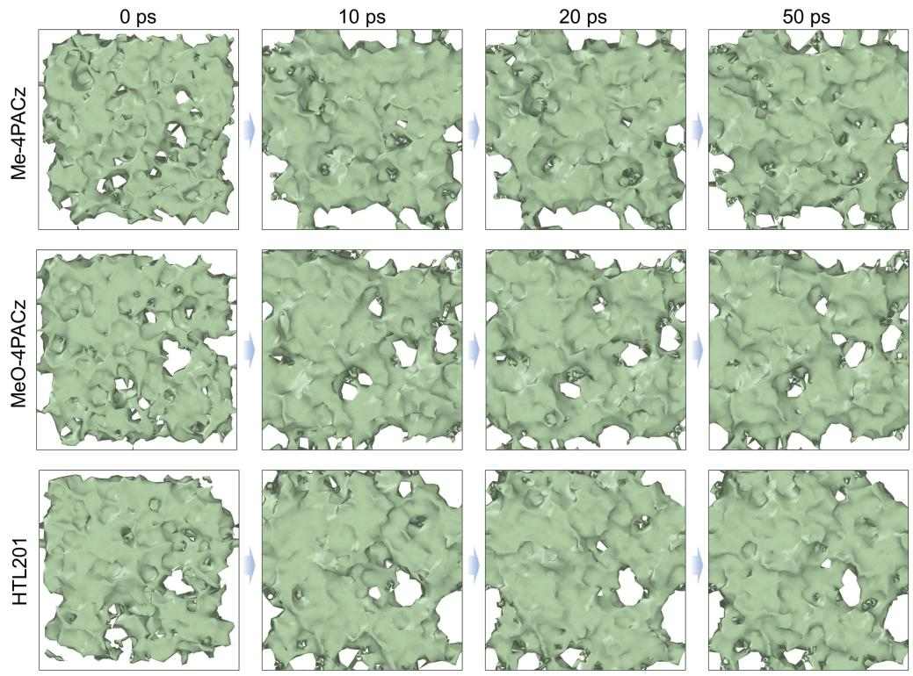  
Extended Data Fig. 1 | Simulations of the adsorption process of SAMs on IZO substrates. Surface coverage of Me-4PACz, MeO-4PACz, and HTL201 on the IZO substrate at different simulated times.

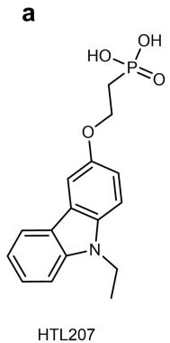

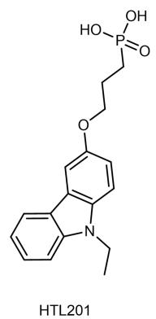

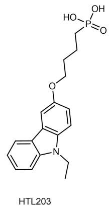

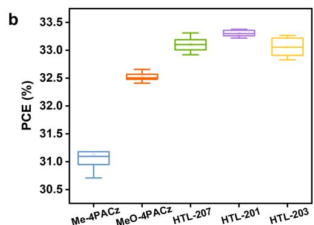

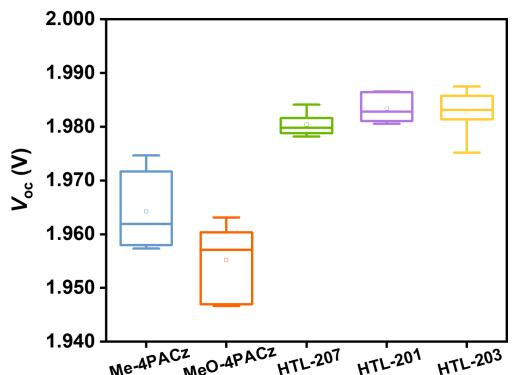

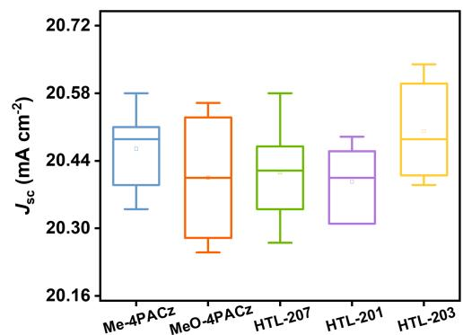

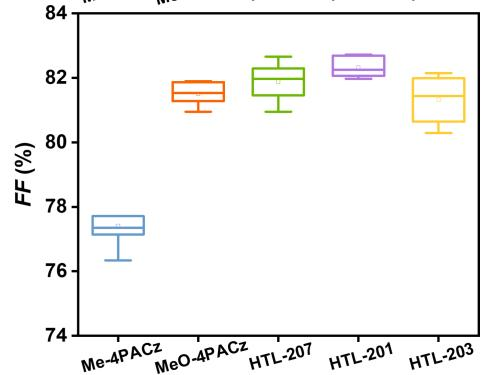  
Extended Data Fig. 2 | Device performance of tandem solar cells based on HTL201-like derivatives. (a) Molecular structures of HTL201, HTL203 and HTL207. (b) Box plots of PCE, $V _ { \mathrm { o c } } ,$ FF and $J _ { \mathrm { S C } }$ for TSCs without EDAI interface modification by varying the aliphatic chain length $( \mathsf { n } = 2 , 3 , 4 )$ ) in HTL201-based SAMs.

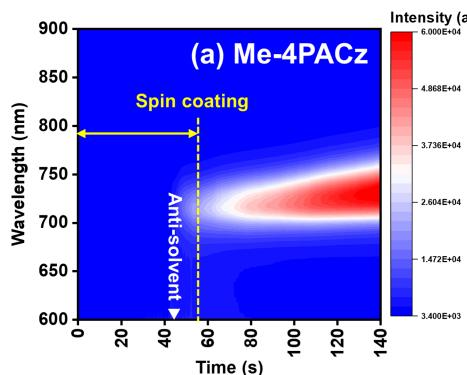

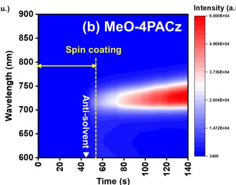

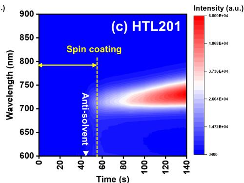  
Extended Data Fig. 3 | Crystallization dynamics characterized by in-situ PL measurement. In-situ photoluminescence (PL) spectra evolution during and after spin-coating for (a) Me-4PACz, (b) MeO-4PACz, and (c) HTL201 based   
perovskite films. After the spin-coating procedure ends, the as-deposited perovskite films were left on the spin coater for kept standing to further collect the PL data.

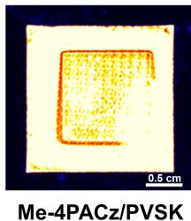  
a

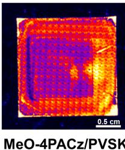

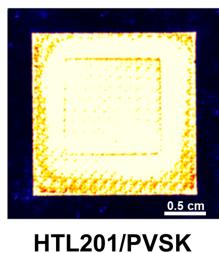

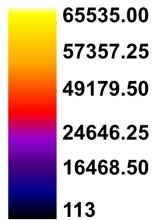

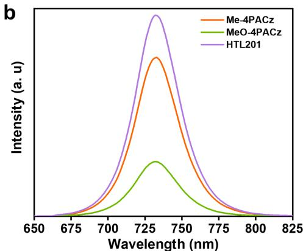

Extended Data Fig. 4 | Photoluminescence characteristics of perovskite   
  
films. (a) Photoluminescence mapping images of perovskite films deposited on different SAM-covered textured silicon substrates. The surrounding black area represents the sample holder that should not emit any light. The 11 $\mathsf { m m } \times \mathrm { { 1 1 } \mathsf { m m } }$   
square mark in the middle can be seen, representing the area of the underlying recombination layer. (b) Steady-state photoluminescence (PL) and (c) the time-resolved photoluminescence (TRPL) spectra of perovskite films based on different SAMs.

  
Extended Data Fig. 5 | Device performance and the Suns- $\pmb { V _ { \mathbf { o c } } }$ measurements for the single-junction devices. The box plots of (a-d) performance parameter statistics for $\mathsf { - 1 . 0 c m ^ { 2 } }$ single-junction inverted devices (12 devices fabricated independently per type), (e) pseudo-FF values statistics, and (f) series resistance $( \mathsf { R } _ { \mathsf { S } } )$ .

# Solar Cells Reporting Summary

NaturePortfoliwisstomprotereproducibilitftheorktatepublishisfoisintendedfopublicationithallaceptedapes reportingthecharacterzatiofpotovltaicdevicsandprovidesstructureforconsistencyandtransparecyineportingSomelistitsight not apply to an individual manuscript, but allfields must be completed for clarity.

For further information on Nature Research policies,including ourdata availabilitypolicy,see Authors & Referees.

# Experimental design

Pleasecheckthefollwingdetailsarereportedinthemanuscript,andprovideabriefdescriptionorexplanationwhereaplicable

# 1.Dimensions

Area of the tested solar cells

Method used to determine the device area

# 2. Current-voltage characterization

Current density-voltage (J-V) plots in both forward and backward direction

Voltage scan conditions

Test environment

Protocol for preconditioning of the device before its characterization

Stability of the J-V characteristic

# 3. Hysteresis or any other unusual behaviour

Description of the unusual behaviour observed during the characterization

Related experimental data

# 4.Efficiency

External quantum efficiency (EQE) or incident photons to current efficiency (IPCE)

A black mask with an aperture area of $1 . 0 \mathrm { c m } ^ { 2 }$ was used for the device test,as stated in the Methods section.

In the Methods section.

In the Fig. 2g.

The current-voltage (J-V) curves were measured with a step size of 1O mV and a delay time of 1O ms,as stated in the Methods section.

The devices were positioned on a water-cooled copper stage,with the temperature maintainedat $2 5 ~ ^ { \circ } C$ under AM 1.5G illumination $( 1 0 0 \mathrm { m W / c m ^ { 2 } } ,$ )inanair environment.

No preconditioning was used in this work.

In the Fig.2i

In the Fig.2g

In the Fig.2g and Fig.2i

For the EQE measurement,a green LED light with a peak wavelength of 525 nm and a near-infrared LED with a peak wavelength of 845 nm were used to measure the Si bottom sub-cell and the perovskite top cell (O.5 Vbias voltages were applied), respectively. Details are provided in the Methods section.

A comparison between the integrated response under the standard reference spectrum and the response measure under the simulator

For tandem solar cells,the bias illumination and bias voltage used for each subcell

# 5．Calibration

Light source and reference cell or sensor used for the characterization

Confirmation that the reference cell was calibrated and certified

Calculation of spectral mismatch between the reference cell and the devices under test

# 6. Mask/aperture

Size of the mask/aperture used during testing

Variation of the measured short-circuit current density with the mask/aperture area

# 7.Performance certification

Identity of the independent certification laboratory that confirmed the photovoltaic performance

A copy of any certificate(s)

# 8.Statistics

Number of solar cells tested

Statistical analysis of the device performance

# 9.Long-term stability analysis

Type of analysis, bias conditions and environmental conditions

In the Fig.2g,Fig.2h and Fig.2i

In the Methods section.

The reference cell was calibrated by the Fraunhofer ISE in Germany,as stated in the Methods section.

The reference cell was calibrated by the Fraunhofer ISE.

The mismatch factor for both cells is around $1 . 0 0 { \scriptstyle \pm 0 . 0 1 }$ .The spectral irradiance in our laboratory was measured regularly using an external spectrometer.

A black mask with an aperture area of $1 . 0 \mathsf { c m } ^ { 2 }$ was used for the device test,as stated in the Methods section.

European Solar Test Installtion (ESTl) calibrated the mask area,in the Supplementary Fig.19.

European Solar Test Installation (ESTl) confirmed the device performance.

In Fig.2iand the Supplementary Fig.19.

In the Fig. 2c-2f.

In the Fig.2c-2f, Extended Data Fig.2 and the Supplementary Table 5-Table 7.

In the Fig. 4a-4c.