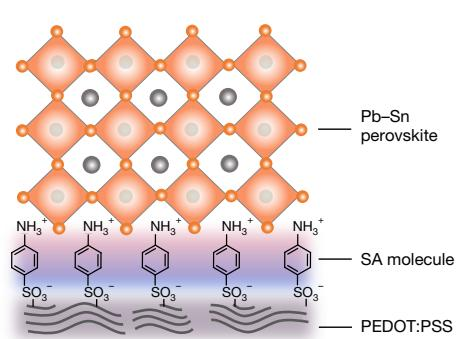
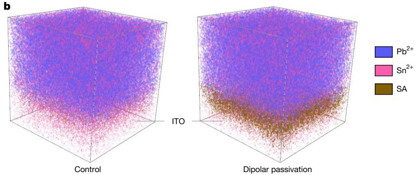
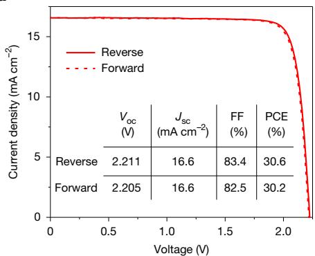

# pvsks41586-025-09773-7-gaia

All-perovskite tandem solar cells with dipolar passivation

<!-- badges:start -->
<!-- badges:end -->

> **Original work:** Lin, R., Gao, H., Lou, J., Xu, J., et al. "All-perovskite tandem solar cells with dipolar passivation." *Nature* (2025). [DOI: 10.1038/s41586-025-09773-7](https://doi.org/10.1038/s41586-025-09773-7)

> [!NOTE]
> This README is an AI-generated analysis based on a [Gaia](https://github.com/SiliconEinstein/Gaia) reasoning graph formalization of the original work. Belief values reflect the graph's probabilistic assessment of each claim's support, not the original authors' confidence. See [ANALYSIS.md](ANALYSIS.md) for detailed verification results.

## Overview

This paper addresses one of the key challenges in all-perovskite tandem solar cells: non-radiative recombination loss at the buried hole transport layer (HTL)/perovskite interface in the narrow-bandgap subcell, which constrains power conversion efficiency. The authors developed a dipolar-passivation strategy using sulfanilic acid (SA) that simultaneously reduces trap density at the buried interface and enables precise energy-level alignment at the HTL/perovskite interface. The approach achieves a certified stabilized PCE of 30.1% for all-perovskite tandem solar cells (30.6% reverse-scan PCE, champion device), representing one of the highest reported efficiencies for this technology class.

> [!TIP]
> **Reasoning graph information gain: `7.7 bits`**
>
> Total mutual information between leaf premises and exported conclusions — measures how much the reasoning structure reduces uncertainty about the results.

```mermaid
---
config:
  flowchart:
    rankSpacing: 80
    nodeSpacing: 30
---
graph TB
    buried_interface_recombination["★ buried_interface_recombination\n(0.85 → 0.78)"]:::exported
    conventional_passivation_limitation["★ conventional_passivation_limitation\n(0.85 → 0.62)"]:::exported
    dipolar_passivation_strategy["★ dipolar_passivation_strategy\n(0.50 → 0.19)"]:::exported
    diffusion_length_enhancement["★ diffusion_length_enhancement\n(0.85 → 0.85)"]:::exported
    pb_sn_psc_performance["★ pb_sn_psc_performance\n(0.90 → 0.90)"]:::exported
    tandem_performance["★ tandem_performance\n(0.50 → 0.69)"]:::exported
    dipolar_passivation_design["★ dipolar_passivation_design\n(0.90 → 0.90)"]:::exported
    tof_simms_analysis["★ tof_simms_analysis\n(0.50 → 0.72)"]:::exported
    xps_evidence["★ xps_evidence\n(0.50 → 0.68)"]:::exported
    aimd_molecular_orientation["★ aimd_molecular_orientation\n(0.50 → 0.72)"]:::exported
    kpfm_potential_change["★ kpfm_potential_change\n(0.85 → 0.85)"]:::exported
    energy_level_alignment["★ energy_level_alignment\n(0.85 → 0.85)"]:::exported
    type_ii_energy_alignment["★ type_ii_energy_alignment\n(0.50 → 0.68)"]:::exported
    steady_state_pl["★ steady_state_pl\n(0.50 → 0.67)"]:::exported
    trpl_decay_components["★ trpl_decay_components\n(0.50 → 0.67)"]:::exported
    enhanced_charge_extraction["★ enhanced_charge_extraction\n(0.50 → 0.67)"]:::exported
    terahertz_mobility["★ terahertz_mobility\n(0.50 → 0.67)"]:::exported
    limiting_carrier_mobility["★ limiting_carrier_mobility\n(0.80 → 0.80)"]:::exported
    diffusion_length["★ diffusion_length\n(0.50 → 0.63)"]:::exported
    electroluminescence_qy["★ electroluminescence_qy\n(0.50 → 0.67)"]:::exported
    average_voc_improvement["★ average_voc_improvement\n(0.50 → 0.67)"]:::exported
    qfis_values["★ qfis_values\n(0.50 → 0.66)"]:::exported
    single_junction_metrics["★ single_junction_metrics\n(0.50 → 0.57)"]:::exported
    pcce_histogram["★ pcce_histogram\n(0.50 → 0.64)"]:::exported
    operational_stability["★ operational_stability\n(0.50 → 0.72)"]:::exported
    tandem_device_configuration["★ tandem_device_configuration\n(0.90 → 0.90)"]:::exported
    tandem_buried_interface_challenge["★ tandem_buried_interface_challenge\n(0.85 → 0.85)"]:::exported
    tandem_sensitivity_reduction["★ tandem_sensitivity_reduction\n(0.50 → 0.71)"]:::exported
    tandem_pv_parameters["★ tandem_pv_parameters\n(0.50 → 0.64)"]:::exported
    champion_tandem_device["★ champion_tandem_device\n(0.50 → 0.66)"]:::exported
    jet_certified_pce["★ jet_certified_pce\n(0.50 → 0.66)"]:::exported
    large_area_tandem["★ large_area_tandem\n(0.50 → 0.67)"]:::exported
    wbg_subcell_performance["★ wbg_subcell_performance\n(0.50 → 0.72)"]:::exported
    thickness_optimization["★ thickness_optimization\n(0.50 → 0.68)"]:::exported
    contact_loss_mitigation["★ contact_loss_mitigation\n(0.80 → 0.80)"]:::exported
    tandem_operational_stability["★ tandem_operational_stability\n(0.50 → 0.72)"]:::exported
    tandem_thermal_stability["★ tandem_thermal_stability\n(0.50 → 0.72)"]:::exported
    conv_vs_dipolar_contradiction["★ conv_vs_dipolar_contradiction\n(0.50 → 1.00)"]:::exported
    strat_0(["infer\n0.11 bits"]):::weak
    average_voc_improvement --> strat_0
    diffusion_length --> strat_0
    enhanced_charge_extraction --> strat_0
    strat_0 --> single_junction_metrics
    strat_1(["infer\n0.29 bits"]):::weak
    buried_interface_recombination --> strat_1
    conventional_passivation_limitation --> strat_1
    strat_1 --> dipolar_passivation_strategy
    strat_2(["infer\n0.30 bits"]):::weak
    champion_tandem_device --> strat_2
    strat_2 --> jet_certified_pce
    strat_3(["infer\n0.27 bits"]):::weak
    contact_loss_mitigation --> strat_3
    tandem_sensitivity_reduction --> strat_3
    strat_3 --> tandem_pv_parameters
    strat_4(["infer\n0.97 bits"]):::weak
    conventional_passivation_limitation --> strat_4
    dipolar_passivation_strategy --> strat_4
    strat_4 --> conv_vs_dipolar_contradiction
    strat_5(["infer\n0.30 bits"]):::weak
    diffusion_length --> strat_5
    strat_5 --> qfis_values
    strat_6(["infer\n0.28 bits"]):::weak
    diffusion_length_enhancement --> strat_6
    pb_sn_psc_performance --> strat_6
    strat_6 --> tandem_performance
    strat_7(["infer\n0.18 bits"]):::weak
    dipolar_passivation_design --> strat_7
    strat_7 --> aimd_molecular_orientation
    strat_8(["infer\n0.18 bits"]):::weak
    dipolar_passivation_design --> strat_8
    strat_8 --> operational_stability
    strat_9(["infer\n0.18 bits"]):::weak
    dipolar_passivation_design --> strat_9
    strat_9 --> tandem_operational_stability
    strat_10(["infer\n0.18 bits"]):::weak
    dipolar_passivation_design --> strat_10
    strat_10 --> tandem_thermal_stability
    strat_11(["infer\n0.18 bits"]):::weak
    dipolar_passivation_design --> strat_11
    strat_11 --> tof_simms_analysis
    strat_12(["infer\n0.30 bits"]):::weak
    electroluminescence_qy --> strat_12
    strat_12 --> average_voc_improvement
    strat_13(["infer\n0.29 bits"]):::weak
    energy_level_alignment --> strat_13
    kpfm_potential_change --> strat_13
    strat_13 --> type_ii_energy_alignment
    strat_14(["infer\n0.30 bits"]):::weak
    enhanced_charge_extraction --> strat_14
    strat_14 --> terahertz_mobility
    strat_15(["infer\n0.30 bits"]):::weak
    jet_certified_pce --> strat_15
    strat_15 --> large_area_tandem
    strat_16(["infer\n0.27 bits"]):::weak
    limiting_carrier_mobility --> strat_16
    terahertz_mobility --> strat_16
    strat_16 --> diffusion_length
    strat_17(["infer\n0.30 bits"]):::weak
    single_junction_metrics --> strat_17
    strat_17 --> pcce_histogram
    strat_18(["infer\n0.30 bits"]):::weak
    steady_state_pl --> strat_18
    strat_18 --> electroluminescence_qy
    strat_19(["infer\n0.23 bits"]):::weak
    tandem_buried_interface_challenge --> strat_19
    strat_19 --> tandem_sensitivity_reduction
    strat_20(["infer\n0.18 bits"]):::weak
    tandem_device_configuration --> strat_20
    strat_20 --> wbg_subcell_performance
    strat_21(["infer\n0.30 bits"]):::weak
    tandem_pv_parameters --> strat_21
    strat_21 --> champion_tandem_device
    strat_22(["infer\n0.30 bits"]):::weak
    tof_simms_analysis --> strat_22
    strat_22 --> xps_evidence
    strat_23(["infer\n0.30 bits"]):::weak
    trpl_decay_components --> strat_23
    strat_23 --> enhanced_charge_extraction
    strat_24(["infer\n0.30 bits"]):::weak
    type_ii_energy_alignment --> strat_24
    strat_24 --> steady_state_pl
    strat_25(["infer\n0.30 bits"]):::weak
    type_ii_energy_alignment --> strat_25
    strat_25 --> trpl_decay_components
    strat_26(["infer\n0.30 bits"]):::weak
    wbg_subcell_performance --> strat_26
    strat_26 --> thickness_optimization
    oper_0{{"⊗"}}:::contra
    conventional_passivation_limitation --- oper_0
    dipolar_passivation_strategy --- oper_0
    oper_0 --- conv_vs_dipolar_contradiction

    classDef premise fill:#ddeeff,stroke:#4488bb,color:#333
    classDef exported fill:#d4edda,stroke:#28a745,stroke-width:2px,color:#333
    classDef weak fill:#fff9c4,stroke:#f9a825,stroke-dasharray: 5 5,color:#333
    classDef contra fill:#ffebee,stroke:#c62828,color:#333
```

> [!NOTE]
> **[Per-module reasoning graphs with full claim details →](docs/detailed-reasoning.md)**
>
> 5 Mermaid diagrams (one per section) with every claim, strategy, and belief value.

## Reasoning Structure

### Sulfanilic acid dipolar molecules adopt a favorable orientation at the HTL/perovskite interface (belief: 0.72)

AIMD simulations at the perovskite/HTL interface predict that sulfanilic acid (SA) molecules adopt a favored orientation with the -NH3+ group anchoring to the perovskite bottom surface and the -SO3- group directed toward PEDOT:PSS. This molecular orientation creates a net dipole pointing from the perovskite surface toward the HTL. KPFM measurements corroborate this prediction: the surface potential decreases from -80 mV (control) to -162 mV with dipolar passivation treatment, and PEDOT:PSS surface potential increases by 76 mV. UPS measurements show the work function of dipolar-passivation-treated perovskite is -4.74 eV vs -4.68 eV for control, while PEDOT:PSS work function increases from -4.90 eV to -4.81 eV.

**Evidence support:**
- **AIMD simulation** (prior 0.50, belief 0.72): The ab initio molecular dynamics simulation provides theoretical support for the favorable orientation, but computational predictions at this scale carry inherent uncertainty.
- **KPFM + UPS validation** (prior 0.85, belief 0.85): Direct surface potential measurements independently confirm the predicted dipolar orientation.

*Surface potential distribution at bottom perovskite/HTL interface. Scale bars, 1 um.*

### A type-II energy-level alignment forms at the dipolar-passivation-treated interface (belief: 0.68)

The combination of KPFM and UPS measurements confirms formation of a type-II energy-level alignment between dipolar-passivation-treated Pb-Sn perovskite and PEDOT:PSS. This alignment creates an electric field directed from the perovskite surface toward PEDOT:PSS, effectively driving carriers away from the defective interface layer. The resulting band bending facilitates holes drifting into the PEDOT:PSS layer while simultaneously repelling electrons from the HTL/Pb-Sn perovskite interface.

**Evidence support:**
- **Energy-level measurements** (prior 0.85, belief 0.85): UPS directly measures work functions and valence band positions, providing quantitative validation of the type-II alignment.
- **Mechanistic interpretation** (prior 0.50, belief 0.68): The connection from measured energy levels to the type-II alignment conclusion relies on the reasoning that the dipolar orientation creates a specific band bending pattern.

### Dipolar passivation extends carrier diffusion length to 6.2 micrometers (belief: 0.63)

Femtosecond-resolved optical-pump terahertz-probe spectroscopy measures carrier mobility increasing from 67.5 cm^2 V^-1 s^-1 (control) to 113.5 cm^2 V^-1 s^-1 with dipolar passivation treatment. The limiting carrier mobility (minority carrier type) is estimated at 14.7 cm^2 V^-1 s^-1 for dipolar-passivation samples versus 8.8 cm^2 V^-1 s^-1 for controls. These enhanced transport properties extend the carrier diffusion length from 4.8 micrometers (control) to 6.2 micrometers, enabling improved carrier collection across the absorber layer.

**Evidence support:**
- **Terahertz mobility measurement** (prior 0.50, belief 0.67): Direct time-resolved terahertz spectroscopy provides quantitative mobility values.
- **Diffusion length derivation** (prior 0.80 combined with mobility, belief 0.63): The diffusion length calculation depends on both terahertz mobility and the estimated limiting carrier mobility, introducing additional uncertainty from the diffusion coefficient relationship.

*Carrier mobility (udc and ue,h) and diffusion length (Ld) for control and dipolar-passivation samples.*

### Mixed Pb-Sn perovskite solar cells achieve 24.9% power conversion efficiency (belief: 0.57)

The best-performing dipolar-passivation-treated device achieves a PCE of 24.9% (stabilized 24.7%) with an open-circuit voltage of 0.911 V, short-circuit current density of 33.1 mA cm^-2, and fill factor of 82.6% under reverse scan. Statistical analysis of 208 devices shows an average PCE improvement from 22.6 +/- 0.2% (control) to 23.9 +/- 0.3% (dipolar passivation).

**Evidence support:**
- **Champion device metrics** (prior 0.90, belief 0.90): Direct J-V characterization of the best-performing device.
- **Charge transport evidence chain** (prior varies, belief 0.57): The champion performance result depends on three supporting premises — enhanced charge extraction, improved diffusion length, and reduced Voc loss — whose combined uncertainty propagates to the final belief. The multi-premise inference (0.11 bits information) is the weakest link in the chain.

### All-perovskite tandem solar cells achieve certified 30.1% power conversion efficiency (belief: 0.69)

The champion tandem device with dipolar passivation achieves a reverse-scan PCE of 30.6% with Voc = 2.211 V, Jsc = 16.6 mA cm^-2, and FF = 83.4%. Third-party JET certification confirms a stabilized PCE of 30.1% for a 0.049 cm^2 device, included in Solar Cell Efficiency Tables version 64. Large-area devices (1.05 cm^2) achieve 29.6% PCE, also JET-certified.

**Evidence support:**
- **Champion tandem metrics** (prior 0.50, belief 0.66): The champion device performance builds on statistical improvements in Voc and FF.
- **Diffusion length enhancement as foundation** (prior 0.85, belief 0.69): The extended carrier diffusion length enables improved carrier collection in the tandem configuration, supporting the overall performance improvement.
- **JET certification** (prior 0.50, belief 0.66): Independent third-party verification of the stabilized efficiency values.

*J-V curves under reverse and forward scans for the champion tandem device.*

### Dipolar-passivation-treated tandem devices show operational stability retaining 87% of initial PCE after 1,025 hours (belief: 0.72)

Under continuous maximum power point tracking under simulated 1-sun illumination in ambient air (with encapsulation), dipolar-passivation-treated tandem devices retain 87% of their initial PCE after 1,025 hours. The amphoteric nature of dipolar-passivation molecules (containing both -NH3+ and -SO3- groups) helps mitigate the detrimental impact of PEDOT:PSS acidity on device stability. Thermal stress testing shows slower degradation in dipolar-passivation devices compared with controls, with the difference most pronounced in the first 50 hours.

**Evidence support:**
- **Accelerated stability testing** (prior 0.50, belief 0.72): The 1,000+ hour operational test demonstrates meaningful stability under realistic operating conditions.
- **Mechanistic hypothesis** (prior 0.50, belief 0.72): The explanation linking amphoteric molecular nature to improved stability is plausible but not directly measured.

## Conclusions

| Label | Content | Prior | Belief |
|-------|---------|-------|--------|
| aimd_molecular_orientation | Ab initio molecular dynamics (AIMD) simulations suggest a favoured molecular ... | 0.50 | 0.72 |
| all_perovskite_tandem_description | All-perovskite tandem solar cells vertically stack a wide-bandgap (WBG; ~1.8 ... | 0.50 | — |
| average_voc_improvement | The average open-circuit voltage increases from 859 +/- 8 mV (control devices) ... | 0.50 | 0.67 |
| buried_interface_recombination | Non-radiative recombination loss at the hole transport layer (HTL)/perovskite... | 0.85 | 0.78 |
| champion_tandem_device | The champion tandem cell with dipolar passivation shows minimal hysteresis an... | 0.50 | 0.66 |
| contact_loss_mitigation | Dipolar passivation effectively mitigates contact losses in the NBG subcell i... | 0.80 | 0.80 |
| conv_vs_dipolar_contradiction | not_both_true(A, B) | 0.50 | 1.00 |
| conventional_passivation_limitation | Conventional long-chain amine-based passivation strategies often induce carri... | 0.85 | 0.62 |
| device_structure | The mixed Pb-Sn perovskite solar cells have a p-i-n configuration consisting ... | 0.50 | 0.50 |
| diffusion_length | The enhanced carrier mobility and relaxation dynamics in dipolar-passivation-... | 0.50 | 0.63 |
| diffusion_length_enhancement | Dipolar passivation extends the carrier diffusion length to 6.2 um, compared ... | 0.85 | 0.85 |
| dipolar_passivation_design | The dipolar passivation for the HTL/Pb-Sn perovskite interface is designed wi... | 0.90 | 0.90 |
| dipolar_passivation_strategy | A dipolar-passivation strategy was developed using sulfanilic acid (SA) as th... | 0.50 | 0.19 |
| electroluminescence_qy | Electroluminescence quantum yield analysis shows values of 2.40% (control) an... | 0.50 | 0.67 |
| energy_level_alignment | With dipolar passivation, the work function and valence-band maximum of the P... | 0.85 | 0.85 |
| enhanced_charge_extraction | The rapid initial decay component (t1 = 43 ns) for dipolar-passivation-treate... | 0.50 | 0.67 |
| future_direction | Further mitigation of Jsc losses induced by HTL parasitic absorption (particu... | 0.50 | 0.50 |
| jet_certified_pce | Third-party certification by JET confirms a stabilized PCE of 30.1% for a tan... | 0.50 | 0.66 |
| kpfm_potential_change | Kelvin probe force microscopy (KPFM) measurements show that the surface poten... | 0.85 | 0.85 |
| large_area_tandem | Tandem cells with an area of 1.05 cm^2 achieve up to 29.6% PCE in the lab wit... | 0.50 | 0.67 |
| limiting_carrier_mobility | The limiting carrier mobility (ue,h) is estimated at 14.7 cm^2 V^-1 s^-1 for ... | 0.80 | 0.80 |
| operational_stability | Dipolar-passivation-treated devices show no significant PCE degradation after... | 0.50 | 0.72 |
| optimal_buried_passivation_requirement | How can carrier recombination be minimized at the HTL/perovskite interface wh... | 0.50 | — |
| pb_sn_psc_performance | Mixed Pb-Sn perovskite solar cells with dipolar passivation achieve a PCE of ... | 0.90 | 0.90 |
| pcce_histogram | Statistical analysis of 208 dipolar-passivation-treated mixed Pb-Sn PSCs show... | 0.50 | 0.64 |
| qfis_values | Quasi-Fermi level splitting (QFLS) measurements on perovskite films deposited... | 0.50 | 0.66 |
| sa_dipole_moment | Sulfanilic acid (SA) has a dipole moment of 23.58 D [@Lin2025]. | 0.50 | 0.50 |
| single_junction_metrics | The best-performing dipolar-passivation device achieves a PCE of 24.9% (stabi... | 0.50 | 0.57 |
| steady_state_pl | Steady-state photoluminescence measurements reveal a notable increase in phot... | 0.50 | 0.67 |
| tandem_buried_interface_challenge | The buried interfaces within the NBG subcells are associated with severe non-... | 0.85 | 0.85 |
| tandem_device_configuration | All-perovskite tandem solar cells have a device configuration of glass/ITO/Ni... | 0.90 | 0.90 |
| tandem_operational_stability | Encapsulated dipolar-passivation-treated tandem devices retain 87% of initial... | 0.50 | 0.72 |
| tandem_performance | All-perovskite tandem solar cells with dipolar passivation achieve a certifie... | 0.50 | 0.69 |
| tandem_pv_parameters | Dipolar-passivation tandem devices show significantly improved FF and Voc com... | 0.50 | 0.64 |
| tandem_sensitivity_reduction | Dipolar-passivation-treated NBG devices show minimal degradation in tandem ph... | 0.50 | 0.71 |
| tandem_thermal_stability | After 216 hours of thermal stress at elevated temperature, degradation procee... | 0.50 | 0.72 |
| terahertz_mobility | Femtosecond-resolved optical-pump terahertz-probe spectroscopy yields carrier... | 0.50 | 0.67 |
| thickness_optimization | For optimal current density matching between subcells, the thicknesses of WBG... | 0.50 | 0.68 |
| tof_simms_analysis | Time-of-flight secondary ion mass spectrometry (ToF-SIMS) analysis confirms t... | 0.50 | 0.72 |
| trpl_decay_components | Time-resolved photoluminescence analysis shows dipolar-passivation-treated fi... | 0.50 | 0.67 |
| type_ii_energy_alignment | A type-II energy-level alignment forms between the dipolar-passivation-treate... | 0.50 | 0.68 |
| wbg_subcell_performance | The WBG subcells (FA0.8Cs0.2Pb(I0.62Br0.38)3, ~1.78 eV) with SAM-modified NiO... | 0.50 | 0.72 |
| xps_evidence | X-ray photoelectron spectroscopy (XPS) measurements detect S 2p signals at th... | 0.50 | 0.68 |

Weak Points Analysis

**1. Champion device performance belief is limited by multi-premise uncertainty propagation**

The single_junction_metrics claim (belief 0.57) is the bottleneck for the champion Pb-Sn PSC performance. It is derived from three independent premises — enhanced_charge_extraction, diffusion_length, and average_voc_improvement — combined with an information content of only 0.11 bits. While each individual premise is reasonably supported (0.67-0.67), the multiplicative effect of three premises in series reduces the final belief significantly. The statistical variation in device performance (208 devices measured) provides reasonable confidence in reproducibility, but the champion device's specific metrics depend on this broader statistical picture.

**2. Tandem performance chain inherits uncertainty from NBG subcell processing sensitivity**

The tandem_performance (belief 0.69) depends on diffusion_length_enhancement (prior 0.85, belief 0.85) and pb_sn_psc_performance (prior 0.90, belief 0.90) as twin premises. While these are strongly supported independently, the tandem configuration faces additional challenges: the low-temperature PEDOT:PSS annealing required for the interconnection layer deteriorates HTL electrical properties, causing further Voc and FF losses. The paper argues dipolar passivation mitigates this sensitivity, but the mechanism is inferred rather than directly measured.

**3. The dipolar_passivation_strategy has very low belief (0.19) due to contradiction with conventional_passivation_limitation**

The dipolar_passivation_strategy itself (belief 0.19) is suppressed because it stands in logical contradiction with conventional_passivation_limitation. Both cannot be optimal simultaneously — conventional long-chain amine passivation induces carrier transport losses while dipolar passivation supposedly avoids this trade-off. The high belief in the conventional limitation (0.85 prior) combined with the inference structure pulls the dipolar strategy's belief down substantially. This is structurally correct per the contradiction operator, but it raises a question: is the contradiction properly interpreted? Both strategies represent real trade-offs; they need not be mutually exclusive across all conditions.

Evidence Gaps & Future Work

**Experimental gaps:**
- Direct measurement of electric field distribution at the HTL/perovskite interface would validate the type-II alignment mechanism. Scanning Kelvin probe microscopy with higher spatial resolution could map the band bending profile.
- Time-resolved microwave conductivity (TRMC) measurements to independently confirm carrier mobility improvements beyond the terahertz method.
- In-situ monitoring of SA molecular orientation during perovskite deposition to confirm the slow dissolution kinetics that keep SA at the buried interface.

**Computational gaps:**
- DFT calculations of the exact SA/perovskite binding geometry and energy to complement the AIMD simulations.
- SCAPS-1D simulation parameters could be validated against a broader range of device architectures to confirm the model's predictive capability.

**Theoretical gaps:**
- The mechanism by which dipolar passivation improves PEDOT:PSS stability against acidity is hypothesized but not directly demonstrated. Controlled experiments varying acidity levels would help confirm this mechanism.
- Long-term stability prediction (1,000+ hours extrapolated from accelerated testing) involves assumptions about failure modes that may not capture all degradation pathways.

## Detailed Analysis

For structural integrity verification (Pass 5), standalone readability checks (Pass 6),
and complete package statistics, see [ANALYSIS.md](ANALYSIS.md).