# All-perovskite tandem solar cells with dipolar passivation

https://doi.org/10.1038/s41586-025-09773-7

Received: 14 February 2025

Accepted: 17 October 2025

Published online: 27 October 2025

Check for updates

Renxing Lin1,8 ✉, Han Gao1,8, Jing Lou2,8, Jian Xu3 ✉, Mengran Yin1 , Pu Wu1 , Chenshuaiyu Liu1 , Yijia Guo1 , Enzuo Wang1 , Shuncheng Yang1 , Runnan Liu1 , Dong Zhou1 , Changzeng Ding4 , Anh Dinh Bui5 , Ni Yin4 , Daniel H. Macdonald5 , Chang-Qi Ma4 , Qi Chen4 , Ke Xiao1 , Xin Luo6 , Ye Liu6 , Ludong Li1 , Yongxi Li7 , Chao Chang2 ✉ & Hairen Tan1,6 ✉

Non-radiative recombination loss at the hole transport layer (HTL)/perovskite interface in the narrow-bandgap subcell constrains the power conversion efciency (PCE) of all-perovskite tandem solar cells1,2 . Minimizing charge recombination at the buried interface of lead–tin (Pb–Sn)-based narrow-bandgap perovskite solar cells has proven to be particularly challenging, as conventional long-chain amine-based passivation strategies often induce carrier transport losses, thereby limiting both the fll factor and the short-circuit current density $( J _ { \mathrm { s c } } ) ^ { 3 - 5 }$ . Here we developed a dipolar-passivation strategy that reduces the trap density at the buried interface of mixed Pb–Sn perovskite while simultaneously enabling precise energy-level alignment at the HTL/perovskite interface. This dipolar-induced passivation enhances ohmic contact, facilitating efcient hole injection into the HTL and repelling electrons from the HTL/Pb–Sn perovskite interface. This approach extends the carrier difusion length to $6 . 2 \mu \mathrm { m }$ and enables a substantial enhancement in the PCE of Pb–Sn perovskite solar cells, achieving $2 4 . 9 \%$ along with an open-circuit voltage $( V _ { \mathrm { o c } } )$ of 0.911 V, $\mathsf { a } J _ { \mathrm { s c } }$ of $3 3 . 1 \mathsf { m A c m } ^ { - 2 }$ and a high fll factor of $8 2 . 6 \%$ . Furthermore, the dipolar passivation efectively mitigates contact losses in the narrow-bandgap subcell induced by the interconnecting layer of tandem devices, contributing to an outstanding PCE o $3 0 . 6 \%$ (certifed stabilized $3 0 . 1 \%$ ) in all-perovskite tandem solar cells.

All-perovskite tandem solar cells1,2,6–8 —which vertically stack a widebandgap (WBG; approximately 1.8 eV) mixed bromide/iodide perovskite front cell with a complementary narrow-bandgap (NBG; approximately 1.25 eV) mixed lead–tin (Pb–Sn) perovskite rear cell—have shown great promise in surpassing the power conversion efficiency (PCE) of singlejunction perovskite solar cells (PSCs) while retaining the low-cost advantages of solution-processing techniques9–11.

The state-of-the-art all-perovskite tandem solar cells using mixed Pb–Sn NBG perovskites still show undesirably large open-circuit voltage $( V _ { \mathrm { o c } } )$ and fill factor (FF) deficits compared with the theoretical limits predicted by the Shockley–Queisser model12–14. Recent advances have introduced bulk additives and surface passivation strategies that effectively suppress non-radiative recombination within the perovskite bulk and at the perovskite/electron transport layer (ETL) interface, thereby improving both $V _ { \mathrm { o c } }$ and FF in PSCs1,5,15. However, deep-level traps at the buried perovskite/hole transport layer (HToL) interface remain insufficiently addressed. These interfacial traps capture photogenerated carriers, leading to severe non-radiative recombination and restricting photovoltaic performance. Minimizing charge recombination at the HTL/perovskite interface is crucial for improving the photovoltaic

performance of PSCs, yet remains particularly challenging in mixed Pb– Sn PSCs. Common interfacial optimization strategies—such as employing long-chain amines as passivating agents—have demonstrated some success in improving the $V _ { \mathrm { o c } }$ of mixed Pb–Sn perovskites. However, their application often comes at the cost of impaired charge transport, resulting in reduced short-circuit current density $( \boldsymbol { J } _ { \mathrm { s c } } )$ and FF. This is primarily owing to their asymmetric conductivity and the formation of highly insulating barriers arising from their large molecular sizes3–5 .

An optimal buried passivation strategy at the HTL/perovskite interface must simultaneously suppress charge recombination and establish an ohmic contact for efficient carrier extraction. The ohmic contact can be realized by tuning the energy-level alignment between the interface materials. Interfacial dipolar layers are particularly effective in modulating the surface energy levels of perovskites16, thereby influencing charge-carrier dynamics3,4 . Specifically, positive dipolar treatment raises the work function of the sample, whereas negative dipolar treatment decreases it (Supplementary Fig. 1). The latter induces a Schottky barrier at the perovskite/HTL interface, hindering hole injection into poly(3,4-ethylenedioxythiophene): poly(styrenesulfonate) (PEDOT:PSS)17 (Supplementary Fig.  2).

1 National Laboratory of Solid State Microstructures, College of Engineering and Applied Sciences, Frontiers Science Center for Critical Earth Material Cycling, Jiangsu Physical Science Research Center, Nanjing University, Nanjing, China. 2 Innovation Laboratory of Terahertz Biophysics, National Innovation Institute of Defense Technology, Beijing, China. 3 School of Interdisciplinary Science, Beijing Institute of Technology, Beijing, China. 4 i-Lab & Printable Electronics Research Center, Suzhou Institute of Nano-Tech and Nano-Bionics, Chinese Academy of Sciences (CAS), Suzhou, China. 5 School of Engineering, the Australian National University, Canberra, Australian Capital Territory, Australia. 6 Research and Development Center, Renshine Solar (Suzhou) Co. Ltd, Changshu, China. 7 School of Frontier Sciences, Institute of Functional Materials and Intelligent Manufacturing, Nanjing University, Suzhou, China. 8 These authors contributed equally: Renxing Lin, Han Gao, Jing Lou. ✉e-mail: rxlin@nju.edu.cn; jianxu.xu@bit.edu.cn; gwyzlzssb@pku.edu.cn; hairentan@nju.edu.cn

This unfavourable energy alignment also promotes electron accumulation at the interface, exacerbating non-radiative recombination and ultimately degrading device performance metrics18,19. Therefore, regulating the orientation of dipolar passivator molecules at the interface enables the formation of a favourable type-II energy-level alignment between functional layers16, which simultaneously suppresses carrier recombination and enhances carrier extraction at the interface (Supplementary Fig. 3).

Here we have developed a dipolar-passivation strategy to minimize carrier recombination and improve hole transport at the HTL/Pb–Sn perovskite interface (Supplementary Fig. 4). Specifically, we introduce sulfanilic acid (SA) as a dipolar-passivation molecule with dipole moment of 23.58 D (Supplementary Note 1 and Supplementary Figs. 5–7) at the HTL/Pb–Sn NBG perovskite interface. The amino group $\left( - \mathsf { N H } _ { 3 } ^ { + } \right)$ ) of the oriented dipolar passivation reduces the defect density of the buried mixed Pb–Sn perovskite surface. Meanwhile, the sulfonic acid group $\left( - { \mathsf { S O } } _ { 3 } ^ { - } \right)$ ) can adsorb onto the PEDOT:PSS, establishing a stable target dipolar orientation with the positive dipolar to form an ohmic contact at the HTL/Pb–Sn perovskite interface. This strategy facilitates efficient hole injection into the HTL while repelling electrons from the HTL/Pb–Sn perovskite interface (Supplementary Fig. 8), thereby further suppressing non-radiative recombination and avoiding carrier transport losses. The dipolar-passivation strategy facilitates a trade-off between minimizing carrier recombination and enhancing carrier transport. As a result, the mixed Pb–Sn PSCs achieve a high $V _ { \mathrm { o c } }$ of 0.911 V, $\mathsf { a } J _ { \mathrm { s c } }$ of 33.1 mA cm−2 and a high FF of $8 2 . 6 \%$ , leading to a high PCE of $2 4 . 9 \%$ . Moreover, this strategy is also applicable to all-perovskite tandem solar cells. By reducing contact losses from the interconnecting layer, we report a certified stabilized PCE of $3 0 . 1 \%$ and $2 9 . 6 \%$ for all-perovskite tandem solar cells with active areas of $0 . 0 4 9 \mathrm { c m } ^ { 2 }$ and $1 . 0 5 \mathrm { c m } ^ { 2 }$ , respectively—both certified by the Japan Electrical Safety and Environment Technology Laboratories ( JET).

# Mixed Pb–Sn PSC with dipolar passivation

The dipolar passivation for the HTL/Pb–Sn perovskite interface is designed with passivating groups and positively oriented dipoles, with the net dipole directed towards the Pb–Sn perovskite surface. SA is used as the dipolar molecule, featuring an – $\cdot \mathsf { N H } _ { 3 } ^ { + }$ passivating group and a $- \mathsf { S O } _ { 3 } ^ { - }$ dipole group (Fig. 1a and Methods). Time-of-flight secondary ion mass spectrometry analysis confirms that a stronger signal of SA molecules is detected near the bottom surface (Fig. 1b and Supplementary Figs. 9 and 10). The presence of SA molecules at the bottom surface is further evidenced by X-ray photoelectron spectroscopy (XPS) measurements (Fig. 1c, Supplementary Fig. 11 and Methods). Notably, no SA signals were detected on the top surface of the dipolar-passivation film (Supplementary Figs. 10 and 12), indicating that the SA molecules remain located at the buried interface during the subsequent perovskite film deposition. This is attributed to the slow dissolution kinetics of the passivator during the brief solvent-dripping step (Supplementary Figs. 13–15).

To explore the interfacial interactions and orientations of SA, we performed ab initio molecular dynamics (AIMD) simulations at the perovskite/HTL interface (Supplementary Note 2, Supplementary Figs. 16–20 and Methods). AIMD simulations suggest a favoured molecular orientation in which the $\mathrm { - N H } _ { 3 } ^ { + }$ group anchors to the perovskite bottom surface, whereas the $- { \bf S 0 } _ { 3 } ^ { - }$ group is directed towards the HTL. Such a dipolar orientation at the HTL/mixed Pb–Sn NBG perovskite interface is a sign of enhanced interfacial alignment and dipole-induced modulation of interfacial energetic.

Kelvin probe force microscopy (KPFM) measurements were conducted to examine the potential distribution at bottom perovskite/ HTL interface with dipolar passivation (Fig. 1d, Supplementary Fig. 21 and Methods). The results show that the surface potential of the dipolar-passivation-treated Pb–Sn perovskite decreases from $- 8 0 \mathrm { m V }$ in the control to $- 1 6 2 \mathsf { m V }$ , accompanied by a $7 6 \mathrm { m V }$ increase in the PEDOT:PSS surface. This indicates that the SA molecule preferentially

exhibits $- { \bf S 0 } _ { 3 } ^ { - }$ groups oriented towards PEDOT:PSS and – $\boldsymbol { - } \boldsymbol { \mathsf { N H } } _ { 3 } ^ { + }$ groups directed towards the perovskite, which is consistent with the AIMD simulations (Supplementary Figs. 16–20).

The energy-level alignment between the mixed Pb–Sn perovskite and the dipolar-passivation-treated bottom surface was investigated using ultraviolet photoemission spectroscopy (Methods). The work function and valence-band maximum of the dipolar-passivation Pb–Sn perovskites were approximately −4.74 eV and $- 5 . 2 6 \mathrm { e V }$ , respectively, compared with −4.68 eV and −5.27 eV for the control (Supplementary Fig. 22). In addition, the work function of PEDOT:PSS increased from −4.90 eV to −4.81 eV (Supplementary Fig. 23). These results support the preferential molecular orientation of the SA dipoles, with $- { \bf S 0 } _ { 3 } ^ { - }$ groups facing PEDOT:PSS and – $\mathrm { - N H } _ { 3 } ^ { + }$ groups directed towards the perovskite. We further calculated the conduction-band minimum based on the optical bandgaps of the Pb–Sn perovskite (Supplementary Fig. 24). Accordingly, the energy-level diagrams20 of PSCs with and without dipolar-passivation-treatment are illustrated in Fig. 1e,f.

We observe a type-II energy-level alignment between the dipolarpassivation-treated Pb–Sn perovskites and PEDOT:PSS (Fig. 1f). This alignment creates an electric field directed from the perovskite surface towards PEDOT:PSS, effectively driving carriers away from the defective interface layer (DIL)18. The resulting band bending facilitates holes drifting into the PEDOT:PSS layer while simultaneously repelling electrons from the HTL/Pb–Sn perovskite interface. On the basis of these observations, we predict that the formation of a type-II energy alignment combined with ohmic contact can effectively suppress non-radiative recombination at the buried DIL without compromising carrier extraction.

# Charge-carrier dynamics of Pb–Sn PSCs

We then performed optoelectronic characterization to assess the influence of dipolar passivation on carrier extraction. Steady-state photoluminescence measurements revealed a notable increase in photoluminescence upon dipolar-passivation treatment (Fig. 2a), indicating suppressed non-radiative recombination. Time-resolved photoluminescence analysis further confirmed this effect: dipolarpassivation-treated films showed a rapid initial decay $( \tau _ { 1 } = 4 3 \mathrm { n s } )$ , attributed to charge-carrier separation21,22 (Supplementary Fig. 25), followed by a slower decay component $\tau _ { 2 } = 3 , 9 1 2$ ns) associated with bimolecular carrier recombination (Fig. 2b). In contrast to the control film $\cdot \tau _ { 1 } = 1 3 2$ ns and $\tau _ { 2 } = 1 , 8 8 2$ ns), the rapid decay component for the dipolar-passivation-treated film reflects enhanced charge extraction at the interface, consistent with type-II energy-level alignment (Fig. 1f). These findings are further supported by transient photovoltage and transient photocurrent measurements (Supplementary Figs. 26 and 27).

The terahertz photons prevent interband transitions of semiconductors, enabling selective probing of existing free carriers23. To evaluate the charge-transport properties, we performed femtosecond-resolved optical-pump terahertz-probe spectroscopy. For control and dipolarpassivation samples, the yielded mobilities are $6 7 . 5 \mathsf { c m } ^ { 2 } \mathsf { V } ^ { - 1 } \mathsf { s } ^ { - 1 }$ and $1 1 3 . 5 \mathsf { c m } ^ { 2 } \mathsf { V } ^ { - 1 } \mathsf { s } ^ { - 1 }$ , respectively, where $\mu _ { \mathrm { d c } }$ is the sum of the electron and hole mobilities $( \mu _ { \mathrm { d c } } = \mu _ { e } + \mu _ { h } )$ (Supplementary Note 3, Supplementary Figs. 28–30 and Supplementary Table 1). Although direct determination of individual limiting carrier mobilities is often challenging for conventional techniques, the terahertz-based analysis allowed us to estimate the limiting carrier mobility $( \mu _ { e , h } )$ by relating individual mobilities to their respective diffusion coefficients15. The resulting values were $1 4 . 7 \mathrm { c m } ^ { 2 } \mathrm { V } ^ { - 1 } \mathsf { s } ^ { - 1 } \mathsf { a n d } 8 . 8 \mathrm { c m } ^ { 2 } \mathrm { V } ^ { - 1 } \mathrm { s } ^ { - 1 }$ for the dipolar-passivation and control samples, respectively (Supplementary Note 3 and Supplementary Table 1). The enhanced carrier mobility and relaxation dynamics observed in the dipolar-passivation-treated films led to longer diffusion lengths $( L _ { \mathrm { d } } )$ of $6 . 2 \mu \mathrm { m }$ $. 4 . 8 \mu \mathrm { m }$ for the control), as shown in Fig. 2c. These findings suggest that the dipolar-passivation perovskite film facilitates faster charge transfer and reduces non-radiative recombination.

  
a

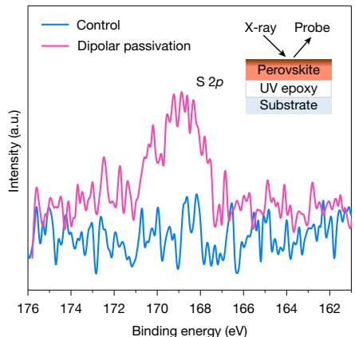  
c

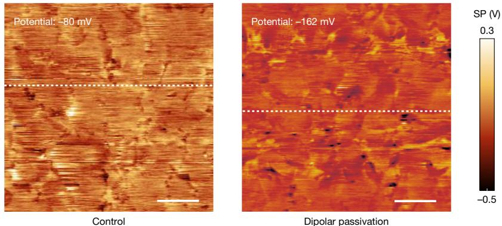  
d

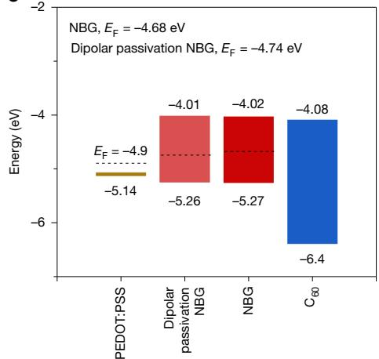  
e

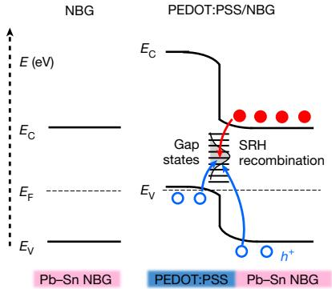  
f

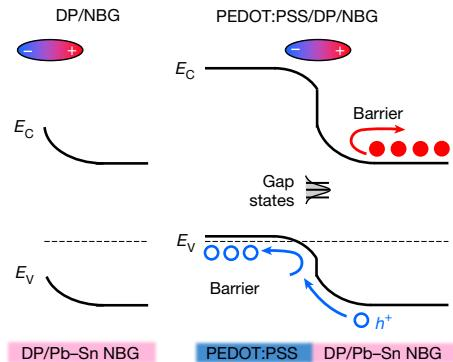  
Fig. 1 | Device structure and energy diagram of mixed Pb–Sn NBG PSCs with dipolar passivation. a, Schematic illustration of dipolar passivation at the HTL/mixed Pb–Sn perovskite interface. b, Reconstructed, backgroundsubtracted three-dimensional maps showing the distribution of Pb, Sn and SA within control and dipolar-passivation perovskite films (time-of-flight secondary ion mass spectrometry spectra of mixed Pb–Sn perovskite films with dipolar passivation; the additive accumulates at the perovskite/HTL interface). c, The S 2p XPS spectra of the control and dipolar-passivation perovskite films. Control and dipolar-passivation perovskite thin films on a glass substrate were prepared, and ultraviolet-epoxy-curable adhesive was used to remove them from the glass substrate, exposing the bottom perovskite surface for XPS testing, as shown in the inset. d, The corresponding KPFM images of the bottom surface of control and 0.5-M SA perovskite films. Compared to the control sample, the

We performed electroluminescence quantum yield analysis to evaluate the effect of dipolar passivation on the non-radiative recombination and the associated $V _ { \mathrm { o c } }$ losses in the mixed Pb–Sn perovskite device24 (all post-treated with ethane-1,2-diaminium iodide $\left( \mathsf { E D A l } _ { 2 } \right)$ ; Supplementary Note 4 and Methods). At current densities equivalent to the $J _ { \mathrm { s c } }$ under 1-sun illumination, the electroluminescence quantum

dipolar passivation sample exhibits a lower surface potential (SP). Scale bars, $1 \mu \mathrm { m }$ . e, Energy level of each layer in Pb–Sn PSCs with dipolar passivation. The energy-level alignment is referenced to the vacuum level (the black dashed lines denote the Fermi $( E _ { \mathtt { F } } )$ levels). f, Energy diagram for the control and dipolar passivation (DP) mixed Pb–Sn PSCs (the structure is shown at the bottom). The dipolar-passivation structure drives electrons away (red lines) and accelerates the drift of holes (blue lines) into the PEDOT:PSS transport layer, thereby minimizing the non-radiative recombination at the DIL. The red and blue lines denote the non-radiative recombination pathways and the directions of carrier drift, respectively. SRH, Shockley–Read–Hall recombination, which is a carrier recombination mechanism in semiconductors where nonequilibrium carriers recombine through deep-level impurities or defect states; E, energy; $E _ { \scriptscriptstyle \mathrm { C } } ,$ conduction band; $\scriptstyle { E _ { \mathrm { v } } } ,$ valence band; and $E _ { \mathrm { { F } } } ,$ Fermi level.

yield of the control and dipolar-passivation devices were $2 . 4 0 \%$ and $7 . 0 5 \%$ , respectively (Fig. 2d), corresponding to $V _ { \mathrm { o c } }$ losses of 103 mV and $7 3 \mathrm { m V }$ (Fig. 2e). As a result, the average $V _ { \mathrm { o c } }$ increased from $8 5 9 \pm 8 \mathrm { m V }$ in the control devices to $8 8 3 \pm 1 2 \mathrm { m V }$ in the dipolar-passivation-treated devices, consistent with the current density–voltage (J–V) results (Supplementary Fig. 31).

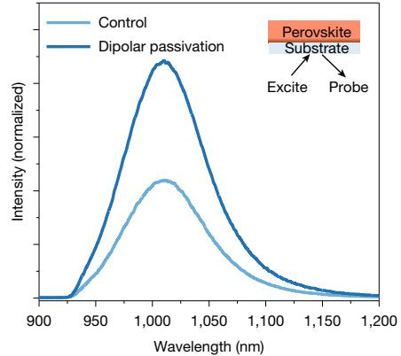  
a

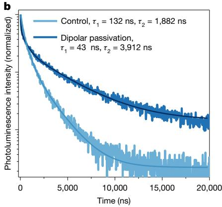

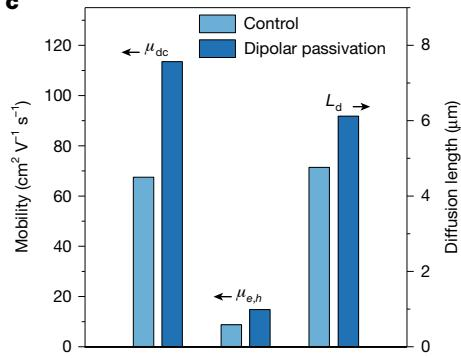

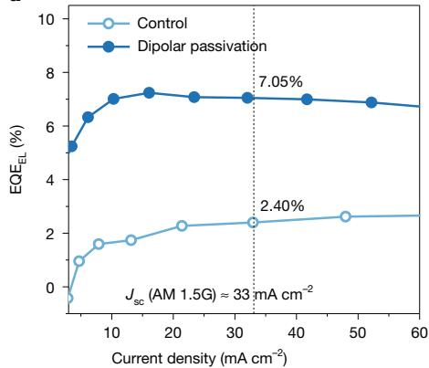  
d

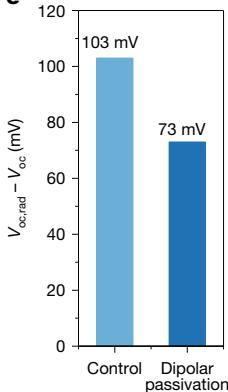  
e

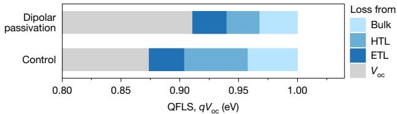  
f

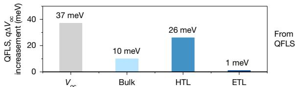

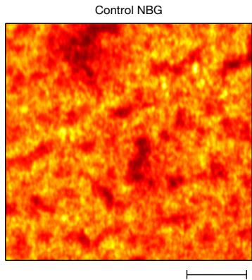  
g

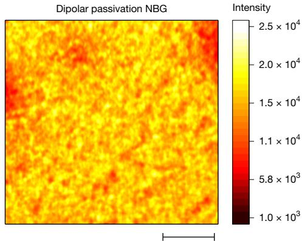

Fig. 2 | Charge-carrier dynamics at the Pb–Sn perovskite/HTL interface.   
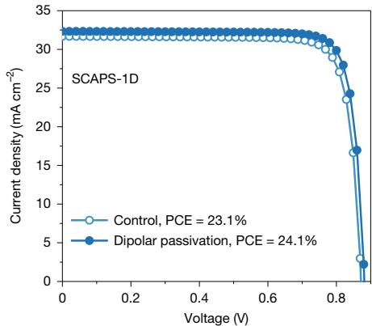  
a,b, Steady-state (a) and time-resolved (b) photoluminescence spectra of control and dipolar-passivation mixed Pb–Sn perovskite films (excitation from the glass side). c, Mobility and diffusion length of control and dipolar-passivation Pb–Sn perovskite films. $\mu _ { \mathrm { d c } }$ is the sum of the electron and hole mobilities $( \mu _ { \mathrm { d c } } { = } \mu _ { e } { + } \mu _ { h } )$ , $\mu _ { e , h }$ is the minority carrier mobility (mobility of limiting carrier type) and $L _ { \mathrm { d } }$ is the carrier diffusion length determined by the mobility of the limiting carrier type. d,e, Electroluminescence quantum efficiency versus current density (d) and $V _ { \mathrm { o c } }$ loss from non-radiative recombination (e) for the control and dipolar-passivation device. The $V _ { \mathrm { o c } }$ loss from non-radiative recombination was measured at an

We also carried out photoluminescence quantum yield measurements to assess non-radiative recombination losses on both perovskite absorber layers and multilayer functional layer stacks25 (Supplementary Note 4 and Methods). The device stacks adopt a p–i–n configuration, consisting of indium tin oxide (ITO)/PEDOT:PSS/SA/NBG perovskites/ fullerene $\left( \mathbf { C } _ { 6 0 } \right)$ /atomic layer deposition (ALD)- $S \mathsf { n O } _ { 2 } ,$ , with all samples post-treated with $\mathbf { E D A l } _ { 2 }$ (see details in Methods). The quasi-Fermi level splitting (QFLS) results are shown in Fig. 2f and Supplementary Table 2. For the perovskite films deposited on glass substrates, the QFLS values are 958 meV for the control and 968 meV for the

operating temperature of $4 5 ^ { \circ } \mathrm { C } . \mathbf { f }$ , QFLS of films deposited on glass/ITO/ PEDOT:PSS/NBG perovskite $\mathrm { \prime C } _ { 6 0 }$ without and with dipolar passivation. A summary of calculated $V _ { \mathrm { o c } }$ losses including non-radiative loss and transport loss of NBG PSCs. $\mathtt { E Q E } _ { \mathtt { E L } }$ is electroluminescence external quantum yield and q is the elementary charge. g, Zoom-in micro-photoluminescence mapping of control and dipolar-passivation films deposited on PEDOT:PSS. The microphotoluminescence mapping area was $4 0 \times 4 0 \mu \mathrm { m } ^ { 2 }$ with a step size o $5 \mu \mathrm { m }$ and was selected from the substrate centre and excitation from the glass/ITO/ PEDOT:PSS side (Supplementary Fig. 33). Scale bars, $1 0 \mu \mathrm { m }$ . h, Simulated performance of the control and dipolar-passivation mixed Pb–Sn PSCs.

dipolar-passivation-treated films (Supplementary Table 2), indicating that the dipolar-passivation treatment reduces non-radiative recombination losses. When the perovskite/PEDOT:PSS interface is included, the QFLS values decrease to 904 meV and 940 meV for the control and dipolar-passivation films, respectively (Supplementary Table 2). In the full device stack, the dipolar-passivation device showed an approximately 37-meV-lower QFLS compared with the dipolar-passivation-treated devices, consistent with the electroluminescence quantum yield measurements (Fig. 2d–f). Notably, the control device showed higher QFLS losses at both the bulk (by 10 meV)

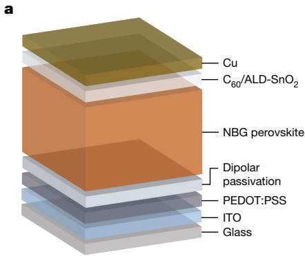

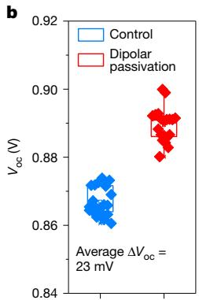

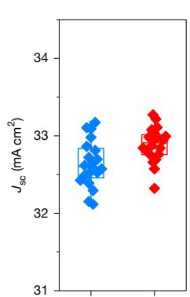

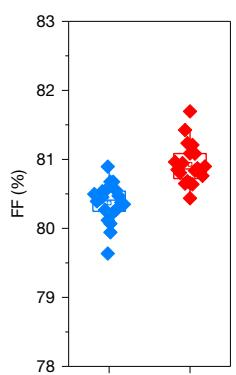

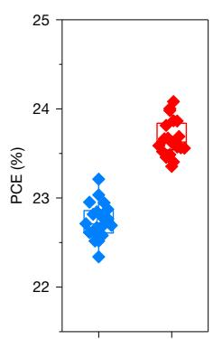

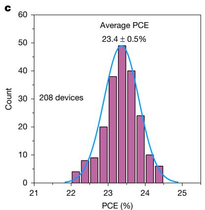

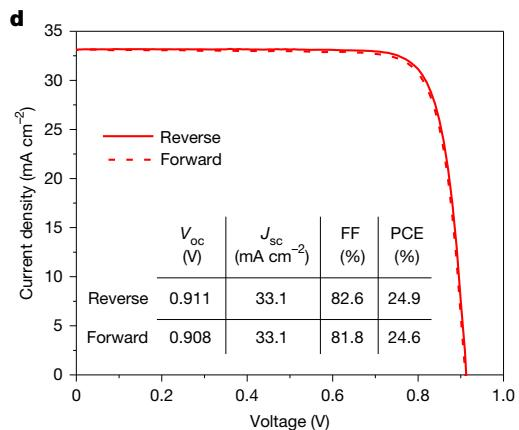

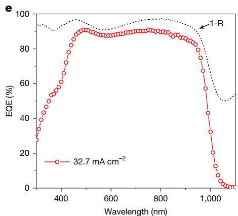  
Fig. 3 | Photovoltaic performance of mixed Pb–Sn NBG PSCs with dipolarpassivation construction. a, Schematic structure of mixed Pb–Sn PSCs with dipolar passivation. b, Comparison of photovoltaic performance between control and dipolar-passivation mixed Pb–Sn PSCs fabricated over identical runs. The average $V _ { \mathrm { o c } }$ of dipolar-passivation devices is 23 mV higher than that of control devices and the average FF is $0 . 6 \%$ higher than that of control devices (20 devices for each type with aperture area o $\mathbf { 0 . 0 4 9 c m ^ { 2 } }$ ). The standard deviation has been   
employed to assess data dispersion in statistical analyses. c, Histograms of PCEs for the dipolar-passivation solar cells (208 devices). The standard deviation has been employed to assess data dispersion in statistical analyses. d, The J–V curve of the champion dipolar-passivation solar cell under reverse and forward scans. e, EQE spectra and total absorptance (1-R) of the corresponding champion dipolar-passivation device.

and HTL interface (by 26 meV) compared with the dipolar-passivation device, whereas losses at the ETL interface were nearly identical for both (approximately 1-meV difference). These results indicate that dipolar passivation primarily enhances the HTL interface and buried mixed Pb–Sn perovskite layer quality.

To better understand the origins of these QFLS differences, we examined the microstructural and optical-electrical properties of the interfaces. Scanning electron microscopy images show that dipolar passivation does not notably affect the top surface morphology (Supplementary Fig. 32). However, zoom-in micro-photoluminescence mapping analysis indicates a notable improvement in non-radiative recombination at the bottom interface (Fig. 2g and Supplementary Fig. 33). Furthermore, XPS analysis revealed a pronounced interaction between dipolar passivation and the B-site metal cations of perovskite26 (Supplementary Fig. 34). The introduction of dipolar-passivation molecules promoted denser perovskite crystallization at the buried interface and enhanced the (100) plane orientation27,28 (Supplementary Figs. 35–37). Therefore, the $V _ { \mathrm { o c } }$ loss reduction across the entire device stack can be primarily attributed to enhanced interfacial quality at the perovskite/PEDOT:PSS interface, further corroborated by drive-level capacitance profiling and time-resolved photoluminescence measurements29 (Supplementary Figs. 38 and 39).

We used the SCAPS-1D simulation tool (one-dimensional (1D) simulation enables the modelling of physical phenomena such as charge transport, recombination processes and light absorption within solar cells), which is based on fundamental equations, including the Poisson equation and the continuity equations for electrons and holes30, to investigate the effect of dipolar passivation on the photovoltaic

performance of mixed Pb–Sn PSCs (see detailed simulation parameters and methods in Supplementary Figs. 40 and 41 and Supplementary Table 3). In the simulations, we incorporated the effects of a low-defect buried interface and optimized ohmic contact configuration introduced by dipolar passivation. By systematically varying the trap density and energy levels, we explore their influence on key device characteristics. SCAPS-1D simulation shows that the DIL reduces $J _ { \mathrm { s c } }$ and $V _ { \mathrm { o c } }$ in control devices, with the extent of degradation depending on the DIL thickness. In contrast, the dipolar-passivation-treated devices show substantially suppressed interfacial non-radiative recombination losses, resulting in improved $V _ { \mathrm { o c } } , J _ { \mathrm { s c } }$ and FF in mixed Pb–PSCs (Fig. 2h).

# Photovoltaic performance of Pb–Sn PSCs

To evaluate the impact of dipolar passivation on device performance, we fabricated mixed Pb–Sn PSCs with and without dipolar-passivation treatment (Fig. 3a and Methods). For the dipolar-passivation-treated devices, optimal photovoltaic performance was achieved using a dipolar-passivator concentration of $0 . 5 \mathrm { m g } \mathrm { m l } ^ { - 1 }$ (Supplementary Fig. 42 and Supplementary Table 4). Notably, $V _ { \mathrm { o c } }$ loss at the perovskite/ETL interface is also critical. To mitigate this, we applied an $\mathsf { E D A l } _ { 2 }$ post-treatment, aiming to reduce non-radiative recombination losses at this interface20,31 (Supplementary Figs. 43 and 44). We compared the photovoltaic parameters of control and dipolar-passivation devices over multiple fabrication runs. The dipolar-passivation-treated devices showed a noticeable improvement in photovoltaic performance, with an average improvement of $2 3 \mathsf { m V }$ in $V _ { \mathrm { o c } } , 0 . 6 \%$ in FF and $1 \%$ in PCE compared with the control devices (Fig. 3b). Overall, dipolar-passivation

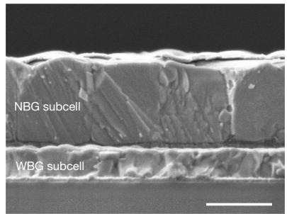  
a

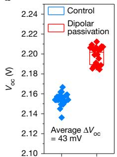  
b

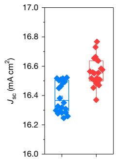

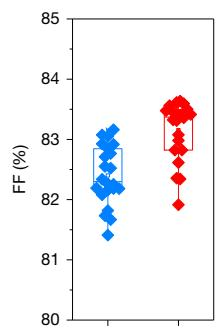

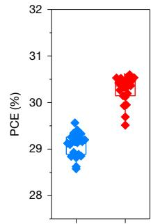

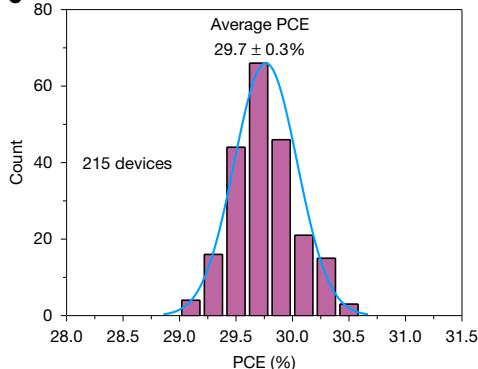  
c

  
d

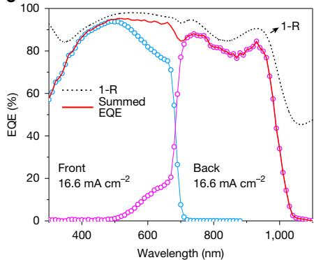  
e   
Fig. 4 | Photovoltaic performance of all-perovskite tandem solar cells with dipolar passivation. a, Cross-sectional scanning electron microscopy image of the all-perovskite tandem solar cell. Scale bar, $1 \mu \mathrm { m }$ . b, Comparison of photovoltaic performance between control and dipolar-passivation tandem solar cells processed in the same runs (22 devices for each type). The average $V _ { \mathrm { o c } }$ of dipolar-passivation devices is $4 3 \mathsf { m V }$ higher than that of control devices and

devices showed a considerably higher average PCE of $2 3 . 9 \pm 0 . 3 \%$ $( 2 2 . 6 \pm 0 . 2 \%$ for the control; Supplementary Table 4) with a lower dark saturation-current density and a smaller ideality factor compared with the control (Supplementary Figs. 45 and 46). The observed reduction in ideality factor and dark current in dipolar-passivation-treated devices strongly indicates suppressed non-radiative recombination, which contributes to higher shunt resistance $R _ { \mathrm { S H } } ,$ FF and $V _ { \mathrm { o c } }$ (refs. 32,33; Fig. 3b and Supplementary Table 4).

To evaluate the reproducibility and statistical distribution of device performance, we fabricated over 208 mixed Pb–Sn PSCs. The corresponding PCE histogram is shown in Fig. 3c. The best-performing dipolar-passivation device achieved a PCE of $2 4 . 9 \%$ (stabilized $2 4 . 7 \%$ ; Supplementary Fig. 47), with a $V _ { \mathrm { o c } }$ of 0.911 $\ V , J _ { \mathrm { s c } }$ of $3 3 . 1 \mathsf { m A } \mathsf { c m } ^ { - 2 }$ and FF of $8 2 . 6 \%$ under reverse scan $( \mathrm { P C E } = 2 4 . 7 \%$ under forward scan; Fig. 3d), which represents one of the highest reported PCEs for the mixed Pb–Sn PSCs so far. The external quantum yield (EQE) spectrum of the champion device is presented in Fig. 3e, showing an integrated photocurrent value of $3 2 . 7 \mathsf { m A c m } ^ { - 2 }$ , in good agreement with the J–V characterization. Moreover, the devices show no significant PCE degradation after over 1,000 hours in a nitrogen glovebox in the dark without encapsulation (Supplementary Fig. 48). These results suggest that dipolar passivation suppressed non-radiative carrier recombination while maintaining good electrical contact quality.

# All-perovskite tandem solar cells

The buried interfaces within the NBG subcells have a crucial role in the performance of all-perovskite tandem solar cells, as they are often associated with severe non-radiative carrier recombination and hindered carrier extraction. However, the low-temperature annealing required for PEDOT:PSS in the interconnection layer of the tandem cell deteriorates its electrical properties34 (Supplementary Fig. 49), resulting in further

the average FF is $0 . 8 \%$ higher than that of control devices. The standard deviation has been employed to assess data dispersion in statistical analyses. c, Histograms of PCEs for the dipolar-passivation tandem solar cells (215 devices). The standard deviation has been employed to assess data dispersion in statistical analyses. d,e, J–V (d) and EQE (e) curves of the champion tandem device with dipolar passivation.

losses in $V _ { \mathrm { o c } }$ and FF compared with the superposition of each singlejunction subcell (Supplementary Fig. 50 and Supplementary Table 5).

To evaluate these photovoltaic performance losses, we fabricated single-junction NBG PSCs using the same method as for the tandem cell, serving as a benchmark (Methods). We observed that control tandem devices prepared with the low-temperature annealed PEDOT:PSS showed a lower $V _ { \mathrm { o c } } , J _ { \mathrm { s c } }$ and FF (Supplementary Fig. 51 and Supplementary Table 6). In contrast, the dipolar-passivation-treated NBG devices showed minimal degradation in tandem photovoltaic performance, indicating that the incorporation of dipolar passivation makes the NBG subcell less sensitive to the crystal quality of the PEDOT:PSS (Supplementary Fig. 51).

To investigate the impact of dipolar passivation in the NBG subcell on the overall photovoltaic performance of tandem devices, we fabricated all-perovskite tandem solar cells with and without dipolar passivation (Methods). A self-assembled monolayer (SAM) was introduced to modify the nickel oxide (NiO) HTL, effectively reducing surface recombination35,36 and enhancing the performance of the WBG subcells. These WBG perovskite films had the composition of $\mathbf { F A } _ { 0 . 8 } \mathbf { C } s _ { 0 . 2 } \mathbf { P } \mathbf { b } ( \mathbf { I } _ { 0 . 6 2 } \mathbf { B } \mathbf { r } _ { 0 . 3 8 } ) _ { 3 }$ (bandgap of approximately 1.78 eV). The WBG solar cells showed a PCE of $2 0 . 5 \%$ , with a $V _ { \mathrm { o c } }$ of $1 . 3 2 9 \mathrm { V } , J _ { \mathrm { s c } }$ of $1 8 . 4 \mathrm { m A c m } ^ { - 2 }$ and FF of $8 3 . 8 \%$ (Supplementary Fig. 52). To achieve optimal current density matching between the subcells, the thicknesses of WBG and NBG absorber layers for the front and back subcells were optimized to be about 380 nm and about $1 { , } 2 0 0 \mathsf { n m }$ (Fig. 4a and Supplementary Fig. 53), respectively15.

A comparison of the photovoltaic parameters between control and dipolar-passivation-treated all-perovskite tandem solar cells revealed that dipolar-passivation devices showed significantly improved FF and $V _ { \mathrm { o c } }$ (Fig. 4b and Supplementary Table 7). The average PCE of dipolarpassivation tandem devices thereby increased to $3 0 . 3 \pm 0 . 3 \%$ (versus $2 9 . 1 \pm 0 . 2 \%$ for control devices). Notably, the average $V _ { \mathrm { o c } }$ of the dipolarpassivation tandem devices was approximately $5 0 \mathrm { m V }$ higher than that

# Article

of the control devices, exceeding an approximately 30-mV $V _ { \mathrm { o c } }$ difference observed between the control and dipolar-passivation singlejunction devices, which is consistent with the $V _ { \mathrm { o c } }$ loss caused by the change in PEDOT:PSS preparation process (Supplementary Fig. 51 and Supplementary Table 6). To assess reproducibility, we fabricated 282 dipolar-passivation-treated tandem devices (Fig. 4c), which showed a narrow PCE distribution. The champion tandem cell showed minimal hysteresis and achieved a reverse-scan PCE of $3 0 . 6 \%$ (with a $V _ { \mathrm { o c } }$ of 2.211 V, $J _ { \mathrm { s c } }$ of $1 6 . 6 \mathsf { m A c m } ^ { - 2 }$ and FF of $8 3 . 4 \%$ ). The stabilized PCE was measured at $3 0 . 2 \%$ (Fig. 4d and Supplementary Fig. 54). The integrated $J _ { \mathrm { s c } }$ values of the WBG and NBG subcells from the EQE spectra were 16.6 mA cm−2 and $1 6 . 6 \mathsf { m A c m } ^ { - 2 }$ (Fig. 4e), respectively, in good agreement with the $J _ { \mathrm { s c } }$ determined from J–V measurements. We sent a tandem solar cell to an accredited independent photovoltaic calibration laboratory ( JET) for the third-party independent measurements. The tandem device delivered a certified stabilized PCE of $3 0 . 1 \%$ with an area of $0 . 0 4 9 \mathsf { c m } ^ { 2 }$ (Supplementary Fig. 56), included in the recently published Solar Cell Efficiency Tables (version 64)13.

We also fabricated tandem cells with an area of $1 . 0 5 \mathrm { c m } ^ { 2 }$ . The bestperforming large-area device showed a PCE of up to $2 9 . 6 \%$ in the lab with a good homogeneity and current matching (aperture area of $\cdot 1 . 0 5 \mathrm { c m } ^ { 2 }$ ; Supplementary Figs. 57–59). This performance was confirmed by an independent certification laboratory ( JET), which measured a stabilized PCE of $2 9 . 6 \%$ with aperture area of $1 . 0 7 \mathrm { c m } ^ { 2 }$ (Supplementary Fig. 60). Notably, Pb–Sn PSCs with PEDOT:PSS HTLs show considerable parasitic absorption losses, resulting in lower $J _ { \mathrm { s c } }$ compared with devices utilizing ITO nanocrystals/SAM HTLs37 (Supplementary Fig. 61). Further mitigation of $J _ { \mathrm { s c } }$ losses induced by HTL parasitic absorption represents a key direction for advancing the PCE of all-perovskite tandem solar cells.

We further evaluated the operational stability of encapsulated tandem devices in ambient air, using maximum power point tracking under a simulated 1-sun illumination intensity. The dipolar-passivation-treated tandem device showed promising operational stability, retaining $87 \%$ of its initial PCE after 1,025 hours of continuous maximum power point operation, and outperformed the unpassivated device (Supplementary Fig. 62). We also investigated the thermal stability of the tandem devices. After 216 hours of thermal stress, we observed that degradation proceeded more slowly in dipolar-passivation-based devices than in control devices (Supplementary Fig. 63). Notably, within the first 50 hours of thermal ageing, the dipolar-passivation device showed a much smaller drop in PCE, which is probably owing to the amphoteric nature of dipolar-passivation molecules mitigating the detrimental impact of PEDOT:PSS acidity on device stability38,39. Moving forward, integrating dipolar passivation with advanced stabilization strategies and deeper investigation into degradation mechanisms will be critical for further improving the long-term stability of tandem devices.

# Online content

Any methods, additional references, Nature Portfolio reporting summaries, source data, extended data, supplementary information, acknowledgements, peer review information; details of author contributions and competing interests; and statements of data and code availability are available at https://doi.org/10.1038/s41586-025-09773-7.

1. Hu, S. et al. Optimized carrier extraction at interfaces for $2 3 . 6 \%$ efficient tin–lead perovskite solar cells. Energy Environ. Sci. 15, 2096–2107 (2022).   
2. Gao, H. et al. Homogeneous crystallization and buried interface passivation for perovskite tandem solar modules. Science 383, 855–859 (2024).   
3. Chen, C. et al. Arylammonium-assisted reduction of the open-circuit voltage deficit in wide-bandgap perovskite solar cells: the role of suppressed ion migration. ACS Energy Lett. 5, 2560–2568 (2020).   
4. La-Placa, M. G. et al. Vacuum-deposited 2D/3D perovskite heterojunctions. ACS Energy Lett. 4, 2893–2901 (2019).   
5. Park, S. M., Abtahi, A., Boehm, A. M. & Graham, K. R. Surface ligands for methylammonium lead iodide films: surface coverage, energetics, and photovoltaic performance. ACS Energy Lett. 5, 799–806 (2020).

6. Zhu, J. et al. Self-assembled hole-selective contact for efficient Sn–Pb perovskite solar cells and all-perovskite tandems. Nat. Commun. 16, 240 (2025).   
7. Lin, R. et al. Monolithic all-perovskite tandem solar cells with $2 4 . 8 \%$ efficiency exploiting comproportionation to suppress $\mathsf { S n } ( \mathsf { I I } )$ oxidation in precursor ink. Nat. Energy 4, 864–873 (2019).   
8. Tong, J. et al. Carrier control in Sn–Pb perovskites via 2D cation engineering for allperovskite tandem solar cells with improved efficiency and stability. Nat. Energy 7, 642–651 (2022).   
9. Li, Z. et al. Cost analysis of perovskite tandem photovoltaics. Joule 2, 1559–1572 (2018).   
10. Albrecht, S. & Rech, B. Perovskite solar cells: on top of commercial photovoltaics. Nat. Energy 2, 16196 (2017).   
11. Jošt, M., Kegelmann, L., Korte, L. & Albrecht, S. Monolithic perovskite tandem solar cells: a review of the present status and advanced characterization methods toward $30 \%$ efficiency. Adv. Energy Mater. 10, 1904102 (2020).   
12. Luo, D., Su, R., Zhang, W., Gong, Q. & Zhu, R. Minimizing non-radiative recombination losses in perovskite solar cells. Nat. Rev. Mater. 5, 44–60 (2020).   
13. Green, M. A. et al. Solar cell efficiency tables (Version 64). Prog. Photovolt. Res. Appl. 32, 425–441 (2024).   
14. Lin, R. et al. All-perovskite tandem solar cells with 3D/3D bilayer perovskite heterojunction. Nature 620, 994–1000 (2023).   
15. Lin, R. et al. All-perovskite tandem solar cells with improved grain surface passivation. Nature 603, 73–78 (2022).   
16. Canil, L. et al. Tuning halide perovskite energy levels. Energy Environ. Sci. 14, 1429–1438 (2021).   
17. Xia, J., Sohail, M. & Nazeeruddin, M. K. Efficient and stable perovskite solar cells by tailoring of interfaces. Adv. Mater. 35, 2211324 (2023).   
18. Tao, J. et al. Suppressing non-radiative recombination for efficient and stable perovskite solar cells. Energy Environ. Sci. 18, 509–544 (2024).   
19. Thiesbrummel, J. et al. Ion-induced field screening as a dominant factor in perovskite solar cell operational stability. Nat. Energy 9, 664–676 (2024).   
20. Chen, C. Y., Harata, F., Murdey, R. & Wakamiya, A. Enhanced power conversion efficiency in tin halide perovskite solar cells with zinc iodide interlayers. ACS Energy Lett. 9, 6039–6046 (2024).   
21. Krogmeier, B., Staub, F., Grabowski, D., Rau, U. & Kirchartz, T. Quantitative analysis of the transient photoluminescence of $\mathsf { C H } _ { 3 } \mathsf { N H } _ { 3 } \mathsf { P b l } _ { 3 } / \mathsf { P C } _ { 6 1 } \mathsf { B M }$ heterojunctions by numerical simulations. Sustain. Energy Fuels 2, 1027–1034 (2018).   
22. Wu, Y. et al. Perovskite solar cells with $1 8 . 2 1 \%$ efficiency and area over 1 cm2 fabricated by heterojunction engineering. Nat. Energy 1, 16148 (2016).   
23. Li, J. et al. Charge generation dynamics in organic photovoltaic blends under one-sunequivalent illumination detected by highly sensitive terahertz spectroscopy. J. Am. Chem. Soc. 146, 20312–20322 (2024).   
24. Rau, U. Reciprocity relation between photovoltaic quantum efficiency and electroluminescent emission of solar cells. Phys. Rev. B 76, 085303 (2007)   
25. Warby, J. et al. Mismatch of quasi–Fermi level splitting and $V _ { \mathrm { o c } }$ in perovskite solar cells. Adv. Energy Mater. 13, 2303135 (2023).   
26. Qin, Z. et al. Zwitterion-functionalized $\mathsf { S n O } _ { 2 }$ substrate induced sequential deposition of black-phase $\mathsf { F A P b l } _ { 3 }$ with rearranged $\mathsf { P b l } _ { 2 }$ residue. Adv. Mater. 34, 1–9 (2022).   
27. Li, M. et al. High-efficiency perovskite solar cells with improved interfacial charge extraction by bridging molecules. Adv. Mater. 36, 2406532 (2024).   
28. Cai, W. et al. Interlayer reinforcement for improved mechanical reliability for wearable perovskite solar cells. Energy Environ. Sci. 17, 8162–8173 (2024).   
29. Ni, Z., Xu, S. & Huang, J. Response to Comment on “Resolving spatial and energetic distributions of trap states in metal halide perovskite solar cells”. Science 371, 1352–1358 (2021).   
30. Burgelman, M., Nollet, P. & Degrave, S. Modelling polycrystalline semiconductor solar cells. Thin Solid Films 361, 527–532 (2000).   
31. Hu, S. et al. Synergistic surface modification of tin–lead perovskite solar cells. Adv. Mater. 35, 2208320 (2023).   
32. Grabowski, D., Liu, Z., Schöpe, G., Rau, U. & Kirchartz, T. Fill factor losses and deviations from the superposition principle in lead halide perovskite solar cells. Sol. RRL 6, 2200507 (2022).   
33. Workman, M., Chen, D. Z. & Musa, S. M. Ideality factor based computational analysis of perovskite solar cells. In 2021 IEEE Conference on Technologies for Sustainability (SusTech) https://doi.org/10.1109/SusTech51236.2021.9467471 (IEEE, 2021).   
34. Liu, Y. et al. Alcohol solvent treatment of PEDOT:PSS hole transport layer for optimized inverted perovskite solar cells. J. Mater. Sci. Mater. Electron. 31, 12765–12774 (2020).   
35. Li, L. et al. Flexible all-perovskite tandem solar cells approaching $2 5 \%$ efficiency with molecule-bridged hole-selective contact. Nat. Energy 7, 708–717 (2022).   
36. Li, C. et al. Diamine chelates for increased stability in mixed Sn–Pb and all-perovskite tandem solar cells. Nat. Energy 9, 1388–1396 (2024).   
37. Liu, C. et al. Efficient all-perovskite tandem solar cells with low-optical-loss carbazolyl interconnecting layers. Angew. Chem. Int. Ed. 135, e202313374 (2023).   
38. Choi, H. et al. Conjugated polyelectrolyte hole transport layer for inverted-type perovskite solar cells. Nat. Commun. 6, 7348 (2015).   
39. Chen, L. et al. Incorporating potassium citrate to improve the performance of tin–lead perovskite solar cells. Adv. Energy Mater. 13, 2301218 (2023).

Publisher’s note Springer Nature remains neutral with regard to jurisdictional claims in published maps and institutional affiliations.

Springer Nature or its licensor (e.g. a society or other partner) holds exclusive rights to this article under a publishing agreement with the author(s) or other rightsholder(s); author self-archiving of the accepted manuscript version of this article is solely governed by the terms of such publishing agreement and applicable law.

$\circledcirc$ The Author(s), under exclusive licence to Springer Nature Limited 2025

# Methods

# Materials

All materials were used as received without further purification. The organic halide salts formamidinium iodide (FAI), formamidinium bromide (FABr), methylammonium iodide (MAI), 4-trifluoromethylphenylammonium chloride (CF3-PACl) and ethane-1,2-diaminium iodide $\left( \mathsf { E D A l } _ { 2 } \right)$ were purchased from GreatCell Solar Materials. PEDOT:PSS aqueous solution (Al 4083) was purchased from Heraeus Clevios. SAM: (2-(9H-carbazol-9-yl)ethyl)phosphonic acid (2PACz), [2-(3,6-dimethoxy-9H-carbazol-9-yl)ethyl]phosphonic acid (MeO-2PACz); lead iodide $( \mathsf { P b l } _ { 2 }$ , $9 9 . 9 9 \%$ ), cesium iodide (CsI, $9 9 . 9 \%$ ) and cesium bromide (CsBr, $9 9 . 9 \%$ ) were purchased from TCI Chemicals. tin iodide $( \mathsf { S n l } _ { 2 } ,$ $9 9 . 9 9 9 \%$ ), tin fluoride (SnF2, 99%), SA $( 9 9 \% )$ , N,N-dimethylformamide (DMF, $9 9 . 8 \%$ anhydrous), dimethyl sulfoxide (DMSO, $9 9 . 9 \%$ anhydrous), ethyl acetate $( 9 9 . 8 \%$ anhydrous), anisole $9 9 . 8 \%$ anhydrous), toluene $( 9 9 . 8 \%$ anhydrous) and propan-2-ol (IPA; $9 9 . 8 \%$ anhydrous) were purchased from Sigma-Aldrich. $\mathbf { C } _ { 6 0 }$ was purchased from Nano-C. 2,9-dimethyl-4,7-diphenyl-1,10-phenanthroline (BCP, $5 9 9 \%$ sublimed) was purchased from Xi’an Polymer Light Technology.

# Perovskite precursor solution

NBG $\mathsf { F A } _ { 0 . 7 } \mathsf { M A } _ { 0 . 3 } \mathsf { P b } _ { 0 . 5 } \mathsf { S n } _ { 0 . 5 } \mathsf { l } _ { 3 }$ perovskite. The precursor solution (2.4 M) was prepared in mixed solvents of DMF and DMSO with a volume ratio of 2:1. The molar ratios for FAI/MAI and $\mathrm { P b l } _ { 2 } / \mathsf { S n l } _ { 2 }$ were 0.7:0.3 and 0.5:0.5, respectively. The molar ratio of $( \mathrm { F A I + M A I } ) / ( \mathrm { P b I } _ { 2 } + \mathrm { S n l } _ { 2 } )$ was 1:1. $\mathsf { S n F } _ { 2 }$ $( 1 0 \mathrm { m o l \% }$ relative to $\mathsf { S n l } _ { 2 }$ ) was added in the precursor solution. The precursor solution was stirred at room temperature for 2 h. Tin powder $( 5 \mathrm { { m g } \mathrm { { m l } ^ { - 1 } ) } }$ ) was added in the precursor to reduce ${ \mathsf { S n } } ^ { 4 + }$ in the precursor solution and to improve film uniformity. For the control solution with passivating ligands CF3-PACl $( 0 . 3 \mathrm { m o l \% } )$ was added to the precursor solution at their optimized concentrations. The precursor solution was filtered through $0 . 2 2 \cdot \mu \mathrm { m }$ polytetrafluoroethylene (PTFE) membrane before making perovskite films.

WBG $\mathbf { F A } _ { 0 . 8 } \mathbf { C } s _ { 0 . 2 } \mathbf { P } \mathbf { b } ( \mathbf { I } _ { 0 . 6 2 } \mathbf { B } \mathbf { r } _ { 0 . 3 8 } ) _ { 3 }$ perovskite. The precursor solution (1.2 M) was prepared from 6 precursors dissolved in mixed solvents of DMF and DMSO with a volume ratio of 4:1. The molar ratios for FAI/ FABr/CsI/CsBr and $\mathsf { P b I } _ { 2 } / \mathsf { P b B r } _ { 2 }$ were 0.48:0.32:0.12:0.08 and 0.62:0.38, respectively. The molar ratio of $\mathrm { ( F A I + F A B r + C s I + C s B r ) / ( P b I _ { 2 } + P b B r _ { 2 } ) }$ $\left( \mathbf { P b } \mathbf { I } _ { 2 } + \mathbf { P b } \mathbf { B r } _ { 2 } \right)$ was 1:1. The precursor solution was stirred at $5 0 ^ { \circ } \mathrm { C }$ for 2 h and then filtered through $0 . 2 2 \cdot \mu \mathrm { m }$ PTFE membrane before use.

Dipolar-passivation solution. SA solution was prepared in mixed solvents of DMF and DMSO with a volume ratio of 1:1. The precursor solution was stirred at $8 0 ^ { \circ } \mathrm { C }$ temperature for 5 h. Then, the precursor solution was filtered through $0 . 2 2 \cdot \mu \mathrm { m }$ PTFE membrane before making perovskite films.

EDAI top passivation solution. EDAI solution $( 0 . 5 \mathrm { m g } \mathrm { m l ^ { - 1 } } )$ ) was prepared in IPA. The precursor solution was stirred at room temperature for 2 h. Then the precursor solution was filtered through $0 . 2 2 \cdot \mu \mathrm { m }$ PTFE membrane before making perovskite films.

# Device fabrication

Dipolar-passivation mixed Pb–Sn perovskite solar cells. The pre-patterned ITO glass substrates were sequentially cleaned using acetone and isopropanol. Although ITO nanocrystals (NC)/SAM (IC-CH) HTLs show lower parasitic absorption than conventional PEDOT:PSS HTLs—enabling higher $J _ { \mathrm { s c } }$ in Pb–Sn perovskite devices—hybrid formamidinium/ methylammonium (FA/MA)-based Pb–Sn PSCs using ITO NC/SAM HTLs nevertheless suffer significant $V _ { \mathrm { o c } }$ and FF losses. This constitutes an ongoing challenge for which effective solutions remain lacking. Consequently, we retained PEDOT:PSS as the HTL to mitigate these $V _ { \mathrm { o c } }$ and FF losses. PEDOT:PSS was spin-coated on ITO substrates at 4,000 rpm for 30 s and annealed on a hotplate at $1 5 0 ^ { \circ } \mathrm { C }$ for 20 min in ambient air. After cooling, we transferred the substrates immediately to a nitrogen-filled glovebox for the deposition of perovskite films. SA was spin-coated

on PEDOT:PSS at 4,000 rpm for 30 s and annealed on a hotplate at $1 0 0 ^ { \circ } \mathrm { C }$ for 2 min (control device without SA layer). After cooling, the perovskite films (2.4 M) were deposited with two-step spin-coating procedures: (1) 1,000 rpm for 10 s with an acceleration of $2 0 0 \ r { \mathsf { p m s } } ^ { - 1 }$ and (2) 4,000 rpm for 40 s with a ramp-up of 1,000 rpm s−1. Ethyl acetate $( 3 0 0 \mu \mathrm { l } )$ ) was dropped on the spinning substrate during the second spincoating step at 20 s before the end of the procedure. The substrates were then transferred on a hotplate and heated at $1 0 0 ^ { \circ } \mathrm { C }$ for 10 min. After cooling to room temperature, $\mathsf { E D A l } _ { 2 }$ was spin-coated on perovskite film at 4,000 rpm for 30 s and annealed on a hotplate at $1 0 0 ^ { \circ } \mathrm { C }$ for 2 min. The substrates were transferred to the evaporation system. Finally, $\mathsf C _ { 6 0 } ( 2 0 \mathsf { n m } ) / \mathsf { B C P } ( 7 \mathsf { n m } )$ or ALD- $\mathrm { \cdot S n O _ { 2 } ( 1 0 n m ) / C u ( 1 5 0 n m ) }$ were sequentially deposited on top of perovskite by thermal evaporation (Beijing Technol Science).

All-perovskite tandem solar cells. We fabricated all-perovskite tandem solar cells with a device configuration of glass/ITO/NiO/SAM/WBG perovskite $\mathrm { \Delta / C _ { 6 0 } / A L D \cdot S n O _ { 2 } / A u / }$ /PEDOT:PSS/NBG perovskite $/ { \bf C } _ { 6 0 } / { \bf B C P }$ or ALD/ Cu. NiO nanocrystal $( 1 5 \mathsf { m g m l ^ { - 1 } }$ in water) layers were first spin-coated on ITO substrates at 3,000 rpm for 30 s and annealed on a hotplate at $1 3 0 ^ { \circ } \mathrm { C }$ for 30 min in air. NiO nanocrystals were synthesized according to a previous report40. After cooling, the substrates were immediately transferred to the glovebox. SAM (2PACz and MeO-2PACz with the same concentration (1 mM in IPA) were mixed with volume ratios of 75:25) without doping was spin-coated on the NiO film at 4,000 rpm for 20 s and was then annealed at $1 0 0 ^ { \circ } \mathrm { C }$ for 3 min. The WBG perovskite films were deposited on top of SAM modified NiO with two-step spin-coating procedures. The first step was 2,000 rpm for 10 s with an acceleration of $2 0 0 \mathsf { r p m s ^ { - 1 } }$ . The second step was 6,000 rpm for 40 s with a ramp-up of 2,000 rpm s−1. Anisole $( 1 2 0 \mu \mathrm { l } )$ was dropped on the spinning substrate during the second spin-coating step at 20 s before the end of the procedure. The substrates were then transferred on a hotplate and heated at $1 0 0 ^ { \circ } \mathrm { C }$ for 5 min and $8 5 ^ { \circ } \mathrm { C }$ for 15 min. For the WBG perovskite posttreatment, $\boldsymbol { \mathrm { E D A l } _ { 2 } }$ (1 mg ml−1) in mixed IPA/toluene (1:1 volume ratio) and 2-(4-fluorophenyl)ethan-1-aminium chloride (4F-PEACl, 1 mg ml−1) in IPA were prepared and deposited sequentially. The spin speed was set to 5,000 rpm for 20 s. Then $5 0 \mu \mathrm { l }$ of the treatment solution was dropped onto the perovskite film once the spin speed reached its maximum. The perovskite films were then annealed at $1 0 0 ^ { \circ } \mathrm { C }$ for 5 min following the spin-coating of each post-treatment solution. After cooling to room temperature, the substrates were transferred to the evaporation system, and 20-nm-thick $\mathbf { C } _ { 6 0 }$ film was subsequently deposited on top by thermal evaporation at a rate of $0 . 2 \mathring \mathbf { A } \mathbf { s } ^ { - 1 }$ . The substrates were then transferred to the ALD system (Veeco Savannah S200) to deposit $2 0 \mathsf { n m } \mathsf { S n O } _ { 2 }$ at low temperatures (typically $1 0 0 ^ { \circ } \mathrm { C }$ ) using precursors of tetrakis (dimethylamino) tin (IV) $( 9 9 . 9 9 9 9 \%$ , Nanjing Ai Mou Yuan Scientific Equipment) and deionized water. After ALD deposition, the substrates were transferred back to the thermal evaporation system to deposit an ultrathin layer of Au clusters layer (approximately $\phantom { - } 0 . 4 \mathsf { n m }$ ) on ALD- $S _ { Ḋ } \mathbf Ḋ 0 Ḍ Ḍ _ { 2 }$ . PEDOT:PSS layers were spin-cast on top of front cells and annealed in air at $1 2 0 ^ { \circ } \mathrm { C }$ for 20 min. After the substrates had cooled, we immediately transferred the substrates to a nitrogen-filled glovebox for the deposition of control and dipolar-passivation NBG perovskite films with identical procedures used for the single-junction devices. Finally, $2 0 \mathrm { n m C } _ { 6 0 } ,$ , 7 nm BCP and 150 nm Cu films were sequentially deposited by thermal evaporation (Beijing Technol Science). Details on the deposition of ALD- $\cdot \mathsf { S n O } _ { 2 }$ layers can be found in our previous work7 .

To minimize $J _ { \mathrm { s c } }$ reduction loss owing to bandgap widening, the WBG subcell was fabricated without using the strategy of two-dimensional passivators in the antisolvent from our previous work41, resulting in better current matching between the subcells in the tandem device (Supplementary Fig. 55).

Dipolar-passivation molecule. The aromatic benzene ring is a planar hexagonal ring composed of $\cdot s p ^ { 2 }$ -hybridized carbon atoms, featuring a delocalized $\pi$ -electron conjugated system. It has a rigid structure with high rotational resistance. Compared with the flexible structure

# Article

of aliphatic alkyl chains, the rigidity of the aromatic benzene rings offers advantages for dipole orientation control. Therefore, in this work, the aromatic benzene ring-based SA was preferentially selected as the dipolar-passivation molecule.

A universally applicable approach for dipole passivation requires the careful selection of small dipolar-passivation molecules to avoid insulation shielding. The molecular design should incorporate passivating groups that anchor to the perovskite side, enabling both effective defect passivation and stable anchoring. Simultaneously, substrate-anchoring groups should be introduced to ensure robust interaction with the underlying substrate, thereby dictating the overall dipole orientation. Ultimately, the desired dipolar orientation can be realized by leveraging the electronegativity difference between the perovskite-passivating groups and the substrate-anchoring groups.

It should be noted that the oxidation of $\mathsf { S } \mathsf { n } ^ { 2 + }$ to ${ \mathsf { S n } } ^ { 4 + }$ in perovskite films generates abundant Sn vacancies, which are strongly associated with pronounced p-type self-doping. Such heavy doping introduces deep-level defects that exacerbate non-radiative recombination and accelerate structural degradation, ultimately compromising device photovoltaic performance. In contrast to vacancy-induced self-doping, dipole passivation enables field passivation by establishing controlled electric fields at semiconductor surfaces/interfaces, while simultaneously reducing interfacial defects. This built-in field effectively repels charge carriers from the DIL, thereby reducing interfacial non-radiative recombination losses and enhancing photovoltaic performance.

# AIMD simulations

AIMD simulations were carried out using the CP2K package42 within the constant-volume and constant-temperature (NVT) ensemble. The temperature was controlled with Nosé–Hoover thermostat43 at room temperature (300 K). The simulations were performed with a time step of 1.0 fs for a total of 10 ps to ensure structural relaxation and thermal equilibration. The PBE-D3 functional was used with double-zeta basis sets (DZVP-MOLOPT)44 and Goedecker–Teter–Hutter pseudopotentials45. The plane-wave cut-off was set to 400 Rydberg. The interface model consisted of a $\mathsf { F A } _ { 0 . 7 5 } \mathsf { M A } _ { 0 . 2 5 } \mathsf { P b } _ { 0 . 5 } \mathsf { S } \mathsf { n } _ { 0 . 5 } \mathsf { I } _ { 3 } \left( 0 0 1 \right)$ perovskite slab with lateral dimensions of $2 4 . 8 \mathring { \mathbf { A } } \times 2 5 . 0 \mathring { \mathbf { A } }$ . The HTL was modelled using a PEDOT:PSS (1:1) complex. Given the critical role of interfacial effects, AIMD simulations were solely restricted to monolayer SA at the interface.

# Sample preparation of perovskite buried interfaces

The bottom side of the film after detaching the perovskite layer from the substrate using ultraviolet-epoxy (Supplementary Fig. 11), exposing the bottom perovskite surface for testing, as shown in the inset. This detachment strategy was also used for sample preparation in XPS, scanning electron microscopy, KPFM and ultraviolet photoemission spectroscopy (UPS).

# Characterization of solar cells

For single-junction solar cells, the current density–voltage (J–V) characteristics were measured using a Keithley 2400 sourcemeter under the illumination of the solar simulator (EnliTech, Class AAA) at a light intensity of 100 mW cm−2 as checked with National Renewable Energy Laboratory (NREL) calibrated reference solar cells (KG-5 and KG-0 reference cells were used for the measurements of WBG and NBG solar cells, respectively). Unless otherwise stated, the J–V curves were all measured in a nitrogen-filled glovebox with a scanning rate of $1 0 0 \mathrm { \ m V s ^ { - 1 } }$ (voltage steps of $2 0 \mathrm { m V }$ and a delay time of 100 ms). The active area was determined by the aperture shade masks $( 0 . 0 4 9 \mathsf { c m } ^ { 2 }$ or $1 . 0 5 \mathrm { c m } ^ { 2 }$ ) placed in front of the solar cells. EQE measurements were performed in ambient air using a QE system (EnliTech) with monochromatic light focused on device pixel and a chopper frequency of $2 0 \mathsf { H z }$ . For tandem solar cells, the J–V characteristics were carried out under the illumination of a two-lamp high-spectral-match solar simulator (SAN-EI ELEC-TRIC, XHS-50S1). The spectra from the simulator were finely tuned

to ensure that spectral mismatch is within $100 \pm 3 \%$ for each 50-nm interval between a wavelength range of 400 nm to 1,000 nm. The solar simulator was set at a light intensity of $1 0 0 \mathrm { m } \mathrm { W } \mathrm { c m } ^ { - 2 }$ as checked with a calibrated crystalline silicon reference solar cell with a quartz window (KG-0). EQE measurements were performed in ambient air, and the bias illumination from highly bright light-emitting diodes (LEDs) with emission peaks of 850 nm and 460 nm were used for the measurements of the front and back subcells, respectively.

# Stability tests of solar cells

The operational stability tests were carried out under full AM 1.5G illumination (Class AAA, multi-colour LED solar simulator, Guangzhou Crysco Equipment) with an intensity of $1 0 0 \mathsf { m } \mathsf { W } \mathsf { c m } ^ { - 2 }$ using a home-built LabVIEW-based maximum power point tracking system and a ‘perturb and observe’ method in ambient conditions (humidity of $3 0 { - } 5 0 \% )$ ). The solar cells were encapsulated with a cover glass and ultraviolet-epoxy (Three Bond) that was cured under an ultraviolet LED lamp (peak emission at $3 6 5 \mathsf { n m }$ ) for 3 min. No ultraviolet filter was applied during operation. The environmental temperature was kept at around $2 5 ^ { \circ } \mathrm { C }$ . The solar cell temperature increased to approximately $3 5 ^ { \circ } \mathrm { C }$ under illumination as no passive cooling was implemented to the measurement stage. The illumination intensity was regularly calibrated to check the degradation of the LED lamp. The dark long-term shelf stability assessments of solar cells (without encapsulation) were carried out by repeating the J–V characterizations over various times and the devices were stored in a nitrogen glovebox.

# Steady-state and time-resolved photoluminescence

Steady-state photoluminescence and time-resolved photoluminescence were measured using a Horiba Fluorolog time-correlated single-photon-counting system with photomultiplier tube detectors. The light was illuminated from the top surface of the perovskite film. For steady-state photoluminescence measurements, the excitation source was from a monochromated xenon lamp (peak wavelength at $5 2 0 \mathsf { n m }$ with a line width of 2 nm). For time-resolved photoluminescence, a green laser diode (wavelength ${ 5 4 0 } \mathsf { n m }$ ) was used for the excitation source with an excitation power density of $5 \mathsf { m w } \mathsf { c m } ^ { - 2 }$ . The photoluminescence decay curves were fitted with biexponential components to obtain a fast and a slow decay lifetime.

# KPFM measurements

The buried perovskite interface without (control) or with 0.5 M SA was exposed using a ultraviolet-epoxy detaching strategy for KPFM measurement. The KPFM measurements were performed on a Bruker Dimension Icon atomic force microscope in an argon-filled glovebox to prevent the oxidation of mixed Pb–perovskite. We used a Pt–Ir-coated PPP-EFM probe in tapping mode. A lock-in amplifier and signal filter were set up in the KPFM mode to achieve an electrical resolution of approximately $1 0 \mathrm { m V } .$ . The perovskite sample was electrically connected to the conductive substrate via conductive silver paste. Then the conductive substrate of the perovskite samples was connected to the sample stage. The scanning rate was set to $0 . 4 \mathsf { H z }$ to ensure image quality. During the measurements, an a.c. bias voltage was applied to the tip and the sample was grounded. Also, the a.c. bias produced an electric force on the cantilever, which is proportional to the potential difference between the conducting atomic force microscope tip and the sample.

# UPS measurements

The buried perovskite interface with 0.5 M SA was exposed using a ultraviolet-epoxy detaching strategy for UPS measurement. To enhance the conductivity of sample substrates and accuracy of test results, metallic electrodes were deposited onto ITO glass at the edge of samples after peeling off the ultraviolet-curable adhesive. UPS measurements were performed in an ultrahigh-vacuum surface analysis

system equipped with a fast entry load-lock, a transfer chamber and an analysis chamber (base pressure approximately $1 0 ^ { - 1 0 }$ mbar). UPS utilized He I (21.22 eV) as the excitation source with an energy resolution of 50 meV. The spectra were calibrated by referring the Fermi level $( E _ { \mathrm { F } } )$ to the Au $4 f _ { 7 / 2 }$ position of the $\mathbf { A } \mathbf { r } ^ { + }$ ion sputter-cleaned Au foil. The work function was derived from the secondary electron cut-off and the energy-level difference $\Delta E$ between $E _ { \mathrm { { F } } }$ and the valance-band maximum $E _ { \mathrm { v B M } } ( \Delta E = E _ { \mathrm { F } } - E _ { \mathrm { v B M } } )$ was obtained from the frontier edge of the occupied density states. Here the $E _ { \mathrm { v B M } }$ can be calculated by $E _ { \mathrm { v B M } } = E _ { \mathrm { F } } - \Delta E .$ . The bandgap $( E _ { \mathrm { g } } )$ can be obtained by absorption, and the conduction-band minimum $E _ { \mathrm { C B M } }$ can be calculated by $E _ { \mathrm { C B M } } = E _ { \mathrm { V B M } } + E _ { \mathrm { g } }$ .

# Other characterizations

Scanning electron microscopy images were obtained using a TESCAN microscope with an accelerating voltage of 2 kV. X-ray diffraction patterns were collected using a Rigaku MiniFlex 600 diffractometer equipped with a Na I scintillation counter and using monochromatized copper Kα radiation (wavelength 1.5406 Å). XPS analysis was carried out using a Thermo Scientific Al K-Alpha XPS system with energy steps of 0.1 eV. Optical absorption measurements were carried out in a Lambda 950 ultraviolet–visible spectrophotometer. Transient photovoltage decays were measured on a home-made system. A 540-nm green LED was used to modulate the $V _ { \mathrm { o c } }$ with a constant light bias and the repetition rate was set to $2 , 0 0 0 \mathsf { H z }$ . A white LED was illuminated on the active area of the solar cell under study for the constant light bias. The intensity of the pulsed illumination was set in a way that the modulated $V _ { \mathrm { o c } }$ was approximately $1 0 \mathrm { m V }$ to ensure a perturbation regime. The open-circuit voltage transient, induced by the light perturbation was measured with a digital oscilloscope set to an input impedance of 1 MΩ. The charge recombination lifetime was fitted by a single exponential decay.

# Data availability

All data are available in the main text or Supplementary Information. Additional data are available the from corresponding authors upon request.

40. Han, Q. et al. Low-temperature processed inorganic hole transport layer for efficient and stable mixed Pb–Sn low-bandgap perovskite solar cells. Sci. Bull. 64, 1399–1401 (2019).   
41. Liu, Z. et al. All-perovskite tandem solar cells achieving ${ > } 2 9 \%$ efficiency with improved (100) orientation in wide-bandgap perovskites. Nat. Mater. 24, 252–259 (2025).   
42. Kühne, T. D. et al. CP2K: an electronic structure and molecular and accurate electronic structure calculations. J. Chem. Phys. 152, 194103 (2020).   
43. Nosé, S. A unified formulation of the constant temperature molecular dynamics methods. J. Chem. Phys. 81, 511–519 (1984).   
44. VandeVondele, J. & Hutter, J. Gaussian basis sets for accurate calculations on molecular systems in gas and condensed phases. J. Chem. Phys. 127, 114105 (2007).   
45. Goedecker, S. & Teter, M. Separable dual-space Gaussian pseudopotentials. Phys. Rev. B 54, 1703–1710 (1996).

Acknowledgements This work was financially supported by National Key R&D Program of China (2022YFB4200304), National Science Fund for Distinguished Young Scholars (T2325016, 12225511), the National Natural Science Foundation of China (62305150, U21A2076, T2241002, 62474086, 62404096, 22372193), Natural Science Foundation of Jiangsu Province (BK20232022, BK20233001, BE2022021, and BE2022026, BK20230790, BK20243031, BK20241209), Fundamental Research Funds for the Central Universities (0213/14380206, 0205/14380252, and 0213/14380236), Frontiers Science Center for Critical Earth Material Cycling Fund (DLTD2109), Postdoctoral Innovative Talents Support Project from the China Postdoctoral Science Foundation (BX20240158) and Program for Innovative Talents and Entrepreneur in Jiangsu.

Author contributions R. Lin, H.G. and M.Y. fabricated all the devices and conducted the characterization. J.L. and C.C. performed the femtosecond-resolved optical-pump terahertzprobe spectroscopy. J.X. carried out the AIMD simulation. A.D.B. and D.H.M. performed the photoluminescence imaging characterization. N.Y., and Q.C. performed the KPFM and atomic force microscopy measurements. C.D. and C.-Q.M. performed time-of-flight secondary ion mass spectrometry characterization. R. Lin carried out the SCAPS-1D simulation. R. Lin, H.G., P.W., C.L., Y.G., E.W., S.Y., D.Z., K.X., R. Liu, Y. Liu, Y. Li, X.L. and L.L. carried out device fabrication and materials characterization. R. Lin, J.X. and H.T. wrote the paper. All authors discussed the results and commented on the paper.

Competing interests H.T. is the founder, Chief Scientific Officer and Chairman of Renshine Solar (Suzhou) Co., Ltd, a company that is commercializing perovskite photovoltaics. The other authors declare no competing interests.

# Additional information

Supplementary information The online version contains supplementary material available at https://doi.org/10.1038/s41586-025-09773-7.

Correspondence and requests for materials should be addressed to Renxing Lin, Jian Xu, Chao Chang or Hairen Tan.

Peer review information Nature thanks Shuaifeng Hu, Huangzhong Yu and the other, anonymous, reviewer(s) for their contribution to the peer review of this work.

Reprints and permissions information is available at http://www.nature.com/reprints.