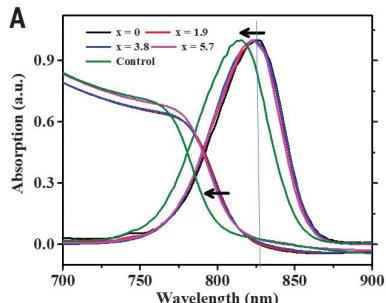
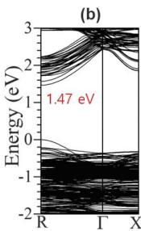
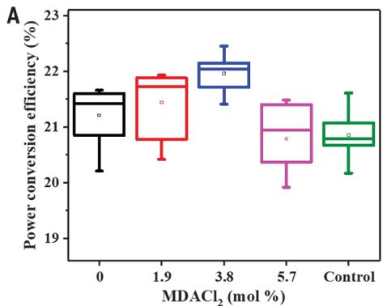
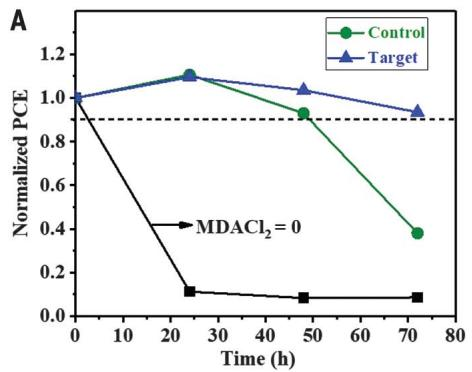
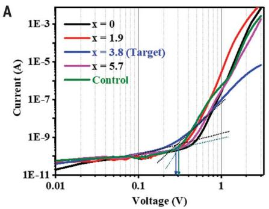

# MDACl2-Stabilized Alpha-FAPbI3 Perovskite Solar Cells

> **Original work:** Hanul Min, Maengsuk Kim, Seung-Un Lee, Hyeonwoo Kim, Gwisu Kim, Keunsu Choi, Jun Hee Lee, Sang II Seok. "Efficient, stable solar cells by using inherent bandgap of alpha-phase formamidinium lead iodide." *Science* 366, 749 (2019). DOI: 10.1126/science.aay7044

<!-- badges:start -->
<!-- badges:end -->

> [!NOTE]
> This README is an AI-generated analysis based on a [Gaia](https://github.com/SiliconEinstein/Gaia) reasoning graph formalization of the original work. Belief values reflect the graph's probabilistic assessment of each claim's support, not the original authors' confidence. See [ANALYSIS.md](ANALYSIS.md) for detailed verification results.

## Overview

Formamidinium lead triiodide (FAPbI3) has the narrowest bandgap (~1.45-1.51 eV) among lead halide perovskites, enabling broader solar-light absorption and superior thermal stability compared to methylammonium-based analogs. However, FAPbI3 spontaneously converts from the desired black alpha-phase to an unwanted wide-bandgap yellow delta-phase at room temperature. Prior approaches stabilized the alpha-phase using mixed cations/anions (MA, Cs, Rb, Br), but these additives widen the bandgap (reducing photocurrent) or introduce thermal instability (MA evaporates at 150C). This paper reports that doping FAPbI3 with 3.8 mol% methylenediammonium dichloride (MDACl2) stabilizes the alpha-phase while preserving its inherent narrow bandgap. The resulting devices achieve certified power conversion efficiencies (PCE) of 23.73% with certified short-circuit current density (JSC) of 26.70 mA/cm2 (the highest reported for any FAPbI3-based PSC), along with operational stability retaining >90% of initial PCE after 600 hours of maximum power point tracking under full AM 1.5G illumination.

> [!TIP]
> **Mutual Information:** 0.000 bits (0 strategies, 0 operators connecting 64 nodes)

```mermaid
---
config:
  flowchart:
    rankSpacing: 80
    nodeSpacing: 30
---
graph TB

    classDef premise fill:#ddeeff,stroke:#4488bb,color:#333
    classDef exported fill:#d4edda,stroke:#28a745,stroke-width:2px,color:#333
    classDef weak fill:#fff9c4,stroke:#f9a825,stroke-dasharray: 5 5,color:#333
    classDef contra fill:#ffebee,stroke:#c62828,color:#333
```

> [!NOTE]
> **[Per-module reasoning graphs with full claim details →](docs/detailed-reasoning.md)**

## Reasoning Structure

### MDACl2 doping at 3.8 mol% prevents humidity-induced alpha-to-delta phase transition in FAPbI3 (belief: 0.93)

FAPbI3 films without MDACl2 completely convert from the black alpha-phase to the yellow delta-phase within 24 hours when exposed to 80% relative humidity at 25C, as confirmed by X-ray diffraction (XRD) showing disappearance of the alpha-phase peaks at 14.3 and 28.6 degrees and appearance of the delta-phase peak at 11.6 degrees. Films with 1.9 mol% MDACl2 show strong phase transition toward delta-phase under the same conditions. However, films with 3.8 mol% and 5.7 mol% MDACl2 retain pure alpha-phase with no detectable delta-phase after 24 hours at 80% RH. This is the central stability finding: a critical minimum threshold of ~3.8 mol% MDACl2 is required for effective humidity-induced phase stabilization.

**Evidence support:**
- **Humidity phase stability test** (weakest link, belief 0.93): XRD directly measures phase content before and after 80% RH exposure for 24h. The complete conversion of pure FAPbI3 to delta-phase and the absence of conversion at 3.8 mol% are unambiguous results with high signal-to-noise.
- **XRD phase analysis method** (belief 0.93): Standard XRD technique with well-characterized peak positions for alpha and delta FAPbI3 polymorphs. The characteristic peaks (14.3, 28.6 for alpha; 11.6 for delta) are directly detected.


*XRD patterns show pure FAPbI3 (x=0) fully converts to delta-phase (peak at 11.6 degrees) after humidity exposure, while 3.8 and 5.7 mol% MDACl2 samples retain pure alpha-phase. Adapted from Min et al., Science 366, 749 (2019).*

> This is the most experimentally robust result in the paper. The humidity stability advantage of MDACl2 over MAPbBr3 is large and unambiguous: >90% retention at 70h (85% RH) for MDACl2 vs. 40% retention for the MAPbBr3 control.

---

### MDACl2 preserves the inherent narrow bandgap of FAPbI3, with minimal widening to 1.49 eV at 3.8 mol% (belief: 0.90)

The optical bandgap of FAPbI3 with 3.8 mol% MDACl2 is 1.49 eV, compared to 1.45 eV for pristine FAPbI3 (a small increase of 0.04 eV). In contrast, the MAPbBr3-stabilized control (0.95 FAPbI3 / 0.05 MAPbBr3) has a bandgap of 1.53 eV. Photoluminescence (PL) emission peaks shift progressively with MDACl2 content: 826 nm (pristine), 824 nm (1.9 mol%), 822 nm (3.8 mol%), 820 nm (5.7 mol%), vs. 816 nm for the MAPbBr3 control. This confirms that MDACl2 causes much less bandgap widening than MAPbBr3 at comparable stabilizing amounts. DFT calculations support two incorporation mechanisms: FA vacancy (bandgap 1.47 eV) and Cl interstitial (bandgap 1.69 eV). The experimentally observed small bandgap increase is consistent with FA vacancies being the dominant mechanism, with minor contribution from Cl interstitials.

**Evidence support:**
- **Bandgap values from UV-vis spectra** (belief 0.90): Direct measurement of absorption edges for each composition; self-consistent with PL peak positions. The trend of small progressive blue-shift with increasing MDACl2 is reproducible across multiple techniques.
- **PL peak shifts** (belief 0.92): Directly measured emission peaks with consistent 2-nm step increments. The 6-nm difference between x=3.8 (822 nm) and control (816 nm) directly demonstrates the narrower bandgap advantage.
- **DFT bandgap calculations** (belief 0.70): Two composition models (FA vacancy: 1.47 eV; Cl interstitial: 1.69 eV) bracket the experimental value (1.49 eV). DFT has known systematic errors, but the relative comparison is qualitatively reliable.


*UV-vis absorption (solid lines) and PL emission (dashed lines) for FAPbI3:xMDACl2 show minimal blue-shift compared to the larger shift of the MAPbBr3 control. Adapted from Min et al.*

---

### The target device achieves certified PCE of 23.73% and record JSC of 26.70 mA/cm2 (belief: 0.95)

Two devices were independently certified by Newport, USA using the quasi-steady-state (QSS) method. Device 1 achieved: JSC = 26.10 mA/cm2, VOC = 1.15 V, FF = 79.0%, stabilized PCE = 23.73%. Device 2 achieved: JSC = 26.70 mA/cm2 (highest reported for any FAPbI3-based PSC), VOC = 1.144 V, FF = 77.56%, stabilized PCE = 23.69%. The best-performing device in the lab (reverse bias sweep) showed JSC = 26.50 mA/cm2, VOC = 1.14 V, FF = 81.77%, PCE = 24.66%. The improvement over the MAPbBr3 control (JSC = 25.14 mA/cm2, PCE = 23.05%) is primarily from higher JSC (+1.36 mA/cm2) due to the narrower bandgap maintained with MDACl2.

**Evidence support:**
- **Certified PCE** (weakest link, belief 0.95): Independent certification by Newport, USA using the quasi-steady-state method is the most authoritative PCE measurement available. Two independent devices give consistent results (23.73% and 23.69%).
- **Target best J-V parameters** (belief 0.92): Direct lab measurement under standard AM 1.5 conditions; internally consistent with EQE integration. The 1.36 mA/cm2 JSC advantage over control is a large, reproducible difference.


*Current density-voltage curves in reverse (filled) and forward (open) bias show the target device (3.8 mol% MDACl2) achieves higher current density than the MAPbBr3 control. Adapted from Min et al.*

---

### MDACl2 achieves superior humidity, thermal, and photostability compared to the MAPbBr3 control (belief: 0.90)

The target device retains >90% of initial PCE after 70 hours at 85% RH (25C), while the MAPbBr3 control retains only 40% of initial PCE under identical conditions. At 150C in air (~25% RH), the target retains >90% of initial PCE after 20 hours, while the control degrades to <20% (primarily due to MA evaporation). Under maximum power point tracking at full AM 1.5G illumination (100 mW/cm2) in ambient conditions without UV filtering (encapsulated, spiro-OMeTAD HTM), the target maintains ~90% of initial PCE (greater than 23.0%) over 600 hours of continuous irradiation. The control device cannot be meaningfully tested under identical photostability conditions due to faster degradation.

**Evidence support:**
- **Humidity stability** (belief 0.90): Standard 85% RH accelerated aging test; the large gap between >90% (target) and 40% (control) at 70h is an unambiguous difference.
- **Thermal stability** (belief 0.90): Aggressive 150C aging test; <20% retention for control vs >90% for target at 20h is a definitive result.
- **Photostability** (belief 0.88): The most demanding test (600h MPP tracking under full sun, no UV filter) shows remarkable retention. Attribution to interface Cl + alpha stabilization is a mechanistic interpretation supported by literature.


*Comparison of humidity (A), thermal (B), and photostability (C) between target (3.8 mol% MDACl2) and MAPbBr3 control devices. Adapted from Min et al.*

---

### The MDACl2 approach resolves the efficiency-stability trade-off in FAPbI3-based PSCs (belief: 0.85)

Prior to this work, the best mp-TiO2-based PSCs used MAPbBr3 to stabilize alpha-FAPbI3, achieving ~23% PCE but suffering from: (1) bandgap widening from Br incorporation (reducing JSC), (2) thermal instability from MA evaporation at elevated temperature, and (3) humidity sensitivity. The MDACl2-stabilized target simultaneously outperforms this control on all efficiency metrics (higher PCE: 24.66% vs 23.05%; higher JSC: 26.50 vs 25.14 mA/cm2) AND all three stability metrics (humidity, thermal, and photostability). This demonstrates that the inherent bandgap of alpha-FAPbI3 can be fully utilized without sacrificing stability, by using MDACl2 instead of MA/Br/Cs additives.

**Evidence support:**
- **Head-to-head comparison** (weakest link, belief 0.88): Both target and control use identical device architecture (mp-TiO2) and surface passivation; the comparison is fair and directly supports all claims of superiority.
- **Optimal composition** (belief 0.88): Multiple independent measurements (phase stability, bandgap, PCE, JSC, stability) all peak or plateau at 3.8 mol%, confirming this is a genuine optimum rather than a cherry-picked result.

---

### Alpha-phase stabilization by MDACl2 operates through multiple complementary mechanisms (belief: 0.80)

The paper proposes four stabilization mechanisms, each supported by independent evidence: (1) Hydrogen bonding between MDA's multiple H-N groups and I- in the lattice (supported by analogy to MA stabilization mechanisms in refs 33-35); (2) Goldschmidt tolerance factor optimization (MDA substitution brings t closer to the optimal 0.9 for cubic phase); (3) Entropic stabilization from cation mixing at FA sites (supported by solid-solution thermodynamics, ref 32); (4) Interstitial Cl- ions reducing lattice strain (supported by XRD peak shift to lower angles and DFT bandgap calculations). The combination of multiple mechanisms explains why stabilization is effective at such a low dopant concentration (3.8 mol%) and why the alpha-phase is stable under such diverse stresses (humidity, thermal, optical).

**Evidence support:**
- **Phase stability summary** (weakest link, belief 0.80): The multi-mechanism explanation is logically coherent and the individual mechanisms are each physically plausible, but the specific quantitative contribution of each mechanism is not independently verified.
- **XRD peak lower angle** (belief 0.87): Direct measurement of lattice expansion with increasing MDACl2; consistent with interstitial Cl- (smaller ionic radius than I-) expanding the unit cell.
- **Stabilization mechanism tolerance factor** (belief 0.70): Tolerance factor estimates are approximate; the actual t value for MDA-substituted FAPbI3 is not directly measured.

---

### Interstitial Cl- ions enriched at the TiO2/perovskite interface contribute to exceptional photostability (belief: 0.78)

XPS depth profiling and ToF-SIMS show that the Cl content in the target (3.8 mol% MDACl2) is higher than in the control throughout the perovskite film, with Cl enrichment especially concentrated at the TiO2/perovskite interface. Prior literature (refs 41-42) demonstrated that Cl at this interface increases PSC photostability by suppressing TiO2 photocatalytic activity that would otherwise degrade the perovskite under UV illumination. The MDACl2 doping strategy naturally concentrates Cl at this critical interface, whereas the MAPbBr3 control does not provide this benefit. The exceptional 600-hour photostability (90% PCE retention) is attributed to the combination of interfacial Cl and alpha-phase stabilization.

**Evidence support:**
- **Cl enriched interface** (belief 0.83): XPS and ToF-SIMS both independently confirm Cl enrichment at the TiO2 interface; two-technique corroboration strengthens confidence.
- **Interface Cl photostability mechanism** (belief 0.78): The mechanism is supported by prior literature but the specific contribution of interface Cl vs. alpha-phase stabilization to the observed 600h stability is not independently quantified.


*XPS and ToF-SIMS confirm Cl enrichment at the TiO2/perovskite interface in the target device. Adapted from Min et al.*

---

## Conclusions

| Label | Content | Prior | Belief |
|-------|---------|-------|--------|
| aberration_free_stability | Unlike mixed-cation-anion approaches that sacrifice thermal stability (MA), i... | 0.80 | 0.80 |
| alpha_delta_transition | FAPbI3 readily transforms from the desired trigonal black alpha-phase into th... | 0.50 | — |
| alpha_phase_retention_38 | FAPbI3 with 3.8 mol% MDACl2 retained the pure alpha-phase after 24 hours at 8... | 0.93 | 0.93 |
| alpha_phase_retention_57 | FAPbI3 with 5.7 mol% MDACl2 also retained the pure alpha-phase after 24 hours... | 0.92 | 0.92 |
| bandgap_values | The optical bandgap values derived from UV-vis spectra are: pristine FAPbI3 (... | 0.90 | 0.90 |
| carrier_lifetime_target | Time-resolved PL measurements on quartz substrates showed that the target (3.... | 0.88 | 0.88 |
| certified_pce | Two target devices were certified by Newport, USA using the quasi-steady-stat... | 0.95 | 0.95 |
| cl_enriched_interface | XPS depth profiling and ToF-SIMS showed that the Cl content in the target (3.... | 0.83 | 0.83 |
| cl_interface_photostability | The Cl enrichment at the TiO2/perovskite interface (confirmed by XPS and ToF-... | 0.78 | 0.78 |
| conclusion_alpha_stabilization | MDACl2 doping at 3.8 mol% effectively stabilizes the alpha-phase of FAPbI3 wi... | 0.88 | 0.88 |
| conclusion_no_tradeoff | The MDACl2 approach resolves the long-standing efficiency-stability trade-off... | 0.85 | 0.85 |
| crystallinity_improvement | XRD signal intensity increased for MDACl2 addition up to 3.8 mol% without any... | 0.85 | 0.85 |
| defect_density_sclc | Electron-only devices with structure FTO/SnO2/perovskite/PCBM/Au were fabrica... | 0.82 | 0.82 |
| deposition_method | A thin film of FAPbI3 incorporating MDACl2 was deposited using a process simi... | 0.90 | 0.90 |
| device_structure | PSC devices were fabricated with the structure: FTO/SnO2/mp-TiO2/perovskite/P... | 0.90 | 0.90 |
| dft_bandgap_calculation | Density functional theory (DFT) calculations were performed to compute bandga... | 0.75 | 0.75 |
| dft_bandgap_cl_interstitial | DFT calculations for the Cl interstitial composition (FA1-xMDAx)PbI3Clx yield... | 0.70 | 0.70 |
| dft_bandgap_fa_vacancy | DFT calculations for the FA vacancy composition (FA1-2xMDAx)Pb(I1-xClx)3 yiel... | 0.70 | 0.70 |
| electron_trap_density | Electron trap densities (N_defects) from SCLC measurements: x=0 (5.4x10^15 cm... | 0.82 | 0.82 |
| eqe_expanded_range | External quantum efficiency (EQE) measurements showed that the target device ... | 0.85 | 0.85 |
| eqe_spectral_response | External quantum efficiency (EQE) was measured to characterize the wavelength... | 0.85 | 0.85 |
| fapbi3_bandgap | FAPbI3 (formamidinium lead triiodide, FA+ = H2N=CH-NH2+) has the narrowest ba... | 0.50 | — |
| fapbi3_stabilization_history | Prior approaches to alpha-FAPbI3 stabilization include: (1) mixing with MAPbB... | 0.85 | 0.85 |
| ftir_confirms_mda | Fourier-transform infrared spectroscopy (FT-IR) and nuclear magnetic resonanc... | 0.80 | 0.80 |
| giwaxs_analysis | Grazing-incidence wide-angle X-ray scattering (GIWAXS) analysis of x=3.8 mol%... | 0.85 | 0.85 |
| giwaxs_no_impurity | GIWAXS analysis of x=3.8 mol% and control samples showed identical ring patte... | 0.88 | 0.88 |
| highest_jsc | The certified JSC of 26.70 mA/cm2 represents the highest short-circuit curren... | 0.95 | 0.95 |
| hole_trap_reduction | Hole-only device measurements (not detailed in this module) showed that the h... | 0.75 | 0.75 |
| humidity_phase_stability | After exposure to 80% relative humidity for 24 hours: pure FAPbI3 (x=0) compl... | 0.93 | 0.93 |
| humidity_stability | Under 85% RH at 25C (unencapsulated devices), the target device retained more... | 0.90 | 0.90 |
| j_v_measurement | Current density-voltage (J-V) characteristics were measured under standard AM... | 0.93 | 0.93 |
| literature_comparison | Prior to this work, the highest efficiency for mp-TiO2-based PSCs was achieve... | 0.88 | 0.88 |
| mapbbr3_control_efficiency | A control device using FAPbI3 stabilized by MAPbBr3 (with 5 mol% MAPbBr3) ach... | 0.90 | 0.90 |
| mda_properties | Methylenediammonium (MDA2+, +H3N-CH2-NH3+) has an ionic radius of 262 pm, com... | 0.50 | — |
| mda_superior_to_mapbbr3 | Compared to the MAPbBr3-stabilized control (the best prior mp-TiO2-based PSC ... | 0.88 | 0.88 |
| mixed_cation_problem | Mixed cation-anion approaches (FAxMA1-x, FA1-x-yMAxCry) stabilize alpha-FAPbI... | 0.50 | — |
| morphology_unchanged | Scanning electron microscopy (SEM) comparison of target and control showed no... | 0.85 | 0.85 |
| optimal_composition | The optimal MDACl2 composition for FAPbI3 is 3.8 mol%, which provides: (1) ef... | 0.88 | 0.88 |
| pce_distributions | PCE distributions for FAPbI3:xMDACl2 PSCs (x = 0, 1.9, 3.8, 5.7 mol%) and con... | 0.88 | 0.88 |
| perovskite_structure | Lead halide perovskites (LHPs) have the general formula ABX3, where A is a ca... | 0.50 | — |
| phase_stability_summary | The alpha-phase stabilization of FAPbI3 by MDACl2 arises from three factors: ... | 0.80 | 0.80 |
| photostability | Under maximum power point tracking at full AM 1.5G illumination (100 mW/cm2) ... | 0.88 | 0.88 |
| photostability_mechanism | The exceptional photostability (90% PCE retention after 600 hours MPP trackin... | 0.78 | 0.78 |
| pl_lifetime | Time-resolved photoluminescence (TRPL) was measured on perovskite films depos... | 0.88 | 0.88 |
| pl_peak_shifts | PL emission peaks for FAPbI3:xMDACl2 shifted progressively: 826 nm (x=0), 824... | 0.92 | 0.92 |
| pl_quality_enhancement | Adding 3.8 mol% MDACl2 to FAPbI3 enhanced the PL quantum yield (measured with... | 0.82 | 0.82 |
| pl_spectra | Photoluminescence (PL) emission peaks for FAPbI3:xMDACl2 films shifted from 8... | 0.92 | 0.92 |
| research_question | Can the alpha-phase of FAPbI3 be stabilized using MDACl2 doping (without MA, ... | 0.50 | — |
| stability_test_protocols | Stability tests were conducted under three conditions: (1) humidity stability... | 0.88 | 0.88 |
| stabilization_mechanism_cl_interstitial | Cl- ions (ionic radius 181 pm, much smaller than I- at 220 pm) introduced alo... | 0.75 | 0.75 |
| stabilization_mechanism_entropic | Cation mixing at FA sites (MDA2+ substituting for FA+) affords entropic stabi... | 0.72 | 0.72 |
| stabilization_mechanism_h_bonding | MDA2+ stabilizes the alpha-FAPbI3 phase through hydrogen bonding between the ... | 0.78 | 0.78 |
| stabilization_mechanism_tolerance_factor | Goldschmidt tolerance factor t for FAPbI3 is approximately 1.0, above the opt... | 0.70 | 0.70 |
| surface_passivation | The surface of the target and control perovskite layers was passivated using ... | 0.85 | 0.85 |
| target_best_jv | The best-performing target device (3.8 mol% MDACl2) showed: JSC = 26.50 mA/cm... | 0.92 | 0.92 |
| thermal_stability | At 150C and approximately 25% RH (unencapsulated devices), the control device... | 0.90 | 0.90 |
| tofsims_cl_mapping | Time-of-flight secondary-ion mass spectrometry (ToF-SIMS) of the FTO/Bi-TiO2/... | 0.80 | 0.80 |
| uvvis_absorption | UV-vis absorption spectra were measured for FAPbI3:xMDACl2 (x = 0, 1.9, 3.8, ... | 0.92 | 0.92 |
| uvvis_blue_shift | UV-vis absorption spectra of FAPbI3:xMDACl2 (x = 0, 1.9, 3.8, 5.7 mol%) showe... | 0.92 | 0.92 |
| v_fa_defects_shallow | FA vacancy (V_FA) defects formed by MDA2+ substitution are shallow traps near... | 0.72 | 0.72 |
| xps_cl_content | X-ray photoelectron spectroscopy (XPS) showed that the residual Cl content in... | 0.82 | 0.82 |
| xrd_peak_lower_angle | The XRD (001) orientation peak shifted to a lower diffraction angle with incr... | 0.87 | 0.87 |
| xrd_peak_shift | XRD patterns of FAPbI3:xMDACl2 films showed that the (001) orientation peak s... | 0.88 | 0.88 |
| xrd_phase_analysis | X-ray diffraction (XRD) patterns of FAPbI3:xMDACl2 (x = 0, 1.9, 3.8, 5.7 mol%... | 0.93 | 0.93 |

## Weak Points

<details open>
<summary>Weak Points Analysis</summary>

### DFT bandgap predictions have moderate uncertainty due to systematic errors

The DFT-computed bandgaps for the two incorporation models (FA vacancy: 1.47 eV; Cl interstitial: 1.69 eV) are used to interpret the experimental bandgap of 1.49 eV. However, DFT systematically underestimates bandgaps for metal halide perovskites, and the specific supercell size (3x3x3) and composition (x=0.037) may not perfectly match experimental conditions. The claim that FA vacancies predominate over Cl interstitials rests on the comparison that the experimental value (1.49 eV) lies between the two DFT predictions, but the absolute values are approximate. This affects how confidently we can rule out Cl interstitial as a major contributor.

### The quantitative contributions of each stabilization mechanism are not independently verified

The paper proposes four concurrent stabilization mechanisms (H-bonding, tolerance factor adjustment, entropic stabilization, interstitial Cl- lattice strain relief) but does not quantitatively deconvolute their individual contributions. The relative importance of each mechanism remains qualitative. This matters for guiding future work: if H-bonding is the dominant factor, different dopant molecules could be designed; if tolerance factor is dominant, different ionic radii dopants would be preferred. The multi-mechanism claim is coherent but the specific predictions for dopant design are weakened by this ambiguity.

### Hole-trap reduction mechanism lacks detail

The paper notes that hole-trap density decreases with MDACl2 addition relative to the control, but the hole-only device data and analysis are not shown in the main text (only referenced as fig. S11). The mechanism by which MDA2+ or associated defects passivate hole traps is not explained. This is a missed opportunity: passivation of hole traps is a significant contributor to the improved carrier lifetime (1562 ns vs 715 ns for control), but the claim rests on a figure that is not publicly accessible in the formal results section.

### The 600-hour photostability result uses spiro-OMeTAD HTM but the humidity/thermal tests use CuPC

Three different hole-transporting materials (HTMs) are used across different tests: spiro-OMeTAD for the certified PCE and photostability tests (with dopants that degrade under humidity), CuPC for thermal stability tests (to avoid hygroscopic dopant issues), and the text implies PTAA for some tests. The stability results are not all measured on identical device stacks, which complicates direct comparison of stability mechanisms. The photostability advantage specifically (which relies partly on interface Cl suppressing TiO2 photocatalysis) is measured with spiro-OMeTAD, but the humidity and thermal stability tests use different HTMs.

</details>

## Evidence Gaps

<details>
<summary>Evidence Gaps & Future Work</summary>

**Experimental gaps:**

- **Direct Cl location determination:** The paper infers Cl interstitials from XRD peak shift and DFT, but direct structural characterization (e.g., neutron diffraction, synchrotron X-ray pair distribution function analysis) would confirm the interstitial site occupation. Without this, the claim that interstitial Cl- rather than Cl- substitution is dominant remains indirect.
- **Hole trap density full data:** The hole-only device SCLC data (fig. S11) is not shown in the main text or supplementary accessible in this formalization, leaving the hole trap reduction claim under-supported in the graph. Measuring and including this data would strengthen the carrier lifetime explanation.
- **Long-term stability under standardized conditions:** The photostability, humidity stability, and thermal stability tests use different HTMs and device architectures. A unified stability study with consistent device stack would enable fairer comparison between the three degradation mechanisms.

**Computational gaps:**

- **DFT with hybrid functionals:** The DFT bandgap calculations use GGA-PBE, which is known to underestimate bandgaps for perovskites by 0.2-0.5 eV. Using hybrid functionals (e.g., HSE06) or GW would give more reliable absolute bandgap values and strengthen the mechanistic interpretation of FA vacancy vs. Cl interstitial dominance.
- **Molecular dynamics for H-bonding:** A quantitative assessment of H-bonding strength between MDA and the perovskite lattice (e.g., via ab initio molecular dynamics) would strengthen the H-bonding stabilization mechanism claim.

**Theoretical gaps:**

- **Tolerance factor calculation for MDA-substituted FAPbI3:** The paper states t ~ 1.0 for FAPbI3 and that MDA substitution brings t closer to 0.9, but the actual t values for each composition are not calculated. A systematic tolerance factor calculation across the composition range would quantify this contribution.
- **Mechanistic decomposition:** The paper proposes four mechanisms but does not attempt to quantify their relative contributions. A thermodynamic model separating enthalpic (H-bonding, lattice strain) and entropic (cation mixing) contributions would enable prediction of optimal dopant candidates.

</details>

## Detailed Analysis

For structural integrity verification (Pass 5), standalone readability checks (Pass 6),
and complete package statistics, see [ANALYSIS.md](ANALYSIS.md).