# SOLAR CELLS

# Efficient, stable solar cells by using inherent bandgap of $\alpha$ -phase formamidinium lead iodide

Hanul Min, Maengsuk Kim, Seung-Un Lee, Hyeonwoo Kim, Gwisu Kim, Keunsu Choi, Jun Hee Lee, Sang II Seok*

In general, mixed cations and anions containing formamidinium (FA), methylammonium (MA), caesium, iodine, and bromine ions are used to stabilize the black $\alpha$ -phase of the FA-based lead triiodide ( $FAPbI_3$ ) in perovskite solar cells. However, additives such as MA, caesium, and bromine widen its bandgap and reduce the thermal stability. We stabilized the $\alpha$ - $FAPbI_3$ phase by doping with methylenediammonium dichloride ( $MDACl_2$ ) and achieved a certified short-circuit current density of between 26.1 and 26.7 milliamperes per square centimeter. With certified power conversion efficiencies (PCEs) of $23.7\%$ , more than $90\%$ of the initial efficiency was maintained after 600 hours of operation with maximum power point tracking under full sunlight illumination in ambient conditions including ultraviolet light. Unencapsulated devices retained more than $90\%$ of their initial PCE even after annealing for 20 hours at $150^{\circ}\mathrm{C}$ in air and exhibited superior thermal and humidity stability over a control device in which $FAPbI_3$ was stabilized by $MAPbBr_3$ .

perovskite solar cells (PSCs) have increased power conversion efficiencies (PCEs) with broader solar-light absorption through narrower bandgaps. Among lead halide perovskites (LHPs), the narrowest bandgap is afforded by the formamidinium (FA)-based lead triiodide $\mathrm{(FAPbI_3)}$ [1.45 to $1.51\mathrm{eV}$ 1-3) in thin films], which also affords improved thermal stability (4) relative to $\mathrm{MAPbI}_3$ (where MA is methylammonium) because of its elevated decomposition temperature. However, $\mathrm{FAPbI}_3$ readily transforms from the desired trigonal black $\alpha$ -phase into the undesired wide-bandgap $\delta$ -phase with hexagonal symmetry under ambient conditions at room temperature (5). We have shown that modification of $\mathrm{FAPbI}_3$ with $\mathrm{MAPbBr_3}$ stabilized the $\alpha$ -FAPbI3 phase and subsequently improved the device efficiency to $>18\%$ in $(\mathrm{FAPbI}_3)_{0.85}(\mathrm{MAPbBr}_3)_{0.15}(6)$

Efforts to improve the stability of $\mathrm{FAPbI}_3$ have focused on mixed cation-anion hybrid LHPs that incorporate several cations, anions, or both, such as the $\mathrm{FA}_x\mathrm{MA}_{1 - x}$ double cation or the $\mathrm{FA}_{1 - x - y}\mathrm{MA}_x\mathrm{Cs}_y$ triple cation. This incorporation is achieved by the partial replacement of $\mathrm{FA}^+$ , $\mathrm{MA}^+$ , $\mathrm{Rb}^+$ , $\mathrm{Cs}^+$ , $\mathrm{Br}^-$ , and $\mathrm{I}^-$ (7-11). Nevertheless, when MA and Br are alloyed in $\mathrm{FAPbI}_3$ , various problems such as low thermal stability (4) caused by the addition of MA, phase separation (12) caused by the presence of mixed halides, and reduced photon absorption arise, thereby resulting in low current density owing to an undesirable increase in the bandgap. Although the $\alpha$ - $\mathrm{FAPbI}_3$ phase without MA can be stabilized by incorporating phenylethylammonium lead iodide (13)

through surface functionalization (14) or by using both Rb and Cs (15), the resulting PCE is still low when compared with that obtained with the use of the $\mathrm{FA}_x\mathrm{MA}_{1 - x}$ double cation.

To further increase the PCE by enhancing the photocurrent density resulting from increased light harvesting, a new composition is needed that stabilizes the $\alpha$ -phase while maintaining the inherent bandgap of $\mathrm{FAPbI_3}$ . The ionic radii and molecular configuration of methylenediammonium $\left[^{+}\mathrm{H}_{3}\mathrm{N}-\mathrm{CH}_{2}-\mathrm{NH}_{3}^{+}\right.$ (MDA), 262 picometers (pm), calculated] and FA $\left(^{+}\mathrm{H}_{2}\mathrm{N}=\mathrm{CH}-\mathrm{NH}_{2}, 256\mathrm{pm}\right)$ are comparable except for the valence-state difference. However, MDA has more hydrogen atoms than FA and even MA, which means that it can form a greater number of H bonds with $\Gamma^{-}$ . Thus, MDA could structurally stabilize the $\alpha$ -FAPbI₃ in even smaller amounts than does MA. Some studies have reported the incorporation of divalent cations into monovalent A-site cations (16-21), but most of the divalent diammonium cations reported have been used to realize two-dimensional (2D) or 2D/3D LHPs. Safdari et al. (16) reported on the 2D diammonium perovskites $\left[\mathrm{NH}_{3}(\mathrm{CH}_{2})_{4}\mathrm{NH}_{3}\right] \mathrm{PbI}_{4}$ , $\left[\mathrm{NH}_{3}(\mathrm{CH}_{2})_{6}\mathrm{NH}_{3}\right] \mathrm{PbI}_{4}$ , and $\left[\mathrm{NH}_{3}(\mathrm{CH}_{2})_{8}\mathrm{NH}_{3}\right] \mathrm{PbI}_{4}$ , which demonstrated PCEs of $\sim 1\%$ . The recent synthesis of $\left(\mathrm{NH}_{3} \mathrm{C}_{m} \mathrm{H}_{2m} \mathrm{NH}_{3}\right) \left(\mathrm{CH}_{3} \mathrm{NH}_{3}\right)_{n-1} \mathrm{Pb}_{n} \mathrm{I}_{3 n+1}$ ( $m=4-9/n=1-4$ ) that used complementary solid-state grinding and solution methods as a 2D/3D mixture has also been reported (21). The use of 2D or 2D/3D mixed-perovskite-containing diammonium cations increased the stability of perovskite materials by strengthening electrostatic interactions between the layers that rigidify the structure. However, larger organic cations in 2D structures can inhibit charge transport by creating insulating spacing layers between conductive inorganic slabs, so it would be desirable to fabricate 3D LHPs without the 2D perovskite layer.

We report highly efficient and stable PSCs fabricated with MA-, Cs-, and Br-free $\alpha$ -FAPbI₃ by incorporating a small amount of MDACl₂. The resulting FAPbI₃:3.8 mole % (mol %) MDACl₂ structure stabilized the $\alpha$ -phase with only a slight change in the bandgap. We achieved a short-circuit current density ( $J_{\mathrm{sc}}$ ) of between 26.1 and $26.7\mathrm{mAcm}^{-2}$ (certified), which is the highest reported for PSCs fabricated from FA-based LHPs. The device exhibited a PCE of $>24\%$ (certified stabilized $23.7\%$ ) and long-term stability compared with the control $[(FAPbI_3)_{0.95}(MAPbBr_3)_{0.05}]$ , which itself shows the highest efficiency among mesoporous (mp)-TiO₂-based PSCs.

We deposited a thin film of $\mathrm{FAPbI}_3$ incorporating $\mathrm{MDACl}_2$ with a process similar to that reported previously for state-of-art mixed perovskites (9-11) but adding $\mathrm{MDACl}_2$ instead of $\mathrm{MAPbBr}_3$ (see the experimental section in the supplementary materials). The ultraviolet-visible (UV-vis) absorption spectra of $\mathrm{FAPbI}_3:x\mathrm{MDACl}_2$ ( $x = 0, 1.9, 3.8$ , and $5.7\mathrm{mol}\%$ ) slightly blue-shifted with increasing amounts of $\mathrm{MDACl}_2$ (Fig. 1A) and were nearly identical to that of a thin film without the addition of MACl (fig. S1) as a mediator (22-26) for high-crystallinity perovskite. This result is consistent with the corresponding shifts of photoluminescence (PL) emission peaks (Fig. 1A and fig. S2) from $826\mathrm{nm}$ to $824$ , $822$ , and $820\mathrm{nm}$ , and $816\mathrm{nm}$ for the control. This result suggests that MACl almost completely disappeared during the annealing process, as previously reported (27, 28). The presence of MDA in the perovskite was confirmed by Fourier-transform infrared spectroscopy (fig. S3) and nuclear magnetic resonance imaging (fig. S4). Thus, $\mathrm{MDACl}_2$ may have been incorporated into the perovskite lattice within the experimental $x$ -value range.

The bandgap changes in $\mathrm{FAPbI}_3$ caused by the introduction of $\mathrm{MDACl}_2$ were calculated using density functional theory and compared for two cases as per Eqs. 1 and 2:

FA vacancy: $(\mathrm{FA}_{1-2x}^{+1}\mathrm{MDA}_{x}^{+2})\mathrm{Pb}^{2+}\mathrm{I}_{3}^{-1}\mathrm{Cl}_{2x}^{-1}\rightarrow$

$$
\left[ \left(\mathrm {F A} _ {1 - 2 x} ^ {+ 1} \mathrm {M D A} _ {x} ^ {+ 2}\right) \mathrm {P b} ^ {2 +} \mathrm {I} _ {3} ^ {- 1} \right] + V _ {x \mathrm {F A}} + 2 x \mathrm {F A C l} \tag {1}
$$

$\mathrm{Cl_i}$ insertion: $(\mathrm{FA}_{1 - x}^{+1}\mathrm{MDA}_x^{+2})\mathrm{Pb}^{2 + }\mathrm{I}_3^{-1}\mathrm{Cl}_{2x}^{-1}\rightarrow$

$$
\left[ \left(\mathrm {F A} _ {1 - x} ^ {+ 1} \mathrm {M D A} _ {x} ^ {+ 2}\right) \mathrm {P b} ^ {2 +} \mathrm {I} _ {3} ^ {- 1} \mathrm {C l} _ {x} ^ {- 1} \right] + \mathrm {C l} _ {\mathrm {x i}} + x \mathrm {F A C l} \tag {2}
$$

Equations 1 and 2 represent compositions that assume the FA cation vacancies and the insertion of $\mathrm{Cl^-}$ with a small ionic radius, respectively, upon the addition of $\mathrm{MDACl_2}$ . The bandgap $(1.47\mathrm{eV})$ with the FA vacancy $(V_{\mathrm{FA}})$ composition as per Eq. 1 is slightly greater than that of pristine $\mathrm{FAPbI_3}$ $(1.45\mathrm{eV})$ and the Cl interstitial composition $(\mathrm{Cl_i})$ based on Eq. 2 yielded an increased bandgap of $1.69\mathrm{eV}$ (Fig. 1B). We

Department of Energy Engineering, School of Energy and Chemical Engineering, Ulsan National Institute of Science and Technology, 50 UNIST-gil, Eonyang-eup, Ulju-gun, Ulsan 44919, Korea.   
*Corresponding author. Email: seoksi@unist.ac.kr

expected that the addition of $\mathrm{MDACl_2}$ to $\mathrm{FAPbI_3}$ would mainly result in FA defects and the possible induction of PL quenching. However, adding $3.8\mathrm{mol}\%$ $\mathrm{MDACl_2}$ to $\mathrm{FAPbI_3}$ enhanced the PL quantum yield as measured with an integrated sphere, but was greatly reduced with further $\mathrm{MDACl_2}$ addition. This result implies that the FA defects did not act as deep electron traps. As reported previously (4, 29), pristine $\mathrm{FAPbI_3}$ thin films annealed at high temperatures exhibited a black $\alpha$ -phase that absorbed long-wavelength light. However, the $\alpha$ -phase transitions to the yellow $\delta$ -phase within 10 days at room temperature and within 1 day under high-humidity conditions (5, 30) because the metastable polymorphs stabilized at high temperature are preferably converted back to the thermodynamically stable phase below $120^{\circ}\mathrm{C}$ .

The structural stabilization of the $\alpha$ -phase in $\mathrm{FAPbI_3}$ with added cations can be explained by several factors. First, the $\alpha$ -phase stabilization by smaller cations such as $\mathrm{Cs^{+}}$ can be understood from the Goldschmidt tolerance factor $t$ approaching 0.9, which is similar to that of $\mathrm{MAPbI_3}$ , by mixing $\mathrm{FAPbI_3}$ ( $t \sim 1$ ) and $\mathrm{CsPbI_3}$ ( $t \sim 0.8$ ) (31). Second, cation mixing in the FA sites affords entropic stabilization through the resulting entropic gain and small internal energy input to form their solid solution (32). Third, the stabilization of $\alpha$ - $\mathrm{FAPbI_3}$

with MA cations can be explained by the presence of strong H bonds between the $\mathrm{I}^{-}$ and H-N groups (33-35). The $\alpha$ -FAPbI $_3$ phase can be more easily stabilized when MA, Cs, or both is used with Br $^{-}$ of small ionic radii, and high-efficiency PSCs are normally fabricated using $\alpha$ -FAPbI $_3$ stabilized by mixed cations and anions.

We expected that MDA could stabilize $\alpha$ -FAPbI₃ through the partial replacement of FA sites because MDA has more H groups with an ionic radius similar to that of FA and a stronger ionic interaction of its divalent state. The x-ray diffraction (XRD) patterns of FAPbI₃:xMDACl₂ (x = 0, 1.9, 3.8, and 5.7 mol %) and the control layers exposed to 80% humidity for 24 hours after annealing of the coatings of precursor solution at 150°C for 10 min (Fig. 1C) show two peaks characteristic of the $\alpha$ -FAPbI₃ phase at 14.3° and 28.6° assigned to the (001) and (002) crystal planes, respectively, and one peak at 11.6° corresponding to the δ-phase. The as-annealed films (fig. S5) exhibited a pure $\alpha$ -phase for all compositions, but after exposure to high humidity for 24 hours, pure FAPbI₃ completely converted to the δ-phase and FAPbI₃ with 1.9 mol % MDACl₂ exhibited a strong phase transition, with the control also exhibiting a certain amount of the δ-phase.

By contrast, $\mathrm{FAPbI}_3$ incorporating 3.8 and $5.7\mathrm{mol}\%$ of $\mathrm{MDACl_2}$ retained the $\alpha$ -phase. Furthermore, as shown in fig.S5, the overall

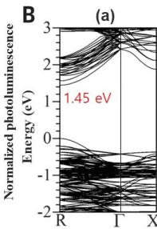

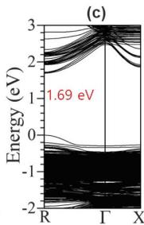

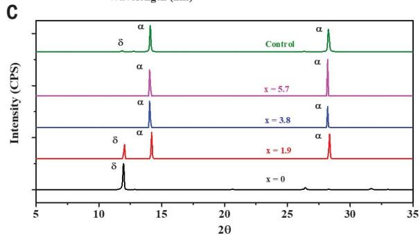

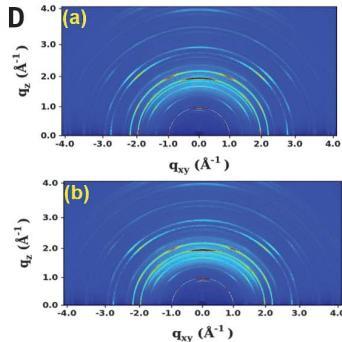  
Fig. 1. Preparation of $\mathrm{FAPbl}_3$ :xMDACl2 ( $x = 0, 1.9, 3.8$ , and $5.7\mathrm{mol}\%$ ). (A) UV-vis absorption and PL spectra of perovskite layers with different $x$ values. The perovskite layer based on $0.95\mathrm{FAPbl}_3/0.05\mathrm{MAPbBr}_3$ as a control was also investigated. (B) Electronic band structures of (a) $\mathrm{FAPbl}_3$ , (b) representative $\mathrm{FA}_{0.926}(\mathrm{V}_{\mathrm{FA}})_{0.037}\mathrm{MDA}_{0.037}\mathrm{PbI}_3$ , and (c) representative $\mathrm{FA}_{0.963}\mathrm{MDA}_{0.037}\mathrm{PbI}_3(\mathrm{Cl}_i)_{0.037}$ . The doping amount of 0.037 in the calculation was given by $1/27$ ( $= 0.03704$ ) based on the $3\times 3\times 3$ supercell for the composition close to the actual experiment. (C) XRD patterns of perovskite prepared with different $x$ values and the control layer exposed to $80\%$ humidity for 24 hours after annealing of the coatings of the precursor solution at $150^{\circ}\mathrm{C}$ for $10\mathrm{min}$ . (D) GIWAXS 2D images at full depth of x-ray incident angle for perovskite layers for (a) $x = 3.8\mathrm{mol}\%$ and (b) control.

signal intensity increased for $\mathrm{MDACl_2}$ addition up to $3.8\mathrm{mol}\%$ without any impurity peaks. The incorporation of $>3.8\mathrm{mol}\% \mathrm{MDACl}_2$ may result in increased crystallinity because of the reduced lattice strain at FA defects (fig. S6). As can be inferred from Eqs. 1 and 2, the perovskite structure may contain defective $\mathrm{FA}^+$ or interstitial $\mathrm{Cl^-}$ to satisfy the electrical neutrality rule with the release of FACl as a by-product when $\mathrm{MDA^{2 + }}$ ions are substituted into the FA sites in $\mathrm{FAPbI_3}$

The addition of $\mathrm{MDACl_2}$ likely formed FACl or substituted residual $\mathrm{MDACl_2}$ . However, the final annealed perovskite films did not exhibit any impurity peaks such as those of FACl and $\mathrm{MDACl_2}$ . This result implies that $\mathrm{MDACl_2}$ was successfully incorporated into the $\mathrm{FAPbI_3}$ perovskite lattices, and the resulting FACl was eliminated by annealing at $150^{\circ}\mathrm{C}$ for $10\mathrm{min}$ , because FACl easily volatilized during heat treatment. The structural phase of $\mathrm{FAPbI_3}$ with and without the substitution of the representative $3.8\mathrm{mol}\%$ MDA and the presence of other phases such as FACl or $\mathrm{MDACl_2}$ was further characterized using grazing-incidence wide-angle x-ray scattering (GIWAXS). In Fig. 1D, we observed diffraction rings assigned to $\alpha$ - $\mathrm{FAPbI_3 - (100)_c}$ , $\alpha$ - $\mathrm{FAPbI_3 - (200)_c}$ , $\alpha$ - $\mathrm{FAPbI_3 - (210)_c}$ , $\delta$ - $\mathrm{FAPbI_3 - (100)_h}$ , and $\mathrm{PbI_2 - (001)_t}$ for the two representative samples (36). In addition, different crystal orientations of $\alpha$ - $\mathrm{FAPbI_3}$ , $[100]_{\mathrm{c}}$ and $[200]_{\mathrm{c}}$ , were observed as preferential GIWAXS peaks for both samples. The $\mathrm{PbI_2}$ components remaining in both perovskite layers showed similar out-of-plane orientations. The GIWAXS ring patterns of $\alpha$ - $\mathrm{FAPbI_3}$ : $x\mathrm{MDACl_2}$ ( $x = 0$ and $3.8\mathrm{mol}\%$ ) did not exhibit appreciable differences, and the fitted azimuthal circular average GIWAXS 1D full spectra were also nearly identical, without showing any peaks related to FACl or $\mathrm{MDACl_2}$ . This result indicated that MDA is substituted into the $\mathrm{FAPbI_3}$ lattice, as estimated from the conventional XRD analysis.

Point defects corresponding to $V_{\mathrm{FA}}$ or $\mathrm{Cl_i}$ expressed by Eqs. 1 or 2, respectively, could decrease the open-circuit voltage $(V_{\mathrm{OC}})$ and the fill factor (FF) rather than the current density $J_{\mathrm{SC}}$ , although $V_{\mathrm{FA}}$ defects form shallow traps near the conduction band (37). Figure 2A compares the PCE distributions of the PSCs fabricated with $\mathrm{FAPbI_3: xMDACl_2}$ $(x = 0, 1.9, 3.8, \text{and } 5.7 \mathrm{~mol} \%)$ and the control. The average PCE values of the PSCs fabricated with no $\mathrm{MDACl_2}$ improved from $22.012 \pm 0.51\%$ to $22.46 \pm 0.34\%$ for $3.8 \mathrm{~mol} \% \mathrm{MDACl_2}$ , mainly from an increase in $J_{\mathrm{SC}}$ while exhibiting similar or greater $V_{\mathrm{OC}}$ and FF values (fig. S7). When more $\mathrm{MDACl_2}$ $(5.7 \mathrm{~mol} \%)$ was added, the degradation of crystallinity and PL caused the PCE to slightly decline from a decrease in both $J_{\mathrm{SC}}$ and $V_{\mathrm{OC}}$ . The initial PCE of the PSC fabricated without $\mathrm{MDACl_2}$ was fairly high (29) but decreased substantially over time because of the

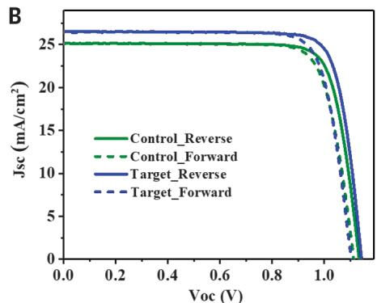

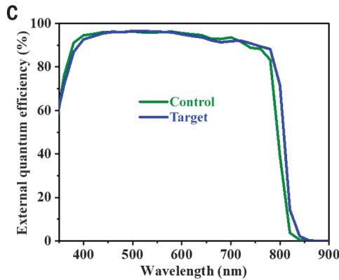

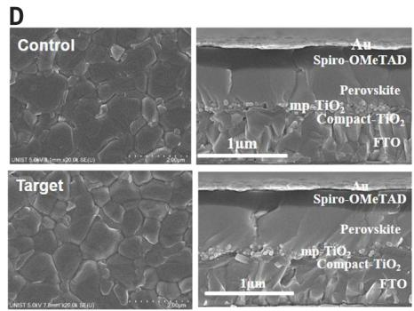  
Fig. 2. Device performance. (A) PCE of perovskite solar cells fabricated with different $x$ values of $\mathrm{FAPbI}_3: x\mathrm{MDACI}_2$ ( $x = 0, 1.9, 3.8,$ and $5.7 \, \mathrm{mol} \, \%$ ) and the control. (B and C) Comparison of (B) $I-V$ curves and (C) external quantum efficiency between target ( $x = 0.38 \, \mathrm{mol} \, \%$ ) and control. (D) Comparison of surface morphologies and cross-sectional images of target and control acquired with scanning electron microscopy.

$\alpha$ -to $\delta$ -phase transition (fig. S8). Therefore, in terms of efficiency and phase stability, we fixed $3.8\mathrm{mol}\%$ in an appropriate amount and compared its characteristics with the control. We passivated the surface of the target and control layers by means of previously reported methods (9, 11, 38, 39), including ours (40). Figure 2B compares the current density-voltage $(J - V)$ characteristics, reverse and forward bias sweep, for one of the "best-performing" PSCs fabricated with $3.8\mathrm{mol}\%$ $\mathrm{MDACl}_2$ (denoted as the target) and the control. The $J_{\mathrm{SC}}$ , $V_{\mathrm{OC}}$ , and FF values (table S1) calculated from the $J - V$ curves of the target were estimated as $26.50\mathrm{mAcm}^{-2}$ , $1.14\mathrm{V}$ , and $81.77\%$ , respectively; these correspond to a PCE of $24.66\%$ under standard air mass (AM) 1.5 conditions, mainly the result of the very high $J_{\mathrm{SC}}$ value. The control exhibited a PCE of $23.05\%$ , with $J_{\mathrm{SC}} = 25.14\mathrm{mA cm}^{-2}$ , $V_{\mathrm{OC}} = 1.14\mathrm{V}$ , and FF = $80.55\%$ . As expected, the surface passivation of perovskite layers improved both $V_{\mathrm{OC}}$ and FF, but $J_{\mathrm{SC}}$ remained almost unchanged, which resulted in a PCE of $>24\%$ . The external quantum efficiency comparison of the control and target in Fig. 2C showed that the efficiency improvement of the PSC with $\mathrm{MDACl}_2$ was the result of the expansion of the range of absorption wavelengths.

The improvement in PCE with a suitable amount of MDA meant that the negative influence of $V_{\mathrm{FA}}$ defects was compensated by other beneficial factors. Because the PCE of

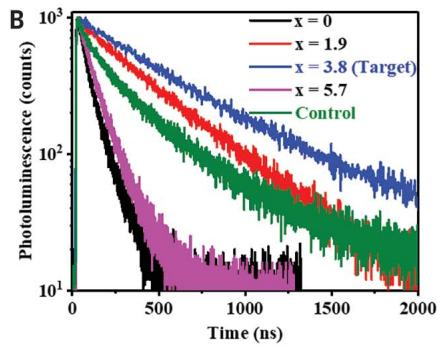

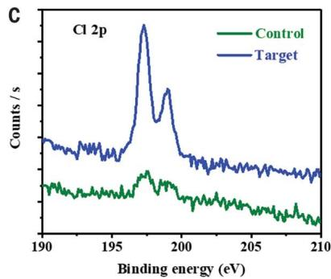

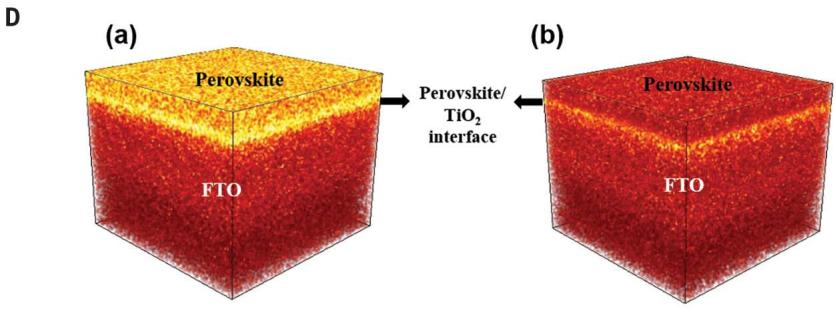

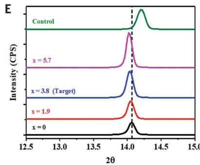  
Fig. 3. Changes of defects and $\mathbf{Cl}^{-}$ ions resulting from the doping of $\mathsf{MDACl_2}$ . (A) Dark $I - V$ curves of electron-only devices and (B) PL decay (on quartz substrate) of perovskite layers of $\mathsf{FAPbl}_3\mathsf{xMDACl_2}$ ( $x = 0, 1.9, 3.8$ , and $5.7\mathrm{mol}\%$ ) and control. (C) X-ray photoelectron spectroscopy of Cl 2p and (D) time-of-flight secondary ion mass spectrometry of Cl anion results of FTO/Bi- $\mathsf{TiO_2}$ /mp- $\mathsf{TiO_2}$ /perovskite (a) target and (b) control layer (measurement area $50~{\mu\mathrm{m}}$ by $50~{\mu\mathrm{m}}$ ). (E) XRD patterns of perovskite layers of $\mathsf{FAPbl}_3\mathsf{xMDACl_2}$ ( $x = 0, 1.9, 3.8$ , and $5.7\mathrm{mol}\%$ ) and control magnified (001) orientation peaks.

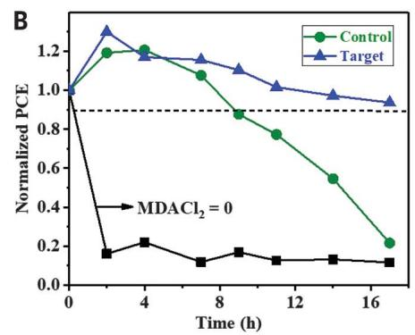

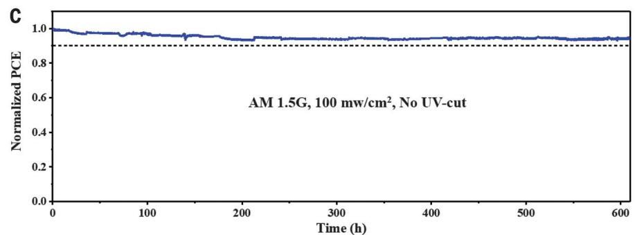  
Fig. 4. Long-term stability test. Comparison of (A) humidity (85% RH, $25^{\circ}\mathrm{C}$ ) and (B) thermal (150°C at $\sim 25\%$ RH) stability performances of unencapsulated control and target. (C) Maximum power point tracking measured with the encapsulated target device under full solar illumination (AM 1.5 G, 100 mW/cm² in ambient conditions) without a UV filter.

PSCs depends on the surface morphology of the perovskite layers, we compared the surface roughness and grain sizes of the target and the control with scanning electron microscopy. We found no notable differences in the cross-sectional thickness of the two representative layers, the control and the target (Fig. 2D), so the introduction of $\mathrm{MDACl_2}$ into the precursor of $\mathrm{FAPbI_3}$ did not affect the features of the perovskite layers. The performance factors for the device shown in Fig. 2B, certified by an accredited laboratory (Newport, USA) by means of the quasi-steady-state (QSS) method, a newly established measurement standard for certification, were $J_{\mathrm{SC}} = 26.1\mathrm{mAcm}^{-2}$ , $V_{\mathrm{OC}} = 1.15\mathrm{V}$ , and $\mathrm{FF} = 79.0\%$ , which corresponds to a stabilized PCE of $23.73\%$ , the highest reported for devices using $\mathrm{mp - TiO_2}$ as an electrode (fig. S9). Another certified device recorded a very high $J_{\mathrm{SC}}$ ( $26.70\mathrm{mAcm}^{-2}$ ) value, which is the highest reported in $\mathrm{FAPbI_3}$ -based PSCs, along with $V_{\mathrm{OC}} = 1.144\mathrm{V}$ and $\mathrm{FF} = 77.56\%$ , corresponding to a stabilized PCE value of $23.69\%$ (fig. S10). As per the certification process, the $J_{\mathrm{SC}}$ and $V_{\mathrm{OC}}$ values obtained from the QSS method were similar to the corresponding ones of the $I - V$ measurements conducted in the reverse-bias mode; however, the FF was reduced.

The presence of $V_{\mathrm{FA}}$ defects may have resulted in an increase in the electron-carrier density in the conduction band in $\mathrm{FAPbI}_3$

which can be expressed using Eq. 3:

$$
\left(\mathrm {F A} _ {1 - x} ^ {+ 1} \mathrm {M D A} _ {x} ^ {+ 2}\right) \mathrm {P b} ^ {2 +} \mathrm {I} _ {3} ^ {- 1} \mathrm {C l} _ {x} ^ {- 1} \rightarrow [ (\mathrm {F A} _ {1 - x} ^ {+ 1} \mathrm {M D A} _ {x} ^ {+ 2})
$$

$$
\mathrm {P b} ^ {2 +} \mathrm {I} _ {3} ^ {- 1} ] ^ {x +} + x \mathrm {C l} ^ {-} \rightarrow [ (\mathrm {F A} _ {1 - x} ^ {+ 1} \mathrm {M D A} _ {x} ^ {+ 2})
$$

$$
\left. \mathrm {P b} ^ {2 +} \mathrm {I} _ {3} ^ {- 1} \right] ^ {x +} + x e _ {\mathrm {C B}} ^ {-} + \frac {x}{2} \mathrm {C l} _ {2} \tag {3}
$$

Defects in semiconductors can capture and trap free charges, and thus the electrical properties of the material can change after all the defects are "filled" with charge in the trap-fill limit. To quantitatively assess defect density, we fabricated an electron- and hole-only device with the configuration of fluorine-doped tin oxide(FTO)/ $\mathrm{SnO}_2/$ perovskite/phenyl-C61-butyric acid methyl ester(PCBM)/Au and FTO/poly(3,4-ethylenedioxythiophene)-poly (styrenesulfonate)(PEDOT:PSS)/perovskite/ poly(triaryl amine)(PTAA)/Au, and characterized the evolution of the space-charge-limited current for different biases. The sharp rise in the $J - V$ curve (Fig. 3A) correlated with the trap-filled limit. The defect density was calculated according to the following equation:

$$
N _ {\text {d e f e c t s}} = 2 \varepsilon \varepsilon_ {0} V _ {\mathrm {T F L}} / e L ^ {2} \tag {4}
$$

Where $\varepsilon$ and $\varepsilon_0$ represent the dielectric constants of $\mathrm{FAPbI}_3$ and the vacuum permittivity, respectively, $L$ the thickness of the obtained perovskite film, and $e$ the elementary charge. We estimated the corresponding electronic

trap densities $(N_{\mathrm{defects}})$ to be $5.4\times 10^{15}$ , $7.6\times$ $10^{15}$ , $5.7\times 10^{15}$ , and $8.0\times 10^{15}\mathrm{cm}^{-3}$ for $x = 0,1.9,$ 3.8, and 5.7, respectively, in $\mathrm{FAPbI}_3:x\mathrm{MDACl}_2$ and $1.0\times 10^{16}\mathrm{cm}^{-3}$ for the control. Thus, the addition of $\mathrm{MDACl}_2$ had little effect on the electron trap densities, although the hole-trap density for the hole-only device decreased with the addition of $\mathrm{MDACl}_2$ relative to the control (fig.S11).

Furthermore, we compared the charge-carrier lifetimes of the target and control deposited on a quartz substrate. Figure 3B shows the time-dependent photoluminescence recorded with a commercial time-correlated single-photon counting instrument. The lifetime for nonradiative recombination for the target was 1562 ns, longer than that of the control (715 ns). The recombination value was obtained with the use of the following biexponential equation: $Y = A_{1}\exp (-t / \tau_{1}) + A_{2}\exp (-t / \tau_{2})$ , where $\tau_{1}$ and $\tau_{2}$ denote the fast and slow decay time constants, respectively, and are related to the radiative and trap-assisted nonradiative recombination processes.

The increase in the charge-carrier lifetime indicates the presence of another beneficial factor, and we focused on the coexistence of $\mathrm{Cl^-}$ in the $\mathrm{FAPbI_3}$ lattice substituted for $\Gamma^-$ sites, in interstitial sites, or both. A small amount of $\mathrm{Cl^-}$ substitution can reduce the lattice strain of $\mathrm{FAPbI_3}$ and suppress defect formation. Also, $\mathrm{MDA^{2 + }}$ cations could ease the insertion of smaller $\mathrm{Cl^-}$ ions into the interstitial spaces. The residual Cl content determined by x-ray photoelectron spectroscopy and time-of-flight secondary-ion mass spectrometry (Fig. 3, C and D) of $\mathrm{FAPbI_3}$ with $3.8\mathrm{mol}\%$ $\mathrm{MDACl_2}$ was higher than that of the control in the absence of $\mathrm{MDACl_2}$ . The Cl content was higher at the interface with the $\mathrm{TiO_2}$ electrode, which is expected to increase the light stability of PSCs (41, 42). The small amount of Cl observed in the control is consistent with a previously reported result (43); smaller $\mathrm{Cl^-}$ ions substituted at the I sites of $\mathrm{FAPbI_3}$ contribute to phase stabilization by reducing the lattice strain of the $\alpha$ -phase (44). However, the Cl concentration in $\mathrm{FAPbI_3}$ remained nearly unchanged even when excess $\mathrm{Cl^-}$ ions were added, so we attributed the increase in residual Cl observed in Fig. 3, C and D, to $\mathrm{MDA^{2 + }}$ -related interstitial sites rather than to substitution into I sites. Interstitial $\mathrm{Cl^-}$ ions would account for the slight increase in bandgap (Fig. 1B) and a shift in the XRD peak to a lower angle (Fig. 3E) from an expanded unit cell versus contraction from the increased number of hydrogen bonds (I…H-N) between $\mathrm{PbI_2}$ and MDA and the increased $V_{\mathrm{FA}}$ to compensate for charge neutrality.

We compared the long-term humidity, thermal-, and photostability performances of the unencapsulated control and target in

Fig. 4. We used copper phthalocyanine (CuPC) as the hole-transporting material (HTM) to prevent degradation by hygroscopic dopants and spiro-OMeTAD itself at $150^{\circ}\mathrm{C}$ . The initial device parameters and $J - V$ curves are presented in table S2 and fig. S12, respectively. The target device exhibited higher humidity stability, retaining $>90\%$ of the initial PCE after 70 hours under high humidity [85% relative humidity (RH), $25^{\circ}\mathrm{C}$ ], than the control PCE, which reduced to 40% of the initial value (Fig. 4A). The thermal stability monitored at $150^{\circ}\mathrm{C}$ and $\sim 25\%$ RH (Fig. 4B) indicates that the control device PCE degraded gradually, reaching $< 20\%$ of the initial PCE after 17 hours due to MA evaporation. The target device maintained $>90\%$ of its initial PCE and exhibited greatly improved thermal stability. In addition, the long-term photostability (encapsulation and ambient condition) of the PSC, including spiro-OMeTAD as HTM, was tested with maximum power point tracking under full solar illumination without a UV filter (Fig. 4C). Despite the use of a $\mathrm{TiO_2}$ photoelectrode with high photocatalytic effect, the target device exhibits very high photostability, maintaining $\sim 90\%$ of its initial PCE ( $>23.0\%$ ) over 600 hours of irradiation. This result can be attributed to both the high concentration of Cl ions in the interface between photoelectrode and perovskite (42) and the stabilization of the $\alpha$ -phase on $\mathrm{FAPbI_3}$ by $\mathrm{MDACl_2}$ .

# REFERENCES AND NOTES

1. Q. Han et al., Adv. Mater. 28, 2253-2258 (2016).   
2. G. E. Eperon et al., Energy Environ. Sci. 7, 982-988 (2014).   
3. A. Amat et al., Nano Lett. 14, 3608-3616 (2014).   
4. E. Smecca et al., Phys. Chem. Chem. Phys. 18, 13413-13422 (2016).   
5. T. M. Koh et al., J. Phys. Chem. C 118, 16458-16462 (2014).   
6. N. J. Jeon et al., Nature 517, 476-480 (2015)   
7. D. P. McMeekin et al., Science 351, 151-155 (2016).   
8. M. Saliba et al., Energy Environ. Sci. 9, 1989-1997 (2016).   
9. E. H. Jung et al., Nature 567, 511-515 (2019)   
10. N. J. Jeon et al., Nat. Energy 3, 682-689 (2018).   
11. Q. Jiang et al., Nat. Photonics 13, 460-466 (2019).   
12. E. T. Hoke et al., Chem. Sci. 6, 613-617 (2015).   
13. J.-W. Lee et al., Nat. Commun. 9, 3021 (2018).   
14. Y. Fu et al., Nano Lett. 17, 4405-4414 (2017).   
15. S.-H. Turren-Cruz, A. Hagfeldt, M. Saliba, Science 362, 449-453 (2018).   
16. M. Safdari et al., J. Mater. Chem. A Mater. Energy Sustain. 4, 15638-15646 (2016).   
17. C. Ma, D. Shen, T.-W. Ng, M.-F. Lo, C.-S. Lee, Adv. Mater. 30, 1800710 (2018).   
18. W.-Q. Wu et al., Sci. Adv. 5, eaav8925 (2019).   
19. T. Zhao, C.-C. Chueh, Q. Chen, A. Rajagopal, A. K. Y. Jen, ACS Energy Lett. 1, 757-763 (2016).   
20. J. Lu et al., Adv. Energy Mater. 7, 1700444 (2017).   
21. X. Li et al., J. Am. Chem. Soc. 140, 12226-12238 (2018).   
22. Y. Zhao, K. Zhu, J. Phys. Chem. C 118, 9412-9418 (2014).   
23. F. Xie et al., Energy Environ. Sci. 10, 1942-1949 (2017).   
24. Y. Li et al., Crystals 7, 272 (2017).   
25. A. Dubey et al., J. Mater. Chem. A Mater. Energy Sustain. 6, 2406-2431 (2018).   
26. M. Kim et al., Joule 3, 2179-2192 (2019).   
27. Z. Wang et al., Chem. Mater. 27, 7149-7155 (2015).   
28. C. Mu, J. Pan, S. Feng, Q. Li, D. Xu, Adv. Energy Mater. 7, 1601297 (2017).   
29. C. C. Stoumpos, C. D. Malliakas, M. G. Kanatzidis, Inorg. Chem. 52, 9019-9038 (2013).   
30. J.-W. Lee et al., Adv. Energy Mater. 5, 1501310 (2015).   
31. Z. Li et al., Chem. Mater. 28, 284-292 (2016).   
32. C. Yi et al., Energy Environ. Sci. 9, 656-662 (2016).   
33. A. Binek, F. C. Hanusch, P. Docampo, T. Bein, J. Phys. Chem. Lett. 6, 1249-1253 (2015).   
34. A. D. Jodlowski et al., Nat. Energy 2, 972-979 (2017).   
35. T. Yoon et al., ACS Applied Energy Materials 1, 5865-5871 (2018).

36. B. W. Park et al., Nat. Commun. 9, 3301 (2018).   
37. N. Liu, C. Yam, Phys. Chem. Chem. Phys. 20, 6800-6804 (2018).   
38. J. J. Yoo et al., Energy Environ. Sci. 12, 2192-2199 (2019).   
39. Y. Liu et al., Sci. Adv. 5, eaaw2543 (2019).   
40. H. Kim et al., Adv. Energy Mater., (2019); https://doi.org/10 1002/aenm.201902740.   
41. E. Mosconi, E. Ronca, F. De Angelis, J. Phys. Chem. Lett. 5, 2619-2625 (2014).   
42. H. Tan et al., Science 355, 722-726 (2017).   
43. F. X. Xie et al., ACS Nano 9, 639-646 (2015).   
44. M. I. Saidaminov et al., Nat. Energy 3, 648-654 (2018).

# ACKNOWLEDGMENTS

Funding: This work was supported by the National Research Foundation of Korea (NRF) funded by the Korean government (MSIT 2018R1A3B1052820, 2012M3A6A7054861, and 2015M1A2A2056542) and by the U-K Brand research fund (1.190004.01). Author contributions: S.I.S. designed and supervised the research. H.M. fabricated and characterized the perovskite films and devices. M.K., K.C., and J.H.L. performed the theoretical simulations. S.-U.L. performed the space-charge-limited current measurements. H.K. and G.K. conducted XRD and FT-IR measurements. H.M. and G.K. performed the encapsulation and stability tests of perovskite devices. S.I.S. and H.M. wrote the draft of the manuscript and all authors discussed the results and contributed to the revisions of the manuscript. Competing interests: H.M. and S.I.S. are inventors on a patent application (KR 10-2019-0081424) submitted by the Ulsan National Institute of Science and Technology that covers the MDACl2-stabilized $\alpha$ -FAPbl₃. Data and materials availability: All data needed to evaluate the conclusions in the paper are present in the text or the supplementary materials.

# SUPPLEMENTARY MATERIALS

science.sciencemag.org/content/366/6466/749/suppl/DC1

Materials and Methods

Figs. S1 to S12

Tables S1 to S2

References (45-50)

11 July 2019; accepted 15 October 2019

10.1126/science.aay7044

# Efficient, stable solar cells by using inherent bandgap of $\#$ -phase formamidinium lead iodide

Hanul Min, Maengsuk Kim, Seung-Un Lee, Hyeonwoo Kim, Gwisu Kim, Keunsu Choi, Jun Hee Lee, and Sang Il Seok

Science 366 (6466), . DOI: 10.1126/science.aay7044

# Maintaining the bandgap

The bandgap of the black #-phase of formamidinium-based lead triiodide (FAPbl₃) is near optimal for creating high-efficiency perovskite solar cells. However, this phase is unstable, and the additives normally used to stabilize this phase at ambient temperature—such as methylammonium, caesium, and bromine—widen its bandgap. Min et al. show that doping of the #-FAPbl₃ phase with methylenediammonium dichloride enabled power conversion efficiencies of 23.7%, which were maintained after 600 hours of operation. Unencapsulated devices had high thermal stability and retained >90% efficiency even after annealing for 20 hours at 150°C in air.

Science, this issue p. 749

View the article online

https://www.science.org/doi/10.1126/science.aay7044

Permissions

https://www.science.org/help/reprints-and-permissions

Use of this article is subject to the Terms of service