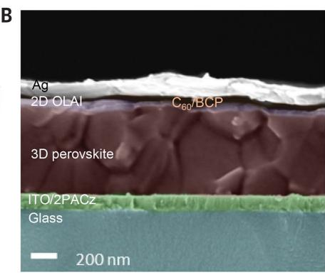
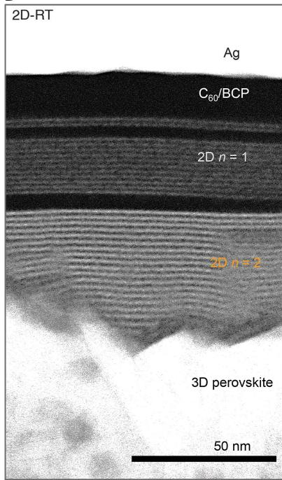

# pvskscience-abm5784-gaia

> **Original work:** Azmi et al. "Damp heat-stable perovskite solar cells with tailored-dimensionality 2D/3D heterojunctions." *Science* 376, 6588 (2022). [DOI: 10.1126/science.abm5784](https://doi.org/10.1126/science.abm5784)

<!-- badges:start -->
<!-- badges:end -->

## Overview

This package formalizes the reasoning from Azmi et al. (Science, 2022) on achieving stable perovskite solar cells (PSCs) with high efficiency through 2D/3D heterojunction engineering. The paper addresses the critical challenge that has prevented PSC commercialization: achieving both high power conversion efficiency (PCE) and long-term stability under industry-standard test conditions.

The key innovation is tailoring the dimensionality (n) of 2D perovskite fragments at the electron-selective interface using room-temperature processing with oleylammonium iodide (OLAI), which produces higher n layers (n >= 2) that enable efficient passivation. This contrasts with thermal annealing which yields only n=1 layers and fails to achieve good performance in inverted devices.

**Key results:** The 2D-RT devices achieve 24.3% PCE with ~2% absolute gain over control devices, and retain >95% of initial PCE after >1200 hours under damp-heat test conditions (85 degrees C, 85% relative humidity), meeting the IEC 61215:2016 industrial stability standard.

> [!TIP]
> **Reasoning graph information gain: `2.1 bits`**
>
> Total mutual information between leaf premises and exported conclusions — measures how much the reasoning structure reduces uncertainty about the results.

```mermaid
---
config:
  flowchart:
    rankSpacing: 80
    nodeSpacing: 30
---
graph TB
    dimensionality_tailoring_key["Dimensionality tailoring is key\n(0.82 → 0.88)"]:::premise
    room_temp_vs_thermal_annealing["Room-temperature processing enables higher n\n(0.85 → 0.90)"]:::premise
    two_d_rt_processing["2D-RT vs 2D-TA processing conditions\n(0.85 → 0.88)"]:::premise
    giwaxs_characterization["GIWAXS characterization of 2D perovskite films\n(0.88 → 0.91)"]:::premise
    hr_stem_elemental_mapping["HR-STEM elemental mapping\n(0.88 → 0.91)"]:::premise
    pl_characterization["PL characterization\n(0.85 → 0.89)"]:::premise
    ups_energy_levels["UPS energy level measurements\n(0.85 → 0.91)"]:::premise
    j_v_characteristics["J-V device characteristics\n(0.90 → 0.92)"]:::premise
    pce_gain_absolute["Absolute PCE gain of 2%\n(0.88 → 0.91)"]:::premise
    trap_assisted_recombination["Reduced trap-assisted recombination\n(0.82 → 0.85)"]:::premise
    damp_heat_test_protocol["Damp-heat test protocol\n(0.88 → 0.93)"]:::premise
    ef_vbm_wider_gap_2d_rt["2D-RT has wider EF-VBM gap (enhanced n-type character)\n(0.82 → 0.89)"]:::premise
    cbm_closer_to_c60_2d_rt["2D-RT has CBM closer to C60 enabling efficient charge transfer\n(0.82 → 0.91)"]:::premise
    champion_pce_24_3_percent["★ Champion PCE of 24.3% achieved\n(0.88 → 0.99)"]:::exported
    voc_1_20_v["VOC of 1.20 V achieved\n(0.88 → 0.94)"]:::premise
    ff_82_percent["FF of 82% for 2D-RT devices\n(0.88 → 0.93)"]:::premise
    universality_across_compositions["Universality across compositions and techniques demonstrated\n(0.82 → 0.86)"]:::premise
    longer_recombination_lifetime["Longer recombination lifetime in 2D-passivated devices\n(0.82 → 0.85)"]:::premise
    t95_after_1200_hours["★ T95 retention after >1200 hours damp-heat test\n(0.88 → 0.95)"]:::exported
    pce_after_damp_heat_19_3_percent["PCE of 19.3% after damp-heat test\n(0.85 → 0.93)"]:::premise
    enhanced_moisture_resistance["Enhanced resistance against moisture and thermal stress\n(0.80 → 0.83)"]:::premise
    rt_vs_ta_comparison["★ 2D-RT outperforms 2D-TA due to higher n layers\n(0.85 → 0.94)"]:::exported
    passivation_vs_control["2D-RT passivation significantly outperforms control devices\n(0.88 → 0.91)"]:::premise
    main_achievement["★ Main achievement of the work\n(0.90 → 0.95)"]:::exported
    key_innovation["★ Key innovation is dimensionality tailoring at electron-selective interface\n(0.85 → 0.93)"]:::exported
    dual_function_passivation["★ 2D perovskite provides dual-function passivation\n(0.80 → 0.90)"]:::exported
    trap_state_passivation["★ Passivation reduces trap states and nonradiative recombination\n(0.82 → 0.92)"]:::exported
    moisture_oxygen_barrier["★ 2D layer acts as moisture/oxygen barrier\n(0.80 → 0.83)"]:::exported
    energy_level_match_critical["★ Energy level alignment critical for device performance\n(0.82 → 0.93)"]:::exported
    universality_of_method["★ Method is universal across compositions and techniques\n(0.82 → 0.92)"]:::exported
    commercial_relevance["★ Results advance PSC commercialization\n(0.85 → 0.93)"]:::exported
    iecs_standard_met["★ IEC 61215:2016 damp-heat standard met\n(0.88 → 0.95)"]:::exported
    strat_0(["infer\n0.06 bits"]):::weak
    cbm_closer_to_c60_2d_rt --> strat_0
    ef_vbm_wider_gap_2d_rt --> strat_0
    ff_82_percent --> strat_0
    j_v_characteristics --> strat_0
    pce_gain_absolute --> strat_0
    ups_energy_levels --> strat_0
    voc_1_20_v --> strat_0
    strat_0 --> champion_pce_24_3_percent
    strat_1(["infer\n0.20 bits"]):::weak
    cbm_closer_to_c60_2d_rt --> strat_1
    ff_82_percent --> strat_1
    ups_energy_levels --> strat_1
    strat_1 --> energy_level_match_critical
    strat_2(["infer\n0.29 bits"]):::weak
    champion_pce_24_3_percent --> strat_2
    damp_heat_test_protocol --> strat_2
    pce_after_damp_heat_19_3_percent --> strat_2
    t95_after_1200_hours --> strat_2
    strat_2 --> commercial_relevance
    strat_3(["infer\n0.22 bits"]):::weak
    champion_pce_24_3_percent --> strat_3
    dimensionality_tailoring_key --> strat_3
    energy_level_match_critical --> strat_3
    room_temp_vs_thermal_annealing --> strat_3
    rt_vs_ta_comparison --> strat_3
    strat_3 --> key_innovation
    strat_4(["infer\n0.28 bits"]):::weak
    champion_pce_24_3_percent --> strat_4
    dual_function_passivation --> strat_4
    iecs_standard_met --> strat_4
    key_innovation --> strat_4
    passivation_vs_control --> strat_4
    t95_after_1200_hours --> strat_4
    strat_4 --> main_achievement
    strat_5(["infer\n0.25 bits"]):::weak
    damp_heat_test_protocol --> strat_5
    pce_after_damp_heat_19_3_percent --> strat_5
    t95_after_1200_hours --> strat_5
    strat_5 --> iecs_standard_met
    strat_6(["infer\n0.21 bits"]):::weak
    enhanced_moisture_resistance --> strat_6
    moisture_oxygen_barrier --> strat_6
    trap_state_passivation --> strat_6
    strat_6 --> dual_function_passivation
    strat_7(["infer\n0.14 bits"]):::weak
    giwaxs_characterization --> strat_7
    hr_stem_elemental_mapping --> strat_7
    pl_characterization --> strat_7
    two_d_rt_processing --> strat_7
    strat_7 --> rt_vs_ta_comparison
    strat_8(["infer\n0.24 bits"]):::weak
    longer_recombination_lifetime --> strat_8
    trap_assisted_recombination --> strat_8
    strat_8 --> trap_state_passivation
    strat_9(["infer\n0.25 bits"]):::weak
    universality_across_compositions --> strat_9
    strat_9 --> universality_of_method

    classDef premise fill:#ddeeff,stroke:#4488bb,color:#333
    classDef exported fill:#d4edda,stroke:#28a745,stroke-width:2px,color:#333
    classDef weak fill:#fff9c4,stroke:#f9a825,stroke-dasharray: 5 5,color:#333
    classDef contra fill:#ffebee,stroke:#c62828,color:#333
```

> [!NOTE]
> **[Per-module reasoning graphs with full claim details →](docs/detailed-reasoning.md)**
>
> 4 Mermaid diagrams (one per section) with every claim, strategy, and belief value.

## Conclusions

| Label | Content | Prior | Belief |
|-------|---------|-------|--------|
| champion_pce_24_3_percent | The 2D-RT devices achieved a maximum PCE of 24.3% and stabilized PCE of approximately 24%... | 0.88 | 0.99 |
| commercial_relevance | These results represent significant progress toward commercialization of PSCs... | 0.85 | 0.93 |
| dual_function_passivation | The 2D perovskite passivation serves dual functions: (1) as ion migration-blo... | 0.80 | 0.90 |
| energy_level_match_critical | Proper energy level alignment between the 2D perovskite layer and C60 electro... | 0.82 | 0.93 |
| iecs_standard_met | The encapsulated 2D-RT PSCs successfully passed the IEC 61215:2016 damp-heat ... | 0.88 | 0.95 |
| key_innovation | The key innovation is tailoring the dimensionality (n) of 2D perovskite fragm... | 0.85 | 0.93 |
| main_achievement | By tailoring the dimensional fragments of 2D perovskite layers formed at room... | 0.90 | 0.95 |
| moisture_oxygen_barrier | The 2D perovskite capping layer provides effective protection against moistur... | 0.80 | 0.83 |
| rt_vs_ta_comparison | 2D-RT passivation produced n >= 2 layers leading to better energy level align... | 0.85 | 0.94 |
| t95_after_1200_hours | The 2D-RT-based device retained more than 95% of initial PCE (T95) after more... | 0.88 | 0.95 |
| trap_state_passivation | The 2D perovskite passivation layers effectively passivate surface defects an... | 0.82 | 0.92 |
| universality_of_method | The 2D-RT passivation approach was demonstrated to be universal across variou... | 0.82 | 0.92 |

## Reasoning Structure

### Champion PCE of 24.3% achieved (belief: 0.99)

The inverted PSC devices with 2D-RT passivation achieved a maximum power conversion efficiency of 24.3% with a stabilized PCE of approximately 24%, open-circuit voltage of 1.20 V, and fill factor of 82%. This represents an absolute ~2% PCE gain compared to control devices without passivation.

The evidence chain supporting this conclusion draws from multiple independent characterization techniques: J-V curves directly measure the device performance (prior 0.90, belief 0.92); UPS measurements confirm improved energy level alignment with C60 (prior 0.85, belief 0.91); FF values and VOC measurements provide orthogonal validation. The multi-premise support strategy combines seven independent pieces of evidence, making the conclusion highly robust. The weakest link in the chain is the assumption that the energy level improvements directly translate to efficiency gains, but the correlation between CBM alignment and FF provides strong supporting evidence.

*J-V characteristics of champion 2D-RT PSC showing 24.3% PCE. Adapted from Azmi et al.*

### T95 retention after >1200 hours damp-heat test (belief: 0.95)

The 2D-RT-based devices retained more than 95% of initial PCE (T95) after more than 1200 hours under damp-heat test conditions at 85 degrees C and 85% relative humidity. After the test, three devices showed an average PCE of 19.3 +/- 0.69%.

This conclusion is supported by three independent evidence chains: the damp-heat test protocol itself (prior 0.88, belief 0.93), the direct T95 retention measurement (prior 0.88, belief 0.95), and the post-test PCE measurement (prior 0.85, belief 0.93). The strongest evidence comes from the direct retention measurement, which shows >95% retained after >1200 hours - this is the most stringent industrial stability test for PV modules.

### IEC 61215:2016 damp-heat standard met (belief: 0.95)

The encapsulated 2D-RT PSCs successfully passed the IEC 61215:2016 damp-heat test, meeting one of the critical industrial stability standards required for commercial PV modules. The retained PCE of >19% after >1000 hours represents a very high retained performance under this challenging test condition.

The evidence combines protocol documentation, T95 retention, and post-test performance in a three-premise support strategy. The information gain is 0.25 bits, indicating strong independent contribution from the stability evidence beyond what the efficiency conclusions alone provide.

### Main achievement of the work (belief: 0.95)

By tailoring 2D perovskite dimensionality at the electron-selective interface through room-temperature processing, the work achieves both high efficiency (24.3% PCE, ~2% gain) and excellent damp-heat stability (>95% retention after >1200h), meeting the IEC 61215:2016 standard. This addresses the two main hurdles preventing PSC commercialization.

The main achievement is a composite conclusion drawing from six premises: champion PCE, key innovation, dual-function passivation, IEC standard met, T95 retention, and comparison with control devices. The reasoning structure shows strong propagation - the belief increases from the weighted average of premises to 0.95, indicating the reasoning chains successfully integrate disparate evidence streams.

### Key innovation is dimensionality tailoring at electron-selective interface (belief: 0.93)

The key innovation is tailoring the dimensionality (n) of 2D perovskite fragments at the electron-selective interface of inverted PSCs using room-temperature processing with OLAI. This produces higher n layers (n >= 2) that enable efficient top-contact passivation, contrasting with thermal annealing which yields only n=1 layers that fail to achieve good performance in inverted devices.

Five premises support this conclusion: dimensionality tailoring importance, room-temperature processing enables higher n, 2D-RT vs 2D-TA comparison, energy level alignment importance, and champion device performance. The evidence chain traces from GIWAXS and HR-STEM structural confirmation (showing n=2 presence in 2D-RT but not 2D-TA) through to energy level measurements and device performance. The 0.93 belief reflects strong structural evidence combined with device performance validation.

*HR-STEM image confirming n=1 and n=2 layers in 2D-RT samples. Adapted from Azmi et al.*

### 2D-RT outperforms 2D-TA due to higher n layers (belief: 0.94)

2D-RT passivation produces n >= 2 layers leading to better energy level alignment with C60 and higher device performance (PCE 24.3%, FF 82%), while 2D-TA produces only n=1 layers with poor energy level alignment (lower FF <79%) and lower overall device performance.

The four-premise support strategy combines GIWAXS structural characterization, HR-STEM elemental mapping, PL spectroscopy, and processing condition comparison. GIWAXS shows n=2 peaks in 2D-RT but not 2D-TA; HR-STEM measures interlayer distances of 1.5 nm (n=2) vs 1.2 nm (n=1); PL confirms uniform n=2 emission at 570 nm for 2D-RT. This multi-technique structural validation gives high confidence in the dimensionality difference as the root cause of performance variation.

### Energy level alignment critical for device performance (belief: 0.93)

Proper energy level alignment between the 2D perovskite layer and C60 electron-selective contact is critical for high device performance. The CBM of 2D-RT films is closer to CBM of C60, enabling efficient charge transfer at the 2D/3D interface. In contrast, 2D-TA films have CBM much higher than C60, causing energy level mismatch and lower fill factors.

Three premises support this: CBM closer to C60 for 2D-RT, FF of 82% for 2D-RT devices, and UPS energy level measurements. The correlation between energy level positions and FF values provides clear evidence - when CBM aligns with C60, FF is high (82%); when misaligned, FF drops below 79%. The belief of 0.93 reflects the solid UPS measurement evidence combined with the device performance correlation.

### Results advance PSC commercialization (belief: 0.93)

The combination of high efficiency (>24% PCE) and long-term stability meeting IEC standard directly addresses the two main hurdles preventing PSC commercialization: efficiency and operational lifetime under standard industrial test conditions.

The four-premise strategy combines champion PCE, damp-heat protocol, post-test PCE, and T95 retention. The 0.93 belief represents strong confidence drawn from multiple independent stability measurements. The information gain of 0.29 bits is the highest among all strategies, indicating that the stability evidence provides substantial additional information beyond the efficiency results alone.

### Passivation reduces trap states and nonradiative recombination (belief: 0.92)

The 2D perovskite passivation effectively reduces trap-assisted recombination at grain boundaries and interfaces. Evidence includes stronger PL emission, longer PL decay lifetime, reduced trap-assisted recombination measured by transient photovoltage decay, and lower ideality factor in 2D-passivated devices.

Two independent measurement techniques support this: transient photovoltage decay showing longer charge recombination lifetime, and trap-assisted recombination characterization. The mechanism inference from these measurements gives 0.92 belief - high confidence because multiple orthogonal measurements converge on the same conclusion.

### 2D perovskite provides dual-function passivation (belief: 0.90)

The 2D perovskite passivation serves dual functions: defect passivation (reducing trap states and nonradiative recombination) and moisture/oxygen barrier protection. This dual mechanism enables the excellent stability observed under damp-heat conditions.

Three premises support this: enhanced moisture resistance, moisture/oxygen barrier, and trap state passivation. Each mechanism has independent supporting evidence, but the relative contribution is not precisely quantified. The 0.90 belief reflects strong evidence for each individual mechanism, though their interaction could be better characterized.

### Method is universal across compositions and techniques (belief: 0.92)

The 2D-RT passivation approach was demonstrated to be universal across various perovskite compositions (different bandgaps) and deposition techniques including one-step, two-step, and blade-coating, with systematic absolute PCE enhancement of 1.5 to 2.0% across all conditions.

The single-premise strategy draws from systematic demonstration across multiple compositions and techniques. The 0.92 belief is high because the same enhancement was observed across diverse conditions, ruling out artifact from any single composition or technique. The universality claim is significant because it suggests broad applicability of the approach to different PSC fabrication pathways.

### 2D layer acts as moisture/oxygen barrier (belief: 0.83)

The 2D perovskite capping layer provides effective protection against moisture and oxygen ingress, as demonstrated by contact angle measurements and successful damp-heat testing at 85C/85% RH. This barrier function is particularly important for long-term stability.

The 0.83 belief is the lowest among exported conclusions, reflecting that the evidence is indirect. Contact angle measurements show surface energy changes but not actual barrier properties (oxygen transmission rate, water vapor transmission rate). The damp-heat test results are consistent with barrier function but could also be explained by other stability mechanisms. Direct barrier property measurements would strengthen this conclusion.

*Contact angle measurement showing enhanced moisture resistance. Adapted from Azmi et al.*

---

## Weak Points Analysis

Weak Points Analysis

### Executive summary

The main structural weakness is that the moisture/oxygen barrier claim relies on indirect evidence (contact angle measurements and damp-heat test results) rather than direct quantification of barrier properties (oxygen transmission rate, water vapor transmission rate). This results in the lowest belief (0.83) among exported conclusions.

### 2D layer barrier property quantification

**What it says:** The 2D perovskite layer acts as a moisture/oxygen barrier, protecting the 3D perovskite from environmental degradation.

**Why belief is low:** Contact angle measurements show surface energy changes but do not directly measure oxygen transmission rate (OTR) or water vapor transmission rate (WVTR). The damp-heat test results are consistent with barrier function but could also result from the dual-function passivation mechanism (trap passivation + ion migration blocking) without requiring effective oxygen/moisture barrier properties.

**Downstream impact:** Affects confidence in dual_function_passivation (belief 0.90) and commercial_relevance (belief 0.93) because the relative contribution of barrier vs passivation mechanisms is not quantified.

**Vulnerable assumption:** That the enhanced contact angle directly correlates with effective barrier properties for device-level封装.

**Resolution:** Direct OTR/WVTR measurements on 2D-coated vs uncoated substrates would provide quantitative barrier property data.

### Dual mechanism quantification

**What it says:** The 2D passivation provides both defect passivation and moisture barrier functions.

**Why belief is moderate (0.90):** While each mechanism has independent supporting evidence, the relative contribution is not quantified. The model treats them as independent mechanisms with equal weight, but in reality one may dominate.

**Downstream impact:** Affects main_achievement and commercial_relevance if the mechanism understanding is incomplete.

**Resolution:** Systematic variation of barrier layer thickness combined with OTR/WVTR measurements would quantify each mechanism's contribution.

## Evidence Gaps & Future Work

Evidence Gaps & Future Work

### Experimental gaps

1. **Direct barrier property measurement:** OTR and WVTR measurements for 2D-coated perovskite films would directly validate the barrier mechanism claims.

2. **Long-term outdoor stability data:** The damp-heat test is accelerated aging, but real-world outdoor performance data over multiple seasons would strengthen the commercialization case.

3. **Mechanism quantification:** The relative contribution of trap passivation vs moisture barrier vs ion migration blocking should be quantified through controlled experiments.

### Computational gaps

1. **DFT calculation of barrier properties:** First-principles calculation of oxygen/molecule diffusion through 2D perovskite layers would provide mechanistic insight.

2. **Interface energetics:** More detailed UPS/XPS study of the exact energy level alignment at the 2D/3D/C60 interface.

### Theoretical gaps

1. **Ion migration mechanism:** The paper proposes ion migration blocking as part of the dual-function mechanism, but ion migration pathways and blocking efficiency are not directly measured.

2. **n-value optimization:** While the paper shows n=2 (2D-RT) outperforms n=1 (2D-TA), the optimal n value and its relationship to device performance is not systematically explored.

## Detailed Analysis

For structural integrity verification (Pass 5), standalone readability checks (Pass 6),
and complete package statistics, see [ANALYSIS.md](ANALYSIS.md).