# SOLAR CELLS

# Damp heat-stable perovskite solar cells with tailored-dimensionality 2D/3D heterojunctions

Randi Azmi1, Esma Ugur1, Akmaral Seitkhan1, Faisal Aljamaan1, Anand S. Subbiah1, Jiang Liu1, George T. Harrison1, Mohamad I. Nugraha1, Mathan K. Eswaran1, Maxime Babics1, Yuan Chen2, Fuzong Xu1, Thomas G. Allen1, Atteq ur Rehman1, Chien-Lung Wang2, Thomas D. Anthropopoulos1, Udo Schwingenschlögl1, Michele De Bastiani1†, Erkan Aydin1, Stefaan De Wolf1*

If perovskite solar cells (PSCs) with high power conversion efficiencies (PCEs) are to be commercialized, they must achieve long-term stability, which is usually assessed with accelerated degradation tests. One of the persistent obstacles for PSCs has been successfully passing the damp-heat test $(85^{\circ}\mathrm{C}$ and $85\%$ relative humidity), which is the standard for verifying the stability of commercial photovoltaic (PV) modules. We fabricated damp heat-stable PSCs by tailoring the dimensional fragments of two-dimensional perovskite layers formed at room temperature with oleylammonium iodide molecules; these layers passivate the perovskite surface at the electron-selective contact. The resulting inverted PSCs deliver a $24.3\%$ PCE and retain $>95\%$ of their initial value after $>1000$ hours at damp-heat test conditions, thereby meeting one of the critical industrial stability standards for PV modules.

Commercialization of any photovoltaic (PV) technology requires a guaranteed product lifetime of at least 25 to 30 years, as is common for conventional crystalline silicon (c-Si) PV modules. Lifetime predictions of PV technologies are usually accomplished through standardized accelerated degradation tests. After the demonstration of excellent power conversion efficiencies (PCEs) of perovskite solar cells (PSCs), the main challenge toward market entry of PSCs is successfully passing standard industrial lifetime assessment tests of the International Electrotechnical Commission (IEC 61215:2016)—in particular, damp-heat testing at $85^{\circ}\mathrm{C}$ and $85\%$ relative humidity (1, 2). A stabilized PCE performing like a commercial c-Si solar cell (PCE $\sim 20\%$ ) would need to pass a damp-heat test for $>1000$ hours with $< 5\%$ relative loss in PCE (3, 4).

Degradation of encapsulated PSCs is usually caused by leakage in the packaging (allowing atmospheric agents to interact with the perovskite) and device-related material instabilities. To address this, we developed leakage-free device packaging that seals the PSC within two glass sheets, using a vacuum-laminated encapsulant and edge sealing via butyl rubber. Despite this, damp-heat testing of our encapsulated control devices resulted in fast degradation (see below), implying an intrinsic thermal instability of the perovskite absorber layer itself.

The instability of three-dimensional (3D) perovskite films, when used as the photoactive

$^{1}$ Physical Science and Engineering Division, KAUST Solar Center, King Abdullah University of Science and Technology (KAUST), Thuwal 23955-6900, Kingdom of Saudi Arabia. $^{2}$ Department of Applied Chemistry, National Yang Ming Chiao Tung University, Hsin-Chu, Taiwan. *Corresponding author. Email: stefaan.dewolf@kaust.edu.sa †Present address: Department of Chemistry & INSTM, Università di Pavia, 27100 Pavia, Italy.

absorber layer in PSCs, is mainly attributed to high defect densities as well as ion migration at grain boundaries and interfaces, which is exacerbated at higher operational temperatures (5-9). Several approaches have been reported to passivate these defects (7, 10-13). Specifically, growing 2D perovskite layers on the top surface of 3D perovskites creates a 2D/3D perovskite heterojunction that can effectively passivate surface defects and suppress ion migration (3, 6, 14-18).

At the device level, integrating such 2D perovskite passivation layers in PSCs can enhance their PCE and lifetime (3, 4, 14-17). So far, this strategy has been most successful for "regular structured" PSCs in which phase-pure 2D perovskites $(n = 1$ , where $n$ represents the dimensionality of the 2D perovskite by counting the number of its octahedral inorganic sheets) were inserted between the 3D perovskite surface and the (opaque) hole-selective top-contact stack (3, 14-17). For "inverted" devices, this top-contact passivation approach (now at the electron-selective side) has consistently failed in PCE and lifetime; this represents a persistent challenge in the perovskite community (19, 20), as inverted PSCs are arguably easier to fabricate and scale up (11).

We found that tailoring the dimensionality $(n)$ of the 2D perovskite fragments at the electron-selective interface of inverted PSCs is essential to enable efficient top-contact passivation through 2D perovskite passivation layers. This interface has frequently been ignored because it is assumed that the conventional electron-selective layer, $C_{60}$ (or its derivatives), provides sufficient passivation of 3D perovskites (21); instead, attention has predominantly focused on the hole-selective interface of inverted PSCs, situated at the (transparent) bottom contact of the device (22-25). However, recent reports have revealed

that $\mathrm{C}_{60}$ is only weakly bonded to perovskite layers, which induces a high energetic disorder between perovskite and $\mathrm{C}_{60}$ layers that limits device performance at elevated operating temperatures (5, 6, 26). Moreover, a thin layer of $\mathrm{C}_{60}$ is insufficient to effectively protect the 3D perovskite film underneath from moisture or oxygen ingress. Implementing 2D perovskite passivation layers is a promising approach to solve all of the issues mentioned above.

We post-treated the surface defects of the 3D perovskites by applying oleylammonium iodide (OLAI) molecules to form Ruddesden-Popper-phase 2D perovskite layers, which resulted in higher PCEs and prolonged stabilities of inverted PSCs. We tailored the dimensionality, $n$ , of the 2D-perovskite fragments (which also dictates their optical and electronic properties) by tuning the annealing conditions from lower to higher temperatures, in that higher- $n$ layers have a lower formation energy (27). Indeed, all 2D perovskite passivation layers prepared through thermal annealing (2D-TA) showed a dominant emission peak at $\sim 510~\mathrm{nm}$ (as evidenced in fig. S1), which belongs to $n = 1$ , in accordance with previous studies (4, 6, 19, 28). However, the formation of higher-dimensionality 2D perovskite layers ( $n \geq 2$ ) became more pronounced when the post-treatment was performed at room temperature (2D-RT) with the OLAI molecule (Fig. 1A).

We investigated the formation of 2D perovskite passivation films on 3D perovskites with grazing-incidence wide-angle x-ray scattering (GIWAXS; Fig. 1, B and C). The 2D perovskite passivation films exhibited diffraction $q_{z}$ peaks at $\sim 0.2$ to $\sim 0.5 \mathrm{~A}^{-1}$ , corresponding to the (001) and (002) planes of 2D perovskite crystals (28). As expected, the 2D-TA films were dominated by $n = 1$ layers (with a prominent peak at $q_{z} \approx 0.35 \mathrm{~A}^{-1}$ ). In contrast, 2D-RT films exhibited the diffraction peaks of $n = 1$ and $n = 2$ , with a more substantial $n = 2$ peak at lower $q_{z}$ (16). The strong intensity in the $z$ -direction for 2D perovskite films was indicative of a highly oriented lateral direction of the top 3D perovskite layers.

Cross-sectional high-resolution scanning transmission electron microscopy (HR-STEM) images also showed $n = 1$ and $n = 2$ layers in 2D-RT samples (Fig. 1D and fig. S2A) but only $n = 1$ in 2D-TA (fig. S2C), which is consistent with the GIWAXS results. To differentiate between $n = 1$ and $n = 2$ layers, we performed elemental mapping images and profiling positions of 2D perovskite layers; Fig. 1E and fig. S2B show two-dimensionalities of 2D layers in 2D-RT samples as the reduction of the density of C, Pb, and I elements, which correspond to $n = 1$ and $n = 2$ layers. In comparison, 2D-TA samples showed only $n = 1$ (fig. S2D). Further, profiling the position of 2D perovskites from

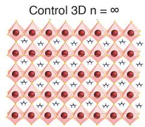  
A

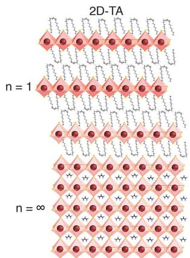

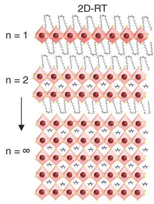

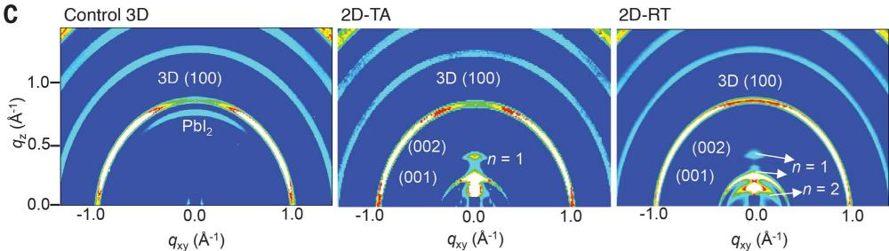  
C   
E

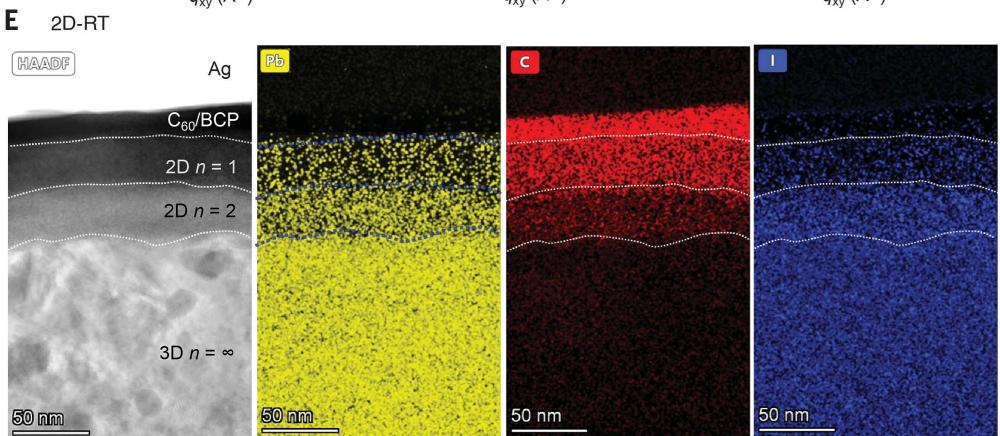  
Fig. 1. Structure of 2D perovskite dimensionality control by tuning the annealing conditions. (A) Schematic illustration of 2D perovskite passivation with different $n$ layers under thermal annealing at $100^{\circ}\mathrm{C}$ (TA) and room-temperature process (RT). (B) Integrated intensity of GIWAXS data along $q_{z}$ .

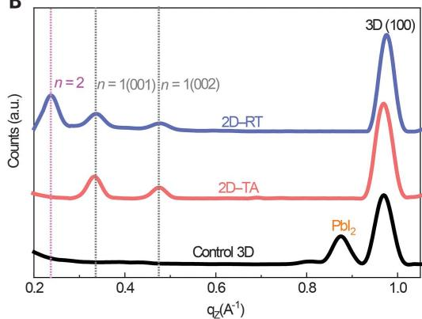  
B

  
D   
(C) GIWAXS maps of each film. (D and E) Cross-sectional HR-STEM image (D) and high-angle annular dark-field (HAADF)/energy-dispersive x-ray spectroscopy elemental map (E) of the cross-sectional STEM image of the 2D-RT samples.

TEM images confirmed the dimensionality of $n = 2$ and $n = 1$ by analyzing average distances between the two closest octahedral inorganic sheets. As a result, higher dimensionality $(n = 2)$ had a wider distance $(\sim 1.5\mathrm{nm})$ relative to $n = 1$ $(\sim 1.2\mathrm{nm})$ (fig. S2, E to H).

Scanning electron microscopy (SEM) topview images revealed that the surface morphology of the perovskite films after 2D perovskite passivation did not change substantially (fig. S3, A and B). Further, the 2D perovskite passivation films exhibited stronger photoluminescence (PL) emission with a longer PL decay lifetime than control 3D perovskite films because of the suppression of nonradiative recombination associated with trap states at the surface (figs. S4 and S5). Interestingly, the 2D perovskite $(n = 2)$ capping layer formed uniformly on top of 3D perovskite surfaces

for 2D-RT, as shown in the PL images in Fig. 2A. In addition, PL spectra in 2D-TA samples showed a dominant emission peak corresponding to $n = 1$ , whereas a PL emission associated with a higher dimensionality of $n = 2$ is more pronounced in 2D-RT samples (see Fig. 2B), in accordance with GIWAXS and TEM results.

The energy-level diagrams of [2-(9H-carbazol-9-yl)ethyl]phosphonic acid (2PACz) anchored on indium tin oxide (ITO) [which we used as the hole-selective contact (22)], perovskites, and $C_{60}$ are shown in Fig. 2C. With the OLAI post-treatment, the secondary electron cutoff $(E_{\mathrm{cutoff}})$ shifted to a higher binding energy, indicating that the ion exchange-induced 3D-to-2D perovskite phase transition could lower the Fermi level $(E_{\mathrm{F}})$ of post-treated perovskite films (fig. S6). Notably, the energetic gap be

tween $E_{\mathrm{F}}$ and the valence band maximum (VBM) of the 2D-RT sample was wider, indicating the enhanced $n$ -type character of post-treated 3D perovskite films, which we attribute to a successful 2D perovskite passivation strategy (19). The conduction band minimum (CBM) of 2D-RT films was also closer to the CBM of $\mathrm{C}_{60}$ at the $n$ -type contact, which resulted in more efficient charge transfer at the 2D/3D perovskite interface and the $\mathrm{C}_{60}$ electron-selective layer. In contrast, the CBM of 2D-TA films was much higher than the CBM of $\mathrm{C}_{60}$ with less $n$ -type character and resulted in less efficient charge transfer of this 2D/3D perovskite interface at the electron-selective contact. In addition, the effects of 2D perovskite capping layers also enhanced the resilience against moisture of 3D perovskite films, as shown by contact angle measurement in fig. S7.

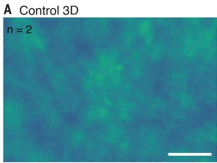

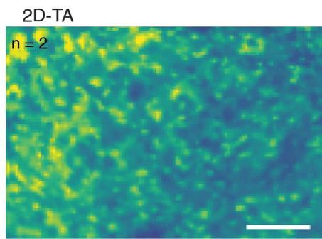

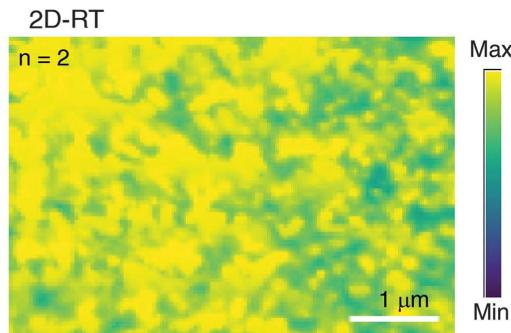

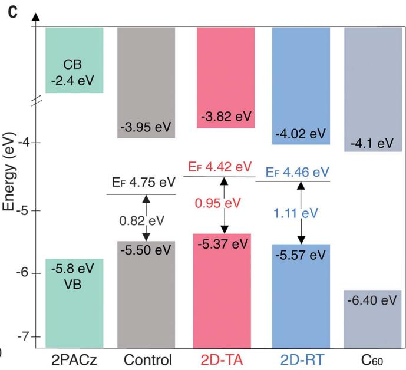  
Fig. 2. Optical characterization and energetic alignments of perovskite films with and without 2D perovskite passivation. (A) PL images of control 3D, 2D-TA, and 2D-RT films at wavelength $\sim570$ nm, which corresponds to $n = 2$ layers (images extracted using PHySpecV2). (B) Normalized PL spectra   
of each film from low to high wavelengths. (C) Energy level scheme for the control and OLAI-treated films extracted from UPS data. The VBM was obtained as $h\nu - (E_{\mathrm{cutoff}} - E_{\mathrm{VB,min}})$ . The position of the CBM with respect to the VBM was defined by optical- $E_{\mathrm{g}}$ (1.55 eV).

Next, we fabricated inverted PSCs with a structure of glass/ITO/2PACz/3D perovskite/ 2D perovskite $\mathrm{C_{60}}$ /bathocuproine (BCP)/Ag Fig.3A);Fig.3B shows the false-colored cross-sectional SEM view of these devices. As shown in the current density-voltage $(J - V)$ characteristics of the devices in Fig. 3C, the 2D-RT devices demonstrated substantially improved PCEs, with a maximum PCE of $24.3\%$ and stabilized PCE of $\sim 24\%$ open-circuit voltage, $V_{\mathrm{OC}}$ of $\sim 1.20\mathrm{V}$ and fill factor, FF,of $\sim 82\%$ fig. S8,A and C). These results represent an absolute $\sim 2\%$ PCE gain upon 2D-RT passivation and can be compared with PCEs for other inverted PSCs see fig.S9A.

Also, 2D-RT passivation enables minimization of the device energy loss $(E_{\mathrm{loss}} = E_{\mathrm{g}} - qV_{\mathrm{OC}}$ , where $q$ is electron charge and $E_{\mathrm{g}}$ is the optical bandgap) up to $0.34\mathrm{eV}$ , which represents $\sim 96\%$ of the thermodynamic limit of the $V_{\mathrm{OC}}$ (1.262 V) for $E_{\mathrm{g}}$ of $1.55\mathrm{eV}$ (fig. S8, D and E). The reduced nonradiative loss in 2D-RT-based devices is comparable with state

of-the-art GaAs solar cells $(V_{\mathrm{OC}}$ of $1.127\mathrm{V}$ yielding $\sim 98\%$ of the thermodynamic limit of the $V_{\mathrm{OC}}$ (29). The 2D-TA passivated devices suffered from lower FF values $(<  79\%)$ figs. S8B and S10), indicative of an energy level mismatch at the electron-selective contact, as derived from ultraviolet photoelectron spectroscopy (UPS) results (20). The narrow statistical distribution of the PCE, $V_{\mathrm{OC}}$ FF, and short-circuit current density $(J_{\mathrm{SC}})$ values of the devices (figs.S8B and S11) confirmed the high reproducibility of our approach. We also confirmed the effectiveness of our approaches by showing less than $0.5\%$ deviation for person-to-person variations of seven different researchers (fig.S12A).

Further, our proposed passivation approach was universal for various perovskite compositions (various bandgaps) and deposition techniques (such as one-step, two-step, and blade-coating), as demonstrated by the systematic absolute PCE enhancement of 1.5 to $2.0\%$ of device performance in fig. S12B.

The reduced trap-assisted recombination of 2D/3D perovskite heterojunction devices was also investigated with transient photovoltage decay and light intensity dependent under open-circuit conditions (fig. S13). The 2D-passivated devices exhibited a longer charge recombination lifetime and lower ideality factor than control devices, confirming the reduced trap-assisted recombination at $3\mathrm{D} / \mathrm{C}_{60}$ interfaces by the 2D perovskite passivation.

Finally, we subjected our 2D perovskite passivation-treated PSCs to a set of rigorous stability tests. First, we evaluated the stability of our encapsulated devices when subjected to industry-relevant damp-heat tests (fig. S14). Here, our 2D-perovskite passivation simultaneously served as ion migration-blocking moisture/oxygen ingress barriers and as defect passivation layers, particularly at elevated operating temperatures (see fig. S15) (3, 14-17). Indeed, the 2D-RT-based device retained $>95\%$ of the initial PCE $(T_{95})$ after $>1200$ hours for champion stability cells (Fig. 3D). Remarkably,

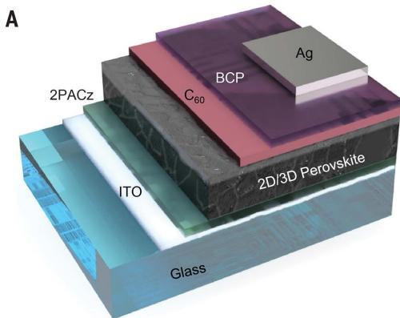

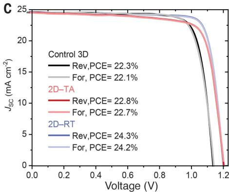

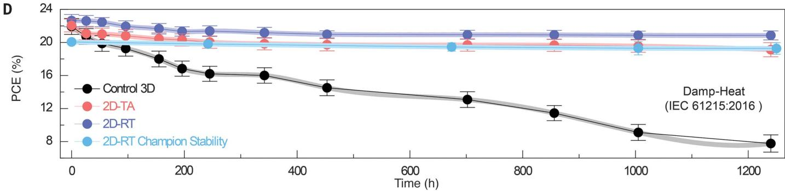

Fig. 3. Device performance and stability of 2D/3D perovskite heterojunction. (A) Device architecture of inverted PSCs. (B) Cross-sectional SEM image of inverted cells.   
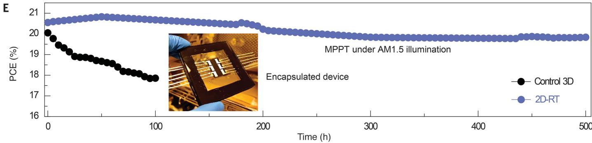  
(c) J-V scan of champion PSCs. (D) Variation of PCEs during damp-heat test of encapsulated devices. The continuous lines are guides to the eye; error bars denote SD.   
(E) Continuous MPPT for the encapsulated control and 2D-RT cells under AM 1.5 illumination in ambient air. Inset: Photograph of the encapsulated device.

after the damp-heat test, three devices showed an average PCE of $19.3 \pm 0.69\%$ .

Our results represent the successful encapsulation of PSCs passing the industry-relevant damp-heat test according to the IEC 61215:2016 protocols (1, 2). Also, our final PCE of $>19\%$ after $>1000$ hours of damp-heat test represents a very high retained PCE (fig. S9B and table S1). There was no substantial change in the structural and optical properties of the 2D perovskite passivation films (both 3D and 2D perovskites) after $>500$ hours of thermal annealing at $85^{\circ}\mathrm{C}$ under dark condition, confirming the robustness of our 2D perovskite passivation approach (fig. S16).

Note that our encapsulated devices used for stability tests exhibited slightly lower initial PCEs than the unencapsulated devices because of $J_{\mathrm{SC}}$ losses originating from the en

capsulant and glass sheets (fig. S17). We also tested unencapsulated devices in our damp-heat chamber, applying thermal tests in ambient air with relative humidity of $>50\%$ (figs. S18 and S19), representative of extreme outdoor conditions. Our 2D capping layer introduced a substantially enhanced resistance of the devices against high moisture and thermal stress. Finally, we performed maximum power point tracking (MPPT) measurements for encapsulated cells under simulated 1-sun illumination in ambient air for $>500$ hours (Fig. 3E). Here, the 2D-RT-based devices retained up to $\sim 95\%$ of their initial PCE after an MPPT test of $>500$ hours, whereas the control devices retained their PCE of $< 90\%$ for only $\sim 100$ hours.

REFERENCES AND NOTES 1. A. Mei et al., Joule 4, 2646-2660 (2020).

2. L. Shi et al., Science 368, eaba2412 (2020).  
3. Y.-W. Jang et al., Nat. Energy 6, 63-71 (2021).  
4. K. T. Cho et al., Energy Environ. Sci. 11, 952-959 (2018).  
5. S. Yang et al., Science 365, 473-478 (2019).  
6. Y. Lin et al., J. Phys. Chem. Lett. 9, 654-658 (2018).  
7. Y.-H. Lin et al., Science 369, 96-102 (2020).  
8. J. Xu et al., Science 367, 1097-1104 (2020).  
9. Y. Zhao et al., Nat. Commun. 11, 6328 (2020).  
10. J. Jeong et al., Nature 592, 381-385 (2021).  
11. S. Chen et al., Science 373, 902-907 (2021).  
12. R. Wang et al., Science 366, 1509-1513 (2019).  
13. H. Zhou et al., Science 345, 542-546 (2014).  
14. J. J. Yoo et al., Energy Environ. Sci. 12, 2192-2199 (2019).  
15. E. H. Jung et al., Nature 567, 511-515 (2019).  
16. A. H. Proppe et al., Nat. Commun. 12, 3472 (2021).  
17. G. Yang et al., Nat. Photonics 15, 681-689 (2021).  
18. Q. Yao et al., Adv. Mater. 32, e2000571 (2020).  
19. D. H. Cao, C. C. Stoumpos, O. K. Farha, J. T. Hupp, M. G. Kanatzidis, J. Am. Chem. Soc. 137, 7843-7850 (2015).  
20. J. Yang et al., Adv. Energy Mater. 10, 2000687 (2020).  
21. Y. Shao, Z. Xiao, C. Bi, Y. Yuan, J. Huang, Nat. Commun. 5, 5784 (2014).  
22. A. Al-Ashouri et al., Energy Environ. Sci. 12, 3356-3369 (2019).  
23. A. Al-Ashouri et al., Science 370, 1300-1309 (2020).

24. E. Aktas et al., Energy Environ. Sci. 14, 3976-3985 (2021).  
25. I. Levine et al., Joule 5, 2915-2933 (2021).  
26. S. Gharibzadeh et al., Energy Environ. Sci. 14, 5875-5893 (2021)  
27. J. Xing et al., Nat. Commun. 9, 3541 (2018).  
28. A. H. Proppe et al., J. Am. Chem. Soc. 141, 14180-14189 (2019).  
29. M. A. Green et al., Prog. Photovolt. Res. Appl. 27, 3-12 (2018)  
ACKNOWLEDGMENTS  
We acknowledge the use of KAUST Solar Center and Core Lab facilities and the support from its staff. We thank A. Prasetio for help in preparing the figures with Adobe Illustrator, and W. Yan for assistance with contact angle measurement. Funding: Supported by the King Abdullah University of Science and Technology (KAUST) Office of Sponsored Research (OSR) under awards OSR-CARF/CCF-3079, OSR-CRG2019-4093, OSR-CRG2020-4350, IED OSR-2019-4208, IED OSR-2019-4580, and

REI/1/4833-01-01. Author contributions: R.A. conceived and conducted the research. R.A., E.A., M.D.B., T.G.A., and S.D.W. wrote the original draft. E.A., E.U., F.A., J.L., and A.S.S. fabricated the devices. E.U. and F.A. performed optical spectroscopy measurements and did data analysis. A.S. conducted TEM measurement and analyses. F.A. helped to measure XRD patterns. G.T.H. performed XPS and U.P.S. measurements and analyses. M.K.E. performed DFT calculations. A.S.S., F.A., and F.Z. performed SEM measurements. Y.C. performed the 2D-GIWAXS measurements. M.I.N. performed the AFM and impedance measurements. A.S.S. performed the characterization of the device, including impedance and transient photo-voltage and current measurements. R.A., M.D.B., and M.B. performed the stability tests. J.L. and A.U.R. helped to fabricate the aperture mask. C.-L.W., T.D.A., U.S., and S.D.W. supervised the project and contributed to the manuscript; funding acquisition by S.D.W. Competing interests: R.A., S.D.W., E.A., and M.D.B. are inventors

on a patent application related to this work filed by King Abdullah University of Science and Technology (KAUST reference 2022-067). The other authors declare no competing interests. Data and materials availability: All data are available in the main text or the supplementary materials.

# SUPPLEMENTARY MATERIALS

science.org/doi/10.1126/science.abm5784  
Materials and Methods  
Figs. S1 to S19  
Table S1  
References (30-38)  
27 September 2021; resubmitted 13 Dec  
Accepted 2 February 2022  
Published online 17 February 2022  
10.1126/science.abm5784

# Damp heat-stable perovskite solar cells with tailored-dimensionality 2D/3D heterojunctions

Randi Azmi, Esma Ugur, Akmaral Seitkhan, Faisal Aljamaan, Anand S. Subbiah, Jiang Liu, George T. Harrison, Mohamad I. Nugraha, Mathan K. Eswaran, Maxime Babics, Yuan Chen, Fuzong Xu, Thomas G. Allen, Atteq ur Rehman, Chien-Lung Wang, Thomas D. Anthropopoulos, Udo Schwingenschlögl, Michele De Bastiani, Erkan Aydin, and Stefaan De Wolf

Science 376 (6588). DOI: 10.1126/science.abm5784

# Stabilizing inverted solar cells

Although inverted (p-i-n) perovskite solar cells (PSCs) have advantages in fabrication and scaling compared with n-i-p cells, their power conversion efficiencies (PCEs) are usually lower. Azmi et al. show that by tailoring the number of octahedral inorganic sheets in two-dimensional perovskite (2DP) passivation layers for three-dimensional perovskite active layers, PCEs of more than $24\%$ could be achieved (see the Perspective by Luther and Schelhas). The 2DP layers formed with oleylammonium iodide molecules at the electron-selective interface passivated trap states and suppressed ion migration. These PSCs retained more than $95\%$ of their initial efficiency after 1000 hours of damp-heat testing $(85^{\circ}\mathrm{C}$ and $85\%$ relative humidity), which passes a key industrial stability standard. —PDS

# View the article online

https://www.science.org/doi/10.1126/science.abm5784

# Permissions

https://www.science.org/help/reprints-and-permissions

Use of this article is subject to the Terms of service