# pvskscience-abn5679-gaia

> **Original work:** Xiaoming Zhao, Tianran Liu, Quinn C. Burlingame, et al. "Accelerated aging of all-inorganic, interface-stabilized perovskite solar cells." *Science* 377, 6603 (2022). [DOI: 10.1126/science.abn5679](https://doi.org/10.1126/science.abn5679)

<!-- badges:start -->

<!-- badges:end -->

## Summary

This paper investigates the operational stability of all-inorganic cesium lead triiodide (CsPbI3) perovskite solar cells (PSCs) under accelerated aging conditions. The authors demonstrate that incorporating a two-dimensional (2D) Cs2PbI2Cl2 capping layer at the perovskite/hole-transport layer interface simultaneously improves power conversion efficiency (from 14.9% to 17.4%) and dramatically enhances thermal stability. Using elevated-temperature accelerated aging tests (35-110C) under constant illumination, they establish an Arrhenius temperature dependence for degradation, enabling extrapolation of intrinsic lifetime. Capped devices show no measurable degradation after 3531 hours at 35C, and require over 2100 hours at 110C to lose 20% of initial efficiency. The acceleration factor of 24.2 at 110C corresponds to a predicted T80 lifetime of 51,000 +/- 7000 hours (over 5 years) at standard operating conditions (35C, 1 sun). The 2D capping layer works by passivating iodine vacancies and suppressing ion migration into the hole-transport layer, which is identified as the primary degradation mechanism in uncapped devices.

## Overview

> [!TIP]
> **Reasoning graph information gain: `3.7 bits`**
>
> Total mutual information between leaf premises and exported conclusions — measures how much the reasoning structure reduces uncertainty about the results.

```mermaid
---
config:
  flowchart:
    rankSpacing: 80
    nodeSpacing: 30
---
graph TB
    t80_lifetime_thousand_hours["★ T80 lifetimes are insufficient for commercialization\n(0.90 → 0.92)"]:::exported
    commercial_requirement_20_years["★ Commercial lifetime requirement exceeds 20 years\n(0.95 → 0.96)"]:::exported
    inorganic_cs_pbi3_chosen["★ Inorganic CsPbI3 chosen for stability\n(0.90 → 0.94)"]:::exported
    champion_pce_uncapped["★ Uncapped champion PCE is 14.9%\n(0.88 → 0.91)"]:::exported
    champion_pce_capped["★ Capped champion PCE is 17.4%\n(0.88 → 0.92)"]:::exported
    capped_improved_ff_and_voc["★ Capped devices show improved FF and VOC\n(0.88 → 0.95)"]:::exported
    giwaxs_new_reflections["★ GIWAXS shows new 2D reflections after CsCl treatment\n(0.90 → 0.92)"]:::exported
    giwaxs_surface_preferential["★ 2D layer forms preferentially at the surface\n(0.85 → 0.88)"]:::exported
    giwaxs_interfacial_nature_confirmed["★ SEM confirms interfacial nature of 2D layer\n(0.85 → 0.88)"]:::exported
    capping_layer_thickness["★ Capping layer thickness is approximately 20 nm\n(0.85 → 0.93)"]:::exported
    trpl_lifetime_uncapped["★ Uncapped film TRPL lifetime is 14 ns\n(0.90 → 0.90)"]:::exported
    trpl_lifetime_capped["★ Capped film TRPL lifetime exceeds 62 ns\n(0.90 → 0.90)"]:::exported
    trpl_implies_suppressed_recombination["★ Increased lifetime indicates suppressed surface recombination\n(0.50 → 0.72)"]:::exported
    no_degradation_capped_35c["★ Capped devices show no degradation at 35°C for 3531 hours\n(0.90 → 0.91)"]:::exported
    two_transport_regimes["★ Two distinct transport regimes observed\n(0.85 → 0.86)"]:::exported
    high_temperature_ion_dominated["★ High-temperature regime is ion-dominated\n(0.80 → 0.82)"]:::exported
    xrd_uncapped_degradation["★ CuSCN XRD peak broadens in aged uncapped PSCs\n(0.90 → 0.91)"]:::exported
    xrd_capped_no_change["★ CuSCN XRD peak unchanged in aged capped PSCs\n(0.90 → 0.92)"]:::exported
    sem_uncapped_pinholes["★ SEM shows pinholes in aged uncapped PSCs\n(0.90 → 0.91)"]:::exported
    sem_capped_no_change["★ SEM shows no degradation in aged capped PSCs\n(0.90 → 0.92)"]:::exported
    xps_iodine_increase_uncapped["★ I 3d signal increases in aged uncapped PSCs\n(0.90 → 0.91)"]:::exported
    xps_no_iodine_capped["★ No I 3d signal in aged capped PSCs\n(0.90 → 0.92)"]:::exported
    giwaxs_angle_dependence["★ GIWAXS angle dependence confirms surface 2D formation\n(0.85 → 0.94)"]:::exported
    trpl_observation["★ TRPL lifetime increases from 14 ns to >62 ns with capping\n(0.85 → 0.86)"]:::exported
    degradation_rate_follows_arrhenius["★ Single Arrhenius function describes degradation across temperature range\n(0.85 → 0.88)"]:::exported
    activation_energy_comparable_fast_slow["★ Ea_fast and Ea_slow are comparable, indicating single mechanism\n(0.80 → 0.84)"]:::exported
    activation_energy_capped_higher["★ Capped PSCs have nearly 2x higher activation energy for degradation\n(0.85 → 0.90)"]:::exported
    ion_migration_speculated["★ Ion migration is the speculated dominant degradation mechanism\n(0.65 → 0.77)"]:::exported
    af_110c_value["★ AF at 110°C is 24.2 ± 3.5 for capped devices\n(0.85 → 0.89)"]:::exported
    t80_110c_capped["★ T80 at 110°C exceeds 2100 hours for capped devices\n(0.85 → 0.87)"]:::exported
    t80_extrapolated_35c["★ T80 at 35°C extrapolated to 51,000 ± 7000 hours\n(0.50 → 0.77)"]:::exported
    ea_ion_uncapped["★ Uncapped films have lower Ea_ion\n(0.85 → 0.86)"]:::exported
    ea_ion_capped_twice_uncapped["★ Capped films have nearly 2x higher Ea_ion\n(0.80 → 0.82)"]:::exported
    passivation_frustrates_ion_migration["★ 2D capping layer passivates iodine vacancies, frustrates ion migration\n(0.50 → 0.71)"]:::exported
    key_results_summary["★ Summary of key quantitative results\n(0.85 → 0.89)"]:::exported
    ion_migration_degradation_mechanism["★ Iodine migration degrades CuSCN HTL in uncapped devices\n(0.70 → 0.83)"]:::exported
    capping_stabilizes_interface["★ 2D capping layer stabilizes perovskite/HTL interface\n(0.80 → 0.96)"]:::exported
    passivation_effect["★ 2D capping layer passivates surface, reduces recombination\n(0.75 → 0.85)"]:::exported
    single_mechanism_arrhenius["★ Single Arrhenius behavior validates accelerated aging test\n(0.85 → 0.96)"]:::exported
    data_collapse_universal_curve["★ Universal curve collapse confirms mechanism consistency\n(0.85 → 0.89)"]:::exported
    intrinsic_lifetime_extrapolation["★ Intrinsic T80 at 35°C is ~5 years based on AF extrapolation\n(0.50 → 0.69)"]:::exported
    stability_comparison["★ Capped devices show superior stability compared to state-of-the-art\n(0.80 → 0.88)"]:::exported
    cation_exchange_challenge["★ Inorganic 2D layer required because Cs+ does not exchange with organic cations\n(0.85 → 0.94)"]:::exported
    thermal_photostability_design["★ All-inorganic stack design maximizes thermal and photostability\n(0.90 → 0.96)"]:::exported
    strat_0(["infer\n0.10 bits"]):::weak
    activation_energy_capped_higher --> strat_0
    sem_capped_no_change --> strat_0
    xps_no_iodine_capped --> strat_0
    xrd_capped_no_change --> strat_0
    strat_0 --> capping_stabilizes_interface
    strat_1(["infer\n0.19 bits"]):::weak
    activation_energy_capped_higher --> strat_1
    champion_pce_capped --> strat_1
    ea_ion_capped_twice_uncapped --> strat_1
    no_degradation_capped_35c --> strat_1
    t80_110c_capped --> strat_1
    t80_extrapolated_35c --> strat_1
    strat_1 --> key_results_summary
    strat_2(["infer\n0.17 bits"]):::weak
    activation_energy_comparable_fast_slow --> strat_2
    af_110c_value --> strat_2
    data_collapse_universal_curve --> strat_2
    degradation_rate_follows_arrhenius --> strat_2
    strat_2 --> single_mechanism_arrhenius
    strat_3(["infer\n0.20 bits"]):::weak
    af_110c_value --> strat_3
    t80_110c_capped --> strat_3
    strat_3 --> t80_extrapolated_35c
    strat_4(["infer\n0.29 bits"]):::weak
    capped_improved_ff_and_voc --> strat_4
    trpl_implies_suppressed_recombination --> strat_4
    strat_4 --> passivation_effect
    strat_5(["infer\n0.22 bits"]):::weak
    champion_pce_capped --> strat_5
    champion_pce_uncapped --> strat_5
    strat_5 --> capped_improved_ff_and_voc
    strat_6(["infer\n0.28 bits"]):::weak
    commercial_requirement_20_years --> strat_6
    t80_extrapolated_35c --> strat_6
    t80_lifetime_thousand_hours --> strat_6
    strat_6 --> stability_comparison
    strat_7(["infer\n0.26 bits"]):::weak
    ea_ion_capped_twice_uncapped --> strat_7
    strat_7 --> passivation_frustrates_ion_migration
    strat_8(["infer\n0.31 bits"]):::weak
    ea_ion_uncapped --> strat_8
    high_temperature_ion_dominated --> strat_8
    two_transport_regimes --> strat_8
    strat_8 --> ion_migration_speculated
    strat_9(["infer\n0.29 bits"]):::weak
    giwaxs_angle_dependence --> strat_9
    giwaxs_interfacial_nature_confirmed --> strat_9
    strat_9 --> capping_layer_thickness
    strat_10(["infer\n0.20 bits"]):::weak
    giwaxs_new_reflections --> strat_10
    giwaxs_surface_preferential --> strat_10
    strat_10 --> giwaxs_angle_dependence
    strat_11(["infer\n0.18 bits"]):::weak
    inorganic_cs_pbi3_chosen --> strat_11
    strat_11 --> cation_exchange_challenge
    strat_12(["infer\n0.18 bits"]):::weak
    inorganic_cs_pbi3_chosen --> strat_12
    strat_12 --> thermal_photostability_design
    strat_13(["infer\n0.29 bits"]):::weak
    sem_uncapped_pinholes --> strat_13
    xps_iodine_increase_uncapped --> strat_13
    xrd_uncapped_degradation --> strat_13
    strat_13 --> ion_migration_degradation_mechanism
    strat_14(["infer\n0.30 bits"]):::weak
    t80_extrapolated_35c --> strat_14
    strat_14 --> intrinsic_lifetime_extrapolation
    strat_15(["infer\n0.23 bits"]):::weak
    trpl_lifetime_capped --> strat_15
    trpl_lifetime_uncapped --> strat_15
    trpl_observation --> strat_15
    strat_15 --> trpl_implies_suppressed_recombination

    classDef premise fill:#ddeeff,stroke:#4488bb,color:#333
    classDef exported fill:#d4edda,stroke:#28a745,stroke-width:2px,color:#333
    classDef weak fill:#fff9c4,stroke:#f9a825,stroke-dasharray: 5 5,color:#333
    classDef contra fill:#ffebee,stroke:#c62828,color:#333
```

> [!NOTE]
> **[Per-module reasoning graphs with full claim details](docs/detailed-reasoning.md)**
>
> 5 Mermaid diagrams (one per module) with every claim, strategy, and belief value.

## Reasoning Structure

### The 2D Cs2PbI2Cl2 capping layer forms at the perovskite surface and has an estimated thickness of 20 nm (belief: 0.93)

GIWAXS measurements show two new reflections after CsCl treatment of CsPbI3 films, corresponding to the (002) and (004) reflections of 2D Cs2PbI2Cl2. The intensity of these reflections decreases at higher incident angles (from 0.15 to 0.30 degrees), confirming preferential surface formation. Cross-sectional SEM confirms the interfacial nature of the layer. XPS depth profiling of chlorine content estimates the capping layer thickness at approximately 20 nm.

**Evidence support:**
- **New 2D reflections in GIWAXS** (belief 0.92): Direct spectroscopic evidence of 2D perovskite formation after CsCl treatment.
- **Angle-dependent intensity** (belief 0.88): Surface-sensitive measurement confirms preferential surface formation.
- **SEM confirmation** (belief 0.88): Direct visual confirmation of interfacial 2D layer.
- **XPS thickness estimate** (belief 0.85): 20 nm thickness derived from chlorine depth profiling.

### The 2D capping layer passivates the surface and suppresses nonradiative recombination (belief: 0.85)

Time-resolved photoluminescence (TRPL) measurements show that the carrier lifetime increases from 14 ns (uncapped) to over 62 ns (capped), indicating effective suppression of nonradiative recombination at the CsPbI3 surface. This is consistent with the observed improvement in open-circuit voltage (VOC) in capped devices. The passivation effect extends the diffusion length of charge carriers.

**Evidence support:**
- **TRPL lifetime increase** (belief 0.90 for both 14 ns and >62 ns): Direct measurement showing 4x lifetime improvement.
- **TRPL observation** (belief 0.86): Comparison between capped and uncapped films.
- **Improved VOC** (belief 0.95): Corroborating electrical evidence of reduced recombination.

### The 2D capping layer stabilizes the perovskite/HTL interface against thermal degradation (belief: 0.96)

After 2000 hours of aging at 110C under continuous illumination, uncapped devices show clear degradation: CuSCN XRD peaks broaden and lose intensity (indicating reduced crystallite size), SEM reveals pinhole formation, and XPS shows iodine accumulation at the HTL surface. Capped devices show no appreciable changes in any of these measurements. The activation energy for degradation in capped devices is nearly twice that of uncapped devices, indicating stronger resistance to thermal degradation.

**Evidence support:**
- **No structural change in capped devices** (belief 0.92 for XRD, SEM, and XPS): All three orthogonal probes confirm stability.
- **Clear degradation in uncapped devices** (belief 0.91): XRD broadening, pinholes, iodine migration all observed.
- **Higher activation energy for capped devices** (belief 0.90): Nearly 2x increase in Ea indicates thermodynamic stabilization.
- **Low information flow (0.10 bits)**: The strategy connecting these observations to the interface stabilization conclusion is weak, but multiple independent probes (XRD, SEM, XPS) compensate.

### Ion migration is the dominant degradation mechanism in uncapped devices (belief: 0.83)

The combined evidence points to iodine migration from the CsPbI3 active layer into the CuSCN hole-transport layer as the primary degradation mechanism. In uncapped devices, iodine accumulation at the HTL surface correlates with CuSCN structural degradation (crystallite size reduction, pinhole formation). Temperature-dependent conductivity measurements show two transport regimes, with the high-temperature regime being ion-dominated. The activation energy of ion migration (Ea_ion) is significantly lower in uncapped films.

**Evidence support:**
- **Iodine accumulation at HTL surface** (belief 0.91): XPS I 3d signal increases substantially in aged uncapped devices.
- **CuSCN structural degradation** (belief 0.91): XRD and SEM show clear structural changes.
- **Lower Ea_ion in uncapped films** (belief 0.86): Direct measurement of ion transport ease.
- **Two transport regimes with ion-dominated high-T regime** (belief 0.82-0.86): Identifies ion migration as the relevant mechanism.

### Capped devices require over 2100 hours at 110C to reach T80, extrapolating to 51,000 +/- 7000 hours at 35C (belief: 0.77)

The acceleration factor at 110C is 24.2 +/- 3.5, determined from the Arrhenius temperature dependence of the degradation rate. At 110C, the average T80 (time to 80% of initial efficiency) for capped devices exceeds 2100 hours. Applying the acceleration factor gives an extrapolated T80 of 5.1 +/- 0.7 x 10^4 hours at 35C. This represents more than 5 years of continuous operation at standard conditions.

**Evidence support:**
- **Measured T80 at 110C >2100 hours** (belief 0.87): Direct experimental measurement from stability curves.
- **Acceleration factor at 110C = 24.2 +/- 3.5** (belief 0.89): Derived from Arrhenius analysis with error propagation.
- **T80 extrapolation** (belief 0.77): Multiplicative combination of two measurements introduces uncertainty propagation.

The extrapolation assumes the Arrhenius temperature dependence holds across the full range, which is supported by the single-mechanism validation (belief 0.96) and universal curve collapse (belief 0.89).

### Single Arrhenius behavior across all temperatures validates the accelerated aging methodology (belief: 0.96)

Degradation rates at 35C, 59C, 85C, and 110C follow a single Arrhenius function, indicating that the same degradation mechanism dominates across the entire temperature range. Both fast and slow degradation components have similar activation energies, suggesting they probe the same physical process. When aging time is multiplied by the acceleration factor, data from all temperatures collapse onto a universal curve for both capped and uncapped devices. This is a critical validation for accelerated aging tests, as it confirms that high-temperature results can be reliably extrapolated to lower operating temperatures.

**Evidence support:**
- **Single Arrhenius function across temperature range** (belief 0.88): Linear Arrhenius plot across 35-110C.
- **Comparable Ea for fast and slow components** (belief 0.84): Suggests single mechanism with biexponential kinetics.
- **Universal curve collapse** (belief 0.89): Data transformation confirms mechanism identity across temperatures.
- **Strong posterior (0.96)**: Multiple independent lines of evidence converge on this conclusion.

### The 2D capping layer passivates iodine vacancies and frustrates ion migration (belief: 0.71)

The activation energy of ion migration (Ea_ion) in capped films is nearly twice that of uncapped films, indicating that ion migration is suppressed by the 2D capping layer. This suppression likely stems from passivation of iodine vacancies at the perovskite surface by the 2D layer. Lower ion mobility explains the improved stability of capped devices.

**Evidence support:**
- **Ea_ion ~2x higher in capped films** (belief 0.82): Direct measurement of ion migration activation energy.
- **Iodine vacancy passivation** (inferential, belief 0.71): The proposed mechanism connecting 2D surface to reduced ion migration.

## Key Findings

| Metric | Value |
|--------|-------|
| Uncapped champion PCE | 14.9% |
| Capped champion PCE | 17.4% |
| Capped TRPL lifetime | >62 ns (vs 14 ns uncapped) |
| Capping layer thickness | ~20 nm |
| T80 at 110C (capped) | >2100 hours |
| Acceleration factor at 110C | 24.2 +/- 3.5 |
| Extrapolated T80 at 35C | 51,000 +/- 7000 hours (~5.8 years) |
| Activation energy ratio (capped/uncapped) | ~2x for both degradation and ion migration |

## Weak Points Analysis

Weak Points Analysis

### The T80 extrapolation relies on long-time assumption validity

The extrapolated T80 of ~51,000 hours at 35C is derived from accelerated testing at 110C using an Arrhenius acceleration factor. While the single-Arrhenius behavior and universal curve collapse support a single-mechanism assumption, the extrapolation spans a very large temperature range. Small errors in activation energy translate to large errors in the extrapolated lifetime. The 14% relative uncertainty (7000/51000) reflects this sensitivity.

### Ion migration is identified as the mechanism but the exact pathway is not fully resolved

Multiple lines of evidence (Ea_ion, XPS iodine accumulation, CuSCN degradation) point to ion migration as the dominant mechanism, but the paper acknowledges it is speculative. The exact pathway (which ion species, through which grain boundaries or interfaces) is not definitively established. Additional characterization (e.g., ToF-SIMS mapping of iodine distribution, electrochemical impedance spectroscopy) would strengthen this conclusion.

### The intrinsic lifetime estimate assumes continuous operation conditions

The T80 extrapolation to 51,000 hours assumes continuous 1-sun illumination at the maximum power point. Real-world deployment involves diurnal cycles, varying light intensity, temperature swings, and electrical bias patterns. The acceleration factor may not accurately capture degradation under these more complex conditions. Field validation under realistic operating profiles would be needed to confirm the laboratory-based lifetime prediction.

### The 17.4% efficiency, while record for all-inorganic PSCs, is still below the threshold for commercial viability

The paper notes that 17.4% is the highest reported efficiency for fully inorganic PSCs. However, this remains significantly below the 25%+ efficiencies achieved by some organic-inorganic hybrid perovskites and well below the theoretical maximum for single-junction silicon solar cells. The stability improvements demonstrated here must be balanced against the efficiency trade-off when considering practical applications.

## Evidence Gaps and Future Work

Evidence Gaps and Future Work

### Experimental gaps

**What measurements are missing or imprecise?**

- Direct imaging of ion migration pathways (e.g., using in-situ TEM or synchrotron X-ray imaging) during aging would validate the proposed mechanism.
- Long-term stability data at 35C is limited to 3531 hours (~5 months). Complete T80 measurement at this temperature would remove the need for extrapolation.
- Statistical population data for the stability measurements is reported in supplementary figures but not fully captured in the claims.

**What experiments would most reduce uncertainty?**

- ToF-SIMS depth profiling of aged devices to map iodine distribution across the full device stack.
- Electrochemical impedance spectroscopy (EIS) to characterize interfacial charge transport before and after aging.
- Outdoor field testing under realistic diurnal and seasonal temperature cycles.

### Theoretical gaps

**What derivations rely on uncontrolled approximations?**

- The biexponential degradation model (two rate constants) is empirically fitted; the physical origin of the two components is not established.
- The Nernst-Einstein equation used to extract Ea_ion from conductivity data assumes ideal ion transport behavior.
- The acceleration factor calculation assumes Arrhenius behavior continues to hold at 35C, where no degradation was observed.

**Where does the theory break down?**

- At lower temperatures (below ~25C), the degradation mechanism might change if a different rate-limiting process dominates.
- The extrapolation to 35C assumes device packaging remains intact over 5+ years; potential package degradation is not modeled.

### Computational gaps

**What calculations are approximate that could be exact?**

- DFT calculations of iodine vacancy formation energy at the CsPbI3 surface with and without 2D capping layer would provide microscopic insight into the passivation mechanism.
- Kinetic Monte Carlo simulations of ion migration could test whether the observed ~2x change in Ea_ion is consistent with vacancy passivation.

## Detailed Analysis

For structural integrity verification (Pass 5), standalone readability checks (Pass 6),
and complete package statistics, see [ANALYSIS.md](ANALYSIS.md).