# SOLAR CELLS

# Accelerated aging of all-inorganic, interface-stabilized perovskite solar cells

Xiaoming Zhao $^{1}$ , Tianran Liu $^{1,2}$ , Quinn C. Burlingame $^{3}$ , Tianjun Liu $^{4}$ , Rudolph Holleyll $^{1}$ , Guangming Cheng $^{5}$ , Nan Yao $^{5}$ , Feng Gao $^{4}$ , Yueh-Lin Loo $^{1*}$

To understand degradation routes and improve the stability of perovskite solar cells (PSCs), accelerated aging tests are needed. Here, we use elevated temperatures (up to $110^{\circ}\mathrm{C}$ ) to quantify the accelerated degradation of encapsulated $\mathrm{CsPbI}_3$ PSCs under constant illumination. Incorporating a two-dimensional (2D) $\mathrm{Cs}_2\mathrm{PbI}_2\mathrm{Cl}_2$ capping layer between the perovskite active layer and hole-transport layer stabilizes the interface while increasing power conversion efficiency of the all-inorganic PSCs from 14.9 to $17.4\%$ . Devices with this 2D capping layer did not degrade at $35^{\circ}\mathrm{C}$ and required $>2100$ hours at $110^{\circ}\mathrm{C}$ under constant illumination to degrade by $20\%$ of their initial efficiency. Degradation acceleration factors based on the observed Arrhenius temperature dependence predict intrinsic lifetimes of $51,000 \pm 7000$ hours ( $>5$ years) operating continuously at $35^{\circ}\mathrm{C}$ .

Although the power-conversion efficiencies (PCEs) of metal halide perovskite solar cells (PSCs) can now exceed $25\%$ , long-term operational instability issues must be addressed before they can be commercialized (1-3). The most stable and efficient PSCs have reported $T_{80}$ lifetimes (the time at which the PCE drops to $80\%$ of its initial value) of just a few hundred or thousand hours (4-7) under continuous illumination,

$^{1}$ Department of Chemical and Biological Engineering, Princeton University, Princeton, NJ 08544, USA. $^{2}$ Department of Electrical and Computer Engineering, Princeton University, Princeton, NJ 08544, USA. $^{3}$ Andlinger Center for Energy and the Environment, Princeton University, Princeton, NJ 08544, USA. $^{4}$ Department of Physics, Chemistry, and Biology (IFM), Linköping University, SE-58183 Linköping, Sweden. $^{5}$ Princeton Institute for the Science and Technology of Materials, Princeton University, Princeton, NJ 08544, USA.  
*Corresponding author. Email: lloo@princeton.edu

versus the $>20$ -year lifetimes required for most commercial applications. Despite an encouraging report of PSCs with a $T_{80}$ of more than 1 year, the PCE of the solar cells is relatively low $(<  13\%)$ (8).Accelerated aging tests can facilitate rapid PSC stability screening (9-11). An effective accelerated stress test can quantify the lifetime acceleration factor (AF) that relates the lifetime under a defined standard operating condition to the lifetime under elevated stress conditions. Thermal and highintensity illumination stress tests with AFs have been developed for organic- and siliconbased PVs (11-15), but developing robust AFs for PSCs is challenging given their complex sensitivities to temperature, light, and electrical bias (10, 16, 17).

Here, we thermally accelerated the degradation of encapsulated $\mathrm{CsPbI}_3$ PSCs operating under constant illumination at their maximum

power point (MPP) with temperatures from $35^{\circ}$ to $110^{\circ}\mathrm{C}$ . The PCE degradation rate followed an Arrhenius temperature dependence that was slowed substantially by incorporating a two-dimensional (2D) $\mathrm{Cs}_2\mathrm{PbI}_2\mathrm{Cl}_2$ capping layer between the perovskite active layer and the hole transport layer (HTL). This 2D layer stabilized the perovskite/HTL interface and suppressed ion migration into the HTL, resulting in a $T_{80}$ lifetime of $>2100$ hours at $110^{\circ}\mathrm{C}$ . With an experimentally determined AF of $24.2 \pm 3.5$ , this lifetime corresponds to an extrapolated $T_{80}$ of $5.1 \pm 0.7 \times 10^{4}$ hours—or more than 5 years of continuous operation at $35^{\circ}\mathrm{C}$ .

The most efficient PSCs have been based on hybrid organic-inorganic perovskites, which contain volatile organic cations, such as methylammonium $(\mathrm{MA}^{+})$ and formamidinium $(\mathrm{FA}^{+})$ . To maximize the thermal stability and photostability of our solar cells, we chose inorganic $\mathrm{CsPbI}_3$ as the photoabsorber (18-20), despite its solar cells exhibiting slightly lower efficiencies. Inorganic $\mathrm{CsPbI}_3$ PSCs with the structure shown in Fig. 1A were fabricated both with (capped) and without (uncapped) a 2D $\mathrm{Cs}_2\mathrm{PbI}_2\mathrm{Cl}_2$ layer between the $\mathrm{CsPbI}_3$ absorber and the CuSCN HTL. The all-inorganic stack that includes $\mathrm{TiO}_2$ , $\mathrm{Al}_2\mathrm{O}_3$ , and CuSCN transport layers, as well as fluorinated tin oxide (FTO) and $\mathrm{Cr / Au}$ electrodes, was designed to maximize the thermal stability and photostability of these devices, as discussed in supplementary text 1 and fig. S1. Photovoltaic characterization of representative as-fabricated devices is shown in Fig. 1, B and C, and fig. S2 and listed in table S1, with population statistics as shown in fig. S3. Capped PSCs have improved fill factors (FFs) and open-circuit voltages $(V_{\mathrm{OC}}$ 's), leading to a champion PCE of $17.4\%$ compared with $14.9\%$ for uncapped devices. This PCE is

(A) Illustration of the capped device structure used in this work with a 2D $\mathrm{Cs_2PbI_2Cl_2}$ layer atop the 3D perovskite active layer. (B) Current-density versus voltage (J-V) characteristics under reverse voltage scan (inset: stabilized power output) and (C) external quantum efficiency (EQE) spectra and integrated $J_{\mathrm{SC}}$ of capped and uncapped champion solar cells.

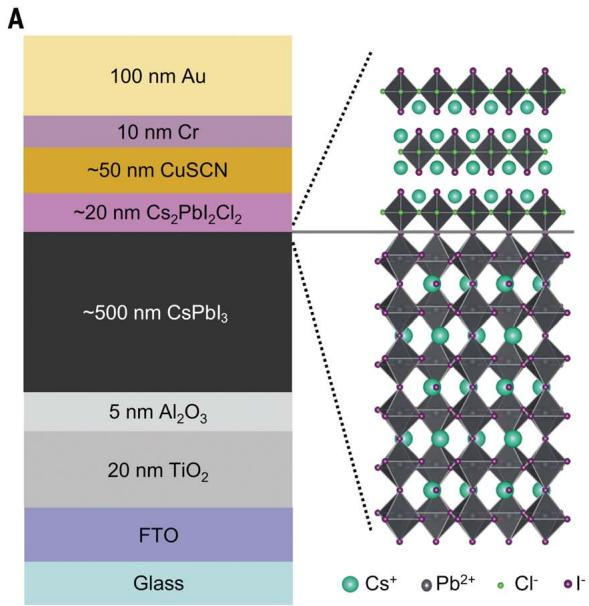  
Fig. 1. Device structure and photovoltaic characterization.

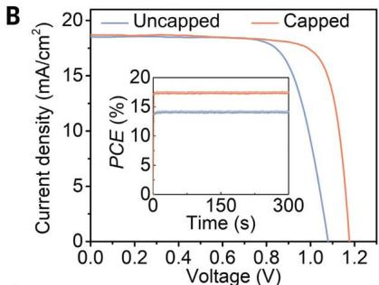

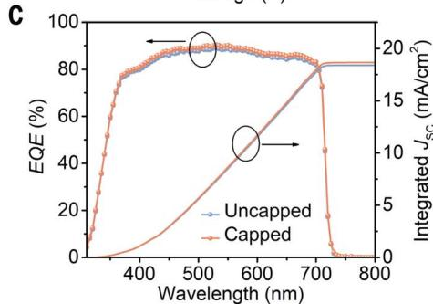

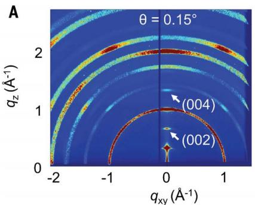

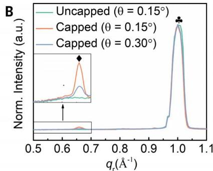

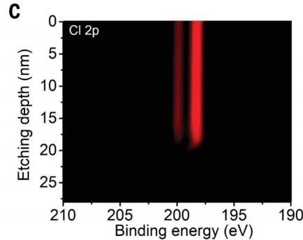

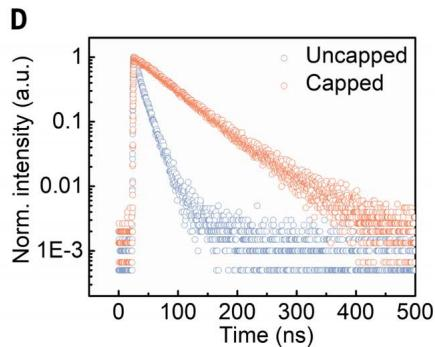  
Fig. 2. Characterization of 2D perovskite capping layers. (A) GIWAXS patterns of a $\mathrm{Cs_2PbI_2Cl_2 / CsPbI_3}$ perovskite stack taken at a surface-sensitive incident angle of $0.15^{\circ}$ . Characteristic reflections of $\mathrm{Cs_2PbI_2Cl_2}$ are indicated. (B) Azimuthally integrated GIWAXS traces collected on uncapped and capped samples at incident angles of $\theta = 0.15^{\circ}$ (more surface-sensitive) and $\theta = 0.30^{\circ}$ (less surface-sensitive). For reference, the critical angle is $\theta = 0.24^{\circ}$ . The diamond indicates the (002) reflection of $\mathrm{Cs_2PbCl_2I_2}$ and the clover indicates the (110) reflection of $\mathrm{CsPbI_3}$ . (C) XPS Cl 2p depth profiling of the $\mathrm{Cs_2PbI_2Cl_2 / CsPbI_3}$ stack. (D) Transient photoluminescence of capped and uncapped films on glass, excited from the film side.

the highest among fully inorganic PSCs in which all the functional materials in the stack are inorganic.

Depositing a thin 2D perovskite capping layer can stabilize the surfaces of organic-inorganic hybrid perovskites, such as $\mathrm{FAPbI}_3$ and $\mathrm{MAPbI}_3$ (21), but this approach has not yet been successfully implemented with inorganic perovskites. This challenge stems from the stronger binding strength of $\mathrm{Cs}^+$ compared to $\mathrm{MA}^+$ or $\mathrm{FA}^+$ , which prevents cation exchange between the $\mathrm{Cs}^+$ of $\mathrm{CsPbI}_3$ and the organic ligands in the applied hybrid organic-inorganic 2D perovskite precursor solution (22-25). To avoid this problem, we deposited a fully inorganic $\mathrm{Cs_2PbI_2Cl_2}$ 2D layer by treating the $\mathrm{CsPbI}_3$ surface with a CsCl solution followed by thermal annealing. Grazing-incidence wide-angle x-ray scattering (GIWAXS) patterns (Fig. 2A and fig. S4) showed two new reflections emerging on $\mathrm{CsPbI}_3$ films after CsCl treatment corresponding to the (002) and (004) reflections of 2D $\mathrm{Cs_2PbI_2Cl_2}$ . Increasing the incident angle of the x-ray beam resulted in a decrease in the relative intensity of these reflections (Fig. 2B), suggesting that the 2D layer formed preferentially on the $\mathrm{CsPbI}_3$ surface. The interfacial nature of this 2D layer was also confirmed by cross-sectional scanning electron microscopy (SEM) imaging of the device (fig. S5). We esti

mated the thickness of the capping layer to be $20\mathrm{nm}$ by tracking chlorine content on the film surface with x-ray photoelectron spectroscopy (XPS) while depth etching (Fig. 2C).

To study the surface passivation effect of this capping layer, we measured time-resolved photoluminescence (TRPL) transients (Fig. 2D). The lifetime of the device increased from 14 to $>62$ ns in the presence of the capping layer, suggesting that it effectively suppressed nonradiative recombination at the $\mathrm{CsPbI}_3$ surface and extended the lifetime and diffusion length of charge carriers (26). This observation is consistent with the observed $V_{\mathrm{OC}}$ increase in capped PSCs (Fig. 1B), whose PV characteristics are tabulated in table S1. This trend was also comparable to previous reports of 2D and 3D PSCs based on organic-inorganic hybrid perovskites that benefited from surface passivation (26-28).

To evaluate the stability of capped and uncapped PSCs, $\mathrm{N}_2$ -encapsulated solar cells (fig. S6) with both structures were aged at their MPP under illumination from a metal halide solar simulator (spectrum shown in fig. S7) at $35^{\circ}$ , $59^{\circ}$ , $85^{\circ}$ , and $110^{\circ}\mathrm{C}$ . Our stability studies used solar cells having the same device configuration as those for PV characterization, including encapsulation and the light aperture. The evolution of the normalized PCE (averaged

from three subcells) for both device types at these operating temperatures, and the evolution for the unnormalized data, normalized short-circuit current $(J_{\mathrm{SC}})$ , $V_{\mathrm{OC}}$ , FF, and external quantum efficiency (EQE), are shown in figs. S8 to S10. Figure S11 shows the operational stability of 2D and 3D PSCs without encapsulation operating at $110^{\circ}\mathrm{C}$ , confirming the robustness of our solar cell packaging. Heating the solar cells reversibly reduced their PCEs (29), which accounts for the differences in the initial PCE of the unnormalized data set in fig. S8. We observe a clear temperature dependence of the PCE degradation rate that can be fitted to a biexponential function of the form

$$
\begin{array}{l} P C E (t) = A 1 * \exp (- k _ {\text {f a s t}} \times t) + \\ A 2 * \exp (- k _ {\text {s l o w}} \times t) + B \tag {1} \\ \end{array}
$$

with a fast and slow degradation rate, $k_{\mathrm{fast}}$ and $k_{\mathrm{slow}}$ . Here, $A1, A2$ , and $B$ are constants and $t$ is time. We fit the data collected across the temperature range using this function with an $R^2 > 0.95$ , except for the data acquired on the capped solar cells operating at $35^{\circ}\mathrm{C}$ because no PCE degradation was observed, even after 3531 hours of continuous operation (Fig. 3B).

To estimate an activation energy for the degradation processes corresponding to $k_{\mathrm{fast}}$ and $k_{\mathrm{slow}}$ , we assume an Arrhenius temperature dependence to the degradation rates

$$
k (T) = A \exp \left(\frac {- E _ {\mathrm {a}}}{k _ {\mathrm {B}} T}\right) \tag {2}
$$

where $k(T)$ is a degradation rate at temperature $T$ , $A$ is constant, $E_{\mathrm{a}}$ is the activation energy of degradation, and $k_{\mathrm{B}}$ is Boltzmann's constant (11-15). Rearranging Eq. 2, the activation energy is equivalent to the slope:

$$
E _ {\mathrm {a}} = - \frac {\partial \ln (k (T))}{\partial \left(\frac {1}{k _ {\mathrm {B}} T}\right)} \tag {3}
$$

The temperature-dependent degradation rates were plotted as a function of inverse temperature in Fig. 3C and fitted to Eq. 3. Degradation rates could be adequately described by a single Arrhenius function across the entire temperature range. This finding suggested that the same degradation mechanism dominated the entire temperature range, which is an important criterion for a reliable accelerated aging test (9). We observed that the activation energies associated with the fast and slow degradation of each type of PSC were comparable, suggesting that the two degradation rates probed a single physical process. As we will discuss in detail below, we speculate that ion migration is the dominant degradation mechanism. The $E_{\mathrm{a}}$ 's that describe the degradation for capped PSCs are nearly twice those for uncapped PSCs, suggesting that the 2D $\mathrm{Cs_2PbI_2Cl_2}$ layer stabilizes the devices against thermal degradation stemming from ion migration.

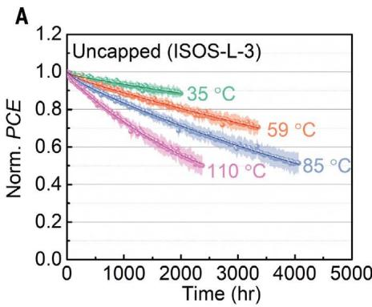

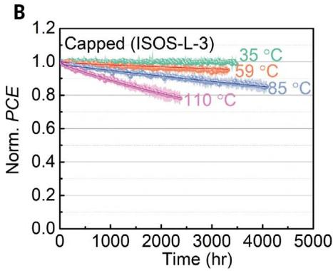

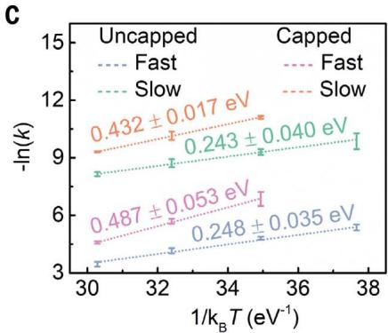

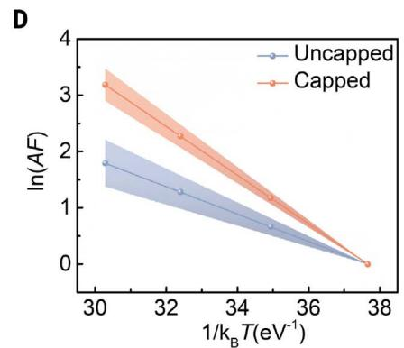

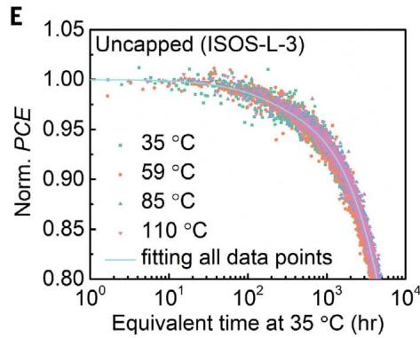

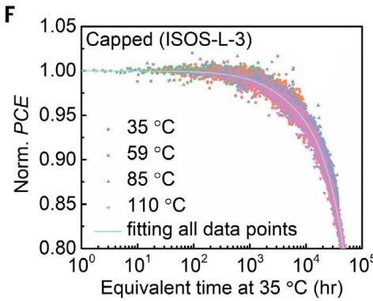  
Fig. 3. Accelerated aging of PSCs operating at elevated temperatures. Operational stability of (A) uncapped and (B) capped PSCs operating at $35^{\circ}$ , $59^{\circ}$ , $85^{\circ}$ , and $110^{\circ}\mathrm{C}$ , with standard deviation envelopes. The encapsulated devices were held at their MPP under constant full-spectrum simulated sunlight (power density $\approx 120\mathrm{mW/cm}^2$ ) in $(65 \pm 26)\%$ relative humidity air. Data points represent average PCE of three devices fabricated and tested under the same condition. The solid lines are biexponential fits to the data. (C) Natural logarithm of degradation rates ( $k_{\mathrm{fast}}$ and $k_{\mathrm{slow}}$ ) versus $1/k_{\mathrm{B}}T$ obtained from biexponential fits to PCEs for uncapped and capped PSCs, where $T$ is the aging temperature.   
Linear fits used to extract the activation energy $(E_{\mathrm{a}})$ from each exponential are shown as the dash lines. Because the capped solar cells operating at $35^{\circ}\mathrm{C}$ did not show noticeable degradation over the time interval studied, their fitted values were not included. (D) Natural logarithm of AF versus $1 / k_{\mathrm{B}}T$ with the standard deviation represented by the shaded area around each line. Standard operating conditions for the AF calculation were defined as 1 sun illumination and $T_{\mathrm{ref}} = 35^{\circ}\mathrm{C}$ . (E and F) Normalized PCE of uncapped and capped PSCs plotted against the equivalent aging time at $35^{\circ}\mathrm{C}$ , defined as aging time (in units of hours) multiplied by the acceleration factor, for PSCs under all temperatures studied in this work.

To extract a meaningful degradation rate at standard operating conditions, $k_{\mathrm{ref}}$ from the accelerated degradation rate at high temperatures, $k_{\mathrm{acc}}$ , we define an AF (II):

$$
A F = \frac {k _ {\mathrm {a c c}}}{k _ {\mathrm {r e f}}} = \exp \left(\frac {E _ {\mathrm {a}}}{k _ {\mathrm {B}}} \left[ \frac {1}{T _ {\mathrm {r e f}}} - \frac {1}{T _ {\mathrm {a c c}}} \right]\right) \tag {4}
$$

where $T_{\mathrm{acc}}$ and $T_{\mathrm{ref}}$ are the operating temperatures during aging at accelerated and standard operating conditions (defined as 1 sun intensity, $35^{\circ}\mathrm{C}$ ). Because $k_{\mathrm{slow}}$ is primarily responsible for long-term degradation and the $E_{\mathrm{a}}$ 's of the two rates are nearly identical, we used the $E_{\mathrm{a}}$ extracted from $k_{\mathrm{slow}}$ and Eq. 4 to obtain AFs for each $T_{\mathrm{acc}}$ (specifically $59^{\circ}$ , $85^{\circ}$ , and $110^{\circ}\mathrm{C}$ ) (Fig. 3D). On the basis of these AFs, we can define an equivalent operating time at $T_{\mathrm{ref}} = 35^{\circ}\mathrm{C}$ for devices aged at elevated temperatures by multiplying their aging time by the acceleration factor (Fig. 3, E and F). When processed in this manner, all of the data collapsed onto a universal curve for both capped and uncapped solar cells, which further confirmed that the same mechanism,

albeit hastened at elevated temperatures, was responsible for degradation across the entire temperature range. With this dataset, we can make $T_{80}$ lifetime predictions for capped devices operating at $35^{\circ}\mathrm{C}$ . This estimate is critical because devices aged at these conditions do not show any PCE degradation, even after continuous operation for 3531 hours. Given that the average experimentally measured $T_{80}$ for capped solar cells operating continuously at $110^{\circ}\mathrm{C}$ is 2100 hours (Fig. 3B), and the AF for the capped solar cells at $110^{\circ}\mathrm{C}$ is $24.2 \pm 3.5$ , we estimated a $T_{80}$ of $5.1 \pm 0.7 \times 10^{4}$ hours at $35^{\circ}\mathrm{C}$ .

To investigate the origins of PSC degradation, we aged full-stack devices at $110^{\circ}\mathrm{C}$ under continuous illumination before peeling off their top electrodes and characterizing the structure of the active layers with x-ray diffraction (XRD). As shown in Fig. 4, A and B, the reflection at $2\theta = 16.15^{\circ}$ corresponding to the (003) reflection of CuSCN in the XRD trace of the uncapped PSCs became broader and less intense after 2000 hours of aging, which suggested a decrease in the CuSCN crystallite size. Clear

degradation of the CuSCN surface in aged, uncapped PSCs was also visible in the SEM images in fig. S12, which show the formation of pinholes and decreased film uniformity. Correspondingly, the I 3d signal increased substantially in the XPS spectrum of the aged HTL surface (Fig. 4C). These results suggest that iodine migration from the $\mathrm{CsPbI}_3$ active layer was responsible for the structural changes in CuSCN in uncapped solar cells, as discussed in supplementary text 2 and figs. S13 and S14. By contrast, the film structure and morphology of CuSCN in capped PSCs did not show appreciable changes after the same duration, as shown in their XRD patterns and SEM images (Fig. 4, A and B, and fig. S12), and we did not observe any appreciable I 3d signal in the XPS spectrum of the HTL surface of capped PSCs (Fig. 4C).

To quantify the ease of ion migration in capped and uncapped films, we measured the temperature-dependent conductivity in two-terminal lateral devices, a widely used method for characterizing ion migration in perovskite films (4, 30, 31). The activation

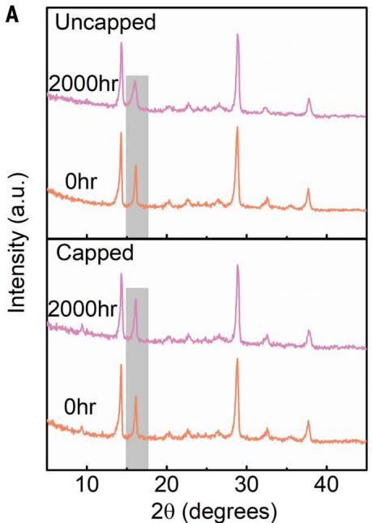

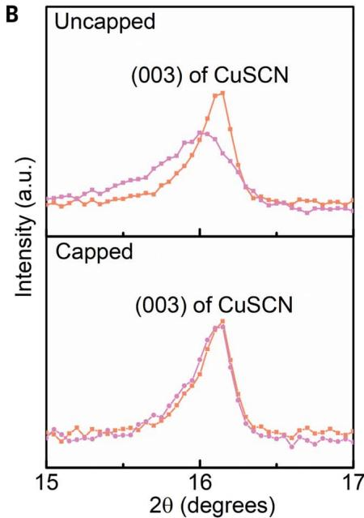

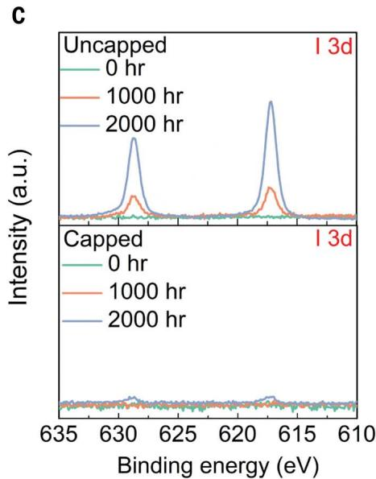

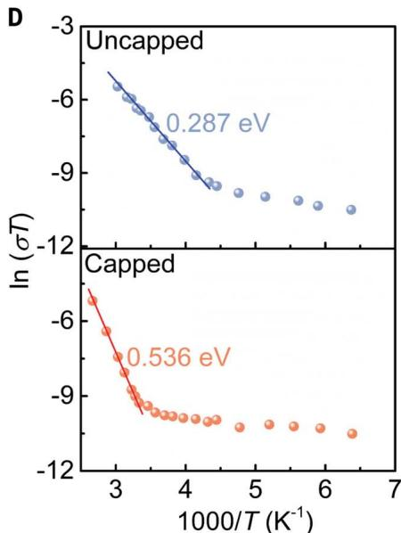  
Fig. 4. Degradation and stabilization mechanism. (A) XRD traces of uncapped and capped PSCs before and after aging for 2000 hours, with (B) the region corresponding to CuSCN (003) diffraction magnified. (C) XPS I 3d spectra of the CuSCN surface in uncapped or capped PSCs with aging time on removal of the top electrode. For studies in (A) to (C), full-stack, functional devices were sealed in $\mathsf{N}_2$ and placed under full-sun illumination at $110^{\circ}\mathrm{C}$ for the specified time before the electrodes were peeled off prior to measurement. (D) Temperature-dependent conductivity $(\sigma)$ of uncapped and capped films.

energy of ion migration $(E_{\mathrm{a,ion}})$ values was extracted by fitting the measured temperature-dependent conductivity $(\sigma)$ to the Nernst-Einstein equation

$$
\sigma (T) = \frac {\sigma_ {0}}{T} \exp \left(\frac {- E _ {\mathrm {a , i o n}}}{k _ {\mathrm {B}} T}\right) \tag {5}
$$

where $\sigma_0$ is a temperature-independent prefactor (30, 31). Plotting $1 / T$ versus $\ln (\sigma T)$ , two distinct regions were present in both capped and uncapped films corresponding to two dis

tinct transport regimes. The high-temperature linear regime, corresponding to ion-dominated transport, was used to extract an approximate $E_{\mathrm{a,ion}}$ (Fig. 4D). Similar to the activation of degradation, the $E_{\mathrm{a,ion}}$ of the capped film is nearly twice that of the uncapped film, indicating that the 2D cap frustrated ion migration. Suppressed ion migration likely stems from passivation of iodine vacancies at the surface of the perovskite active layer in the presence of a 2D capping layer (4, 32, 33), as shown in fig. S15.

# REFERENCES AND NOTES

1. M. Grätzel, Nat. Mater. 13, 838-842 (2014).   
2. N. Li, X. Niu, Q. Chen, H. Zhou, Chem. Soc. Rev. 49, 8235-8286 (2020).   
3. H. Min et al., Nature 598, 444-450 (2021).   
4. S. Yang et al., Science 365, 473-478 (2019).   
5. Z. Dai et al., Science 372, 618-622 (2021)   
6. N. Arora et al., Science 358, 768-771 (2017).   
7. Y. H. Lin et al., Science 369, 96-102 (2020).   
8. G. Grancini et al., Nat. Commun. 8, 15684 (2017).   
9. M. V. Khenkin et al., Nat. Energy 5, 35-49 (2020).   
10. K. M. Anoop et al., Sol. RRL 4, 1900335 (2020).   
11. O. Haillant, D. Dumbleton, A. Zielnik, Sol. Energy Mater. Sol. Cells 95, 1889-1895 (2011).   
12. J. Kettle et al., Sol. Energy Mater. Sol. Cells 167, 53-59 (2017).   
13. Q. Burlingame et al., Adv. Energy Mater. 6, 1601094 (2016).   
14. S. Züfle, R. Hansson, E. A. Katz, E. Moons, Sol. Energy 183, 234-239 (2019).   
15. Q. Burlingame et al., Nature 573, 394-397 (2019).   
16. Z. Wang et al., Nat. Energy 3, 855-861 (2018).   
17. C. Law et al., Adv. Mater. 26, 6268-6273 (2014)   
18. S. M. Yoon et al., Joule 5, 183-196 (2021).   
19. Y. Wang et al., Angew. Chem. Int. Ed. 58, 16691-16696 (2019).   
20. Y. Wang et al., Science 365, 591-595 (2019).   
21. D. L. McGott et al., Joule 5, 1057-1073 (2021).   
22. X. Liu et al., Angew. Chem. Int. Ed. 60, 12351-12355 (2021).   
23. Y. Wang et al., Joule 2, 2065-2075 (2018).   
24. E. M. Sanehira et al., Sci. Adv. 3, eaao4204 (2017).   
25. Y. Wang, T. Zhang, M. Kan, Y. Zhao, J. Am. Chem. Soc. 140, 12345-12348 (2018).   
26. Q. Jiang et al., Nat. Photonics 13, 460-466 (2019).   
27. X. Jiang et al., ACS Appl. Mater. Interfaces 13, 2558-2565 (2021).   
28. W. Shi, H. Ye, J. Phys. Chem. Lett. 12, 4052-4058 (2021)   
29. T. Moot et al., ACS Energy Lett. 6, 2038-2047 (2021).   
30. J. Xing et al., Phys. Chem. Chem. Phys. 18, 30484-30490 (2016).   
31. X. Li et al., Nat. Commun. 9, 3806 (2018).   
32. B. Chen, P. N. Rudd, S. Yang, Y. Yuan, J. Huang, Chem. Soc. Rev. 48, 3842-3867 (2019).   
33. X. Zhao, T. Liu, Y.-L. Loo, Adv. Mater. 34, e2105849 (2022).

# ACKNOWLEDGMENTS

The authors thank E. Tsai and R. Li from Brookhaven National Laboratory for their assistance with x-ray scattering measurements. Funding: X-ray scattering measurements were conducted at the Center for Functional Nanomaterials (CFN) and the Complex Materials Scattering (CMS) beamline of the National Synchrotron Light Source II (NSLS-II), which both are US DOE Office of Science Facilities, at Brookhaven National Laboratory under Contract No. DE-SC0012704. The authors acknowledge the use of Princeton's Imaging and Analysis Center, which is partially supported through the Princeton Center for Complex Materials (PCCM), a National Science Foundation (NSF)-MRSEC program (DMR-2011750). Y.-L.L. acknowledges support from the National Science Foundation, under grants DMR-1627453 and CMMI-1824674. F.G. acknowledges the Swedish Government Strategic Research Area in Materials Science on Functional Materials at Linkoping University (Faculty Grant SFO-Mat-LiU No. 2009-00971). T.R.L. thanks the Julis Romo Rabinowitz Graduate Fellowship for funding. Q.C.B. thanks the Arnold and Mabel Beckman Foundation for supporting this work. Author contributions: Y.-L.L. directed and supervised the project. X.Z. conceived the idea, initialized the project, and contributed to films and devices fabrication and characterization. T.R.L. and Q.C.B. contributed to accelerated stability studies. T.J.L. and F.G. contributed to temperature-dependent conductivity studies. R.H. contributed to XRD refinements. G.C. and N.Y. contributed to device stack imaging. All authors contributed to discussions and to finalizing the manuscript. Competing interests: None declared. Data and materials availability: All data needed to evaluate the conclusions in the paper are present in the paper or the supplementary materials. License information: Copyright © 2022 the authors, some rights reserved; exclusive licensee American Association for the Advancement of Science. No claim to original US government works. https://www.science.org/about/science-licenses-journal-article-reuse

# SUPPLEMENTARY MATERIALS

science.org/doi/10.1126/science.abn5679

Materials and Methods

Supplementary Text

Figs. S1 to S15

Table S1

References (34-55)

Submitted 5 December 2021; accepted 19 April 2022

Published online 16 June 2022

10.1126/science.abn5679

# Accelerated aging of all-inorganic, interface-stabilized perovskite solar cells

Xiaoming Zhao, Tianran Liu, Quinn C. Burlingame, Tianjun Liu, Rudolph Holley, III, Guangming Cheng, Nan Yao, Feng Gao, and Yueh-Lin Loo

Science 377 (6603), DOI: 10.1126/science.abn5679

# A cap against aging

Accelerated aging tests for perovskite solar cells must take into account several degradation pathways. Zhao et al. found that for all-inorganic cesium lead triiodide (CsPbI₃) solar cells, a two-dimensional Cs₂PbI₂Cl₂ capping layer stabilized the interface between the CsPbI₃ absorber and the copper thiocyanate hole-transporter layer and boosted its power conversion efficiency to 17.4% (see the Perspective by Habisreutinger and Reese). Accelerated testing at various temperatures up to 110°C and approximately 65% relative humidity revealed an Arrhenius temperature dependence on efficiency degradation. The solar cell should maintain 80% of its efficiency for more than 5 years at 35°C. —PDS

# View the article online

https://www.science.org/doi/10.1126/science.abn5679

# Permissions

https://www.science.org/help/reprints-and-permissions

Use of this article is subject to the Terms of service