# Bimolecular Dual-Passivation Strategy for Inverted Perovskite Solar Cells

> **Original work:** Liu, Cheng, Yi Yang, Hao Chen, et al. "Bimolecularly passivated interface enables efficient and stable inverted perovskite solar cells." *Science* 382, 6672 (2024). DOI: [10.1126/science.adk1633](https://doi.org/10.1126/science.adk1633)

<!-- badges:start -->
<!-- badges:end -->

## Overview

This package formalizes the reasoning structure from Liu et al. (Science 2024), which demonstrates that combining chemical passivation (via sulfur-modified methylthio molecules) with field-effect passivation (via diammonium ligands) simultaneously addresses both surface defect recombination and interface minority-carrier recombination at the perovskite/C60 interface in inverted (p-i-n) perovskite solar cells. The approach achieves a certified quasi-steady-state PCE of 25.1% — surpassing the previous 25% QSS benchmark for inverted PSCs — along with stable operation at 65 degrees C for more than 2000 hours in ambient air, and 28.1% PCE for monolithic all-perovskite tandem cells.

The key insight is that single-molecule passivation cannot address both recombination pathways simultaneously: surface defects (halide vacancies) require chemical binding, while near-interface minority carriers require field-effect repulsion. By using two molecules with complementary functionalities, the DMDP (diammonium-methylthio dual passivation) strategy achieves what neither approach alone can.

> [!TIP]
> **Reasoning graph information gain: `1.9 bits`**
>
> Total mutual information between leaf premises and exported conclusions — measures how much the reasoning structure reduces uncertainty about the results.

```mermaid
---
config:
  flowchart:
    rankSpacing: 80
    nodeSpacing: 30
---
graph TB
    dual_passivation_concept["★ Bimolecular dual-passivation strategy concept\n(0.50 → 0.68)"]:::exported
    diammonium_field_effect["★ Diammonium ligands provide field-effect passivation\n(0.75 → 0.75)"]:::exported
    methylthio_chemical_passivation["★ Methylthio molecules provide chemical passivation\n(0.75 → 0.75)"]:::exported
    dianmmonium_pce_improvement["★ Dianmmonium ligands improve PCE to ~23.9%\n(0.85 → 0.85)"]:::exported
    dianmmonium_field_effect_mechanism["★ Dianmmonium field-effect passivation mechanism\n(0.70 → 0.70)"]:::exported
    pai2_3mtpai_highest_pce["★ PDAI2/3MTPAI achieves highest PCE >25.5%\n(0.50 → 0.61)"]:::exported
    plqy_improvement["★ DMDP improves PLQY and PCE\n(0.50 → 0.64)"]:::exported
    photovoltaic_params["★ DMDP improves PCE to 25.5 +/- 0.3%\n(0.85 → 0.85)"]:::exported
    champion_device_jv["★ Champion device PCE 26.4%\n(0.50 → 0.69)"]:::exported
    qss_pce_certification["★ NREL certified QSS PCE 25.1%\n(0.90 → 0.90)"]:::exported
    thermal_stability["★ Thermal stability: 95% retention after 1600h at 85C\n(0.85 → 0.85)"]:::exported
    operating_stability["★ Operating stability: 96% retention after 2000h at 65C\n(0.85 → 0.85)"]:::exported
    obs_quasi_steady_state_pce["★ Observed QSS PCE advantage\n(0.50 → 0.83)"]:::exported
    pred_dmdp["★ DMDP prediction: >25% QSS PCE\n(0.65 → 0.83)"]:::exported
    pred_single["★ Single-molecule prediction: ~24.5% QSS\n(0.50 → 0.83)"]:::exported
    dmdp_mitigation["★ DMDP mitigates interface carrier recombination\n(0.50 → 0.64)"]:::exported
    carrier_lifetime_improvement["★ Fivefold longer carrier lifetime\n(0.50 → 0.71)"]:::exported
    plqy_loss_reduction["★ One-third PLQY loss\n(0.80 → 0.80)"]:::exported
    certified_quasi_steady_state["★ Certified QSS PCE of 25.1%\n(0.50 → 0.71)"]:::exported
    strat_0(["infer\n0.09 bits"]):::weak
    carrier_lifetime_improvement --> strat_0
    strat_0 --> certified_quasi_steady_state
    strat_1(["infer\n0.27 bits"]):::weak
    carrier_lifetime_improvement --> strat_1
    plqy_loss_reduction --> strat_1
    strat_1 --> dmdp_mitigation
    strat_2(["infer\n0.09 bits"]):::weak
    certified_quasi_steady_state --> strat_2
    strat_2 --> carrier_lifetime_improvement
    strat_3(["infer\n0.31 bits"]):::weak
    diammonium_field_effect --> strat_3
    methylthio_chemical_passivation --> strat_3
    strat_3 --> plqy_improvement
    strat_4(["infer\n0.29 bits"]):::weak
    dianmmonium_field_effect_mechanism --> strat_4
    dianmmonium_pce_improvement --> strat_4
    methylthio_chemical_passivation --> strat_4
    strat_4 --> pai2_3mtpai_highest_pce
    strat_5(["infer\n0.29 bits"]):::weak
    operating_stability --> strat_5
    thermal_stability --> strat_5
    strat_5 --> dual_passivation_concept
    strat_6(["infer\n0.28 bits"]):::weak
    photovoltaic_params --> strat_6
    qss_pce_certification --> strat_6
    strat_6 --> champion_device_jv
    strat_7(["infer\n0.25 bits"]):::weak
    pred_dmdp --> strat_7
    pred_single --> strat_7
    strat_7 --> obs_quasi_steady_state_pce

    classDef premise fill:#ddeeff,stroke:#4488bb,color:#333
    classDef exported fill:#d4edda,stroke:#28a745,stroke-width:2px,color:#333
    classDef weak fill:#fff9c4,stroke:#f9a825,stroke-dasharray: 5 5,color:#333
    classDef contra fill:#ffebee,stroke:#c62828,color:#333
```

> [!NOTE]
> **[Per-module reasoning graphs with full claim details →](docs/detailed-reasoning.md)**
>
> 4 Mermaid diagrams (one per section) with every claim, strategy, and belief value.

## Summary

Inverted (p-i-n) perovskite solar cells (PSCs) offer superior stability and tandem compatibility compared to regular (n-i-p) structures, but have lagged in power conversion efficiency (PCE) due to interface recombination at the perovskite/C60 junction. Liu et al. show that combining two functional molecule classes — diammonium ligands for field-effect passivation (repelling minority carriers via surface dipole) and sulfur-modified methylthio molecules for chemical passivation (binding to iodide vacancies via S-Pb coordination and hydrogen bonding) — achieves simultaneous suppression of both surface defect recombination and interface carrier recombination. This bimolecular dual-passivation (DMDP) strategy enables a certified quasi-steady-state PCE of 25.1% (exceeding the previous 25% QSS ceiling for inverted PSCs), maintains 96% of initial PCE after 2000 hours at 65 degrees C in ambient air, and extends to 28.1% PCE in monolithic all-perovskite tandem cells.

## Reasoning Structure

### Diammonium ligands enable field-effect passivation (belief: 0.75)

The diammonium ligand propane-1,3-diammonium iodide (PDAI2) anchors to the perovskite surface through one -NH3+ group while the second -NH3+ extends outward, inducing a surface dipole that creates n-type doping at the interface. This n-type doping repels minority carriers (holes) from the vicinity of the perovskite/C60 interface, reducing contact-induced recombination — a mechanism known as field-effect passivation. UPS measurements confirm the effect: PDAI2 treatment narrows the energy difference between the conduction band minimum and the Fermi level to 0.10 eV, compared with 0.17–0.20 eV for control or 3MTPAI-only treatments.

**Evidence chain:**
- **UPS characterization** (prior 0.75): The measured CBM-Fermi level difference of 0.10 eV for PDAI2-treated films confirms strong n-type doping, which produces the surface dipole required for field-effect passivation.
- **PCE improvement to ~23.9%** (prior 0.85): Devices treated with PDAI2 show PCE improvement from 22.8% to 23.9%, consistent with field-effect passivation suppressing interface recombination.

### Sulfur-modified methylthio molecules enable chemical passivation (belief: 0.75)

The methylthio group (–SCH3) in 3MTPAI provides chemical passivation through two mechanisms: S-Pb coordination bonding to iodide vacancies (demonstrated by DFT charge density difference showing charge accumulation at vacancy sites) and hydrogen bonding between the sulfur atom and formamidinium (FA) hydrogen atoms (2.72 angstrom S-H distance vs. 3.33 angstrom for the amylammonium control). DFT calculations show that 3MTPAI has a stronger binding preference for the parallel orientation on the perovskite surface (delta-E_clean = -0.22 eV vs. -0.13 eV for AA), corresponding to greater occupation of iodide vacancy defect sites.

**Evidence chain:**
- **DFT binding energy calculations** (prior 0.75): The computational evidence shows 3MTPAI binds more favorably to iodide vacancies than amylammonium. However, DFT binding energies carry inherent approximation uncertainty from the exchange-correlation functional.
- **NMR and SIMS characterization** (prior 0.75): NMR shows enhanced hydrogen bonding (broader, downfield-shifted amino proton peak), and SIMS shows a lower signal ratio of PDA:3MTPA (1:2.7) versus PDA:AA (1:1.1), confirming stronger surface binding.

### The DMDP combination achieves >25.5% average PCE (belief: 0.61)

When PDAI2 and 3MTPAI are combined (DMDP strategy), the highest average PCE exceeds 25.5% — surpassing both single-molecule controls and all other combinations tested. This result is derived from three independent lines of evidence: the diammonium field-effect mechanism (0.70), the methylthio chemical passivation mechanism (0.75), and the diammonium PCE improvement data (0.85).

**Evidence chain:**
- **Three-premise chain** (weakest link, belief 0.70): The strongest constraint comes from dianmmonium_field_effect_mechanism, which is itself a mechanism-level claim rather than a direct measurement.
- **PDAI2/3MTPAI combination data** (prior 0.85): Direct experimental PCE measurements with optimized 3MTPAI concentration (12 mM) and PDAI2 concentration (6 mM) show average PCE >25.5%.

### DMDP reduces PLQY loss after C60 deposition (belief: 0.80)

The DMDP approach reduces photoluminescence quantum yield (PLQY) loss after C60 deposition to approximately one-third of the control value. This is a direct measurement: without passivation, C60 contact quenches PLQY severely because of interface recombination. With DMDP passivation, both the chemical passivation from 3MTPAI and the field-effect passivation from PDAI2 suppress the dominant recombination pathways.

**Evidence chain:**
- **PLQY measurement** (prior 0.80): The one-third figure comes directly from the paper's PLQY measurements as a function of ligand concentration before and after C60 deposition.

### DMDP enables certified QSS PCE of 25.1% (belief: 0.90)

NREL certification using the asymptotic maximum power scan protocol reports a quasi-steady-state PCE of 25.1% for an illuminated area of 0.05 cm^2, with a fast-scan PCE of 25.9%. This surpasses all previously reported certified QSS PCEs for inverted PSCs, which had not exceeded 25%.

**Evidence chain:**
- **NREL certification** (prior 0.90): National Renewable Energy Laboratory certification using standard QSS protocol provides the highest-confidence experimental result in this package.

### DMDP achieves stable operation at 65 degrees C for >2000 hours (belief: 0.85)

Encapsulated DMDP-based devices operating under maximum power point tracking (1 sun illumination) in ambient air at 65 degrees C (ISOS-L-3 protocol) maintain 96% of initial PCE after 2000 hours. In contrast, control devices retain only 70% of initial PCE under identical conditions.

**Evidence chain:**
- **ISOS-L-3 stability test** (prior 0.85): The 2000-hour continuous operation test under 1 sun illumination at elevated temperature in ambient air represents a stringent real-world stability protocol.

### DMDP achieves champion device PCE of 26.4% (belief: 0.69)

The best-performing DMDP device under fast-scan measurement exhibits PCE of 26.4% with J_SC = 26.2 mA/cm^2, V_OC = 1.17 V, and FF = 85.8%. This result is supported by the photovoltaic parameter improvements (prior 0.85) and the NREL certification (prior 0.90).

**Evidence chain:**
- **Champion device J-V curve** (prior 0.85): The improved photovoltaic parameters (V_OC from 1.12 to 1.16 V, FF from 78.5% to 83.8%) directly support the champion device performance.
- **QSS certification** (prior 0.90): The certified QSS PCE of 25.1% provides a floor for device performance.

### Bimolecular passivation explains observed QSS PCE advantage (belief: 0.83)

When compared against the single-molecule passivation benchmark of approximately 24.5% QSS PCE, the observed DMDP QSS PCE of 25.1% (certified) is better explained by the bimolecular approach than by single-molecule passivation. This conclusion emerges from an abduction comparing theoretical predictions from both approaches against the observed certified QSS PCE.

**Evidence chain:**
- **Abduction comparison** (prior 0.50 on alternatives): The comparison between DMDP prediction (>25% QSS) and single-molecule prediction (~24.5% QSS) against the observed 25.1% certified QSS PCE favors DMDP.
- **NREL-certified observation** (prior 0.90): The 25.1% figure is NREL-certified.

### DMDP mitigates interface carrier recombination (belief: 0.64)

The combined evidence from fivefold carrier lifetime improvement and one-third PLQY loss reduction supports the conclusion that DMDP mitigates interface carrier recombination. The carrier lifetime improvement (from TRPL measurements) and the PLQY loss reduction both point to suppressed nonradiative recombination at the perovskite/ETL interface.

**Evidence chain:**
- **Fivefold carrier lifetime** (prior 0.50): TRPL measurements show sustained plateau in decay curves for DMDP-treated films versus sharp decrease for controls.
- **One-third PLQY loss** (prior 0.80): The reduction in PLQY loss after C60 deposition confirms that interface recombination is suppressed.

### DMDP strategy generalizes to tandem architecture (belief: 0.50)

Monolithic all-perovskite tandem cells with DMDP treatment achieve 28.1% PCE (champion device). The 28.1% result demonstrates that the dual-passivation approach provides a general strategy for perovskite interface engineering beyond single-junction devices.

**Evidence chain:**
- **Tandem device data** (prior 0.50): The 28.1% PCE figure comes from a single champion device; the belief reflects the need for statistical validation.

## Weak Points

Weak Points Analysis

**1. Single-molecule comparison relies on literature benchmark, not head-to-head experiment**

The abduction comparing DMDP against single-molecule passivation uses the single-molecule prediction (~24.5% QSS PCE) derived from previously reported literature values rather than a direct experimental comparison within this study. While the paper demonstrates that individual molecules underperform the combination, the specific 24.5% figure comes from external benchmarks. This introduces uncertainty about whether the observed 25.1% advantage is truly specific to the DMDP combination or reflects experimental conditions.

**2. DFT binding energy calculations carry approximation uncertainty**

The evidence for the methylthio chemical passivation mechanism rests substantially on DFT calculations. Exchange-correlation functional approximations can systematically over- or under-bind adsorbate systems, and the perovskite surface involves complex van der Waals interactions that DFT handles poorly. The prior of 0.75 reflects this inherent computational uncertainty.

**3. Tandem device performance rests on single champion device**

The 28.1% PCE for monolithic all-perovskite tandem cells is reported for a single champion device, not a statistically robust batch. The belief of 0.50 on tandem_achievement reflects this lack of statistical validation. Tandem devices face additional challenges (current matching, tunneling junction quality) that could affect reproducibility.

**4. Carrier lifetime inference chain creates circular reasoning risk**

The certified_quasi_steady_state claim (belief 0.71) is used both as evidence for carrier_lifetime_improvement and as a conclusion supported by it. This creates potential circularity in the reasoning chain. The information gain from this chain (0.09 bits) is low, suggesting weak incremental support.

## Evidence Gaps

Evidence Gaps & Future Work

**Experimental gaps:**
- **Direct head-to-head comparison with single-molecule passivation under identical conditions**: The single-molecule baseline PCE of ~24.5% comes from previously reported literature rather than simultaneous control experiments.
- **Statistical validation of tandem device performance**: The 28.1% tandem PCE should be validated across multiple devices (minimum 5+ independent devices).

**Computational gaps:**
- **Explicit DFT characterization of PDAI2 binding geometry**: Complete DFT characterization of the diammonium-surface interaction would strengthen the field-effect passivation mechanistic claim.
- **Molecular dynamics simulations of the dual-passivation layer**: Static DFT binding energies do not capture dynamic stability under operating conditions.

**Theoretical gaps:**
- **Quantitative model of field-effect passivation strength**: A drift-diffusion model could predict optimal dipole strength for interface recombination suppression.
- **Mechanistic understanding of sulfur role in chemical passivation**: The exact electronic structure contribution of the methylthio group to defect passivation efficiency is not theoretically characterized.

## Detailed Analysis

For structural integrity verification (Pass 5), standalone readability checks (Pass 6),
and complete package statistics, see [ANALYSIS.md](ANALYSIS.md).